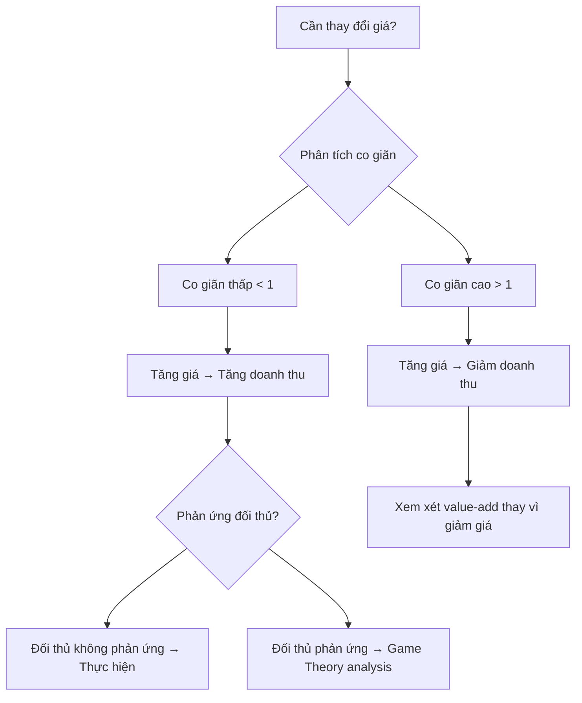

# F01 — Kinh Tế Học Doanh Nghiệp
> *Business Economics — Nền tảng tư duy ra quyết định dựa trên dữ liệu và nguyên lý kinh tế*

---

## 1. Learning Objectives

Sau khi hoàn thành module này, người học có thể:
- Phân tích cơ cấu thị trường và vị thế cạnh tranh của doanh nghiệp
- Ra quyết định định giá dựa trên co giãn cầu và cơ cấu chi phí
- Tư duy chiến lược qua lăng kính Game Theory
- Thiết kế hệ thống động lực (incentive) cho nhân viên và đối tác
- Đánh giá ngoại tác và vai trò của quy định nhà nước

---

## 2. Business Context

Kinh tế học không chỉ là lý thuyết học thuật — đây là **ngôn ngữ tư duy** của mọi nhà quản lý giỏi. Tất cả quyết định kinh doanh đều có thể được phân tích bằng các nguyên lý kinh tế:

- **Định giá:** Nên bán $X hay $Y? → Co giãn cầu
- **Mở rộng:** Sản xuất thêm hay không? → Chi phí biên
- **Cạnh tranh:** Đối thủ có phản ứng như thế nào? → Game Theory
- **Tuyển dụng:** Thưởng cố định hay thưởng theo doanh số? → Thiết kế cơ chế
- **Thuê ngoài:** Tự làm hay outsource? → Chi phí giao dịch (Coase)

**Tại Việt Nam:** Nhiều chủ doanh nghiệp SME ra quyết định theo cảm tính. Áp dụng kinh tế vi mô giúp chuyển từ "nghĩ có vẻ đúng" sang "biết chắc tại sao đúng".

---

## 3. Definitions

| Thuật ngữ | Định nghĩa | Ví dụ VN |
|-----------|-----------|---------|
| **Co giãn cầu (Price Elasticity of Demand)** | % thay đổi lượng cầu / % thay đổi giá | Cà phê Highlands: co giãn thấp; vé xe buýt: co giãn cao |
| **Chi phí cơ hội (Opportunity Cost)** | Giá trị của lựa chọn tốt nhất bị bỏ qua | Mở quán không phải chỉ tốn vốn — còn mất thu nhập nếu đi làm |
| **Chi phí biên (Marginal Cost)** | Chi phí tạo ra thêm 1 đơn vị sản phẩm | In thêm 1 hóa đơn: gần 0; tuyển thêm 1 kỹ sư: cao |
| **Thặng dư tiêu dùng (Consumer Surplus)** | Khoảng cách giữa WTP và giá thực trả | Khách mua laptop 15tr, sẵn sàng trả 20tr → thặng dư 5tr |
| **Thông tin bất cân xứng (Asymmetric Information)** | Một bên biết nhiều hơn bên kia | Người bán xe cũ biết lịch sử xe, người mua không biết |
| **Ngoại tác (Externality)** | Tác động lên bên thứ ba ngoài giao dịch | Nhà máy xả thải → chi phí cho cộng đồng |
| **Hàng hóa công (Public Good)** | Không loại trừ, không cạnh tranh | Đèn đường, phần mềm open source |
| **Nash Equilibrium** | Trạng thái không ai muốn đổi chiến lược đơn phương | Hai đối thủ cùng quảng cáo nhiều dù lãng phí |

---

## 4. Core Concepts

### 4.1 Cung — Cầu và Giá cân bằng

```
Giá
│          S (Cung)
│         /
│        /
│───────X──── Giá cân bằng
│      / \
│     /   D (Cầu)
│    /
└─────────── Sản lượng
```

**Các yếu tố dịch chuyển đường cầu:** Thu nhập, giá hàng liên quan, kỳ vọng, thị hiếu  
**Các yếu tố dịch chuyển đường cung:** Chi phí đầu vào, công nghệ, số lượng nhà sản xuất

### 4.2 Co giãn cầu — Công cụ định giá

```
Ed = (% ΔQ) / (% ΔP)

|Ed| > 1  → Co giãn cao  → Tăng giá làm giảm doanh thu
|Ed| < 1  → Co giãn thấp → Tăng giá làm tăng doanh thu
|Ed| = 1  → Co giãn đơn vị → Doanh thu không đổi
```

**Ứng dụng:** Sản phẩm luxury (Ed < 1) → có thể tăng giá. FMCG cạnh tranh cao (Ed > 1) → chiến tranh giá rất tốn kém.

### 4.3 Cơ cấu chi phí

```
Tổng chi phí = Chi phí cố định (FC) + Chi phí biến đổi (VC)

Break-even = FC / (Giá - VC đơn vị)
```

| Loại | Ví dụ | Ảnh hưởng chiến lược |
|------|-------|---------------------|
| **Chi phí cố định** | Thuê mặt bằng, lương quản lý, khấu hao | Đòn bẩy vận hành cao → rủi ro cao nhưng lợi nhuận biên cao |
| **Chi phí biến đổi** | Nguyên vật liệu, hoa hồng sales | Linh hoạt hơn theo doanh thu |
| **Chi phí chìm (Sunk Cost)** | Đã chi, không lấy lại được | **KHÔNG** đưa vào quyết định tương lai |

### 4.4 Cơ cấu thị trường

| Loại thị trường | Số người bán | Ví dụ VN | Hàm ý chiến lược |
|----------------|:------------:|---------|-----------------|
| Cạnh tranh hoàn hảo | Rất nhiều | Hàng nông sản | Price-taker, cạnh tranh về chi phí |
| Cạnh tranh độc quyền | Nhiều | Nhà hàng, café | Tạo sự khác biệt (differentiation) |
| Oligopoly | Ít | Viễn thông, ngân hàng | Quan sát đối thủ, tránh price war |
| Độc quyền | 1 | Điện, nước | Định giá cao, cần quy định |

### 4.5 Game Theory — Tư duy chiến lược

**Prisoner's Dilemma — Bài toán tù nhân:**
```
              Đối thủ: Im lặng  |  Đối thủ: Khai
Tôi: Im lặng  (-1, -1)           (-10, 0)
Tôi: Khai     (0, -10)           (-5, -5)  ← Nash Equilibrium
```

**Ứng dụng doanh nghiệp:**
- **Price War:** Cả hai cắt giá → cả hai thua (như Prisoner's Dilemma)
- **Quảng cáo:** Nếu đối thủ quảng cáo nhiều → buộc phải quảng cáo nhiều
- **Giải pháp:** Tín hiệu rõ ràng, xây dựng uy tín, hợp tác (trong khuôn khổ pháp luật)

### 4.6 Thiết kế cơ chế và vấn đề Principal-Agent

```
Principal (Chủ sở hữu/CEO)
    ↓ ủy quyền
Agent (Nhân viên/Nhà thầu)
    ↓ hành động
Kết quả (có thể quan sát được)
```

**Vấn đề:** Agent có thông tin riêng và có thể hành động vì lợi ích bản thân.  
**Giải pháp:** Thiết kế incentive gắn lợi ích Agent với Principal:
- **Output-based:** Hoa hồng sales, thưởng KPI
- **Equity:** Cổ phần, ESOP
- **Monitoring:** Báo cáo định kỳ, KPI dashboard

---

## 5. Business Value

Kinh tế học cung cấp **khung tư duy có thể áp dụng ngay** vào:

| Quyết định | Nguyên lý áp dụng | Giá trị tạo ra |
|-----------|------------------|---------------|
| Định giá sản phẩm | Co giãn cầu, Willingness to Pay | Tăng doanh thu 10-30% |
| Chính sách lương thưởng | Principal-Agent, Incentive design | Giảm turnover, tăng năng suất |
| Chiến lược cạnh tranh | Game Theory, cơ cấu thị trường | Tránh price war, giữ margin |
| Mở rộng sản xuất | Chi phí biên, Break-even | Quyết định đúng timing |
| Thuê ngoài vs tự làm | Chi phí giao dịch (Coase) | Tối ưu chi phí cơ cấu |

---

## 6. Enterprise Role

- **CEO/COO:** Dùng cơ cấu thị trường để định vị; Game Theory để phân tích đối thủ
- **CFO:** Chi phí biên, break-even để quyết định đầu tư
- **CMO/Pricing team:** Co giãn cầu để thiết kế chiến lược giá
- **CHRO:** Thiết kế incentive system cho các phòng ban
- **Strategy team:** Porter's Five Forces (ứng dụng của kinh tế IO)

---

## 7. Departments Related

Sales · Marketing · Finance · HR · Strategy · Operations · R&D

---

## 8. Input

- Dữ liệu doanh thu và giá bán lịch sử
- Báo cáo chi phí (cố định / biến đổi)
- Thông tin cạnh tranh (giá đối thủ, thị phần)
- Survey khách hàng (WTP, NPS)
- Báo cáo thị trường (ngành)

---

## 9. Output

- Phân tích co giãn cầu → khuyến nghị định giá
- Break-even analysis → quyết định mở rộng
- Competitor analysis matrix → chiến lược phản ứng
- Incentive design → chính sách lương thưởng

---

## 10. Business Process

```
1. Thu thập dữ liệu thị trường và nội bộ
2. Xác định cơ cấu thị trường (loại hình cạnh tranh)
3. Phân tích co giãn cầu (regression hoặc A/B test giá)
4. Tính break-even và chi phí biên
5. Phân tích đối thủ qua lăng kính Game Theory
6. Đề xuất chiến lược giá / cạnh tranh / incentive
7. Theo dõi kết quả và điều chỉnh
```

---

## 11. Data Flow

```
Dữ liệu bán hàng (ERP/CRM)
        ↓
Phân tích co giãn (BI tool)
        ↓
Price recommendation
        ↓
Thử nghiệm A/B / pilot
        ↓
Đo lường tác động doanh thu
```

---

## 12. Money Flow

Ứng dụng trực tiếp vào dòng tiền qua:
- **Định giá tối ưu** → tăng Revenue
- **Break-even analysis** → giảm rủi ro đầu tư
- **Incentive design** → kiểm soát Chi phí nhân sự
- **Outsourcing decision** → tối ưu COGS

---

## 13. Document Flow

```
Market research report
→ Pricing analysis memo
→ Board decision paper
→ Sales policy update
→ KPI dashboard update
```

---

## 14. Roles

| Vai trò | Trách nhiệm |
|---------|------------|
| CEO / Strategy Lead | Xác định cơ cấu thị trường, phê duyệt chiến lược giá |
| CFO | Break-even, phân tích chi phí cơ hội |
| Pricing Manager | Phân tích co giãn, đề xuất price points |
| CHRO | Thiết kế hệ thống incentive |
| Data Analyst | Chạy regression, cung cấp dữ liệu co giãn |

---

## 15. Responsibilities

- **Quyết định cuối:** CEO/BOD
- **Phân tích:** Finance + Strategy team
- **Triển khai:** Sales + HR + Operations
- **Theo dõi:** Data Analyst + CFO

---

## 16. RACI

| Hoạt động | CEO | CFO | CMO | CHRO | Analyst |
|-----------|:---:|:---:|:---:|:----:|:-------:|
| Phân tích co giãn | I | C | A | - | R |
| Quyết định giá | A | C | R | - | I |
| Thiết kế incentive | A | C | - | R | I |
| Break-even analysis | I | A | - | - | R |

---

## 17. Frameworks

- **Demand-Supply Model** — Cân bằng thị trường
- **Porter's Five Forces** — Ứng dụng kinh tế IO
- **Game Theory** — Tư duy chiến lược cạnh tranh
- **Principal-Agent Theory** — Thiết kế tổ chức
- **Transaction Cost Economics (Coase)** — Make vs Buy
- **Behavioral Economics (Kahneman)** — Ra quyết định thực tế

---

## 18. International Standards

- **OECD Transfer Pricing Guidelines** — Liên quan đến chi phí giao dịch nội bộ
- **Competition Law (EU, US)** — Chống độc quyền, Price fixing
- **WTO principles** — Thương mại quốc tế và externalities
- **Behavioral economics** — Thể hiện trong IFRS (giá trị hợp lý, impairment)

---

## 19. Vietnam Context

**Cơ cấu thị trường tại VN:**
- Viễn thông: Oligopoly (Viettel, Mobifone, Vinaphone) — giá tương đồng
- Ngân hàng: Regulated oligopoly — lãi suất ít biến động
- Bán lẻ: Chuyển từ fragmented → tập trung (WinMart, Co.opmart)
- F&B: Cạnh tranh độc quyền cực cao — brand và trải nghiệm là chìa khóa

**Đặc thù hành vi người tiêu dùng VN:**
- Nhạy cảm giá cao (co giãn cao) trong FMCG
- Brand loyalty thấp hơn các nước phát triển
- Mạng xã hội ảnh hưởng lớn đến WTP (viral marketing)

**Thông tin bất cân xứng:**
- Phổ biến trong BĐS, xe cũ, vật tư y tế
- → Cơ hội cho các platform tạo niềm tin (PropTech, HealthTech)

---

## 20. Legal Considerations

- **Luật Cạnh Tranh 2018:** Cấm thỏa thuận giá, lạm dụng vị thế thống lĩnh
- **Nghị Định 116/2024:** Quy định kiểm soát giá một số mặt hàng thiết yếu
- **Pháp lệnh Giá:** Nhà nước kiểm soát giá điện, nước, xăng dầu
- **Luật Bảo vệ Người tiêu dùng 2023:** Không được quảng cáo gian lận về giá

---

## 21. Common Mistakes

1. **Sunk cost fallacy:** Tiếp tục đầu tư vào dự án thua lỗ vì "đã đổ tiền rồi"
2. **Bỏ qua chi phí cơ hội:** Chỉ tính chi phí trực tiếp, không tính cơ hội bỏ lỡ
3. **Định giá theo chi phí (cost-plus):** Bỏ qua WTP và co giãn của khách hàng
4. **Nghĩ cạnh tranh là zero-sum:** Nhiều tình huống có thể win-win (xem Game Theory)
5. **Thiết kế incentive ngắn hạn:** Thưởng doanh thu → nhân viên bán hàng ép khách → churn cao
6. **Bỏ qua externalities:** Không tính chi phí môi trường, xã hội → rủi ro pháp lý, CSR

---

## 22. Best Practices

- Phân tích co giãn cầu trước khi thay đổi giá (A/B test hoặc regression)
- Phân biệt rõ FC và VC trong mọi quyết định mở rộng
- Thiết kế incentive gắn với **kết quả dài hạn**, không chỉ ngắn hạn
- Dùng Game Theory để **dự đoán phản ứng đối thủ** trước khi ra quyết định
- Tính **chi phí cơ hội** trong mọi quyết định make-vs-buy hoặc đầu tư

---

## 23. KPIs

| KPI | Công thức | Mục tiêu tốt |
|-----|-----------|-------------|
| **Gross Margin %** | (Doanh thu - GVHB) / Doanh thu | > 30% (dịch vụ), > 15% (FMCG) |
| **Contribution Margin** | Doanh thu - VC | Dương và đủ bù FC |
| **Break-even Revenue** | FC / CM% | Càng thấp càng tốt |
| **Price Elasticity** | %ΔQ / %ΔP | Biết được để định giá đúng |
| **Revenue per Employee** | Doanh thu / Số nhân viên | Tăng theo thời gian |

---

## 24. Metrics

- Thị phần (Market Share) và xu hướng
- Price Realization (giá thực nhận / giá niêm yết)
- Customer Acquisition Cost (CAC) và Lifetime Value (LTV)
- Herfindahl-Hirschman Index (HHI) — đo lường tập trung thị trường

---

## 25. Reports

- **Pricing Analysis Report:** Co giãn cầu + price recommendation
- **Competitive Landscape Report:** Cơ cấu thị trường + đối thủ
- **Break-even Analysis:** Theo sản phẩm / kênh / phân khúc
- **Incentive Effectiveness Review:** Đánh giá tác động của chính sách lương thưởng

---

## 26. Templates

Xem [23-templates/](../../23-templates/):
- `RACI_TEMPLATE.md` — cho quyết định pricing
- `RISK_REGISTER_TEMPLATE.md` — rủi ro thị trường

---

## 27. Checklists

**Trước khi thay đổi giá:**
- [ ] Đã ước tính co giãn cầu?
- [ ] Đã dự đoán phản ứng của đối thủ?
- [ ] Đã tính tác động đến contribution margin?
- [ ] Đã kiểm tra ràng buộc pháp lý về giá?
- [ ] Đã có kế hoạch rollback nếu thất bại?

**Trước khi thiết kế incentive:**
- [ ] Đã xác định rõ hành vi muốn khuyến khích?
- [ ] Incentive có đo lường được không?
- [ ] Có rủi ro gaming (gian lận chỉ số) không?
- [ ] Cân bằng ngắn hạn và dài hạn?
- [ ] Tuân thủ Bộ Luật Lao Động 2019?

---

## 28. SOP

**Quy trình phân tích co giãn cầu (rút gọn):**
1. Thu thập dữ liệu giá và doanh số (ít nhất 12 tháng)
2. Kiểm soát yếu tố ngoại lai (mùa vụ, khuyến mãi)
3. Chạy regression đơn giản: ln(Q) = a + b × ln(P)
4. Hệ số b = Price Elasticity
5. Kiểm tra ý nghĩa thống kê (p-value < 0.05)
6. Diễn giải và trình bày khuyến nghị

---

## 29. Case Study

**Grab vs Be — Chiến tranh giá và Game Theory:**

Năm 2019-2020, Grab và Be liên tục khuyến mãi giảm giá. Đây là Prisoner's Dilemma điển hình:
- Nếu cả hai đều không khuyến mãi → cả hai có lợi nhuận
- Nhưng nếu Be không KM mà Grab KM → Grab chiếm thị phần
- Kết quả: Cả hai đều KM → cả hai đốt cash

**Bài học:** Price war là "chiến thắng Pyrrhic". Grab thoát được bằng cách tạo ecosystem (GrabFood, GrabPay, GrabMart) — **tăng switching cost**, giảm co giãn của khách hàng.

---

## 30. Small Business Example

**Tiệm cà phê tại Hà Nội — Quyết định tăng giá:**

Chủ tiệm muốn tăng giá Americano từ 45k → 55k (+22%). Câu hỏi: Doanh thu có tăng không?

Phân tích:
- Dữ liệu: Khi KM -20% (36k), lượng bán tăng 15%
- Co giãn ước tính: 15% / 20% ≈ 0.75 (co giãn thấp < 1)
- → Tăng giá sẽ **tăng doanh thu**
- Contribution margin mới: 55k - 15k (VC) = 40k (thay vì 30k)

**Quyết định:** Tăng giá, đồng thời nâng cấp không gian để giảm thêm co giãn.

---

## 31. Enterprise Example

**Masan Consumer — Chiến lược định giá Chinsu:**

Masan phân tích rằng tương ớt Chinsu có co giãn thấp (thói quen tiêu dùng, brand loyalty). Họ tăng giá 3 lần trong 5 năm mà volume chỉ giảm nhẹ → **doanh thu và margin tăng đáng kể**.

Đồng thời, Masan thiết kế **incentive cho kênh phân phối** theo doanh số tăng thêm (incremental) thay vì tổng doanh số → tránh gaming, tập trung vào growth.

---

## 32. ERP Mapping

| Phân tích | Module ERP | Dữ liệu cần |
|-----------|-----------|-------------|
| Co giãn cầu | SD (Sales & Distribution) | Lịch sử giá, lượng bán |
| Break-even | CO (Controlling) | FC, VC theo cost center |
| Incentive tracking | HR (Payroll) + SD | Doanh số cá nhân, thưởng |
| Competitor pricing | Không có sẵn | Cần external data source |

---

## 33. Automation Opportunities

- **Tự động hóa phân tích co giãn:** Python script chạy regression hàng tuần
- **Dynamic pricing:** Thuật toán điều chỉnh giá theo demand real-time (áp dụng cho e-commerce, gig economy)
- **Incentive calculation:** ERP tự tính thưởng theo công thức đã thiết lập

---

## 34. AI Opportunities

- **Demand forecasting:** ML dự báo cầu chính xác hơn → tối ưu tồn kho
- **Price optimization:** RL (Reinforcement Learning) tìm giá tối ưu real-time
- **Churn prediction:** Dự đoán khách hàng nhạy cảm giá → pricing cá nhân hóa
- **Incentive design assistant:** AI đề xuất cơ cấu thưởng tối ưu theo mục tiêu

---

## 35. Implementation Guide

**Tuần 1-2:** Đào tạo management team về co giãn và chi phí cơ hội  
**Tuần 3-4:** Thu thập và làm sạch dữ liệu giá + doanh số  
**Tháng 2:** Phân tích co giãn, xác định nhóm sản phẩm theo sensitivity  
**Tháng 3:** Pilot pricing changes trên 1 kênh/khu vực  
**Tháng 4+:** Roll out và thiết lập process review định kỳ

---

## 36. Consulting Guide

**Câu hỏi chẩn đoán:**
1. Công ty định giá theo cost-plus, theo thị trường, hay theo value?
2. Ban lãnh đạo có biết co giãn cầu của sản phẩm chủ lực không?
3. Cơ chế incentive có gắn với kết quả dài hạn không hay chỉ doanh số tháng?
4. Khi đối thủ giảm giá, công ty phản ứng ra sao? Có phân tích trước không?

**Red flags:**
- "Chúng tôi định giá bằng giá đối thủ + 5%" → thiếu value-based pricing
- Incentive chỉ dựa trên doanh số tháng → short-termism
- Không có dữ liệu lịch sử giá → không thể phân tích

---

## 37. Diagnostic Questions

Cho ban lãnh đạo khi review:
1. Sản phẩm nào có contribution margin cao nhất? Chúng ta có ưu tiên nó không?
2. Khi nào lần cuối chúng ta phân tích co giãn cầu?
3. Break-even của từng dòng sản phẩm là bao nhiêu?
4. Hệ thống thưởng hiện tại có tạo ra hành vi gì không mong muốn không?
5. Chúng ta có đang "đốt" margin vì sợ mất thị phần không?

---

## 38. Interview Questions

**Cho ứng viên Pricing / Strategy:**
- "Bạn sẽ quyết định tăng giá sản phẩm như thế nào? Cần dữ liệu gì?"
- "Mô tả một tình huống Price War. Bạn xử lý ra sao?"
- "Chi phí cơ hội của việc mở thêm 1 cửa hàng là gì?"

**Cho ứng viên Finance:**
- "Break-even analysis là gì? Khi nào dùng?"
- "Tại sao sunk cost không nên đưa vào quyết định?"

---

## 39. Exercises

**Bài tập 1:** Tính co giãn cầu từ dữ liệu sau:
- Tháng 1: Giá 100k, bán 500 sp
- Tháng 2: Giá 120k, bán 400 sp
- Hỏi: Nếu tăng lên 130k, doanh thu tăng hay giảm?

**Bài tập 2:** Phân tích tình huống:
Công ty A và B cùng bán smartphone tầm trung. A đang cân nhắc tung khuyến mãi 10%. Hãy dùng Game Theory để phân tích các kịch bản.

**Bài tập 3:** Thiết kế incentive cho team sales 10 người, mục tiêu:
- Tăng doanh thu 20%
- Giảm churn khách hàng 5%
- Không tạo ra hành vi bán ép

---

## 40. References

- **Sách:** *Microeconomics* — Pindyck & Rubinfeld; *Thinking Strategically* — Dixit & Nalebuff
- **VN:** *Giáo trình Kinh tế Vi mô* — ĐH Kinh tế Quốc dân; *Luật Cạnh Tranh 2018*
- **Online:** MRUniversity.com (Marginal Revolution) — miễn phí, thực hành
- **Chuẩn:** OECD Guidelines on Competition Policy

---

## Output Formats

### Mermaid Diagram — Khung quyết định định giá


### ASCII Diagram — Cơ cấu thị trường
```
NHIỀU người bán                              ÍT người bán
│                                                       │
Cạnh tranh         Cạnh tranh         Oligopoly    Độc quyền
hoàn hảo           độc quyền
│                  │                  │                 │
Giá = MC           Giá > MC           Giá > MC          Giá >> MC
Lợi nhuận = 0      Lợi nhuận ổn       Lợi nhuận cao     Lợi nhuận cao nhất
Gạo, rau           Café, nhà hàng     Telco, bank       Điện, nước
```

### Mindmap
```
Kinh Tế Học Doanh Nghiệp
├── Cung & Cầu
│   ├── Giá cân bằng
│   ├── Co giãn cầu
│   └── Thặng dư tiêu dùng
├── Chi phí
│   ├── Cố định vs Biến đổi
│   ├── Chi phí biên
│   ├── Chi phí cơ hội
│   └── Sunk cost
├── Cơ cấu thị trường
│   ├── Cạnh tranh hoàn hảo
│   ├── Độc quyền nhóm
│   └── Độc quyền
├── Game Theory
│   ├── Nash Equilibrium
│   ├── Prisoner's Dilemma
│   └── First-mover advantage
└── Thiết kế cơ chế
    ├── Principal-Agent
    ├── Incentive design
    └── Thông tin bất cân xứng
```

### Flashcards
```
Q: Co giãn cầu |Ed| < 1 có nghĩa là gì?
A: Cầu co giãn thấp — tăng giá sẽ tăng doanh thu.
   Ví dụ: thuốc, điện, hàng luxury có brand mạnh.

Q: Nash Equilibrium là gì?
A: Trạng thái mà không ai muốn đơn phương thay đổi chiến lược.
   Ví dụ: hai hãng đều quảng cáo nhiều dù tốn kém.

Q: Tại sao sunk cost không được đưa vào quyết định?
A: Vì nó đã xảy ra và không thể thu hồi.
   Quyết định chỉ nên dựa trên chi phí và lợi ích TỪ ĐÂY VỀ SAU.

Q: Principal-Agent problem là gì?
A: Xung đột lợi ích giữa người ủy quyền (principal) và người được ủy quyền (agent).
   Giải pháp: thiết kế incentive gắn lợi ích hai bên.
```

### Cheat Sheet
```
═══════════════════════════════════════════
         ECONOMICS CHEAT SHEET
═══════════════════════════════════════════
CO GIÃN CẦU
  |Ed| > 1 → co giãn cao → tăng giá, giảm doanh thu
  |Ed| < 1 → co giãn thấp → tăng giá, tăng doanh thu
  Công thức: Ed = (%ΔQ) / (%ΔP)

BREAK-EVEN
  BEP (units) = FC / (P - VC per unit)
  BEP (revenue) = FC / CM%
  CM% = (P - VC) / P

GAME THEORY
  Dominant strategy: tốt hơn bất kể đối thủ làm gì
  Nash Eq: không ai muốn đổi chiến lược đơn phương
  → Tránh price war bằng differentiation

INCENTIVE DESIGN
  ✓ Gắn với kết quả đo được
  ✓ Cân bằng ngắn hạn + dài hạn
  ✗ Đừng thưởng thứ không muốn
═══════════════════════════════════════════
```

### FAQ
**Q: Tôi không học kinh tế — module này có cần thiết không?**
A: Có. Mọi quyết định kinh doanh đều là kinh tế học ứng dụng. Chỉ cần 5 khái niệm cốt lõi: chi phí cơ hội, co giãn cầu, chi phí biên, Game Theory, incentive design.

**Q: Co giãn cầu tính thế nào nếu không có dữ liệu đủ tốt?**
A: Bắt đầu với survey WTP (Willingness to Pay), Van Westendorp price sensitivity meter, hoặc A/B test nhỏ trên một kênh.

**Q: Game Theory có áp dụng được cho SME không?**
A: Có. Đặc biệt khi có 2-3 đối thủ chính trong cùng khu vực. Câu hỏi đơn giản: "Nếu tôi làm X, đối thủ sẽ làm gì?"

### Glossary
Xem [25-glossary/by-domain/GLOSSARY_STRATEGY_CONSULTING.md](../../25-glossary/by-domain/GLOSSARY_STRATEGY_CONSULTING.md)

### JSON Metadata
```json
{
  "module_code": "F01",
  "module_name": "Kinh Tế Học Doanh Nghiệp",
  "domain": "Foundation",
  "level": "Foundation",
  "version": "1.0",
  "status": "complete",
  "prerequisites": [],
  "related_modules": ["F02", "F03", "S01", "FI01", "FI04"],
  "learning_time_hours": 8,
  "key_frameworks": ["Demand-Supply", "Elasticity", "Game Theory", "Principal-Agent", "COSO"],
  "key_standards": ["Luật Cạnh Tranh 2018", "OECD Competition Guidelines"],
  "vietnam_specific": true,
  "tags": ["pricing", "competition", "incentive", "cost-analysis", "strategy"]
}
```
