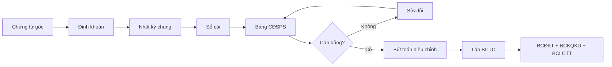

# F02 — Kế Toán Căn Bản
> *Accounting Basics — Ngôn ngữ tài chính của doanh nghiệp: từ bút toán đến báo cáo*

---

## 1. Learning Objectives

Sau khi hoàn thành module này, người học có thể:
- Hiểu và áp dụng nguyên tắc kế toán kép (double-entry)
- Đọc và hiểu 3 báo cáo tài chính cơ bản (BCĐKT, BCKQKD, BCLCTT)
- Ghi nhận các giao dịch phổ biến theo chuẩn VAS (Thông tư 200)
- Phân biệt kế toán tiền mặt và kế toán dồn tích
- Hiểu chu trình kế toán từ đầu vào đến báo cáo

---

## 2. Business Context

Kế toán là **hệ thống đo lường** hoạt động kinh doanh. Nếu kinh doanh là cơ thể, kế toán là xét nghiệm máu — cho biết tình trạng sức khỏe chính xác.

**Tại sao CEO/COO cần hiểu kế toán:**
- Đọc được P&L để biết lợi nhuận đến từ đâu
- Hiểu bảng cân đối để biết tài sản có được tài trợ tốt không
- Phát hiện sớm rủi ro gian lận hoặc kế toán sáng tạo
- Nói chuyện được với auditor, ngân hàng, nhà đầu tư

**Tại Việt Nam:** SME thường giao phó hoàn toàn cho kế toán thuê ngoài và không hiểu số liệu. Điều này dẫn đến quyết định sai hoặc bị kế toán "che giấu" vấn đề.

---

## 3. Definitions

| Thuật ngữ | Định nghĩa |
|-----------|-----------|
| **Kế toán kép (Double-entry)** | Mỗi giao dịch ghi vào ít nhất 2 tài khoản (Nợ và Có) với tổng bằng nhau |
| **Tài khoản (Account)** | Đơn vị ghi chép theo từng loại tài sản, nợ phải trả hoặc vốn chủ |
| **Nợ (Debit)** | Bên trái của bút toán — tăng tài sản/chi phí, giảm nợ/doanh thu |
| **Có (Credit)** | Bên phải của bút toán — tăng nợ/doanh thu/vốn, giảm tài sản/chi phí |
| **Bút toán (Journal Entry)** | Ghi chép giao dịch vào Nhật ký chung |
| **Sổ cái (General Ledger)** | Tập hợp tất cả tài khoản và số dư |
| **Bảng cân đối số phát sinh** | Kiểm tra cân bằng Nợ = Có trước khi lập báo cáo |
| **Dồn tích (Accrual)** | Ghi nhận doanh thu/chi phí khi phát sinh, không phải khi thu/chi tiền |
| **VAS** | Vietnam Accounting Standards — chuẩn mực kế toán Việt Nam (Thông tư 200) |

---

## 4. Core Concepts

### 4.1 Phương trình kế toán cơ bản

```
TÀI SẢN = NỢ PHẢI TRẢ + VỐN CHỦ SỞ HỮU
Assets   =  Liabilities  +  Equity

Ví dụ:
Tiền mặt 100tr = Vay NH 60tr + Vốn chủ 40tr
```

**Nguyên tắc vàng:** Phương trình LUÔN phải cân bằng sau mỗi giao dịch.

### 4.2 Kế toán kép — Double-Entry

```
MỖI GIAO DỊCH = 2 bút toán đối ứng (Nợ = Có)

Ví dụ: Mua hàng hóa 10tr, trả tiền mặt:
  Nợ TK 156 (Hàng hóa):     10,000,000
    Có TK 111 (Tiền mặt):                10,000,000
```

**Quy tắc tăng/giảm:**
```
                DEBIT (Nợ)        CREDIT (Có)
Tài sản         Tăng ↑            Giảm ↓
Nợ phải trả     Giảm ↓            Tăng ↑
Vốn chủ         Giảm ↓            Tăng ↑
Doanh thu       Giảm ↓            Tăng ↑
Chi phí         Tăng ↑            Giảm ↓
```

### 4.3 Hệ thống tài khoản VAS (Thông tư 200)

```
LOẠI 1: Tài sản ngắn hạn (111-158)
  111 - Tiền mặt
  112 - Tiền gửi NH
  131 - Phải thu khách hàng (AR)
  156 - Hàng hóa

LOẠI 2: Tài sản dài hạn (211-243)
  211 - Tài sản cố định hữu hình
  241 - Xây dựng cơ bản dở dang

LOẠI 3: Nợ phải trả (311-353)
  311 - Vay ngắn hạn NH
  331 - Phải trả người bán (AP)
  333 - Thuế và khoản nộp NN

LOẠI 4: Vốn chủ sở hữu (411-421)
  411 - Vốn đầu tư của chủ sở hữu
  421 - Lợi nhuận sau thuế chưa phân phối

LOẠI 5: Doanh thu (511-515)
  511 - Doanh thu bán hàng

LOẠI 6: Chi phí (611-642)
  621 - Nguyên vật liệu trực tiếp
  622 - Nhân công trực tiếp
  641 - Chi phí bán hàng
  642 - Chi phí quản lý doanh nghiệp

LOẠI 9: Xác định KQKD (911)
```

### 4.4 Chu trình kế toán

```
Giao dịch phát sinh
      ↓
Bút toán (Journal Entry) → Nhật ký chung
      ↓
Đăng lên Sổ cái (General Ledger)
      ↓
Bảng cân đối số phát sinh (Trial Balance)
      ↓
Bút toán điều chỉnh (khấu hao, dự phòng, phân bổ)
      ↓
Lập Báo cáo Tài chính
      ↓
Bút toán kết chuyển (Closing Entries)
      ↓
Kỳ kế toán tiếp theo
```

### 4.5 Ba báo cáo tài chính cơ bản

**Bảng Cân Đối Kế Toán (tại một thời điểm)**
```
TÀI SẢN                    NỢ PHẢI TRẢ & VCSH
─────────────────────────────────────────────────
A. Tài sản ngắn hạn  xxx   I. Nợ phải trả     xxx
   Tiền & tương đương          Nợ ngắn hạn     xxx
   Phải thu ngắn hạn           Nợ dài hạn      xxx
   Hàng tồn kho
   TSNH khác               II. Vốn chủ SH     xxx
                               Vốn góp
B. Tài sản dài hạn   xxx      Lợi nhuận để lại
   TSCĐ hữu hình/vô hình
─────────────────────────────────────────────────
TỔNG TÀI SẢN         xxx   TỔNG NỢ & VCSH    xxx
```

**Báo Cáo Kết Quả KD (trong một kỳ)**
```
Doanh thu thuần                     xxx
- Giá vốn hàng bán (GVHB/COGS)    (xxx)
= Lợi nhuận gộp (Gross Profit)      xxx
- Chi phí bán hàng                 (xxx)
- Chi phí QLDN                     (xxx)
= EBIT (Lợi nhuận từ HĐ KD)        xxx
± Thu nhập/Chi phí tài chính       (xxx)
= EBT (Lợi nhuận trước thuế)        xxx
- CIT (Thuế TNDN 20%)              (xxx)
= Net Income (Lợi nhuận sau thuế)   xxx
```

**Báo Cáo Lưu Chuyển Tiền Tệ**
```
I. Dòng tiền từ HĐ KD (Operating)   xxx
II. Dòng tiền từ đầu tư (Investing) (xxx)
III. Dòng tiền từ TC (Financing)     xxx
= Tăng/giảm tiền thuần              xxx
+ Tiền đầu kỳ                       xxx
= Tiền cuối kỳ                      xxx
```

### 4.6 Kế toán tiền mặt vs Dồn tích

| | Cash Basis | Accrual Basis |
|--|-----------|--------------|
| Ghi nhận | Khi thu/chi tiền | Khi phát sinh quyền/nghĩa vụ |
| VD doanh thu | Nhận tiền mới ghi | Giao hàng xong là ghi |
| VN pháp lý | Không được phép | Bắt buộc theo Thông tư 200 |
| Ưu điểm | Đơn giản | Phản ánh đúng kinh tế |

---

## 5. Business Value

| Ai dùng | Mục đích |
|---------|---------|
| CEO | Đọc P&L hàng tháng, phát hiện vấn đề margin |
| CFO | Lập báo cáo, kiểm soát accuracy |
| Ngân hàng | Đánh giá khả năng trả nợ |
| Nhà đầu tư | Định giá công ty |
| Cơ quan thuế | Tính CIT, VAT |

---

## 6. Enterprise Role

- **Kế toán viên:** Thực hiện bút toán hàng ngày
- **Kế toán trưởng:** Phê duyệt bút toán, lập BCTC, ký duyệt
- **CFO:** Review BCTC, đảm bảo chất lượng reporting, tuân thủ
- **CEO/COO:** Đọc và hành động dựa trên BCTC

---

## 7. Departments Related

Finance · Accounting · Tax · Internal Audit · Operations · Sales · Procurement

---

## 8. Input

- Hóa đơn mua/bán hàng (hóa đơn điện tử theo NĐ 123/2020)
- Phiếu thu, phiếu chi, giấy báo ngân hàng
- Hợp đồng kinh tế
- Biên bản kiểm kê tài sản
- Bảng lương, bảng phân bổ khấu hao

---

## 9. Output

- Nhật ký chung, sổ cái
- Bảng cân đối số phát sinh
- Báo cáo tài chính (BCĐKT, BCKQKD, BCLCTT, Thuyết minh)
- Tờ khai thuế (CIT, VAT, PIT)

---

## 10. Business Process

```
1. Thu thập chứng từ gốc (invoice, receipt, contract)
2. Kiểm tra tính hợp lệ của chứng từ
3. Định khoản (xác định TK Nợ/Có)
4. Nhập liệu vào phần mềm (MISA, Fast, SAP, Odoo)
5. Đối chiếu số dư với thực tế (bank rec, stocktake)
6. Bút toán điều chỉnh cuối kỳ
7. Lập báo cáo tài chính
8. Nộp tờ khai thuế
```

---

## 11. Data Flow

```
Hóa đơn/Chứng từ → Phần mềm kế toán
                  → Sổ cái → Bảng CĐSPS
                  → Báo cáo tài chính
                  → Cơ quan thuế | Ngân hàng | CEO | Auditor
```

---

## 12. Money Flow

- **Thu:** AR → thu tiền → tài khoản ngân hàng
- **Chi:** AP → thanh toán → tài khoản ngân hàng
- Kế toán theo dõi từng giao dịch, đảm bảo không thất thoát

---

## 13. Document Flow

```
Hóa đơn mua → Kế toán (kiểm tra, định khoản)
            → CFO phê duyệt (trên ngưỡng)
            → Nhập sổ → Thanh toán
            → Lưu trữ tối thiểu 10 năm (Luật KT 2015)
```

---

## 14. Roles

| Vai trò | Trách nhiệm |
|---------|------------|
| Kế toán AR | Theo dõi công nợ phải thu, đôn đốc thu hồi |
| Kế toán AP | Theo dõi công nợ phải trả, thanh toán đúng hạn |
| Kế toán kho | Quản lý tồn kho, tính giá vốn |
| Kế toán thuế | Khai báo và nộp CIT, VAT, PIT |
| Kế toán trưởng | Review, ký duyệt BCTC, tuân thủ pháp lý |

---

## 15. Responsibilities

- Đảm bảo tính chính xác của số liệu kế toán
- Tuân thủ VAS và quy định pháp luật
- Bảo mật thông tin tài chính
- Lưu trữ chứng từ đúng quy định

---

## 16. RACI

| Hoạt động | CEO | CFO/KT trưởng | KT viên | Auditor |
|-----------|:---:|:-------------:|:-------:|:-------:|
| Định khoản | I | C | R | - |
| Lập BCTC | I | A | R | - |
| Review BCTC | A | R | I | C |
| Kiểm toán | I | C | I | R |
| Nộp thuế | I | A | R | - |

---

## 17. Frameworks

- **VAS (Vietnam Accounting Standards)** — Thông tư 200
- **IFRS** — Chuẩn mực quốc tế (IAS 1, IAS 7, IFRS 15)
- **Double-Entry Bookkeeping** — Nguyên tắc cơ bản
- **Accrual Accounting** — Nguyên tắc ghi nhận

---

## 18. International Standards

- **IFRS:** IAS 1 (Trình bày BCTC), IAS 7 (Dòng tiền), IAS 16 (TSCĐ), IFRS 15 (Doanh thu)
- **GAAP US:** ASC 606 (Revenue Recognition)
- **VAS:** 26 chuẩn mực kế toán Việt Nam
- **Luật Kế toán 2015:** Khung pháp lý cao nhất tại VN

---

## 19. Vietnam Context

- **Thông tư 200:** Áp dụng cho doanh nghiệp lớn và vừa
- **Thông tư 133:** Áp dụng cho doanh nghiệp nhỏ và siêu nhỏ
- **Hóa đơn điện tử:** Bắt buộc từ 01/07/2022 (NĐ 123/2020)
- **Phần mềm phổ biến:** MISA, Fast, Bravo, SAP B1, Odoo
- **Kỳ kế toán:** 1/1–31/12 (mặc định) hoặc năm tài chính riêng (cần đăng ký)
- **Tiền tệ:** VND; giao dịch ngoại tệ quy đổi theo tỷ giá NHNN
- **Kiểm toán bắt buộc:** Công ty FDI, niêm yết, ngân hàng, bảo hiểm

---

## 20. Legal Considerations

- **Luật Kế toán 2015:** Hành nghề kế toán, lưu trữ 10 năm
- **Thông tư 200/2014/TT-BTC:** Chế độ kế toán doanh nghiệp
- **NĐ 123/2020/NĐ-CP:** Hóa đơn điện tử
- **Phạt:** Ghi chép sai, không lưu chứng từ → phạt tiền + thu hồi chứng chỉ

---

## 21. Common Mistakes

1. **Lẫn lộn tiền mặt và lợi nhuận:** Có lợi nhuận nhưng thiếu tiền (AR chưa thu)
2. **Không ghi chi phí dồn tích:** Lương tháng 12 chưa trả → quên đưa vào chi phí
3. **Định khoản sai TSCĐ:** Mua máy móc ghi vào chi phí ngay (thay vì khấu hao)
4. **Trộn tài khoản cá nhân và công ty:** Rất phổ biến ở SME Việt Nam
5. **Không đối chiếu ngân hàng:** Số dư sổ sách ≠ sao kê ngân hàng
6. **Hóa đơn không hợp lệ:** Không được khấu trừ VAT đầu vào
7. **Ghi nhận doanh thu sai thời điểm:** Nhận tiền đặt cọc ghi vào doanh thu ngay

---

## 22. Best Practices

- Đối chiếu ngân hàng (bank reconciliation) hàng tháng, không chờ năm
- Phân quyền: người lập phiếu ≠ người phê duyệt ≠ người thanh toán (SoD)
- Dùng phần mềm kế toán — không dùng Excel làm sổ cái chính
- Lập báo cáo quản trị hàng tháng (không chờ BCTC pháp lý hàng năm)
- Kiểm kê tồn kho ít nhất 1 lần/năm

---

## 23. KPIs

| KPI | Mục tiêu |
|-----|---------|
| **Closing time** | < 5 ngày làm việc sau khi kết thúc tháng |
| **DSO (Days Sales Outstanding)** | < ngưỡng ngành (thường < 45 ngày) |
| **DPO (Days Payable Outstanding)** | Tối ưu theo thỏa thuận NCC |
| **Restatement rate** | 0 lần/năm |
| **Invoice accuracy rate** | > 99% |

---

## 24. Metrics

- Số bút toán điều chỉnh / kỳ (càng ít càng tốt)
- Tỷ lệ chứng từ điện tử / tổng chứng từ (mục tiêu 100%)
- Reconciliation completion rate
- Audit findings count (hàng năm)

---

## 25. Reports

- **Báo cáo tài chính pháp lý** (hàng năm, Thông tư 200)
- **Báo cáo quản trị nội bộ** (hàng tháng)
- **Báo cáo AR/AP aging** (hàng tuần)
- **Báo cáo tồn kho** (hàng tuần/tháng)
- **Bảng kê thuế** (VAT hàng tháng, CIT hàng quý + quyết toán năm)

---

## 26. Templates

Xem [23-templates/](../../23-templates/):
- `MANAGEMENT_REPORT.md` — Báo cáo quản trị tháng
- `SOP_TEMPLATE.md` — SOP quy trình kế toán

---

## 27. Checklists

**Đóng sổ cuối tháng:**
- [ ] Nhập đủ hóa đơn mua hàng?
- [ ] Đối chiếu số dư ngân hàng?
- [ ] Ghi nhận chi phí dồn tích (lương, lãi vay)?
- [ ] Trích khấu hao TSCĐ?
- [ ] Tính dự phòng phải thu khó đòi?
- [ ] Bảng CĐSPS đã cân bằng?
- [ ] BCTC đã được kế toán trưởng review?

---

## 28. SOP

**Đóng sổ hàng tháng:**
```
Ngày 1-3:  Nhập chứng từ còn thiếu
Ngày 4:    Đối chiếu ngân hàng
Ngày 5:    Bút toán điều chỉnh (khấu hao, dự phòng, phân bổ)
Ngày 6:    Kiểm tra bảng CĐSPS
Ngày 7:    Lập báo cáo quản trị gửi CFO/CEO
Ngày 8-10: Review và phê duyệt
```

---

## 29. Case Study

**Sai lầm ghi nhận doanh thu tại Công ty Thương mại X:**

Công ty X ghi nhận doanh thu khi nhận tiền đặt cọc (cash basis). Cuối năm, doanh thu sổ sách cao hơn thực tế 30%, lợi nhuận bị inflate. Khi kiểm toán phát hiện, phải điều chỉnh toàn bộ BCTC, nộp phạt thuế và mất uy tín với ngân hàng.

**Bài học:** Ghi nhận doanh thu theo accrual — khi quyền kiểm soát hàng hóa chuyển giao (VAS 14 / IFRS 15).

---

## 30. Small Business Example

**Tiệm phở — Bút toán 1 ngày:**
```
Mua nguyên liệu 2tr (tiền mặt):
  Nợ TK 156:  2,000,000
    Có TK 111:              2,000,000

Bán phở, thu 5tr tiền mặt:
  Nợ TK 111:  5,000,000
    Có TK 511:              5,000,000

Kết chuyển giá vốn:
  Nợ TK 632:  2,000,000
    Có TK 156:              2,000,000

→ Lợi nhuận gộp = 5tr - 2tr = 3tr (Gross margin 60%)
```

---

## 31. Enterprise Example

**Vinamilk — Đặc điểm kế toán:**
- Hàng tồn kho theo phương pháp bình quân gia quyền
- Ghi nhận doanh thu khi giao hàng cho nhà phân phối
- Lập đồng thời BCTC theo VAS (nộp thuế) và IFRS (nhà đầu tư nước ngoài)
- Kiểm toán Big4 (Ernst & Young Vietnam)

---

## 32. ERP Mapping

| Chức năng | Module ERP | Tài khoản VAS |
|-----------|-----------|--------------|
| Bán hàng & AR | SD + FI-AR | TK 511, 131 |
| Mua hàng & AP | MM + FI-AP | TK 331, 156 |
| Tài sản cố định | FI-AA | TK 211, 214 |
| Kế toán chi phí | CO | TK 621, 622, 641, 642 |
| Hàng tồn kho | WM + MM | TK 156, 152, 155 |
| Báo cáo tài chính | FI-GL | Tất cả |

---

## 33. Automation Opportunities

- Tự động nhập hóa đơn từ hóa đơn điện tử (OCR + API)
- Tự động đối chiếu ngân hàng trong ERP
- Tự động trích khấu hao theo lịch thiết lập sẵn
- Cảnh báo tự động AR quá hạn

---

## 34. AI Opportunities

- AI phân loại và định khoản chứng từ tự động
- Phát hiện bất thường trong dữ liệu kế toán (fraud detection)
- Dự báo cash flow từ pattern AR/AP lịch sử
- Chatbot trả lời câu hỏi về số liệu kế toán

---

## 35. Implementation Guide

**Xây dựng hệ thống kế toán từ đầu:**
```
Tuần 1:   Chọn phần mềm (MISA SME / Odoo / Fast)
Tuần 2:   Thiết lập tài khoản theo Thông tư 200
Tuần 3:   Nhập số dư đầu kỳ
Tuần 4:   Đào tạo kế toán, viết SOP
Tháng 2+: Vận hành, review hàng tuần
Tháng 3:  Đóng sổ đầu tiên, điều chỉnh quy trình
```

---

## 36. Consulting Guide

**Dấu hiệu hệ thống kế toán có vấn đề:**
- Đóng sổ mất > 15 ngày → quy trình kém, thiếu automation
- Nhiều bút toán điều chỉnh lớn cuối kỳ → ghi nhận sai trong kỳ
- CEO không nhận báo cáo tháng → kế toán chỉ làm thuế
- Số liệu kế toán ≠ số liệu ERP → không integration, dữ liệu song song

---

## 37. Diagnostic Questions

1. Bao nhiêu ngày sau khi kết thúc tháng thì có P&L report?
2. Kế toán có làm management reporting hay chỉ làm báo cáo thuế?
3. Có quy trình phê duyệt cho các khoản chi trên ngưỡng X không?
4. Bao giờ lần cuối đối chiếu số liệu ERP với sổ sách?
5. Kế toán trưởng có tham gia quyết định kinh doanh không?

---

## 38. Interview Questions

**Cho ứng viên kế toán:**
- "Ghi bút toán khi bán hàng trả chậm 30 ngày"
- "Sự khác nhau giữa cash basis và accrual basis?"
- "Khi nào trích dự phòng phải thu khó đòi?"

**Cho ứng viên CFO:**
- "Làm sao phát hiện window dressing trong BCTC?"
- "Sự khác biệt chính giữa VAS và IFRS là gì?"

---

## 39. Exercises

**Bài 1:** Ghi bút toán:
- Góp vốn 500tr tiền mặt
- Mua máy móc 200tr (trả 100tr tiền mặt, nợ 100tr)
- Bán hàng 80tr (thu 50tr tiền mặt, nợ 30tr)

**Bài 2:** Từ số liệu sau, lập BCĐKT và BCKQKD đơn giản:
Tiền 100tr | AR 50tr | Hàng tồn kho 80tr | TSCĐ 200tr
Vay NH 120tr | AP 60tr | Vốn chủ 250tr
Doanh thu 500tr | GVHB 300tr | Chi phí vận hành 100tr

---

## 40. References

- **Thông tư 200/2014/TT-BTC** và **Thông tư 133/2016/TT-BTC**
- **Luật Kế toán 2015**
- **Sách:** *Financial Accounting* — Weygandt, Kimmel, Kieso
- **Online:** AccountingCoach.com (miễn phí)
- **VN:** *Giáo trình Kế toán Tài chính* — ĐH Kinh tế TP.HCM

---

## Output Formats

### Mermaid — Chu trình kế toán


### Flashcards
```
Q: Phương trình kế toán căn bản?
A: TÀI SẢN = NỢ PHẢI TRẢ + VỐN CHỦ SỞ HỮU
   Luôn phải cân bằng sau mỗi giao dịch.

Q: Tiền mặt nhiều = Lợi nhuận cao?
A: SAI. Công ty có thể có nhiều tiền (vay nợ) nhưng lỗ.
   Hoặc lợi nhuận cao nhưng hết tiền (bán chịu nhiều).

Q: Khấu hao ảnh hưởng đến báo cáo nào?
A: Cả 3: BCKQKD (tăng chi phí), BCĐKT (giảm TSCĐ),
         BCLCTT (cộng lại vì phi tiền mặt).
```

### Cheat Sheet
```
═══════════════════════════════════════
      KẾ TOÁN CĂN BẢN CHEAT SHEET
═══════════════════════════════════════
PHƯƠNG TRÌNH: TS = NPT + VCSH

QUY TẮC NỢ/CÓ:
  Tài sản:    Nợ↑  Có↓
  Nợ phải trả: Nợ↓  Có↑
  Vốn chủ:    Nợ↓  Có↑
  Doanh thu:  Nợ↓  Có↑
  Chi phí:    Nợ↑  Có↓

3 BÁO CÁO:
  BCĐKT  → Tại 1 thời điểm (ảnh chụp)
  BCKQKD → Trong 1 kỳ (P&L)
  BCLCTT → Dòng tiền thực vào/ra

TÀI KHOẢN VAS KEY:
  111 Tiền mặt | 112 TG Ngân hàng
  131 AR | 331 AP | 333 Thuế
  511 Doanh thu | 632 GVHB
═══════════════════════════════════════
```

### JSON Metadata
```json
{
  "module_code": "F02",
  "module_name": "Kế Toán Căn Bản",
  "domain": "Foundation",
  "level": "Foundation",
  "version": "1.0",
  "status": "complete",
  "prerequisites": ["F01"],
  "related_modules": ["F03", "AC01", "AC02", "TX01"],
  "learning_time_hours": 10,
  "key_frameworks": ["VAS", "IFRS", "Double-Entry", "Accrual Accounting"],
  "key_standards": ["Thông tư 200/2014", "Luật Kế toán 2015", "NĐ 123/2020"],
  "vietnam_specific": true,
  "tags": ["accounting", "bookkeeping", "financial-statements", "VAS", "double-entry"]
}
```
