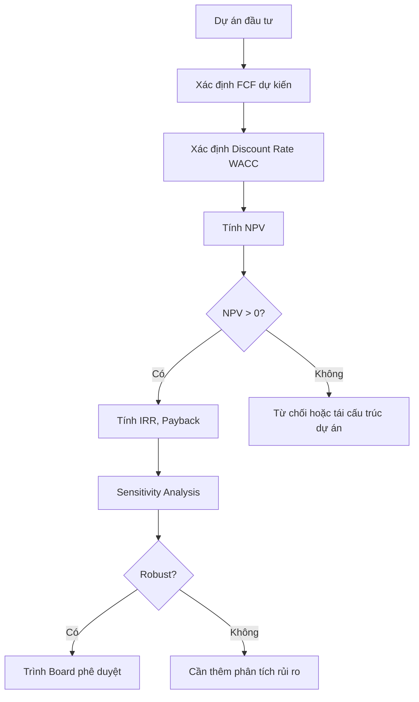

# F03 — Tài Chính Căn Bản
> *Finance Basics — Từ giá trị thời gian của tiền đến ra quyết định đầu tư*

---

## 1. Learning Objectives

Sau khi hoàn thành module này, người học có thể:
- Hiểu và tính toán Time Value of Money (TVM)
- Phân tích báo cáo tài chính bằng ratio analysis
- Đánh giá dự án đầu tư bằng NPV, IRR, Payback Period
- Hiểu cơ bản về cơ cấu vốn (Debt vs Equity)
- Tính toán WACC và ứng dụng trong định giá

---

## 2. Business Context

Tài chính là **khoa học ra quyết định với tiền**. Trong khi kế toán ghi lại quá khứ, tài chính hướng về tương lai: "Khoản đầu tư này có đáng không? Nên vay hay huy động vốn cổ phần? Công ty đang tạo ra hay phá hủy giá trị?"

**Tại Việt Nam:** Nhiều CEO quyết định đầu tư theo cảm tính hoặc dựa vào "payback period" thô sơ. Hiểu TVM và NPV giúp ra quyết định đúng hơn, đặc biệt khi so sánh các dự án có dòng tiền khác nhau về timing.

---

## 3. Definitions

| Thuật ngữ | Định nghĩa |
|-----------|-----------|
| **TVM (Time Value of Money)** | 1 đồng hôm nay có giá trị hơn 1 đồng tương lai |
| **Discount Rate** | Tỷ suất dùng để quy đổi dòng tiền tương lai về hiện tại |
| **NPV (Net Present Value)** | Tổng giá trị hiện tại của tất cả dòng tiền trừ đầu tư ban đầu |
| **IRR (Internal Rate of Return)** | Discount rate làm cho NPV = 0 |
| **WACC** | Weighted Average Cost of Capital — chi phí vốn bình quân gia quyền |
| **Free Cash Flow (FCF)** | Dòng tiền sau khi trừ capex — tiền thực sự tạo ra từ hoạt động KD |
| **ROE / ROA / ROIC** | Tỷ suất lợi nhuận trên vốn chủ / tổng tài sản / vốn đầu tư |
| **D/E Ratio** | Tỷ lệ Nợ / Vốn chủ — đo lường đòn bẩy tài chính |
| **Payback Period** | Thời gian thu hồi vốn đầu tư |

---

## 4. Core Concepts

### 4.1 Time Value of Money (TVM)

```
Future Value (FV) = PV × (1 + r)^n
Present Value (PV) = FV / (1 + r)^n

Ví dụ:
100 triệu hôm nay, lãi suất 10%/năm:
FV sau 5 năm = 100 × (1.10)^5 = 161 triệu

Hoặc ngược lại:
161 triệu sau 5 năm, discount rate 10%:
PV = 161 / (1.10)^5 = 100 triệu
```

**Annuity (Dòng tiền đều):**
```
PV Annuity = PMT × [1 - (1+r)^-n] / r

Ví dụ: Nhận 10tr/năm trong 5 năm, r = 10%:
PV = 10 × [1 - (1.10)^-5] / 0.10 = 37.9 triệu
```

### 4.2 Phân tích dự án đầu tư

**NPV (Net Present Value):**
```
NPV = -I₀ + CF₁/(1+r) + CF₂/(1+r)² + ... + CFn/(1+r)^n

NPV > 0 → Đầu tư tạo ra giá trị → NÊN làm
NPV = 0 → Hòa vốn đúng với discount rate → Tùy khẩu vị rủi ro
NPV < 0 → Phá hủy giá trị → KHÔNG nên làm
```

**IRR (Internal Rate of Return):**
```
IRR = r làm cho NPV = 0

IRR > WACC → Dự án tạo ra nhiều hơn chi phí vốn → Chấp nhận
IRR < WACC → Dự án không bù được chi phí vốn → Từ chối
```

**So sánh NPV vs IRR:**
| | NPV | IRR |
|--|-----|-----|
| Đo lường | Giá trị tuyệt đối (VND) | Tỷ suất (%) |
| Ưu tiên | Ưu tiên dự án lớn hơn | Ưu tiên dự án hiệu quả hơn |
| Khi mâu thuẫn | NPV đúng hơn | IRR có thể gây hiểu nhầm |
| Khi dùng | Quyết định đầu tư | So sánh với benchmark |

**Payback Period:**
```
Payback = Năm đầu tư ban đầu được thu hồi đầy đủ

Đơn giản: Tổng CF đạt bằng I₀ vào năm nào?
Discounted payback: Dùng PV của CF

Hạn chế: Bỏ qua TVM, bỏ qua CF sau payback
Vẫn hữu ích: Đánh giá nhanh, đặc biệt với dự án có rủi ro cao
```

### 4.3 Financial Ratio Analysis

**Thanh khoản (Liquidity):**
```
Current Ratio  = Tài sản ngắn hạn / Nợ ngắn hạn  (>1.5 là tốt)
Quick Ratio    = (TSNH - Hàng tồn kho) / Nợ ngắn hạn  (>1 là tốt)
Cash Ratio     = Tiền / Nợ ngắn hạn
```

**Lợi nhuận (Profitability):**
```
Gross Margin   = (Doanh thu - GVHB) / Doanh thu
EBITDA Margin  = EBITDA / Doanh thu
Net Margin     = Lợi nhuận sau thuế / Doanh thu
ROE            = Lợi nhuận sau thuế / Vốn chủ bình quân
ROA            = Lợi nhuận sau thuế / Tổng tài sản bình quân
ROIC           = NOPAT / (Nợ + VCSH)
```

**Hiệu quả (Efficiency):**
```
DSO (Days Sales Outstanding) = AR / (Doanh thu/365)
DIO (Days Inventory Outstanding) = Tồn kho / (GVHB/365)
DPO (Days Payable Outstanding) = AP / (GVHB/365)
CCC = DSO + DIO - DPO  (Cash Conversion Cycle)
Asset Turnover = Doanh thu / Tổng tài sản
```

**Đòn bẩy (Leverage):**
```
D/E Ratio           = Tổng nợ / Vốn chủ sở hữu
Debt Ratio          = Tổng nợ / Tổng tài sản
Interest Coverage   = EBIT / Lãi vay  (>3 là an toàn)
Net Debt / EBITDA   = (Nợ vay - Tiền) / EBITDA  (<3x thường chấp nhận được)
```

### 4.4 Cơ cấu vốn — Debt vs Equity

```
NGUỒN VỐN
    │
    ├── NỢ (Debt)
    │     Lãi vay được khấu trừ thuế
    │     Chi phí thấp hơn equity
    │     Rủi ro vỡ nợ nếu không trả được
    │
    └── VỐN CHỦ (Equity)
          Không bắt buộc trả
          Chia sẻ lợi nhuận với cổ đông
          Chi phí cao hơn (kỳ vọng cổ đông > lãi vay)
```

**WACC (Weighted Average Cost of Capital):**
```
WACC = Wd × Kd × (1-T) + We × Ke

Trong đó:
  Wd, We = Tỷ trọng Nợ, Vốn chủ trong cơ cấu vốn
  Kd = Chi phí nợ (lãi suất vay)
  Ke = Chi phí vốn chủ (CAPM: Ke = Rf + β × (Rm - Rf))
  T = Thuế suất CIT

WACC dùng làm discount rate trong DCF valuation
```

### 4.5 DuPont Analysis — Phân tích nguồn gốc ROE

```
ROE = Net Margin × Asset Turnover × Financial Leverage
    = (NI/Sales)  × (Sales/Assets) × (Assets/Equity)

Ví dụ:
ROE = 10% × 1.5 × 2.0 = 30%

→ Tăng ROE bằng: Cải thiện margin HOẶC Quay vòng TS nhanh hơn HOẶC Tăng đòn bẩy
→ Tăng đòn bẩy tăng rủi ro — không bền vững
```

---

## 5. Business Value

| Ứng dụng | Công cụ | Kết quả |
|---------|---------|---------|
| Quyết định mua thiết bị mới | NPV, Payback | Có đầu tư hay không |
| So sánh 2 dự án | IRR, NPV | Chọn dự án tốt hơn |
| Đánh giá sức khỏe tài chính | Ratio analysis | Điểm mạnh/yếu tài chính |
| Định giá doanh nghiệp | WACC, DCF | Giá trị công ty |
| Vay hay phát hành cổ phần | WACC, D/E | Tối ưu cơ cấu vốn |

---

## 6. Enterprise Role

- **CFO:** Quản lý cơ cấu vốn, WACC, capital allocation
- **CEO:** Hiểu ROE/ROA để đánh giá hiệu quả, quyết định đầu tư lớn
- **Finance Manager:** Phân tích ratio, lập financial model
- **Investment Manager:** NPV/IRR cho M&A, capex
- **Treasury:** Quản lý cash flow, đầu tư ngắn hạn

---

## 7. Departments Related

Finance · Accounting · Strategy · Operations · Procurement · Board/Investors

---

## 8. Input

- BCTC (BCĐKT, BCKQKD, BCLCTT)
- Kế hoạch kinh doanh, dự báo dòng tiền
- Thông tin thị trường (lãi suất, beta ngành)
- Ngân sách đầu tư (capex plan)

---

## 9. Output

- Financial ratio dashboard
- Investment analysis (NPV/IRR model)
- Financial model (3-statement model)
- Capital structure recommendation

---

## 10. Business Process

```
1. Thu thập BCTC 3-5 năm gần nhất
2. Tính toán ratio analysis
3. So sánh với benchmark ngành
4. Xác định điểm mạnh/yếu tài chính
5. Với dự án đầu tư: xây dựng dòng tiền dự kiến
6. Chọn discount rate (WACC hoặc hurdle rate)
7. Tính NPV, IRR, Payback
8. Phân tích độ nhạy (sensitivity analysis)
9. Khuyến nghị và trình bày
```

---

## 11. Data Flow

```
BCTC (ERP/Kế toán)
      ↓
Financial model (Excel/Python)
      ↓
Ratio analysis + DCF
      ↓
Dashboard (Power BI/Tableau)
      ↓
Report cho CEO/CFO/Board
```

---

## 12. Money Flow

Tài chính căn bản là nền tảng để:
- Quyết định **phân bổ vốn** (capital allocation) hiệu quả
- Đánh giá **chi phí vốn** (cost of capital) để chấp nhận/từ chối đầu tư
- Tối ưu **cơ cấu vốn** (D/E ratio) để tối thiểu hóa WACC

---

## 13. Document Flow

```
Yêu cầu phân tích từ CEO/CFO
      ↓
Finance team: thu thập dữ liệu, xây model
      ↓
Review nội bộ (CFO)
      ↓
Trình bày cho CEO / Board
      ↓
Quyết định đầu tư / phê duyệt ngân sách
```

---

## 14. Roles

| Vai trò | Trách nhiệm |
|---------|------------|
| Financial Analyst | Xây dựng model, tính ratio |
| Finance Manager | Review model, đề xuất |
| CFO | Phê duyệt phân tích, tư vấn CEO |
| CEO/Board | Quyết định cuối dựa trên phân tích |

---

## 15. Responsibilities

- Đảm bảo tính chính xác của giả định trong model
- Phân tích độ nhạy để hiểu rủi ro
- Trình bày rõ ràng, không dùng thuật ngữ phức tạp không cần thiết
- Cập nhật model khi có dữ liệu mới

---

## 16. RACI

| Hoạt động | CEO | CFO | Finance Mgr | Analyst |
|-----------|:---:|:---:|:-----------:|:-------:|
| Xây dựng model | I | C | A | R |
| Review model | I | A | R | I |
| Phân tích scenario | I | C | A | R |
| Quyết định đầu tư | A | C | I | I |

---

## 17. Frameworks

- **Discounted Cash Flow (DCF)**
- **DuPont Analysis**
- **CAPM (Capital Asset Pricing Model)**
- **Modigliani-Miller theorem** (cơ cấu vốn)
- **3-Statement Financial Model**
- **Sensitivity / Scenario Analysis**

---

## 18. International Standards

- **IFRS / IAS 36:** Impairment testing dùng DCF
- **CFA Institute:** Chuẩn phân tích tài chính (Level 1 covers TVM, ratio analysis)
- **WACC:** Được dùng trong IFRS 3 (Business Combinations) và IAS 36

---

## 19. Vietnam Context

**Discount rate tại Việt Nam:**
- Risk-free rate: Lãi suất trái phiếu Chính phủ 10 năm (~4-5%)
- Country risk premium: VN thêm ~3-5% so với developed markets
- WACC điển hình cho SME VN: 12-18%/năm (tùy ngành, rủi ro)

**Tín dụng ngân hàng tại VN:**
- Lãi suất vay VND: 8-12%/năm (tùy tài sản thế chấp, uy tín)
- Lãi suất vay USD: 4-6%/năm (nếu có nguồn thu ngoại tệ)
- Hầu hết SME dùng tài sản BĐS thế chấp → hạn chế D/E ratio linh hoạt

**Hurdle rate:** Nhiều doanh nghiệp VN dùng 15-20%/năm cho dự án nội địa.

---

## 20. Legal Considerations

- **Luật Đầu tư 2020:** Quy định về dự án đầu tư, thẩm định đầu tư
- **Luật Chứng khoán 2019:** Liên quan đến huy động vốn cổ phần
- **Thông tư 36/2021/TT-NHNN:** Giới hạn tín dụng ngân hàng cho các ngành
- **Nghị định 153/2020/NĐ-CP:** Phát hành trái phiếu doanh nghiệp riêng lẻ

---

## 21. Common Mistakes

1. **Dùng nominal rate mà không điều chỉnh lạm phát** trong dự án dài hạn
2. **Quên tính working capital changes** trong FCF
3. **Dùng book value thay vì market value** cho WACC
4. **Chọn IRR thay vì NPV** khi so sánh dự án lẫn nhau (có thể cho kết quả trái ngược)
5. **Sunk cost** đưa vào NPV analysis
6. **Terminal value quá lớn** (>80% tổng NPV) → không đáng tin
7. **Bỏ qua rủi ro:** Không phân tích sensitivity/scenario

---

## 22. Best Practices

- Luôn làm sensitivity analysis (thay đổi giả định quan trọng ±10-20%)
- Xây dựng 3 kịch bản: Base, Bull, Bear
- Kiểm tra bằng multiple valuation methods (DCF + multiples)
- Tách rõ giả định ra khỏi công thức trong Excel model
- NPV > 0 là điều kiện cần, không đủ — phải xét thêm rủi ro phi tài chính

---

## 23. KPIs

| KPI | Benchmark điển hình |
|-----|-------------------|
| **ROIC** | > WACC (tạo ra giá trị) |
| **ROE** | 15-25% (ngành trung bình VN) |
| **Net Debt/EBITDA** | < 3x (an toàn) |
| **Interest Coverage** | > 3x (an toàn) |
| **CCC** | Càng ngắn càng tốt |
| **FCF Margin** | > 5% (business khỏe mạnh) |

---

## 24. Metrics

- FCF (Free Cash Flow) và FCF yield
- EBITDA và EBITDA margin
- Invested Capital và ROIC trend
- Net Debt và leverage ratio

---

## 25. Reports

- **Investment Appraisal Report:** NPV/IRR analysis cho capex
- **Financial Dashboard:** Ratio hàng tháng cho CFO/CEO
- **Capital Structure Review:** Hàng năm
- **Covenants monitoring:** Theo yêu cầu của ngân hàng

---

## 26. Templates

Xem [23-templates/](../../23-templates/):
- `CONSULTING_REPORT_TEMPLATE.md` — Framework trình bày kết quả phân tích
- `RISK_REGISTER_TEMPLATE.md` — Rủi ro tài chính

---

## 27. Checklists

**Trước khi phê duyệt dự án đầu tư:**
- [ ] Đã tính NPV với discount rate phù hợp (WACC/hurdle rate)?
- [ ] Đã làm sensitivity analysis với các giả định quan trọng?
- [ ] Đã xét kịch bản xấu nhất (bear case)?
- [ ] Đã tính toán working capital cần bổ sung?
- [ ] Đã xét tác động đến leverage ratio?
- [ ] Đã so sánh với chi phí cơ hội?
- [ ] Kết quả có phụ thuộc quá nhiều vào terminal value không?

---

## 28. SOP

**Phân tích đầu tư (chuẩn):**
```
Bước 1: Xác định dòng tiền (FCF) dự kiến mỗi năm
Bước 2: Xác định discount rate (WACC hoặc hurdle rate)
Bước 3: Tính NPV và IRR
Bước 4: Tính Payback Period (simple và discounted)
Bước 5: Sensitivity analysis (±10-20% các giả định key)
Bước 6: Scenario analysis (base/bull/bear)
Bước 7: Trình bày kết luận + recommendation
```

---

## 29. Case Study

**Vingroup quyết định đầu tư vào VinFast:**

Đây là ví dụ về NPV dài hạn với rủi ro cao:
- Đầu tư ban đầu cực lớn (vài tỷ USD)
- Dòng tiền âm nhiều năm đầu
- Terminal value phụ thuộc vào quy mô thị trường EV toàn cầu

Nếu phân tích DCF truyền thống: NPV có thể âm trong nhiều kịch bản ngắn hạn. Nhưng strategic value (brand, technology ecosystem) và optionality không thể hiện đầy đủ trong mô hình.

**Bài học:** DCF là công cụ tốt nhưng không thay thế được strategic judgment, đặc biệt với công ty startup/transformative investment.

---

## 30. Small Business Example

**Chủ tiệm café cân nhắc mua máy pha cà phê mới 150tr:**
```
Đầu tư: -150 triệu
Tăng doanh thu hàng năm: +50tr/năm
Chi phí vận hành tăng thêm: 10tr/năm
FCF tăng thêm: 40tr/năm
Thời gian sử dụng: 5 năm
Discount rate: 15% (chi phí vay vốn)

NPV = -150 + 40/1.15 + 40/1.15² + ... + 40/1.15⁵
NPV = -150 + 134 = -16 triệu

→ NPV âm → Không đáng đầu tư ở discount rate 15%
→ Nếu discount rate = 10%: NPV = -150 + 152 = +2tr → Gần hòa vốn
→ Quyết định: Thương lượng giảm giá máy xuống dưới 134tr, hoặc tìm cách tăng doanh thu thêm
```

---

## 31. Enterprise Example

**Masan Group — Capital Allocation:**

Masan dùng khung ROIC > WACC để quyết định các mảng kinh doanh nên đầu tư thêm hay thoái vốn:
- Mảng tiêu dùng (Masan Consumer): ROIC cao → reinvest mạnh
- Mảng tài nguyên: ROIC thấp hơn → xem xét thoái vốn một phần
- Mảng bán lẻ (WinMart): Giai đoạn đầu ROIC thấp → chấp nhận burn vì strategic value

**Bài học:** Tài chính không chỉ là "maximize lợi nhuận hiện tại" mà là "capital allocation tối ưu cho long-term value".

---

## 32. ERP Mapping

| Phân tích | Module ERP | Dữ liệu |
|-----------|-----------|---------|
| Ratio analysis | FI-GL + CO | BCTC, cost center data |
| Capex tracking | FI-AA (Fixed Assets) | Đầu tư, khấu hao |
| Cash flow | FI-TR (Treasury) | Dòng tiền thực tế |
| NPV/IRR | Không có sẵn | Cần Excel/Python riêng |
| WACC calculation | Không có sẵn | Cần external market data |

---

## 33. Automation Opportunities

- **Auto ratio calculation:** ERP tự tính ratio từ BCTC mỗi tháng
- **Cash flow forecasting:** Tự động dự báo từ AR/AP aging
- **Covenant monitoring:** Tự động cảnh báo khi ratio gần vi phạm ngân hàng

---

## 34. AI Opportunities

- **AI financial modeling:** Tự động xây 3-statement model từ dữ liệu ERP
- **Anomaly detection:** Phát hiện ratio bất thường so với pattern lịch sử
- **Scenario generation:** AI đề xuất stress test scenarios phù hợp với ngành
- **Earnings prediction:** ML dự báo lợi nhuận quý tới

---

## 35. Implementation Guide

**Xây dựng năng lực tài chính cho SME:**
```
Tháng 1-2: Đào tạo team về ratio analysis
            → Lập dashboard tự động từ BCTC hàng tháng
Tháng 3:   Xây dựng hurdle rate công ty (= WACC hoặc cao hơn)
            → Áp dụng NPV/IRR cho mọi capex > 100 triệu
Tháng 4+:  Review cơ cấu vốn hàng năm
            → So sánh ROIC vs WACC để đánh giá tạo/phá hủy giá trị
```

---

## 36. Consulting Guide

**Câu hỏi chẩn đoán:**
1. Công ty dùng metric nào để quyết định đầu tư? NPV/IRR hay chỉ payback?
2. WACC có được tính chính thức không? Có được dùng làm hurdle rate không?
3. ROIC hiện tại là bao nhiêu? Có > WACC không?
4. Tỷ lệ D/E là bao nhiêu? Có phù hợp với ngành và giai đoạn công ty?
5. Khi nào lần cuối review cơ cấu vốn?

---

## 37. Diagnostic Questions

1. Dự án đầu tư nào đang có NPV âm nhưng vẫn tiếp tục?
2. Mảng nào có ROIC thấp nhất? Tại sao vẫn giữ?
3. Chi phí vốn bình quân (WACC) hiện tại là bao nhiêu?
4. Cash Conversion Cycle đang dài ra hay ngắn lại?
5. Nếu lãi suất tăng 3%, impact lên P&L là bao nhiêu?

---

## 38. Interview Questions

**Cho ứng viên Finance:**
- "Giải thích NPV và tại sao NPV > 0 nghĩa là đáng đầu tư"
- "Tại sao một công ty có lợi nhuận cao vẫn có thể phá sản?"
- "IRR và NPV có thể cho kết quả mâu thuẫn không? Khi nào?"

**Cho ứng viên CFO:**
- "Tính WACC của công ty trong trường hợp: 60% equity, 40% debt, Kd=10%, T=20%, Ke=15%"
- "Giải thích DuPont analysis và ý nghĩa của từng thành phần"

---

## 39. Exercises

**Bài 1 (NPV):** Dự án đòi hỏi đầu tư 500tr ban đầu, tạo ra FCF: Năm 1: 100tr, Năm 2: 150tr, Năm 3: 200tr, Năm 4: 200tr, Năm 5: 150tr. Discount rate 12%. Tính NPV và Payback Period.

**Bài 2 (Ratio):** Từ BCTC được cho, tính và phân tích: Current Ratio, Gross Margin, DSO, D/E Ratio. So sánh với benchmark ngành và đề xuất cải thiện.

**Bài 3 (WACC):** Công ty có: Vốn chủ = 600tr, Nợ dài hạn = 400tr, Kd = 10%, T = 20%, Rf = 5%, β = 1.3, ERP = 6%. Tính WACC.

---

## 40. References

- **Sách:** *Principles of Corporate Finance* — Brealey, Myers, Allen
- **Sách:** *Financial Intelligence* — Berman & Knight (dành cho non-finance)
- **VN:** *Giáo trình Tài chính Doanh nghiệp* — ĐH Kinh tế Quốc dân
- **CFA Level 1 Curriculum** — Time Value of Money, Ratio Analysis
- **Online:** CFI (Corporate Finance Institute), Investopedia

---

## Output Formats

### Mermaid — Framework ra quyết định đầu tư


### Flashcards
```
Q: NPV > 0 có nghĩa là gì?
A: Dự án tạo ra giá trị nhiều hơn chi phí vốn.
   → Nên đầu tư (xét thêm rủi ro phi tài chính).

Q: WACC là gì và dùng để làm gì?
A: Chi phí vốn bình quân = chi phí trung bình để tài trợ cho tài sản.
   Dùng làm discount rate trong DCF và hurdle rate cho đầu tư.

Q: Tại sao IRR có thể gây hiểu nhầm?
A: IRR giả định dòng tiền trung gian được tái đầu tư tại chính IRR đó.
   → Khi IRR cao, giả định này không thực tế.
   → Luôn dùng NPV làm tiêu chí chính.

Q: CCC là gì? Tại sao quan trọng?
A: Cash Conversion Cycle = DSO + DIO - DPO.
   CCC ngắn = công ty ít bị "kẹt vốn" trong working capital.
   CCC dài = cần vay nhiều hơn để duy trì hoạt động.
```

### Cheat Sheet
```
═════════════════════════════════════════
       TÀI CHÍNH CĂN BẢN CHEAT SHEET
═════════════════════════════════════════
TVM:
  FV = PV × (1+r)^n
  PV = FV / (1+r)^n

NPV / IRR:
  NPV > 0 → Đầu tư tạo giá trị → NÊN làm
  IRR > WACC → Đầu tư hiệu quả hơn chi phí vốn

WACC = Wd×Kd×(1-T) + We×Ke

KEY RATIOS:
  ROE = NI / Equity
  ROIC = NOPAT / Invested Capital
  Interest Coverage = EBIT / Lãi vay (>3x an toàn)
  Net Debt/EBITDA < 3x (an toàn)

CCC = DSO + DIO - DPO (càng ngắn càng tốt)

DUPONT:
  ROE = Net Margin × Asset Turnover × Leverage
═════════════════════════════════════════
```

### JSON Metadata
```json
{
  "module_code": "F03",
  "module_name": "Tài Chính Căn Bản",
  "domain": "Foundation",
  "level": "Foundation",
  "version": "1.0",
  "status": "complete",
  "prerequisites": ["F01", "F02"],
  "related_modules": ["FI01", "FI02", "FI04", "AC02"],
  "learning_time_hours": 12,
  "key_frameworks": ["DCF", "WACC", "DuPont", "CAPM", "3-Statement Model"],
  "key_standards": ["CFA Level 1", "IFRS IAS 36", "Luật Đầu tư 2020"],
  "vietnam_specific": true,
  "tags": ["NPV", "IRR", "WACC", "ratio-analysis", "valuation", "TVM", "DCF"]
}
```
