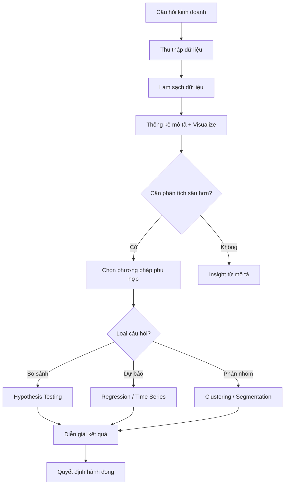

# F04 — Thống Kê Ứng Dụng
> *Applied Statistics for Business — Từ dữ liệu đến quyết định có căn cứ*

---

## 1. Learning Objectives

Sau khi hoàn thành module này, người học có thể:
- Áp dụng thống kê mô tả để tóm tắt và trình bày dữ liệu kinh doanh
- Hiểu phân phối xác suất và ứng dụng trong dự báo rủi ro
- Thực hiện kiểm định giả thuyết đơn giản (A/B test)
- Xây dựng mô hình hồi quy tuyến tính cơ bản
- Đọc và diễn giải kết quả phân tích thống kê từ báo cáo BI

---

## 2. Business Context

"Không đo được thì không quản được" — Peter Drucker. Thống kê là **công cụ đo lường có cấu trúc** giúp phân biệt tín hiệu thực sự với nhiễu ngẫu nhiên trong dữ liệu kinh doanh.

**Ứng dụng ngay lập tức:**
- A/B test trang web: Thiết kế A hay B tốt hơn? Có đủ dữ liệu để kết luận không?
- Dự báo doanh thu: Tháng tới ước tính bao nhiêu (khoảng tin cậy)?
- Kiểm soát chất lượng: Tỷ lệ lỗi có nằm trong mức cho phép không?
- KPI monitoring: Sự thay đổi có ý nghĩa hay chỉ là dao động ngẫu nhiên?

---

## 3. Definitions

| Thuật ngữ | Định nghĩa |
|-----------|-----------|
| **Mean (Trung bình)** | Tổng / Số quan sát |
| **Median (Trung vị)** | Giá trị ở giữa khi sắp xếp tăng dần |
| **Standard Deviation (σ)** | Đo lường mức độ phân tán quanh mean |
| **Variance (σ²)** | Bình phương của độ lệch chuẩn |
| **Correlation (r)** | Đo lường mức độ và chiều của quan hệ tuyến tính (-1 đến +1) |
| **Regression** | Mô hình hóa quan hệ giữa biến phụ thuộc và biến độc lập |
| **p-value** | Xác suất nhận được kết quả ít nhất cực đoan như vậy nếu H₀ đúng |
| **Confidence Interval** | Khoảng giá trị mà tham số thực nằm trong đó với xác suất đã chọn |
| **Statistical Significance** | Kết quả ít có khả năng xảy ra do ngẫu nhiên (thường p < 0.05) |

---

## 4. Core Concepts

### 4.1 Thống kê mô tả (Descriptive Statistics)

```
CENTRAL TENDENCY (Xu hướng trung tâm):
  Mean    = Σx / n              (nhạy cảm với outlier)
  Median  = giá trị giữa        (ổn định hơn với outlier)
  Mode    = giá trị xuất hiện nhiều nhất

DISPERSION (Phân tán):
  Range           = Max - Min
  Variance        = Σ(x - mean)² / n
  Std Dev (σ)     = √Variance
  CV (Coefficient of Variation) = σ / mean  (so sánh phân tán giữa các tập dữ liệu)

SHAPE:
  Skewness: Phân phối lệch trái/phải
  Kurtosis: Đuôi phân phối nặng/nhẹ
```

**Khi nào dùng Mean vs Median:**
- **Mean:** Dữ liệu phân phối đều, không có outlier (ví dụ: điểm học sinh)
- **Median:** Dữ liệu có outlier (ví dụ: thu nhập — tránh bị kéo bởi tỷ phú)

### 4.2 Phân phối xác suất

**Normal Distribution (Phân phối chuẩn):**
```
68-95-99.7 Rule:
  ±1σ: 68% dữ liệu
  ±2σ: 95% dữ liệu
  ±3σ: 99.7% dữ liệu

Ứng dụng:
  - Doanh thu hàng ngày (xung quanh trung bình)
  - Sai số dự báo
  - Kiểm soát chất lượng (SPC)
```

**Phân phối quan trọng khác:**
- **Binomial:** Tỷ lệ thành công/thất bại (tỷ lệ chuyển đổi, tỷ lệ lỗi)
- **Poisson:** Tần suất sự kiện theo thời gian (số đơn hàng/giờ, khiếu nại/ngày)
- **Exponential:** Thời gian giữa các sự kiện (time between failures)

### 4.3 Kiểm định giả thuyết (Hypothesis Testing)

```
FRAMEWORK:
1. H₀ (Null hypothesis): Không có sự khác biệt / hiệu ứng
2. H₁ (Alternative): Có sự khác biệt / hiệu ứng
3. Chọn significance level α (thường 0.05)
4. Tính test statistic
5. Tính p-value
6. Quyết định: p < α → Reject H₀ (kết quả có ý nghĩa)

VÍ DỤ A/B TEST:
  H₀: Conversion rate A = Conversion rate B
  H₁: Conversion rate A ≠ Conversion rate B
  α = 0.05 (5%)
  Kết quả: p = 0.03 → p < 0.05 → Reject H₀
  → B tốt hơn A với mức tin cậy 95%
```

**Lỗi Type I và Type II:**
```
              Thực tế: H₀ đúng    Thực tế: H₀ sai
Kết luận: Reject H₀   Lỗi Type I (α)    Đúng (Power)
Kết luận: Không Reject  Đúng           Lỗi Type II (β)

Lỗi Type I (False Positive): Nói có hiệu quả nhưng thực ra không
Lỗi Type II (False Negative): Bỏ qua hiệu quả thực sự
```

### 4.4 Hồi quy tuyến tính (Linear Regression)

**Đơn biến (Simple Linear Regression):**
```
Y = β₀ + β₁X + ε

Y: Biến phụ thuộc (doanh thu, chi phí, v.v.)
X: Biến độc lập (giá, quảng cáo, v.v.)
β₀: Hệ số chặn (intercept)
β₁: Hệ số góc (slope) — tác động của X lên Y
ε: Sai số (phần Y không giải thích được bởi X)

Ví dụ: Doanh thu = 50tr + 3 × Chi phí quảng cáo
→ Mỗi 1tr quảng cáo → tăng 3tr doanh thu
```

**R² (Coefficient of Determination):**
```
R² = % biến động của Y được giải thích bởi model
R² = 0.80 → Model giải thích 80% biến động
R² gần 1 → Model fit tốt
R² < 0.3 → Model yếu (cần thêm biến hoặc dùng model khác)
```

### 4.5 Phân tích tương quan (Correlation)

```
r gần +1: Tương quan thuận mạnh
r gần -1: Tương quan nghịch mạnh
r gần 0: Ít/không có tương quan tuyến tính

LƯU Ý QUAN TRỌNG:
  Tương quan ≠ Nhân quả (Correlation ≠ Causation)
  Ví dụ: Bán kem và đuối nước tương quan cao
  → Nguyên nhân thực: mùa hè (confounder)
```

### 4.6 Dự báo (Forecasting) cơ bản

```
MOVING AVERAGE:
  MA(n) = Trung bình của n kỳ gần nhất
  → Loại bỏ nhiễu ngắn hạn

EXPONENTIAL SMOOTHING:
  Ft+1 = α × At + (1-α) × Ft
  α gần 1: Trọng số cao cho dữ liệu gần nhất
  α gần 0: Dự báo ổn định hơn

TREND + SEASONALITY:
  Yt = Trend × Seasonal Index × Noise
  → Cần decompose trước khi forecast
```

---

## 5. Business Value

| Ứng dụng | Công cụ | Giá trị |
|---------|---------|---------|
| A/B test website/pricing | Chi-square, t-test | Quyết định có căn cứ thay vì cảm tính |
| Dự báo doanh thu | Regression, TS | Kế hoạch chính xác hơn |
| Kiểm soát chất lượng | SPC, 6 Sigma | Giảm tỷ lệ lỗi |
| KPI monitoring | Confidence interval | Phân biệt tín hiệu và nhiễu |
| Phân khúc khách hàng | Clustering | Cá nhân hóa marketing |

---

## 6. Enterprise Role

- **Data Analyst:** Thực hiện phân tích thống kê, A/B test
- **Finance:** Dự báo doanh thu, phân tích rủi ro
- **Marketing:** A/B test, phân khúc khách hàng
- **Operations/QC:** SPC, kiểm soát chất lượng
- **CEO/Manager:** Đọc và diễn giải kết quả phân tích

---

## 7. Departments Related

Data Analytics · Finance · Marketing · Operations · R&D · QC/QA · Strategy

---

## 8. Input

- Dữ liệu kinh doanh (doanh số, chi phí, khách hàng)
- Dữ liệu thị trường (giá đối thủ, tỷ lệ chuyển đổi)
- Dữ liệu vận hành (tỷ lệ lỗi, thời gian xử lý)
- Kết quả khảo sát (NPS, CSAT)

---

## 9. Output

- Dashboard với KPI và khoảng tin cậy
- A/B test report với kết luận thống kê
- Mô hình dự báo (forecast model)
- Báo cáo kiểm soát chất lượng (SPC chart)

---

## 10. Business Process

```
1. Xác định câu hỏi kinh doanh cần trả lời
2. Thu thập và làm sạch dữ liệu
3. Thống kê mô tả (hiểu dữ liệu)
4. Chọn phương pháp phân tích phù hợp
5. Thực hiện phân tích
6. Kiểm tra giả định của phương pháp
7. Diễn giải kết quả bằng ngôn ngữ kinh doanh
8. Hành động và theo dõi
```

---

## 11. Data Flow

```
Raw data (ERP/CRM/Spreadsheet)
      ↓
Làm sạch (Clean) và chuẩn hóa
      ↓
Phân tích (Python/R/Excel)
      ↓
Visualization (Power BI/Tableau)
      ↓
Insight → Decision → Action
```

---

## 12. Money Flow

Thống kê ứng dụng không trực tiếp tạo ra tiền nhưng cải thiện **chất lượng quyết định** dẫn đến:
- Giảm chi phí qua kiểm soát chất lượng tốt hơn
- Tăng doanh thu qua A/B test và cá nhân hóa
- Giảm rủi ro qua dự báo chính xác hơn

---

## 13. Document Flow

```
Yêu cầu phân tích → Data Analyst
                  → Thu thập, phân tích
                  → Báo cáo với visualizations
                  → Trình bày cho stakeholders
                  → Quyết định và lưu hồ sơ
```

---

## 14. Roles

| Vai trò | Trách nhiệm |
|---------|------------|
| Data Analyst | Thực hiện phân tích, xây dựng model |
| BI Developer | Tạo dashboard, báo cáo tự động |
| Data Scientist | Model phức tạp hơn (ML, predictive) |
| Business Manager | Đặt câu hỏi, diễn giải kết quả, hành động |

---

## 15. Responsibilities

- Đảm bảo chất lượng dữ liệu đầu vào
- Diễn giải kết quả trung thực (không chỉ trình bày kết quả đẹp)
- Truyền đạt uncertainty (khoảng tin cậy, giới hạn của model)
- Tài liệu hóa phương pháp để có thể reproduce

---

## 16. RACI

| Hoạt động | Manager | Data Analyst | BI Dev | CEO |
|-----------|:-------:|:------------:|:------:|:---:|
| Xác định câu hỏi | A | C | - | I |
| Thu thập dữ liệu | I | R | C | - |
| Phân tích | I | R | C | - |
| Trình bày kết quả | I | R | A | C |
| Quyết định hành động | A | C | I | R |

---

## 17. Frameworks

- **CRISP-DM** (Cross-Industry Standard Process for Data Mining)
- **Hypothesis-Driven Analytics**
- **Statistical Process Control (SPC)** — Six Sigma
- **Bayesian vs Frequentist** — hai trường phái thống kê
- **Design of Experiments (DOE)** — thiết kế thử nghiệm

---

## 18. International Standards

- **ISO 3534:** Thống kê — Từ vựng và ký hiệu
- **Six Sigma (DMAIC):** Áp dụng thống kê trong cải tiến quy trình
- **ICH E9:** Statistical principles for clinical trials (áp dụng được cho A/B test)
- **ISO 22514:** Statistical methods in process management

---

## 19. Vietnam Context

**Tình trạng sử dụng thống kê tại doanh nghiệp VN:**
- Phần lớn SME VN chưa dùng thống kê bài bản trong quyết định
- Phổ biến nhất: Excel pivot table, dashboard đơn giản
- Tiên tiến hơn: Power BI, Google Analytics với A/B test cơ bản

**Cơ hội:**
- Việt Nam có tốc độ số hóa cao → dữ liệu ngày càng nhiều
- Thiếu nhân sự data analytics tốt → lợi thế cạnh tranh cho ai đầu tư
- E-commerce tại VN (Shopee, Lazada) dùng A/B test liên tục

**Nguồn dữ liệu công khai VN:** GSO (Tổng cục Thống kê), VCCI, Nielsen VN.

---

## 20. Legal Considerations

- **Luật An toàn thông tin mạng 2015:** Bảo vệ dữ liệu cá nhân khi phân tích
- **Nghị định 13/2023/NĐ-CP:** Bảo vệ dữ liệu cá nhân — cần consent khi dùng dữ liệu khách hàng
- **GDPR (EU):** Áp dụng nếu có khách hàng EU — ảnh hưởng đến analytics

---

## 21. Common Mistakes

1. **Nhầm tương quan với nhân quả:** "Doanh thu tương quan với nhiệt độ → Bật điều hòa tốt hơn"
2. **Overfitting:** Model fit quá tốt với training data nhưng predict kém
3. **P-hacking:** Chạy nhiều test cho đến khi thấy p < 0.05
4. **Small sample size:** Kết luận từ quá ít dữ liệu
5. **Survivorship bias:** Phân tích chỉ dữ liệu thành công, bỏ qua thất bại
6. **Ignoring outliers:** Không kiểm tra và xử lý outlier trước phân tích
7. **Mean với skewed data:** Dùng mean cho dữ liệu thu nhập → sai lệch

---

## 22. Best Practices

- Luôn visualize dữ liệu trước khi phân tích
- Báo cáo khoảng tin cậy (confidence interval), không chỉ point estimate
- Phân biệt statistical significance và practical significance
- Tài liệu hóa phương pháp để có thể reproduce
- Luôn hỏi "Dữ liệu này được thu thập như thế nào? Có biases không?"

---

## 23. KPIs (của bộ phận analytics)

| KPI | Mục tiêu |
|-----|---------|
| **Forecast accuracy** | MAPE < 15% |
| **A/B test velocity** | X tests/tháng |
| **Time to insight** | < X ngày từ request đến report |
| **Data quality score** | > 95% completeness, accuracy |

---

## 24. Metrics

- R² của forecast model theo thời gian
- Số lượng A/B test có kết quả significant
- Tỷ lệ decision được hỗ trợ bởi data
- Độ trễ dữ liệu (data freshness)

---

## 25. Reports

- **Weekly KPI Report** với confidence intervals
- **A/B Test Summary** với statistical results
- **Monthly Forecast Review** — actual vs forecast
- **Quality Control Dashboard** — SPC charts

---

## 26. Templates

Xem [23-templates/](../../23-templates/):
- `KPI_DASHBOARD.md` — Template dashboard với thống kê cơ bản

---

## 27. Checklists

**Trước khi kết luận từ phân tích:**
- [ ] Sample size đủ lớn không?
- [ ] Có outlier ảnh hưởng đến kết quả không?
- [ ] Giả định của phương pháp có được thoả mãn không?
- [ ] p-value có ý nghĩa thực tiễn không (ngoài thống kê)?
- [ ] Có confounding variables không?
- [ ] Kết quả có reproducible không?

---

## 28. SOP

**Quy trình A/B Test:**
```
Bước 1: Xác định hypothesis và metric chính (conversion rate, revenue)
Bước 2: Tính minimum sample size (dựa trên power = 80%, α = 0.05)
Bước 3: Phân nhóm ngẫu nhiên (random assignment)
Bước 4: Chạy test cho đến khi đủ sample (không dừng sớm)
Bước 5: Kiểm định giả thuyết (z-test hoặc chi-square)
Bước 6: Báo cáo kết quả với p-value và effect size
Bước 7: Triển khai winner nếu có kết quả significant
```

---

## 29. Case Study

**Tiki.vn — A/B Test layout trang sản phẩm:**

Tiki test 2 layout: A (layout cũ) vs B (nút "Thêm vào giỏ" nổi bật hơn).

- Sample: 50,000 người mỗi nhóm
- Conversion rate A: 3.2%, B: 3.8%
- Chi-square test: p = 0.001 < 0.05
- Kết luận: B tốt hơn đáng kể về mặt thống kê
- Uplift: +0.6% → +19% relative improvement
- Triển khai B → tăng doanh thu ước tính X tỷ/năm

**Bài học:** Quyết định UI dựa trên data, không dựa trên ý kiến chủ quan.

---

## 30. Small Business Example

**Chủ shop thời trang online — Phân tích doanh thu:**

Dùng Moving Average để lọc nhiễu:
```
Doanh thu 6 tháng: 80, 95, 72, 110, 85, 102 (triệu)
MA(3): -, -, 82.3, 92.3, 89.0, 99.0

→ Xu hướng tăng nhẹ, loại bỏ dao động tháng
→ Mùa vụ: Tháng 4 và 6 cao hơn → tăng tồn kho trước tháng 4 và 6
```

---

## 31. Enterprise Example

**FPT — Phân tích churn của khách hàng dịch vụ:**

FPT dùng logistic regression để dự đoán khách hàng có khả năng hủy dịch vụ internet:
- Biến độc lập: Số lần gọi hỗ trợ, tốc độ mạng trung bình, thời gian sử dụng
- AUC = 0.78 → Model dự báo tốt
- Top 20% khách hàng nguy cơ cao → gọi retention call → giảm churn 15%

---

## 32. ERP Mapping

| Phân tích | Nguồn dữ liệu ERP | Tool |
|-----------|-------------------|------|
| Sales forecasting | SD (Sales) — lịch sử đơn hàng | Python/R |
| Inventory optimization | MM (Materials) | Excel/Python |
| A/B test | Web analytics (external) | Google Optimize |
| Quality control | QM (Quality) | SPC charts |

---

## 33. Automation Opportunities

- **Tự động tính ratio thống kê** hàng ngày từ ERP data
- **Automated anomaly detection** cảnh báo khi KPI lệch quá ngưỡng
- **Scheduled forecasting** — chạy model tự động cuối mỗi tháng

---

## 34. AI Opportunities

- **Machine Learning forecasting:** LSTM, Prophet cho time series
- **Automated A/B testing:** Multi-armed bandit thay vì traditional A/B
- **NLP sentiment analysis:** Phân tích feedback khách hàng tự động
- **Computer Vision QC:** Kiểm tra chất lượng sản phẩm tự động

---

## 35. Implementation Guide

**Xây dựng năng lực analytics:**
```
Giai đoạn 1 (0-3 tháng): Foundation
  - Đào tạo Excel nâng cao (pivot, VLOOKUP, basic charts)
  - Thiết lập KPI dashboard tự động
  - Bắt đầu tracking đúng dữ liệu

Giai đoạn 2 (3-9 tháng): Intermediate
  - Power BI hoặc Tableau
  - A/B testing cho marketing
  - Forecast đơn giản (moving average, linear trend)

Giai đoạn 3 (9-18 tháng): Advanced
  - Python/R cho phân tích phức tạp
  - Predictive models (regression, classification)
  - Data warehouse và data pipeline
```

---

## 36. Consulting Guide

**Câu hỏi chẩn đoán:**
1. Quyết định quan trọng cuối cùng dựa trên data là quyết định nào?
2. Team có A/B test trước khi triển khai thay đổi không?
3. Forecast doanh thu có khoảng tin cậy không?
4. Có ai trong team hiểu p-value và khoảng tin cậy không?

---

## 37. Diagnostic Questions

1. KPI nào đang biến động? Có ý nghĩa thống kê không hay chỉ là nhiễu ngẫu nhiên?
2. Dự báo tháng trước sai bao nhiêu %? Sai theo chiều nào?
3. Có A/B test nào đang chạy không? Kết quả?
4. Dữ liệu khách hàng đang được dùng như thế nào để ra quyết định?

---

## 38. Interview Questions

**Cho ứng viên Data Analyst:**
- "p-value 0.03 có nghĩa là gì? Khi nào thì đủ kết luận?"
- "Correlation r = 0.8 giữa quảng cáo và doanh thu — có thể kết luận tăng quảng cáo sẽ tăng doanh thu không?"
- "Khi nào dùng mean và khi nào dùng median?"

---

## 39. Exercises

**Bài 1:** Dữ liệu doanh thu 10 ngày: 100, 95, 110, 88, 120, 75, 105, 98, 115, 102. Tính mean, median, std dev. Dùng MA(3) để smooth dữ liệu.

**Bài 2:** A/B Test: Version A có 1000 visitors, 50 conversions (5%). Version B có 1000 visitors, 65 conversions (6.5%). p-value = 0.04. Có nên triển khai B không?

**Bài 3:** Cho dữ liệu: Chi phí quảng cáo (X) và Doanh thu (Y) trong 12 tháng. Dùng Excel để chạy regression. Diễn giải β₁ và R².

---

## 40. References

- **Sách:** *Statistics for Business and Economics* — Anderson, Sweeney, Williams
- **Sách:** *Naked Statistics* — Wheelan (dành cho non-statisticians)
- **Online:** Khan Academy Statistics, StatQuest (YouTube)
- **Tool:** Excel (cơ bản), Python with pandas/scipy, R
- **VN:** *Giáo trình Thống kê Kinh doanh* — ĐH Kinh tế Quốc dân

---

## Output Formats

### Mermaid — Quy trình phân tích dữ liệu


### Flashcards
```
Q: p-value 0.03 nghĩa là gì?
A: Nếu H₀ đúng (không có hiệu ứng), xác suất nhận kết quả
   ít nhất cực đoan như vậy chỉ là 3%.
   → Bằng chứng mạnh chống lại H₀. Reject H₀.

Q: Correlation ≠ Causation — ví dụ?
A: Doanh thu kem và số vụ đuối nước có tương quan cao.
   → Cả hai đều do mùa hè (confounder), không phải nhân quả.

Q: Khi nào dùng median thay mean?
A: Khi dữ liệu có outlier hoặc phân phối lệch (skewed).
   Ví dụ: Thu nhập, giá nhà, tổng hợp dữ liệu người dùng.
```

### Cheat Sheet
```
═══════════════════════════════════════════
       STATISTICS CHEAT SHEET
═══════════════════════════════════════════
CENTRAL TENDENCY:
  Mean    = Σx/n   (cẩn thận với outlier)
  Median  = giữa   (bền vững hơn)

DISPERSION:
  Std Dev = √[Σ(x-mean)²/n]
  CV = σ/mean (so sánh phân tán)

HYPOTHESIS TESTING:
  p < 0.05 → Reject H₀ → Significant
  p ≥ 0.05 → Fail to Reject H₀

REGRESSION:
  Y = β₀ + β₁X + ε
  R² = % Y được giải thích (gần 1 = tốt)

NORMAL DIST 68-95-99.7 RULE:
  ±1σ = 68% | ±2σ = 95% | ±3σ = 99.7%

CORRELATION:
  r gần ±1 = mạnh | r gần 0 = yếu
  KHÔNG suy ra nhân quả từ tương quan!
═══════════════════════════════════════════
```

### JSON Metadata
```json
{
  "module_code": "F04",
  "module_name": "Thống Kê Ứng Dụng",
  "domain": "Foundation",
  "level": "Foundation",
  "version": "1.0",
  "status": "complete",
  "prerequisites": ["F01"],
  "related_modules": ["F03", "DA01", "DA02", "OP03"],
  "learning_time_hours": 8,
  "key_frameworks": ["CRISP-DM", "Hypothesis Testing", "Regression", "SPC"],
  "key_standards": ["ISO 3534", "Six Sigma"],
  "vietnam_specific": true,
  "tags": ["statistics", "data-analysis", "A/B-test", "forecasting", "regression", "hypothesis-testing"]
}
```
