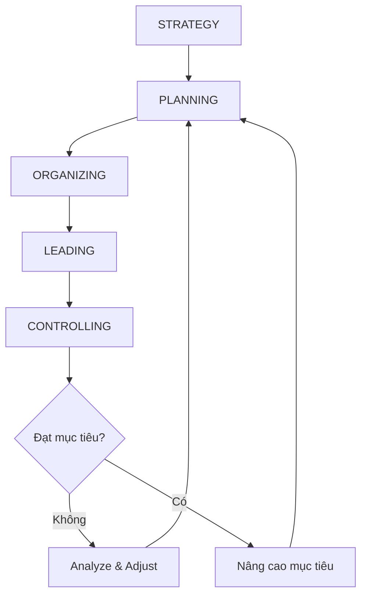

# F05 — Quản Trị Học
> *Management Theory — Từ Taylor đến Drucker: nền tảng khoa học quản lý*

---

## 1. Learning Objectives

Sau khi hoàn thành module này, người học có thể:
- Hiểu lịch sử phát triển các trường phái quản trị và ứng dụng của chúng
- Áp dụng 4 chức năng quản trị: Planning, Organizing, Leading, Controlling
- Phân biệt các phong cách lãnh đạo và khi nào dùng phong cách nào
- Sử dụng MBO và OKR để gắn kết mục tiêu cá nhân với tổ chức
- Hiểu tầm hạn quản lý (span of control) và thiết kế cơ cấu tổ chức

---

## 2. Business Context

Quản trị học là **khoa học và nghệ thuật hoàn thành công việc thông qua người khác**. Mọi manager — dù quản lý 2 người hay 2,000 người — đều cần hiểu các nguyên lý cơ bản này.

**Tại sao quan trọng:**
- Sự khác biệt giữa manager giỏi và kém thường là kiến thức quản trị, không phải chuyên môn kỹ thuật
- Nhiều chuyên gia giỏi lên quản lý nhưng thất bại vì thiếu kỹ năng quản trị
- Ở VN, nhiều chủ doanh nghiệp SME quản lý theo cảm tính → không scale được

---

## 3. Definitions

| Thuật ngữ | Định nghĩa |
|-----------|-----------|
| **Management** | Quá trình hoàn thành mục tiêu tổ chức thông qua người khác |
| **Leadership** | Tác động đến hành vi người khác thông qua ảnh hưởng phi cưỡng bức |
| **Span of Control** | Số người một manager trực tiếp quản lý |
| **Delegation** | Giao quyền và trách nhiệm cho cấp dưới |
| **MBO (Management by Objectives)** | Quản lý theo mục tiêu — Drucker |
| **OKR (Objectives & Key Results)** | Khung mục tiêu và đo lường kết quả — Intel/Google |
| **PDCA** | Plan-Do-Check-Act — vòng cải tiến liên tục (Deming) |
| **Bureaucracy** | Tổ chức dựa trên quy tắc, phân cấp rõ ràng (Weber) |

---

## 4. Core Concepts

### 4.1 Lịch sử các trường phái quản trị

```
TRƯỜNG PHÁI CLASSICAL (1890s-1930s)
  Taylor (1911): Scientific Management
  → Đo lường thời gian, chuẩn hóa công việc, thưởng theo năng suất
  → Ứng dụng VN: Sản xuất, logistics, call center

  Fayol (1916): Administrative Management
  → 14 Nguyên tắc quản lý (phân công, quyền hạn, kỷ luật...)
  → 5 chức năng: Plan, Organize, Command, Coordinate, Control

  Weber (1922): Bureaucratic Management
  → Tổ chức dựa trên luật lệ, phân cấp, chuyên môn hóa
  → Ứng dụng: Doanh nghiệp nhà nước, tập đoàn lớn VN

TRƯỜNG PHÁI NHÂN VĂN (1930s-1950s)
  Mayo (1933): Hawthorne Studies
  → Năng suất phụ thuộc vào yếu tố xã hội (sự chú ý, nhóm)

  Maslow (1943): Hierarchy of Needs
  → Nhu cầu từ thấp đến cao: Sinh lý → An toàn → Xã hội → Tôn trọng → Tự thể hiện

  Herzberg (1959): Two-Factor Theory
  → Hygiene factors (ngăn bất mãn) vs Motivators (tạo hài lòng)

TRƯỜNG PHÁI HIỆN ĐẠI (1960s-)
  McGregor (1960): Theory X vs Theory Y
  → X: Nhân viên lười, cần kiểm soát chặt
  → Y: Nhân viên tự chủ, cần trao quyền và tin tưởng

  Drucker (1954+): Management by Objectives, Knowledge Worker
  → MBO, self-management, hiệu quả hơn hiệu suất
```

### 4.2 Bốn chức năng quản trị (POLC)

```
1. PLANNING (Lập kế hoạch)
   ├── Strategic planning: 3-5 năm (Mission, Vision, Goals)
   ├── Tactical planning: 1 năm (Mục tiêu phòng ban)
   └── Operational planning: Hàng ngày/tuần (KPI, OKR)

2. ORGANIZING (Tổ chức)
   ├── Thiết kế cơ cấu tổ chức
   ├── Phân công công việc và quyền hạn
   └── Phối hợp giữa các bộ phận

3. LEADING (Lãnh đạo)
   ├── Tạo động lực (motivation)
   ├── Truyền thông và giao tiếp
   └── Phong cách lãnh đạo phù hợp

4. CONTROLLING (Kiểm soát)
   ├── Thiết lập tiêu chuẩn (KPI, SOP)
   ├── Đo lường thực tế
   ├── So sánh và phân tích sai lệch
   └── Hành động khắc phục
```

### 4.3 Phong cách lãnh đạo (Leadership Styles)

**Situational Leadership (Hersey & Blanchard):**
```
                 Hành vi hỗ trợ (Supportive)
                         Cao
                          │
                          │  Coaching      Participating
                          │  (S2)          (S3)
                          │
                 Thấp─────┼─────────────────────── Cao
                          │  Directing     Delegating
                          │  (S1)          (S4)
                          │
                         Thấp
                         Hành vi chỉ đạo (Directive)

S1 Directing:   Nhân viên mới, kỹ năng thấp → Chỉ đạo rõ ràng
S2 Coaching:    Kỹ năng tăng nhưng thiếu tự tin → Hướng dẫn + hỗ trợ
S3 Participating: Có năng lực nhưng thiếu động lực → Cùng tham gia
S4 Delegating:  Năng lực cao, tự chủ → Giao việc và buông tay
```

**Transactional vs Transformational:**
| | Transactional | Transformational |
|--|--------------|-----------------|
| Cơ sở | Thưởng/phạt | Tầm nhìn và giá trị |
| Phù hợp | Công việc routine | Thay đổi, sáng tạo |
| Ví dụ VN | KPI thưởng/phạt | CEO khởi nghiệp |

### 4.4 Tầm hạn quản lý và cơ cấu tổ chức

```
FLAT ORGANIZATION (Cơ cấu phẳng):
  CEO → Team Leads → Nhân viên
  Span of control: 8-15 người
  Phù hợp: Startup, công ty sáng tạo, Agile team
  Ưu điểm: Ra quyết định nhanh, ít overhead
  Nhược điểm: Khó scale, CEO bị overwhelm

HIERARCHICAL ORGANIZATION (Cơ cấu cấp bậc):
  CEO → VP → Director → Manager → Team Lead → Nhân viên
  Span of control: 5-8 người/cấp
  Phù hợp: Tổ chức lớn, công việc phức tạp, cần kiểm soát
  Ưu điểm: Phân công rõ ràng, kiểm soát tốt
  Nhược điểm: Chậm, bureaucracy, silo

MATRIX ORGANIZATION:
  Nhân viên báo cáo cho 2 người (functional manager + project manager)
  Phù hợp: Consulting, engineering, multinational
  Ưu điểm: Linh hoạt nguồn lực
  Nhược điểm: Xung đột quyền hạn, phức tạp
```

### 4.5 MBO và OKR

**MBO — Management by Objectives (Drucker):**
```
1. CEO/BOD đặt mục tiêu công ty
2. Manager và nhân viên cùng thảo luận và đặt mục tiêu cá nhân
3. Mục tiêu cá nhân align với mục tiêu công ty
4. Đánh giá theo mục tiêu đã thống nhất
5. Điều chỉnh chu kỳ tiếp theo
```

**OKR — Objectives & Key Results (Intel/Google):**
```
Objective: Định tính, inspiring, khó nhưng khả thi
Key Results: Định lượng, đo được, 3-5 KR per O

Ví dụ:
O: Trở thành thương hiệu café hàng đầu Hà Nội
KR1: Đạt 50,000 khách hàng thường xuyên (4.7+ review)
KR2: NPS đạt ≥ 70
KR3: Mở thêm 3 chi nhánh quận trung tâm
KR4: Doanh thu tăng 40% so với năm ngoái

OKR check-in: Hàng tuần
OKR scoring: 0-1.0 (0.6-0.7 = tốt; 1.0 = không đủ thách thức)
```

### 4.6 PDCA — Vòng cải tiến liên tục

```
PLAN → DO → CHECK → ACT
  ↑________________________________↓

PLAN:  Xác định vấn đề, phân tích nguyên nhân, lập kế hoạch
DO:    Thực hiện thí điểm (pilot) theo quy mô nhỏ
CHECK: Đánh giá kết quả so với mục tiêu
ACT:   Chuẩn hóa nếu thành công, hoặc điều chỉnh và lặp lại
```

---

## 5. Business Value

Áp dụng quản trị học hiệu quả:
- Tăng năng suất team 20-40% (theo nghiên cứu quản trị)
- Giảm turnover nhân sự qua lãnh đạo tốt
- Rút ngắn thời gian đưa ra quyết định
- Xây dựng văn hóa tổ chức mạnh

---

## 6. Enterprise Role

- **CEO/Founder:** Lãnh đạo, định hướng chiến lược, thiết kế cơ cấu
- **C-level:** POLC cho domain của mình
- **Manager:** Áp dụng situational leadership, thiết lập OKR
- **HR:** Hỗ trợ thiết kế cơ cấu, đào tạo kỹ năng quản lý

---

## 7. Departments Related

All departments · HR · Strategy · Executive team

---

## 8. Input

- Chiến lược công ty (Vision, Mission, Goals)
- Thông tin về năng lực nhân sự (performance data)
- Phản hồi từ nhân viên (surveys, 1-on-1s)
- Benchmark cơ cấu tổ chức ngành

---

## 9. Output

- Cơ cấu tổ chức (Org Chart)
- OKR/KPI framework
- Chính sách phân quyền (Delegation of Authority)
- Chính sách phong cách lãnh đạo/văn hóa

---

## 10. Business Process

```
1. Xác định chiến lược công ty (Strategy)
2. Thiết kế cơ cấu tổ chức phù hợp (Structure follows Strategy — Chandler)
3. Phân công vai trò và trách nhiệm (RACI)
4. Thiết lập hệ thống mục tiêu (OKR/MBO)
5. Lãnh đạo và tạo động lực team
6. Kiểm soát và review hiệu suất
7. Cải tiến liên tục (PDCA)
```

---

## 11. Data Flow

```
Strategy → OKR/KPI (mục tiêu rõ ràng)
         → Dashboard (theo dõi thực tế)
         → Performance review (so sánh)
         → Quyết định điều chỉnh
```

---

## 12. Money Flow

Quản trị tốt trực tiếp ảnh hưởng đến:
- Năng suất lao động (Revenue per Employee)
- Chi phí turnover (Cost to replace = 50-200% annual salary)
- Chi phí quản lý (Management overhead)

---

## 13. Document Flow

```
Vision/Mission (BOD) → Strategic Plan → OKR cascade
                     → Job descriptions → Offer letters
                     → Performance reviews → Promotion decisions
```

---

## 14. Roles

| Vai trò | Trách nhiệm quản trị |
|---------|---------------------|
| CEO | Xác định direction, thiết kế cơ cấu cấp cao |
| VP/Director | Thiết lập mục tiêu bộ phận, phát triển managers |
| Manager | Chuỗi POLC cho team, coaching nhân viên |
| Team Lead | Điều phối công việc hàng ngày, resolve blockers |

---

## 15. Responsibilities

- Manager chịu trách nhiệm về kết quả của team, không chỉ cá nhân
- Delegation không có nghĩa là escape accountability
- RACI phải rõ ràng: ai là Accountable (chỉ 1 người)

---

## 16. RACI

| Hoạt động | CEO | HR | Manager | Nhân viên |
|-----------|:---:|:--:|:-------:|:---------:|
| Thiết kế org structure | A | R | C | I |
| Thiết lập OKR công ty | A | C | I | I |
| Thiết lập OKR team | I | C | A | R |
| Performance review | I | C | A | R |
| Quyết định tăng lương | A | C | R | I |

---

## 17. Frameworks

- **Taylor's Scientific Management**
- **Fayol's 14 Principles**
- **Maslow's Hierarchy of Needs**
- **Herzberg's Two-Factor Theory**
- **McGregor Theory X/Y**
- **Situational Leadership (Hersey & Blanchard)**
- **MBO (Drucker)**
- **OKR (Grove/Doerr)**
- **PDCA (Deming)**

---

## 18. International Standards

- **ISO 9001:2015:** Áp dụng nguyên lý quản lý chất lượng
- **EFQM Excellence Model:** Khung đánh giá tổ chức xuất sắc
- **Malcolm Baldrige National Quality Award criteria**
- **SHRM Body of Competency & Knowledge** (HR Management)

---

## 19. Vietnam Context

**Đặc thù văn hóa quản lý VN:**
- **High Power Distance (Hofstede):** Cấp trên → cấp dưới, ít phản biện
  → Manager VN thường được kỳ vọng biết tất cả
  → Nhân viên ít tự chủ hơn so với phương Tây
- **Collectivism:** Quan hệ nhóm quan trọng, harmony được ưu tiên
  → Feedback thẳng thắn có thể gây mất mặt (face-saving)
  → Tốt hơn: Feedback 1-1, không công khai
- **Short-term orientation:** Ưu tiên kết quả ngắn hạn
  → OKR cần cycle ngắn (quý) thay vì năm

**Thực trạng quản lý SME VN:**
- Phần lớn SME dưới 50 người → founder trực tiếp quản lý → không scale
- Khi thuê manager đầu tiên → chuyển giao quyền hạn là thử thách lớn
- "Quản lý theo kiểu gia đình" (family-style management) → thiếu accountability rõ ràng

---

## 20. Legal Considerations

- **Bộ Luật Lao Động 2019:** Quy định về giờ làm việc, KPI không được là cớ để sa thải tùy tiện
- **Nội quy lao động:** Phải đăng ký với Sở LĐTBXH (doanh nghiệp ≥ 10 nhân viên)
- **Điều lệ công ty:** Phân quyền phải consistent với điều lệ đã đăng ký

---

## 21. Common Mistakes

1. **Promote technical expert thành manager** mà không đào tạo kỹ năng quản lý
2. **Micromanagement:** Quản lý quá chi tiết → nhân viên mất động lực
3. **Underdelegation:** Founder/CEO không buông tay → bottleneck
4. **OKR thành KPI:** OKR phải aspirational, không phải threshold
5. **Span of control quá rộng:** Manager quản lý 20+ người → quality suffers
6. **Không có 1-on-1:** Manager chỉ gặp team trong meeting → không biết vấn đề
7. **Org structure không theo chiến lược:** Structure trước Strategy — ngược chiều Chandler

---

## 22. Best Practices

- **1-on-1 hàng tuần** với từng direct report (30-45 phút)
- **OKR cascade** từ công ty → phòng ban → cá nhân
- **Feedback SBI model:** Situation-Behavior-Impact (thay vì phán xét)
- **Skip-level meeting:** CEO gặp nhân viên 2 cấp dưới để lắng nghe thực tế
- **Manager phát triển người thay thế mình** — không giữ người vì "cần họ"

---

## 23. KPIs

| KPI | Mục tiêu |
|-----|---------|
| **OKR completion rate** | 60-70% (0.6-0.7/1.0) |
| **Employee engagement score** | > 70% favorable |
| **Manager effectiveness score** (từ nhân viên) | > 4.0/5.0 |
| **Voluntary turnover** | < 10%/năm (tùy ngành) |
| **Internal promotion rate** | > 30% vị trí quản lý từ nội bộ |

---

## 24. Metrics

- Span of control trung bình
- Decision time (thời gian từ proposal đến quyết định)
- Meeting effectiveness (% meeting có clear outcomes)
- OKR alignment (% nhân viên có OKR align với công ty)

---

## 25. Reports

- **OKR Review Report** (hàng quý)
- **Organization Health Survey** (hàng năm)
- **Management Effectiveness 360** (hàng năm)
- **Org Chart & Headcount Report** (hàng tháng)

---

## 26. Templates

Xem [23-templates/](../../23-templates/):
- `RACI_TEMPLATE.md` — Phân công trách nhiệm

---

## 27. Checklists

**Review hiệu quả quản lý (hàng quý):**
- [ ] Đã có 1-on-1 đều đặn với từng direct report?
- [ ] OKR team có aligned với OKR công ty?
- [ ] Đã delegate đủ — không micromanage?
- [ ] Team có hiểu rõ priority không?
- [ ] Có nhân viên nào có nguy cơ nghỉ cao?
- [ ] Đã nhận đủ feedback từ team (upward feedback)?

---

## 28. SOP

**Quy trình 1-on-1 hàng tuần:**
```
Trước meeting (5 phút): Nhân viên chuẩn bị agenda
                         - Cập nhật OKR / tiến độ công việc
                         - Vấn đề cần hỗ trợ
                         - Phản hồi / câu hỏi

Trong meeting (30-45 phút):
  - 70% nhân viên nói, 30% manager nói
  - Không check email, tập trung hoàn toàn
  - Kết thúc bằng clear next actions

Sau meeting: Ghi lại action items, follow-up tuần sau
```

---

## 29. Case Study

**Vingroup — Chuyển từ quản lý gia đình sang chuyên nghiệp:**

Vingroup giai đoạn đầu do ông Phạm Nhật Vượng trực tiếp kiểm soát mọi quyết định lớn. Khi mở rộng sang VinFast, VinMec, VinSchool... cần thuê hàng loạt C-level quốc tế.

Thách thức: Văn hóa ra quyết định nhanh của founder vs quy trình governance của tập đoàn đa ngành.

Giải pháp: Duy trì ownership control ở cấp chiến lược, delegation rộng ở cấp vận hành, KPI rõ ràng cho C-level.

**Bài học:** Scaling từ startup lên tập đoàn đòi hỏi chuyển dịch management style từ founder-centric sang system-centric.

---

## 30. Small Business Example

**Chủ tiệm nail 10 nhân viên — Áp dụng Situational Leadership:**

Nhân viên mới (D1): Chưa biết làm, nhiệt tình → S1 Directing: Hướng dẫn từng bước
Nhân viên 3 tháng (D2): Biết cơ bản nhưng hay sai → S2 Coaching: Chỉ ra lỗi + giải thích
Nhân viên 1 năm (D3): Tay nghề tốt nhưng buồn chán → S3 Participating: Hỏi ý kiến, chia sẻ
Nhân viên 3 năm (D4): Tự chủ cao → S4 Delegating: Giao quản lý ca, độc lập

---

## 31. Enterprise Example

**FPT Software — OKR implementation:**

FPT Software áp dụng OKR từ 2018 cho 20,000+ nhân viên:
- Quy trình: CEO đặt O cấp công ty → Division cascade → Individual
- Tool: Jira + Excel (sau đó chuyển sang Workboard)
- Kết quả: Alignment tốt hơn, nhân viên hiểu rõ hơn contribution của mình
- Thách thức: Vẫn bị "OKR hóa thành KPI" ở một số bộ phận

---

## 32. ERP Mapping

| Chức năng | Module ERP | Ghi chú |
|-----------|-----------|---------|
| OKR/KPI tracking | HR Mgmt module | Một số ERP có tích hợp |
| Org chart | HCM (Human Capital Mgmt) | SAP SuccessFactors, Workday |
| Performance review | HR Performance | Thường cần HR software riêng |
| Delegation matrix | Không có sẵn | Phải document thủ công |

---

## 33. Automation Opportunities

- OKR software (Lattice, 15Five, Workboard) — theo dõi OKR tự động
- 360-degree feedback tool — thu thập phản hồi từ nhiều nguồn
- Org chart tự động update từ HRIS
- Meeting notes và action tracking (Notion, Confluence)

---

## 34. AI Opportunities

- AI summarize 1-on-1 meeting notes → gợi ý action items
- Phân tích engagement survey → predicting attrition risk
- AI coach cho manager (real-time leadership guidance)
- Tự động đề xuất OKR dựa trên strategy và historical performance

---

## 35. Implementation Guide

**Triển khai OKR lần đầu:**
```
Tháng 1: Đào tạo management team về OKR (2 buổi × 3 giờ)
Tháng 2: CEO + leadership team đặt OKR cấp công ty (1 workshop)
Tháng 2-3: Cascade OKR xuống phòng ban
Tháng 3: Đặt OKR cá nhân (mọi nhân viên)
Tháng 4: Check-in đầu tiên (weekly cadence)
Quý 2: Review cycle 1, điều chỉnh quy trình
```

---

## 36. Consulting Guide

**Chẩn đoán vấn đề quản trị:**
1. Ai đang ra quyết định gì? Có bottleneck không?
2. Nhân viên có biết mình cần làm gì để thành công không?
3. Span of control có phù hợp không?
4. Manager có được đào tạo kỹ năng quản lý không?
5. Có văn hóa accountability hay blame-shifting?

---

## 37. Diagnostic Questions

1. Bao lâu sau khi đề xuất thì nhận được quyết định?
2. Manager dành bao nhiêu % thời gian cho quản lý vs chuyên môn?
3. Nhân viên có hiểu OKR/mục tiêu công ty không?
4. Khi dự án trễ deadline, ai chịu trách nhiệm?
5. Lần cuối CEO nhận được feedback thẳng thắn từ nhân viên là khi nào?

---

## 38. Interview Questions

**Cho ứng viên Manager:**
- "Mô tả một tình huống bạn phải thay đổi phong cách lãnh đạo. Tại sao?"
- "Bạn delegate như thế nào? Làm sao biết mức nào thì delegate đủ?"
- "Bạn đã từng quản lý một nhân viên underperform. Bạn xử lý ra sao?"

**Cho ứng viên C-level:**
- "Bạn thiết kế cơ cấu tổ chức như thế nào khi scale từ 50 lên 200 người?"
- "Sự khác biệt của OKR so với KPI là gì? Bạn đã triển khai OKR chưa?"

---

## 39. Exercises

**Bài 1:** Vẽ Org Chart cho công ty thương mại 50 người: CEO, 3 phòng (Sales, Operations, Finance), mỗi phòng 15 người. Đề xuất span of control phù hợp.

**Bài 2:** Viết OKR cho quý tới cho vị trí Marketing Manager của startup về F&B tại HCM:
- 1 Objective aspirational
- 3 Key Results đo được

**Bài 3:** Nhân viên A làm 1 năm, tay nghề tốt nhưng gần đây hay đi trễ và effort giảm. Phân tích theo Herzberg và Situational Leadership → đề xuất cách tiếp cận.

---

## 40. References

- **Sách:** *The Practice of Management* — Peter Drucker
- **Sách:** *Measure What Matters* — John Doerr (OKR)
- **Sách:** *The One Minute Manager* — Blanchard & Johnson
- **Sách:** *First, Break All the Rules* — Marcus Buckingham (Gallup)
- **VN:** *Quản trị học* — ĐH Kinh tế Quốc dân
- **Online:** MindTools.com, Management Library (Free Management Library)

---

## Output Formats

### Mermaid — POLC Framework


### Flashcards
```
Q: Theory X vs Theory Y (McGregor) là gì?
A: X: Nhân viên lười, không thích làm việc, cần kiểm soát chặt.
   Y: Nhân viên tự chủ, tìm kiếm trách nhiệm, cần trao quyền.
   → Y phù hợp với knowledge workers hiện đại.

Q: Hygiene factors và Motivators (Herzberg) khác nhau thế nào?
A: Hygiene (lương, điều kiện làm việc): Thiếu → bất mãn. Đủ → không bất mãn nhưng chưa hẳn hài lòng.
   Motivators (thành tựu, phát triển): Có → tạo hài lòng và động lực thực sự.

Q: Tại sao OKR scoring 0.7 được coi là thành công?
A: OKR phải aspirational. Đạt 1.0 = mục tiêu không đủ thách thức.
   0.6-0.7 = đúng vùng stretch goal — đã cố gắng hết sức.
```

### Cheat Sheet
```
═══════════════════════════════════════════
        QUẢN TRỊ HỌC CHEAT SHEET
═══════════════════════════════════════════
4 CHỨC NĂNG: Planning → Organizing → Leading → Controlling

LEADERSHIP STYLES (Situational):
  S1 Directing:   Nhân viên mới, chỉ đạo rõ
  S2 Coaching:    Đang học, hướng dẫn + hỗ trợ
  S3 Participating: Có năng lực, cùng tham gia
  S4 Delegating:  Tự chủ cao, giao và buông

MOTIVATION:
  Maslow: Sinh lý → An toàn → Xã hội → Tôn trọng → Tự thể hiện
  Herzberg: Hygiene (ngăn bất mãn) + Motivators (tạo hài lòng)
  McGregor: Theory X (kiểm soát) vs Theory Y (trao quyền)

OKR:
  O: Định tính, aspirational
  KR: Định lượng, 3-5 per O
  Score 0.7 = success (không phải 1.0)

PDCA: Plan → Do → Check → Act → (lặp lại)
═══════════════════════════════════════════
```

### JSON Metadata
```json
{
  "module_code": "F05",
  "module_name": "Quản Trị Học",
  "domain": "Foundation",
  "level": "Foundation",
  "version": "1.0",
  "status": "complete",
  "prerequisites": ["F01"],
  "related_modules": ["F06", "HR05", "OP01", "S01"],
  "learning_time_hours": 8,
  "key_frameworks": ["POLC", "Situational Leadership", "OKR", "MBO", "PDCA", "Maslow", "Herzberg"],
  "key_standards": ["ISO 9001", "EFQM"],
  "vietnam_specific": true,
  "tags": ["management", "leadership", "OKR", "organization-design", "motivation", "PDCA"]
}
```
