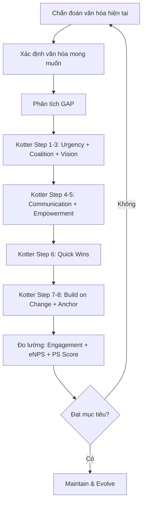

# F06 — Hành Vi Tổ Chức
> *Organizational Behavior — Tại sao người ta làm những gì họ làm trong tổ chức*

---

## 1. Learning Objectives

Sau khi hoàn thành module này, người học có thể:
- Hiểu các yếu tố ảnh hưởng đến hành vi cá nhân trong tổ chức
- Phân tích động lực nhóm và xây dựng team hiệu quả
- Chẩn đoán và thay đổi văn hóa tổ chức
- Quản lý xung đột và thúc đẩy hợp tác
- Thiết kế can thiệp change management khi tổ chức thay đổi

---

## 2. Business Context

Organizational Behavior (OB) là **nghiên cứu về cách người ta suy nghĩ, cảm nhận và hành động trong môi trường công việc**. Khác với quản trị học (F05) tập trung vào quy trình và cơ cấu, OB đi sâu vào yếu tố con người.

**Tại sao quan trọng:**
- 70% dự án thất bại do con người/văn hóa, không phải do kỹ thuật (McKinsey)
- Engagement thấp → năng suất thấp hơn 21% (Gallup)
- Văn hóa tổ chức mạnh → giảm turnover 30%, tăng revenue 20%

**Tại Việt Nam:** Nhiều doanh nghiệp VN có "văn hóa nể nang" — không dám phản biện cấp trên, không nói thật trong họp. Hiểu OB giúp xây dựng môi trường an toàn tâm lý (psychological safety).

---

## 3. Definitions

| Thuật ngữ | Định nghĩa |
|-----------|-----------|
| **Organizational Behavior (OB)** | Nghiên cứu hành vi con người trong bối cảnh tổ chức |
| **Organizational Culture** | Giá trị, niềm tin, hành vi được chia sẻ trong tổ chức |
| **Psychological Safety** | Cảm giác an toàn khi phát biểu ý kiến, thừa nhận sai lầm |
| **Group Dynamics** | Cách nhóm hình thành, tương tác và ra quyết định |
| **Groupthink** | Xu hướng đồng thuận quá mức trong nhóm → quyết định kém |
| **Conflict** | Bất đồng về mục tiêu, tài nguyên hoặc giá trị |
| **Change Management** | Quá trình lên kế hoạch và quản lý thay đổi tổ chức |
| **Organizational Commitment** | Mức độ gắn bó và trung thành với tổ chức |
| **Attribution Theory** | Cách người ta giải thích nguyên nhân của sự kiện/hành vi |

---

## 4. Core Concepts

### 4.1 Hành vi cá nhân — Individual Behavior

**Các yếu tố ảnh hưởng:**
```
TÍNH CÁCH (Personality):
  Big Five (OCEAN):
    Openness          — Cởi mở với trải nghiệm mới
    Conscientiousness — Cẩn thận, có tổ chức
    Extraversion      — Hướng ngoại, năng động
    Agreeableness     — Hòa nhã, hợp tác
    Neuroticism       — Ổn định cảm xúc (thấp = tốt)

  MBTI (phổ biến trong VN): INTJ, ENFP, v.v.
  DISC: D (Dominance), I (Influence), S (Steadiness), C (Conscientiousness)

NHẬN THỨC (Perception):
  Selective perception — Chú ý đến thông tin confirm niềm tin sẵn có
  Halo effect — Một đặc điểm tốt → đánh giá tốt toàn bộ
  Stereotyping — Áp đặt phán xét dựa trên nhóm
  Attribution error — Quy thành công cho bản thân, thất bại cho hoàn cảnh

GIÁ TRỊ VÀ THÁI ĐỘ (Values & Attitudes):
  Job satisfaction → Hiệu suất (nhưng không đơn giản là tương quan thuận)
  Organizational commitment: Affective / Continuance / Normative
```

### 4.2 Động lực — Motivation (tổng hợp)

```
THUYẾT NỘI DUNG (WHAT motivates):
  Maslow: Hierarchy of Needs (5 cấp)
  Herzberg: Hygiene + Motivators
  McClelland: Need for Achievement/Power/Affiliation

THUYẾT QUÁ TRÌNH (HOW motivation works):
  Equity Theory (Adams): So sánh Input/Output với người khác
    → Cảm giác bất công → giảm effort hoặc nghỉ việc
  Expectancy Theory (Vroom): Motivation = E × I × V
    E (Expectancy): Nỗ lực → Hiệu suất?
    I (Instrumentality): Hiệu suất → Phần thưởng?
    V (Valence): Phần thưởng có giá trị với tôi không?
  Goal-Setting Theory (Locke): SMART goals + feedback tăng hiệu suất

SELF-DETERMINATION THEORY (Deci & Ryan):
  Autonomy → Competence → Relatedness
  → Nội tâm (intrinsic) motivation bền vững hơn ngoại tác (extrinsic)
```

### 4.3 Nhóm và Team — Group Dynamics

**Tuckman's Stages of Group Development:**
```
FORMING     → Nhóm mới hình thành, lịch sự, dò xét
     ↓
STORMING    → Xung đột nổi lên, cạnh tranh vai trò
     ↓
NORMING     → Xây dựng chuẩn mực, đồng thuận
     ↓
PERFORMING  → Làm việc hiệu quả, tin tưởng lẫn nhau
     ↓
ADJOURNING  → Nhóm giải tán hoặc thay đổi thành viên
```

**Belbin Team Roles (9 vai trò trong team):**
```
Action-oriented:   Shaper | Implementer | Completer-Finisher
People-oriented:   Coordinator | Teamworker | Resource Investigator
Thought-oriented:  Plant | Monitor-Evaluator | Specialist
```

**Groupthink — Tránh bằng cách:**
- Chỉ định "Devil's Advocate" (người phản biện)
- Leader không bày tỏ quan điểm trước
- Anonymous voting trước khi thảo luận
- Pre-mortem analysis (giả sử dự án thất bại, lý do là gì?)

### 4.4 Văn hóa tổ chức — Organizational Culture

**Hofstede's Cultural Dimensions (áp dụng cho VN):**
```
Power Distance (PDI):  Cao ở VN → Nhân viên kính trọng, ít phản biện sếp
Individualism (IDV):   Thấp → Collectivist, quan hệ nhóm quan trọng
Masculinity (MAS):     Trung bình → Cân bằng performance và quality of life
Uncertainty Avoidance: Trung bình → Thích an toàn nhưng chấp nhận rủi ro
Long-term Orientation: Cao → Tiết kiệm, kiên nhẫn, đầu tư dài hạn
Indulgence:            Thấp → Kiềm chế hơn biểu đạt niềm vui
```

**Competing Values Framework (Quinn):**
```
                   FLEXIBILITY
                       │
          CLAN         │     ADHOCRACY
       (Văn hóa gia đình)  (Sáng tạo, đổi mới)
       HR, con người,    │   Entrepreneur, R&D
       gắn kết nội bộ   │
INTERNAL ─────────────┼───────────────── EXTERNAL
       HIERARCHY       │     MARKET
       (Quy trình, kiểm soát) (Kết quả, cạnh tranh)
       SOP, ISO, ổn định│   KPI, mục tiêu, ROI
                       │
                   STABILITY
```

**Thay đổi văn hóa:**
1. Chẩn đoán văn hóa hiện tại (khảo sát, phỏng vấn)
2. Xác định gap với văn hóa mong muốn
3. Thay đổi bắt đầu từ lãnh đạo (role modeling)
4. Câu chuyện và ritual (stories & rituals)
5. Thay đổi hệ thống khen thưởng (reinforce new behaviors)
6. Kiên trì — thay đổi văn hóa mất 3-7 năm

### 4.5 Xung đột và Đàm phán

**Thomas-Kilmann Conflict Modes:**
```
                  Assertiveness (Quyết đoán)
                         Cao
                          │
                     Competing  │  Collaborating
                     (Thắng-Thua)│  (Thắng-Thắng)
            Thấp ───────────────────────────── Cao
                  Avoiding    │  Accommodating
                  (Né tránh)  │  (Nhượng bộ)
                          │ Compromising
                         Thấp   (Trung dung)
                  Cooperativeness (Hợp tác)
```

**Khi nào dùng:**
- **Competing:** Khủng hoảng, quyết định cần nhanh, khi bạn đúng về vấn đề quan trọng
- **Collaborating:** Giải pháp quan trọng, cần commitment từ cả hai bên
- **Compromising:** Cân bằng quyền lực, thỏa thuận tạm thời
- **Avoiding:** Vấn đề nhỏ, cần thời gian giải tỏa cảm xúc
- **Accommodating:** Mình sai, vấn đề quan trọng hơn với họ

### 4.6 Change Management — Kotter's 8 Steps

```
1. Tạo cảm giác cấp bách (Urgency)
2. Xây dựng liên minh dẫn dắt (Coalition)
3. Hình thành tầm nhìn và chiến lược (Vision)
4. Truyền thông tầm nhìn rộng rãi (Communication)
5. Trao quyền hành động (Empowerment)
6. Tạo thắng lợi nhanh (Quick Wins)
7. Củng cố và mở rộng (Build on Change)
8. Neo đậu vào văn hóa (Anchor in Culture)
```

**Resistance to Change — ADKAR Model:**
```
A — Awareness (nhận thức về sự cần thiết thay đổi)
D — Desire (mong muốn tham gia thay đổi)
K — Knowledge (biết cách thay đổi)
A — Ability (có khả năng thực hiện thay đổi)
R — Reinforcement (củng cố, duy trì thay đổi)

Giải quyết từng bước — không thể nhảy cóc
```

---

## 5. Business Value

| Áp dụng | Tác động |
|---------|---------|
| Xây dựng psychological safety | Tăng innovation, giảm che giấu lỗi |
| Quản lý team theo Tuckman stages | Rút ngắn giai đoạn Storming |
| Thiết kế culture phù hợp chiến lược | Tăng execution speed |
| Quản lý xung đột hiệu quả | Giảm turnover, tăng collaboration |
| Change management bài bản | Tăng tỷ lệ thành công dự án lớn |

---

## 6. Enterprise Role

- **CEO:** Người định hình và bảo vệ văn hóa tổ chức
- **CHRO:** Chẩn đoán văn hóa, engagement, thiết kế can thiệp OB
- **Manager:** Tạo psychological safety trong team, quản lý xung đột
- **Change Manager:** Lập kế hoạch và thực hiện change management
- **OD (Org Development) Specialist:** Chuyên về OB, culture, team dynamics

---

## 7. Departments Related

HR · OD · Executive team · All departments (văn hóa ảnh hưởng tất cả)

---

## 8. Input

- Employee engagement survey
- 360-degree feedback
- Exit interview data
- Organizational Culture Assessment Instrument (OCAI)
- Observation và phỏng vấn (ethnographic methods)

---

## 9. Output

- Báo cáo văn hóa tổ chức (Culture Assessment Report)
- Change Management Plan
- Team effectiveness recommendations
- Leadership development interventions

---

## 10. Business Process

```
1. Chẩn đoán văn hóa hiện tại (survey + phỏng vấn)
2. Đối chiếu với văn hóa mong muốn (strategy alignment)
3. Xác định gaps và nguyên nhân
4. Thiết kế can thiệp (Interventions)
5. Triển khai (bắt đầu từ leadership team)
6. Đo lường thay đổi (pulse surveys, metrics)
7. Điều chỉnh liên tục
```

---

## 11. Data Flow

```
Surveys + Interviews + Observations
            ↓
OB Analysis (themes, patterns)
            ↓
Recommendations → Leadership decision
            ↓
Interventions → Culture programs
            ↓
Measurement → Next cycle
```

---

## 12. Money Flow

Văn hóa tổ chức tốt:
- Giảm cost of turnover (thay nhân viên = 50-200% annual salary)
- Tăng productivity (engaged employees = +21% profitability — Gallup)
- Giảm absenteeism (gắn kết cao = ít nghỉ phép)
- Dễ thu hút talent (employer brand)

---

## 13. Document Flow

```
Employee Feedback → HR Analysis → Leadership Review
                 → Culture Report → Strategy Alignment
                 → Action Plans → Communication
                 → Implementation → Measurement
```

---

## 14. Roles

| Vai trò | Trách nhiệm OB |
|---------|---------------|
| CEO | Role model cho văn hóa; tone-setter |
| CHRO | Chương trình culture, engagement |
| Manager | Micro-culture của team; 1-on-1s |
| HR BP (Business Partner) | Tư vấn managers về OB issues |
| OD Specialist | Thiết kế và thực hiện culture interventions |

---

## 15. Responsibilities

- Leaders chịu trách nhiệm về văn hóa của team mình
- HR cung cấp tools và data, không thể "đơn thân" thay đổi văn hóa
- Thay đổi văn hóa cần top-down AND bottom-up

---

## 16. RACI

| Hoạt động | CEO | CHRO | Manager | HR BP |
|-----------|:---:|:----:|:-------:|:-----:|
| Culture assessment | A | R | C | R |
| Culture strategy | A | R | C | I |
| Engagement programs | I | A | C | R |
| Change management | A | C | R | C |
| Team building | I | C | A | R |

---

## 17. Frameworks

- **Maslow's Hierarchy of Needs**
- **Herzberg's Two-Factor Theory**
- **Tuckman's Group Development Stages**
- **Belbin Team Roles**
- **Hofstede's Cultural Dimensions**
- **Competing Values Framework (Quinn)**
- **Kotter's 8-Step Change Model**
- **ADKAR Change Model**
- **Thomas-Kilmann Conflict Modes**
- **Psychological Safety (Amy Edmondson)**

---

## 18. International Standards

- **ISO 10018:** Quality management — People engagement
- **ISO 30414:** Human capital reporting (guidelines)
- **Gallup Q12:** Tiêu chuẩn đo lường engagement
- **Great Place to Work survey criteria**

---

## 19. Vietnam Context

**Đặc thù văn hóa doanh nghiệp VN:**

**"Nể nang" và Face-saving:**
- Nhân viên không dám nói thật với sếp → Sếp không biết vấn đề thực tế
- Giải pháp: Anonymous surveys, skip-level meetings, tạo văn hóa "fail fast"

**Chủ nghĩa tập thể (Collectivism):**
- Mối quan hệ cá nhân (guanxi) ảnh hưởng lớn đến ra quyết định
- Harmony được ưu tiên hơn là sự thật → cần tạo không gian riêng cho honest feedback

**Phân cấp quyền lực cao:**
- Nhân viên mong đợi sếp biết câu trả lời → tạo áp lực cho manager
- Thay đổi: Từ "sếp biết tất cả" sang "team cùng giải quyết"

**Gen Z Vietnam (sinh sau 1995):**
- Ưu tiên work-life balance và tự chủ cao hơn thế hệ trước
- Loyal với người quản lý trực tiếp hơn là với công ty
- Social media-driven: Review tiêu cực trên LinkedIn/Facebook lan nhanh

---

## 20. Legal Considerations

- **Bộ Luật Lao Động 2019:** Cấm phân biệt đối xử (giới tính, tôn giáo, dân tộc)
- **Bảo vệ whistleblower:** Chưa có luật riêng ở VN — rủi ro cho người tố cáo
- **Quy định nội quy lao động:** Các quy định về hành vi phải được đăng ký và thông báo rõ ràng

---

## 21. Common Mistakes

1. **Đặt "values đẹp" lên tường** nhưng không reinforced bằng hành vi thực tế
2. **Culture fit quá cao** → monoculture → thiếu diverse thinking
3. **Chỉ làm culture program** khi có vấn đề → không bền vững
4. **Manager không được training** về how to give feedback → feedback conversation tệ
5. **Ignore conflicts** cho đến khi nổ tung → mất người giỏi
6. **Change top-down chỉ** — không có bottom-up buy-in → resistance cao
7. **Survey engagement nhưng không action** → trust mất, engagement giảm thêm

---

## 22. Best Practices

- **Psychological Safety** là nền tảng — không có PS, mọi thứ khác không hoạt động
- **Manager quality** là yếu tố số 1 của engagement (Gallup research)
- **Consistent behavior from leaders** quan trọng hơn culture posters
- **Celebrate desired behaviors** — công nhận công khai người làm đúng values
- **Exit interview** là nguồn feedback trung thực nhất — dùng để cải thiện, không để defend

---

## 23. KPIs

| KPI | Mục tiêu |
|-----|---------|
| **eNPS (Employee NPS)** | > 30 (tốt), > 50 (xuất sắc) |
| **Voluntary turnover** | < Benchmark ngành |
| **Engagement score** (Gallup Q12) | > 70% engaged |
| **Psychological safety score** | > 4.0/5.0 |
| **Internal promotion rate** | > 30% |

---

## 24. Metrics

- Absenteeism rate (%)
- Time to productivity (nhân viên mới)
- Team effectiveness score
- Culture alignment score (survey)
- Conflict escalation rate

---

## 25. Reports

- **Annual Culture & Engagement Report**
- **Quarterly Pulse Survey** (quick check-in)
- **Exit Interview Analysis** (hàng quý)
- **Team Health Check** (post-project)

---

## 26. Templates

Xem [23-templates/](../../23-templates/):
- `RACI_TEMPLATE.md` — Phân công để tránh xung đột vai trò

---

## 27. Checklists

**Xây dựng Psychological Safety trong team:**
- [ ] Manager có tự thừa nhận sai lầm trước team không?
- [ ] Mọi ý kiến có được lắng nghe trong họp không (kể cả cấp dưới)?
- [ ] Có ai bị "phạt" vì nói thật không?
- [ ] Khi thất bại, team học hỏi hay blame?
- [ ] Nhân viên mới có dám đặt câu hỏi không?

**Change Management readiness:**
- [ ] Đã truyền thông "tại sao" thay đổi rõ ràng?
- [ ] Lãnh đạo đã thể hiện commitment với thay đổi?
- [ ] Đã xác định và xử lý các blockers chính?
- [ ] Đã tạo ra early wins để demonstrate value?
- [ ] Có kế hoạch sustain thay đổi sau giai đoạn launch?

---

## 28. SOP

**Quy trình phỏng vấn nghỉ việc (Exit Interview):**
```
1. Lên lịch trong 2 tuần cuối làm việc (không phải ngày cuối)
2. Người phỏng vấn là HR BP, không phải direct manager
3. Câu hỏi: Lý do nghỉ? Điều tốt nhất? Điều cần cải thiện?
         Manager? Team? Công cụ và quy trình?
4. Ghi chép → aggregate thematic → báo cáo leadership hàng quý
5. Action items từ exit interview → theo dõi implementation
```

---

## 29. Case Study

**Google — Project Aristotle và Psychological Safety:**

Google thực hiện nghiên cứu trên 180 teams để tìm hiểu team nào hoạt động tốt nhất. Kết quả bất ngờ: Không phải individual talent, không phải seniority, không phải IQ.

**Yếu tố số 1: Psychological Safety** — Mọi thành viên cảm thấy an toàn khi nói ý kiến, thừa nhận sai lầm, đặt câu hỏi ngớ ngẩn.

Các yếu tố tiếp theo: Dependability, Structure & clarity, Meaning, Impact.

**Ứng dụng VN:** Nhiều công ty VN có managers giỏi chuyên môn nhưng không tạo được PS → nhân viên giỏi nghỉ việc để đi chỗ có môi trường tốt hơn.

---

## 30. Small Business Example

**Tiệm bánh 8 người — Xung đột giữa 2 nhân viên chủ chốt:**

Bếp trưởng A và nhân viên phục vụ B mâu thuẫn về cách ra món (A muốn theo queue cứng, B muốn ưu tiên khách quen). Cả hai đều đúng từ góc độ của mình.

Áp dụng Thomas-Kilmann:
- Collaborating: Chủ tiệm tổ chức buổi gặp, cả 3 cùng thiết kế quy trình mới
- Kết quả: SOP ra món rõ ràng, có ngoại lệ được phép cho khách VIP

---

## 31. Enterprise Example

**Unilever Vietnam — Culture Transformation:**

Unilever VN thực hiện culture transformation hướng tới "Growth Mindset":
- Từ "sợ thất bại" sang "learn fast, fail cheap"
- Chương trình: Failure sharing sessions, innovation sprints
- KPI mới: Số sáng kiến được thử nghiệm (không chỉ thành công)
- Kết quả sau 3 năm: Engagement +15%, số innovation projects x3

---

## 32. ERP Mapping

| Chức năng OB | Module ERP/HR Tech | Ghi chú |
|-------------|-------------------|---------|
| Engagement survey | Workday, BambooHR | Thường dùng tool riêng (Culture Amp, Lattice) |
| Performance review | SAP SuccessFactors | Kết nối với culture values |
| Learning & Development | LMS (Moodle, Coursera) | OB training |
| Org chart | HCM module | Phản ánh structure |

---

## 33. Automation Opportunities

- **Pulse survey automation:** Tự động gửi survey ngắn hàng tuần
- **Sentiment analysis:** NLP phân tích tone trong internal communication
- **Attrition prediction:** ML dự đoán ai có nguy cơ nghỉ việc
- **Onboarding bot:** Tự động hướng dẫn nhân viên mới về culture và quy trình

---

## 34. AI Opportunities

- **AI Coach:** Gợi ý cách quản lý dựa trên hành vi và context
- **Meeting analysis:** AI phân tích ai nói trong họp, ai im lặng → phát hiện PS issues
- **Culture monitoring:** AI theo dõi patterns trong nội bộ communication
- **Personalized motivation:** AI đề xuất recognition approach phù hợp từng cá nhân

---

## 35. Implementation Guide

**Xây dựng Psychological Safety:**
```
Tháng 1: Đào tạo managers về PS (Amy Edmondson framework)
Tháng 2: Leaders thực hành "modeling vulnerability" (chia sẻ sai lầm)
Tháng 3: Thay đổi cách meetings được tổ chức (tất cả có cơ hội nói)
Tháng 4-6: Đo lường PS score định kỳ, recognize behaviors
Tháng 7+: Review và deepen practice
```

---

## 36. Consulting Guide

**Câu hỏi chẩn đoán văn hóa:**
1. Điều gì xảy ra với người đưa ra ý tưởng thất bại?
2. Khi có tin xấu, nhân viên có báo cáo sớm cho sếp không?
3. Trong họp, ai thường nói nhiều nhất? Có ai không bao giờ nói không?
4. Văn hóa được mô tả trên website có khớp với thực tế không?
5. Khi nhân viên giỏi nghỉ, lý do thực sự là gì?

---

## 37. Diagnostic Questions

1. eNPS hiện tại là bao nhiêu? Xu hướng thay đổi thế nào?
2. Turnover tự nguyện cao nhất ở team nào? Manager nào?
3. Nhân viên có biết chiến lược công ty không?
4. Lần cuối CEO họp trực tiếp với nhân viên tuyến đầu là khi nào?
5. Khi triển khai thay đổi lớn, tỷ lệ thành công là bao nhiêu?

---

## 38. Interview Questions

**Cho ứng viên HR/OD:**
- "Mô tả cách bạn chẩn đoán văn hóa tổ chức"
- "Bạn đã xử lý xung đột giữa 2 nhân viên quan trọng như thế nào?"
- "Psychological safety là gì và làm thế nào để xây dựng?"

**Cho ứng viên Manager:**
- "Mô tả văn hóa team bạn muốn xây dựng. Cụ thể bạn làm gì để tạo ra nó?"
- "Nhân viên của bạn có dám nói thẳng ý kiến với bạn không? Bạn biết điều đó như thế nào?"

---

## 39. Exercises

**Bài 1:** Phân tích văn hóa của công ty bạn (hoặc một công ty bạn biết) theo Competing Values Framework: Họ đang ở ô nào? Họ muốn ở ô nào? Gap là gì?

**Bài 2:** Tình huống: Team 6 người đang ở giai đoạn Storming (tranh cãi về ưu tiên). Với tư cách là Manager, bạn sẽ làm gì cụ thể trong tuần tới để đưa team sang Norming?

**Bài 3:** Công ty cần triển khai hệ thống ERP mới, lo ngại có nhiều kháng cự. Thiết kế change management plan theo ADKAR hoặc Kotter 8 bước cho 90 ngày đầu.

---

## 40. References

- **Sách:** *The Fearless Organization* — Amy Edmondson (Psychological Safety)
- **Sách:** *An Everyone Culture* — Kegan & Lahey (Deliberately Developmental Org)
- **Sách:** *Switch* — Chip Heath & Dan Heath (Change Management)
- **Research:** Gallup State of the Global Workplace (report hàng năm)
- **VN:** *Hành vi Tổ chức* — ĐH Kinh tế TP.HCM
- **Online:** TED Talk — Amy Edmondson "Building a Psychologically Safe Workplace"

---

## Output Formats

### Mermaid — Culture Change Process


### Flashcards
```
Q: Psychological Safety là gì?
A: Môi trường mà mọi người cảm thấy an toàn để phát biểu ý kiến,
   thừa nhận sai lầm, đặt câu hỏi mà không sợ bị trừng phạt hay xấu hổ.
   → Yếu tố số 1 của team hiệu quả (Google Project Aristotle).

Q: Groupthink là gì và nguy hiểm như thế nào?
A: Khi nhóm đồng thuận quá mức, né tránh bất đồng → Quyết định kém.
   Ví dụ: Bay of Pigs invasion (Kennedy). Giải pháp: Devil's Advocate.

Q: Kotter 8 Steps — tại sao Step 1 (Urgency) quan trọng nhất?
A: Nếu mọi người không tin thay đổi là cần thiết NGAY BÂY GIỜ,
   họ sẽ không invest effort. Urgency là nhiên liệu của change.
```

### Cheat Sheet
```
═══════════════════════════════════════════════
         HÀNH VI TỔ CHỨC CHEAT SHEET
═══════════════════════════════════════════════
MOTIVATION:
  Maslow: Sinh lý → An toàn → XH → Tôn trọng → Tự thể hiện
  Herzberg: Hygiene ≠ Motivate. Phân biệt 2 loại!
  Expectancy: Motivation = E × I × V

GROUP STAGES (Tuckman):
  Forming → Storming → Norming → Performing → Adjourning

CONFLICT MODES:
  Competing (Win-Lose) | Collaborating (Win-Win)
  Compromising | Avoiding | Accommodating

CULTURE (Competing Values):
  Clan (HR) | Adhocracy (Innovation)
  Hierarchy (Process) | Market (Results)

CHANGE (Kotter 8 Steps):
  1.Urgency 2.Coalition 3.Vision 4.Communicate
  5.Empower 6.QuickWins 7.Build 8.Anchor

PSYCHOLOGICAL SAFETY = Nền tảng của mọi thứ
═══════════════════════════════════════════════
```

### JSON Metadata
```json
{
  "module_code": "F06",
  "module_name": "Hành Vi Tổ Chức",
  "domain": "Foundation",
  "level": "Foundation",
  "version": "1.0",
  "status": "complete",
  "prerequisites": ["F01", "F05"],
  "related_modules": ["HR01", "HR03", "HR05", "CE04"],
  "learning_time_hours": 8,
  "key_frameworks": ["Tuckman", "Kotter", "ADKAR", "Hofstede", "Competing Values", "Thomas-Kilmann"],
  "key_standards": ["Gallup Q12", "ISO 10018"],
  "vietnam_specific": true,
  "tags": ["culture", "change-management", "team-dynamics", "motivation", "psychological-safety", "conflict"]
}
```
