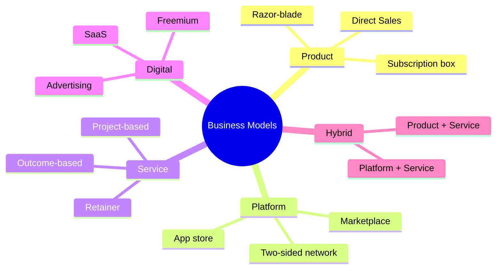

# B01 — Business Model
> *Thiết kế và phân tích mô hình kinh doanh: từ Business Model Canvas đến Lean Canvas và Blue Ocean*

---

## 1. Learning Objectives

Sau khi hoàn thành module này, người học có thể:
- Xây dựng và phân tích Business Model Canvas (BMC) cho bất kỳ doanh nghiệp nào
- Phân biệt các loại mô hình kinh doanh phổ biến và đặc điểm của từng loại
- Đánh giá tính bền vững và tiềm năng mở rộng của một business model
- Sử dụng Lean Canvas cho startup và doanh nghiệp đang pivot
- Áp dụng Blue Ocean Strategy để tìm không gian cạnh tranh mới

---

## 2. Business Context

Business Model là **cách doanh nghiệp tạo ra, cung cấp và nắm giữ giá trị**. Đây là câu hỏi cốt lõi: "Chúng ta kiếm tiền như thế nào?"

Mọi doanh nghiệp đều có business model — dù họ có ý thức thiết kế nó hay không. Sự khác biệt giữa startup thành công và thất bại thường nằm ở việc liệu business model có viable (khả thi), scalable (mở rộng được) và defensible (bảo vệ được) hay không.

**Tại Việt Nam:** Nhiều doanh nghiệp VN sao chép model từ nước ngoài mà không điều chỉnh cho thị trường địa phương. Hiểu sâu về business model giúp tránh bẫy này và tìm cơ hội differentiation.

---

## 3. Definitions

| Thuật ngữ | Định nghĩa |
|-----------|-----------|
| **Business Model** | Cách tổ chức tạo ra, cung cấp và nắm giữ giá trị |
| **Value Proposition** | Lợi ích cụ thể doanh nghiệp cung cấp cho khách hàng |
| **Revenue Model** | Cơ chế thu tiền từ khách hàng |
| **Unit Economics** | Kinh tế học trên 1 đơn vị (LTV, CAC, COGS per unit) |
| **Scalability** | Khả năng tăng doanh thu mà không tăng chi phí tương ứng |
| **Moat** | Lợi thế cạnh tranh bền vững, khó bắt chước |
| **Network Effect** | Giá trị sản phẩm tăng theo số người dùng |
| **Marketplace** | Model hai chiều kết nối buyer và seller |
| **SaaS** | Software as a Service — phần mềm theo dịch vụ đăng ký |
| **LTV** | Lifetime Value — tổng doanh thu từ 1 khách hàng trong vòng đời |
| **CAC** | Customer Acquisition Cost — chi phí để có 1 khách hàng mới |

---

## 4. Core Concepts

### 4.1 Business Model Canvas (BMC) — Osterwalder

```
┌──────────────┬──────────────┬──────────────┬──────────────┬──────────────┐
│  KEY         │  KEY         │  VALUE       │  CUSTOMER    │  CUSTOMER    │
│  PARTNERS    │  ACTIVITIES  │  PROPOSITION │  RELATIONS   │  SEGMENTS    │
│              ├──────────────┤              ├──────────────┤              │
│              │  KEY         │              │  CHANNELS    │              │
│              │  RESOURCES   │              │              │              │
├──────────────┴──────────────┴──────────────┴──────────────┴──────────────┤
│  COST STRUCTURE                    │  REVENUE STREAMS                    │
└────────────────────────────────────┴────────────────────────────────────-┘
```

**9 Building Blocks:**

| Block | Câu hỏi cốt lõi | Ví dụ Grab |
|-------|----------------|-----------|
| **Customer Segments** | Phục vụ ai? | Rider + Driver (2-sided market) |
| **Value Propositions** | Vấn đề gì được giải quyết? | Đặt xe nhanh, an toàn, giá rõ ràng |
| **Channels** | Tiếp cận KH qua đâu? | App, marketing online |
| **Customer Relations** | Quan hệ với KH ra sao? | Self-service + automated support |
| **Revenue Streams** | Thu tiền từ đâu? | Commission % mỗi chuyến |
| **Key Resources** | Cần tài nguyên gì? | App platform, driver network, brand |
| **Key Activities** | Phải làm gì? | Platform development, driver onboarding |
| **Key Partners** | Ai hỗ trợ? | Drivers, payment gateways, telecom |
| **Cost Structure** | Chi phí chính? | R&D, marketing, driver incentives |

### 4.2 Lean Canvas — Ash Maurya (cho Startup)

```
┌──────────────┬──────────────┬──────────────┬──────────────┬──────────────┐
│  PROBLEM     │  SOLUTION    │  UNIQUE VALUE│  UNFAIR      │  CUSTOMER    │
│              │              │  PROPOSITION │  ADVANTAGE   │  SEGMENTS    │
│  Existing    ├──────────────┤              ├──────────────┤              │
│  Alternatives│  KEY METRICS │              │  CHANNELS    │  Early       │
│              │              │              │              │  Adopters    │
├──────────────┴──────────────┴──────────────┴──────────────┴──────────────┤
│  COST STRUCTURE                    │  REVENUE STREAMS                    │
└────────────────────────────────────┴─────────────────────────────────────┘
```

**Khác BMC:** Lean Canvas tập trung vào **vấn đề và giải pháp** — phù hợp khi chưa tìm ra product-market fit.

### 4.3 Các loại Revenue Model

| Revenue Model | Mô tả | Ví dụ VN |
|--------------|-------|---------|
| **Product Sales** | Bán sản phẩm một lần | VinFast, Bitis |
| **Subscription / SaaS** | Phí định kỳ | MISA, Base.vn |
| **Transaction Fee** | % hoặc phí mỗi giao dịch | Grab, MoMo, VNPay |
| **Marketplace** | Hoa hồng từ buyer/seller | Shopee, Lazada, Tiki |
| **Freemium** | Miễn phí + trả tiền cho premium | Zalo, Cốc Cốc |
| **Advertising** | Thu tiền từ quảng cáo | Báo điện tử, YouTube Vietnam |
| **Licensing** | Nhượng quyền thương hiệu/IP | Phở 24, Trung Nguyên |
| **Service / Project** | Thu theo dự án | Consulting, IT outsourcing |
| **Razor-blade** | Bán rẻ thiết bị, lãi từ vật tư | Máy in + mực, máy lọc nước |
| **Data monetization** | Thu từ dữ liệu | Google, Facebook |

### 4.4 Unit Economics — Đánh giá tính khả thi

```
KEY METRICS:
  LTV (Lifetime Value)     = ARPU × Gross Margin × Average Lifespan
  CAC (Customer Acq Cost)  = Total Acquisition Spend / New Customers Acquired
  LTV/CAC Ratio            > 3x = healthy
  Payback Period           = CAC / Monthly Gross Profit per Customer

UNIT MARGIN:
  Contribution Margin/unit = Price - Variable Cost per unit
  Break-even units         = Fixed Cost / Contribution Margin per unit

VÍ DỤ:
  SaaS: LTV = $50/tháng × 80% GM × 24 tháng = $960
        CAC = $200
        LTV/CAC = 4.8x → tốt
        Payback = $200 / ($50 × 80%) = 5 tháng
```

### 4.5 Business Model Patterns phổ biến

**1. Platform / Marketplace (Two-sided network):**
```
Người bán ←── Platform ──→ Người mua
           \        /
            Network Effect
```
Giá trị tăng theo số lượng cả 2 phía. **Ví dụ:** Shopee, Grab, Airbnb VN.

**2. Subscription / Recurring Revenue:**
```
Khách hàng → Onboard → Activate → Retain → Expand → (→ Churn)
```
Mục tiêu: Tăng Activation Rate, giảm Churn, tăng Net Revenue Retention.

**3. Freemium Funnel:**
```
Free Users (rộng) → Power Users → Paying Users (hẹp)
    100%               30%              5-10%
```
Chìa khóa: Giá trị free phải đủ lớn để thu hút, nhưng premium phải đủ hấp dẫn để convert.

**4. Razor-and-Blade:**
```
Thiết bị giá thấp → Lock-in khách hàng → Bán vật tư/consumables margin cao
```

**5. Aggregator (So sánh giá):**
```
Nhà cung cấp A ─┐
Nhà cung cấp B ─┼─ Aggregator platform ── Khách hàng
Nhà cung cấp C ─┘
Thu tiền từ: Leads, commission, advertising
```

### 4.6 Blue Ocean Strategy — W. Chan Kim & Renée Mauborgne

```
RED OCEAN (Đại dương đỏ):   BLUE OCEAN (Đại dương xanh):
  Cạnh tranh trong không     Tạo ra không gian thị
  gian thị trường hiện có    trường mới, không có đối thủ
  Đánh bại đối thủ           Làm cho cạnh tranh không liên quan
  Khai thác cầu hiện có      Tạo ra và nắm bắt cầu mới
  Value vs Cost trade-off    Phá vỡ value-cost trade-off
```

**ERRC Grid (Eliminate-Reduce-Raise-Create):**
```
ELIMINATE: Yếu tố ngành coi là bắt buộc nhưng không tạo value
REDUCE:    Yếu tố cần giảm xuống dưới chuẩn ngành
RAISE:     Yếu tố cần tăng lên trên chuẩn ngành
CREATE:    Yếu tố hoàn toàn mới chưa có trong ngành
```

---

## 5. Business Value

| Ứng dụng | Kết quả |
|---------|---------|
| Thiết kế BMC cho startup | Validate model trước khi đầu tư |
| Phân tích BMC đối thủ | Tìm white space để differentiate |
| Unit economics | Biết lúc nào model thực sự profitable |
| Blue Ocean ERRC | Thoát khỏi cuộc chiến giá |

---

## 6. Enterprise Role

- **CEO/Founder:** Thiết kế và liên tục cải thiện business model
- **Strategy team:** Phân tích đối thủ, tìm cơ hội mới
- **Product/Marketing:** Validate value proposition với khách hàng
- **CFO:** Unit economics, financial viability của model
- **BD (Business Development):** Xác định partnerships và channels

---

## 7. Departments Related

Strategy · Product · Marketing · Sales · Finance · Operations

---

## 8. Input

- Market research (nhu cầu, pain points của khách hàng)
- Competitive analysis (đối thủ đang dùng model gì)
- Financial data (chi phí thực tế, doanh thu, gross margin)
- Customer interviews và feedback
- Industry reports

---

## 9. Output

- Business Model Canvas (1-page)
- Value Proposition Canvas
- Unit Economics model
- Revenue forecast (based on model assumptions)
- Business model stress test (what breaks first?)

---

## 10. Business Process

```
1. Phỏng vấn khách hàng → Hiểu pain points và jobs-to-be-done
2. Draft Value Proposition → Giải pháp cho pain points đó
3. Điền BMC → 9 building blocks
4. Tính Unit Economics → LTV, CAC, break-even
5. Stress test → "Điều gì cần đúng để model này hoạt động?"
6. Pilot/test → Validate với khách hàng thực tế
7. Iterate → Pivot hoặc scale dựa trên data
```

---

## 11. Data Flow

```
Customer insights (interviews, surveys, analytics)
            ↓
Business Model Canvas
            ↓
Financial model (Unit economics)
            ↓
Go-to-market strategy
            ↓
Execution → Metrics → Review → Iterate
```

---

## 12. Money Flow

BMC trực tiếp định hình dòng tiền:
- **Revenue Streams** → cách tiền vào
- **Cost Structure** → cách tiền ra
- **Unit Economics** → mỗi giao dịch lãi hay lỗ bao nhiêu

---

## 13. Document Flow

```
Customer Research → Value Proposition Canvas → BMC
                  → Financial Projections → Investor Deck
                  → Go-to-Market Plan → Execution roadmap
```

---

## 14. Roles

| Vai trò | Trách nhiệm |
|---------|------------|
| Founder/CEO | Sở hữu và liên tục cải tiến business model |
| Strategy/BizDev | Research, benchmarking, new model opportunities |
| Product Manager | Validate value prop với customer |
| CFO/Finance | Unit economics, revenue model optimization |

---

## 15. Responsibilities

- CEO chịu trách nhiệm cuối cùng về tính viable của business model
- Finance team cần validate financial assumptions trong model
- Product/Marketing cần validate customer assumptions

---

## 16. RACI

| Hoạt động | CEO | Finance | Product | Marketing |
|-----------|:---:|:-------:|:-------:|:---------:|
| Design BMC | A | C | R | C |
| Unit economics | C | A | C | I |
| Value prop validation | I | I | A | R |
| Revenue model decision | A | C | C | I |

---

## 17. Frameworks

- **Business Model Canvas** — Osterwalder & Pigneur
- **Lean Canvas** — Ash Maurya
- **Value Proposition Canvas** — Osterwalder
- **Blue Ocean Strategy (ERRC Grid)** — Kim & Mauborgne
- **Jobs-to-be-Done (JTBD)** — Clayton Christensen
- **Porter's Value Chain** — phân tích cost & value
- **Platform Theory** — Parker, Van Alstyne, Choudary

---

## 18. International Standards

- **ISO 56002:2019** — Innovation Management System (bao gồm business model innovation)
- **OECD Business Model Framework** — cho phân tích kinh tế doanh nghiệp
- **TOGAF** — Business Architecture layer bao gồm business model

---

## 19. Vietnam Context

**Mô hình kinh doanh phổ biến tại VN:**

| Loại | Ví dụ VN | Đặc thù |
|------|---------|---------|
| **F&B Chain** | Highlands, The Coffee House | Franchise-light, mở rộng nhanh |
| **E-commerce Marketplace** | Shopee VN, Tiki | Network effect, subsidized by investors |
| **Fintech** | MoMo, VNPay, TPBank | Regulatory-heavy, banking license barrier |
| **Real Estate** | Vinhomes, Nam Long | Capital-intensive, land bank critical |
| **EdTech** | ELSA, Topica | Mobile-first, English learning demand |
| **Ride-hailing** | Grab, Be | Two-sided market, driver incentives |
| **B2B SaaS** | MISA, Base, Getfly CRM | SME market, price-sensitive, need local support |

**Thách thức business model tại VN:**
- **Price sensitivity:** Khách hàng VN nhạy cảm giá → freemium và value-based pricing khó
- **Cash economy:** Tỷ lệ thanh toán tiền mặt cao → cản trở subscription/digital payment model
- **Counterfeit products:** Ảnh hưởng đến brand và pricing power
- **SME fragmentation:** Market phân mảnh → khó scale B2B nhanh

---

## 20. Legal Considerations

- **Luật Đầu tư 2020:** Một số business model cần giấy phép đặc biệt (fintech, healthcare, education)
- **Luật Thương mại điện tử 2013 + Nghị định 85/2021:** Sàn TMĐT phải đăng ký
- **Luật Cạnh Tranh 2018:** Mô hình giá predatory pricing có thể vi phạm
- **Luật Nhượng quyền (Nghị định 8/2018):** Franchise model cần đăng ký nhượng quyền

---

## 21. Common Mistakes

1. **Nhầm product với business model:** "Chúng tôi có sản phẩm tốt" không phải business model
2. **Bỏ qua unit economics:** Scale mà không biết CAC/LTV → đốt tiền vô định
3. **Copy model nước ngoài hoàn toàn:** Không điều chỉnh cho behavior người dùng VN
4. **Revenue ≠ Doanh thu:** Nhầm gross revenue với net revenue (sau returns, discounts)
5. **Bỏ qua Customer Segment:** Cố phục vụ tất cả → không phục vụ được ai tốt
6. **Không tính switching cost:** Mô hình không có lock-in → dễ mất khách hàng
7. **Mở rộng trước khi profitable tại core market:** Scale too fast, fix unit economics later

---

## 22. Best Practices

- **BMC trên 1 trang** — nếu không fit, model chưa rõ ràng
- **Validate assumptions sớm** — đặc biệt là "Will customers pay?"
- **Iterate thường xuyên** — BMC là living document, không phải đóng khung
- **Phân biệt hypothesis và fact** — màu code trong BMC: đỏ (chưa test), vàng (đang test), xanh (đã confirm)
- **Unit economics trước khi scale** — đảm bảo profitable ở small scale trước khi đầu tư lớn

---

## 23. KPIs

| KPI | Công thức | Benchmark |
|-----|-----------|-----------|
| **LTV/CAC** | LTV / CAC | > 3x (healthy), > 5x (great) |
| **Payback Period** | CAC / Monthly GM/customer | < 12 tháng (SaaS), < 6 tháng (e-com) |
| **Gross Margin** | (Revenue - COGS) / Revenue | > 50% (SaaS), > 20% (marketplace) |
| **Churn Rate** | Lost customers / Total customers | < 2%/tháng (SaaS) |
| **Net Revenue Retention** | Revenue từ existing KH / Kỳ trước | > 100% (expansion) |
| **Revenue Mix** | % Recurring / Total Revenue | Tăng dần → tốt |

---

## 24. Metrics

- Monthly Recurring Revenue (MRR) / Annual Recurring Revenue (ARR)
- Average Revenue Per User (ARPU)
- Customer cohort retention
- Gross Merchandise Value (GMV) — cho marketplace
- Take Rate — % hoa hồng cho marketplace

---

## 25. Reports

- **Business Model Review** (hàng năm — hoặc khi có tín hiệu thị trường lớn)
- **Unit Economics Report** (hàng quý)
- **Cohort Analysis** (hàng tháng — cho subscription/SaaS)
- **Competitive Model Analysis** (khi đối thủ ra move mới)

---

## 26. Templates

Xem [23-templates/](../../23-templates/):
- `CONSULTING_REPORT_TEMPLATE.md` — Trình bày business model analysis

---

## 27. Checklists

**Đánh giá Business Model:**
- [ ] Value proposition có rõ ràng và kiểm chứng được không?
- [ ] Unit economics: LTV/CAC > 3x?
- [ ] Có moat (lợi thế bảo vệ) không?
- [ ] Model có scalable không (chi phí tăng chậm hơn doanh thu)?
- [ ] Revenue có predictable/recurring không?
- [ ] Đã test với khách hàng thực tế chưa?
- [ ] Giả định lớn nhất trong model là gì? Đã validate chưa?

---

## 28. SOP

**Xây dựng BMC cho doanh nghiệp mới:**
```
Bước 1 (2h): Customer Discovery — phỏng vấn 5-10 khách hàng tiềm năng
Bước 2 (1h): Điền Value Proposition Canvas trước
Bước 3 (2h): Workshop điền BMC (team 3-5 người, sticky notes)
Bước 4 (1h): Tính Unit Economics sơ bộ (spreadsheet)
Bước 5 (1h): Xác định Top 3 giả định rủi ro nhất
Bước 6:      Design experiments để test từng giả định
Bước 7:      Review sau 4 tuần, update BMC
```

---

## 29. Case Study

**Tiki — Pivot từ Online Book Store đến Full Marketplace:**

**BMC ban đầu (2010):** Bán sách trực tuyến — inventory model, tự quản lý kho.

**Vấn đề:** Margin thấp, chi phí logistics cao, khó scale sang categories khác.

**Pivot (2013-2016):** Chuyển sang marketplace model — cho phép seller bên thứ ba. Giữ TikiNOW (fulfillment) như một premium service.

**Kết quả:** GMV tăng x10, nhưng cũng tạo ra thách thức mới về chất lượng seller và fake goods.

**Bài học:** Business model cần evolve theo thị trường. Tiki cân bằng 1P (direct) và 3P (marketplace) để giữ trust và scale.

---

## 30. Small Business Example

**BMC cho Tiệm Bánh Thủ Công tại HCM:**

```
Customer Segments:  Văn phòng quà tặng, cưới hỏi, sinh nhật
Value Proposition:  Bánh handmade không chất bảo quản, 
                    thiết kế theo yêu cầu, giao trong ngày
Channels:           Instagram, Facebook, Zalo OA, walk-in
Customer Relations: Personal (DM trực tiếp), community (group)
Revenue Streams:    Bánh bán lẻ, đặt theo yêu cầu, workshop làm bánh
Key Resources:      Kỹ năng làm bánh, thiết bị, nguyên liệu, brand IG
Key Activities:     Làm bánh, photography/content, giao hàng
Key Partners:       Nhà cung cấp nguyên liệu, shipper, wedding planner
Cost Structure:     Nguyên liệu, nhân công, marketing, thiết bị

Unit Economics:
  Giá trung bình: 500k/hộp bánh
  COGS: 200k → Gross margin 60%
  CAC (Instagram ads): 50k/khách mới
  Tần suất mua lại: 4 lần/năm
  LTV: 500k × 60% × 4 = 1.2tr/năm
  LTV/CAC = 24x → Excellent
```

---

## 31. Enterprise Example

**Masan Consumer — Multi-brand Portfolio Model:**

Masan không cạnh tranh trực tiếp với đối thủ — họ **mua lại và scale** các brand địa phương đang có traction:
- Chinsu (tương ớt, nước mắm) → dominant market share
- Kokomi (mì gói) → second-tier segment
- Vinacafé → cà phê hòa tan

**Business Model Moat:**
- **Distribution network:** 200k+ điểm bán lẻ → barrier to entry
- **Consumer insights:** Dữ liệu tiêu dùng từ WinMart → competitive intelligence
- **Brand portfolio:** Phủ từng phân khúc price point

---

## 32. ERP Mapping

| BMC Block | Dữ liệu trong ERP | Module |
|-----------|------------------|--------|
| Revenue Streams | Sales orders, invoices | SD (Sales & Distribution) |
| Cost Structure | Cost centers, P&L | CO (Controlling) |
| Key Resources | Assets, inventory | FI-AA, MM |
| Customer Segments | Customer master, CRM | SD + CRM |
| Channels | Sales channels | SD |

---

## 33. Automation Opportunities

- **Revenue model analytics** tự động (subscription metrics dashboard)
- **Unit economics tracking** — tự động tính LTV/CAC từ CRM + Finance data
- **Churn prediction** — alert khi customer showing churn signals

---

## 34. AI Opportunities

- **Business model benchmarking** — AI so sánh model của bạn với competitors
- **Price optimization** — ML tìm optimal price point theo segment
- **Market opportunity scanning** — AI identify Blue Ocean opportunities từ market data
- **Customer segmentation** — ML cluster khách hàng thực tế vs assumed segments

---

## 35. Implementation Guide

**Triển khai BMC review định kỳ:**
```
Hàng quý: CEO + C-level team (2 giờ)
  - Review BMC hiện tại
  - Có block nào đang "strained"?
  - Đối thủ đã thay đổi model gì?
  - Cần test hypothesis nào trong quý tới?

Hàng năm: Extended strategy session (1 ngày)
  - Full BMC redesign nếu cần
  - Blue Ocean ERRC exercise
  - 3-year business model evolution roadmap
```

---

## 36. Consulting Guide

**Chẩn đoán Business Model:**
1. Vẽ BMC hiện tại của công ty — có consistent không?
2. Unit economics có positive không? LTV/CAC?
3. Revenue có recurring hay one-time?
4. Moat là gì? Đối thủ có thể copy trong 12 tháng không?
5. Giả định lớn nhất chưa được validate là gì?

**Red flags:**
- "Chúng tôi phục vụ tất cả mọi người" → thiếu focus
- Gross margin < 15% với tech company → business model flawed
- CAC > 6 tháng payback → cash flow trap
- Không có retention data → không biết liệu có value thực sự không

---

## 37. Diagnostic Questions

1. Dòng doanh thu nào chiếm % lớn nhất? Có trend thay đổi không?
2. Chi phí tăng nhanh hơn hay chậm hơn doanh thu khi scale?
3. Tỷ lệ khách hàng quay lại là bao nhiêu? Trend?
4. Mất 1 month — công ty vẫn survive không?
5. Giả sử đối thủ lớn copy y hệt model — chúng ta có gì họ không có?

---

## 38. Interview Questions

**Cho ứng viên Strategy/BizDev:**
- "Phân tích business model của Grab tại VN. Điểm mạnh và rủi ro là gì?"
- "LTV/CAC ratio 2x có tốt không? Tại sao?"
- "Một công ty có gross margin 80% nhưng đang lỗ — điều đó có nghĩa gì?"

**Cho ứng viên CEO/Founder:**
- "Mô tả moat của công ty bạn. Đối thủ phải mất bao lâu để copy?"
- "Khi nào bạn biết đã đến lúc pivot business model?"

---

## 39. Exercises

**Bài 1:** Điền BMC cho một trong các công ty: Grab VN, Shopee VN, hoặc Vinamilk. Phân tích Revenue Streams và Cost Structure chính.

**Bài 2:** Tính Unit Economics cho startup sau:
- Giá gói SaaS: 500k/tháng
- COGS per user: 100k/tháng  
- Chi phí marketing tháng: 100tr, số KH mới: 200
- Average customer lifespan: 18 tháng
Tính: CAC, LTV, LTV/CAC, Payback period. Nhận xét.

**Bài 3:** Áp dụng ERRC Grid cho ngành taxi truyền thống. Điều gì Uber/Grab đã Eliminate, Reduce, Raise, Create?

---

## 40. References

- **Sách:** *Business Model Generation* — Osterwalder & Pigneur
- **Sách:** *Running Lean* — Ash Maurya
- **Sách:** *Blue Ocean Strategy* — Kim & Mauborgne
- **Sách:** *Platform Revolution* — Parker, Van Alstyne, Choudary
- **VN:** *Mô hình Kinh doanh* — Bản dịch Osterwalder
- **Online:** Strategyzer.com (công cụ BMC online miễn phí)

---

## Output Formats

### Mermaid — Business Model Types


### ASCII — BMC một trang
```
╔══════════╦══════════╦══════════════╦══════════╦══════════╗
║ KEY      ║ KEY      ║    VALUE     ║ CUSTOMER ║ CUSTOMER ║
║ PARTNERS ║ ACTIVITIES  PROPOSITION  RELATIONS  SEGMENTS  ║
║          ╠══════════╣              ╠══════════╣          ║
║          ║ KEY      ║              ║ CHANNELS ║          ║
║          ║ RESOURCES║              ║          ║          ║
╠══════════╩══════════╩══════════════╩══════════╩══════════╣
║     COST STRUCTURE              REVENUE STREAMS          ║
╚══════════════════════════════════════════════════════════╝
```

### Flashcards
```
Q: Khác nhau giữa BMC và Lean Canvas?
A: BMC: Phù hợp cho doanh nghiệp đã có model, muốn optimize.
   Lean Canvas: Phù hợp cho startup chưa biết problem/solution fit.
   Key diff: Lean Canvas có "Problem" và "Unfair Advantage" thay vì "Key Partners" và "Customer Relations".

Q: LTV/CAC ratio bao nhiêu là healthy?
A: > 3x = healthy; > 5x = great; < 1x = business model sẽ sụp đổ.
   Cũng cần check Payback Period: < 12 tháng với SaaS.

Q: Network effect là gì? Tại sao tạo ra moat?
A: Mỗi user mới tạo ra value cho user hiện có.
   → Giá trị tăng theo n², chi phí tăng theo n.
   → Sau khi đạt critical mass, rất khó bị disrupt.
```

### Cheat Sheet
```
══════════════════════════════════════════════
         BUSINESS MODEL CHEAT SHEET
══════════════════════════════════════════════
BMC 9 BLOCKS:
  Customer Segments | Value Propositions
  Channels | Customer Relations
  Revenue Streams | Key Resources
  Key Activities | Key Partners | Cost Structure

UNIT ECONOMICS:
  LTV = ARPU × GM% × Lifespan
  CAC = Spend / New Customers
  LTV/CAC > 3x = Healthy
  Payback = CAC / (Monthly Revenue × GM%)

REVENUE MODELS:
  Product | Subscription | Transaction %
  Marketplace | Freemium | Licensing
  Advertising | Service | Razor-blade

BLUE OCEAN ERRC:
  Eliminate | Reduce | Raise | Create
══════════════════════════════════════════════
```

### JSON Metadata
```json
{
  "module_code": "B01",
  "module_name": "Business Model",
  "domain": "Business",
  "level": "Foundation-Intermediate",
  "version": "1.0",
  "status": "complete",
  "prerequisites": ["F01", "F02", "F03"],
  "related_modules": ["B02", "S01", "FI01", "MK01", "SA01"],
  "learning_time_hours": 10,
  "key_frameworks": ["BMC", "Lean Canvas", "Blue Ocean", "JTBD", "Value Proposition Canvas"],
  "key_standards": ["ISO 56002"],
  "vietnam_specific": true,
  "tags": ["business-model", "BMC", "unit-economics", "revenue-model", "LTV", "CAC", "marketplace", "SaaS"]
}
```
