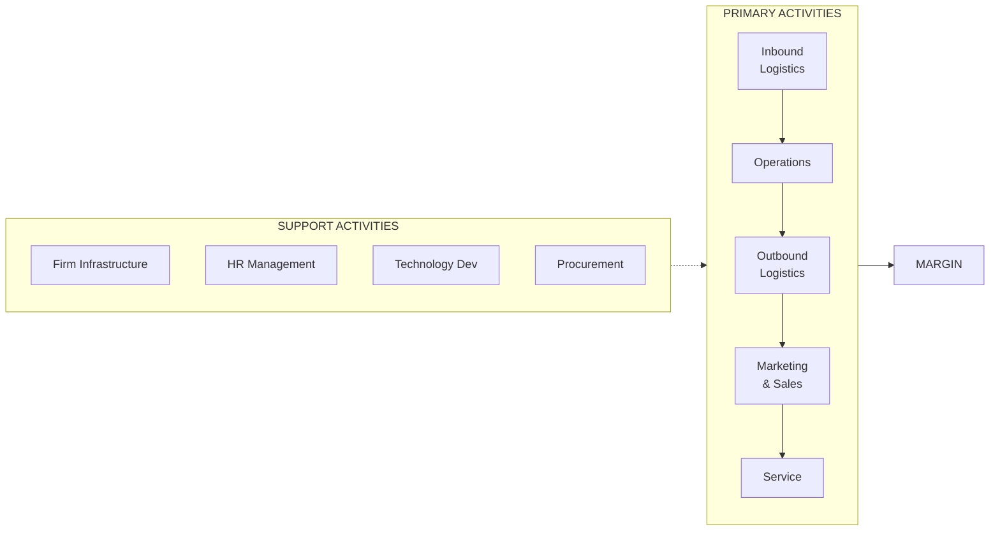

# B02 — Business Architecture
> *Thiết kế kiến trúc doanh nghiệp: từ Capability Map đến Value Chain và TOGAF*

---

## 1. Learning Objectives

Sau khi hoàn thành module này, người học có thể:
- Xây dựng Business Capability Map cho doanh nghiệp
- Phân tích Value Chain (chuỗi giá trị) theo Porter
- Thiết kế Operating Model phù hợp chiến lược
- Hiểu cơ bản về Enterprise Architecture (TOGAF)
- Áp dụng Business Architecture trong transformation project

---

## 2. Business Context

Business Architecture là **bản vẽ thiết kế của doanh nghiệp** — định nghĩa doanh nghiệp cần làm gì (capabilities), làm như thế nào (processes), ai làm (organization), và dùng gì (systems/technology).

**Khi nào cần Business Architecture:**
- Chuẩn bị triển khai ERP (cần biết quy trình AS-IS và TO-BE)
- Merger & Acquisition (tích hợp 2 tổ chức)
- Chuyển đổi số (số hóa phải follow business, không phải ngược lại)
- Scale nhanh (từ 50 người lên 500 người)
- Tái cơ cấu (restructuring)

**Tại Việt Nam:** Nhiều doanh nghiệp VN triển khai ERP thất bại vì không có Business Architecture — tức là không biết quy trình hiện tại của mình và không hình dung được quy trình tương lai.

---

## 3. Definitions

| Thuật ngữ | Định nghĩa |
|-----------|-----------|
| **Business Architecture** | Bản thể hiện chiến lược, quy trình, thông tin, và tổ chức của doanh nghiệp |
| **Business Capability** | Khả năng doanh nghiệp có thể làm (WHAT, không phải HOW) |
| **Operating Model** | Cách doanh nghiệp tổ chức và phối hợp để tạo ra giá trị |
| **Value Chain** | Chuỗi hoạt động từ đầu vào đến đầu ra tạo ra giá trị |
| **Process Architecture** | Toàn bộ các quy trình và mối quan hệ của chúng |
| **Enterprise Architecture (EA)** | Kiến trúc tổng thể: Business + Application + Data + Technology |
| **TOGAF** | The Open Group Architecture Framework — framework EA phổ biến nhất |
| **Capability Map** | Sơ đồ toàn bộ capabilities của doanh nghiệp |
| **Value Stream** | Chuỗi các bước tạo ra giá trị cho khách hàng từ đầu đến cuối |

---

## 4. Core Concepts

### 4.1 Business Capability Map

**Capability = WHAT doanh nghiệp có thể làm** (không phải HOW, không phải WHO, không phải WHAT SYSTEM)

```
CAPABILITY MAP — Ví dụ Công ty Thương mại:

Level 1 (Domains):        Level 2 (Capabilities):

Customer Management   →   Customer Acquisition
                          Customer Onboarding
                          Account Management
                          Customer Service

Sales & Revenue       →   Opportunity Management
                          Pricing & Quoting
                          Order Management
                          Contract Management

Supply Chain          →   Supplier Management
                          Procurement
                          Inventory Management
                          Logistics

Finance & Control     →   Financial Planning
                          Accounts Receivable/Payable
                          Financial Reporting
                          Cost Management

People & Organization →   Recruitment
                          Learning & Development
                          Performance Management
                          Payroll
```

**Heat Map (tô màu theo trạng thái):**
```
Xanh  = Capability mạnh, đủ hỗ trợ chiến lược
Vàng  = Capability trung bình, cần cải thiện
Đỏ    = Capability yếu, bottleneck chiến lược
Xám   = Capability không cần đầu tư thêm
```

### 4.2 Porter's Value Chain

```
PRIMARY ACTIVITIES (Hoạt động chính):
┌──────────┬──────────┬──────────┬──────────┬──────────┐
│ Inbound  │Operations│ Outbound │Marketing │ Service  │
│Logistics │          │Logistics │ & Sales  │          │
└──────────┴──────────┴──────────┴──────────┴──────────┘
                                                  ↑ MARGIN

SUPPORT ACTIVITIES (Hoạt động hỗ trợ):
  Firm Infrastructure (Finance, Legal, Management)
  Human Resource Management
  Technology Development (R&D, IT)
  Procurement
```

**Phân tích Value Chain:**
1. Xác định cost driver của từng activity
2. Xác định value driver (tạo ra differentiation)
3. So sánh với đối thủ để tìm competitive advantage
4. Quyết định make vs buy (outsource)

### 4.3 Operating Model

**4 loại Operating Model (Ross, Weill, Robertson):**

```
                    ĐỘ TÍCH HỢP (Business Unit Integration)
                         THẤP          CAO
                    ┌──────────────┬──────────────┐
    ĐỘ CHUẨN HÓA  │ Diversification │  Coordination │
    (Standardiz.) │  (Đa dạng hóa)  │  (Phối hợp)  │
         CAO      ├──────────────┼──────────────┤
                  │  Replication   │  Unification  │
         THẤP     │  (Nhân bản)    │  (Thống nhất) │
                  └──────────────┴──────────────┘
```

| Model | Mô tả | Ví dụ VN |
|-------|-------|---------|
| **Diversification** | BU độc lập, ít chia sẻ | Tập đoàn đa ngành (Vingroup các mảng khác nhau) |
| **Coordination** | BU độc lập nhưng chia sẻ khách hàng/data | Banking group với nhiều sản phẩm |
| **Replication** | BU giống nhau, không chia sẻ dữ liệu | Chuỗi bán lẻ, franchise |
| **Unification** | Quy trình và data chuẩn hóa toàn cầu | Sản xuất, logistics lớn |

### 4.4 Enterprise Architecture — TOGAF ADM

```
TOGAF ADM (Architecture Development Method):

        ┌────────────────────────────────┐
        │     Preliminary Phase          │
        │   (Chuẩn bị, phạm vi)         │
        └────────────┬───────────────────┘
                     ↓
        ┌────────────────────────────────┐
        │   Phase A: Architecture Vision │
        └────────────┬───────────────────┘
                     ↓
     ┌───────────────┼────────────────┐
     ↓               ↓               ↓
  Phase B:        Phase C:        Phase D:
  Business        Information     Technology
  Architecture    Systems Arch.   Architecture
     └───────────────┼────────────────┘
                     ↓
              Phase E & F:
              Opportunities & Migration Plan
                     ↓
              Phase G & H:
              Governance & Change Management
```

**Bốn layer của EA:**
```
Business Architecture  → Capabilities, Processes, Organization
Application Architecture → Business Applications, Interfaces
Data Architecture      → Data entities, flows, models
Technology Architecture → Infrastructure, Networks, Platforms
```

### 4.5 Process Architecture — Cấp độ quy trình

```
Level 0: Value Chains (3-5 chains)
   ↓
Level 1: Process Groups (10-20 groups)
   ↓
Level 2: Processes (50-200 processes)
   ↓
Level 3: Sub-processes
   ↓
Level 4: Procedures / Work Instructions
   ↓
Level 5: Activities / Tasks
```

**Ví dụ:**
```
L0: Customer-to-Cash (Order-to-Cash)
L1: Customer Inquiry → Quotation → Order → Delivery → Invoice → Collection
L2: Create Sales Order → Check Inventory → Pick & Pack → Ship → Invoice → AR
L3: (Chi tiết bút toán, phê duyệt, ngoại lệ)
```

---

## 5. Business Value

| Ứng dụng | Kết quả |
|---------|---------|
| Capability Map → ERP selection | Đặt đúng requirements, tránh customization thừa |
| Value Chain analysis | Tìm ra nơi cost và value thực sự ở đâu |
| Operating Model design | Tổ chức phù hợp chiến lược |
| Process Architecture | Nền tảng cho SOP, training, automation |

---

## 6. Enterprise Role

- **CEO/COO:** Quyết định Operating Model, phê duyệt Capability investments
- **CTO/CIO:** EA tổng thể, technology layer
- **Business Architect:** Thiết kế Business Architecture, Capability Map
- **Process Owner:** Chịu trách nhiệm về quy trình L2+
- **ERP Project Manager:** Dùng Business Architecture làm nền tảng requirements

---

## 7. Departments Related

Strategy · IT/Technology · Operations · Finance · HR · All business units

---

## 8. Input

- Business Strategy (để align capabilities)
- Current state documentation (org chart, process maps, systems inventory)
- Industry benchmarks (best-practice capability models)
- Stakeholder interviews (pain points, future needs)

---

## 9. Output

- Business Capability Map (L1, L2)
- Value Chain Analysis
- Operating Model document
- Process Architecture (L0-L2)
- Gap analysis: Current vs Target Architecture
- Transition roadmap

---

## 10. Business Process

```
1. Kickoff và scope definition
2. As-Is Assessment (current capabilities, processes, org, systems)
3. To-Be Design (target state aligned với strategy)
4. Gap Analysis (current vs target)
5. Prioritization (quick wins vs strategic investments)
6. Transition Roadmap
7. Governance (maintain architecture going forward)
```

---

## 11. Data Flow

```
Strategy documents + Current state data
            ↓
Business Architecture Workshop (stakeholders)
            ↓
Capability Map + Value Chain + Operating Model
            ↓
Process Architecture (L0-L2)
            ↓
ERP/System Requirements → Technology selection
            ↓
Implementation → Monitor → Update Architecture
```

---

## 12. Money Flow

Business Architecture định hướng đầu tư:
- **Invest:** Capabilities đỏ (yếu, quan trọng cho chiến lược)
- **Maintain:** Capabilities xanh (đủ tốt)
- **Outsource/automate:** Capabilities không tạo differentiation
- **Divest:** Capabilities không còn cần thiết

---

## 13. Document Flow

```
Strategy (Board/CEO)
      ↓
Business Architecture (BA team/Consultant)
      ↓
Process Maps (Process Owners)
      ↓
SOPs (Operational teams)
      ↓
System Requirements (IT/ERP)
      ↓
Implementation & Change Management
```

---

## 14. Roles

| Vai trò | Trách nhiệm |
|---------|------------|
| Business Architect | Thiết kế Capability Map, Value Chain, Operating Model |
| Process Architect | Level 2+ process design |
| Enterprise Architect | Kết nối Business → Tech architecture |
| COO/CIO | Sponsor, phê duyệt target architecture |
| Process Owner | Chịu trách nhiệm từng process L2 |

---

## 15. Responsibilities

- Business Architecture phải **follow chiến lược**, không phải follow hệ thống hiện tại
- Mỗi Capability phải có **Process Owner** rõ ràng
- Architecture phải là **living document** — cập nhật khi chiến lược thay đổi

---

## 16. RACI

| Hoạt động | CEO | COO/CIO | BA | Process Owner |
|-----------|:---:|:-------:|:--:|:-------------:|
| Capability Map | A | C | R | C |
| Operating Model | A | R | C | I |
| Process Architecture | I | A | C | R |
| Gap Analysis | I | C | R | C |
| Roadmap approval | A | C | R | I |

---

## 17. Frameworks

- **Porter's Value Chain** — Phân tích hoạt động tạo giá trị
- **TOGAF ADM** — Enterprise Architecture framework
- **Operating Model Canvas** — Ross, Weill, Robertson
- **Business Capability Model** — BizBok, OMG
- **APQC Process Classification Framework** — Chuẩn phân loại quy trình
- **Zachman Framework** — Enterprise Architecture matrix

---

## 18. International Standards

- **TOGAF 9.2** — The Open Group Architecture Framework
- **ArchiMate 3.1** — Ngôn ngữ mô hình hóa EA
- **BPMN 2.0** — Business Process Model and Notation
- **APQC PCF** — Process Classification Framework (benchmark ngành)
- **ISO 19510** — BPMN standard

---

## 19. Vietnam Context

**Thực trạng Business Architecture tại VN:**
- Phần lớn doanh nghiệp VN (kể cả lớn) không có Business Architecture chính thức
- "Quy trình" thường chỉ tồn tại trong đầu người lâu năm
- Khi triển khai ERP: consultant nước ngoài phải làm BA từ đầu (chi phí cao)

**Cơ hội:**
- Doanh nghiệp VN đang scale nhanh cần BA để không chaos
- FDI vào VN mang theo culture BA → lan rộng sang local companies
- Digital transformation bắt buộc phải có Process Architecture tốt

**Đặc thù:**
- Quy trình thường không document → phải extract từ interviews và observation
- Power Distance cao → Process Design thường top-down
- Nhiều quy trình "ngoại lệ" vì relationship-based business

---

## 20. Legal Considerations

- **Luật Doanh Nghiệp 2020:** Điều lệ công ty là Business Architecture ở cấp pháp lý cao nhất
- **ISO 9001:2015:** Yêu cầu documented process architecture (Quality Management System)
- **PCI-DSS, SOX:** Regulated industries cần documented architecture để comply
- **Thông tư 09/2020 NHNN:** Ngân hàng VN cần Business Architecture cho IT governance

---

## 21. Common Mistakes

1. **Nhầm Architecture với Org Chart:** Architecture là WHAT và HOW, không phải WHO
2. **Over-engineer quá chi tiết:** L4/L5 process trước khi L1/L2 ổn định
3. **Architecture thành "shelf document":** Làm xong rồi để đó, không maintain
4. **Bỏ qua stakeholder buy-in:** BA team làm một mình, không có người dùng
5. **Capability map quá chi tiết lần đầu:** Bắt đầu bằng L1, sau đó L2
6. **Confuse Capability với Process:** Capability = WHAT; Process = HOW
7. **Thiếu governance:** Không có ai chịu trách nhiệm cập nhật architecture

---

## 22. Best Practices

- **Start with Strategy alignment** — capabilities phải support chiến lược
- **L1 Capability Map trước, L2 sau** — đừng đi quá sâu quá sớm
- **Heat map ngay lập tức** — cho biết ngay đâu cần đầu tư
- **Living document** — review hàng năm hoặc khi có thay đổi chiến lược lớn
- **APQC PCF** — dùng làm baseline cho process classification (không phải viết từ đầu)
- **Workshop, không phải document** — tốt hơn là phỏng vấn và viết một mình

---

## 23. KPIs

| KPI | Mô tả |
|-----|-------|
| **Capability coverage** | % capabilities đã được documented và assigned owner |
| **Process documentation rate** | % L2 processes có SOP |
| **Architecture debt** | Số gaps giữa current và target architecture |
| **Technology alignment** | % systems mapped to business capabilities |
| **EA maintenance lag** | Tháng kể từ lần cập nhật cuối |

---

## 24. Metrics

- Số Business Capabilities được defined (L1, L2)
- % processes automated
- % ERP modules mapped to Capabilities
- Architecture review cycle time

---

## 25. Reports

- **Capability Heat Map** (hàng năm)
- **Architecture Roadmap Progress** (hàng quý)
- **Process Maturity Assessment** (hàng năm)
- **Technology-Business Alignment Report** (hàng năm)

---

## 26. Templates

Xem [23-templates/](../../23-templates/):
- `SOP_TEMPLATE.md` — Process Level 3+ documentation
- `RACI_TEMPLATE.md` — Accountability trong process architecture

---

## 27. Checklists

**Khởi động Business Architecture project:**
- [ ] Đã có strategy document để align?
- [ ] Đã xác định scope (toàn công ty vs 1 domain)?
- [ ] Đã có sponsor (COO/CIO level)?
- [ ] Đã lên kế hoạch stakeholder workshops?
- [ ] Đã chọn tool để document (Visio, Sparx EA, LeanIX, Orbus)?
- [ ] Đã định nghĩa governance (ai duyệt, ai maintain)?

---

## 28. SOP

**Quick Capability Mapping workshop (4 giờ):**
```
Giờ 1: Giới thiệu và warm-up
  - Giải thích Capability vs Process vs Org
  - Ví dụ về Capability Map ngành tương tự

Giờ 2: Brainstorm L1 Capabilities
  - Team (8-12 người) viết sticky notes
  - Group thành 5-8 domains
  - Đặt tên domains

Giờ 3: Drill down L2
  - Mỗi domain: liệt kê 4-8 capabilities con
  - Xác định boundaries (cái gì IN, cái gì OUT)

Giờ 4: Heat Map
  - Vote trên từng capability: Mạnh/TB/Yếu
  - Đánh dấu "Critical for strategy" (từ chiến lược công ty)
  - Xác định top 3 priorities để đầu tư

Output: L1+L2 Capability Map với heat map
```

---

## 29. Case Study

**FPT Software — Business Architecture cho Digital Transformation:**

FPT Software phải đồng thời:
1. Phục vụ outsourcing clients (cũ)
2. Phát triển own products (mới)
3. Scale từ 10,000 lên 30,000+ nhân viên

**Challenge:** Hai business model rất khác nhau cần hai Operating Model khác nhau.

**Giải pháp Business Architecture:**
- Tách rõ 2 Capability Maps: Outsourcing BU vs Product BU
- Chia sẻ capabilities: Talent (HR), Infrastructure, Finance
- Không chia sẻ: Sales approach, Delivery model, P&L

**Kết quả:** Rõ ràng hơn về đầu tư, tránh cross-subsidization, mỗi BU có accountability rõ ràng.

---

## 30. Small Business Example

**Chuỗi 5 cửa hàng thời trang — Cần Business Architecture khi scale lên 20:**

**Vấn đề:** Chủ không còn kiểm soát được quy trình, mỗi cửa hàng làm khác nhau.

**Giải pháp — Quick Capability Map:**
```
Customer:    Tư vấn bán hàng | Xử lý đơn hàng | CSKH
Merchandise: Mua hàng | Quản lý tồn kho | Visual merchandising  
Operations:  Quản lý cửa hàng | Nhân sự | Cash management
Marketing:   Brand | Loyalty | Promotions
Finance:     Doanh thu | Chi phí | Báo cáo
```

**Heat Map:** Inventory Management (đỏ), Customer Service (vàng), Finance (đỏ)
**Action:** Đầu tư vào POS + inventory system + SOP cho 3 capabilities đỏ trước.

---

## 31. Enterprise Example

**Vingroup — Architecture cho Tập đoàn Đa ngành:**

Vingroup operate across: Real Estate, Retail, Healthcare, Education, Auto, Tech.

**Operating Model: Diversification** (ít integration, ít standardization)
- Mỗi BU là P&L center độc lập
- Shared Services: Finance, Legal, HR (centralized)
- Brand: Shared "Vin" prefix nhưng độc lập về brand identity

**Capability Map cấp tập đoàn:**
- **Shared:** Capital allocation, Brand management, Government relations, Talent pipeline
- **BU-specific:** Mọi operational capabilities

---

## 32. ERP Mapping

| Business Architecture Layer | ERP Component |
|---------------------------|---------------|
| Capability: Order Management | SD module |
| Capability: Financial Reporting | FI module |
| Capability: Production Planning | PP module |
| Value Chain: Inbound Logistics | MM + WM |
| Value Chain: Operations | PP + QM |
| Process L2: Create Invoice | SD → FI integration |

---

## 33. Automation Opportunities

- **Process documentation tool:** Celonis (process mining từ ERP log)
- **Architecture management:** LeanIX, Orbus iServer (tự động sync với ERP)
- **Capability assessment:** Survey tools tự động collect heat map data

---

## 34. AI Opportunities

- **Process mining + AI:** Tự động discover actual processes từ system logs
- **Architecture recommendation:** AI đề xuất best-practice capability model cho ngành
- **Gap analysis automation:** AI so sánh current state với target và gợi ý gaps
- **Change impact analysis:** AI dự đoán impact khi thay đổi 1 capability

---

## 35. Implementation Guide

**Lộ trình xây dựng Business Architecture:**
```
Tháng 1-2: Foundation
  - Workshop L1 Capability Map (toàn bộ công ty)
  - Heat map: Xác định top 5 capabilities cần đầu tư
  - Assign Capability Owners

Tháng 3-4: Deep-dive
  - L2 Capability Map cho top 3 domains
  - Value Chain analysis
  - As-Is process documentation (L1-L2)

Tháng 5-6: Target State
  - To-Be Operating Model
  - Gap analysis
  - Transition roadmap

Tháng 7+: Governance
  - Quarterly architecture review
  - Update khi chiến lược thay đổi
```

---

## 36. Consulting Guide

**Cách bắt đầu Business Architecture engagement:**
1. "Hãy cho tôi xem chiến lược 3 năm" → Align capabilities với strategy
2. "Liệt kê 5 vấn đề vận hành lớn nhất" → Map vào capabilities yếu
3. "Bạn có process documentation không?" → Baseline assessment
4. "ERP/hệ thống của bạn làm tốt điều gì, yếu ở đâu?" → Tech-Business alignment

---

## 37. Diagnostic Questions

1. Capability nào đang là bottleneck cho tăng trưởng?
2. Quy trình nào chỉ có 1 người biết làm (single point of failure)?
3. Khi mở chi nhánh mới, mất bao lâu để fully operational?
4. Hệ thống nào đang support nhiều capabilities nhất? Nếu nó down, ảnh hưởng gì?
5. Ai là Process Owner của Order Management? Họ có biết họ là Process Owner không?

---

## 38. Interview Questions

**Cho ứng viên Business Architect:**
- "Capability và Process khác nhau thế nào? Cho ví dụ cụ thể."
- "Bạn đã build Capability Map chưa? Quy trình như thế nào?"
- "Khi nào Operating Model Replication vs Unification phù hợp?"

**Cho ứng viên CIO/CTO:**
- "Mô tả cách bạn align IT roadmap với Business Architecture."
- "TOGAF ADM bạn đã áp dụng ở đâu? Kết quả?"

---

## 39. Exercises

**Bài 1:** Xây dựng L1 Capability Map cho một trong các doanh nghiệp: Nhà hàng, Công ty thương mại, hoặc Trường học. Chia thành 5-7 domains, mỗi domain 3-5 capabilities.

**Bài 2:** Phân tích Value Chain của Vinamilk. Hoạt động nào là Primary? Hoạt động nào là Support? Đâu là nguồn lợi thế cạnh tranh?

**Bài 3:** Một công ty retail muốn triển khai ERP (Odoo). Họ cần làm gì trước khi bắt đầu ERP project theo Business Architecture approach?

---

## 40. References

- **Sách:** *Enterprise Architecture as Strategy* — Ross, Weill, Robertson
- **Sách:** *TOGAF 9.2 Standard* — The Open Group
- **Sách:** *Competitive Advantage* — Michael Porter (Value Chain)
- **Framework:** APQC Process Classification Framework (free download)
- **Tool:** ArchiMate (free modeling language), draw.io (free)
- **VN:** Chưa có sách VN chuyên về BA — dùng tài liệu quốc tế

---

## Output Formats

### Mermaid — Value Chain


### ASCII — Capability Map L1
```
╔══════════════════════════════════════════════════════╗
║              BUSINESS CAPABILITY MAP                  ║
╠══════════╦══════════╦══════════╦══════════╦══════════╣
║ Customer ║  Sales & ║  Supply  ║ Finance  ║  People  ║
║ Mgmt     ║ Revenue  ║  Chain   ║ & Control║  & Org   ║
╠══════════╬══════════╬══════════╬══════════╬══════════╣
║ Acquis.  ║ Opport.  ║ Supplier ║ Planning ║ Recruit  ║
╠══════════╬══════════╬══════════╬══════════╬══════════╣
║ Onboard  ║ Pricing  ║ Procure  ║ AR/AP    ║ L&D      ║
╠══════════╬══════════╬══════════╬══════════╬══════════╣
║ Account  ║ Order    ║ Inventory║ Reporting║ Perform. ║
╠══════════╬══════════╬══════════╬══════════╬══════════╣
║ Service  ║ Contract ║ Logistics║ Cost Mgmt║ Payroll  ║
╚══════════╩══════════╩══════════╩══════════╩══════════╝
🟢=Strong  🟡=Medium  🔴=Weak (needs investment)
```

### Flashcards
```
Q: Business Capability khác Process như thế nào?
A: Capability = WHAT doanh nghiệp có thể làm (ví dụ: "Inventory Management")
   Process = HOW cụ thể (ví dụ: "Quy trình nhập kho 5 bước")
   Một Capability có thể có nhiều Processes thực hiện nó.

Q: Khi nào dùng Operating Model Unification thay vì Replication?
A: Unification: Khi cần share data và processes (ví dụ: bank — cần thấy khách hàng trên all channels)
   Replication: Khi các BU giống nhau nhưng độc lập (ví dụ: chuỗi F&B — mỗi store giống nhau nhưng không cần share data)

Q: TOGAF ADM bắt đầu từ đâu?
A: Phase A: Architecture Vision — xác định phạm vi, stakeholders, business drivers.
   Trước đó là Preliminary Phase — thiết lập governance, team, tools.
```

### JSON Metadata
```json
{
  "module_code": "B02",
  "module_name": "Business Architecture",
  "domain": "Business",
  "level": "Intermediate-Advanced",
  "version": "1.0",
  "status": "complete",
  "prerequisites": ["F05", "B01"],
  "related_modules": ["B03", "S01", "OP01", "DA04", "ERP01"],
  "learning_time_hours": 12,
  "key_frameworks": ["TOGAF", "Porter Value Chain", "Operating Model Canvas", "APQC PCF", "ArchiMate"],
  "key_standards": ["TOGAF 9.2", "ArchiMate 3.1", "BPMN 2.0", "ISO 19510"],
  "vietnam_specific": true,
  "tags": ["business-architecture", "capability-map", "value-chain", "TOGAF", "operating-model", "process-architecture"]
}
```
