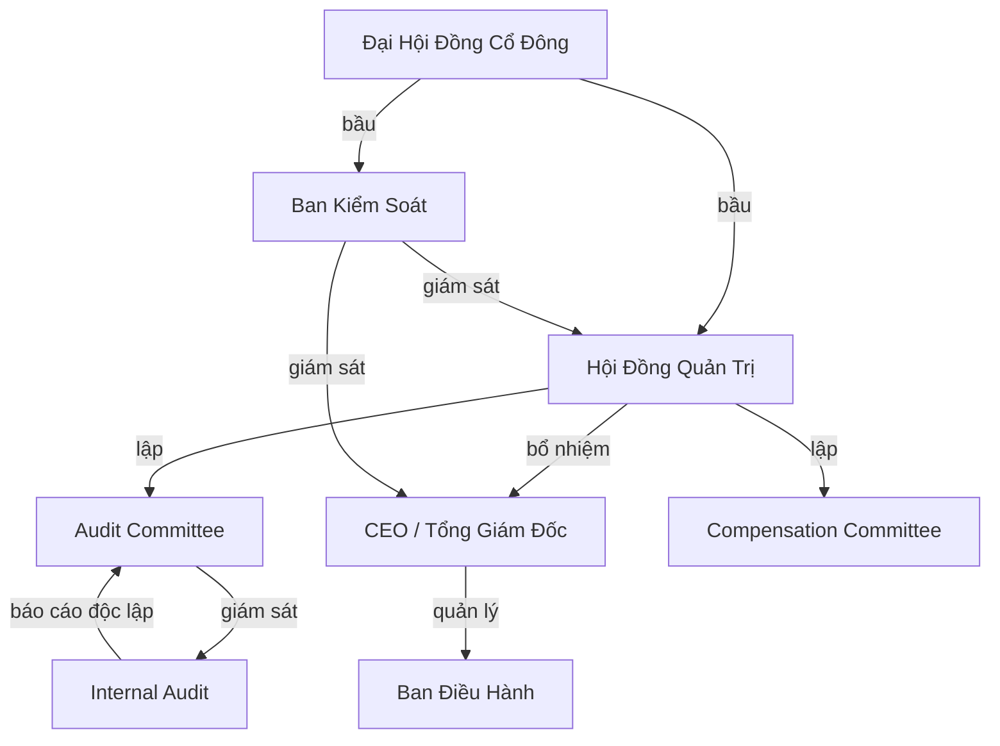

# B03 — Corporate Governance Intro
> *Quản trị doanh nghiệp: cơ cấu quyền lực, trách nhiệm giải trình và bảo vệ cổ đông*

---

## 1. Learning Objectives

Sau khi hoàn thành module này, người học có thể:
- Hiểu mục đích và nguyên tắc của Corporate Governance
- Thiết kế cơ cấu HĐQT/Ban kiểm soát phù hợp với giai đoạn doanh nghiệp
- Xây dựng Delegation of Authority (DOA) — Ma trận phân quyền
- Nhận diện và xử lý conflict of interest
- Hiểu các yêu cầu governance theo Luật Doanh Nghiệp 2020

---

## 2. Business Context

Corporate Governance là **hệ thống các quy tắc, thực hành và quy trình mà doanh nghiệp được điều hành và kiểm soát**. Nó trả lời câu hỏi: "Ai có quyền quyết định gì? Ai chịu trách nhiệm với ai?"

**Tại sao quan trọng:**
- **Bảo vệ cổ đông thiểu số** khỏi quyết định của cổ đông lớn
- **Ngăn ngừa gian lận** qua các cơ chế kiểm soát và giám sát
- **Thu hút đầu tư** — nhà đầu tư quốc tế đòi hỏi governance chuẩn
- **Cải thiện hiệu quả** qua phân quyền rõ ràng và accountability

**Tại Việt Nam:** Nhiều doanh nghiệp gia đình và SME có governance lỏng lẻo. Khi cần vay vốn ngân hàng lớn, IPO, hoặc bán cổ phần cho nhà đầu tư — governance yếu trở thành dealbreaker.

---

## 3. Definitions

| Thuật ngữ | Định nghĩa |
|-----------|-----------|
| **Corporate Governance** | Hệ thống quy tắc và thực hành điều hành và kiểm soát doanh nghiệp |
| **Board of Directors (HĐQT)** | Cơ quan quản lý cao nhất, đại diện cổ đông |
| **Supervisory Board (Ban Kiểm Soát)** | Giám sát HĐQT và Ban Điều Hành |
| **Independent Director** | Thành viên HĐQT không thuộc Ban Điều Hành, không có lợi ích liên quan |
| **Audit Committee** | Ủy ban thuộc HĐQT, giám sát kiểm toán và báo cáo tài chính |
| **Delegation of Authority (DOA)** | Ma trận phân quyền — ai được phép quyết định gì và đến mức nào |
| **Conflict of Interest** | Tình huống lợi ích cá nhân xung đột với lợi ích công ty |
| **Related Party Transaction** | Giao dịch với bên liên kết (gia đình, công ty liên quan) |
| **Transparency** | Công khai thông tin để stakeholders có thể đánh giá đúng |
| **Accountability** | Nghĩa vụ giải trình về kết quả và hành động |

---

## 4. Core Concepts

### 4.1 Nguyên tắc Governance cốt lõi — OECD Principles

```
1. ACCOUNTABILITY   — Ai chịu trách nhiệm với ai về điều gì
2. TRANSPARENCY     — Công khai thông tin đầy đủ, kịp thời, chính xác
3. FAIRNESS         — Đối xử công bằng với tất cả cổ đông
4. RESPONSIBILITY   — Trách nhiệm với stakeholders (KH, nhân viên, XH)
5. INDEPENDENCE     — Kiểm soát độc lập, tránh conflict of interest
```

### 4.2 Cơ cấu quản trị theo Luật Doanh Nghiệp 2020

**Mô hình 1 (Công ty TNHH):**
```
Hội đồng Thành viên (HĐThành Viên)
       ↓ bầu/bổ nhiệm
Chủ tịch Hội Đồng Thành Viên
       ↓
Giám đốc / Tổng Giám Đốc (điều hành)
       ↓
Ban Kiểm Soát (nếu có > 11 thành viên góp vốn hoặc điều lệ quy định)
```

**Mô hình 2 (Công ty Cổ Phần — Phổ biến):**
```
Đại Hội Đồng Cổ Đông (ĐHĐCĐ) — quyền lực cao nhất
       ↓ bầu
Hội Đồng Quản Trị (HĐQT) — quản lý chiến lược
       ↓ bổ nhiệm
Giám Đốc / Tổng Giám Đốc — điều hành hàng ngày
       ↓
Ban Kiểm Soát (do ĐHĐCĐ bầu, độc lập với HĐQT)
```

**Mô hình 3 (Công ty Cổ Phần — Không có Ban Kiểm Soát):**
```
ĐHĐCĐ
   ↓
HĐQT (có ít nhất 1/5 là thành viên độc lập)
   ↓ (có Ủy ban Kiểm Toán nội bộ)
Giám Đốc
```

### 4.3 Vai trò và Trách nhiệm của HĐQT

```
HĐQT CHỊU TRÁCH NHIỆM VỀ:
├── Chiến lược dài hạn (phê duyệt, không soạn thảo)
├── Phê duyệt ngân sách hàng năm và kế hoạch kinh doanh
├── Bổ nhiệm và đánh giá CEO/TGĐ
├── Giám sát rủi ro trọng yếu
├── Phê duyệt giao dịch lớn (vượt ngưỡng DOA)
├── Phê duyệt BCTC hàng năm
├── Đề xuất cổ tức cho ĐHĐCĐ
└── Đảm bảo tuân thủ pháp luật

CEO/TGĐ CHỊU TRÁCH NHIỆM VỀ:
├── Điều hành hàng ngày
├── Thực thi chiến lược đã HĐQT phê duyệt
├── Quản lý nhân sự cấp cao
├── P&L và cash flow
└── Báo cáo định kỳ cho HĐQT
```

### 4.4 Delegation of Authority (DOA) — Ma trận phân quyền

```
DOA định nghĩa: Ai có thể phê duyệt gì và đến mức tiền nào?

LOẠI GIAO DỊCH    │ Team Lead │ Manager │   Director  │  CEO   │  HĐQT
──────────────────┼───────────┼─────────┼─────────────┼────────┼────────
Chi phí vận hành  │ ≤ 5tr     │ ≤ 50tr  │  ≤ 500tr    │≤ 5tỷ  │ > 5tỷ
Ký hợp đồng       │ -         │ ≤ 100tr │  ≤ 1tỷ      │≤ 10tỷ │ > 10tỷ
Tuyển dụng        │ -         │ Nhân viên│ Manager    │C-level │ C-level+
Bán tài sản       │ -         │ -        │ -           │≤ 5tỷ  │ > 5tỷ
Đầu tư mới        │ -         │ -        │ -           │≤ 10tỷ │ > 10tỷ
```

**Nguyên tắc thiết kế DOA:**
- **Dual control:** Giao dịch lớn cần 2 chữ ký độc lập
- **Segregation of Duties:** Người phê duyệt ≠ người thực hiện ≠ người kiểm tra
- **Escalation path:** Vượt ngưỡng → escalate lên cấp cao hơn
- **Delegation can be revoked:** Phân quyền không thay thế accountability

### 4.5 Conflict of Interest — Nhận diện và quản lý

**Các loại phổ biến:**
```
Related Party Transactions (RPT):
  CEO ký hợp đồng với công ty của vợ/chồng
  → Phải công khai, phải được HĐQT độc lập phê duyệt

Self-dealing:
  HĐQT member mua tài sản của công ty cho bản thân
  → Vi phạm fiduciary duty

Information asymmetry:
  Insider trading — dùng thông tin nội bộ để giao dịch cổ phiếu
  → Bất hợp pháp (Luật Chứng khoán 2019)

Personal benefit at company expense:
  Dùng xe công ty, chi phí công ty cho mục đích cá nhân
  → Cần chính sách rõ ràng và kiểm soát
```

**Quy trình xử lý Conflict of Interest:**
```
1. Disclosure: Tất cả potential conflicts phải được khai báo
2. Recusal: Người có conflict không tham gia bỏ phiếu
3. Approval by independent party: HĐQT độc lập phê duyệt RPT
4. Documentation: Ghi lại tất cả disclosures và decisions
5. Monitoring: Audit định kỳ
```

### 4.6 HĐQT hiệu quả — Best Practices

```
CƠ CẤU:
  - Quy mô: 5-9 thành viên (quá ít: risk concentration; quá nhiều: khó quyết định)
  - Độc lập: ≥ 1/3 independent directors (tiêu chuẩn quốc tế)
  - Đa dạng: Gender, background, expertise (tài chính, ngành, pháp lý)
  - Separation of roles: Chairman ≠ CEO (best practice)

HOẠT ĐỘNG:
  - Họp HĐQT: ≥ 4 lần/năm (plus ad-hoc khi cần)
  - Agenda chuẩn bị trước ≥ 7 ngày
  - Board pack: Báo cáo KPI, financial, risk, strategy update
  - Minutes chi tiết, được ký duyệt

ỦY BAN (Committees):
  - Audit Committee: Giám sát BCTC, internal audit, external audit
  - Compensation Committee: Lương HĐQT, C-level
  - Nomination Committee: Ứng viên HĐQT, CEO succession
  - Risk Committee: Chiến lược quản lý rủi ro
```

---

## 5. Business Value

| Governance tốt | Tác động |
|---------------|---------|
| DOA rõ ràng | Quyết định nhanh hơn, ít bottleneck |
| Conflict of interest managed | Giảm rủi ro gian lận, litigation |
| HĐQT độc lập | Thu hút investor, lãi vay tốt hơn |
| Transparency | IPO-ready, M&A-ready |

---

## 6. Enterprise Role

- **Chủ tịch HĐQT (Chairman):** Dẫn dắt HĐQT, đảm bảo governance
- **CEO/TGĐ:** Báo cáo HĐQT, thực thi chiến lược
- **Company Secretary:** Quản lý admin governance (biên bản, thông báo, compliance)
- **General Counsel/Legal:** Tư vấn pháp lý cho HĐQT
- **CFO:** Báo cáo tài chính cho HĐQT, ký duyệt BCTC
- **Internal Audit:** Giám sát độc lập, báo cáo Audit Committee

---

## 7. Departments Related

Legal · Finance · Audit · C-Suite · Board · Shareholders

---

## 8. Input

- Điều lệ công ty
- Quy chế hoạt động HĐQT
- BCTC (cho Board Pack)
- Báo cáo rủi ro và compliance
- Phản hồi từ kiểm toán bên ngoài

---

## 9. Output

- Biên bản họp HĐQT (Board Minutes)
- Nghị quyết HĐQT (Board Resolutions)
- Báo cáo thường niên (Annual Report) — nếu niêm yết
- DOA document
- Conflict of Interest register
- Board evaluation report (hàng năm)

---

## 10. Business Process

```
1. Lịch họp HĐQT hàng năm (4-6 lần)
2. Chuẩn bị Board Pack (CFO, CEO, Legal)
3. Phân phối Board Pack trước 7 ngày
4. Họp HĐQT — thảo luận, bỏ phiếu
5. Lập biên bản (Company Secretary)
6. Ký biên bản, phát hành Nghị quyết
7. Theo dõi thực hiện Nghị quyết (Action tracking)
8. Báo cáo ĐHĐCĐ hàng năm
```

---

## 11. Data Flow

```
Business data (Finance, Risk, Operations)
            ↓
Board Pack (CFO + CEO + Legal)
            ↓
HĐQT review và phê duyệt
            ↓
Nghị quyết → Thực thi bởi Management
            ↓
Monitoring → Next Board meeting
```

---

## 12. Money Flow

Governance kiểm soát dòng tiền qua:
- **DOA:** Phê duyệt mọi khoản chi lớn
- **Budget approval:** HĐQT phê duyệt ngân sách hàng năm
- **Dividend policy:** HĐQT đề xuất, ĐHĐCĐ quyết định
- **Major transactions:** M&A, capex lớn → HĐQT hoặc ĐHĐCĐ phê duyệt

---

## 13. Document Flow

```
CEO/Management → Board Pack → HĐQT Review
                            → Nghị quyết → Thực thi
                            → Biên bản → Lưu trữ pháp lý
ĐHĐCĐ → Nghị quyết → Lưu trữ tại Sở KHĐT (nếu liên quan đến điều lệ)
```

---

## 14. Roles

| Vai trò | Trách nhiệm Governance |
|---------|----------------------|
| **Chủ tịch HĐQT** | Dẫn dắt HĐQT, đảm bảo independence, set agenda |
| **CEO/TGĐ** | Báo cáo HĐQT, thực thi Nghị quyết |
| **CFO** | Financial reporting to Board, audit liaison |
| **Company Secretary** | Admin governance, compliance tracking |
| **General Counsel** | Legal advice to Board, conflict monitoring |
| **Internal Audit Head** | Audit Committee reporting, independence |

---

## 15. Responsibilities

- **HĐQT:** Chịu trách nhiệm với cổ đông — fiduciary duty (care + loyalty)
- **Ban Kiểm Soát:** Giám sát HĐQT và BĐH, độc lập với cả hai
- **CEO:** Chịu trách nhiệm với HĐQT về kết quả kinh doanh

---

## 16. RACI

| Hoạt động | ĐHĐCĐ | HĐQT | CEO | CFO | Legal |
|-----------|:-----:|:----:|:---:|:---:|:-----:|
| Phê duyệt chiến lược | I | A | R | C | C |
| Phê duyệt ngân sách | I | A | R | R | I |
| Bổ nhiệm CEO | C | A | - | - | I |
| Phê duyệt BCTC | A | R | I | R | I |
| Phê duyệt giao dịch lớn | A | R | C | C | C |
| Chia cổ tức | A | R | C | C | I |

---

## 17. Frameworks

- **OECD Principles of Corporate Governance**
- **G20/OECD Principles (2015)**
- **King IV Report (South Africa)** — best practice toàn cầu
- **Cadbury Report (UK)** — nền tảng modern governance
- **SOX (Sarbanes-Oxley)** — US listed companies
- **COSO Internal Control Framework** — áp dụng cho governance

---

## 18. International Standards

- **OECD Principles of Corporate Governance (2023)**
- **ISO 37000:2021** — Governance of organizations
- **GRI Standards** — Sustainability reporting governance
- **IFRS Foundation** — Governance for accounting standards
- **Basel III/IV** — Banking governance

---

## 19. Vietnam Context

**Khung pháp lý quản trị doanh nghiệp VN:**
- **Luật Doanh Nghiệp 2020:** Quy định cơ cấu, quyền hạn HĐQT, ĐHĐCĐ
- **Luật Chứng Khoán 2019:** Governance cho công ty niêm yết
- **Thông tư 96/2020/TT-BTC:** Quản trị công ty niêm yết (theo nguyên tắc OECD)
- **Nghị Định 155/2020/NĐ-CP:** Chi tiết quản trị CTCP

**Thực trạng VN:**
- **Tập trung quyền lực cao:** Founder/cổ đông lớn thường kiêm HĐQT + CEO
- **Governance gia đình:** Thành viên gia đình chiếm phần lớn HĐQT
- **Thiếu independent directors:** Nhiều công ty không có (hoặc chỉ có danh nghĩa)
- **Related Party Transactions:** Phổ biến, ít công khai → rủi ro cổ đông thiểu số
- **Board Pack chất lượng thấp:** Thông tin ít, không có forward-looking info

**Thách thức transition sang professional governance:**
- Từ "tôi quyết định vì tôi là ông chủ" → "quyết định theo process và accountability"
- Founder phải tách vai trò Chairman/CEO khi nhà đầu tư vào

---

## 20. Legal Considerations

- **Điều 153-160 Luật DN 2020:** Quyền và nghĩa vụ của HĐQT CTCP
- **Điều 161-163:** Điều kiện, quyền hạn của TGĐ
- **Điều 164:** Ban Kiểm Soát — cơ cấu và nhiệm vụ
- **Điều 167:** Quyền của cổ đông thiểu số (≥1% → yêu cầu triệu tập ĐHĐCĐ)
- **Điều 68:** Nghĩa vụ trung thành (fiduciary duty) của quản lý
- **Vi phạm:** Thành viên HĐQT vi phạm nghĩa vụ → bồi thường thiệt hại cho công ty

---

## 21. Common Mistakes

1. **Chairman = CEO:** Thiếu independence, conflict of interest
2. **Board rubber-stamp:** HĐQT luôn đồng ý với CEO → không có oversight thực sự
3. **DOA không tồn tại hoặc không được tuân thủ:** Quyết định tùy tiện
4. **Related Party Transactions không công khai:** Rủi ro pháp lý, mất tin tưởng investor
5. **Board Pack quá muộn:** Phân phối trước 1-2 ngày → HĐQT không kịp prepare
6. **Biên bản họp quá sơ sài:** "Tất cả đồng ý" — không đủ legal protection
7. **Governance chỉ làm khi cần (IPO/investor):** Không bền vững, thiếu authentic

---

## 22. Best Practices

- **Separate Chairman và CEO** — ít nhất khi có >2 cổ đông lớn hoặc investor
- **DOA được viết và cập nhật hàng năm**
- **Board Pack phân phối ≥ 7 ngày trước họp**
- **Board evaluation hàng năm** (tự đánh giá hoặc external evaluator)
- **Conflict of Interest declaration** ít nhất 1 lần/năm + khi phát sinh
- **Succession planning** cho CEO và HĐQT
- **Whistleblower mechanism** để nhân viên báo cáo vi phạm governance an toàn

---

## 23. KPIs

| KPI | Benchmark tốt |
|-----|--------------|
| **Board meeting frequency** | ≥ 4 lần/năm |
| **Board attendance rate** | > 80% |
| **Independent director ratio** | ≥ 1/3 (OECD recommendation) |
| **DOA compliance rate** | 100% |
| **RPT disclosure rate** | 100% |
| **Audit Committee meetings** | ≥ 4 lần/năm |

---

## 24. Metrics

- Số Nghị quyết HĐQT/năm
- Thời gian từ proposal đến HĐQT approval
- Số related party transactions / tổng transactions
- Board diversity (gender, background, independence)
- Audit findings related to governance

---

## 25. Reports

- **Board Pack** (mỗi lần họp): P&L, KPIs, Risk update, Strategy progress
- **Biên bản họp HĐQT** (mỗi phiên)
- **Báo cáo thường niên** (niêm yết) — có mục quản trị doanh nghiệp
- **Audit Committee Report** (hàng năm)
- **Board Self-Assessment** (hàng năm)

---

## 26. Templates

Xem [23-templates/](../../23-templates/):
- `RACI_TEMPLATE.md` — DOA và phân quyền
- `RISK_REGISTER_TEMPLATE.md` — Rủi ro governance
- `CONSULTING_REPORT_TEMPLATE.md` — Governance assessment report

---

## 27. Checklists

**Governance health check (hàng năm):**
- [ ] HĐQT họp đủ số lần theo điều lệ?
- [ ] Tất cả thành viên HĐQT có Declaration of Interest cập nhật?
- [ ] DOA có được cập nhật và tuân thủ?
- [ ] Có Related Party Transactions nào không được HĐQT độc lập phê duyệt?
- [ ] Biên bản họp có đầy đủ và được lưu trữ đúng quy định?
- [ ] Internal Audit báo cáo cho Audit Committee độc lập?
- [ ] Whistleblower channel có hoạt động?

---

## 28. SOP

**Quy trình họp HĐQT định kỳ:**
```
T-14 ngày: Gửi agenda draft cho Chairman và CEO review
T-7 ngày:  CEO + CFO + Legal hoàn thiện Board Pack
T-7 ngày:  Company Secretary phân phối Board Pack cho tất cả thành viên
T-1 ngày:  Confirm attendance, technical setup
Ngày họp:  
  - Quorum check (ít nhất 2/3 thành viên theo LDN 2020)
  - Roll call, conflict declarations
  - Agenda approval
  - Review và phê duyệt các items
  - AOB (Any Other Business)
  - Close meeting
T+3 ngày:  Draft minutes gửi cho Chairman review
T+7 ngày:  Sign off minutes, phát hành Nghị quyết
```

---

## 29. Case Study

**Sacombank — Bài học về Governance yếu:**

Năm 2011-2015, Sacombank bị thâu tóm bởi nhóm cổ đông liên quan đến ông Trầm Bê qua quá trình accumulate cổ phiếu và thao túng HĐQT.

**Vấn đề governance:**
- Thiếu independent directors thực sự
- Related party transactions không được kiểm soát
- Conflict of interest không được quản lý

**Hậu quả:** Ngân hàng tụt dốc, phải tái cơ cấu dưới sự giám sát của NHNN. Thiệt hại nghìn tỷ cho cổ đông.

**Bài học:** Governance không phải chỉ là "compliance" — đây là cơ chế bảo vệ doanh nghiệp và cổ đông khỏi rủi ro quyền lực tập trung.

---

## 30. Small Business Example

**Công ty TNHH gia đình 3 thành viên, doanh thu 20 tỷ/năm:**

Hiện tại: Chủ doanh nghiệp quyết định tất cả, không có quy trình phê duyệt.

**Áp dụng Governance cơ bản:**
```
1. Thành lập HĐTV (3 thành viên góp vốn)
2. DOA đơn giản:
   - Chi phí < 50tr: Manager tự quyết
   - 50tr-500tr: Giám đốc phê duyệt
   - > 500tr: Họp HĐTV
3. Họp HĐTV mỗi quý (30-60 phút)
4. Khai báo xung đột lợi ích (ví dụ: có người muốn mua hàng từ công ty vợ)
5. BCTC do kế toán độc lập chuẩn bị, HĐTV ký duyệt
```

---

## 31. Enterprise Example

**Masan Group — Governance cho tập đoàn niêm yết:**

- HĐQT: 9 thành viên, trong đó 3 independent directors (quốc tế)
- Committees: Audit Committee, Compensation Committee
- RPT policy: Mọi RPT > 10 tỷ phải được independent directors phê duyệt
- Annual Report: Mục Corporate Governance dày 20+ trang (công khai)
- Thực hành: Separate Chairman (Hồ Hùng Anh) và CEO (Danny Le)

**Kết quả:** Được nhà đầu tư nước ngoài tin tưởng, huy động vốn quốc tế thành công.

---

## 32. ERP Mapping

| Governance Element | ERP Support | Ghi chú |
|-------------------|------------|---------|
| DOA enforcement | Workflow approval trong ERP | Phê duyệt purchase order, payment |
| Audit trail | System log, change log | Ai thay đổi gì, khi nào |
| Financial reporting | FI module | Board Pack financial section |
| Conflict monitoring | Không có sẵn | Cần GRC tool riêng |
| Entity management | Không có sẵn | Cần legal management tool |

---

## 33. Automation Opportunities

- **Board Portal:** Board Pack digital, voting, minutes (tools: Diligent, BoardEffect)
- **DOA workflow:** ERP tự động route approval theo DOA matrix
- **Conflict declaration:** Annual online form, auto-reminder
- **Compliance calendar:** Tự động nhắc nhở deadline governance (ĐHĐCĐ, nộp báo cáo)

---

## 34. AI Opportunities

- **Board Pack summarization:** AI tóm tắt report dài cho HĐQT
- **Risk pattern detection:** AI phát hiện related party transaction patterns bất thường
- **Governance benchmarking:** AI so sánh governance score với peers
- **Minutes drafting:** AI draft biên bản từ meeting transcript

---

## 35. Implementation Guide

**Xây dựng Governance Framework từ đầu:**
```
Tháng 1:  Audit current governance state
           → Có DOA không? HĐQT có độc lập không?
           → Có COI declarations không? RPT được quản lý không?

Tháng 2:  Thiết kế
           → Draft DOA matrix
           → Thiết kế Board Pack template
           → Viết Conflict of Interest policy

Tháng 3:  Triển khai
           → DOA được ký và publish
           → Họp HĐQT đầu tiên theo quy trình mới
           → Tất cả thành viên HĐQT sign COI declaration

Tháng 4+: Maintain
           → Quarterly Board meetings
           → Annual governance review
           → Update DOA khi cơ cấu tổ chức thay đổi
```

---

## 36. Consulting Guide

**Governance Assessment:**
1. Xem cơ cấu HĐQT — ai là independent thực sự?
2. DOA có tồn tại và được tuân thủ không?
3. Board Pack có đầy đủ forward-looking information không?
4. Related Party Transactions có được track và approve không?
5. Internal Audit có thực sự độc lập không? Báo cáo cho ai?

**Red flags:**
- Chairman = CEO = major shareholder (triple role)
- HĐQT toàn bộ là người thân, không có independent director
- Không có biên bản họp hoặc biên bản rất sơ sài
- Kế toán là người thân của chủ → không độc lập

---

## 37. Diagnostic Questions

1. HĐQT họp bao nhiêu lần trong năm qua? Có biên bản đầy đủ không?
2. CEO có kiêm Chủ tịch HĐQT không?
3. DOA có tồn tại? Được tuân thủ không?
4. Có giao dịch nào với bên liên kết trong năm? Có được approve theo đúng quy trình?
5. Khi có vấn đề lớn xảy ra, nhân viên có cách nào báo cáo an toàn lên cấp cao không?

---

## 38. Interview Questions

**Cho ứng viên CFO/Legal:**
- "Conflict of interest là gì? Bạn đã xử lý tình huống nào như vậy?"
- "DOA của công ty bạn được thiết kế như thế nào? Ai phê duyệt?"

**Cho ứng viên Board Director:**
- "Fiduciary duty của Board Director bao gồm những gì?"
- "Khi HĐQT và CEO có quan điểm trái chiều về chiến lược, bạn xử lý thế nào?"

---

## 39. Exercises

**Bài 1:** Thiết kế DOA đơn giản cho công ty thương mại 50 người, có CEO, 3 phòng trưởng (Sales, Finance, Operations). Xác định 5 loại quyết định và ngưỡng phê duyệt cho từng cấp.

**Bài 2:** Tình huống: CEO của công ty TNHH muốn ký hợp đồng thuê kho với một công ty của em trai. Giá thuê "hợp lý theo thị trường". Xác định: Đây có phải Conflict of Interest không? Quy trình đúng là gì?

**Bài 3:** Viết Board Pack 1 trang cho cuộc họp HĐQT quý (chỉ cần headers và nội dung tóm tắt): Financial update, KPI vs target, Top risks, Key decisions cần HĐQT phê duyệt.

---

## 40. References

- **OECD Principles of Corporate Governance (2023)** — free download
- **Luật Doanh Nghiệp 2020** — Chương IV, V, VI
- **Thông tư 96/2020/TT-BTC** — Quản trị công ty niêm yết VN
- **Sách:** *Corporate Governance* — Robert Monks & Nell Minow
- **VN:** IFC Corporate Governance Scoreboard cho doanh nghiệp VN
- **Online:** IFC Corporate Governance resources (ifc.org/governance)

---

## Output Formats

### Mermaid — Cơ cấu quản trị CTCP


### ASCII — DOA Matrix tóm tắt
```
╔══════════════╦══════════╦══════════╦══════════╦══════════╗
║ LOẠI QĐ      ║ MANAGER  ║ DIRECTOR ║   CEO    ║  HĐQT    ║
╠══════════════╬══════════╬══════════╬══════════╬══════════╣
║ Chi phí OP   ║  ≤50tr   ║  ≤500tr  ║  ≤5tỷ   ║  >5tỷ   ║
║ Ký HĐ        ║    -     ║  ≤1tỷ    ║  ≤10tỷ  ║  >10tỷ  ║
║ Tuyển dụng   ║ Nhân viên║ Manager  ║ Director ║ C-level  ║
║ Đầu tư mới   ║    -     ║    -     ║  ≤10tỷ  ║  >10tỷ  ║
║ Bán tài sản  ║    -     ║    -     ║  ≤5tỷ   ║  >5tỷ   ║
╚══════════════╩══════════╩══════════╩══════════╩══════════╝
```

### Flashcards
```
Q: Fiduciary duty của Board Director gồm những gì?
A: Duty of Care: Quyết định với thông tin đầy đủ và tư duy cẩn thận.
   Duty of Loyalty: Đặt lợi ích công ty lên trên lợi ích cá nhân.
   Duty of Obedience: Tuân thủ điều lệ công ty và pháp luật.

Q: Tại sao Chairman và CEO nên là 2 người khác nhau?
A: Nếu cùng 1 người, ai giám sát CEO? → Accountability break.
   Chairman cần độc lập để đánh giá khách quan hiệu quả CEO.
   Best practice: Separate roles, đặc biệt khi có investors.

Q: DOA khác gì với org chart?
A: Org chart = WHO báo cáo WHO (reporting line).
   DOA = WHO có quyền phê duyệt GÌ đến mức NÀO (financial authority).
   Hai cái khác nhau và đều cần thiết.
```

### Cheat Sheet
```
═══════════════════════════════════════════
      CORPORATE GOVERNANCE CHEAT SHEET
═══════════════════════════════════════════
OECD PRINCIPLES:
  Accountability | Transparency
  Fairness | Responsibility | Independence

CƠ CẤU CTCP (Luật DN 2020):
  ĐHĐCĐ → HĐQT → CEO/TGĐ
  Ban Kiểm Soát (độc lập với HĐQT)

HĐQT BEST PRACTICES:
  ≥ 1/3 independent directors
  Chairman ≠ CEO
  ≥ 4 họp/năm + Audit Committee

DOA:
  Định nghĩa ngưỡng phê duyệt theo loại và giá trị
  Dual control cho giao dịch lớn
  Update hàng năm

CONFLICT OF INTEREST:
  Disclose → Recuse → Independent approve → Document
═══════════════════════════════════════════
```

### JSON Metadata
```json
{
  "module_code": "B03",
  "module_name": "Corporate Governance Intro",
  "domain": "Business",
  "level": "Intermediate",
  "version": "1.0",
  "status": "complete",
  "prerequisites": ["F02", "F05", "B01"],
  "related_modules": ["B02", "GV01", "GV02", "LW01", "CO06"],
  "learning_time_hours": 8,
  "key_frameworks": ["OECD Governance Principles", "COSO", "King IV", "Cadbury Report"],
  "key_standards": ["Luật DN 2020", "ISO 37000", "OECD Principles 2023", "Thông tư 96/2020"],
  "vietnam_specific": true,
  "tags": ["governance", "board", "HDQT", "DOA", "conflict-of-interest", "fiduciary-duty", "compliance"]
}
```
