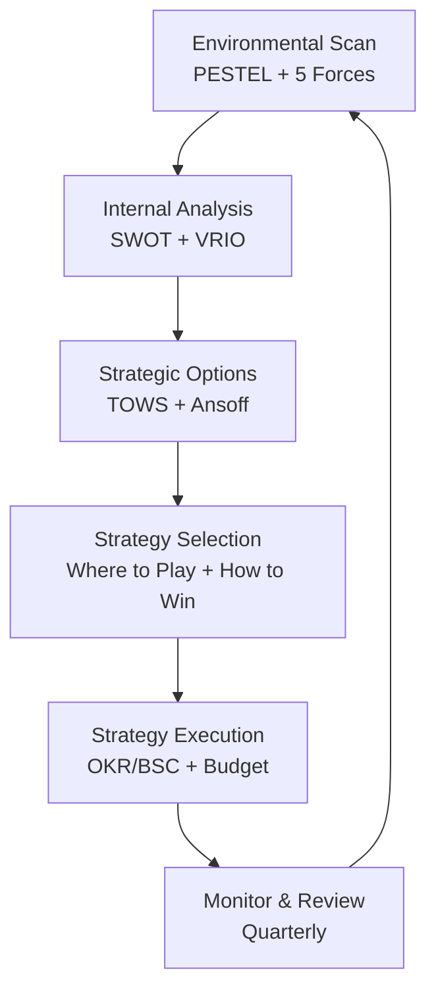

# S01 — Corporate Strategy
> *Xây dựng và thực thi chiến lược doanh nghiệp: từ phân tích môi trường đến lựa chọn chiến lược*

---

## 1. Learning Objectives

Sau khi hoàn thành module này, người học có thể:
- Phân tích môi trường kinh doanh bằng PESTEL, Porter's Five Forces, SWOT
- Xác định và phân tích competitive advantage bền vững
- Lựa chọn chiến lược cạnh tranh phù hợp (Cost Leadership, Differentiation, Focus)
- Xây dựng Corporate Strategy cho tập đoàn đa ngành
- Thiết kế quá trình Strategy Execution từ chiến lược xuống hành động

---

## 2. Business Context

Strategy là **lựa chọn có chủ đích về nơi cạnh tranh (where to play) và cách giành chiến thắng (how to win)**. Không phải mọi kế hoạch đều là chiến lược — chiến lược thực sự phải có sự đánh đổi (trade-offs) rõ ràng.

**Sai lầm phổ biến:** Nhiều doanh nghiệp VN có "Kế hoạch 5 năm" nhưng không có Strategy — tức là liệt kê những gì muốn làm mà không định nghĩa những gì KHÔNG làm.

**Roger Martin's test:** Nếu đối thủ nghe xong "chiến lược" của bạn và gật đầu "tôi cũng vậy" — đó không phải chiến lược.

---

## 3. Definitions

| Thuật ngữ | Định nghĩa |
|-----------|-----------|
| **Corporate Strategy** | Chiến lược ở cấp tập đoàn — đa dạng hóa, M&A, portfolio |
| **Business Strategy** | Chiến lược ở cấp BU/ngành — cách cạnh tranh trong một thị trường |
| **Competitive Advantage** | Lợi thế giúp doanh nghiệp outperform đối thủ bền vững |
| **Strategic Position** | Tập hợp các hoạt động tạo ra value độc đáo so với đối thủ |
| **Trade-off** | Sự đánh đổi — chọn cái này tức là từ bỏ cái kia |
| **Core Competence** | Năng lực cốt lõi, khó bắt chước, tạo ra value |
| **VRIO** | Valuable, Rare, Inimitable, Organized — tiêu chí đánh giá lợi thế |
| **BCG Matrix** | Ma trận phân loại portfolio: Stars, Cash Cows, Dogs, Question Marks |
| **Ansoff Matrix** | Khung mở rộng: Market Penetration, Development, Diversification |

---

## 4. Core Concepts

### 4.1 Phân tích môi trường — PESTEL

```
P — Political    : Chính trị, luật pháp, chính sách thương mại
E — Economic     : Tăng trưởng GDP, lạm phát, lãi suất, tỷ giá
S — Social       : Nhân khẩu học, lối sống, giá trị văn hóa
T — Technological: Đổi mới công nghệ, AI, digitalization
E — Environmental: Biến đổi khí hậu, ESG, carbon footprint
L — Legal        : Luật cạnh tranh, bảo vệ NTD, IP, lao động

VN CONTEXT:
  P: Chính sách thu hút FDI, quy định ngành (fintech, healthcare)
  E: Tăng trưởng GDP ~6-7%, tầng lớp trung lưu tăng nhanh
  S: Dân số trẻ (median age ~30), urbanization cao, mobile-first
  T: Chuyển đổi số đang tăng tốc, AI adoption nhanh
  E: Net Zero 2050 cam kết, ESG ngày càng quan trọng với FDI
  L: Luật DN 2020, Luật Đất Đai 2024, Luật CK 2019
```

### 4.2 Porter's Five Forces

```
                  ┌─────────────────────┐
                  │  New Entrants Threat │
                  │  (Nguy cơ đối thủ   │
                  │   mới)              │
                  └──────────┬──────────┘
                             ↓
 ┌──────────────┐   ┌────────────────┐   ┌──────────────┐
 │  Supplier    │   │   INDUSTRY     │   │  Buyer       │
 │  Power       │←─→│   RIVALRY      │←─→│  Power       │
 │  (Quyền lực  │   │  (Cạnh tranh   │   │  (Quyền lực  │
 │   nhà cung)  │   │   nội ngành)   │   │   người mua) │
 └──────────────┘   └────────────────┘   └──────────────┘
                             ↑
                  ┌──────────┴──────────┐
                  │  Substitutes Threat  │
                  │  (Nguy cơ sản phẩm  │
                  │   thay thế)         │
                  └─────────────────────┘
```

**Đánh giá lực lượng → Xác định industry attractiveness:**

| Lực lượng | Yếu tố tăng power |
|-----------|------------------|
| Supplier Power | Ít nhà cung, sản phẩm độc đáo, chi phí chuyển đổi cao |
| Buyer Power | Ít buyer lớn, sản phẩm chuẩn hóa, dễ chuyển đổi |
| New Entrants | Rào cản gia nhập thấp (vốn ít, không cần license) |
| Substitutes | Nhiều giải pháp thay thế, giá thấp hơn |
| Rivalry | Nhiều đối thủ tương đương, tăng trưởng thấp, chi phí cố định cao |

### 4.3 SWOT + TOWS Matrix

```
SWOT:
  S (Strengths)   — Điểm mạnh nội bộ
  W (Weaknesses)  — Điểm yếu nội bộ
  O (Opportunities) — Cơ hội bên ngoài
  T (Threats)     — Đe dọa bên ngoài

TOWS (Chuyển SWOT thành chiến lược):
┌──────────────┬──────────────────┬──────────────────┐
│              │   STRENGTHS (S)  │  WEAKNESSES (W)  │
├──────────────┼──────────────────┼──────────────────┤
│OPPORTUNITIES │  SO Strategies   │  WO Strategies   │
│     (O)      │  (Dùng S khai    │  (Dùng O để khắc │
│              │   thác O)        │   phục W)        │
├──────────────┼──────────────────┼──────────────────┤
│  THREATS     │  ST Strategies   │  WT Strategies   │
│    (T)       │  (Dùng S để      │  (Giảm thiểu W   │
│              │   giảm T)        │   và T)          │
└──────────────┴──────────────────┴──────────────────┘
```

### 4.4 Competitive Advantage — VRIO Framework

```
Nguồn lực / Năng lực → Có giá trị? (Valuable)
                            ↓ Yes
                       Có hiếm? (Rare)
                            ↓ Yes
                       Khó bắt chước? (Inimitable)
                            ↓ Yes
                       Tổ chức để khai thác? (Organized)
                            ↓ Yes
                  → SUSTAINABLE COMPETITIVE ADVANTAGE
```

**Nguồn Competitive Advantage:**
- **Scale economies:** Chi phí thấp hơn khi sản xuất nhiều hơn
- **Network effects:** Value tăng theo số user (Zalo, MoMo)
- **Switching costs:** Chi phí cao khi chuyển đổi (ERP, banking)
- **Brand:** Premium pricing, trust, loyalty (Vinamilk, Trung Nguyên)
- **Proprietary technology/IP:** Patent, trade secrets
- **Distribution:** Kênh phân phối độc quyền hoặc superior
- **Data:** Dữ liệu khách hàng tạo ra personalization advantage

### 4.5 Porter's Generic Strategies

```
                 ĐỐI TƯỢNG CẠNH TRANH
                 Rộng          Hẹp
               ┌─────────────┬─────────────┐
  NGUỒN LỢI   │    COST     │    FOCUS    │
  THẾ: Chi phí│  LEADERSHIP │  (Cost)     │
  thấp hơn    ├─────────────┼─────────────┤
               │DIFFERENTIATION│   FOCUS   │
  Khác biệt   │             │(Differentiate│
  hơn         └─────────────┴─────────────┘
```

| Chiến lược | Ví dụ VN | Yêu cầu |
|-----------|---------|---------|
| **Cost Leadership** | Bitis (giày phổ thông), Vietjet | Scale lớn, process efficiency, tight cost control |
| **Differentiation** | Vinamilk Organic, Highlands Coffee | Innovation, brand, premium quality |
| **Focus-Cost** | Chuỗi bún bò local price thấp | Niche market, low overhead |
| **Focus-Differentiation** | Marou Chocolate, Premium spa | Niche premium, deep customer knowledge |

**"Stuck in the middle":** Không rõ chiến lược → kẹt giữa, không thắng được đối thủ nào.

### 4.6 Corporate Strategy — BCG Matrix

```
                  Market Growth (Tăng trưởng thị trường)
                       CAO            THẤP
                  ┌────────────┬────────────┐
  Market Share   │  STARS     │  CASH COWS │
  (Thị phần)    │  (Ngôi sao)│  (Bò tiền) │
  CAO           ├────────────┼────────────┤
                │  QUESTION  │    DOGS    │
  THẤP          │  MARKS (?)  │  (Con chó) │
                └────────────┴────────────┘

STARS:        Đầu tư để giữ vị trí → tương lai Cash Cow
CASH COWS:    Khai thác lợi nhuận → tài trợ cho Stars và ?
QUESTION MARKS: Quyết định: invest để thành Star hay divest?
DOGS:         Divest hoặc harvest — không đầu tư thêm
```

### 4.7 Ansoff Growth Matrix

```
                  PRODUCTS
              Existing        New
           ┌─────────────┬─────────────┐
  MARKETS  │  Market     │   Product   │
  Existing │ Penetration │ Development │
           ├─────────────┼─────────────┤
  New      │   Market    │Diversification│
           │ Development │             │
           └─────────────┴─────────────┘

Market Penetration:  Bán nhiều hơn cho thị trường hiện có
Product Development: Sản phẩm mới cho thị trường hiện có
Market Development:  Sản phẩm hiện có cho thị trường mới
Diversification:     Cả sản phẩm và thị trường mới (rủi ro cao nhất)
```

### 4.8 Strategy Execution — McKinsey 7S

```
        Strategy
           ↓
    ┌──────┴──────┐
Structure      Systems
    └──────┬──────┘
           │
    Shared Values (Core)
           │
    ┌──────┴──────┐
  Staff       Skills
    └──────┬──────┘
           ↓
          Style
```

**Hard S (dễ thay đổi):** Strategy, Structure, Systems
**Soft S (khó thay đổi):** Shared Values, Staff, Skills, Style

---

## 5. Business Value

| Ứng dụng | Kết quả |
|---------|---------|
| PESTEL + Five Forces | Đánh giá ngành trước khi đầu tư |
| VRIO | Xác định true competitive advantage |
| BCG Matrix | Quyết định allocate capital trong portfolio |
| Generic Strategies | Clarity về how to win, avoid "stuck in middle" |

---

## 6. Enterprise Role

- **Board/HĐQT:** Phê duyệt corporate strategy, major strategic moves
- **CEO:** Chịu trách nhiệm strategy formulation và execution
- **Strategy/BizDev team:** Phân tích, research, strategy development
- **CFO:** Financial implications của strategic choices
- **BU Heads:** Business-level strategy, execution

---

## 7. Departments Related

CEO Office · Strategy · Finance · All BUs

---

## 8. Input

- Market research và competitive intelligence
- Financial performance data (P&L, ROE, ROIC)
- Customer insights
- Industry reports (McKinsey, BCG, IBISWorld)
- Board directives và shareholder expectations

---

## 9. Output

- Strategy document (3-5 năm)
- Strategic priorities (Top 3-5)
- Capital allocation plan
- Strategic initiatives với owners và timelines
- Communication deck (cho toàn công ty)

---

## 10. Business Process

```
1. Strategic Assessment (AS-IS)
   PESTEL → Five Forces → SWOT internal
   
2. Strategic Options Generation
   TOWS → Ansoff → Generic strategies options
   
3. Strategy Selection
   Evaluate options: FIT, FEASIBILITY, ACCEPTABILITY
   
4. Strategy Formulation
   Where to play + How to win + Capabilities needed
   
5. Strategy Communication
   Cascade từ corporate → BU → Department → Individual
   
6. Execution & Monitoring
   OKR/BSC (xem S02, S03) → Quarterly review → Annual update
```

---

## 11. Data Flow

```
External data (market, competitor, macro)
Internal data (financials, ops, customer)
            ↓
Strategic analysis (PESTEL, 5 Forces, SWOT)
            ↓
Strategic options → Evaluation → Selection
            ↓
Strategy document → OKR/BSC (S02/S03)
            ↓
Execution → KPIs → Quarterly Strategy Review
```

---

## 12. Money Flow

Strategy quyết định capital allocation:
- **Invest:** Stars, high-growth opportunities
- **Harvest:** Cash Cows — maximize profit
- **Divest:** Dogs, non-core assets
- **Explore:** Question Marks — limited, gated investment

---

## 13. Document Flow

```
Board Charter / HĐQT mandate
      ↓
Strategic Analysis (internal strategy team / consultant)
      ↓
Strategy Document (CEO sign-off)
      ↓
Strategic Plan (BU level cascade)
      ↓
Annual Budget (Finance, aligned với strategy)
      ↓
OKR/KPI Framework (Operations)
```

---

## 14. Roles

| Vai trò | Trách nhiệm |
|---------|------------|
| CEO | Own strategy, final decisions |
| Chief Strategy Officer (CSO) | Process facilitation, analysis lead |
| BU Heads | Business-level strategy, execution |
| CFO | Financial viability, capital allocation |
| HĐQT | Approve strategy, governance |

---

## 15. Responsibilities

- CEO chịu trách nhiệm cuối cùng về kết quả chiến lược
- Strategy team: Analysis và facilitation, không phải decision-making
- Tất cả BU Heads phải hiểu và align với corporate strategy

---

## 16. RACI

| Hoạt động | HĐQT | CEO | Strategy | CFO | BU Heads |
|-----------|:----:|:---:|:--------:|:---:|:--------:|
| Strategic analysis | I | A | R | C | C |
| Strategy formulation | C | A | R | C | C |
| Strategy approval | A | R | C | I | I |
| BU strategy | I | A | C | C | R |
| Annual review | C | A | R | C | C |

---

## 17. Frameworks

- **Porter's Five Forces** — Industry analysis
- **PESTEL** — Macro environment
- **SWOT/TOWS** — Situation analysis
- **VRIO** — Resource-based view
- **BCG Matrix** — Portfolio management
- **Ansoff Matrix** — Growth options
- **McKinsey 7S** — Strategy execution alignment
- **Blue Ocean Strategy** — New market creation
- **Playing to Win** — Roger Martin (Where to Play + How to Win)

---

## 18. International Standards

- **ISO 56002:2019** — Innovation Management (liên quan strategy)
- **GRI 2021** — Sustainability strategy disclosure
- **IFRS S1/S2** — Climate-related strategy disclosure (2023+)

---

## 19. Vietnam Context

**Đặc thù chiến lược tại VN:**

- **Relationship-based competition:** Kết nối chính trị, "sân sau" vẫn còn quan trọng
- **Speed of change:** Môi trường thay đổi nhanh → chiến lược 1-2 năm thực tế hơn 5 năm
- **FDI competition:** Cạnh tranh với doanh nghiệp FDI có resources lớn hơn
- **Informal market:** Nhiều đối thủ trong grey market (hàng không hóa đơn)

**Ví dụ chiến lược VN thành công:**
| Công ty | Chiến lược | Kết quả |
|---------|-----------|---------|
| Vietjet | Cost Leadership trong hàng không | Cạnh tranh với Vietnam Airlines |
| Vinamilk | Differentiation (sữa organic, premium) + Distribution moat | Market leader |
| THACO | Focus + Vertical integration (assembly + retail + logistics) | Automotive dominance |
| FPT | Related Diversification (IT services + Education + Telecom) | Diversified revenue |

---

## 20. Legal Considerations

- **Luật Cạnh Tranh 2018:** Cấm thỏa thuận hạn chế cạnh tranh, lạm dụng vị thế thống lĩnh
- **Luật Đầu Tư 2020:** Ngành nghề conditional investment — cần xin phép trước khi đầu tư
- **Luật Chứng Khoán 2019:** Disclosure obligations cho strategy của công ty niêm yết

---

## 21. Common Mistakes

1. **Strategy = wish list:** Không có trade-offs, muốn làm tất cả
2. **Confuse goals với strategy:** "Tăng trưởng 30% năm nay" là goal, không phải strategy
3. **Analysis paralysis:** Quá nhiều phân tích, không quyết định
4. **Strategy không cascade xuống:** Nhân viên không biết chiến lược công ty là gì
5. **Bỏ qua execution:** Strategy đẹp nhưng không có ownership và accountability
6. **Static strategy:** Không review khi môi trường thay đổi
7. **Thiếu resource commitment:** Không allocate budget và talent cho strategic priorities

---

## 22. Best Practices

- **"Where to play + How to win"** — Roger Martin's framework, ngắn gọn và test được
- **Strategic choices phải có trade-offs** — nếu không ai phản đối, có thể không phải strategy thực sự
- **Top 3 priorities maximum** — focus là sức mạnh của strategy
- **Annual strategy refresh** — review context, adjust if needed
- **Strategy on 1 page** — nếu không tóm gọn được 1 trang, strategy chưa rõ ràng
- **Communicate đến cấp front-line** — mọi nhân viên biết "công ty chúng ta thắng cách nào"

---

## 23. KPIs

| KPI | Mô tả |
|-----|-------|
| **Market share** | % thị phần trong target segment |
| **Revenue growth vs market growth** | Có outgrow thị trường không? |
| **ROIC** | Return on Invested Capital — hiệu quả vốn |
| **Strategic initiative progress** | % milestones on track |
| **NPS** | Net Promoter Score — customer satisfaction |

---

## 24. Metrics

- Relative market share (vs. largest competitor)
- Revenue from new products/markets (Ansoff quadrants)
- Time to market for new strategic initiatives
- Employee strategy awareness score

---

## 25. Reports

- **Annual Strategy Review** (CEO + HĐQT)
- **Quarterly Strategic Progress Review** (CEO + BU Heads)
- **Competitive Intelligence Report** (hàng quý)
- **Industry Landscape Update** (2 lần/năm)

---

## 26. Templates

Xem [23-templates/](../../23-templates/) và [24-prompts/by-module/](../../24-prompts/by-module/).

---

## 27. Checklists

**Strategy quality check:**
- [ ] Có định nghĩa rõ "where to play" (thị trường, segment, địa lý)?
- [ ] Có định nghĩa rõ "how to win" (nguồn lợi thế cạnh tranh)?
- [ ] Có trade-offs rõ ràng (chúng ta KHÔNG làm gì)?
- [ ] Có capabilities plan để support strategy?
- [ ] Đã cascade xuống BU và department?
- [ ] Có metrics để đo lường tiến độ?

---

## 28. SOP

**Annual Strategy Process:**
```
Tháng 9 (T-3): Environmental scan cập nhật
  - PESTEL update
  - Competitive moves tracking
  - Customer insight refresh

Tháng 10 (T-2): Strategy workshop (2 ngày)
  - HĐQT + C-level
  - Review current strategy performance
  - SWOT/TOWS
  - Strategic options discussion

Tháng 11 (T-1): Strategy finalization
  - CEO finalizes priorities
  - BU Heads develop BU plans
  - CFO aligns budget

Tháng 12: Board approval + Communication
  - HĐQT approve
  - All-hands communication
  - OKR setting (xem S02)
```

---

## 29. Case Study

**Masan Group — Portfolio Strategy thành công:**

2008-2015: Masan xây dựng portfolio qua M&A có chủ đích — không random diversification mà theo theme "phục vụ người tiêu dùng VN trong cuộc sống hàng ngày".

- **Food:** Chinsu, Kokomi, Nam Ngư (condiments, noodles)
- **Mineral Resources:** Núi Pháo (tungsten — global play)
- **Banking:** Techcombank (financial services)
- **Retail:** VinMart acquisition → WinMart

**Strategic logic:** Vertical integration + consumer platform.

**TOWS Analysis của Masan:**
- SO: Dùng distribution strength (S) + tầng lớp trung lưu tăng (O) → expand premium product lines
- ST: Dùng brand trust (S) + modern trade growth (T từ FDI retailers) → build own retail chain

---

## 30. Small Business Example

**Nhà hàng lẩu tại Hà Nội — Strategy rõ ràng:**

Chủ nhà hàng áp dụng Focus-Differentiation:
- **Where to play:** Khách hàng gia đình tầm trung-cao, quận nội thành HN
- **How to win:** Lẩu Thái authentic, không MSG, không đông lạnh, nguyên liệu tươi mỗi ngày
- **Trade-off:** Không phục vụ nhóm bạn trẻ giá rẻ, không mở chi nhánh ngoại thành

**Kết quả:** Booking trước 2 tuần, margin cao hơn 40% so với lẩu thường, không phải cạnh tranh về giá.

---

## 31. Enterprise Example

**Vietjet Air — Cost Leadership Strategy:**
- **Where to play:** Point-to-point domestic routes + regional Asia
- **How to win:** Lowest cost (high seat density, fast turnaround, ancillary revenue, young fleet)
- **Trade-off:** Không focus vào premium business travelers, không có full-service
- **Result:** 40%+ domestic market share, IPO 2017

---

## 32. ERP Mapping

| Strategy Element | ERP Support |
|----------------|------------|
| Portfolio performance | Profit center accounting (CO-PCA) |
| Market expansion | New company code, sales organization |
| M&A integration | Group consolidation (SEM-BCS) |
| Cost leadership | CO module — cost analysis |

---

## 33. Automation Opportunities

- **Competitive intelligence automation:** Web scraping + NLP để track đối thủ
- **Strategy dashboard:** Real-time KPIs vs strategic targets
- **Scenario modeling:** Automated financial scenarios

---

## 34. AI Opportunities

- **Market opportunity scanning:** AI analyze unstructured data (news, social, patents)
- **Competitive benchmarking:** AI summarize competitor moves
- **Strategic scenario planning:** LLM-assisted "what if" analysis
- **Strategy document drafting:** AI first draft từ analysis data

---

## 35. Implementation Guide

**Xây dựng strategy process lần đầu:**
```
Tuần 1-2: Gather data (PESTEL, 5 Forces, internal performance)
Tuần 3:   SWOT workshop với leadership team
Tuần 4:   Strategic options development
Tuần 5:   Evaluate và select strategy
Tuần 6:   Finalize strategy document (1 page + detail)
Tuần 7:   Cascade và communicate
Tuần 8+:  OKR/KPI setting (xem S02, S03)
```

---

## 36. Consulting Guide

**Strategy diagnostic questions:**
1. "Trong 5 năm tới, bạn thấy doanh nghiệp mình ở đâu?"
2. "Tại sao khách hàng chọn bạn thay vì đối thủ?"
3. "Nếu đối thủ lớn nhất copy y hệt bạn, bạn vẫn thắng không?"
4. "Điều gì bạn KHÔNG làm mà đối thủ đang làm?"
5. "Bạn đang invest nguồn lực vào đâu — có align với chiến lược không?"

---

## 37. Diagnostic Questions

1. Bạn có thể mô tả chiến lược công ty trong 2 câu không?
2. Nhân viên front-line biết chiến lược công ty không?
3. Quyết định đầu tư gần nhất có align với chiến lược không?
4. Khi nào lần cuối bạn nói "không" với một cơ hội vì nó không fit strategy?
5. Cạnh tranh chính của bạn là ai? Họ đang làm gì?

---

## 38. Interview Questions

**Cho ứng viên Strategy:**
- "Phân tích Five Forces của ngành bán lẻ VN hiện tại."
- "Masan nên mua lại WinMart không? Phân tích strategic rationale."
- "Tại sao một công ty có thể có revenue cao mà vẫn không có competitive advantage?"

---

## 39. Exercises

**Bài 1:** Phân tích Porter's Five Forces cho ngành gọi xe công nghệ tại VN (Grab, Be, Xanh SM). Ngành này có attractive không?

**Bài 2:** Vẽ BCG Matrix cho Vingroup năm 2024: Vinhomes, VinFast, Vincom Retail, Vinpearl, VinBus. Đề xuất capital allocation.

**Bài 3:** Dùng TOWS để xây dựng 4 chiến lược cho một chuỗi F&B VN muốn mở rộng ra thị trường Đông Nam Á.

---

## 40. References

- **Sách:** *Competitive Strategy* — Michael Porter
- **Sách:** *Playing to Win* — Roger Martin & A.G. Lafley
- **Sách:** *Good Strategy / Bad Strategy* — Richard Rumelt
- **Sách:** *Blue Ocean Strategy* — Kim & Mauborgne
- **VN:** IFC Vietnam Corporate Governance Scoreboard
- **Online:** Harvard Business Review Strategy section

---

## Output Formats

### Mermaid — Strategy formulation process


### Flashcards
```
Q: "Stuck in the middle" nghĩa là gì?
A: Công ty không chọn rõ chiến lược (Cost vs Differentiation) → 
   Chi phí cao hơn cost leader nhưng không đủ differentiated →
   Thua ở cả hai mặt trận. Porter: "Đây là vị trí chiến lược tệ nhất."

Q: VRIO là gì? Dùng để làm gì?
A: Khung đánh giá nguồn lực:
   Valuable (tạo value cho KH?) → Rare (đối thủ không có?) → 
   Inimitable (khó copy?) → Organized (tổ chức khai thác được?) →
   Chỉ khi đủ cả 4: Sustainable Competitive Advantage.

Q: Phân biệt Corporate Strategy vs Business Strategy?
A: Corporate: Tập đoàn đa ngành — đầu tư vào ngành nào, M&A, portfolio allocation.
   Business: Trong 1 ngành — cách cạnh tranh và thắng (Porter's Generic Strategies).
```

### JSON Metadata
```json
{
  "module_code": "S01",
  "module_name": "Corporate Strategy",
  "domain": "Strategy",
  "level": "Intermediate-Advanced",
  "version": "1.0",
  "status": "complete",
  "prerequisites": ["F01", "F05", "B01", "B02"],
  "related_modules": ["S02", "S03", "B03", "FI01", "MK01"],
  "learning_time_hours": 12,
  "key_frameworks": ["Porter 5 Forces", "PESTEL", "SWOT/TOWS", "VRIO", "BCG Matrix", "Ansoff", "McKinsey 7S", "Blue Ocean"],
  "key_standards": ["ISO 56002", "GRI 2021"],
  "vietnam_specific": true,
  "tags": ["strategy", "competitive-advantage", "SWOT", "BCG", "Porter", "VRIO", "corporate-strategy"]
}
```
