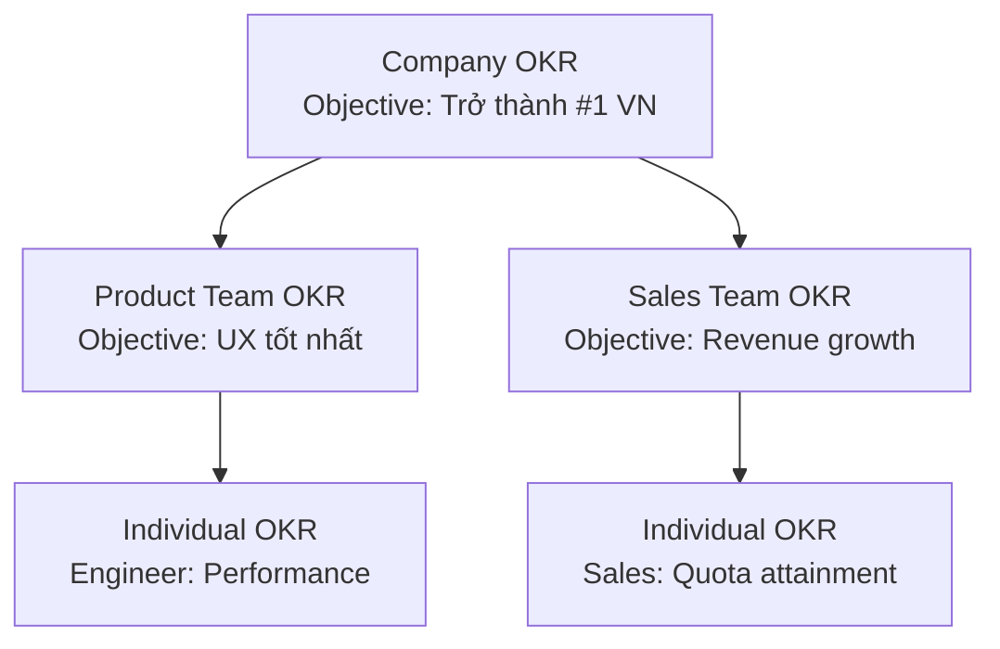

# S02 — OKR: Objectives & Key Results
> *Từ chiến lược đến hành động: thiết kế và vận hành hệ thống OKR hiệu quả*

---

## 1. Learning Objectives

- Phân biệt OKR với MBO và KPI truyền thống
- Thiết kế Objectives và Key Results đúng chuẩn (SMART + ambitious)
- Cascade OKR từ Company → Team → Individual
- Vận hành chu trình OKR: Check-in, Review, Grading
- Tránh các bẫy phổ biến khi triển khai OKR

---

## 2. Business Context

OKR (Objectives & Key Results) là **framework quản lý mục tiêu** được Andy Grove tạo ra tại Intel và John Doerr đưa vào Google, sau đó lan rộng toàn cầu.

**OKR khác KPI:** KPI đo lường performance của quy trình đang chạy. OKR định nghĩa những gì cần thay đổi và cải thiện — là công cụ của sự thay đổi, không phải đo lường hiện trạng.

**Tại VN:** OKR đang được nhiều startup và tech company áp dụng (Base.vn, MoMo, VNG). Tuy nhiên nhiều doanh nghiệp truyền thống nhầm OKR với KPI và triển khai sai.

---

## 3. Definitions

| Thuật ngữ | Định nghĩa |
|-----------|-----------|
| **Objective** | Mục tiêu định tính, đầy cảm hứng — "Đi đến đâu?" |
| **Key Result** | Kết quả đo lường được, xác nhận việc đạt Objective — "Biết khi nào đến nơi?" |
| **Initiative** | Hành động cụ thể để đạt Key Results — "Làm gì để đến đó?" |
| **Moonshot OKR** | OKR đặt mục tiêu tham vọng (70% đạt là tốt) |
| **Roofshot OKR** | OKR cam kết phải đạt 100% (operational) |
| **CFR** | Conversations, Feedback, Recognition — cặp đôi với OKR |
| **Check-in** | Họp ngắn hàng tuần để review tiến độ OKR |
| **Grading** | Chấm điểm OKR cuối kỳ (0.0 - 1.0) |

---

## 4. Core Concepts

### 4.1 Cấu trúc OKR

```
OBJECTIVE (Mục tiêu định tính)
"Trở thành nền tảng TMĐT được tin yêu nhất tại VN"
      ↓
KEY RESULT 1: NPS tăng từ 32 lên 55 vào Q4
KEY RESULT 2: Tỷ lệ đơn giao đúng hạn ≥ 98%
KEY RESULT 3: Thời gian giải quyết khiếu nại < 24h (từ 72h)
      ↓
INITIATIVES (Actions):
  - Triển khai tracking real-time cho shipper
  - Ra mắt chat support 24/7
  - Redesign quy trình xử lý refund
```

**Quy tắc viết Objective:**
- Truyền cảm hứng, định tính (không có số)
- Rõ ràng, đọc xong biết ngay hướng đi
- Có thể đạt trong 1 quý/năm

**Quy tắc viết Key Results:**
- Measurable — có số cụ thể
- Outcome (kết quả), không phải Output (việc làm)
- 3-5 KR per Objective

### 4.2 Phân biệt Outcome vs Output

```
OUTPUT (Việc làm):              OUTCOME (Kết quả):
"Ra mắt tính năng A"     →     "Tỷ lệ chuyển đổi tăng 20%"
"Đào tạo 100 nhân viên"  →     "90% pass certification test"
"Gọi 500 cuộc cold call" →     "30 qualified leads mới"

Key Results PHẢI là OUTCOMES!
```

### 4.3 OKR Cascade (Top-down + Bottom-up)

```
COMPANY OKRs (Annual + Quarterly)
       ↓ align
TEAM/DEPARTMENT OKRs (Quarterly)
       ↓ align
INDIVIDUAL OKRs (Quarterly)

Team OKR trả lời: "Team chúng tôi đóng góp vào Company OKR như thế nào?"
```

**Ví dụ cascade:**
```
Company OKR: Trở thành #1 về customer satisfaction
  ↓
Product Team OKR: Giảm bugs ảnh hưởng UX
  KR1: Bug severity P1/P2 giảm 70%
  KR2: App crash rate < 0.1%
  ↓
Backend Squad OKR:
  KR1: API response time < 200ms (p95)
  KR2: Uptime 99.9%
```

### 4.4 Chu trình OKR Quarterly

```
ANNUAL PLANNING (Tháng 11-12):
  Company OKRs cho năm tới → Cascade xuống

QUARTERLY CYCLE:
  Tuần 1:    OKR Setting (draft + align)
  Tuần 2-11: Weekly Check-in (10-15 phút)
    - Confidence score (1-10)
    - Blockers cần unblock
  Tuần 12-13: Grading + Retrospective
    - Score từng KR: 0.0 - 1.0
    - Bài học: Tại sao đạt/không đạt?
```

### 4.5 Grading OKR

```
Google's approach:
  0.0 - 0.3  = Chưa đạt gì đáng kể
  0.4 - 0.6  = Tiến triển nhưng chưa đủ
  0.7 - 1.0  = Tốt (0.7 được coi là success với Moonshot OKRs)

"Nếu bạn luôn đạt 1.0, mục tiêu chưa đủ tham vọng"
— John Doerr

MOONSHOT: 0.7 = tuyệt vời (kỳ vọng đặt cao)
ROOFSHOT: 1.0 = bắt buộc (committed goals)
```

### 4.6 OKR vs KPI vs MBO

```
              OKR           KPI           MBO
Mục đích   Thay đổi &    Đo lường       Mục tiêu
           đột phá       hiệu quả       cá nhân
Tần suất   Quarterly     Liên tục       Annual
Tham vọng  70-80% đạt   100% đạt      100% đạt
Bonus link Không nên     Có thể         Thường có

OKR + KPI: Không exclusive.
OKR = What to change. KPI = What to monitor.
```

---

## 5. Business Value

| Lợi ích | Tác động |
|---------|---------|
| Focus | Tất cả align vào 3-5 ưu tiên |
| Transparency | Mọi người thấy mục tiêu của nhau |
| Agility | Quarterly cycle → adjust nhanh |
| Stretch | Moonshot → innovation, không complacency |

---

## 6. Enterprise Role

- **CEO:** Set Company OKRs, model the behavior
- **C-level:** Department OKRs aligned với Company
- **Managers:** Team OKRs, weekly check-in facilitation
- **OKR Champion/Coach:** Facilitate process, training

---

## 7. Departments Related

CEO Office · All Departments · HR (process owner)

---

## 8. Input

- Company Strategy và Annual Priorities (từ S01)
- Previous quarter OKR scores và lessons learned
- Stakeholder priorities
- Market signals và competitive moves

---

## 9. Output

- Quarterly OKR set (Company + Team + Individual)
- Weekly check-in records
- Quarterly OKR scores và retrospective

---

## 10. Business Process

```
1. Company OKRs set by CEO + C-level (2-3 Objectives, 3-5 KRs each)
2. BU/Team leads draft their OKRs (bottom-up input)
3. Alignment session
4. Finalize và publish (all OKRs visible company-wide)
5. Weekly check-in (10-15 phút/team)
6. Mid-quarter review (Month 2) — adjust if needed
7. End-of-quarter grading và retrospective
8. Feed lessons vào next quarter
```

---

## 11. Data Flow

```
Strategy (S01) → Company OKRs → Team OKRs → Individual OKRs
                       ↓
               Weekly check-in (confidence, blockers)
                       ↓
               Mid-quarter: Adjust or double-down
                       ↓
               End-quarter: Grades + Lessons → Next cycle
```

---

## 12. Money Flow

- OKR priorities phải align với budget allocation
- Tránh: gắn OKR score trực tiếp với bonus (→ sandbagging)

---

## 13. Document Flow

```
Strategy document → Company OKRs
                 → Team OKRs (OKR tool hoặc spreadsheet)
                 → Weekly check-in notes
                 → Quarterly OKR scorecard
```

---

## 14. Roles

| Vai trò | Trách nhiệm |
|---------|------------|
| CEO | Company OKRs, champion culture |
| Dept Heads | Dept OKRs, team check-ins |
| OKR Coach | Facilitate, train, quality control |
| Individual | Personal OKRs, check-in participation |

---

## 15. Responsibilities

- Tất cả OKRs phải được publish và visible
- Check-in là bắt buộc, không phải optional
- OKR grading không kết nối trực tiếp với lương/thưởng

---

## 16. RACI

| Hoạt động | CEO | C-level | Managers | OKR Coach |
|-----------|:---:|:-------:|:--------:|:---------:|
| Company OKRs | A | C | I | C |
| Team OKRs | I | A | R | C |
| Weekly check-in | I | C | A | C |
| Quarterly grading | I | A | R | C |

---

## 17. Frameworks

- **OKR** — Andy Grove (Intel), John Doerr (Google)
- **CFR** — John Doerr: Conversations, Feedback, Recognition
- **4DX** — 4 Disciplines of Execution (FranklinCovey)
- **Hoshin Kanri** — Japanese policy deployment

---

## 18. International Standards

- Liên kết với ISO 9001 — Quality objectives
- Google re:Work OKR Guide (de facto standard)

---

## 19. Vietnam Context

**OKR tại VN:**
- **Startup ecosystem:** Base.vn, MoMo, VNG, Tiki đang dùng OKR
- **Challenge 1:** Văn hóa high power distance → nhân viên ngại push back lên OKR của sếp
- **Challenge 2:** Muốn gắn OKR với lương → dẫn đến sandbagging
- **Challenge 3:** OKR bị dùng như KPI hàng ngày → mất tính "stretch"

**Tool phổ biến tại VN:**
- Base.vn (VN-made, có OKR module)
- Notion + spreadsheet (startup nhỏ)
- Lattice, Weekdone, Perdoo (international)

---

## 20. Legal Considerations

- Nếu gắn OKR với compensation: cần clear trong hợp đồng lao động
- BLLĐ 2019: KPI/OKR không được dùng để đánh giá nhân viên một cách tùy tiện

---

## 21. Common Mistakes

1. **OKR = KPI:** Đặt KR là chỉ số "business as usual" → không stretch
2. **Quá nhiều OKRs:** 10+ Objectives → mất focus
3. **Output KRs:** "Ra mắt tính năng X" thay vì metric outcome
4. **Gắn với bonus:** Tạo sandbagging culture
5. **Không check-in:** OKR set rồi quên đến cuối quý
6. **Top-down only:** Không có bottom-up input → thiếu buy-in
7. **Bí mật:** OKRs không shared → mất benefit của transparency

---

## 22. Best Practices

- **3-5 Objectives tối đa** ở mỗi cấp
- **3-5 Key Results per Objective**
- **Tách OKR khỏi compensation** — giữ stretch culture
- **Weekly check-in 15 phút** — risk identification, không phải status report
- **OKR phải public** — toàn công ty thấy được
- **Retrospective thực chất** — "Tại sao 0.4?" quan trọng hơn score

---

## 23. KPIs

| KPI | Target |
|-----|--------|
| OKR adoption rate | > 80% teams có OKRs |
| Check-in completion | > 90% weekly |
| Average OKR grade | 0.6-0.7 (healthy stretch) |
| Alignment score | > 80% team OKRs link tới company OKRs |

---

## 24. Metrics

- % OKRs graded at end of quarter
- Distribution of scores (toàn 1.0 → sandbagging)
- Time từ company OKRs đến team OKRs (< 2 tuần = good)

---

## 25. Reports

- **Weekly OKR Dashboard** (confidence scores, blockers)
- **Monthly OKR Progress** (C-level review)
- **Quarterly OKR Scorecard** (company-wide)

---

## 26. Templates

**OKR Template:**
```
QUARTER: Q[X] 20XX

OBJECTIVE: [Câu định tính, đầy cảm hứng]
Type: Moonshot / Committed  |  Owner: [Team/Person]

  KR1: [Metric] từ [baseline] đến [target] vào [date]
  Current: ___  Confidence: ___/10

  KR2: [Metric] từ [baseline] đến [target] vào [date]
  Current: ___  Confidence: ___/10

  KR3: [Metric] từ [baseline] đến [target] vào [date]
  Current: ___  Confidence: ___/10

INITIATIVES:
  - [ ] [Action 1] — Owner: ___ Due: ___
  - [ ] [Action 2] — Owner: ___ Due: ___

END OF QUARTER GRADE: ___  |  LESSONS LEARNED: ___
```

---

## 27. Checklists

- [ ] Objective có inspiring và định tính không (không có số)?
- [ ] Mỗi KR có số đo lường cụ thể không?
- [ ] KR là Outcome hay chỉ là Output?
- [ ] Có ≤ 5 KRs per Objective?
- [ ] Công ty có ≤ 5 Objectives?
- [ ] Team OKRs có link tới Company OKRs?

---

## 28. SOP

**Weekly OKR Check-in (15 phút):**
```
1. (3 phút) Update confidence score cho KRs
2. (5 phút) Highlight: KR nào green/yellow/red?
3. (5 phút) Discuss blockers cho KRs đang red/yellow
4. (2 phút) Capture action items
```

---

## 29. Case Study

**Google — OKR từ 40 người đến 100,000+:**

John Doerr mang OKR từ Intel vào Google năm 1999. Larry Page's original OKRs:
- Objective: Cung cấp thông tin cho toàn thế giới
- KR1: Index 100% web trong 6 tháng
- KR2: Latency < 0.5 giây

Google vẫn dùng OKR sau 25 năm. OKR scale được nếu có culture, không phải chỉ tool.

---

## 30. Small Business Example

**Startup EdTech 30 nhân viên — Q3 OKRs:**

```
Company Objective: Nền tảng học tiếng Anh được yêu thích nhất cho THPT HN
  KR1: MAU tăng từ 5,000 lên 12,000
  KR2: 7-day retention từ 20% lên 40%
  KR3: NPS từ 25 lên 45

Product Team (aligned):
  Objective: Làm việc học "addictive tích cực"
  KR1: Daily streak: 60% users dùng ≥ 5 ngày/tuần
  KR2: Onboarding completion: 75% (từ 45%)
```

---

## 31. Enterprise Example

**Tiki — OKRs cho e-commerce:**

```
Company Q2 OKR:
  Objective: Nền tảng mua sắm đáng tin nhất VN
  KR1: Sản phẩm fake < 0.1% (từ 0.8%)
  KR2: Delivery on-time > 96% (từ 89%)
  KR3: Customer Satisfaction > 4.3/5

Logistics Team (aligned):
  Objective: Delivery nhanh và chính xác hơn
  KR1: Same-day delivery available ở 5 tỉnh/thành mới
  KR2: Last-mile delivery cost giảm 15%
```

---

## 32. ERP Mapping

- KPI data để track KRs thường từ ERP/BI
- Integration: OKR tool ↔ BI Dashboard ↔ ERP data

---

## 33. Automation Opportunities

- **OKR tool integration** với BI (tự động update KR numbers)
- **Check-in reminder** automation
- **OKR health dashboard** (confidence scores aggregated)

---

## 34. AI Opportunities

- **OKR writing assistant:** AI gợi ý KRs từ Objectives
- **Alignment checker:** AI phát hiện team OKRs không align
- **Progress prediction:** ML dự đoán KR nào likely to miss

---

## 35. Implementation Guide

**Triển khai OKR lần đầu:**
```
Tháng 1: Education + Pilots
  - Train leadership team (2h workshop)
  - CEO + C-level viết Company OKRs mẫu
  - 1-2 teams pilot

Tháng 2-3: Roll out
  - Tất cả teams viết OKRs
  - Weekly check-ins bắt đầu

Tháng 3: First quarterly review
  - Grading + retrospective → cải thiện Q2

Năm 1 mục tiêu: Stable process, không phải perfect
```

---

## 36. Consulting Guide

**OKR health check:**
- Xem Company OKRs: Inspiring không? Stretch không?
- Xem KRs: Output hay Outcome?
- Hỏi nhân viên: "OKR của team bạn là gì?" (không biết → transparency problem)
- Xem quarterly grades: Toàn 1.0 → sandbagging; toàn 0.2 → unrealistic

---

## 37. Diagnostic Questions

1. Nhân viên có biết Company OKRs của quý này không?
2. OKR có kết nối với bonus không? (Nếu có → warning)
3. Công ty có bao nhiêu Objectives? (>5 → too many)
4. KRs của bạn là Outcome hay Output?

---

## 38. Interview Questions

- "Phân biệt Outcome KR và Output KR. Cho ví dụ."
- "Tại sao không nên gắn OKR với bonus?"
- "Công ty đạt OKR grade 0.5 liên tục 3 quý — điều đó có nghĩa gì?"

---

## 39. Exercises

**Bài 1:** Rewrite thành OKR đúng:
- "Ra mắt app mobile vào tháng 9" → ?
- "Đào tạo 200 nhân viên" → ?
- "Cải thiện customer service" → ?

**Bài 2:** Viết 1 Company OKR và 2 Team OKRs (Sales + Product) aligned cho một startup SaaS B2B VN.

---

## 40. References

- **Sách:** *Measure What Matters* — John Doerr (bắt buộc đọc)
- **Sách:** *High Output Management* — Andy Grove
- **Online:** Google re:Work OKR Guide (free)
- **VN:** Base.vn blog về OKR implementation

---

## Output Formats

### Mermaid — OKR Cascade


### Flashcards
```
Q: Output KR vs Outcome KR?
A: Output: "Ra mắt tính năng search" (có thể làm xong nhưng không có impact)
   Outcome: "Search conversion rate tăng 30%" (đo lường impact thực sự)
   → KRs phải là Outcomes!

Q: Tại sao moonshot OKR đặt 0.7 là tốt?
A: Moonshot = mục tiêu tham vọng. Nếu set để đạt 100% → sẽ set thấp → không stretch.
   0.7 với moonshot target còn tốt hơn 1.0 với easy target.

Q: OKR khác KPI thế nào?
A: OKR = What to CHANGE (stretch goals, quarterly).
   KPI = What to MONITOR (ongoing metrics, dashboards).
   Dùng cả hai: OKR cho mục tiêu thay đổi, KPI cho sức khỏe vận hành.
```

### Cheat Sheet
```
══════════════════════════════════════
         OKR CHEAT SHEET
══════════════════════════════════════
STRUCTURE:
  Objective: Định tính, inspiring, no numbers
  Key Results: 3-5, measurable OUTCOMES
  Initiatives: Actions để đạt KRs

RULES:
  ≤ 5 Objectives per level
  ≤ 5 KRs per Objective
  Tách OKR khỏi bonus
  Public: Tất cả mọi người thấy

GRADING:
  Moonshot: 0.7 = success
  Roofshot: 1.0 = required

CYCLE: Quarterly
  Week 1: Set  |  Week 2-11: Check-in
  Week 12-13: Grade + Retrospective
══════════════════════════════════════
```

### JSON Metadata
```json
{
  "module_code": "S02",
  "module_name": "OKR",
  "domain": "Strategy",
  "level": "Intermediate",
  "version": "1.0",
  "status": "complete",
  "prerequisites": ["F05", "S01"],
  "related_modules": ["S03", "HR02", "OP03"],
  "learning_time_hours": 8,
  "key_frameworks": ["OKR", "CFR", "4DX", "Hoshin Kanri"],
  "vietnam_specific": true,
  "tags": ["OKR", "objectives", "key-results", "goal-setting", "strategy-execution"]
}
```
