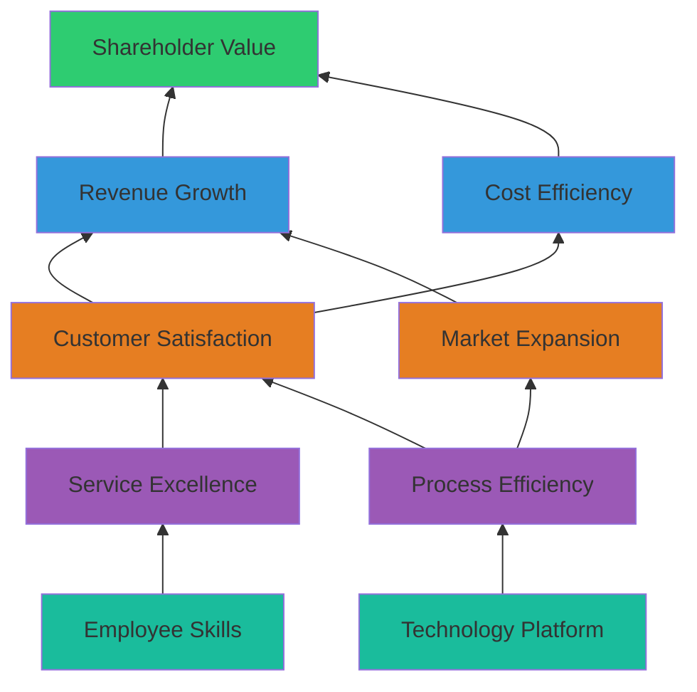

# S03 — Balanced Scorecard (BSC)
> *Đo lường và thực thi chiến lược toàn diện qua 4 perspectives*

---

## 1. Learning Objectives

- Hiểu lý do ra đời của BSC và hạn chế của đo lường tài chính thuần túy
- Xây dựng Strategy Map và Balanced Scorecard cho doanh nghiệp
- Thiết kế KPIs cho 4 perspectives: Financial, Customer, Internal Process, Learning & Growth
- Cascade BSC từ corporate xuống BU và cá nhân
- Tích hợp BSC với OKR và quy trình quản lý chiến lược

---

## 2. Business Context

Balanced Scorecard (BSC) do Robert Kaplan và David Norton phát triển năm 1992, xuất phát từ nhận thức rằng **đo lường tài chính một mình không đủ để quản lý doanh nghiệp hiện đại**.

BSC bổ sung 3 perspectives phi tài chính: Khách hàng, Quy trình nội bộ, và Học hỏi & Phát triển — những yếu tố dẫn đến kết quả tài chính trong tương lai.

**BSC vs OKR:**
- OKR: Agile, bottom-up friendly, quarterly, startup-friendly
- BSC: Comprehensive, top-down aligned, annual/quarterly, enterprise-friendly
- Nhiều doanh nghiệp lớn dùng BSC ở corporate level và OKR ở team level

---

## 3. Definitions

| Thuật ngữ | Định nghĩa |
|-----------|-----------|
| **Balanced Scorecard (BSC)** | Framework đo lường hiệu quả chiến lược qua 4 perspectives |
| **Strategy Map** | Sơ đồ nhân quả giữa các mục tiêu chiến lược trên 4 perspectives |
| **KPI (Key Performance Indicator)** | Chỉ số đo lường hiệu quả thực hiện mục tiêu |
| **Strategic Objective** | Mục tiêu cụ thể trong từng perspective |
| **Lead Indicator** | Chỉ số dự báo (input/process) — dự đoán kết quả tương lai |
| **Lag Indicator** | Chỉ số kết quả (output/outcome) — kết quả đã xảy ra |
| **Cascade** | Triển khai BSC từ corporate xuống BU và cá nhân |
| **Strategy Review Meeting** | Họp định kỳ để review tiến độ BSC |

---

## 4. Core Concepts

### 4.1 Bốn Perspectives của BSC

```
              FINANCIAL PERSPECTIVE
              "Chúng ta trông như thế nào
               với cổ đông?"
                      ↑ kết quả
              CUSTOMER PERSPECTIVE
              "Khách hàng nhìn chúng ta
               như thế nào?"
                      ↑ drives
         INTERNAL PROCESS PERSPECTIVE
         "Chúng ta phải giỏi ở
          quy trình nào?"
                      ↑ enables
    LEARNING & GROWTH PERSPECTIVE
    "Chúng ta có thể tiếp tục
     cải thiện và tạo value không?"
```

| Perspective | Câu hỏi cốt lõi | Ví dụ KPIs |
|------------|----------------|-----------|
| **Financial** | Tạo ra value tài chính như thế nào? | Revenue growth, EBITDA, ROE, ROIC |
| **Customer** | Khách hàng nhìn nhận chúng ta ra sao? | NPS, market share, customer retention |
| **Internal Process** | Quy trình nào quyết định sự khác biệt? | Cycle time, defect rate, on-time delivery |
| **Learning & Growth** | Nhân tài, công nghệ, văn hóa có đủ không? | Employee engagement, training hours, innovation rate |

### 4.2 Strategy Map — Chuỗi nhân quả

```
FINANCIAL:       Revenue Growth ←── Profitability
                      ↑                  ↑
CUSTOMER:    Customer Acquisition  Customer Retention
                      ↑                  ↑
INTERNAL:    Sales Excellence   Service Excellence
                      ↑                  ↑
LEARNING:    Sales Skills     CRM Knowledge    Culture
```

**Nguyên tắc Strategy Map:**
- Tất cả mục tiêu đều có mối quan hệ nhân quả
- Learning & Growth là nền tảng → Internal Process → Customer → Financial
- Không có "islands" — mọi mục tiêu phải kết nối

### 4.3 Thiết kế KPIs cho từng Perspective

**Financial Perspective:**
```
Growth metrics:  Revenue growth %, New revenue streams
Profitability:   EBITDA margin, Net profit margin, ROE
Efficiency:      Asset turnover, Working capital ratio
Value:           Economic Value Added (EVA), ROIC
```

**Customer Perspective:**
```
Market position: Market share, Share of wallet
Customer value:  NPS, Customer satisfaction (CSAT), CES
Loyalty:         Retention rate, Churn rate, LTV
Acquisition:     New customers, CAC, Conversion rate
```

**Internal Process Perspective:**
```
Operations:   Defect rate, On-time delivery, Cycle time
Innovation:   New products launched, Time-to-market
Service:      First-call resolution, Complaint resolution time
Compliance:   Audit findings, Regulatory incidents
```

**Learning & Growth Perspective:**
```
People:       Employee engagement, Turnover rate, Training hours
Skills:       Competency gap closure, Certification rate
Technology:   System uptime, Digital adoption rate
Culture:      Leadership effectiveness, Innovation suggestions
```

### 4.4 Lead vs Lag Indicators

```
LAG INDICATORS (Results):    LEAD INDICATORS (Drivers):
  Revenue                  ←   Customer satisfaction
  Customer retention       ←   Service quality score
  Profitability            ←   Cost per unit + Pricing
  Employee performance     ←   Training completion

BSC balance: Đo lường cả leads (dự báo) và lags (kết quả)
```

### 4.5 BSC Cascade

```
Corporate BSC (CEO + HĐQT)
      ↓
Business Unit BSC (BU Heads)
      ↓
Department BSC (Department Heads)
      ↓
Individual Scorecard / KPIs (Managers + Staff)

Mỗi cấp: Giữ tương tự 4 perspectives nhưng adapt cho context
```

### 4.6 Tích hợp BSC với quy trình quản lý

```
STRATEGY FORMULATION (Hàng năm):
  Strategy → Strategy Map → BSC Objectives → KPIs → Targets

EXECUTION MONITORING:
  Monthly: Operational review (Internal Process + Learning)
  Quarterly: Strategic review (all 4 perspectives)
  Annual: Strategy update

LINK VỚI PLANNING:
  BSC targets → Budget allocation → Resource planning
  BSC results → Performance management → Rewards
```

---

## 5. Business Value

| Lợi ích | Tác động |
|---------|---------|
| Balance | Không overweight tài chính ngắn hạn |
| Causality | Hiểu "tại sao" financial results xảy ra |
| Alignment | Toàn tổ chức hướng về cùng chiến lược |
| Early warning | Lead indicators cảnh báo trước lag indicators |

---

## 6. Enterprise Role

- **CEO/HĐQT:** Own corporate BSC, quarterly strategy reviews
- **CFO:** Financial perspective targets và reporting
- **COO:** Internal process perspective
- **CHRO:** Learning & Growth perspective
- **CMO:** Customer perspective
- **Strategy team:** BSC design và maintenance

---

## 7. Departments Related

Strategy · Finance · Operations · HR · Marketing · All BUs

---

## 8. Input

- Company Strategy và Strategic Priorities (S01)
- Historical performance data
- Benchmarks từ ngành
- Stakeholder expectations

---

## 9. Output

- Strategy Map (1 trang)
- Corporate BSC với KPIs và targets
- BU/Department Scorecards
- Monthly/Quarterly BSC reports

---

## 10. Business Process

```
1. Articulate strategy (S01) → "Where to play + How to win"
2. Identify strategic objectives (4-6 per perspective)
3. Build Strategy Map (causal linkages)
4. Select KPIs (2-3 per objective)
5. Set targets (baseline → target)
6. Assign owners
7. Monthly data collection và reporting
8. Quarterly Strategy Review Meeting
9. Annual BSC refresh
```

---

## 11. Data Flow

```
Strategy → Strategy Map → BSC Objectives
                             ↓
                       KPIs + Targets
                             ↓
              Data collection (Finance, CRM, ERP, HR)
                             ↓
              Monthly/Quarterly BSC Dashboard
                             ↓
              Strategy Review Meeting → Actions
```

---

## 12. Money Flow

Financial perspective trực tiếp track dòng tiền:
- Revenue targets
- Cost/margin targets
- Capital efficiency (ROIC, EVA)
- Investment in Learning & Growth → returns qua Financial

---

## 13. Document Flow

```
Strategy Document
      ↓
Strategy Map (1 page)
      ↓
BSC Framework (objectives, KPIs, targets, owners)
      ↓
Monthly BSC Report (automated từ BI/ERP)
      ↓
Quarterly Strategy Review Deck
```

---

## 14. Roles

| Vai trò | Trách nhiệm |
|---------|------------|
| CEO | Own corporate BSC |
| CFO | Financial perspective |
| COO | Internal Process |
| CHRO | Learning & Growth |
| CMO | Customer |
| Strategy Analyst | Data collection, reporting |

---

## 15. Responsibilities

- Mỗi KPI phải có owner rõ ràng
- Owner chịu trách nhiệm data quality và explanation
- CEO/HĐQT review BSC kết quả thực chất, không chỉ formality

---

## 16. RACI

| Hoạt động | CEO | CFO | COO | CHRO | Strategy |
|-----------|:---:|:---:|:---:|:----:|:--------:|
| BSC design | A | C | C | C | R |
| Financial KPIs | C | A | I | I | C |
| Process KPIs | I | I | A | I | C |
| L&G KPIs | I | I | I | A | C |
| Monthly report | I | C | C | C | A |
| Quarterly review | A | R | R | R | C |

---

## 17. Frameworks

- **Balanced Scorecard** — Kaplan & Norton (1992, 1996, 2004)
- **Strategy Map** — Kaplan & Norton (2004)
- **KPI Library** — David Parmenter
- **Hoshin Kanri** — Japanese equivalent
- **OKR** — Google (xem S02, complementary)

---

## 18. International Standards

- **ISO 9001:2015** — Quality objectives (liên kết với BSC)
- **GRI Standards** — Sustainability KPIs trong BSC
- **IFRS S1** — Sustainability-related financial disclosures
- **COBIT** — IT KPIs trong BSC

---

## 19. Vietnam Context

**BSC tại VN:**
- Tập đoàn lớn (Vingroup, Masan, FPT, PetroVietnam) sử dụng BSC hoặc variant
- Ngân hàng VN: Nhiều ngân hàng (Vietcombank, Techcombank) áp dụng BSC
- Thách thức: Data quality thấp → KPIs không reliable
- Thách thức 2: "Painting KPIs green" — báo cáo đẹp, không phản ánh thực tế

**Đặc thù VN:**
- Văn hóa báo cáo lên cấp trên "good news" → cần culture thay đổi để BSC hiệu quả
- Nhiều doanh nghiệp VN chưa có data infrastructure → BSC bị manual và chậm
- Ưu tiên financial KPIs hơn customer và learning → thiếu balance

---

## 20. Legal Considerations

- **Công ty niêm yết:** KPIs trong BSC thường liên kết với disclosure obligations
- **State-owned enterprises:** BSC phải align với chỉ tiêu Nhà nước giao
- **GRI/ESG Reporting:** Learning & Growth và Customer perspectives liên kết

---

## 21. Common Mistakes

1. **Too many KPIs:** 50+ KPIs → không ai focus vào cái quan trọng
2. **All lag indicators:** Không có early warnings
3. **No causality:** Objectives rời rạc, không có Strategy Map
4. **BSC = spreadsheet exercise:** Không link vào decision-making
5. **Thiếu data infrastructure:** KPIs không đo được → estimates hoặc guesses
6. **Quarterly reporting chậm:** Dữ liệu tháng 3 nộp tháng 6 → quá muộn để act
7. **No ownership:** KPI không có người chịu trách nhiệm

---

## 22. Best Practices

- **Strategy Map trước BSC** — phải có causal logic
- **2-3 KPIs per objective maximum** — không overcomplicate
- **Balance lead và lag** — ít nhất 30% lead indicators
- **Automate data collection** — manual BSC không sustainable
- **Monthly operational + Quarterly strategic** — cadence phù hợp
- **BSC link với budget và performance reviews** — không phải standalone

---

## 23. KPIs

**Ví dụ BSC KPIs cho công ty phân phối VN:**

| Perspective | Objective | KPI | Target |
|------------|-----------|-----|--------|
| Financial | Tăng trưởng có lợi nhuận | Revenue growth | +20% YoY |
| Financial | Hiệu quả vốn | ROCE | > 18% |
| Customer | Giữ khách hàng | Customer retention | > 90% |
| Customer | Mở rộng | New customer acquisition | +150/quý |
| Internal | Giao hàng đúng hạn | On-time delivery | > 97% |
| Internal | Chất lượng | Order accuracy | > 99.5% |
| L&G | Năng lực nhân viên | Training hours/person | > 40h/năm |
| L&G | Hệ thống | ERP utilization | > 85% |

---

## 24. Metrics

- BSC data timeliness (% KPIs reported on time)
- BSC accuracy (% KPIs with verified data sources)
- Strategy review attendance

---

## 25. Reports

- **Monthly BSC Dashboard** (all 4 perspectives, RAG status)
- **Quarterly Strategy Review Report** (trends, analysis, actions)
- **Annual Strategic Performance Report** (HĐQT)

---

## 26. Templates

**Strategy Map Template (ASCII):**
```
FINANCIAL:   [Revenue Growth] ──── [Cost Efficiency]
                  ↑                       ↑
CUSTOMER:   [Customer Satisfaction] [Market Share]
                  ↑                       ↑
INTERNAL:   [Service Excellence] [Operational Excellence]
                  ↑                       ↑
LEARNING:   [Employee Skills]    [Technology]   [Culture]
```

---

## 27. Checklists

**BSC design quality check:**
- [ ] Có Strategy Map với causal linkages không?
- [ ] Mỗi perspective có 4-6 strategic objectives không?
- [ ] Mỗi objective có 1-3 KPIs không?
- [ ] KPIs có data source rõ ràng không?
- [ ] Có lead và lag indicators không?
- [ ] Mỗi KPI có owner không?
- [ ] Targets có baseline và stretch không?

---

## 28. SOP

**Quarterly Strategy Review Meeting (2 giờ):**
```
Trước họp (T-5 ngày): Strategy analyst chuẩn bị BSC report
  - RAG status cho tất cả KPIs
  - Trend charts (3 tháng gần nhất)
  - Top 3 issues per perspective

Trong họp:
  30' — Financial perspective review
  30' — Customer perspective review
  30' — Internal Process review
  20' — Learning & Growth review
  10' — Strategic actions và owners

Sau họp (T+3 ngày):
  - Meeting notes + actions distributed
  - Actions tracked đến quarterly review tiếp theo
```

---

## 29. Case Study

**Techcombank — BSC trong ngành ngân hàng VN:**

Techcombank áp dụng BSC từ giai đoạn tái cơ cấu (2011-2015) dưới leadership của CEO Nguyễn Lê Quốc Anh.

**BSC focus:**
- Financial: ROAA, NIM, Cost-to-income ratio
- Customer: Casa ratio (thay vì huy động có kỳ hạn), NPS
- Internal: Digital transaction rate, loan processing time
- Learning: Employee productivity, digital capabilities

**Kết quả (2015-2020):** Top 3 ngân hàng tư nhân về profitability. IPO 2018 được đánh giá cao. CASA ratio tăng từ ~20% lên 46% — kết quả trực tiếp từ Customer strategy trong BSC.

---

## 30. Small Business Example

**Chuỗi 5 salon tóc — BSC đơn giản hóa:**

```
Financial:  Doanh thu/salon, Gross margin
Customer:   Tỷ lệ khách quay lại, Rating Google
Internal:   Thời gian phục vụ, Tỷ lệ hủy lịch
L&G:        Kỹ năng stylist, Nhân viên mới đạt standard

Monthly review: 30 phút với 4 manager (mỗi salon 1 người)
Dùng Google Sheets — đơn giản, không cần phần mềm
```

---

## 31. Enterprise Example

**PetroVietnam (PVN) — BSC cho tập đoàn nhà nước:**

PVN phải balance:
- Chỉ tiêu Nhà nước (sản lượng khai thác, nộp ngân sách)
- Hiệu quả tài chính (EBITDA, ROIC)
- Phát triển bền vững (HSE — Health, Safety, Environment)
- Năng lực nhân lực cho transition sang năng lượng tái tạo

BSC giúp PVN communicate và balance các priorities đôi khi mâu thuẫn nhau.

---

## 32. ERP Mapping

| BSC Perspective | ERP Data Source |
|----------------|----------------|
| Financial | FI module: P&L, Balance Sheet, Cash Flow |
| Customer | CRM: NPS, retention, acquisition |
| Internal Process | PP, MM, SD: cycle times, defect rates |
| Learning & Growth | HR module: training, turnover |

---

## 33. Automation Opportunities

- **BSC Dashboard automation:** Power BI/Tableau kết nối ERP + CRM + HR
- **KPI alerts:** Tự động notify owner khi KPI dưới threshold
- **Report generation:** Auto-generate monthly BSC report

---

## 34. AI Opportunities

- **Predictive BSC:** ML dự đoán KPI trends
- **Root cause analysis:** AI phân tích tại sao KPI miss
- **Strategic recommendations:** AI gợi ý actions khi KPI off-track

---

## 35. Implementation Guide

**BSC implementation roadmap:**
```
Tháng 1-2: Design
  - Strategy Map workshop (C-level, 1 ngày)
  - KPI selection và validation
  - Data source mapping

Tháng 3: Pilot
  - Build BSC dashboard (Power BI hoặc Excel)
  - Data collection dry-run
  - First quarterly review

Tháng 4-6: Rollout
  - BU và Department scorecards
  - Training cho BSC owners
  - Link với performance management

Tháng 7+: Optimize
  - Refine KPIs dựa trên experience
  - Automate data collection
  - Annual BSC refresh
```

---

## 36. Consulting Guide

**BSC assessment:**
1. Xem Strategy Map: Có causal logic không? Objective có liên kết nhau không?
2. Xem KPI list: Bao nhiêu? Lead vs lag ratio?
3. Data quality: KPIs được đo tự động hay manual? Reliable không?
4. Hỏi CEO: "Tháng vừa rồi, bạn ra quyết định gì dựa trên BSC?"
5. Hỏi manager: "BSC ảnh hưởng gì đến công việc hàng ngày của bạn?"

---

## 37. Diagnostic Questions

1. Strategy Map của bạn có logic nhân quả rõ ràng không?
2. Bao nhiêu KPIs trong BSC của bạn? (>50 → over-engineering)
3. KPIs được đo tự động hay nhân viên nhập tay hàng tháng?
4. Lần cuối BSC dẫn đến một quyết định chiến lược lớn là khi nào?
5. Nhân viên front-line có biết họ đang đóng góp vào KPI nào không?

---

## 38. Interview Questions

- "Strategy Map là gì? Tại sao quan trọng hơn chỉ list KPIs?"
- "Phân biệt lead và lag indicators. Cho ví dụ."
- "Một doanh nghiệp có Financial KPIs đều xanh nhưng NPS đang giảm — bạn lo ngại gì?"

---

## 39. Exercises

**Bài 1:** Xây dựng Strategy Map cho một chuỗi cà phê VN muốn mở rộng sang Singapore trong 2 năm. Xác định 3-4 strategic objectives per perspective và causal linkages.

**Bài 2:** Chọn 2 KPIs cho mỗi perspective trong BSC của một công ty logistics VN. Phân loại: lead hay lag?

**Bài 3:** Cùng một mục tiêu chiến lược "Cải thiện customer satisfaction" — viết dưới dạng OKR (S02) và dưới dạng BSC KPI. Phân tích điểm khác nhau.

---

## 40. References

- **Sách:** *The Balanced Scorecard* — Kaplan & Norton (1996)
- **Sách:** *Strategy Maps* — Kaplan & Norton (2004)
- **Sách:** *Key Performance Indicators* — David Parmenter
- **Online:** Balanced Scorecard Institute (balancedscorecard.org)
- **VN:** Bài viết về BSC trên Harvard Business Review Việt Nam

---

## Output Formats

### Mermaid — Strategy Map


### Flashcards
```
Q: Tại sao BSC được gọi là "Balanced"?
A: Balanced (cân bằng) theo 3 chiều:
   1. Financial vs Non-financial perspectives
   2. Lead indicators (tương lai) vs Lag indicators (quá khứ)
   3. Internal vs External metrics
   Trước BSC: Doanh nghiệp chỉ đo financial → bỏ lỡ early warnings.

Q: Strategy Map khác BSC như thế nào?
A: Strategy Map: Sơ đồ nhân quả giữa các strategic objectives (visual, 1 trang)
   BSC: Framework đo lường — objectives + KPIs + targets + initiatives
   Strategy Map là "why", BSC là "how we measure".

Q: Lead indicator vs Lag indicator?
A: Lag: Kết quả đã xảy ra (Revenue, NPS, Market share) — nhìn vào quá khứ
   Lead: Driver dự báo kết quả (Training hours, New leads, CSAT) — nhìn vào tương lai
   BSC cần cả hai: Lag để biết kết quả, Lead để có thể act sớm.
```

### Cheat Sheet
```
════════════════════════════════════════
         BSC CHEAT SHEET
════════════════════════════════════════
4 PERSPECTIVES:
  Financial:   Revenue, Margin, ROIC
  Customer:    NPS, Retention, Market Share
  Internal:    Quality, Speed, Compliance
  L&G:         Skills, Technology, Culture

STRATEGY MAP:
  L&G → Internal → Customer → Financial
  (nhân quả từ dưới lên)

KPI RULES:
  2-3 KPIs per objective
  Mix lead (drivers) + lag (results)
  Every KPI has 1 owner

CADENCE:
  Monthly: Operational review
  Quarterly: Strategic review
  Annual: BSC refresh
════════════════════════════════════════
```

### JSON Metadata
```json
{
  "module_code": "S03",
  "module_name": "Balanced Scorecard",
  "domain": "Strategy",
  "level": "Intermediate",
  "version": "1.0",
  "status": "complete",
  "prerequisites": ["F05", "S01", "S02"],
  "related_modules": ["S01", "OP03", "FI01", "HR02"],
  "learning_time_hours": 10,
  "key_frameworks": ["Balanced Scorecard", "Strategy Maps", "KPI Framework"],
  "key_standards": ["ISO 9001", "GRI Standards"],
  "vietnam_specific": true,
  "tags": ["BSC", "balanced-scorecard", "KPI", "strategy-map", "performance-management"]
}
```
