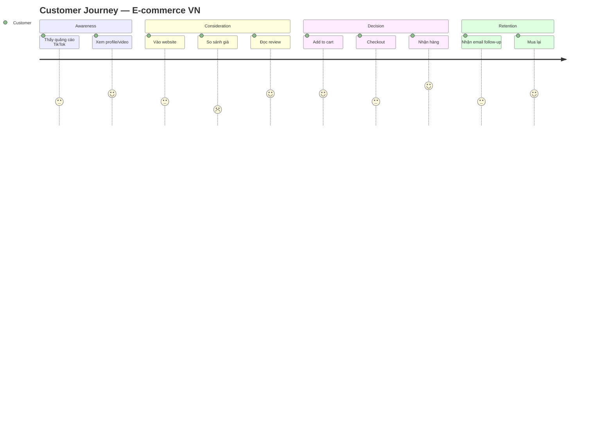

# MK01 — Marketing
> *Nền tảng marketing hiện đại: từ STP đến Marketing Mix và Digital Marketing*

---

## 1. Learning Objectives

- Hiểu cách hoạt động của marketing trong chuỗi tạo giá trị doanh nghiệp
- Thực hiện phân tích STP: Segmentation, Targeting, Positioning
- Thiết kế Marketing Mix (4Ps/7Ps) hiệu quả
- Xây dựng kế hoạch marketing với KPIs rõ ràng
- Hiểu digital marketing và content marketing cơ bản

---

## 2. Business Context

Marketing là **quá trình tạo ra, communicate, deliver, và trao đổi giá trị với khách hàng**. Marketing không phải chỉ là quảng cáo — đó là toàn bộ cách doanh nghiệp hiểu và phục vụ thị trường.

**Marketing vs Sales:** Marketing tạo ra "demand" (nhu cầu) và xây dựng brand. Sales convert demand thành doanh thu. Cả hai cần phối hợp chặt chẽ.

**Tại VN:** Marketing digital đang bùng nổ — Facebook, TikTok, Zalo là kênh chủ đạo. Tuy nhiên nhiều SME VN bỏ qua nền tảng marketing (research, positioning) và nhảy thẳng vào chạy ads.

---

## 3. Definitions

| Thuật ngữ | Định nghĩa |
|-----------|-----------|
| **Segmentation** | Chia thị trường thành các nhóm khách hàng đồng nhất |
| **Targeting** | Chọn segment nào để tập trung |
| **Positioning** | Vị trí brand trong tâm trí khách hàng so với đối thủ |
| **Marketing Mix (4Ps)** | Product, Price, Place, Promotion |
| **Buyer Persona** | Hồ sơ khách hàng mục tiêu điển hình |
| **Customer Journey** | Hành trình từ nhận biết đến mua hàng và trung thành |
| **AIDA** | Awareness → Interest → Desire → Action |
| **Marketing Funnel** | Phễu marketing: ToFU, MoFU, BoFU |
| **CAC** | Customer Acquisition Cost |
| **ROAS** | Return on Ad Spend |

---

## 4. Core Concepts

### 4.1 STP — Segmentation, Targeting, Positioning

**Segmentation — Phân khúc thị trường:**
```
Tiêu chí phân khúc:
  Geographic:  Vùng, tỉnh, thành phố, khí hậu
  Demographic: Tuổi, giới tính, thu nhập, học vấn, nghề nghiệp
  Psychographic: Lifestyle, giá trị, tính cách, sở thích
  Behavioral:  Hành vi mua, tần suất, loyalty, benefits sought
```

**Targeting — Chọn segment:**
```
Đánh giá segment theo 3 tiêu chí:
  Size:          Đủ lớn để đáng đầu tư?
  Accessibility: Tiếp cận được không?
  Attractiveness: Profitable, ít cạnh tranh?

Chiến lược targeting:
  Undifferentiated: 1 offer cho tất cả (mass market)
  Differentiated:   Nhiều offers cho nhiều segments
  Concentrated:     1 offer cho 1 segment (niche)
  Micromarketing:   Personalized (1-to-1)
```

**Positioning — Định vị:**
```
Positioning Statement:
  "Đối với [target segment],
   [Brand] là [frame of reference]
   mà [point of difference]
   vì [reason to believe]"

Ví dụ Highlands Coffee:
  "Đối với giới văn phòng VN (segment),
   Highlands là chuỗi cà phê (FOR)
   mà mang phong cách cà phê Việt hiện đại, không quá đắt (POD)
   vì xuất xứ Việt, nguồn cà phê Tây Nguyên, không gian thoáng (RTB)"
```

### 4.2 Marketing Mix — 4Ps (B2C) và 7Ps (Service)

```
4Ps:
  PRODUCT:    Sản phẩm/dịch vụ, features, quality, packaging
  PRICE:      Giá, chiết khấu, payment terms, pricing strategy
  PLACE:      Kênh phân phối, logistics, coverage
  PROMOTION:  Advertising, PR, sales promotion, digital

+3Ps (Services):
  PEOPLE:     Nhân viên phục vụ, kỹ năng, thái độ
  PROCESS:    Quy trình dịch vụ, flow, standards
  PHYSICAL EVIDENCE: Không gian, layout, design
```

**Pricing Strategies:**
```
Cost-plus:      Giá = Chi phí + Markup %
Value-based:    Giá = Giá trị khách hàng nhận được
Competitive:    Giá căn cứ theo đối thủ
Penetration:    Giá thấp để chiếm thị phần → tăng sau
Skimming:       Giá cao ban đầu → giảm dần
Freemium:       Miễn phí core + trả tiền premium
Dynamic:        Giá thay đổi theo demand/time
```

### 4.3 Customer Journey và AIDA

```
AWARENESS    → CONSIDERATION → DECISION  → RETENTION → ADVOCACY
(Biết đến)    (Cân nhắc)     (Mua)       (Trung thành) (Giới thiệu)
    ↑               ↑            ↑             ↑            ↑
Content     Comparison     Demo/Trial    Onboarding   Referral
Ads         Reviews        Offer        Support      NPS

AIDA Framework:
  Awareness:  "Tôi biết đến thương hiệu này"
  Interest:   "Tôi muốn tìm hiểu thêm"
  Desire:     "Tôi muốn có sản phẩm này"
  Action:     "Tôi quyết định mua"
```

### 4.4 Digital Marketing Channels

```
OWNED MEDIA:         EARNED MEDIA:        PAID MEDIA:
Website/Blog         Word of mouth        Google Ads
Email list           Reviews/ratings      Facebook/TikTok Ads
Social profiles      Press coverage       Influencer paid
App                  Viral content        Display ads

VN TOP CHANNELS (2024):
  1. Facebook (82% internet users dùng)
  2. Zalo (60M+ users — unique VN)
  3. YouTube (75% watch regularly)
  4. TikTok (40M+ users, fastest growing)
  5. Google Search/SEO
```

### 4.5 Content Marketing và SEO cơ bản

```
Content Marketing Funnel:
  TOFU (Top of Funnel): Blog, video, social — Awareness
  MOFU (Middle of Funnel): Case studies, webinars — Consideration
  BOFU (Bottom of Funnel): Demo, testimonials, offer — Decision

SEO Basics:
  On-page: Keywords, title, meta, content quality
  Off-page: Backlinks, brand mentions, social signals
  Technical: Speed, mobile-friendly, structure

VN: Google search volume cao nhưng Zalo/Facebook traffic cao hơn cho B2C
```

### 4.6 Marketing Metrics Framework

```
ACQUISITION:     CONVERSION:       RETENTION:
  Traffic          Conversion rate    Churn rate
  CAC              Avg order value    Repeat purchase
  CTR              Cart abandonment   Customer LTV

BRAND:
  Awareness (%)    Consideration (%)  Preference (%)
  NPS              Share of voice
```

---

## 5. Business Value

| Ứng dụng | Kết quả |
|---------|---------|
| STP analysis | Focus vào đúng segment → ROI cao hơn |
| Value-based pricing | Margin cao hơn cost-plus |
| Digital marketing mix | Reach target audience với CAC thấp |
| Customer journey mapping | Identify drop-off points → optimize |

---

## 6. Enterprise Role

- **CMO:** Marketing strategy, budget, brand
- **Brand Manager:** Brand identity và positioning
- **Digital Marketing Manager:** Paid/organic digital channels
- **Content Marketing Manager:** Content strategy và execution
- **Market Research:** Customer insights, competitive intel

---

## 7. Departments Related

Marketing · Sales · Product · Brand · Digital · PR

---

## 8. Input

- Customer research (surveys, interviews, analytics)
- Competitive analysis
- Business strategy (S01)
- Product roadmap
- Budget

---

## 9. Output

- Marketing strategy document
- Campaign briefs
- Content calendar
- Performance reports (weekly/monthly)
- Customer insights reports

---

## 10. Business Process

```
1. Market Research → Insights về khách hàng và đối thủ
2. STP → Xác định segment, target, positioning
3. Marketing Strategy → Objectives, channels, budget
4. Campaign Planning → Briefs, timeline, assets
5. Execution → Launch campaigns
6. Measurement → Track KPIs
7. Optimization → A/B test, budget reallocation
8. Reporting → Lessons learned
```

---

## 11. Data Flow

```
Customer behavior data (website, app, CRM)
Market research data
              ↓
Insights → STP → Marketing Strategy
              ↓
Campaign execution (Ads platform, email, social)
              ↓
Analytics data → Dashboard → Optimize
```

---

## 12. Money Flow

```
Marketing Budget:
  Paid media:      40-60% (Ads)
  Content/Creative: 20-30%
  Technology/Tools: 10-15%
  Research:         5-10%

ROI calculation:
  ROAS = Revenue từ ads / Ad spend (> 3x = healthy)
  Blended CAC = Total marketing spend / Total new customers
  Marketing ROI = (Revenue from marketing - Marketing cost) / Marketing cost
```

---

## 13. Document Flow

```
Business Strategy (S01)
      ↓
Annual Marketing Plan
      ↓
Campaign Briefs → Creative Assets → Launch
      ↓
Performance Reports → Insights → Next Campaign
```

---

## 14. Roles

| Vai trò | Trách nhiệm |
|---------|------------|
| CMO | Strategy, budget, team leadership |
| Brand Manager | Positioning, brand guidelines |
| Digital Marketer | Paid ads, SEO, email |
| Content Creator | Blog, video, social content |
| Data/Analytics | Measurement, insights, reporting |

---

## 15. Responsibilities

- Marketing chịu trách nhiệm về CAC, MQL (Marketing Qualified Leads)
- Sales chịu trách nhiệm convert MQL → SQL → Customer
- Cả hai cùng chịu trách nhiệm về Revenue và Customer LTV

---

## 16. RACI

| Hoạt động | CMO | Brand | Digital | Sales |
|-----------|:---:|:-----:|:-------:|:-----:|
| Marketing strategy | A | C | C | C |
| Brand guidelines | C | A | I | I |
| Campaign execution | I | C | A | I |
| Lead handoff | I | I | R | A |
| Budget allocation | A | C | C | I |

---

## 17. Frameworks

- **STP** — Segmentation, Targeting, Positioning (Kotler)
- **4Ps/7Ps Marketing Mix** — McCarthy/Booms & Bitner
- **AIDA** — Awareness, Interest, Desire, Action
- **SOSTAC** — Situation, Objectives, Strategy, Tactics, Action, Control
- **Jobs-to-be-Done** — Christensen (customer motivation)
- **Brand Equity** — Keller (CBBE model)

---

## 18. International Standards

- **ISO 20671** — Brand evaluation
- **Marketing Science Institute** — Research benchmarks
- **IAB Standards** — Digital advertising measurement

---

## 19. Vietnam Context

**Đặc thù marketing VN:**
- **Mobile-first:** 70%+ traffic từ mobile → optimize cho mobile
- **Social commerce:** Mua hàng trực tiếp qua Facebook/TikTok Live
- **Influencer culture:** KOLs/KOCs có ảnh hưởng lớn (đặc biệt Beauty, F&B)
- **Price sensitivity:** Promotions và flash sales hiệu quả cao
- **Zalo:** Kênh unique của VN — CRM qua Zalo OA phổ biến

**Ngày lễ marketing quan trọng tại VN:**
- Tết Nguyên Đán (1-2 tháng trước)
- 8/3, 20/10 (phụ nữ)
- Valentine's Day
- Black Friday / Mega Sale (11/11, 12/12)
- Ngày thành lập (brand anniversary)

---

## 20. Legal Considerations

- **Luật Quảng Cáo 2012 + sửa đổi:** Cấm quảng cáo so sánh trực tiếp, quảng cáo gian dối
- **Luật Bảo Vệ Quyền Lợi NTD 2023:** Thông tin sản phẩm phải trung thực
- **Nghị Định 13/2023 PDPA:** Thu thập và dùng dữ liệu khách hàng phải có consent
- **Quy định quảng cáo thực phẩm, dược phẩm:** Nghiêm ngặt hơn — cần giấy phép

---

## 21. Common Mistakes

1. **Skip research → nhảy thẳng vào ads:** Không biết target ai → waste budget
2. **Positioning mờ nhạt:** "Chất lượng tốt, giá cả phải chăng" — không ai nhớ
3. **Metrics vanity:** Tự hào lượt like/view mà không track conversion
4. **Không có content calendar:** Đăng bài tùy hứng → không consistent
5. **Marketing và Sales không align:** MQL definition khác nhau
6. **Bỏ qua retention:** Chỉ focus acquire, không nuture existing customers
7. **Single channel dependency:** Toàn bộ traffic từ 1 kênh → rủi ro cao

---

## 22. Best Practices

- **Research trước, execute sau** — insights guide strategy
- **Test and learn** — A/B test trước khi scale
- **Omnichannel consistency** — message nhất quán trên tất cả kênh
- **Customer-centric** — mọi quyết định đặt khách hàng ở trung tâm
- **Measure everything** — UTM parameters, conversion tracking
- **Content > Ads (long term)** — SEO và content build lasting asset

---

## 23. KPIs

| KPI | Công thức | Benchmark |
|-----|-----------|-----------|
| **CAC** | Marketing spend / New customers | < LTV/3 |
| **ROAS** | Revenue / Ad spend | > 3x (e-com), > 5x (profitable) |
| **CTR** | Clicks / Impressions | > 2% (social), > 1% (display) |
| **Conversion Rate** | Purchases / Website visitors | 1-3% (e-com average) |
| **Email Open Rate** | Opens / Sent | > 20% (VN average) |
| **Organic Traffic Growth** | Month-over-month | > 10%/tháng |

---

## 24. Metrics

- Brand awareness (% target audience nhận biết brand)
- Share of Voice (% mentions vs competitors)
- Cost per Lead (CPL)
- Marketing Qualified Leads (MQLs)/tháng
- Content engagement rate

---

## 25. Reports

- **Weekly Digital Report** (ads performance, traffic, leads)
- **Monthly Marketing Report** (KPIs, campaigns, budget)
- **Quarterly Brand Report** (awareness, NPS, sentiment)

---

## 26. Templates

Xem [23-templates/](../../23-templates/) và [24-prompts/by-module/](../../24-prompts/by-module/).

---

## 27. Checklists

**Campaign Launch Checklist:**
- [ ] Target audience định nghĩa rõ?
- [ ] Key message phù hợp với positioning?
- [ ] Creative assets reviewed và approved?
- [ ] Tracking (UTM, pixel) đã setup?
- [ ] Landing page optimized và tested?
- [ ] Budget allocated đúng kênh?
- [ ] Success metrics đã định nghĩa?

---

## 28. SOP

**Monthly Marketing Review:**
```
Trước họp: Analytics pull data, prepare dashboard
  - Traffic, leads, conversions, spend
  - Compare vs previous month và target

Trong họp (60 phút):
  15' — Performance vs KPIs
  15' — Channel breakdown (What worked, what didn't)
  15' — Insights và hypotheses
  15' — Next month plan và budget

Action items: Document và assign owners
```

---

## 29. Case Study

**Baemin VN — Marketing trong cuộc chiến food delivery:**

Baemin vào VN năm 2019 đối mặt với GrabFood và Now đã chiếm thị phần lớn.

**Chiến lược marketing:**
- **Positioning:** "Cute, local, trendy" — khác hoàn toàn với GrabFood (utility)
- **Target:** Gen Z và Millennials tại TP.HCM và HN
- **TikTok + Influencer:** First mover advantage trên TikTok food content
- **Brand character:** Baedal Motu (mascot) + local collabs

**Kết quả:** Tăng từ 0 lên top 3 market share trong 2 năm. Cuối cùng rút khỏi VN vì unit economics, không phải vì marketing (bài học: marketing tốt không cứu được business model xấu).

---

## 30. Small Business Example

**Tiệm bánh kem handmade — Marketing trên Instagram:**

```
STP:
  Segment: Phụ nữ 25-35, HCM, thu nhập trung cao, thích lifestyle
  Target: Cô gái thành phố mua bánh cho dịp đặc biệt
  Positioning: "Bánh kể câu chuyện của bạn" — personalized, emotional

4Ps:
  Product: Bánh thiết kế theo yêu cầu, natural ingredients
  Price: 400-800k/bánh (premium)
  Place: Instagram DM, Zalo order, tự giao
  Promotion: IG organic + Story polls + Collab với wedding planners

KPIs tháng:
  - IG followers growth: +200/tháng
  - DM inquiries: 50+ → Orders: 20+
  - Average order value: 600k
  - Repeat customer rate: 40%
```

---

## 31. Enterprise Example

**Vinamilk — Marketing đa kênh:**

Vinamilk maintain brand leadership qua:
- **Mass media:** TVC trên national TV (brand awareness)
- **Digital:** Facebook 3M+ followers, YouTube, website
- **Retail marketing:** In-store display, sampling campaigns
- **Sponsorship:** Đội tuyển quốc gia, trẻ em (CSR + brand)
- **Innovation marketing:** Ra mắt sản phẩm mới hàng năm (Organic, Super Nut)

**STP:** Vinamilk có nhiều sub-brands để target từng segment (Kids, Adults, Elderly, Premium).

---

## 32. ERP Mapping

| Marketing Activity | ERP/CRM Module |
|-------------------|---------------|
| Customer acquisition | CRM — Lead management |
| Campaign tracking | CRM — Campaign module |
| Revenue from marketing | SD — Sales analytics |
| Marketing budget | CO — Cost center |

---

## 33. Automation Opportunities

- **Email automation:** Welcome sequence, abandoned cart, re-engagement
- **Social media scheduling:** Buffer, Hootsuite
- **Ad optimization:** Google Ads Smart Bidding, Facebook Advantage+
- **CRM automation:** Lead scoring, nurture sequences

---

## 34. AI Opportunities

- **Content generation:** AI viết social captions, email subject lines, ad copy
- **Image generation:** AI tạo creative assets (Midjourney, DALL-E)
- **Audience targeting:** ML optimize targeting và bidding
- **Sentiment analysis:** AI track brand sentiment trên social
- **Chatbot:** Tự động trả lời Facebook/Zalo messages

---

## 35. Implementation Guide

**Xây dựng marketing function từ đầu:**
```
Tháng 1: Foundation
  - Customer research (phỏng vấn 10-15 khách hàng)
  - STP analysis
  - Positioning statement

Tháng 2: Infrastructure
  - Website/landing page tối ưu
  - Analytics setup (GA4, Facebook Pixel)
  - CRM/email tool (Mailchimp, GetResponse)
  - Social profiles chuyên nghiệp

Tháng 3: Launch
  - Content calendar đầu tiên
  - Paid ads pilot (budget nhỏ, test)
  - Email list building

Tháng 4+: Scale
  - Scale what works
  - Kill what doesn't
  - Hire specialists dựa trên kênh hiệu quả
```

---

## 36. Consulting Guide

**Marketing audit:**
1. Positioning có rõ ràng và differentiated không?
2. STP có được define rõ hay đang target "everyone"?
3. Kênh nào đang mang lại CAC thấp nhất? Đang invest đúng không?
4. Marketing và Sales có SLA về MQL/SQL không?
5. Content strategy có consistent không? Có tần suất không?

---

## 37. Diagnostic Questions

1. Khách hàng mục tiêu của bạn là ai? Mô tả bằng demographics + psychographics.
2. Tại sao khách hàng chọn bạn thay vì đối thủ? Họ nói gì?
3. CAC của bạn là bao nhiêu? Từng kênh?
4. Kênh marketing nào mang lại LTV cao nhất?

---

## 38. Interview Questions

- "STP là gì? Cho ví dụ cho một sản phẩm cụ thể."
- "Bạn có 100 triệu budget tháng này cho F&B startup. Allocate như thế nào?"
- "ROAS 2.5x có tốt không? Depends on what?"

---

## 39. Exercises

**Bài 1:** Thực hiện STP cho một trong: Chuỗi gym, App đặt xe, Nước mắm cao cấp. Viết positioning statement.

**Bài 2:** Thiết kế Customer Journey Map cho một startup SaaS B2B VN từ Awareness đến Advocacy. Xác định kênh và content type cho từng giai đoạn.

**Bài 3:** Phân tích 4Ps của Grab Food và Baemin (khi còn hoạt động). Positioning khác nhau như thế nào?

---

## 40. References

- **Sách:** *Marketing Management* — Philip Kotler & Kevin Keller
- **Sách:** *This Is Marketing* — Seth Godin
- **Sách:** *Building a StoryBrand* — Donald Miller
- **VN:** *Marketing Căn Bản* — Nguyễn Thượng Thái
- **Online:** Neil Patel Blog, HubSpot Academy (free)

---

## Output Formats

### Mermaid — Customer Journey


### Flashcards
```
Q: STP là gì? Thứ tự thực hiện?
A: Segmentation → Targeting → Positioning.
   S: Chia thị trường thành nhóm đồng nhất
   T: Chọn nhóm nào để tập trung
   P: Định vị brand trong tâm trí nhóm đó
   Phải theo thứ tự: phân khúc trước, chọn sau, định vị cuối.

Q: 4Ps là gì? Khi nào dùng 7Ps?
A: Product, Price, Place, Promotion — cho sản phẩm vật lý.
   +People, Process, Physical Evidence — khi bán dịch vụ.
   Ví dụ: Nhà hàng, ngân hàng, spa cần 7Ps vì "trải nghiệm" quan trọng.

Q: ROAS 3x có nghĩa gì?
A: Mỗi đồng bỏ vào quảng cáo → thu về 3 đồng doanh thu.
   Nhưng: ROAS 3x có profitable hay không còn tùy gross margin.
   Ví dụ: GM 50% → ROAS 3x = break-even. GM 70% → ROAS 3x = có lợi.
```

### JSON Metadata
```json
{
  "module_code": "MK01",
  "module_name": "Marketing",
  "domain": "Marketing",
  "level": "Foundation-Intermediate",
  "version": "1.0",
  "status": "complete",
  "prerequisites": ["F01", "B01", "S01"],
  "related_modules": ["MK02", "MK03", "SA01", "B01"],
  "learning_time_hours": 10,
  "key_frameworks": ["STP", "4Ps/7Ps", "AIDA", "SOSTAC", "Customer Journey"],
  "key_standards": ["ISO 20671"],
  "vietnam_specific": true,
  "tags": ["marketing", "STP", "4Ps", "digital-marketing", "CAC", "customer-journey"]
}
```
