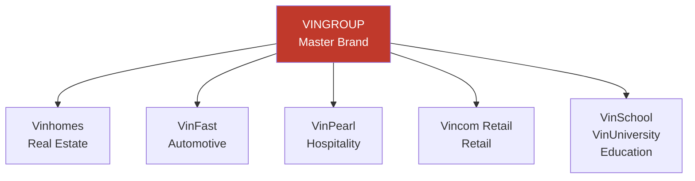

# MK02 — Branding
> *Xây dựng thương hiệu bền vững: từ Brand Identity đến Brand Equity*

---

## 1. Learning Objectives

- Hiểu brand equity và tại sao brand là tài sản doanh nghiệp
- Xây dựng Brand Identity System (logo, màu sắc, font, voice)
- Thiết kế Brand Architecture cho portfolio đa brand
- Đo lường brand health bằng metrics định lượng
- Quản lý brand trong khủng hoảng

---

## 2. Business Context

Brand là **tổng hợp những gì mọi người nghĩ và cảm nhận về doanh nghiệp của bạn khi bạn không có mặt**. Brand mạnh tạo ra pricing power, loyalty, và talent attraction.

**Tại VN:** Nhiều doanh nghiệp VN xây dựng brand bằng cách "làm logo đẹp" mà bỏ qua brand strategy. Thị trường ngày càng cạnh tranh → brand differentiation là sống còn.

---

## 3. Definitions

| Thuật ngữ | Định nghĩa |
|-----------|-----------|
| **Brand** | Tổng thể nhận thức, cảm xúc, kỳ vọng về một tổ chức/sản phẩm |
| **Brand Equity** | Giá trị tài chính của brand — premium customers sẵn sàng trả |
| **Brand Identity** | Cách brand thể hiện ra bên ngoài (visual + voice) |
| **Brand Image** | Cách khách hàng nhận thức về brand |
| **Brand Architecture** | Cách tổ chức portfolio của nhiều brands |
| **Brand Positioning** | Vị trí brand trong tâm trí KH so với đối thủ |
| **Brand Voice** | Phong cách giao tiếp nhất quán của brand |
| **NPS** | Net Promoter Score — đo loyalty |
| **Brand Awareness** | % target audience nhận biết brand |

---

## 4. Core Concepts

### 4.1 Brand Equity — Keller's CBBE Model

```
BRAND EQUITY PYRAMID (từ dưới lên):

Level 4: RESONANCE (Gắn kết)
  Loyalty, Attachment, Community, Engagement

Level 3: RESPONSES (Phản hồi)
  Judgments (Quality, Credibility)
  Feelings (Warmth, Fun, Excitement, Security)

Level 2: MEANING (Ý nghĩa)
  Performance (Features, Reliability, Service)
  Imagery (Brand personality, heritage, user profile)

Level 1: IDENTITY (Nhận diện)
  Brand Salience — Awareness, Recognition, Recall
```

**Brand Equity Sources (Aaker):**
- Brand Awareness
- Brand Loyalty
- Perceived Quality
- Brand Associations
- Other proprietary assets (patents, trademarks)

### 4.2 Brand Identity System

```
BRAND IDENTITY COMPONENTS:

CORE:
  Brand Purpose:   Tại sao tồn tại (beyond profit)?
  Brand Vision:    Tương lai muốn tạo ra?
  Brand Values:    Nguyên tắc không bao giờ thỏa hiệp?
  Brand Positioning: Unique place in customer's mind

EXPRESSION:
  VISUAL IDENTITY:         VERBAL IDENTITY:
  - Logo & logo variations  - Brand name
  - Color palette (primary + secondary)
  - Typography (font chính + phụ)
  - Photography style
  - Icons/illustrations     - Brand voice & tone
  - Layout grid             - Key messages
                            - Tagline/Slogan
```

**Brand Voice Spectrum (ví dụ):**
```
Serious ←─────────────────────────→ Playful
Formal  ←─────────────────────────→ Casual
Expert  ←─────────────────────────→ Friendly
Old     ←─────────────────────────→ Young

Ví dụ VN:
  Techcombank: Expert + Confident + Progressive
  Baemin: Playful + Cute + Local
  Vinamilk: Trustworthy + Warm + Family
  FPT: Bold + Innovative + Vietnamese pride
```

### 4.3 Brand Architecture

```
3 mô hình chính:

BRANDED HOUSE (House of Brand):
  Master brand mạnh, tất cả products dưới 1 umbrella
  Ví dụ: Apple (iPhone, iPad, Mac... đều là Apple)
  Ví dụ VN: FPT (FPT Software, FPT Telecom, FPT Education...)

HOUSE OF BRANDS (Branded House of Brands):
  Mỗi product là brand riêng biệt, parent brand ẩn
  Ví dụ: P&G (Tide, Pampers, Gillette... — khách hàng không cần biết P&G)
  Ví dụ VN: Masan Consumer (Chinsu, Kokomi, Nam Ngư)

HYBRID / ENDORSED:
  Mix: Parent brand visible nhưng sub-brands có identity riêng
  Ví dụ: Marriott (Marriott, Courtyard by Marriott, Ritz-Carlton by Marriott)
  Ví dụ VN: Vin- prefix (Vinhomes, VinFast, VinPearl — Vingroup visible)
```

### 4.4 Brand Positioning — Perceptual Map

```
Ví dụ ngành cà phê VN:

              PREMIUM
                ↑
    Phúc Long   Starbucks
                    ●  ●
LOCAL ──────────────────────── INTERNATIONAL
    ●                   ●
 Trung Nguyên      The Coffee Bean
    Highlands
    ●
                ↓
             POPULAR

Positioning gap = Cơ hội cho brand mới
```

### 4.5 Brand Storytelling — StoryBrand Framework

```
Donald Miller's StoryBrand:

1. CHARACTER (Nhân vật): Khách hàng là hero, không phải brand
2. PROBLEM:  External (vấn đề bên ngoài)
             Internal (cảm giác bên trong)
             Philosophical (tại sao điều này sai?)
3. GUIDE:    Brand là người hướng dẫn có kinh nghiệm
4. PLAN:     3 bước đơn giản để giải quyết vấn đề
5. CALL TO ACTION: Rõ ràng, direct
6. AVOID FAILURE: Điều gì xảy ra nếu không hành động?
7. SUCCESS:  Cuộc sống tốt hơn như thế nào?

Ví dụ: Grab Story — "Bạn cần di chuyển an toàn, tiện lợi (problem) → 
       Grab giúp bạn đặt xe chỉ 1 click (plan) → 
       Sống hiện đại, không stress (success)"
```

### 4.6 Brand Crisis Management

```
CRISIS TYPES:
  Product/Service failure
  Social media controversy
  Employee misconduct
  False information/rumors
  External events (industry crisis)

CRISIS RESPONSE FRAMEWORK:
  Hour 1:  Acknowledge, don't stay silent
  Day 1:   Official statement — facts only, không speculate
  Week 1:  Investigation + corrective actions
  Month 1: Rebuild trust through consistent actions

4Rs of Crisis:
  Regret:  Thể hiện sự quan tâm
  Reason:  Giải thích (không đổ lỗi)
  Remedy: Hành động khắc phục cụ thể
  Return:  Cam kết không tái diễn
```

---

## 5. Business Value

| Lợi ích | Tác động |
|---------|---------|
| Brand awareness | Giảm CAC (customers tự tìm đến) |
| Brand loyalty | Tăng LTV, giảm churn |
| Pricing power | Premium margin |
| Talent attraction | Brand employer thu hút top talent |

---

## 6. Enterprise Role

- **CMO:** Brand strategy, brand health monitoring
- **Brand Manager:** Brand guidelines, campaigns
- **Creative Director:** Visual identity
- **PR Manager:** Brand reputation, crisis
- **Social Media Manager:** Brand voice online

---

## 7. Departments Related

Marketing · PR · Design · Product · HR (Employer Branding)

---

## 8. Input

- Customer research (brand perception surveys)
- Competitive brand analysis
- Business strategy (S01)
- Company values và culture

---

## 9. Output

- Brand Strategy document
- Brand Identity Guidelines (Brand Book)
- Brand Architecture diagram
- Brand Health Report (quarterly)

---

## 10. Business Process

```
1. Brand Audit (current perception vs desired)
2. Brand Strategy (Purpose, Vision, Values, Positioning)
3. Brand Identity Design (visual + verbal)
4. Brand Guidelines creation
5. Internal launch (employees first)
6. External launch
7. Brand consistency monitoring
8. Annual brand health check
```

---

## 11. Data Flow

```
Customer surveys (brand perception)
Social listening (mentions, sentiment)
          ↓
Brand Health Dashboard
          ↓
Brand Strategy decisions → Campaign briefs → Creative
          ↓
Execution → Monitor → Adjust
```

---

## 12. Money Flow

- **Brand investment:** Design, campaigns, PR
- **Brand ROI:** Higher margins, lower CAC, better talent retention
- **Brand valuation:** Intangible asset trong M&A (goodwill)

---

## 13. Document Flow

```
Brand Strategy → Brand Guidelines (Brand Book)
              → Campaign Briefs
              → Social Media Guidelines
              → Crisis Communication Playbook
```

---

## 14. Roles

| Vai trò | Trách nhiệm |
|---------|------------|
| CMO | Brand strategy, budget |
| Brand Manager | Consistency, guidelines enforcement |
| Creative Director | Visual identity system |
| PR Manager | Brand reputation, media relations |
| Social Media | Brand voice online |

---

## 15. Responsibilities

- Brand consistency là trách nhiệm của **tất cả nhân viên**
- Marketing team enforce brand guidelines
- CEO là brand ambassador số 1

---

## 16. RACI

| Hoạt động | CMO | Brand Mgr | Creative | PR |
|-----------|:---:|:---------:|:--------:|:--:|
| Brand strategy | A | R | C | C |
| Brand guidelines | C | A | R | I |
| Campaign creative | C | A | R | I |
| Crisis response | A | C | I | R |

---

## 17. Frameworks

- **CBBE (Customer-Based Brand Equity)** — Keller
- **Brand Equity Model** — Aaker
- **StoryBrand** — Donald Miller
- **Brand Archetypes** — Carl Jung/Margaret Mark (12 archetypes)
- **Golden Circle** — Simon Sinek (Why/How/What)

---

## 18. International Standards

- **ISO 10668:2010** — Brand valuation
- **ISO 20671:2019** — Brand evaluation
- **Interbrand methodology** — Brand value ranking

---

## 19. Vietnam Context

**Xu hướng branding VN:**
- **"Made in Vietnam" pride:** Người tiêu dùng VN ngày càng yêu thích brand nội địa
- **Authenticity:** Brand story thật (nguồn gốc, founder story) được đón nhận
- **Local insight:** Brand nói tiếng VN thực sự (không phải dịch từ global copy)
- **Community:** Brand tạo ra cộng đồng (Highlands fans, Vinamilk for kids)

**Ví dụ brand VN thành công:**
| Brand | Key Differentiator |
|-------|------------------|
| **Marou Chocolate** | Luxury "Bean to Bar" made in VN, exported to 40 countries |
| **Phở Thìn** | Authentic, original, 60+ năm — "gốc gác" |
| **Saigon Cider** | Premium local craft, millennials |
| **Annam Group** | Premium imported goods for expats/upper class |

---

## 20. Legal Considerations

- **Bảo vệ nhãn hiệu:** Đăng ký tại Cục Sở Hữu Trí Tuệ (NOIP)
- **Nhãn hiệu nổi tiếng:** Được bảo vệ đặc biệt kể cả không đăng ký
- **Domain name:** Đăng ký .vn tại VNNIC
- **Madrid Protocol:** Đăng ký nhãn hiệu quốc tế qua WIPO

---

## 21. Common Mistakes

1. **Brand = Logo:** Thiết kế logo đẹp nhưng không có brand strategy
2. **Inconsistency:** Mỗi kênh dùng màu, font, tone khác nhau
3. **Copy đối thủ:** Brand positioning không unique
4. **Ignore employer branding:** Brand ngoài thị trường tốt nhưng nhân viên không proud
5. **Không đo brand health:** Không biết brand đang mạnh hay yếu
6. **Rebrand vội vàng:** Thay đổi brand identity khi không cần thiết → mất equity

---

## 22. Best Practices

- **Brand book** — tài liệu hướng dẫn nhất quán
- **Logo usage rules** — clear dos and don'ts
- **Annual brand health survey** — track perception
- **Employee brand training** — mọi người là brand ambassador
- **Protect trademark** — đăng ký ngay khi có brand traction
- **Brand guide cho agency** — brief rõ ràng trước khi thuê

---

## 23. KPIs

| KPI | Cách đo | Benchmark |
|-----|---------|-----------|
| **Unaided Awareness** | Survey | > 20% (để có market presence) |
| **Brand Consideration** | Survey | > Awareness/2 |
| **NPS** | Survey | > 30 (good), > 50 (excellent) |
| **Share of Voice** | Social listening | > Market share = good |
| **Brand Sentiment** | Social listening | > 70% positive |

---

## 24. Metrics

- Brand search volume (Google Trends)
- Social media mentions và sentiment
- Customer satisfaction (CSAT) score
- Employee Net Promoter Score (eNPS)

---

## 25. Reports

- **Quarterly Brand Health Report** (awareness, consideration, NPS)
- **Social Listening Report** (monthly)
- **Annual Brand Review** (comprehensive)

---

## 26. Templates

**Brand Voice Document:**
```
Brand Name: _______________
Personality: [3 adjectives]
Voice: [Formal/Informal, Expert/Friendly, etc.]
Tone variations:
  - Customer service: [tone description]
  - Marketing copy: [tone description]
  - Social media: [tone description]
Do: [Examples of right tone]
Don't: [Examples of wrong tone]
```

---

## 27. Checklists

**Brand Consistency Audit:**
- [ ] Logo đúng version, đúng màu trên tất cả touchpoints?
- [ ] Font consistent trên website, print, digital?
- [ ] Brand voice nhất quán trên tất cả kênh?
- [ ] Tất cả nhân viên biết brand values không?
- [ ] Agency briefed về brand guidelines không?

---

## 28. SOP

**New campaign brand review:**
```
1. Brief nhận từ Marketing Manager
2. Brand Manager review: STP alignment + Positioning fit
3. Creative review: Visual identity compliance
4. Copy review: Brand voice compliance
5. Legal review (nếu cần): Claims, testimonials
6. Final approval: CMO hoặc Brand Manager
```

---

## 29. Case Study

**Momo — Brand Building trong Fintech:**

MoMo bắt đầu là ví điện tử năm 2013 — market còn xa lạ với thanh toán digital tại VN.

**Brand strategy:**
- **Name:** MoMo — ngắn, dễ nhớ, local feel (tiếng VN)
- **Color:** Pink — nổi bật, khác biệt trong fintech (thường xanh/đen)
- **Character:** Mascot thỏ dễ thương → gần gũi, không intimidating với người dùng mới
- **Voice:** Vui vẻ, helpful, empowering

**Kết quả:** MoMo trở thành top-of-mind cho mobile payment VN với 31M+ users, brand awareness > 80% ở đô thị.

---

## 30. Small Business Example

**Cửa hàng thời trang nữ online — Building brand từ đầu:**

```
Brand Foundation:
  Purpose: "Giúp phụ nữ VN tự tin trong từng bộ trang phục"
  Values: Authentic, Affordable luxury, Vietnamese-made quality
  Personality: Elegant but approachable

Visual Identity:
  Colors: Blush pink + Ivory + Gold accent
  Font: Serif cho elegance, sans-serif cho readability
  Photography: Natural light, lifestyle, real women (không quá runway)

Verbal Identity:
  Tagline: "Mặc đẹp mỗi ngày"
  Voice: Warm, sisterly, encouraging

Brand touchpoints:
  Instagram: Lifestyle + product posts
  Packaging: Branded tissue paper, note card, ribbon
  Customer service: Personal responses, name usage
```

---

## 31. Enterprise Example

**Viettel — Brand transformation:**

Viettel chuyển từ "nhà mạng quân đội" → "tech company toàn cầu":
- New visual identity (2021): Modern, tech-forward
- Purpose shift: "Sáng tạo vì con người"
- Brand extension: Viettel Money, Viettel Pay, SmartHome
- International brand: Hiện diện tại 10+ thị trường với local brand names

---

## 32. ERP Mapping

Brand data ít trong ERP, nhưng:
- Revenue premium từ brand: Tracked trong FI module
- Marketing spend: CO cost center
- Customer satisfaction: CRM integration

---

## 33. Automation Opportunities

- **Social listening automation:** Mention tracking, sentiment alerts
- **Brand consistency tools:** Frontify, Bynder (brand asset management)
- **Trademark monitoring:** Automated alerts khi có brand infringement

---

## 34. AI Opportunities

- **Brand voice checker:** AI review content có đúng brand voice không
- **Logo similarity detection:** AI identify potential trademark infringement
- **Sentiment analysis:** Real-time brand health monitoring
- **AI brand design:** Khởi đầu nhanh với brand identity

---

## 35. Implementation Guide

**Brand development project:**
```
Phase 1 — Discovery (2-3 tuần):
  Brand audit, customer research, competitive analysis

Phase 2 — Strategy (1-2 tuần):
  Purpose, values, positioning workshop

Phase 3 — Design (3-4 tuần):
  Logo, color, font, photography style

Phase 4 — Guidelines (1-2 tuần):
  Brand book creation

Phase 5 — Launch (2-4 tuần):
  Internal first, then external rollout

Phase 6 — Monitor:
  Annual brand health check
```

---

## 36. Consulting Guide

**Brand audit:**
1. Xem tất cả touchpoints: Website, social, bao bì, office — có nhất quán không?
2. Customer perception survey: Họ nói gì về brand? (Spontaneous, không gợi ý)
3. Competitor brand map: Mình đang positioned ở đâu so với đối thủ?
4. Hỏi nhân viên: "Brand của chúng ta là gì?" (Nếu họ không biết → problem)

---

## 37. Diagnostic Questions

1. Khách hàng mô tả brand của bạn bằng 3 từ gì? Có match với bạn muốn không?
2. Có Brand Guidelines (Brand Book) không?
3. Trên 5 kênh giao tiếp khác nhau — brand có nhất quán không?
4. Brand của bạn unique như thế nào? Đối thủ có thể nói điều tương tự không?

---

## 38. Interview Questions

- "Brand Equity là gì? Làm thế nào để đo?"
- "Phân biệt Brand Identity và Brand Image."
- "Một brand nổi tiếng gặp scandal — bạn xử lý như thế nào trong 24h đầu?"

---

## 39. Exercises

**Bài 1:** Xây dựng Brand Identity cơ bản cho startup "Rau sạch VN" mới thành lập: Purpose, Values, Personality, Positioning Statement, Tagline.

**Bài 2:** Phân tích Brand Architecture của Vingroup. Họ đang dùng model nào? Ưu và nhược điểm?

**Bài 3:** Bạn là Brand Manager của Highlands Coffee. Một influencer lớn vừa đăng video tố cáo chất lượng vệ sinh (chưa verify). Xây dựng crisis response plan 7 ngày.

---

## 40. References

- **Sách:** *Building Strong Brands* — David Aaker
- **Sách:** *Strategic Brand Management* — Kevin Keller
- **Sách:** *Building a StoryBrand* — Donald Miller
- **Online:** Interbrand Best Global Brands (annual report)
- **VN:** Báo cáo Nielsen Brand Health VN (annual)

---

## Output Formats

### Mermaid — Brand Architecture


### Flashcards
```
Q: Brand equity là gì? Tại sao quan trọng?
A: Giá trị premium khách hàng sẵn sàng trả vì brand — trên và ngoài giá trị sản phẩm thuần túy.
   Ví dụ: iPhone vs Android tương tự specs → iPhone giá cao hơn 30-50% → Brand equity.
   Quan trọng: Pricing power, customer loyalty, talent attraction, M&A premium.

Q: Branded House vs House of Brands?
A: Branded House: 1 master brand (Apple — iPhone, iPad, Mac đều Apple)
   House of Brands: Nhiều brands độc lập (P&G — Tide, Pampers, Gillette)
   VN: Vingroup = Branded House; Masan Consumer = House of Brands

Q: NPS là gì? Tính như thế nào?
A: Net Promoter Score = %Promoters (9-10) - %Detractors (0-6)
   Survey: "Bạn có recommend công ty cho bạn bè không? 0-10"
   > 50 = Excellent, > 30 = Good, 0-30 = Fair, < 0 = Problem
```

### JSON Metadata
```json
{
  "module_code": "MK02",
  "module_name": "Branding",
  "domain": "Marketing",
  "level": "Intermediate",
  "version": "1.0",
  "status": "complete",
  "prerequisites": ["MK01", "S01"],
  "related_modules": ["MK01", "MK03", "SA01"],
  "learning_time_hours": 8,
  "key_frameworks": ["CBBE Keller", "Brand Equity Aaker", "StoryBrand", "Brand Archetypes"],
  "key_standards": ["ISO 10668", "ISO 20671"],
  "vietnam_specific": true,
  "tags": ["branding", "brand-equity", "brand-identity", "NPS", "brand-architecture"]
}
```
