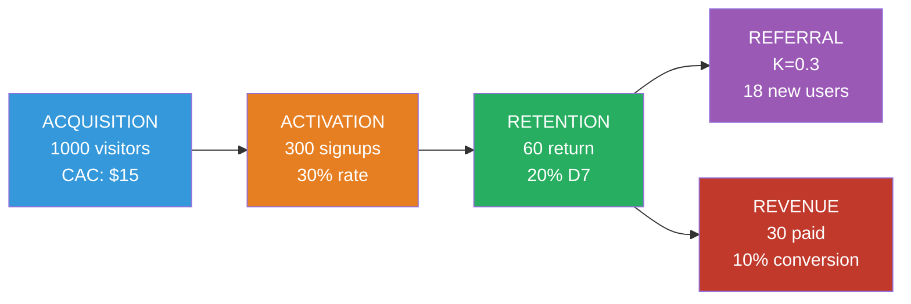

# MK03 — Growth Marketing
> *Growth hacking đến data-driven growth: AARRR, Funnel Optimization, Viral Loops*

---

## 1. Learning Objectives

- Hiểu và áp dụng framework AARRR (Pirate Metrics)
- Phân tích và tối ưu funnel ở từng giai đoạn
- Thiết kế và chạy growth experiments (A/B tests)
- Xây dựng viral loops và referral programs
- Áp dụng Product-Led Growth (PLG) cho SaaS và app

---

## 2. Business Context

Growth Marketing khác Traditional Marketing ở chỗ: **lấy data và experimentation làm trung tâm**, không phải brand awareness hay creativity đơn thuần.

Sean Ellis (người tạo ra term "Growth Hacker"): *"A growth hacker is a person whose true north is growth."* Mọi quyết định, mọi campaign, mọi initiative đều được đánh giá bằng: "Cái này có drive growth không?"

**Tại VN:** Growth marketing đang được startup và tech company áp dụng. Tuy nhiên nhiều người nhầm "growth hacking" là "spam" hoặc "cheap tricks". Growth thực sự là sustainable, data-driven, và value-creating.

---

## 3. Definitions

| Thuật ngữ | Định nghĩa |
|-----------|-----------|
| **AARRR** | Acquisition, Activation, Retention, Referral, Revenue |
| **Growth Loop** | Cơ chế tăng trưởng tự reinforcing — output trở thành input |
| **Viral Coefficient (K)** | Mỗi user mang về bao nhiêu user mới (K > 1 = viral) |
| **A/B Testing** | So sánh 2 variants để xác định variant nào perform tốt hơn |
| **Cohort Analysis** | Theo dõi nhóm users theo thời gian |
| **North Star Metric** | Chỉ số duy nhất đo lường giá trị cốt lõi |
| **PLG** | Product-Led Growth — product tự là engine tăng trưởng |
| **Conversion Rate Optimization (CRO)** | Tăng % visitors thực hiện desired action |
| **Churn Rate** | % users bỏ đi trong một khoảng thời gian |

---

## 4. Core Concepts

### 4.1 AARRR Pirate Metrics — Dave McClure

```
ACQUISITION:   Người dùng biết đến sản phẩm từ đâu?
               → Traffic sources, CAC, CTR

ACTIVATION:    Người dùng có "aha moment" đầu tiên không?
               → First session depth, onboarding completion,
                  time to value

RETENTION:     Người dùng có quay lại không?
               → DAU/MAU, 7-day/30-day retention,
                  churn rate

REFERRAL:      Người dùng có giới thiệu cho người khác không?
               → Viral coefficient K, referral rate, NPS

REVENUE:       Người dùng có tạo ra doanh thu không?
               → ARPU, LTV, conversion to paid
```

**North Star Metric theo loại business:**
```
E-commerce:    GMV, số đơn hàng
SaaS:          MRR, DAU
Social:        DAU, Time spent
Marketplace:   Number of successful transactions
Content:       Return visitors, Time on site
Food delivery: Number of orders delivered
```

### 4.2 Growth Loops vs Funnel

```
FUNNEL (Linear):
  Acquire → Activate → Retain → Revenue
  Input: More ads → More users → More revenue
  Giới hạn: Linear relationship, không compound

GROWTH LOOP (Compounding):
  User experience → Viral invite → New users → Better product
                                      ↑               ↓
                              More content ← More users

Ví dụ Growth Loops:
  Dropbox: Use product → Share folder → Friend signs up → Uses product
  Tiki:    Buy product → Review → Next buyer sees review → Buys → Reviews
  Zalo:    Message friend → Friend installs Zalo → Messages others
```

### 4.3 Viral Coefficient (K)

```
K = (Average invitations sent per user) × (Conversion rate of invitations)

Ví dụ:
  Mỗi user gửi 3 invitations → K factor là conversion rate
  3 invitations × 20% conversion = K = 0.6 (sub-viral)
  3 invitations × 40% conversion = K = 1.2 (viral — mỗi user mang 1.2 users mới)

K > 1 = Viral (exponential growth)
K = 0.5-1 = Healthy (linear với CAC)
K < 0.3 = No organic growth, paid dependent
```

### 4.4 Retention và Cohort Analysis

```
Cohort Retention Table (D1, D7, D30):
  
           D0    D1    D7    D30
Jan cohort 100%  40%   25%   15%
Feb cohort 100%  45%   28%   18%
Mar cohort 100%  50%   32%   22%

→ Trend cải thiện: D30 từ 15% → 22% → Product improving

Good benchmarks (mobile app):
  D1: > 40%
  D7: > 20%
  D30: > 10%

"If retention is broken, nothing else matters"
— Andrew Chen, Andreessen Horowitz
```

### 4.5 A/B Testing Framework

```
SCIENTIFIC APPROACH:
  1. Hypothesis: "Thay CTA từ 'Mua ngay' thành 'Dùng thử miễn phí'
                  sẽ tăng conversion 15%"
  2. Define metric: Sign-up rate
  3. Sample size: Tính minimum sample (statistical significance)
  4. Run test: 50% traffic → control, 50% → variant
  5. Analyze: Sau khi đạt significance (p < 0.05)
  6. Decide: Roll out winner hoặc learn từ loser

Statistical significance formula:
  Sample size ≈ (Z² × p × (1-p)) / E²
  (Z=1.96 for 95%, p=current conversion, E=minimum detectable effect)
  
Tools: Google Optimize, VWO, Optimizely, tự build với Analytics
```

### 4.6 Product-Led Growth (PLG)

```
TRADITIONAL (Sales-Led):
  Marketing → MQL → Sales → Demo → Close → Customer

PLG (Product-Led):
  Free trial/Freemium → AHA moment → Activation → Expansion
  Product sells itself, sales assist at enterprise

PLG Requirements:
  - Quick time-to-value (< 5 phút đến AHA moment)
  - Easy onboarding (self-serve)
  - Clear upgrade triggers (capacity, features, team size)
  - In-product upsell/expansion paths

VN PLG examples: Base.vn, Misa (freemium → paid), ELSA (free → premium)
```

### 4.7 SEO Growth Framework

```
KEYWORD RESEARCH → CONTENT CREATION → OPTIMIZATION → DISTRIBUTION

SEO Growth Model:
  Foundation content: High-volume, competitive keywords (long-term)
  Middle: Medium competition, high intent
  Bottom: Long-tail, conversion-focused

Programmatic SEO (scale):
  Template + Data → Auto-generate pages for every location/category
  Ví dụ: Tiki có trang cho mỗi product category × city

VN SEO context:
  Google: Dominant (95%+ search)
  Cốc Cốc: 5-10% VN market share (có plugin audience)
  Mobile: 80%+ search từ mobile
```

---

## 5. Business Value

| Ứng dụng | Kết quả |
|---------|---------|
| AARRR audit | Xác định bottleneck trong funnel → fix đúng chỗ |
| A/B testing | Improve conversion 10-30% systematically |
| Referral program | Giảm CAC 20-50% |
| Retention focus | LTV tăng, không cần acquire thêm |

---

## 6. Enterprise Role

- **Head of Growth:** Growth strategy, experiments backlog
- **Growth Engineers:** Build experiments, features
- **Data Analyst:** Cohort analysis, funnel analysis
- **CRO Specialist:** Landing page, onboarding optimization

---

## 7. Departments Related

Marketing · Product · Engineering · Data · Sales

---

## 8. Input

- Product analytics (Mixpanel, Amplitude, GA4)
- CRM data
- User research (interviews, surveys)
- A/B test results

---

## 9. Output

- Growth dashboard (AARRR metrics)
- Cohort analysis reports
- A/B test results
- Growth experiments backlog
- Weekly growth review

---

## 10. Business Process

```
1. Define North Star Metric
2. AARRR audit: Identify bottleneck stage
3. Brainstorm hypotheses (đội 3-5 người, 30 phút)
4. ICE score mỗi idea: Impact × Confidence × Ease
5. Prioritize top 3-5 experiments
6. Build và launch experiment
7. Analyze results (statistical significance)
8. Document và share learnings
9. Scale winners, kill losers
10. Repeat weekly
```

---

## 11. Data Flow

```
User behavior (app/web events)
          ↓
Analytics platform (Mixpanel, Amplitude)
          ↓
AARRR Dashboard
          ↓
Identify drop-off → Hypotheses → A/B Tests
          ↓
Results → Learnings → Next iteration
```

---

## 12. Money Flow

Growth metrics drive financial outcomes:
- CAC reduction (via referral, SEO, viral)
- LTV increase (via retention)
- Revenue expansion (via upsell, activation)

**Unit economics improvement:**
```
Before optimization: CAC $200, LTV $400 → LTV/CAC = 2x
After: CAC $120 (referral), LTV $600 (better retention) → LTV/CAC = 5x
```

---

## 13. Document Flow

```
Growth Strategy → Experiments Backlog
              → Weekly Sprint (experiments)
              → Results Documentation
              → Growth Playbook (accumulated learnings)
```

---

## 14. Roles

| Vai trò | Trách nhiệm |
|---------|------------|
| Head of Growth | Strategy, prioritization, team leadership |
| Growth Engineer | Technical experiments, feature building |
| Data Analyst | Analysis, dashboards, A/B test design |
| Content/SEO | Organic acquisition growth |
| CRO Specialist | Conversion optimization |

---

## 15. Responsibilities

- Growth team own AARRR metrics
- Product team own Activation và Retention
- Marketing own Acquisition và Referral
- Finance own Revenue

---

## 16. RACI

| Hoạt động | Growth Head | Product | Data | Marketing |
|-----------|:-----------:|:-------:|:----:|:---------:|
| North Star definition | A | C | C | C |
| Experiment prioritization | A | C | C | C |
| A/B test execution | R | C | C | I |
| Cohort analysis | C | I | A | I |
| Retention strategies | C | A | C | I |

---

## 17. Frameworks

- **AARRR Pirate Metrics** — Dave McClure
- **Growth Loops** — Reforge
- **ICE Scoring** — Sean Ellis (Impact, Confidence, Ease)
- **PIE Framework** — Potential, Importance, Ease
- **Lean Analytics** — Croll & Yoskovitz
- **Product-Led Growth** — Wes Bush

---

## 18. International Standards

- **ISO/IEC 25010** — Software quality (liên kết với PLG)
- **Statistical methods:** p-value, confidence intervals trong A/B testing

---

## 19. Vietnam Context

**Growth hacking VN thành công:**
- **VNG/Zalo:** Viral growth qua "gửi voice message" feature — WOM drove adoption
- **Tiki:** Referral program + Same-day delivery → retention
- **MoMo:** Cashback campaigns → Acquisition + habit formation
- **Shopee:** Gamification (Shopee Farm, daily coins) → Engagement + Retention

**Kênh growth hiệu quả tại VN:**
- TikTok: Viral content → massive organic reach
- Zalo: CRM qua Official Account, push notification
- Facebook groups: Community-led growth
- Influencer/KOC micro-campaigns: Cost-effective reach

---

## 20. Legal Considerations

- **Nghị Định 13/2023 (PDPA):** Thu thập user data phải có consent
- **Luật An Ninh Mạng 2018:** Data localization cho certain data types
- **Spam regulations:** Email marketing phải có unsubscribe option

---

## 21. Common Mistakes

1. **Chỉ focus Acquisition:** Ignore Retention → "leaky bucket"
2. **A/B test không đủ sample:** Declare winner sớm → False positive
3. **One metric wonder:** Tối ưu 1 metric → hurt others (vanity metrics)
4. **Không define North Star:** Team kéo các hướng khác nhau
5. **Copy tactics, not strategy:** "Dropbox làm referral program" → mình làm nhưng product khác
6. **Growth team isolated:** Không làm việc với Product → disconnect

---

## 22. Best Practices

- **Retention first** — Sau khi acquisition working, retention là priority
- **Weekly growth reviews** — data-driven, fast iteration
- **Document everything** — learnings accumulate thành competitive advantage
- **Kill ideas quickly** — sunk cost fallacy là enemy của growth
- **Qualitative + Quantitative** — số liệu nói "what", research nói "why"

---

## 23. KPIs

| KPI | Benchmark |
|-----|-----------|
| **D1 Retention** | > 40% (mobile app) |
| **D30 Retention** | > 10% (mobile), > 40% (SaaS) |
| **Viral Coefficient K** | > 0.5 (good), > 1.0 (viral) |
| **Time to AHA moment** | < 5 phút (PLG ideal) |
| **MoM growth rate** | > 10% (healthy startup) |
| **CAC Payback Period** | < 12 tháng |

---

## 24. Metrics

- Activation rate (onboarding completion)
- Feature adoption rate
- Expansion revenue (upsell/cross-sell)
- Net Revenue Retention (NRR)
- Organic vs Paid acquisition split

---

## 25. Reports

- **Weekly Growth Review** (AARRR snapshot, experiments status)
- **Monthly Cohort Report** (retention trends)
- **Quarterly Growth Review** (strategy evaluation)

---

## 26. Templates

**Experiment Brief:**
```
Experiment Name: _______________
Date: ___  Owner: ___
Hypothesis: "Nếu chúng ta [change], thì [metric] sẽ [increase/decrease] vì [reason]"
Primary Metric: ___
Secondary Metrics: ___
Sample Size: ___  Duration: ___
Control: [description]  Variant: [description]
ICE Score: Impact _/10 | Confidence _/10 | Ease _/10
Result: ___  Statistical Significance: ___
Learning: ___  Next Steps: ___
```

---

## 27. Checklists

**Growth Audit:**
- [ ] North Star Metric đã được define?
- [ ] AARRR metrics đang được tracked?
- [ ] Cohort retention data có sẵn?
- [ ] A/B testing process đã có?
- [ ] Bottleneck trong funnel đã identify?
- [ ] Referral/viral mechanism đã build?

---

## 28. SOP

**Weekly Growth Sprint:**
```
Thứ Hai: Data review
  - Pull AARRR metrics tuần trước
  - Identify anomalies và trends

Thứ Ba: Experiments review
  - Check running experiments
  - Declare winners/losers nếu đủ data

Thứ Tư: Ideation (nếu cần)
  - Brainstorm ideas mới
  - ICE score và prioritize

Thứ Năm-Sáu: Build/Launch
  - Implement top experiments
  - Launch mới

Thứ Sáu: Document
  - Update Growth Playbook với learnings
```

---

## 29. Case Study

**Dropbox — Referral Program tăng 3900%:**

2008: Dropbox chi rất nhiều cho Google Ads — CAC $388, product giá $99. Không sustainable.

**Referral hack:** "Give 500MB free, get 500MB per referral" cho cả sender và receiver.

**Kết quả:**
- K coefficient > 1 → viral growth
- 35% signups từ referral chương trình
- User base từ 100K → 4M trong 15 tháng
- CAC dropped dramatically

**Áp dụng VN:** Tiki, Grab, MoMo đều có referral programs tương tự. Điểm khác: VN users ưa tiền mặt/cashback hơn credits.

---

## 30. Small Business Example

**Khoá học online cooking VN — Growth experiments:**

```
North Star: Monthly paying students

AARRR audit:
  Acquisition: 1000 website visitors/tháng (Facebook ads)
  Activation: 30% sign up for free lesson → 300 leads
  Retention: 20% come back week 2 → 60 active
  Referral: 5% refer friend → 3 new users (K=0.01 — very low)
  Revenue: 10% convert to paid → 30 paying

Bottleneck: Referral (K=0.01)

Hypothesis: "Nếu offer free lesson cho mỗi referral thành công,
             K sẽ tăng từ 0.01 lên 0.3"

Experiment: Email campaign đến 300 active users:
  Control: No referral offer
  Variant: "Giới thiệu bạn bè → bạn được 1 lesson miễn phí"

Result: Variant K = 0.4 → Scale referral program
```

---

## 31. Enterprise Example

**Shopee VN — Gamification Growth:**

Shopee dùng gamification để drive retention và daily visits:
- **Shopee Farm:** Tưới cây → earn coins → discount
- **Daily check-in:** Coins mỗi ngày → habit formation
- **Flash deals:** Urgency → daily visits
- **Live streaming:** Entertainment + commerce = "shoppertainment"

**Kết quả:** DAU cao nhất trong TMĐT VN, visit frequency > 4x/tuần với loyal users.

---

## 32. ERP Mapping

Growth ít liên quan ERP, nhưng:
- Revenue tracking: Finance module
- Customer segments: CRM
- Product usage: Analytics platform (Mixpanel, Amplitude)

---

## 33. Automation Opportunities

- **A/B testing automation:** Feature flags, automatic winner deployment
- **Email sequences:** Triggered based on user behavior
- **Cohort alerts:** Automatic notification khi retention drops

---

## 34. AI Opportunities

- **Personalization:** AI-driven content và product recommendations
- **Churn prediction:** ML model identify at-risk users trước khi churn
- **Creative optimization:** AI A/B test ad creatives automatically
- **Growth opportunity scanner:** AI identify untapped segments

---

## 35. Implementation Guide

**Xây dựng Growth function:**
```
Tháng 1: Foundation
  - Define North Star Metric
  - Setup analytics stack (GA4 + Mixpanel/Amplitude)
  - AARRR baseline measurement

Tháng 2: First experiments
  - A/B test infrastructure
  - Top 3 experiments per bottleneck

Tháng 3+: Compound
  - Weekly growth reviews
  - Growth Playbook documentation
  - Hire growth engineer nếu cần
```

---

## 36. Consulting Guide

**Growth audit:**
1. North Star Metric: Có defined không? Team có biết không?
2. Retention curves: Flatten ở mức nào? So sánh cohorts theo thời gian
3. Funnel analysis: Step nào có biggest drop-off?
4. Viral/referral: K coefficient hiện tại bao nhiêu?
5. A/B testing: Đang chạy bao nhiêu tests? Có process không?

---

## 37. Diagnostic Questions

1. North Star Metric của bạn là gì? Trend như thế nào?
2. D30 retention là bao nhiêu? Đang improve hay decline?
3. Bottleneck trong AARRR funnel của bạn ở đâu?
4. Referral program có không? K coefficient bao nhiêu?
5. Tuần này team đang chạy những A/B tests nào?

---

## 38. Interview Questions

- "Nếu retention đang giảm, bạn diagnose như thế nào?"
- "Thiết kế referral program cho ứng dụng giao đồ ăn tại VN."
- "Tại sao retention quan trọng hơn acquisition?"

---

## 39. Exercises

**Bài 1:** AARRR audit cho Grab VN: Estimate metrics cho từng stage. Identify bottleneck.

**Bài 2:** Thiết kế growth experiment cho onboarding của một app quản lý chi tiêu. Viết hypothesis, define metrics, estimate sample size.

**Bài 3:** Tính Viral Coefficient K cho: 1000 users, mỗi user gửi trung bình 4 invitations, conversion rate từ invitation là 15%. K = ? Viral hay không?

---

## 40. References

- **Sách:** *Hacking Growth* — Sean Ellis & Morgan Brown
- **Sách:** *Lean Analytics* — Croll & Yoskovitz
- **Sách:** *Product-Led Growth* — Wes Bush
- **Online:** Reforge (reforge.com) — best growth education
- **Newsletter:** Lenny's Newsletter, Andrew Chen Blog

---

## Output Formats

### Mermaid — AARRR Funnel


### Flashcards
```
Q: AARRR là gì? Mỗi chữ nghĩa là gì?
A: Acquisition: Users từ đâu đến?
   Activation: Có "aha moment" không?
   Retention: Có quay lại không?
   Referral: Có giới thiệu bạn không?
   Revenue: Có tạo doanh thu không?
   → Pirate Metrics (phát âm "AARRR!" như cướp biển)

Q: Viral Coefficient K > 1 có nghĩa gì?
A: Mỗi user trung bình mang về nhiều hơn 1 user mới → growth exponential.
   K = 1.5 → 100 users → 150 → 225 → 337... (compound growth)
   K < 1 → sub-viral, cần paid acquisition để grow

Q: Tại sao "retention is broken, nothing else matters"?
A: Nếu D30 = 5%: Tháng 1 acquire 100 users → còn 5 sau 30 ngày
   Dù có tốt đến đâu về acquisition cũng không fill được leaky bucket
   Fix retention trước → acquisition spend sẽ compound thay vì wasted
```

### JSON Metadata
```json
{
  "module_code": "MK03",
  "module_name": "Growth Marketing",
  "domain": "Marketing",
  "level": "Intermediate-Advanced",
  "version": "1.0",
  "status": "complete",
  "prerequisites": ["MK01", "F04"],
  "related_modules": ["MK01", "MK04", "SA03", "DA01"],
  "learning_time_hours": 10,
  "key_frameworks": ["AARRR", "Growth Loops", "ICE Scoring", "PLG", "Viral Coefficient"],
  "vietnam_specific": true,
  "tags": ["growth", "AARRR", "A/B-testing", "retention", "viral", "growth-hacking", "PLG"]
}
```
