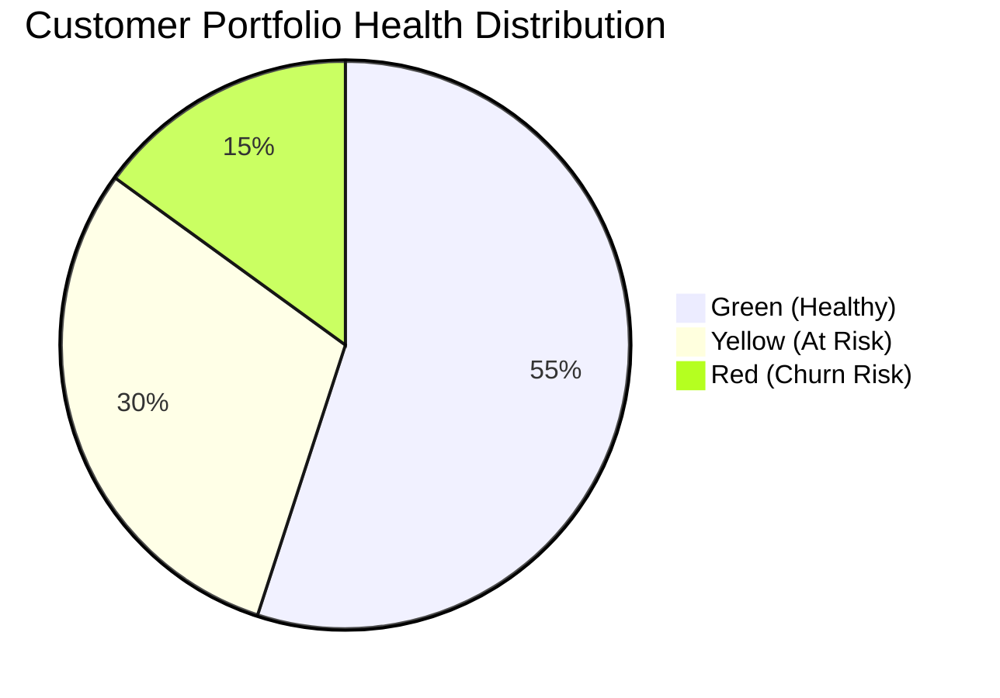

# MK04 — Customer Success
> *Từ customer service sang customer success: proactive value delivery và retention*

---

## 1. Learning Objectives

- Phân biệt Customer Success với Customer Service
- Thiết kế Customer Success playbook cho SaaS và B2B
- Xây dựng onboarding journey hiệu quả
- Đo lường và cải thiện Net Revenue Retention (NRR)
- Identify và prevent churn proactively

---

## 2. Business Context

Customer Success (CS) là **đảm bảo khách hàng đạt được desired outcome khi dùng sản phẩm/dịch vụ của bạn**. CS proactive (chủ động), trong khi Customer Service reactive (phản ứng khi có vấn đề).

**Tại sao CS quan trọng:**
- Giữ khách hàng chi phí thấp hơn acquisition 5-25x
- Expansion revenue (upsell/cross-sell) từ happy customers
- NPS cao → Referrals → Giảm CAC

**Tại VN:** Customer Success vẫn còn mới, chủ yếu ở SaaS và B2B tech. Nhiều doanh nghiệp nhầm CS với sau bán hàng (support ticket).

---

## 3. Definitions

| Thuật ngữ | Định nghĩa |
|-----------|-----------|
| **Customer Success (CS)** | Đảm bảo KH đạt desired outcome với product |
| **Churn** | KH bỏ sản phẩm/không gia hạn |
| **Net Revenue Retention (NRR)** | % revenue giữ được + expanded từ existing customers |
| **Customer Health Score** | Tổng hợp metrics đánh giá sức khỏe KH |
| **Onboarding** | Quy trình dẫn KH mới đến AHA moment |
| **AHA Moment** | Thời điểm KH nhận ra core value của product |
| **Expansion Revenue** | Doanh thu thêm từ KH hiện tại (upsell, cross-sell) |
| **Playbook** | Quy trình chuẩn để xử lý tình huống cụ thể |
| **QBR** | Quarterly Business Review — họp định kỳ với KH |

---

## 4. Core Concepts

### 4.1 Customer Success vs Customer Service

```
CUSTOMER SERVICE:          CUSTOMER SUCCESS:
  Reactive (phản ứng)   vs  Proactive (chủ động)
  Issue-driven          vs  Outcome-driven
  Short-term fix        vs  Long-term relationship
  Cost center           vs  Revenue center
  Ticket-based          vs  Relationship-based
  "Vấn đề của bạn?"     vs  "Bạn muốn đạt gì?"
```

### 4.2 Customer Journey trong CS

```
ONBOARDING:          ADOPTION:           EXPANSION:
  Welcome email        Feature discovery    Upsell to higher tier
  Setup assistance     Training/education   Cross-sell new products
  First milestone      Regular check-ins    Referral ask
  AHA moment           QBRs               
  
RETENTION:           ADVOCACY:
  Health monitoring    Case studies
  Churn prevention     Testimonials
  Renewal management   User groups/community
```

### 4.3 Customer Health Score

```
Composite score từ nhiều signals:

PRODUCT USAGE (40%):
  - Login frequency
  - Feature adoption
  - Active users / Total licensed users

ENGAGEMENT (30%):
  - Response rate to CS outreach
  - Attendance at trainings/webinars
  - Support ticket volume (low = good OR high = bad)

BUSINESS METRICS (30%):
  - Contract value trend
  - Renewal likelihood
  - Expansion potential
  - NPS/CSAT score

HEALTH SCORE:
  Green (70-100): Healthy, happy customer
  Yellow (40-69): At risk, needs attention
  Red (0-39):     Churn risk, escalate immediately
```

### 4.4 Churn Analysis và Prevention

```
CHURN TYPES:
  Voluntary: KH chủ động hủy (unhappy, found alternative)
  Involuntary: Failed payment, admin churn
  
CHURN SIGNALS:
  Early: Decreased logins, feature abandonment, support spikes
  Mid: No response to emails, no renewal discussion
  Late: Sent cancellation notice

PREVENTION PLAYBOOKS:
  High usage + Low expansion:
    → "Expansion play": Show ROI, propose upgrade
  
  Decreasing usage:
    → "Re-engagement play": Training, check-in call, new use cases
  
  Health score dropping:
    → "Save play": Executive sponsorship, rapid response team
  
  Renewal approaching:
    → "Renewal play": Early renewal conversation, success review
```

### 4.5 Net Revenue Retention (NRR)

```
NRR = (MRR đầu kỳ + Expansion - Downgrade - Churn) / MRR đầu kỳ

Ví dụ:
  MRR đầu: $100,000
  Expansion: +$15,000 (upsell)
  Downgrade: -$5,000
  Churn:    -$8,000
  
  NRR = ($100,000 + $15,000 - $5,000 - $8,000) / $100,000
      = $102,000 / $100,000
      = 102%
  
BENCHMARKS:
  > 120%: World-class (Snowflake, Twilio level)
  100-120%: Excellent (sustainable growth without new customers)
  90-100%: Acceptable
  < 90%: Problem — business shrinking from existing customers
  
"NRR > 100% means you can grow revenue without adding new customers"
```

### 4.6 Onboarding Framework

```
TIME-TO-VALUE (TTV) Goal:
  "Khách hàng đạt AHA moment trong X ngày"
  → X nên < 7 ngày cho B2B SaaS
  → X nên < 5 phút cho consumer app (PLG)

ONBOARDING STAGES:
  Day 0:  Welcome email + setup guide
  Day 1:  Kickoff call (B2B) hoặc in-app guide (B2C)
  Day 3:  Check-in: "Bạn đã thử [key feature] chưa?"
  Day 7:  First milestone celebration
  Day 14: Training session (B2B)
  Day 30: Success review — "Bạn đang đạt được gì?"

ONBOARDING HEALTH:
  Completion rate > 70% = Excellent
  Completion rate 40-70% = Needs optimization
  Completion rate < 40% = Broken, fix immediately
```

---

## 5. Business Value

| Ứng dụng | Kết quả |
|---------|---------|
| Churn reduction 5% | Revenue có thể tăng 25-95% (công thức Bain) |
| NRR > 100% | Doanh thu tăng dù không có new customers |
| Onboarding optimization | Higher activation → better retention |
| Expansion plays | Upsell revenue từ satisfied customers |

---

## 6. Enterprise Role

- **VP Customer Success:** CS strategy, team, NRR ownership
- **Customer Success Manager (CSM):** Manage customer portfolio
- **Onboarding Specialist:** New customer onboarding
- **Customer Support:** Reactive issue resolution
- **Renewal Manager:** Contract renewals

---

## 7. Departments Related

Customer Success · Sales · Product · Support · Finance

---

## 8. Input

- Product usage data
- Support ticket data
- CRM (contract, renewal dates)
- NPS/CSAT surveys
- Customer feedback

---

## 9. Output

- Customer Health Scores (weekly)
- Churn risk alerts
- QBR presentations
- Renewal forecasts
- Expansion opportunity pipeline

---

## 10. Business Process

```
1. Onboarding: New customer → AHA moment → First value
2. Adoption: Feature usage → Habit formation → ROI realized
3. Review: QBR → Success stories → Identify gaps
4. Expansion: Identify opportunities → Propose upgrade
5. Renewal: Early conversation → Contract renewal
6. Advocacy: Happy customers → Case studies → Referrals
```

---

## 11. Data Flow

```
Product usage data → Health Score calculation
Support data      →                       → At-risk alerts
CRM data          →                       → CSM action
Survey data       →                       → Playbook trigger
```

---

## 12. Money Flow

CS drives revenue through:
- **Retention:** Giữ MRR hiện tại
- **Expansion:** Upsell/cross-sell = Net New Revenue
- **Referrals:** Reduce CAC
- **Renewal Rate:** > 90% = healthy SaaS business

---

## 13. Document Flow

```
Customer contract (Sales) → Onboarding plan (CS)
                         → Health Score (weekly update)
                         → QBR Deck (quarterly)
                         → Renewal memo (before expiry)
```

---

## 14. Roles

| Vai trò | Trách nhiệm |
|---------|------------|
| VP Customer Success | NRR, team, strategy |
| CSM | Customer portfolio (50-100 accounts) |
| Onboarding Specialist | New customer TTV |
| Customer Support | Tickets, issue resolution |

---

## 15. Responsibilities

- CS owns NRR và Expansion Revenue
- CS reports Churn risk early (30/60/90 days before renewal)
- CS bridges Product và Customer feedback

---

## 16. RACI

| Hoạt động | VP CS | CSM | Support | Sales |
|-----------|:-----:|:---:|:-------:|:-----:|
| Customer health | A | R | C | I |
| Onboarding | A | R | C | C |
| Churn prevention | A | R | I | C |
| Upsell execution | C | R | I | A |
| Renewal | C | R | I | A |

---

## 17. Frameworks

- **Customer Success framework** — Lincoln Murphy
- **HEART Framework** — Google (Happiness, Engagement, Adoption, Retention, Task success)
- **The Bow Tie Funnel** — CS-specific funnel model
- **Jobs-to-be-Done** — Apply to CS to understand desired outcomes

---

## 18. International Standards

- **ISO/IEC 25010** — Software quality (linked to CS outcomes)
- **SLA (Service Level Agreement)** — CS response times

---

## 19. Vietnam Context

**Customer Success tại VN:**
- Phổ biến nhất ở: SaaS (Base.vn, MISA, Getfly CRM), F&B platforms (KiotViet, CukCuk)
- Cách tiếp cận VN: Zalo là kênh CS chính (không phải email)
- Văn hóa: KH VN ưa personal relationship → CSM cần relationship-building cao
- B2B SME: KH ít nguồn lực → CS phải làm nhiều hand-holding hơn

**Ví dụ:** MISA có CS team rất mạnh — hỗ trợ KH setup từng bước, training tại chỗ. Đây là differentiator với phần mềm quốc tế.

---

## 20. Legal Considerations

- **SLA trong hợp đồng:** CS phải deliver theo cam kết (uptime, response time)
- **Data handling:** CS team access KH data → PDPA compliance
- **Renewal terms:** Tự động gia hạn phải có thông báo rõ ràng

---

## 21. Common Mistakes

1. **CS = Support:** Chỉ fix issues, không proactive về outcomes
2. **Too many accounts per CSM:** > 100 accounts enterprise → không đủ time
3. **Reactive churn detection:** Biết KH muốn cancel khi đã quá muộn
4. **No health score:** Không biết ai đang at-risk
5. **Ignore onboarding:** Assume KH tự figure out product
6. **CS isolated từ Product:** Feedback loop bị gián đoạn

---

## 22. Best Practices

- **Proactive outreach** — đừng chờ KH hỏi
- **QBR mỗi quý** với enterprise accounts
- **Health score weekly review** — identify at-risk early
- **Expansion plays** — CS là revenue center, không chỉ cost center
- **Voice of Customer** — CS team là bridge giữa KH và Product

---

## 23. KPIs

| KPI | Benchmark |
|-----|-----------|
| **NRR** | > 100% |
| **Logo Churn Rate** | < 5%/năm (enterprise) |
| **Onboarding Completion** | > 70% |
| **Time to AHA Moment** | < 7 ngày (B2B SaaS) |
| **Customer Health (Green %)** | > 60% portfolio |
| **QBR Coverage** | > 80% enterprise accounts |

---

## 24. Metrics

- CSAT (Customer Satisfaction Score)
- CES (Customer Effort Score)
- Feature adoption rate
- Support ticket trends per customer

---

## 25. Reports

- **Weekly Health Score Dashboard**
- **Monthly Churn Risk Report**
- **Quarterly NRR Report**
- **Annual Customer Success Review**

---

## 26. Templates

**QBR Agenda (45-60 phút):**
```
1. (5') Review previous period goals
2. (10') KH's business updates — Họ đang achieve gì?
3. (15') Product usage review — What's working, what's not?
4. (10') ROI discussion — Value từ product
5. (10') Roadmap preview — Upcoming features relevant to them
6. (10') Goals setting — Next quarter priorities
```

---

## 27. Checklists

**Onboarding Checklist (B2B SaaS):**
- [ ] Welcome email gửi trong 1 giờ sau khi ký hợp đồng?
- [ ] Kickoff call scheduled trong 24h?
- [ ] Admin account và permissions setup?
- [ ] Data migration/integration plan?
- [ ] Training scheduled?
- [ ] AHA moment milestone defined?
- [ ] 30-day success review scheduled?

---

## 28. SOP

**Churn Risk Playbook:**
```
TRIGGER: Health Score giảm xuống Yellow (<60) hoặc Red (<40)

Ngày 1: CSM check product usage data — Xác nhận signal
Ngày 2: Email KH: "Xin chào [Name], tôi nhận thấy team bạn chưa dùng
         [feature] gần đây — bạn có cần hỗ trợ gì không?"
Ngày 4: Nếu không phản hồi → gọi điện
Ngày 7: Nếu vẫn không phản hồi → escalate VP CS + thông báo Account Executive
Ngày 14: Executive-to-Executive outreach (nếu enterprise)
Ngày 30: Formal "Save Plan" với specific actions và timelines
```

---

## 29. Case Study

**Base.vn — Customer Success cho B2B SaaS VN:**

Base.vn (phần mềm quản lý doanh nghiệp) xây dựng CS team mạnh trong thị trường SME VN.

**Approach:**
- **Onboarding:** Workshop trực tiếp hoặc online (không phải chỉ docs)
- **CS Channel:** Zalo OA + hotline (không phải chỉ email như SaaS quốc tế)
- **Community:** Base Community Vietnam — users chia sẻ best practices
- **Health Score:** Dựa vào login frequency + feature usage

**Kết quả:** NRR > 100%, churn thấp hơn hẳn competitor không đầu tư CS.

---

## 30. Small Business Example

**Cửa hàng mỹ phẩm online — Informal CS:**

```
CS practices không cần "CS team" chuyên biệt:
  - Zalo cá nhân: Nhắn tin cảm ơn sau khi KH nhận hàng
  - Follow-up 7 ngày: "Dùng sản phẩm được chưa chị?"
  - Birthday message: Hỏi thăm + offer nhỏ
  - Facebook group: Community của KH → FAQ, beauty tips
  - Return tracking: KH mua lại < 60 ngày → healthy; > 90 ngày → check in

Kết quả: Repeat purchase rate > 45%, referral rate cao vì personal touch
```

---

## 31. Enterprise Example

**Salesforce — Customer Success at Scale:**

Salesforce có 9,000+ Customer Success Managers toàn cầu. Họ invented many CS practices:
- Trailhead (free education platform) → self-service onboarding
- Salesforce Success Plans (tiers: Standard, Premier, Signature)
- Customer 360 — full visibility vào customer health

**VN context:** Các công ty VN như PNJ, MB Bank dùng Salesforce và nhận Customer Success service từ Salesforce team.

---

## 32. ERP Mapping

| CS Activity | System |
|------------|--------|
| Health Score | CRM (Salesforce, HubSpot) |
| Onboarding tracking | CRM + Project management |
| Renewal management | CRM + Finance |
| Product usage | Product analytics + CRM integration |

---

## 33. Automation Opportunities

- **Health score automation:** Auto-calculate từ product usage data
- **Churn alert:** Auto-notify CSM khi health drops
- **Onboarding sequences:** Automated email/Zalo based on milestones
- **Renewal reminders:** Auto-trigger 90/60/30 days before renewal

---

## 34. AI Opportunities

- **Churn prediction:** ML model với 90%+ accuracy 30 days trước churn
- **Next best action:** AI gợi ý CSM nên làm gì với từng customer
- **Sentiment analysis:** AI phân tích support tickets để identify unhappy customers
- **QBR preparation:** AI generate first draft QBR từ usage data

---

## 35. Implementation Guide

**Xây dựng CS function:**
```
Tháng 1: Foundation
  - Define "customer success" for your business
  - Map current customer journey
  - Identify AHA moment

Tháng 2: Process
  - Design onboarding playbook
  - Build basic health score (even manual)
  - CSM assignments

Tháng 3+: Scale
  - Automate health score calculation
  - QBR process cho top accounts
  - Track NRR monthly
```

---

## 36. Consulting Guide

**CS audit questions:**
1. NRR hiện tại là bao nhiêu? Trend? (Benchmark: >100%)
2. Churn rate theo logo và revenue?
3. Time to first value cho new customer?
4. CSM ratio: Bao nhiêu accounts per CSM?
5. Health score có không? Dựa vào data gì?

---

## 37. Diagnostic Questions

1. NRR của bạn là bao nhiêu? Có >100% không?
2. Khi khách hàng churn, bạn biết tại sao không? Có exit survey không?
3. CSM của bạn có biết account nào đang at-risk không?
4. Thời gian từ ký hợp đồng đến first value là bao lâu?

---

## 38. Interview Questions

- "NRR là gì? Tại sao quan trọng hơn gross revenue?"
- "Customer Success khác Customer Support thế nào?"
- "Bạn có 100 accounts, health score cho thấy 20 đang yellow. Prioritize như thế nào?"

---

## 39. Exercises

**Bài 1:** Thiết kế Customer Health Score cho một SaaS quản lý nhân sự. Xác định 5 metrics, trọng số, và ngưỡng green/yellow/red.

**Bài 2:** Viết churn prevention email cho KH đã không login vào platform 3 tuần (B2B SaaS context, persona là HR Manager).

**Bài 3:** Tính NRR: Đầu năm MRR = 500tr. Expansion +80tr, Downgrade -30tr, Churn -40tr. NRR = ? Nhận xét.

---

## 40. References

- **Sách:** *Customer Success* — Gainsight (Nick Mehta et al.)
- **Sách:** *Farm Don't Hunt* — Guy Nirpaz
- **Online:** Gainsight blog, ChurnZero resources
- **VN:** MISA và Base.vn case studies

---

## Output Formats

### Mermaid — Customer Health Score


### Flashcards
```
Q: NRR > 100% nghĩa là gì?
A: Revenue từ existing customers tháng này cao hơn tháng trước —
   dù có churn, expansion revenue bù lại và còn dư.
   Tức là: Có thể grow mà không cần thêm 1 customer mới.
   > 120% = World class (Snowflake, Datadog level)

Q: Onboarding AHA moment là gì?
A: Khoảnh khắc khách hàng mới "thấy ngay" giá trị core của sản phẩm.
   Ví dụ: Slack = Đội nhóm gửi 10 messages đầu tiên trong channel
   Facebook = Add 7 friends trong 10 ngày đầu
   Cần identify AHA moment của bạn và engineer onboarding đến đó nhanh nhất.
```

### JSON Metadata
```json
{
  "module_code": "MK04",
  "module_name": "Customer Success",
  "domain": "Marketing",
  "level": "Intermediate",
  "version": "1.0",
  "status": "complete",
  "prerequisites": ["MK01", "MK03", "SA01"],
  "related_modules": ["MK03", "SA01", "SA02", "OP03"],
  "learning_time_hours": 8,
  "key_frameworks": ["AARRR", "Customer Health Score", "NRR", "QBR", "Onboarding Framework"],
  "vietnam_specific": true,
  "tags": ["customer-success", "NRR", "churn", "onboarding", "health-score", "retention"]
}
```
