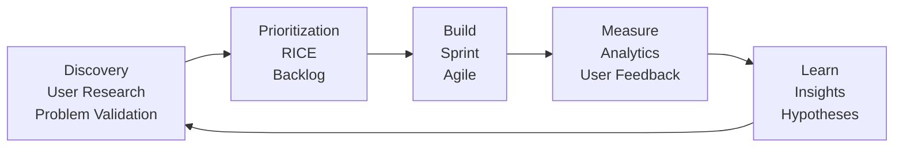

# MK05 — Product Management
> *Quản lý sản phẩm từ discovery đến delivery: Agile, Product Strategy, Roadmap*

---

## 1. Learning Objectives

- Hiểu vai trò Product Manager và Product Strategy
- Thực hiện Product Discovery: user research, problem validation
- Xây dựng Product Roadmap theo Impact vs Effort
- Quản lý sản phẩm theo Agile/Scrum
- Đo lường product success bằng metrics

---

## 2. Business Context

Product Management là **cầu nối giữa business, technology, và user experience** để build sản phẩm đúng thứ, đúng thời điểm, đúng cách.

**PM's role (3 perspectives):**
- **Business:** ROI, revenue, strategy alignment
- **Tech:** Feasibility, technical debt, scalability
- **User:** Desirability, usability, value

**Tại VN:** Product Management đang phát triển nhanh với startup ecosystem. Tuy nhiên nhiều "PM" thực chất là Project Manager (focus on delivery, not strategy). True PM owns product outcome, không chỉ output.

---

## 3. Definitions

| Thuật ngữ | Định nghĩa |
|-----------|-----------|
| **Product Manager (PM)** | Người chịu trách nhiệm về sự thành công của sản phẩm |
| **Product Roadmap** | Kế hoạch phát triển sản phẩm theo thời gian, align với strategy |
| **User Story** | Mô tả tính năng từ góc nhìn user: "As a [user], I want [action] so that [benefit]" |
| **Backlog** | Danh sách tất cả tasks/features cần build, sorted by priority |
| **Sprint** | Chu kỳ phát triển ngắn (1-2 tuần) trong Scrum |
| **MVP** | Minimum Viable Product — version tối thiểu để validate |
| **Product-Market Fit (PMF)** | Điểm sản phẩm đáp ứng nhu cầu thị trường |
| **Jobs-to-be-Done (JTBD)** | Framework hiểu tại sao user "hire" sản phẩm |
| **OKR** | Objectives & Key Results — goal setting cho product |

---

## 4. Core Concepts

### 4.1 Product Strategy Framework

```
VISION (3-5 năm):    "Chúng ta muốn tạo ra thế giới như thế nào?"
       ↓
STRATEGY (1-2 năm):  "Where to play + How to win trong product"
       ↓
ROADMAP (Quarterly): "Những gì chúng ta build và khi nào"
       ↓
BACKLOG (Weekly):    "Đây là tasks cụ thể cho sprint này"

Vision → Strategy → Roadmap → Backlog → Features → Metrics
```

### 4.2 Product Discovery — Hiểu trước khi Build

```
PROBLEM SPACE:              SOLUTION SPACE:
  User interviews           Prototyping
  Surveys                   A/B testing
  Usage analytics           Feature flagging
  Support tickets           Beta testing
  Jobs-to-be-Done           Usability testing
  
Discovery Questions:
  1. "Vấn đề thực sự là gì?" (Không phải solution)
  2. "Ai gặp vấn đề này nhiều nhất?"
  3. "Họ đang giải quyết nó bằng cách gì hiện tại?"
  4. "Tại sao giải pháp hiện tại chưa đủ?"
  5. "Nếu vấn đề này được giải quyết, nó có giá trị không?"
```

### 4.3 Prioritization Frameworks

**RICE Scoring:**
```
RICE = (Reach × Impact × Confidence) / Effort

Reach:      Bao nhiêu users bị ảnh hưởng trong 1 quý?
Impact:     Ảnh hưởng đến North Star Metric thế nào? (1-5)
Confidence: Bạn confident bao nhiêu % vào estimate?
Effort:     Số tuần-người để build?

Ví dụ Feature A vs Feature B:
  A: Reach=500, Impact=3, Confidence=80%, Effort=2 weeks
  RICE_A = (500 × 3 × 0.8) / 2 = 600

  B: Reach=200, Impact=5, Confidence=60%, Effort=1 week
  RICE_B = (200 × 5 × 0.6) / 1 = 600

→ Same RICE, but B delivers value faster
```

**Impact vs Effort Matrix:**
```
                HIGH EFFORT     LOW EFFORT
HIGH IMPACT:   Big Bets        Quick Wins
               (Plan carefully) (Do now)

LOW IMPACT:    Time Sinks      Fill-ins
               (Avoid)         (If nothing else)
```

### 4.4 Agile Product Development

```
SCRUM FRAMEWORK:

Product Owner (PM) → Prioritizes Product Backlog
         ↓
Sprint Planning (2h) → Sprint Backlog selected
         ↓
SPRINT (1-2 tuần):
  Daily Standup (15 phút)
  → "Hôm qua làm gì? Hôm nay làm gì? Có blocker không?"
         ↓
Sprint Review (Demo to stakeholders)
         ↓
Sprint Retrospective (Team improvement)
         ↓
Repeat
```

**User Story Format:**
```
As a [type of user],
I want to [perform some task]
So that [I can achieve some goal]

Acceptance Criteria:
  Given [context], When [action], Then [result]

Ví dụ:
As a seller on marketplace,
I want to bulk upload products via Excel
So that I can save time setting up my store

Acceptance Criteria:
  Given I have an Excel template, When I upload it correctly,
  Then all products appear in my store within 5 minutes
```

### 4.5 Product-Market Fit (PMF)

```
PMF Indicators:
  Qualitative: Users are "very disappointed" if product went away
               (Sean Ellis: >40% = PMF)
  Quantitative: D30 retention high + growing organically
  
PMF Stages:
  Pre-PMF: Validate problem + solution in niche
  Finding PMF: Iterate fast, pivot if needed
  Post-PMF: Scale distribution

"Before PMF: Do things that don't scale.
 After PMF: Build things that do scale."
— Paul Graham, Y Combinator
```

### 4.6 Product Metrics — The Pirate Metrics cho Product

```
NORTH STAR METRIC (1 chỉ số):
  Measure the value you deliver to customers
  
LEADING INDICATORS:
  User engagement, feature adoption, activation rate
  
LAGGING INDICATORS:
  Revenue, NPS, market share

GUARDRAIL METRICS (không được phép giảm):
  Site reliability (uptime), support ticket volume,
  privacy incidents

Ví dụ North Stars:
  Spotify: Time spent listening
  Airbnb: Nights booked
  LinkedIn: Professional connections made
  E-commerce VN: GMV (Gross Merchandise Value)
```

---

## 5. Business Value

| Ứng dụng | Kết quả |
|---------|---------|
| RICE prioritization | Build right things first |
| Agile sprints | Faster delivery, less waste |
| PMF validation | Don't scale bad products |
| User research | Features users actually want |

---

## 6. Enterprise Role

- **Chief Product Officer (CPO):** Product strategy, team
- **Product Manager (PM):** Feature strategy, roadmap
- **Product Designer (UX/UI):** User experience
- **Engineering Lead:** Technical feasibility
- **Data Analyst:** Product metrics, insights

---

## 7. Departments Related

Product · Engineering · Design · Marketing · Customer Success · Data

---

## 8. Input

- User research (interviews, surveys)
- Product analytics (Mixpanel, Amplitude)
- Support tickets (pain points)
- Sales/CS feedback (customer requests)
- Business strategy (S01)
- Competitive analysis

---

## 9. Output

- Product Strategy document
- Product Roadmap (quarterly)
- Prioritized Backlog
- Sprint plans
- Product release notes
- Product metrics dashboard

---

## 10. Business Process

```
1. Discovery: User research → Problem validation
2. Strategy: North Star, goals, positioning
3. Roadmap: Quarterly themes và epic planning
4. Backlog: User stories, acceptance criteria
5. Sprint: Build, test, release
6. Measure: Analytics, user feedback
7. Learn: What worked? What didn't?
8. Repeat (weekly-monthly cycle)
```

---

## 11. Data Flow

```
User behavior (analytics)
User feedback (interviews, surveys, support)
Business data (sales, CS)
              ↓
Product Discovery insights
              ↓
Product Backlog (prioritized)
              ↓
Sprint → Engineering builds → Release
              ↓
Analytics → Feedback → Next cycle
```

---

## 12. Money Flow

Product directly impacts:
- **Revenue:** New features → new revenue streams
- **Retention:** Better product → lower churn
- **Cost:** Technical debt → engineering costs
- **Pricing:** Premium features → upgrade revenue

---

## 13. Document Flow

```
Business Strategy (S01)
      ↓
Product Vision & Strategy (PM)
      ↓
Product Roadmap (Quarterly)
      ↓
PRD/User Stories (per feature)
      ↓
Sprint backlog → Release → Release Notes
```

---

## 14. Roles

| Vai trò | Trách nhiệm |
|---------|------------|
| PM | Strategy, roadmap, backlog, business outcomes |
| UX Designer | User research, wireframes, prototypes |
| Engineer | Build, technical feasibility |
| Data Analyst | Metrics, A/B tests, insights |
| Product Marketing | Launch, messaging, positioning |

---

## 15. Responsibilities

- PM owns product outcome (not just output/delivery)
- Engineering owns technical quality
- UX owns user experience
- PM is "CEO of the product" — no direct authority but must influence

---

## 16. RACI

| Hoạt động | PM | Design | Engineering | Marketing |
|-----------|:--:|:------:|:-----------:|:---------:|
| Product strategy | A | C | C | C |
| Feature prioritization | A | C | C | I |
| User research | R | C | I | I |
| Technical decisions | C | I | A | I |
| Go-to-market | C | I | I | A |

---

## 17. Frameworks

- **Jobs-to-be-Done (JTBD)** — Christensen
- **RICE Prioritization** — Intercom
- **Kano Model** — Feature categorization (Basic, Performance, Delighter)
- **Design Thinking** — IDEO
- **Agile/Scrum** — Schwaber & Sutherland
- **OKR** — Andy Grove (xem S02)
- **Lean Startup** — Eric Ries

---

## 18. International Standards

- **ISO/IEC 25010** — Software product quality
- **Scrum Guide** — Schwaber & Sutherland (scrumguides.org)
- **ISO 9241-11** — Usability standards

---

## 19. Vietnam Context

**Product Management tại VN:**
- **Ecosystem:** VNG, Zalo, MoMo, Tiki, Shopee VN có PM teams lớn
- **Salary:** Senior PM = 30-60tr/tháng (2024), CPO startup = equity + 50-100tr
- **Challenges:** PM thường bị engineer hay CEO override → cần influence skills
- **Culture:** Spec-driven thay vì outcome-driven → nhiều PM VN viết spec dài nhưng không validate

**PM Tools phổ biến tại VN:**
- Jira (backlog management)
- Notion (product docs)
- Figma (design collaboration)
- Mixpanel/Amplitude (product analytics)
- Miro (user journey mapping)

---

## 20. Legal Considerations

- **Personal Data Protection:** Feature thu thập data user cần PDPA compliance
- **IP:** Code và product design cần bảo vệ IP
- **App Store:** iOS/Android policies ảnh hưởng product decisions

---

## 21. Common Mistakes

1. **Feature factory mindset:** Build many features vs deliver outcomes
2. **No user research:** "Tôi biết user muốn gì rồi" → assumption
3. **Roadmap = commitment:** Roadmap là intent, không phải contract
4. **PM = Project Manager:** Focus on delivery dates, not value
5. **Say yes to everything:** No prioritization → no focus
6. **Ship and forget:** No measurement after launch
7. **Stakeholder management failure:** Not align HĐQT/CEO với roadmap

---

## 22. Best Practices

- **Outcome over output:** "Tăng retention 10%" over "Release feature X"
- **Discovery weekly:** Không chỉ delivery — build, measure, learn
- **Roadmap as strategy:** 3 themes per quarter, not detailed feature list
- **Say no gracefully:** "Không phải bây giờ" với context
- **Demo regularly:** Show progress, get feedback early
- **Write PRDs clearly:** "Why" trước "What" trước "How"

---

## 23. KPIs

| KPI | Benchmark |
|-----|-----------|
| **Feature adoption rate** | > 30% trong 30 ngày sau release |
| **Time to first value** | < 5 phút (PLG), < 7 ngày (B2B) |
| **Sprint velocity** | Stable hoặc improving |
| **Bug escape rate** | < 5% features require hotfix |
| **NPS from product** | Trend upward |

---

## 24. Metrics

- Monthly Active Users (MAU) / Daily Active Users (DAU)
- Feature usage rate
- Conversion rate (free → paid)
- User satisfaction (CSAT, in-app rating)
- Engineering velocity (story points completed)

---

## 25. Reports

- **Weekly Product Update** (features shipped, metrics)
- **Monthly Product Review** (OKR progress, user insights)
- **Quarterly Roadmap Review** (HĐQT + C-level)

---

## 26. Templates

**PRD (Product Requirements Document) — Simplified:**
```
Feature: _______________
Status: Discovery / In Progress / Done
PM: ___  Designer: ___  Engineers: ___

PROBLEM:
  Who has this problem? How frequently? How important?
  
SOLUTION:
  High-level description of what we're building
  
SUCCESS METRICS:
  What does success look like? How do we measure?
  
USER STORIES:
  As a [user], I want [action] so that [benefit]
  
OUT OF SCOPE:
  What we're NOT building (prevents scope creep)
  
OPEN QUESTIONS:
  What do we still need to figure out?
```

---

## 27. Checklists

**Feature launch checklist:**
- [ ] User research done — problem validated?
- [ ] Acceptance criteria defined?
- [ ] Analytics tracking setup?
- [ ] A/B test (if needed) designed?
- [ ] Customer Success informed?
- [ ] Documentation/help articles written?
- [ ] Launch communication prepared?

---

## 28. SOP

**Sprint Planning (2 giờ):**
```
Trước: PM chuẩn bị prioritized sprint backlog
       PM writes/refines user stories với clear ACs

Trong:
  30' — Review sprint goal: "Chúng ta muốn đạt gì trong sprint này?"
  60' — Story review: Team estimates effort (planning poker)
       → Kéo stories vào sprint theo capacity
  30' — Commit: Team confirms sprint goal và commitment

Sau:
  Sprint Backlog finalized trong Jira
  Daily standup schedule confirmed
```

---

## 29. Case Study

**Tiki — Product strategy từ bookstore đến super app:**

Tiki bắt đầu bán sách → marketplace → Tiki Now → TikiLIVE → Tiki Finance.

**Product evolution:**
- Phase 1: Core e-com product (inventory, checkout, delivery)
- Phase 2: Marketplace (3P sellers) — massive catalog expansion
- Phase 3: Tiki Now — same-day delivery (differentiation)
- Phase 4: Live commerce — compete với TikTok Shop

**PM lessons:**
- Phải balance "horizontal" (more categories) vs "vertical" (better experience)
- Tiki Now là product innovation tạo competitive moat
- Live commerce adaptation khi thị trường thay đổi nhanh

---

## 30. Small Business Example

**App quản lý chi tiêu cá nhân — MVP approach:**

```
Discovery: 10 user interviews → "Người VN khó track chi tiêu vì nhiều tiền mặt"

MVP (Week 1-4):
  Feature 1: Add expense (amount + category + note)
  Feature 2: Daily total
  Feature 3: Weekly summary

NOT in MVP:
  × Bank integration
  × Budget alerts
  × Multi-currency
  × Family sharing

Launch với 50 beta users → Feedback → Iterate
Metric: DAU và 7-day retention (>20% = proceed to scale)
```

---

## 31. Enterprise Example

**Zalo — Product management tại scale:**

Zalo (VNG) quản lý product với 70M+ users tại VN:
- **Product organization:** Multiple squads (Messaging, Feed, Calls, Business)
- **A/B testing:** Run 50+ experiments simultaneously
- **Localization:** Features designed specifically cho user behavior VN
- **Business integration:** Zalo OA, Zalo Pay as revenue drivers

---

## 32. ERP Mapping

Product management ít overlap với ERP, nhưng:
- Product revenue tracking: FI module
- Development costs: CO project accounting
- Resource planning: PS (Project System) module

---

## 33. Automation Opportunities

- **Feature flags:** A/B test và phased rollout automation
- **Analytics alerts:** Auto-notify khi metric dips
- **Sprint reports:** Auto-generate từ Jira data
- **User feedback collection:** In-app surveys triggered by behavior

---

## 34. AI Opportunities

- **Requirement generation:** AI viết user stories từ high-level descriptions
- **Priority recommendation:** AI suggests backlog prioritization
- **Bug triage:** AI classify và route bugs automatically
- **User feedback clustering:** AI cluster support tickets thành themes
- **Copilot for PM:** AI assistant cho research, writing, analysis

---

## 35. Implementation Guide

**Xây dựng Product Management practice:**
```
Tháng 1: Foundation
  - Define Product Vision
  - North Star Metric
  - Setup analytics (Mixpanel hoặc Amplitude)
  - Jira/Trello cho backlog

Tháng 2: Process
  - Sprint cadence (1-2 tuần)
  - Weekly product reviews
  - User research rotation (2 interviews/tuần)

Tháng 3+: Mature
  - Roadmap process (quarterly)
  - OKR alignment
  - Data-driven prioritization
```

---

## 36. Consulting Guide

**Product health check:**
1. Product Vision: Có rõ ràng không? Team có biết không?
2. Backlog: Prioritized rõ chưa? RICE hay Impact/Effort?
3. Metrics: North Star được define và tracked chưa?
4. User research: PM có talk to users ít nhất 2x/tuần không?
5. Delivery cadence: Bao lâu release once? (> 4 tuần = too slow)

---

## 37. Diagnostic Questions

1. PM của bạn có biết North Star Metric và trend không?
2. Roadmap được update bao lâu một lần? Ai approve?
3. Khi nào lần cuối PM nói chuyện với user thực? (>2 tuần → problem)
4. Feature release bao lâu? Từ idea → production?
5. Tỷ lệ features được build nhưng không ai dùng (< 10% users) là bao nhiêu?

---

## 38. Interview Questions

- "Mô tả product strategy của bạn cho sản phẩm hiện tại."
- "Nếu CEO muốn build feature X nhưng data nói không nên, bạn xử lý thế nào?"
- "Định nghĩa Product-Market Fit. Làm thế nào để biết đã đạt PMF chưa?"

---

## 39. Exercises

**Bài 1:** Viết 3 User Stories và Acceptance Criteria cho tính năng "Đặt lịch hẹn" của app khám bệnh trực tuyến VN.

**Bài 2:** RICE score 5 features cho app giao đồ ăn. Prioritize và giải thích.

**Bài 3:** Thiết kế MVP cho ý tưởng: "App giúp người VN tìm gia sư dạy kèm". User research questions, MVP features, và launch metrics.

---

## 40. References

- **Sách:** *Inspired* — Marty Cagan (bắt buộc đọc cho PM)
- **Sách:** *The Lean Startup* — Eric Ries
- **Sách:** *Continuous Discovery Habits* — Teresa Torres
- **Online:** Product School, Reforge, Mind the Product
- **VN:** Product Hunt VN community, GVN Tech Blog

---

## Output Formats

### Mermaid — Product Development Cycle


### Flashcards
```
Q: PM vs Project Manager — khác nhau thế nào?
A: Project Manager: "Deliver on time, on budget" — owns timeline & resources
   Product Manager: "Deliver the right product" — owns outcomes & strategy
   PM cần: Why this? What success looks like?
   PjM cần: How do we deliver? When?
   → Nhiều "PM" ở VN thực chất là Project Manager!

Q: MVP là gì? Mục đích?
A: Minimum Viable Product = version tối thiểu để validate hypothesis.
   Mục đích: Learn as fast as possible, not ship as little as possible.
   "Viable" = đủ để deliver core value, không phải "minimum" = broken product.

Q: RICE scoring?
A: R = Reach (bao nhiêu users trong 1 quý?)
   I = Impact (0.25/0.5/1/2/3 — impact to North Star)
   C = Confidence (% — how sure are you?)
   E = Effort (weeks of work)
   Score = (R × I × C) / E → Sort backlog by score
```

### JSON Metadata
```json
{
  "module_code": "MK05",
  "module_name": "Product Management",
  "domain": "Marketing",
  "level": "Intermediate-Advanced",
  "version": "1.0",
  "status": "complete",
  "prerequisites": ["MK01", "MK03", "B01", "F05"],
  "related_modules": ["MK03", "MK04", "OP01", "DA01", "AI01"],
  "learning_time_hours": 12,
  "key_frameworks": ["RICE", "Agile/Scrum", "Jobs-to-be-Done", "Design Thinking", "Lean Startup", "OKR"],
  "key_standards": ["Scrum Guide", "ISO/IEC 25010"],
  "vietnam_specific": true,
  "tags": ["product-management", "PM", "agile", "scrum", "MVP", "product-market-fit", "RICE", "roadmap"]
}
```
