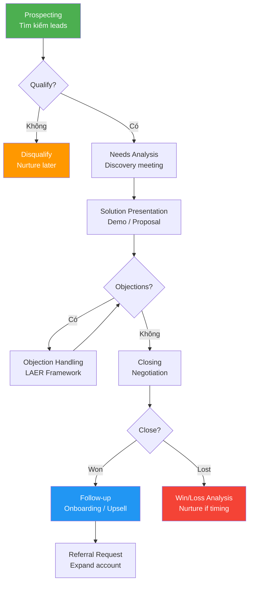
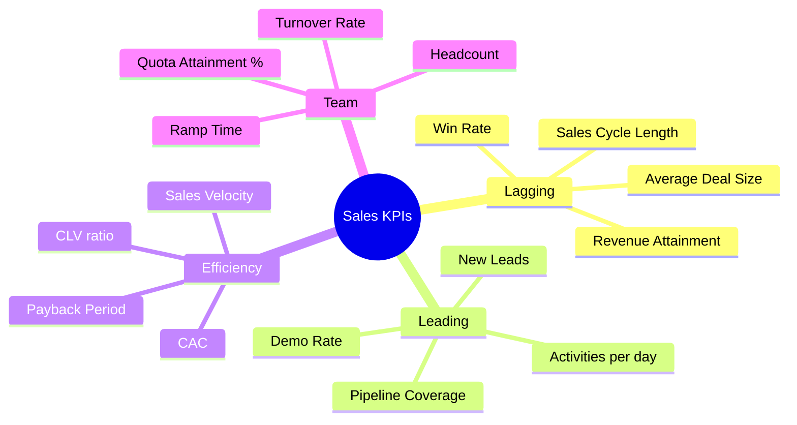

# SA01 — Sales Fundamentals

> **Định nghĩa:** Sales Fundamentals là tập hợp các nguyên tắc, quy trình, kỹ năng và tư duy nền tảng mà mọi người làm kinh doanh cần nắm vững — từ cách tìm kiếm khách hàng tiềm năng, hiểu nhu cầu, trình bày giải pháp, xử lý từ chối cho đến chốt đơn và duy trì mối quan hệ dài hạn.

---

## 1. Định nghĩa & Tầm quan trọng

Sales (bán hàng) là quá trình chuyển đổi một người hoặc tổ chức từ trạng thái "chưa biết/chưa cần" thành "đã mua/đã cam kết" — thông qua việc tạo ra, truyền đạt và nắm bắt giá trị.

**Tại sao Sales Fundamentals quan trọng:**
- Doanh thu là huyết mạch của doanh nghiệp: không có sales = không có tiền = không có gì cả
- 80% thất bại startup là do không bán được hàng, không phải do sản phẩm tệ
- Sales discipline giúp team dự báo doanh thu, quản lý pipeline, ra quyết định thuê thêm người
- Nền tảng vững chắc giúp scale: từ 1 sales rep lên 100 người mà không mất chất lượng

**Phân biệt Sales vs Marketing:**
| Tiêu chí | Sales | Marketing |
|---|---|---|
| Mục tiêu | Đóng deal cụ thể | Tạo nhận thức & demand |
| Thời gian | Ngắn hạn (deal-by-deal) | Dài hạn (brand building) |
| Tương tác | 1-1 với khách hàng | 1-nhiều qua kênh |
| Đo lường | Revenue, win rate, quota | Leads, traffic, brand |
| Chịu trách nhiệm | Commit doanh số | Commit leads/MQL |

**Thị trường VN — bối cảnh:**
- ~900,000 doanh nghiệp đang hoạt động (2024), 97% là SME
- Lực lượng sales VN: ước tính 3-5 triệu người (bao gồm cả bán lẻ, bảo hiểm, bất động sản)
- Tỷ lệ turnover sales rep tại VN: 30-50%/năm (cao hơn mức quốc tế 20-25%)
- Thách thức: thiếu quy trình chuẩn, quá phụ thuộc vào "ngôi sao cá nhân", ít đầu tư training

---

## 2. Lịch sử & Nguồn gốc

**Timeline phát triển tư duy Sales:**

```
1850s  → Door-to-door selling (Fuller Brush, Encyclopedia Britannica)
1920s  → Structured selling (AIDA model — Elias St. Elmo Lewis, 1898 nhưng phổ biến thập 20s)
1960s  → Transactional selling — focus on product features
1970s  → Consultative Selling (Mack Hanan, 1970) — hiểu nhu cầu trước khi bán
1988   → SPIN Selling (Neil Rackham) — nghiên cứu 35,000 sales calls
1994   → The Challenger Sale concept (Matthew Dixon & Brent Adamson, 2011)
2000s  → CRM era — Salesforce (1999), pipeline management trở nên hệ thống
2010s  → Inbound Sales (HubSpot), Social Selling (LinkedIn Sales Navigator)
2020s  → AI-assisted selling, video selling, remote sales
```

**Tại Việt Nam:**
- 1975-1986: Bao cấp — không có khái niệm "bán hàng" theo nghĩa thị trường
- 1986 Đổi Mới: mở cửa thị trường, sales bắt đầu hình thành
- 1990s-2000s: FDI vào VN mang theo phương pháp sales hiện đại (P&G, Unilever, Nestlé)
- 2005: Luật Thương Mại 2005 ra đời — khung pháp lý cho hoạt động thương mại
- 2010s: E-commerce bùng nổ, Lazada/Shopee vào VN thay đổi cách mua bán
- 2020s: Pandemic → digital sales, TikTok Shop live commerce

---

## 3. Các khái niệm cốt lõi

### Sales Funnel vs Sales Pipeline

**Sales Funnel** — góc nhìn của NGƯỜI MUA, tỷ lệ thu hẹp dần:
```
Awareness (biết đến)
    ↓ [lọc]
Interest (quan tâm)
    ↓ [lọc]
Consideration (cân nhắc)
    ↓ [lọc]
Intent (có ý định mua)
    ↓ [lọc]
Purchase (mua)
    ↓
Loyalty (trung thành)
```

**Sales Pipeline** — góc nhìn của NGƯỜI BÁN, trạng thái deal:
```
Prospecting → Qualified → Proposal → Negotiation → Closed Won/Lost
```

**Sự khác biệt quan trọng:**
- Funnel = Marketing metric (bao nhiêu người ở mỗi giai đoạn)
- Pipeline = Sales metric (bao nhiêu tiền ở mỗi stage, ETA close)

### Lead Types
- **MQL (Marketing Qualified Lead):** Lead đã tương tác đủ với marketing content, ready for sales contact
- **SQL (Sales Qualified Lead):** Sales đã confirm đủ tiêu chí — có ngân sách, có authority, có nhu cầu, có timeline
- **PQL (Product Qualified Lead):** Đã dùng thử sản phẩm (thường trong SaaS/PLG)

### Quota & Territory
- **Quota:** Mục tiêu doanh số được giao cho sales rep/team trong kỳ (tháng/quý/năm)
- **Territory:** Phạm vi được giao (địa lý, ngành, tập khách hàng, account size)
- **Ramp period:** Thời gian cho sales rep mới đạt full productivity (thường 3-6 tháng)

---

## 4. Mô hình & Framework chính

### 4.1 AIDA Model (Elias St. Elmo Lewis, 1898)

```
A — Attention   : Thu hút sự chú ý ("Công ty bạn đang mất X triệu/năm vì...")
I — Interest    : Tạo sự quan tâm (chia sẻ thông tin có giá trị)
D — Desire      : Kích thích mong muốn (show demo, testimonial, ROI)
A — Action      : Kêu gọi hành động ("Hãy thử miễn phí 30 ngày")
```

### 4.2 SPIN Selling (Neil Rackham, 1988)

Nghiên cứu 35,000 sales calls tại 23 quốc gia. Hiệu quả nhất với complex/high-value sales.

| Loại câu hỏi | Mục đích | Ví dụ |
|---|---|---|
| **S**ituation | Hiểu bối cảnh hiện tại | "Team sales của anh hiện có bao nhiêu người?" |
| **P**roblem | Khám phá vấn đề | "Anh có thấy khó quản lý khi team lớn hơn không?" |
| **I**mplication | Phóng đại hậu quả | "Nếu win rate thấp, mỗi quý anh mất bao nhiêu doanh thu?" |
| **N**eed-Payoff | Khách tự thấy lợi ích | "Nếu tăng win rate 10%, điều đó có ý nghĩa gì với anh?" |

**Tại sao SPIN hiệu quả:** Khách hàng tự thuyết phục bản thân — "người bán hàng tốt nhất là khách hàng của chính họ."

### 4.3 Consultative Selling vs Transactional Selling

| Tiêu chí | Transactional | Consultative |
|---|---|---|
| Focus | Sản phẩm/giá | Vấn đề/giải pháp |
| Mối quan hệ | Ngắn hạn, one-off | Dài hạn, trusted advisor |
| Câu hỏi | Ít, đóng | Nhiều, mở |
| Giá trị | Thấp-trung | Trung-cao |
| Ví dụ | Bán sim điện thoại | Bán hệ thống ERP |
| Chu kỳ | Ngày-tuần | Tuần-tháng-năm |

### 4.4 The Challenger Sale Model (2011)

Nghiên cứu 6,000 sales rep → 5 profiles:
1. **Relationship Builder** (27%) — Tập trung build quan hệ
2. **Hard Worker** (17%) — Làm nhiều nhất, không bỏ cuộc
3. **Lone Wolf** (18%) — Làm theo cách riêng
4. **Reactive Problem Solver** (12%) — Giải quyết vấn đề phản ứng
5. **Challenger** (27%) — **Hiệu quả nhất trong complex sales**

**Challenger approach:**
- **Teach:** Dạy khách hàng điều họ chưa biết về business của họ
- **Tailor:** Điều chỉnh message cho từng stakeholder
- **Take control:** Chủ động dẫn dắt cuộc đối thoại, không sợ tension

---

## 5. Quy trình thực hiện — 7 bước Sales Process

### Bước 1: Prospecting (Tìm kiếm khách hàng tiềm năng)

**Mục tiêu:** Xây dựng danh sách qualified leads liên tục

**Phương pháp:**
- **Outbound:** Cold calling, cold email, LinkedIn outreach, door-to-door
- **Inbound:** Website form, content marketing, SEO, ads → sales follow up
- **Referral:** Khách hàng hiện tại giới thiệu (tỷ lệ close cao nhất: 60-70%)
- **Networking:** Sự kiện ngành, hội thảo, chamber of commerce
- **Social selling:** LinkedIn, Zalo OA, Facebook groups

**Ideal Customer Profile (ICP):** Trước khi prospect, phải xác định:
```
ICP Framework:
- Ngành: ví dụ Manufacturing, F&B, Retail
- Quy mô: 50-500 nhân viên
- Doanh thu: 50-500 tỷ VND
- Vấn đề chính: quản lý kho, tồn kho, logistics
- Decision maker: Giám đốc, CFO, COO
- Địa lý: HCM, Hà Nội, Đà Nẵng
```

### Bước 2: Qualification (Đánh giá tiềm năng)

**BANT Framework (IBM, 1950s):**
- **B**udget: Có ngân sách không? Bao nhiêu?
- **A**uthority: Người nói chuyện có quyền quyết định không?
- **N**eed: Có nhu cầu thực sự không?
- **T**imeline: Khi nào cần?

**MEDDIC** (phức tạp hơn, dành cho enterprise — xem chi tiết ở SA02)

**Qualification questions thực tế:**
- "Anh đang dùng giải pháp nào để xử lý vấn đề này?"
- "Budget năm nay cho dự án này là bao nhiêu?"
- "Ngoài anh ra, ai còn tham gia vào quyết định này?"
- "Khi nào anh muốn triển khai?"

### Bước 3: Needs Analysis (Phân tích nhu cầu)

**Discovery Meeting agenda (60 phút):**
```
0-5 min   : Rapport building, agenda setting
5-20 min  : Current state (SPIN — Situation questions)
20-35 min : Pain points (SPIN — Problem & Implication)
35-50 min : Future state & desired outcome (Need-Payoff)
50-60 min : Next steps, send summary email
```

**5 layers of needs:**
1. **Stated need:** Điều họ nói họ cần ("cần phần mềm quản lý kho")
2. **Real need:** Vấn đề thực sự ("giảm sai sót, tăng tốc xuất hàng")
3. **Unstated need:** Kỳ vọng ngầm ("easy to use, không cần training nhiều")
4. **Delight need:** Vượt kỳ vọng ("tích hợp với Lazada/Shopee tự động")
5. **Secret need:** Động cơ cá nhân ("muốn được sếp đánh giá cao vì dự án này")

### Bước 4: Presentation/Solution (Trình bày giải pháp)

**Cấu trúc presentation hiệu quả:**
```
1. Recap vấn đề của khách (để họ thấy bạn hiểu họ)
2. Giải pháp đề xuất (what & how)
3. Lợi ích cụ thể cho CÔNG TY HỌ (không phải tính năng chung)
4. Bằng chứng (case study, testimonial, số liệu ROI)
5. Investment (giá) — sau khi đã build value
6. Next steps rõ ràng
```

**Nguyên tắc WIIFM (What's In It For Me):**
Mọi slide, mọi câu nói phải trả lời câu hỏi: "Điều này có ý nghĩa gì với TÔI?"

### Bước 5: Objection Handling (Xử lý từ chối)

**4 loại objection phổ biến:**

| Objection | Ý nghĩa thực | Cách xử lý |
|---|---|---|
| "Giá cao quá" | Chưa thấy giá trị đủ | Requantify ROI, tách nhỏ chi phí |
| "Để tôi suy nghĩ thêm" | Chưa đủ tự tin, thiếu info | Hỏi: "Điều gì cần rõ hơn?" |
| "Chúng tôi đang dùng X" | Sợ thay đổi, switching cost | Đặt câu hỏi về pain với X |
| "Không có ngân sách" | Priority chưa đủ cao | Link với pain to business outcome |

**LAER Framework (xử lý objection):**
- **L**isten: Nghe hết, không ngắt
- **A**cknowledge: Xác nhận cảm xúc ("Tôi hiểu tại sao anh lo điều này")
- **E**xplore: Đặt câu hỏi để hiểu sâu hơn
- **R**espond: Trả lời dựa trên thông tin đã khai thác

### Bước 6: Closing (Chốt đơn)

**Dấu hiệu khách hàng sẵn sàng mua (buying signals):**
- Hỏi về giá, điều khoản thanh toán
- Hỏi về timeline triển khai
- Hỏi về support/training sau bán
- Body language: gật đầu, lean forward, note chép tay

**Closing techniques:**

| Technique | Mô tả | Ví dụ |
|---|---|---|
| **Assumptive Close** | Giả định họ đã đồng ý | "Anh muốn bắt đầu triển khai tuần nào?" |
| **Summary Close** | Tóm tắt giá trị, hỏi mua | "Với các lợi ích X,Y,Z — anh sẵn sàng bắt đầu chưa?" |
| **Urgency Close** | Tạo deadline thực (không giả tạo) | "Giá ưu đãi hết hạn cuối tháng" |
| **Trial Close** | Test commitment | "Nếu chúng tôi giải quyết được vấn đề A, anh sẽ tiến tới chứ?" |
| **Alternative Close** | Đưa 2 lựa chọn | "Anh muốn gói Standard hay Professional?" |

**Lưu ý VN:** Tránh "hard close" — văn hóa VN coi áp lực là mất mặt. Tốt hơn là "soft assumptive" + quan hệ.

### Bước 7: Follow-up (Chăm sóc sau bán)

**Mục đích:**
- Đảm bảo khách hàng thành công với sản phẩm/dịch vụ
- Tạo upsell/cross-sell opportunity
- Generate referral
- Ngăn churn

**Follow-up cadence sau close:**
```
T+1 ngày  : Cảm ơn email, confirm next steps
T+7 ngày  : Check-in sau khi họ bắt đầu dùng
T+30 ngày : Business review nhỏ — đang đáp ứng kỳ vọng chưa?
T+90 ngày : QBR (Quarterly Business Review) nếu enterprise
```

---

## 6. Công cụ & Phương pháp

### Công cụ cần thiết cho Sales Rep:
| Nhóm công cụ | Ví dụ | Mục đích |
|---|---|---|
| CRM | Salesforce, HubSpot, Zoho, GetFly | Quản lý pipeline, deal, contact |
| Email outreach | Mailchimp, Lemlist, Woodpecker | Sequence email tự động |
| Video selling | Loom, Vidyard | Record demo, personalized video |
| E-signature | DocuSign, PandaDoc | Ký hợp đồng online |
| Prospecting | LinkedIn Sales Navigator, Apollo.io | Tìm lead |
| Scheduling | Calendly | Book meeting không cần email qua lại |
| Communication | Zalo, Zoom, Google Meet | Meeting với khách |

**VN đặc thù:** Zalo là kênh số 1 cho cả B2B và B2C sales tại VN — nhiều deal được close qua Zalo tin nhắn, không phải email.

### Cold Email template hiệu quả (B2B VN):
```
Subject: [Tên công ty] — Giải pháp cho vấn đề [Pain point cụ thể]

Kính gửi anh/chị [Tên],

Tôi thấy [Tên công ty] đang mở rộng sang [thị trường/sản phẩm mới].
Các công ty trong ngành [ngành] thường gặp [vấn đề cụ thể] khi scale.

[Tên công ty tôi] đã giúp [công ty tương tự] giải quyết điều này,
dẫn đến [kết quả cụ thể: 30% giảm chi phí, 2x tốc độ xử lý].

Anh/chị có 15 phút tuần này để tôi chia sẻ cách chúng tôi làm được không?

Trân trọng,
[Tên] | [Chức vụ] | [SĐT Zalo]
```

---

## 7. KPI & Đo lường

### Lagging Indicators (kết quả):
| KPI | Mô tả | Benchmark tốt |
|---|---|---|
| **Revenue Attainment** | % đạt quota | >100% |
| **Win Rate** | # deals won / # deals entered | B2B: 20-30%, B2C: cao hơn |
| **Average Deal Size (ADS)** | Tổng revenue / # deals | Tùy segment |
| **Sales Cycle Length** | Thời gian từ qualified đến close | SMB: 2-4 tuần, Enterprise: 3-9 tháng |

### Leading Indicators (hoạt động):
| KPI | Mô tả | Mục tiêu ví dụ |
|---|---|---|
| **# Activities/day** | Calls + emails + meetings | 50+ touches/ngày |
| **# New Qualified Leads** | SQLs mới trong kỳ | 10-20/tuần |
| **Pipeline Coverage** | Pipeline value / Quota | 3-4x quota |
| **Conversion Rate** | Tỷ lệ chuyển đổi mỗi stage | Theo stage |
| **Demo-to-Proposal Rate** | % demo → gửi proposal | >60% |
| **Proposal-to-Close Rate** | % proposal → close | >30% |

### Sales Velocity Formula:
```
Sales Velocity = (# Opportunities × Win Rate × Average Deal Size) / Sales Cycle Length

Ví dụ:
= (50 deals × 25% × 100,000,000 VND) / 60 ngày
= 1,250,000,000 / 60
= 20,833,333 VND/ngày

→ Muốn tăng velocity: tăng # opps, tăng win rate, tăng ADS, hoặc rút ngắn cycle
```

### Funnel Conversion Rates (benchmark B2B VN):
```
Prospects         → MQL          : 10-20%
MQL               → SQL          : 20-40%
SQL               → Opportunity  : 50-70%
Opportunity       → Proposal     : 60-80%
Proposal          → Close Won    : 20-40%

Overall: 100 prospects → 1-5 customers (1-5%)
```

---

## 8. Rủi ro & Thách thức

### 8.1 Thách thức với Sales Rep
- **Over-reliance on top performers:** 20% rep làm 80% revenue — rất rủi ro khi họ nghỉ
- **Sandbagging:** Sales giấu forecast để dễ overperform, thiếu visibility cho management
- **Discounting addiction:** Thói quen giảm giá ngay khi khách chưa thực sự từ chối
- **Activity vs Results:** Focus vào số cuộc gọi nhưng không focus vào chất lượng

### 8.2 Thách thức với Sales Manager
- **Heroic sales culture:** Manager tự đi close deal thay vì coaching team
- **Lack of pipeline visibility:** Không có CRM → không biết deal nào sắp close
- **Hiring wrong profiles:** Thuê người nói chuyện tốt nhưng không discipline

### 8.3 Rủi ro pháp lý (VN)
- **Luật Thương Mại 2005, Điều 45:** Hợp đồng mua bán phải rõ ràng về hàng hóa, giá, thời hạn
- **Bán hàng đa cấp:** Chịu quản lý nghiêm của Nghị định 40/2018/NĐ-CP
- **Quảng cáo gian lận:** Nghị định 38/2021/NĐ-CP — phạt nặng nếu cam kết sai trong sales

---

## 9. Best Practices

1. **Listen more than you talk:** Quy tắc 70/30 — khách nói 70%, bạn nói 30%
2. **Always recap in writing:** Sau mỗi meeting, gửi email tóm tắt + next steps
3. **Qualify early, qualify hard:** Đừng waste time với leads không phù hợp
4. **Know your numbers:** Mọi sales rep phải biết conversion rate của mình từng stage
5. **Follow up persistently (not annoyingly):** Nghiên cứu cho thấy cần 8-12 touchpoints để close B2B
6. **Build multiple relationships:** Không phụ thuộc vào 1 contact trong khách hàng
7. **Competitor intelligence:** Biết điểm mạnh/yếu của đối thủ để định vị đúng
8. **Personal brand on LinkedIn:** Buyers check LinkedIn trước khi nhận meeting
9. **Referral program:** Xây dựng hệ thống referral từ khách hàng hài lòng
10. **Continuous learning:** Ngành sales thay đổi nhanh — luôn update kỹ năng mới

---

## 10. Sai lầm phổ biến

| Sai lầm | Biểu hiện | Hậu quả | Giải pháp |
|---|---|---|---|
| Pitching quá sớm | Chưa hỏi đã giới thiệu sản phẩm | Khách cảm thấy bị bán | Discovery trước, pitch sau |
| Nói thay vì hỏi | Monologue về sản phẩm | Bỏ lỡ insight | Chuẩn bị question list |
| Bỏ qua influencer | Chỉ nói với 1 người | Deal chết vì người khác veto | Map stakeholders đầy đủ |
| Không có urgency | Deal kéo dài vô hạn | Pipeline đầy ảo | Tạo mutually agreed close plan |
| Giảm giá vội vã | Khách chưa kịp từ chối đã offer discount | Margin xói mòn | Requantify value trước |
| Không follow up | Nghĩ "hỏi thêm là làm phiền" | Deal nguội lạnh | Cadence cố định, có lý do mỗi lần |
| Over-promise | Cam kết tính năng chưa có | Churn, mất trust | Underpromise, overdeliver |

---

## 11. Case Study VN — FPT Retail (thực tế điển hình SME→ Scale-up)

**Bối cảnh:** FPT Retail (FRT) bán điện thoại/laptop — từ 2012 đến 2023 scale từ ~50 cửa hàng lên 700+ cửa hàng.

**Thách thức sales:**
- Sản phẩm đồng nhất (iPhone, Samsung) → cạnh tranh thuần giá
- Nhân viên sales turnover cao (30-40%/năm)
- Chuyển từ Transactional sang Consultative khó

**Giải pháp đã áp dụng:**
- **Standardized sales script:** Training 2,000+ nhân viên theo quy trình 7 bước
- **Upsell program:** Từ "bán điện thoại" → "bán điện thoại + phụ kiện + bảo hiểm + gói data" → tăng ADS từ ~8 triệu lên ~11 triệu/đơn
- **NPS measurement:** Track satisfaction sau mỗi giao dịch, alert khi NPS thấp để recovery
- **Digital CRM:** App nội bộ để quản lý khách hàng cũ, gửi promotion đúng lúc

**Kết quả:**
- Doanh thu FY2022: ~28,000 tỷ VND (từ ~7,000 tỷ năm 2017)
- Upsell attach rate: từ 15% lên 35%
- NPS trung bình: 65+ (top ngành retail electronics VN)

**Bài học:** Chuẩn hóa process + đo lường nghiêm túc = scale được mà không mất chất lượng.

---

## 12. Case Study quốc tế — Salesforce (B2B SaaS)

**Vấn đề (1999):** CRM thị trường bị Siebel Systems (on-premise) thống trị. Salesforce muốn vào nhưng không ai tin cloud.

**Giải pháp sales:**
- **"No Software" campaign:** Định vị rõ ràng, tạo category mới
- **Land-and-Expand model:** Bán package nhỏ (5 users), sau đó expand
- **Success-based selling:** Giao CSM (Customer Success Manager) ngay khi close
- **Trailhead:** Giáo dục khách hàng miễn phí → tạo champions nội bộ

**Kết quả:**
- 1999: $0 → 2023: $31.4 tỷ ARR
- Win rate vs Siebel tăng từ 20% lên 80% trong 5 năm đầu
- Net Revenue Retention: >120% (khách hàng mua thêm nhiều hơn mỗi năm)

---

## 13. So sánh với phương pháp khác

| Phương pháp | Điểm mạnh | Điểm yếu | Phù hợp cho |
|---|---|---|---|
| **SPIN Selling** | Deep discovery, khách tự thuyết phục | Mất thời gian, cần kỹ năng cao | Complex B2B, high-value |
| **Challenger Sale** | Tạo insight, differentiate | Khó training, cần credibility cao | Enterprise B2B |
| **SNAP Selling** | Phù hợp với busy buyers | Ít depth | SMB, transactional |
| **Solution Selling** | Focus vào giải pháp toàn diện | Có thể over-engineer | Mid-market B2B |
| **Inbound Sales** | Buyer-centric, lower friction | Phụ thuộc vào Marketing | SaaS, B2C |
| **Social Selling** | Build trust at scale | Chậm, không phù hợp urgency | Long sales cycle |

---

## 14. Ứng dụng theo ngành

| Ngành | Đặc thù sales | KPI quan trọng | Kênh chính |
|---|---|---|---|
| **Bất động sản** | Giá trị cao, quyết định cảm xúc | # khách xem nhà, conversion | Events, referral, digital |
| **Bảo hiểm** | Trust quan trọng, long-term | Persistency rate, premium | Agent network, bancassurance |
| **SaaS/Tech** | Demo-driven, free trial | MRR, churn rate, expansion | Inbound, outbound email |
| **F&B/FMCG** | Volume, coverage | SKU/store, numeric distribution | GT+MT channel |
| **Dược phẩm** | Compliance nghiêm, MR-driven | Prescription rate, hospital listing | Medical rep |
| **Tài chính** | Regulated, needs-based selling | Assets under mgmt, cross-sell | Branch, digital, RM |

---

## 15. Ứng dụng theo quy mô doanh nghiệp

### Startup (< 20 người)
- Founder-led sales: CEO/CPO trực tiếp bán hàng
- Không cần CRM phức tạp — Notion + Google Sheets đủ
- Focus vào 10-20 logo đầu tiên, không scale vội
- Mọi deal đều là learning

### SME (20-300 người)
- Sales team 3-10 người, cần Sales Manager
- Bắt đầu implement CRM (HubSpot miễn phí hoặc GetFly ~3-5M VND/tháng)
- Xây dựng Playbook: script, email template, objection handling guide
- KPI tracking weekly

### Doanh nghiệp lớn (300+ người)
- Sales Operations team riêng
- Phân chia rõ: SDR (prospecting) → AE (closing) → CSM (retention)
- Full CRM + Sales Intelligence + Revenue Intelligence
- SKO (Sales Kickoff) hàng năm, quota planning Q4

---

## 16. Công nghệ & Digital Tools

### Sales Tech Stack 2024:
```
Tier 1 — Core (bắt buộc):
  CRM: Salesforce / HubSpot / Zoho / GetFly (VN)
  Communication: Zalo Business / Gmail / Zoom
  
Tier 2 — Productivity:
  Prospecting: LinkedIn Sales Navigator / Apollo.io
  Email: Lemlist / Mailchimp
  Scheduling: Calendly
  Video: Loom
  
Tier 3 — Intelligence:
  Sales Intelligence: Gong.io / Chorus (call recording + AI insights)
  Revenue Intelligence: Clari / Boostup (forecasting)
  CPQ: Salesforce CPQ / DealHub (Configure Price Quote)
```

### AI trong Sales (2024-2025):
- **AI email writing:** Generative AI draft outreach emails
- **Call analysis:** AI transcribe + analyze sales calls → coaching insights
- **Lead scoring:** ML dự đoán lead nào likely to convert
- **Next best action:** AI gợi ý bước tiếp theo cho từng deal
- **Forecasting:** AI-powered pipeline prediction

**VN thực tế:** 70% sales team VN vẫn dùng Excel/Google Sheets + Zalo. CRM adoption thấp do: phức tạp, nhân viên kháng cự, không thấy giá trị ngay.

---

## 17. Tích hợp với các domain khác

```
Sales ←→ Marketing:
  - Marketing tạo leads (MQL) → Sales convert (SQL → Customer)
  - Sales insight về objections → Marketing điều chỉnh messaging
  - SLA: Marketing deliver X MQL/tháng, Sales follow up trong 24h

Sales ←→ Product:
  - Sales feedback về feature requests từ khách
  - Product roadmap ảnh hưởng đến sales pitch
  - Competitive intel từ sales vào product strategy

Sales ←→ Finance:
  - Revenue forecast từ pipeline
  - Deal approval cho discount lớn
  - Commission calculation & payment

Sales ←→ Operations:
  - Delivery capacity ảnh hưởng đến commit với khách
  - Onboarding process sau close
  - SLA tracking post-sale

Sales ←→ HR:
  - Comp plan design (OTE, commission structure)
  - Hiring profile cho sales roles
  - Training & development programs
```

---

## 18. Xu hướng & Tương lai

### 2024-2027 Key Trends:

1. **AI-augmented selling:** Không phải AI thay sales, mà AI giúp sales làm tốt hơn
   - Gong Engage: AI suggest next best action
   - Salesforce Einstein: AI forecast, lead scoring

2. **Video-first outreach:** Video email thay text-only cold email
   - Open rate cao hơn 3-5x
   - Loom, Vidyard phổ biến

3. **Buying group selling:** Trung bình B2B có 6-10 người trong buying committee → sales cần multi-thread

4. **Digital-first buyers:** 80% B2B buyer process xảy ra trước khi gặp sales rep (Gartner 2023)

5. **Self-serve + sales-assist hybrid:** Đặc biệt trong SaaS — product-led growth + sales

6. **Social proof at scale:** Review sites (G2, Capterra, Google Reviews) quan trọng như testimonial

7. **Live commerce (VN):** TikTok Shop live selling tăng trưởng 200-300%/năm tại VN

---

## 19. Bối cảnh Việt Nam đặc thù

### VN Sales Culture — những điểm khác biệt:

**1. Quan hệ (Relationship) trước hợp đồng:**
- Khách hàng VN thường cần gặp mặt trực tiếp ít nhất 2-3 lần trước khi ký
- Nhậu/cà phê/ăn tối = phần quan trọng của sales process (đặc biệt B2B, công ty nhà nước)
- "Anh ấy là người của tôi" — personal connection quan trọng hơn company brand

**2. Giá & Mặc cả:**
- Kỳ vọng được mặc cả (đặc biệt SME, chợ truyền thống)
- "List price" thường cao hơn 10-30% để có room discount
- Thanh toán COD (Cash on Delivery) vẫn phổ biến trong B2C

**3. Quyết định tập thể:**
- Doanh nghiệp gia đình: chủ doanh nghiệp quyết định mọi thứ
- Công ty nhà nước: quy trình phê duyệt nhiều cấp, chậm
- FDI: process rõ ràng hơn, decision by committee

**4. Trust-building signals:**
- Văn phòng đẹp/sang = credibility cao hơn
- Chứng chỉ, giải thưởng ngành quan trọng
- Khách hàng reference (ai giới thiệu?) rất quan trọng

**5. Communication channels:**
- Zalo > Email cho most B2B (response rate cao hơn nhiều)
- Facebook Messenger quan trọng cho B2C
- LinkedIn đang tăng nhưng chưa mainstream như US/SG

**6. Luật Thương Mại 2005:**
- Điều 45: Hợp đồng mua bán phải có: đối tượng hợp đồng, số lượng, giá, thể thức thanh toán
- Điều 74-76: Quy định bảo đảm chất lượng hàng hóa
- Sales rep cần biết để tư vấn đúng và bảo vệ công ty

**7. Thị trường đặc thù:**
- SME (chiếm 97% doanh nghiệp): Quyết định nhanh nhưng ngân sách hạn chế
- Tập đoàn tư nhân lớn (Vingroup, Masan, Thaco): Process chuyên nghiệp, quy mô deal lớn
- FDI: Standards cao, cần tiếng Anh, process nghiêm túc
- Doanh nghiệp nhà nước: Đấu thầu, compliance, chậm nhưng deal lớn

---

## 20. Checklist thực hành

### Checklist cho Sales Rep mới:
- [ ] Hiểu rõ ICP (Ideal Customer Profile) của công ty
- [ ] Học thuộc value proposition trong 30 giây
- [ ] Có danh sách 50 prospects tuần đầu
- [ ] Biết quy trình 7 bước sales process của công ty
- [ ] Nắm vững top 5 objections và cách xử lý
- [ ] Setup CRM account, hiểu cách log activity
- [ ] Shadow 5 cuộc gọi/meeting với senior rep
- [ ] Biết cách viết recap email sau meeting
- [ ] Hiểu commission structure của mình
- [ ] Biết khi nào escalate cho manager

### Checklist cho Sales Manager:
- [ ] Pipeline review weekly với từng rep (deal-by-deal)
- [ ] Forecast tổng hợp mỗi tuần gửi leadership
- [ ] 1:1 với mỗi rep ít nhất 30 phút/tuần
- [ ] Call recording review 2-3 calls/rep/tuần
- [ ] Hiring pipeline luôn có 2-3 candidate tiềm năng
- [ ] Commission payout đúng hạn, minh bạch
- [ ] SKO (Sales Kickoff) hoặc quarterly team offsite
- [ ] Competitive battlecard cập nhật mỗi quý

---

## 21. Sales Compensation Design

### Cấu trúc lương phổ biến:

**OTE (On-Target Earnings) = Base Salary + Target Variable**

| Role | Base/OTE ratio | Phổ biến tại VN |
|---|---|---|
| SDR/BDR | 70/30 | 8-15M base + 3-5M commission |
| AE (SMB) | 60/40 | 12-20M base + 8-12M commission |
| AE (Enterprise) | 50/50 | 20-35M base + 20-35M commission |
| Sales Manager | 75/25 | 25-45M base + team bonus |

**Commission triggers phổ biến:**
- Tiered commission: 100% quota → 10%, 110% quota → 12%, 120%+ → 15%
- Accelerator: Vượt quota được nhân hệ số
- Kicker: Bonus extra cho deal mới/sản phẩm mới/khu vực mới

**Nguyên tắc thiết kế comp plan:**
- Simple: Rep phải tự tính được commission của mình
- Aligned: Khuyến khích hành vi đúng với mục tiêu công ty
- Fair: Market competitive để giữ người giỏi
- Predictable: Không thay đổi giữa năm

---

## 22. Territory Management

### Cách phân territory:
1. **Geographic:** Miền Bắc/Trung/Nam, tỉnh/thành phố
2. **Industry vertical:** Rep chuyên FMCG, rep chuyên Manufacturing...
3. **Account size:** SMB vs Mid-market vs Enterprise
4. **Named accounts:** Mỗi rep có list account được giao

### Territory Design principles:
- **Equal opportunity:** Territory phải có potential tương đương để quota công bằng
- **Geographic efficiency:** Giảm thời gian di chuyển
- **Account concentration:** Tránh 1 account chiếm >30% quota của 1 rep
- **Growth potential:** Một phần territory phải là "green field" để phát triển

---

## 23. Sales Enablement

**Sales Enablement** = cung cấp cho sales team: nội dung, tools, training để bán hàng hiệu quả hơn.

### Enablement assets:
| Loại | Nội dung | Dùng khi nào |
|---|---|---|
| **Battlecard** | So sánh với competitor | Khi khách đang cân nhắc đối thủ |
| **ROI Calculator** | Tool tính ROI cho khách | Giai đoạn Proposal |
| **Case Studies** | Thành công của khách hàng tương tự | Khi cần proof |
| **Demo Script** | Hướng dẫn demo theo use case | Mọi demo |
| **Email Templates** | Mẫu email cho từng giai đoạn | Daily outreach |
| **Objection Guide** | Top 10 objections + cách xử lý | Training + real calls |

---

## 24. Forecasting & Revenue Prediction

### Forecast categories:
| Category | Ý nghĩa | Xác suất close |
|---|---|---|
| **Commit** | Sales chắc chắn close kỳ này | 85-95% |
| **Best Case** | Close được nếu mọi thứ thuận | 50-70% |
| **Pipeline** | Trong pipeline nhưng chưa chắc | 20-40% |
| **Omit** | Không count vào kỳ này | <20% |

### Forecast methodology:
1. **Rep-level:** Mỗi rep tự forecast từng deal
2. **Manager-adjusted:** Manager điều chỉnh dựa trên historical accuracy
3. **AI-assisted:** ML model predict dựa trên signals
4. **Bottom-up vs Top-down:** Bottom-up (từ deal lên) vs Top-down (từ company target xuống)

---

## 25. Objection Handling Master List (VN context)

### Top 10 objections tại VN và cách xử lý:

**1. "Giá cao quá"**
- Đừng defensive
- "Anh so sánh với giải pháp nào? Anh có thể chia sẻ không?"
- Tách nhỏ: "12 triệu/tháng = 400,000/ngày = 17,000/giờ — bằng 1 tách cà phê"
- ROI: "Nếu giải pháp này giúp tiết kiệm 2 nhân công = 20M/tháng, đầu tư 12M có hợp lý không?"

**2. "Để tôi suy nghĩ thêm"**
- "Tôi hiểu — anh cần suy nghĩ về khía cạnh nào? Ngân sách, timeline, hay tính năng?"
- Offer: "Tôi có thể gửi thêm thông tin gì giúp anh quyết định dễ hơn?"

**3. "Chúng tôi đang dùng X rồi"**
- "X là giải pháp tốt. Anh hài lòng nhất với X ở điểm nào?"
- "Nếu có thể cải thiện 1 điều ở X, anh muốn cải thiện gì?"

**4. "Không có ngân sách năm nay"**
- "Nếu có thể bắt đầu Q1 năm sau, tôi có thể giúp anh chuẩn bị business case cho ban lãnh đạo không?"

**5. "Cần hỏi sếp/board"**
- "Tôi hoàn toàn hiểu. Để tôi chuẩn bị executive summary cho anh present lên sếp — anh cần nhấn mạnh điểm gì nhất?"

---

## 26. Sales Meeting Mastery

### Chuẩn bị trước meeting (30 phút research):
```
□ Review LinkedIn của người gặp
□ Research công ty: doanh thu, tin tức gần đây, sản phẩm/dịch vụ
□ Check xem họ có dùng sản phẩm gì (tech stack research)
□ Chuẩn bị 5-7 discovery questions
□ Xác định mục tiêu của meeting (outcome mong muốn)
□ Chuẩn bị slide/demo nếu cần
```

### Trong meeting:
```
1. Xác nhận agenda đầu buổi (5 phút)
2. Rapport — 1-2 phút tự nhiên, không gượng ép
3. Discovery (SPIN questions) — 50% thời gian
4. Solution overview — 25% thời gian
5. Q&A — 15% thời gian
6. Next steps — 10% thời gian (CRITICAL — nếu không có next steps = meeting thất bại)
```

### Sau meeting (trong 24h):
```
□ Send recap email: tóm tắt những gì đã thảo luận
□ Highlight next steps với người chịu trách nhiệm và deadline
□ Attach tài liệu đã hứa
□ Log vào CRM
□ Schedule follow-up reminder
```

---

## 27. Cold Calling Framework

### Cold Call structure (5 phút):
```
0-20s : Opening — tên, công ty, lý do gọi
20-60s: Hook — liên quan đến business của họ (không pitch sản phẩm)
60-90s: Permission question — "Tôi gọi đúng lúc không?"
90-3m : 2-3 discovery questions
3-4m  : Brief value prop nếu relevant
4-5m  : Ask for meeting
```

**Script mẫu:**
```
"Anh [Tên] ơi, tôi là [Tên], từ [Công ty]. 
Tôi gọi vì tôi thấy công ty mình đang tuyển dụng nhiều vị trí sales — 
thường khi công ty scale đội sales nhanh, việc quản lý pipeline trở nên khó hơn.
Anh có đang gặp vấn đề đó không?
...
Nếu vậy, tôi muốn có 20 phút với anh để chia sẻ cách [Công ty tương tự] xử lý điều này.
Tuần này anh có khung giờ nào phù hợp không?"
```

---

## 28. Sales Metrics Dashboard

### Weekly Sales Review Dashboard:
```
┌─────────────────────────────────────────────────────┐
│  WEEKLY SALES DASHBOARD — W26/2024                  │
├──────────────┬──────────────┬──────────────┬────────┤
│  Metric      │  Target      │  Actual      │ Status │
├──────────────┼──────────────┼──────────────┼────────┤
│ New SQLs     │  20          │  18          │  🟡    │
│ Demos booked │  10          │  12          │  🟢    │
│ Proposals    │  5           │  4           │  🟡    │
│ Closed Won   │  2 / 500M    │  1 / 280M    │  🔴    │
│ Pipeline     │  2,000M      │  1,800M      │  🟡    │
│ Activities   │  200         │  185         │  🟡    │
└──────────────┴──────────────┴──────────────┴────────┘
```

---

## 29. Onboarding Sales Rep mới — 90 ngày

### 30-60-90 Day Plan:

**Ngày 1-30: Learn**
- Tuần 1: Onboarding company, product training, tools setup
- Tuần 2-3: Shadow 10+ calls/meetings với senior rep
- Tuần 4: Bắt đầu tự contact leads (với support)
- Mục tiêu: Understand product, value prop, ICP

**Ngày 31-60: Apply**
- Tự conduct discovery meetings (được review)
- Bắt đầu build pipeline của riêng mình
- Target: 50% ramp quota
- Coaching: Manager review 3 calls/tuần

**Ngày 61-90: Perform**
- Full pipeline ownership
- Target: 75-100% ramp quota
- Tự handle full sales cycle với light support
- Begin specialization theo strength

---

## 30. Sales Culture & Team Building

### Xây dựng culture sales tốt:
- **Transparency:** Leaderboard công khai → healthy competition
- **Recognition:** Celebrate wins công khai (không chỉ at QBR)
- **Learning:** Win/Loss review không blame, focus on learning
- **Accountability:** Commit → deliver; không có văn hóa "missing quota không sao"
- **Collaboration:** AEs giúp nhau, không cạnh tranh tiêu cực

### Team rituals:
- **Monday pipeline review:** Tổng hợp tuần mới, goals
- **Friday wins:** Chia sẻ deals đã close, lessons
- **Monthly 1:1:** Career development với manager
- **Quarterly SKO hoặc mini-offsite:** Reset, training, celebrate

---

## 31. Inbound vs Outbound Sales

| Chiều | Inbound | Outbound |
|---|---|---|
| **Lead source** | Họ tìm đến mình (website, content) | Mình tìm đến họ (cold call, email) |
| **Conversion rate** | Cao hơn (đã có intent) | Thấp hơn (cold) |
| **Cost per lead** | Thấp hơn dài hạn | Cao hơn ngắn hạn |
| **Scalability** | Phụ thuộc vào content/SEO | Có thể scale nhanh với budget |
| **Time to revenue** | Chậm hơn (build content) | Nhanh hơn |
| **Best for** | Established brand, SaaS | New market, niche targeting |

**VN context:** Hầu hết B2B VN dùng hybrid — inbound (Facebook Ads, Zalo Ads) + outbound (cold call, networking). Pure inbound còn hiếm vì content marketing culture chưa mạnh.

---

## 32. Sales Playbook — Cấu trúc

**Sales Playbook** là tài liệu hướng dẫn toàn bộ sales process, được chuẩn hóa cho cả team.

### Nội dung một Playbook hoàn chỉnh:
```
1. Company & Product Overview
   - Mission, vision, value proposition
   - Product/service catalog với pricing
   
2. ICP & Buyer Personas
   - Ideal Customer Profile (firmographic)
   - Buyer personas (demographics, pain, goals)
   
3. Sales Process
   - Stage-by-stage với exit criteria
   - Required activities tại mỗi stage
   
4. Messaging & Positioning
   - Elevator pitch (30s, 2 phút, 5 phút)
   - Email templates theo stage
   - Call scripts
   
5. Objection Handling Guide
   - Top 15 objections + responses
   
6. Demo Guide
   - Discovery questions
   - Demo flow theo use case
   
7. Competitive Intelligence
   - Battlecards: chúng ta vs từng đối thủ
   
8. Pricing & Commercial Terms
   - List price
   - Discount authorization matrix
   
9. Tools & Process
   - CRM workflow
   - Required fields, stage gates
   
10. Metrics & Quotas
    - Team KPIs
    - Individual rep targets
```

---

## 33. Negotiation trong Sales

### BATNA (Best Alternative To a Negotiated Agreement):
- Trước mọi negotiation, biết rõ BATNA của mình và dự đoán BATNA của khách
- Nếu BATNA của khách mạnh (có alternatives tốt) → ít leverage
- Nếu BATNA của mình mạnh → có thể walk away

### Negotiation tactics thường gặp từ buyer VN:
1. **Squeeze:** "Giảm thêm 20% không anh?"
2. **Good cop/bad cop:** Người dễ chịu vs người khó tính
3. **Take it or leave it:** Ultimatum (thường là bluff)
4. **Nibble:** Đã gần close rồi thêm yêu cầu nhỏ ("à thêm cái này nhé")
5. **Higher authority:** "Để tôi hỏi sếp" (để có thêm negotiating room)

### Counter-tactics:
- Anchor cao từ đầu
- Trade concession for concession: "Nếu tôi giảm X, anh có thể commit tháng này không?"
- Protect margin bằng cách đưa value thay vì tiền
- Document everything: mọi thay đổi phải bằng văn bản

---

## 34. Account Planning

**Account Plan** = kế hoạch phát triển doanh thu từ 1 khách hàng cụ thể (thường enterprise/key account).

### Account Plan template:
```
1. Account Overview
   - Company profile, key contacts
   - Current revenue & products/services
   
2. Strategic Goals
   - Mục tiêu của account plan (upsell, expand, retain)
   - Revenue target cho năm
   
3. Relationship Map
   - Stakeholders, level of influence, sentiment
   - White space: ai chưa có mối quan hệ
   
4. SWOT (from account perspective)
   - Strengths: lợi thế của mình với account
   - Weaknesses: gap cần cải thiện
   - Opportunities: upsell, cross-sell
   - Threats: competitor, budget cuts
   
5. Action Plan
   - Key activities, owner, timeline
   - Quarterly milestones
```

---

## 35. Win/Loss Analysis

**Tại sao quan trọng:** Hiểu tại sao win/lose giúp improve win rate, sửa pricing, cải thiện product.

### Win/Loss Review process:
1. **Ngay sau close:** Log nguyên nhân chính (Win/Loss reason) vào CRM
2. **Định kỳ (monthly):** Aggregate data, tìm patterns
3. **Deep interview:** Gọi cho khách đã không mua để hỏi feedback (valuable nhất nhưng ít ai làm)

### Phân tích Win/Loss:
```
Win reasons (ví dụ):
- Competitive advantage: product feature (35%)
- Relationship (25%)
- Price (20%)
- Implementation timeline (10%)
- Brand/reference (10%)

Loss reasons (ví dụ):
- Price too high (40%)
- Competitor product better fit (25%)
- No budget/freeze (20%)
- No urgency (10%)
- Poor sales execution (5%)
```

---

## 36. Digital Sales & Social Selling

### LinkedIn Sales Navigator cho B2B:
- **Advanced search:** Lọc theo title, company size, industry, seniority
- **InMail:** Tiếp cận mà không cần connection (response rate 18-25% vs cold email 3-5%)
- **Lead recommendations:** AI gợi ý leads phù hợp ICP
- **Sales insights:** Alerts khi khách thay job, post content → trigger outreach

### Social Selling Index (SSI — LinkedIn):
- Professional brand (40/100)
- Find the right people (25/100)
- Engage with insights (25/100)
- Build relationships (25/100)
- SSI score >70 = strong social seller

### Content Strategy cho Sales Rep:
- Post 2-3x/tuần về insight ngành, không phải quảng cáo sản phẩm
- Comment thoughtfully vào post của prospects/clients
- Share customer success stories (với permission)
- Engage với content của target accounts

---

## 37. Customer Lifetime Value & Sales Strategy

### CLV (Customer Lifetime Value):
```
CLV = (Average Purchase Value × Purchase Frequency × Customer Lifespan) − CAC

Ví dụ (SaaS):
= (50M/năm × 1 × 5 năm) − 30M CAC
= 250M − 30M
= 220M CLV

→ Payback period = CAC/Annual Value = 30M/50M = 7.2 tháng
```

### Implications cho sales strategy:
- **High CLV segment:** Worth để đầu tư nhiều vào acquisition, assign dedicated AE
- **Low CLV segment:** Self-serve, PLG, lower-touch sales motion
- **CLV by segment giúp:** Prioritize territories, set commission rates

---

## 38. Sales Leadership & Coaching

### Great Sales Manager vs Mediocre:
| Mediocre Manager | Great Sales Manager |
|---|---|
| Đi close deal thay rep | Coach rep cách close |
| Review deal outcome | Review deal early để intervene |
| Hire fast (fill seat) | Hire slow (right fit) |
| Motivate bằng fear | Motivate bằng vision + growth |
| Manage activities | Manage outcomes |

### Coaching framework (GROW):
- **G**oal: Rep muốn cải thiện gì?
- **R**eality: Hiện tại đang ở đâu?
- **O**ptions: Có thể làm gì?
- **W**ill: Cam kết làm gì cụ thể?

---

## 39. Sales Ethics & Professionalism

### Nguyên tắc đạo đức trong bán hàng:
1. **Không over-promise:** Chỉ cam kết những gì có thể deliver
2. **Transparent pricing:** Không hidden fee
3. **Qualify before push:** Nếu giải pháp không phù hợp, nói thật
4. **Customer interest first:** Long-term relationship quan trọng hơn short-term commission
5. **Confidentiality:** Không dùng thông tin khách hàng này để negotiate với khách khác

### VN context — một số vùng xám:
- **Phong bì/hoa hồng cá nhân:** Phổ biến trong một số ngành (xây dựng, dược phẩm) nhưng rủi ro pháp lý cao. Luật Phòng chống tham nhũng 2018 siết chặt
- **Discount không minh bạch:** Bảng giá A cho sếp, thực tế ký giá B → rủi ro tranh chấp
- **Fake testimonials:** Vi phạm Luật Quảng Cáo 2012

---

## 40. Roadmap phát triển kỹ năng Sales

### Career path trong Sales:
```
SDR/BDR (0-2 năm)
  → Account Executive SMB (2-4 năm)
    → Account Executive Mid-market (4-6 năm)
      → Senior AE / Enterprise AE (6-8 năm)
        → Sales Manager (8-10 năm)
          → Sales Director / VP Sales (10+ năm)
            → CRO (Chief Revenue Officer)

Hoặc:
AE → Sales Engineer (technical track)
AE → Account Manager / CSM (retention track)
AE → Sales Operations (analytics track)
AE → Sales Enablement (training track)
```

### Kỹ năng cần phát triển theo level:
| Level | Hard Skills | Soft Skills |
|---|---|---|
| Entry | Product knowledge, CRM basics | Listening, resilience |
| Mid | SPIN/solution selling, negotiation | Storytelling, consultative mindset |
| Senior | Complex deal management, forecasting | Executive presence, strategic thinking |
| Manager | Coaching, hiring, quota planning | People development, leadership |

---

## Output Formats

### Mermaid Diagram — Sales Process Flow



### Mermaid — Sales Metrics Mindmap



---

### Flashcards

**Q1: SPIN Selling là gì và 4 loại câu hỏi?**
A: Framework của Neil Rackham (1988), dựa trên 35,000 sales calls. S=Situation (bối cảnh), P=Problem (vấn đề), I=Implication (hậu quả), N=Need-Payoff (lợi ích khi giải quyết). Mục tiêu: khách hàng tự thuyết phục mình.

**Q2: Sales Velocity được tính như thế nào?**
A: (# Opportunities × Win Rate × Average Deal Size) / Sales Cycle Length. Đây là tốc độ tạo ra doanh thu, giúp dự báo và tìm lever tăng trưởng.

**Q3: Sự khác biệt giữa Sales Funnel và Sales Pipeline?**
A: Funnel = góc nhìn người mua (awareness→purchase), Marketing metric. Pipeline = góc nhìn người bán (prospecting→closed), Sales metric với giá trị tiền tệ cụ thể.

**Q4: BANT là gì?**
A: Framework qualification của IBM: B=Budget (ngân sách), A=Authority (quyền quyết định), N=Need (nhu cầu), T=Timeline (thời hạn). Dùng để xác định lead có đáng invest thời gian không.

**Q5: Tại sao quan hệ quan trọng trong sales VN?**
A: Văn hóa tin tưởng cá nhân trước khi tin tưởng công ty. Quyết định mua thường dựa vào "anh ấy là người của tôi" — buyer trust seller trước khi trust product/brand.

**Q6: OTE là gì?**
A: On-Target Earnings = Base Salary + Target Variable (commission/bonus) khi đạt 100% quota. Ví dụ AE có OTE 30M = 18M base + 12M commission khi đạt quota.

**Q7: Commit vs Best Case trong Forecast?**
A: Commit = sales chắc chắn close kỳ này (85-95%). Best Case = close được nếu thuận lợi (50-70%). Cần phân biệt rõ để CFO/CEO có forecast chính xác.

**Q8: Sales Playbook là gì và tại sao cần?**
A: Tài liệu chuẩn hóa toàn bộ sales process — ICP, messaging, scripts, objection handling, competitive intel. Giúp onboard rep mới nhanh hơn, scale team mà không mất chất lượng.

**Q9: Challenger Sale — 3 thành phần chính?**
A: Teach (dạy khách điều họ chưa biết), Tailor (điều chỉnh message theo stakeholder), Take Control (chủ động dẫn dắt conversation, không sợ tension).

**Q10: Win/Loss Analysis quan trọng thế nào?**
A: Giúp hiểu tại sao win/lose → cải thiện win rate, sửa pricing, update competitive positioning. Deep interview với khách không mua là nguồn insight giá trị nhất nhưng ít ai làm.

---

### JSON Metadata

```json
{
  "module": {
    "code": "SA01",
    "name": "Sales Fundamentals",
    "domain": "Sales",
    "status": "complete",
    "version": "1.0",
    "last_updated": "2026-06-30"
  },
  "topics": [
    "7-step sales process",
    "SPIN Selling",
    "AIDA Model",
    "Consultative vs Transactional Selling",
    "Sales Funnel vs Pipeline",
    "Quota Management",
    "Sales Compensation",
    "Territory Management",
    "VN Sales Culture",
    "Sales KPIs"
  ],
  "key_frameworks": ["SPIN", "AIDA", "BANT", "LAER", "Challenger Sale", "GROW Coaching"],
  "kpis": ["Win Rate", "Conversion Rate", "Average Deal Size", "Sales Cycle Length", "Sales Velocity", "Pipeline Coverage"],
  "vn_context": ["Luật Thương Mại 2005", "Quan hệ-based selling", "Zalo as primary channel", "SME 97% market"],
  "related_modules": ["SA02", "SA03", "SA06", "MK01", "FI01"],
  "difficulty": "Beginner to Intermediate",
  "estimated_read_time_minutes": 90
}
```

---

### Cheat Sheet / Quick Reference

```
╔══════════════════════════════════════════════════════════════╗
║              SA01 — SALES FUNDAMENTALS CHEAT SHEET          ║
╠══════════════════════════════════════════════════════════════╣
║ 7-STEP PROCESS: Prospect→Qualify→Discover→Present→          ║
║                 Handle Objection→Close→Follow-up            ║
╠══════════════════════════════════════════════════════════════╣
║ SPIN:  S=Situation  P=Problem  I=Implication  N=Need-Payoff ║
║ BANT:  B=Budget  A=Authority  N=Need  T=Timeline            ║
║ LAER:  L=Listen  A=Acknowledge  E=Explore  R=Respond        ║
╠══════════════════════════════════════════════════════════════╣
║ SALES VELOCITY = (#Opps × Win Rate × ADS) / Cycle Length   ║
╠══════════════════════════════════════════════════════════════╣
║ RATIOS:                                                      ║
║  Pipeline Coverage: 3-4x quota                              ║
║  MQL→SQL: 20-40%  SQL→Opp: 50-70%  Opp→Close: 20-40%      ║
╠══════════════════════════════════════════════════════════════╣
║ VN TIPS:                                                     ║
║  • Zalo > Email cho B2B outreach                            ║
║  • Quan hệ trước hợp đồng                                   ║
║  • List price cao 10-30% để có room discount                ║
║  • Gặp mặt 2-3 lần trước khi khách ký                      ║
╠══════════════════════════════════════════════════════════════╣
║ TOP 3 MISTAKES: Pitch too early / No follow-up / Bad BANT   ║
╚══════════════════════════════════════════════════════════════╝
```
