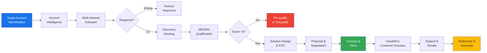
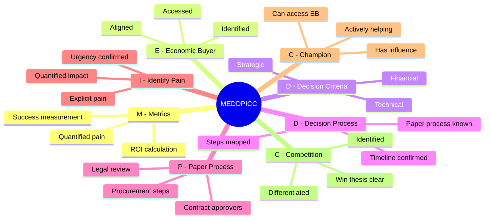

# SA02 — B2B Sales

> **Định nghĩa:** B2B (Business-to-Business) Sales là quá trình bán sản phẩm/dịch vụ cho các tổ chức, doanh nghiệp thay vì người tiêu dùng cá nhân. B2B Sales đặc trưng bởi chu kỳ mua dài, nhiều stakeholder, giá trị deal lớn và quyết định dựa trên ROI/logic hơn là cảm xúc.

---

## 1. Định nghĩa & Tầm quan trọng

**B2B Sales** bao gồm mọi giao dịch thương mại giữa hai doanh nghiệp:
- Nhà sản xuất bán cho nhà phân phối
- SaaS company bán cho doanh nghiệp
- Consulting firm bán services cho tập đoàn
- Nhà thầu xây dựng ký hợp đồng với chủ đầu tư

**Tại sao B2B Sales phức tạp hơn B2C:**
- **Multi-stakeholder:** Trung bình 6.8 người tham gia vào B2B buying decision (Gartner, 2022)
- **Long cycle:** Từ vài tuần đến nhiều năm cho enterprise deal
- **Rational dominant:** ROI, TCO, compliance phải được chứng minh số liệu cụ thể
- **High stakes:** Sai lầm mua hàng B2B ảnh hưởng đến toàn bộ tổ chức
- **Complex contracts:** Legal review, SLA, indemnification clauses

**Quy mô thị trường B2B:**
- Global B2B e-commerce: $26.6 nghìn tỷ USD (2023) — gấp 5x B2C
- VN B2B market: ước tính ~$120-150 tỷ USD/năm (manufacturing, services, construction, government)
- FDI vào VN 2023: $36.6 tỷ USD — tạo ra B2B supply chain rất lớn

---

## 2. Lịch sử & Nguồn gốc

**Evolution of B2B Sales:**
```
Pre-1900s: Traveling salesmen, catalog sales (B.F. Goodrich, Singer Sewing)
1920-1950: Relationship selling dominates — "golf course deals"
1960-1980: Product-based selling, solution selling emerges
1988:      SPIN Selling (Rackham) — scientific approach to complex sales
1990s:     Miller Heiman Strategic Selling, TAS (Target Account Selling)
2000s:     CRM revolution (Salesforce 1999) — pipeline management standardized
2011:      The Challenger Sale — insight-led selling
2015+:     Account-Based Marketing/Sales (ABM) — orchestrated approach
2020s:     Digital-first B2B, virtual selling, AI-augmented sales
```

**Tại VN:**
- **1986-2000:** Mở cửa, FDI vào VN mang methodology B2B hiện đại (Unilever, P&G, IBM, HP)
- **2000s:** Các công ty VN bắt đầu học theo — FPT, Viettel, VNPT build sales force B2B
- **2010s:** B2B SaaS nội địa xuất hiện (Base CRM, GetFly, KiotViet, CloudPOS)
- **2020s:** COVID accelerated virtual B2B selling, Zalo Business platform
- **Hiện tại:** Hybrid model — relationship vẫn quan trọng nhưng kết hợp digital tools

---

## 3. Các khái niệm cốt lõi

### Enterprise Sales vs SMB Sales vs Commercial Sales

| Tiêu chí | SMB Sales | Commercial/Mid-market | Enterprise Sales |
|---|---|---|---|
| Company size | <50 nhân viên | 50-500 nhân viên | 500+ nhân viên |
| Deal size VN | <100M VND | 100M-1B VND | >1B VND |
| Sales cycle | 2-8 tuần | 1-6 tháng | 6-24 tháng |
| # Stakeholders | 1-2 | 3-5 | 6-15+ |
| Sales motion | Velocity (nhiều deal) | Mixed | Strategic (ít deal, chăm kỹ) |
| Key skill | Efficiency, outbound | Discovery, solution selling | Executive presence, politics |
| VN example | Local SME | Công ty cổ phần tư nhân | Tập đoàn, FDI, DNNN |

### Buying Committee Roles

**6 vai trò trong B2B buying committee (Gartner):**

```
1. Economic Buyer (Người phê duyệt tài chính)
   → Có quyền ký budget, thường là CEO/CFO/C-suite
   → Động lực: ROI, strategic fit, risk reduction
   → Key message: Business outcomes, financial return

2. Champion (Người ủng hộ nội bộ)
   → Người muốn dự án xảy ra, fight for you internally
   → Động lực: Personal gain (career, recognition), problem solved
   → Key message: Empower them với data, talking points

3. Technical Buyer (Người đánh giá kỹ thuật)
   → IT, CTO, team technical — screen technical requirements
   → Động lực: Integration, security, scalability
   → Key message: Technical specs, compliance, support SLA

4. User Buyer (Người sử dụng thực tế)
   → Team sẽ dùng hàng ngày
   → Động lực: Ease of use, adoption, training
   → Key message: UX, change management support

5. Influencer (Người có ảnh hưởng)
   → Consultant, board member, trusted advisor của công ty
   → Key message: Thought leadership, case studies

6. Gatekeeper (Người kiểm soát access)
   → Secretary, PA, procurement officer
   → Key message: Professional, respect their process
```

### MQL → SQL → Opportunity → Customer

```
MQL (Marketing Qualified Lead)
   ↓ [Sales accepts, qualifies BANT/MEDDIC]
SQL (Sales Qualified Lead)
   ↓ [Discovery meeting confirms fit]
Opportunity (Active deal in pipeline)
   ↓ [Proposal/negotiation]
Customer (Closed Won)
   ↓ [Success, expand]
Advocate (Refers new business)
```

---

## 4. Mô hình & Framework chính

### 4.1 MEDDIC Framework (Jack Napoli, PTC, 1996)

Được phát triển tại PTC (software company) — giúp win rate từ 25% lên 62% trong 3 năm.

| Letter | Element | Câu hỏi cần trả lời |
|---|---|---|
| **M** | Metrics | Khách hàng đo lường thành công như thế nào? Số liệu cụ thể? |
| **E** | Economic Buyer | Ai có quyền ký ngân sách? Chúng ta đã gặp họ chưa? |
| **D** | Decision Criteria | Tiêu chí đánh giá giải pháp là gì? Technical? Financial? |
| **D** | Decision Process | Quy trình ra quyết định là gì? Timeline? Ai phê duyệt? |
| **I** | Identify Pain | Pain point chính là gì? Khi nào pain đủ lớn để họ act? |
| **C** | Champion | Ai đang fight for us internally? Họ có đủ influence không? |

### 4.2 MEDDPICC (Version mở rộng — thêm P và C thứ 2)

Thêm 2 elements:
- **P** — Paper Process: Quy trình legal/procurement mua hàng? Ai ký hợp đồng? Legal review mất bao lâu?
- **C** — Competition: Ai đang cạnh tranh? Chúng ta so sánh thế nào? Tại sao win vs competitor?

**MEDDPICC Score Card:**
```
Mỗi element chấm 0-2:
  0 = Chưa biết / không có
  1 = Partial / chưa đủ
  2 = Confirmed / strong

Total score 0-16:
  0-5  : High Risk — cần thêm discovery
  6-10 : Moderate — missing key elements
  11-14: Strong — đủ điều kiện forecast
  15-16: Very Strong — Commit category
```

### 4.3 Strategic Selling / Miller Heiman

**Blue Sheet Analysis:**
- Xác định tất cả stakeholders + vai trò + buying influence
- Map degree of influence và support level
- Identify red flags (có ai chống lại không?)
- Develop action plan để swing người chưa ủng hộ

**Response Modes của buyer:**
- **Growth:** Đang tìm cơ hội mới — receptive nhất
- **Trouble:** Có vấn đề cần giải quyết ngay — urgent
- **Even Keel:** Ổn định, không thấy cần thay đổi — khó nhất
- **Overconfident:** Tự nghĩ đang làm tốt — cần disrupt

### 4.4 Account-Based Marketing (ABM)

ABM = Marketing + Sales cùng nhắm mục tiêu vào danh sách account cụ thể, thay vì cast wide net.

**3 tiers của ABM:**
| Tier | Approach | Account count | Budget/account |
|---|---|---|---|
| **ABM 1:1** (Strategic ABM) | Fully customized per account | 5-50 accounts | Cao nhất |
| **ABM 1:Few** (ABM Lite) | Cluster by segment/industry | 50-500 accounts | Trung bình |
| **ABM 1:Many** (Programmatic) | Personalized at scale, tech-driven | 500-5000 accounts | Thấp nhất |

**ABM execution:**
```
1. Target Account List (TAL): Sales + Marketing cùng chọn
2. Account intelligence: Research công ty, trigger events
3. Personalized content: Industry-specific, pain-specific
4. Multi-channel engagement: LinkedIn, email, events, ads
5. Sales activation: Outreach khi có engagement signal
6. Measurement: Account engagement score, pipeline influence
```

---

## 5. Quy trình thực hiện — B2B Enterprise Sales

### Giai đoạn 1: Account Intelligence & Planning (Tuần 1-2)

**Research checklist trước khi tiếp cận:**
```
□ Company financials: doanh thu, lợi nhuận, tốc độ tăng trưởng
□ Recent news: M&A, funding, new products, leadership changes
□ Tech stack: Công nghệ họ đang dùng (BuiltWith, LinkedIn, job postings)
□ Pain indicators: Job postings, reviews (Glassdoor), social media
□ Competitors: Ai đang cạnh tranh cùng space?
□ Buying triggers: Fiscal year end, new initiative, compliance deadline
□ Internal champion: Ai có thể là champion của chúng ta?
□ Relationship map: Ai chúng ta đã biết trong công ty?
```

### Giai đoạn 2: Multi-channel Outreach (Tuần 2-4)

**Outreach sequence (7-10 touchpoints):**
```
Day 1:  LinkedIn connection request (personalized note)
Day 2:  Email #1 (trigger-based, not generic pitch)
Day 4:  LinkedIn message (value-add, không sales)
Day 7:  Email #2 (case study relevant to their industry)
Day 10: Phone call #1
Day 14: Email #3 (different angle / different stakeholder)
Day 17: Phone call #2
Day 21: LinkedIn video message (Loom)
Day 25: "Break-up email" (honest, door open for future)
```

### Giai đoạn 3: Discovery & Qualification

**Executive Discovery Meeting agenda (45-60 phút):**
```
0-5 min   : Welcome, thank their time, agenda confirm
5-15 min  : Their business — current priorities, strategic goals
15-30 min : Current state (as-is) — process, tools, challenges
30-40 min : Future state — what good looks like, desired outcome
40-50 min : Our perspective (brief) — how we help similar orgs
50-60 min : Next steps — agree on mutual action plan
```

**MEDDIC discovery questions:**
- **Metrics:** "Anh đo lường thành công của team logistics thế nào? Nếu cải thiện 20%, điều đó có ý nghĩa gì với P&L không?"
- **Economic Buyer:** "Ngoài anh ra, ai khác có tiếng nói trong quyết định này? CFO có cần approve không?"
- **Decision Criteria:** "Khi anh evaluate solutions, tiêu chí quan trọng nhất là gì? Technical, financial, hay vendor stability?"
- **Decision Process:** "Quy trình mua hàng của công ty mình như thế nào? Có qua procurement không? Legal review mất bao lâu?"
- **Identify Pain:** "Vấn đề này đang tốn công ty mình bao nhiêu mỗi tháng — cả tiền và thời gian?"
- **Champion:** "Ai trong team anh sẽ benefit nhất từ giải pháp này? Họ có ủng hộ không?"

### Giai đoạn 4: Solution Design & POC

**POC (Proof of Concept) Management:**
```
Trước POC:
  □ POC Agreement ký kết (scope, timeline, success criteria)
  □ Executive sponsor từ cả hai phía
  □ Technical resources cam kết

Trong POC:
  □ Weekly status meeting
  □ Document milestones và results
  □ Early warning nếu có vấn đề

Sau POC:
  □ POC Review Meeting với decision makers
  □ Present kết quả so với success criteria
  □ Đề xuất commercial terms
```

**Lưu ý:** POC có thể là "trap" — khách dùng miễn phí mà không commit. Cần:
- Có signed POC Agreement
- Mutual commitment: họ cam kết resources, bạn cam kết support
- Success criteria rõ ràng và measurable
- "If we hit all criteria, are you ready to move forward?" — test commitment trước khi bắt đầu

### Giai đoạn 5: Proposal & Commercial

**Proposal structure (Executive Summary trước):**
```
1. Executive Summary (1 trang)
   - Vấn đề của họ (tóm tắt từ discovery)
   - Giải pháp đề xuất
   - Expected outcomes (metrics)
   - Investment & Timeline

2. Understanding of Your Business
   - Show bạn hiểu context của họ

3. Proposed Solution
   - What + How (không bán feature, bán outcome)

4. Implementation Plan
   - Timeline, milestones, who does what

5. Team & Credentials
   - Relevant case studies, team bios

6. Commercial Terms
   - Pricing (options nếu có)
   - Payment terms
   - Contract duration & renewal
```

### Giai đoạn 6: Negotiation

**B2B Negotiation framework:**

```
PREPARE:
  □ Biết BATNA của mình (walk away point)
  □ Dự đoán BATNA của họ
  □ List 10 potential concessions + value của mỗi cái
  □ Define: Must have / Nice to have / Can give

NEGOTIATE:
  □ Never concede without getting something in return
  □ "Nếu tôi có thể làm X, anh có thể cam kết Y không?"
  □ Protect margin bằng value-add, không phải price cut
  □ Get everything in writing ngay khi đồng ý

CLOSE:
  □ Summarize agreement
  □ Confirm next steps: contract, signing timeline
  □ Send DocuSign / Hợp đồng trong 24h
```

### Giai đoạn 7: Contract & Close

**VN Enterprise Contract process:**
```
1. Proposal accepted → MOU/LOI ký (Letter of Intent)
2. Legal review: 2-4 tuần cho large deals
3. Procurement/Đấu thầu: nếu là DNNN có thể 1-3 tháng
4. Final contract review + negotiation của legal terms
5. Signing ceremony (VN thường có — quan trọng về mặt quan hệ)
6. Purchase Order phát hành
7. Kick-off meeting
```

**Lưu ý đấu thầu (public tender) VN:**
- Luật Đấu thầu 2013 (sửa đổi 2023) — phức tạp, cần chuyên gia
- Hồ sơ mời thầu (HSMT) thường được "viết cho" vendor quen — cần phân tích kỹ
- Giá rất quan trọng nhưng technical score cũng cần cao
- Pre-bid meeting quan trọng để hiểu requirement thực sự

---

## 6. Công cụ & Phương pháp

### Sales Intelligence Tools:
| Công cụ | Mục đích | Giá tham khảo |
|---|---|---|
| LinkedIn Sales Navigator | Prospecting, relationship mapping | ~$100/user/month |
| Apollo.io | Contact database + email sequences | $50-150/user/month |
| ZoomInfo | B2B data, intent data | $15,000+/năm |
| Crunchbase Pro | Startup/funding intelligence | $50/user/month |
| Lusha | Contact info enrichment | $40-80/user/month |
| VN: Vietdata, FiinGroup | VN company financials | Liên hệ báo giá |

### CRM for Enterprise B2B:
| CRM | Phù hợp | VN availability |
|---|---|---|
| Salesforce | Enterprise, complex customization | Full support VN |
| HubSpot | Mid-market, ease of use | Full support VN |
| Microsoft Dynamics | Enterprise, Microsoft ecosystem | Full support VN |
| Zoho CRM | SMB-Mid market, cost effective | Có tiếng Việt |
| Odoo | Open-source, flexible | Nhiều partner VN |

### Deal Room & Collaboration:
- **Notion:** Shared workspace với khách hàng — mutual action plan, resource library
- **Accord:** Dedicated deal room platform
- **PandaDoc:** Proposal + e-signature + tracking (biết khi nào họ đọc proposal)

---

## 7. KPI & Đo lường

### Enterprise B2B KPIs:

| KPI | Formula | Benchmark |
|---|---|---|
| **Win Rate** | Won Deals / Total Qualified Opps | Enterprise: 15-25% |
| **Average Contract Value (ACV)** | Total ARR / # Customers | Tùy segment |
| **Sales Cycle Length** | Close Date − Opportunity Create Date | Enterprise VN: 3-12 tháng |
| **Pipeline Coverage** | Total Pipeline / Quota | 4-5x cho enterprise |
| **MEDDIC Score** | Sum of 6 elements (0-12) | >8 để Commit |
| **Multi-thread Rate** | Deals với 3+ stakeholders / total | >70% cho enterprise |
| **Forecast Accuracy** | |Actual − Forecast| / Forecast | <15% variance = good |

### Leading Indicators:
```
Activity Metrics:
  - # Executive meetings per week
  - # New accounts added to pipeline
  - # POCs initiated
  - # Multi-threaded deals (2+ contacts)
  
Quality Metrics:
  - MEDDIC score by deal
  - Champion confidence level (1-5)
  - Decision timeline confirmed?
  - Competitive status (sole source / competitive / unknown)
```

---

## 8. Rủi ro & Thách thức

### 8.1 Champion bị mất (Champion leaves or loses power)
- **Rủi ro:** Champion bị thay đổi vị trí, nghỉ việc, hoặc mất ảnh hưởng → deal chết
- **Giải pháp:** Multi-thread (build relationships với 3+ stakeholders), không phụ thuộc 1 người

### 8.2 "No Decision" (Không quyết định gì)
- **Phổ biến nhất:** 40-60% enterprise opportunities kết thúc bằng "no decision" (không chọn ai)
- **Nguyên nhân:** Fear of change, internal politics, budget freeze, "good enough" status quo
- **Giải pháp:** Quantify cost of inaction, build urgency around business pain

### 8.3 Competitive displacement muộn
- Tưởng là sole source, đột nhiên procurement thêm 2 vendor khác vào
- **Giải pháp:** Hỏi thẳng về competitive landscape từ sớm, confirm sole source bằng văn bản nếu được

### 8.4 Procurement delay (VN đặc thù)
- Enterprise và DNNN VN: Procurement process có thể mất 2-6 tháng thêm sau approval
- **Giải pháp:** Map paper process sớm (chữ P trong MEDDPICC), tính vào forecast timeline

### 8.5 Scope creep trong negotiation
- "À, thêm cái module này vào giá chưa?" sau khi gần ký
- **Giải pháp:** Scope statement rõ ràng trong proposal, mọi addition phải có change order

---

## 9. Best Practices

1. **Mutual Action Plan (MAP):** Document rõ next steps từ cả hai phía — không chỉ bạn hứa, họ cũng cam kết
2. **Multi-thread early:** Không đợi đến khi champion rời đi mới expand relationships
3. **Executive alignment:** Cố gắng có exec-to-exec meeting (CEO/VP bên bạn gặp CEO/CFO bên họ)
4. **Value hypothesis trước POC:** "Chúng ta giải quyết vấn đề X, kỳ vọng outcome là Y — đúng không?" — Confirm trước khi bắt đầu
5. **Competitive intel:** Biết đối thủ thực sự vs "phantom competition" (họ nói nhưng thực ra không evaluate)
6. **Forecast discipline:** MEDDIC score honest — không inflate pipeline để làm đẹp
7. **Legal/procurement early:** Đừng surprise về legal review 2 tuần trước close date
8. **Reference selling:** Đề nghị reference call với khách tương tự — tăng credibility và giảm risk perception
9. **Deal coaching:** Weekly deal review với manager — fresh eyes catch blind spots
10. **Post-mortem wins too:** Không chỉ analyze losses — understand WHY bạn win để replicate

---

## 10. Sai lầm phổ biến

| Sai lầm | Biểu hiện | Hậu quả | Cách sửa |
|---|---|---|---|
| Single-threaded | Chỉ có 1 contact trong account | Champion nghỉ → deal chết | Build 3+ relationships |
| Champion ≠ Economic Buyer | Nghĩ champion có thể ký deal | Surprise veto từ CFO | Map buying committee từ đầu |
| Proposal quá sớm | Gửi proposal trước khi qualify đủ | Waste time, lose credibility | Qualify MEDDIC trước khi propose |
| Demo-dumping | Demo toàn bộ tính năng | Overwhelm, bore | Demo theo pain đã discovered |
| Ignore procurement | Chỉ work với champion | Procurement surprise ở phút 90 | Map paper process sớm |
| Forecast optimism | Inflated pipeline, "everything is fine" | Miss quarter, no time to recover | Honest MEDDIC scoring |
| No urgency | Deal drifts indefinitely | Competitor wins, budget freeze | Link to compelling event |

---

## 11. Case Study VN — FPT Software Enterprise Deals

**Công ty:** FPT Software (công ty IT outsourcing lớn nhất VN, ~30,000 nhân viên, FY2023 doanh thu ~$900M)

**Thách thức:** Bán IT outsourcing services cho Japanese enterprise clients (chiếm ~60% doanh thu FPT Software)

**B2B Sales Process của FPT Software với Japan:**

**1. Relationship-first approach (phù hợp văn hóa Nhật):**
- FPT Software có hàng trăm nhân viên nói tiếng Nhật (JLPT N1-N2)
- Sales trips định kỳ sang Nhật để gặp client trực tiếp
- Onsen trip, sushi dinner = quan trọng như presentation
- Build relationship nhiều năm trước khi deal xảy ra

**2. Reference-based expansion:**
- Từ 1 project nhỏ → land-and-expand thành multi-year, multi-project contracts
- Case study từ Toyota, NTT, SoftBank dùng để pitch client mới tương tự
- "Ring-fencing": Mỗi client có dedicated team, build deep domain knowledge

**3. MEDDIC application:**
- Economic Buyer = Japanese VP/C-suite (thường phải gặp được)
- Decision process = tập thể (ringi system — mọi người phải ký off)
- Champion = Japanese project manager muốn offshore để reduce cost
- Metrics = cost reduction vs in-house, quality (bug rate, on-time delivery)

**4. Kết quả:**
- FY2023: $900M+ revenue, 30% CAGR
- Japan market: ~55% total revenue
- Repeat business rate: >85% (testament to success-based selling)
- Expansion: Từ BPO → IT consulting → Digital transformation

**Bài học:**
- B2B enterprise cần patience và investment dài hạn
- Reference là asset quan trọng nhất trong IT services B2B
- Cultural adaptation (Japan culture) là competitive advantage
- Land-and-expand model cho sustainable growth

---

## 12. Case Study quốc tế — Salesforce Enterprise B2B

**Challenge (2000):** Cạnh tranh với Siebel Systems (90% market share CRM enterprise) — on-premise, installed software trị giá hàng triệu USD

**B2B Sales Innovation:**

**1. No Software campaign:**
- Thay vì fight on features, tạo category mới: "The End of Software"
- Protesters at Siebel conference (guerrilla marketing + sales messaging)
- Messaging cho Economic Buyers: total cost of ownership thấp hơn dramatically

**2. Land-and-expand:**
- Start small: 5-seat SFA (Sales Force Automation) pilot
- Prove value in 90 days, then expand to full org
- Average expansion ratio: 3-5x from initial contract

**3. Executive relationship:**
- CEO Marc Benioff personally called on Fortune 500 CEOs
- Executive briefing center tại SF office — invite C-suite để immersive experience
- Dreamforce (annual conference) → 170,000+ attendees trở thành community + sales engine

**4. Customer Success as Sales:**
- Assigned CSM từ day 1 → drive adoption → create upsell opportunities
- Healthy customers = best reference for new prospects
- Net Revenue Retention >120% = customers buy more each year than they started

**Kết quả:**
- 1999: $0 → 2023: $31.4B ARR
- 150,000+ customers globally
- Win rate vs legacy CRM: từ <10% (2000) lên 60%+ (2010+)

---

## 13. So sánh với phương pháp khác

| Framework | Strength | Weakness | Best for |
|---|---|---|---|
| **MEDDIC/MEDDPICC** | Comprehensive qualification | Complex to learn | Enterprise complex deals |
| **SPIN Selling** | Great discovery questions | Limited on political/process | Mid-market consultative |
| **Challenger Sale** | Insight-led, differentiated | Requires deep industry knowledge | High-credibility sellers |
| **Solution Selling** | Customer-centric | Can over-engineer solutions | Technology services |
| **Sandler** | Mutual qualification, no pressure | Very different from traditional | Hunter personality sellers |
| **Miller Heiman Strategic** | Comprehensive account mapping | Complex, resource-intensive | Key account management |

---

## 14. Ứng dụng theo ngành

### B2B Sales theo ngành tại VN:

**Manufacturing / Industrial:**
- Buyers: CPO, Engineering Director, Plant Manager
- Pain: Downtime, quality defects, supply chain disruption
- Sales cycle: 3-9 tháng
- Key: Technical competence, demo tại factory, local support

**Financial Services (FI):**
- Buyers: CTO, CRO, Head of Digital
- Pain: Compliance, legacy system, customer experience
- Sales cycle: 6-18 tháng
- Key: Regulatory compliance, security certifications, reference from peer banks

**Government / DNNN:**
- Buyers: Director, Deputy Director, Procurement committee
- Pain: Compliance, modernization, accountability
- Sales cycle: 9-24 tháng, heavily regulated
- Key: Đấu thầu expertise, relationship với ministry officials, local presence

**Retail / FMCG:**
- Buyers: CIO, Operations Director, Supply Chain Head
- Pain: Inventory management, omnichannel, last-mile
- Sales cycle: 2-6 tháng
- Key: Industry-specific case studies, quick ROI demo

---

## 15. Ứng dụng theo quy mô doanh nghiệp

### Startup bán cho Enterprise:

**"Crossing the Chasm" vào enterprise:**
- Challenge: Enterprise muốn vendors có track record
- Solution: Land với pilot/POC, build reference customers
- Pricing strategy: Loss-leader deals đầu tiên để get logos
- Risk: Enterprise đòi customization ngoài roadmap

**Checklist startup → enterprise readiness:**
```
□ SOC 2 / ISO 27001 certification (security requirement)
□ SLA with penalties (uptime guarantee)
□ Dedicated support tier (enterprise-grade)
□ Contract templates reviewed by legal
□ Reference customers sẵn sàng cho reference calls
□ MSA (Master Service Agreement) template
□ Data processing agreement (DPA) cho GDPR compliance
□ Local (VN) support nếu required
```

---

## 16. Công nghệ & Digital Tools

### B2B Sales Tech Stack 2024:

```
PROSPECTING LAYER:
  LinkedIn Sales Navigator → Apollo.io → Lusha (contact enrichment)
  
ENGAGEMENT LAYER:
  Email sequences: Lemlist / Outreach.io / Salesloft
  Video: Loom (personalized video outreach)
  Meeting: Calendly → Zoom / Google Meet
  
CRM LAYER:
  Enterprise: Salesforce / Microsoft Dynamics
  Mid-market: HubSpot / Pipedrive
  VN SME: GetFly / Base CRM / Odoo
  
INTELLIGENCE LAYER:
  Call recording + AI: Gong.io / Chorus / tl;dv
  Revenue intelligence: Clari / Boostup
  
DEAL EXECUTION LAYER:
  Proposals: PandaDoc / Proposify
  E-signature: DocuSign / HelloSign
  Deal room: Accord / Notion
```

### AI impact on B2B Sales:
- **AI-generated outreach:** GPT-4 draft personalized emails at scale
- **Call analysis:** Gong AI flags competitors mentioned, buying signals, risk indicators
- **Deal scoring:** AI predicts deal health score based on engagement patterns
- **Automated research:** AI compile account intelligence from public sources
- **Meeting summary:** AI auto-generate action items từ call transcript

---

## 17. Tích hợp với các domain khác

```
B2B Sales ←→ Marketing (SA01, MK domain):
  ABM: Sales chọn target accounts, Marketing tạo personalized content
  Lead handoff SLA: MQL → SQL trong 24h response time
  Content: Sales feedback → Marketing tạo case studies, battle cards

B2B Sales ←→ Product (PM domain):
  Feature requests từ enterprise deals → roadmap influence
  Enterprise-grade features: SSO, API, custom reporting
  Beta customer program: enterprise customers test new features

B2B Sales ←→ Legal/Finance:
  Contract negotiation: Legal review template
  Discount approval: Finance sign off cho >X% discount
  Revenue recognition: ASC 606 / IFRS 15 compliance

B2B Sales ←→ Customer Success:
  Handoff quality determines expansion revenue
  CSM-to-sales pipeline: identify expansion opportunities
  Net Revenue Retention = Sales + CS joint metric

B2B Sales ←→ Professional Services:
  Scoping: Sales set expectations, PS deliver
  Change management: PS helps champion drive adoption
  Upsell: Implementation services → additional license
```

---

## 18. Xu hướng & Tương lai

### 2024-2027 B2B Sales Trends:

**1. Buying Committee size tăng:**
- 2015: Average 5.4 người → 2022: 6.8 người → 2025+: dự báo 8+ người
- Implication: Multi-thread từ day 1, personalized messaging per role

**2. Buyer self-service preference:**
- 75% B2B buyers prefer self-serve research (Gartner 2022)
- 44% prefer NO sales interaction at all for repeat purchases
- Implication: Digital buying experience, content availability, PLG elements

**3. Video selling:**
- Async video (Loom) thay email → 3-5x engagement
- Virtual selling best practices: lighting, background, energy on camera

**4. Revenue Operations (RevOps):**
- Sales, Marketing, CS align on tech stack, data, processes
- CRO (Chief Revenue Officer) role expanding
- Single source of truth: 1 CRM, 1 data model

**5. AI copilots for AEs:**
- Real-time coaching during calls
- AI-generated next best action
- Automated admin work (CRM logging, email follow-up)

**6. Outcome-based pricing:**
- Vendors share risk với customers: pay based on results
- "We only win when you win" model gaining traction

---

## 19. Bối cảnh Việt Nam đặc thù

### B2B VN — Những điểm khác biệt quan trọng:

**1. Quyết định tập thể & Phê duyệt chậm:**
- DNNN: 3-7 cấp phê duyệt, từ Director → Deputy GM → GM → Board
- Tập đoàn tư nhân lớn: Hội đồng quản trị phải approve cho deal lớn
- FDI: Thường cần HQ approval từ nước ngoài (Singapore, Korea, Japan HQ)
- **Action:** Map quy trình phê duyệt từ sớm, tính thêm 1-3 tháng vào timeline

**2. Quan hệ cá nhân quyết định:**
- "Ai giới thiệu?" quan trọng hơn "Sản phẩm tốt thế nào?"
- Introductions từ người thứ 3 đáng tin tăng meeting rate từ 10% lên 60%
- Building guanxi (quan hệ): Cà phê, ăn trưa, golf, gifts (trong giới hạn anti-corruption)
- **Action:** Invest vào networking events, golf outings, industry associations

**3. Zalo là kênh chính:**
- B2B C-suite VN: Response rate Zalo > Email > Phone
- Zalo Business OA cho marketing, Zalo Personal cho relationship
- Zalo group cho deal team communication
- **Action:** Mọi business card exchange phải end với "Anh cho tôi Zalo nhé"

**4. Đấu thầu & Thủ tục:**
- DNNN và nhiều doanh nghiệp lớn phải đấu thầu → Luật Đấu thầu 2023
- "Viết thầu" (spec writing): Vendor được chọn trước thường influence việc viết HSMT
- Pre-qualification: Nhiều đơn vị require vendor đáp ứng điều kiện trước khi tham dự thầu
- **Action:** Build relationship với đơn vị mua từ sớm, influence specification nếu có thể

**5. Giá rất nhạy cảm:**
- VN enterprise vẫn cost-conscious dù deal lớn
- List price phải có room để negotiate 15-30%
- TCO (Total Cost of Ownership) argument ít được dùng — focus vào sticker price
- **Action:** Build tiered pricing, offer payment flexibility (net 30/60/90)

**6. Lòng trung thành với vendor đã dùng:**
- Switching cost cao về: training, integration, internal process
- "Nếu X đang OK thì tại sao phải đổi?" — status quo bias mạnh
- **Action:** Quantify cost of inaction + switching cost thực thấp hơn họ nghĩ

**7. Legal & Compliance VN:**
- Luật Thương Mại 2005: Hợp đồng phải rõ ràng, đủ yếu tố pháp lý
- Luật Đấu thầu 2023 (số 22/2023/QH15) — áp dụng cho mua sắm công
- Nghị định về thanh toán: Wire transfer, L/C cho cross-border
- Chống tham nhũng: Luật PCTN 2018 — quà tặng phải hợp lý, transparent

---

## 20. Checklist thực hành

### Pre-call Checklist:
```
□ Research account: doanh thu, ngành, recent news
□ Research prospect: LinkedIn, recent posts, tenure
□ Define call objective (1 specific next step)
□ Prepare 5 discovery questions (MEDDIC-aligned)
□ Review past interactions in CRM
□ Prepare 1-2 relevant case studies
□ Check competitor landscape for this account
```

### Weekly Deal Review Checklist:
```
□ MEDDIC score update cho mỗi deal > 500M VND
□ Champion health check: đang active, có influence không?
□ Next steps confirmed từ cả hai phía?
□ Timeline: Vẫn on track với original close date?
□ Competition: Có thay đổi gì không?
□ Deal risk: Có red flag nào mới không?
□ Action needed: Manager có cần support gì không?
```

### Pipeline Review Checklist (Manager):
```
□ Coverage: 4x quota minimum
□ Stage distribution: Đủ deals ở mọi stage?
□ Multi-threaded: Top 10 deals có 3+ contacts?
□ MEDDIC discipline: Commit deals phải score >10/12
□ Stale deals: Deals không có activity >2 tuần → action
□ Forecast: Commit vs Best Case vs Pipeline clearly separated
□ Coaching: 1-2 deals cần coaching specific skill
```

---

## 21. RFP Process Management

**RFP (Request for Proposal) là gì:**
- Formal document từ buyer nêu rõ requirements và yêu cầu vendors submit proposals
- Phổ biến trong: Government, banking, insurance, large enterprise
- VN: Thường gọi là "hồ sơ mời thầu" hoặc "yêu cầu báo giá"

**RFP Decision matrix:**
```
Nên participate RFP khi:
  □ Chúng ta có relationship với insider (champion)
  □ Scope phù hợp với strength của mình
  □ Win probability >30%
  □ Thời gian viết thầu reasonable vs deal size
  □ Đây là strategic account

Không nên participate khi:
  □ Không có internal contact
  □ Spec viết cho đối thủ rõ ràng
  □ Quá rộng/quá nhiều requirements
  □ Margin quá mỏng kể cả khi win
```

**RFP Response strategy:**
1. Gặp người viết thầu trước khi submit (nếu có thể)
2. Clarification questions: Dùng Q&A process để clarify và influence
3. Executive Summary trước hết (decision makers đọc cái này nhất)
4. Differentiation: Không chỉ trả lời Yes/No — explain HOW với concrete examples
5. References: Đính kèm 2-3 references relevant to their sector
6. Compliance matrix: Tick box từng requirement — dễ evaluate cho buyer

---

## 22. Account-Based Selling Execution

**Territory Account Plan — Quarterly:**

```
Tier 1 Accounts (5-10 accounts):
  → Đây là accounts lớn nhất, highest potential
  → Dedicate 40% of time
  → Monthly executive touchpoint
  → Custom content/events for them
  → Joint QBR (Quarterly Business Review)

Tier 2 Accounts (20-30 accounts):
  → Mid-tier, growing potential
  → Dedicate 40% of time
  → Quarterly meeting minimum
  → Industry-specific content

Tier 3 Accounts (50-100 accounts):
  → Smaller, lower potential
  → Dedicate 20% of time
  → Digital-first, periodic check-ins
  → Nurture for future upgrade
```

---

## 23. Executive Selling Skills

**Kỹ năng bán hàng với C-suite:**

1. **Speak business, not product:** CFO muốn nghe về EBITDA improvement, không phải feature list
2. **Prepare insight, not pitch:** "Chúng tôi thấy rằng các công ty trong ngành anh đang..." → teach something new
3. **Be brief:** C-suite time is precious — 5-minute stand-up deal vs 1-hour formal presentation
4. **Reference peers:** "Công ty tương tự X trong ngành của anh đã làm Y và đạt được Z"
5. **Know their priorities:** Đọc annual report, earnings call, LinkedIn posts của CEO trước khi gặp
6. **Executive-to-executive:** Đề nghị CEO/VP của bạn join call → reciprocal executive engagement

**Executive outreach email:**
```
Subject: [Peer company name] tăng 35% efficiency — liên quan đến [Tên công ty họ] không?

Anh [Tên CEO] kính mến,

[Tên peer company tương tự] — cũng đang scale nhanh như [Tên công ty họ] — 
đã giải quyết [pain cụ thể] và đạt [metric cụ thể] trong 6 tháng.

Tôi muốn có 15 phút để chia sẻ cách họ làm — 
và xem điều này có liên quan đến priorities của anh không.

[Tên] | [Chức vụ] | [SĐT]
P.S. Anh [Tên người giới thiệu] gợi ý tôi liên hệ anh.
```

---

## 24. B2B Sales Metrics Benchmarks (VN Context)

```
Enterprise Sales (>1B VND deals):
  Win rate:          15-22%
  Sales cycle:       6-18 tháng
  Pipeline coverage: 4-5x
  # Opps per rep:    5-15 active
  
Mid-market Sales (100M-1B VND):
  Win rate:          20-30%
  Sales cycle:       2-6 tháng
  Pipeline coverage: 3-4x
  # Opps per rep:    15-30 active
  
SMB Sales (<100M VND):
  Win rate:          30-45%
  Sales cycle:       2-8 tuần
  Pipeline coverage: 3x
  # Opps per rep:    30-60 active
```

---

## 25. Negotiation Tactics & Counter-Tactics (B2B VN)

**Buyer tactics phổ biến tại VN và cách counter:**

| Buyer Tactic | Cách nhận biết | Counter |
|---|---|---|
| "Hỗ trợ thêm đi" (vague ask) | Cuối deal, không specify | "Anh muốn hỗ trợ cụ thể gì? Tôi cần biết để xem có feasible không" |
| Bring in competitor đột ngột | Nói "có vendor khác rẻ hơn 20%" | "Anh có thể share proposal đó với tôi không? Tôi muốn compare táo với táo" |
| Delay signing vô thời hạn | "Để tôi hỏi thêm" kéo dài | Xác định compelling event: "Anh cần solution này trước [event] không?" |
| "Gói nhỏ hơn đi, thử trước" | Muốn giảm commitment | Structured pilot với expansion commitment baked in |
| Demand free customization | "Add feature này vào không?" | "Tôi có thể put it on the roadmap. Nếu muốn nhanh hơn, có phương án custom với chi phí riêng" |

---

## 26. Post-Sale: Transition to Customer Success

**Deal close ≠ relationship close — thực ra đây là bắt đầu:**

**Handoff quality checklist:**
```
AE → CSM Handoff document phải có:
□ Company background + why they bought
□ Business objectives & success metrics
□ Key stakeholders + relationship notes
□ Implementation timeline & milestones
□ Known risks & sensitivities
□ Upsell opportunities identified
□ Competitive threats (anyone pushing for different solution?)
□ Commercial terms: contract value, renewal date, terms
```

**Customer health metrics:**
- **Green:** >80% adoption, NPS >40, on track for renewal
- **Yellow:** 50-80% adoption, some issues, needs attention
- **Red:** <50% adoption, complaints, at-risk for churn

---

## 27. Channel Partnerships in B2B

**Partner types cho B2B selling:**

| Partner type | Mô tả | Commission | VN examples |
|---|---|---|---|
| **Reseller/VAR** | Mua lại và bán | 15-30% margin | Nhiều IT resellers |
| **System Integrator** | Integrate solution vào hệ thống lớn hơn | 10-20% + services revenue | FPT IS, Viettel Networks |
| **Consulting Partner** | Tư vấn và recommend | Referral fee 5-10% | Big4 (Deloitte, PwC) |
| **Technology Partner** | Tích hợp sản phẩm với nhau | Mutual referral | Salesforce + DocuSign |
| **OEM Partner** | Embed solution vào product của họ | License fee | White-label software |

**Partner management:**
- Partner portal: training, certification, marketing materials, deal registration
- Deal registration: Partner registers deal → protected margin, avoid channel conflict
- Partner tiers: Silver/Gold/Platinum với different margins & benefits

---

## 28. Win/Loss by Reason — B2B VN

**Phân tích Win/Loss thực tế từ B2B VN market:**

**Win reasons (top 5):**
1. Relationship quality (35%) — "Anh ấy là người tôi tin tưởng"
2. Local support capability (25%) — "Có người support tiếng Việt, có office tại VN"
3. Total cost (20%) — Không nhất thiết rẻ nhất, nhưng TCO hợp lý
4. Technical fit (12%) — Solution phù hợp requirements
5. References (8%) — Đã triển khai thành công cho peer company

**Loss reasons (top 5):**
1. Price (40%) — Competitor offer significantly lower price
2. "Existing vendor" (25%) — Đã có vendor quen, low motivation to switch
3. No decision (20%) — Budget freeze, priority changed
4. Technical gap (10%) — Solution không đáp ứng specific requirement
5. Poor sales execution (5%) — Không multi-thread, slow response, bad presentation

---

## 29. B2B Sales Team Structure

### Sales Organization Design:

**Functional model (phổ biến nhất VN):**
```
VP Sales / Sales Director
├── SMB Sales Manager
│   ├── 4-6 SMB Account Executives
│   └── 1-2 SDRs supporting
├── Enterprise Sales Manager
│   ├── 2-3 Enterprise Account Executives
│   └── 1 Sales Engineer (technical support)
└── Sales Operations
    └── CRM admin, reporting, enablement
```

**Pod model (tech companies):**
```
Pod (Revenue Unit):
  1 Enterprise AE (lead)
  1 SDR (prospecting support)
  1 Solution Consultant/SE
  1 CSM (post-sale)
→ Họ work như 1 team cho 20-30 target accounts
```

### Hiring criteria cho Enterprise AE VN:
```
Must have:
  □ 5+ năm B2B sales, 2+ năm enterprise
  □ Có thể trình bày với C-suite (Tiếng Việt + tiếng Anh tốt)
  □ Experience với deals >500M VND
  □ Understand hoặc học được domain (technology/finance/manufacturing)
  
Nice to have:
  □ Network trong industry target
  □ MEDDIC/SPIN training
  □ Tiếng Nhật/Hàn nếu target FDI segment
  □ MBA hoặc background kỹ thuật (cho complex solution)
```

---

## 30. Seasonal Sales Patterns (VN B2B)

**VN B2B mua hàng theo mùa:**

| Kỳ | Pattern | Tác động đến Sales |
|---|---|---|
| Q1 (Jan-Mar) | Chậm — Tết (Jan/Feb), budget mới đang approve | Low close rate, tốt để prospect |
| Q2 (Apr-Jun) | Tăng dần, H1 close push | Target H1 deals với urgency |
| Q3 (Jul-Sep) | Ổn định, budget mid-year review | Check budget consumption rate |
| Q4 (Oct-Dec) | Cao nhất — "spend or lose budget" + Q4 close | Push hard, offer year-end incentives |

**Tết VN impact đặc biệt:**
- 2 tuần trước Tết: Không ai muốn quyết định lớn
- Tuần sau Tết: Chậm khởi động lại
- → Tính 3-4 tuần "dead zone" trong Q1 VN

---

## 31. B2B SaaS Sales Motion — Đặc thù

**Product-Led Growth (PLG) + Sales Assist:**
```
Người dùng cá nhân sign up free (bottom-up)
  → Dùng thêm, hit limits
  → Sales contact khi có PQL signals
  → Upgrade to team/enterprise plan
  
Example VN: Notion, Slack, Zoom — viral adoption
  then enterprise contracts follow
```

**Enterprise B2B SaaS metrics:**
| Metric | Formula | Good benchmark |
|---|---|---|
| ARR | Annual Recurring Revenue | Growth rate: 80-120% Y/Y early stage |
| NRR | Net Revenue Retention | >110% world-class |
| CAC | Cost to Acquire Customer | <12 months payback |
| LTV | Lifetime Value | LTV/CAC > 3x |
| Magic Number | Net new ARR / S&M spend prior quarter | >0.75 |

---

## 32. Cross-Cultural B2B Selling in VN

**Selling to different buyer types in VN:**

**Vietnamese private company (Công ty tư nhân VN):**
- Decision maker: Chủ tịch/CEO thường quyết định cuối
- Speed: Nhanh hơn DNNN nếu đã tin tưởng
- Key: Personal relationship với owner
- Pitfall: Con/em chủ cũng có influence

**State-owned enterprise (DNNN):**
- Process: Phức tạp, nhiều phê duyệt
- Decision: Tập thể, risk-averse (không ai muốn chịu trách nhiệm riêng)
- Key: Paper trail, compliance, references từ DNNN khác
- Pitfall: "Project được phê duyệt" ≠ "Budget được giải ngân"

**FDI Company:**
- Process: Thường phải report về HQ
- Decision: Delegate cho local management với approval limits
- Key: Tiếng Anh, international standards, references từ global HQ
- Pitfall: HQ có thể override local decision

**Korean FDI (Samsung, LG, Hyundai ecosystem):**
- Hierarchy rất quan trọng — phải làm việc đúng cấp bậc
- Prefer Korean suppliers (giới thiệu từ Korean partner tăng credibility)
- Long evaluation process nhưng loyal khi đã chọn

**Japanese FDI:**
- Ringi system — consensus decision, mất thời gian
- Very detail-oriented — documentation phải perfect
- Relationship building cực kỳ quan trọng (thường mất 1-2 năm)
- Once trusted, very loyal — decade-long relationships

---

## 33. Revenue Operations Support cho B2B Sales

**RevOps role trong B2B:**
- **Data hygiene:** Đảm bảo CRM data chính xác → forecast reliable
- **Tech stack management:** Integrate CRM + marketing + CS tools
- **Process design:** Sales stages, exit criteria, SLA giữa teams
- **Reporting:** Dashboard, weekly pipeline reports, QBR decks
- **Quota setting:** Bottoms-up quota modeling, territory carving
- **Commission:** Comp plan administration, payout calculation

**Common RevOps metrics:**
- % reps at quota
- Pipeline creation by source
- Stage conversion rates (week over week)
- Forecast accuracy (actual vs predicted)
- Time to close per stage

---

## 34. Field Sales vs Inside Sales vs Hybrid

| Model | Description | Phù hợp | VN Application |
|---|---|---|---|
| **Field Sales** | Rep đi gặp khách tại office/site | Enterprise, high-touch deals >1B VND | Standard cho enterprise B2B VN |
| **Inside Sales** | Remote, phone/video/email only | SMB, velocity motion | Đang tăng, nhưng VN vẫn prefer face-to-face |
| **Hybrid** | Inside cho prospecting, field cho late-stage | Most effective approach | Growing adoption post-COVID |

**VN preference:** Gặp mặt trực tiếp vẫn là norm — "nhìn mặt mới tin." Video call chấp nhận được nhưng không replace được face-to-face for big deals.

---

## 35. Pricing Strategy trong B2B Negotiation

**B2B Pricing hierarchy:**
```
List Price (Bảng giá công khai)
  └─ Partner Price (Giá cho partner/reseller: -20-35%)
       └─ Enterprise Price (Giá negotiate: -5-20% từ list)
            └─ Minimum Commit Price (Floor price, cần approval)
                 └─ Strategic Price (CEO approval required, one-off)
```

**Discount authorization matrix (ví dụ):**
| Discount % | Requires approval from |
|---|---|
| 0-10% | Account Executive |
| 11-20% | Sales Manager |
| 21-30% | VP Sales / Revenue Director |
| >30% | CEO + CFO (special exception) |

---

## 36. Building Sales Process Documentation

**Deal Qualification Gate — stage entry criteria:**

```
Stage 1: PROSPECT
  Exit criteria:
  □ Contact info verified
  □ Company fits ICP
  □ Initial outreach sent

Stage 2: QUALIFIED (SQL)
  Exit criteria:
  □ BANT 75% confirmed
  □ Pain identified
  □ Next meeting booked

Stage 3: DISCOVERY
  Exit criteria:
  □ MEDDIC score >6/12
  □ Pain quantified
  □ Champion identified

Stage 4: SOLUTION/PROPOSAL
  Exit criteria:
  □ Proposal sent & acknowledged
  □ All key stakeholders met
  □ Commercial terms discussed

Stage 5: NEGOTIATION
  Exit criteria:
  □ Verbal agreement on key terms
  □ Contract sent
  □ Close date confirmed

Stage 6: CLOSED WON/LOST
  □ Contract signed + PO received (Won)
  □ Loss reason documented (Lost)
```

---

## 37. B2B Customer Segmentation

**Segmentation models for portfolio management:**

**By Revenue Potential:**
- **Strategic:** Top 10 accounts, >10B VND potential, white-glove treatment
- **Growth:** 11-50 accounts, 1-10B potential, regular investment
- **Maintenance:** 51-200 accounts, <1B, efficient coverage model
- **Long-tail:** 200+ accounts, self-serve + digital marketing

**By Buying Stage:**
- **Active Opportunity:** In pipeline, requires sales attention
- **Nurture:** Not ready now, drip campaign
- **At-Risk:** Renewal at risk, CS + Sales intervention
- **Advocate:** Happy, great for references + expansion

---

## 38. Sales Meetings: Cadence & Structure

### Weekly Cadence (Sales Manager):
```
Monday AM:    Pipeline review (team, 60 min) — forecast, deal updates
Tuesday-Thu:  1:1 với individual reps (30 min each)
Friday AM:    Week-in-review email gửi leadership
              Win shares, next week plan
```

### Monthly Cadence:
```
Month-end:    Pipeline close push
              Win/Loss analysis
              Commission report
```

### Quarterly Cadence:
```
QBR (Quarterly Business Review) — với top enterprise accounts:
  1. Previous quarter business review
  2. Account health review
  3. Upcoming quarter roadmap
  4. Expansion opportunities discussion
  5. Executive-to-executive relationship building
```

---

## 39. Ethical B2B Selling in VN

**Navigating gray areas:**

**Gift-giving culture:**
- Lunar New Year gifts: Phổ biến và được chấp nhận (trong giới hạn hợp lý)
- Guideline: <500,000 VND/gift thường ổn, transparent, không phải cash
- Red flag: Cash, large gifts, gifts qua intermediary
- Luật PCTN 2018: Nghiêm cấm hối lộ, phạt rất nặng

**Conflict of interest:**
- Procurement officer có thể là người quen/họ hàng — cần extra caution
- Document everything nếu có relationship với decision maker
- Company policy phải rõ ràng về approved gift amounts

**Commission cho nội bộ buyer (kickback):**
- Phổ biến trong một số ngành (xây dựng, dược, IT) — rủi ro pháp lý rất cao
- Không được khuyến khích; tập trung vào transparent value selling

---

## 40. Continuous Improvement trong B2B Sales

### Sales Excellence Framework:

**Quarterly Sales Review:**
1. **Win Rate analysis:** Tăng hay giảm? Tại sao?
2. **Pipeline quality:** Stage distribution, coverage, age
3. **Activity metrics:** Leading indicator health
4. **Training needs:** Skill gaps identified qua call reviews
5. **Process bottlenecks:** Nơi nào deal bị kẹt nhất?
6. **Tool adoption:** CRM usage, tech stack ROI
7. **Comp plan effectiveness:** Đang incentivize đúng hành vi?

### OKRs mẫu cho B2B Sales team (Quý):
```
Objective: Đạt revenue plan Q3 với chất lượng pipeline tốt

KR1: Close 15 enterprise deals (>500M VND each) = 12.5B VND
KR2: Pipeline coverage đạt 4.5x quota (56B VND) vào cuối Q3
KR3: Win rate từ 18% lên 22% trong Q3
KR4: MEDDIC score trung bình của Commit deals >10/12
KR5: 80% enterprise accounts có 3+ stakeholder contacts
```

---

## Output Formats

### Mermaid — B2B Enterprise Sales Process



### Mermaid — MEDDIC Framework



---

### Flashcards

**Q1: MEDDIC là gì và tại sao quan trọng?**
A: Framework qualification enterprise B2B: M=Metrics, E=Economic Buyer, D=Decision Criteria, D=Decision Process, I=Identify Pain, C=Champion. Quan trọng vì giúp forecast chính xác, identify deal risks sớm, và guide sales activity vào đúng nơi.

**Q2: Champion vs Economic Buyer — khác nhau thế nào?**
A: Champion = người ủng hộ bên trong, fight for you, muốn deal xảy ra (personal gain). Economic Buyer = người ký budget, quyết định tài chính. Champion thường không phải EB — cần access cả hai.

**Q3: Tại sao 40-60% B2B deals kết thúc bằng "no decision"?**
A: Fear of change (status quo bias), internal politics (không ai muốn risk), budget uncertainty, và "good enough" với hiện tại. Cách counter: quantify cost of inaction và create compelling event.

**Q4: Multi-threading là gì và tại sao quan trọng?**
A: Build relationships với 3+ stakeholders trong account, không phụ thuộc vào 1 champion. Quan trọng vì champion có thể nghỉ việc/mất influence, và multiple relationships = better win rate + larger deal size.

**Q5: POC (Proof of Concept) phải có gì để không trở thành "free work"?**
A: Signed POC Agreement với: scope rõ ràng, success criteria measurable, timeline cố định, resource commitment từ cả hai phía, và commitment: "Nếu đạt criteria X, chúng ta move forward."

**Q6: ABM (Account-Based Marketing) khác gì với traditional demand gen?**
A: Traditional = cast wide net, get many leads. ABM = Sales + Marketing align chọn specific target accounts, tạo personalized content/campaigns for those accounts, measure by account engagement không phải lead volume.

**Q7: Tại sao B2B VN cần multi-thread đặc biệt hơn?**
A: Vì quyết định tập thể — thường có 3-7 cấp phê duyệt, champion không phải lúc nào cũng có đủ influence. Hơn nữa, VN market có high employee turnover → champion có thể rời đi bất kỳ lúc nào.

**Q8: Đấu thầu VN — làm sao tăng win rate?**
A: Build relationship trước khi HSMT được viết, influence specification nếu có thể, làm Pre-bid meeting để clarify requirements, chuẩn bị compliance matrix rõ ràng, có references từ DNNN/tổ chức tương tự.

**Q9: Net Revenue Retention (NRR) >100% có ý nghĩa gì?**
A: Customers đang mua thêm (expansion) nhiều hơn số lượng churn. NRR >110% = world-class. Nghĩa là ngay cả khi không acquire customer mới, revenue vẫn tăng — growth engine từ existing customers.

**Q10: B2B VN — tại sao Zalo quan trọng hơn Email?**
A: Response rate Zalo >> Email vì: C-suite VN check Zalo thường xuyên hơn email, Zalo có notification rõ hơn, và trong văn hóa VN Zalo = personal channel = higher trust. "Anh cho tôi Zalo" = bước đầu build relationship.

---

### JSON Metadata

```json
{
  "module": {
    "code": "SA02",
    "name": "B2B Sales",
    "domain": "Sales",
    "status": "complete",
    "version": "1.0",
    "last_updated": "2026-06-30"
  },
  "topics": [
    "Enterprise vs SMB Sales",
    "Buying Committee",
    "MEDDIC/MEDDPICC",
    "Account-Based Marketing",
    "RFP Process",
    "POC Management",
    "B2B Negotiation",
    "BATNA",
    "Revenue Operations",
    "Channel Partnerships"
  ],
  "key_frameworks": ["MEDDIC", "MEDDPICC", "ABM", "Miller Heiman", "Strategic Selling", "SPIN"],
  "vn_context": [
    "Luật Thương Mại 2005",
    "Luật Đấu thầu 2023",
    "Luật PCTN 2018",
    "FPT Software case study",
    "DNNN procurement complexity",
    "Zalo as primary channel",
    "Tết seasonal patterns"
  ],
  "related_modules": ["SA01", "SA04", "SA06", "MK01", "CS01"],
  "difficulty": "Intermediate to Advanced",
  "estimated_read_time_minutes": 120
}
```

---

### Cheat Sheet / Quick Reference

```
╔══════════════════════════════════════════════════════════════╗
║               SA02 — B2B SALES CHEAT SHEET                  ║
╠══════════════════════════════════════════════════════════════╣
║ MEDDPICC:  M=Metrics  E=Econ.Buyer  D=Decision Criteria     ║
║            D=Decision Process  P=Paper Process              ║
║            I=Identify Pain  C=Champion  C=Competition       ║
╠══════════════════════════════════════════════════════════════╣
║ BUYING COMMITTEE:                                            ║
║  Economic Buyer → Champion → Technical Buyer →              ║
║  User Buyer → Influencer → Gatekeeper                       ║
╠══════════════════════════════════════════════════════════════╣
║ ENTERPRISE BENCHMARKS:                                       ║
║  Win Rate: 15-25%  |  Sales Cycle: 6-18 tháng              ║
║  Pipeline Coverage: 4-5x  |  Multi-thread: >3 contacts     ║
╠══════════════════════════════════════════════════════════════╣
║ VN B2B TIPS:                                                 ║
║  • Quan hệ cá nhân > sản phẩm tốt                          ║
║  • Map quy trình phê duyệt sớm (3-7 cấp DNNN)             ║
║  • Zalo first contact, meeting sau                          ║
║  • Q4 strongest, Q1 slowest (Tết effect)                   ║
║  • Tính thêm 1-3 tháng cho procurement DNNN                ║
╠══════════════════════════════════════════════════════════════╣
║ RED FLAGS:  Single-threaded deal / No champion access /     ║
║             No confirmed timeline / Unknown decision process ║
╚══════════════════════════════════════════════════════════════╝
```
