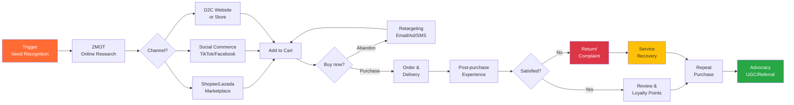
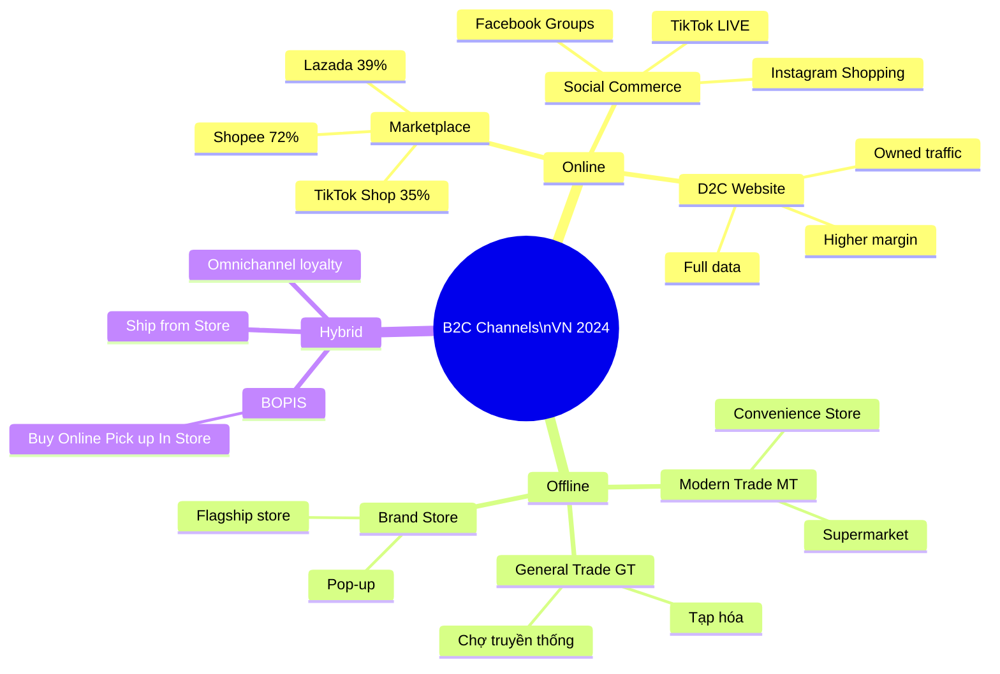

# SA03 — B2C Sales

> **Định nghĩa:** B2C (Business-to-Consumer) Sales là quá trình bán sản phẩm/dịch vụ trực tiếp đến người tiêu dùng cá nhân. Khác với B2B, quyết định mua của B2C thường nhanh hơn, cảm xúc đóng vai trò lớn hơn, và khối lượng giao dịch cao với giá trị mỗi đơn thấp hơn.

---

## 1. Định nghĩa & Tầm quan trọng

**B2C Sales** bao gồm tất cả hình thức bán hàng đến người tiêu dùng cuối:
- Bán lẻ trực tiếp (cửa hàng, siêu thị)
- E-commerce (Shopee, Lazada, TikTok Shop)
- D2C — Direct-to-Consumer (thương hiệu bán trực tiếp không qua trung gian)
- Telesales & door-to-door (bảo hiểm, bất động sản)
- Social commerce (Facebook, TikTok, Instagram)

**Tại sao B2C Sales quan trọng:**
- Thị trường B2C VN: ~$180 tỷ USD/năm (bao gồm retail, FMCG, e-commerce, F&B, bất động sản)
- Tầng lớp trung lưu VN đang bùng nổ: từ 13% dân số (2012) → 26% (2022) → dự báo 56% (2030)
- E-commerce VN: $20.5 tỷ USD (2023), tăng 25%/năm — top 3 Đông Nam Á
- TikTok Shop VN: Đạt $2+ tỷ GMV năm 2023 chỉ sau 2 năm

**B2C vs B2B:**
| Tiêu chí | B2C | B2B |
|---|---|---|
| Decision time | Giây → ngày | Tuần → năm |
| # Decision makers | 1-2 | 3-15 |
| Buying driver | Cảm xúc + logic | Logic + ROI |
| Deal size | Nhỏ (vài chục nghìn → vài triệu) | Lớn (triệu → tỷ) |
| Volume | Cao (hàng nghìn transactions/ngày) | Thấp |
| Relationship | Brand loyalty | Personal relationship |
| Channel | Retail, digital, social | Direct sales, channel |

---

## 2. Lịch sử & Nguồn gốc

**Timeline B2C evolution:**
```
1850s:  Catalog selling (Montgomery Ward, 1872) — "e-commerce" version 1.0
1900s:  Department stores (Bon Marché Paris) — curated retail experience
1950s:  Supermarkets + TV advertising — mass market B2C
1960s:  Shopping malls — destination retail
1970s:  Credit cards bùng nổ → impulse buying dễ hơn
1994:   Amazon.com — e-commerce era begins
2000s:  Google AdWords → targeted digital selling
2008:   iPhone → mobile commerce begins
2010s:  Social commerce (Instagram Shopping, Facebook Marketplace)
2016:   TikTok launches → video commerce
2020:   COVID → D2C acceleration, livestream commerce
2023:   TikTok Shop dominates social commerce globally
```

**VN B2C timeline:**
```
1986:   Đổi Mới → thị trường tiêu dùng mở cửa
1990s:  Chợ truyền thống → mini siêu thị đầu tiên
2000s:  Big C, Metro, Maximark — modern trade arrives
2012:   Lazada vào VN — e-commerce wave 1
2014:   Shopee VN launch — game changer
2016:   Thương mại điện tử boom — 20M+ shoppers online
2019:   Grab, Gojek — delivery + super app
2021:   TikTok Shop VN launch — social commerce wave
2023:   Live commerce mainstream — Shopee Live, TikTok Live
```

---

## 3. Các khái niệm cốt lõi

### Consumer Psychology — Tâm lý người tiêu dùng

**6 nguyên tắc tâm lý (Robert Cialdini — Influence, 1984):**

| Nguyên tắc | Mô tả | Ứng dụng B2C |
|---|---|---|
| **Reciprocity** | Cho trước → nhận lại | Sample miễn phí, gift wrapping |
| **Commitment** | Đã nói → có xu hướng nhất quán | "Thêm vào giỏ" → checkout |
| **Social Proof** | Nhiều người mua → đáng tin | "5,000 đánh giá 5 sao" |
| **Authority** | Chuyên gia khuyên → tin hơn | KOL review, doctor endorse |
| **Liking** | Thích người bán → mua nhiều hơn | Brand personality, influencer |
| **Scarcity** | Ít hàng → muốn nhiều hơn | "Còn 3 sản phẩm", "Flash sale" |

**FOMO (Fear Of Missing Out):**
- "Chỉ còn 2 giờ!" — countdown timer
- "50 người đang xem sản phẩm này" — social proof + scarcity
- "Khuyến mãi kết thúc lúc 12h" — urgency

**Anchoring Effect:**
- ~~250,000đ~~ **99,000đ** → Anchor cao làm deal price trông hời hơn
- Bundle: "Mua 2 được 3" → price per unit anchor lower

**Decoy Effect:**
- Small (S): 45,000đ
- Medium (M): 69,000đ  ← Decoy (quá gần L nhưng kém hơn nhiều)
- Large (L): 75,000đ
- → Hầu hết chọn L vì M làm L trông value tốt hơn

### Customer Journey Map

**5 giai đoạn hành trình khách hàng:**
```
1. AWARENESS (Nhận biết)
   → Nghe về sản phẩm lần đầu
   → Kênh: Social media, ads, word-of-mouth, search
   
2. CONSIDERATION (Cân nhắc)
   → Nghiên cứu, so sánh
   → Kênh: Google, YouTube review, bạn bè hỏi ý kiến
   
3. PURCHASE (Mua hàng)
   → Quyết định và giao dịch
   → Kênh: Website, app, cửa hàng, Shopee/Lazada
   
4. RETENTION (Giữ chân)
   → Tiếp tục mua, loyalty
   → Kênh: Email, SMS, loyalty program
   
5. ADVOCACY (Giới thiệu)
   → Recommend cho người khác
   → Kênh: Social sharing, review, word-of-mouth
```

### D2C (Direct-to-Consumer)

D2C = Brand bán thẳng đến người dùng cuối, không qua trung gian (retailer, distributor).

**Lợi ích D2C:**
- **Margin:** Giữ lại margin thay vì chia cho middleman
- **Data:** Own customer data trực tiếp (email, purchase history)
- **Experience:** Control toàn bộ customer experience
- **Speed:** Test và iterate nhanh hơn

**D2C vs Traditional Retail:**
| | D2C | Traditional |
|---|---|---|
| Margin | 60-70% | 30-40% |
| Customer data | 100% owned | Limited |
| Brand control | Full | Shared với retailer |
| Scale speed | Slower | Faster (retailer distribution) |
| CAC | Higher initially | Lower (retailer handles) |

---

## 4. Mô hình & Framework chính

### 4.1 Omnichannel Customer Experience

**Omnichannel** = Khách hàng có trải nghiệm nhất quán và liền mạch qua mọi điểm chạm:

```
Online channels:              Offline channels:
├── Website/App               ├── Physical store
├── Social media              ├── Pop-up shop
├── E-commerce marketplace    ├── Kiosk
├── Email/SMS                 └── Sales agent
└── Live chat

→ Tất cả kết nối: inventory shared, data unified, experience consistent
```

**Ví dụ omnichannel tốt:**
- Thêm vào giỏ trên app → mua ở cửa hàng
- Trả hàng online mua tại cửa hàng
- Customer service biết lịch sử mua dù qua kênh nào

### 4.2 RFM Analysis (Recency, Frequency, Monetary)

**Công cụ segment khách hàng dựa trên hành vi mua:**

| Segment | R | F | M | Strategy |
|---|---|---|---|---|
| **Champions** | Mới mua | Mua nhiều | Chi nhiều | Reward, ask for review |
| **Loyal** | Recent | Often | High | Upsell premium |
| **At Risk** | Not recent | Was often | High | Win-back campaign |
| **Lost** | Long ago | Low | Low | Re-activation or abandon |
| **New** | Very recent | Once | Low | Nurture, second purchase |

### 4.3 Loyalty Program Models

**4 loại loyalty program:**
| Type | Cơ chế | Ví dụ VN |
|---|---|---|
| **Points-based** | Tích điểm → đổi quà/giảm giá | Thẻ VinID, Circle K Rewards |
| **Tiered** | Silver/Gold/Platinum với privileges khác nhau | Shopee Mall, Highland Rewards |
| **Subscription** | Trả phí định kỳ cho benefits | Shopee Premium, Now Delivery |
| **Coalition** | Nhiều brand cùng 1 chương trình | VPBank Miles, Masan ONE |

**Loyalty program metrics:**
- **Repeat purchase rate:** % khách quay lại trong 90 ngày
- **Loyalty member revenue:** Member vs Non-member spending
- **Point redemption rate:** Nếu không dùng điểm → perceived value thấp
- **CLV của loyal vs non-loyal:** Thường loyal customer CLV = 5-7x cao hơn

### 4.4 Consumer Decision Making Models

**EKB Model (Engel-Kollat-Blackwell):**
```
Problem Recognition → Information Search → Evaluation of Alternatives 
→ Purchase Decision → Post-purchase Evaluation
```

**Điều chỉnh cho digital age:**
```
Trigger (Need recognition)
    ↓
"Zero Moment of Truth" — ZMOT (Google search, YouTube research)
    ↓
"First Moment of Truth" — FMOT (Shelf/Product page — first impression)
    ↓
"Second Moment of Truth" — SMOT (Experience after purchase)
    ↓
"Ultimate Moment of Truth" — UMOT (Share review, UGC)
```

---

## 5. Quy trình thực hiện — B2C Sales Excellence

### Retail In-store Sales Process

**Floor selling (cửa hàng điện tử, thời trang, nội thất):**

**Bước 1: Greeting (chào đón)**
- Trong 30 giây khi khách vào → "Chào anh/chị, hôm nay cần tìm gì ạ?"
- Không: "Anh cần gì không?" (câu trả lời = Không)
- Không: Lao vào ngay khi khách vừa bước vào (gây áp lực)

**Bước 2: Discovery (khám phá nhu cầu)**
- "Anh đang tìm cho ai dùng? Bản thân hay làm quà?"
- "Ngân sách dự kiến khoảng bao nhiêu ạ?"
- "Hiện tại anh đang dùng gì? Vấn đề là gì?"

**Bước 3: Present best option (không overwhelm)**
- Đề xuất 1-3 options, không nhiều hơn
- "Với nhu cầu anh chia sẻ, tôi recommend cái này..."

**Bước 4: Upsell / Cross-sell**
- Upsell: Nâng lên version tốt hơn ("Nếu thêm 200K, anh được thêm...")
- Cross-sell: Sản phẩm bổ sung ("Anh có cần case bảo vệ không?")
- Bundle: "Nếu mua kèm tai nghe, tổng giảm 15%"

**Bước 5: Handle objections & Close**
- Xử lý do dự cuối cùng
- Assumptive: "Anh dùng thẻ hay tiền mặt?"

**Bước 6: Thank & Invite back**
- Tóm tắt giao dịch
- "Anh có câu hỏi gì cứ liên hệ [SĐT/Zalo]. Lần sau quay lại nhé"
- Đề xuất loyalty program nếu có

### E-commerce Conversion Optimization

**Product Page optimization:**
```
□ Photos: Tối thiểu 6 ảnh (360°, lifestyle, zoom, size guide)
□ Video: 15-60 giây demo product
□ Title: SEO-optimized, clear benefit
□ Description: Bullet points, WIIFM, spec table
□ Reviews: Hiển thị prominently, reply to negative
□ Social proof: "500+ đã mua tuần này"
□ Urgency: Stock countdown, sale timer
□ CTA: Rõ ràng "Mua ngay" / "Thêm vào giỏ"
□ Shipping: Free shipping threshold, delivery time
□ Return policy: Easy return = lower purchase anxiety
```

**Cart abandonment recovery:**
- 70% giỏ hàng bị bỏ (industry average)
- Email 1 (1h sau): Nhắc nhở nhẹ nhàng
- Email 2 (24h sau): Giảm giá nhỏ (5-10%)
- Email 3 (72h sau): Final offer hoặc "Sắp hết hàng"
- SMS/Zalo: Cao hơn email về open rate

---

## 6. Công cụ & Phương pháp

### Live Streaming Commerce (TikTok Shop & Shopee Live)

**TikTok Shop Live — cấu trúc buổi live bán hàng:**
```
0-5 phút:   Warm-up — "Alo alo, hôm nay có gì hot nào"
5-15 phút:  Introduce products với FOMO ("hôm nay giảm 40%!")
15-30 phút: Demo live, Q&A, gim hàng cho loyal viewers
30-40 phút: Flash sale đặc biệt (urgency peak)
40-50 phút: Interaction — minigame, giveaway
50-60 phút: Last call, recap deals, goodbye
```

**KOL (Key Opinion Leader) vs KOC (Key Opinion Consumer):**
| | KOL | KOC |
|---|---|---|
| Fan base | Lớn (100K-triệu followers) | Nhỏ (1K-100K) |
| Cost | Cao (10M-500M/post) | Thấp (0-5M/post) |
| Trust | Trung bình (paid endorsement) | Cao (genuine experience) |
| Content | Professional | Authentic, UGC |
| ROI | Awareness tốt | Conversion tốt |

**Metrics live stream:**
- **GMV (Gross Merchandise Value):** Tổng giá trị hàng bán
- **Viewer count:** Peak viewers, average duration watched
- **Conversion rate:** Viewers → buyers
- **GPM (GMV per 1000 viewers):** Benchmark hiệu quả

### Social Commerce Tools:

| Platform | Strength VN | Tools |
|---|---|---|
| **TikTok Shop** | Video viral, Gen Z | LIVE, Short video, Affiliate |
| **Shopee** | Largest marketplace | Flash sale, Shopee Live, ShopeePay |
| **Lazada** | LazMall brands | Vouchers, LazLive, LazCoins |
| **Facebook** | Middle-aged, local sellers | Facebook Shops, Groups, Messenger |
| **Instagram** | Fashion, beauty, lifestyle | Shopping tags, Stories, Reels |
| **Zalo** | OA (Official Account), groups | Zalo Shop, OA messaging |

---

## 7. KPI & Đo lường

### E-commerce KPIs:
| KPI | Formula | Benchmark |
|---|---|---|
| **Conversion Rate** | Orders / Unique Visitors | 1-4% website; 2-8% app |
| **Average Order Value (AOV)** | Total Revenue / Total Orders | Cố gắng tăng 10-20% qua upsell |
| **Cart Abandonment Rate** | Abandoned Carts / Total Carts | Industry avg: 70% |
| **Customer Acquisition Cost (CAC)** | Total Marketing Spend / New Customers | Phải < CLV/3 |
| **Return Rate** | # Returns / Total Orders | Fashion: 20-30%, Electronics: 5-10% |
| **Repeat Purchase Rate** | Repeat Buyers / Total Buyers | >30% trong 90 ngày = good |

### Retail KPIs:
| KPI | Mô tả | Benchmark |
|---|---|---|
| **Sales per sqm** | Doanh thu / diện tích cửa hàng | Theo ngành |
| **Conversion Rate** | Buyers / Footfall | 20-40% cho F&B, 5-15% electronics |
| **Basket Size** | Items per transaction | >3 items là tốt cho FMCG |
| **Units per Transaction (UPT)** | # units sold / # transactions | >1.5 cho fashion |
| **Gross Margin Return on Investment** | Gross Margin / Inventory Cost | >2.0 |
| **Inventory Turnover** | COGS / Average Inventory | Depends on category |

### Customer Lifetime Value (CLV):
```
CLV = (AOV × Purchase Frequency × Customer Lifespan) - CAC

Ví dụ Highland Coffee:
AOV = 70,000 VND
Frequency = 3 lần/tuần = 156 lần/năm
Lifespan = 5 năm
CAC = 150,000 VND

CLV = (70,000 × 156 × 5) - 150,000
    = 54,600,000 - 150,000
    = 54,450,000 VND (~$2,200)

→ Justify đầu tư acquisition cao hơn nhiều
```

---

## 8. Rủi ro & Thách thức

### 8.1 Customer Acquisition Cost tăng
- **Vấn đề:** Facebook Ads CPM tăng 50-100% trong 3 năm qua, iOS 14 kill tracking
- **Giải pháp:** Diversify channels, first-party data, SEO organic, referral

### 8.2 Fake Reviews & Trust
- **VN vấn đề:** Review giả trên Shopee/Lazada phổ biến → khách hàng mất trust
- **Giải pháp:** Verified purchase badge, video review, independent review platforms

### 8.3 Returns & Reverse Logistics
- **Fashion online:** Return rate 25-40% → chi phí logistics ngược cao
- **Giải pháp:** Tốt size guide, AR try-on (công nghệ), clear return policy

### 8.4 Price War & Race to Bottom
- **E-commerce VN:** Cạnh tranh giá cực kỳ khốc liệt trên Shopee/Lazada
- **Giải pháp:** Differentiate bằng brand, experience, quality; không compete trên giá với no-name

### 8.5 Loyalty Program Cost
- **Vấn đề:** Points không được redeem = liability; campaign costs cao
- **Giải pháp:** Design program với expiry dates, earn rules balance cost

### 8.6 D2C Customer Acquisition
- **Khó:** Thương hiệu mới không có traffic, CAC cao khi không có marketplace
- **Giải pháp:** Hybrid (marketplace + D2C), ambassador program, content marketing

---

## 9. Best Practices

1. **Personalization at scale:** "Khách mua A thường mua thêm B" → recommendation engine
2. **First-party data collection:** Email, số điện thoại phải được collect từ day 1
3. **Community building:** Group Facebook, Zalo OA community → free distribution channel
4. **User-generated content (UGC):** Khuyến khích khách đăng review, photo, video
5. **Frictionless checkout:** Mỗi thêm 1 step → 10-20% drop-off. Mục tiêu: 1-click checkout
6. **Post-purchase experience:** Unboxing tốt, thank-you note, care instructions → memorable
7. **Win-back campaigns:** Không để khách "yên lặng" quá 90 ngày mà không nurture
8. **A/B testing:** Luôn test price point, CTA, image, offer — data beats opinion
9. **Customer service speed:** 90% khách VN expect response trong 5 phút trên social
10. **Subscription model:** Chuyển one-time buyers thành subscribers → predictable revenue

---

## 10. Sai lầm phổ biến

| Sai lầm | Mô tả | Hậu quả | Giải pháp |
|---|---|---|---|
| Giảm giá liên tục | Flash sale mỗi tuần | Khách chỉ mua khi sale, margin xói mòn | Hạn chế sale, build value |
| Không thu email | Chỉ bán qua marketplace | Không own customer data | Collect first-party data từ đầu |
| Ignore negative reviews | Không reply | Damage brand, deter future buyers | Reply và fix publicly |
| Không upsell | Đợi khách tự chọn thêm | Miss revenue opportunity | Train staff, recommend algorithm |
| Over-promote | Spam email/Zalo | Unsubscribe, blocked | Frequency cap, value-first content |
| Inconsistent quality | Good product → Bad product | Churn, bad reviews | QC standards, supplier management |
| Không retarget | One-time visitor → lost | 97% visitors don't buy first time | Retargeting ads, cart recovery |

---

## 11. Case Study VN — Vinamilk D2C Transformation

**Bối cảnh:** Vinamilk — thương hiệu sữa số 1 VN, doanh thu ~70,000 tỷ VND/năm (2023). Truyền thống phân phối qua GT (chợ, tạp hóa) và MT (siêu thị).

**Thách thức:**
- Phụ thuộc vào trung gian → mất control customer data và experience
- Margin bị chia cho distributor và retailer
- Không biết khách hàng cuối là ai, mua gì, bao nhiêu lần

**D2C Strategy Vinamilk:**

**1. Giấc mơ sữa Việt (GDMV) — D2C e-commerce:**
- Website shop.vinamilk.com.vn — bán trực tiếp, giao hàng tận nhà
- Subscription model: Đăng ký gói sữa hàng tuần → recurring revenue
- App Vinamilk — loyalty points, order tracking, subscription management

**2. Social commerce:**
- TikTok Shop Vinamilk — live streams hàng tuần với KOC
- Shopee Mall official store — highest trust tier
- Facebook community — 2M+ followers, UGC content

**3. Kết quả:**
- Online channel tăng từ <1% (2019) lên ~8% tổng doanh thu (2023)
- Customer data: 5M+ registered accounts
- Repeat purchase rate online: ~45% (cao hơn offline nhiều)
- Subscription revenue: ổn định, dự báo dễ hơn

**4. Bài học:**
- D2C không thay thế mà bổ sung cho kênh truyền thống
- Data ownership là asset dài hạn
- Subscription = best retention mechanism cho FMCG
- TikTok Shop phù hợp cho reach Gen Z — thị trường tương lai

---

## 12. Case Study quốc tế — Warby Parker (D2C Eyewear)

**Vấn đề (2010):** Thị trường kính mắt do Luxottica độc quyền (Oakley, Ray-Ban, Prada glasses đều của họ). Giá kính mắt cao bất thường ($500-700/cặp).

**D2C Innovation:**
- **Home Try-On:** Thử 5 cặp tại nhà miễn phí trong 5 ngày → giải quyết barrier không thử được
- **$95 price point:** Cùng quality, 5-10x rẻ hơn vì bỏ middlemen
- **Social mission:** Buy one Give One — mỗi cặp bán = 1 cặp donate cho người nghèo
- **Digital-first brand:** Instagram, word-of-mouth, press → 0 paid advertising đầu tiên
- **Offline expansion:** Từ online → mở physical stores (400+ stores) khi brand established

**Kết quả:**
- 2010: $0 → 2021: $541M revenue
- 2015: Unicorn startup ($1.75B valuation)
- NPS: 85 (extremely high cho retail)
- Inspired wave of D2C brands: Casper (mattress), Dollar Shave Club, Glossier

---

## 13. So sánh với phương pháp khác

| Kênh | Margin | Control | Reach | Data | Cost |
|---|---|---|---|---|---|
| **D2C Website** | Cao nhất | Full | Thấp ban đầu | 100% owned | CAC cao |
| **Marketplace (Shopee/Lazada)** | Thấp (15-25% phí) | Giới hạn | Ngay lập tức lớn | Hạn chế | CAC thấp hơn |
| **Physical retail** | Trung bình | Trung bình | Tốt với traffic | Thấp | Chi phí thuê mặt bằng |
| **Social commerce** | Trung bình | Trung bình | Viral potential cao | Trung bình | Chi phí nội dung |
| **Wholesale** | Thấp nhất | Ít nhất | Cao | Rất ít | Thấp |

---

## 14. Ứng dụng theo ngành

### FMCG (Fast Moving Consumer Goods):
- **Đặc thù:** Volume cao, margin thấp, distribution king
- **Key tactics:** In-store visibility (eye-level shelf), promotions, bundle deals
- **Metrics:** Distribution coverage, out-of-stock rate, category share
- **VN player:** Vinamilk, Masan Consumer, Sabeco, Kinh Do

### Fashion & Apparel:
- **Đặc thù:** Trend-driven, seasonal, high return rate online
- **Key tactics:** Visual merchandising, FOMO (limited edition), influencer styling
- **Metrics:** Sell-through rate, Gross Margin Return on Investment, return rate
- **VN player:** Owen, Canifa, Elise, 7AM

### Electronics & Gadgets:
- **Đặc thù:** Spec-driven, high-value, long research phase
- **Key tactics:** Demo, comparison charts, extended warranty upsell
- **Metrics:** Attach rate (accessories), NPS, repair/return rate
- **VN player:** FPT Shop, Thế Giới Di Động, CellphoneS

### F&B (Food & Beverage):
- **Đặc thù:** High-frequency, low ticket, experience-driven
- **Key tactics:** Location, ambiance, loyalty app, delivery optimization
- **Metrics:** Table turnover, Average Check per Head, delivery rating
- **VN player:** The Coffee House, Highlands, Phúc Long, Baemin/ShopeeFood

### Beauty & Personal Care:
- **Đặc thù:** Trust-heavy, KOL-driven, repeat purchase high
- **Key tactics:** Sampling, before/after content, skincare routine bundling
- **Metrics:** Repurchase rate, subscription conversion, KOL ROI
- **VN player:** Innisfree VN, L'Oréal VN, Hana Beauty, Cocoon Vietnam

---

## 15. Ứng dụng theo quy mô doanh nghiệp

### Startup / Cá nhân kinh doanh:
- **Platform đầu tiên:** Shopee hoặc TikTok Shop (traffic available, tools sẵn)
- **Marketing:** Personal brand + UGC trước khi paid ads
- **Focus:** Niche rõ ràng, product quality, reviews đầu tiên
- **Avoid:** Spread quá mỏng, quá nhiều SKU sớm

### SME (10-100 người):
- **Hybrid:** Marketplace + website riêng + social commerce
- **Invest:** CRM/loyalty system, email marketing, social media team
- **Scale:** Upsell và retention thay vì chỉ acquisition
- **Tool:** GetFly, Sapo, KiotViet cho omnichannel management

### Thương hiệu lớn / Doanh nghiệp:
- **Omnichannel full:** Tất cả kênh liên kết, inventory unified
- **Personalization:** AI recommendation engine, personalized offers
- **Data:** CDP (Customer Data Platform) để unify all customer data
- **Tool:** Salesforce Commerce Cloud, Shopify Plus, Adobe Commerce

---

## 16. Công nghệ & Digital Tools

### Martech Stack cho B2C:

```
ACQUISITION:
  Facebook/Google/TikTok Ads
  SEO tools: Ahrefs, SEMrush
  Influencer: Kolsquare, Revu (VN)

CONVERSION:
  E-commerce: Shopify, WooCommerce, Haravan (VN), Sapo (VN)
  Personalization: Dynamic Yield, Nosto
  Cart recovery: Klaviyo, Omnisend

RETENTION:
  Email/SMS: Mailchimp, Klaviyo, MISA eSale
  Loyalty: Smile.io, Yotpo, VinID (VN)
  Push notification: OneSignal, Pushwoosh

ANALYTICS:
  Behavior: Google Analytics 4, Hotjar, Microsoft Clarity
  Attribution: AppsFlyer, Adjust (for mobile)
  Social: Fanpage Karma, Socialbakers
```

### AI trong B2C:
- **Product recommendations:** "Khách hàng tương tự cũng mua..." → +15-25% AOV
- **Dynamic pricing:** Adjust giá real-time theo demand, stock, competitor price
- **Chatbot/virtual assistant:** 24/7 customer support, FAQ handling
- **Visual search:** Upload ảnh → find similar products
- **Personalized content:** Email subject line, product order — AI-optimized
- **Predictive CLV:** Identify high-value customers early for VIP treatment

---

## 17. Tích hợp với các domain khác

```
B2C Sales ←→ Marketing (SA domain):
  Marketing tạo awareness + traffic
  Sales convert traffic thành buyers
  Shared metrics: CAC, AOV, retention rate

B2C Sales ←→ Supply Chain:
  Stock availability = conversion rate
  Inventory forecast từ sales trend
  Last-mile delivery experience ảnh hưởng NPS

B2C Sales ←→ Customer Service:
  Post-purchase service = retention
  Complaint handling → churn prevention
  "Save" team cho at-risk customers

B2C Sales ←→ Finance:
  Payment processing, fraud detection
  Revenue recognition (subscription)
  Return & refund policy (impact on cash flow)

B2C Sales ←→ Product:
  Customer feedback → product development
  A/B testing new features với sales impact
  New product launch = sales event planning
```

---

## 18. Xu hướng & Tương lai

### 2024-2027 B2C Trends:

**1. Live Commerce tiếp tục bùng nổ (đặc biệt VN):**
- TikTok Shop GMV toàn cầu: dự báo $50-80 tỷ USD by 2025
- VN là 1 trong 3 thị trường live commerce tăng mạnh nhất SEA
- Short-form video → direct purchase: friction zero

**2. AI-powered personalization:**
- "Segment of one" — mỗi khách hàng có experience khác nhau
- AI recommend product, price, timing, channel — hyper-personalized
- Real-time behavior tracking → instant offer adjustment

**3. Social proof 2.0:**
- Video reviews > text reviews
- Live Q&A với brand — authentic engagement
- UGC (User Generated Content) as primary content

**4. Subscription economy:**
- Từ one-time → recurring: beauty box, meal kit, vitamin subscription
- "Subscribe & Save" model của Amazon đang được replicate VN

**5. Sustainability & Values-based buying:**
- VN Gen Z: sẵn sàng trả premium cho eco-friendly, local brand, ethical production
- Cocoon Vietnam (thuần chay) tăng trưởng 300% — đầu tiên với sustainability positioning

**6. Augmented Reality shopping:**
- AR try-on: kính, son môi, thử quần áo ảo
- Furniture visualization: IKEA Place app, similar tools coming to VN
- Reducing return rate significantly

**7. Conversational Commerce:**
- Chat → mua hàng: Zalo OA + chatbot cho F&B ordering
- WhatsApp Business (ít dùng VN) nhưng Zalo tương đương đang scaling

---

## 19. Bối cảnh Việt Nam đặc thù

### VN Consumer Behavior 2024:

**1. Mobile-first (97% shoppers dùng smartphone):**
- 78% e-commerce orders từ mobile
- App purchase > web purchase
- Thanh toán: QR code, Momo, ZaloPay, VNPAY — cash đang giảm

**2. Price sensitivity — nhưng đang thay đổi:**
- SME/lower income: Price là yếu tố số 1
- Upper-middle class: Quality + brand + experience quan trọng hơn
- Gen Z: Sẵn sàng pay premium cho aesthetic, values-based brand
- **Implication:** "Giá rẻ nhất" không còn là chiến lược duy nhất

**3. Social proof cực kỳ quan trọng:**
- 78% người mua đọc review trước khi mua
- "Đã có X nghìn người mua" > "Chất lượng tốt" (show đừng tell)
- KOC micro-influencer (10K-100K followers) ROI tốt hơn KOL lớn

**4. Thương hiệu nội địa đang lên:**
- "Made in Vietnam" trend: Cocoon, Boh Tea, Chân mây coffee, Be Group
- Người VN ngày càng tự hào dùng sản phẩm nội địa chất lượng
- FDI brand vẫn mạnh nhưng domestic brand catching up nhanh

**5. Kênh mua hàng phổ biến nhất (2023 survey):**
```
1. Shopee:           72% users
2. Facebook:         58% (Facebook Groups, Marketplace, Shops)
3. Lazada:           39%
4. TikTok Shop:      35% (tăng nhanh nhất)
5. Website riêng:    28%
6. Zalo:             25%
7. Instagram:        15%
```

**6. Thanh toán:**
- COD: Vẫn 38% tổng orders (giảm từ 65% năm 2019)
- E-wallet (MoMo, ZaloPay): 27%
- Banking/ATM: 20%
- Credit card: 10%
- BNPL (Mua trước trả sau): Đang tăng — Kredivo, Spaylater, Home Credit

**7. Gen Z (sinh 1997-2012) — 22% dân số VN:**
- Spend time trên TikTok, YouTube nhiều hơn Facebook
- Prefer trải nghiệm > sở hữu (trend đang thay đổi)
- Value authenticity: UGC > polished ads
- Purchase trigger: TikTok review > Facebook ad

**8. Pháp lý liên quan:**
- Luật Bảo vệ Người tiêu dùng 2023 (sửa đổi): Tăng quyền lợi người mua online
- Nghị định 85/2021/NĐ-CP: Quản lý TMĐT — phải đăng ký, nộp thuế
- Luật Cạnh Tranh 2018: Chống bán phá giá, phân biệt đối xử
- Nghị định 13/2023/NĐ-CP: Bảo vệ dữ liệu cá nhân (PDPA VN) — lưu ý khi collect data

---

## 20. Checklist thực hành

### Checklist mở gian hàng Shopee mới:
```
□ KYC & đăng ký shop đầy đủ
□ 20+ sản phẩm với đủ ảnh, mô tả, giá
□ Bật tính năng: Chat, Reviews, Shipping options
□ Setup Shopee Ads (ngân sách nhỏ để learn)
□ Flash sale tuần đầu để tạo đà
□ Follow up với khách để xin review
□ Reply mọi review (tích cực + tiêu cực)
□ Join Shopee Live nếu có thể
□ Tối ưu keywords trong title và description
□ Theo dõi analytics hàng ngày
```

### Checklist ra mắt sản phẩm mới (D2C):
```
Pre-launch (4-8 tuần):
□ Landing page với email capture
□ Seeding: Send samples cho 10-20 KOC
□ Teaser content trên social media
□ Waitlist building (tạo FOMO)
□ Press kit chuẩn bị

Launch week:
□ Email blast cho waitlist
□ KOC posts go live (coordinate timing)
□ Shopee/Lazada listing live với Flash Deal
□ Social ads bắt đầu
□ Live stream ra mắt

Post-launch (30 ngày):
□ Monitor reviews, respond nhanh
□ Retarget website visitors
□ A/B test price points và bundles
□ Analyze: CAC, conversion rate, return rate
□ Optimize based on data
```

---

## 21. Consumer Segmentation VN

### Demographic Segments:

**Gen Z (18-28 tuổi) — "Digital Natives":**
- 23M người tại VN
- Platform: TikTok, Instagram, YouTube
- Values: Sustainability, authenticity, experience
- Spending: Beauty, gaming, fashion, F&B
- Trigger: Viral content, peer recommendation

**Millennials (29-43 tuổi) — "Sweet spot":**
- 25M người
- Platform: Facebook, Shopee, Zalo
- Values: Family, health, career advancement
- Spending: Home, baby products, insurance, travel
- Trigger: Value for money, reviews, practical benefits

**Gen X (44-58 tuổi) — "Digital Immigrants":**
- Platform: Facebook, YouTube
- Values: Brand name, quality, tradition
- Spending: Health, property, premium goods
- Trigger: TV ads, trusted brand, word of mouth từ peers

---

## 22. Upsell & Cross-sell Playbook

### Upsell techniques:
```
Technique 1: Tier upgrade
"Anh đang chọn gói Basic 99K/tháng. 
Gói Pro 149K có thêm X,Y,Z — chỉ hơn 50K mà được thêm nhiều.
Anh có muốn xem không?"

Technique 2: Size upgrade
"Ly M = 45K. Ly L = 55K nhưng nhiều hơn 30%.
Hầu hết khách chọn L vì hời hơn."

Technique 3: Bundle value
"Mua laptop này, thêm chuột + túi đựng chỉ 500K (thay vì 850K mua riêng)"
```

### Cross-sell framework (ALSO/BECAUSE):
- **ALSO:** "Khách cũng thường mua X kèm sản phẩm này"
- **BECAUSE:** "Vì anh mua Y, anh cũng sẽ cần Z để dùng được tốt nhất"
- **COMPLETE:** "Set này còn thiếu A để hoàn chỉnh"

### Timing của upsell:
- **Pre-purchase:** Recommendation trước khi checkout
- **At checkout:** "Thêm X vào giỏ chỉ +50K, giao hàng vẫn miễn phí"
- **Post-purchase:** "Kết hợp với sản phẩm đã mua, thêm X cho trải nghiệm tốt hơn"
- **Email follow-up (day 7):** "Người mua Z thường mua thêm A sau 1 tuần"

---

## 23. Customer Service as Sales Tool

**"Service is the new Sales" — đặc biệt trong VN:**

**Customer service touchpoints:**
```
Pre-purchase: Live chat, FAQ, product Q&A
At purchase: Checkout support, payment help
Post-purchase: Order tracking, delivery issues
After delivery: Usage questions, troubleshooting
Complaints: Returns, refunds, damage claims
Proactive: Check-in, tips, new product alerts
```

**Turning service into revenue:**
- **Recovery as opportunity:** "Rất tiếc về sự cố. Tặng anh voucher X để bù đắp — valid trong 30 ngày"
- **Proactive reach-out:** "Anh mua B năm ngoái. Phiên bản mới vừa ra — anh có muốn xem không?"
- **Education → upsell:** "Anh đang dùng sản phẩm A? Kết hợp với B sẽ cho kết quả tốt hơn nhiều"

**Response time VN benchmark:**
- Shopee chat: < 5 phút (ảnh hưởng shop rating)
- Zalo OA: < 1 giờ
- Email: < 24 giờ
- Social comments: < 2 giờ

---

## 24. Pricing Psychology trong B2C

**9 pricing tactics tâm lý học:**

1. **Charm pricing (9.99 vs 10):** Brain đọc 9 trước và anchor thấp hơn
2. **Bundle pricing:** Phân tách giá từng item làm total trông đắt, bundle trông hời
3. **Price anchoring:** Show original price cao → discount trông attractive
4. **Decoy pricing:** Medium option được set để push buyers to premium
5. **Free shipping threshold:** "Thêm 50K để được miễn phí vận chuyển" → AOV tăng
6. **BOGO (Buy One Get One):** "2 tặng 1" vs "-33%" — BOGO perceived as better deal
7. **Time-limited pricing:** "Giá này chỉ đến 23:59" → urgency
8. **Social pricing:** "Giá thành viên vs giá thường" → tạo exclusivity
9. **Pre-sell early bird:** "Đặt trước giá X, sau launch giá Y" → commitment + cashflow

**VN B2C price sensitivity:**
- **Price elasticity cao:** Category FMCG, commodity — giảm 10% → tăng 30% volume
- **Price elasticity thấp:** Thuốc, luxury, education — giá ít ảnh hưởng nhu cầu
- **Threshold pricing:** 99K, 199K, 499K — cross-number thresholds psychology mạnh VN

---

## 25. Influencer Marketing trong B2C VN

**Tier phân loại influencers VN 2024:**

| Tier | Followers | Chi phí/post | Engagement | Best for |
|---|---|---|---|---|
| **Mega** | >1M | 50M-500M VND | 1-3% | Brand awareness |
| **Macro** | 300K-1M | 10M-50M VND | 2-5% | Reach + credibility |
| **Mid-tier** | 50K-300K | 2M-10M VND | 4-8% | Niche targeting |
| **Micro** | 10K-50K | 500K-2M VND | 6-12% | Conversion |
| **Nano/KOC** | <10K | 0-500K VND | 10-20% | Trust + authenticity |

**ROI thực tế:** KOC (nano influencer) thường có ROI tốt nhất vì:
- Audience tin hơn (genuine experience)
- Cost thấp hơn nhiều
- Engagement rate cao hơn
- More authentic content → better conversion

**Platform ranking cho influencer marketing VN:**
1. TikTok — Video viral, Gen Z, mua ngay từ video
2. Facebook — Broader reach, Millennial + Gen X
3. YouTube — Longer reviews, electronics/beauty
4. Instagram — Fashion, lifestyle, beauty

---

## 26. Retention & Churn Prevention

### Churn prevention framework:

**Early warning signs:**
```
Month 1: Chưa redeem loyalty points → passive user
Month 2: Không có purchase → likely churning
Month 3: Email open rate giảm → losing interest
→ Trigger re-engagement at each stage
```

**Win-back campaign sequence:**
```
Day 90: "Chúng tôi nhớ anh/chị! Xem hàng mới?"
Day 105: "Đặc biệt dành cho anh — voucher 20% off, hết hạn 7 ngày"
Day 120: "Cơ hội cuối cùng: voucher 30% off + free ship"
Day 135: "Anh có muốn unsubscribe không?" (reverse psychology)
→ If no response: Move to long-term nurture (quarterly touchpoint only)
```

**Churn reasons phân tích (VN context):**
1. Giá rẻ hơn ở chỗ khác (35%)
2. Chất lượng không ổn định (25%)
3. Dịch vụ kém (20%)
4. Sản phẩm không còn phù hợp nhu cầu (15%)
5. Trải nghiệm mua xấu (5%)

---

## 27. Flash Sale & Promotion Planning

### Flash Sale calendar VN:
```
Tháng 1:  Tet Sale (trước Tết 2-3 tuần)
Tháng 2:  Valentine's Day + Sau Tết re-open
Tháng 3:  Women's Day (8/3) — beauty, fashion
Tháng 4:  Summer prep deals
Tháng 5:  Labor Day (1/5) — household, electronics
Tháng 6:  Mid-year sale (6/6)
Tháng 7:  Back to school (7/7)
Tháng 8:  8/8 mega sale (Shopee/Lazada)
Tháng 9:  9/9 Shopee Birthday Sale
Tháng 10: 10/10 sale
Tháng 11: 11/11 (Singles' Day — lớn nhất năm VN)
Tháng 12: 12/12 + Christmas + Year-end clearance
```

**Flash Sale mechanics:**
```
Countdown timer: 2-24 hours → urgency
Limited quantity: "Còn X sản phẩm" → scarcity
Progressive reveal: Deals mở dần từng giờ → keep viewers engaged
Voucher stacking: Platform voucher + shop voucher + bank card → deep discount
```

---

## 28. Community-Led Growth trong B2C

**Community as sales channel:**

**Zalo OA + Group:**
- Official Account: Broadcast products, promotions, support
- Zalo Group: Community của khách hàng → organic word-of-mouth
- Ví dụ: Nhóm "Mẹ & Con" của thương hiệu sữa → parents share experiences

**Facebook Group:**
- Private group cho loyal customers
- Exclusive deals + first access = membership feeling
- UGC: Members share results, photos, recipes → social proof

**Discord/Telegram:**
- Gaming, tech, crypto communities
- Rare in mainstream VN B2C nhưng đang grow

**Metrics:**
- Community members vs buyers correlation
- Community member CLV vs non-member
- Referral rate from community members

---

## 29. Returns Management

**Returns — chi phí ẩn của e-commerce:**

**Return rates by category (VN):**
- Fashion: 25-40%
- Electronics: 5-10%
- Beauty: 8-15%
- FMCG: 2-5%
- Furniture: 3-8%

**Reducing return rate:**
```
Prevention (pre-purchase):
□ Accurate product description & photos
□ Size guide, measurement chart
□ Honest reviews (đừng hide negative)
□ AR try-on (cho fashion/beauty)
□ Video showing product in use

Handling (if returned):
□ Easy process — không phức tạp, không phán xét
□ Fast refund (<3 ngày)
□ Option: exchange instead of refund
□ Analyze: Return reason tracking để improve
```

**Easy returns = more purchases:** Nghiên cứu Zappos cho thấy customers biết có free easy return → mua nhiều hơn và ít thực sự return hơn.

---

## 30. B2C Analytics & Reporting

### Weekly B2C Metrics Dashboard:

```
┌─────────────────────────────────────────────────────────────┐
│  B2C WEEKLY DASHBOARD — W26/2024                            │
├────────────────┬─────────────┬─────────────┬───────────────┤
│  Metric        │  Last Week  │  This Week  │  WoW Change   │
├────────────────┼─────────────┼─────────────┼───────────────┤
│ Revenue        │  1.2B       │  1.4B       │  +16.7% ↑     │
│ Orders         │  850        │  1,020      │  +20% ↑       │
│ AOV            │  1,412K     │  1,373K     │  -2.8% ↓      │
│ Conv. Rate     │  2.8%       │  3.1%       │  +10.7% ↑     │
│ New Customers  │  280        │  340        │  +21.4% ↑     │
│ Repeat Rate    │  35%        │  33%        │  -5.7% ↓      │
│ NPS            │  42         │  45         │  +7.1% ↑      │
└────────────────┴─────────────┴─────────────┴───────────────┘

Alert: AOV giảm — check if low-value orders tăng (promo effect?)
Alert: Repeat rate giảm — check churn cohort
```

### Key reports cần track:

1. **Cohort analysis:** Repeat purchase rate của nhóm khách theo tháng mua đầu tiên
2. **CAC by channel:** Facebook vs TikTok vs Shopee — kênh nào efficient nhất
3. **Product performance:** Best sellers, slow movers, return rate per product
4. **Promo effectiveness:** Revenue uplift vs cost of promotion
5. **Funnel analysis:** Drop-off tại mỗi step của purchase journey

---

## 31. Omnichannel Integration — VN Implementation

**Thách thức omnichannel tại VN:**

**Inventory sync:**
- Shopee + Lazada + TikTok Shop + website + cửa hàng = nhiều kênh
- Tools: Sapo, KiotViet, Haravan — sync inventory real-time
- Avoid: Oversell trên 1 kênh khi cửa hàng hết hàng

**Unified customer profile:**
- Khách mua Shopee khác khách mua website — cần link được
- Tools: CDP (Customer Data Platform) — Segment, mParticle, VinBase (VN)
- Key: Email hoặc SĐT là unique identifier

**Consistent pricing:**
- Shopee thường yêu cầu giá tốt nhất không cao hơn website
- Khách sẽ compare giữa kênh — inconsistency = trust breach

---

## 32. New-age B2C Business Models

### Subscription Commerce VN:

**Examples đang làm tốt:**
- **Sữa tươi subscription (Vinamilk, TH True MILK):** Weekly delivery → 40%+ repeat rate
- **Coffee subscription (Highlands, Phúc Long):** Monthly coffee pack
- **Beauty box (Bellabox, Beauty Box VN):** Curated monthly samples
- **Meal kit (Cooky, Baemin cook):** Weekly ingredients delivery

**Economics of subscription:**
```
Monthly subscription: 299K/tháng
MRR (Monthly Recurring Revenue) với 1,000 subscribers = 299M
Annual: 3.6B (vs 1-time revenue)
Churn rate 5%/tháng → Avg customer lifetime: 20 tháng
CLV = 299K × 20 = 5.98M per subscriber
```

### Social Commerce Ecosystem VN:

```
TikTok Shop:
  Short video → product tag → purchase
  LIVE → flash sale → immediate buy
  Affiliate: 200K+ affiliates promoting products

Shopee:
  Shopee Live → Shopee Coins cashback → ecosystem lock-in
  ShopeePay → financial services expansion
  ShopeeFood → super app

Facebook:
  Facebook Shops → Instagram → WhatsApp (đang build)
  Marketplace → local sellers
  Groups → community commerce
```

---

## 33. Brand Building trong B2C

**Brand equity ảnh hưởng trực tiếp đến sales:**

**Brand vs Non-brand:**
- Branded products: Conversion rate cao hơn 30-50% vs generic
- Brand loyalty: 5-7x rẻ hơn để retain vs acquire
- Price premium: Brand cho phép +10-30% price vs no-name

**Brand building trong digital age:**
1. **Consistency:** Tone, visual, message nhất quán qua mọi kênh
2. **Community:** Xây dựng người hâm mộ thực sự, không chỉ followers
3. **Storytelling:** Tại sao brand tồn tại? Mission compelling
4. **UGC:** Khách hàng là brand ambassador tốt nhất
5. **Quality as marketing:** Mỗi sản phẩm tốt = best ad cho next sale

**VN brand success stories:**
- **Cocoon:** "Thuần chay, thuần Việt" → tăng 300%+ trong 3 năm
- **Ba Vì milk:** Local story, pasture-raised → premium pricing justified
- **Katinat Saigon:** F&B aesthetic + Saigon story → queues every day

---

## 34. Mobile Commerce (M-commerce) Optimization

**VN: 97% dùng smartphone, 78% orders từ mobile:**

**Mobile UX checklist:**
```
□ Page load: < 3 giây (53% abandon nếu chậm hơn)
□ Product images: Zoom được, swipe được
□ Checkout: < 3 steps (guest checkout available)
□ Payment: MoMo, ZaloPay, VNPAY QR — "trả sau" BNPL
□ Font size: Readable không cần zoom
□ CTA buttons: Ngón tay tap được (>44px)
□ Auto-fill: Address, payment details
□ Push notifications: Personalized, not spammy
□ App: Consider if order frequency > 1/month → app justified
```

**App vs Mobile Web:**
- **App:** Higher retention, better UX, push notifications → preferred nếu có budget
- **Mobile Web (PWA):** Lower barrier to entry, no install friction → good for D2C

---

## 35. After-sale Experience

**Post-purchase experience = future sales:**

**Thank-you experience:**
```
Order confirmation email:
  → Ngay lập tức, xác nhận order details
  → Tracking link
  → Customer service contact

Shipping notification:
  → Khi ship, estimated delivery
  → Live tracking link

Delivery confirmation:
  → "Hàng đã giao" + usage tips
  → "Chúng tôi rất muốn biết trải nghiệm của anh"

Day 7 check-in:
  → "Anh thấy sản phẩm thế nào?"
  → Review request (link trực tiếp)
  → Care tips / how-to content

Day 30 repurchase nudge:
  → "Hết chưa? Order lại với ưu đãi thành viên"
```

---

## 36. The Economics of Loyalty

**ROI của loyalty program:**

```
Without loyalty program:
  1,000 customers × avg 2 purchases/năm × 500K AOV = 1B revenue/năm

With loyalty program:
  Increase repeat rate từ 35% → 50%
  1,000 customers × avg 2.5 purchases/năm × 520K AOV = 1.3B revenue/năm

Investment: 50M/năm (system + marketing + point redemptions)
ROI: (1.3B - 1B) / 50M = 600% ROI
```

**Loyalty program tiers — ví dụ:**
```
Bronze (0-1M tích lũy):
  → 1% cashback, birthday bonus
Silver (1-5M tích lũy):
  → 2% cashback, free shipping, priority support
Gold (5-15M tích lũy):
  → 3% cashback, early access, dedicated account
Platinum (>15M tích lũy):
  → 5% cashback, VIP events, personal shopper
```

---

## 37. Voice of Customer (VoC) Program

**Thu thập feedback có hệ thống:**

**VoC channels:**
- **Post-purchase survey:** NPS + 1-2 open questions (ngay sau delivery)
- **Product review:** Incentivize để tăng review rate
- **Social listening:** Monitor brand mentions trên Shopee review, Facebook, TikTok
- **Customer interview:** 5-10 deep interviews/quý với loyal customers
- **Support analysis:** Cluster common complaints từ CS tickets

**NPS (Net Promoter Score):**
```
"Anh có khả năng giới thiệu [Brand] cho bạn bè không?" (0-10)

Promoters (9-10): Brand ambassadors, best CLV
Passives (7-8): Satisfied nhưng không loyal
Detractors (0-6): Risk churn, negative WOM

NPS = % Promoters - % Detractors

VN benchmark by sector:
  E-commerce: NPS 35-50
  Banking: NPS 20-35
  Telecom: NPS 10-25
  F&B: NPS 45-65
```

---

## 38. Gamification trong B2C Sales

**Game mechanics tăng engagement:**

| Mechanic | Ứng dụng | Ví dụ VN |
|---|---|---|
| **Points** | Mua hàng → tích điểm | Shopee Coins, VinID points |
| **Badges** | Unlock achievements | "Khách hàng VIP", "Người đầu tiên review" |
| **Leaderboard** | Compete với người dùng khác | Shopee Top Buyers of the Month |
| **Progress bar** | Visual tới next tier/reward | "Còn 200K nữa để lên Gold" |
| **Spin & Win** | Random reward = surprise | Vòng quay may mắn trên app |
| **Challenges** | Complete tasks for rewards | "Mua 3 lần trong tháng = thêm 500 điểm" |
| **Streaks** | Daily login bonus | Login 7 ngày liên tiếp = bonus |

**Gamification metrics:**
- Daily Active Users (DAU) — tỷ lệ mở app hàng ngày
- Feature engagement rate
- Mission completion rate
- Impact on purchase frequency

---

## 39. Cross-border E-commerce (CBEC)

**VN consumers mua hàng quốc tế:**
- **Platform:** Shopee International, Lazada cross-border, Amazon (VN users)
- **Category:** Health supplements, beauty (Korean/Japanese), electronics accessories, fashion
- **Challenge:** Shipping time dài, customs uncertainty, returns khó
- **Opportunity cho VN sellers:** Export sang SEA qua Shopee Xuyên Biên Giới

**Export potential:**
- Thủ công mỹ nghệ VN, cà phê, trái cây — opportunity on Amazon, Etsy
- Nhiều seller VN bắt đầu bán quốc tế qua Shopee Global → sang Thái, Philippines, Malaysia

---

## 40. Future of B2C Sales — VN 2030 Vision

**Dự báo thay đổi lớn:**

**1. Gen Alpha (sinh 2013+) vào thị trường (2028+):**
- Sẽ là first generation hoàn toàn native AI, metaverse
- Shopping habits: Roblox shopping, virtual try-on, AI recommendation
- Brand will need to be present in gaming + virtual worlds

**2. Social commerce = dominant channel:**
- 2030: Dự báo 50-60% TMĐT VN qua social commerce
- TikTok Shop, YouTube Shopping, Instagram Shopping all mature
- Content = commerce boundary sẽ blur hoàn toàn

**3. AI-personalized shopping:**
- AI biết bạn cần gì trước bạn biết
- Predictive reorder: "Sắp hết dầu gội chưa? Order ngay nhé"
- AI stylist, AI nutritionist → recommend based on goals

**4. Sustainability mandate:**
- Người tiêu dùng VN Gen Z sẽ demand: eco-packaging, carbon offset, ethical sourcing
- B2C brands cần ESG narrative thực chất, không phải greenwashing

**5. Livestream evolution:**
- AR/VR livestream — "virtual store" experience
- AI-hosted live streams 24/7 (AI avatar selling)
- Multi-platform live simultaneously

---

## Output Formats

### Mermaid — B2C Customer Journey



### Mermaid — B2C Channels Mindmap



---

### Flashcards

**Q1: FOMO trong B2C là gì và cách ứng dụng?**
A: Fear Of Missing Out — tâm lý sợ bỏ lỡ cơ hội. Ứng dụng: countdown timer ("Còn 2 giờ!"), limited quantity ("Còn 3 sản phẩm"), social proof ("500 người đang xem"), flash sale có thời hạn.

**Q2: D2C khác gì với bán qua marketplace?**
A: D2C (Direct-to-Consumer) = thương hiệu bán thẳng cho người dùng — margin cao hơn, own customer data, control experience. Marketplace = Shopee/Lazada = traffic available ngay nhưng phí 15-25%, data hạn chế.

**Q3: RFM Analysis là gì?**
A: Phân tích khách hàng theo: R=Recency (gần đây nhất mua khi nào), F=Frequency (mua bao nhiêu lần), M=Monetary (chi bao nhiêu). Giúp segment khách để customize marketing/retention strategy.

**Q4: Tại sao cart abandonment rate lại cao (~70%)?**
A: Khách browse nhưng chưa sẵn sàng mua, giá quá cao, shipping cost surprise, quy trình checkout phức tạp, hoặc chỉ "window shopping". Giải pháp: email recovery sequence, simpler checkout, free shipping threshold.

**Q5: KOC vs KOL — nên dùng khi nào?**
A: KOL (nhiều followers, đắt, awareness tốt) khi cần reach rộng. KOC (ít followers, rẻ, authentic, engagement cao) khi cần conversion và trust. Chiến lược tối ưu: KOC nhiều + 1-2 KOL top tier.

**Q6: NPS được tính như thế nào và benchmark?**
A: NPS = % Promoters (9-10 điểm) - % Detractors (0-6 điểm). Benchmark VN: E-commerce 35-50, F&B 45-65, Telecom 10-25. NPS >50 = excellent.

**Q7: 3 kênh B2C đang tăng mạnh nhất tại VN 2024 là gì?**
A: 1) TikTok Shop (video → mua ngay, tăng 200%+/năm), 2) Shopee Live (live commerce), 3) D2C website (brand muốn own data và experience). Facebook vẫn lớn nhưng growth chậm lại.

**Q8: Decoy Effect là gì và ví dụ?**
A: Thêm option "mồi" được price để khiến option premium trông hời hơn. Ví dụ: S=45K, M=69K, L=75K — M được thiết kế để L trông rất value. Hầu hết chọn L. Popcorn cinema là classic example.

**Q9: Subscription model mang lại lợi ích gì?**
A: Revenue predictable (MRR), higher CLV (committed buyers), lower CAC (retain vs acquire), inventory planning tốt hơn. VN examples: Sữa tươi subscription, coffee monthly, beauty box.

**Q10: Tại sao người tiêu dùng VN mua online nhưng vẫn chọn COD (38%)?**
A: Trust với online payment còn thấp (lo ngại lừa đảo), muốn kiểm tra hàng trước khi trả tiền, nhiều người chưa có thẻ/ví điện tử, và thói quen tiền mặt lâu dài. Đang giảm dần khi MoMo/ZaloPay penetration tăng.

---

### JSON Metadata

```json
{
  "module": {
    "code": "SA03",
    "name": "B2C Sales",
    "domain": "Sales",
    "status": "complete",
    "version": "1.0",
    "last_updated": "2026-06-30"
  },
  "topics": [
    "Consumer Psychology",
    "FOMO & Scarcity",
    "E-commerce Conversion",
    "Customer Journey Map",
    "Loyalty Programs",
    "D2C Strategy",
    "Live Streaming Commerce",
    "Omnichannel Retail",
    "TikTok Shop",
    "VN Consumer Behavior"
  ],
  "key_frameworks": ["AIDA", "RFM", "NPS", "CLV", "Cialdini 6 Principles", "ZMOT/FMOT/SMOT"],
  "vn_context": [
    "TikTok Shop VN $2B GMV",
    "Shopee dominant marketplace",
    "Vinamilk D2C case study",
    "Mobile-first 97% smartphone",
    "Gen Z 22% population",
    "Nghị định 13/2023 PDPA",
    "COD still 38% of orders",
    "Tết seasonal patterns"
  ],
  "related_modules": ["SA01", "SA04", "SA05", "MK01", "MK02"],
  "difficulty": "Beginner to Intermediate",
  "estimated_read_time_minutes": 100
}
```

---

### Cheat Sheet / Quick Reference

```
╔══════════════════════════════════════════════════════════════╗
║               SA03 — B2C SALES CHEAT SHEET                  ║
╠══════════════════════════════════════════════════════════════╣
║ PSYCHOLOGY TOOLS:                                            ║
║  Reciprocity | Social Proof | Scarcity | Authority          ║
║  FOMO | Anchoring | Decoy Effect | Charm Pricing            ║
╠══════════════════════════════════════════════════════════════╣
║ KEY METRICS:                                                 ║
║  Conversion Rate: 1-4% web | 2-8% app                      ║
║  Cart Abandonment: ~70% industry avg                        ║
║  CLV = (AOV × Frequency × Lifespan) - CAC                  ║
║  NPS = %Promoters - %Detractors (>50 = excellent)          ║
╠══════════════════════════════════════════════════════════════╣
║ VN CHANNEL MIX 2024:                                        ║
║  Shopee 72% | Facebook 58% | Lazada 39%                    ║
║  TikTok Shop 35% (fastest growing)                         ║
║  COD still 38% of orders                                    ║
╠══════════════════════════════════════════════════════════════╣
║ SALE CALENDAR VN:                                           ║
║  Top: 11/11, 12/12, Tết (Jan/Feb), 8/8                    ║
║  Medium: 6/6, 9/9, 10/10, Women's Day (8/3)               ║
╠══════════════════════════════════════════════════════════════╣
║ LOYALTY TYPES: Points | Tiered | Subscription | Coalition   ║
║ RFM: Recency + Frequency + Monetary = segment customers     ║
╚══════════════════════════════════════════════════════════════╝
```
