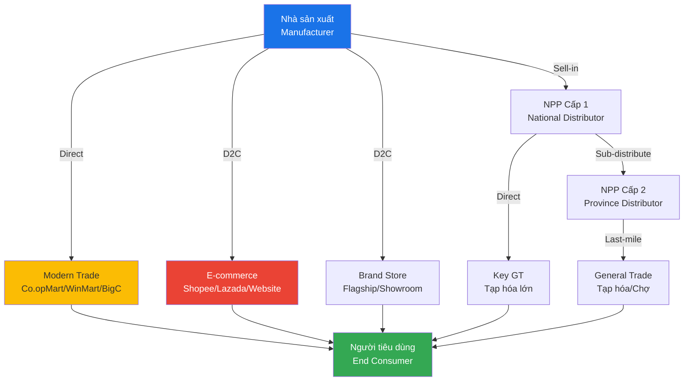
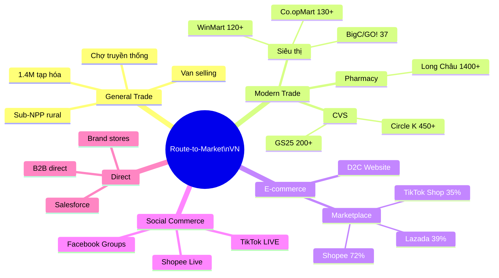

# SA04 — Channel & Distribution

> **Định nghĩa:** Channel & Distribution Strategy là cách thức một doanh nghiệp đưa sản phẩm/dịch vụ từ nhà sản xuất đến tay người tiêu dùng cuối — bao gồm việc lựa chọn kênh phân phối, quản lý đối tác trung gian, thiết kế cấu trúc route-to-market, và giải quyết xung đột kênh để tối ưu độ phủ thị trường và doanh thu.

---

## 1. Định nghĩa & Tầm quan trọng

**Distribution channel** = tập hợp tất cả các tổ chức và cá nhân tham gia vào quá trình đưa sản phẩm từ nhà sản xuất đến người tiêu dùng.

**Tầm quan trọng chiến lược:**
- **Distribution = Competitive Advantage:** P&G, Unilever tại VN không thắng vì sản phẩm tốt hơn — họ thắng vì distribution mạnh hơn (có mặt ở mọi góc đường)
- **Coverage drives revenue:** Bán hàng không thể xảy ra nếu khách không thấy/không tiếp cận được sản phẩm
- **Channel determines price:** Mỗi trung gian thêm một lớp margin → ảnh hưởng đến giá cuối
- **Route-to-market flexibility:** Channel đúng giúp penetrate thị trường nhanh hơn xây direct force

**Thực tế VN:**
- ~1.4 triệu cửa hàng tạp hóa/bán lẻ truyền thống (general trade)
- Modern trade (siêu thị, CVS): ~10,000 điểm bán lớn nhỏ
- E-commerce: 55M+ người mua online
- Distribution landscape VN vẫn rất phức tạp và phân mảnh so với Singapore, Thailand

---

## 2. Lịch sử & Nguồn gốc

**Evolution của Distribution:**
```
Pre-industrial:  Direct selling, traveling merchants, barter markets
1800s:           Wholesale trading houses, railroad distribution
1900s:           Department stores, manufacturer's representatives
1950s-60s:       Supermarket chain, franchise model (McDonald's 1940s)
1970s-80s:       Walmart effect — retail consolidation, power shift to retailers
1990s:           Just-in-time supply chain, EDI (Electronic Data Interchange)
1999:            Amazon marketplace — channel disruption begins
2005+:           Omnichannel, multichannel strategies
2015+:           D2C movement, platform economy (Shopee, Grab)
2020s:           Social commerce, same-day/next-day last-mile
```

**VN Distribution evolution:**
```
Pre-1986:   Kênh nhà nước, phân phối tập trung
1986-2000:  Chợ truyền thống + tạp hóa phát triển mạnh
1990s:      FDI vào → nhà phân phối hiện đại đầu tiên (P&G, Unilever distributor network)
2000s:      Metro, Big C, Coop Mart → Modern Trade bắt đầu
2010:       Vingroup mua lại Maximark → VinMart
2014:       Shopee, Lazada → e-commerce distribution layer
2016-2020:  Convenience store bùng nổ (Circle K, GS25, Ministop, B's Mart)
2021:       VinCommerce bán cho Masan → WinMart (pivot chiến lược)
2023:       Omnichannel phổ biến: GT + MT + E-commerce + Social commerce
```

---

## 3. Các khái niệm cốt lõi

### Kênh phân phối theo cấp độ (Channel levels):

```
Level 0 (Direct):
  Nhà sản xuất → Người tiêu dùng
  Ví dụ: Apple Store, D2C website, cửa hàng công ty
  Margin: Cao nhất | Control: Tối đa | Scale: Chậm

Level 1 (1 trung gian):
  Nhà sản xuất → Retailer → Người tiêu dùng
  Ví dụ: Nike bán qua FPT Shop, Vinamilk qua WinMart
  
Level 2 (2 trung gian):
  Nhà sản xuất → Wholesaler → Retailer → Người tiêu dùng
  Ví dụ: Sabeco → Nhà phân phối → Quán bia
  
Level 3 (3 trung gian):
  Nhà sản xuất → Distributor → Sub-distributor → Retailer → User
  Ví dụ: Masan → NPP cấp 1 → NPP cấp 2 → Tạp hóa → Khách
  (Phổ biến tại vùng sâu vùng xa VN)
```

### Loại trung gian:

| Loại | Mô tả | Sở hữu hàng? | Margin | VN Example |
|---|---|---|---|---|
| **Distributor** | Mua từ nhà sản xuất, phân phối lại | Có | 10-25% | NPP của Masan, Vinamilk |
| **Wholesaler** | Mua bulk, bán lại nhỏ lẻ hơn | Có | 5-15% | Chành hàng, đại lý cấp 2 |
| **Retailer** | Bán trực tiếp cho end consumer | Có | 20-40% | WinMart, Circle K, tạp hóa |
| **Agent/Broker** | Không sở hữu hàng, hưởng commission | Không | 3-8% | Đại lý bất động sản, xuất khẩu |
| **VAR (Value-Added Reseller)** | Thêm service/integration vào sản phẩm | Thường có | 20-40% | IT VAR (FPT Synnex, Viettel IDC) |
| **Franchise** | Mô hình nhượng quyền | Có thể | Royalty % | KFC, Highlands Coffee franchise |
| **OEM** | Sản xuất dưới brand khác | Có | Negotiated | Foxconn cho Apple |

### GT vs MT — VN Specific:

**General Trade (Thương mại truyền thống):**
- Tạp hóa, ki-ốt, chợ, tiệm tạp hóa lề đường
- ~1.4 triệu điểm bán trên toàn VN
- Chiếm ~65% doanh thu FMCG tại VN
- Thanh toán: Chủ yếu tiền mặt, mua ngay trả ngay
- Quyết định mua: Cảm xúc, quen, gần nhà

**Modern Trade (Thương mại hiện đại):**
- Siêu thị (Co.opMart, WinMart, BigC/GO!), Hypermarket
- Convenience Store (Circle K, GS25, Ministop, B's Mart, 7-Eleven)
- Drug store (Pharmacity, Long Châu, An Khang)
- ~10,000 điểm bán, chiếm ~35% FMCG revenue VN (đang tăng)
- Thanh toán: Card, QR, digital
- Buyers: Educated, budget-conscious, value-seeker

**Thế lực tại MT VN (2024):**
```
Hypermarket:
  GO!/BigC (Central Group): 37 stores
  AEON Mall: 7 stores (expanding)
  MM Mega Market: 20 stores
  
Supermarket:
  Co.opMart: 130+ stores (largest VN)
  WinMart: 120+ stores (Masan)
  Mega Market, BHX: Local chains
  
Convenience Store:
  Circle K: 450+ stores
  GS25: 200+ stores
  Ministop: 150+ stores
  B's Mart: 100+ stores (Thai-owned)
  7-Eleven: 80+ stores (đang mở rộng)
  
Pharmacy:
  Long Châu (FPT Retail): 1,400+ stores (fastest growing)
  Pharmacity: 900+ stores
  An Khang (MWG): 500+ stores
```

---

## 4. Mô hình & Framework chính

### 4.1 Route-to-Market (RTM) Framework

**RTM** = cách thức cụ thể một công ty đưa sản phẩm đến end consumer, bao gồm:
- Ai bán (sales force: in-house vs third party)
- Qua kênh nào (GT, MT, e-commerce, direct)
- Bao phủ như thế nào (coverage model)
- Giá bán ở mỗi cấp như thế nào (price architecture)

**RTM Design Framework:**
```
Step 1: Define target consumer & where they shop
Step 2: Map current distribution coverage (coverage heatmap)
Step 3: Identify gaps vs target
Step 4: Design channel mix (GT%, MT%, online%)
Step 5: Define NPP/distributor structure
Step 6: Design coverage model (direct vs sub-distributor)
Step 7: Set price architecture per channel
Step 8: Design performance management system (KPI, scorecard)
```

### 4.2 Channel Strategy Matrix (BCG-inspired)

```
                HIGH Market Attractiveness
                        |
     Invest heavily  |  Lead with partners
     (Direct sales)  |  (JV or premium partner)
                     |
LOW  ─────────────── + ────────────────── HIGH
Competitive          |
Advantage            |
     Selective       |  Harvest or exit
     distribution    |  (divest channels)
                        |
                LOW Market Attractiveness
```

### 4.3 POEM Channel Model (Paid/Owned/Earned)

Trong context digital distribution:
- **Paid:** Ads channels (Facebook Ads, Google Shopping, Shopee Ads)
- **Owned:** Website, app, email list, Zalo OA
- **Earned:** Organic search, word-of-mouth, UGC, press

### 4.4 Distributor Management Framework

**4 dimensions của distributor performance:**
1. **Commercial:** Doanh số, thị phần, coverage, stock level
2. **Financial:** Thanh toán đúng hạn, credit health, AR aging
3. **Capability:** Sales force size, vehicle, warehouse, system
4. **Strategic alignment:** Commitment to brand, exclusivity, investment

---

## 5. Quy trình thực hiện — Channel Build & Management

### Giai đoạn 1: Channel Strategy Design

**Market mapping:**
```
□ Xác định: Ai là target consumer, họ mua ở đâu?
□ Research: Coverage hiện tại của mình vs competitor
□ Gap analysis: Khu vực nào mình yếu/đối thủ mạnh?
□ Channel potential: Online đang chiếm bao nhiêu %?
□ Decision: GT focus, MT push, hay online-first?
```

**Channel mix decision:**
| Yếu tố | GT Focus | MT Focus | Online Focus |
|---|---|---|---|
| Sản phẩm | FMCG, impulse buy | Packed goods, planned | All, đặc biệt high-research |
| Consumer | Rural, tier 2-3 | Urban, middle class | Digital savvy, all tiers |
| Product margin | Cần cao để bù cost | Moderate | Cần cao (logistics) |
| Stage | Established | Growth | All stages |
| VN example | Đồng bằng, nông thôn | HCM, HN inner | Gen Z, online-native |

### Giai đoạn 2: Distributor Selection

**NPP Selection Criteria (VN):**
```
Tiêu chí bắt buộc:
□ Warehouse capacity phù hợp
□ Delivery fleet (xe tải, xe máy) đủ coverage area
□ Sales force size phù hợp với địa bàn
□ Financial health: không nợ xấu, đủ vốn working capital
□ Không có conflict of interest (không phân phối đối thủ trực tiếp)

Tiêu chí cộng thêm:
□ Quan hệ tốt với channel trong địa bàn
□ Có kinh nghiệm ngành liên quan
□ Technology: dùng phần mềm quản lý đơn hàng
□ Track record với nhà cung cấp trước
```

**Hợp đồng NPP phải có:**
- Địa bàn phân phối (territory) rõ ràng
- Mục tiêu doanh số tối thiểu (performance threshold)
- Điều khoản độc quyền/không độc quyền
- Price architecture và margin cố định
- KPI và review period
- Điều khoản chấm dứt hợp đồng

### Giai đoạn 3: Distribution Coverage Model

**Coverage metrics:**
- **Numeric Distribution (ND):** % stores có bán ít nhất 1 SKU của mình / Total stores
- **Weighted Distribution (WD):** % stores có bán tính theo trọng số doanh thu (có mặt ở cửa hàng lớn = weight cao hơn)
- **SKU per store:** Trung bình bao nhiêu SKU/cửa hàng

**Coverage model options:**

| Model | Mô tả | Phù hợp |
|---|---|---|
| **Direct Sales** | Rep của công ty thăm store trực tiếp | High-value channel, key accounts |
| **NPP managed** | NPP chịu trách nhiệm toàn bộ territory | Mass market, rural areas |
| **Hybrid** | Direct cho MT + key GT, NPP cho mass GT | Phổ biến nhất tại VN |
| **Sub-distributor** | NPP → Sub-NPP → stores | Remote areas, tier 4-5 |

### Giai đoạn 4: Channel Performance Management

**NPP Scorecard (monthly review):**
```
Revenue Performance (40%):
  □ Sell-in vs target: ____%
  □ Sell-out vs target: ____%
  □ SKU coverage vs target: ____%

Distribution Quality (30%):
  □ Numeric Distribution: ____%
  □ Weighted Distribution: ____%
  □ Out-of-stock rate: ____%
  □ Perfect Store execution: ____%

Financial Health (20%):
  □ Payment on time: Yes/No
  □ AR aging: __ days (target <30 days)
  □ Credit limit utilization: ____%

Capability (10%):
  □ Sales force headcount vs target
  □ System adoption (if required)
  □ Training completion
```

**NPP tiering system:**
```
Platinum NPP: Score ≥ 90%, receive highest margin + marketing support
Gold NPP:     Score 75-89%, standard support
Silver NPP:   Score 60-74%, performance improvement plan
At-risk:      Score <60%, warn → exit if không improve
```

---

## 6. Công cụ & Phương pháp

### Distribution Management Tools:

| Công cụ | Chức năng | VN availability |
|---|---|---|
| **SFA (Sales Force Automation)** | Rep route planning, visit tracking, order capture | FieldPower, DMS Pro, MS Dynamics Field |
| **DMS (Distribution Management System)** | NPP inventory, order management, reporting | Sabeco DMS, Vinamilk DMS, commercial systems |
| **Van Selling** | Mobile POS trên xe bán hàng → captur order tại điểm | Phổ biến FMCG |
| **eB2B ordering** | App để nhà bán lẻ order trực tiếp | Telio (VN), VinShop, GiaoHangNhanh B2B |
| **Trade promotion management** | Quản lý chương trình khuyến mãi kênh | CPGvision, Salesforce TPM |

### eB2B Platforms tại VN (disrupting traditional distribution):
- **Telio:** Kết nối nhà sản xuất → cửa hàng tạp hóa, bỏ qua NPP truyền thống
- **VinShop (Masan):** App cho tạp hóa order từ WinMart/NPP của Masan
- **GiaoHangNhanh (GHN) B2B:** Logistics + ordering platform
- **Woowa (Baemin):** Food delivery B2B supply chain
- **KiotViet:** POS + inventory management cho tiệm tạp hóa → data leverage

---

## 7. KPI & Đo lường

### Distribution KPIs:

**Coverage Metrics:**
| KPI | Formula | Target |
|---|---|---|
| **Numeric Distribution** | # stores có sản phẩm / Total target stores | >80% (mass FMCG) |
| **Weighted Distribution** | Có theo trọng số volume store | >70% |
| **SKUs per outlet** | Total SKUs across outlets / # outlets | Theo brand strategy |
| **Out-of-stock rate** | Stores OOS / Total stores visited | <5% |
| **Perfect Store %** | Stores đạt full compliance / Total | >60% |

**Volume Metrics:**
| KPI | Formula | Target |
|---|---|---|
| **Sell-in** | Volume shipped từ factory → NPP | Monthly target |
| **Sell-out** | Volume từ NPP → stores | = Sell-in cho healthy inventory |
| **Inventory days** | NPP stock / daily sell-out rate | 14-21 ngày (FMCG) |
| **Revenue per NPP** | Total NPP revenue / # NPPs | Tăng dần qua năm |

**Efficiency Metrics:**
| KPI | Formula | Target |
|---|---|---|
| **Cost to Serve** | Distribution costs / Revenue | 5-12% tùy ngành |
| **Revenue per sales rep** | Territory revenue / # reps | Growing YoY |
| **Drop size** | Revenue per delivery stop | Tăng dần = more efficient |
| **Fill rate** | Orders filled / Orders placed | >98% |

---

## 8. Rủi ro & Thách thức

### 8.1 Channel Conflict (Xung đột kênh)

**Loại xung đột:**
- **Horizontal conflict:** Hai NPP trong cùng khu vực cạnh tranh nhau (price war)
- **Vertical conflict:** Nhà sản xuất bán thẳng D2C trong khi vẫn có NPP/retailer
- **Multi-channel conflict:** Giá online thấp hơn offline → NPP bị undersell

**Ví dụ VN:**
- Hãng điện tử bán online giá rẻ hơn cửa hàng FPT Shop/TGDĐ → channel conflict
- NPP cấp 1 bán qua ranh giới sang địa bàn NPP khác (cross-territory selling)
- Nhà sản xuất mở flagship store cạnh tranh với dealer của họ

**Quản lý xung đột:**
- Territory agreements rõ ràng (exclusive zone)
- Price parity policy: MAP (Minimum Advertised Price)
- Phân biệt SKU: SKU riêng cho online vs offline
- Transparent communication: Chia sẻ strategy với channel partners

### 8.2 NPP Power Concentration

**Rủi ro:** 1-2 NPP chiếm >50% volume → họ có quá nhiều leverage

**Giải pháp:**
- Không để NPP nào > 30% tổng volume
- Luôn có backup NPP hoặc direct capability
- Contract terms rõ ràng về exclusivity và exit clauses

### 8.3 Last-mile VN

**Thách thức đặc thù:**
- Traffic jam HCM/HN: Giao hàng 1-2 ngày, không phải next-hour
- Địa chỉ không chuẩn: VN địa chỉ không có postal code hệ thống → giao sai
- "Không nhà" delivery: Người nhận thường không ở nhà
- COD: Tiền mặt → risk carrier theft, slow cash cycle

**Giải pháp:**
- GHN, GHTK, ViettelPost network phủ rộng
- Smart lockers (đang test tại HCM)
- Cộng đồng làng/phố = informal last-mile node
- Pickup tại cửa hàng (BOPIS)

### 8.4 Channel Disintermediation

**Trend:** Nhà sản xuất muốn bỏ qua trung gian → conflict với channel partners hiện tại

**VN example:**
- Vinamilk mở D2C website → tension với siêu thị và NPP
- Samsung trực tiếp bán online → FPT Shop lo ngại
- Khi thương hiệu D2C mạnh lên, NPP truyền thống risk losing relevance

---

## 9. Best Practices

1. **Coverage trước, penetration sau:** Trước tiên có mặt ở nhiều điểm, sau đó tăng SKU và volume/store
2. **NPP as partner, not just vendor:** Đầu tư training, tools, business planning cho NPP → họ đầu tư lại cho brand
3. **Data visibility:** NPP phải share sell-out data (không chỉ sell-in) để manage inventory đúng
4. **Perfect Store execution:** Define chuẩn display, planogram, POSM cho mỗi channel → consistent brand experience
5. **Trade promotion effectiveness:** Measure ROI của mỗi promotion → không làm promotion mù quáng
6. **Price architecture discipline:** Giữ margin cho mọi channel player → sustainable ecosystem
7. **Sub-NPP development:** Cho vùng rural, sub-NPP là cách duy nhất để reach last-mile
8. **eB2B adoption:** Encourage retailer order qua app → data, efficiency, direct relationship
9. **Channel separation:** Giữ GT và MT tách biệt về price, SKU, promotion để tránh conflict
10. **Quarterly business planning với top NPPs:** Co-create sales plan, allocate resources → shared accountability

---

## 10. Sai lầm phổ biến

| Sai lầm | Biểu hiện | Hậu quả | Giải pháp |
|---|---|---|---|
| Sell-in ≠ Sell-out | NPP có hàng nhưng không bán được | NPP overstock, mất cash flow → request returns | Track sell-out data weekly |
| Quá nhiều NPP | Territory bị chia quá nhỏ | NPP không profitable → không đầu tư | Optimize territory sizing |
| Quá ít NPP | 1 NPP/tỉnh lớn | NPP có quá nhiều leverage, service kém | Add NPP khi territory too large |
| Ignore MT | Focus GT quá nhiều | Mất shelf space tại modern trade | Balance GT+MT investment |
| Price leakage | NPP bán giá thấp hơn MAP | Phá giá thị trường, channel conflict | Enforce MAP, monitor pricing |
| No sell-out tracking | Chỉ track sell-in | Không biết thực tế market | Implement sell-out reporting |
| Promotion không đo ROI | Trade promotion bulk spending | Waste, no learning | Pre/post analysis mỗi promotion |

---

## 11. Case Study VN — Masan Consumer RTM Expansion

**Công ty:** Masan Consumer Holdings — Tập đoàn FMCG nội địa lớn nhất VN (thương hiệu: Chinsu, Nam Ngư, Kokomi, Omachi, Wake-up 247, Vinacafé)

**Tình huống:** Masan muốn expand từ GT-heavy sang omnichannel và tăng thị phần MT sau khi thâu tóm VinCommerce (WinMart).

**RTM Challenge:**
- GT chiếm 70% revenue nhưng tốn kém để reach (1.4M cửa hàng, phân tán)
- MT đang tăng nhanh → cần MT strategy riêng
- Online: Chưa có presence mạnh

**Chiến lược RTM của Masan:**

**1. The Point of Life Strategy:**
- Masan Vision: Serve 30M+ consumers qua WinMart + WiN ecosystem
- WinMart (1,200+ stores) = modern trade channel riêng → không phụ thuộc external retailer
- WiN app = digital loyalty layer kết nối tất cả touchpoints

**2. GT Transformation:**
- VinShop app: Tạp hóa order hàng qua app → trực tiếp không qua NPP truyền thống
- >100,000 tạp hóa đã dùng VinShop (2023)
- Data leverage: Biết sell-out của từng tạp hóa → optimize inventory, promotion

**3. NPP Network Optimization:**
- Consolidated từ nhiều NPP sang "master distributor" mạnh hơn, ít hơn
- Joint business planning: Masan + NPP co-plan quarterly
- Digital tools: NPP dùng DMS để manage sub-distributor và route

**4. MT Push:**
- WinMart: Ưu tiên shelf space và promotion cho Masan brands (captive channel)
- External MT: BigC, Co.opMart, AEON — dedicated Key Account Manager
- Promoter team: 1,000+ promoters at MT stores

**5. E-commerce Integration:**
- Shopee Mall + Lazada official store
- TikTok Shop cho một số brands (Chinsu, Omachi)
- Quick Commerce: WinMart Express + GHN cho same-day delivery

**Kết quả (FY2023):**
- Revenue: ~31,000 tỷ VND
- MT channel tăng từ 25% lên 35% tổng revenue trong 3 năm
- eB2B (VinShop) reach: 100K+ tạp hóa connected
- WinMart: 1,200 stores → captive channel advantage duy nhất trong ngành FMCG VN

**Bài học:**
- Vertical integration (own retail) = ultimate channel control
- Digital + traditional hybrid: VinShop + NPP truyền thống cùng tồn tại
- Data từ sell-out là asset chiến lược
- "Masan Point of Life" — eco-system approach: food + finance + entertainment qua 1 platform

---

## 12. Case Study quốc tế — Nike Direct-to-Consumer Pivot

**Bối cảnh (2017):** Nike phân phối qua 30,000+ wholesale partners (Foot Locker, JD Sports, Amazon). Margin thấp, brand experience inconsistent, data của customer bị mediated.

**Nike DTC Strategy "Consumer Direct Offense":**
1. **Cut wholesale partners:** 2017: 30,000 partners → 2022: <40 strategic partners
2. **Invest in Nike.com + App:** Nike SNKRS app, Nike Training Club app → direct consumer relationship
3. **Nike Direct stores:** Nike flagship concept stores với premium experience
4. **NikePlus membership:** 160M+ members → data, personalization, exclusive access
5. **Digital-first supply chain:** Demand sensing từ app data → faster replenishment

**Kết quả:**
- DTC revenue: 2017: 27% → 2023: 44% of total ($21B DTC của total $51B revenue)
- Digital sales: 26% of DTC (tăng từ <10% trước 2020)
- Full-price selling rate: Tăng (ít phụ thuộc discount tại wholesale)
- Customer data: 160M+ members với full purchase history

**Nhưng có trade-off:**
- Mất $10B revenue từ wholesale bị cut
- Foot Locker share price giảm 30% khi Nike announced reduction
- Some consumers still prefer multi-brand shopping

---

## 13. So sánh với phương pháp khác

| Channel Model | Time to Market | Control | Cost | Data | Scalability |
|---|---|---|---|---|---|
| **Direct (D2C)** | Chậm | Tối đa | Cao (setup) | Tối đa | Moderate |
| **Exclusive Distributor** | Nhanh | Trung bình | Thấp | Hạn chế | Tốt |
| **Non-exclusive Multi-NPP** | Nhanh nhất | Thấp | Thấp nhất | Rất ít | Cao |
| **Selective Distribution** | Trung bình | Trung cao | Trung bình | Trung bình | Tốt |
| **Franchise** | Trung bình | Cao (standards) | Thấp (capex) | Moderate | Rất cao |
| **Online Marketplace** | Nhanh nhất | Thấp | Variable | Hạn chế | Rất cao |

---

## 14. Ứng dụng theo ngành

### FMCG (Hàng tiêu dùng nhanh):
- **GT dominant:** Mỗi SKU phải có mặt trong tối đa số tạp hóa
- **Van selling:** Xe bán hàng đến từng hẻm, từng tổ dân phố
- **Wholesaler layer:** Quan trọng để reach rural areas
- **MT push:** Planogram, POSM, off-shelf display
- **KPI:** Numeric distribution >80%, out-of-stock <3%

### Dược phẩm:
- **Medical Rep (MR):** Thăm bác sĩ/bệnh viện để prescription-driving
- **Nhà phân phối dược:** Phải có điều kiện bảo quản (nhiệt độ, độ ẩm)
- **Kênh nhà thuốc:** Long Châu, Pharmacity, An Khang vs nhà thuốc độc lập
- **Hospital channel:** Đấu thầu bệnh viện — quy trình phức tạp, margin cao

### Công nghệ/IT:
- **VAR (Value-Added Reseller):** Integrate, customize, support
- **System Integrator:** Bundle với services
- **ISV (Independent Software Vendor):** Software trên marketplace của AWS, Azure
- **Partner tiers:** Silver/Gold/Platinum với training, margin, MDF (Market Development Fund)

### Bất động sản:
- **Sàn giao dịch BĐS:** License-required, earn 1-2% commission
- **Môi giới cá nhân:** Đông nhất, không được đào tạo nhiều
- **CRM platforms:** Proptech VN — batdongsan.com.vn, Cen Land, DKRA

### Nông nghiệp / Agricultural:
- **Logistics thách thức:** Cold chain cho nông sản tươi
- **Trung gian nhiều lớp:** Nông dân → thương lái → đại lý → siêu thị → consumer
- **Agri-platforms đang disrupt:** Mimosa, Foodmap, Agrimart, Harvest Moon

---

## 15. Ứng dụng theo quy mô doanh nghiệp

### Startup / Early Stage:
- **Phase 1:** Founder direct sells, test 1-2 channels
- **Phase 2:** 1-2 NPP cho pilot territory, measure performance
- **Phase 3:** Scale NPP network, add MT if relevant
- **Avoid:** Quá nhiều channel quá sớm → spread thin, poor execution

### SME:
- **Focus:** 1 channel well > 3 channels poorly
- **Hybrid thực tế:** NPP cho GT + Shopee/Lazada cho online
- **Investment:** SFA tool đơn giản, weekly NPP call, monthly review
- **Key hire:** Distribution/Trade Marketing Manager

### Doanh nghiệp lớn:
- **Full omnichannel:** GT + MT + E-commerce + International
- **Dedicated teams:** Key Account Management, Trade Marketing, Field Force
- **Technology:** DMS, SFA, eB2B ordering, analytics platform
- **Revenue by channel report:** Rõ ràng contribution và profitability mỗi kênh

---

## 16. Công nghệ & Digital Tools

### Distribution Tech Stack:

**Field Sales / Route Planning:**
```
- SFA (Sales Force Automation): FieldPower VN, Dynamics 365 Field Service
- Route optimization: Route4Me, OptimoRoute
- GPS tracking: Garmin Fleet, Google Fleet Management
- Mobile ordering: Custom apps + cloud backend
```

**NPP/Distributor Management:**
```
- DMS (Distribution Management System):
  VN-made: Vinamilk internal, Sabeco internal
  International: Ivy DMS, Daisy, ChannelSight
- B2B e-commerce: Telio, VinShop, Nhanh.vn
- Payment: VietQR, bank transfer integrated
```

**Analytics:**
```
- Market share tracking: NielsenIQ (VN: Nielsen retail audit)
- Sales analytics: PowerBI, Tableau
- Inventory optimization: Blue Yonder, Oracle SCM
```

### eB2B Revolution tại VN:

**Telio (USD 60M+ funding):**
- Platform kết nối nhà sản xuất/NPP → tạp hóa
- Bỏ qua 1-2 lớp trung gian → giá rẻ hơn cho tạp hóa
- Credit cho tạp hóa (BNPL B2B) → sticky
- >200,000 tạp hóa registered

**VinShop (Masan):**
- Integrated với WinMart supply chain
- Tạp hóa order → giao từ WinMart local hub trong 4-6 giờ
- Loyalty points, credit, digital payment

**GiaoHangNhanh (GHN) B2B:**
- Logistics backbone → expanding to B2B ordering
- Already have 1M+ B2C customers → leverage for B2B

---

## 17. Tích hợp với các domain khác

```
Distribution ←→ Supply Chain (SCM):
  Demand signal từ distributor → production planning
  Inventory levels tại NPP → replenishment trigger
  Logistics: Last-mile delivery execution

Distribution ←→ Marketing:
  Trade Marketing: In-store display, promotion, POSM
  Consumer promotions tăng sell-through
  Category management với MT buyers

Distribution ←→ Finance:
  NPP credit management, AR collection
  Channel profitability analysis (contribution per channel)
  Trade promotion ROI, spend allocation

Distribution ←→ Sales:
  Sales targets by channel, territory, NPP
  Field force managing NPP relationships
  Key Account Management cho MT

Distribution ←→ Technology/IT:
  DMS, SFA implementation
  Data integration: factory → NPP → retailer → consumer
  eB2B platform development/adoption
```

---

## 18. Xu hướng & Tương lai

### 2024-2030 Distribution Trends:

**1. eB2B sẽ reshape GT distribution:**
- Telio, VinShop, Grab Mart B2B — trực tiếp với tạp hóa, bỏ sub-NPP
- Tạp hóa "thông minh" hơn: Có màn hình ordering, track inventory
- Data từ tạp hóa = gold mine cho brand

**2. Quick Commerce (Q-commerce):**
- GHN Express, Be Delivery, Shopee Xpress: Giao trong 30 phút - 2 giờ
- Dark stores: Kho nhỏ đặt trong thành phố → fulfill quick commerce
- Category: Pharmacy, FMCG, F&B → ngày càng rộng

**3. Social commerce as distribution:**
- TikTok Shop = new distribution channel
- Creator economy: Influencer như "distributor" cho brand (TikTok affiliate)
- Live selling: Kho → live stream → fulfillment

**4. Sustainability trong logistics:**
- Electric vehicle last-mile (EV motorbike tại VN)
- Consolidated delivery (nhiều brand, 1 chuyến)
- Packaging reduction → less waste, lower cost

**5. AI in Supply Chain:**
- Demand forecasting AI: Giảm overstock và stockout
- Route optimization: AI tối ưu giao hàng real-time
- Price optimization: Dynamic pricing theo inventory và demand

**6. Regionalization:**
- VN đặc biệt: Không thể one-size-fits-all
- HCM: Online + MT strong
- Hà Nội: MT + mixed
- Regional cities (Đà Nẵng, Cần Thơ): GT still dominant
- Rural: Sub-NPP essential, connectivity improving

---

## 19. Bối cảnh Việt Nam đặc thù

### VN Distribution Landscape — Unique Factors:

**1. Tạp hóa — backbone của GT:**
- 1.4 triệu cửa hàng tạp hóa = kênh không thể bỏ qua
- Chủ tạp hóa thường là phụ nữ, quyết định mua theo cảm xúc + relationship
- ROI của POSM/PG (Promoter Girl) tại tạp hóa = rất cao
- "Hàng ở đây" — Placement và visibility quan trọng hơn advertising

**2. Last-mile challenges:**
- Địa chỉ VN không chuẩn → tỷ lệ giao sai/phải gọi điện cao
- Traffic jam → delivery cost cao, time unpredictable
- Building density cao → khó park, giao từng tầng
- Rural: Đường xấu, xa → chỉ xe máy reach được

**3. Seasonal demand spikes:**
- Tết: Volume tăng 300-500% trong 1 tháng → phải pre-build inventory
- Mùa hè: Nước giải khát, bia, kem — volume spike
- Back to school: Stationery, electronics
- → Distribution system phải flex theo seasonal demand

**4. Cash economy:**
- Nhiều NPP và tạp hóa vẫn giao dịch tiền mặt
- Rủi ro tiền giả, theft, accounting errors
- Đang chuyển dần sang QR + bank transfer nhưng chậm hơn urban

**5. Relationship selling trong kênh:**
- Rep → tạp hóa chủ: Quan hệ cá nhân quyết định shelf space
- Quà Tết, thăm hỏi = investment quan trọng không thua gì pricing
- "Người quen của mình" = ưu tiên đặt hàng dù giá chênh

**6. Multi-level NPP complexity:**
- HCM: 1 NPP cấp 1 → 5-10 sub-NPP → 2,000+ tạp hóa
- Mekong Delta: Cần 3-4 lớp sub-NPP
- Phức tạp management, data visibility kém
- eB2B đang simplify nhưng còn lâu dài

**7. Luật & Quy định:**
- Luật Thương Mại 2005: Quy định hợp đồng đại lý, phân phối
- Nghị định 35/2006/NĐ-CP: Hoạt động nhượng quyền thương mại
- Luật Cạnh Tranh 2018: Chống distribution exclusivity abuse
- Thuế: VAT trên mỗi giao dịch trong kênh, hóa đơn điện tử bắt buộc

---

## 20. Checklist thực hành

### Annual Channel Planning Checklist:
```
□ Review previous year performance by channel
□ Update market coverage map (GT/MT/online)
□ Identify new territory opportunities
□ NPP review: Which to upgrade/downgrade/exit/add?
□ Price architecture review — still competitive?
□ Trade promotion budget allocation by channel
□ Key Account targets for MT
□ Online channel (Shopee/Lazada) GMV target
□ Social commerce investment (TikTok Shop)
□ Technology upgrade: SFA, DMS, eB2B
□ Field force headcount planning
□ Training calendar for NPP sales force
```

### NPP Onboarding Checklist:
```
□ Due diligence: Financial health, warehouse, fleet
□ Contract signed: Territory, targets, margins, terms
□ System setup: DMS access, ordering platform
□ Initial inventory: First stock delivery + layout
□ Training: Product knowledge, sales process, system
□ Route planning: Coverage map agreed
□ POSM delivery: Signage, display materials
□ First joint visit: Company rep + NPP rep together
□ Target agreement: Monthly milestones
□ Review schedule: Bi-weekly call, monthly visit
```

---

## 21. Trade Marketing — Kết nối Distribution và Consumer

**Trade Marketing** = hoạt động marketing hướng đến trade channel (NPP, MT buyer) để tăng sell-through đến consumer cuối.

**Trade Marketing activities:**
| Activity | Mục tiêu | Channel |
|---|---|---|
| **POSM (Point of Sale Materials)** | Visibility, impulse buy | All channels |
| **End-cap display** | Premium shelf space | MT |
| **Planogram** | Optimize shelf layout | MT + large GT |
| **Consumer promotion** | Drive trial/volume | Consumer |
| **Trade promotion** | Incentivize trade to push | NPP, MT |
| **PG/Promoters** | In-store sampling, demo | MT, events |
| **Retail audit** | Monitor compliance | Sampling stores |

**Trade Investment phân bổ (ví dụ FMCG VN):**
```
Total Trade Budget: 100%
  NPP margin & incentives:    35%
  MT listing fees & gondola:  20%
  Consumer promotion:         25%
  POSM & display:            10%
  Promoters/PG:               7%
  Activation events:          3%
```

---

## 22. Channel Pricing Architecture

**Price waterfall example (FMCG):**
```
List Price (Giá niêm yết):              100,000 VND
  └─ Trade Discount (chiết khấu):        -10%
     └─ Distributor Price:               90,000 VND
        └─ NPP Margin:                   +15%
           └─ Retail Price (giá bán lẻ): 103,500 VND (~105K)
              └─ Recommended Retail:     110,000 VND (cho consumer)

Margin per player:
  Nhà sản xuất:  40% (từ production cost 60K → list 100K)
  NPP:           15% (từ 90K → sell to retailer at 103K)
  Retailer:      6% (từ 103K → sell to consumer at 110K)
```

**Nguyên tắc price architecture:**
- Mỗi player trong kênh phải có margin đủ sống → sustainable
- Giá cho MT vs GT: MT thường nhận better terms (volume, cash payment)
- Không để NPP bán giá thấp hơn Retailer → channel conflict
- MAP (Minimum Advertised Price) để protect online vs offline

---

## 23. Perfect Store Execution

**"Perfect Store"** = chuẩn hóa cách sản phẩm được trưng bày tại điểm bán.

**Perfect Store elements:**
```
AVAILABILITY:
□ Không OOS (Out of Stock) bất kỳ SKU nào trong core range
□ Đúng số lượng stock tối thiểu (par stock)

VISIBILITY:
□ Đúng shelf position (eye-level for premium SKUs)
□ Đủ số facing (tối thiểu 2-3 facing/SKU)
□ POSM đúng vị trí và không bị rách/bẩn

PRICE:
□ Giá đúng như MAP
□ Price tag/shelf talker hiển thị rõ

PROMOTION:
□ Promotion hiện hành được execute đúng
□ Off-shelf display cho promotion items

FRESHNESS:
□ Stock rotation (FIFO — First In First Out)
□ Không có sản phẩm hết date hoặc gần hết date
```

**Perfect Store KPI:**
- % stores đạt full Perfect Store compliance
- Tracked qua: Field audit (manual) hoặc AI photo audit (emerging)

---

## 24. International Distribution — Export từ VN

**VN manufacturers muốn export:**

**Export channels:**
1. **Direct export:** Nhà máy → Importer/Distributor nước ngoài
2. **Trading company:** Thông qua export trading house
3. **E-commerce cross-border:** Shopee Xuyên Biên Giới, Amazon Launchpad
4. **Franchise/Licensing:** Brand VN nhượng quyền (Highlands Coffee đang expand)

**VN products đang export thành công:**
- Cà phê: Trung Nguyên, Vinacafé → 40+ quốc gia
- Thủy sản: Minh Phú Shrimp → Global seafood distributors
- Nước mắm Phú Quốc: PDO protected, premium international
- Đồ thủ công mỹ nghệ: Amazon, Etsy (DTC)

**Thách thức export:**
- Brand building tại thị trường mới = tốn kém
- Regulatory compliance (FDA cho US, EU regulations)
- Logistics cost từ VN ra quốc tế còn cao
- Currency risk: USD/EUR volatility

---

## 25. Partner Program Design

**Cho technology/B2B companies:**

**Partner tiers:**
```
Registered Partner:
  - Access to: Basic training, partner portal
  - Benefit: Standard margin
  - Requirement: Complete 1 certification

Silver Partner:
  - Access to: Marketing co-op fund (MDF)
  - Benefit: +5% margin, leads
  - Requirement: 2 certified staff, 3 deals/quarter

Gold Partner:
  - Access to: Joint business planning, dedicated PAM
  - Benefit: +10% margin, priority leads, events
  - Requirement: 4 certified, 8 deals/quarter, business plan

Platinum Partner:
  - Access to: Executive access, custom support
  - Benefit: +15% margin, exclusive territory
  - Requirement: 8 certified, 20 deals/quarter, $1M+ revenue
```

**MDF (Market Development Fund):**
- Pool tiền từ vendor dành cho partner marketing activities
- Claim-based: Partner thực hiện activity → submit claim → reimburse
- Activities: Events, webinars, content, ads, demo equipment

---

## 26. Franchise Model — Distribution at Scale

**Franchise = channel distribution model:**

**Franchise structure:**
```
Franchisor (thương hiệu gốc):
  → Brand license
  → Operations manual
  → Training
  → Supply chain (nguyên liệu)
  → Marketing support
  → Quality control audit

Franchisee (người nhận nhượng quyền):
  → Trả initial fee (100M - 1B VND tùy brand)
  → Trả royalty fee (3-8% revenue/tháng)
  → Tuân thủ standards
  → Vận hành địa điểm
  → Marketing local
```

**VN Franchise examples:**
| Brand | Segment | Initial fee | Stores VN |
|---|---|---|---|
| Highlands Coffee | F&B | 3-5B VND | 700+ |
| The Coffee House | F&B | 2-3B VND | 160+ |
| Bún bò Huế 2002 | F&B | 150-300M | 100+ |
| KFC | QSR | $40K-50K USD | 180+ |
| 7-Eleven VN | Convenience | Contact | 80+ |
| Kumon | Education | 200-500M | 300+ |

---

## 27. Distribution Cost Management

**Cost to Serve (CTS) analysis:**

**Components of distribution cost:**
```
Fixed costs:
  NPP margin:              8-15% of revenue
  Field force salary:      2-4% of revenue
  DMS/SFA system:          0.5-1%
  
Variable costs:
  Logistics/delivery:      3-8%
  Trade promotion:         5-10%
  POSM:                    1-2%
  Returns & damages:       1-3%
  
Total distribution cost:  20-40% of revenue (varies widely by industry)
```

**Tối ưu distribution cost:**
1. Increase drop size: Giao ít chuyến, nhiều hàng hơn
2. Optimize delivery routes: AI routing
3. eB2B ordering: Giảm order processing cost
4. Reduce returns: Better demand forecasting
5. SKU rationalization: Bỏ slow movers → focus high-turn products

---

## 28. Sales Force Effectiveness trong Distribution

**Field force management:**

**Rep visit frequency model:**
| Account tier | Visit frequency | # accounts/rep |
|---|---|---|
| A accounts (Top 20%) | 2x/tuần | 30-50 |
| B accounts | 1x/tuần | 80-100 |
| C accounts | 2x/tháng | 150-200 |
| D accounts | NPP-managed | N/A for direct |

**Call Productivity:**
```
Sales Rep daily productivity (FMCG VN):
  Working hours: 8h (7h - 16h)
  Travel + admin: 3h
  Productive selling time: 5h
  Average call time: 20-30 phút
  → 10-15 calls/ngày (A+B accounts)
```

**KPI cho field reps:**
- Calls per day vs target
- Strike rate: % calls result in order
- Order size vs target
- New distribution points opened
- Perfect Store compliance checked

---

## 29. Channel Analytics & Business Intelligence

**Reports cần có để quản lý distribution:**

**1. Distribution Coverage Report (weekly):**
```
Region | # Stores | Stores with product | ND% | Target | Gap
North  | 50,000   | 38,000             | 76% | 80%    | -4%
South  | 70,000   | 61,000             | 87% | 85%    | +2%
Central| 20,000   | 14,000             | 70% | 75%    | -5%
```

**2. NPP Performance Dashboard (monthly):**
- Sell-in vs target (% achievement)
- Sell-out tracking (if data available)
- Inventory days
- Payment status
- Coverage metrics

**3. Market Share Report (via Nielsen):**
- Brand share % per category
- Distribution share vs competitor
- Price index vs competitor
- Promotional activity comparison

**4. Channel Profitability:**
- Revenue by channel
- Gross margin after trade investment
- Net contribution after cost to serve

---

## 30. Go-to-Market Strategy — Comprehensive

**GTM (Go-to-Market) = comprehensive plan ra mắt sản phẩm/thị trường mới:**

### GTM Framework:
```
1. Market Definition
   - Target segment, geography
   - Market size, growth rate

2. Value Proposition
   - Why this product for this segment?
   - Competitive differentiation

3. Channel Strategy
   - Primary channel (GT/MT/online)
   - Channel mix và rationale

4. Pricing Strategy
   - Price point per channel
   - Competitive positioning

5. Distribution Plan
   - NPP selection
   - Territory coverage
   - Timeline (phase-in)

6. Sales & Field Force
   - Team structure
   - Targets per territory
   - Incentive plan

7. Marketing & Trade Support
   - Launch campaign
   - POSM, promotions
   - Advertising

8. Measurement Plan
   - KPIs by phase
   - Review cadence
   - Pivot criteria
```

**GTM phases cho VN market (new product):**
```
Month 1-2:   Key account MT (Co.opMart, WinMart) — flagship launch
Month 2-3:   Urban GT (HCM District 1-7, HN Ba Đình, Hoàn Kiếm)
Month 3-6:   Secondary cities (Đà Nẵng, Cần Thơ, Biên Hòa)
Month 6-12:  Rural expansion via NPP network
Year 2+:     Full national coverage + channel deepening
```

---

## 31. Sub-distributor & Last-mile VN Rural

**Thực tế phân phối nông thôn VN:**

**Mô hình:**
```
NPP cấp 1 (tỉnh/thành phố lớn)
  └─ NPP cấp 2 / Sub-NPP (huyện)
       └─ Đại lý cấp 3 (xã, thị trấn)
            └─ Tạp hóa, chợ xã
                 └─ Người tiêu dùng
```

**Thách thức vùng sâu:**
- Đường xấu → chỉ xe máy reach được (không phải xe tải)
- Thanh toán 100% tiền mặt
- Credit cycle dài hơn (tạp hóa xã bán chịu cho nông dân)
- Volume nhỏ nhưng phân tán rất rộng
- Không có internet ổn định → không dùng được eB2B apps

**Cách tiếp cận:**
- Sub-NPP local có quan hệ tốt với cộng đồng
- Van selling: Xe ba gác, xe máy có thùng thùng đi từng hẻm
- Chợ phiên: Nhiều vùng chỉ có chợ vào ngày nhất định
- Credit-based: Cho nợ theo mùa vụ thu hoạch

---

## 32. Key Account Management (KAM) cho MT

**KAM** = Quản lý các tài khoản khách hàng lớn (siêu thị, CVS chain) với đối xử đặc biệt.

**KAM responsibilities:**
```
Commercial:
  □ Annual business plan với từng KA
  □ Listing mới SKU, delist management
  □ Promotion calendar, pricing alignment
  □ Volume và doanh thu targets

Operational:
  □ Đảm bảo fill rate cao (>98%)
  □ On-shelf availability
  □ Space management, planogram compliance
  □ POSM delivery và maintenance

Relationship:
  □ Regular buyer meetings (monthly/quarterly)
  □ Joint business review hàng quý
  □ Category advisory role
  □ New product introduction planning
```

**Listing fee (phí mở code hàng tại MT VN):**
- Co.opMart: 5-20M VND/SKU/store group
- WinMart: 3-15M VND/SKU
- Circle K: 2-10M VND/SKU + monthly support
- BigC/GO!: 10-30M VND/SKU

---

## 33. Channel Conflict Resolution

**Bước giải quyết channel conflict:**
```
Step 1: Identify và document the conflict
  - Ai với ai? GT vs MT? Online vs offline? NPP vs NPP?
  - Nguyên nhân: Pricing? Territory? SKU?

Step 2: Acknowledge to parties involved
  - Không phớt lờ — conflict tích tụ sẽ explosive
  - Gặp riêng từng bên trước

Step 3: Root cause analysis
  - Giá có vấn đề? Territory không rõ? Policy chưa communicate?

Step 4: Design solution
  - Price parity policy
  - Territory redefinition
  - SKU differentiation
  - Clear communication của policy

Step 5: Communicate and implement
  - Gặp các bên, explain rationale
  - Timeline clear
  - Consequence if violated

Step 6: Monitor compliance
  - Price audit
  - Mystery shopper
  - NPP reporting
```

---

## 34. Environmental Sustainability trong Distribution

**Green Distribution — Xu hướng và áp lực:**

**Áp lực từ:**
- MT buyers (Co.opMart "xanh", WinMart sustainability commitment)
- Consumer ngày càng quan tâm
- ESG reporting requirement cho listed companies

**Initiatives:**
- **Electric vehicles:** Grab đang convert xe ôm sang EV, logistics đang follow
- **Reusable packaging:** Bỏ túi nilon → paper bag, reusable container
- **Consolidated delivery:** Multi-brand delivery thay nhiều chuyến riêng lẻ
- **Solar warehouse:** Kho dùng điện mặt trời
- **Carbon footprint tracking:** Measure và report CO2 per delivery

**VN timeline:**
- 2025: Cấm túi nilon tại siêu thị lớn (đang thực thi dần)
- 2030: Net-zero target của nhiều tập đoàn lớn
- 2050: VN cam kết net-zero carbon

---

## 35. Measurement Framework — Distribution Excellence

**Distribution Maturity Model:**
```
Level 1 — Basic:
  □ Know how many stores you're in (ND tracking)
  □ Monthly sell-in tracking
  □ NPP revenue target

Level 2 — Developing:
  □ Weighted distribution tracking
  □ Out-of-stock monitoring
  □ NPP scorecard (quarterly)
  □ Sell-out data (from key accounts)

Level 3 — Advanced:
  □ Real-time sell-out visibility
  □ Perfect Store tracking (digital audit)
  □ Demand sensing & forecast accuracy
  □ Cost to Serve per channel/customer
  □ NPP financial health monitoring

Level 4 — Excellent:
  □ AI-driven demand forecasting
  □ Dynamic routing optimization
  □ Predictive OOS detection
  □ Market share real-time (Nielsen/IRI)
  □ Full supply chain visibility (farm to fork)
```

---

## 36. Channel Partner Enablement

**Enabling NPP and retail partners:**

**NPP Training program:**
```
Onboarding (Month 1):
  □ Company & product knowledge
  □ Territory briefing & route planning
  □ System training (DMS, ordering app)
  □ Price architecture & discount policy

Ongoing (Monthly):
  □ New product/promotion briefing
  □ Best practice sharing
  □ Market intelligence update

Annual:
  □ Business review
  □ Joint target setting
  □ Sales competition / incentive trip
```

**Retail training (tạp hóa):**
- Đơn giản hơn: Product benefit, how to sell, display tips
- Thường deliver qua field rep khi visit
- Video training ngắn (TikTok style) đang được test

---

## 37. Crisis Management trong Distribution

**Tình huống khủng hoảng distribution VN:**

**Scenario 1: NPP "bể" (phá sản, mất khả năng thanh toán)**
```
Response:
□ Ngay lập tức: Dừng giao hàng, claim tài sản thế chấp (nếu có)
□ Điều tra: Hàng còn trong kho NPP bao nhiêu?
□ Tạm thời: Direct sell cho key GT accounts trong territory
□ 30 ngày: Tuyển NPP mới hoặc chia territory sang NPP lân cận
□ Legal: Thu hồi nợ qua Luật Thương Mại
```

**Scenario 2: Product recall**
```
Response:
□ Alert tất cả channel ngay (email + Zalo + call)
□ Identify affected batches (lot number tracking)
□ NPP pull stock, tạp hóa pull stock
□ Logistics pick up và dispose
□ Consumer communication (hotline, social media)
□ Reimburse channel cho losses
□ Root cause fix + relaunch plan
```

**Scenario 3: Price war from competitor**
```
Response:
□ Monitor: Scope của price war (tạm thời hay chiến lược?)
□ Analyze: Margin của competitor tại mức giá đó (sustainable không?)
□ Decision: Fight (match price), Flight (different SKU), Ignore (value positioning)
□ Communicate: NPP cần guidance rõ ràng
□ Protect: Key accounts priority support
```

---

## 38. International Best Practices áp dụng cho VN

**P&G Distribution Excellence (áp dụng tại VN từ thập 90s):**
- **Van Selling program:** Xe bán hàng direct đến từng tạp hóa
- **Perfect Store standards:** Toàn cầu nhưng localize cho VN (phạm vi, phí)
- **Category Captain:** P&G tư vấn co.opMart về category management
- **Shopper Insights:** Research tại store level → improve conversion

**Unilever Shakti (India) → adaptation VN:**
- **Project Shakti:** Train phụ nữ nông thôn → micro-distributors
- VN adaptation: Đại lý hộ gia đình tại làng, xã → reach last mile
- Works well for: FMCG personal care, nutrition

**Amazon Distribution Innovation:**
- **Fulfillment Centers:** Position gần urban areas → next-day
- **Last Mile Delivery Stations:** Micro-hubs → 2-4 hour delivery
- VN equivalents: GHN Hub, Shopee Xpress, GHTK stations

---

## 39. B2B Distribution Platform Comparison VN

| Platform | Model | GMV/Scale | Advantage | Limitation |
|---|---|---|---|---|
| **Telio** | NPP → Tạp hóa | 200K+ tạp hóa | No middleman, cheaper | Not all brands available |
| **VinShop** | Masan/WinMart → Tạp hóa | 100K+ tạp hóa | Integrated with Masan | Masan products priority |
| **Nhanh.vn** | Multi-channel order mgmt | 50K+ merchants | Omnichannel support | Mostly SME |
| **KiotViet** | POS + inventory cho tạp hóa | 150K+ stores | POS + analytics | Sell-in only |
| **Sapo** | Omnichannel platform | 100K+ stores | Full channel sync | Cost higher |

---

## 40. Distribution Roadmap Planning

**3-Year Distribution Roadmap (ví dụ FMCG):**

**Year 1 — Foundation:**
```
Q1: NPP audit — keep top 70%, exit bottom 30%
Q2: Strengthen HCM + HN coverage (ND >85%)
Q3: Implement SFA for field reps
Q4: eB2B pilot with top 1,000 tạp hóa
Target: ND national = 65%
```

**Year 2 — Expand:**
```
Q1: Secondary cities (Đà Nẵng, Cần Thơ, Biên Hòa, Hải Phòng)
Q2: MT push — enter all national chains
Q3: eB2B rollout national (10,000 tạp hóa)
Q4: Social commerce channel (TikTok Shop, Shopee Live)
Target: ND national = 75%, MT stores = 8,000
```

**Year 3 — Optimize:**
```
Q1: Rural penetration — sub-NPP network for tier 4-5
Q2: Perfect Store program national rollout
Q3: AI demand forecasting implementation
Q4: Sustainability initiative (green packaging, EV last mile pilot)
Target: ND national = 82%, cost to serve -5%
```

---

## Output Formats

### Mermaid — Distribution Channel Flowchart



### Mermaid — RTM Mindmap



---

### Flashcards

**Q1: GT vs MT — sự khác nhau và tỷ lệ VN?**
A: GT (General Trade) = tạp hóa/chợ truyền thống — 65% FMCG revenue VN, 1.4M điểm bán. MT (Modern Trade) = siêu thị/CVS — 35% và đang tăng. GT cần van selling, relationship; MT cần listing fee, planogram, KAM.

**Q2: NPP Scorecard gồm những gì?**
A: 4 dimensions: (1) Revenue (40%) — sell-in/sell-out vs target, (2) Distribution Quality (30%) — ND, WD, OOS rate, Perfect Store, (3) Financial Health (20%) — payment on time, AR aging, (4) Capability (10%) — headcount, system adoption.

**Q3: Channel conflict là gì và 3 loại chính?**
A: Xung đột giữa các channel players. 3 loại: Horizontal (NPP vs NPP cùng khu vực), Vertical (nhà sản xuất vs retailer), Multi-channel (online giá thấp hơn offline). Giải quyết bằng: territory definition, MAP policy, SKU differentiation.

**Q4: Perfect Store là gì?**
A: Chuẩn hóa trưng bày tại điểm bán — gồm: Availability (không OOS), Visibility (đúng shelf position, đủ facing), Price (đúng MAP, có tag), Promotion (execute đúng), Freshness (FIFO, không hết date). Tracked bằng field audit hoặc AI photo.

**Q5: Numeric Distribution vs Weighted Distribution?**
A: ND = % stores có product / total stores (equal weight per store). WD = ND tính theo trọng số volume của store (có mặt ở store lớn = weight cao). WD quan trọng hơn vì reflect thực tế revenue opportunity.

**Q6: eB2B platforms VN đang thay đổi distribution như thế nào?**
A: Telio, VinShop cho phép tạp hóa order trực tiếp từ nhà sản xuất/NPP cấp 1 qua app, bỏ qua sub-NPP. Kết quả: giá rẻ hơn cho tạp hóa, data sell-out real-time, giảm intermediaries. Đang disrupt mô hình sub-NPP truyền thống.

**Q7: Masan Consumer RTM strategy độc đáo ở điểm nào?**
A: Vertical integration chưa từng có: Own WinMart (MT channel) + VinShop (eB2B cho GT) + NPP network + social commerce. "Point of Life" ecosystem: thực phẩm + tài chính + tiêu dùng qua 1 platform. Không phụ thuộc external retailer cho kênh chính.

**Q8: Listing fee là gì và tại sao MT chains tính phí này?**
A: Chi phí nhà cung cấp trả cho MT chain để có shelf space/product code. VN: 2-30M VND/SKU tùy chain. MT tính vì: shelf space có giá trị, họ cần bù risk SKU mới, và listing fee là revenue stream cho họ. Brands phải calculate ROI: sales volume vs listing investment.

**Q9: Cost to Serve bao gồm những gì và tỷ lệ ra sao?**
A: NPP margin (8-15%) + field force (2-4%) + logistics (3-8%) + trade promotion (5-10%) + POSM (1-2%) + returns (1-3%). Total: 20-40% revenue. Tối ưu bằng: tăng drop size, AI routing, eB2B ordering, SKU rationalization.

**Q10: GTM Strategy cho new product tại VN nên bắt đầu từ đâu?**
A: MT flagship launch trước (Month 1-2) → Urban GT HCM/HN (Month 2-3) → Secondary cities (Month 3-6) → Rural national (Month 6-12). Lý do: MT builds brand credibility; GT mass reach follow; không thể reverse (GT trước thì MT không muốn list).

---

### JSON Metadata

```json
{
  "module": {
    "code": "SA04",
    "name": "Channel & Distribution",
    "domain": "Sales",
    "status": "complete",
    "version": "1.0",
    "last_updated": "2026-06-30"
  },
  "topics": [
    "Distribution Channels",
    "GT vs MT VN",
    "Route-to-Market",
    "NPP Management",
    "Channel Conflict",
    "Partner Program",
    "Perfect Store",
    "eB2B Platforms",
    "Last-mile VN",
    "Trade Marketing"
  ],
  "key_frameworks": ["RTM Framework", "Channel Strategy Matrix", "NPP Scorecard", "Perfect Store", "Distribution Maturity Model"],
  "vn_context": [
    "1.4M tạp hóa GT",
    "Luật Thương Mại 2005",
    "Masan Consumer case study",
    "Telio eB2B platform",
    "WinMart/Co.opMart MT landscape",
    "Seasonal Tết demand",
    "Sub-NPP rural model"
  ],
  "related_modules": ["SA01", "SA03", "SA05", "SCM01", "MK02"],
  "difficulty": "Intermediate to Advanced",
  "estimated_read_time_minutes": 110
}
```

---

### Cheat Sheet / Quick Reference

```
╔══════════════════════════════════════════════════════════════╗
║           SA04 — CHANNEL & DISTRIBUTION CHEAT SHEET         ║
╠══════════════════════════════════════════════════════════════╣
║ CHANNEL LEVELS: L0=Direct | L1=+Retailer | L2=+Wholesaler  ║
║ INTERMEDIARIES: Distributor|Wholesaler|Retailer|VAR|Agent   ║
╠══════════════════════════════════════════════════════════════╣
║ VN LANDSCAPE:                                                ║
║  GT: 1.4M tạp hóa = 65% FMCG revenue                      ║
║  MT: 10K+ stores (Co.op 130, WinMart 120, Circle K 450)   ║
║  Online: Shopee 72%, TikTok 35% — growing fast             ║
╠══════════════════════════════════════════════════════════════╣
║ KEY METRICS:                                                 ║
║  ND = #stores with product / total stores                   ║
║  OOS target: <5%  |  Perfect Store: >60%                   ║
║  Inventory days: 14-21 (FMCG)  |  Fill rate: >98%         ║
╠══════════════════════════════════════════════════════════════╣
║ NPP SCORECARD: Revenue(40%)|Distribution(30%)|              ║
║               Finance(20%)|Capability(10%)                  ║
╠══════════════════════════════════════════════════════════════╣
║ CHANNEL CONFLICT TYPES:                                      ║
║  Horizontal (NPP vs NPP) | Vertical (Mfg vs Retailer)     ║
║  Multi-channel (online vs offline)                          ║
║ FIX: MAP policy | Territory | SKU differentiation          ║
╠══════════════════════════════════════════════════════════════╣
║ eBb2B VN: Telio (200K+ tạp hóa) | VinShop (Masan)        ║
╚══════════════════════════════════════════════════════════════╝
```
