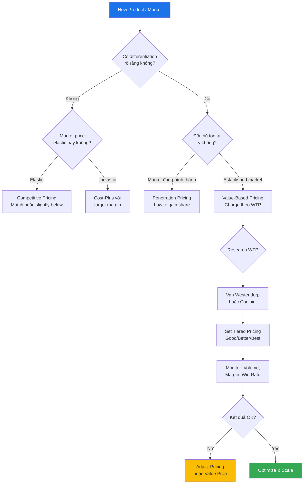
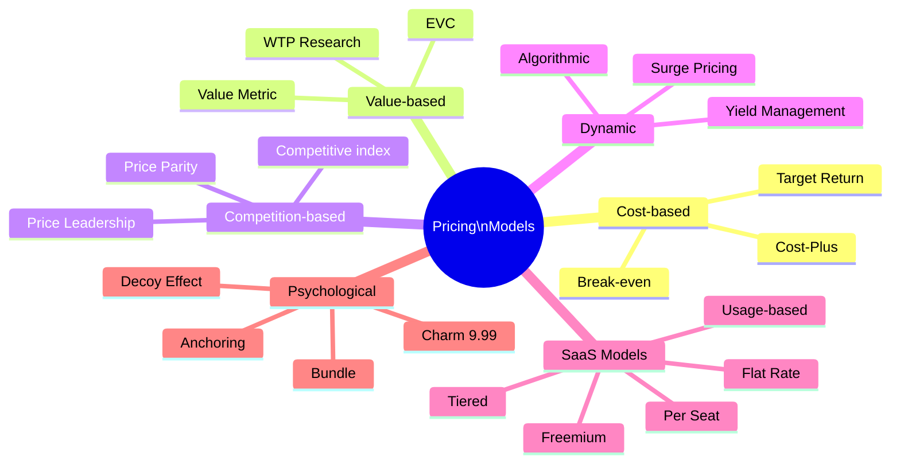

# SA05 — Pricing Strategy

> **Định nghĩa:** Pricing Strategy (Chiến lược định giá) là quá trình xác định mức giá tối ưu cho sản phẩm/dịch vụ nhằm đạt được mục tiêu kinh doanh — bao gồm tối đa hóa doanh thu, lợi nhuận, thị phần, hoặc mục tiêu chiến lược khác — dựa trên phân tích chi phí, giá trị khách hàng, và cạnh tranh thị trường.

---

## 1. Định nghĩa & Tầm quan trọng

**Giá là lever kinh doanh mạnh nhất nhưng ít được tối ưu nhất.**

**McKinsey Research:** Tăng giá 1% → Operating profit tăng 8.7% (so với tăng volume 1% chỉ tăng 3.3%, giảm fixed cost 1% tăng 2.3%).

**Tầm quan trọng của Pricing:**
- Trực tiếp ảnh hưởng đến doanh thu và margin
- Định vị thương hiệu trong tâm trí khách hàng
- Quyết định khách hàng nào bạn phục vụ (segment selection)
- Tín hiệu quan trọng về chất lượng và giá trị

**Pricing Challenges:**
- Giá quá cao → mất khách hàng
- Giá quá thấp → mất lợi nhuận, tổn hại brand
- Giá không nhất quán → mất trust
- Không có strategy → ad-hoc discounting → margin erosion

**Thực tế VN:**
- 70% doanh nghiệp VN dùng cost-plus pricing (giá thành + lợi nhuận mong muốn) — đơn giản nhất nhưng không optimal
- Ít dùng value-based pricing dù mang lại margin cao hơn nhiều
- Luật Cạnh Tranh 2018 và Nghị định 35/2020 quản lý hoạt động định giá

---

## 2. Lịch sử & Nguồn gốc

**Pricing theory evolution:**
```
Ancient times:   Haggling, barter — negotiated price
1776:            Adam Smith — "Wealth of Nations" — price as market mechanism
1890:            Alfred Marshall — Supply & Demand curve, price elasticity
1960s:           Marketing science — 4Ps (Product, Price, Place, Promotion)
1970s-80s:       Conjoint analysis developed — measure WTP scientifically
1976:            Van Westendorp Price Sensitivity Meter developed
1985:            McKinsey Pricing Waterfall framework
1988:            Game theory applications to pricing (Nash equilibrium)
1990s:           Yield management in airlines/hotels → dynamic pricing
2000s:           SaaS pricing models emerge (per seat, subscription)
2010s:           Big data → dynamic/algorithmic pricing (Amazon changes price 2.5M times/day)
2020s:           AI pricing, surge pricing, personalized pricing
```

**VN pricing evolution:**
```
Pre-1986:        State-fixed prices — không có market pricing
1986 Đổi Mới:   Free market pricing bắt đầu
1990s:           FDI mang pricing best practices vào VN
2005:            Luật Thương Mại 2005 — khung pháp lý cho pricing
2012:            Luật Giá 2012 — quản lý giá nhà nước cho một số mặt hàng
2018:            Luật Cạnh Tranh 2018 — chống predatory pricing
2023:            Dynamic pricing Grab/Be — Controversy và regulation discussion
```

---

## 3. Các khái niệm cốt lõi

### Willingness to Pay (WTP)

**WTP** = Mức giá tối đa mà một khách hàng sẵn sàng trả cho một sản phẩm/dịch vụ.

```
WTP của từng phân khúc:
  Premium segment: Sẵn sàng trả 200K/ly cà phê ở Starbucks
  Middle: OK với 50-70K ở Highlands
  Budget: Chỉ trả 15-20K ở xe cà phê vỉa hè

→ Mỗi segment WTP khác nhau → cần differentiated product/pricing
```

**Giá trị kinh tế (Economic Value to Customer — EVC):**
```
EVC = Reference price + Positive differentiation value - Negative differentiation value

Ví dụ phần mềm quản lý kho:
  Reference: Đối thủ tốt nhất giá 3M/tháng
  + Positive: Tích hợp Shopee tự động = 2M/tháng giá trị
  + Positive: Báo cáo real-time = 1M/tháng giá trị
  - Negative: Cần training 2 tuần = -500K
  
  EVC = 3M + 2M + 1M - 0.5M = 5.5M/tháng
  → Có thể price tới 5.5M và vẫn tạo value cho khách
```

### Price Elasticity (Độ co giãn giá)

**Price Elasticity of Demand:**
```
PED = % Change in Quantity Demanded / % Change in Price

PED < -1: Elastic (price sensitive) — ví dụ: commodity, FMCG
          Giảm giá 10% → demand tăng >10%
PED > -1: Inelastic (price insensitive) — ví dụ: luxury, medication
          Tăng giá 10% → demand giảm <10%

VN examples:
  Gạo (staple): PED ≈ -0.3 (inelastic — phải ăn dù giá tăng)
  Bia Tiger: PED ≈ -1.2 (elastic — dễ chuyển sang Heineken/333)
  iPhone: PED ≈ -0.5 (inelastic — brand loyalty cao)
  Vé máy bay phổ thông: PED ≈ -2.0 (very elastic)
```

### Contribution Margin & Price Floor

```
Price Floor = Variable Cost per Unit (không được bán dưới giá này — thua lỗ ngay)

Contribution Margin = Price - Variable Costs
Contribution Margin % = (Price - Variable Costs) / Price × 100

Ví dụ:
  Product price: 100,000 VND
  Variable cost: 40,000 VND
  CM = 60,000 VND (60% CM ratio)
  
  Fixed cost: 120M VND/tháng
  Break-even volume = 120M / 60,000 = 2,000 units/tháng
```

---

## 4. Mô hình & Framework chính

### 4.1 Pricing Models Overview

| Model | Logic | Phù hợp | Ví dụ VN |
|---|---|---|---|
| **Cost-Plus** | Cost + Markup % | Manufacturing, commodity | Nhà máy sản xuất |
| **Value-Based** | WTP của khách | Software, consulting | SaaS, advisory |
| **Competitive** | Theo đối thủ | Undifferentiated product | Xăng, gạo |
| **Dynamic** | Theo demand/supply real-time | Airlines, hotels, ride-hailing | Vietnam Airlines, Grab |
| **Freemium** | Free basic, paid premium | SaaS, apps | Base CRM, Zalo |
| **Subscription** | Recurring fee | SaaS, media, services | Netflix VN, Spotify |
| **Usage-based** | Pay per use | Cloud, telco, utilities | AWS, VNPT |
| **Penetration** | Thấp để chiếm market share | New entrant | Shopee (đốt tiền đầu) |
| **Skimming** | Cao ban đầu, giảm dần | Innovation, tech | iPhone khi mới ra |
| **Bundle** | Gói nhiều sản phẩm | Telecom, software | Gói combo Viettel |
| **Anchor** | Đặt giá cao để anchor | Retail, luxury | ~~500K~~ 199K |

### 4.2 Van Westendorp Price Sensitivity Meter (PSM)

**Methodology (1976):** Survey 4 câu hỏi để tìm acceptable price range.

**4 câu hỏi:**
```
Q1: "Ở mức giá nào bạn thấy sản phẩm này RẤT RẺ đến mức nghi ngờ chất lượng?"
Q2: "Ở mức giá nào bạn thấy sản phẩm này RẺ nhưng vẫn chấp nhận được?"
Q3: "Ở mức giá nào bạn thấy sản phẩm này BẮT ĐẦU ĐẮT?"
Q4: "Ở mức giá nào bạn thấy sản phẩm này QUÁ ĐẮT, từ chối mua?"
```

**Phân tích:**
```
Plot 4 cumulative curves:
  "Too Cheap" (Q1) — tăng dần khi giá giảm
  "Cheap" (Q2) — giảm dần khi giá tăng
  "Expensive" (Q3) — tăng dần khi giá tăng
  "Too Expensive" (Q4) — tăng dần khi giá tăng

Các intersection points:
  PMC (Point of Marginal Cheapness) = Q1∩Q3: Giá sàn
  PME (Point of Marginal Expensiveness) = Q2∩Q4: Giá trần
  OPP (Optimal Price Point) = Q1∩Q4: Giá tối ưu
  IDP (Indifference Price Point) = Q2∩Q3: Giá thị trường dự kiến

→ Acceptable Price Range = PMC đến PME
```

### 4.3 Conjoint Analysis

**Conjoint Analysis** = Kỹ thuật nghiên cứu thị trường đo lường WTP cho từng attribute của sản phẩm.

**Cách làm:**
1. Xác định attributes và levels: Tốc độ (slow/fast), Storage (10GB/100GB), Price (99K/199K/299K)
2. Tạo hypothetical profiles kết hợp các attributes
3. Khảo sát: Khách hàng rank hoặc rate các profiles
4. Phân tích: Regression → utility của mỗi attribute level

**Output:**
- WTP cho từng feature cụ thể
- Part-worth utility: Feature A "worth" X VND, Feature B "worth" Y VND
- Optimal product configuration và pricing

**Ứng dụng VN:**
- Vinamilk nghiên cứu WTP cho organic milk vs regular
- Viettel nghiên cứu WTP cho 4G speed tiers
- Real estate developer nghiên cứu WTP cho view, floor, amenities

### 4.4 Price Architecture — Good/Better/Best (GBB)

**Versioning chiến lược:**

```
GOOD (Entry/Basic):
  → Target: Price-sensitive, budget segment
  → Features: Core functionality only
  → Price: 60-70% of Best price
  → Goal: Đừng mất khách vì giá, capture the market

BETTER (Mid/Standard):
  → Target: Majority của market
  → Features: Core + popular add-ons
  → Price: 100% (benchmark price)
  → Goal: Sweet spot — highest volume AND acceptable margin

BEST (Premium/Pro):
  → Target: Power users, willing-to-pay-more segment
  → Features: Everything + premium features
  → Price: 150-200% of Better
  → Goal: Capture value from premium segment, "pull up" average
```

**Ví dụ VN — Gói điện thoại Viettel:**
```
Good: 60K/tháng — 5GB data + thoại VN
Better: 99K/tháng — 20GB data + thoại + Zalo
Best: 149K/tháng — Unlimited data + Thoại + HBO + Giải trí
```

**Tiering strategy insight:**
- Không có "trung" → hầu hết chọn rẻ hoặc đắt
- Có 3 tiers → đa số chọn middle (compromise effect)
- Add premium tier → nâng Average Selling Price toàn bộ danh mục

### 4.5 Pricing Waterfall

**Hiểu "price thực tế" sau tất cả discounts:**

```
List Price:                100,000 VND    (=100%)
- Trade discount:          -15,000        (-15%)
= Invoice Price:            85,000
- Cash discount (prompt pay): -2,500      (-2.5%)
= Net price:                82,500
- Rebate (volume):          -4,000        (-4%)
= Net-net price:            78,500
- Markdown/returns:         -3,000        (-3%)
= Pocket Price:             75,500        (=75.5% of List)

"Pocket Price Waterfall" → nhiều công ty không biết Pocket Price thực sự của mình
```

---

## 5. Quy trình thực hiện — Pricing Process

### Bước 1: Segment và Define Value

**Customer Segmentation cho Pricing:**
```
By WTP:
  Premium: WTP cao, ít price-sensitive → Price for value
  Mainstream: WTP trung bình → Price for volume + value
  Budget: WTP thấp, price-sensitive → Penetration or "Good" tier

By use case:
  Power user: Dùng nhiều tính năng → All-inclusive
  Occasional user: Dùng ít → Pay-per-use
  Enterprise: Cần compliance/support → Enterprise tier with SLA
```

### Bước 2: Competitive Price Research

**Research methodology:**
```
□ Mystery shopping: Mua sản phẩm đối thủ, kiểm tra thực tế
□ Price monitoring tools: Prisync, Wiser, Mintel
□ Retail audit: Nielsen price tracking
□ Công khai: Đối thủ thường public price trên website
□ Channel feedback: NPP/retailer biết giá đối thủ tại thị trường
```

**Price Index:**
```
Price Index = Mình / Best Competitor × 100

= 100: Price parity
< 100: Below competitor (cheaper)
> 100: Premium vs competitor
```

### Bước 3: Cost Analysis

**Full cost stack:**
```
Direct Materials:     ___ VND
Direct Labor:         ___ VND
Manufacturing OH:     ___ VND
= Cost of Goods (COGS)
+ S&M expenses:       ___ VND
+ G&A (General/Admin):___ VND
= Total Cost
+ Target Margin:      ___% 
= List Price
```

**Contribution margin analysis:**
```
Variable cost/unit:   ___ VND  → defines price floor
Fixed cost/period:    ___ VND  → defines break-even volume
Target margin:        ___% 
```

### Bước 4: Research WTP

**Methods để measure WTP:**
| Method | Accuracy | Cost | Time |
|---|---|---|---|
| **Van Westendorp survey** | Medium | Low | 1-2 tuần |
| **Conjoint analysis** | High | Medium | 3-4 tuần |
| **Direct survey (explicit)** | Low | Very low | 1 tuần |
| **A/B price testing** | High | Medium | 2-4 tuần |
| **Historical data analysis** | Medium | Low | 1 tuần |
| **Expert interview** | Medium | Low | 1 tuần |

### Bước 5: Set Strategy & Structure

```
Decision framework:
1. What is our pricing objective?
   → Revenue max? Margin max? Market share? Cash flow?
   
2. What is the competitive position we want?
   → Price leader? Follower? Premium? Value?
   
3. What is the appropriate model?
   → Per unit? Subscription? Usage? Bundle?
   
4. What is the GBB architecture?
   → Good/Better/Best tiers?
   
5. How do we handle discounts?
   → Discount policy, authority matrix, promotional strategy
```

### Bước 6: Communicate and Test

```
Internal:
  □ Sales team training: Pricing rationale, how to defend price
  □ Sales tools: ROI calculator, comparison sheets
  □ Discount approval process defined

Market testing:
  □ A/B test different price points (nếu possible)
  □ Pilot in specific region or segment
  □ Track: Conversion rate, volume, customer feedback

External:
  □ Price announcement to channel (giá hiệu quả từ ngày X)
  □ Customer communication: value narrative, không chỉ announce giá
```

### Bước 7: Monitor & Optimize

**Ongoing pricing management:**
```
Weekly:   Price compliance check (actual vs MAP), competitive alerts
Monthly:  Price realization analysis (pocket price)
Quarterly: Segment-level pricing performance, win/loss by price
Annual:   Full pricing strategy review, next year architecture
```

---

## 6. Công cụ & Phương pháp

### Pricing Tools:

| Công cụ | Mục đích | Giá |
|---|---|---|
| **Prisync** | Competitor price monitoring (e-commerce) | $59-229/tháng |
| **Intelligence Node** | Real-time price intelligence | Custom |
| **Pricefx** | Enterprise CPQ + pricing platform | $50K+/năm |
| **Vendavo** | B2B pricing optimization | Custom |
| **Zilliant** | AI price guidance | Custom |
| **Excel/Google Sheets** | Simple pricing models | Free |
| **SurveyMonkey** | Van Westendorp surveys | $25-75/tháng |
| **Qualtrics** | Conjoint analysis | $1500+/năm |

### Thực tế VN:
- 90% doanh nghiệp VN vừa và nhỏ vẫn dùng Excel cho pricing
- Shopee Seller Center có basic price tracking cho người bán
- Nielsen cung cấp retail price audit cho FMCG clients (~$50-200M project)

---

## 7. KPI & Đo lường

### Pricing KPIs:

| KPI | Formula | Target |
|---|---|---|
| **Average Selling Price (ASP)** | Revenue / Units Sold | Tăng dần qua năm |
| **Price Realization** | Pocket Price / List Price | >75-80% |
| **Gross Margin %** | (Revenue - COGS) / Revenue | Theo ngành (SaaS: 70-80%, FMCG: 40-50%) |
| **Win Rate by Price Point** | Deals Won / Total at that price | Compare với tiêu chuẩn |
| **Price Elasticity** | % Q Change / % P Change | Measure mỗi market test |
| **Discount Rate** | Avg discount given / List Price | Track vs policy |
| **Premium Tier %** | Revenue từ Best tier / Total | >20-30% là good |

### Revenue Mix Analysis:
```
Good/Better/Best revenue mix (ví dụ SaaS):
  Good (99K/tháng):    30% subscribers → 15% revenue
  Better (299K/tháng): 50% subscribers → 50% revenue
  Best (599K/tháng):   20% subscribers → 35% revenue

Average Revenue per User (ARPU) = weighted average
```

---

## 8. Rủi ro & Thách thức

### 8.1 Price War

**Dấu hiệu price war:**
- Competitor cắt giá mạnh (>15%) không có lý do rõ ràng
- Margin industry-wide đang nén
- Race to bottom với commodity product

**Phản ứng với price war:**
```
Option 1: Fight — match giá (chỉ khi có cost advantage)
Option 2: Flight — differentiate, thoát khỏi commodity competition
Option 3: Ignore — nếu khách hàng của mình không price-sensitive
Option 4: Signal — publicize cost leadership → deter further war
```

**KHÔNG nên:** Panic discount ngay khi competitor hạ giá.

### 8.2 Perceived Value vs Actual Value Gap

- Sản phẩm tốt nhưng giá thấp → khách không tin vào chất lượng
- "Rẻ quá chắc hàng Trung Quốc" — VN perception
- **Giải pháp:** Test price tăng + communicate value story

### 8.3 Discount Addiction

- Sales team quen giảm giá ngay khi khách hỏi
- "Tôi có thể hỏi sếp giảm thêm" → khách luôn haggle
- Margin erodes without discipline
- **Giải pháp:** Strict discount authorization matrix, train sales on value selling

### 8.4 Gray Market & Price Leakage

- Hàng từ kênh giá thấp (online) được re-sold hoặc xuất hiện ở kênh khác
- NPP mua giá distributor → sell direct cho consumer → channel conflict
- **Giải pháp:** Geographic/channel-specific SKU, track serial numbers

### 8.5 Inflation & Cost Pressure

- Input cost tăng → pressure phải tăng giá → risk mất volume
- **VN 2022-2023:** Giá nguyên liệu thế giới tăng → nhiều FMCG phải tăng giá
- **Giải pháp:** Staged price increase, shrinkflation (giảm lượng giữ giá), value-add để justify

---

## 9. Best Practices

1. **Price on Value, not Cost:** Giá phải reflect giá trị khách nhận, không chỉ cost + margin
2. **Segment pricing:** Khách hàng khác nhau WTP khác nhau — price accordingly
3. **Never apologize for your price:** Defend with value, không defensive
4. **Price transparency:** Clear pricing page (đặc biệt SaaS) → builds trust
5. **Test before commit:** A/B test giá mới trước khi roll out toàn quốc
6. **Annual price increase:** Nhỏ nhưng consistent tốt hơn đột ngột tăng lớn
7. **Protect premium tier:** Đừng dilute premium với quá nhiều promotion
8. **Train sales on ROI selling:** Rep phải biết tính ROI, không chỉ quote giá
9. **Monitor actual pocket price:** List price ≠ pocket price — biết rõ mình thực kiếm bao nhiêu
10. **Competitor intel:** Biết mình đứng ở đâu về giá so với thị trường

---

## 10. Sai lầm phổ biến

| Sai lầm | Mô tả | Hậu quả | Giải pháp |
|---|---|---|---|
| Cost-plus only | Chỉ tính cost + margin, bỏ qua WTP | Để money on the table nếu WTP cao hơn | Add value-based analysis |
| Price uniformity | Một giá cho mọi segment | Mất premium segment, over-serve budget | Segment pricing |
| Discount tự do | Sales rep tự giảm giá không limit | Margin erosion, brand dilution | Discount authorization matrix |
| Không review định kỳ | Set giá một lần rồi giữ mãi | Giá lạc hậu vs market, cost tăng không adjust | Quarterly pricing review |
| Race to bottom | Phản ứng mỗi khi competitor hạ giá | Margin squeeze, không ai win | Value differentiation |
| Ignore psychology | Nghĩ khách chỉ mua theo logic | Bỏ lỡ pricing psychology opportunity | Apply charm pricing, anchoring |
| Opaque pricing | Giá không rõ, phải hỏi mới biết | Friction, trust issue | Transparent pricing page |

---

## 11. Case Study VN — Grab Surge Pricing Controversy

**Bối cảnh:** Grab VN ra mắt 2014, triển khai surge pricing (giá tăng theo demand thực tế) từ 2016-2017.

**Surge Pricing Mechanism:**
```
Normal demand: Giá x1.0 (bình thường)
Moderate surge: Giá x1.5 (ví dụ: khi mưa nhẹ)
High demand: Giá x2.0-2.5 (tan tầm, mưa lớn, lễ Tết)
Extreme: Giá x3.0+ (sự kiện đặc biệt)
```

**Controversy tại VN:**
- Người dùng phàn nàn: Mưa xong giá tăng gấp 3, "bị chặt chém"
- Giai đoạn Tết 2018: Grab charge x2-3 giá, cư dân mạng viral complaints
- Cục Cạnh Tranh và Bảo Vệ Người Tiêu Dùng vào cuộc điều tra
- Tranh luận: Surge pricing tốt cho thị trường (incentivize supply) hay bất công?

**Grab's Defense:**
- Không phải độc quyền — có Be, Mai Linh, taxi truyền thống
- Surge = market mechanism: Giá cao → driver tắt nghỉ bật lại → supply tăng
- Người dùng được warning và có thể chờ hoặc chọn taxi truyền thống

**Kết quả policy:**
- Grab cap surge tối đa 2x tại một số thời điểm
- Giao Thông Hà Nội/HCM yêu cầu transparency hơn về surge algorithm
- Nghị định 126/2020 về quản lý dịch vụ vận tải ứng dụng → pricing regulation

**Bài học:**
- Dynamic pricing đúng về kinh tế nhưng sai về perception → cần communication strategy
- Transparency về thuật toán surge giảm backlash
- Cần có "compassionate pricing" — limit surge trong emergency situations
- VN consumer còn nhạy cảm với perceived unfairness hơn US/EU

---

## 12. Case Study quốc tế — AWS (Amazon Web Services) Usage-Based Pricing

**Vấn đề:** Doanh nghiệp không muốn mua server đắt tiền — capital expenditure cao, risk utilization thấp.

**AWS Pricing Innovation (2006):**
- **Pay-per-use:** Trả theo giờ, theo GB, không cần commitment
- **Multiple service tiers:** Cheapest (Spot instances), Standard (On-demand), Committed (Reserved)
- **Transparent pricing:** Calculator online, tính được bill trước
- **No upfront:** Không cần capex → lower barrier

**Why it worked:**
- Aligned với customer value: Chỉ trả khi dùng = pay for value
- Lowers barrier: Startup có thể start với $5/tháng
- Scales with growth: Khách scale → bill tăng → AWS revenue tăng
- Land and expand: Start small → dependency builds → hard to switch

**Kết quả:**
- AWS 2006: $0 → 2023: $91 tỷ revenue (31% margin)
- 33% cloud market share globally
- Model được copy bởi Azure, GCP, toàn ngành cloud

**VN Application:**
- VNPT iCloud, FPT Cloud, Viettel Cloud — đang adopt usage-based pricing
- Nhiều SaaS VN vẫn dùng fixed subscription vì đơn giản hơn để sell
- Opportunity: Usage-based pricing cho VN enterprise = differentiation

---

## 13. So sánh với phương pháp khác

| Model | Pros | Cons | Dùng khi |
|---|---|---|---|
| **Cost-Plus** | Simple, predictable margin | Ignore WTP, không competitive | Manufacturing, commodity |
| **Value-Based** | Capture full value | Harder to measure WTP | Software, consulting, unique product |
| **Competitive** | Market-aligned, less friction | No margin if cost higher | Undifferentiated product |
| **Dynamic** | Optimize revenue real-time | Perception issue, complexity | Airlines, hotels, ride-hailing |
| **Freemium** | Low barrier, viral | High free:paid ratio | SaaS với viral mechanics |
| **Subscription** | Predictable, loyal customers | Need to deliver value monthly | SaaS, media, services |
| **Usage-Based** | Aligned with value, scalable | Unpredictable revenue | Cloud, API, infrastructure |
| **Bundle** | Higher AOV, harder to compare | May subsidize low-value items | Telco, software suite |

---

## 14. Ứng dụng theo ngành

### SaaS Pricing VN:

**Common models:**
```
Per seat/user: GetFly CRM — 200K/user/tháng (min 5 users)
Feature tiers: Base CRM — Basic/Pro/Enterprise
Freemium: Canva — Free + Canva Pro 200K/tháng
Usage: SMS API pricing — per message sent
Hybrid: KiotViet — base fee + per transaction
```

**SaaS Pricing Principles:**
- Price on value delivered (đừng price by feature count)
- Simple enough: Khách hàng phải hiểu ngay
- Align với customer growth: Khi họ lớn hơn, họ trả nhiều hơn

### F&B Pricing VN:

**Cà phê benchmark:**
```
Xe cà phê vỉa hè: 10-15K/ly (cost: 3-5K, margin: 60-70%)
Cà phê rang xay nhỏ: 25-35K (cost: 8-12K)
Highlands Coffee: 50-70K (cost: 12-18K, margin: 70%+)
Starbucks VN: 80-120K (cost: 15-25K, margin: 75%+)

→ Ví dụ hoàn hảo về value-based pricing: Cùng cà phê nhưng WTP rất khác nhau theo environment, brand, experience
```

### Real Estate Pricing:

**Pricing factors:**
- Floor premium: Tầng cao → view tốt → premium 2-5%/tầng
- Corner unit: +5-10%
- View premium: Biển/river view → +15-30%
- Facing: East-facing (đón nắng sáng) vs West
- Size: Price/sqm thường tăng với size nhỏ hơn (smaller = more affordable entry)

### Insurance Pricing:

**Risk-based pricing:**
- Premium = Expected Loss + Loading factor (admin, profit, uncertainty)
- Actuarial models: age, health history, lifestyle factors
- VN: Bảo Việt, Prudential, Manulife — sophisticated risk pricing
- Regulator: Bộ Tài Chính kiểm soát maximum premium increases

---

## 15. Ứng dụng theo quy mô doanh nghiệp

### Startup:
- **Phase 1:** Charge từ day 1 (đừng free quá lâu) — validate WTP
- **Common mistake:** "Cứ grow trước, charge sau" → khó switch khi có paying users
- **Recommendation:** Start higher than you think, adjust down if needed vs up

### SME:
- **Value-based over cost-plus:** Invest time vào customer discovery
- **Tiered pricing:** Tạo 3 options ngay từ đầu
- **Annual plans:** Offer annual discount (20%) → improve cash flow + retention

### Enterprise:
- **Pricing committee:** CFO + Sales + Marketing + Finance align on pricing decisions
- **Deal desk:** Approve custom pricing cho large deals
- **CPQ (Configure Price Quote):** Automated pricing for complex configurations

---

## 16. Công nghệ & Digital Tools

### Pricing Technology:

**E-commerce Dynamic Pricing:**
```
Shopee Seller: Điều chỉnh giá theo Flash Sale schedule
Lazada: Automated discount in key campaigns
Amazon VN (nếu có): AI repricing theo competitor

Rule-based: "Nếu competitor thấp hơn 5% → match, nếu còn >30% margin"
AI-based: ML model xét tất cả signals → optimal price real-time
```

**Price Monitoring:**
```
Prisync, Minderest: Track competitor prices trên e-commerce
Paarly, Perfect Price: AI dynamic pricing recommendations
Nielsen/IRI: Retail price data (traditional trade)
```

**CPQ (Configure Price Quote) cho B2B:**
```
Salesforce CPQ: Tích hợp với CRM, auto-generate quotes
DealHub: Contract + pricing automation
PandaDoc: Proposal với embedded pricing calculator
```

---

## 17. Tích hợp với các domain khác

```
Pricing ←→ Finance:
  Transfer pricing (nội bộ)
  Revenue recognition (ASC 606)
  Margin targets theo product line
  FX impact trên imported products

Pricing ←→ Marketing:
  Price positioning = brand positioning
  Promotional pricing calendar
  Price communication (value narrative)
  Customer research (WTP, conjoint)

Pricing ←→ Sales:
  Discount authority matrix
  Sales compensation aligned with margin (not just revenue)
  Win/loss analysis by price point
  Deal desk for complex pricing

Pricing ←→ Product:
  Feature-price alignment (which features in which tier)
  New feature launch pricing
  Pricing feedback into product roadmap

Pricing ←→ Operations/Supply Chain:
  Cost changes trigger pricing review
  Capacity constraints → dynamic pricing opportunity
  Inventory management linked to clearance pricing
```

---

## 18. Xu hướng & Tương lai

### 2024-2027 Pricing Trends:

**1. AI/Algorithmic Dynamic Pricing:**
- Không chỉ airlines và hotels — retail, food delivery, ride-hailing
- Amazon thay đổi giá 2.5M lần/ngày (không phải typo)
- VN: Grab, ShopeeFood đang dùng algorithmic surge
- Ethical concerns: Có phải "price discrimination" không?

**2. Outcome-Based Pricing:**
- "We only win when you win" — risk-sharing model
- Consulting fee dựa trên % savings realized
- Pharma: Pay for performance (pill only charged nếu patient improves)
- VN: Đang discuss trong IT services, còn sớm để mainstream

**3. Personalized Pricing:**
- Technically possible: Mỗi người thấy giá khác nhau (biết WTP của họ từ data)
- Legal issues: Price discrimination laws
- Đang làm dưới dạng: Personalized coupon/discount
- Amazon Prime vs non-Prime example

**4. Value Metric Alignment:**
- SaaS: Thoát khỏi "per seat" → charge on usage/outcomes
- "Charge on what customer values" = better retention + expansion
- VN SaaS đang học từ US/global leaders

**5. Subscription Economy Continues:**
- Vietnam: Netflix, Spotify, Canva đã educate consumers về subscription
- Next: Healthcare subscription, education subscription, food subscription
- Challenge: Churn management critical trong subscription model

**6. Transparent Pricing:**
- Buyers expect clear pricing online → "Talk to sales" friction losing patience
- B2B SaaS especially: show pricing prominently
- VN: Nhiều B2B vẫn "Contact for pricing" — losing deals to more transparent competitors

---

## 19. Bối cảnh Việt Nam đặc thù

### VN Pricing Sensitivity & Culture:

**1. Cao nhất Đông Nam Á về price sensitivity:**
- Theo McKinsey 2022: VN consumers là 1 trong 3 price-sensitive nhất SEA
- 68% VN consumer "price is primary factor" vs 45% average SEA
- Implication: Giá rất nhạy cảm, nhưng VN đang evolve → quality matters more to middle class

**2. Haggling culture (văn hóa mặc cả):**
- B2C: Chợ, tạp hóa, bất động sản — mặc cả là norm
- B2B: Mọi deal đều negotiate, "list price" chỉ là starting point
- Implication: List price VN phải cao hơn 15-30% target price để có room

**3. "Giá rẻ" perception issue:**
- Nhiều người VN: "Rẻ quá chắc không tốt"
- Premium pricing có thể tốt hơn cho perceived quality
- Ví dụ: TH True MILK price premium 30% vs Vinamilk → perceived healthier

**4. SME Budget constraints:**
- 97% doanh nghiệp là SME → budget hạn chế → price sensitive extreme
- Giải pháp: Flexible payment terms, installments, SaaS monthly (not annual upfront)
- VN: Nhiều B2B SaaS offer monthly billing không lock-in dài hạn

**5. Luật Cạnh Tranh 2018 (Quan trọng):**
- **Điều 27:** Cấm thỏa thuận ấn định giá giữa các đối thủ (price-fixing cartel)
- **Điều 28:** Cấm định giá bán thấp hơn chi phí để loại đối thủ (predatory pricing)
- **Điều 29:** Cấm áp đặt giá mua/bán bất hợp lý → doanh nghiệp có vị trí thống lĩnh phải cẩn thận
- **Xử phạt:** 10% tổng doanh thu năm liền kề
- **Ví dụ:** Grab bị điều tra về pricing sau merger với Uber

**6. Luật Giá 2012 (Mặt hàng bình ổn):**
- Nhà nước quản lý giá: Xăng, điện, gas, thuốc, dịch vụ y tế, sữa trẻ em
- Doanh nghiệp kinh doanh các mặt hàng này phải kê khai giá với cơ quan quản lý
- Sữa trẻ em: Trần giá do Bộ Tài Chính quy định

**7. Transfer Pricing (cho tập đoàn FDI):**
- Nghị định 20/2017/NĐ-CP: Chống chuyển giá, arm's length principle
- FDI phải justify giá giao dịch nội bộ với bên liên kết
- Rủi ro: Nếu transfer price sai → truy thu thuế, phạt nặng

**8. E-commerce Pricing VN:**
- Shopee, Lazada: Seller cạnh tranh giá gay gắt → margin rất mỏng
- Commission: Shopee 1-5% + Lazada 1.5-5% → factor vào pricing
- Flash Sale: Phải giảm 10-50% → plan gross margin đủ cao để cover

---

## 20. Checklist thực hành

### Pricing Strategy Review Checklist (Annual):
```
□ Review cost stack — có gì thay đổi vs năm trước?
□ Competitive price survey — chúng ta đang ở đâu vs thị trường?
□ Customer WTP research — hiểu có thay đổi không?
□ Margin analysis by product/segment/channel
□ Discount report — discount rate thực tế là bao nhiêu?
□ Price realization — pocket price vs list price gap
□ Premium tier performance — có đang over-discounted không?
□ New pricing model considerations (usage-based? subscription?)
□ Tiered pricing architecture — còn relevant không?
□ Price increase plan cho năm tới
□ Legal compliance check — Luật Cạnh Tranh, Luật Giá
□ Communication plan cho changes
```

### Pre-launch Pricing Checklist (New Product):
```
□ Cost structure complete (COGS, variable cost/unit)
□ Competitive price benchmark done
□ WTP research completed (Van Westendorp or Conjoint)
□ Tiered pricing architecture designed (Good/Better/Best)
□ Discount authorization matrix defined
□ Channel price architecture (list vs distributor vs end-user)
□ Sales training on price defense
□ ROI calculator tool created
□ Pricing page/communication ready
□ Monitoring plan: What to track in first 90 days
```

---

## 21. Psychological Pricing Playbook

### 9 chiến thuật định giá tâm lý học:

**1. Charm Pricing (99K, 199K, 499K):**
- Não đọc từ trái sang phải → đọc 1 trước trong 199K → cảm giác rẻ hơn 200K
- VN: Rất phổ biến — từ tạp hóa đến app store
- Hiệu quả đặc biệt khi cross-digit boundary: 99K vs 100K

**2. Anchoring:**
- Show giá cao trước → giá thực trông rẻ hơn
- ~~1,500,000đ~~ **990,000đ** → Anchor làm deal trông hấp dẫn
- Trong luxury: Show expensive items first in catalog

**3. Decoy Pricing:**
- 3 options: $99, $159 (decoy), $179 (target)
- Decoy làm target trông "hời" → hầu hết chọn target

**4. Bundle Pricing:**
- "Tiết kiệm 30% khi mua combo" → so sánh với mua riêng lẻ
- Khó compare với competitor (bundle unique)
- Perceived value cao hơn tổng của từng phần

**5. Free Shipping Threshold:**
- "Thêm 30K để được giao hàng miễn phí" → AOV tăng
- Hầu hết add item tới X threshold thay vì accept shipping fee

**6. Left Digit Effect:**
- Khác biệt quan trọng nhất là digit đầu tiên
- 3.99M vs 4M → feel rất khác dù chỉ hơn 10K

**7. Prestige Pricing:**
- Round numbers cho luxury: $10,000 (not $9,999) → signals premium
- VN: Đồng hồ cao cấp, rượu vang, bất động sản premium

**8. Price Per Day/Week:**
- "Chỉ 30,000đ/ngày" thay vì "900,000đ/tháng"
- Phá nhỏ number → perceived cheaper

**9. Scarcity & Time-limited:**
- "Còn 3 sản phẩm" + countdown timer
- Không phải giảm giá nhưng tạo urgency → conversion tăng

---

## 22. B2B Pricing Specifics

### B2B Pricing Challenges:

**Multi-tier pricing (channel price architecture):**
```
MSRP (Suggested Retail)       →  100K
  ↓ NPP/Distributor margin (-25%)
Distributor Price             →  75K
  ↓ Dealer/VAR margin (-20%)
Dealer Price                  →  60K
  ↓ End-user discount (-10%)
End-user Price                →  54K (54% of MSRP!)
```

**Enterprise discount management:**
- Standard: Giá list
- SMB deal: -10-15% tùy volume
- Mid-market: -15-25% với multi-year commit
- Enterprise: Custom negotiation → sâu hơn nhưng bigger deal

**Pricing defensibility:**
- "Giảm giá ngay = weakness signal" trong B2B
- Better: Offer extended trial, add-on services, better SLA
- Anchor value trước khi discuss price

---

## 23. SaaS Pricing Deep Dive

### SaaS Pricing Models:

**Per User/Seat:**
```
Pros: Simple, scalable với adoption
Cons: Penalizes growth (khi user tăng → bill tăng nhiều)
Examples: Slack, Zoom (khi đầu)
VN: GetFly, Base CRM
```

**Flat Rate:**
```
Pros: Simple, predictable
Cons: Not aligned with value (small user pays same as power user)
Examples: Old Basecamp model
```

**Usage-Based:**
```
Pros: Perfect alignment with value
Cons: Unpredictable revenue, hard to sell/forecast
Examples: AWS, Twilio, Stripe (per transaction)
VN: SMS API providers
```

**Tiered (Feature-based):**
```
Pros: Capture different WTP segments
Cons: Complexity, cannibalization risk
Examples: HubSpot, Salesforce
VN: KiotViet (Starter/Pro/Premium)
```

**Hybrid:**
```
Base fee + Usage: Predictable base + flex on growth
Examples: HubSpot base + per contact
VN đang explore: Base monthly + per transaction
```

**SaaS Pricing Metric:**
The pricing metric = what you charge per (user? transaction? API call? revenue?)

Key: Pricing metric phải correlate với value delivered:
```
Email marketing: Charge per contact (more contacts → more sends → more value)
Payment processor: % of transaction (more revenue → more value)
CRM: Per seat (more users → more adoption → more value)
```

---

## 24. Penetration vs Skimming Strategy

### When to use each:

**Penetration Pricing (Low price to gain share):**
```
Conditions:
  □ Elastic market (nhiều buyer price sensitive)
  □ Economies of scale benefit significantly
  □ Need to lock out competitors early
  □ Network effects (viral growth helps)
  □ LTV high enough to justify subsidized acquisition

VN examples:
  Shopee (2017-2020): Subsidized everything to dominate → worked
  Grab (2017-2019): Free rides, voucher wars → gained market share
  Digibank apps: 0% transaction fees to grab users

Risk: Race to bottom, heavy cash burn, hard to raise price later
```

**Price Skimming (High price early, lower over time):**
```
Conditions:
  □ Strong brand/innovation premium
  □ Inelastic early adopters willing to pay
  □ Production capacity limited initially
  □ Patented or hard-to-replicate product

VN examples:
  iPhone launch: High price for first few months
  EV cars (VinFast initially): Premium price for early adopters
  Game release: Full price first 6 months, then discount

Risk: Slow initial adoption, invites competition if margin visible
```

---

## 25. Promotional Pricing Best Practices

### Promotion Design:

**Types of B2C promotions:**
| Type | Mechanism | Best for |
|---|---|---|
| **% off** | Giảm 20% | Easy to understand |
| **$ off** | Giảm 50K | Better when amount is large vs % |
| **BOGO** | 2 tặng 1 | Move volume, higher perceived value |
| **Bundle** | 3 sản phẩm giá 2 | Cross-sell + clear savings |
| **GWP (Gift with Purchase)** | Mua X tặng Y | Preserve price, add value |
| **Cashback** | Hoàn tiền sau mua | Deferred cost, sticky with wallet |
| **Loyalty points** | Tích điểm | Build repeat purchase habit |
| **Flash sale** | Giảm sâu có thời hạn | Clear inventory, drive urgency |

**Promotion Calendar best practice:**
```
Don'ts:
  □ Flash sale mỗi tuần → khách chờ sale mới mua → margin collapse
  □ Promotion không có objective → waste
  □ Không đo ROI → không học được gì

Do's:
  □ Max 2-4 major promotions/năm
  □ Pre/post analysis: Lift vs baseline + cost
  □ Promotion bổ sung cho brand (GWP tốt hơn % off cho premium)
  □ Tăng frequency với loyalty points thay vì discount
```

---

## 26. Price Increase Management

### How to increase price without losing customers:

**Principles:**
1. **Advance notice:** Thông báo trước 30-60 ngày (không surprise)
2. **Justify với value:** "Chúng tôi tăng giá vì đã add X, Y, Z new features"
3. **Grandfather clause:** Khách hàng cũ giữ giá cũ trong 6-12 tháng
4. **Opt-in annual:** Annual commitment lock in current price
5. **Phase in:** Tăng nhỏ dần (5%/năm) vs đột ngột lớn (30% ngay)

**Communication template:**
```
"Kính gửi [Tên],

Từ ngày [Date], giá sản phẩm X sẽ được điều chỉnh từ [Old] lên [New] (+Y%).

Trong năm qua, chúng tôi đã bổ sung:
✓ Tính năng A (value: giúp bạn tiết kiệm Z giờ/tuần)
✓ Tính năng B (value: tăng X% accuracy)
✓ Nâng cấp security và performance

Nếu bạn muốn lock in mức giá hiện tại, hãy gia hạn thêm 12 tháng
trước ngày [Deadline date] — chúng tôi sẽ apply current rate.

Trân trọng"
```

---

## 27. Pricing for New Markets

### VN expansion từ đô thị sang nông thôn:

**Tier 1-2 cities (HCM, HN, Đà Nẵng):**
- WTP cao hơn, premium brand acceptance
- Full product range, premium tier active
- Digital payment, e-commerce dominant

**Tier 3-4 cities (Biên Hòa, Cần Thơ, Hải Phòng):**
- WTP 15-25% thấp hơn tier 1
- Need "value" tier to penetrate
- Cash + digital mix

**Rural areas (Tier 5+):**
- WTP 30-50% thấp hơn
- Sachet packaging (gói nhỏ, giá thấp)
- Affordability > premium features
- Unit economics phải work ở price point thấp

**Sachet strategy (phổ biến FMCG VN):**
- Shampoo 5mL: 2,000-3,000đ (thay vì chai 400mL: 75,000đ)
- Instant noodle gói: 3,500đ → accessible cho mọi người
- Coffee stick: 5,000đ/gói vs 50,000đ/hộp
- Strategy: Bán nhiều gói nhỏ thay vì ít gói lớn → ND tốt hơn + accessible

---

## 28. Price Discrimination

**3 degrees of price discrimination:**

**First degree (Perfect):**
- Charge each customer their exact WTP
- Rare in practice (requires full info)
- Closest example: Negotiated B2B pricing, car dealership

**Second degree:**
- Different prices for different quantities
- Volume discounts, tiered pricing
- "Buy 10 get 20% off"

**Third degree:**
- Different prices for different market segments
- Student discount, senior discount, geographic pricing
- VN: Cinema student giảm 30%, group 6+ giảm 20%
- Challenge: Arbitrage risk (students resell to non-students?)

**Legal considerations:**
- Luật Cạnh Tranh 2018: Cấm price discrimination gây bất lợi cạnh tranh
- Exceptions: Volume-based, cost-justified differences OK
- Geographic: OK nếu có cost justification (logistics khác nhau)

---

## 29. Revenue Management

**Revenue Management** (RMS) = Bán đúng sản phẩm, cho đúng khách hàng, đúng giá, đúng thời điểm.

**Classic industries:** Airlines, hotels, car rental

**VN applications:**
- **Vietnam Airlines:** Yield management — book sớm giá rẻ, cuối giờ giá cao
- **VinHoliday, Melia Vietnam:** Hotel RevPAR optimization
- **Event organizers:** Early bird, standard, VIP pricing
- **Co-working spaces:** Peak hour premium

**Revenue Management metrics:**
- **RevPAR** (Revenue Per Available Room): Tổng doanh thu phòng / Tổng số phòng
- **Yield:** Actual Revenue / Maximum Possible Revenue
- **Load factor:** % capacity sold (airlines)
- **Occupancy rate** (hotels)

---

## 30. Pricing Governance

### Pricing Governance Framework:

**Who decides what:**

| Decision Level | Who | What | Timeline |
|---|---|---|---|
| **Strategic** | CEO + CFO + CMO | Pricing model, annual architecture | Annual |
| **Tactical** | VP Sales + VP Marketing | Promotional pricing, GBB tiers | Quarterly |
| **Operational** | Sales Manager + Pricing team | Discount approval, exception handling | Weekly |
| **Deal-level** | AE with manager approval | Custom quotes within policy | Per deal |

**Pricing Committee:**
- Meet monthly để review performance
- Include: Finance, Sales, Marketing, Product
- Review: Price realization, win/loss by price, margin by segment

**Price Change Process:**
```
Proposal → Analysis → Approval → Communication → Implementation → Monitor

  Who:    Pricing lead
  Who:    Finance + Market research
  Who:    Pricing Committee
  Who:    Marketing + Sales enablement
  Who:    Systems update + Sales training
  Who:    Weekly tracking for first 90 days
```

---

## 31. International Pricing

**Multi-market pricing considerations:**

**PPP (Purchasing Power Parity) adjustment:**
```
US price: $99/month
PPP adjusted for VN: $99 × (VN PPP / US PPP) ≈ $99 × 0.25 = ~$25
But: VN target market WTP ≈ $15-20/month for SME
Final VN price: 299K-499K VND/month
```

**VN pricing for global products:**
| Global Product | US Price | VN Local Price | Ratio |
|---|---|---|---|
| Netflix Standard | $15.49/month | 180K VND (~$7) | 45% |
| Spotify | $9.99/month | 59K VND (~$2.3) | 23% |
| Adobe CC | $54/month | 700K VND (~$28) | 52% |
| Google One 200GB | $2.99/month | 49K VND ($1.9) | 64% |

→ Global companies adjust price for VN PPP but not to 100% of US level.

---

## 32. Cost Structure và Pricing Floor

### Detailed Cost Analysis:

**Variable vs Fixed Cost:**
```
VARIABLE COSTS (thay đổi theo unit produced):
  Raw materials:   X VND/unit
  Direct labor:    Y VND/unit
  Packaging:       Z VND/unit
  Shipping:        W VND/unit
  Payment processing: 2% of price
  Returns/damaged: 2-5% of revenue
  
FIXED COSTS (không thay đổi theo volume, short-term):
  Rent:            X M VND/tháng
  Staff (non-variable): Y M VND/tháng
  Marketing:       Z M VND/tháng
  Software:        W M VND/tháng

PRICE FLOOR = Variable Cost (minimum floor — không được bán dưới)
CONTRIBUTION PRICE = Price that covers variable + some fixed
PROFITABLE PRICE = Price that covers all costs + target margin
```

---

## 33. Pricing Analytics

### Key Analyses:

**1. Price Waterfall Analysis:**
Từ list price → actual pocket price — identify "leakage" points.

**2. Price-Volume Trade-off:**
```
Scenario modeling:
Price +10% → Volume -15% → Revenue change = (1.10)(0.85) - 1 = -6.5%
Price +5%  → Volume -5%  → Revenue change = (1.05)(0.95) - 1 = -0.25%
Price +3%  → Volume -2%  → Revenue change = (1.03)(0.98) - 1 = +0.94% ← Best
```

**3. Segment Price-Value Map:**
```
Plot competitors on: Price (Y-axis) vs Perceived Value (X-axis)
→ Identify: Over-priced zone, Under-priced zone, Fair Value line
→ Position your brand strategically
```

**4. Price Elasticity Test:**
```
A/B test: Group A = Current price | Group B = +10% price
Compare: Conversion rate, revenue per visitor
If Group B revenue/visitor > Group A → Price increase justified
```

---

## 34. Negotiation Framework cho Pricing

**Khi khách negotiate giá — cách xử lý:**

**NEVER lead with discount:**
```
Bad: "Anh thấy giá thế nào?" → "Hơi cao" → "Tôi có thể xem xét giảm..."
Good: "Tôi muốn chắc chắn anh thấy full value trước khi chúng ta nói về investment"
     → Show ROI calculator → "Với ROI như thế này, 500K/tháng có phù hợp không?"
```

**If must discount — trade for value:**
```
"Nếu tôi có thể điều chỉnh được về giá, anh có thể:
  □ Commit 12 tháng thay vì tháng?
  □ Quyết định trong tuần này?
  □ Cho phép tôi dùng tên công ty anh như reference?"

→ Never give without getting something in return
```

**Discount justification options:**
- Volume commitment (mua nhiều hơn)
- Payment terms (trả trước, trả nhanh)
- Timing (close cuối tháng/quý)
- Reference (cho dùng làm case study)
- Long-term commitment (multi-year)

---

## 35. Value Metric và Pricing Architecture

### Designing the right pricing metric:

**Questions to ask:**
1. What do customers value most? (outcome, unit, usage)
2. Does the metric grow with customer success?
3. Is it easy to measure and bill?
4. Does it feel fair to customers?

**Examples:**
```
✓ Good metrics:
  Stripe: % of payment volume (aligned — more transactions = more value)
  Slack: Per active user (fair — pay for who actually uses)
  HubSpot: Per contact (marketing list size = email volume = value)

✗ Bad metrics:
  Per user but most users passive → feels unfair
  Flat fee regardless of usage → under-captures value from power users
```

---

## 36. Freemium Optimization

**Freemium economics:**
```
Free-to-Paid conversion rate: Industry avg 2-5% for SaaS
  → 100 free users → 2-5 paying

Cost of free user: Server, support, infra
Revenue from paid user: Monthly subscription

Break-even: Free user cost × (1-conversion rate) = Paid user revenue × conversion rate

Example:
  Free user cost: 50K VND/tháng
  Paid plan: 299K VND/tháng
  Conversion rate needed: 50 / (299 + 50) = 14.3%
  → Very hard to sustain at low conversion
  
  Better: Free tier giới hạn mạnh → force upgrade sớm
  Or: Freemium for virality only, not for monetization
```

**Freemium best practices:**
- Define clear "aha moment" → ensure free users experience it
- Limit on value dimension, not features (storage, records, users)
- Time-limited trial often beats permanent freemium for B2B
- "Freemium" for consumer, "Free trial" for enterprise

---

## 37. Pricing trong Kinh tế Khủng hoảng

**Khi thị trường khó — pricing strategy:**

**Don't:**
- Panic discount → trains customers to wait for deals
- Cut price across the board → signals desperation

**Do:**
- Create value-price bundles → maintain perceived value
- Offer flexibility: Payment plans, pause options
- Tier down: Create economy option for budget-constrained segment
- Communicate partnership: "We're in this together" messaging
- Focus on ROI: Help customers justify purchase

**VN 2020-2021 (COVID):**
- F&B: Khuyến mãi delivery + bundling để maintain revenue
- Events: Virtual events tại giá thấp hơn vs in-person
- Software: Flexible payment, defer payment → retain customers
- BĐS: Ít chịu → luxury segment collapse, affordable tăng

---

## 38. ESG & Pricing

**Environmental, Social, Governance liên quan đến pricing:**

**Ethical pricing considerations:**
- Fair trade premium: Người mua sẵn sàng trả thêm cho ethical sourcing
- Carbon pricing: Cost pass-through của carbon offset → Consumers ngày càng accept
- Fair pay pricing: "Living wage" suppliers → premium product pricing
- Price gouging: Tăng giá quá mức trong khủng hoảng (xăng, mặt nạ COVID) → pháp lý + reputational risk

**VN ESG pricing:**
- Organic products: 30-100% premium (TH True MILK organic, Dalat Hasfarm)
- Fair trade coffee: VN robusta vs certified arabica → huge premium
- Green building: Energy-efficient → justify higher price per sqm

---

## 39. Pricing Maturity Model

**Organizational Pricing Maturity:**

```
Level 1 — REACTIVE:
  □ Cost-plus only pricing
  □ Discounting is ad-hoc
  □ No pricing ownership
  □ No data/analytics

Level 2 — DEVELOPING:
  □ Competitive benchmarking done
  □ Basic discount policy exists
  □ Some customer research
  □ Price tracked in CRM

Level 3 — PROACTIVE:
  □ Value-based pricing for key products
  □ Tiered pricing architecture
  □ Discount approval matrix enforced
  □ Win/loss analysis by price

Level 4 — STRATEGIC:
  □ Conjoint analysis / WTP research regular
  □ Price optimization by segment
  □ Dynamic pricing where appropriate
  □ AI-assisted price recommendations
  □ Pricing committee active
  □ Full pocket price tracking

Level 5 — LEADING:
  □ AI dynamic pricing
  □ Personalized pricing at segment level
  □ Pricing as competitive advantage
  □ Continuous experimentation (A/B testing)
  □ Full integration Finance-Sales-Product
```

---

## 40. Building Pricing Capability

### Roadmap to Pricing Excellence:

**Year 1 — Foundation:**
```
Q1: Audit current pricing (cost, competitive, WTP gaps)
Q2: Implement tiered pricing (Good/Better/Best)
Q3: Discount authority matrix, enforce discipline
Q4: Start tracking pocket price, win/loss by price
```

**Year 2 — Develop:**
```
Q1: Van Westendorp research for key products
Q2: Sales training on value selling và price defense
Q3: Pricing governance (committee, process)
Q4: Competitive price monitoring system
```

**Year 3 — Optimize:**
```
Q1: Conjoint analysis for major new product/market
Q2: A/B price testing infrastructure
Q3: Dynamic pricing for applicable channels
Q4: AI-assisted pricing recommendations (aspirational)
```

---

## Output Formats

### Mermaid — Pricing Strategy Decision Tree



### Mermaid — Pricing Models Mindmap



---

### Flashcards

**Q1: Value-Based Pricing khác gì Cost-Plus Pricing?**
A: Cost-Plus = COGS + markup % — đơn giản nhưng ignore WTP. Value-Based = research WTP của khách → set price tương ứng giá trị nhận được. Value-based cho margin cao hơn khi WTP > cost + standard markup.

**Q2: Van Westendorp PSM 4 câu hỏi là gì?**
A: Q1=Quá rẻ đến nghi ngờ chất lượng, Q2=Rẻ nhưng chấp nhận, Q3=Bắt đầu đắt, Q4=Quá đắt từ chối mua. Plot 4 curves → find Acceptable Price Range (PMC→PME) và Optimal Price Point.

**Q3: Price Elasticity -1.5 có nghĩa gì?**
A: Elastic demand. Tăng giá 10% → demand giảm 15%. Sản phẩm này price-sensitive — cẩn thận tăng giá. Giảm giá 10% → demand tăng 15% — có thể trade giá vs volume.

**Q4: Good/Better/Best framework mục đích gì?**
A: Capture khác nhau WTP segment. Good giữ budget customers. Better là sweet spot cho majority. Best capture premium buyers và "anchor up" average selling price. Có 3 tiers → compromise effect → majority chọn middle (Better).

**Q5: Pocket Price vs List Price — tại sao quan trọng?**
A: Pocket Price = thực tế nhận sau tất cả discounts (trade discount, cash discount, rebate, returns). Nhiều công ty chỉ biết List Price nhưng Pocket Price có thể chỉ 70-80% List. Biết Pocket Price → quản lý profitability thực sự.

**Q6: Grab Surge Pricing VN — bài học gì?**
A: Dynamic pricing đúng về economic theory nhưng sai về consumer perception nếu không communicate đúng. Bài học: (1) Transparency quan trọng — explain algorithm, (2) Cap surge trong emergency, (3) VN consumer nhạy cảm với "perceived unfairness" hơn US.

**Q7: SaaS nên dùng pricing metric gì?**
A: Pricing metric phải correlate với value delivered. Ví dụ: Email marketing → per contact (nhiều contact = nhiều email = nhiều value). Payment processor → % transaction. CRM → per active user. Key: metric grow as customer grows → expansion revenue tự nhiên.

**Q8: Luật Cạnh Tranh 2018 cấm gì về pricing?**
A: Điều 27: Cấm thỏa thuận ấn định giá giữa đối thủ (price-fixing cartel). Điều 28: Cấm predatory pricing (bán dưới chi phí để loại đối thủ). Điều 29: Cấm áp đặt giá bất hợp lý từ công ty có vị trí thống lĩnh. Phạt 10% doanh thu.

**Q9: Freemium vs Free Trial — khi nào dùng cái nào?**
A: Freemium = permanent free tier, kỳ vọng viral adoption, convert 2-5%. Tốt cho: consumer apps, viral mechanics, B2C SaaS với network effects. Free Trial = time-limited (14-30 days), full features, then pay or leave. Tốt cho: B2B, high-touch sales, complex products cần adoption period.

**Q10: Tại sao SME VN nên dùng tiered pricing?**
A: Capture nhiều segment với 1 product. Budget SME chọn Good tier → không mất. Mainstream chọn Better. Chủ doanh nghiệp thành công chọn Best. Kết quả: Không để money on the table từ WTP cao, và không lose người budget. Bắt đầu với 3 tiers là best practice.

---

### JSON Metadata

```json
{
  "module": {
    "code": "SA05",
    "name": "Pricing Strategy",
    "domain": "Sales",
    "status": "complete",
    "version": "1.0",
    "last_updated": "2026-06-30"
  },
  "topics": [
    "Pricing Models",
    "Cost-Plus vs Value-Based",
    "Price Elasticity",
    "Van Westendorp PSM",
    "Conjoint Analysis",
    "Good/Better/Best Architecture",
    "Bundling Strategy",
    "Dynamic Pricing",
    "SaaS Pricing",
    "Psychological Pricing",
    "Promotional Pricing",
    "B2B Pricing"
  ],
  "key_frameworks": ["Van Westendorp PSM", "GBB Architecture", "Pricing Waterfall", "Price Discrimination", "Pricing Maturity Model"],
  "vn_context": [
    "Luật Cạnh Tranh 2018",
    "Luật Giá 2012",
    "Grab Surge Pricing controversy",
    "VN price sensitivity high",
    "Haggling culture",
    "SME budget constraints",
    "Transfer pricing regulation"
  ],
  "related_modules": ["SA01", "SA02", "SA03", "SA04", "FI01", "MK01"],
  "difficulty": "Intermediate to Advanced",
  "estimated_read_time_minutes": 120
}
```

---

### Cheat Sheet / Quick Reference

```
╔══════════════════════════════════════════════════════════════╗
║            SA05 — PRICING STRATEGY CHEAT SHEET              ║
╠══════════════════════════════════════════════════════════════╣
║ PRICING MODELS: Cost-Plus | Value-Based | Competitive |     ║
║   Dynamic | Freemium | Subscription | Usage-based | Bundle  ║
╠══════════════════════════════════════════════════════════════╣
║ KEY FORMULA:                                                 ║
║  Price Elasticity = % ΔQ / % ΔP (<-1: Elastic, >-1: Inelas)║
║  EVC = Ref Price + Positive Diff - Negative Diff            ║
║  CM = Price - Variable Cost | Pocket Price = Net of all disc║
╠══════════════════════════════════════════════════════════════╣
║ VAN WESTENDORP: 4 questions → find Acceptable Price Range   ║
║ CONJOINT: Measure WTP per feature via stated preference     ║
╠══════════════════════════════════════════════════════════════╣
║ GBB PRICING: Good (60-70% of Best) | Better (100% benchmark)║
║              Best (150-200% of Better)                      ║
╠══════════════════════════════════════════════════════════════╣
║ PSYCHOLOGY: Charm (9.99) | Anchor | Decoy | Bundle | Free  ║
║             shipping threshold | Left digit effect          ║
╠══════════════════════════════════════════════════════════════╣
║ VN TIPS:                                                    ║
║  • List price 15-30% cao hơn target (room để mặc cả)      ║
║  • Luật Cạnh Tranh 2018: Cấm predatory + price fixing      ║
║  • SME: Flexible payment terms > big upfront discount       ║
║  • "Rẻ quá = chất lượng thấp" perception VN               ║
╚══════════════════════════════════════════════════════════════╝
```
