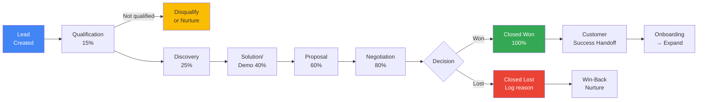
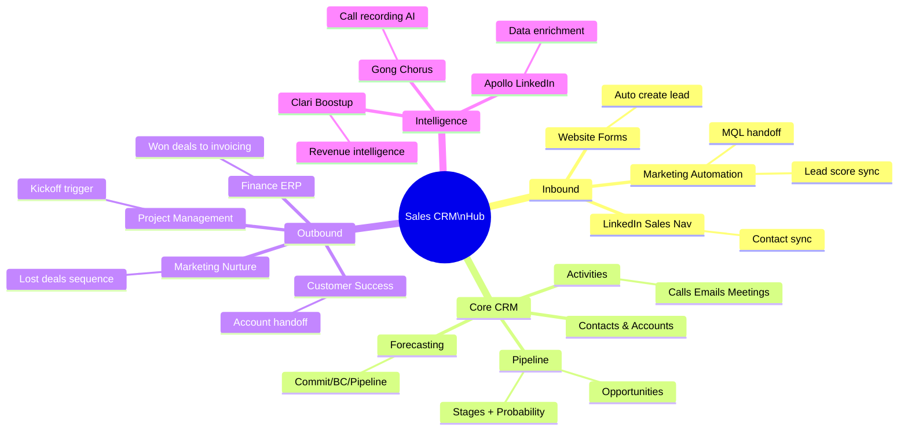

# SA06 — CRM Process & Pipeline

> **Định nghĩa:** CRM trong Sales (Sales CRM) là hệ thống, quy trình và phương pháp luận để quản lý mối quan hệ khách hàng tập trung vào việc theo dõi pipeline, quản lý deals, dự báo doanh thu và tối ưu hóa hoạt động của đội sales — khác với CRM trong Marketing (tập trung lead generation và campaign management).

---

## 1. Định nghĩa & Tầm quan trọng

**CRM (Customer Relationship Management) trong Sales** không phải chỉ là phần mềm — đó là:
- **Process:** Quy trình chuẩn hóa quản lý deals từ prospect đến close
- **Data:** Single source of truth về khách hàng, contacts, activity history
- **Analytics:** Pipeline health, forecasting, performance insights
- **Enablement:** Thông tin đúng lúc để sales rep thực hiện next best action

**Tại sao Sales CRM quan trọng:**
- **Visibility:** Manager biết chính xác deal nào trong pipeline, ở stage nào, khả năng close cao hay thấp
- **Accountability:** Rep biết mình đang track như thế nào so với target
- **Forecasting:** CFO có thể predict revenue dựa trên data thay vì "cảm giác"
- **Coaching:** Manager dùng data để coach rep — không phải assumptions
- **Scale:** Từ 3 rep → 30 rep mà không mất oversight

**Thống kê:**
- Companies với CRM có win rate cao hơn 28% (Salesforce Research)
- CRM ROI: $8.71 trung bình cho mỗi $1 đầu tư (Nucleus Research)
- 65% companies adopt CRM trong 5 năm đầu hoạt động
- VN: <30% doanh nghiệp VN dùng CRM systematically (ước tính 2023)

**CRM Sales vs CRM Marketing — sự khác biệt:**
| | CRM Sales | CRM Marketing |
|---|---|---|
| Focus | Pipeline/Deals/Closing | Lead gen/Campaigns/Nurture |
| Primary user | Sales rep, Sales manager | Marketer, Digital team |
| Key object | Opportunity/Deal | Lead, Campaign, Contact |
| Key metric | Win rate, Pipeline, ARR | MQL, Open rate, Conversion |
| Core function | Pipeline stages, Activity tracking | Email automation, Segmentation |
| Examples | Salesforce Sales Cloud | HubSpot Marketing Hub, Marketo |

---

## 2. Lịch sử & Nguồn gốc

**CRM Evolution:**
```
1980s:   Database marketing — ACT! (1986), first contact manager
1993:    Siebel Systems founded — enterprise CRM pioneer
1997:    "CRM" term coined — enterprise focus
1999:    Salesforce.com launched — cloud CRM revolution
2004:    SugarCRM (open-source), HubSpot founded
2005:    Zoho CRM — affordable for SMB
2006:    Salesforce AppExchange — ecosystem play
2010s:   Mobile CRM, Social CRM — LinkedIn integration
2015:    Sales Intelligence — LinkedIn Sales Navigator, Gong
2018:    AI in CRM — Salesforce Einstein, predictive scoring
2020s:   Revenue Intelligence, Conversation Intelligence, Revenue Ops
2023:    Generative AI in CRM — auto-drafting emails, summarizing calls
```

**VN CRM landscape:**
```
Pre-2010:  Ít doanh nghiệp VN dùng CRM — Excel dominated
2010-2015: FPT Software, Viettel bắt đầu implement Salesforce/Microsoft CRM
2015-2020: SaaS CRM VN xuất hiện: Base CRM (2012), GetFly CRM, KiotViet
2020-2023: COVID accelerated digital → nhiều SME VN bắt đầu dùng CRM
2023+:     AI features trong local VN CRM tools đang emerge
```

---

## 3. Các khái niệm cốt lõi

### Pipeline vs Funnel (Sales context)

**Sales Pipeline** = góc nhìn của sales team về deals đang active:
```
Lead → Contacted → Qualified → Discovery → Proposal → Negotiation → Won/Lost

Mỗi stage:
  - Có definition rõ ràng (entry criteria, exit criteria)
  - Có probability gắn kèm (25%, 50%, 75%, 90%)
  - Có expected close date
  - Có dollar value của deal
```

**Sales Funnel** = tỷ lệ chuyển đổi qua các stage:
```
100 Leads
  ↓ 30% qualify
30 Qualified
  ↓ 70% reach Discovery
21 Discovery Completed
  ↓ 60% get Proposal
13 Proposals Sent
  ↓ 40% close
5 Deals Closed (5% overall conversion from Lead)
```

### Lead Scoring

**Lead Scoring** = gán điểm số cho lead dựa trên:
- **Demographic fit** (firmographic): Size, ngành, địa lý, title
- **Behavioral signals:** Đọc email, download whitepaper, visit pricing page, attend demo
- **Engagement level:** Frequency và recency của interactions

```
Ví dụ scoring model:

Demographic (max 50 points):
  Industry match:     +15
  Company size fit:   +15
  Title/Role fit:     +15
  Geographic:         +5

Behavioral (max 50 points):
  Opened email:       +3 per email
  Clicked link:       +5 per click
  Visited pricing page: +15
  Requested demo:     +25
  Attended webinar:   +10
  Download case study:+8

→ Score >70: MQL (hand off to sales)
→ Score >85: Hot lead (call immediately)
```

### Opportunity Management

**Opportunity** = A qualified deal in active pipeline.

**Opportunity record in CRM:**
```
Account: [Company Name]
Contact: [Primary contact + other stakeholders]
Stage: [Current pipeline stage]
Amount: [Expected deal value]
Close Date: [Expected close date]
Probability: [% likelihood to close - usually auto by stage]
Next Step: [Specific action + deadline]
MEDDIC Score: [Qualification depth]
Forecast Category: [Commit/Best Case/Pipeline/Omit]
Competitors: [Who else are they evaluating?]
Notes: [Context từ last meeting/call]
```

### Sales Velocity

**Formula:**
```
Sales Velocity = (Number of Opportunities × Win Rate × Average Deal Size) / Sales Cycle Length

Ví dụ:
  # Opportunities = 50
  Win Rate = 25%
  Average Deal Size = 100,000,000 VND
  Sales Cycle = 60 ngày

  Sales Velocity = (50 × 0.25 × 100M) / 60
               = 1,250,000,000 / 60
               = 20,833,333 VND/ngày
               = ~625,000,000 VND/tháng

Muốn tăng velocity → lever:
  +10% Opportunities: → +10% velocity
  +10% Win Rate:      → +10% velocity
  +10% Deal Size:     → +10% velocity
  -10% Cycle Length:  → +11% velocity (most impactful relative)
```

---

## 4. Mô hình & Framework chính

### 4.1 Pipeline Stage Design

**Không có one-size-fits-all — stage phải fit business model:**

**Ví dụ cho B2B SaaS:**
```
Stage 1: PROSPECTING (Probability: 5%)
  Entry: Lead created in CRM
  Activities: Research, outreach
  Exit: Meeting booked

Stage 2: QUALIFICATION (Probability: 15%)
  Entry: First meeting held
  Activities: BANT/MEDDIC qualification
  Exit: Pain confirmed, budget indicated

Stage 3: DISCOVERY (Probability: 25%)
  Entry: Full discovery meeting scheduled
  Activities: Deep discovery, stakeholder mapping
  Exit: Discovery complete, solution fit confirmed

Stage 4: SOLUTION/DEMO (Probability: 40%)
  Entry: Demo/proposal meeting scheduled
  Activities: Custom demo, proposal prep
  Exit: Proposal sent

Stage 5: PROPOSAL (Probability: 60%)
  Entry: Proposal sent and reviewed
  Activities: Q&A, clarification, negotiation
  Exit: Verbal agreement on key terms

Stage 6: NEGOTIATION (Probability: 80%)
  Entry: Commercial terms being finalized
  Activities: Contract review, final objection handling
  Exit: Contract sent for signature

Stage 7: CLOSED WON (Probability: 100%)
  Contract signed, PO received

Stage 8: CLOSED LOST
  Deal lost, reason documented
```

**Ví dụ đơn giản hơn cho SMB/Transactional:**
```
New → Contacted → Qualified → Proposal → Won/Lost
(5 stages là đủ cho sales cycle ngắn)
```

### 4.2 Forecast Categories

**4-category forecast framework:**

| Category | Định nghĩa | Xác suất thực tế | Ai xác nhận |
|---|---|---|---|
| **Commit** | Rep sẽ close kỳ này, chắc chắn | 85-95% | Rep commits to manager |
| **Best Case** | Close được nếu mọi thứ ổn | 50-70% | Rep hopeful |
| **Pipeline** | Trong pipeline nhưng timing unclear | 20-40% | In pipeline, not committed |
| **Omit** | Không count kỳ này | <20% | Explicitly removed |

**Tại sao cần 4 categories:**
- Chỉ 1 "pipeline" number → manager không biết chắc bao nhiêu sẽ close
- Separation helps: CFO plan, CEO communicate to investors, team plan headcount

### 4.3 Activity-Based Selling

**Premise:** Win rate và deal size khó control ngắn hạn. Activities có thể control và measure ngay.

**Leading indicators (activities) drive lagging indicators (results):**
```
Activities:
  Calls made → Emails sent → LinkedIn outreach
  Meetings booked → Demos conducted
  Proposals sent → Contracts sent

These drive:
  New opportunities created
  Opportunities advancing stages
  Deals closing
```

**Activity tracking in CRM:**
- Log mọi activity: Call (kết quả gì?), Email (sent/replied?), Meeting (outcome?)
- Activity-based coaching: Manager review activities, không chỉ results
- "If you do the activities consistently, results will follow"

### 4.4 Pipeline Hygiene

**Pipeline Hygiene** = Đảm bảo pipeline data accurate, timely và actionable.

**Signs of poor hygiene:**
```
□ Deals stuck in same stage for >2x average stage time
□ Close dates in the past without update
□ Opportunities without next steps
□ Amount = $0 or unreasonably high/low
□ No activity logged in >2 weeks
□ Forecast category = Pipeline for everything
```

**Pipeline review cadence:**
- **Daily:** Rep review own pipeline — update activities, move stages
- **Weekly:** Rep + Manager 1:1 pipeline review — deal-level discussion
- **Monthly:** Team pipeline review — forecast rollup, risk identification
- **Quarterly:** Full pipeline audit — remove stale deals, recategorize

---

## 5. Quy trình thực hiện — CRM Implementation & Process

### Giai đoạn 1: CRM Tool Selection

**Selection criteria:**
```
Must-haves:
  □ Pipeline management với custom stages
  □ Contact & Account management
  □ Activity logging (calls, emails, meetings)
  □ Reporting & dashboards
  □ Email integration (Gmail/Outlook sync)
  □ Mobile app
  □ Vietnamese language support (ưu tiên)

Nice-to-haves:
  □ Marketing automation integration
  □ Lead scoring automation
  □ AI insights & recommendations
  □ Sequence/cadence features
  □ Integration với Zalo/Slack/Teams
  □ Proposal/quote generation
  □ E-signature
```

**Decision matrix:**

| CRM | Best for | Pricing VN | VN Support |
|---|---|---|---|
| **Salesforce** | Enterprise 200+ nhân viên | $75-300/user/tháng | Partner network |
| **HubSpot** | SMB-Mid market | Free → $50-100/user/tháng | English support |
| **Zoho CRM** | SMB, cost-conscious | $14-35/user/tháng | Có tiếng Việt |
| **Microsoft Dynamics** | Enterprise (Microsoft shop) | $65-135/user/tháng | Partner VN |
| **Pipedrive** | Sales-first, simple | $15-50/user/tháng | English |
| **GetFly CRM** | SME VN | 300-600K/user/tháng | VN, tiếng Việt |
| **Base CRM VN** | Startup-SME VN | 200-500K/user/tháng | VN, tiếng Việt |
| **Bravo ERP** | VN enterprise | Liên hệ | VN |

### Giai đoạn 2: Process Design

**Trước khi implement CRM — thiết kế process:**
```
Step 1: Map current sales process
  □ Hiện tại deals đi qua những bước nào?
  □ Ai làm gì ở mỗi bước?
  □ Thông tin nào cần capture?

Step 2: Define pipeline stages
  □ Max 5-7 stages (đơn giản hơn = adoption cao hơn)
  □ Entry/Exit criteria rõ ràng cho mỗi stage
  □ Probability % cho mỗi stage

Step 3: Define required fields
  □ Opportunity: Amount, Close Date, Stage, Next Step, ...
  □ Contact: Name, Title, Phone, Zalo, Email, ...
  □ Account: Company, Industry, Size, ...

Step 4: Define forecast categories
  □ Commit/Best Case/Pipeline/Omit với clear definitions

Step 5: Design activity requirements
  □ Tần suất minimum logging per deal per stage
  □ Required fields khi advance stage
  □ Alerts khi deal stale (no activity >X days)
```

### Giai đoạn 3: CRM Configuration

**CRM Setup checklist:**
```
Data model:
  □ Account fields customized
  □ Contact fields customized
  □ Opportunity fields customized (pipeline stages, forecast)
  □ Required fields enforced

Process:
  □ Stage automation (triggers, alerts)
  □ Email/Calendar sync connected
  □ Lead assignment rules configured
  □ Notification rules set

Integration:
  □ Marketing automation → CRM lead flow
  □ Email provider connected
  □ Calendar sync
  □ Zalo/Slack integration (if available)

Reporting:
  □ Pipeline dashboard live
  □ Activity report by rep
  □ Forecast report
  □ Win/Loss report
```

### Giai đoạn 4: Onboarding & Adoption

**CRM Adoption — thách thức lớn nhất:**

**Tại sao sales rep kháng cự CRM:**
1. "Mất thời gian nhập liệu"
2. "Manager dùng để kiểm soát tôi"
3. "Không thấy lợi ích cho mình"
4. "Quá phức tạp"

**Giải pháp:**
```
1. Minimize required fields (chỉ những gì thực sự cần)
2. Show rep "what's in it for me":
   → Commission tracking
   → "This deal is at risk" early warning
   → Never forget follow-up
   → Know your numbers
3. Mobile app first → log while on the go
4. Email sync → activities auto-logged
5. Manager commitment: Only review deals in CRM (not excel/email)
6. Celebrate early adopters
7. 90-day "just try it" — results speak
```

### Giai đoạn 5: Training & Rollout

**Training plan (4 tuần):**
```
Week 1: Basics
  □ Login, navigation
  □ Create/edit Contact, Account, Opportunity
  □ Log activities (call, email, meeting)
  □ Pipeline view

Week 2: Daily workflow
  □ Morning routine: Review today's tasks
  □ After meeting: Log notes, update stage, set next step
  □ Friday: Update close dates và amounts

Week 3: Reporting
  □ My pipeline dashboard
  □ Activity report
  □ Forecast view

Week 4: Advanced + Coaching
  □ Customization tips
  □ Integration (email, calendar, Zalo)
  □ Manager 1:1 using CRM data
```

---

## 6. Công cụ & Phương pháp

### CRM Ecosystem:

```
CORE CRM:
  Salesforce / HubSpot / Zoho / GetFly / Base CRM

ENRICHMENT:
  LinkedIn Sales Navigator → contact data
  Apollo.io / ZoomInfo → company data enrichment
  Clearbit → automatic company data
  Lusha → phone/email finding

ENGAGEMENT:
  Email sequences: Lemlist, Outreach, Salesloft
  Video: Loom → log in CRM
  Scheduling: Calendly → auto-create CRM activities

INTELLIGENCE:
  Conversation: Gong.io, Chorus, tl;dv → call recording + AI
  Revenue Intelligence: Clari, Boostup → AI forecast
  
WORKFLOW:
  Zapier / Make.com → integrate CRM với other tools
  Slack/Teams → deal notifications
  Notion → deal workrooms linked to CRM

REPORTING:
  Native CRM dashboards
  Tableau / PowerBI → advanced analytics
  Google Data Studio → free option
```

### VN-Specific Tools:

**GetFly CRM:**
- Phát triển bởi công ty VN, UI tiếng Việt hoàn toàn
- Tích hợp với: Zalo ZNS, email marketing VN, VNPT Pay
- Giá: ~300-600K/user/tháng
- Phù hợp: SME VN, bán hàng qua Zalo/điện thoại nhiều

**Base CRM VN:**
- Focus: Sales team VN
- Features: Pipeline, KPI tracking, báo cáo tiếng Việt
- Giá: ~200-500K/user/tháng

**KiotViet:**
- Hơn là CRM — POS + inventory + basic customer management
- Phù hợp: Retail, F&B với multiple locations

---

## 7. KPI & Đo lường

### Sales CRM KPIs:

**Pipeline Metrics:**
| KPI | Formula | Target |
|---|---|---|
| **Pipeline Value** | Sum of all open opportunity values | 3-4x quarterly quota |
| **Pipeline Coverage** | Pipeline / Quota | >3x (SMB), >4x (Enterprise) |
| **Weighted Pipeline** | Sum of (Deal × Probability) | ~=Quota if accurate |
| **# Active Opportunities** | Count open opportunities | Per rep target |
| **Stage Conversion Rate** | Won at Stage N / Entered Stage N | Benchmark by stage |
| **Deal Velocity** | Days in each stage average | Identify bottleneck stages |

**Activity Metrics:**
| KPI | Formula | Target |
|---|---|---|
| **Calls/Day** | # calls logged / working days | 20-50 depending on role |
| **Meetings/Week** | # meetings held | 5-15 depending on role |
| **Email Response Rate** | Replies / Sent | >15% cold, >60% warm |
| **Demo Rate** | Demos / Qualified leads | >50% |
| **CRM Log Rate** | Activities logged / Est. activities | >80% |

**Result Metrics:**
| KPI | Formula | Target |
|---|---|---|
| **Win Rate** | Won / (Won + Lost) | B2B: 20-30%, depends |
| **Average Deal Size** | Revenue / # Deals | Growing YoY |
| **Sales Cycle Length** | Avg close date - create date | Decreasing YoY |
| **Forecast Accuracy** | |Actual - Forecast| / Forecast | <15% |
| **Quota Attainment** | Revenue / Quota | >100% |

### Sales Velocity Deep Dive:

```
Sales Velocity = (Opps × Win Rate × ADS) / Cycle Length

Tăng velocity — 4 levers và actions:

1. Increase # Opportunities:
   → More prospecting activities
   → Better qualification (fewer bad opps wasting time)
   → Marketing generate more MQLs

2. Increase Win Rate:
   → Better discovery (MEDDIC)
   → Better competitive positioning
   → More reference customers
   → Sales training & coaching

3. Increase Average Deal Size:
   → Sell higher in org (executive buyers)
   → Multi-product deals
   → Upsell at close
   → Better territory targeting (larger companies)

4. Decrease Sales Cycle:
   → Identify and engage Economic Buyer early
   → Mutual action plan (MAP)
   → Better champion enablement
   → Reduce internal approval bottlenecks
```

---

## 8. Rủi ro & Thách thức

### 8.1 CRM Adoption Failure

**Thực tế đau đớn:** 70% CRM implementations fail to meet expectations (Gartner).

**Nguyên nhân phổ biến:**
- Leadership không enforce — "optional" thực ra là "never adopted"
- Quá nhiều required fields → burden quá cao
- Không show value to rep → "only benefits manager"
- Implementation quá nhanh, training không đủ
- No champion internally để drive adoption

**Signs of adoption failure:**
- CRM accuracy < 60% (deals in Excel/Zalo not in CRM)
- "Pipeline" number khác với "Manager's Excel"
- Rep không update CRM sau meeting
- Manager vẫn email/call để hỏi deal status

### 8.2 Garbage In, Garbage Out

**Nếu data không chính xác:**
- Forecast không tin được
- Manager ra quyết định sai (over-hire, under-prepare)
- Pipeline coverage trông tốt nhưng thực ra toàn "zombie deals"

**Data quality standards:**
- Close date phải realistic (không để 90 ngày tới mặc định mãi)
- Amount phải real estimate (không để $0 hoặc placeholder)
- Stage phải reflect reality (không pump up để look good)
- Activity log must be honest (log meeting 5 phút như 1 giờ → misleads)

### 8.3 CRM Silos

**Vấn đề:** Marketing CRM và Sales CRM không nói chuyện với nhau → leads fall through cracks.

**Triệu chứng:**
- Marketing claim gửi 100 MQLs/tháng, sales chỉ thấy 40 trong CRM
- Rep không biết lead đã download gì, đọc email gì trước khi call
- Customer bought → CSM không có history

**Giải pháp:**
- Unified platform (HubSpot) hoặc integrated stack (Salesforce + Marketo)
- MQL handoff SLA: Marketing mark MQL → Sales nhận notify → contact trong 24h
- Shared reporting: Both see same pipeline from MQL to Customer

### 8.4 Over-engineering

**Vấn đề:** CRM được custom quá mức → phức tạp, chậm, khó dùng.

- 50+ custom fields → rep skip most
- 10 stage pipeline → rep không nhớ definitions
- Complex automation → breaks easily

**Giải pháp:** Start simple, thêm dần. Principles: "If in doubt, leave it out"

---

## 9. Best Practices

1. **"If it's not in CRM, it didn't happen":** Manager policy → create urgency to log
2. **Fewer required fields, enforce them hard:** 5 good required fields > 20 optional
3. **Mobile-first logging:** Rep log real-time trên mobile → không để cuối ngày
4. **Email sync = auto-log:** Most activities auto-captured = reduce manual effort
5. **Weekly pipeline review is sacred:** 30-60 minutes, deal-by-deal, every week
6. **Close dates are real, not aspirational:** Rep must update weekly
7. **"Next step" is mandatory:** Every open deal must have specific next step + date
8. **Pipeline health alerts:** Automated alert khi deal stale (no activity 7 days)
9. **Win/Loss reason documentation:** Phải log ngay khi close — memory fades quickly
10. **CRM for coaching, not punishment:** Manager dùng data để help, không blame

---

## 10. Sai lầm phổ biến

| Sai lầm | Biểu hiện | Hậu quả | Giải pháp |
|---|---|---|---|
| Buy CRM trước design process | "Buy Salesforce rồi figure out later" | Complex implementation, low adoption | Design process first |
| Too many stages | 12 stage pipeline | Rep không biết mình ở đâu | Max 5-7 stages |
| No stage exit criteria | "Move to Proposal when you feel like it" | Pipeline không accurate | Define criteria per stage |
| Manager reviews in Excel | Lấy data từ CRM → paste Excel cho review | Rep ngừng dùng CRM (for what?) | Review directly in CRM |
| Only review results | "Why didn't you hit quota?" | No coaching on how to improve | Review activities + early-stage deals |
| Stale deals không clear | Pipeline full nhưng gồm deals 6 tháng không move | Inflated/misleading coverage | Monthly pipeline audit |
| No forecast discipline | Rep label everything "Commit" | Forecasting useless | Train on Commit criteria, verify |
| Ignore Win/Loss | Close → celebrate/mope, no analysis | Same mistakes repeat | Require loss reason in CRM |

---

## 11. Case Study VN — Viettel Solutions CRM Implementation

**Công ty:** Viettel IDC / Viettel Solutions — IT Services arm của Tập đoàn Viettel, cung cấp data center, cloud và IT solutions cho doanh nghiệp. Doanh thu ước tính >2,000 tỷ VND/năm.

**Thách thức trước CRM:**
- 100+ sales rep phân bổ theo region
- Deals theo dõi qua Excel, email, Zalo cá nhân
- Manager không biết pipeline thực sự
- Forecast mỗi tháng là "gut feeling" của sales director
- Wins và losses không được analyze systematically
- Onboard rep mới mất 3-4 tháng để có first deal

**CRM Implementation — Microsoft Dynamics 365:**

**Giai đoạn 1 (3 tháng): Foundation**
- Thiết kế pipeline stages phù hợp với enterprise IT sales cycle
- Stages: Prospect → Qualified → Needs Analysis → Proposal → PoC → Negotiation → Won/Lost
- Required fields: Account, Amount, Close Date, Stage, Mô tả solution, Contact chính
- Training toàn bộ 100 reps + 15 managers

**Giai đoạn 2 (6 tháng): Adoption**
- Rule: Manager chỉ discuss deal nếu nó có trong CRM → instant motivation
- Integration với email và Outlook calendar → auto-log meetings
- Weekly pipeline review 30 phút với từng Regional Sales Manager
- Biweekly all-hands pipeline review với Sales Director

**Giai đoạn 3 (Năm 2): Optimization**
- MEDDIC scoring tích hợp vào opportunity form
- Win/Loss analysis tự động generate report hàng tháng
- Forecast accuracy target: <15% variance vs actual

**Kết quả sau 18 tháng:**
- Forecast accuracy: Từ ~40% variance → ~18% variance
- Win rate tổng thể: Tăng 8 percentage points (nhờ better qualification)
- Onboarding time cho rep mới: Từ 4 tháng → 2.5 tháng (vì có process + deals để learn from)
- Deal stuck in pipeline (>90 ngày không move): Giảm 60%
- Revenue (năm thứ 2 vs năm thứ 1): +25% (attributed partly to better sales management)

**Challenges gặp phải:**
- Adoption dip tháng 2-3: "Quá mất thời gian nhập liệu" — giải quyết bằng email sync
- Senior reps kháng cự: Phải có VP Sales personally enforce
- Mobile app bug ban đầu: Field reps không log → giải quyết khi update mobile app

**Bài học:**
- Leadership enforcement (không phải training) là yếu tố #1 của adoption
- Integration (email, calendar) giảm friction dramatically
- Kết quả cần 6-12 tháng để rõ ràng — cần kiên nhẫn
- Phải có "CRM champion" nội bộ — không thể outsource adoption

---

## 12. Case Study quốc tế — HubSpot CRM Adoption at SMB scale

**Case:** HubSpot (the company) với HubSpot CRM (their product) — perfect alignment

**Why HubSpot succeeded with SMB adoption:**
1. **Free tier:** CRM free hoàn toàn → no budget risk → "just try it"
2. **Email integration first:** Import contacts, sync emails → value immediate
3. **Deal created in <2 minutes:** Friction minimized
4. **"Did they open my email?" feature:** Immediate personal value for rep
5. **Reporting dashboards:** Manager sees pipeline without asking
6. **HubSpot Academy:** Free training = reduces onboarding cost
7. **App marketplace:** Connect với 1,000+ tools

**Network effect:**
- Each customer becomes advocate → recommend to network
- HubSpot Inbound conference: 200K+ attendees → community
- "HubSpot Certified" = resume value → creates certified workforce

**Kết quả:**
- 2024: 215,000+ customers globally
- ~$2.2B ARR (2023)
- #1 CRM for SMB segment (by number of customers)
- Average Revenue per Customer: ~$10,000/năm

---

## 13. So sánh với phương pháp khác

| Approach | Pros | Cons | Best for |
|---|---|---|---|
| **Excel/Google Sheets** | Free, familiar, flexible | No automation, no real-time, breaks at scale | 1-3 rep startup, <20 deals |
| **Dedicated Sales CRM** | Purpose-built, analytics, automation | Cost, implementation | 5+ reps, ongoing sales operation |
| **All-in-one (HubSpot)** | Marketing+Sales+CS unified | Can be expensive at scale | Growth-stage, need visibility across funnel |
| **Enterprise CRM (Salesforce)** | Customizable, powerful, ecosystem | Expensive, complex, long implementation | 50+ reps, complex sales |
| **VN Local CRM (GetFly)** | Vietnamese, affordable, local support | Limited integrations vs global | VN SME, Zalo-heavy workflow |
| **Zalo + Excel (VN reality)** | Zero cost, familiar | No pipeline visibility, no reporting, can't scale | <5 rep teams only |

---

## 14. Ứng dụng theo ngành

### Real Estate (Bất động sản):
- **CRM needs:** Long sales cycle, multiple touchpoints, property inventory
- **Key features:** Property matching, viewing scheduling, document management
- **VN tools:** Propzy CRM, batdongsan.com.vn CRM, custom Salesforce
- **Pipeline stages:** New Lead → Contacted → Viewing Scheduled → Viewed → Offer → Negotiation → Closed

### Insurance (Bảo hiểm):
- **CRM needs:** Renewal tracking, policy management, beneficiary info
- **Key features:** Renewal alerts, commission tracking, compliance
- **VN reality:** Bảo Việt, Prudential có internal CRM; agents use Zalo + paper
- **Pipeline stages:** Lead → Needs Discovery → Policy Presentation → Application → Underwriting → Issued

### SaaS (Phần mềm dịch vụ):
- **CRM needs:** Trial tracking, product usage signals, expansion revenue
- **Key features:** PQL identification, usage data integration, expansion alerts
- **Tools:** Salesforce, HubSpot (full suite), + Product analytics (Mixpanel, Amplitude)
- **Pipeline stages:** Lead → Trial → Discovery → Proposal → Closed → Onboarding → Expansion

### Retail / F&B (nhỏ):
- **CRM needs:** Loyalty, repeat purchase, birthday campaigns
- **Tools:** KiotViet, Sapo, or Zalo ZNS for simple CRM
- **Focus:** RFM analysis, loyalty points tracking

---

## 15. Ứng dụng theo quy mô doanh nghiệp

### Startup (1-5 reps):
- **Tool:** HubSpot Free hoặc Pipedrive Starter
- **Focus:** Basic pipeline, email logging, activity tracking
- **Process:** Weekly founder review of all deals
- **Don't:** Over-engineer — keep it simple, build habits first

### Growing SME (5-20 reps):
- **Tool:** HubSpot Growth hoặc Zoho CRM hoặc GetFly (VN)
- **Focus:** Lead scoring, automated sequences, manager reporting
- **Process:** Weekly 1:1 + monthly team review
- **Key hire:** Sales Operations role (part-time or dedicated)

### Scale-up (20-100 reps):
- **Tool:** Salesforce hoặc HubSpot Enterprise
- **Focus:** Revenue Intelligence, advanced forecasting, RevOps
- **Process:** Weekly pipeline, bi-weekly forecast, monthly QBR
- **Teams:** AE + SDR + Sales Ops dedicated

---

## 16. Công nghệ & Digital Tools

### Modern Sales Tech Stack:

```
CORE LAYER — CRM:
  Enterprise: Salesforce, Microsoft Dynamics
  Mid-market: HubSpot, Zoho
  VN SME: GetFly, Base CRM, Bitrix24

INTELLIGENCE LAYER:
  Conversation: Gong.io, Chorus, tl;dv
    → Record calls → AI transcribe → surface insights
    → "Competitor mentioned 12 times in this call"
    → "Talk-to-listen ratio: 80/20 — too much talking"
    
  Revenue Intelligence: Clari, Boostup
    → AI predict deal health
    → Flag at-risk deals
    → Forecast rollup with confidence intervals

ENGAGEMENT LAYER:
  Sequences: Outreach, Salesloft, Lemlist
  Video: Loom → log in CRM automatically
  Meeting: Calendly → auto-create CRM activity

ENRICHMENT LAYER:
  Apollo.io: 265M+ contacts database
  ZoomInfo: Enterprise-grade B2B data
  Clearbit: Real-time company enrichment via API

INTEGRATION LAYER:
  Zapier/Make.com: No-code workflow automation
  Slack: Real-time deal notifications
  Notion/Coda: Deal room linked to CRM
```

### AI trong CRM Sales (2024):

**Generative AI features:**
- **Auto-generated email drafts:** Based on deal context, email thread history
- **Meeting summary:** AI generates action items, key points từ call recording
- **Next best action:** "You should schedule demo before end of week" based on deal signals
- **Sentiment analysis:** AI detect deal health từ email tone

**Predictive AI features:**
- **Lead scoring:** ML model predict conversion probability based on behavior
- **Deal health score:** "This deal is 85% likely to close this quarter"
- **Churn prediction:** "This customer is 70% likely to not renew"
- **Revenue forecast:** AI-driven forecast vs rep-submitted forecast

**VN adoption:** 
- Gong/Chorus: Mostly English, đang develop Vietnamese
- HubSpot AI: Available globally nhưng effectiveness cho tiếng Việt limited
- Salesforce Einstein: Available, requires configuration
- Opportunity: Local VN CRM tools chưa có strong AI — gap để fill

---

## 17. Tích hợp với các domain khác

```
CRM Sales ←→ CRM Marketing:
  Lead flow: MQL generated in Marketing → assigned to Sales CRM
  Lead score: Marketing enrich with behavioral data → Sales see full context
  Campaign attribution: Which campaign drove this deal?
  Closed-loop feedback: Won/Lost reasons → marketing learn what works

CRM Sales ←→ Customer Success:
  Deal handoff: AE → CSM với full context (why they bought, goals, risks)
  Health monitoring: CSM update health in CRM → Sales see expansion signals
  Renewal pipeline: CSM create renewal opportunity → Sales assist if needed
  NPS data: Customer feedback in CRM → early warning cho churn

CRM Sales ←→ Finance:
  Revenue recognition: Won deals → order management → AR
  Commission calculation: Based on CRM data → payroll accuracy
  ARR/MRR tracking: Subscription deal values → finance reporting
  Revenue forecast: Sales CRM forecast → Finance planning

CRM Sales ←→ Operations/Delivery:
  Project kickoff: Won deal → create project → assign delivery team
  Capacity planning: Pipeline forecast → hire/staff accordingly
  SLA commitment: What was promised → delivery tracks against it

CRM Sales ←→ Product:
  Feature requests: Sales log feature requests from lost deals
  Competitive intel: Competitor mentions in CRM → product strategy
  Roadmap alignment: New features → sales enablement update
```

---

## 18. Xu hướng & Tương lai

### 2024-2028 Sales CRM Trends:

**1. AI-native CRM (paradigm shift):**
- Thế hệ CRM mới: AI là core, không phải add-on
- Examples: Salesforce Einstein GPT, HubSpot AI, Microsoft Copilot for Sales
- "AI writes the email, AI suggests next step, AI predicts close probability"
- VN timeline: 2025-2026 cho mainstream adoption

**2. Revenue Intelligence becomes standard:**
- Gong-style call recording + AI → not just for enterprise anymore
- Mid-market và SMB sẽ có affordable versions
- Conversation data = biggest source of sales insights

**3. CRM as Data Hub:**
- CRM trở thành center của revenue tech stack
- All tools connect, share data through CRM
- Customer 360: Sales + Marketing + CS + Product data unified

**4. Buying signals from dark data:**
- Website visits, content consumption, G2 reviews, hiring signals
- Intent data providers: Bombora, TechTarget, 6sense
- "Know when they're ready to buy before they tell you"

**5. Self-serve + CRM:**
- PLG (Product-Led Growth): Product usage data → CRM signals
- PQL (Product Qualified Lead) → auto-create opportunity
- Sales assist at right moment, not spray-and-pray outreach

**6. Voice and Conversational AI:**
- Rep says "log call with Nguyen Van A" → AI transcribes, logs, suggests follow-up
- No more manual logging → adoption barrier removed
- VN: Cần VN language support — key requirement

**7. Revenue Operations (RevOps) consolidation:**
- Sales, Marketing, CS all under single RevOps function
- Shared CRM, shared metrics, shared accountability
- CRO (Chief Revenue Officer) role growing at VN companies

---

## 19. Bối cảnh Việt Nam đặc thù

### VN Sales CRM Reality:

**1. CRM adoption rate thấp — thực tế phũ phàng:**
- Ước tính <30% doanh nghiệp VN dùng CRM systematically
- 60-70% SME VN: Excel + Zalo + Facebook Groups
- Ngay cả nhiều công ty 100+ nhân viên vẫn chưa có CRM chuẩn

**2. Zalo là "CRM thực tế" của nhiều sales team VN:**
- Chat với khách qua Zalo cá nhân → deal history chỉ có trong chat
- Khi rep nghỉ → deal history mất
- Không có reporting, không có pipeline visibility
- "Hệ thống" của nhiều team: Zalo group + Excel shared file

**3. Vấn đề từ Zalo-first culture:**
- Rep không muốn log vào CRM vì "đã chat Zalo rồi"
- Khó integrate: Zalo API hạn chế (ZNS chỉ cho OA, không phải chat cá nhân)
- Giải pháp: Zalo OA cho business communication + log activities vào CRM

**4. "Quản lý = kiểm soát" perception:**
- Nhiều sales rep VN coi CRM là tool để sếp theo dõi mình
- Kháng cự mạnh hơn US/EU market
- Giải pháp: Position CRM là tool hỗ trợ rep, show personal benefits

**5. Decision maker thường không dùng title chuẩn:**
- VN: "Chị Hoa bên kế toán" → ai là role gì trong buying process?
- Stakeholder mapping khó hơn
- CRM cần flexible enough để capture VN relationship structure

**6. Thị trường VN đặc thù về deal tracking:**
- "Deal" đôi khi bắt đầu từ tin nhắn Zalo không formal
- Hợp đồng có thể ký sau 1 tuần hoặc sau 2 năm tùy relationship
- "Đang chờ năm sau budget" là common deal status → CRM cần Long-term nurture stage

**7. Local CRM tools vs Global:**
- GetFly, Base CRM: UI tiếng Việt, giá rẻ hơn, support VN, tích hợp ZNS
- Salesforce/HubSpot: Powerful hơn nhưng đắt, learning curve cao, ít VN-specific features
- Xu hướng: Mid-market VN migrate từ local sang global khi scale

**8. Excel vẫn chiếm ưu thế:**
- "Excel is our CRM" — phổ biến ở SME
- Vấn đề: Không real-time, không multi-user well, không searchable, không reportable
- Transition khó vì người dùng rất quen Excel

**9. Data privacy considerations:**
- Nghị định 13/2023/NĐ-CP về bảo vệ dữ liệu cá nhân (PDPA VN)
- CRM lưu customer data → phải có consent, có security
- Lưu dữ liệu ở đâu? Cloud nước ngoài vs on-premise → sensitivity của DNNN và Government

---

## 20. Checklist thực hành

### CRM Implementation Checklist:
```
Pre-implementation:
□ Map current sales process (as-is)
□ Design target process (to-be)
□ Define pipeline stages + entry/exit criteria
□ Identify required vs optional fields (tối thiểu)
□ Define forecast categories + training plan
□ Select CRM tool (match budget, features, VN support)
□ Appoint internal CRM champion
□ Get leadership commitment (CEO/CSO must enforce)

Implementation:
□ Configure CRM (stages, fields, automation)
□ Integrate email and calendar
□ Import existing contacts and deals
□ Create user accounts, set permissions
□ Build reports and dashboards
□ Test workflow end-to-end

Launch:
□ Training all users (hands-on, not just slides)
□ Define "day 1" routine for reps
□ Set 30-60-90 day adoption milestones
□ First pipeline review in CRM (not Excel)
□ Communicate: "After [date], we only discuss deals in CRM"

Ongoing:
□ Weekly pipeline review discipline
□ Monthly adoption metrics (log rate, data quality)
□ Quarterly CRM audit (stale deals, bad data)
□ Regular training refreshers for new features
□ Celebrate CRM wins (deals found, coaching insights)
```

### Weekly CRM Hygiene Checklist (Sales Rep):
```
Monday:
□ Review my open opportunities — any stale?
□ Check tasks/reminders for today and this week
□ Add new opportunities from last week's meetings

During week:
□ Log every call, meeting, email same day
□ Update stage when deal advances
□ Set/update next step for every active deal

Friday:
□ Update close dates for any slipped deals
□ Update probability based on latest info
□ Clean up: remove dead deals from active pipeline
□ Note key wins/losses of the week for review
```

---

## 21. MQL → SQL Handoff Process

**The most important seam in revenue process:**

**Definition:**
- **MQL (Marketing Qualified Lead):** Marketing deems ready for sales contact (based on score)
- **SQL (Sales Qualified Lead):** Sales has confirmed qualification criteria met

**Handoff SLA (Service Level Agreement):**
```
Marketing → Sales SLA:
  □ MQL created in CRM → Assigned to rep automatically
  □ Rep must contact MQL within 24 hours (business hours)
  □ Rep mark as SQL if qualified, Rejected if not (with reason)
  
Sales → Marketing SLA:
  □ If rejected: Sales must provide reason (not fit / timing / other)
  □ Rejected leads go back to Marketing for nurture
  □ Monthly review: Are rejection rates reasonable?
```

**MQL→SQL conversion benchmark:**
- Industry average: 20-40% MQL → SQL
- Lower than 20%: Marketing targeting wrong leads
- Higher than 40%: Either marketing qualification bar too low, or sales not qualifying properly

**Lead response time matters:**
```
Call in 1 min: 391% higher conversion vs calling in 1 hour
Call in 1 hour: 60× higher conversion vs calling in 24 hours
(MIT/InsideSales.com Research — relevant even if VN numbers differ)

VN benchmark: Response within 4 hours = acceptable; 24 hours = too slow
```

---

## 22. Forecast Process — Monthly Cadence

**Forecast roll-up process:**

```
Week 1 of month:
  Rep → Manager: Submit deal-by-deal forecast (Commit/BC/Pipeline)
  
Week 2:
  Manager review with each rep individually (30 min)
  Manager adjust based on historical accuracy + deal knowledge
  
Week 3:
  Regional/Division forecast submitted to VP Sales
  VP adjust based on territory patterns, pipeline quality
  
End of month:
  Actual results vs forecast → analyze variance
  Root cause: Which deals slipped? Why?
  What to do differently for next month?
```

**Forecast accuracy improvement:**
- Track accuracy at rep level: Who is over/under consistently?
- Calibration: Coach reps with pattern (always optimistic → adjust down)
- Deal-level review for >$500M VND deals: Manager verify directly
- AI assistance: Tools like Clari provide AI-based forecast alongside rep-submitted

---

## 23. Sales Operations — The Unsung Hero

**Sales Ops roles and responsibilities:**

```
STRATEGY:
  □ Sales planning: Quota setting, territory carving, headcount
  □ Compensation plan design
  □ Sales process design and documentation

EXECUTION:
  □ CRM administration and optimization
  □ Data hygiene and quality management
  □ Commission calculation and payout
  □ Reporting and dashboards
  □ Tool evaluation and management

ENABLEMENT:
  □ Onboarding content for new reps
  □ Sales playbook maintenance
  □ Training coordination
  □ Battle cards, templates, scripts

ANALYTICS:
  □ Win/loss analysis
  □ Forecast variance analysis
  □ Pipeline efficiency reporting
  □ Rep performance benchmarking
```

**VN context:** Sales Ops role hiếm tại VN SME — thường 1 người kiêm nhiệm hoặc Sales Manager tự làm. Scale-up VN cần invest vào Sales Ops khi >10 reps.

---

## 24. Pipeline Review Meeting — Facilitation Guide

**Weekly Pipeline Review (45-60 phút với Rep):**

**Agenda:**
```
5 min:   Context — What happened last week (summary)
20 min:  Deal-by-deal review — Start with Commit, then Best Case
          For each deal:
          - Current stage, expected close, amount
          - MEDDIC health: Champion solid? EB accessed? Timeline confirmed?
          - What happened last week? 
          - What are next steps this week? Specific and time-bound?
          - Any blockers Manager can help with?
10 min:  New opportunities added this week
10 min:  Activity review — actual vs target
5 min:   Coaching focus for next week (1-2 specific skills/behaviors)
```

**Manager's mindset:**
- "What can I do to help?" not "Why didn't you do X?"
- Challenge optimistic forecasts with evidence
- Celebrate progress, not just results
- Focus on controllables (activities, behaviors) not just outcomes

---

## 25. Activity-Based Selling Metrics

**Measurement framework:**

**Level 1 — Effort:**
```
Calls made:           Target: 20-40/ngày (depending on role)
Emails sent:          Target: 30-50/ngày
LinkedIn messages:    Target: 10-20/ngày
Meetings conducted:   Target: 5-10/tuần
Demo conducted:       Target: 2-5/tuần
Proposals sent:       Target: 1-3/tuần
```

**Level 2 — Quality of Effort:**
```
Call connect rate:         # connects / # calls (benchmark: 10-15%)
Email open rate:           # opens / # sent (benchmark: 20-35%)
Meeting to Demo rate:      # demos / # meetings (benchmark: 50-70%)
Demo to Proposal rate:     # proposals / # demos (benchmark: 60-80%)
Proposal to Close rate:    # closes / # proposals (benchmark: 20-40%)
```

**Level 3 — Outcomes:**
```
New Opportunities created: Weekly/monthly
Pipeline value added:      Tổng giá trị opp mới
Stage advancement rate:    % deals moved forward vs stagnant
Close rate:               Won / (Won + Lost)
```

**Optimization cycle:**
```
Low activity → Coach on prospecting, time management
High activity but low quality → Coach on messaging, call scripts
High quality but low deals → Coach on qualification, product knowledge
```

---

## 26. CRM Reports — Essential Reports

### 1. Sales Pipeline Report:

```
Filter: Open opportunities, current quarter close date
Group by: Stage
Show: # deals, total value, weighted value
Chart: Funnel chart by stage

Used for: Understanding current pipeline health, coverage vs quota
```

### 2. Activity Report (by rep):

```
Filter: Past 7 days
Group by: Sales rep
Show: # calls, # emails, # meetings, # demos
Compare to: Target

Used for: Identify reps needing coaching on activity level
```

### 3. Forecast Report:

```
Filter: Open + this quarter close
Group by: Forecast category (Commit/Best Case/Pipeline)
Show: Deal count, total value per category

Used for: Weekly/monthly revenue prediction
```

### 4. Win/Loss Analysis Report:

```
Filter: Closed Won + Closed Lost, past 90 days
Group by: Win/Loss reason
Show: # deals, % of total, avg deal size

Used for: Improve win rate, identify patterns
```

### 5. Conversion Rate by Stage:

```
Filter: All opportunities, last 6 months
Show: # entered each stage, # exited to next stage, % conversion
Chart: Funnel showing conversion rates

Used for: Identify where deals are getting stuck, optimize process
```

### 6. Sales Rep Leaderboard:

```
Filter: Current period
Group by: Sales rep
Show: Quota, Revenue, % attainment, # deals closed
Sort: % attainment descending

Used for: Healthy competition, identify top performers and laggards
```

---

## 27. Deal Review Framework — MEDDIC in CRM

**Integrating MEDDIC qualification into CRM:**

**Custom fields for each opportunity:**
```
Metrics:
  □ Business pain quantified (text)
  □ Value of solving = ___VND/tháng (number field)
  
Economic Buyer:
  □ EB name and title (text)
  □ EB accessed? (Yes/No)
  □ EB aligned? (Scale 1-5)
  
Decision Criteria:
  □ Technical criteria (text)
  □ Financial criteria (text)
  □ Vendor selection criteria (text)
  
Decision Process:
  □ Steps to purchase (text)
  □ Timeline confirmed (date)
  □ Paper process mapped (Yes/No)
  □ Legal review estimated (number of weeks)
  
Identify Pain:
  □ Primary pain point (picklist)
  □ Pain urgency (1-5 scale)
  □ Cost of inaction (VND/tháng)
  
Champion:
  □ Champion name (text)
  □ Champion influence (1-5)
  □ Champion actively helping (Yes/No)
  
Competition:
  □ Competitors (multi-select)
  □ Our win thesis (text)
  □ Competitive status (Sole source/Competitive/Unknown)

MEDDIC Score:
  → Auto-calculated: Sum of scored elements
  → Score <6: High risk, needs more discovery
  → Score 7-10: Good, can advance
  → Score >10: Strong deal, forecast with confidence
```

---

## 28. Mutual Action Plan (MAP)

**MAP = Shared document với deal timeline, both parties committed:**

```
DEAL CLOSE PLAN — [Account Name]
Date: [Today]
Goal: Signed contract by [Target Date]

Week of [Date]:
  [ ] Sales: Send technical specs document
  [ ] Customer: IT review specs, provide feedback
  [ ] Sales: Follow up on feedback

Week of [Date+1]:
  [ ] Customer: Internal presentation to CFO
  [ ] Sales: Prepare ROI deck for CFO meeting
  [ ] Both: CFO meeting scheduled for [Date]

Week of [Date+2]:
  [ ] Customer: Legal review contract draft
  [ ] Sales: Address legal comments within 48h
  [ ] Customer: Final approval from board

Week of [Date+3]:
  [ ] Contract signed
  [ ] PO issued by [Date+3+3]
  [ ] Kickoff scheduled: [Date+4]
```

**Benefits của MAP:**
- Khách cam kết với timeline của họ
- Rep có reason to follow up ("Tuần này theo kế hoạch anh sẽ present CFO chưa?")
- Identify slippage early (nếu milestone bị miss)
- Both sides accountable

---

## 29. Customer Success Handoff từ Sales

**Deal close → CS handoff là critical transition:**

**Handoff document template:**
```
ACCOUNT HANDOFF — [Customer Name]
AE: [Name] → CSM: [Name]
Close date: [Date]
Contract value: [VND]

BUSINESS CONTEXT:
  Why they bought: [Their problem, stated goals]
  Business objectives: [What success looks like for them]
  
STAKEHOLDERS:
  Executive sponsor: [Name, Title, contact]
  Day-to-day contact: [Name, Title, contact, Zalo]
  Technical contact: [Name, Title, contact]
  Skeptics/Blockers: [Anyone who pushed back?]

COMMERCIAL:
  Contract term: [Start-End date]
  Renewal date: [Date]
  Contract value: [VND/năm]
  Products/Services: [What they bought]
  Key terms: [Any special commitments made]

IMPLEMENTATION:
  Timeline: [Go-live date expectation]
  Complexity: [Low/Medium/High]
  Known risks: [Anything that could derail implementation]
  Committed resources from customer: [Who's their project lead?]

SUCCESS CRITERIA:
  KPIs agreed: [What they'll measure success by]
  Review cadence: [When to do business reviews]

UPSELL OPPORTUNITIES:
  [Any expansion identified during sales process]
  
SENSITIVE INFO:
  [Anything CSM needs to know but not in formal docs]
```

---

## 30. Revenue Metrics for Leadership

**Board-level sales metrics:**

| Metric | Formula | Frequency |
|---|---|---|
| **ARR (Annual Recurring Revenue)** | Total recurring revenue annualized | Monthly |
| **MRR (Monthly Recurring Revenue)** | ARR / 12 | Monthly |
| **New ARR** | Revenue from new customers | Monthly |
| **Expansion ARR** | Revenue increase from existing customers | Monthly |
| **Churned ARR** | Revenue lost from churned customers | Monthly |
| **Net New ARR** | New + Expansion - Churned | Monthly |
| **NRR (Net Revenue Retention)** | (Start ARR + Expansion - Churned) / Start ARR | Monthly |
| **CAC** | Total S&M spend / New customers | Quarterly |
| **CAC Payback** | CAC / (ARPU × Gross Margin) | Quarterly |
| **LTV** | ARPU × Gross Margin × Average Customer Lifetime | Quarterly |
| **LTV/CAC ratio** | LTV / CAC (target >3x) | Quarterly |
| **Quota Attainment %** | Total attainment / # reps (% at quota) | Monthly |

---

## 31. Sales Compensation và CRM

**Commission calculation from CRM data:**

```
Commission Plan (ví dụ AE):
  Base: 20M VND/tháng
  OTE: 40M VND/tháng (50/50 split)
  
  Commission structure:
    0-50% quota:   0% commission
    51-100% quota: 10% of revenue
    101-120% quota: 12% (accelerator)
    >120% quota:   15% (double accelerator)

CRM integration:
  When deal marked Closed Won:
  → Deal value recorded
  → Date confirmed
  → Commission calculated automatically
  → Rep can see YTD attainment in real-time
  → Payout triggered for next payroll cycle
```

**CRM for commission = huge adoption driver:**
- Rep log deals to get paid (ultimate incentive)
- Commission disputes reduced (paper trail in CRM)
- Finance can run compensation report without asking Sales

---

## 32. Building a Sales Culture with CRM

**CRM as culture reinforcer:**

**Transparency through CRM:**
- Leaderboard visible to all reps → healthy competition
- Pipeline coverage visible → team accountability
- Win/Loss reasons visible → collective learning

**Rituals:**
- **Monday Kickoff:** "Let's look at this week's pipeline together in CRM"
- **Friday Win-Share:** "Who had a deal advance this week? Let's look at how"
- **Monthly Recognition:** "Top Pipeline Builder" award based on CRM data

**Language shift:**
- Old: "How are your deals going?" (subjective, unclear)
- New: "What does your pipeline look like in CRM this week?" (objective, accountable)

---

## 33. CRM Integration Architecture

**How CRM connects to business ecosystem:**

```
INBOUND FLOWS TO CRM:
  Website forms → Lead created (via HubSpot/Zapier)
  LinkedIn DM accepted → Contact created (Sales Nav integration)
  Email received from new prospect → Auto-suggest contact
  Zalo OA → Lead created (via API, if available)
  Trade show scan → Lead import

OUTBOUND FLOWS FROM CRM:
  Won deal → Finance system (create invoice)
  Won deal → Project management (create project)
  Won deal → CS platform (create customer account)
  Lost deal → Marketing automation (nurture sequence)
  Deal stage advance → Slack notification to manager
  Close date approaching → Email alert to rep

BIDIRECTIONAL:
  Email calendar: All meetings/emails sync both ways
  Marketing automation: Lead score updates in CRM, deal data in marketing
  Support tickets: CS tickets visible in CRM contact history
```

---

## 34. Deal Inspection vs Deal Coaching

**Manager trap: Inspection vs Coaching**

**Inspection (bad):**
- "Why aren't you at 80% quota?"
- "How many calls did you make this week?"
- "When will this deal close?"
→ Feels like surveillance, creates defensiveness

**Coaching (good):**
- "Walk me through your thinking on this deal — what's the champion's level of influence?"
- "What did you learn in your last call that changed your understanding?"
- "What's the one thing that could make this deal fall apart? How do we mitigate?"
→ Develops rep capability, creates psychological safety

**GROW Coaching Framework for pipeline review:**
```
G — Goal: "What are you trying to achieve with [Account] this quarter?"
R — Reality: "Where are you right now? What do you know/don't know?"
O — Options: "What are 3 different approaches to move this forward?"
W — Will: "Which approach will you take? When specifically? What support do you need?"
```

---

## 35. AI Sales Assistant — The Future of CRM

**AI features transforming sales workflows:**

**Before AI (2022):**
```
Rep finishes call → manually type notes → update CRM → draft follow-up email
Time: 20-30 minutes per call
```

**After AI (2024+):**
```
Rep finishes call → AI auto-transcribes → auto-generate CRM notes →
auto-suggest next steps → auto-draft follow-up email
Rep reviews + approves in 3-5 minutes
```

**AI capabilities in sales CRM:**

| Feature | Tool | Benefit |
|---|---|---|
| Call transcription + summary | Gong, Chorus, tl;dv | Reduce post-call admin 80% |
| Deal health score | Clari, Boostup | Identify at-risk deals early |
| Next best action | Salesforce Einstein | Guide rep on what to do next |
| Email generation | HubSpot AI, Outreach | Personalized outreach at scale |
| Lead scoring | Most modern CRMs | Prioritize time on best leads |
| Forecast prediction | Clari, Gong Revenue | More accurate than rep-submitted |
| Competitive mentions | Gong | Alert when competitor named in call |
| Sentiment analysis | Gong, Chorus | Deal health from conversation tone |

**VN-specific challenges:**
- Most AI features trained on English → limited Vietnamese effectiveness
- Call recording: Legal consent required (Luật Viễn Thông, PDPA Nghị định 13)
- Data residency: Nhiều DNNN VN yêu cầu data stored in VN

---

## 36. Building Sales Playbook trong CRM

**CRM as living playbook repository:**

**Link playbook resources to pipeline stages:**
```
Stage: Qualified Lead
  → Link to: Qualification question list, BANT/MEDDIC guide
  
Stage: Discovery
  → Link to: Discovery question templates, battle cards
  
Stage: Proposal
  → Link to: Proposal template, ROI calculator, case studies
  
Stage: Negotiation
  → Link to: Discount authorization matrix, objection handling guide
  
Stage: Closed Lost
  → Require: Loss reason selection, close date, amount lost
  → Auto-trigger: Win-back nurture sequence if timing related
```

**Benefits:**
- New rep onboards faster (everything in CRM)
- Consistent methodology across team
- Best practices embedded in tool (not separate wiki that's ignored)

---

## 37. Customer Data Platform (CDP) Integration

**Advanced: CDP connecting CRM to full customer view:**

**What CDP adds to CRM:**
- Behavioral data: Website visits, product usage, content consumption
- Real-time events: "Just visited pricing page 3 times this week"
- Identity resolution: Same person across devices/channels
- Unified timeline: Every touchpoint with company (Sales + Marketing + CS)

**VN CDP landscape:**
- Global: Segment, mParticle, Adobe Experience Platform
- VN: VinBase (từ Vingroup tech), FPT.AI customer data tools đang develop
- Many VN companies: Manual integration via spreadsheets still

---

## 38. Change Management cho CRM Implementation

**CRM thất bại thường do people, không phải technology:**

**Change management framework (ADKAR):**
```
A — Awareness: Tại sao cần CRM? Communicate business case
D — Desire: Tạo động lực cho rep (show personal benefits)
K — Knowledge: Training đầy đủ, practical và relevant
A — Ability: Practice + support khi gặp khó khăn
R — Reinforcement: Enforce trong daily operations, celebrate wins
```

**Communication plan:**
```
Week -4: Announce: "We're implementing CRM — here's why it benefits YOU"
Week -2: "CRM Go-live is [date]. Here's what to expect day 1"
Week 0:  Training sessions (hands-on, not slides)
Week 1:  "First pipeline review in CRM is [date]"
Week 4:  "CRM adoption report — team is at X%, here's recognition for early adopters"
Month 3: "Results: Here's what we've learned from our CRM data"
```

---

## 39. CRM Governance & Data Security

**CRM governance framework:**

**Access control:**
```
Admin: Full access, configure CRM
Manager: See all team data, run reports
Rep: See own opportunities + assigned accounts
Service: See customer history, not pipeline
Read-only: Executives (see dashboards), Finance (see revenue data)
```

**Data retention policy:**
- Active customers: Keep all data
- Closed Lost (>2 năm): Archive với reduced detail
- Contacts who requested deletion: Must delete per PDPA/GDPR

**VN PDPA compliance (Nghị định 13/2023):**
- Phải có consent để lưu personal data
- Khách hàng có quyền request delete data của họ
- Data must be secured (encryption at rest + in transit)
- Data breach notification: Trong 72 giờ phải report

---

## 40. CRM Maturity & Continuous Improvement

### CRM Maturity Model:

**Level 1 — None/Excel (Most VN SME):**
- Deals tracked in Excel/Zalo/Notebook
- No visibility, no reporting
- Knowledge dies when rep leaves
- Target: Upgrade to Level 2

**Level 2 — Basic CRM (Startup-Early SME):**
- CRM tool deployed, basic pipeline
- Most deals logged (50-70%)
- Basic reports: pipeline, activity
- Target: Improve data quality và adoption

**Level 3 — Process-Driven (Growing SME):**
- 85%+ deals in CRM
- Stage definitions clear, respected
- Weekly pipeline review discipline
- Forecast submitted monthly
- Win/Loss tracked

**Level 4 — Analytics-Driven (Scale-up):**
- CRM data drives all decisions
- Lead scoring active
- Forecast accuracy <15%
- Marketing + Sales + CS integrated
- Sales Ops team exists

**Level 5 — AI-Augmented (Advanced):**
- AI deal health scoring
- Conversation intelligence
- Predictive pipeline
- Revenue Intelligence platform
- Proactive coaching from data

**Quarterly CRM Improvement Cycle:**
```
Q1: Audit current state → identify top 3 issues
Q2: Fix issues → measure improvement
Q3: Train on new features / best practices
Q4: Plan next year's CRM roadmap
```

---

## Output Formats

### Mermaid — Sales Pipeline Process



### Mermaid — CRM Integration Architecture



---

### Flashcards

**Q1: Sales Pipeline vs Sales Funnel — khác nhau thế nào?**
A: Pipeline = góc nhìn sales team — deals đang active ở stage nào, value bao nhiêu. Funnel = tỷ lệ chuyển đổi qua stages — bao nhiêu % đi tiếp. Pipeline là "what we're working on", Funnel là "how efficiently we convert".

**Q2: Sales Velocity formula và ý nghĩa?**
A: Sales Velocity = (# Opportunities × Win Rate × Avg Deal Size) / Sales Cycle Length. Đo tốc độ tạo ra doanh thu. Muốn tăng: thêm opps, tăng win rate, tăng deal size, hoặc rút ngắn cycle length. Mỗi lever +10% → velocity +10%.

**Q3: Commit vs Best Case trong forecast — khác nhau?**
A: Commit = rep chắc chắn close kỳ này (85-95% probability). Best Case = close được nếu thuận lợi (50-70%). Phân biệt giúp CFO/CEO có realistic revenue expectation, không bị surprise.

**Q4: Tại sao 70% CRM implementations fail?**
A: Chủ yếu do: Leadership không enforce (CRM "optional" = not used), quá nhiều required fields (burden), rep không thấy personal value, training không đủ, implementation quá nhanh. Technology is not the problem — people and process are.

**Q5: MQL → SQL handoff SLA quan trọng thế nào?**
A: Contact MQL trong 1 phút = 391% cao hơn vs 1 giờ. SLA: Sales contact MQL trong 24h (business hours). Nếu reject, phải document reason cho Marketing. Shared accountability giữa 2 teams.

**Q6: Vì sao VN nhiều doanh nghiệp vẫn dùng Zalo + Excel thay vì CRM?**
A: Zero cost, familiar, không cần training. Nhưng vấn đề: Không có pipeline visibility, deal history mất khi rep nghỉ, không scalable, không reportable. Giải pháp: Start với free CRM (HubSpot free) hoặc GetFly giá thấp.

**Q7: Pipeline Hygiene là gì và tại sao quan trọng?**
A: Đảm bảo pipeline data accurate, timely, actionable. Xấu khi: deals stuck không move, close dates past, no next steps, $0 amounts. Quan trọng vì garbage in = garbage out — forecast và coaching decisions đều sai nếu data sai.

**Q8: Activity-Based Selling logic là gì?**
A: Win rate và deal size khó control ngắn hạn. Activities (calls, meetings, demos) là controllable và measurable. Đủ activities chất lượng cao → consistently → results follow. Track leading indicators để intervene sớm, không đợi end of quarter.

**Q9: CRM handoff từ Sales sang CS — phải có gì?**
A: Why they bought (pain, goals), Stakeholders (names, contacts, influencers, skeptics), Commercial terms (value, renewal date, commitments made), Implementation plan, Success criteria agreed, Known risks, Upsell opportunities. Chất lượng handoff quyết định expansion revenue.

**Q10: Mutual Action Plan (MAP) giúp gì trong sales?**
A: Shared document với milestones và người chịu trách nhiệm từ cả hai phía. Benefit: (1) Khách commit timeline, (2) Rep có valid reason to follow up, (3) Identify slip sớm, (4) Both accountable. Thay thế "tôi sẽ ping anh sau" bằng specific dated commitments.

---

### JSON Metadata

```json
{
  "module": {
    "code": "SA06",
    "name": "CRM Process & Pipeline",
    "domain": "Sales",
    "status": "complete",
    "version": "1.0",
    "last_updated": "2026-06-30"
  },
  "topics": [
    "CRM in Sales",
    "Pipeline Stages",
    "Lead Scoring",
    "Opportunity Management",
    "Sales Velocity",
    "Forecast Categories",
    "Activity-Based Selling",
    "CRM Adoption",
    "Salesforce vs HubSpot vs Zoho",
    "Local VN CRM (Base, GetFly)",
    "MQL→SQL Handoff",
    "Revenue Intelligence",
    "Win/Loss Analysis"
  ],
  "key_frameworks": ["Pipeline Stage Design", "MEDDIC in CRM", "GROW Coaching", "ADKAR Change Management", "Sales Velocity Formula", "Mutual Action Plan"],
  "vn_context": [
    "Viettel Solutions CRM case study",
    "Zalo as de-facto CRM",
    "<30% VN CRM adoption",
    "Nghị định 13/2023 PDPA",
    "GetFly Base CRM local tools",
    "Vietnamese language support requirement",
    "Kháng cự CRM từ sales reps VN"
  ],
  "related_modules": ["SA01", "SA02", "SA05", "MK01", "CS01"],
  "difficulty": "Intermediate",
  "estimated_read_time_minutes": 120
}
```

---

### Cheat Sheet / Quick Reference

```
╔══════════════════════════════════════════════════════════════╗
║           SA06 — CRM PROCESS & PIPELINE CHEAT SHEET         ║
╠══════════════════════════════════════════════════════════════╣
║ PIPELINE STAGES (B2B SaaS example):                         ║
║  Prospect→Qualify→Discovery→Demo→Proposal→Negotiate→Won/Lost║
║  Max 5-7 stages | Each must have entry/exit criteria        ║
╠══════════════════════════════════════════════════════════════╣
║ FORECAST CATEGORIES:                                        ║
║  Commit (85-95%) | Best Case (50-70%)                       ║
║  Pipeline (20-40%) | Omit (<20%)                           ║
╠══════════════════════════════════════════════════════════════╣
║ SALES VELOCITY:                                             ║
║  = (# Opps × Win Rate × Avg Deal Size) / Cycle Length      ║
║  4 levers: +Opps, +WinRate, +DealSize, -CycleLength        ║
╠══════════════════════════════════════════════════════════════╣
║ CRM ADOPTION RULES:                                         ║
║  "If not in CRM → didn't happen"                           ║
║  Min required fields: Stage, Amount, Close Date, Next Step  ║
║  Weekly pipeline review ONLY in CRM                         ║
╠══════════════════════════════════════════════════════════════╣
║ VN REALITY:                                                 ║
║  • <30% adoption | Zalo+Excel still dominant                ║
║  • GetFly/Base CRM for VN SME | Salesforce for enterprise   ║
║  • Nghị định 13/2023: Data privacy for CRM data            ║
║  • Rep kháng cự → show personal value (commission tracking) ║
╠══════════════════════════════════════════════════════════════╣
║ ACTIVITY BENCHMARKS:                                        ║
║  Calls: 20-40/day | Meetings: 5-15/week | CRM log: >80%   ║
╚══════════════════════════════════════════════════════════════╝
```
