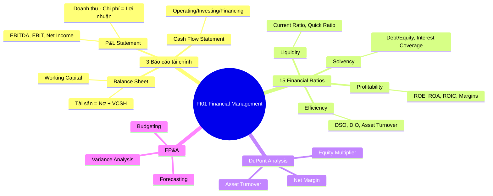

# FI01 — Financial Management

> **Domain:** Finance | **Level:** Intermediate | **Prerequisites:** AC01, AC02

---

## 1. Learning Objectives

Sau khi hoàn thành module này, học viên có thể:
- Đọc và phân tích 3 báo cáo tài chính chính: P&L, Balance Sheet, Cash Flow Statement
- Tính toán và diễn giải 15 financial ratios thuộc 4 nhóm: liquidity, solvency, profitability, efficiency
- Thực hiện DuPont analysis để phân tích ROE
- Đánh giá financial health của doanh nghiệp VN (SME và listed company)
- Ứng dụng Working Capital Management để tối ưu dòng tiền
- Xây dựng Financial Planning & Analysis (FP&A) framework cơ bản

---

## 2. Business Context

Financial Management là nền tảng của mọi quyết định kinh doanh. Trong bối cảnh VN:
- **SME (chiếm 98% doanh nghiệp VN):** Phần lớn chủ doanh nghiệp không có nền tảng tài chính bài bản, dẫn đến quản lý dòng tiền kém, thiếu vốn lưu động mặc dù có lợi nhuận.
- **Listed companies (HOSE/HNX):** Phải tuân thủ chuẩn mực VAS, nhiều công ty lớn đang chuyển đổi sang IFRS theo lộ trình BTC.
- **FDI enterprises:** Áp dụng GAAP hoặc IFRS của công ty mẹ, báo cáo song ngữ VN/EN.
- **Vấn đề phổ biến:** "Có lãi nhưng không có tiền" — profit ≠ cash, hiểu lầm cơ bản nhất trong quản trị tài chính VN.

---

## 3. Definitions (Bảng Thuật Ngữ)

| Thuật ngữ | Định nghĩa | Ví dụ |
|-----------|-----------|-------|
| P&L (Profit & Loss) | Báo cáo kết quả kinh doanh, thể hiện doanh thu – chi phí = lợi nhuận trong kỳ | Báo cáo KQHĐKD của Vinamilk |
| Balance Sheet | Bảng cân đối kế toán: Tài sản = Nợ phải trả + Vốn chủ sở hữu | Cân đối kế toán ngày 31/12 |
| Cash Flow Statement | Báo cáo lưu chuyển tiền tệ: Operating/Investing/Financing | LCTT từ hoạt động kinh doanh |
| EBITDA | Earnings Before Interest, Taxes, Depreciation & Amortization | EBITDA = EBIT + D&A |
| ROE | Return on Equity = LNST / Vốn chủ sở hữu | ROE Vinamilk ~30% |
| ROA | Return on Assets = LNST / Tổng tài sản | ROA trung bình ngành sữa ~10% |
| ROIC | Return on Invested Capital = NOPAT / Invested Capital | Đo hiệu quả vốn đầu tư |
| Working Capital | Vốn lưu động = Tài sản ngắn hạn - Nợ ngắn hạn | WC dương = an toàn thanh khoản |
| DuPont Analysis | Phân tách ROE = Net Margin × Asset Turnover × Equity Multiplier | Phân tích cấu trúc sinh lợi |
| FP&A | Financial Planning & Analysis — lập kế hoạch và phân tích tài chính | Bộ phận FP&A trong tập đoàn |
| VAS | Vietnam Accounting Standards — chuẩn mực kế toán VN | Áp dụng cho DN VN |
| IFRS | International Financial Reporting Standards | Tập đoàn niêm yết quốc tế |
| GAAP | Generally Accepted Accounting Principles (US) | Công ty Mỹ, FDI từ Mỹ |

---

## 4. Core Concepts (với Diagrams)

### 4.1 Ba Báo Cáo Tài Chính Cốt Lõi

```
┌─────────────────────────────────────────────────────────────┐
│                    3 BÁO CÁO TÀI CHÍNH                      │
├─────────────────┬──────────────────┬────────────────────────┤
│   P&L STATEMENT │  BALANCE SHEET   │ CASH FLOW STATEMENT    │
│   (KQHĐKD)      │  (CĐKT)          │ (LCTT)                 │
├─────────────────┼──────────────────┼────────────────────────┤
│ Doanh thu       │ TÀI SẢN          │ Operating Activities   │
│ - Giá vốn       │   Ngắn hạn       │   + LNST               │
│ = Gross Profit  │   Dài hạn        │   ± Working Capital Δ  │
│ - OPEX          │                  │   + D&A                │
│ = EBIT          │ NỢ PHẢI TRẢ      │                        │
│ - Interest      │   Ngắn hạn       │ Investing Activities   │
│ = EBT           │   Dài hạn        │   - CapEx              │
│ - Tax           │                  │   ± M&A                │
│ = Net Income    │ VỐN CHỦ SỞ HỮU  │                        │
│                 │   Vốn góp        │ Financing Activities   │
│ ACCRUAL BASIS   │   LN giữ lại     │   ± Debt               │
│                 │                  │   - Dividends          │
│ Kỳ: Q, Y       │ Thời điểm: ngày  │ = Net Cash Change      │
└─────────────────┴──────────────────┴────────────────────────┘
```

### 4.2 DuPont Analysis Framework

```
ROE
 └── Net Profit Margin × Asset Turnover × Equity Multiplier
       (LNST/Doanh thu)   (DT/Tổng TS)   (Tổng TS/VCSH)
            │                   │                │
        Kiểm soát          Hiệu quả sử       Đòn bẩy tài
        chi phí            dụng tài sản       chính
```

### 4.3 Financial Ratios Map

```
15 FINANCIAL RATIOS
├── LIQUIDITY (Thanh khoản)
│   ├── Current Ratio = CA/CL          [>1.5 tốt]
│   ├── Quick Ratio = (CA-Inv)/CL      [>1.0 tốt]
│   └── Cash Ratio = Cash/CL           [>0.2 tốt]
├── SOLVENCY (Khả năng trả nợ)
│   ├── Debt/Equity Ratio              [<2 an toàn]
│   ├── Debt/EBITDA                    [<3x tốt]
│   ├── Interest Coverage = EBIT/I     [>3x tốt]
│   └── Debt/Assets                    [<0.5 tốt]
├── PROFITABILITY (Sinh lợi)
│   ├── Gross Margin = GP/Revenue      [>30% tốt]
│   ├── EBITDA Margin                  [>15% tốt]
│   ├── Net Margin = NI/Revenue        [tùy ngành]
│   ├── ROE = NI/Equity                [>15% tốt]
│   ├── ROA = NI/Assets                [>5% tốt]
│   └── ROIC = NOPAT/IC                [>WACC tốt]
└── EFFICIENCY (Hiệu quả hoạt động)
    ├── Asset Turnover = Rev/Assets
    ├── Inventory Turnover = COGS/Inv
    └── Receivables Turnover = Rev/AR
```

---

## 5. Business Value

- **Ra quyết định:** Financial ratios giúp CEO/CFO quyết định đầu tư, vay vốn, mở rộng
- **Gọi vốn:** Nhà đầu tư, ngân hàng yêu cầu báo cáo tài chính để đánh giá rủi ro
- **M&A:** Due diligence tài chính là bước bắt buộc trong mọi thương vụ
- **Tối ưu vận hành:** Phân tích ratio giúp phát hiện vấn đề sớm (hàng tồn kho cao, AR tệ)
- **Tuân thủ:** Báo cáo thuế, kiểm toán, niêm yết đều yêu cầu BCTC chuẩn

---

## 6. Enterprise Role

| Cấp độ | Vai trò tài chính |
|--------|-----------------|
| CEO/Board | Phê duyệt chiến lược tài chính, báo cáo cổ đông |
| CFO | Giám sát toàn bộ hệ thống tài chính, FP&A, Treasury |
| Finance Director | Quản lý team kế toán, kiểm soát nội bộ |
| Financial Analyst | Phân tích ratio, lập báo cáo quản trị |
| Accountant | Hạch toán, lập BCTC theo VAS/IFRS |

---

## 7. Departments Related

- **Kế toán:** Lập BCTC, hạch toán nghiệp vụ
- **Kiểm soát nội bộ (Internal Audit):** Kiểm tra tuân thủ, phát hiện gian lận
- **FP&A:** Lập kế hoạch tài chính, phân tích variance
- **Treasury:** Quản lý cash, FX, debt
- **Ban lãnh đạo:** Sử dụng BCTC để ra quyết định chiến lược
- **Sales/Marketing:** Cung cấp doanh thu thực tế cho P&L
- **Supply Chain:** Ảnh hưởng đến COGS, Inventory

---

## 8. Input

- Chứng từ kế toán (hóa đơn, phiếu thu/chi, hợp đồng)
- Dữ liệu giao dịch từ ERP (SAP, Oracle, MISA)
- Bảng lương, khấu hao tài sản
- Báo cáo bán hàng, mua hàng
- Dữ liệu thị trường (lãi suất, tỷ giá)
- Quy định VAS/IFRS/GAAP áp dụng

---

## 9. Output

- P&L Statement (tháng/quý/năm)
- Balance Sheet (cuối kỳ)
- Cash Flow Statement
- Financial Ratios Dashboard
- Management Reporting Package
- Board presentation
- Báo cáo thuế (Quyết toán thuế TNDN, VAT)
- Báo cáo kiểm toán (nếu bắt buộc)

---

## 10. Business Process

```
Thu thập       Hạch toán      Lập BCTC       Phân tích      Báo cáo
chứng từ  →   nghiệp vụ  →  tạm thời   →   & kiểm tra  →  & quyết định
   │               │              │               │              │
Hóa đơn      Journal Entry   Trial Balance   Ratio Analysis  Board Report
Hợp đồng     Ledger Update   Adjustments     Trend Analysis  Tax Filing
Phiếu CT     ERP posting     Close entries   Benchmarking    Audit
```

---

## 11. Data Flow

```
SOURCE SYSTEMS          ACCOUNTING CORE         REPORTING
─────────────          ───────────────         ─────────
Sales System    ──→    General Ledger   ──→    P&L
Purchase System ──→    Sub-ledgers      ──→    Balance Sheet
Payroll         ──→    (AR, AP, FA)     ──→    Cash Flow
Fixed Assets    ──→    Trial Balance    ──→    Ratios Dashboard
Bank Statements ──→    Adjustments      ──→    Management Pack
```

---

## 12. Money Flow

```
DOANH THU          →    GROSS PROFIT    →    EBITDA
(Revenue)               (sau COGS)           (sau OPEX)
    │                        │                    │
    ↓                        ↓                    ↓
Tiền mặt/AR           Margin Analysis        EBIT → EBT
Cash collection       Pricing decision       → Net Income
Working Capital        Gross margin %        → Retained Earnings
```

---

## 13. Document Flow

| Chứng từ | Từ | Đến | Mục đích |
|---------|-----|-----|---------|
| Hóa đơn GTGT | Nhà cung cấp | Kế toán | Ghi nhận chi phí |
| Phiếu thu tiền | Khách hàng | Kế toán | Ghi nhận doanh thu |
| Bảng lương | HR | Kế toán | Chi phí nhân sự |
| Biên bản bàn giao | Kho/SXKD | Kế toán | Ghi nhận tài sản |
| BCTC đã kiểm toán | Kế toán | Ban lãnh đạo/Cơ quan thuế | Tuân thủ |

---

## 14. Roles

| Vai trò | Mô tả |
|---------|-------|
| CFO | Chief Financial Officer — người đứng đầu tài chính |
| Controller | Giám sát kế toán, BCTC, tuân thủ |
| FP&A Manager | Lập kế hoạch và phân tích tài chính |
| Senior Financial Analyst | Phân tích, modeling, dashboard |
| Chief Accountant (Kế toán trưởng) | Trưởng phòng kế toán theo luật VN |
| External Auditor | Kiểm toán độc lập (Big4, mid-tier) |

---

## 15. Responsibilities

- **CFO:** Chiến lược tài chính, quan hệ nhà đầu tư, ngân hàng, báo cáo HĐQT
- **Controller:** Đảm bảo BCTC chính xác, tuân thủ VAS/IFRS, quản lý kiểm toán
- **FP&A Manager:** Budget, forecast, variance analysis, business partnering
- **Kế toán trưởng:** Ký BCTC, chịu trách nhiệm pháp lý theo Luật Kế toán VN
- **Financial Analyst:** Xây dựng models, báo cáo, phân tích trend

---

## 16. RACI (Bảng)

| Hoạt động | CFO | Controller | FP&A | Kế toán trưởng | Auditor |
|-----------|-----|-----------|------|----------------|---------|
| Lập BCTC | A | R | I | R | C |
| Phân tích ratio | A | C | R | I | — |
| Lập budget | A | C | R | C | — |
| Kiểm toán | A | R | I | R | R |
| Báo cáo HĐQT | R | C | C | I | — |
| Nộp báo cáo thuế | A | C | I | R | — |

*R=Responsible, A=Accountable, C=Consulted, I=Informed*

---

## 17. Frameworks

- **DuPont Analysis:** ROE = Net Margin × Asset Turnover × Equity Multiplier
- **Financial Health Scorecard:** 15 ratios theo 4 nhóm
- **Balanced Scorecard (BSC):** Tích hợp financial perspective
- **COSO Framework:** Internal control over financial reporting
- **Three-Statement Model:** P&L → Balance Sheet → Cash Flow liên kết

---

## 18. International Standards

| Chuẩn mực | Phạm vi | Điểm khác biệt chính |
|-----------|---------|---------------------|
| VAS (Vietnam) | Bắt buộc DN VN | Gần IFRS nhưng có nhiều khác biệt (VAS 2, VAS 14...) |
| IFRS (IAS) | DN niêm yết quốc tế, FDI | Revenue recognition (IFRS 15), Leases (IFRS 16) |
| US GAAP | Công ty Mỹ, NYSE-listed | Rule-based, chi tiết hơn IFRS |
| IFRS for SMEs | DN vừa và nhỏ | Đơn giản hơn full IFRS |

---

## 19. Vietnam Context

**Thực tiễn VN:**
- Luật Kế toán 2015 và Nghị định 174/2016/NĐ-CP quy định chuẩn mực kế toán
- Thông tư 200/2014/TT-BTC: Chế độ kế toán doanh nghiệp (thay TT 228)
- Thông tư 133/2016: Dành riêng cho SME
- Lộ trình áp dụng IFRS: BTC yêu cầu DN niêm yết áp dụng IFRS từ 2025 (tự nguyện), 2030 (bắt buộc)

**Ví dụ Vinamilk (VNM - HOSE):**
- Doanh thu 2023: ~60,000 tỷ VND
- Gross Margin: ~43%
- EBITDA Margin: ~22%
- ROE: ~30%
- Net Margin: ~15%

**SME VN điển hình (Công ty sản xuất, 200 tỷ doanh thu):**
- Gross Margin: 25-35% (thấp do cạnh tranh giá)
- Net Margin: 3-8%
- Current Ratio: 1.2-1.8
- Debt/Equity: 1.0-2.5 (vay ngân hàng nhiều)

---

## 20. Legal Considerations

- **Luật Kế toán 2015:** Kế toán trưởng phải có chứng chỉ, chịu trách nhiệm hình sự nếu gian lận
- **Luật Thuế TNDN:** Thu nhập chịu thuế tính theo chuẩn mực thuế, khác với BCTC
- **Luật Doanh nghiệp 2020:** Công ty đại chúng phải kiểm toán BCTC hàng năm
- **Nghị định 47/2021:** Kiểm soát nội bộ với công ty đại chúng
- **Công ty niêm yết:** Nộp BCTC quý trong 45 ngày, BCTC năm trong 90 ngày sau khi kết thúc năm tài chính

---

## 21. Common Mistakes

1. **Nhầm lợi nhuận với dòng tiền:** Profit ≠ Cash — đây là lỗi phổ biến nhất
2. **Bỏ qua Working Capital:** Tăng trưởng nhanh nhưng không tính vốn lưu động
3. **Không phân biệt CAPEX vs OPEX:** Ảnh hưởng đến P&L và Cash Flow khác nhau
4. **Ratio không so sánh với benchmark ngành:** Ratio tốt/xấu phải xét theo context
5. **BCTC "hai sổ":** Một cho thuế, một cho quản lý — rủi ro pháp lý cao
6. **Thiếu reconciliation:** Số liệu kế toán vs. ERP vs. Excel không khớp
7. **Không điều chỉnh one-off items:** Làm sai lệch trend analysis
8. **Ghi nhận doanh thu sai thời điểm:** Vi phạm accrual basis

---

## 22. Best Practices

1. **Monthly close process:** Đóng sổ đúng hạn (T+5 cho SME, T+3 cho listed)
2. **Three-way reconciliation:** P&L ↔ Balance Sheet ↔ Cash Flow phải balanced
3. **Rolling forecast:** Cập nhật dự báo hàng tháng thay vì chỉ dùng annual budget
4. **Driver-based planning:** Liên kết KPI hoạt động với financial metrics
5. **Benchmark hàng quý:** So sánh với đối thủ cùng ngành
6. **Phân tách one-off vs recurring:** Để đánh giá đúng sustainable earnings
7. **Chart of Accounts chuẩn:** Thiết kế COA từ đầu theo cả VAS và management reporting needs

---

## 23. KPIs (Bảng)

| KPI | Công thức | Ngưỡng tốt (VN) | Tần suất |
|-----|-----------|----------------|---------|
| Gross Margin | GP/Revenue | >30% | Tháng |
| EBITDA Margin | EBITDA/Revenue | >15% | Tháng |
| Net Margin | NI/Revenue | >5% | Tháng |
| ROE | NI/Equity | >15% | Năm |
| ROA | NI/Assets | >5% | Năm |
| Current Ratio | CA/CL | 1.5–2.5 | Tháng |
| Debt/EBITDA | Total Debt/EBITDA | <3.0x | Quý |
| DSO | AR×365/Revenue | <45 ngày | Tháng |
| DIO | Inv×365/COGS | <60 ngày | Tháng |
| DPO | AP×365/COGS | 30–45 ngày | Tháng |

---

## 24. Metrics

- **Cash Conversion Cycle (CCC):** DSO + DIO - DPO (thấp = tốt)
- **Altman Z-Score:** Dự báo nguy cơ phá sản (Z > 2.99 = an toàn)
- **Piotroski F-Score:** 9 điểm đánh giá sức khỏe tài chính (7-9 = tốt)
- **Economic Value Added (EVA):** NOPAT - (WACC × Invested Capital)
- **Sustainable Growth Rate:** ROE × (1 - Payout Ratio)

---

## 25. Reports

| Báo cáo | Tần suất | Người nhận | Nội dung chính |
|---------|---------|-----------|--------------|
| Flash Report | Tuần | CFO, CEO | Doanh thu, cash, key variances |
| Monthly P&L | Tháng | Management | Full P&L vs budget, YoY |
| Board Package | Quý | HĐQT | 3 BCTC + KPI + outlook |
| Annual Report | Năm | Cổ đông, cơ quan thuế | BCTC kiểm toán + MD&A |
| Ratio Dashboard | Tháng | CFO | 15 ratios + trend |

---

## 26. Templates

**P&L Template (VN format — VAS):**
```
DOANH THU THUẦN                    100,000
  Giá vốn hàng bán                (65,000)
LỢI NHUẬN GỘP                      35,000   [Gross Margin: 35%]
  Chi phí bán hàng                 (8,000)
  Chi phí quản lý doanh nghiệp    (7,000)
EBITDA                              20,000   [EBITDA Margin: 20%]
  Khấu hao & phân bổ              (3,000)
EBIT                                17,000
  Chi phí lãi vay                  (2,000)
LỢI NHUẬN TRƯỚC THUẾ              15,000
  Thuế TNDN (20%)                  (3,000)
LỢI NHUẬN SAU THUẾ                12,000   [Net Margin: 12%]
```

---

## 27. Checklists

**Monthly Close Checklist:**
- [ ] Đối chiếu ngân hàng (bank reconciliation)
- [ ] Kiểm tra AR/AP aging
- [ ] Hạch toán khấu hao tài sản cố định
- [ ] Accrual chi phí chưa có hóa đơn
- [ ] Kiểm tra hàng tồn kho (nếu có biến động)
- [ ] Reconcile intercompany transactions
- [ ] Review P&L vs budget (explain variances >5%)
- [ ] Sign-off bởi Kế toán trưởng/Controller

**Financial Health Checklist:**
- [ ] Current Ratio > 1.2
- [ ] Debt/EBITDA < 4x
- [ ] Net Margin > 3%
- [ ] DSO < 60 ngày (VN context)
- [ ] Cash đủ cho 3 tháng hoạt động

---

## 28. SOP

**SOP: Monthly Financial Close**
1. T-1: Nhắc nhở các phòng ban nộp chứng từ
2. T+1: Kiểm tra và hạch toán chứng từ còn lại
3. T+2: Bank reconciliation, AR/AP reconciliation
4. T+3: Lập trial balance, check exceptions
5. T+4: Điều chỉnh (adjustments, accruals)
6. T+5: Lập P&L, Balance Sheet, Cash Flow
7. T+6: Review với CFO/Controller
8. T+7: Phân phát cho management team

---

## 29. Case Study

**Vinamilk — Phân tích Financial Health 2023**

Vinamilk (VNM) là công ty sữa lớn nhất VN, niêm yết HOSE.

| Chỉ số | 2022 | 2023 | Nhận xét |
|--------|------|------|---------|
| Gross Margin | 42.1% | 43.5% | Cải thiện nhờ giá nguyên liệu giảm |
| EBITDA Margin | 21.3% | 22.8% | Hiệu quả chi phí tốt |
| Net Margin | 14.2% | 15.1% | Bền vững, top quartile ngành |
| ROE | 28.5% | 30.2% | Rất cao, trả cổ tức cao |
| Debt/EBITDA | 0.3x | 0.2x | Gần như không nợ |
| DSO | 28 ngày | 25 ngày | Thu tiền nhanh (kênh MT) |

**DuPont Decomposition VNM 2023:**
- ROE (30%) = Net Margin (15.1%) × Asset Turnover (1.2x) × Equity Multiplier (1.65x)
- Nhận xét: ROE cao nhờ margin tốt và turnover ổn, không phụ thuộc đòn bẩy

---

## 30. Small Business Example

**Công ty TNHH Thực phẩm Minh Châu (200 tỷ doanh thu)**

Tình huống: Chủ doanh nghiệp thắc mắc "tại sao lãi 10 tỷ nhưng tài khoản cạn tiền?"

Phân tích:
- Net Income: +10 tỷ (trên P&L)
- Nhưng: Tăng hàng tồn kho +8 tỷ (nhập hàng trước Tết)
- Tăng phải thu khách hàng +6 tỷ (khách hàng trả chậm)
- Giảm phải trả nhà cung cấp -3 tỷ (trả nhanh để được discount)
- **Operating Cash Flow thực tế: 10 - 8 - 6 - 3 = -7 tỷ**

Bài học: Working Capital tăng mạnh hút tiền mặt dù P&L có lãi.

---

## 31. Enterprise Example

**Tập đoàn Masan — Cấu trúc Financial Management**

Masan Group (MSN) với cấu trúc holding complex:
- **Segment P&L:** Masan Consumer, Masan MeatLife, WCM (WinMart), Masan Resources
- **Consolidation challenge:** Loại trừ intercompany transactions
- **IFRS vs VAS:** Báo cáo song ngữ cho nhà đầu tư nước ngoài
- **FP&A process:** Tập trung tại Group level, business units cung cấp data
- **Key metric:** EBITDA by segment để đánh giá từng mảng kinh doanh

---

## 32. ERP Mapping

| Chức năng | SAP | Oracle | MISA | Fast Accounting |
|-----------|-----|--------|------|----------------|
| General Ledger | FI-GL | GL Module | Sổ cái | Sổ cái tổng hợp |
| Accounts Receivable | FI-AR | AR Module | Công nợ PT | Công nợ phải thu |
| Accounts Payable | FI-AP | AP Module | Công nợ PP | Công nợ phải trả |
| Fixed Assets | FI-AA | FA Module | Tài sản cố định | TSCĐ |
| Controlling/FP&A | CO Module | EPM | Báo cáo quản trị | — |
| Consolidation | SEM-BCS | HFM | Hợp nhất | — |

---

## 33. Automation Opportunities

- **Bank reconciliation tự động:** Matching rules trong ERP (tiết kiệm 80% thời gian)
- **Automated close:** Workflow-based month-end close với approvals
- **Report generation:** Power BI/Tableau kết nối ERP, báo cáo real-time
- **Invoice processing:** OCR + AI để tự động nhập hóa đơn
- **Variance alerts:** Tự động email khi variance > threshold
- **Tax filing automation:** Kết nối HTKK (VN tax software) với ERP

---

## 34. AI Opportunities

- **Predictive analytics:** AI dự báo doanh thu, cash flow từ historical patterns
- **Anomaly detection:** ML phát hiện giao dịch bất thường, fraud
- **Natural language reporting:** ChatGPT-style query trên financial data
- **Automated commentary:** AI viết narrative cho financial reports
- **Credit scoring:** AI đánh giá rủi ro tín dụng khách hàng
- **Scenario modeling:** AI tạo multiple scenarios cho FP&A

---

## 35. Implementation Guide

**Xây dựng Financial Management System cho SME VN (6 tháng):**

| Tháng | Hoạt động |
|-------|----------|
| T1 | Audit hiện trạng: kế toán, phần mềm, quy trình |
| T2 | Thiết kế Chart of Accounts chuẩn VAS + management |
| T3 | Triển khai ERP (MISA/Fast) hoặc nâng cấp |
| T4 | Xây dựng monthly close SOP, training team |
| T5 | Thiết kế KPI dashboard (Power BI/Excel) |
| T6 | Go-live, review báo cáo tháng đầu, fine-tune |

---

## 36. Consulting Guide

**Diagnostic approach khi vào 1 doanh nghiệp mới:**
1. Yêu cầu 3 BCTC 3 năm gần nhất (kiểm toán nếu có)
2. Tính 15 ratios, so sánh trend YoY và benchmark ngành
3. Phỏng vấn CFO/Kế toán trưởng về quy trình close
4. Kiểm tra: ERP có đang dùng đúng không? Excel hay ERP?
5. Đánh giá quality of earnings: recurring vs one-off
6. Red flags: Revenue spike cuối năm, AR tăng bất thường, cash flow âm liên tục

---

## 37. Diagnostic Questions

1. Gross margin có consistent với ngành không? Xu hướng 3 năm ra sao?
2. Cash flow from operations có dương không? Có tương quan với Net Income không?
3. AR collection có đang xấu đi không? DSO trend?
4. Nợ vay có đang tăng nhanh hơn EBITDA không? Debt/EBITDA bao nhiêu?
5. BCTC có được kiểm toán không? Bởi ai (Big4, mid-tier, local)?
6. Có sử dụng một bộ sổ sách không hay "hai sổ"?
7. FP&A process có không? Có so sánh với budget không?

---

## 38. Interview Questions

**Cho vị trí Financial Analyst:**
1. Giải thích DuPont analysis và cho ví dụ thực tế
2. Một công ty có Net Income dương nhưng Cash Flow âm — vì sao?
3. Tính và diễn giải Current Ratio, Quick Ratio từ Balance Sheet cho sẵn
4. EBITDA khác Net Income ở điểm nào? Khi nào dùng EBITDA?

**Cho vị trí CFO:**
1. Làm thế nào bạn build FP&A process từ đầu cho một công ty 500 tỷ?
2. Describe một tình huống bạn phát hiện financial issue qua ratio analysis
3. VAS và IFRS khác nhau ở điểm nào quan trọng nhất với doanh nghiệp VN?

---

## 39. Exercises

**Bài tập 1:** Cho P&L và Balance Sheet của một công ty sản xuất VN — tính 15 ratios, nhận xét financial health.

**Bài tập 2:** Từ Net Income 20 tỷ, Working Capital tăng 15 tỷ, CapEx 8 tỷ — tính Operating Cash Flow và Free Cash Flow.

**Bài tập 3:** DuPont analysis — hai công ty cùng ROE 20%, nhưng khác nhau hoàn toàn về cơ cấu. Phân tích và giải thích.

**Bài tập 4:** Đọc BCTC thực của Vinamilk hoặc FPT từ website HOSE, tính 5 ratios chính, so sánh với năm trước.

---

## 40. References

- Brealey, Myers, Allen — "Principles of Corporate Finance" (McGraw-Hill)
- Damodaran — "Applied Corporate Finance" (Wiley)
- CFA Institute — Financial Statement Analysis (CFA Level 1)
- Thông tư 200/2014/TT-BTC — Chế độ kế toán doanh nghiệp
- Thông tư 133/2016/TT-BTC — Chế độ kế toán SME
- IFRS Foundation — ifrs.org (chuẩn mực quốc tế)
- HOSE/HNX — cafef.vn, vietstock.vn (dữ liệu công ty VN)

---

## Output Formats

### Mermaid Diagram



### ASCII Diagram

```
╔══════════════════════════════════════════════════╗
║         FINANCIAL MANAGEMENT OVERVIEW            ║
╠══════════════════════════════════════════════════╣
║  P&L         BALANCE SHEET    CASH FLOW          ║
║  Revenue     Assets           Operating CF       ║
║  - COGS      = Liabilities    + Investing CF     ║
║  = GrossProfit  + Equity      + Financing CF     ║
║  - OPEX                       = Net Cash         ║
║  = EBITDA    ─────────────                       ║
║  - D&A       Working Capital  FREE CASH FLOW     ║
║  = EBIT      = CA - CL        = OCF - CapEx      ║
║  - Interest                                      ║
║  = Net Income   DUPONT ANALYSIS                  ║
║              ROE = NM × AT × EM                  ║
╚══════════════════════════════════════════════════╝
```

### Flashcards

**Q1:** DuPont Analysis phân tách ROE thành 3 thành phần nào?
**A1:** ROE = Net Profit Margin (hiệu quả chi phí) × Asset Turnover (hiệu quả tài sản) × Equity Multiplier (đòn bẩy tài chính)

**Q2:** Tại sao một công ty có lãi nhưng vẫn thiếu tiền?
**A2:** Vì Profit tính theo accrual basis còn Cash là thực tế. Tăng Working Capital (AR, Inventory) hoặc CapEx lớn sẽ hút tiền mặt dù P&L có lãi.

**Q3:** EBITDA khác Net Income điểm gì và khi nào dùng EBITDA?
**A3:** EBITDA = Net Income + Interest + Tax + D&A. Dùng EBITDA khi so sánh giữa các công ty có cấu trúc vốn khác nhau hoặc mức khấu hao khác nhau, đặc biệt trong M&A và valuation (EV/EBITDA).

### Cheat Sheet

```
╔══════════════════════════════════════════════════════╗
║             FI01 FINANCIAL MANAGEMENT                ║
║                   CHEAT SHEET                        ║
╠══════════════════════════════════════════════════════╣
║ LIQUIDITY     │ Current = CA/CL        [>1.5]        ║
║               │ Quick = (CA-Inv)/CL    [>1.0]        ║
╠══════════════════════════════════════════════════════╣
║ SOLVENCY      │ D/E = Debt/Equity      [<2.0]        ║
║               │ Interest Cover=EBIT/I  [>3x]         ║
╠══════════════════════════════════════════════════════╣
║ PROFITABILITY │ ROE = NI/Equity        [>15%]        ║
║               │ ROA = NI/Assets        [>5%]         ║
║               │ ROIC = NOPAT/IC        [>WACC]       ║
╠══════════════════════════════════════════════════════╣
║ EFFICIENCY    │ DSO = AR×365/Rev       [<45d]        ║
║               │ DIO = Inv×365/COGS     [<60d]        ║
╠══════════════════════════════════════════════════════╣
║ DUPONT        │ ROE = Margin×TO×EM                   ║
╠══════════════════════════════════════════════════════╣
║ VN CONTEXT    │ VAS: TT200/2014                      ║
║               │ IFRS lộ trình 2025-2030              ║
║               │ Kế toán trưởng ký BCTC               ║
╚══════════════════════════════════════════════════════╝
```

### JSON Metadata

```json
{
  "module": "FI01",
  "name": "Financial Management",
  "domain": "Finance",
  "level": "Intermediate",
  "prerequisites": ["AC01", "AC02"],
  "related_modules": ["FI02", "FI03", "FI04", "FI05", "FI06"],
  "key_concepts": ["P&L", "Balance Sheet", "Cash Flow", "Financial Ratios", "DuPont", "FP&A", "Working Capital"],
  "key_metrics": ["ROE", "ROA", "ROIC", "EBITDA", "Net Margin", "Current Ratio", "DSO"],
  "standards": ["VAS", "IFRS", "GAAP"],
  "vn_laws": ["TT200/2014/TT-BTC", "TT133/2016/TT-BTC", "Luat Ke toan 2015"],
  "tools": ["SAP FI", "Oracle Financials", "MISA", "Power BI"],
  "estimated_learning_hours": 16,
  "last_updated": "2026-06-30"
}
```
