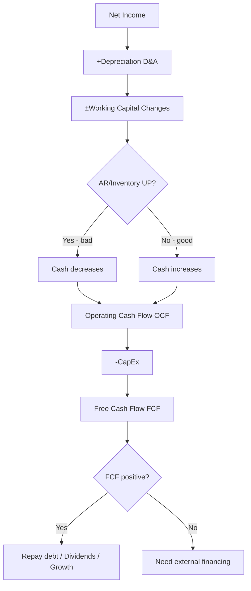

# FI02 — Cash Flow Management

> **Domain:** Finance | **Level:** Intermediate | **Prerequisites:** FI01

---

## 1. Learning Objectives

Sau khi hoàn thành module này, học viên có thể:
- Phân tích Cash Flow Statement theo 3 phần: Operating, Investing, Financing
- Tính toán Free Cash Flow (FCF) và diễn giải ý nghĩa
- Hiểu và tính Cash Conversion Cycle (DSO + DIO - DPO)
- Xây dựng 13-week cash forecast
- Nhận diện và xử lý các vấn đề thanh khoản phổ biến ở doanh nghiệp VN
- Thiết kế Working Capital optimization plan

---

## 2. Business Context

Cash là "máu" của doanh nghiệp — thiếu cash là chết ngay cả khi có lãi. Tại VN:
- **"Chết vì cash flow"** là nguyên nhân phá sản phổ biến nhất, không phải vì thiếu lợi nhuận
- **SME VN:** 70% doanh nghiệp gặp vấn đề cash flow trong năm đầu mở rộng
- **Nền kinh tế tiền mặt:** VN vẫn còn tỷ lệ giao dịch tiền mặt cao, quản lý cash phức tạp hơn
- **Mùa vụ:** Nhiều ngành (bán lẻ, nông nghiệp, du lịch) có cash flow biến động mạnh theo mùa
- **Chính sách tín dụng khách hàng:** DN VN thường cho credit term dài (60-90 ngày) để giữ khách hàng nhưng không kiểm soát được DSO
- **Ngân hàng:** Hạn mức tín dụng ngân hàng VN thường yêu cầu tài sản thế chấp, SME khó tiếp cận vốn ngắn hạn linh hoạt

---

## 3. Definitions (Bảng Thuật Ngữ)

| Thuật ngữ | Định nghĩa | Ví dụ |
|-----------|-----------|-------|
| Operating Cash Flow (OCF) | Tiền từ hoạt động kinh doanh chính | Thu tiền bán hàng, trả nhà cung cấp |
| Free Cash Flow (FCF) | OCF - Capital Expenditure | FCF = 50 tỷ - 10 tỷ CapEx = 40 tỷ |
| FCFF | Free Cash Flow to Firm — trước trả nợ | EBIT(1-T) + D&A - ΔWC - CapEx |
| FCFE | Free Cash Flow to Equity — sau trả nợ | FCFF - Interest(1-T) + Net Borrowing |
| DSO | Days Sales Outstanding — kỳ thu tiền | AR × 365 / Revenue |
| DIO | Days Inventory Outstanding — kỳ tồn kho | Inventory × 365 / COGS |
| DPO | Days Payable Outstanding — kỳ trả tiền | AP × 365 / COGS |
| CCC | Cash Conversion Cycle = DSO + DIO - DPO | Chu kỳ chuyển đổi tiền mặt |
| Working Capital | Vốn lưu động = CA - CL | Phản ánh thanh khoản ngắn hạn |
| Cash Pooling | Gom cash từ các tài khoản công ty con | Tập đoàn dùng để tối ưu lãi suất |
| Liquidity Ratio | Tỷ lệ thanh khoản (Current, Quick, Cash) | Đánh giá khả năng trả nợ ngắn hạn |
| 13-Week Cash Forecast | Dự báo dòng tiền 13 tuần chi tiết | Công cụ quản lý thanh khoản ngắn hạn |

---

## 4. Core Concepts (với Diagrams)

### 4.1 Cash Flow Statement Structure

```
CASH FLOW STATEMENT
├── OPERATING ACTIVITIES (Hoạt động kinh doanh)
│   Method 1 - Indirect (phổ biến VN):
│   + Net Income
│   + Depreciation & Amortization (D&A)
│   ± Changes in Working Capital
│     - ↑AR = xấu (tăng phải thu = tiền chưa về)
│     - ↑Inventory = xấu (tiền bị "nhốt" trong hàng)
│     - ↑AP = tốt (trả chậm nhà cung cấp = giữ tiền)
│   = Operating Cash Flow (OCF)
│
├── INVESTING ACTIVITIES (Hoạt động đầu tư)
│   - CapEx (mua máy móc, xây nhà xưởng)
│   + Proceeds from asset sales
│   ± Acquisitions/Divestitures
│   = Investing Cash Flow (thường âm ở DN tăng trưởng)
│
└── FINANCING ACTIVITIES (Hoạt động tài chính)
    + Vay mới (bank loans, bonds)
    - Trả nợ gốc
    + Phát hành cổ phần
    - Trả cổ tức
    = Financing Cash Flow
```

### 4.2 Cash Conversion Cycle

```
TIỀN MẶT
    │
    ↓ Mua nguyên liệu (trả tiền sau DPO ngày)
NGUYÊN LIỆU
    │
    ↓ Sản xuất/nhập hàng (DIO ngày)
THÀNH PHẨM
    │
    ↓ Bán hàng → tạo phải thu (DSO ngày để thu tiền)
PHẢI THU (AR)
    │
    ↓ Thu tiền
TIỀN MẶT

CCC = DSO + DIO - DPO
        ↑        ↑
   [muốn ngắn] [muốn dài]
```

### 4.3 FCF Waterfall

```
EBITDA                          100
  - Taxes on EBIT                (20)
  - CapEx                        (15)
  - Change in Working Capital    (10)
  + D&A (non-cash, already in EBITDA)  —
= FREE CASH FLOW (FCF)           55

FCF → Trả nợ → Cổ tức → Tái đầu tư → Giữ lại
```

---

## 5. Business Value

- **Sống còn:** Doanh nghiệp chết vì hết cash, không phải vì hết lợi nhuận
- **Định giá:** FCF là nền tảng của DCF valuation (FI04)
- **Tín dụng:** Ngân hàng, nhà đầu tư đánh giá khả năng trả nợ qua OCF
- **Ra quyết định:** Biết cash position giúp CEO quyết định thời điểm đầu tư, tuyển dụng
- **Tối ưu vốn:** Working Capital optimization giải phóng cash không cần vay thêm

---

## 6. Enterprise Role

| Cấp độ | Vai trò với Cash Flow |
|--------|----------------------|
| CEO/Board | Quyết định dividend policy, major CapEx, M&A |
| CFO | Giám sát cash position hàng ngày, xây dựng liquidity policy |
| Treasury Manager | Dự báo cash, quản lý bank lines, FX hedging |
| FP&A Manager | Cash flow forecasting, working capital analysis |
| Kế toán | Cập nhật thực tế cash, AR/AP reconciliation |
| Sales Director | Chính sách tín dụng khách hàng (ảnh hưởng DSO) |
| Procurement | Chính sách thanh toán nhà cung cấp (ảnh hưởng DPO) |

---

## 7. Departments Related

- **Kế toán/Finance:** Lập Cash Flow Statement, reconcile bank
- **Sales/Commercial:** Quyết định credit term khách hàng → ảnh hưởng AR/DSO
- **Procurement/Supply Chain:** Payment terms NCC → ảnh hưởng AP/DPO
- **Kho/Operations:** Quản lý tồn kho → ảnh hưởng Inventory/DIO
- **Treasury:** Cash pooling, bank relationships, short-term investing
- **CEO/CFO:** Cash allocation decisions

---

## 8. Input

- Bank statements hàng ngày
- AR aging report (nợ phải thu theo tuổi)
- AP schedule (lịch thanh toán nhà cung cấp)
- Sales forecast (dự báo thu tiền)
- CapEx plan
- Payroll schedule
- Loan repayment schedule
- Tax payment calendar (VAT tháng, TNDN quý/năm)

---

## 9. Output

- Cash Flow Statement (tháng/quý/năm)
- 13-Week Cash Forecast
- Working Capital Dashboard (DSO, DIO, DPO, CCC)
- Liquidity report (Available Cash, Headroom vs facilities)
- Cash variance analysis (forecast vs actual)
- Bank covenant compliance report

---

## 10. Business Process

```
Dự báo      Thu thập     Dự báo      Monitor     Hành động
nhu cầu  →  dữ liệu   →  cash     →  vs thực  →  điều chỉnh
cash         AR/AP        13-week      tế
             Payroll      forecast     daily
             CapEx
```

---

## 11. Data Flow

```
AR System ──→ Expected receipts ──→ Cash Forecast Model ──→ Daily Position
AP System ──→ Payment schedule ──→                    ──→ Weekly Review
Payroll   ──→ Salary dates      ──→                   ──→ 13-Week Outlook
Bank      ──→ Actual balances   ──→ Variance Analysis ──→ Board Reporting
Sales     ──→ Revenue forecast  ──→
```

---

## 12. Money Flow

```
CASH IN                         CASH OUT
────────                        ────────
Thu từ khách hàng          →    Trả NCC (AP payments)
Vay ngân hàng              →    Trả lương (Payroll)
Góp vốn/Phát hành CP       →    Trả nợ gốc + lãi
Bán tài sản                →    CapEx (đầu tư TSCĐ)
                            →    Thuế (VAT, TNDN, BHXH)
                            →    Cổ tức
                            →    Chi phí vận hành khác
NET CASH CHANGE = IN - OUT
```

---

## 13. Document Flow

| Tài liệu | Người tạo | Người nhận | Tần suất |
|----------|----------|-----------|---------|
| Daily Cash Position | Treasury/KT | CFO | Ngày |
| AR Aging Report | Kế toán công nợ | Credit Manager, CFO | Tuần |
| AP Payment List | KT mua hàng | CFO/Treasury | Tuần |
| 13-Week Cash Forecast | Treasury/FP&A | CFO, CEO | Tuần |
| Cash Flow Statement | Kế toán | Management, KTV | Tháng/Năm |
| Bank Covenant Report | Treasury | CFO, Ngân hàng | Quý |

---

## 14. Roles

| Vai trò | Trách nhiệm chính |
|---------|-----------------|
| CFO | Liquidity policy, bank relationships, approval cash strategy |
| Treasury Manager | Daily cash management, forecasting, bank negotiations |
| AR Manager | Collect receivables, DSO reduction, credit management |
| AP Manager | Optimize DPO, manage supplier payment terms |
| FP&A Analyst | Cash forecasting model, variance analysis |
| Kế toán công nợ | AR/AP entries, aging reports |

---

## 15. Responsibilities

- **CFO:** Đảm bảo công ty không bao giờ hết cash; xây dựng buffer và credit facilities
- **Treasury:** Dự báo cash chính xác, tối ưu lãi tiền gửi và chi phí vay
- **AR team:** Thu tiền đúng hạn, escalate nợ quá hạn
- **AP team:** Trả đúng hạn (không sớm, không trễ), tận dụng early payment discount khi có FCF tốt
- **Sales:** Thỏa thuận credit term hợp lý, không để DSO quá cao vì áp lực doanh số

---

## 16. RACI (Bảng)

| Hoạt động | CFO | Treasury | AR Mgr | AP Mgr | FP&A | Kế toán |
|-----------|-----|---------|--------|--------|------|---------|
| Cash forecasting | A | R | C | C | R | I |
| AR collection | A | I | R | — | I | C |
| AP payment | A | C | — | R | I | R |
| Bank relationship | R | R | — | — | — | — |
| Cash Flow Statement | A | C | C | C | C | R |
| Covenant monitoring | A | R | — | — | C | I |

---

## 17. Frameworks

- **Cash Conversion Cycle (CCC):** DSO + DIO - DPO
- **13-Week Cash Flow Model:** Công cụ chuẩn cho turnaround/restructuring
- **Working Capital Optimization Framework:** Tối ưu 3 levers (AR, AP, Inventory)
- **Cash Pooling Structure:** Zero-balancing hoặc notional pooling
- **Liquidity Buffer Framework:** Minimum cash = X tháng chi phí cố định

---

## 18. International Standards

| Chuẩn mực | Yêu cầu Cash Flow |
|-----------|-----------------|
| VAS 24 | Báo cáo lưu chuyển tiền tệ — phương pháp trực tiếp và gián tiếp |
| IAS 7 (IFRS) | Statement of Cash Flows — phân loại Operating/Investing/Financing |
| US GAAP ASC 230 | Cash Flow Statements — tương tự IAS 7 nhưng chi tiết hơn |
| Basel III | Liquidity Coverage Ratio (LCR) cho ngân hàng |

---

## 19. Vietnam Context

**Thách thức đặc thù VN:**
- **Nền kinh tế tiền mặt:** Nhiều SME vẫn thu tiền mặt → khó reconcile, dễ thất thoát
- **Chu kỳ thanh toán dài:** B2B VN thường có payment term 60-90 ngày, nhiều khi 120 ngày
- **Mùa vụ kinh doanh:** Bán lẻ tăng đột biến trước Tết (T11-T1), cash cần 3-4 tháng trước
- **Vay ngân hàng:** SME VN phụ thuộc vào credit line ngắn hạn, thường yêu cầu tài sản thế chấp
- **Thuế VAT:** DN đóng VAT hàng tháng/quý tạo ra cash outflow lớn định kỳ
- **Lương T13:** Nhiều DN VN có thưởng tháng 13 (tháng 1 năm sau) → spike chi phí nhân sự

**Ví dụ thực tế: Công ty Bán lẻ VN**
- Quý 4 (T10-T12): Nhập hàng nhiều cho Tết → Inventory tăng → Cash giảm
- T1-T2: Bán hàng Tết → Revenue cao nhưng nếu bán trả góp → AR tăng
- T3-T4: Thu tiền → Cash tốt nhất năm
- T5-T8: Off-season → Revenue thấp, phải dự trữ cash từ peak season

---

## 20. Legal Considerations

- **Thông tư 200/2014/TT-BTC, VAS 24:** Bắt buộc lập Báo cáo LCTT theo phương pháp gián tiếp (SME có thể dùng trực tiếp)
- **Luật Thuế TNDN:** Thuế tạm nộp theo quý (≥ 80% số thuế năm), nộp thiếu bị phạt
- **Luật Bảo hiểm xã hội:** BHXH nộp trước ngày 30 tháng, trễ bị phạt 0.03%/ngày
- **Quy định ngoại hối:** Giao dịch ngoại tệ phải qua hệ thống ngân hàng, không được thanh toán ngoại tệ tự do
- **Kiểm soát ngoại hối (NHNN):** Chuyển tiền ra nước ngoài cần chứng từ hợp lệ

---

## 21. Common Mistakes

1. **Nhầm profit với cash:** Kế hoạch chi tiêu dựa trên P&L forecast thay vì cash forecast
2. **Không có 13-week forecast:** Phát hiện thiếu cash quá muộn
3. **DSO không được monitor:** AR aging xấu dần nhưng không ai theo dõi
4. **DPO quá ngắn:** Trả tiền nhà cung cấp sớm không cần thiết, mất cơ hội giữ cash
5. **Bỏ qua seasonality:** Không chuẩn bị cash cho peak season
6. **CapEx không tính vào cash plan:** Mua máy móc nhưng không tính tác động cash
7. **Cash pooling không hiệu quả:** Tiền nằm ở nhiều tài khoản không liên kết
8. **Không có credit facility backup:** Hết cash mới đi xin vay — quá muộn

---

## 22. Best Practices

1. **Dự báo cash 13 tuần:** Rolling weekly forecast, cập nhật mỗi thứ Hai
2. **Target minimum cash buffer:** Bằng 6-8 tuần chi phí cố định (payroll + rent + debt service)
3. **AR collection policy:** SLA thu hồi theo tuổi nợ (30/60/90 ngày)
4. **Dynamic discounting:** Offer 2/10 net 30 (2% discount nếu trả trong 10 ngày) khi có FCF tốt
5. **Inventory just-in-time:** Phối hợp với supply chain để giảm DIO
6. **Cash pooling:** Tập trung cash về một tài khoản master để tối ưu lãi
7. **KPI tuần:** DSO, DPO, CCC, available cash — báo cáo mỗi tuần cho CFO

---

## 23. KPIs (Bảng)

| KPI | Công thức | Mục tiêu | Tần suất |
|-----|-----------|---------|---------|
| Days Sales Outstanding (DSO) | AR×365/Revenue | <45 ngày | Tháng |
| Days Inventory Outstanding (DIO) | Inv×365/COGS | <60 ngày | Tháng |
| Days Payable Outstanding (DPO) | AP×365/COGS | 30-45 ngày | Tháng |
| Cash Conversion Cycle (CCC) | DSO+DIO-DPO | <60 ngày | Tháng |
| Operating Cash Flow | LCTT hoạt động KD | >0, tăng YoY | Tháng |
| Free Cash Flow | OCF - CapEx | >0 | Quý |
| Cash as % of Revenue | Cash/Revenue | >5% | Tháng |
| Current Ratio | CA/CL | >1.5 | Tháng |
| Forecast Accuracy | |Actual-Forecast|/Forecast | <10% | Tuần |

---

## 24. Metrics

- **Cash Burn Rate:** Chi tiêu tiền mặt hàng tháng (quan trọng với startup)
- **Runway:** Cash / Monthly burn rate (số tháng tồn tại nếu không có doanh thu)
- **Liquidity Headroom:** Available credit lines + cash - minimum buffer
- **Working Capital as % of Revenue:** Benchmark với ngành
- **OCF/EBITDA conversion rate:** Lý tưởng >0.8 (OCF phải bằng ≥80% EBITDA)

---

## 25. Reports

| Báo cáo | Tần suất | Nội dung |
|---------|---------|---------|
| Daily Cash Position | Ngày | Cash by account, available headroom |
| Weekly Cash Forecast | Tuần | 13-week rolling, in/out by category |
| AR Aging Report | Tuần | Nợ phải thu theo tuổi, top overdue |
| Monthly Cash Flow Statement | Tháng | OCF/ICF/FCF theo VAS 24 |
| Working Capital Dashboard | Tháng | DSO, DIO, DPO, CCC trend |
| Quarterly Liquidity Report | Quý | Covenant compliance, bank headroom |

---

## 26. Templates

**13-Week Cash Forecast Template:**
```
                    W1      W2      W3   ...  W13
OPENING CASH       100      95      87
CASH IN:
  Customer receipts  50      48      55
  Other income        2       2       2
TOTAL IN            52      50      57

CASH OUT:
  Supplier payments (25)    (28)    (30)
  Payroll            (20)    —      (20)
  Tax payments        —      —      (15)
  Debt service        (5)    (5)    (5)
  CapEx               —      (7)    —
TOTAL OUT           (50)    (40)    (70)

NET MOVEMENT         2      10     (13)
CLOSING CASH        95      87      87
MINIMUM TARGET      50      50      50
HEADROOM            45      37      37
```

---

## 27. Checklists

**Weekly Cash Management Checklist:**
- [ ] Cập nhật daily bank balances
- [ ] Review AR overdue (>30 ngày) — gọi điện nhắc khách hàng
- [ ] Confirm AP payments đến hạn tuần này
- [ ] Cập nhật 13-week forecast với dữ liệu mới
- [ ] Check headroom vs minimum buffer
- [ ] Báo cáo bất thường cho CFO nếu headroom < threshold

**Month-End Working Capital Checklist:**
- [ ] Tính DSO, DIO, DPO tháng này
- [ ] So sánh với tháng trước và target
- [ ] Identify top 5 overdue AR
- [ ] Review inventory slow-moving items
- [ ] Check DPO: có nhà cung cấp nào đang tích lũy nợ không?

---

## 28. SOP

**SOP: 13-Week Cash Forecast Process**
1. **Thứ Hai sáng:** Treasury thu thập bank balances từ tất cả tài khoản
2. **Thứ Hai:** AR team cung cấp expected receipts tuần này và 2 tuần tới
3. **Thứ Hai:** AP team cung cấp payment schedule 4 tuần tới
4. **Thứ Hai:** FP&A cập nhật payroll, tax, CapEx schedule
5. **Thứ Ba:** Treasury tổng hợp, lập 13-week forecast, tính headroom
6. **Thứ Ba chiều:** CFO review, approve
7. **Thứ Tư:** Distribute to CEO nếu headroom < cảnh báo

---

## 29. Case Study

**Công ty May mặc Xuất khẩu VN — Cash Flow Crisis & Recovery**

*Tình huống:* Công ty may có doanh thu 500 tỷ, lợi nhuận 25 tỷ nhưng gần hết tiền vào tháng 7.

*Phân tích:*
- DSO: 85 ngày (khách US/EU trả chậm, LC chậm thanh toán)
- DIO: 75 ngày (mua vải trước 3 tháng mùa cao điểm)
- DPO: 30 ngày (trả nhà cung cấp vải tương đối nhanh)
- CCC = 85 + 75 - 30 = **130 ngày** — rất cao

*CCC 130 ngày nghĩa là:* 500 tỷ × 130/365 = **178 tỷ** tiền vốn bị "nhốt" trong Working Capital

*Giải pháp:*
1. **Factoring AR:** Bán hóa đơn xuất khẩu cho ngân hàng với discount 1.5% → giảm DSO 85→40 ngày
2. **Đàm phán AP:** Yêu cầu nhà cung cấp vải kéo dài term từ 30→60 ngày → tăng DPO
3. **VMI (Vendor Managed Inventory):** Nhà cung cấp giữ hàng đến khi cần → giảm DIO

*Kết quả:* CCC giảm từ 130 ngày → 70 ngày, giải phóng ~82 tỷ tiền mặt.

---

## 30. Small Business Example

**Tiệm Hải Sản "Biển Xanh" — DSO 0 ngày nhưng vẫn thiếu tiền**

Nhà hàng hải sản thu tiền mặt ngay (DSO = 0). Tại sao vẫn thiếu tiền?

- **DIO = 3 ngày** (hải sản tươi, tốt)
- **DPO = 0 ngày** (trả tiền mặt cho tàu cá mỗi sáng)
- **Vấn đề:** CapEx lớn — vừa mở thêm chi nhánh 2 tỷ, nhưng Operating Cash Flow chỉ ~200 triệu/tháng
- **Runway:** 10 tháng (nếu chi nhánh mới chưa hòa vốn trong 6 tháng thì nguy)

Bài học: FCF = OCF - CapEx. Expansion CapEx lớn tạo cash pressure ngay cả với business model cash-friendly.

---

## 31. Enterprise Example

**Tập đoàn Đầu tư BĐS VN — Cash Flow Management**

Công ty bất động sản lớn, dự án 5 năm:
- **Cash in flow:** Thu tiền theo tiến độ (30% ký HĐMB, 30% móng, 40% bàn giao)
- **Cash out flow:** Xây dựng (đỉnh điểm T18-T36), đất đai, marketing
- **Vấn đề:** Cash out đi trước cash in 18-24 tháng — cần bridge financing

**Cash Management tools:**
- Presale to fund construction: Thu 60% trước bàn giao
- Project finance: Vay ngân hàng thế chấp dự án
- Revolving credit facility: Hạn mức 500 tỷ để xử lý timing gap
- Cash pooling: Gom cash từ dự án đang bán để tài trợ dự án mới

---

## 32. ERP Mapping

| Chức năng Cash Flow | SAP | Oracle | MISA |
|--------------------|-----|--------|------|
| Bank Reconciliation | FF67 | Bank Reconciliation | Đối chiếu ngân hàng |
| Cash Position | FF7A | Cash Management | Quản lý tiền mặt |
| AR Collections | FD10 | Collections | Theo dõi công nợ PT |
| AP Payments | F110 | Payment Manager | Thanh toán tự động |
| Cash Forecasting | FF7B | Cash Forecasting | — |
| Liquidity Planning | TRM | Treasury | — |

---

## 33. Automation Opportunities

- **Bank feed automation:** API kết nối ngân hàng → tự động cập nhật cash position
- **AR dunning automation:** Tự động gửi email nhắc nợ theo aging schedule
- **Payment automation:** Tự động chạy AP payment run khi đến hạn
- **Cash forecast automation:** Link ERP data → tự động build 13-week forecast
- **Bank reconciliation bot:** Match transactions tự động (tiết kiệm 90% thời gian)
- **FX rate auto-update:** Kéo tỷ giá NHNN tự động vào hệ thống

---

## 34. AI Opportunities

- **Cash flow prediction:** ML dự báo receipt timing từ customer payment patterns
- **Anomaly detection:** Phát hiện payment outliers, potential fraud
- **Optimal payment timing:** AI gợi ý thời điểm trả AP tốt nhất dựa trên cash position
- **Customer credit scoring:** AI đánh giá khả năng trả nợ của khách hàng → set credit term
- **Inventory optimization:** ML dự báo nhu cầu để tối ưu DIO
- **NLP invoice processing:** Tự động đọc và nhập hóa đơn từ email/scan

---

## 35. Implementation Guide

**Xây dựng Cash Flow Management System (4 tháng):**

| Tháng | Hoạt động |
|-------|----------|
| T1 | Audit: DSO, DIO, DPO thực tế; vẽ cash flow timeline; identify gaps |
| T2 | Thiết lập 13-week forecast model; kết nối với AR/AP data |
| T3 | Đào tạo team; thiết lập KPI dashboard; xây dựng daily/weekly reporting routine |
| T4 | Tối ưu Working Capital: đàm phán AP terms, tăng cường AR collection |

---

## 36. Consulting Guide

**Cash Flow Diagnostic Approach:**
1. Yêu cầu 3 Cash Flow Statements gần nhất
2. Tính CCC: DSO + DIO - DPO — so sánh với ngành
3. Kiểm tra: OCF/Net Income ratio (nếu < 0.7 là đáng lo)
4. Hỏi: Có 13-week forecast không? Cập nhật tần suất nào?
5. Xem AR aging: tỷ lệ nợ >60 ngày là bao nhiêu?
6. Check: credit facility headroom bao nhiêu?
7. Identify quick wins: thường là AR collection hoặc AP term extension

---

## 37. Diagnostic Questions

1. Operating Cash Flow 12 tháng qua có dương không? Xu hướng ra sao?
2. CCC của công ty là bao nhiêu ngày? Cao hay thấp hơn ngành?
3. Tỷ lệ AR >60 ngày là bao nhiêu phần trăm tổng AR?
4. Công ty có 13-week cash forecast không? Ai làm, cập nhật khi nào?
5. Minimum cash buffer policy là gì? Có bao giờ vi phạm không?
6. Available credit facilities còn bao nhiêu headroom?
7. Có nhà cung cấp nào đang đe dọa dừng cung cấp vì chậm thanh toán không?

---

## 38. Interview Questions

**Financial Analyst — Cash Flow:**
1. Giải thích Cash Conversion Cycle và cách cải thiện từng thành phần
2. Công ty A có OCF -20 tỷ nhưng Net Income +15 tỷ — điều gì có thể gây ra?
3. Tính FCF từ: EBITDA 100 tỷ, Tax rate 20%, D&A 10 tỷ, CapEx 20 tỷ, ΔWC +15 tỷ

**Treasury Manager:**
1. Bạn sẽ build 13-week cash forecast như thế nào trong 2 tuần?
2. Cash pooling structure nào phù hợp cho tập đoàn có 10 công ty con?
3. Mô tả cách bạn xử lý khi forecast cho thấy thiếu cash trong 3 tuần tới

---

## 39. Exercises

**Bài tập 1:** Cho: Net Income 50 tỷ, D&A 8 tỷ, AR tăng 20 tỷ, Inventory tăng 5 tỷ, AP tăng 10 tỷ. Tính Operating Cash Flow (gián tiếp).

**Bài tập 2:** Công ty có Revenue 400 tỷ, AR 55 tỷ, COGS 280 tỷ, Inventory 47 tỷ, AP 38 tỷ. Tính DSO, DIO, DPO, CCC.

**Bài tập 3:** Từ số liệu trên, nếu giảm DSO từ 50→35 ngày và tăng DPO từ 49→60 ngày, sẽ giải phóng bao nhiêu tiền mặt?

**Bài tập 4:** Build 4-week cash forecast cho một công ty thương mại với dữ liệu AR aging và AP schedule cho sẵn.

---

## 40. References

- Brealey, Myers, Allen — "Principles of Corporate Finance" Chap. 29-30
- Fabozzi — "Treasury Management" (Wiley Finance)
- Association of Corporate Treasurers (ACT) — act.org.uk
- VAS 24 — Báo cáo lưu chuyển tiền tệ
- NHNN — Circular 02/2013/TT-NHNN (credit classification)
- Ngân hàng Nhà nước VN — sbv.gov.vn
- Treasury Today — treasurytoday.com

---

## Output Formats

### Mermaid Diagram



### ASCII Diagram

```
╔═══════════════════════════════════════════════════════╗
║           CASH CONVERSION CYCLE                       ║
╠═══════════════════════════════════════════════════════╣
║  CASH ──→ BUY MATERIALS ──→ PRODUCE ──→ SELL ──→     ║
║   ↑                                          │        ║
║   └──────────── COLLECT AR ←─────────────────┘        ║
║                                                       ║
║  CCC = DSO + DIO - DPO                               ║
║                                                       ║
║  DSO: Ngày thu tiền     [VN avg: 45-80 ngày]         ║
║  DIO: Ngày tồn kho      [VN avg: 30-90 ngày]         ║
║  DPO: Ngày trả NCC      [VN avg: 30-60 ngày]         ║
╠═══════════════════════════════════════════════════════╣
║  CCC THẤP = TỐT: Tiền quay vòng nhanh                ║
║  CCC CAO = XẤU: Nhiều tiền bị nhốt trong WC          ║
╚═══════════════════════════════════════════════════════╝
```

### Flashcards

**Q1:** Cash Conversion Cycle (CCC) là gì và công thức tính?
**A1:** CCC = DSO + DIO - DPO. Đây là số ngày từ khi bỏ tiền mua hàng đến khi thu tiền về. CCC thấp = tốt vì tiền quay vòng nhanh.

**Q2:** Tại sao OCF quan trọng hơn Net Income khi đánh giá sức khỏe tài chính?
**A2:** Net Income tính theo accrual basis có thể bị bóp méo bởi kế toán. OCF phản ánh tiền thực sự tạo ra từ hoạt động kinh doanh — khó "giả mạo" hơn. OCF/Net Income < 0.7 thường là red flag.

**Q3:** Free Cash Flow (FCF) khác OCF ở điểm nào?
**A3:** FCF = OCF - CapEx. FCF là tiền thực sự "tự do" sau khi đã tái đầu tư vào tài sản để duy trì/phát triển kinh doanh. FCF dùng để trả nợ, trả cổ tức, hoặc tích lũy.

### Cheat Sheet

```
╔══════════════════════════════════════════════════════╗
║            FI02 CASH FLOW MANAGEMENT                 ║
║                  CHEAT SHEET                         ║
╠══════════════════════════════════════════════════════╣
║ OCF (indirect)                                       ║
║  = Net Income + D&A ± ΔWorking Capital               ║
╠══════════════════════════════════════════════════════╣
║ FCF = OCF - CapEx                                    ║
║ FCFF = EBIT(1-T) + D&A - ΔWC - CapEx                ║
╠══════════════════════════════════════════════════════╣
║ DSO = AR×365/Revenue           [target <45d VN]      ║
║ DIO = Inv×365/COGS             [target <60d]         ║
║ DPO = AP×365/COGS              [target 30-45d]       ║
║ CCC = DSO + DIO - DPO          [target <60d]         ║
╠══════════════════════════════════════════════════════╣
║ FORECAST: 13-week rolling, update weekly             ║
║ BUFFER: Min 6-8 weeks of fixed costs                 ║
╠══════════════════════════════════════════════════════╣
║ RED FLAGS:                                           ║
║  OCF/NI < 0.7 │ DSO tăng liên tục │ CCC > 90d       ║
╚══════════════════════════════════════════════════════╝
```

### JSON Metadata

```json
{
  "module": "FI02",
  "name": "Cash Flow Management",
  "domain": "Finance",
  "level": "Intermediate",
  "prerequisites": ["FI01"],
  "related_modules": ["FI01", "FI05", "FI06"],
  "key_concepts": ["OCF", "FCF", "CCC", "DSO", "DIO", "DPO", "Working Capital", "13-Week Forecast", "Cash Pooling"],
  "key_metrics": ["DSO", "DIO", "DPO", "CCC", "OCF", "FCF", "Cash Burn Rate"],
  "standards": ["VAS 24", "IAS 7"],
  "vn_context": ["Nền kinh tế tiền mặt", "Chu kỳ thanh toán 60-90 ngày", "Mùa vụ Tết"],
  "tools": ["SAP TRM", "Oracle Cash Management", "Excel 13-week model", "Power BI"],
  "estimated_learning_hours": 12,
  "last_updated": "2026-06-30"
}
```
