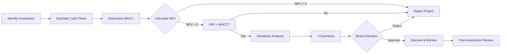

# FI03 — Investment Analysis

> **Domain:** Finance | **Level:** Advanced | **Prerequisites:** FI01, FI02

---

## 1. Learning Objectives

Sau khi hoàn thành module này, học viên có thể:
- Áp dụng 4 phương pháp capital budgeting: NPV, IRR, Payback Period, MIRR
- Thực hiện sensitivity analysis và scenario analysis cho dự án đầu tư
- Hiểu cơ bản về Monte Carlo simulation trong phân tích rủi ro đầu tư
- Giải thích Real Options và khi nào chúng quan trọng hơn NPV thuần
- Phân biệt systematic risk vs unsystematic risk; tính và diễn giải Beta
- Áp dụng Markowitz Portfolio Theory cơ bản
- Phân tích quyết định capital allocation trong doanh nghiệp VN

---

## 2. Business Context

Investment Analysis là công cụ giúp doanh nghiệp phân bổ nguồn lực khan hiếm (vốn) vào dự án tạo ra giá trị tốt nhất. Tại VN:
- **SME:** Quyết định đầu tư thường dựa trên trực giác, thiếu framework định lượng
- **Listed companies:** Cần justify CapEx với HĐQT và cổ đông bằng NPV/IRR
- **FDI:** Tập đoàn nước ngoài yêu cầu hurdle rate (thường 12-15% ở VN) để approve dự án
- **Nhà nước:** Đầu tư công được đánh giá qua phân tích kinh tế-xã hội (cost-benefit analysis)
- **Stock market VN:** Nhà đầu tư cá nhân chiếm 90%+ giao dịch, ít áp dụng phân tích định lượng
- **Private equity/VC:** Ngành PE/VC VN đang phát triển mạnh, cần analyst có kỹ năng investment analysis

---

## 3. Definitions (Bảng Thuật Ngữ)

| Thuật ngữ | Định nghĩa | Ghi chú |
|-----------|-----------|---------|
| NPV | Net Present Value — Giá trị hiện tại thuần | NPV > 0 → đáng đầu tư |
| IRR | Internal Rate of Return — Tỷ suất hoàn vốn nội bộ | IRR > WACC → đáng đầu tư |
| MIRR | Modified IRR — điều chỉnh giả định tái đầu tư | Thực tế hơn IRR |
| Payback Period | Thời gian hoàn vốn | Đơn giản nhưng bỏ qua TVM |
| Discounted Payback | Payback tính theo PV | Cải tiến Payback Period |
| WACC | Weighted Average Cost of Capital | Tỷ lệ chiết khấu phổ biến |
| Hurdle Rate | Tỷ suất tối thiểu yêu cầu | Thường = WACC + risk premium |
| Beta (β) | Độ nhạy cảm với biến động thị trường | β>1: rủi ro cao hơn thị trường |
| CAPM | Capital Asset Pricing Model: Re = Rf + β(Rm-Rf) | Tính cost of equity |
| Systematic Risk | Rủi ro thị trường, không diversify được | Market risk |
| Unsystematic Risk | Rủi ro công ty/ngành, diversify được | Firm-specific risk |
| Real Options | Quyền chọn nhúng trong dự án đầu tư | Option to expand/abandon |
| Monte Carlo | Mô phỏng ngẫu nhiên nhiều kịch bản | Phân tích rủi ro định lượng |
| Sensitivity Analysis | Thay đổi 1 biến, giữ nguyên phần còn lại | What-if analysis |
| Scenario Analysis | Thay đổi nhiều biến đồng thời | Best/Base/Worst case |

---

## 4. Core Concepts (với Diagrams)

### 4.1 Capital Budgeting Methods

```
DỰ ÁN ĐẦU TƯ (VD: Xây nhà máy 100 tỷ)
          │
          ▼
┌─────────────────────────────────────────────────────┐
│              CAPITAL BUDGETING METHODS              │
├──────────────┬──────────────┬──────────┬────────────┤
│     NPV      │     IRR      │ Payback  │    MIRR    │
├──────────────┼──────────────┼──────────┼────────────┤
│ Σ CF/(1+r)ᵗ  │ r: NPV=0     │ Năm hòa  │ Điều chỉnh │
│ - Inv. Cost  │              │ vốn      │ tái đầu tư │
│              │              │          │            │
│ Decision:    │ Decision:    │Decision: │ Decision:  │
│ NPV > 0 ✓   │ IRR > WACC ✓ │ < target ✓│ MIRR>WACC ✓│
│              │              │          │            │
│ BEST method  │ Popular but  │Simple,   │ Better IRR │
│              │ has issues   │intuitive │            │
└──────────────┴──────────────┴──────────┴────────────┘
```

### 4.2 NPV Timeline Example

```
Dự án: Đầu tư 100 tỷ, sinh ra CF 5 năm, WACC 12%

Năm:     0        1       2       3       4       5
         │        │       │       │       │       │
CF:   -100       30      35      35      30      25

PV:   -100    26.8    27.9    24.9    19.1    14.2

NPV = -100 + 26.8 + 27.9 + 24.9 + 19.1 + 14.2 = +12.9 tỷ
→ NPV > 0 → Đáng đầu tư!
```

### 4.3 Risk Framework

```
TOTAL RISK
├── SYSTEMATIC RISK (Market Risk) — không diversify được
│   ├── Lãi suất
│   ├── Lạm phát
│   ├── Chu kỳ kinh tế
│   └── Đo bằng Beta (β)
│
└── UNSYSTEMATIC RISK (Firm Risk) — diversify được
    ├── Rủi ro quản lý
    ├── Rủi ro ngành
    ├── Rủi ro cạnh tranh
    └── Đo bằng Standard Deviation - Systematic component

CAPM: Expected Return = Rf + β × (Rm - Rf)
      (Risk-free)   (Beta)  (Market Risk Premium)
```

### 4.4 Sensitivity Analysis Diagram

```
NPV SENSITIVITY TO KEY DRIVERS
                    NPV (tỷ)
-30%  ─────────────────────────────────
      Revenue ████████████████ 45
-20%  COGS   ████████████ 30
-10%  Discount Rate ████ 15
Base  ─ ─ ─ ─ ─ ─ ─ ─ ─ 12.9 ─ ─ ─ ─
+10%  ████ COGS improvement 8
+20%  ████████ Revenue improvement 5
+30%  ─────────────────────────────────

Tornado Chart: Biến nào ảnh hưởng NPV nhiều nhất?
→ Revenue là biến quan trọng nhất cần kiểm soát
```

---

## 5. Business Value

- **Phân bổ vốn hiệu quả:** Lựa chọn dự án tạo giá trị cao nhất (NPV dương, IRR > WACC)
- **Tránh đầu tư xấu:** Từ chối dự án phá hủy giá trị (NPV âm)
- **Quản lý rủi ro:** Sensitivity/scenario analysis giúp nhận diện rủi ro trước khi đầu tư
- **Giao tiếp với nhà đầu tư:** NPV/IRR là ngôn ngữ chung với investor, ngân hàng
- **M&A decisions:** Investment analysis là nền tảng của valuation (FI04)
- **Capital rationing:** Khi vốn hạn chế, rank dự án theo NPV/Cost hoặc IRR để tối ưu

---

## 6. Enterprise Role

| Cấp độ | Vai trò |
|--------|---------|
| CEO/Board | Phê duyệt major investments, chiến lược capital allocation |
| CFO | Thiết lập hurdle rate, quản lý investment portfolio |
| Investment/Strategy Director | Đánh giá M&A, greenfield investments |
| FP&A/Financial Analyst | Build investment models, NPV/IRR calculations |
| Project Manager | Theo dõi actual vs projected returns |
| Risk Manager | Quantify và monitor investment risks |

---

## 7. Departments Related

- **Finance/FP&A:** Build financial models, NPV analysis
- **Strategy:** Identify investment opportunities, market analysis
- **Operations:** Validate technical assumptions trong model
- **Legal:** Due diligence, contract review
- **Risk:** Risk assessment, Monte Carlo inputs
- **Treasury:** Funding plan cho investments đã approved
- **Board/HĐQT:** Final approval authority

---

## 8. Input

- Business case / investment proposal
- Market research, competitive analysis
- Revenue forecast (volume × price)
- Cost structure (COGS, OPEX, SG&A)
- CapEx schedule và depreciation plan
- Working Capital requirements
- WACC / hurdle rate từ Finance
- Tax assumptions (TNDN rate, investment incentives)
- Risk factors (tỷ giá, lãi suất, thị trường)

---

## 9. Output

- Investment Appraisal Report (NPV, IRR, Payback, MIRR)
- Sensitivity Analysis (tornado chart)
- Scenario Analysis (3 kịch bản)
- Risk-adjusted return recommendation
- Post-investment review (actual vs. projected)
- Board presentation / capital allocation memo

---

## 10. Business Process

```
Identify      Screen        Analyze       Decision      Execute &
Opportunity → (Strategic → (Financial → (Board  →      Monitor
              Fit)          Model)        Approval)
              │             │              │              │
           High-level     NPV/IRR       Go/No-Go      Actual vs
           filter         Sensitivity   Approval      Budget
                          Scenarios     Memo          Review
```

---

## 11. Data Flow

```
Market Research ──→ Revenue Model ──→ Financial Model ──→ NPV/IRR
Cost Estimates  ──→ Cost Model    ──→                ──→ Sensitivity
CapEx Plan      ──→ Asset Model   ──→                ──→ Scenarios
WACC            ──→ Discount Rate ──→                ──→ Recommendation
Tax Rates       ──→ Tax Schedule  ──→                ──→ Board Report
```

---

## 12. Money Flow

```
INVESTMENT PHASE                  RETURN PHASE
────────────────                  ─────────────
Initial CapEx       →  Operations  →  Revenue
Working Capital     →  COGS        →  - Operating Costs
Pre-opening costs   →  EBITDA      →  - Taxes
                    →  - CapEx maintenance
                    →  Free Cash Flow
                    →  NPV (PV of all FCFs - Initial Inv.)
```

---

## 13. Document Flow

| Tài liệu | Người tạo | Người nhận | Mục đích |
|----------|----------|-----------|---------|
| Investment Proposal | Business Unit | CFO, Strategy | Request approval |
| Financial Model | FP&A Analyst | CFO, Board | NPV/IRR analysis |
| Risk Assessment | Risk Manager | CFO, Board | Risk identification |
| Board Memo | CFO | HĐQT | Capital allocation decision |
| Post-Investment Review | Project Manager | CFO | Actual vs projected |

---

## 14. Roles

| Vai trò | Mô tả |
|---------|-------|
| Investment Analyst | Build models, calculate NPV/IRR, prepare reports |
| Strategy Director | Identify and champion investment opportunities |
| CFO | Set hurdle rate, review models, recommend to Board |
| Risk Manager | Quantify investment risks, stress testing |
| Board Director | Final approval authority |
| External Advisor | M&A advisor, investment bank, valuator |

---

## 15. Responsibilities

- **Investment Analyst:** Accuracy của financial model, sensitivity analysis
- **FP&A Manager:** Validate assumptions, challenge revenue forecasts
- **CFO:** Thiết lập hurdle rate phù hợp với cost of capital; overall recommendation
- **Risk:** Độc lập đánh giá rủi ro, không bị bias bởi project champion
- **Board:** Ra quyết định cuối cùng, chịu trách nhiệm với cổ đông

---

## 16. RACI (Bảng)

| Hoạt động | CEO/Board | CFO | Strategy | FP&A | Risk | Legal |
|-----------|-----------|-----|---------|------|------|-------|
| Identify opportunity | I | C | R | I | I | — |
| Build financial model | I | A | C | R | C | — |
| Risk assessment | I | A | C | C | R | C |
| Board presentation | I | R | C | C | C | C |
| Investment decision | R/A | C | C | I | I | I |
| Post-investment review | I | A | C | R | I | — |

---

## 17. Frameworks

- **Capital Budgeting:** NPV, IRR, MIRR, Payback, Discounted Payback
- **CAPM:** Rf + β(Rm - Rf) — tính required return on equity
- **WACC:** Weighted average of debt and equity costs
- **Markowitz Portfolio Theory:** Diversification, Efficient Frontier
- **Real Options Analysis:** Black-Scholes adapted for real assets
- **Monte Carlo Simulation:** Risk-adjusted NPV distribution

---

## 18. International Standards

| Chuẩn mực | Áp dụng |
|-----------|--------|
| CFA Institute GIPS | Performance measurement standards |
| RICS Valuation Standards | Real estate investment valuation |
| IAS 36 | Impairment of Assets — test dự án khi có dấu hiệu suy giảm |
| IFRS 9 | Financial Instruments — investment accounting |
| PVIF Tables / DCF Standards | Widely used, no single global standard |

---

## 19. Vietnam Context

**WACC tham khảo VN (2024-2025):**
- Risk-free rate (Rf): ~4.5-5% (trái phiếu CP kỳ hạn 10 năm)
- Market Risk Premium (Rm-Rf): ~6-8% (VN-Index historical)
- Typical WACC cho DN VN: **12-18%** tùy ngành và cấu trúc vốn

**Hurdle Rate theo ngành VN:**
- Bất động sản: 15-20%
- Bán lẻ/FMCG: 12-16%
- Công nghiệp/Sản xuất: 13-17%
- Công nghệ: 18-25%
- Năng lượng tái tạo: 10-14%

**Ưu đãi đầu tư VN (ảnh hưởng DCF):**
- Khu kinh tế đặc biệt: Thuế TNDN 9% trong 15 năm (so với 20% thông thường)
- KCN công nghệ cao: Miễn thuế 4 năm, giảm 50% 9 năm tiếp theo
- Ưu đãi đầu tư: Tác động lớn đến NPV — phải tính đúng

**Stock market VN context:**
- Beta của cổ phiếu VN tính từ VN-Index
- Thị trường kém hiệu quả (semi-strong EMH không hold ở VN) → cơ hội alpha
- P/E thị trường VN 2024: ~14-16x (thấp so với khu vực)

---

## 20. Legal Considerations

- **Luật Đầu tư 2020:** Danh mục ngành nghề cần điều kiện đầu tư, ngành cấm
- **Luật Đầu tư theo phương thức đối tác công-tư (PPP) 2020:** Cơ sở hạ tầng
- **Nghị định 31/2021/NĐ-CP:** Hướng dẫn thi hành Luật Đầu tư 2020
- **Luật Chứng khoán 2019:** Phát hành và giao dịch chứng khoán
- **Luật Thuế Thu nhập Doanh nghiệp:** Ưu đãi thuế cho dự án đầu tư
- **Luật đất đai 2024:** Ảnh hưởng lớn đến investment analysis BĐS

---

## 21. Common Mistakes

1. **Discount rate sai:** Dùng cost of debt thay vì WACC cho dự án equity-funded
2. **Bỏ qua working capital:** Không tính ΔWorking Capital trong cash flows
3. **Sunk costs:** Đưa sunk costs vào NPV analysis (phải bỏ qua)
4. **Opportunity costs:** Bỏ qua opportunity cost của resources used
5. **Terminal value quá lạc quan:** Terminal growth rate cao hơn GDP growth là vô lý
6. **IRR trap với multiple IRRs:** Dự án có cash flow đổi chiều nhiều lần → multiple IRRs
7. **Không discount dự án rủi ro cao hơn:** Mọi dự án dùng cùng một discount rate
8. **Bỏ qua inflation:** Nominal vs real cash flows không nhất quán

---

## 22. Best Practices

1. **NPV là standard:** Dùng NPV là tiêu chí chính, IRR là bổ sung
2. **Sensitivity luôn phải có:** Minimum 3 biến quan trọng nhất
3. **3 scenarios:** Base/Bull/Bear — thể hiện range of outcomes
4. **Monte Carlo cho dự án lớn:** Mô phỏng ≥1000 iterations
5. **Independent review:** FP&A độc lập review model của project team
6. **Post-investment review:** So sánh actual vs model 12 và 24 tháng sau
7. **Hurdle rate review hàng năm:** WACC thay đổi theo lãi suất thị trường

---

## 23. KPIs (Bảng)

| KPI | Định nghĩa | Ngưỡng | Ghi chú |
|-----|-----------|--------|---------|
| NPV | Σ PV(CF) - Initial Investment | > 0 | Tuyệt đối, tỷ VND |
| IRR | Discount rate khi NPV=0 | > WACC | % |
| MIRR | Modified IRR | > WACC | Thực tế hơn IRR |
| Payback Period | Số năm hoàn vốn | < 5 năm (thường) | Đơn giản, phổ biến |
| NPV/Investment | Profitability Index | > 1.0 | Khi capital rationing |
| Risk-adjusted NPV | NPV × P(success) | Tùy project | Real options |
| ROIC | NOPAT/Invested Capital | > WACC | Sau khi đầu tư |

---

## 24. Metrics

- **Profitability Index (PI):** NPV/Initial Investment — dùng khi capital rationing
- **NPV Breakeven:** Revenue level để NPV = 0
- **Value at Risk (VaR):** Maximum loss tại mức confidence 95%
- **Expected NPV (Monte Carlo):** Trung bình NPV qua 10,000 simulations
- **Real Option Value:** Giá trị linh hoạt (expand/delay/abandon)

---

## 25. Reports

| Báo cáo | Tần suất | Nội dung |
|---------|---------|---------|
| Investment Appraisal | Per project | NPV, IRR, Sensitivity, Recommendation |
| Capital Allocation Report | Năm | Danh mục dự án, total CapEx, expected returns |
| Post-Investment Review | 12/24 tháng | Actual vs projected NPV, lessons learned |
| Portfolio Risk Report | Quý | Correlation, concentration risk |
| Board CapEx Report | Quý | Status của approved investments |

---

## 26. Templates

**NPV Model Structure:**
```
ASSUMPTIONS
  Revenue growth:  Year1: 20%, Y2-5: 15%, Terminal: 5%
  EBITDA margin:   25%
  Tax rate:        20%
  WACC:            14%
  CapEx/Revenue:   8%
  ΔWC/Revenue:     3%

CASH FLOW PROJECTION (tỷ VND)
                Y0      Y1      Y2      Y3      Y4      Y5   Terminal
Revenue         —      100     115     132     152     175     3,500*
EBITDA          —       25      29      33      38      44
- Taxes         —       (4)     (4)     (5)     (5)     (6)
- CapEx         (80)    (8)     (9)    (11)    (12)    (14)
- ΔWC           (10)    (3)     (3)     (4)     (5)     (5)
FCF             (90)    10      13      13      16      19       xx

PV of FCFs:      8.8 + 10.0 + 8.8 + 9.5 + 9.8 = 46.9
PV Terminal:    xx
Total PV:       xx
NPV:            = Total PV - 90 (initial investment)

*Terminal Value = FCF₅ × (1+g) / (WACC - g)
```

---

## 27. Checklists

**Investment Analysis Checklist:**
- [ ] Xác định incremental cash flows (không phải accounting profit)
- [ ] Tính WACC phù hợp với rủi ro dự án
- [ ] Loại trừ sunk costs
- [ ] Bao gồm opportunity costs
- [ ] Tính working capital changes
- [ ] Tính terminal value hợp lý (g < GDP growth)
- [ ] Sensitivity analysis (≥3 key variables)
- [ ] 3 scenarios (Base/Bull/Bear)
- [ ] Independent review của model
- [ ] Board memo với clear recommendation

---

## 28. SOP

**SOP: Investment Appraisal Process**
1. **Business Unit** lập Investment Proposal với assumptions
2. **FP&A** build financial model độc lập từ assumptions
3. **Risk** đánh giá risk factors, cung cấp inputs cho sensitivity
4. **CFO** review model, validate WACC, challenge key assumptions
5. **Strategy** assess strategic fit
6. **CFO** present to Board với recommendation
7. **Board** vote — approve/reject/request more info
8. **Finance** monitor actual performance quarterly

---

## 29. Case Study

**Vinfast — Quyết định Đầu tư Nhà Máy VN (Simplified)**

*Background:* VinFast quyết định đầu tư ~$3.5 tỷ vào nhà máy ô tô tại Hải Phòng.

*Investment Analysis Framework (simplified):*
- **Hurdle Rate:** 15% (ngành ô tô, emerging market premium)
- **Revenue assumption:** 300,000 xe/năm × $15,000 = $4.5 tỷ/năm (khi đạt công suất năm 5)
- **EBITDA margin:** 10% (industry benchmark, thấp do learning curve)
- **Ưu đãi thuế:** Miễn thuế TNDN 4 năm (KCN Hải Phòng)
- **Sensitivity biến quan trọng nhất:** Volume (±10% volume → NPV thay đổi ±$800 triệu)

*Bài học:*
1. Real Options có giá trị lớn: Option to expand sang EV khi thị trường sẵn sàng
2. Government incentives (ưu đãi thuế) tác động lớn đến NPV
3. Rủi ro lớn nhất: Volume assumption — cần market research kỹ

---

## 30. Small Business Example

**Quyết định mua xe tải giao hàng — SME logistics VN**

Công ty giao hàng đang thuê xe, muốn mua xe tải 2 tỷ đồng.

```
Năm 0: Chi phí mua xe = -2,000 triệu
Năm 1-5: Tiết kiệm tiền thuê xe = +500 triệu/năm
          Chi phí bảo dưỡng, bảo hiểm = -100 triệu/năm
          Net CF = +400 triệu/năm
Năm 5: Giá trị thanh lý = +300 triệu

WACC = 12% (SME VN, vay ngân hàng ~10% + equity premium)

NPV = -2,000 + 400/1.12 + 400/1.12² + 400/1.12³ + 400/1.12⁴ + 700/1.12⁵
    = -2,000 + 357 + 319 + 285 + 254 + 397
    = -2,000 + 1,612 = -388 triệu

NPV < 0 → Theo tính toán, tiếp tục thuê xe tốt hơn!
```

Bài học: Quyết định "mua hay thuê" cần NPV analysis nghiêm túc, không chỉ cảm giác.

---

## 31. Enterprise Example

**Masan — Quyết định M&A WinCommerce (WinMart)**

Masan mua lại chuỗi VinMart/VinMart+ từ Vingroup (2020).

*Investment thesis:*
- WinCommerce: ~3,000 cửa hàng VinMart+, 1,900 tỷ doanh thu
- NPV scenario: Cải thiện EBITDA margin từ -3% → +5% trong 5 năm
- Synergy: Cross-sell Masan Consumer products qua kênh WCM

*Capital allocation framework:*
- Investment: ~$410 triệu (implied EV)
- IRR target: >18% (Masan hurdle rate)
- Real option: Platform để build consumer ecosystem

*Outcome:* WinCommerce đạt EBITDA dương 2023, thesis đang được validate.

---

## 32. ERP Mapping

| Chức năng | SAP | Oracle | Công cụ khác |
|-----------|-----|--------|-------------|
| Project costing | PS Module | Project Accounting | MS Project |
| CapEx tracking | Asset Management | Fixed Assets | Excel |
| NPV/IRR modeling | — | — | Excel/Python |
| Portfolio management | SAP BPC | Hyperion | Anaplan |
| Actual vs budget | CO-PA | Management Reporter | Power BI |

---

## 33. Automation Opportunities

- **Automated sensitivity analysis:** Excel với Data Tables tự động; Python scripts
- **Real-time CapEx tracking:** ERP tự động so sánh actual vs approved budget
- **Standard model templates:** Tránh mỗi dự án build model từ đầu
- **Post-investment auto-reporting:** Kết nối ERP actuals → investment model monthly

---

## 34. AI Opportunities

- **Revenue forecasting:** ML dự báo revenue từ market data + internal signals
- **Monte Carlo automation:** Python/R tự động run 10,000 simulations
- **Comparable transaction database:** AI search precedent transactions VN M&A
- **Risk factor identification:** NLP phân tích industry reports → identify key risks
- **Real options valuation:** AI-assisted option pricing cho complex real options
- **Investment portfolio optimization:** ML tối ưu capital allocation portfolio

---

## 35. Implementation Guide

**Build Investment Analysis Capability (3 tháng):**

| Tháng | Hoạt động |
|-------|----------|
| T1 | Training: NPV/IRR/Sensitivity cho Finance team; chuẩn hóa WACC |
| T2 | Xây dựng standard investment model template; investment policy |
| T3 | Test với 2-3 dự án thực tế; fine-tune process; rollout |

---

## 36. Consulting Guide

**Khi đánh giá investment decisions của client:**
1. Hỏi: Họ dùng NPV hay chỉ Payback Period/gut feeling?
2. Kiểm tra WACC có hợp lý không (thường sai ở hurdle rate quá thấp)
3. Xem lịch sử post-investment reviews — actual có match với model không?
4. Nếu nhiều dự án "tốt" nhưng FCF vẫn kém → assumptions quá lạc quan
5. Quick win: Chuẩn hóa 1 investment model template cho toàn công ty

---

## 37. Diagnostic Questions

1. Công ty sử dụng phương pháp nào để đánh giá đầu tư (NPV, IRR, Payback)?
2. Hurdle rate là bao nhiêu? Được cập nhật khi nào lần cuối?
3. Có thực hiện sensitivity analysis không? Ai làm?
4. Sau khi dự án hoàn thành, có so sánh actual vs projected không?
5. Capital allocation được quyết định bởi ai, theo quy trình nào?
6. Tỷ lệ dự án có NPV dương nhưng thực tế kém hơn dự kiến là bao nhiêu?

---

## 38. Interview Questions

**Investment Analyst:**
1. Tính NPV: Đầu tư 50 tỷ, CF năm 1-5: 15 tỷ/năm, WACC 12%
2. IRR vs NPV: Khi nào hai phương pháp mâu thuẫn nhau? Dùng cái nào?
3. Giải thích sunk cost và tại sao không đưa vào NPV analysis

**Senior Investment Manager:**
1. Mô tả cách bạn xây dựng investment framework cho danh mục 500 tỷ CapEx
2. Real Options là gì? Cho ví dụ thực tế ở VN
3. Làm thế nào để risk-adjust NPV cho dự án ở thị trường mới nổi như VN?

---

## 39. Exercises

**Bài tập 1:** Tính NPV và IRR: Đầu tư 100 tỷ, CF = [30, 35, 35, 30, 25] tỷ, WACC 12%. Quyết định có đầu tư không?

**Bài tập 2:** Sensitivity analysis: NPV từ bài 1 thay đổi như thế nào nếu WACC tăng lên 15%? Nếu Revenue giảm 10%?

**Bài tập 3:** Capital rationing: Có 3 dự án (NPV 20/15/30 tỷ, Cost 50/40/80 tỷ), tổng ngân sách 120 tỷ. Chọn dự án nào?

**Bài tập 4:** Tính WACC: Equity 60%, Cost of Equity (CAPM: Rf=5%, β=1.2, Rm-Rf=7%); Debt 40%, Cost of Debt 9%, Tax 20%.

---

## 40. References

- Brealey, Myers, Allen — "Principles of Corporate Finance" (McGraw-Hill) Chap. 6-11
- Damodaran — "Investment Valuation" (Wiley) — damodaran.com
- CFA Institute — CFA Level 1 & 2: Corporate Finance
- Luật Đầu tư 2020 (Luật 61/2020/QH14)
- MPI — Bộ Kế hoạch và Đầu tư — mpi.gov.vn
- Bloomberg/Thomson Reuters — financial data
- Vietstock.vn, cafef.vn — VN market data

---

## Output Formats

### Mermaid Diagram



### ASCII Diagram

```
╔════════════════════════════════════════════════════╗
║         CAPITAL BUDGETING DECISION TREE            ║
╠════════════════════════════════════════════════════╣
║  Step 1: Estimate incremental FCFs                 ║
║  Step 2: Calculate WACC (or risk-adj rate)         ║
║  Step 3: NPV = Σ FCF/(1+WACC)ᵗ - Initial Cost     ║
║  Step 4: NPV > 0? IRR > WACC? → INVEST            ║
║          NPV < 0? IRR < WACC? → REJECT             ║
╠════════════════════════════════════════════════════╣
║  CAPM: Re = Rf + β(Rm-Rf)                         ║
║  VN: Rf≈5%, MRP≈7%, β=1.0 → Re≈12%               ║
║  WACC = E/(E+D)×Re + D/(E+D)×Rd×(1-T)            ║
╚════════════════════════════════════════════════════╝
```

### Flashcards

**Q1:** NPV và IRR là gì? Khi nào chúng mâu thuẫn nhau?
**A1:** NPV là giá trị tuyệt đối tạo ra (ưu tiên dùng). IRR là tỷ suất hoàn vốn (phổ biến nhưng có vấn đề). Chúng mâu thuẫn khi so sánh dự án có quy mô khác nhau hoặc timing cash flow khác nhau. Luôn ưu tiên NPV khi có xung đột.

**Q2:** Tại sao không đưa sunk costs vào NPV analysis?
**A2:** Sunk costs là chi phí đã phát sinh và không thể thu hồi dù quyết định thế nào. Quyết định đầu tư chỉ nên dựa trên incremental (tăng thêm) cash flows từ quyết định này trở đi. Sunk cost không liên quan đến tương lai.

**Q3:** Real Options là gì và tại sao quan trọng?
**A3:** Real Options là quyền (nhưng không bắt buộc) thực hiện các hành động trong tương lai: mở rộng (expand), trì hoãn (delay), từ bỏ (abandon). NPV truyền thống bỏ qua tính linh hoạt này. Dự án có Real Options có giá trị cao hơn NPV thuần.

### Cheat Sheet

```
╔════════════════════════════════════════════════════╗
║           FI03 INVESTMENT ANALYSIS                 ║
║                 CHEAT SHEET                        ║
╠════════════════════════════════════════════════════╣
║ NPV = Σ FCFt/(1+WACC)ᵗ - Initial Investment       ║
║ IRR = discount rate khi NPV = 0                    ║
║ Payback = năm khi cumulative CF = Initial Inv.     ║
╠════════════════════════════════════════════════════╣
║ WACC = E/V × Re + D/V × Rd × (1-T)               ║
║ CAPM: Re = Rf + β × (Rm - Rf)                     ║
║ VN Rf ≈ 5% | MRP ≈ 7% | WACC ≈ 12-18%            ║
╠════════════════════════════════════════════════════╣
║ RULES:                                             ║
║  Accept if: NPV > 0 AND IRR > WACC                 ║
║  Conflict: ALWAYS use NPV (more reliable)          ║
║  Sunk costs: IGNORE (already spent)                ║
║  Opp. costs: INCLUDE (foregone benefits)           ║
╠════════════════════════════════════════════════════╣
║ SENSITIVITY: Change 1 var at a time               ║
║ SCENARIO: Change multiple vars → 3 cases          ║
║ MONTE CARLO: Probabilistic, ≥1000 runs            ║
╚════════════════════════════════════════════════════╝
```

### JSON Metadata

```json
{
  "module": "FI03",
  "name": "Investment Analysis",
  "domain": "Finance",
  "level": "Advanced",
  "prerequisites": ["FI01", "FI02"],
  "related_modules": ["FI01", "FI04", "FI05"],
  "key_concepts": ["NPV", "IRR", "MIRR", "Payback", "WACC", "CAPM", "Beta", "Sensitivity Analysis", "Monte Carlo", "Real Options"],
  "key_metrics": ["NPV", "IRR", "MIRR", "Payback Period", "Profitability Index", "ROIC"],
  "standards": ["CFA GIPS", "IAS 36"],
  "vn_context": ["Hurdle rate 12-18%", "Ưu đãi thuế KCN", "VN-Index beta", "Luật Đầu tư 2020"],
  "tools": ["Excel DCF model", "Python Monte Carlo", "Bloomberg", "SAP BPC"],
  "estimated_learning_hours": 20,
  "last_updated": "2026-06-30"
}
```
