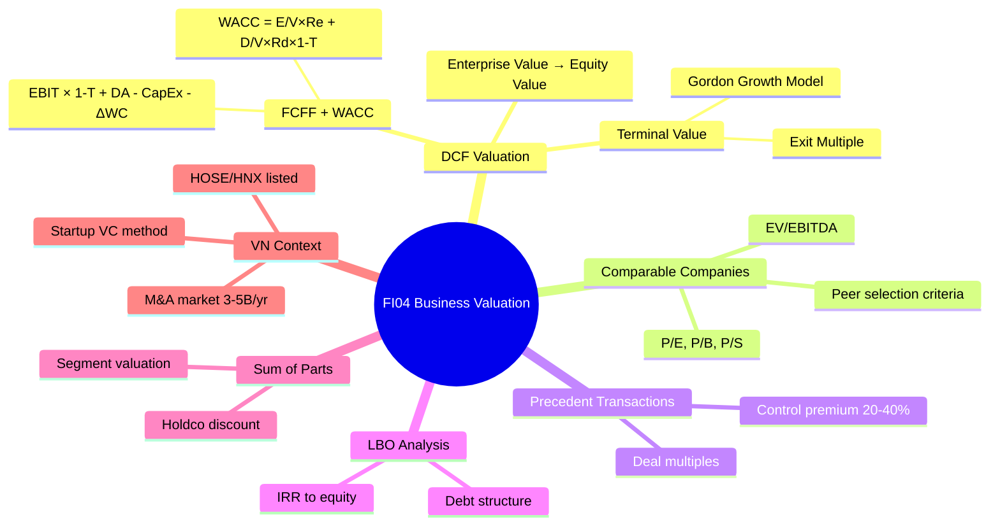

# FI04 — Business Valuation

> **Domain:** Finance | **Level:** Advanced | **Prerequisites:** FI01, FI02, FI03

---

## 1. Learning Objectives

Sau khi hoàn thành module này, học viên có thể:
- Thực hiện DCF Valuation đầy đủ: FCFF/FCFE, WACC, Terminal Value
- Xây dựng Comparable Companies Analysis (Comps) với EV/EBITDA, P/E, P/S, P/B
- Thực hiện Precedent Transactions analysis cho M&A
- Hiểu cơ bản về LBO (Leveraged Buyout) mechanics
- Áp dụng Sum-of-the-Parts valuation cho holding companies
- Định giá startup VN và công ty niêm yết HOSE/HNX
- Hiểu thực tiễn M&A market VN và các phương pháp định giá phổ biến

---

## 2. Business Context

Valuation là khoa học + nghệ thuật xác định giá trị của một doanh nghiệp. Tại VN:
- **M&A market bùng nổ:** Giá trị M&A VN đạt $3-4 tỷ/năm (2021-2023), nhu cầu valuation tăng mạnh
- **IPO và niêm yết:** HOSE/HNX có ~700 công ty niêm yết, cần analyst hiểu valuation
- **Startup ecosystem:** VN có ~1,000 startup đang hoạt động, VC cần valuation framework
- **FDI acquisitions:** Nhiều tập đoàn nước ngoài mua cổ phần DN VN, cần định giá chuẩn quốc tế
- **Thách thức đặc thù VN:** Thông tin kém minh bạch, BCTC có thể không đáng tin cậy, thanh khoản cổ phiếu thấp
- **Hai bộ sổ sách:** Rủi ro cao trong định giá SME VN — phải due diligence kỹ

---

## 3. Definitions (Bảng Thuật Ngữ)

| Thuật ngữ | Định nghĩa | Ghi chú |
|-----------|-----------|---------|
| Enterprise Value (EV) | Giá trị doanh nghiệp = Market Cap + Net Debt | EV = Equity + Debt - Cash |
| Equity Value | Giá trị vốn chủ sở hữu = EV - Net Debt | Giá trị thuộc về cổ đông |
| DCF | Discounted Cash Flow — chiết khấu dòng tiền | Phương pháp nội tại |
| FCFF | Free Cash Flow to Firm — trước trả nợ | Dùng với WACC |
| FCFE | Free Cash Flow to Equity — sau trả nợ | Dùng với Cost of Equity |
| WACC | Weighted Average Cost of Capital | Tỷ lệ chiết khấu cho FCFF |
| Terminal Value (TV) | Giá trị cuối kỳ dự báo | Gordon Growth hoặc Exit Multiple |
| EV/EBITDA | Bội số doanh nghiệp / EBITDA | Múltiple phổ biến nhất trong M&A |
| P/E | Price/Earnings ratio | Phổ biến với nhà đầu tư cá nhân |
| P/B | Price/Book Value ratio | Phổ biến với ngân hàng, tài chính |
| P/S | Price/Sales ratio | Dùng khi EBITDA âm (startup, turnaround) |
| LBO | Leveraged Buyout — mua lại bằng đòn bẩy nợ | PE transactions |
| Sum-of-the-Parts (SOTP) | Định giá từng mảng kinh doanh rồi cộng lại | Conglomerate, holding |
| Control Premium | Phụ phí kiểm soát trong M&A | Thường 20-40% so với trading price |
| DLOM | Discount for Lack of Marketability | Cổ phần tư nhân, chưa niêm yết |

---

## 4. Core Concepts (với Diagrams)

### 4.1 Valuation Methods Overview

```
BUSINESS VALUATION METHODS
        │
        ├── INTRINSIC VALUE (Giá trị nội tại)
        │   └── DCF Analysis
        │       ├── FCFF + WACC → Enterprise Value
        │       └── FCFE + Ke → Equity Value
        │
        ├── RELATIVE VALUE (Giá trị tương đối)
        │   ├── Comparable Companies (Trading Comps)
        │   │   ├── EV/EBITDA
        │   │   ├── P/E, P/B, P/S
        │   │   └── EV/Revenue
        │   └── Precedent Transactions (Deal Comps)
        │       └── EV/EBITDA (paid in M&A deals)
        │
        └── ASSET-BASED
            ├── Book Value
            ├── Liquidation Value
            └── Replacement Cost
```

### 4.2 DCF Valuation Bridge

```
INTRINSIC VALUE (DCF)
         │
    ┌────┴─────────────────────────────────────┐
    │                                          │
PV of FCFFs                          Terminal Value
(Explicit forecast 5-10 yrs)         (Going concern)
    │                                          │
FCFF = EBIT(1-T) + D&A - ΔWC - CapEx    TV = FCFFn × (1+g)
Discounted at WACC                         ──────────────
                                           (WACC - g)
    └────────────────┬────────────────────────┘
                     │
              Enterprise Value (EV)
                     │
              - Net Debt (Debt - Cash)
              - Minorities, Preferred
                     │
              Equity Value
                     │
              ÷ Shares Outstanding
                     │
              Price per Share
```

### 4.3 Football Field Chart (Valuation Range)

```
METHOD                  VALUE RANGE (tỷ VND)
                    0      500    1000    1500   2000
DCF (Base)          ├──────────────────────┤
DCF (Bull/Bear)          ├─────────────────────────┤
EV/EBITDA Comps         ├──────────────┤
P/E Comps                    ├──────────────┤
Precedent Trans.              ├────────────────────┤
52-Week High/Low    ├────────────┤

→ Valuation range: 800-1,600 tỷ, midpoint ~1,200 tỷ
```

---

## 5. Business Value

- **M&A:** Xác định fair price khi mua hoặc bán doanh nghiệp
- **IPO:** Định giá trước khi niêm yết để set offer price
- **Investment decisions:** So sánh intrinsic value vs market price
- **Shareholder disputes:** Định giá cổ phần khi có tranh chấp
- **ESOP:** Giá trị cổ phiếu cho chương trình quyền chọn nhân viên
- **Financial reporting:** Impairment testing (IAS 36), goodwill allocation
- **Consulting/Advisory fees:** Valuation là core skill của investment banker

---

## 6. Enterprise Role

| Cấp độ | Vai trò với Valuation |
|--------|----------------------|
| CEO/Board | M&A decisions, IPO, capital raise |
| CFO | Oversee valuation process, present to Board |
| Investment/M&A Director | Lead deal team, commission valuers |
| Financial Analyst | Build models, comps, DCF |
| External Advisor | Investment bank, valuator độc lập |
| External Auditor | Goodwill impairment, purchase price allocation |

---

## 7. Departments Related

- **Finance/M&A:** Core owners của valuation process
- **Strategy:** Define strategic rationale, synergy estimates
- **Legal:** Due diligence, SPA negotiation
- **Operations:** Validate business plan assumptions
- **HR:** Management team assessment, ESOP valuation
- **External:** Investment bank, Big4 advisory, independent valuator

---

## 8. Input

- Historical BCTC 3-5 năm (audited preferred)
- Business plan / management projections
- Industry data, market reports
- Comparable company financial data (Bloomberg, Thomson Reuters)
- M&A transaction database (Capital IQ, MergerMarket)
- WACC components (Rf, Beta, MRP, credit spread)
- Tax structure, incentives
- Off-balance sheet items, contingent liabilities

---

## 9. Output

- Valuation Report (DCF + Comps + Precedents)
- Football Field Chart (valuation range)
- Sensitivity tables (DCF vs WACC vs growth)
- Deal recommendation memo
- Fairness Opinion (cho giao dịch lớn)
- Purchase Price Allocation (PPA) report (post-deal)

---

## 10. Business Process

```
Mandate       Due          Build         Triangulate    Present
Received  →  Diligence →  Models     →  Results    →   & Negotiate
              │           │              │               │
           BCTC review  DCF model    Football field   Board memo
           Data room    Comps        Sensitivity      Negotiation
           Mgmt meeting Precedents   Recommendation   support
```

---

## 11. Data Flow

```
BCTC/Management Projections ──→ DCF Model ──→ Enterprise Value
Comparable Company Data     ──→ Comps     ──→ Equity Value
M&A Transaction Data        ──→ Precedents ──→ Implied Multiples
                            ──→ Football Field ──→ Valuation Range
                            ──→ Sensitivity   ──→ Board Report
```

---

## 12. Money Flow

```
VALUATION → PRICE NEGOTIATION → TRANSACTION STRUCTURE

Buyer: Willing to pay up to intrinsic value + strategic premium
Seller: Wants maximum value, sometimes Control Premium

DEAL STRUCTURE:
  Cash: Immediate, certain
  Stock: Upside potential, risk
  Earnout: Performance-linked payments
  Debt assumption: Buyer takes on debt
```

---

## 13. Document Flow

| Tài liệu | Người tạo | Người nhận | Mục đích |
|----------|----------|-----------|---------|
| Information Memorandum | Seller / IB | Potential buyers | Marketing |
| Data Room (NDA required) | Seller | Buyer due diligence | BCTC, contracts |
| Valuation Model | IB / Buy-side analyst | CFO, Board | DCF + Comps |
| Letter of Intent (LOI) | Buyer | Seller | Initial offer |
| Sale and Purchase Agreement | Legal teams | Both parties | Binding contract |
| Fairness Opinion | Independent valuator | Board | Director protection |

---

## 14. Roles

| Vai trò | Mô tả |
|---------|-------|
| M&A Analyst | Build valuation models, financial analysis |
| Investment Banker | Lead deal, coordinate process, negotiate |
| Independent Valuator | Fairness opinion, dispute resolution |
| Due Diligence Accountant | Verify financial data quality |
| Tax Advisor | Structure optimization |
| Lawyer (M&A) | SPA, deal structure, regulatory |

---

## 15. Responsibilities

- **Analyst:** Accuracy của models, bao gồm tất cả relevant data
- **Director/VP:** Review models, challenge assumptions, client management
- **Partner/MD:** Final sign-off, client relationship, negotiation
- **Independent valuator:** Objectivity, professional standards (RICS, ASA, CFA)
- **Board:** Fiduciary duty — phải commission fairness opinion cho major transactions

---

## 16. RACI (Bảng)

| Hoạt động | CFO | M&A Director | Analyst | Ext. Advisor | Legal | Board |
|-----------|-----|-------------|---------|-------------|-------|-------|
| Kick off valuation | A | R | I | C | I | I |
| Build financial model | I | A | R | C | — | — |
| Due diligence | A | R | R | C | C | I |
| Present valuation | A | R | C | C | I | I |
| Negotiation | C | R | I | C | C | A |
| Final approval | C | C | — | C | C | R/A |

---

## 17. Frameworks

- **DCF (Discounted Cash Flow):** FCFF/FCFE → EV/Equity Value
- **Comparable Companies Analysis (CCA):** Trading multiples
- **Precedent Transactions Analysis (PTA):** Deal multiples
- **LBO Analysis:** PE's minimum return framework
- **Sum-of-the-Parts (SOTP):** Conglomerate valuation
- **Asset-Based Valuation:** Net Asset Value, Liquidation
- **Dividend Discount Model (DDM):** P0 = D1/(Ke-g) — banks, REITs

---

## 18. International Standards

| Chuẩn mực | Liên quan đến Valuation |
|-----------|------------------------|
| IFRS 3 | Business Combinations — Purchase Price Allocation |
| IAS 36 | Impairment of Assets — goodwill impairment test hàng năm |
| IFRS 13 | Fair Value Measurement — 3-level hierarchy |
| IVS (IVSC) | International Valuation Standards — professional valuators |
| RICS Red Book | Valuation standards cho BĐS |
| ASA | American Society of Appraisers standards |

---

## 19. Vietnam Context

**M&A Market VN:**
- Deal volume: ~$3-5 tỷ/năm, tăng mạnh từ 2015
- Sectors nóng: F&B, bán lẻ, healthcare, fintech, real estate
- Key players: SCIC, VinaCapital, Mekong Capital, Dragon Capital, KKR, CVC
- Thách thức: BCTC thiếu tin cậy, thông tin không minh bạch, định giá cổ phần thiểu số khó

**Định giá công ty niêm yết HOSE/HNX:**
- P/E thị trường VN 2024: ~14-16x (discount so với khu vực)
- EV/EBITDA VN: ~7-10x (vs SEA ~10-14x)
- Lý do discount: Thanh khoản thấp, DLOM, governance risks

**Định giá Startup VN:**
- Pre-revenue: Dùng VC method (target exit / expected multiple / IRR → implied entry valuation)
- Revenue stage: Revenue multiple 3-8x (B2B SaaS) hoặc GMV multiple
- Unicorns VN: VNPay (fintech), MoMo (fintech), Sky Mavis (gaming/Axie Infinity)
- Series A VN 2023: Median pre-money ~$5-15 triệu
- Discount factors: VN risk premium, market size limitation, regulatory uncertainty

**Phương pháp định giá phổ biến VN:**
- SME M&A: P/E × trailing earnings (đơn giản nhất)
- Bất động sản: NAV (Net Asset Value) approach
- Ngân hàng: P/B (Price/Book) × 1.5-2.5x
- Listed companies: DCF + EV/EBITDA comps

---

## 20. Legal Considerations

- **Luật Doanh nghiệp 2020:** Định giá tài sản góp vốn, chuyển nhượng cổ phần
- **Luật Chứng khoán 2019:** Yêu cầu định giá độc lập cho M&A công ty đại chúng
- **Thông tư 28/2021/TT-BTC:** Tiêu chuẩn thẩm định giá VN
- **SCIC và vốn Nhà nước:** Thoái vốn DNNN phải định giá theo quy định riêng
- **Luật Quản lý sử dụng vốn nhà nước 2014:** Phê duyệt định giá khi DNNN M&A
- **Thuế chuyển nhượng vốn:** 20% TNDN hoặc 0.1% trên giá chuyển nhượng (tùy cách tính)

---

## 21. Common Mistakes

1. **Terminal Value quá lớn:** TV chiếm >80% DCF value → sensitivity mất ý nghĩa
2. **WACC sai:** Dùng cost of debt thay vì WACC; không điều chỉnh cho rủi ro dự án
3. **Circular reference WACC:** Target capital structure thay vì current structure
4. **Comps không comparable:** Chọn peer group không tương đồng về ngành, quy mô, geography
5. **Bỏ qua control premium/DLOM:** Định giá thiểu số như majority
6. **Synergies quá lạc quan:** Synergy thường bị overestimate 50-100%
7. **Không điều chỉnh VN risk premium:** WACC cho công ty VN phải cao hơn US/EU
8. **Coi EV = Equity Value:** Quên trừ net debt

---

## 22. Best Practices

1. **Football field là phải có:** Trình bày range, không phải một con số
2. **Triangulate 3+ methods:** DCF + Comps + Precedents — tìm convergence
3. **Sensitivity trên terminal value:** Thay đổi exit multiple/growth rate
4. **Peer group quality:** Tối thiểu 5 comparables, document selection criteria
5. **Kiểm tra BCTC trước:** Garbage in → garbage out
6. **Adjustments:** Normalize for one-time items trước khi dùng EBITDA
7. **Document assumptions:** Mọi assumption phải có nguồn và rationale

---

## 23. KPIs (Bảng)

| Multiple | Công thức | Benchmark VN (2024) | Ghi chú |
|---------|-----------|---------------------|---------|
| EV/EBITDA | EV / EBITDA | 7-10x (listed), 5-8x (private) | M&A standard |
| P/E | Market Cap / Net Income | 12-18x (HOSE) | Phổ biến nhất |
| P/B | Market Cap / Book Value | 1.5-3x (general), 1.5-2.5x (banks) | Banks, finance |
| P/S | Market Cap / Revenue | 0.5-2x | Khi EBITDA âm |
| EV/Revenue | EV / Revenue | 0.8-2.5x | Tech, SaaS |
| EV/EBIT | EV / EBIT | 10-15x | Thay thế EBITDA khi D&A cao |
| Dividend Yield | DPS / Price | 3-6% (VN) | Income stocks |

---

## 24. Metrics

- **Implied EV:** Múltiple × EBITDA của target company
- **Control Premium:** (Deal Price - Pre-deal Price) / Pre-deal Price × 100%
- **DLOM (Discount for Lack of Marketability):** 15-35% cho private companies VN
- **Equity Risk Premium VN:** ~6-8% trên US ERP (Damodaran data)
- **Country Risk Premium VN:** ~2.5-3.5% (Damodaran, 2024)

---

## 25. Reports

| Báo cáo | Mục đích | Người dùng |
|---------|---------|-----------|
| Valuation Report (full) | M&A, fairness opinion | Board, lawyers, regulators |
| Management Presentation | Internal M&A decision | CEO, CFO, Board |
| Investment Memo | Buy-side investment decision | Portfolio manager |
| Fairness Opinion | Board protection | Board of Directors |
| Purchase Price Allocation | IFRS 3 compliance | Auditors, Finance |
| Impairment Test Report | IAS 36 annual test | Auditors, Finance |

---

## 26. Templates

**DCF Valuation Summary Template:**
```
DCF VALUATION — [COMPANY NAME]
Date: [Date] | Prepared by: [Analyst]

ASSUMPTIONS:
  Revenue CAGR (5yr):     15%
  EBITDA margin (stable): 20%
  WACC:                   13.5%
  Terminal growth rate:    4.0%
  Terminal EV/EBITDA:      8.0x

RESULTS:
  PV of FCFFs (5yr):      450 tỷ
  Terminal Value (PV):  1,200 tỷ
  Enterprise Value:     1,650 tỷ
  Less: Net Debt         (200) tỷ
  Equity Value:         1,450 tỷ

  Implied EV/EBITDA:      8.8x
  Implied P/E:            16.1x

SENSITIVITY — EV (tỷ):
            WACC
  g%    12%   13.5%  15%
  3%   1,900  1,700  1,550
  4%   2,100  1,850  1,650  ← Base
  5%   2,400  2,050  1,800
```

---

## 27. Checklists

**Valuation Quality Checklist:**
- [ ] BCTC đã được kiểm toán chưa? (nếu không, haircut discount)
- [ ] Đã normalize EBITDA (loại bỏ one-off items)?
- [ ] Peer group có thực sự comparable?
- [ ] WACC có phản ánh rủi ro thực của công ty VN?
- [ ] Terminal value < 75% tổng EV?
- [ ] Sensitivity analysis có bao gồm WACC ± 2% không?
- [ ] Đã cộng đủ off-balance sheet liabilities (pension, leases) chưa?
- [ ] Football field có ≥ 3 phương pháp không?

---

## 28. SOP

**SOP: M&A Valuation Process**
1. **Week 1:** Sign NDA, access data room; collect BCTC, business plan
2. **Week 2:** Normalize BCTC; build 3-statement model; identify peers
3. **Week 3:** DCF model (5-10yr forecast + TV); Comps screen & multiples
4. **Week 4:** Precedent transactions; LBO analysis (nếu PE deal)
5. **Week 5:** Football field, sensitivity tables; internal review
6. **Week 6:** Management meeting — validate assumptions; finalize
7. **Week 7:** Present to Board with recommendation

---

## 29. Case Study

**Masan mua VinCommerce từ Vingroup — Valuation Analysis**

*Deal Overview:*
- Thời điểm: Tháng 12/2019
- Cấu trúc: Stock swap — Masan nhận WinCommerce, Vingroup nhận ~84% cổ phần Masan Consumer Holdings
- Implied EV của WinCommerce: ~$350 triệu

*Valuation Challenges:*
- WinCommerce đang lỗ EBITDA âm → không dùng EV/EBITDA được
- Phải dùng EV/Revenue (x) hoặc DCF dựa trên turnaround scenario
- Strategic value: 3,000 điểm bán, consumer data, distribution network

*Phương pháp định giá áp dụng:*
1. **DCF (turnaround):** Giả định margin recovery 3-5 năm, EBITDA dương từ 2022
2. **EV/GMV:** So sánh với Southeast Asian grocery chains
3. **Strategic premium:** Network value không thể replicate → premium vs pure financial value

*Bài học:*
- Với distressed/turnaround assets: DCF là primary, multiples là secondary
- Control premium thực tế > 30% trong strategic M&A
- Strategic value thường > Financial value trong deals có synergy cao

---

## 30. Small Business Example

**Định giá quán cà phê chuỗi 5 cửa hàng tại HCM**

*Business profile:*
- Revenue: 12 tỷ/năm (2.4 tỷ/cửa hàng)
- EBITDA: 2 tỷ/năm (EBITDA margin 17%)
- Net Profit: 1.2 tỷ/năm
- Tài sản: trang thiết bị, đặt cọc mặt bằng ~2.5 tỷ

*Valuation:*
- Method 1 — P/E: 1.2 tỷ × 10x = 12 tỷ
- Method 2 — EV/EBITDA: 2 tỷ × 6x = 12 tỷ → EV, minus debt ~0 → Equity ~12 tỷ
- Method 3 — Asset-based: Net Assets ~2.5 tỷ (sàn giá trị tài sản hữu hình)
- Method 4 — DCF: FCFF ~1.5 tỷ/năm, growth 8%, WACC 15% → EV = 1.5/(0.15-0.08) = 21 tỷ (cao hơn vì optimistic growth)

*DLOM adjustment:* -20% vì thiểu số, không niêm yết
*Kết luận:* Giá trị hợp lý 10-14 tỷ, tùy vào leverage và buyer type

---

## 31. Enterprise Example

**FPT Corporation — SOTP Valuation**

FPT là holding company với nhiều mảng kinh doanh khác nhau:

| Segment | Phương pháp | EV (tỷ) |
|---------|------------|---------|
| FPT Software (IT outsourcing) | EV/EBITDA 15x | 45,000 |
| FPT Telecom | EV/EBITDA 8x | 20,000 |
| FPT Education | EV/Revenue 4x | 8,000 |
| FPT Retail | EV/EBITDA 6x | 5,000 |
| **Sum of Parts EV** | | **78,000** |
| Holding company discount (-15%) | | (11,700) |
| Less: Holdco net debt | | (3,000) |
| **Equity Value** | | **63,300** |

*So sánh với market cap FPT 2024:* ~60,000-65,000 tỷ → fairly valued

---

## 32. ERP Mapping

| Valuation Data Needed | SAP | Oracle | VN Context |
|----------------------|-----|--------|-----------|
| Historical EBITDA | CO-PA | Hyperion | MISA/Fast export |
| Net Debt | FI-TRM | Treasury | Ngân hàng statement |
| Working Capital | FI | AR/AP | BCTC CĐKT |
| CapEx history | FI-AA | Fixed Assets | Sổ tài sản cố định |
| Segment data | CO-PA | OBIEE | Báo cáo quản trị |

---

## 33. Automation Opportunities

- **Comps screener:** Excel/Python tự động pull Bloomberg data cho peer multiples
- **DCF model automation:** Template với linked assumptions → instant sensitivity
- **M&A database:** Internal database precedent transactions VN
- **Valuation report generation:** Auto-populate report từ model outputs
- **Bloomberg/Refinitiv API:** Real-time data vào valuation models

---

## 34. AI Opportunities

- **Comparable company selection:** AI tìm peers phù hợp từ industry databases
- **Financial data extraction:** NLP đọc BCTC PDF → tự động populate model
- **M&A precedent research:** AI tìm kiếm và tổng hợp comparable transactions
- **Revenue forecasting:** ML dự báo revenue dựa trên macro và industry signals
- **Valuation narrative:** AI draft valuation commentary từ numbers
- **Due diligence automation:** AI review contracts, identify key terms và risks

---

## 35. Implementation Guide

**Build Valuation Capability (4 tháng):**

| Tháng | Hoạt động |
|-------|----------|
| T1 | Training DCF fundamentals cho team; build standard DCF template |
| T2 | Comps analysis training; build VN peer database |
| T3 | Precedent transactions database VN; LBO basics |
| T4 | Practice với 2-3 real VN companies; full valuation report |

---

## 36. Consulting Guide

**Approach khi được giao valuation assignment:**
1. Clarify purpose: M&A, fairness opinion, internal, tax, dispute?
2. Collect BCTC — ngay lập tức kiểm tra quality: kiểm toán chưa, có one-offs không
3. Xác định primary method: DCF (intrinsic) + Comps (market check)
4. VN specific: Điều chỉnh WACC cho country risk; kiểm tra có ưu đãi thuế không
5. Footnote rõ ràng tất cả assumptions và limitations
6. Football field là must-have — không bao giờ đưa ra single point estimate

---

## 37. Diagnostic Questions

1. Mục đích của việc định giá này là gì? (ảnh hưởng đến phương pháp)
2. BCTC có được kiểm toán không? Nếu không, chất lượng dữ liệu thế nào?
3. Công ty có off-balance sheet items không? (leases, pension, contingent liabilities)
4. Có giao dịch với bên liên quan không? (related party transactions)
5. Business model có thay đổi gần đây không? Historical data còn relevant không?
6. Cấu trúc sở hữu phức tạp không? Có minorities, preferred, options không?

---

## 38. Interview Questions

**Investment Banking Analyst:**
1. Walk me through a DCF valuation step by step
2. Tại sao terminal value thường chiếm >60% EV trong DCF?
3. Khi nào dùng P/B thay vì EV/EBITDA?

**M&A Director:**
1. Mô tả deal bạn từng làm — phương pháp nào đã dùng, challenges là gì?
2. LBO economics: Tại sao PE firms thích dùng đòn bẩy cao?
3. VN specific: Tại sao VN listed companies thường trade at discount vs regional peers?

---

## 39. Exercises

**Bài tập 1:** DCF từ đầu: Cho business plan 5 năm + terminal assumptions, tính EV và Equity Value. WACC = 13%.

**Bài tập 2:** Comps analysis: Tìm 5 peer companies niêm yết HOSE cho Vinamilk, tính EV/EBITDA và P/E của mỗi peer. So sánh với Vinamilk.

**Bài tập 3:** Football field: Dùng DCF + 2 phương pháp comps để tạo valuation range cho FPT Corp.

**Bài tập 4:** Control premium: Nếu cổ phiếu đang giao dịch ở 50,000 VND/cp, PE firm offer 65,000. Control premium là bao nhiêu? Có hợp lý không?

---

## 40. References

- Damodaran — "Investment Valuation" (Wiley) + damodaran.com (free datasets)
- Rosenbaum & Pearl — "Investment Banking" (Wiley) — bible of IB valuation
- McKinsey — "Valuation: Measuring and Managing the Value of Companies"
- CFA Institute — CFA Level 2: Equity Valuation
- Thông tư 28/2021/TT-BTC — Tiêu chuẩn thẩm định giá VN
- Bloomberg / Capital IQ / Refinitiv — market data
- HOSE/HNX — hnx.vn, hsx.vn — VN market data
- Vietstock.vn, cafef.vn — free VN financial data

---

## Output Formats

### Mermaid Diagram



### ASCII Diagram

```
╔══════════════════════════════════════════════════════╗
║              VALUATION METHODS HIERARCHY             ║
╠══════════════════════════════════════════════════════╣
║                                                      ║
║  INTRINSIC          RELATIVE          ASSET-BASED    ║
║  ─────────          ────────          ──────────     ║
║  DCF/FCFF           Comps (trading)   Book Value     ║
║  Gordon Growth      Precedent (deal)  Liquidation    ║
║  DDM                LBO minimum       Replacement    ║
║                                                      ║
╠══════════════════════════════════════════════════════╣
║  EV = Equity Value + Net Debt                        ║
║  Equity Value = EV - Net Debt                        ║
║  Net Debt = Total Debt - Cash & Equivalents          ║
╠══════════════════════════════════════════════════════╣
║  VN BENCHMARKS (2024):                               ║
║  EV/EBITDA: 7-10x   P/E: 12-18x   P/B: 1.5-3x      ║
╚══════════════════════════════════════════════════════╝
```

### Flashcards

**Q1:** Sự khác biệt giữa Enterprise Value (EV) và Equity Value là gì?
**A1:** Enterprise Value = Market Cap + Net Debt (tổng giá trị của toàn bộ doanh nghiệp, thuộc về cả debt và equity holders). Equity Value = EV - Net Debt (chỉ thuộc về cổ đông). Khi định giá bằng EBITDA multiples, ta có EV; khi dùng P/E, ta có Equity Value trực tiếp.

**Q2:** Tại sao Terminal Value thường chiếm 60-80% tổng DCF value?
**A2:** Vì forecast period chỉ 5-10 năm, còn doanh nghiệp có thể hoạt động vô hạn. Terminal Value nắm bắt toàn bộ giá trị từ năm 6/11 trở đi. Điều này làm cho DCF rất nhạy cảm với terminal growth rate và exit multiple — cần sensitivity analysis bắt buộc.

**Q3:** Control Premium là gì và tại sao tồn tại trong M&A?
**A3:** Control Premium là khoản phụ trội người mua trả so với giá thị trường để có quyền kiểm soát (typically 20-40%). Tồn tại vì: (1) quyền kiểm soát cho phép unlock synergies, (2) có thể thay đổi chiến lược, ban lãnh đạo, dividend policy, (3) thường chỉ có một người mua chiến lược phù hợp nhất.

### Cheat Sheet

```
╔══════════════════════════════════════════════════════╗
║           FI04 BUSINESS VALUATION                    ║
║                 CHEAT SHEET                          ║
╠══════════════════════════════════════════════════════╣
║ DCF:                                                 ║
║  FCFF = EBIT(1-T) + DA - CapEx - ΔWC                ║
║  EV = Σ FCFF/(1+WACC)ᵗ + TV/(1+WACC)ⁿ              ║
║  TV = FCFFn(1+g)/(WACC-g)  OR  EBITDAn × Exit Mult  ║
╠══════════════════════════════════════════════════════╣
║ COMPS:                                               ║
║  EV/EBITDA: VN 7-10x │ P/E: VN 12-18x               ║
║  P/B: Banks 1.5-2.5x │ P/S: 0.5-2x                  ║
╠══════════════════════════════════════════════════════╣
║ BRIDGE:                                              ║
║  EV → -Net Debt → -Minorities → Equity Value         ║
╠══════════════════════════════════════════════════════╣
║ VN ADJUSTMENTS:                                      ║
║  Country Risk Premium: +2.5-3.5%                     ║
║  DLOM (private): -15-35%                             ║
║  Control Premium (M&A): +20-40%                      ║
╚══════════════════════════════════════════════════════╝
```

### JSON Metadata

```json
{
  "module": "FI04",
  "name": "Business Valuation",
  "domain": "Finance",
  "level": "Advanced",
  "prerequisites": ["FI01", "FI02", "FI03"],
  "related_modules": ["FI03", "FI05", "FI06"],
  "key_concepts": ["DCF", "FCFF", "FCFE", "WACC", "Terminal Value", "EV/EBITDA", "P/E", "Comps", "Precedent Transactions", "LBO", "SOTP"],
  "key_metrics": ["EV/EBITDA", "P/E", "P/B", "NPV", "IRR", "Control Premium", "DLOM"],
  "standards": ["IFRS 3", "IAS 36", "IFRS 13", "IVS", "TT28/2021/TT-BTC"],
  "vn_context": ["M&A $3-5B/year", "HOSE/HNX 700+ companies", "Startup ecosystem", "Hai bo so sach risk"],
  "tools": ["Excel DCF", "Bloomberg", "Capital IQ", "Damodaran datasets"],
  "estimated_learning_hours": 24,
  "last_updated": "2026-06-30"
}
```
