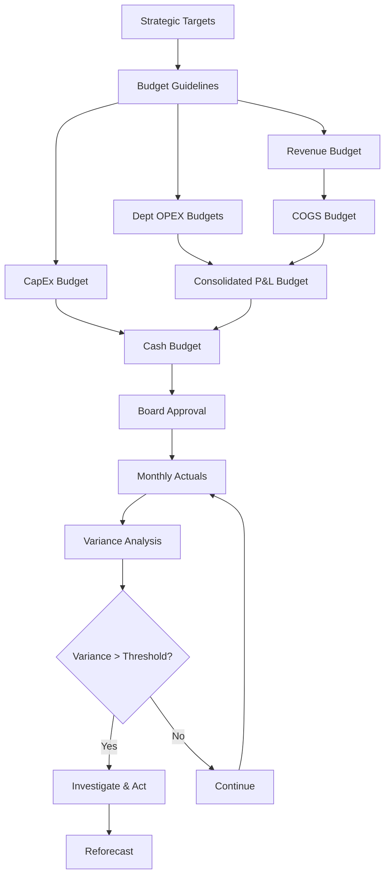

# FI05 — Budgeting & Cost Management

> **Domain:** Finance | **Level:** Intermediate | **Prerequisites:** FI01, FI02

---

## 1. Learning Objectives

Sau khi hoàn thành module này, học viên có thể:
- Phân biệt các loại budget: Operating, Capital, Cash Budget
- Áp dụng Zero-Based Budgeting (ZBB) và Rolling Forecast
- Thực hiện Standard Costing và Variance Analysis (Price/Volume/Mix)
- Hiểu Activity-Based Costing (ABC) và khi nào áp dụng
- Phân tích Cost-Volume-Profit (CVP) và tính Break-even point
- Thiết kế Budget process phù hợp với doanh nghiệp VN
- Nhận diện và xử lý cost control challenges đặc thù VN

---

## 2. Business Context

Budgeting & Cost Management là công cụ kiểm soát và định hướng doanh nghiệp. Tại VN:
- **SME:** Phần lớn không có formal budget process — "budget bằng kinh nghiệm" → không kiểm soát được chi phí
- **Listed companies:** Yêu cầu lập kế hoạch tài chính trình ĐHCĐ hàng năm
- **Tập đoàn nhà nước (SOE):** Budget là chỉ tiêu pháp lệnh, không hoàn thành là trách nhiệm
- **FDI:** Ngân sách của subsidiary phải align với HQ global budget cycle
- **Thách thức VN:** Inflation cao, tỷ giá biến động → budget lỗi thời nhanh; văn hóa "xài hết ngân sách" cuối năm
- **Cost creep:** Chi phí nhân sự tăng 10-15%/năm ở VN → lập budget nhân sự cần cẩn thận

---

## 3. Definitions (Bảng Thuật Ngữ)

| Thuật ngữ | Định nghĩa | Ghi chú |
|-----------|-----------|---------|
| Operating Budget | Ngân sách hoạt động: Revenue + OPEX | Hàng năm, theo tháng/quý |
| Capital Budget (CapEx) | Ngân sách đầu tư tài sản dài hạn | Mua máy, xây nhà xưởng |
| Cash Budget | Dự báo dòng tiền chi tiết | Khác với P&L budget |
| Zero-Based Budgeting (ZBB) | Lập lại từ đầu mỗi kỳ, không kế thừa năm trước | Kiểm soát chi phí chặt |
| Rolling Forecast | Dự báo liên tục (luôn có 12 tháng tới) | Thay thế/bổ sung annual budget |
| Standard Costing | Chi phí định mức theo đơn vị sản phẩm | Sản xuất, lắp ráp |
| Variance Analysis | Phân tích chênh lệch actual vs budget/standard | Price/Volume/Mix variance |
| Activity-Based Costing (ABC) | Phân bổ chi phí theo hoạt động thực tế | Thay thế traditional overhead allocation |
| Cost-Volume-Profit (CVP) | Phân tích mối quan hệ chi phí - sản lượng - lợi nhuận | Break-even analysis |
| Contribution Margin | Revenue - Variable Costs | Đóng góp vào fixed costs + profit |
| Break-even Point | Sản lượng khi Revenue = Total Costs | FC / Contribution Margin per unit |
| Flexible Budget | Budget điều chỉnh theo sản lượng thực tế | Công bằng hơn static budget |
| Driver-Based Budgeting | Budget xây dựng từ operational KPIs | Vs incremental budgeting |

---

## 4. Core Concepts (với Diagrams)

### 4.1 Budget Hierarchy

```
BUDGET FRAMEWORK
        │
        ├── STRATEGIC PLAN (3-5 năm)
        │   └── Targets dài hạn, strategic initiatives
        │
        ├── ANNUAL BUDGET (Operating)
        │   ├── Revenue Budget (by product/region/channel)
        │   ├── COGS Budget (Standard costs × Volume)
        │   ├── OPEX Budget (Dept by dept)
        │   └── → P&L Budget
        │
        ├── CAPITAL BUDGET (CapEx)
        │   ├── Maintenance CapEx
        │   └── Growth CapEx
        │
        └── CASH BUDGET
            └── Monthly cash in/out based on P&L + CapEx + WC
```

### 4.2 Variance Analysis Framework

```
REVENUE VARIANCE
= Actual Revenue - Budget Revenue

Broken down into:
├── PRICE VARIANCE = (Actual Price - Standard Price) × Actual Volume
├── VOLUME VARIANCE = (Actual Volume - Budget Volume) × Standard Price
└── MIX VARIANCE = Volume × (Actual Mix% - Budget Mix%) × (Price diff)

COST VARIANCE (Manufacturing)
├── Materials Price Variance = (Std Price - Actual Price) × Actual Qty
├── Materials Quantity Variance = (Std Qty - Actual Qty) × Std Price
├── Labor Rate Variance = (Std Rate - Actual Rate) × Actual Hours
└── Labor Efficiency Variance = (Std Hours - Actual Hours) × Std Rate
```

### 4.3 CVP Analysis

```
REVENUE LINE
              │      /  (slope = Price per unit)
  Revenue ($) │    /
              │  /  Break-even Point
 Total Cost   │/─ ─ ─ ─ ─ ─ ─ ─ ─ ─ ─ →
              │ \  PROFIT ZONE →
  Fixed Cost  │  \ Total Cost Line
              └────────────────────────
                        Volume (units)

Break-even = Fixed Costs / Contribution Margin per unit
Margin of Safety = (Actual Volume - BEP) / Actual Volume × 100%
```

### 4.4 ZBB vs Traditional Budgeting

```
TRADITIONAL BUDGETING          ZERO-BASED BUDGETING
──────────────────────         ────────────────────
Year N budget:  100            Year N budget: rebuild from 0
Year N+1:       + 5% = 105     Year N+1: justify every line item
                                "What does this activity cost?"
                                "Is this activity necessary?"
Pros: Fast, easy               Pros: Eliminates waste
Cons: Perpetuates waste        Cons: Time-intensive (every 3-5 yrs)
```

---

## 5. Business Value

- **Kiểm soát chi phí:** Budget là công cụ phòng ngừa chi tiêu vượt mức
- **Ra quyết định:** Variance analysis phát hiện sớm vấn đề để can thiệp
- **Accountability:** Gắn ngân sách với người chịu trách nhiệm (budget owner)
- **Resource allocation:** Phân bổ nguồn lực có hạn vào hoạt động sinh lời nhất
- **Pricing decisions:** Break-even và contribution margin guide pricing strategy
- **Tối ưu product mix:** ABC và CVP giúp biết sản phẩm nào thực sự có lãi

---

## 6. Enterprise Role

| Cấp độ | Vai trò |
|--------|---------|
| CEO/Board | Phê duyệt top-line budget, strategic priorities |
| CFO | Điều phối budget process, challenge assumptions, consolidate |
| Budget Owner (Dept Head) | Lập và bảo vệ budget của phòng mình |
| FP&A Manager | Thiết kế process, templates, phân tích variance |
| Controller | Tracking actual vs budget, monthly reporting |
| Management Accountant | Standard costing, variance calculations |

---

## 7. Departments Related

- **Finance/FP&A:** Thiết kế và vận hành budget process
- **Sales:** Revenue budget (key input — thường optimistic, cần challenge)
- **Operations/Manufacturing:** COGS, capacity, standard costs
- **HR:** Headcount budget, salary increases, training
- **Marketing:** A&P (advertising & promotion) budget
- **IT:** Technology investment budget
- **Supply Chain:** Procurement budget, inventory targets

---

## 8. Input

- Chiến lược kinh doanh và targets từ ban lãnh đạo
- Historical actuals 3 năm
- Market forecasts (ngành, vĩ mô)
- Sales pipeline từ Sales team
- Quotations từ nhà cung cấp (raw material costs)
- HR: salary adjustments plan, headcount plan
- Capex requests từ các phòng ban
- Macro assumptions: lạm phát, tỷ giá USD/VND, lãi suất vay

---

## 9. Output

- Annual Budget (P&L, Balance Sheet, Cash Flow)
- CapEx Budget (project-by-project)
- Department budgets (cost center level)
- Monthly variance reports (Actual vs Budget vs Prior Year)
- Rolling Forecast (quarterly update)
- Product cost cards (standard costing)
- Pricing analysis (CVP, Break-even)

---

## 10. Business Process

```
Strategic      Budget       Budget        Approval      Monitor &
Planning    → Submission → Consolidation → & Sign-off → Reforecast
(Sep-Oct)     (Oct-Nov)    (Nov-Dec)      (Dec)        (Monthly)
      │              │            │            │             │
  Targets &    Dept fills    CFO challenge  CEO/Board    Variance
  Guidelines   templates     & iterate      approves     analysis
```

---

## 11. Data Flow

```
Strategy (Top-down) ──→ Revenue Targets ──→
                                           Budget Templates
Historical data ────→ Volume/Cost trends ──→
Market data ────────→ Assumptions ────────→ → Consolidated Budget
Dept inputs ────────→ Bottom-up costs ───→
HR data ────────────→ Personnel costs ───→
                                           → Variance Tracking (Monthly)
ERP Actuals ────────────────────────────→
```

---

## 12. Money Flow

```
BUDGETED REVENUE
     │
     - COGS (standard cost × volume)
     = GROSS PROFIT
     - OPEX (dept budgets: S&M, G&A, R&D)
     = EBITDA
     - D&A (fixed asset schedule)
     = EBIT
     - Interest (debt schedule)
     = EBT
     - Tax (rate × EBT)
     = NET INCOME BUDGET
```

---

## 13. Document Flow

| Tài liệu | Từ | Đến | Thời điểm |
|----------|-----|-----|----------|
| Budget Guidelines | CFO | Dept Heads | T-3 tháng trước năm mới |
| Budget Templates | FP&A | Dept Heads | Cùng lúc guidelines |
| Dept Budget Submissions | Dept Heads | FP&A | T-2 tháng |
| Budget Review Meeting | FP&A | CFO, Dept Heads | T-1.5 tháng |
| Consolidated Budget | FP&A | CEO, Board | T-1 tháng |
| Board Approval | Board | Management | Tháng 12 |
| Monthly Variance Report | FP&A | Management | T+10 ngày |

---

## 14. Roles

| Vai trò | Mô tả |
|---------|-------|
| CFO | Budget champion, challenge top-down vs bottom-up, final sign-off |
| FP&A Manager | Thiết kế process, build templates, consolidate, analyze |
| Budget Controller | Track actuals, prepare variance reports, investigate |
| Department Heads | Budget owners — build, defend, manage within budget |
| Management Accountant | Standard costing, product cost cards |
| Internal Auditor | Kiểm tra tuân thủ budget approval authority |

---

## 15. Responsibilities

- **CFO:** Đảm bảo budget align với strategy; không để budget trở thành "số giả"
- **FP&A:** Process chạy đúng lịch; templates đơn giản nhưng đầy đủ; variance explanation
- **Dept Heads:** Budget của mình là commitment — không overspend; giải thích variances
- **CEO:** Phê duyệt tổng thể; tạo tone rằng budget là công cụ quản lý, không phải gánh nặng

---

## 16. RACI (Bảng)

| Hoạt động | CEO/Board | CFO | FP&A | Dept Head | Controller |
|-----------|-----------|-----|------|-----------|-----------|
| Set budget guidelines | A | R | C | I | I |
| Build dept budget | I | I | C | R | C |
| Consolidate budget | I | A | R | C | C |
| Challenge & iterate | I | R | C | R | C |
| Board approval | R/A | C | I | I | I |
| Monthly variance report | I | A | R | I | R |
| Reforecast | A | R | R | C | C |

---

## 17. Frameworks

- **Master Budget:** Operating + CapEx + Cash Budget tích hợp
- **Driver-Based Budgeting:** Revenue drivers → volume → headcount → costs
- **Zero-Based Budgeting (ZBB):** Rebuild từ đầu mỗi 3-5 năm
- **Rolling Forecast:** 12-quarter rolling outlook
- **Beyond Budgeting:** Framework loại bỏ fixed annual budget (KPIs thay thế)
- **Standard Costing + Variance Analysis:** ICV (CIMA) standard

---

## 18. International Standards

| Chuẩn mực | Nội dung |
|-----------|---------|
| CIMA (Chartered Institute of Management Accountants) | Management accounting standards, variance analysis |
| IMA (Institute of Management Accountants) | Budgeting best practices |
| IAS 2 | Inventory Costing — liên quan Standard Costing |
| IFRS 8 | Operating Segments — phân bổ costs cho segment reporting |
| Beyond Budgeting Round Table (BBRT) | Modern budgeting approach |

---

## 19. Vietnam Context

**Budget process tại DN VN:**
- **SOE (DNNN):** Budget = chỉ tiêu pháp lệnh từ Bộ chủ quản/HĐQT → gắn với lương thưởng ban lãnh đạo
- **Tư nhân SME:** Thường là "budget trong đầu" — không formal; FP&A phải build từ đầu
- **Listed companies:** ĐHCĐ thường niên phải trình kế hoạch kinh doanh (Revenue, Profit targets)

**Thách thức đặc thù VN:**
- **Lạm phát & tỷ giá:** Giá nguyên vật liệu biến động mạnh → budget đầu năm lỗi thời giữa năm
- **Labor cost inflation:** Lương tăng 10-15%/năm → nhân sự budget cần sensitivity
- **Văn hóa "xài hết ngân sách":** Cuối năm chi tiêu tăng để "đừng mất ngân sách năm sau"
- **Budget gaming:** Dept heads để headroom nhiều → ZBB giải quyết vấn đề này

**Standard Costing VN — ví dụ may mặc:**
- BOM (Bill of Materials): 2.5m vải × 80,000 VND/m = 200,000 VND/sản phẩm
- Labor: 30 phút × 60,000 VND/giờ = 30,000 VND/sản phẩm
- Overhead: phân bổ theo machine hours
- Standard Cost per unit: ~280,000 VND → set selling price và theo dõi variance

---

## 20. Legal Considerations

- **Luật Doanh nghiệp 2020:** ĐHCĐ phải phê duyệt kế hoạch kinh doanh hàng năm (with budget)
- **Nghị định DNNN:** HĐQT/HĐTV phê duyệt kế hoạch tài chính, kiểm soát chi tiêu
- **Luật Đấu thầu 2023:** Chi tiêu mua sắm phải qua đấu thầu khi vượt ngưỡng → ảnh hưởng CapEx budget timing
- **Luật Thuế TNDN:** Chi phí được trừ phải có hóa đơn, chứng từ hợp lệ → OPEX budget phải track documents
- **Quy chế chi tiêu nội bộ:** DN phải có quy chế phê duyệt chi tiêu (approval authority matrix)

---

## 21. Common Mistakes

1. **Revenue budget quá lạc quan:** Sales team over-promise → mọi chi phí theo đó oversized
2. **Incremental budgeting blindly:** +5% mỗi năm mà không xem xét lại → tích lũy waste
3. **Budget silos:** Dept budget không align với nhau → COGS budget không match sales volume
4. **Bỏ qua cash budget:** P&L budget tốt nhưng không có cash budget → cash crisis
5. **Variance analysis không có action:** Report chênh lệch nhưng không ai xử lý
6. **Budget là ceiling, không phải commitment:** "Không tiêu hết thì mất" → waste
7. **Không điều chỉnh cho seasonality:** Budget chia đều 12 tháng → sai reality
8. **Standard costs lỗi thời:** Không update standard costs → variances vô nghĩa

---

## 22. Best Practices

1. **Driver-based budgeting:** Link revenue assumptions → volume → headcount → costs
2. **3 scenarios minimum:** Base/Upside/Downside ngay từ đầu budget cycle
3. **Monthly reforecast:** Cập nhật tháng 3, 6, 9 với rolling forecast
4. **Budget calendar:** Tối thiểu 3 tháng trước năm tài chính mới
5. **Challenge revenue first:** Revenue budget là key input — phải được challenge nhất
6. **Variance threshold:** Chỉ explain variances > 5% hoặc > X tỷ để focus
7. **Collaboration, not top-down:** Bottom-up từ dept heads → ownership cao hơn
8. **ABC cho doanh nghiệp phức tạp:** Khi overhead > 30% total cost, traditional allocation gây méo mó

---

## 23. KPIs (Bảng)

| KPI | Công thức | Mục tiêu | Ý nghĩa |
|-----|-----------|---------|---------|
| Budget Accuracy | |Actual-Budget|/Budget | <10% | Chất lượng lập kế hoạch |
| Cost of Goods % | COGS/Revenue | vs benchmark ngành | Kiểm soát giá vốn |
| OPEX as % Revenue | OPEX/Revenue | Downward trend | Leverage operating |
| Variance Explanation Rate | Variances explained / Total variances | >90% | Accountability |
| Break-even Coverage | Revenue/BEP Revenue | >1.3x | Safety margin |
| Contribution Margin % | CM/Revenue | >30% (vary by industry) | Product economics |
| CapEx Budget Utilization | Actual CapEx/Budget CapEx | 90-100% | Investment execution |

---

## 24. Metrics

- **Operating Leverage:** % change EBIT / % change Revenue (high = risky but rewarding)
- **Degree of Operating Leverage (DOL):** Contribution Margin / EBIT
- **Margin of Safety:** (Actual Revenue - BEP Revenue) / Actual Revenue
- **Fixed vs Variable Cost Split:** Quan trọng cho CVP analysis
- **Overhead Absorption Rate:** Total Overhead / Total Volume (for standard costing)
- **Price-Volume-Mix:** Revenue variance decomposition

---

## 25. Reports

| Báo cáo | Tần suất | Nội dung |
|---------|---------|---------|
| Monthly P&L vs Budget | Tháng | Revenue, COGS, OPEX variances |
| Department Budget Report | Tháng | Mỗi phòng ban — actual vs budget |
| Rolling Forecast | Quý | Full-year outlook updated |
| CapEx Status Report | Tháng | Progress vs approved budget |
| Product Profitability | Quý | Margin by product/segment |
| Annual Budget Review | Năm | Full cycle review, lessons learned |

---

## 26. Templates

**Monthly Variance Report Template:**
```
DEPARTMENT: Marketing | PERIOD: Tháng 9/2025
─────────────────────────────────────────────────────
ITEM          | BUDGET | ACTUAL | VARIANCE | VAR%  | NOTE
─────────────────────────────────────────────────────
Digital Ads   |  500   |  540   |   (40)   |  -8%  | Campaign scale-up
Events        |  200   |  150   |    50    | +25%  | Event postponed
Agency fees   |  300   |  310   |   (10)   |  -3%  | Minor overage
Salaries      |  800   |  820   |   (20)   |  -3%  | New hire start
─────────────────────────────────────────────────────
TOTAL         | 1,800  | 1,820  |   (20)   |  -1%  | Within tolerance
─────────────────────────────────────────────────────
YTD Budget: 16,200  YTD Actual: 16,450  YTD Var: (250) = -1.5%
```

**CVP Analysis Template:**
```
PRODUCT: Cà phê đóng gói 250g
─────────────────────────────────────
Selling price per unit:       25,000
Variable cost per unit:       (14,000)
  - Raw materials: (8,000)
  - Packaging:     (2,500)
  - Labor var:     (2,000)
  - Distribution:  (1,500)
CONTRIBUTION MARGIN:          11,000  (44% CM ratio)

Fixed costs per month:      1,100,000,000 VND
BREAK-EVEN (units):         1,100,000 / 11,000 = 100,000 units
BREAK-EVEN (revenue):       100,000 × 25,000 = 2,500,000,000 VND

Target profit 500 tỷ:
Units needed = (1,100M + 500M) / 11,000 = 145,455 units
```

---

## 27. Checklists

**Annual Budget Process Checklist:**
- [ ] Budget guidelines issued ≥ 3 tháng trước năm tài chính
- [ ] Templates phân phát cho tất cả budget owners
- [ ] Revenue budget reviewed và challenged bởi CFO
- [ ] Standard costs updated cho năm tới
- [ ] Macro assumptions (tỷ giá, lãi suất, inflation) được agree
- [ ] Scenarios (Base/Upside/Downside) được build
- [ ] CapEx requests reviewed và prioritized
- [ ] Cash budget reconciled với P&L budget
- [ ] Board approval trước ngày 31/12

**Monthly Variance Analysis Checklist:**
- [ ] Lấy actuals từ ERP (closed books)
- [ ] Tính variances by P&L line và dept
- [ ] Identify variances > threshold (5% hoặc X tỷ)
- [ ] Collect explanations từ dept heads
- [ ] Update full-year forecast nếu trend thay đổi
- [ ] Báo cáo cho CFO với action items

---

## 28. SOP

**SOP: Annual Budget Cycle**
1. **T-3 tháng (Sep):** CFO issue budget guidelines + macro assumptions
2. **T-3 (Sep):** FP&A phân phát templates; sales kick-off budget meeting
3. **T-2 (Oct):** Depts submit bottom-up budgets
4. **T-2 (Oct-Nov):** CFO/FP&A review, challenge sessions với từng dept
5. **T-1.5 (Nov):** Iterate — 2-3 rounds negotiation
6. **T-1 (Nov):** Consolidate và present to CEO
7. **T-1 (Dec 1):** Board review và approval (dự kiến)
8. **T-1 (Dec 15):** Final approved budget phân phối

**SOP: Monthly Variance Reporting**
1. T+3: ERP closed — extract actuals
2. T+5: Tính variances; distribute template cho dept heads
3. T+7: Dept heads nộp variance explanations
4. T+9: FP&A compile, add commentary, update forecast
5. T+10: CFO review
6. T+12: Distribute Management Pack

---

## 29. Case Study

**Công ty Sản xuất Nhựa VN — Variance Analysis Bài học**

*Tình huống:* Budget năm đặt Revenue 500 tỷ, Gross Margin 25%. Thực tế Q3: Revenue 420 tỷ, Gross Margin 21%.

*Variance Analysis:*

Revenue variance: -80 tỷ
- Price variance: +10 tỷ (tăng giá bù đắp một phần)
- Volume variance: -90 tỷ (sản lượng thấp hơn 18%)

Gross Margin variance: -25 tỷ (so với budget)
- Materials price variance: -15 tỷ (giá hạt nhựa tăng 8%)
- Labor efficiency variance: -5 tỷ (downtime nhiều)
- Overhead absorption variance: -5 tỷ (volume thấp → fixed overhead không absorb đủ)

*Action items:*
1. Renegotiate nhà cung cấp hạt nhựa; tìm alternative suppliers
2. Tìm nguyên nhân downtime — machine maintenance issue
3. Reforecast Q4 với giá nguyên liệu mới và volume thực tế
4. Consider price increase thêm 5% cho Q4

---

## 30. Small Business Example

**Phở Thìn 3 Chi nhánh — Break-even & Budget**

*CVP Analysis:*
- Giá tô phở: 85,000 VND
- Variable cost/tô: 35,000 (thịt bò, bánh phở, gia vị, bao bì)
- Contribution Margin: 50,000 VND/tô (59% CM ratio)

*Fixed costs/tháng (3 chi nhánh):*
- Thuê mặt bằng: 90 triệu
- Nhân viên: 120 triệu
- Điện nước, khác: 30 triệu
- Total Fixed Cost: 240 triệu

*Break-even:* 240,000,000 / 50,000 = **4,800 tô/tháng** = 1,600 tô/chi nhánh/tháng = ~53 tô/ngày

*Budget target (target profit 60 triệu/tháng):*
Units = (240M + 60M) / 50,000 = **6,000 tô/tháng** = 2,000 tô/chi nhánh/tháng = ~67 tô/ngày

---

## 31. Enterprise Example

**Masan Consumer — Budget Process trong Tập đoàn**

Masan Consumer (MCH) với 3,000+ SKUs, 5 nhà máy, doanh thu ~15,000 tỷ:

**Budget process:**
1. **Top-down targets:** Board đặt Revenue growth 12%, EBITDA margin 18%
2. **Bottom-up submission:** Mỗi Brand (Chin-su, Nam Ngư, Omachi...) build P&L riêng
3. **Sales & Operations Planning (S&OP):** Volume forecast → production plan → cost
4. **Standard Costing update:** Mỗi năm update standard costs theo NVL mới nhất
5. **Challenge sessions:** CFO challenge từng brand team — "Tại sao A&P tăng 20% nhưng volume chỉ tăng 5%?"
6. **ZBB tại overhead:** Shared services và G&A cost centers dùng ZBB 2 năm/lần

**Key lesson:** Với multi-brand, multi-factory companies: ABC là cần thiết để biết chính xác profitability của từng SKU.

---

## 32. ERP Mapping

| Chức năng | SAP | Oracle | MISA |
|-----------|-----|--------|------|
| Budget entry | CO/FM | Oracle Planning | Kế hoạch ngân sách |
| Standard costing | CO-PC | Cost Management | Định mức giá thành |
| Variance tracking | CO-PA | OBIEE | Báo cáo so sánh |
| Rolling forecast | SAP BPC | Hyperion | — |
| CapEx budget | IM | Project Accounting | TSCĐ kế hoạch |
| Actual vs Budget | CO-PA | EPM | So sánh KH-TH |

---

## 33. Automation Opportunities

- **Budget template automation:** Excel/Google Sheets với pre-filled assumptions; auto-roll-up
- **Variance reporting automation:** ERP → Power BI dashboard, auto-highlight variances
- **Reforecast automation:** Link actuals → auto-update full-year estimate
- **Standard cost update:** ERP workflow tự động cập nhật standard costs từ purchasing data
- **Approval workflows:** Budget submissions qua digital workflow, không qua email

---

## 34. AI Opportunities

- **AI-assisted budgeting:** ML học từ historical patterns → suggest budget numbers
- **Anomaly detection:** AI alert khi spending pattern bất thường vs trend
- **Revenue forecasting:** AI dự báo doanh thu từ market signals
- **Natural language variance commentary:** AI draft explanation từ numbers
- **Scenario modeling:** AI tạo multiple scenarios tự động với probability weights
- **Chatbot for budget queries:** "Show me Marketing variance Q3" → instant answer

---

## 35. Implementation Guide

**Build Budget & Cost Management System (6 tháng):**

| Tháng | Hoạt động |
|-------|----------|
| T1 | Audit: Budget process hiện tại; tìm pain points |
| T2 | Thiết kế Budget framework; standard cost structure; Chart of Accounts |
| T3 | Build templates (Excel/ERP); train budget owners |
| T4 | Pilot: 1 department hoàn chỉnh từ đầu đến cuối |
| T5 | Roll-out toàn công ty; first budget cycle |
| T6 | First monthly close vs budget; refine variance reporting |

---

## 36. Consulting Guide

**Khi assess budget maturity của client:**
1. Họ có formal annual budget không? Bằng Excel hay ERP?
2. Budget được phê duyệt ở cấp nào? Có Board approval không?
3. Variance reporting: Tần suất? Ai nhận? Action taken?
4. Có rolling forecast không hay chỉ dùng annual budget?
5. Standard costing: Có không? Cập nhật khi nào?
6. CVP analysis: Có biết break-even point của sản phẩm chính không?

**Red flags:**
- Budget chỉ là "wish list" không ai kiểm soát
- Variance report không ai đọc
- "Xài hết ngân sách" cuối năm là văn hóa
- Không có cash budget (chỉ có P&L budget)

---

## 37. Diagnostic Questions

1. Budget được lập như thế nào — top-down hay bottom-up hay combination?
2. Variance analysis có được thực hiện hàng tháng không? Ai review?
3. Khi variance lớn, quy trình escalation là gì? Ai phải giải thích?
4. Có rolling forecast không? Cập nhật khi nào?
5. Overhead được phân bổ theo cách nào — ABC hay traditional?
6. Có biết break-even point của sản phẩm/dịch vụ chính không?
7. Standard costs có được cập nhật hàng năm không?

---

## 38. Interview Questions

**Management Accountant:**
1. Giải thích Price Variance và Volume Variance trong revenue analysis
2. Công ty sản xuất có Revenue budget 500 tỷ nhưng actual 450 tỷ — phân tích và identify causes
3. ABC khác traditional costing ở điểm nào? Khi nào nên dùng ABC?

**CFO/Finance Director:**
1. Bạn sẽ design budget process từ đầu cho công ty 1,000 tỷ như thế nào?
2. Làm thế nào bạn challenge revenue forecast của Sales team mà không làm mất relationship?
3. ZBB có phù hợp với doanh nghiệp VN không? Pros/cons?

---

## 39. Exercises

**Bài tập 1:** Variance analysis: Budget Revenue 1,000 tỷ (1,000,000 units × 1,000,000 VND). Actual: 950 tỷ (900,000 units × 1,056,000 VND). Tính Price và Volume variance.

**Bài tập 2:** CVP analysis: SP/unit = 500,000 VND, VC/unit = 300,000 VND, Fixed Cost = 6 tỷ/tháng. Tính BEP (units và doanh thu). Cần bán bao nhiêu để đạt lợi nhuận 2 tỷ/tháng?

**Bài tập 3:** Lập Operating Budget cho 1 cửa hàng bán lẻ (doanh thu 5 tỷ/tháng) theo tháng trong 1 năm, có tính seasonality Tết và hè.

**Bài tập 4:** ZBB cho phòng Marketing 3 tỷ/năm: Justify từng hoạt động, loại bỏ 20% không hiệu quả.

---

## 40. References

- Horngren, Datar, Rajan — "Cost Accounting: A Managerial Emphasis" (Pearson)
- CIMA — "Management Accounting: Performance Evaluation"
- McKinsey — "Why ZBB Transforms Cost Management"
- IMA — imacanagemember.org — Management Accounting standards
- VAS 02 — Hàng tồn kho (liên quan standard costing)
- MISA — misa.vn (phần mềm kế toán VN phổ biến)
- Luật Đấu thầu 2023 — ảnh hưởng budget CapEx

---

## Output Formats

### Mermaid Diagram



### ASCII Diagram

```
╔══════════════════════════════════════════════════════╗
║         BUDGETING & COST MANAGEMENT                  ║
╠══════════════════════════════════════════════════════╣
║ BUDGET TYPES:                                        ║
║  Operating: P&L by month/quarter                     ║
║  CapEx: Investment in fixed assets                   ║
║  Cash: Timing of actual cash flows                   ║
╠══════════════════════════════════════════════════════╣
║ VARIANCE = ACTUAL - BUDGET                           ║
║  Revenue:  Price × Volume × Mix                      ║
║  Cost:     Price × Efficiency                        ║
╠══════════════════════════════════════════════════════╣
║ CVP:                                                 ║
║  CM = Revenue - Variable Costs                       ║
║  BEP = Fixed Costs / CM per unit                     ║
║  DOL = CM / EBIT (operating leverage)                ║
╠══════════════════════════════════════════════════════╣
║ ZBB: Rebuild từ 0, justify everything               ║
║ Rolling: Luôn có 12 tháng tương lai                  ║
╚══════════════════════════════════════════════════════╝
```

### Flashcards

**Q1:** Sự khác biệt giữa Traditional Budgeting và Zero-Based Budgeting?
**A1:** Traditional = năm trước + X%. Nhanh nhưng tích lũy waste vì không ai xem xét lại nền tảng. ZBB = justify từng khoản từ đầu, mọi chi phí phải chứng minh giá trị. ZBB chậm hơn nhưng loại bỏ inefficiency, thường áp dụng 3-5 năm/lần cho overhead.

**Q2:** Break-even point là gì và cách tính?
**A2:** Break-even là mức doanh thu/sản lượng khi Total Revenue = Total Costs (lợi nhuận = 0). BEP (units) = Fixed Costs / Contribution Margin per unit. BEP (revenue) = Fixed Costs / CM ratio. Quan trọng để biết cần bao nhiêu doanh thu tối thiểu để không lỗ.

**Q3:** Revenue Variance phân tách thành các thành phần nào?
**A3:** Revenue Variance = Price Variance + Volume Variance (+ Mix Variance nếu multi-product). Price Variance = (Actual Price - Budget Price) × Actual Volume. Volume Variance = (Actual Volume - Budget Volume) × Budget Price. Phân tách này giúp biết shortfall là do giảm giá hay do bán ít hơn kế hoạch.

### Cheat Sheet

```
╔══════════════════════════════════════════════════════╗
║         FI05 BUDGETING & COST MANAGEMENT             ║
║                   CHEAT SHEET                        ║
╠══════════════════════════════════════════════════════╣
║ CVP FORMULAS:                                        ║
║  CM = SP - VC (per unit)                             ║
║  CM ratio = CM / Revenue                             ║
║  BEP (units) = FC / CM per unit                      ║
║  BEP (revenue) = FC / CM ratio                       ║
║  Target profit: Units = (FC + Profit) / CM           ║
╠══════════════════════════════════════════════════════╣
║ VARIANCE ANALYSIS:                                   ║
║  Revenue = Price Var + Volume Var [+ Mix Var]        ║
║  Cost = Price/Rate Var + Qty/Efficiency Var          ║
║  Favorable (+) = Actual better than Budget           ║
╠══════════════════════════════════════════════════════╣
║ BUDGET TYPES:                                        ║
║  Operating │ CapEx │ Cash │ Flexible │ Rolling       ║
╠══════════════════════════════════════════════════════╣
║ VN CONTEXT:                                          ║
║  Labor cost +10-15%/yr │ Tỷ giá risk                 ║
║  Seasonality Tết │ "Xài hết budget" culture          ║
╚══════════════════════════════════════════════════════╝
```

### JSON Metadata

```json
{
  "module": "FI05",
  "name": "Budgeting & Cost Management",
  "domain": "Finance",
  "level": "Intermediate",
  "prerequisites": ["FI01", "FI02"],
  "related_modules": ["FI01", "FI02", "FI06"],
  "key_concepts": ["Operating Budget", "CapEx Budget", "Cash Budget", "ZBB", "Rolling Forecast", "Standard Costing", "Variance Analysis", "ABC", "CVP", "Break-even"],
  "key_metrics": ["Budget Accuracy", "Contribution Margin", "BEP", "Variance %", "Operating Leverage"],
  "standards": ["CIMA", "IMA", "IAS 2"],
  "vn_context": ["DHDCD ke hoach kinh doanh", "ZBB overhead", "Labor cost inflation 10-15%", "Seasonality Tet"],
  "tools": ["SAP CO/BPC", "Hyperion", "Excel", "Power BI", "MISA"],
  "estimated_learning_hours": 16,
  "last_updated": "2026-06-30"
}
```
