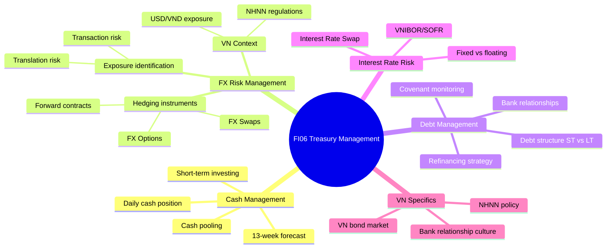

# FI06 — Treasury Management

> **Domain:** Finance | **Level:** Advanced | **Prerequisites:** FI01, FI02

---

## 1. Learning Objectives

Sau khi hoàn thành module này, học viên có thể:
- Mô tả 4 chức năng chính của Treasury: Cash, FX, Debt, Risk
- Phân tích và quản lý FX risk (rủi ro tỷ giá) với các công cụ: Forward, Options, Swaps
- Hiểu Interest Rate Risk và các công cụ hedging
- Xây dựng Debt Management framework (covenant monitoring, refinancing)
- Quản lý quan hệ ngân hàng (bank relationship management)
- Ứng dụng vào thực tiễn VN: USD/VND exposure, NHNN regulations, thị trường trái phiếu VN

---

## 2. Business Context

Treasury là "heart" của tài chính doanh nghiệp — nơi tiền thực sự được quản lý, không phải chỉ ghi sổ. Tại VN:
- **FX risk cực kỳ quan trọng:** Hầu hết DN xuất nhập khẩu VN có USD/VND exposure — biến động tỷ giá ±3-5%/năm có thể xóa sạch lợi nhuận
- **NHNN kiểm soát ngoại hối:** Môi trường FX VN khác biệt so với thị trường tự do — nhiều hạn chế về hedging instruments
- **Thị trường trái phiếu DN VN:** Phát triển mạnh 2018-2021, sụp đổ 2022 (Tân Hoàng Minh, An Phát, FLC) → tác động lớn đến treasury
- **Hệ thống ngân hàng VN:** Quan hệ ngân hàng (bank relationship) cực kỳ quan trọng — credit line, tỷ giá ưu đãi, sản phẩm hedging phụ thuộc vào relationship
- **SME VN:** Hầu như không có formal treasury function — CFO kiêm nhiệm
- **Tập đoàn lớn:** Viettel, Vingroup, Masan có Treasury Department riêng, phức tạp như ngân hàng nhỏ

---

## 3. Definitions (Bảng Thuật Ngữ)

| Thuật ngữ | Định nghĩa | VN Context |
|-----------|-----------|-----------|
| Treasury | Bộ phận quản lý tiền, tín dụng, rủi ro tài chính | Phòng Tài chính tại DN lớn |
| FX Risk | Rủi ro tỷ giá từ giao dịch ngoại tệ | USD/VND exposure phổ biến nhất |
| FX Forward | Hợp đồng mua/bán ngoại tệ kỳ hạn với tỷ giá cố định | Phổ biến nhất tại VN |
| FX Option | Quyền (không bắt buộc) mua/bán ngoại tệ | Ít phổ biến do chi phí premium |
| FX Swap | Hoán đổi ngoại tệ — bán spot, mua forward (hoặc ngược lại) | Dùng để rolling hedges |
| Cross Currency Swap | Hoán đổi dòng tiền lãi và gốc giữa 2 đồng tiền | Cho vay dài hạn liên tiền tệ |
| Interest Rate Swap (IRS) | Hoán đổi lãi cố định ↔ lãi thả nổi | Quản lý lãi suất |
| LIBOR / SOFR | Lãi suất tham chiếu liên ngân hàng quốc tế | LIBOR đã thay bằng SOFR từ 2023 |
| VNIBOR | Vietnam Interbank Offered Rate | Lãi suất liên NH VN |
| Covenant | Điều kiện ràng buộc trong hợp đồng vay | Debt/EBITDA < 3x; min liquidity |
| ISDA Agreement | International Swaps and Derivatives Association Master Agreement | Framework cho derivatives |
| Cash Pooling | Tập trung tiền mặt từ nhiều TK vào một TK master | Tối ưu lãi suất |
| Notional Pooling | Gom tiền "ảo" để tính lãi, không chuyển tiền thực | Ít phổ biến VN |
| Net Exposure | Exposure ròng sau khi netting mua và bán | FX exposure thực cần hedge |
| Mark-to-Market (MTM) | Định giá theo giá thị trường hiện tại | Fair value của derivatives |

---

## 4. Core Concepts (với Diagrams)

### 4.1 Treasury Function Overview

```
TREASURY MANAGEMENT
        │
        ├── CASH MANAGEMENT
        │   ├── Daily cash position
        │   ├── Cash forecasting (13-week)
        │   ├── Cash pooling / concentration
        │   └── Short-term investing surplus
        │
        ├── FX RISK MANAGEMENT
        │   ├── Exposure identification (Transaction, Translation, Economic)
        │   ├── Hedging policy (what % to hedge, instruments)
        │   ├── Forward contracts (phổ biến nhất VN)
        │   ├── Options (quyền chọn)
        │   └── Natural hedging
        │
        ├── DEBT MANAGEMENT
        │   ├── Debt structure (ST vs LT, fixed vs float)
        │   ├── Covenant monitoring
        │   ├── Refinancing strategy
        │   └── Credit facility management
        │
        └── RISK MANAGEMENT
            ├── Interest rate risk
            ├── Counterparty risk
            ├── Liquidity risk
            └── Commodity price risk
```

### 4.2 FX Risk Hedging with Forward Contract

```
SCENARIO: Công ty xuất khẩu VN bán hàng USD, thu USD sau 90 ngày

TỶ GIÁ HIỆN TẠI:
  Spot rate: USD/VND = 24,000

KHÔNG HEDGE:
  Sau 90 ngày, USD/VND = 23,500 (VND mạnh lên)
  Export proceeds: $1,000,000 × 23,500 = 23,500,000,000 VND
  Mất: (24,000 - 23,500) × $1M = 500,000,000 VND

VỚI FORWARD CONTRACT:
  Lock forward rate: USD/VND = 24,050 (bank quote 90-day forward)
  Thu: $1,000,000 × 24,050 = 24,050,000,000 VND
  Chênh lệch vs no-hedge: +550,000,000 VND
  → Đã bảo vệ được revenue bằng VND

FX Forward Payoff:
                      Unhedged P&L
  Profit     /────────────────────
             │   Hedged (flat line, locked rate)
  ─ ─ ─ ─ ─ ─ ─ ─ ─ ─ ─ ─ ─ ─ ─ ─ ─ (Break-even)
  Loss       │
             └──────────────────────
             23,000  24,000  25,000  (USD/VND rate)
```

### 4.3 Debt Structure Decision

```
DEBT MANAGEMENT MATRIX
           │  SHORT-TERM (<1yr)   │  LONG-TERM (>1yr)
───────────┼─────────────────────┼─────────────────────
FIXED RATE │ Overdraft cố định   │ Term loan cố định
           │ (ít phổ biến VN)    │ Trái phiếu cố định
───────────┼─────────────────────┼─────────────────────
VARIABLE   │ Revolver (VNIBOR+)  │ Syndicated loan
RATE       │ Trade finance       │ (SOFR/VNIBOR+)
           │ Working capital     │ Project finance

ASSET-LIABILITY MATCHING:
  Short-term assets → Fund với short-term debt
  Long-term assets  → Fund với long-term debt
```

### 4.4 Interest Rate Risk Management

```
INTEREST RATE RISK:
  Floating rate debt → Risk: rates rise → higher interest expense

EXAMPLE: Vay 1,000 tỷ VND với lãi VNIBOR + 3%
  VNIBOR 6% → Chi phí lãi: 9% × 1,000 tỷ = 90 tỷ/năm
  VNIBOR rises to 9% → Chi phí lãi: 12% × 1,000 tỷ = 120 tỷ/năm → +30 tỷ

HEDGING với Interest Rate Swap (IRS):
  Company pays: FIXED 8.5% to bank
  Bank pays: VNIBOR + 3% to company (floating)
  Net: Company effectively pays fixed 8.5%
  → Certainty on interest expense regardless of VNIBOR movement
```

---

## 5. Business Value

- **Bảo vệ lợi nhuận:** FX hedging ngăn tỷ giá xóa sạch lợi nhuận kinh doanh
- **Giảm chi phí tài chính:** Tối ưu debt structure → tiết kiệm chi phí lãi vay
- **Đảm bảo thanh khoản:** Cash management và credit facilities đảm bảo không bao giờ hết tiền
- **Tối ưu lãi suất:** Cash pooling → tối ưu lãi tiền gửi cho toàn tập đoàn
- **Compliance:** NHNN và ISDA compliance tránh rủi ro pháp lý
- **Cạnh tranh:** Công ty biết hedge FX có pricing advantage hơn đối thủ không hedge

---

## 6. Enterprise Role

| Cấp độ | Vai trò Treasury |
|--------|-----------------|
| CEO/Board | Phê duyệt hedging policy, major debt decisions |
| CFO | Oversee toàn bộ treasury, bank relationships |
| Group Treasurer | Lead treasury function, set strategy |
| FX Dealer / Trader | Execute FX transactions, manage positions |
| Treasury Analyst | Cash forecasting, covenant tracking, reporting |
| Back Office | Confirmation, settlement, accounting |

---

## 7. Departments Related

- **Finance/Kế toán:** Mark-to-market accounting cho derivatives (IFRS 9)
- **Sales/Commercial:** FX exposure từ foreign currency contracts
- **Procurement:** FX exposure từ imports (USD/EUR purchases)
- **Legal:** ISDA agreements, loan documentation review
- **Risk Management:** Counterparty risk, market risk limits
- **CEO/Board:** Policy approval, major decisions
- **Ngân hàng đối tác:** Execution counterparties cho FX, debt

---

## 8. Input

- Bank statements (daily)
- FX exposure reports (AR/AP in foreign currency)
- Loan agreements và covenant schedules
- Market data: Spot rates, forward rates, VNIBOR, SOFR
- Cash flow forecasts (12 months)
- CapEx plans (potential FX exposure)
- NHNN regulations (tỷ giá trung tâm, quy định hedging)
- Credit ratings (nếu có)

---

## 9. Output

- Daily Cash Position Report
- FX Exposure Report (net open position by currency)
- Hedge Effectiveness Report (IFRS 9 hedge accounting)
- Covenant Compliance Report (monthly/quarterly)
- Bank Counterparty Limits Report
- Monthly Treasury Report cho CFO/Board
- Interest Rate Sensitivity Analysis

---

## 10. Business Process

```
Identify      Measure       Execute       Monitor      Report
Exposure  →  & Decide    →  Hedges    →  Positions  → & Comply
              │              │             │             │
           FX policy      Forward,      MTM daily    IFRS 9
           Debt review    Options,      Covenant     Board
           Cash plan      Swaps         Limits       NHNN
```

---

## 11. Data Flow

```
Sales (USD AR) ──→ FX Exposure ──→ Hedge Decision ──→ Forward/Options
Procurement    ──→ FX Exposure ──→ Net Exposure   ──→ Execute with Bank
Loan schedule  ──→ Interest    ──→ IRS hedge      ──→ Swap agreement
Bank balances  ──→ Cash pos.   ──→ Pool/invest    ──→ Optimize returns
All flows      ──→ Treasury Mgmt System ──→ Reports ──→ CFO/Board
```

---

## 12. Money Flow

```
FOREIGN CURRENCY FLOWS
                    VN Exporter (receives USD)
USD từ khách hàng → AR in USD → Convert to VND at spot OR
                                Hedge with Forward → Lock VND amount

                    VN Importer (pays USD)
USD cho NCC ←─── AP in USD ←── Buy USD spot OR
                                Hedge with Forward ← Lock VND cost

INTEREST FLOWS (Interest Rate Swap)
Company → pays FIXED rate → Bank
Company ← receives FLOAT rate ← Bank
Net: Company pays fixed, eliminates floating rate risk
```

---

## 13. Document Flow

| Tài liệu | Người tạo | Người nhận | Tần suất |
|----------|----------|-----------|---------|
| Daily Treasury Report | Treasury | CFO | Ngày |
| FX Position Report | Treasury | CFO, Risk | Ngày |
| Forward Contract Confirmation | Bank | Treasury | Per trade |
| Covenant Compliance Certificate | Finance | Ngân hàng | Quý/Năm |
| ISDA Confirmation | Treasury | Bank (Back office) | Per trade |
| Hedge Effectiveness Test | Finance | Auditors | Quý |
| Board Treasury Report | Treasurer | Board | Quý |

---

## 14. Roles

| Vai trò | Mô tả |
|---------|-------|
| Group Treasurer | Strategy, policy, board reporting, senior bank relationships |
| FX Dealer | Execute trades, market monitoring, hedge execution |
| Treasury Analyst | Cash forecasting, reporting, covenant tracking |
| Back Office | Settlement, confirmation, accounting entries |
| Middle Office | Risk limits monitoring, MTM, hedge accounting |
| External Banker | Provide pricing, products, credit facilities |

---

## 15. Responsibilities

- **CFO:** Thiết lập Treasury Policy (hedging %, instruments allowed, counterparty limits)
- **Treasurer:** Implement policy, bank relationships, team management
- **FX Dealer:** Execute trades at best prices; không speculate ngoài policy
- **Back Office:** Segregation of duties — không được execute VÀ confirm cùng một người
- **Internal Audit:** Kiểm tra tuân thủ hedging policy, counterparty limits

---

## 16. RACI (Bảng)

| Hoạt động | CFO | Treasurer | FX Dealer | Back Office | Risk | Auditor |
|-----------|-----|----------|---------|------------|------|---------|
| Set hedging policy | A | R | C | I | C | I |
| Execute FX hedge | I | A | R | I | C | I |
| Confirm & settle | I | A | I | R | I | I |
| Covenant monitoring | A | R | I | C | C | I |
| Board reporting | A | R | C | I | C | I |
| NHNN compliance | A | R | C | R | C | C |

---

## 17. Frameworks

- **Treasury Management Framework:** Cash + FX + Debt + Risk (4 pillars)
- **FX Hedging Policy:** % of exposure to hedge, instruments, tenor, counterparties
- **Asset-Liability Management (ALM):** Match assets với liabilities theo term và rate
- **ISDA Master Agreement:** Framework quốc tế cho OTC derivatives
- **Hedge Accounting (IFRS 9):** Fair value hedge / Cash flow hedge / Net investment hedge
- **Three Lines of Defense:** Treasury (1st), Risk/Finance (2nd), Audit (3rd)

---

## 18. International Standards

| Chuẩn mực | Liên quan đến Treasury |
|-----------|----------------------|
| IFRS 9 | Financial Instruments — hedge accounting, MTM of derivatives |
| IAS 21 | Effects of Changes in FX Rates — translation của foreign operations |
| IAS 39 | Cũ — replaced by IFRS 9, nhưng VAS vẫn dùng tương đương IAS 39 |
| ISDA 2002 | Master Agreement for OTC derivatives |
| Basel III (ngân hàng) | LCR (Liquidity), NSFR — ảnh hưởng bank products cho corporate |
| SOFR Transition | LIBOR → SOFR từ 06/2023 — ảnh hưởng floating rate loans |

---

## 19. Vietnam Context

**NHNN và Thị trường FX VN:**
- **Tỷ giá trung tâm (Central Rate):** NHNN công bố hàng ngày, biên độ giao dịch ±5%
- **Quy định ngoại hối:** Thông tư 12/2022/TT-NHNN — điều kiện vay ngoại tệ, chuyển tiền
- **FX Instruments tại VN:**
  - Forward USD/VND: Phổ biến, tenor 1-12 tháng
  - Swap USD/VND: Phổ biến để rolling hedges
  - FX Options: Ít ngân hàng cung cấp, chi phí cao
  - Cross Currency Swap: Chỉ với tập đoàn lớn
- **NHNN intervention:** Khi VND mất giá mạnh, NHNN bán USD từ dự trữ ngoại hối để ổn định

**Thị trường Trái phiếu DN VN:**
- Phát triển mạnh 2018-2021: >100,000 tỷ/năm phát hành
- Khủng hoảng 2022: Tân Hoàng Minh (đảo lộn thị trường), An Phát Holdings, SCB
- Nghị định 08/2023/NĐ-CP: Gia hạn trái phiếu, giãn nợ khẩn cấp
- 2024-2025: Thị trường phục hồi chậm, niềm tin nhà đầu tư còn thấp

**USD/VND Exposure — VN Enterprises:**
- Xuất khẩu (FMCG, dệt may, gỗ, thuỷ sản): Nhận USD → muốn USD mạnh
- Nhập khẩu (nguyên liệu, máy móc): Trả USD → muốn USD yếu
- DN vay USD (nợ USD thấp lãi suất hơn VND): Rủi ro khi USD tăng
- **Điển hình:** Hãng hàng không VN (VNA) có cả FX risk (doanh thu VND, chi phí USD như fuel, leasing) và interest rate risk (floating rate debt)

**Thực hành Bank Relationship VN:**
- Mỗi DN VN thường làm việc với 3-7 ngân hàng
- Bank relationship quyết định: hạn mức tín dụng, tỷ giá forward, sản phẩm hedging available
- Nên có ít nhất 1 "House Bank" chính và 2-3 relationship banks
- Ngân hàng trong nước vs nước ngoài: BIDV/Vietcombank/VietinBank vs HSBC/Citi/Standard Chartered

---

## 20. Legal Considerations

- **Thông tư 12/2022/TT-NHNN:** Điều kiện vay ngoại tệ trong nước (DN phải có ngoại tệ thu từ xuất khẩu mới được vay USD)
- **Quyết định 1081/QĐ-NHNN:** Quy định về tỷ giá, biên độ giao dịch USD/VND
- **Nghị định 70/2014/NĐ-CP (sửa đổi):** Quản lý ngoại hối — chuyển tiền ra nước ngoài
- **Thông tư 01/2015/TT-NHNN:** Giao dịch ngoại tệ của TCTD
- **Luật Ngân hàng Nhà nước 2010:** Khung pháp lý chính sách tiền tệ
- **Nghị định 08/2023:** Trái phiếu DN — gia hạn, điều kiện phát hành
- **ISDA Documentation:** Không có quy định riêng VN — theo luật quốc tế (English law)

---

## 21. Common Mistakes

1. **Không có hedging policy:** Hedge hay không hedge tùy hứng → không nhất quán
2. **Over-hedging:** Hedge nhiều hơn actual exposure → speculation vô tình
3. **Bỏ qua natural hedge:** Mua NVL USD khi có doanh thu USD → natural offset
4. **Concentration risk ngân hàng:** Chỉ làm việc với 1 ngân hàng → không có backup
5. **Covenant breach surprise:** Không theo dõi covenant sát → vi phạm bất ngờ
6. **Không phân biệt speculation vs hedging:** Dealers "bet" trên tỷ giá thay vì hedge exposure
7. **Back office không tách biệt với front office:** Rủi ro gian lận (Nick Leeson case)
8. **Không cập nhật NHNN regulations:** Quy định thay đổi → compliance risk

---

## 22. Best Practices

1. **Hedging policy rõ ràng:** Board-approved policy: instrument, tenor, % hedge, counterparty limits
2. **Segregation of duties:** Front office (execute), back office (confirm/settle) phải tách biệt
3. **Natural hedging first:** Match USD costs với USD revenues trước khi dùng instruments
4. **Rolling hedge program:** Hedge 100% Year 1, 75% Year 2, 50% Year 3 — giảm dần
5. **MTM monitoring:** Theo dõi mark-to-market của tất cả open positions hàng ngày
6. **Bank diversification:** Tối thiểu 3 bank counterparties để có competitive pricing
7. **Covenant early warning:** Alert khi ratio tiếp cận 20% trước ngưỡng vi phạm
8. **Regular treasury reviews:** CFO review treasury P&L và positions hàng tháng

---

## 23. KPIs (Bảng)

| KPI | Định nghĩa | Mục tiêu |
|-----|-----------|---------|
| FX Hedge Ratio | % exposure đã hedge | Per policy (VD: 70-90%) |
| Hedge Effectiveness | Correlation hedge vs exposure | >80% (IFRS 9) |
| Net FX P&L | Realized + unrealized FX gains/losses | Minimize volatility |
| Cost of Hedging | Forward premium/discount vs spot | Track trend |
| Debt/EBITDA Covenant | Total debt / EBITDA | < policy threshold (VD: 3x) |
| Interest Coverage | EBIT / Net Interest | > covenant (VD: 3x) |
| Available Liquidity | Cash + undrawn credit lines | ≥ X months costs |
| Counterparty Limit Utilization | Exposure / limit per bank | <80% |
| Cash Forecast Accuracy | |Actual - Forecast| / Forecast | <10% |

---

## 24. Metrics

- **Value at Risk (VaR):** Maximum FX loss trong 1 ngày tại confidence 95%
- **FX Sensitivity:** P&L impact per 1% change in USD/VND
- **Duration (interest rate):** Độ nhạy cảm của debt portfolio với lãi suất
- **Funding Cost:** Weighted average interest rate on total debt
- **All-in Hedging Cost:** Forward premium + transaction costs
- **Treasury Center Contribution:** Lợi nhuận/tiết kiệm từ treasury activities

---

## 25. Reports

| Báo cáo | Tần suất | Nội dung chính |
|---------|---------|--------------|
| Daily Treasury Report | Ngày | Cash positions, open FX positions, MTM |
| FX Exposure & Hedge Report | Tuần | Net exposure by currency, hedge ratio |
| Covenant Compliance | Tháng/Quý | All covenant ratios vs limits |
| Monthly Treasury P&L | Tháng | FX gains/losses, interest income/expense |
| Bank Facility Review | Quý | Utilization, headroom by bank |
| Quarterly Board Report | Quý | Treasury highlights, risks, outlook |
| Annual Debt Review | Năm | Maturity profile, refinancing needs |

---

## 26. Templates

**FX Exposure & Hedge Summary:**
```
FX EXPOSURE REPORT — THÁNG 9/2025 | Currency: USD
══════════════════════════════════════════════════
EXPOSURE IDENTIFICATION:
  AR (USD) — xuất khẩu:        +$5,000,000
  AP (USD) — nhập khẩu NVL:    -$2,000,000
  USD loan repayment (3M):      -$1,000,000
  ─────────────────────────────────────────
  NET OPEN POSITION:            +$2,000,000 (long USD)
  (Tốt nếu USD tăng, xấu nếu USD giảm)

HEDGING:
  Forward sold 1M USD, maturity Oct 15: -$1,000,000
  Forward sold 500K USD, maturity Nov 1:  -$500,000
  ─────────────────────────────────────────
  HEDGED: $1,500,000 (75% of net exposure)
  UNHEDGED: $500,000 (25%)

  Average forward rate locked: 24,100 VND/USD
  Current spot: 24,200 VND/USD
  MTM of forwards: +$50,000 (gain on open forwards)

COVENANT STATUS:
  Debt/EBITDA: 2.1x vs limit 3.0x ✓ (29% headroom)
  Interest Coverage: 4.5x vs min 3.0x ✓
```

---

## 27. Checklists

**Daily Treasury Checklist:**
- [ ] Confirm tất cả bank balances từ ngày hôm trước
- [ ] Check open FX positions vs limits
- [ ] Confirm maturing forward contracts → settle
- [ ] Execute planned hedges (per program)
- [ ] Update daily cash position vs forecast
- [ ] Check any covenant triggers

**Monthly Treasury Checklist:**
- [ ] Tính tất cả covenant ratios
- [ ] Reconcile FX hedging P&L (realized + unrealized)
- [ ] Review upcoming debt maturities (3-6 tháng tới)
- [ ] Review credit facility utilization by bank
- [ ] Update rolling 12-month cash forecast
- [ ] Assess any upcoming NHNN compliance requirements

---

## 28. SOP

**SOP: FX Hedge Execution**
1. **Trigger:** Treasury analyst identifies FX exposure >$100K vượt unhedged limit
2. **Decision:** Treasurer approves hedge per policy (instrument, tenor, amount)
3. **Quote:** FX Dealer request quotes từ ≥ 2 banks
4. **Execute:** Book best quote với bank; record trade details
5. **Confirm:** Back office nhận SWIFT confirmation từ bank
6. **Record:** Hạch toán vào TMS/ERP theo IFRS 9
7. **Monitor:** MTM hàng ngày; report trong daily treasury report
8. **Settle:** Vào ngày đáo hạn, settle tiền thực với bank

**SOP: Covenant Monitoring**
1. T+5 sau close: Extract financial data từ ERP
2. T+7: Tính tất cả covenant ratios
3. T+8: Compare vs covenant thresholds (với buffer thresholds)
4. T+9: Nếu < buffer, escalate ngay tới CFO
5. T+10: Prepare covenant compliance certificate cho ngân hàng (nếu quý)
6. Monthly: Treasury report gửi CFO với covenant status

---

## 29. Case Study

**Vietnam Airlines — FX & Fuel Hedging Challenge**

*Background:* VNA có rủi ro kép:
1. **FX Risk:** Revenue chủ yếu VND, chi phí lớn bằng USD (fuel ~$1.2 tỷ/năm, aircraft leasing, maintenance)
2. **Commodity Risk:** Giá jet fuel (Jet A-1) biến động mạnh

*FX Exposure:*
- Annual USD exposure: ~$2 tỷ (net short USD)
- 1% USD/VND change = ~$20 triệu impact on VND costs

*Hedging approach VNA:*
- FX Forward USD/VND: 60-70% hedge ratio cho 6 tháng tới
- Fuel hedging: Hedge bằng crude oil swap (jet fuel = crude + refining margin)
- Challenge: COVID-19 2020-2021 → over-hedged khi volume collapse → hedge losses

*Bài học:*
1. Hedge ratio phải align với revenue certainty — khi demand uncertain, hedge ít hơn
2. Over-hedging tạo ra "accounting hedge losses" khi business shrinks
3. Board phải hiểu hedging là risk management, không phải profit center

---

## 30. Small Business Example

**Xưởng May Xuất khẩu 50 tỷ VND/năm — FX Management đơn giản**

*Tình huống:* Xưởng may nhỏ xuất sang US/EU, nhận USD/EUR, trả lương bằng VND.

*FX Exposure:*
- Annual USD receipts: ~$2,000,000
- Không có chi phí USD
- Net long USD $2M

*Giải pháp thực tế cho SME:*
1. **Natural hedge:** Không cần hedge nhiều vì toàn bộ costs là VND (wages, rent, utilities)
2. **Timing hedge:** Bán USD ngay khi nhận (không hold USD idle) → eliminate "exposure by default"
3. **Forward cơ bản:** Chỉ hedge nếu có large confirmed orders → book forward cho đúng amount

*Vấn đề phổ biến SME VN:*
- Giữ USD quá lâu vì "đoán USD sẽ tăng" → speculation, không phải hedging
- Chủ doanh nghiệp không phân biệt hedge vs speculate

*Giải pháp:* Policy đơn giản: "Convert 80% USD to VND within 2 ngày làm việc của khi nhận. Giữ 20% làm working capital."

---

## 31. Enterprise Example

**Masan Group — Treasury Management trong Tập đoàn**

Masan với hoạt động đa ngành (F&B, mining, retail):

**FX Management:**
- Masan Resources (Núi Pháo): Tungsten exports USD → nhận USD, chi phí VND
- Masan Consumer: Import hương liệu, bao bì (EUR/USD) → chi phí ngoại tệ
- WCM (WinMart): Thuần VND
- **Group approach:** Natural hedge optimization — offset Núi Pháo USD receipts vs Masan Consumer USD payments

**Debt Management:**
- USD bonds phát hành quốc tế (2019): $200M 5-year, 7.5% fixed
- VND bank loans: VNIBOR + spread (floating)
- **IRS strategy:** Convert một phần floating VND loan → fixed để có cost certainty
- **Covenant monitoring:** Debt/EBITDA < 3.5x là covenant quan trọng nhất

**Cash Pooling:**
- Zero-balance pooling giữa Masan Group và subsidiaries
- Gom cash về Group-level tài khoản hàng ngày
- Subsidiaries vay từ Group (intercompany lending) thay vì vay ngân hàng ngoài → tiết kiệm chi phí

---

## 32. ERP Mapping

| Chức năng | SAP | Oracle | Bloomberg/Murex | VN Context |
|-----------|-----|--------|----------------|-----------|
| Cash position | SAP TRM | Cash Management | Bloomberg TRM | Ngân hàng online |
| FX trades | SAP TRM | Treasury | Murex/Openlink | Hệ thống ngân hàng |
| Forward contracts | FI-SL | Treasury | Murex | SWIFT MT300 |
| Covenant tracking | BPC | Hyperion | — | Excel |
| Hedge accounting | FI-AA | IFRS module | — | Kế toán derivatives |
| Cash pooling | BCM | Oracle CM | — | Ngân hàng API |

---

## 33. Automation Opportunities

- **Bank API integration:** Tự động kéo bank balances hàng ngày → daily position tức thì
- **Automated FX reporting:** Kéo exposure từ ERP AR/AP → net position auto-calculated
- **Covenant auto-monitoring:** Alert tự động khi ratio tiếp cận threshold
- **Straight-through processing (STP):** Confirm và settle FX trades tự động qua SWIFT
- **Cash forecast automation:** Link AR/AP data → auto-update 13-week forecast
- **NHNN report automation:** Tự động tổng hợp báo cáo ngoại hối theo yêu cầu NHNN

---

## 34. AI Opportunities

- **FX rate prediction:** ML dự báo short-term USD/VND movement (hỗ trợ timing)
- **Optimal hedge timing:** AI phân tích patterns → gợi ý thời điểm hedge tốt nhất
- **Anomaly detection:** Phát hiện unusual trading patterns (potential unauthorized trades)
- **Natural language covenant review:** AI đọc loan agreements → extract covenant terms tự động
- **Counterparty risk scoring:** AI đánh giá creditworthiness của bank counterparties
- **Scenario planning:** AI model FX/interest rate scenarios → P&L impact analysis

---

## 35. Implementation Guide

**Xây dựng Treasury Function cho công ty vừa (6 tháng):**

| Tháng | Hoạt động |
|-------|----------|
| T1 | Audit: FX exposure, existing debt, cash management hiện tại |
| T2 | Draft Treasury Policy (hedging, counterparty limits, cash pooling) → Board approval |
| T3 | Establish bank relationships; negotiate credit facilities và FX forward agreements |
| T4 | Implement daily cash reporting; 13-week cash forecast model |
| T5 | Execute first hedges; setup covenant monitoring |
| T6 | Monthly Treasury Report template; training team; review first cycle |

---

## 36. Consulting Guide

**Khi assess Treasury maturity:**
1. Hỏi: Công ty có FX exposure không? Biết net position bao nhiêu không?
2. Kiểm tra: Có hedging policy được Board approve không?
3. Tìm hiểu: Bao nhiêu ngân hàng? Có ISDA agreements không?
4. Xem: Covenant compliance — đã từng vi phạm chưa?
5. Đánh giá: Segregation of duties — front/back office có tách biệt không?

**Red flags:**
- FX exposure lớn nhưng "không cần hedge vì tỷ giá ổn định" → nguy hiểm
- Chỉ một ngân hàng duy nhất → concentration risk
- Không có covenant tracking → vi phạm bất ngờ
- Treasury và Accounting làm chung → không có proper controls

---

## 37. Diagnostic Questions

1. FX exposure hàng năm của công ty là bao nhiêu? Trong currencies nào?
2. Có hedging policy chính thức được Board phê duyệt không?
3. Hedging instruments nào đang sử dụng? Hiểu cơ chế không?
4. Có bao nhiêu ngân hàng? Mối quan hệ như thế nào?
5. Debt covenants là gì? Ai monitor? Tần suất nào?
6. Có incident nào liên quan treasury trong 3 năm qua không? (losses, covenant breach, banking crisis)
7. Khi VND biến động mạnh, impact tài chính thực tế của công ty là bao nhiêu?

---

## 38. Interview Questions

**Treasury Analyst:**
1. Giải thích FX forward contract và cách nó hedge rủi ro tỷ giá
2. Công ty nhập khẩu USD, tỷ giá hiện tại 24,000. Forward 3 tháng là 24,200. Bạn có hedge không? Tại sao?
3. Covenant Debt/EBITDA < 3x: EBITDA hiện tại 100 tỷ, Debt 280 tỷ. Headroom còn bao nhiêu?

**Group Treasurer:**
1. Mô tả cách bạn build hedging program từ đầu cho một công ty xuất khẩu $50M/năm
2. Interest rate swap mechanics: Tại sao một công ty convert floating → fixed?
3. VN context: NHNN regulations ảnh hưởng gì đến FX hedging instruments available?

---

## 39. Exercises

**Bài tập 1:** Công ty VN nhập khẩu máy móc, phải trả €500,000 sau 6 tháng. Spot EUR/VND = 27,000. Forward 6 tháng = 27,300. Mô tả cách hedge và tính toán P&L nếu EUR/VND thực tế sau 6 tháng là 28,000 (unhedged vs hedged).

**Bài tập 2:** Covenant analysis: Loan agreement có 2 covenants: Debt/EBITDA ≤ 3.5x và Interest Coverage ≥ 2.5x. Công ty: Debt = 500 tỷ, EBITDA = 160 tỷ, EBIT = 100 tỷ, Net Interest = 35 tỷ. Tính ratios và kết luận.

**Bài tập 3:** Cash pooling: Có 3 công ty con. Cty A: +50 tỷ tiền dư; Cty B: -30 tỷ (thiếu); Cty C: +10 tỷ dư. Không pool: Chi phí lãi vay = 10%/năm cho B; lãi tiền gửi = 3%/năm cho A & C. Tính tiết kiệm hàng năm khi pool.

**Bài tập 4:** FX Sensitivity: Công ty có USD revenue $5M, USD costs $2M, net long $3M. Tỷ giá thay đổi ±2%. P&L impact là bao nhiêu? Nên hedge bao nhiêu %?

---

## 40. References

- Association of Corporate Treasurers (ACT) — act.org.uk
- Fabozzi — "Treasury Management" (Wiley Finance)
- Hull — "Options, Futures, and Other Derivatives" (Pearson)
- CFA Institute — CFA Level 2: Derivatives, Fixed Income
- NHNN — sbv.gov.vn (Thông tư, quy định ngoại hối)
- Thông tư 12/2022/TT-NHNN — Vay ngoại tệ
- Nghị định 08/2023/NĐ-CP — Trái phiếu doanh nghiệp
- ISDA — isda.org (Master Agreement, protocols)
- Bloomberg FX & Rates — market data

---

## Output Formats

### Mermaid Diagram



### ASCII Diagram

```
╔══════════════════════════════════════════════════════╗
║            TREASURY MANAGEMENT PILLARS               ║
╠════════════╦═══════════╦═══════════╦═════════════════╣
║    CASH    ║    FX     ║   DEBT    ║      RISK       ║
║            ║           ║           ║                 ║
║ Daily pos. ║ Forward   ║ Structure ║ Counterparty    ║
║ Forecasting║ Options   ║ Covenants ║ Liquidity       ║
║ Pooling    ║ Swaps     ║ Bank rels ║ Interest rate   ║
║ Investing  ║ Nat. hedge║ Refi plan ║ Commodity       ║
╠════════════╩═══════════╩═══════════╩═════════════════╣
║  VN CONTEXT:                                         ║
║  USD/VND biên độ ±5% │ NHNN TT12/2022               ║
║  Forward phổ biến nhất │ Options hiếm                ║
║  Bank relationship = everything                      ║
╠══════════════════════════════════════════════════════╣
║  FX HEDGE P&L:                                       ║
║  Realized: Settled forwards/options                  ║
║  Unrealized: MTM of open positions                   ║
╚══════════════════════════════════════════════════════╝
```

### Flashcards

**Q1:** FX Forward Contract là gì và cách nó bảo vệ doanh nghiệp?
**A1:** FX Forward là hợp đồng mua hoặc bán một lượng ngoại tệ nhất định tại một tỷ giá cố định vào một ngày trong tương lai. Bảo vệ bằng cách "lock in" tỷ giá ngay hôm nay, loại bỏ uncertainty về tỷ giá trong tương lai. Ví dụ: Exporter VN lock tỷ giá USD/VND = 24,100 cho USD sẽ nhận sau 3 tháng, bất kể tỷ giá thực tế lúc đó là bao nhiêu.

**Q2:** Covenant trong hợp đồng vay là gì? Tại sao quan trọng?
**A2:** Covenant là điều kiện ràng buộc mà borrower phải tuân thủ trong suốt thời gian vay. Ví dụ: Debt/EBITDA < 3x, Interest Coverage > 2.5x. Quan trọng vì: Vi phạm covenant có thể triggger "Event of Default" — ngân hàng có quyền yêu cầu trả nợ ngay lập tức. Phải monitor hàng tháng với early warning system.

**Q3:** Interest Rate Swap là gì và tại sao doanh nghiệp dùng?
**A3:** IRS là hợp đồng hoán đổi dòng tiền lãi suất — thường là: Company trả FIXED rate, nhận FLOATING rate (hoặc ngược lại). DN dùng để chuyển floating rate debt → fixed, tạo ra certainty về chi phí lãi. Ví dụ: Vay VNIBOR + 3% nhưng muốn biết chắc sẽ trả bao nhiêu → swap sang fixed 8.5%.

### Cheat Sheet

```
╔══════════════════════════════════════════════════════╗
║           FI06 TREASURY MANAGEMENT                   ║
║                 CHEAT SHEET                          ║
╠══════════════════════════════════════════════════════╣
║ FX INSTRUMENTS:                                      ║
║  Forward: Lock rate, OTC, most common VN             ║
║  Options: Right not obligation, pays premium         ║
║  Swap: Exchange cash flows (FX or interest rate)     ║
╠══════════════════════════════════════════════════════╣
║ HEDGE DECISION:                                      ║
║  Natural hedge first → then financial instruments    ║
║  Hedge % per policy (e.g. 70-90% of exposure)        ║
║  NO speculation beyond exposure!                     ║
╠══════════════════════════════════════════════════════╣
║ COVENANTS TO MONITOR:                                ║
║  Debt/EBITDA < X │ ICR > Y │ Min Liquidity           ║
║  Early warning at 80% of threshold                   ║
╠══════════════════════════════════════════════════════╣
║ VN SPECIFICS:                                        ║
║  USD/VND biên độ ±5% từ tỷ giá trung tâm NHNN        ║
║  TT12/2022: Điều kiện vay ngoại tệ                   ║
║  Forward phổ biến │ Options tốn kém                  ║
║  Bank relationship = access to products & pricing    ║
╚══════════════════════════════════════════════════════╝
```

### JSON Metadata

```json
{
  "module": "FI06",
  "name": "Treasury Management",
  "domain": "Finance",
  "level": "Advanced",
  "prerequisites": ["FI01", "FI02"],
  "related_modules": ["FI01", "FI02", "FI04", "FI05"],
  "key_concepts": ["Cash Management", "FX Risk", "FX Forward", "FX Option", "FX Swap", "Interest Rate Swap", "Debt Management", "Covenants", "Cash Pooling", "ISDA", "Hedge Accounting"],
  "key_metrics": ["FX Hedge Ratio", "Net FX Position", "Debt/EBITDA Covenant", "Interest Coverage", "Available Liquidity", "Funding Cost"],
  "standards": ["IFRS 9", "IAS 21", "ISDA 2002", "SOFR Transition"],
  "vn_context": ["USD/VND tỷ giá trung tâm NHNN", "TT12/2022 vay ngoại tệ", "VN bond market crisis 2022", "Bank relationship culture"],
  "tools": ["SAP TRM", "Murex", "Bloomberg TRM", "SWIFT", "Excel"],
  "estimated_learning_hours": 20,
  "last_updated": "2026-06-30"
}
```
