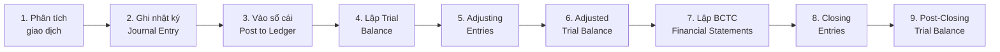
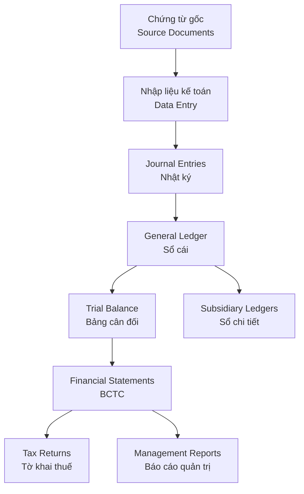
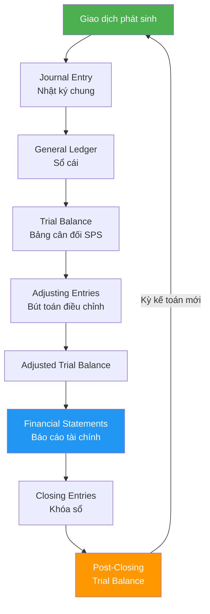

# AC01 — Accounting Fundamentals (Nguyên Lý Kế Toán)

> **Domain:** Accounting
> **Level:** Foundation
> **Prerequisites:** Không có
> **Related:** AC02 Financial Statements, AC03 Cost Accounting, AC04 IFRS/GAAP/VAS

---

## 1. Mục Tiêu Học Tập (Learning Objectives)

Sau khi hoàn thành module này, người học có thể:

- Giải thích nguyên lý kép (double-entry bookkeeping) và phương trình kế toán cơ bản
- Xây dựng và đọc Chart of Accounts (Hệ thống tài khoản kế toán) theo VAS/Thông tư 200
- Áp dụng quy tắc Debit/Credit cho các loại tài khoản
- Lập Journal Entries, General Ledger, Trial Balance
- Thực hiện Adjusting Entries và Closing Entries
- Mô tả đầy đủ Accounting Cycle (Chu kỳ kế toán)
- Phân biệt kế toán doanh nghiệp lớn (TT 200) và SME (TT 133)

---

## 2. Bối Cảnh Doanh Nghiệp (Business Context)

Kế toán là "ngôn ngữ của kinh doanh" — mọi giao dịch tài chính đều phải được ghi nhận, phân loại và báo cáo. Doanh nghiệp không có nền tảng kế toán vững chắc dễ dẫn đến:

- Sai lệch số liệu tài chính → quyết định sai
- Vi phạm nghĩa vụ thuế → phạt hành chính
- Mất kiểm soát dòng tiền → phá sản kỹ thuật
- Không thể huy động vốn / vay ngân hàng

Trong môi trường Việt Nam, kế toán phải tuân thủ đồng thời VAS (chuẩn mực kế toán VN) và quy định thuế (Luật thuế TNDN, GTGT), tạo ra yêu cầu kép đặc thù.

---

## 3. Định Nghĩa Thuật Ngữ (Definitions)

| Thuật Ngữ | Tiếng Việt | Định Nghĩa |
|-----------|------------|------------|
| Double-Entry Bookkeeping | Kế toán kép | Mỗi giao dịch ghi vào ít nhất 2 tài khoản: Debit = Credit |
| Chart of Accounts (COA) | Hệ thống tài khoản | Danh mục tài khoản có mã số, tên gọi, phân loại theo chuẩn mực |
| Debit (Dr) | Nợ | Bên trái của tài khoản chữ T; tăng Tài sản/Chi phí, giảm Nợ phải trả/VCSH/Doanh thu |
| Credit (Cr) | Có | Bên phải của tài khoản chữ T; tăng Nợ phải trả/VCSH/Doanh thu, giảm Tài sản/Chi phí |
| Journal Entry | Bút toán nhật ký | Ghi nhận giao dịch vào Nhật ký chung theo ngày phát sinh |
| General Ledger | Sổ cái | Tập hợp tất cả tài khoản, ghi nhận số dư và biến động |
| Trial Balance | Bảng cân đối số phát sinh | Kiểm tra tổng Debit = tổng Credit trước khi lập BCTC |
| Adjusting Entries | Bút toán điều chỉnh | Ghi nhận doanh thu/chi phí chưa phát sinh tiền nhưng đã thuộc kỳ |
| Closing Entries | Bút toán khóa sổ | Chuyển số dư tài khoản thu nhập/chi phí vào LNGL cuối kỳ |
| Accounting Cycle | Chu kỳ kế toán | 9 bước từ phân tích giao dịch đến lập BCTC |
| Accrual Basis | Cơ sở dồn tích | Ghi nhận khi phát sinh, không phải khi nhận/trả tiền |
| Cash Basis | Cơ sở tiền mặt | Ghi nhận khi thực thu/thực chi tiền |
| VAS | Chuẩn mực kế toán VN | 26 chuẩn mực ban hành theo các Quyết định của BTC |
| TT 200 | Thông tư 200/2014/TT-BTC | Chế độ kế toán doanh nghiệp lớn |
| TT 133 | Thông tư 133/2016/TT-BTC | Chế độ kế toán doanh nghiệp nhỏ và vừa |

---

## 4. Khái Niệm Cốt Lõi (Core Concepts)

### 4.1 Phương Trình Kế Toán

```
Tài sản (Assets) = Nợ phải trả (Liabilities) + Vốn chủ sở hữu (Equity)
A = L + E
```

Mở rộng:
```
A = L + (Capital + Revenue - Expenses - Drawings)
```

### 4.2 Quy Tắc Debit/Credit

```
┌─────────────────┬──────────────┬──────────────┐
│ Loại Tài Khoản  │  Tăng (Dr/Cr)│  Giảm (Dr/Cr)│
├─────────────────┼──────────────┼──────────────┤
│ Assets          │    Debit     │    Credit    │
│ Liabilities     │    Credit    │    Debit     │
│ Equity/VCSH     │    Credit    │    Debit     │
│ Revenue         │    Credit    │    Debit     │
│ Expenses        │    Debit     │    Credit    │
└─────────────────┴──────────────┴──────────────┘
```

### 4.3 Accounting Cycle — 9 Bước



### 4.4 Chart of Accounts (Hệ Thống Tài Khoản VN)

Theo Thông tư 200/2014 — Hệ thống tài khoản 4 chữ số:

| Loại | Mã TK | Tên Nhóm | Ví Dụ |
|------|-------|----------|-------|
| Tài sản ngắn hạn | 1xx | TSNH | TK 111 Tiền mặt, TK 112 TGNH, TK 131 Phải thu KH |
| Tài sản dài hạn | 2xx | TSDH | TK 211 TSCĐ hữu hình, TK 221 Đầu tư |
| Nợ phải trả | 3xx | NPT | TK 311 Vay ngắn hạn, TK 331 Phải trả NCC |
| Vốn chủ sở hữu | 4xx | VCSH | TK 411 Vốn đầu tư, TK 421 LNGL |
| Doanh thu | 5xx | Revenue | TK 511 DT BH&CCDV, TK 515 DT tài chính |
| Chi phí | 6xx | Expenses | TK 621 CPNLTT, TK 641 CP bán hàng |
| Thu nhập khác | 7xx | Other Income | TK 711 Thu nhập khác |
| Chi phí khác | 8xx | Other Expenses | TK 811 Chi phí khác |
| Xác định KQKD | 9xx | P&L | TK 911 Xác định KQKD |

---

## 5. Giá Trị Doanh Nghiệp (Business Value)

- **Tuân thủ pháp luật:** Tránh phạt thuế, phạt vi phạm hành chính kế toán
- **Ra quyết định:** Số liệu chính xác cho CFO, CEO, Hội đồng quản trị
- **Huy động vốn:** Ngân hàng, nhà đầu tư yêu cầu BCTC kiểm toán
- **Kiểm soát nội bộ:** Phát hiện gian lận, sai sót sớm
- **Định giá doanh nghiệp:** M&A, IPO cần số liệu kế toán minh bạch

---

## 6. Vai Trò Trong Doanh Nghiệp (Enterprise Role)

Bộ phận Kế toán là trung tâm thông tin tài chính, phục vụ:

- **Ban lãnh đạo:** Báo cáo quản trị (management reports)
- **Cơ quan nhà nước:** Thuế, thống kê, ngân hàng nhà nước
- **Đối tác:** Ngân hàng cho vay, nhà đầu tư, đối tác kinh doanh
- **Kiểm toán:** Cung cấp hồ sơ, chứng từ cho kiểm toán viên

---

## 7. Các Bộ Phận Liên Quan (Departments Related)

| Bộ Phận | Tương Tác |
|---------|-----------|
| Sales/Kinh doanh | Cung cấp hợp đồng, hóa đơn đầu ra |
| Mua hàng/Procurement | Hóa đơn đầu vào, thanh toán NCC |
| Kho/Warehouse | Phiếu nhập-xuất kho, kiểm kê |
| HR/Nhân sự | Bảng lương, BHXH |
| IT | Phần mềm kế toán, ERP |
| Ban Giám đốc | Phê duyệt chi tiêu, nhận báo cáo |
| Kiểm toán nội bộ | Kiểm tra tuân thủ |

---

## 8. Đầu Vào (Input)

- Hóa đơn mua hàng (VAT invoice đầu vào)
- Hóa đơn bán hàng (VAT invoice đầu ra)
- Phiếu thu, phiếu chi
- Bảng kê ngân hàng (bank statement)
- Hợp đồng kinh tế
- Bảng lương
- Phiếu nhập/xuất kho
- Biên bản bàn giao TSCĐ

---

## 9. Đầu Ra (Output)

- Nhật ký chung (General Journal)
- Sổ cái (General Ledger)
- Sổ chi tiết (Subsidiary Ledger)
- Bảng cân đối số phát sinh (Trial Balance)
- Báo cáo tài chính (Financial Statements — xem AC02)
- Tờ khai thuế GTGT, TNDN
- Báo cáo quản trị nội bộ

---

## 10. Quy Trình Nghiệp Vụ (Business Process)

### Quy Trình Xử Lý Chứng Từ

```
Phát sinh giao dịch
       ↓
Lập/thu thập chứng từ (hóa đơn, phiếu thu/chi, hợp đồng)
       ↓
Kiểm tra tính hợp lệ, hợp pháp của chứng từ
       ↓
Ghi Journal Entry vào phần mềm kế toán
       ↓
Phần mềm tự động cập nhật Ledger
       ↓
Cuối tháng: Reconciliation (đối chiếu ngân hàng, công nợ)
       ↓
Adjusting Entries (phân bổ, khấu hao, dự phòng)
       ↓
Lập BCTC tháng/quý/năm
       ↓
Closing Entries (cuối năm)
       ↓
Nộp BCTC, tờ khai thuế
```

---

## 11. Luồng Dữ Liệu (Data Flow)



---

## 12. Luồng Tiền (Money Flow)

```
Thu tiền (TK 111/112) ← Khách hàng thanh toán
                      ← Vay ngân hàng
                      ← Góp vốn cổ đông

Chi tiền (TK 111/112) → Trả NCC
                      → Trả lương
                      → Nộp thuế
                      → Trả lãi vay
                      → Mua TSCĐ
```

---

## 13. Luồng Chứng Từ (Document Flow)

```
Mua hàng:  Đơn mua → Hóa đơn NCC → Phiếu nhập kho → Phiếu chi/UNC
Bán hàng:  Đơn đặt hàng → Phiếu xuất kho → Hóa đơn GTGT → Phiếu thu
Lương:     Bảng chấm công → Bảng tính lương → Phiếu chi lương
Thuế:      BCTC → Tờ khai → Giấy nộp tiền thuế
```

---

## 14. Vai Trò (Roles)

| Vai Trò | Tiếng Anh | Mô Tả |
|---------|-----------|-------|
| Kế toán viên | Accountant | Ghi chứng từ, lập báo cáo |
| Kế toán trưởng | Chief Accountant | Phụ trách toàn bộ bộ máy kế toán, ký BCTC |
| Kiểm soát nội bộ | Internal Controller | Kiểm tra tuân thủ quy trình |
| Giám đốc tài chính | CFO | Phê duyệt chiến lược tài chính |
| Kiểm toán viên | Auditor | Xác nhận tính trung thực BCTC |

---

## 15. Trách Nhiệm (Responsibilities)

- **Kế toán viên:** Nhập liệu đúng hạn, lưu trữ chứng từ, đối chiếu số dư
- **Kế toán trưởng:** Ký xác nhận BCTC, giám sát tuân thủ VAS/thuế, nộp báo cáo cơ quan nhà nước
- **Ban Giám đốc:** Phê duyệt chính sách kế toán, đảm bảo nguồn lực cho bộ phận kế toán

---

## 16. Ma Trận RACI

| Hoạt Động | Kế toán viên | Kế toán trưởng | CFO | Ban GĐ |
|-----------|:---:|:---:|:---:|:---:|
| Nhập chứng từ | R | A | I | - |
| Reconciliation | R | A | I | - |
| Adjusting Entries | R | A | C | - |
| Lập BCTC | R | A | C | I |
| Ký BCTC | - | R | A | A |
| Nộp thuế | R | A | I | I |
| Kiểm toán nội bộ | C | A | R | I |

*R=Responsible, A=Accountable, C=Consulted, I=Informed*

---

## 17. Frameworks

- **GAAP (Generally Accepted Accounting Principles):** Nguyên tắc kế toán được chấp nhận chung
- **Accrual Accounting:** Ghi nhận theo phát sinh thực tế, không theo tiền mặt
- **Going Concern:** Giả định doanh nghiệp tiếp tục hoạt động
- **Consistency Principle:** Nhất quán trong áp dụng chính sách kế toán
- **Materiality:** Chỉ trình bày thông tin trọng yếu
- **Prudence/Conservatism:** Thận trọng — ghi nhận lỗ sớm, lợi nhuận chắc chắn

---

## 18. Chuẩn Mực Quốc Tế (International Standards)

| Chuẩn Mực | Nội Dung | Áp Dụng VN |
|-----------|----------|------------|
| IAS 1 | Presentation of Financial Statements | VAS 21 (tương đương) |
| IAS 2 | Inventories | VAS 02 Hàng tồn kho |
| IAS 7 | Statement of Cash Flows | VAS 24 Lưu chuyển tiền tệ |
| IAS 8 | Accounting Policies | VAS 29 |
| IAS 10 | Events After Reporting Period | VAS 23 |
| IAS 16 | Property, Plant & Equipment | VAS 03 TSCĐ hữu hình |
| IAS 18/IFRS 15 | Revenue | VAS 14 Doanh thu |

---

## 19. Bối Cảnh Việt Nam (Vietnam Context)

### Hệ Thống Văn Bản Pháp Lý

| Văn Bản | Nội Dung | Đối Tượng |
|---------|----------|-----------|
| Luật Kế toán 2015 (Luật 88/2015/QH13) | Quy định chung về kế toán | Tất cả đơn vị |
| Thông tư 200/2014/TT-BTC | Chế độ kế toán DN | DN lớn, không phải SME |
| Thông tư 133/2016/TT-BTC | Chế độ kế toán DN nhỏ và vừa | DN có doanh thu < 200 tỷ |
| NĐ 123/2020/NĐ-CP | Hóa đơn điện tử | Bắt buộc từ 1/7/2022 |
| Thông tư 78/2021/TT-BTC | Hướng dẫn hóa đơn điện tử | Tất cả DN |

### Phần Mềm Kế Toán Phổ Biến Tại VN

| Phần Mềm | Nhà Cung Cấp | Phân Khúc |
|----------|-------------|-----------|
| MISA SME | MISA JSC | SME, chiếm thị phần lớn nhất |
| Fast Accounting | Fast Technology | DN vừa và lớn |
| Effect | Lacviet | DN vừa |
| SAP Business One | SAP | DN lớn, MNC |
| Oracle NetSuite | Oracle | DN lớn |

### Đặc Thù VN

- **Kế toán thuế ≠ Kế toán tài chính:** VN có nhiều điểm khác biệt giữa lợi nhuận kế toán và thu nhập chịu thuế (thêm/bớt TK 8211 thuế TNDN hoãn lại)
- **Hóa đơn điện tử bắt buộc:** Kể từ 1/7/2022, tất cả DN phải dùng e-invoice kết nối với cổng thuế
- **Chế độ kép TT200/TT133:** SME có thể chọn bộ tài khoản đơn giản hơn (rút gọn 5 loại thay vì 9 loại)

---

## 20. Vấn Đề Pháp Lý (Legal Considerations)

- **Lưu trữ chứng từ:** Tối thiểu 5 năm (chứng từ thông thường), 10 năm (chứng từ liên quan đến TSCĐ, đất đai)
- **Kỳ kế toán:** Năm tài chính có thể không trùng năm dương lịch nhưng phải đăng ký với cơ quan thuế
- **Chữ ký số:** Kế toán trưởng và Giám đốc phải ký số trên BCTC nộp điện tử
- **Phạt vi phạm:** NĐ 41/2018/NĐ-CP quy định phạt tiền từ 5-50 triệu đồng tùy mức độ vi phạm kế toán
- **Kiểm toán bắt buộc:** DN FDI, DN niêm yết, DN có vốn NN > 50% bắt buộc kiểm toán BCTC

---

## 21. Sai Lầm Phổ Biến (Common Mistakes)

| Sai Lầm | Hậu Quả | Cách Tránh |
|---------|---------|------------|
| Không reconcile ngân hàng hàng tháng | Sai số dư tiền, mất tiền không phát hiện | Reconcile cuối mỗi tháng |
| Ghi nhận doanh thu khi nhận tiền (tiền mặt basis thay vì accrual) | BCTC sai, vi phạm VAS | Áp dụng accrual basis |
| Không lập adjusting entries cuối kỳ | Lợi nhuận bị phản ánh sai | Checklist adjusting entries |
| Hạch toán sai tài khoản | Trial balance vẫn cân nhưng sai bản chất | Review định kỳ, đào tạo |
| Không lưu chứng từ gốc | Không đủ bằng chứng khi bị kiểm tra thuế | Số hóa và lưu trữ có hệ thống |
| Dùng TT200 nhưng thực tế là SME | Phức tạp không cần thiết | Đánh giá lại quy mô, chuyển TT133 |

---

## 22. Thực Hành Tốt Nhất (Best Practices)

1. **Số hóa toàn bộ chứng từ** ngay khi nhận — dùng phần mềm OCR hoặc scan
2. **Reconcile ngân hàng** mỗi tuần, không đợi cuối tháng
3. **Tách biệt nhiệm vụ (Segregation of Duties):** Người nhập liệu ≠ người phê duyệt ≠ người giữ tiền
4. **Checklist cuối tháng:** Danh sách 20-30 mục cần kiểm tra trước khi close tháng
5. **Đào tạo liên tục:** VAS, thuế, phần mềm thay đổi thường xuyên
6. **Backup dữ liệu:** Dữ liệu kế toán backup hàng ngày, lưu cloud + local
7. **Review bởi kế toán trưởng** trước khi nộp bất kỳ báo cáo nào cho cơ quan nhà nước

---

## 23. KPIs

| KPI | Mô Tả | Target |
|-----|-------|--------|
| Days to Close | Số ngày từ cuối kỳ đến khi BCTC hoàn thành | ≤ 5 ngày làm việc |
| Error Rate | % bút toán cần sửa / tổng bút toán | < 0.5% |
| Reconciliation Completion Rate | % tài khoản reconciled đúng hạn | 100% |
| Tax Filing Compliance Rate | % tờ khai nộp đúng hạn | 100% |
| Document Digitization Rate | % chứng từ được số hóa | > 95% |

---

## 24. Metrics

- **Số lượng bút toán/tháng:** Chỉ báo khối lượng công việc
- **Số ngày phải thu bình quân (DSO):** TK 131 / DT * 30
- **Số ngày phải trả bình quân (DPO):** TK 331 / GVHB * 30
- **Tỷ lệ chi phí kế toán / doanh thu:** Benchmark hiệu quả bộ phận
- **Số lần kiểm tra thuế / năm:** Rủi ro tuân thủ

---

## 25. Báo Cáo (Reports)

| Báo Cáo | Tần Suất | Đối Tượng Nhận |
|---------|----------|----------------|
| Bảng cân đối số phát sinh | Hàng tháng | Kế toán trưởng, CFO |
| Báo cáo công nợ phải thu/phải trả | Hàng tuần | Sales, Mua hàng, CFO |
| Báo cáo tồn kho | Hàng tháng | Kho, CFO |
| Tờ khai thuế GTGT | Hàng tháng/quý | Cơ quan thuế |
| BCTC quý | Hàng quý | BGĐ, cơ quan thuế (nếu yêu cầu) |
| BCTC năm (kiểm toán) | Hàng năm | Cổ đông, ngân hàng, cơ quan thuế |

---

## 26. Mẫu Biểu (Templates)

### Template Journal Entry

```
Ngày: ___________
Số chứng từ: ___________
Diễn giải: ___________________________________________

TK Nợ (Debit):   [Mã TK] [Tên TK]        [Số tiền]
TK Có (Credit):  [Mã TK] [Tên TK]        [Số tiền]

Tổng Nợ = Tổng Có: ___________
Người lập: ___________  Kế toán trưởng: ___________
```

### Template Reconciliation Ngân Hàng

```
Kỳ: ___/20___
Số dư sổ kế toán (TK 112):          ___________
Cộng: Séc chưa thanh toán:          ___________
Trừ: Tiền gửi chưa ghi nhận:        ___________
Số dư sổ ngân hàng:                  ___________
Chênh lệch (phải = 0):               ___________
```

---

## 27. Checklist

### Checklist Close Tháng

- [ ] Tất cả hóa đơn đầu vào đã nhập
- [ ] Tất cả hóa đơn đầu ra đã phát hành và nhập
- [ ] Bank reconciliation hoàn thành
- [ ] Đối chiếu công nợ phải thu (TK 131)
- [ ] Đối chiếu công nợ phải trả (TK 331)
- [ ] Kiểm kê tồn kho (cuối tháng)
- [ ] Hạch toán khấu hao TSCĐ
- [ ] Phân bổ chi phí trả trước
- [ ] Hạch toán lương và BHXH
- [ ] Adjusting entries hoàn thành
- [ ] Trial balance cân bằng
- [ ] Review bất thường (variances > 10%)
- [ ] Kế toán trưởng ký duyệt

---

## 28. Quy Trình Chuẩn (SOP)

### SOP: Xử Lý Hóa Đơn Đầu Vào

1. **Nhận hóa đơn** từ NCC (email, bưu điện, cổng HĐĐT)
2. **Kiểm tra tính hợp lệ:** Mã số thuế, tên, địa chỉ, số tiền, mã hóa đơn
3. **Tra cứu hóa đơn** trên cổng thuế (hoadondientu.gdt.gov.vn)
4. **Khớp với Purchase Order / Phiếu nhập kho**
5. **Nhập vào phần mềm kế toán** — ghi TK Nợ (chi phí/tài sản) / TK Có 331
6. **Lưu trữ** bản gốc (file điện tử đối với HĐĐT)
7. **Trình kế toán trưởng** duyệt trước khi thanh toán

---

## 29. Tình Huống Thực Tế (Case Study)

### Case: Công Ty TNHH ABC phát hiện sai lệch kế toán

**Tình huống:** Công ty ABC (sản xuất) phát hiện trong quá trình kiểm toán năm, lợi nhuận trước thuế cao hơn dự kiến 2 tỷ đồng.

**Nguyên nhân:** Kế toán viên không lập adjusting entry cho chi phí lãi vay dồn tích (accrued interest) của khoản vay 20 tỷ đồng, lãi suất 12%/năm — dẫn đến thiếu 200 triệu đồng chi phí lãi vay trong kỳ.

**Hậu quả:** 
- BCTC sai — phải lập lại
- Thuế TNDN nộp thừa (phải hoàn)
- Ảnh hưởng uy tín với kiểm toán viên

**Bài học:** Luôn có checklist adjusting entries bao gồm: lãi vay dồn tích, doanh thu nhận trước, chi phí trả trước, khấu hao, dự phòng.

---

## 30. Ví Dụ Doanh Nghiệp Nhỏ (Small Business Example)

**Cửa hàng bán lẻ thời trang "Minh Châu" — TPHCM**

Tháng 1/2025, giao dịch:
1. Nhập hàng 50 triệu (chưa thanh toán)
2. Bán hàng thu tiền mặt 80 triệu (GVHB 40 triệu)
3. Trả tiền thuê mặt bằng 10 triệu

Journal Entries:
```
1. Dr TK 156 (Hàng hóa)    50,000,000
   Cr TK 331 (Phải trả NCC) 50,000,000

2a. Dr TK 111 (Tiền mặt)   80,000,000
    Cr TK 511 (Doanh thu)   80,000,000

2b. Dr TK 632 (GVHB)       40,000,000
    Cr TK 156 (Hàng hóa)   40,000,000

3.  Dr TK 642 (CP QLDN)    10,000,000
    Cr TK 111 (Tiền mặt)   10,000,000
```

Lợi nhuận gộp = 80tr - 40tr = 40tr; Lợi nhuận sau CP = 40tr - 10tr = 30tr

---

## 31. Ví Dụ Doanh Nghiệp Lớn (Enterprise Example)

**Tập đoàn Sản xuất VinaMFG — Hà Nội (1,000 NV, doanh thu 500 tỷ/năm)**

Thách thức: Hệ thống kế toán cũ (Excel + phần mềm cũ) không đáp ứng khi mở rộng 5 nhà máy.

Giải pháp: Triển khai SAP S/4HANA với module FI (Financial Accounting) + CO (Controlling):
- **FI-GL:** General Ledger — tự động post từ các module khác
- **FI-AR:** Accounts Receivable — quản lý công nợ KH
- **FI-AP:** Accounts Payable — quản lý công nợ NCC
- **FI-AA:** Asset Accounting — khấu hao TSCĐ tự động

Kết quả: Close tháng từ 15 ngày xuống còn 3 ngày làm việc.

---

## 32. ERP Mapping

| Quy Trình Kế Toán | SAP Module | MISA Module | Oracle |
|-------------------|------------|-------------|--------|
| General Ledger | FI-GL | Sổ cái | GL |
| Accounts Receivable | FI-AR | Công nợ phải thu | AR |
| Accounts Payable | FI-AP | Công nợ phải trả | AP |
| Fixed Assets | FI-AA | TSCĐ | FA |
| Cash Management | FI-CM | Thu chi tiền | CM |
| Tax | FI-TX | Thuế | Tax |
| Controlling | CO | Kế toán quản trị | Cost Mgmt |

---

## 33. Tự Động Hóa (Automation)

| Quy Trình | Giải Pháp Tự Động | Tiết Kiệm |
|-----------|-------------------|-----------|
| Nhập hóa đơn | OCR + AI (MISA iMISA, GetFly) | 80% thời gian nhập liệu |
| Bank reconciliation | Bank feed tự động trong MISA/Fast | 90% thời gian đối chiếu |
| Khấu hao TSCĐ | Module FA trong ERP tự động tính | 100% tự động |
| Tờ khai thuế GTGT | Export trực tiếp từ MISA sang eTax | 70% thời gian lập khai |
| Báo cáo quản trị | Power BI kết nối MISA API | Real-time thay vì T+5 |

---

## 34. Cơ Hội AI (AI Opportunities)

- **Invoice Processing AI:** Đọc hóa đơn PDF/ảnh, tự động nhập TK — độ chính xác 95%+
- **Anomaly Detection:** AI phát hiện bút toán bất thường, nghi ngờ gian lận
- **Predictive Cash Flow:** Dự báo dòng tiền 30-90 ngày dựa trên dữ liệu lịch sử
- **Tax Advisory AI:** Gợi ý tối ưu thuế dựa trên dữ liệu giao dịch
- **Natural Language Queries:** Hỏi "Doanh thu tháng này so tháng trước?" bằng tiếng Việt

---

## 35. Hướng Dẫn Triển Khai (Implementation Guide)

### Thiết Lập Hệ Thống Kế Toán Mới (Start-up)

**Tuần 1-2:**
- Đăng ký mã số thuế, khai báo phương pháp kế toán
- Chọn phần mềm phù hợp (SME → MISA SME, DN lớn → SAP/Fast)
- Thiết lập Chart of Accounts theo TT200 hoặc TT133

**Tuần 3-4:**
- Nhập số dư đầu kỳ (opening balances)
- Cấu hình templates hóa đơn, phiếu thu/chi
- Đào tạo kế toán viên sử dụng phần mềm

**Tháng 2 trở đi:**
- Vận hành thực tế, theo dõi sát
- Review Trial Balance hàng tuần
- Chuẩn hóa quy trình, lập SOP

---

## 36. Hướng Dẫn Tư Vấn (Consulting Guide)

### Diagnostic Framework cho Bộ Phận Kế Toán

**Bước 1 — Đánh giá hiện trạng:**
- Phần mềm đang dùng? Phiên bản? Bao nhiêu user?
- Có kế toán trưởng đủ điều kiện? (Bằng cấp, chứng chỉ)
- Tần suất close tháng? Bao nhiêu ngày?

**Bước 2 — Phát hiện vấn đề:**
- Trial Balance có cân không? Có số dư âm bất thường?
- Reconciliation ngân hàng có thực hiện đều không?
- Có tồn đọng chứng từ chưa nhập?

**Bước 3 — Đề xuất cải tiến:**
- Nâng cấp phần mềm nếu cần
- Bổ sung nhân lực hoặc tái cơ cấu phân công
- Tự động hóa các quy trình lặp lại

---

## 37. Câu Hỏi Chẩn Đoán (Diagnostic Questions)

1. Doanh nghiệp đang dùng phần mềm kế toán nào? Có kết nối hóa đơn điện tử chưa?
2. Thời gian close tháng mất bao nhiêu ngày?
3. Có thực hiện bank reconciliation hàng tháng không?
4. Kế toán trưởng có chứng chỉ hành nghề kế toán không?
5. BCTC năm có được kiểm toán không? Bởi Big4 hay công ty trong nước?
6. Có sự phân chia nhiệm vụ (segregation of duties) không?
7. Chứng từ được lưu trữ như thế nào? Có đủ thời hạn lưu trữ theo luật?
8. Kế toán có theo dõi kịp thời thay đổi VAS và thuế không?

---

## 38. Câu Hỏi Phỏng Vấn (Interview Questions)

**Level 1 — Junior Accountant:**
- Giải thích phương trình kế toán cơ bản?
- Khi nào Debit tăng, khi nào Debit giảm?
- Sự khác biệt giữa accrual và cash basis?

**Level 2 — Senior Accountant:**
- Quy trình reconciliation ngân hàng như thế nào?
- Các adjusting entries cuối kỳ thường gặp là gì?
- TT200 và TT133 khác nhau như thế nào, khi nào dùng cái nào?

**Level 3 — Chief Accountant / CFO:**
- Làm thế nào để rút ngắn thời gian close tháng?
- Làm thế nào để thiết kế internal controls hiệu quả?
- IFRS và VAS khác nhau trong ghi nhận doanh thu như thế nào?

---

## 39. Bài Tập (Exercises)

**Bài 1:** Lập Journal Entry cho các giao dịch sau của Công ty XYZ:
- Bán hàng thu tiền mặt 100 triệu, GVHB 60 triệu
- Mua văn phòng phẩm 2 triệu chưa trả
- Trả lương nhân viên 50 triệu
- Vay ngân hàng 200 triệu, kỳ hạn 6 tháng

**Bài 2:** Từ Trial Balance sau, tìm và sửa lỗi: [Tổng Dr = 850tr, Tổng Cr = 820tr]

**Bài 3:** Lập danh sách 10 adjusting entries cần thiết cuối năm cho một công ty sản xuất.

**Bài 4:** So sánh Chart of Accounts theo TT200 vs TT133 — liệt kê 5 điểm khác biệt chính.

---

## 40. Tài Liệu Tham Khảo (References)

- Luật Kế toán 2015 — Luật 88/2015/QH13
- Thông tư 200/2014/TT-BTC — Chế độ kế toán doanh nghiệp
- Thông tư 133/2016/TT-BTC — Chế độ kế toán SME
- NĐ 123/2020/NĐ-CP — Hóa đơn, chứng từ
- Thông tư 78/2021/TT-BTC — Hướng dẫn hóa đơn điện tử
- NĐ 41/2018/NĐ-CP — Xử phạt vi phạm hành chính kế toán kiểm toán
- Kieso, Weygandt, Warfield — "Intermediate Accounting" (IFRS Edition)
- Horngren, Harrison — "Accounting" (các edition từ 8th trở lên)
- Website Bộ Tài chính: mof.gov.vn
- Cổng thông tin thuế: gdt.gov.vn

---

## Output Formats

### A. Mermaid Diagram — Accounting Cycle



### B. ASCII Diagram — T-Account

```
        ASSETS (Tài sản)
    ┌─────────┬─────────┐
    │  DEBIT  │ CREDIT  │
    │  (Nợ)  │  (Có)  │
    │  + Tăng │ - Giảm │
    └─────────┴─────────┘

     LIABILITIES (Nợ phải trả)
    ┌─────────┬─────────┐
    │  DEBIT  │ CREDIT  │
    │ - Giảm  │ + Tăng  │
    └─────────┴─────────┘

        EQUITY (Vốn CSH)
    ┌─────────┬─────────┐
    │  DEBIT  │ CREDIT  │
    │ - Giảm  │ + Tăng  │
    └─────────┴─────────┘

       REVENUE (Doanh thu)
    ┌─────────┬─────────┐
    │  DEBIT  │ CREDIT  │
    │ - Giảm  │ + Tăng  │
    └─────────┴─────────┘

       EXPENSES (Chi phí)
    ┌─────────┬─────────┐
    │  DEBIT  │ CREDIT  │
    │  + Tăng │ - Giảm │
    └─────────┴─────────┘
```

### C. Flashcards

**Q1:** Phương trình kế toán cơ bản là gì?
**A1:** Assets = Liabilities + Equity (Tài sản = Nợ phải trả + Vốn chủ sở hữu). Mọi giao dịch đều duy trì sự cân bằng này.

**Q2:** Khi doanh nghiệp bán hàng thu tiền mặt, hạch toán như thế nào?
**A2:** Dr TK 111 (Tiền mặt) / Cr TK 511 (Doanh thu bán hàng) — đồng thời Dr TK 632 (GVHB) / Cr TK 156 (Hàng hóa).

**Q3:** TT200 và TT133 khác nhau ở điểm cốt lõi nào?
**A3:** TT133 dành cho SME (doanh thu < 200 tỷ), có hệ thống tài khoản đơn giản hơn (5 loại), ít mẫu biểu hơn, cho phép một người kiêm nhiệm nhiều phần hành kế toán.

### D. Cheat Sheet

```
ACCOUNTING FUNDAMENTALS — CHEAT SHEET

PHƯƠNG TRÌNH: A = L + E

QUY TẮC DEBIT/CREDIT:
  DEAD CLIR:
  D-E-A-D = Debit: Dividends, Expenses, Assets, Drawings (tăng)
  C-L-I-R = Credit: Capital, Liabilities, Income, Retained Earnings (tăng)

ACCOUNTING CYCLE (9 bước):
  1→Phân tích GD → 2→Journal → 3→Ledger → 4→Trial Balance
  → 5→Adjust → 6→Adjusted TB → 7→BCTC → 8→Closing → 9→Post-Closing TB

VN KEY NUMBERS:
  TT200: DN lớn | TT133: SME (DT < 200 tỷ)
  TK 111: Tiền mặt | TK 112: TGNH | TK 131: Phải thu KH
  TK 331: Phải trả NCC | TK 511: Doanh thu | TK 632: GVHB

HÓAĐƠN ĐIỆN TỬ: Bắt buộc từ 1/7/2022 (NĐ 123/2020)
LƯU CHỨNG TỪ: 5 năm thông thường, 10 năm đất đai/TSCĐ
```

### E. JSON Metadata

```json
{
  "module": {
    "code": "AC01",
    "name": "Accounting Fundamentals",
    "name_vi": "Nguyên Lý Kế Toán",
    "domain": "Accounting",
    "level": "Foundation",
    "estimated_hours": 8,
    "prerequisites": [],
    "related_modules": ["AC02", "AC03", "AC04"],
    "key_standards": ["TT200/2014", "TT133/2016", "VAS", "ND123/2020"],
    "key_concepts": [
      "Double-Entry Bookkeeping",
      "Chart of Accounts",
      "Debit/Credit Rules",
      "Accounting Equation",
      "Accounting Cycle",
      "Journal Entries",
      "Trial Balance",
      "Adjusting Entries",
      "Closing Entries"
    ],
    "software_tools": ["MISA SME", "Fast Accounting", "SAP FI", "Oracle FA"],
    "legal_refs_vn": [
      "Luat Ke toan 2015 - Luat 88/2015/QH13",
      "TT200/2014/TT-BTC",
      "TT133/2016/TT-BTC",
      "ND123/2020/ND-CP",
      "ND41/2018/ND-CP"
    ],
    "last_updated": "2026-06-30",
    "status": "complete",
    "sections_count": 40,
    "output_formats": ["mermaid", "ascii", "flashcards", "cheatsheet", "json"]
  }
}
```
