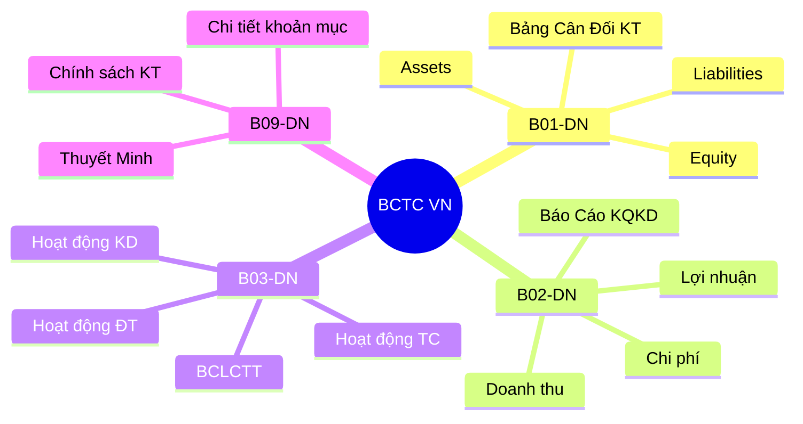
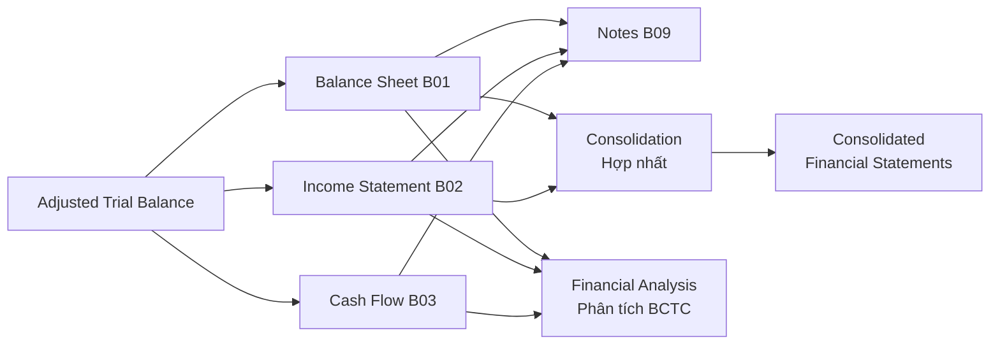
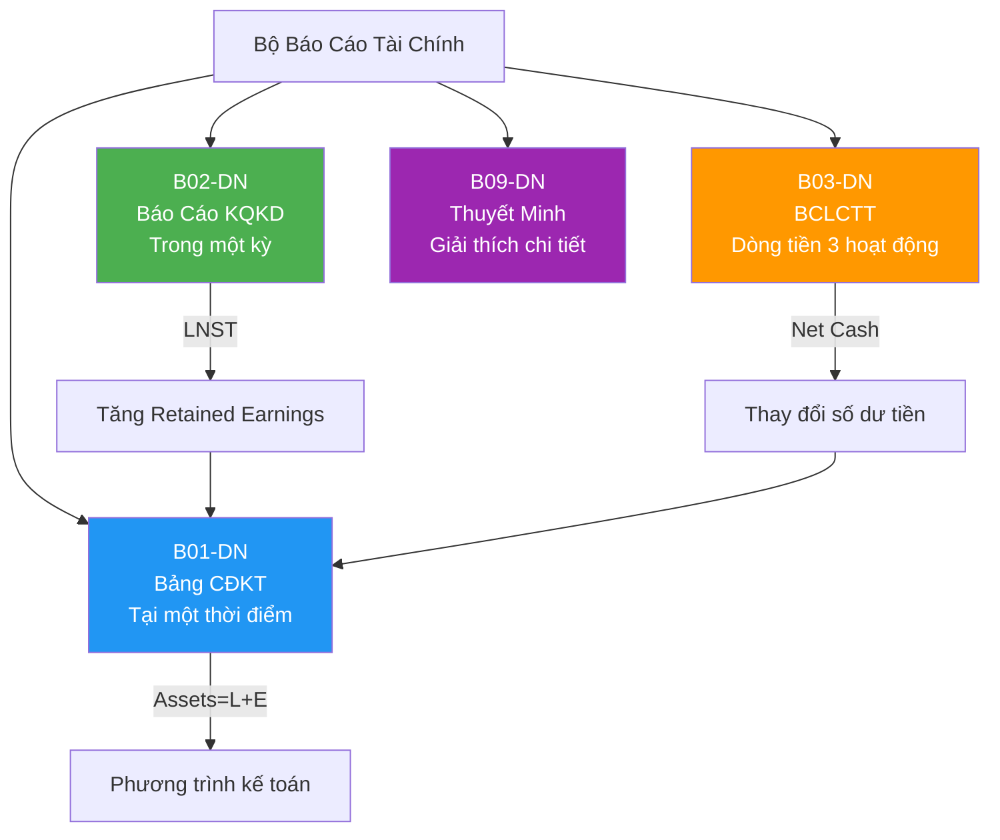

# AC02 — Financial Statements (Báo Cáo Tài Chính)

> **Domain:** Accounting
> **Level:** Foundation
> **Prerequisites:** AC01 Accounting Fundamentals
> **Related:** AC03 Cost Accounting, AC04 IFRS/GAAP/VAS, FN01 Financial Analysis

---

## 1. Mục Tiêu Học Tập (Learning Objectives)

Sau khi hoàn thành module này, người học có thể:

- Lập và đọc đầy đủ 4 báo cáo tài chính theo VAS/TT200: B01-B04
- Phân tích cấu trúc Bảng Cân Đối Kế Toán (Balance Sheet)
- Đọc và diễn giải Báo Cáo Kết Quả Kinh Doanh (Income Statement)
- Phân biệt 3 phương pháp lập Báo Cáo Lưu Chuyển Tiền Tệ
- Hiểu mục đích và nội dung Thuyết Minh BCTC (Notes)
- Nắm quy định nộp BCTC cho cơ quan thuế, thống kê tại Việt Nam
- Thực hiện consolidation cơ bản cho tập đoàn

---

## 2. Bối Cảnh Doanh Nghiệp (Business Context)

Báo cáo tài chính (BCTC) là "kết quả tổng hợp" của toàn bộ hoạt động kế toán trong kỳ. BCTC phục vụ nhiều đối tượng:

- **Nhà đầu tư:** Đánh giá khả năng sinh lời, tăng trưởng
- **Ngân hàng/Chủ nợ:** Đánh giá khả năng thanh toán, tài sản đảm bảo
- **Cơ quan thuế:** Kiểm tra nghĩa vụ thuế
- **Ban lãnh đạo:** Thông tin ra quyết định chiến lược
- **Đối tác:** Đánh giá năng lực tài chính trước hợp tác

Tại Việt Nam, BCTC tuân thủ VAS và Thông tư 200 có cấu trúc bắt buộc (mẫu B01-B05), khác với IFRS về một số điểm quan trọng.

---

## 3. Định Nghĩa Thuật Ngữ (Definitions)

| Thuật Ngữ | Tiếng Việt | Định Nghĩa |
|-----------|------------|------------|
| Balance Sheet | Bảng Cân Đối Kế Toán (BCĐKT) | Báo cáo tình trạng tài chính tại một thời điểm: A = L + E |
| Income Statement | Báo Cáo KQKD | Tóm tắt doanh thu, chi phí, lợi nhuận trong một kỳ |
| Cash Flow Statement | BCLCTT | Báo cáo dòng tiền vào/ra từ 3 hoạt động: kinh doanh, đầu tư, tài chính |
| Notes to FS | Thuyết Minh BCTC | Giải thích chi tiết các khoản mục trong BCTC |
| Retained Earnings | Lợi nhuận giữ lại (LNGL) | Lợi nhuận tích lũy chưa chia cổ tức (TK 421) |
| Gross Profit | Lợi nhuận gộp | Doanh thu thuần - Giá vốn hàng bán |
| EBIT | Lợi nhuận trước lãi vay và thuế | Earnings Before Interest and Taxes |
| EBITDA | EBIT + Khấu hao | Thước đo dòng tiền hoạt động gần đúng |
| EPS | Thu nhập trên mỗi cổ phiếu | Lợi nhuận sau thuế / Số CP lưu hành |
| Consolidation | Hợp nhất BCTC | Lập BCTC cho toàn tập đoàn, loại trừ giao dịch nội bộ |
| Materiality | Trọng yếu | Ngưỡng mà sai sót ảnh hưởng đến quyết định người dùng |
| Going Concern | Hoạt động liên tục | Giả định DN tiếp tục hoạt động trong tương lai gần |

---

## 4. Khái Niệm Cốt Lõi (Core Concepts)

### 4.1 Bộ BCTC Đầy Đủ (Theo TT200)



### 4.2 Cấu Trúc Balance Sheet

```
BẢNG CÂN ĐỐI KẾ TOÁN
═══════════════════════════════════════
TÀI SẢN                    NỢ PHẢI TRẢ
───────────────────────    ─────────────────────────
A. Tài sản ngắn hạn        A. Nợ ngắn hạn
  I. Tiền & TĐTT              1. Vay NH ngắn hạn
  II. ĐTTC ngắn hạn           2. Phải trả NCC
  III. Phải thu ngắn hạn      3. Thuế phải nộp
  IV. Hàng tồn kho            4. Phải trả NLĐ
  V. TSNH khác             B. Nợ dài hạn
B. Tài sản dài hạn            1. Vay DH
  I. TSCD hữu hình            2. Thuế hoãn lại
  II. TSCD vô hình         VỐN CHỦ SỞ HỮU
  III. BTSDH               A. VCSH
  IV. ĐTTC dài hạn            1. Vốn đầu tư CSH
  V. TSDH khác                2. LNGL chưa chia
═══════════════════════════════════════
TỔNG TÀI SẢN        =  TỔNG NPT + VCSH
```

### 4.3 Cấu Trúc Income Statement (B02-DN)

```
DOANH THU BÁN HÀNG VÀ CCDV (TK 511)
  - Các khoản giảm trừ DT (TK 521)
= DOANH THU THUẦN
  - Giá vốn hàng bán (TK 632)
= LỢI NHUẬN GỘP
  + Doanh thu tài chính (TK 515)
  - Chi phí tài chính (TK 635, bao gồm lãi vay)
  - Chi phí bán hàng (TK 641)
  - Chi phí quản lý DN (TK 642)
= LỢI NHUẬN THUẦN TỪ HĐKD
  + Thu nhập khác (TK 711)
  - Chi phí khác (TK 811)
= LỢI NHUẬN KHÁC
= LỢI NHUẬN KẾ TOÁN TRƯỚC THUẾ (EBT)
  - Chi phí thuế TNDN (TK 821)
= LỢI NHUẬN SAU THUẾ TNDN (PAT)
```

### 4.4 Cash Flow Statement — 3 Phương Pháp

**Phương pháp trực tiếp (Direct Method):**
```
+ Tiền thu từ khách hàng
- Tiền trả cho NCC và NLĐ
- Tiền nộp thuế
= Dòng tiền từ HĐKD
```

**Phương pháp gián tiếp (Indirect Method):**
```
+ Lợi nhuận trước thuế
+ Điều chỉnh: khấu hao, dự phòng (non-cash items)
+/- Thay đổi vốn lưu động
= Dòng tiền từ HĐKD
```

---

## 5. Giá Trị Doanh Nghiệp (Business Value)

- **Minh bạch tài chính:** Tạo niềm tin với nhà đầu tư, đối tác
- **Tiếp cận vốn:** BCTC kiểm toán là điều kiện vay ngân hàng
- **Tuân thủ pháp luật:** Nộp BCTC đúng hạn tránh phạt hành chính
- **Phân tích hiệu quả:** Cơ sở cho các chỉ số tài chính (ROE, ROA, P/E)
- **M&A:** BCTC là tài liệu cốt lõi trong quá trình due diligence

---

## 6. Vai Trò Trong Doanh Nghiệp (Enterprise Role)

BCTC là đầu ra tối thượng của hệ thống kế toán, là giao điểm giữa kế toán và tài chính. CFO chịu trách nhiệm về chất lượng BCTC, kế toán trưởng ký xác nhận, BGĐ (Tổng giám đốc/Chủ tịch HĐQT) ký phê duyệt.

---

## 7. Các Bộ Phận Liên Quan (Departments Related)

| Bộ Phận | Đóng Góp Vào BCTC |
|---------|-------------------|
| Kế toán | Lập toàn bộ BCTC |
| Kiểm toán nội bộ | Kiểm tra trước khi phát hành |
| CFO/Tài chính | Review và phê duyệt |
| IT | Đảm bảo hệ thống ERP chính xác |
| Pháp chế | Review tuân thủ công bố thông tin |
| Ban Giám Đốc | Ký BCTC, phê duyệt chính sách kế toán |

---

## 8. Đầu Vào (Input)

- Adjusted Trial Balance (sau khi hoàn thành adjusting entries)
- Sổ chi tiết các tài khoản
- Số dư đầu kỳ từ BCTC kỳ trước
- Thông tin thuyết minh từ các bộ phận (pháp chế, HR, kỹ thuật)
- Báo cáo kiểm kê tồn kho, tài sản cố định
- Xác nhận công nợ từ KH và NCC

---

## 9. Đầu Ra (Output)

- B01-DN: Bảng Cân Đối Kế Toán
- B02-DN: Báo Cáo Kết Quả Hoạt Động Kinh Doanh
- B03-DN: Báo Cáo Lưu Chuyển Tiền Tệ
- B09-DN: Bản Thuyết Minh Báo Cáo Tài Chính
- BCTC hợp nhất (nếu có công ty con)
- Báo cáo kiểm toán (kèm theo nếu bắt buộc kiểm toán)

---

## 10. Quy Trình Nghiệp Vụ (Business Process)

```
Hoàn thành Adjusted Trial Balance
           ↓
Lập BCĐKT (B01): Sắp xếp tài khoản vào các dòng theo mẫu
           ↓
Lập Báo cáo KQKD (B02): Tổng hợp doanh thu, chi phí
           ↓
Lập BCLCTT (B03): Phân tích dòng tiền từ 3 hoạt động
           ↓
Lập Thuyết Minh (B09): Chi tiết và giải thích khoản mục
           ↓
Review nội bộ (kế toán trưởng, CFO)
           ↓
Kiểm toán (nếu bắt buộc)
           ↓
BGĐ ký duyệt (chữ ký số)
           ↓
Nộp cơ quan thuế (qua eTax/HTKK)
           ↓
Nộp cơ quan thống kê (nếu yêu cầu)
           ↓
Công bố thông tin (DN niêm yết: HoSE, HNX)
```

---

## 11. Luồng Dữ Liệu (Data Flow)



---

## 12. Luồng Tiền (Money Flow)

### Phân Tích Dòng Tiền 3 Hoạt Động

```
HOẠT ĐỘNG KINH DOANH (Operating):
  + Thu từ KH
  - Trả NCC, NLĐ, thuế
  = CFO (Cash Flow from Operations)

HOẠT ĐỘNG ĐẦU TƯ (Investing):
  - Mua TSCĐ, mua đầu tư
  + Bán TSCĐ, thu hồi đầu tư
  = CFI (Cash Flow from Investing)

HOẠT ĐỘNG TÀI CHÍNH (Financing):
  + Vay mới, phát hành cổ phần
  - Trả nợ vay, trả cổ tức
  = CFF (Cash Flow from Financing)

NET CHANGE IN CASH = CFO + CFI + CFF
```

---

## 13. Luồng Chứng Từ (Document Flow)

```
BCTC kỳ trước → Số dư đầu kỳ
Chứng từ kỳ này → Adjusted Trial Balance
Trial Balance → Template B01/B02/B03/B09
BCTC dự thảo → Review kế toán trưởng → Sửa chữa
BCTC hoàn chỉnh → Kiểm toán viên → Báo cáo kiểm toán
BCTC + Báo cáo kiểm toán → Nộp cơ quan thuế
```

---

## 14. Vai Trò (Roles)

| Vai Trò | Tiếng Anh | Trách Nhiệm BCTC |
|---------|-----------|-----------------|
| Kế toán tổng hợp | General Accountant | Lập B01-B03 |
| Kế toán trưởng | Chief Accountant | Review, ký BCTC |
| Giám đốc Tài chính | CFO | Phê duyệt, giải trình |
| Tổng Giám đốc | CEO/GĐ | Ký BCTC chính thức |
| Kiểm toán viên | Auditor | Xác nhận độ tin cậy |

---

## 15. Trách Nhiệm (Responsibilities)

- **Kế toán:** Lập BCTC đúng mẫu, đúng số liệu, đúng hạn
- **Kế toán trưởng:** Ký xác nhận, chịu trách nhiệm trước pháp luật về số liệu
- **CEO/GĐ:** Ký BCTC, chịu trách nhiệm cuối cùng
- **HĐQT/Hội đồng thành viên:** Phê duyệt BCTC năm tại ĐHĐCĐ/Hội nghị

---

## 16. Ma Trận RACI

| Hoạt Động | Kế toán | KT Trưởng | CFO | CEO | Kiểm toán |
|-----------|:---:|:---:|:---:|:---:|:---:|
| Lập B01-B03 | R | A | C | I | - |
| Lập B09 | R | A | C | I | - |
| Review dự thảo | C | R | A | I | - |
| Kiểm toán | C | R | I | I | R/A |
| Ký BCTC | - | R | A | R | - |
| Nộp cơ quan thuế | R | A | I | I | - |
| Công bố thông tin | I | R | A | A | - |

---

## 17. Frameworks

- **VAS (Vietnam Accounting Standards):** 26 chuẩn mực, nền tảng BCTC VN
- **IFRS:** Framework quốc tế — đang được áp dụng tại VN từ 2022 (tự nguyện) và bắt buộc 2025 cho DN niêm yết
- **Conceptual Framework:** Các đặc tính chất lượng thông tin tài chính (Relevance, Faithful Representation, Comparability, Timeliness)
- **Going Concern Assessment:** Đánh giá khả năng hoạt động liên tục — bắt buộc trong thuyết minh

---

## 18. Chuẩn Mực Quốc Tế (International Standards)

| Chuẩn Mực | Nội Dung | Tác Động Đến BCTC |
|-----------|----------|-------------------|
| IAS 1 | Presentation of FS | Cấu trúc trình bày |
| IAS 7 | Cash Flow Statement | Phân loại 3 hoạt động |
| IAS 10 | Events After Reporting Period | Disclosure sau ngày lập |
| IAS 24 | Related Party Disclosures | Công bố bên liên quan |
| IAS 33 | EPS | Tính và trình bày EPS |
| IAS 34 | Interim Reporting | BCTC giữa kỳ |
| IFRS 3 | Business Combinations | Hợp nhất kinh doanh |
| IFRS 10 | Consolidated FS | BCTC hợp nhất |

---

## 19. Bối Cảnh Việt Nam (Vietnam Context)

### Mẫu BCTC Theo Thông Tư 200

| Mẫu Biểu | Tên Báo Cáo |
|----------|-------------|
| B01-DN | Bảng Cân Đối Kế Toán |
| B02-DN | Báo Cáo KQHĐKD |
| B03-DN | BCLCTT (phương pháp trực tiếp hoặc gián tiếp) |
| B09-DN | Bản Thuyết Minh BCTC |

### Thời Hạn Nộp BCTC

| Đối Tượng | Thời Hạn Nộp | Cơ Quan Nhận |
|-----------|-------------|--------------|
| DN nhà nước | 30 ngày sau kết thúc năm tài chính | BTC, Bộ chủ quản |
| DN có vốn đầu tư nước ngoài | 90 ngày sau kết thúc năm TC | Cơ quan thuế, Sở KHĐT |
| DN khác (tư nhân) | 90 ngày | Cơ quan thuế |
| DN niêm yết | 90 ngày (BCTC năm), 45 ngày (BCTC bán niên) | UBCKNN, HoSE/HNX |

### Kiểm Toán Bắt Buộc (theo NĐ 17/2012)

- DN có vốn đầu tư nước ngoài (FDI)
- Tổ chức tín dụng, bảo hiểm
- DN niêm yết
- DN có vốn nhà nước > 50%
- Doanh nghiệp phát hành chứng khoán ra công chúng

---

## 20. Vấn Đề Pháp Lý (Legal Considerations)

- **Phạt nộp trễ BCTC:** NĐ 41/2018 — phạt 5-20 triệu đồng
- **Phạt sai lệch trọng yếu:** 20-50 triệu đồng; ảnh hưởng thuế có thể bị truy thu + phạt thêm 20%
- **Tội danh hình sự:** Hành vi làm giả BCTC gian lận thuế có thể bị xử lý hình sự (Điều 200 BLHS)
- **Công bố thông tin:** DN niêm yết vi phạm công bố BCTC bị xử phạt theo Luật Chứng khoán
- **Chữ ký:** Cả kế toán trưởng và người đại diện pháp luật phải ký (chữ ký số cho nộp điện tử)

---

## 21. Sai Lầm Phổ Biến (Common Mistakes)

| Sai Lầm | Hậu Quả | Phòng Tránh |
|---------|---------|-------------|
| Phân loại sai nợ ngắn hạn/dài hạn | Hiểu sai thanh khoản DN | Xem lại lịch trả nợ |
| Ghi nhận doanh thu sớm (early revenue recognition) | Vi phạm VAS 14, phạt thuế | Áp dụng đúng nguyên tắc ghi nhận DT |
| Không ghi nhận contingent liabilities | BCTC thiếu disclosure | Review hợp đồng, vụ kiện |
| Sai phân loại dòng tiền (CFO vs CFI) | BCLCTT sai | Phân loại theo bản chất giao dịch |
| Consolidation bỏ sót công ty liên kết | BCTC hợp nhất không đầy đủ | Lập danh sách đầy đủ các đơn vị trong tập đoàn |
| Không update Thuyết minh khi có thay đổi chính sách | Vi phạm IAS 8/VAS 29 | Checklist thuyết minh hàng năm |

---

## 22. Thực Hành Tốt Nhất (Best Practices)

1. **Close calendar rõ ràng:** Lịch đóng sổ cụ thể từng tháng, tránh nộp trễ
2. **Peer review:** Kế toán khác review trước khi kế toán trưởng ký
3. **Reconcile inter-company:** Đối chiếu số dư giữa các công ty trong tập đoàn trước khi hợp nhất
4. **Disclosure checklist:** Checklist đầy đủ các khoản cần thuyết minh theo VAS
5. **Comparative figures:** Luôn trình bày số liệu kỳ trước để so sánh
6. **Management commentary:** Viết giải thích biến động lớn (>10%) trong thuyết minh

---

## 23. KPIs

| KPI | Mục Tiêu | Đo Lường |
|-----|----------|----------|
| Days to Close (Annual) | ≤ 30 ngày | Ngày phát hành BCTC - Ngày kết thúc năm TC |
| Audit Opinion | Unqualified (Chấp nhận toàn phần) | Loại ý kiến kiểm toán |
| On-time Filing Rate | 100% | % nộp đúng hạn |
| Restatement Rate | 0% | Số lần phải lập lại BCTC |
| Material Misstatement | 0 | Số lỗi trọng yếu phát hiện |

---

## 24. Metrics

- **Gross Profit Margin = Lợi nhuận gộp / Doanh thu thuần × 100%**
- **Net Profit Margin = LNST / Doanh thu thuần × 100%**
- **Current Ratio = TSNH / Nợ ngắn hạn** (thanh khoản)
- **Debt-to-Equity = Tổng nợ / VCSH**
- **ROE = LNST / VCSH bình quân × 100%**
- **ROA = LNST / Tổng tài sản bình quân × 100%**
- **Operating Cash Flow Ratio = CFO / Nợ ngắn hạn** (khả năng trả nợ từ hoạt động)

---

## 25. Báo Cáo (Reports)

| Báo Cáo | Kỳ | Đối Tượng |
|---------|-----|----------|
| BCTC quản trị (Management Accounts) | Hàng tháng | BGĐ, HĐQT |
| BCTC bán niên | 6 tháng | UBCKNN (DN niêm yết) |
| BCTC năm (audited) | Hàng năm | Cổ đông, ngân hàng, cơ quan thuế |
| BCTC hợp nhất | Hàng năm | Tập đoàn |
| Báo cáo phân tích BCTC | Hàng quý | HĐQT, nhà đầu tư |

---

## 26. Mẫu Biểu (Templates)

### Template Checklist Trước Khi Phát Hành BCTC

```
PRE-ISSUANCE CHECKLIST — BCTC NĂM

BCĐKT (B01):
□ Tổng tài sản = Tổng nợ + VCSH
□ Số dư tài khoản tiền khớp bank statement
□ Phải thu đã net off dự phòng
□ HTK đã net off dự phòng giảm giá
□ TSCĐ đã trừ khấu hao lũy kế

BCKQKD (B02):
□ Doanh thu khớp hóa đơn đầu ra
□ GVHB khớp kế toán giá thành
□ Chi phí bán hàng và QLDN hợp lý
□ Thuế TNDN tính đúng

BCLCTT (B03):
□ Net change in cash khớp BCĐKT
□ Phân loại CFO/CFI/CFF chính xác

THUYẾT MINH (B09):
□ Chính sách kế toán đầy đủ
□ Giải thích biến động >10%
□ Bên liên quan đã disclosure
□ Cam kết và rủi ro đã trình bày
```

---

## 27. Checklists

### Checklist Kiểm Tra Chất Lượng BCTC

- [ ] Số liệu comparative (so sánh kỳ trước) đã điền đầy đủ
- [ ] Không có ô trống bất thường
- [ ] Tổng phụ và tổng cộng tính đúng
- [ ] Số liệu nhất quán giữa các báo cáo (số lãi trên B02 = số tăng LNGL trên B01)
- [ ] Chữ ký đầy đủ: kế toán trưởng + GĐ
- [ ] Ngày tháng trên BCTC chính xác
- [ ] Đơn vị tiền tệ ghi rõ (VND hoặc nghìn VND)

---

## 28. Quy Trình Chuẩn (SOP)

### SOP: Lập BCTC Năm

**Tháng 12 (chuẩn bị):**
- Gửi yêu cầu xác nhận công nợ đến KH và NCC
- Kiểm kê tồn kho, TSCĐ
- Thu thập thông tin liên quan (vụ kiện, cam kết)

**Ngày 1-10/01:**
- Hoàn thành closing entries
- Lập Adjusted Trial Balance cuối năm

**Ngày 10-20/01:**
- Lập B01, B02, B03
- Lập B09 (Thuyết minh)
- Internal review

**Ngày 20/01 - 28/02:**
- Gửi kiểm toán viên
- Trả lời yêu cầu kiểm toán (audit queries)
- Nhận báo cáo kiểm toán dự thảo

**Tháng 3:**
- Finalize và phát hành BCTC
- Nộp cơ quan thuế (trước 31/3 với DN thông thường)

---

## 29. Tình Huống Thực Tế (Case Study)

### Case: Vinamilk — BCTC Hợp Nhất 2023

**Bối cảnh:** Vinamilk (VNM) là công ty niêm yết lớn, có nhiều công ty con trong và ngoài nước (Driftwood Dairy US, Angkor Dairy Cambodia...).

**Thách thức consolidation:**
- Chuyển đổi BCTC công ty con từ USD/Riel sang VND
- Loại trừ giao dịch intra-group (bán hàng nội bộ)
- Điều chỉnh chính sách kế toán để nhất quán trong tập đoàn

**Quy trình:**
1. Thu thập BCTC từ từng công ty con
2. Chuyển đổi ngoại tệ theo tỷ giá cuối kỳ (BCĐKT) và tỷ giá bình quân (B02)
3. Loại trừ các giao dịch nội bộ
4. Điều chỉnh goodwill, non-controlling interest
5. Lập BCTC hợp nhất theo VAS 25

**Kết quả:** BCTC hợp nhất phản ánh đầy đủ quy mô và hiệu quả toàn tập đoàn.

---

## 30. Ví Dụ Doanh Nghiệp Nhỏ (Small Business Example)

**Cửa hàng điện tử "Tuấn Mobile" — Đà Nẵng (doanh thu 5 tỷ/năm)**

BCĐKT rút gọn 31/12/2024 (nghìn VND):

```
TÀI SẢN                        NỢ PHẢI TRẢ + VCSH
Tiền mặt: 200,000              Vay ngân hàng: 1,000,000
Phải thu KH: 150,000           Phải trả NCC: 800,000
Hàng tồn kho: 1,500,000        Thuế phải nộp: 50,000
TSCĐ (net): 500,000            VCSH: 500,000
TỔNG: 2,350,000                TỔNG: 2,350,000
```

Báo cáo KQKD 2024:
- Doanh thu: 5,000,000
- GVHB: (3,800,000)
- Lợi nhuận gộp: 1,200,000 (Gross margin 24%)
- CP bán hàng + QLDN: (900,000)
- Lợi nhuận trước thuế: 300,000
- Thuế TNDN (20%): (60,000)
- LNST: 240,000

---

## 31. Ví Dụ Doanh Nghiệp Lớn (Enterprise Example)

**FPT Corporation — Tập Đoàn Công Nghệ (Niêm yết HoSE)**

Yêu cầu BCTC đặc thù:
- BCTC hợp nhất (30+ công ty con)
- Áp dụng IFRS từ 2022 (tự nguyện, phục vụ nhà đầu tư quốc tế)
- Trình bày song ngữ VN-EN
- Kiểm toán bởi Big4 (Deloitte)
- Công bố trên HoSE trong 90 ngày

BCTC FPT 2023 highlights:
- Doanh thu hợp nhất: 52,000 tỷ đồng
- EBIT Margin: ~15%
- Cash from Operations: Dương mạnh, >3,000 tỷ

---

## 32. ERP Mapping

| Báo Cáo BCTC | SAP Module | MISA | Oracle |
|-------------|------------|------|--------|
| B01 Balance Sheet | FI-GL (FS00) | Báo cáo BCĐKT | GL Balance Sheet |
| B02 Income Statement | FI-GL P&L | Báo cáo KQKD | GL Income Stmt |
| B03 Cash Flow | FI-CM | BCLCTT | Cash Flow Report |
| B09 Notes | Manual/SEM | Thuyết minh | Disclosure Module |
| Consolidated FS | EC-CS (BPC) | Kế toán hợp nhất | Oracle FCCS |

---

## 33. Tự Động Hóa (Automation)

| Quy Trình | Giải Pháp | Lợi Ích |
|-----------|-----------|---------|
| Lập B01-B03 | Auto-generate từ ERP (SAP/MISA) | Loại bỏ nhập thủ công |
| Consolidation | SAP BPC, Oracle FCCS, HFM | Tự động loại trừ intercompany |
| Phân tích BCTC | Power BI, Tableau dashboard | Real-time vs. báo cáo tĩnh |
| XBRL Tagging | XBRL software (cho HoSE) | Nộp điện tử chuẩn |
| Audit trail | ERP audit log | Tự động lưu lịch sử thay đổi |

---

## 34. Cơ Hội AI (AI Opportunities)

- **AI-Assisted Financial Analysis:** GPT-4 đọc BCTC, tóm tắt điểm quan trọng cho CEO
- **Anomaly Detection:** Phát hiện bất thường trong số liệu trước khi phát hành
- **Automated Disclosure Drafting:** AI draft thuyết minh từ dữ liệu có sẵn
- **Benchmark Analysis:** So sánh tự động với ngành và đối thủ
- **Predictive Analytics:** Dự báo kết quả tương lai dựa trên historical data

---

## 35. Hướng Dẫn Triển Khai (Implementation Guide)

### Thiết Lập Quy Trình Lập BCTC Chuẩn

1. **Xây dựng close calendar:** Deadline cho từng bước (nhập chứng từ, reconciliation, adjusting, lập báo cáo)
2. **Chuẩn hóa templates:** Mẫu B01-B09 có sẵn trong phần mềm, không dùng Excel
3. **Xây dựng checklist:** Danh sách kiểm tra trước khi phát hành
4. **Đào tạo nhân sự:** Đặc biệt về VAS và chuẩn bị cho IFRS
5. **Lựa chọn kiểm toán:** Chọn đơn vị kiểm toán phù hợp với quy mô và ngành

---

## 36. Hướng Dẫn Tư Vấn (Consulting Guide)

### Đánh Giá Chất Lượng BCTC

**Red Flags cần điều tra:**
- Current Ratio < 1 (rủi ro thanh khoản)
- Doanh thu tăng nhưng CFO giảm (có thể ghi nhận DT ảo)
- Receivables tăng nhanh hơn doanh thu (DSO tăng)
- Goodwill chiếm > 50% tổng tài sản
- Liên tục thay đổi kiểm toán viên
- Qualified opinion hoặc Adverse opinion từ kiểm toán

---

## 37. Câu Hỏi Chẩn Đoán (Diagnostic Questions)

1. BCTC có được kiểm toán không? Ý kiến kiểm toán là gì?
2. Thời gian close BCTC năm mất bao nhiêu ngày?
3. BCTC được lập theo TT200 hay TT133?
4. DN có công ty con không? Có lập BCTC hợp nhất không?
5. Tỷ suất lợi nhuận (GPM, NPM) so với ngành như thế nào?
6. Dòng tiền từ hoạt động kinh doanh (CFO) có dương không?
7. Có khoản mục nào trong BCTC cần giải thích không?
8. DN niêm yết chưa? Có kế hoạch niêm yết không (cần chuẩn bị BCTC theo chuẩn cao hơn)?

---

## 38. Câu Hỏi Phỏng Vấn (Interview Questions)

**Junior:**
- Sự khác biệt giữa Balance Sheet và Income Statement là gì?
- Giải thích 3 loại dòng tiền trong BCLCTT?
- Tại sao lợi nhuận cao nhưng tiền mặt có thể thấp?

**Senior:**
- Làm thế nào để phát hiện earnings manipulation qua BCTC?
- Giải thích quy trình consolidation khi có công ty con nước ngoài?
- Sự khác biệt giữa direct method và indirect method trong BCLCTT?

**CFO Level:**
- Làm thế nào để cải thiện cash conversion cycle?
- Khi nào nên chuyển từ VAS sang IFRS? Trade-offs là gì?
- Giải thích cách đọc BCTC để đánh giá rủi ro phá sản (Altman Z-score)?

---

## 39. Bài Tập (Exercises)

**Bài 1:** Từ Trial Balance sau, lập BCĐKT và Báo cáo KQKD.

**Bài 2:** Công ty A có doanh thu 100 tỷ, LNST 10 tỷ nhưng CFO âm 5 tỷ. Giải thích tại sao và đưa ra đề xuất.

**Bài 3:** Phân tích 5 chỉ số tài chính quan trọng từ BCTC Vinamilk năm 2023 (tải từ website Vinamilk).

**Bài 4:** Lập BCLCTT theo phương pháp gián tiếp từ BCĐKT và Báo cáo KQKD đã cho.

---

## 40. Tài Liệu Tham Khảo (References)

- Thông tư 200/2014/TT-BTC — Mẫu biểu BCTC (Phụ lục 2)
- Thông tư 202/2014/TT-BTC — Hướng dẫn lập BCTC hợp nhất
- Thông tư 133/2016/TT-BTC — BCTC SME
- NĐ 17/2012/NĐ-CP — Kiểm toán bắt buộc (sửa đổi bởi NĐ 84/2016)
- VAS 21 — Trình bày BCTC
- VAS 24 — Báo cáo LCTT
- VAS 25 — BCTC hợp nhất
- IFRS Foundation — Conceptual Framework 2018
- Penman, Stephen — "Financial Statement Analysis and Security Valuation"

---

## Output Formats

### A. Mermaid — Cấu Trúc BCTC



### B. ASCII — Relationship Between Statements

```
┌─────────────────────────────────────────────────────┐
│              B02 — INCOME STATEMENT                 │
│  Revenue - Expenses = NET INCOME ──────────────┐   │
└─────────────────────────────────────────────────┼───┘
                                                  │
                                                  ▼
┌─────────────────────────────────────────────────────┐
│               B01 — BALANCE SHEET                   │
│                                                     │
│  ASSETS          │  LIABILITIES                     │
│  ─────────────   │  ──────────────                  │
│  Cash ◄──────────┼──── Cash flow (B03)              │
│  Receivables     │  EQUITY                          │
│  Inventory       │  ──────────────                  │
│  Fixed Assets    │  Capital                         │
│                  │  Retained Earnings ◄──── NI (B02)│
└─────────────────────────────────────────────────────┘
         │
         ▼ Changes in working capital
┌─────────────────────────────────────────────────────┐
│           B03 — CASH FLOW STATEMENT                 │
│  CFO: Operating ←── NI + non-cash + WC changes     │
│  CFI: Investing ←── CAPEX, investments             │
│  CFF: Financing ←── Debt, equity, dividends        │
│  NET CHANGE IN CASH ──────────────────────────────►│
└─────────────────────────────────────────────────────┘
```

### C. Flashcards

**Q1:** Tại sao lợi nhuận cao nhưng dòng tiền từ HĐKD (CFO) có thể âm?
**A1:** Vì lợi nhuận tính theo accrual (khi phát sinh), trong khi tiền chỉ nhận khi thu. Nếu phải thu tăng nhanh (bán chịu nhiều), hoặc tồn kho tăng, tiền mặt bị "kẹt" trong vốn lưu động dù lợi nhuận dương.

**Q2:** Sự khác biệt chính giữa B01 và B02 là gì?
**A2:** B01 (Bảng CĐKT) là ảnh chụp tại một thời điểm (snapshot) — trình bày tình trạng tài chính ngày cuối kỳ. B02 (KQKD) là phim quay trong cả kỳ — tóm tắt doanh thu và chi phí phát sinh trong kỳ.

**Q3:** 3 loại dòng tiền trong BCLCTT là gì và cái nào quan trọng nhất?
**A3:** CFO (hoạt động kinh doanh), CFI (đầu tư), CFF (tài chính). CFO quan trọng nhất — phản ánh khả năng tạo tiền từ kinh doanh cốt lõi. CFO dương ổn định là dấu hiệu sức khỏe tài chính tốt.

### D. Cheat Sheet

```
FINANCIAL STATEMENTS — CHEAT SHEET

4 BÁO CÁO VN (TT200):
  B01-DN: Bảng CĐKT (Balance Sheet) — THỜI ĐIỂM
  B02-DN: KQKD (Income Statement) — KỲ KẾ TOÁN
  B03-DN: LCTT (Cash Flow) — KỲ KẾ TOÁN
  B09-DN: Thuyết Minh (Notes) — KỲ KẾ TOÁN

PHƯƠNG TRÌNH: A = L + E
NI (lãi) làm tăng Retained Earnings → tăng E → tăng A

DÒNG TIỀN 3 HOẠT ĐỘNG:
  CFO = Tiền từ kinh doanh (quan trọng nhất)
  CFI = Tiền đầu tư/mua TSCĐ
  CFF = Tiền vay/trả nợ/cổ tức

KEY MARGINS:
  Gross = (Rev - COGS) / Rev
  EBIT = Operating Income / Rev
  Net = PAT / Rev

THỜI HẠN NỘP BCTC: DN thông thường: 90 ngày sau năm TC
KIỂM TOÁN BẮT BUỘC: FDI, niêm yết, vốn NN>50%, tín dụng
```

### E. JSON Metadata

```json
{
  "module": {
    "code": "AC02",
    "name": "Financial Statements",
    "name_vi": "Báo Cáo Tài Chính",
    "domain": "Accounting",
    "level": "Foundation",
    "estimated_hours": 10,
    "prerequisites": ["AC01"],
    "related_modules": ["AC01", "AC03", "AC04", "FN01", "FN02"],
    "key_reports_vn": ["B01-DN", "B02-DN", "B03-DN", "B09-DN"],
    "key_concepts": [
      "Balance Sheet",
      "Income Statement",
      "Cash Flow Statement",
      "Notes to FS",
      "Consolidation",
      "Going Concern",
      "Accrual Basis"
    ],
    "legal_refs_vn": [
      "TT200/2014 - Phu luc 2 mau bieu BCTC",
      "TT202/2014 - BCTC hop nhat",
      "ND17/2012 - Kiem toan bat buoc",
      "VAS 21, VAS 24, VAS 25"
    ],
    "deadlines_vn": {
      "standard_filing": "90 ngay sau ket thuc nam TC",
      "state_owned": "30 ngay",
      "listed_annual": "90 ngay",
      "listed_semi_annual": "45 ngay"
    },
    "last_updated": "2026-06-30",
    "status": "complete",
    "sections_count": 40,
    "output_formats": ["mermaid", "ascii", "flashcards", "cheatsheet", "json"]
  }
}
```
