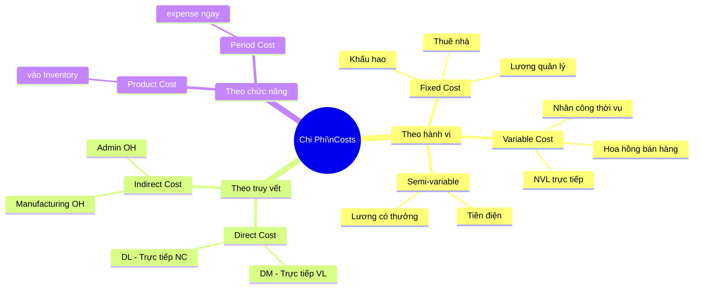
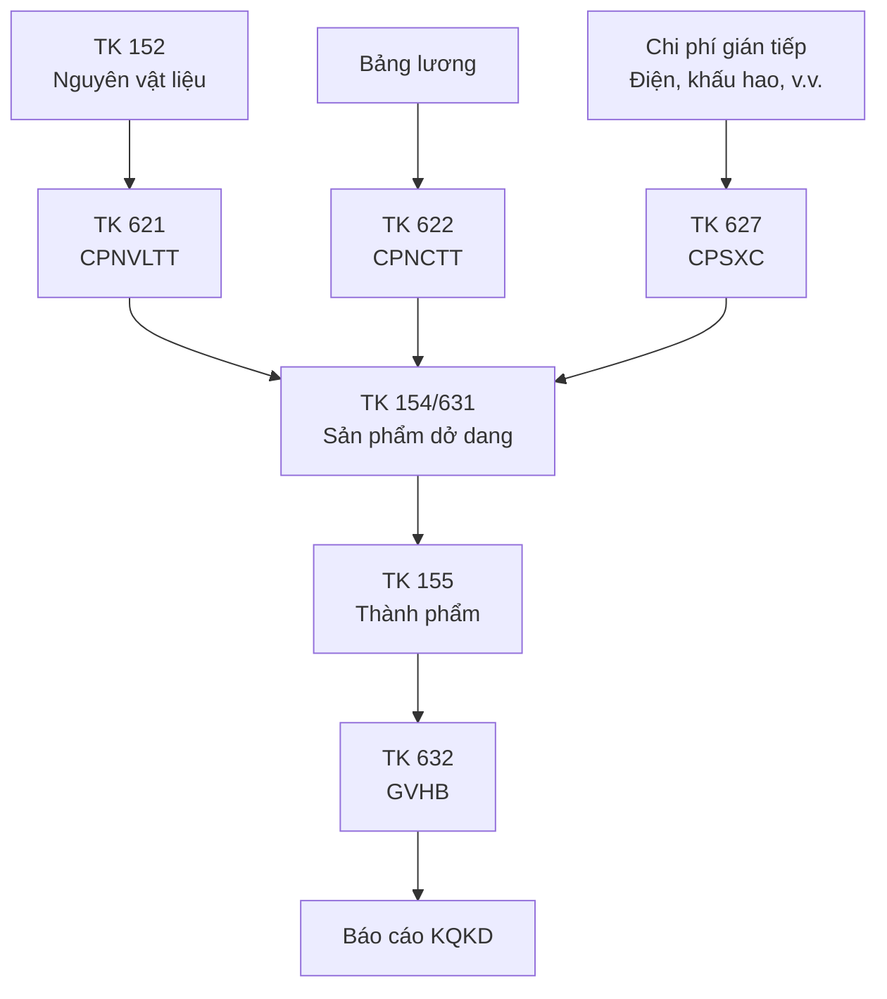
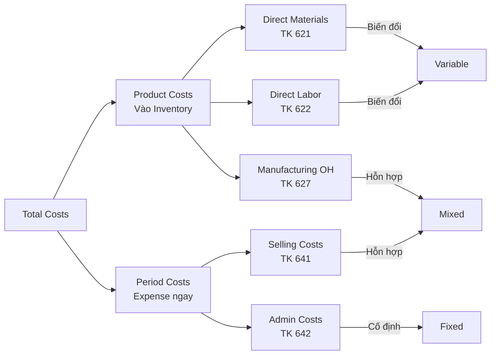

# AC03 — Cost Accounting (Kế Toán Chi Phí / Kế Toán Quản Trị)

> **Domain:** Accounting
> **Level:** Intermediate
> **Prerequisites:** AC01 Accounting Fundamentals, AC02 Financial Statements
> **Related:** AC04 IFRS/GAAP/VAS, OP01 Operations, FN03 Management Accounting

---

## 1. Mục Tiêu Học Tập (Learning Objectives)

Sau khi hoàn thành module này, người học có thể:

- Phân loại chi phí theo nhiều tiêu chí: Fixed/Variable, Direct/Indirect, Product/Period
- Áp dụng 3 phương pháp tính giá thành: Job Costing, Process Costing, ABC
- Thực hiện Standard Costing và Variance Analysis
- Tính Break-even Point và lập phân tích CVP
- Phân bổ Overhead Costs bằng nhiều phương pháp
- Hạch toán kế toán giá thành theo TK 154/631 (VN)
- Tư vấn doanh nghiệp cải thiện cơ cấu chi phí

---

## 2. Bối Cảnh Doanh Nghiệp (Business Context)

Trong khi kế toán tài chính trả lời "đã xảy ra gì?", kế toán chi phí trả lời "tại sao chi phí như vậy và làm thế nào để tối ưu?". Đây là nền tảng để:

- **Định giá sản phẩm:** Biết chi phí mới định giá đúng
- **Ra quyết định Make-or-Buy:** Tự sản xuất hay thuê ngoài
- **Kiểm soát hiệu quả:** So sánh actual vs. standard/budget
- **Phân tích sinh lời:** Sản phẩm nào, khách hàng nào có lãi nhất
- **Tối ưu công suất:** Quyết định sản lượng tối ưu

Doanh nghiệp sản xuất tại Việt Nam đặc biệt cần kế toán giá thành vì chi phí NVL, nhân công, khấu hao chiếm phần lớn cơ cấu chi phí.

---

## 3. Định Nghĩa Thuật Ngữ (Definitions)

| Thuật Ngữ | Tiếng Việt | Định Nghĩa |
|-----------|------------|------------|
| Fixed Cost | Chi phí cố định | Không thay đổi theo sản lượng trong ngắn hạn (thuê mặt bằng, khấu hao) |
| Variable Cost | Chi phí biến đổi | Thay đổi tỷ lệ theo sản lượng (NVL trực tiếp, nhân công trực tiếp) |
| Semi-variable Cost | Chi phí hỗn hợp | Có phần cố định và phần biến đổi (điện, nước, lương có thưởng) |
| Direct Cost | Chi phí trực tiếp | Dễ xác định và phân bổ cho sản phẩm cụ thể |
| Indirect Cost/Overhead | Chi phí gián tiếp/Sản xuất chung | Không thể phân bổ trực tiếp — cần allocation |
| Product Cost | Chi phí sản phẩm | DM + DL + OH (tính vào giá thành, vào Inventory) |
| Period Cost | Chi phí thời kỳ | Selling + Admin (expensed ngay trong kỳ) |
| Job Costing | Giá thành theo công việc | Tính giá thành cho từng đơn hàng, dự án |
| Process Costing | Giá thành theo quá trình | Tính cho sản xuất hàng loạt đồng nhất |
| ABC Costing | Kế toán chi phí theo hoạt động | Phân bổ overhead theo activities thực tế |
| Standard Cost | Chi phí tiêu chuẩn | Chi phí định mức cho một đơn vị sản phẩm |
| Variance | Phương sai/Chênh lệch | Actual Cost - Standard Cost |
| Break-even Point | Điểm hòa vốn | Sản lượng mà Tổng doanh thu = Tổng chi phí |
| Contribution Margin | Số dư đảm phí | Doanh thu - Chi phí biến đổi |
| CVP Analysis | Phân tích Chi phí-Khối lượng-Lợi nhuận | Mối quan hệ giữa cost, volume, profit |

---

## 4. Khái Niệm Cốt Lõi (Core Concepts)

### 4.1 Phân Loại Chi Phí



### 4.2 Cost Flow — Sản Xuất

```
NVL nhập kho (TK 152)
       ↓ Xuất sản xuất
Chi phí NVLTT (TK 621)
Chi phí NCTT (TK 622)     ──→  TK 154/631
Chi phí SXC (TK 627)           (Sản phẩm dở dang)
                                    ↓
                           TK 155 (Thành phẩm)
                                    ↓
                           TK 632 (Giá vốn hàng bán)
```

### 4.3 Break-even Analysis

```
BEP (sản lượng) = FC / (Price - VC per unit)
BEP (doanh thu) = FC / Contribution Margin Ratio
CMR = CM / Revenue = (P - VC) / P

Margin of Safety = Actual Sales - BEP Sales
Operating Leverage = CM / Operating Income
```

### 4.4 ABC vs Traditional Costing

```
TRADITIONAL COSTING:
  Overhead → Một allocation base (Machine Hours)
  → Sản phẩm

ABC COSTING:
  Overhead → Cost Pools (theo Activities)
             Setup ──→ Setup hours
             Quality Inspection ──→ Inspection count
             Material Handling ──→ Number of moves
  → Sản phẩm (theo activity usage)
```

---

## 5. Giá Trị Doanh Nghiệp (Business Value)

- **Định giá cạnh tranh:** Biết floor price (giá sàn) — không bán dưới biến phí
- **Tối ưu sản phẩm mix:** Ưu tiên sản phẩm có CM/đơn vị cao nhất khi nguồn lực hạn chế
- **Kiểm soát chi phí:** Variance analysis chỉ ra nơi lãng phí
- **M&A Due Diligence:** Hiểu cơ cấu chi phí của target company
- **Báo cáo quản trị:** Dashboard chi phí theo bộ phận, sản phẩm, kênh bán

---

## 6. Vai Trò Trong Doanh Nghiệp (Enterprise Role)

Kế toán chi phí nằm ở giao điểm giữa kế toán tài chính và quản trị vận hành. Cung cấp thông tin cho:
- **CFO:** Cơ cấu chi phí, tỷ suất lợi nhuận
- **COO/Giám đốc sản xuất:** Hiệu quả sản xuất, kiểm soát overhead
- **Sales Director:** Giá sàn, chiến lược định giá
- **CEO:** Quyết định Make-or-Buy, mở rộng/thu hẹp dòng sản phẩm

---

## 7. Các Bộ Phận Liên Quan (Departments Related)

| Bộ Phận | Tương Tác |
|---------|-----------|
| Sản xuất/Operations | Cung cấp dữ liệu thực tế (actual costs) |
| Kho/Warehouse | Phiếu xuất NVL, kiểm kê |
| HR | Bảng lương nhân công sản xuất |
| Kỹ thuật/R&D | Định mức kỹ thuật (standard quantities) |
| Sales | Dữ liệu sản lượng bán, yêu cầu định giá |
| Mua hàng | Giá mua NVL thực tế vs. tiêu chuẩn |

---

## 8. Đầu Vào (Input)

- Phiếu xuất kho NVL (raw materials requisitions)
- Bảng chấm công nhân công trực tiếp
- Hóa đơn điện, nước, thuê mặt bằng (overhead)
- Bảng phân bổ khấu hao TSCĐ
- Báo cáo sản lượng thực tế
- Định mức kỹ thuật (standard bill of materials, routing)
- Dự toán overhead (budgeted overhead)

---

## 9. Đầu Ra (Output)

- Bảng tính giá thành sản phẩm
- Báo cáo variance (chênh lệch thực tế vs. tiêu chuẩn)
- Báo cáo CVP / Break-even analysis
- Báo cáo lợi nhuận theo sản phẩm/KH/kênh
- Dữ liệu cho BCĐKT (giá trị HTK) và B02 (GVHB)
- Báo cáo overhead absorption

---

## 10. Quy Trình Nghiệp Vụ (Business Process)

```
Xác định Cost Objects (sản phẩm, dịch vụ, dự án)
               ↓
Phân loại chi phí (Direct vs. Indirect, Fixed vs. Variable)
               ↓
Thu thập chi phí thực tế trong kỳ
               ↓
Chọn phương pháp tính giá thành (Job/Process/ABC)
               ↓
Phân bổ Overhead theo allocation base
               ↓
Tổng hợp giá thành: DM + DL + OH allocated
               ↓
Tính giá thành đơn vị = Tổng CP / Sản lượng
               ↓
So sánh Actual vs. Standard (Variance Analysis)
               ↓
Báo cáo và quyết định cải tiến
```

---

## 11. Luồng Dữ Liệu (Data Flow)



---

## 12. Luồng Tiền (Money Flow)

```
Chi tiền mua NVL → TK 152 → TK 621 → TK 154 → TK 155 → TK 632
Chi lương NC → TK 622 → TK 154
Chi overhead → TK 627 → TK 154

Chi phí sản phẩm: Kẹt trong Inventory (BCĐKT) cho đến khi bán
→ Khi bán: chuyển sang GVHB (Income Statement) → ảnh hưởng lợi nhuận
```

---

## 13. Luồng Chứng Từ (Document Flow)

```
Phiếu xuất kho NVL → Nhật ký Dr 621/Cr 152
Bảng lương + Phiếu chấm công → Nhật ký Dr 622/Cr 334
Hóa đơn điện/nước/thuê → Nhật ký Dr 627/Cr 111,112,331
Bảng phân bổ giá thành → Nhật ký Dr 154/Cr 621,622,627
Báo cáo nhập kho TP → Nhật ký Dr 155/Cr 154
Hóa đơn bán hàng → Nhật ký Dr 632/Cr 155
```

---

## 14. Vai Trò (Roles)

| Vai Trò | Tiếng Anh | Trách Nhiệm |
|---------|-----------|-------------|
| Kế toán giá thành | Cost Accountant | Tính và theo dõi giá thành |
| Kế toán quản trị | Management Accountant | Báo cáo nội bộ, CVP, budgeting |
| Controller | Financial Controller | Giám sát hệ thống kiểm soát chi phí |
| Giám đốc sản xuất | Production Manager | Cung cấp dữ liệu thực tế, nhận variance reports |
| CFO | CFO | Chiến lược chi phí, quyết định make-or-buy |

---

## 15. Trách Nhiệm (Responsibilities)

- **Kế toán giá thành:** Tính giá thành đúng, kịp thời sau mỗi kỳ sản xuất
- **Kế toán trưởng:** Kiểm tra phương pháp phân bổ overhead phù hợp với VAS/thuế
- **Giám đốc sản xuất:** Giải thích variance, thực hiện cải tiến
- **CFO:** Phê duyệt phương pháp định giá, review margin

---

## 16. Ma Trận RACI

| Hoạt Động | KT Giá Thành | KT Trưởng | GĐ SX | CFO |
|-----------|:---:|:---:|:---:|:---:|
| Thu thập dữ liệu chi phí | R | A | C | I |
| Phân bổ overhead | R | A | C | I |
| Tính giá thành | R | A | I | I |
| Variance analysis | R | A | R | C |
| Báo cáo cho BGĐ | C | R | C | A |
| Định giá sản phẩm | C | C | C | R/A |

---

## 17. Frameworks

- **Traditional Cost Accounting:** Job Costing, Process Costing — phù hợp DN sản xuất đơn giản
- **Activity-Based Costing (ABC):** Phù hợp DN đa dạng sản phẩm, overhead chiếm tỷ trọng cao
- **Target Costing:** Bắt đầu từ giá thị trường, làm ngược lại để xác định chi phí mục tiêu
- **Kaizen Costing:** Cải tiến liên tục chi phí trong suốt vòng đời sản phẩm
- **Throughput Accounting (Theory of Constraints):** Tối ưu bottleneck để tăng throughput
- **Lean Accounting:** Phù hợp môi trường lean manufacturing

---

## 18. Chuẩn Mực Quốc Tế (International Standards)

| Chuẩn Mực | Liên Quan Đến Giá Thành |
|-----------|------------------------|
| IAS 2 / VAS 02 | Hàng tồn kho — phương pháp tính giá (FIFO, weighted average) |
| IAS 11 | Construction Contracts — giá thành theo hợp đồng |
| IFRS 15 | Revenue — link giữa giá thành và ghi nhận doanh thu |
| IMA Standards | Statements on Management Accounting (SMA) |
| CIMA | Chartered Institute of Management Accountants guidelines |

---

## 19. Bối Cảnh Việt Nam (Vietnam Context)

### Hệ Thống Tài Khoản Giá Thành (TT200)

| Tài Khoản | Tên | Nội Dung |
|-----------|-----|----------|
| TK 621 | Chi phí NVLTT | NVL trực tiếp xuất cho sản xuất |
| TK 622 | Chi phí NCTT | Lương + BHXH nhân công trực tiếp |
| TK 627 | Chi phí SXC | Overhead nhà máy (điện, khấu hao, lương quản đốc) |
| TK 154 | CP SXKD dở dang | WIP — Tập hợp và phân bổ giá thành |
| TK 631 | Giá thành SX | Phương pháp kê khai thường xuyên cho giá thành |
| TK 155 | Thành phẩm | Sản phẩm hoàn thành nhập kho |
| TK 156 | Hàng hóa | Hàng mua về để bán |
| TK 157 | Hàng gửi đi bán | Hàng đã giao nhưng chưa ghi nhận DT |

### Phương Pháp Tính Giá Tồn Kho (VAS 02)

| Phương Pháp | Tên VN | Đặc Điểm | Phổ Biến Khi Nào |
|-------------|--------|----------|-----------------|
| FIFO | Nhập trước - Xuất trước | Xuất kho theo thứ tự nhập | Hàng dễ hỏng, giá tăng |
| Weighted Average | Bình quân gia quyền | Giá bình quân sau mỗi lần nhập | Phổ biến nhất VN |
| Specific Identification | Đích danh | Theo dõi từng lô hàng | Hàng giá trị cao, bất động sản |

**Lưu ý VN:** VN không cho phép LIFO (Last In First Out) — không phù hợp VAS 02.

### Hệ Số Giá Thành Trong DN Sản Xuất VN

Phương pháp giá thành phổ biến:
- **Giản đơn (Simple):** 1 loại sản phẩm, 1 giai đoạn
- **Phân bước (Process-by-process):** Nhiều giai đoạn sản xuất liên tiếp
- **Đơn đặt hàng (Job Order):** Theo từng hợp đồng
- **Hệ số (Coefficient method):** Nhiều sản phẩm từ cùng quy trình, tính theo hệ số quy đổi

---

## 20. Vấn Đề Pháp Lý (Legal Considerations)

- **Thuế TNDN:** Chi phí phải có hóa đơn hợp lệ mới được khấu trừ thuế — chi phí sản xuất không hóa đơn bị loại
- **Phương pháp tính giá HTK:** Phải đăng ký với cơ quan thuế và áp dụng nhất quán
- **Thay đổi phương pháp:** Phải xin phép và thuyết minh trong BCTC (VAS 29)
- **Giá chuyển nhượng (Transfer Pricing):** DN liên kết phải tuân thủ NĐ 132/2020 về giá thành nội bộ

---

## 21. Sai Lầm Phổ Biến (Common Mistakes)

| Sai Lầm | Hậu Quả | Cách Tránh |
|---------|---------|------------|
| Phân bổ overhead theo doanh thu thay vì cost driver thực tế | Giá thành sai lệch | Dùng ABC hoặc machine hours |
| Bỏ qua chi phí ẩn (hidden costs) | Underpricing | Phân tích full cost kể cả overhead văn phòng |
| Không update standard costs hàng năm | Variance ngày càng vô nghĩa | Review standards đầu năm |
| Nhầm product cost vs. period cost | BCTC sai (HTK vs. CP kỳ) | Training + checklist |
| Không theo dõi chi phí theo SKU | Không biết sản phẩm nào lỗ | Setup cost centers theo sản phẩm |
| Fixed cost / sản lượng thấp → giá thành cao ảo | Quyết định dừng sản phẩm sai | Phân tích contribution margin trước |

---

## 22. Thực Hành Tốt Nhất (Best Practices)

1. **Phân biệt rõ product cost vs. period cost** để tránh nhầm lẫn khi tính GVHB
2. **Review overhead rate** hàng quý — so sánh budgeted vs. actual
3. **Sử dụng ABC** cho DN có > 5 dòng sản phẩm và overhead > 30% tổng chi phí
4. **Target costing từ đầu** khi thiết kế sản phẩm mới
5. **Contribution margin analysis** trước mọi quyết định dừng/giảm sản lượng
6. **Báo cáo variance kịp thời** — không đợi cuối tháng mới biết chi phí vượt budget

---

## 23. KPIs

| KPI | Mô Tả | Target Điển Hình |
|-----|-------|-----------------|
| Gross Margin % | Lãi gộp / Doanh thu | Phụ thuộc ngành (SX: 20-40%, Phần mềm: 60-80%) |
| Cost per Unit | Giá thành đơn vị | So sánh với kỳ trước và đối thủ |
| Overhead Absorption Rate | Overhead phân bổ / Actual overhead | ≈ 100% (không over/under absorb) |
| Material Variance % | (Actual - Standard) / Standard | < 5% |
| Labor Efficiency | Standard hours / Actual hours | > 90% |
| Break-even Utilization | BEP Units / Capacity | < 60% (an toàn) |

---

## 24. Metrics

- **Cost Structure Ratio:** Fixed Cost / Total Cost — cao = rủi ro khi doanh thu giảm
- **Operating Leverage:** % thay đổi EBIT / % thay đổi doanh thu
- **Contribution Margin per Bottleneck Hour:** Ưu tiên sản phẩm theo Theory of Constraints
- **Cost Reduction Rate:** % giảm chi phí đơn vị so cùng kỳ
- **Waste Ratio:** Chi phí phế liệu, hàng lỗi / Tổng chi phí sản xuất

---

## 25. Báo Cáo (Reports)

| Báo Cáo | Tần Suất | Đối Tượng |
|---------|----------|-----------|
| Bảng tính giá thành sản phẩm | Hàng tháng | CFO, GĐ SX |
| Variance Report (CP vs. Standard) | Hàng tuần | GĐ SX, Controller |
| Báo cáo phân tích lợi nhuận theo SP | Hàng tháng | CEO, CFO, Sales |
| CVP / Break-even Analysis | Hàng quý hoặc khi có thay đổi | CEO, CFO |
| Cost Center Report | Hàng tháng | Trưởng bộ phận |
| Overhead Absorption Report | Hàng tháng | KT Trưởng, Controller |

---

## 26. Mẫu Biểu (Templates)

### Template Tính Giá Thành (Job Costing)

```
JOB COST SHEET
Đơn hàng số: _________ Khách hàng: _____________
Ngày bắt đầu: ________ Ngày hoàn thành: ________

CHI PHÍ TRỰC TIẾP:
  NVLTT: _____ kg × _____ VND/kg = ___________
  NCTT:  _____ giờ × _____ VND/giờ = __________

CHI PHÍ GIÁN TIẾP (SXC):
  Overhead rate: _____ VND/giờ máy
  Số giờ máy: ___________
  Overhead allocated: ___________

TỔNG GIÁ THÀNH: ___________
Số lượng sản phẩm: ___________
GIÁ THÀNH ĐƠN VỊ: ___________

Giá bán: ___________
Biên lợi nhuận: ___________  (_____%)
```

### Template CVP Analysis

```
CVP ANALYSIS
Giá bán đơn vị (P): ___________
Biến phí đơn vị (VC): ___________
Số dư đảm phí (CM = P - VC): ___________
CMR = CM/P: ___________

Định phí (FC): ___________

BEP (sản lượng) = FC / CM = ___________
BEP (doanh thu) = FC / CMR = ___________

Tại sản lượng Q = ___________:
  Doanh thu: Q × P = ___________
  Biến phí: Q × VC = ___________
  Lợi nhuận: (Q × CM) - FC = ___________
```

---

## 27. Checklists

### Checklist Tính Giá Thành Cuối Tháng

- [ ] Tất cả phiếu xuất kho NVL đã nhập (TK 621)
- [ ] Bảng lương NCTT đã phân bổ vào TK 622
- [ ] Chi phí SXC (TK 627) đã tập hợp đủ
- [ ] Overhead đã phân bổ theo đúng allocation base
- [ ] WIP đầu kỳ + CP phát sinh - WIP cuối kỳ = Giá thành hoàn thành
- [ ] Giá thành đơn vị hợp lý (so sánh với kỳ trước)
- [ ] Variance analysis đã hoàn thành
- [ ] Số dư TK 154/631 phản ánh đúng WIP cuối kỳ

---

## 28. Quy Trình Chuẩn (SOP)

### SOP: Tính Giá Thành Process Costing

1. **Xác định đơn vị tương đương (Equivalent Units):**
   - Sản phẩm hoàn thành + WIP cuối kỳ × % hoàn thành
2. **Tính chi phí đơn vị tương đương:**
   - Tổng chi phí phát sinh / Số đơn vị tương đương
3. **Phân bổ chi phí:**
   - Cho SP hoàn thành: Số lượng × CP đơn vị
   - Cho WIP cuối: Số lượng × % hoàn thành × CP đơn vị
4. **Kiểm tra:** Tổng CP phân bổ = Tổng CP phát sinh

---

## 29. Tình Huống Thực Tế (Case Study)

### Case: Nhà Máy Bia Sài Gòn — Chuyển Sang ABC Costing

**Bối cảnh:** Nhà máy sản xuất 5 dòng bia: bia lon, bia chai, bia hơi, bia tươi premium, bia không cồn. Overhead chiếm 45% tổng chi phí.

**Vấn đề với Traditional Costing:**
- Phân bổ overhead theo machine hours → bia không cồn (sản lượng thấp, quy trình phức tạp) bị undercosted
- Bia lon (sản lượng cao, quy trình đơn giản) bị overcosted
- Quyết định giá sai → bia không cồn lỗ ẩn

**Giải pháp ABC:**
- Xác định 6 activities: Production Setup, Quality Testing, Packaging, Distribution, Marketing Support, Customer Service
- Phân bổ theo activity drivers thực tế
- Kết quả: Bia không cồn thực sự lỗ 15%, bia lon lãi hơn dự kiến 8%

**Hành động:** Tăng giá bia không cồn, đàm phán lại với nhà phân phối, tối ưu quy trình sản xuất bia không cồn.

---

## 30. Ví Dụ Doanh Nghiệp Nhỏ (Small Business Example)

**Xưởng May "Hạnh Phúc" — Bình Dương (30 nhân công, 500 đơn/tháng)**

Tính giá thành áo sơ mi đơn giản:

| Chi Phí | Mô Tả | Đơn Vị |
|---------|-------|--------|
| NVLTT | 2m vải × 45,000 VND/m | 90,000 |
| NCTT | 45 phút × 50,000 VND/giờ | 37,500 |
| SXC | Phân bổ theo giờ NC: 20,000 VND/giờ × 0.75h | 15,000 |
| **Tổng giá thành** | | **142,500 VND** |

Giá bán: 220,000 VND → Gross margin 35.2%
BEP: FC tháng 50 triệu / CM 77,500 = 645 áo/tháng

---

## 31. Ví Dụ Doanh Nghiệp Lớn (Enterprise Example)

**Hòa Phát Steel — Sản Xuất Thép (Lớn nhất VN)**

Thách thức giá thành:
- 3 giai đoạn: Luyện thép → Cán nóng → Cán nguội
- Chi phí than coke, điện, lò cao chiếm 70% chi phí
- Giá NVL (quặng sắt) biến động mạnh theo giá quốc tế

Hệ thống Standard Costing:
- Standard costing cho từng grade thép
- Variance analysis hàng tuần: Material Price Variance, Efficiency Variance
- Hedging strategy dựa trên variance data để quản lý rủi ro NVL

---

## 32. ERP Mapping

| Quy Trình Giá Thành | SAP Module | MISA | Oracle |
|--------------------|------------|------|--------|
| Tập hợp chi phí SX | CO-PC (Product Cost) | Kế toán giá thành | Oracle Cost Mgmt |
| Job Costing | CO-OPA (Order & Project) | Theo đơn hàng | Project Accounting |
| Process Costing | CO-PC-PCP | Theo quy trình | Process Costing |
| ABC Costing | CO-OM-ABC | Không có sẵn | Oracle ABC |
| Standard Costing | CO-PC-STD | Chi phí tiêu chuẩn | Standard Cost |
| Variance Analysis | CO-PC-ACT | Báo cáo so sánh | Variance Reports |

---

## 33. Tự Động Hóa (Automation)

| Quy Trình | Giải Pháp | Lợi Ích |
|-----------|-----------|---------|
| Thu thập chi phí thực tế | ERP tích hợp Manufacturing | Real-time vs. cuối tháng |
| Overhead allocation | Tự động theo preset allocation base | Loại bỏ tính toán manual |
| Variance reports | Power BI từ SAP CO | Dashboard real-time |
| BOM (Bill of Materials) | ERP PDM integration | Tự động lấy định mức |
| Inventory valuation | ERP automatic FIFO/weighted avg | Tính tự động mỗi giao dịch |

---

## 34. Cơ Hội AI (AI Opportunities)

- **Cost Prediction:** ML dự báo chi phí dựa trên factors (weather, commodity prices, capacity)
- **Anomaly Detection:** Phát hiện chi phí bất thường (vượt budget >10%) tức thì
- **Optimal Production Mix:** AI tìm product mix tối ưu với multiple constraints
- **Dynamic Pricing:** AI điều chỉnh giá bán theo chi phí thực tế và market demand
- **Scrap/Waste Prediction:** Computer vision tại nhà máy dự báo và giảm phế liệu

---

## 35. Hướng Dẫn Triển Khai (Implementation Guide)

### Thiết Lập Hệ Thống Kế Toán Giá Thành

**Giai đoạn 1 — Cơ sở dữ liệu:**
- Xây dựng BOM (Bill of Materials) cho từng sản phẩm
- Thiết lập Cost Centers theo bộ phận/nhà máy
- Xác định Overhead allocation bases và rates

**Giai đoạn 2 — Quy trình:**
- Lập SOP thu thập chi phí thực tế
- Thiết lập routine tính giá thành hàng tháng
- Xây dựng variance analysis reports

**Giai đoạn 3 — Tối ưu:**
- Review phương pháp phân bổ overhead sau 3-6 tháng
- Xem xét chuyển sang ABC nếu phù hợp
- Kết nối với hệ thống budgeting

---

## 36. Hướng Dẫn Tư Vấn (Consulting Guide)

### Điều Tra Chi Phí Của Khách Hàng

**Bước 1 — Phân tích P&L theo dòng sản phẩm:**
- Tách riêng doanh thu và GVHB theo sản phẩm/dịch vụ
- Tính gross margin từng dòng

**Bước 2 — Xác định cost drivers:**
- Chi phí nào là cố định, biến đổi?
- Overhead được phân bổ như thế nào hiện tại?

**Bước 3 — Xác định "cows vs. dogs":**
- Sản phẩm nào có CM cao nhất? Thấp nhất?
- Có sản phẩm nào bán được nhưng thực ra lỗ sau full cost?

**Bước 4 — Khuyến nghị:**
- Dừng/điều chỉnh sản phẩm lỗ
- Tăng giá hoặc tối ưu chi phí sản phẩm biên

---

## 37. Câu Hỏi Chẩn Đoán (Diagnostic Questions)

1. Doanh nghiệp có hệ thống tính giá thành không? Chi tiết đến mức nào?
2. Overhead được phân bổ như thế nào? Có hợp lý không?
3. Có phân tích lợi nhuận theo từng dòng sản phẩm không?
4. Giá thành có được so sánh với định mức (standard) không?
5. Chi phí cố định chiếm bao nhiêu % tổng chi phí?
6. Điểm hòa vốn hiện tại là bao nhiêu % công suất?
7. Có sản phẩm nào bán được nhưng có contribution margin âm không?
8. Phương pháp tính giá hàng tồn kho đang dùng là gì?

---

## 38. Câu Hỏi Phỏng Vấn (Interview Questions)

**Junior Cost Accountant:**
- Phân biệt Fixed Cost và Variable Cost, cho ví dụ cụ thể?
- Hạch toán khi xuất NVL vào sản xuất như thế nào?
- Break-even point tính như thế nào?

**Senior Cost Accountant:**
- Khi nào nên dùng ABC thay vì Traditional Costing?
- Giải thích Material Price Variance và Labor Efficiency Variance?
- Công ty bạn đang dùng phương pháp tính giá HTK nào? Tại sao?

**Controller/CFO:**
- Làm thế nào để xây dựng hệ thống cost accounting từ đầu?
- Nếu một sản phẩm có contribution margin dương nhưng net income âm, có nên dừng không?
- Chiến lược make-or-buy quyết định như thế nào?

---

## 39. Bài Tập (Exercises)

**Bài 1:** Công ty May ABC có FC 500 triệu, VC 120,000/áo, giá bán 200,000/áo. Tính BEP (sản lượng và doanh thu). Tại sản lượng 8,000 áo, lợi nhuận là bao nhiêu?

**Bài 2:** Nhà máy sản xuất 2 sản phẩm X và Y. Overhead 300 triệu/tháng. Truyền thống phân bổ theo machine hours (X: 3h/SP, Y: 2h/SP). Theo ABC, xác định drivers và so sánh giá thành.

**Bài 3:** Standard cost NVL: 5kg × 20,000 = 100,000. Actual: 5.2kg × 19,500 = 101,400. Tính Material Price Variance và Material Quantity Variance. Giải thích ý nghĩa.

**Bài 4:** Công ty có 3 sản phẩm. Phân tích contribution margin từng sản phẩm và đề xuất product mix tối ưu khi nguồn lực bị giới hạn (machine hours).

---

## 40. Tài Liệu Tham Khảo (References)

- VAS 02 — Hàng tồn kho (phương pháp tính giá)
- Thông tư 200/2014 — TK 154, 621, 622, 627, 631
- NĐ 132/2020/NĐ-CP — Quản lý thuế với giao dịch liên kết (Transfer Pricing)
- Horngren, Datar, Rajan — "Cost Accounting: A Managerial Emphasis" (Pearson)
- Drury, Colin — "Management and Cost Accounting" (CIMA Official)
- Kaplan, Robert & Anderson, Steven — "Time-Driven Activity-Based Costing" (HBR)
- Goldratt, Eliyahu — "The Goal" (Theory of Constraints)
- CIMA — CGMA Management Accounting Guidelines
- Website IMA: imanet.org

---

## Output Formats

### A. Mermaid — Cost Classification



### B. ASCII — CVP Diagram

```
Doanh thu ($)
    │                              /  Revenue line
    │                           /
    │                        /
    │      Vùng lỗ        /  ← BEP
    │                  /
    │ Total Cost    /
    │ line       /         Vùng lãi
    │         /
    │      /   ← Fixed Cost (hằng số)
    │────────────────────────────── Sản lượng (Q)
    0     BEP
    
    BEP = FC / (P - VC/unit)
    Lợi nhuận = Q × (P - VC) - FC = Q × CM - FC
```

### C. Flashcards

**Q1:** Contribution Margin là gì và tại sao quan trọng?
**A1:** CM = Doanh thu - Chi phí biến đổi. Đây là phần doanh thu còn lại sau khi bù đắp biến phí, dùng để bù đắp định phí và tạo lợi nhuận. Sản phẩm có CM dương thì đóng góp vào việc bù đắp định phí, dù có thể vẫn lỗ ở net income level.

**Q2:** Khi nào nên dùng ABC thay vì Traditional Costing?
**A2:** Khi: (1) Overhead chiếm tỷ trọng lớn (>30%), (2) Doanh nghiệp có nhiều dòng sản phẩm đa dạng, (3) Sản phẩm đòi hỏi nguồn lực gián tiếp khác nhau rõ rệt. Traditional Costing dẫn đến cross-subsidization — sản phẩm phức tạp bị undercosted.

**Q3:** Phân biệt Job Costing và Process Costing?
**A3:** Job Costing: Tính giá thành cho từng đơn hàng/dự án riêng biệt (xây dựng, in ấn theo yêu cầu, phần mềm). Process Costing: Tính cho sản xuất đại trà đồng nhất (bia, xi măng, hóa chất) — chi phí bình quân trên số đơn vị tương đương.

### D. Cheat Sheet

```
COST ACCOUNTING — CHEAT SHEET

PHÂN LOẠI CHI PHÍ:
  Product Cost = DM (621) + DL (622) + OH (627)
  Period Cost = Selling (641) + Admin (642)
  Fixed: Không đổi theo Q | Variable: Đổi theo Q

BREAK-EVEN:
  CM = P - VC/unit
  CMR = CM / P
  BEP(Q) = FC / CM
  BEP($) = FC / CMR
  Profit = Q × CM - FC

VARIANCE ANALYSIS:
  Material Price Var = (AQ × AP) - (AQ × SP)
  Material Qty Var = (AQ × SP) - (SQ × SP)
  Labor Rate Var = (AH × AR) - (AH × SR)
  Labor Eff Var = (AH × SR) - (SH × SR)

VN TÀI KHOẢN: 621 DM | 622 DL | 627 OH | 154 WIP | 155 FG | 632 COGS
VN HTK METHODS: FIFO, Weighted Average (KHÔNG dùng LIFO)
```

### E. JSON Metadata

```json
{
  "module": {
    "code": "AC03",
    "name": "Cost Accounting",
    "name_vi": "Kế Toán Chi Phí / Kế Toán Quản Trị",
    "domain": "Accounting",
    "level": "Intermediate",
    "estimated_hours": 12,
    "prerequisites": ["AC01", "AC02"],
    "related_modules": ["AC04", "OP01", "FN03"],
    "key_concepts": [
      "Fixed/Variable/Semi-variable Costs",
      "Job Costing",
      "Process Costing",
      "Activity-Based Costing",
      "Standard Costing",
      "Variance Analysis",
      "CVP Analysis",
      "Break-even Point",
      "Contribution Margin"
    ],
    "key_accounts_vn": {
      "TK621": "Chi phi NVLTT",
      "TK622": "Chi phi NCTT",
      "TK627": "Chi phi SXC",
      "TK154": "CPSX KD do dang",
      "TK155": "Thanh pham",
      "TK632": "Gia von hang ban"
    },
    "inventory_methods_vn": ["FIFO", "Binh quan gia quyen", "Dich danh"],
    "legal_refs_vn": [
      "VAS 02 - Hang ton kho",
      "TT200/2014 - He thong TK",
      "ND132/2020 - Transfer Pricing"
    ],
    "last_updated": "2026-06-30",
    "status": "complete",
    "sections_count": 40,
    "output_formats": ["mermaid", "ascii", "flashcards", "cheatsheet", "json"]
  }
}
```
