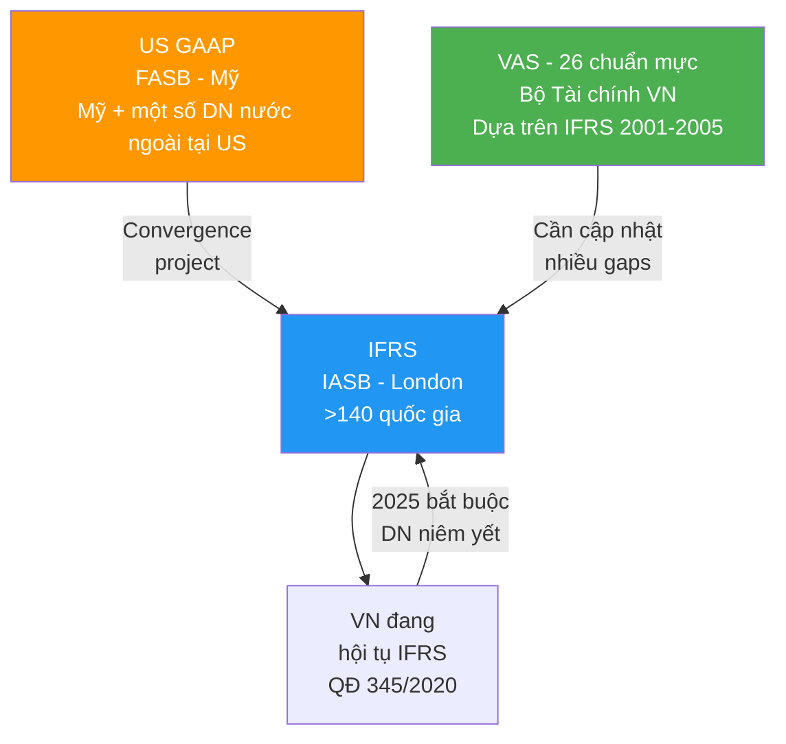
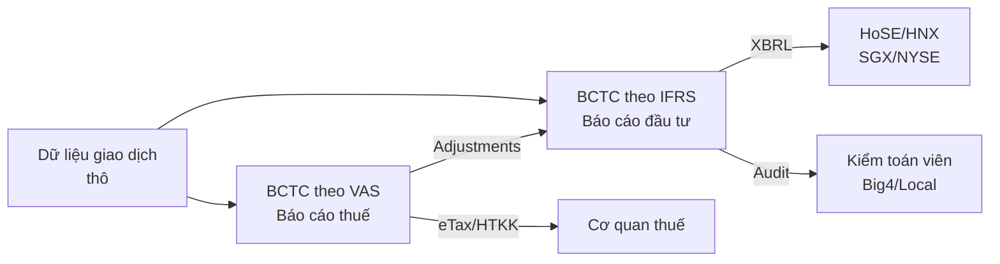
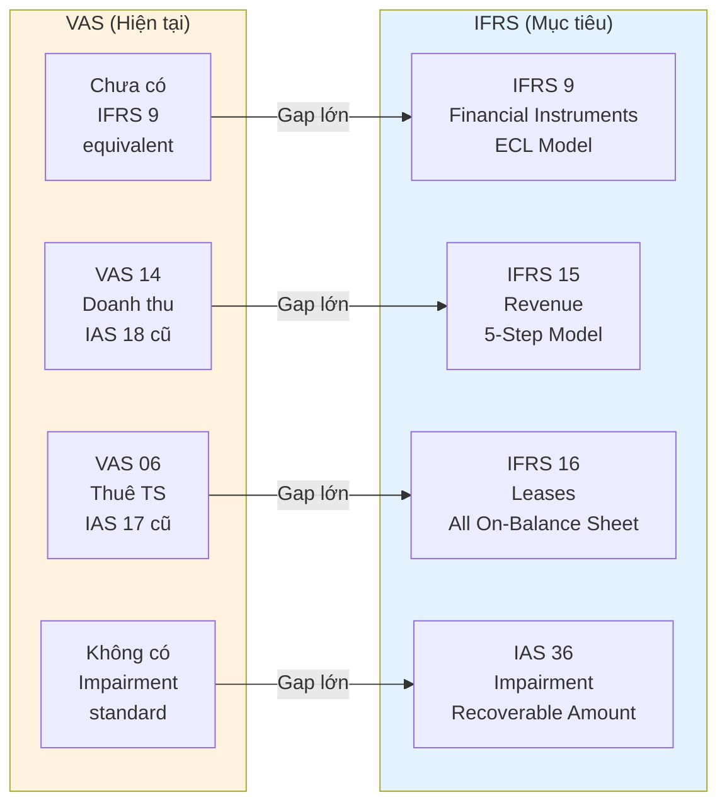

# AC04 — IFRS, GAAP & VAS (Chuẩn Mực Kế Toán Quốc Tế và Việt Nam)

> **Domain:** Accounting
> **Level:** Advanced
> **Prerequisites:** AC01, AC02, AC03
> **Related:** FN01 Financial Analysis, LW01 Corporate Law

---

## 1. Mục Tiêu Học Tập (Learning Objectives)

Sau khi hoàn thành module này, người học có thể:

- Mô tả cấu trúc và tổ chức của IFRS (IASB), US GAAP (FASB) và VAS
- So sánh các khác biệt trọng yếu giữa IFRS và US GAAP
- Phân tích khoảng cách (gaps) giữa VAS và IFRS
- Giải thích 4 chuẩn mực IFRS quan trọng: IFRS 9, IFRS 15, IFRS 16, IAS 36
- Nắm lộ trình áp dụng IFRS tại Việt Nam theo Quyết định 345/2020
- Tư vấn doanh nghiệp về chiến lược chuyển đổi sang IFRS

---

## 2. Bối Cảnh Doanh Nghiệp (Business Context)

Toàn cầu hóa tài chính đang buộc doanh nghiệp VN phải tiến dần đến IFRS:

- **Nhà đầu tư nước ngoài** yêu cầu BCTC theo IFRS để so sánh
- **DN niêm yết VN** phải áp dụng IFRS từ 2025 (bắt buộc theo QĐ 345/2020)
- **Vay vốn quốc tế** (IFC, ADB, bond trái phiếu quốc tế) yêu cầu IFRS
- **M&A cross-border** cần BCTC chuẩn IFRS cho due diligence

Sự khác biệt giữa VAS và IFRS có thể dẫn đến lợi nhuận, tài sản, vốn chủ sở hữu bị phản ánh sai lệch hàng trăm tỷ đồng trong các DN lớn.

---

## 3. Định Nghĩa Thuật Ngữ (Definitions)

| Thuật Ngữ | Viết Tắt | Định Nghĩa |
|-----------|---------|------------|
| International Financial Reporting Standards | IFRS | Chuẩn mực BCTC quốc tế do IASB ban hành |
| International Accounting Standards Board | IASB | Hội đồng chuẩn mực kế toán quốc tế (London) |
| Generally Accepted Accounting Principles (US) | US GAAP | Nguyên tắc kế toán được chấp nhận chung của Mỹ |
| Financial Accounting Standards Board | FASB | Hội đồng chuẩn mực kế toán tài chính Mỹ |
| Vietnam Accounting Standards | VAS | 26 chuẩn mực kế toán VN, ban hành 2001-2005 |
| Fair Value | Giá trị hợp lý | Giá giao dịch trong điều kiện thị trường bình thường |
| Historical Cost | Giá gốc | Giá mua ban đầu (VAS ưu tiên phương pháp này) |
| Principles-based | Nguyên tắc nền tảng | IFRS — quy định nguyên tắc, để professional judgment |
| Rules-based | Quy tắc chi tiết | US GAAP — quy định chi tiết cụ thể hơn |
| Convergence | Hội tụ chuẩn mực | Quá trình GAAP và IFRS tiến gần nhau |
| IFRS 9 | — | Financial Instruments |
| IFRS 15 | — | Revenue from Contracts with Customers |
| IFRS 16 | — | Leases |
| IAS 36 | — | Impairment of Assets |

---

## 4. Khái Niệm Cốt Lõi (Core Concepts)

### 4.1 Toàn Cảnh Hệ Thống Chuẩn Mực



### 4.2 IFRS 9 — Financial Instruments

**Ba phân loại tài sản tài chính:**

```
IFRS 9 CLASSIFICATION:
┌──────────────────────────────────────────────────┐
│ Business Model Test × SPPI Test                  │
│                                                  │
│ Hold to Collect + SPPI         → Amortized Cost  │
│ Hold to Collect & Sell + SPPI  → FVOCI           │
│ Khác                           → FVTPL           │
└──────────────────────────────────────────────────┘

ECL Model (Expected Credit Loss):
  Stage 1: 12-month ECL (không tăng rủi ro đáng kể)
  Stage 2: Lifetime ECL (tăng rủi ro đáng kể)
  Stage 3: Lifetime ECL (đã bị suy giảm)
```

### 4.3 IFRS 15 — Revenue Recognition

**5-Step Model:**
```
Step 1: Xác định hợp đồng với khách hàng
Step 2: Xác định performance obligations (nghĩa vụ thực hiện)
Step 3: Xác định giá giao dịch
Step 4: Phân bổ giá giao dịch cho từng obligation
Step 5: Ghi nhận doanh thu khi (hoặc khi) obligation được thực hiện
```

### 4.4 IFRS 16 — Leases

```
TRƯỚC IFRS 16 (IAS 17):
  Operating Lease → Off Balance Sheet (không lên BCĐKT)
  Finance Lease → On Balance Sheet

SAU IFRS 16:
  Hầu hết leases → ON Balance Sheet
  Lessee ghi nhận:
    Right-of-Use Asset (Tài sản quyền sử dụng)
    Lease Liability (Nợ thuê)
  
  TÁC ĐỘNG: Tổng tài sản tăng, Nợ phải trả tăng
  → Leverage ratio xấu đi trên bề mặt
  → EBITDA tăng (lease payment không còn là OPEX)
```

### 4.5 IAS 36 — Impairment of Assets

```
Khi có dấu hiệu suy giảm giá trị:
  Tính Recoverable Amount = MAX(Fair Value - CoS, VIU)
  
  Value in Use (VIU) = PV of future cash flows từ tài sản
  
  Nếu Carrying Amount > Recoverable Amount:
    → Ghi nhận Impairment Loss = CA - RA
    → Dr Impairment Loss / Cr Accumulated Impairment
  
  VAS: Chỉ có dự phòng giảm giá HTK và đầu tư
       KHÔNG có impairment testing toàn diện như IFRS
```

---

## 5. Giá Trị Doanh Nghiệp (Business Value)

- **Thu hút FDI:** IFRS là "ngôn ngữ" nhà đầu tư nước ngoài hiểu
- **Niêm yết quốc tế:** SGX, NYSE, LSE yêu cầu IFRS
- **Vay vốn giá tốt hơn:** Minh bạch hơn → risk premium thấp hơn
- **So sánh chuẩn:** Benchmark với industry peers toàn cầu
- **M&A:** Tránh phát hiện surprises trong due diligence

---

## 6. Vai Trò Trong Doanh Nghiệp (Enterprise Role)

IFRS conversion là dự án chiến lược cấp độ C-suite, liên quan:
- **CFO:** Champion chính của dự án IFRS
- **Kế toán trưởng:** Lead kỹ thuật
- **IT:** Nâng cấp ERP hỗ trợ IFRS reporting
- **Legal:** Xem xét tác động hợp đồng (đặc biệt leases - IFRS 16)
- **Thuế:** Xử lý temporary differences phát sinh

---

## 7. Các Bộ Phận Liên Quan (Departments Related)

| Bộ Phận | Tác Động Khi Chuyển Sang IFRS |
|---------|-------------------------------|
| Kế toán | Thay đổi toàn bộ chính sách kế toán |
| IT/ERP | Hệ thống phải hỗ trợ parallel reporting |
| Pháp lý | Rà soát hợp đồng thuê (IFRS 16) |
| Thuế | Deferred tax phát sinh từ VAS-IFRS differences |
| HR | Đào tạo lại kế toán viên |
| Kiểm toán | Kiểm toán viên phải có chứng chỉ IFRS |

---

## 8. Đầu Vào (Input)

- BCTC theo VAS (điểm khởi đầu cho conversion)
- Hợp đồng thuê tài sản (để áp dụng IFRS 16)
- Danh sách công cụ tài chính (để áp dụng IFRS 9)
- Hợp đồng doanh thu nhiều giai đoạn (cho IFRS 15)
- Báo cáo định giá tài sản (cho Fair Value measurement)
- Cashflow projections (cho IAS 36 impairment testing)

---

## 9. Đầu Ra (Output)

- BCTC theo IFRS (4 statements + Notes)
- Opening IFRS Balance Sheet (ngày chuyển đổi)
- Reconciliation VAS to IFRS (bắt buộc theo IFRS 1)
- Báo cáo dual reporting (song song VAS và IFRS)
- Thuyết minh về chính sách kế toán mới
- Deferred tax calculations

---

## 10. Quy Trình Nghiệp Vụ (Business Process)

```
Giai đoạn 1 — Chuẩn bị (6-12 tháng trước):
  → Đánh giá gap VAS vs. IFRS
  → Xác định tác động trọng yếu
  → Đào tạo nhân sự
  → Nâng cấp IT/ERP

Giai đoạn 2 — Parallel Run (năm đầu):
  → Duy trì song song VAS (báo cáo thuế) và IFRS
  → Thu thập dữ liệu theo yêu cầu IFRS

Giai đoạn 3 — First-time Adoption (năm chuyển đổi):
  → Lập Opening Balance Sheet theo IFRS 1
  → Áp dụng mandatory exceptions và optional exemptions
  → Lập BCTC IFRS đầu tiên

Giai đoạn 4 — Ongoing (sau chuyển đổi):
  → Duy trì cả VAS (thuế) và IFRS (báo cáo)
  → Cập nhật khi IASB ban hành chuẩn mực mới
```

---

## 11. Luồng Dữ Liệu (Data Flow)



---

## 12. Luồng Tiền (Money Flow)

IFRS/GAAP ảnh hưởng đến cách ghi nhận và trình bày dòng tiền:

- **IFRS 9 ECL:** Dự phòng tăng → Lợi nhuận giảm → Thuế phân kỳ
- **IFRS 16:** Lease payments tách thành: trả gốc (CFI) + trả lãi (CFO) — thay vì toàn bộ vào CFO như IAS 17
- **IFRS 15:** Doanh thu ghi nhận theo tiến độ có thể khác với nhận tiền thực tế

---

## 13. Luồng Chứng Từ (Document Flow)

```
VAS Books (thuế) ←──────── Giao dịch ────────→ IFRS Books (báo cáo)
       │                                                │
       ↓                                                ↓
Tờ khai thuế                                    BCTC IFRS
(HTKK/eTax)                                    (kiểm toán Big4)
       │                                                │
       ↓                                                ↓
Cơ quan thuế                                   Nhà đầu tư/UBCKNN
```

---

## 14. Vai Trò (Roles)

| Vai Trò | Tiếng Anh | Trách Nhiệm IFRS |
|---------|-----------|-----------------|
| Giám đốc Tài chính | CFO | Champion IFRS project, phê duyệt accounting policies |
| Kế toán trưởng | Chief Accountant | Lead kỹ thuật conversion |
| IFRS Specialist | IFRS Technical Specialist | Xử lý complex standards (IFRS 9, 16) |
| Kiểm toán viên | Auditor (Big4 preferred) | Xác nhận BCTC IFRS |
| Tax Advisor | Tax Consultant | Xử lý deferred tax phát sinh |

---

## 15. Trách Nhiệm (Responsibilities)

- **CFO:** Quyết định timeline, budget cho IFRS project; sign-off cuối cùng
- **KT Trưởng:** Lập chi tiết accounting policies theo IFRS; train nhân viên
- **Kiểm toán viên:** Đảm bảo BCTC tuân thủ đầy đủ IFRS; issue audit opinion
- **HĐQT/Ủy ban Kiểm toán:** Giám sát chất lượng BCTC IFRS

---

## 16. Ma Trận RACI

| Hoạt Động | CFO | KT Trưởng | IFRS Specialist | Kiểm toán |
|-----------|:---:|:---:|:---:|:---:|
| Gap assessment | A | R | R | C |
| Accounting policies | A | R | C | C |
| First-time adoption | A | R | C | C |
| Lập BCTC IFRS | I | A | R | - |
| Audit BCTC | I | C | C | R/A |
| Public disclosure | A | R | C | C |

---

## 17. Frameworks

- **IFRS Conceptual Framework (2018):** Useful financial information, qualitative characteristics
- **IFRS 1 — First-time Adoption:** Hướng dẫn lần đầu tiên áp dụng IFRS
- **IAS 8 — Accounting Policies:** Thay đổi và sửa lỗi chính sách kế toán
- **US GAAP ASC Framework:** Accounting Standards Codification
- **IASB-FASB Convergence Project:** Hội tụ các khác biệt còn lại

---

## 18. Chuẩn Mực Quốc Tế (International Standards)

### IFRS vs US GAAP — Khác Biệt Trọng Yếu

| Vấn Đề | IFRS | US GAAP |
|--------|------|---------|
| Inventory | FIFO hoặc Weighted Avg | FIFO, Weighted Avg, **LIFO** (cho phép) |
| Revaluation of PP&E | Cho phép (IAS 16) | Không cho phép |
| R&D | Development costs được capitalize (IAS 38) | Expense ngay (SFAS 2) |
| Revenue | IFRS 15 — 5 steps | ASC 606 (gần giống IFRS 15) |
| Leases | IFRS 16 — hầu hết on balance sheet | ASC 842 (tương tự) |
| Impairment | One-step test (IAS 36) | Two-step test (ASC 350) |
| Financial Instruments | IFRS 9 — 3 categories | ASC 320/325 — nhiều categories hơn |
| Presentation | Principles-based, ít rules | Rules-based, chi tiết hơn |

### IFRS Chuẩn Mực Quan Trọng Nhất

| Chuẩn Mực | Chủ Đề | Tác Động Lớn |
|-----------|--------|-------------|
| IFRS 9 | Financial Instruments | Dự phòng tín dụng (ngân hàng, tài chính) |
| IFRS 15 | Revenue | DN phần mềm, xây dựng, telecoms |
| IFRS 16 | Leases | Retail, hàng không, logistics |
| IFRS 17 | Insurance Contracts | Bảo hiểm |
| IAS 36 | Impairment | Tập đoàn có goodwill |
| IAS 19 | Employee Benefits | Lương hưu, thưởng dài hạn |
| IAS 38 | Intangible Assets | Tech, pharma, R&D |
| IFRS 3 | Business Combinations | M&A |

---

## 19. Bối Cảnh Việt Nam (Vietnam Context)

### Lộ Trình Áp Dụng IFRS Tại VN (Quyết Định 345/2020/QĐ-BTC)

| Giai Đoạn | Thời Gian | Đối Tượng | Hình Thức |
|-----------|----------|-----------|----------|
| Giai đoạn 1 | 2022-2025 | DN tự nguyện (TCTD, CTCK, DN niêm yết) | Tự nguyện |
| Giai đoạn 2 | Từ 2025 | DN niêm yết, DN có lợi ích công chúng lớn | Bắt buộc |
| Giai đoạn 3 | Từ 2025-2030 | DN còn lại (theo lộ trình Bộ Tài chính) | Bắt buộc dần |

**Từ 1/1/2025:** Công ty mẹ tập đoàn nhà nước, DN niêm yết quy mô lớn, TCTD quy mô lớn bắt buộc áp dụng IFRS.

### Khoảng Cách VAS vs. IFRS (Key Gaps)

| Lĩnh Vực | VAS Hiện Tại | IFRS | Tác Động |
|----------|-------------|------|---------|
| Công cụ tài chính | VAS 14, cũ | IFRS 9 — ECL model | Dự phòng tăng mạnh (ngân hàng) |
| Doanh thu | VAS 14 — đơn giản | IFRS 15 — 5-step | DT ghi nhận khác thời điểm |
| Thuê tài sản | VAS 06 — IAS 17 cũ | IFRS 16 | Tài sản/nợ tăng |
| Suy giảm TS | Không có chuẩn | IAS 36 | Lợi nhuận có thể giảm |
| Tài sản vô hình | VAS 04 — hạn chế | IAS 38 — rộng hơn | Capitalize nhiều hơn |
| Giá trị hợp lý | Hạn chế | IFRS 13 — toàn diện | Biến động lớn trên BCTC |
| Hợp nhất | VAS 25 — đơn giản | IFRS 10, 11, 12 | Phức tạp hơn |
| Dầu khí, Nông nghiệp | Chưa có chuẩn | IFRS 6, IAS 41 | Gap lớn |

### VAS — 26 Chuẩn Mực Hiện Hành

| Số | VAS | Tương Đương IFRS |
|----|-----|-----------------|
| VAS 01 | Chuẩn mực chung | Conceptual Framework |
| VAS 02 | Hàng tồn kho | IAS 2 |
| VAS 03 | TSCĐ hữu hình | IAS 16 |
| VAS 04 | TSCĐ vô hình | IAS 38 |
| VAS 05 | BĐS đầu tư | IAS 40 |
| VAS 06 | Thuê tài sản | IAS 17 (cũ, chưa cập nhật IFRS 16) |
| VAS 10 | Ảnh hưởng TGGN | IAS 21 |
| VAS 14 | Doanh thu | IAS 18 (cũ, chưa cập nhật IFRS 15) |
| VAS 17 | Thuế TNDN | IAS 12 |
| VAS 21 | Trình bày BCTC | IAS 1 |
| VAS 22 | Trình bày BS hợp nhất | IFRS 10 (đơn giản hóa) |
| VAS 25 | BCTC hợp nhất | IFRS 10 (đơn giản hóa) |

---

## 20. Vấn Đề Pháp Lý (Legal Considerations)

- **Song song hai hệ thống:** DN VN phải duy trì sổ kế toán theo VAS/TT200 cho thuế; IFRS chỉ cho báo cáo
- **Thuế hoãn lại (Deferred Tax):** Chênh lệch VAS-IFRS tạo ra temporary differences → deferred tax assets/liabilities
- **Quyết định 345/2020:** Bộ khung pháp lý và lộ trình — DN cần theo dõi các Thông tư hướng dẫn
- **Kiểm toán viên:** Phải có kinh nghiệm IFRS; nhiều công ty kiểm toán VN đang đào tạo gấp
- **UBCKNN:** Yêu cầu DN niêm yết nộp BCTC IFRS từ 2025

---

## 21. Sai Lầm Phổ Biến (Common Mistakes)

| Sai Lầm | Hậu Quả | Phòng Tránh |
|---------|---------|-------------|
| Nghĩ IFRS chỉ là "điều chỉnh một vài dòng" | Underestimate complexity → BCTC sai | Gap analysis nghiêm túc |
| Không chuẩn bị data để tính ECL (IFRS 9) | Không có historical default data | Bắt đầu thu thập data sớm |
| Quên IFRS 16 cho toàn bộ hợp đồng thuê | Missing RoU assets | Review toàn bộ hợp đồng |
| Không train thuế team về deferred tax IFRS | Tờ khai thuế sai | Involve tax team từ đầu |
| Chọn kiểm toán viên không có IFRS experience | Audit opinion không đủ credibility | Chọn Big4 hoặc firm có IFRS track record |

---

## 22. Thực Hành Tốt Nhất (Best Practices)

1. **Bắt đầu gap assessment sớm** — ít nhất 2 năm trước deadline
2. **Lập IFRS Steering Committee** bao gồm CFO, KT trưởng, IT, Tax, Legal
3. **Dual run trước 1 năm** — chạy song song VAS và IFRS
4. **Chọn kiểm toán IFRS có kinh nghiệm** — Big4 hoặc mid-tier với IFRS practice
5. **Đào tạo liên tục** — IFRS thay đổi, IASB ban hành chuẩn mới thường xuyên
6. **Tận dụng IFRS 1 exemptions** — lần đầu áp dụng có nhiều practical expedients

---

## 23. KPIs

| KPI | Mô Tả | Target |
|-----|-------|--------|
| IFRS Readiness Score | % policy gaps đã được giải quyết | 100% trước deadline |
| Dual Run Accuracy | Chênh lệch VAS-IFRS đã giải thích được | 100% |
| Training Completion | % kế toán viên hoàn thành training IFRS | 100% |
| Audit Timeline | Ngày phát hành BCTC IFRS sau kết thúc năm | ≤ 90 ngày |
| Restatement Frequency | Số lần phải restate BCTC IFRS | 0 |

---

## 24. Metrics

- **IFRS vs VAS Net Income Difference:** Chênh lệch lợi nhuận giữa hai chuẩn (%)
- **IFRS vs VAS Equity Difference:** Chênh lệch VCSH
- **Lease Liability as % of Total Assets (IFRS 16):** Tác động lên leverage
- **ECL Provision Coverage Ratio (IFRS 9):** Cho tổ chức tín dụng

---

## 25. Báo Cáo (Reports)

| Báo Cáo | Mô Tả | Đối Tượng |
|---------|-------|-----------|
| BCTC IFRS (Audited) | Bộ 4 báo cáo theo IFRS | Nhà đầu tư, UBCKNN |
| VAS to IFRS Reconciliation | Giải thích chênh lệch | Nhà đầu tư, Kiểm toán |
| IFRS Impact Analysis | Tác động lên các chỉ số tài chính | HĐQT, CFO |
| Deferred Tax Analysis | Thuế hoãn lại từ VAS-IFRS differences | CFO, Tax team |

---

## 26. Mẫu Biểu (Templates)

### Template Reconciliation VAS → IFRS

```
RECONCILIATION: VAS → IFRS (năm 20XX)

A. LỢI NHUẬN TRƯỚC THUẾ THEO VAS:        [X]
Điều chỉnh:
  1. IFRS 15 — DT ghi nhận theo POC:     [+/-]
  2. IFRS 16 — Lease depreciation - PL interest: [+/-]
  3. IFRS 9 — ECL provision:             [-]
  4. IAS 36 — Impairment loss:           [-]
  5. IAS 38 — Development cost capitalize: [+]
  6. IAS 19 — Employee benefits:         [+/-]
  Tổng điều chỉnh:                       [X]
LỢI NHUẬN TRƯỚC THUẾ THEO IFRS:         [X]

B. VỐN CHỦ SỞ HỮU THEO VAS:             [X]
Điều chỉnh (tổng tích lũy):             [X]
VỐN CHỦ SỞ HỮU THEO IFRS:             [X]
```

---

## 27. Checklists

### Checklist IFRS Conversion Readiness

**Governance:**
- [ ] IFRS Steering Committee thành lập
- [ ] CFO sign-off trên project plan
- [ ] Kiểm toán viên IFRS được chọn

**Kỹ thuật:**
- [ ] Gap assessment hoàn chỉnh
- [ ] Accounting policies IFRS được approved
- [ ] IFRS 16: Tất cả hợp đồng thuê đã review
- [ ] IFRS 9: ECL model và data đã sẵn sàng
- [ ] IFRS 15: Revenue recognition policies approved
- [ ] IAS 36: Impairment testing process thiết lập

**Hệ thống:**
- [ ] ERP hỗ trợ parallel reporting
- [ ] Consolidation tool nâng cấp (nếu cần)

**Nhân sự:**
- [ ] Toàn bộ kế toán viên đã train IFRS
- [ ] Tax team đã train về deferred tax IFRS

---

## 28. Quy Trình Chuẩn (SOP)

### SOP: IFRS First-Time Adoption (IFRS 1)

1. **Chọn ngày chuyển đổi** (transition date) = 1/1 của năm trước năm báo cáo đầu tiên
2. **Lập Opening Balance Sheet** theo IFRS tại ngày chuyển đổi
3. **Áp dụng mandatory exceptions:** Estimates, derecognition, hedge accounting, NCI
4. **Lựa chọn optional exemptions:** Business combinations, deemed cost, leases...
5. **Điều chỉnh equity** tại ngày chuyển đổi
6. **Parallel run** trong năm đầu tiên
7. **Lập BCTC IFRS đầu tiên** với comparatives
8. **Disclosure IFRS 1:** Reconciliation, explanation of adjustments

---

## 29. Tình Huống Thực Tế (Case Study)

### Case: Ngân Hàng VPBank Áp Dụng IFRS 9

**Bối cảnh:** VPBank là ngân hàng thương mại lớn VN, áp dụng IFRS 9 từ 2022 (tự nguyện).

**Thách thức IFRS 9:**
- Xây dựng ECL model cho toàn bộ danh mục cho vay (~300,000 tỷ VND)
- Phân loại Stage 1/2/3 theo PD (Probability of Default)
- Thu thập lịch sử dữ liệu default ít nhất 5 năm
- Xây dựng forward-looking scenarios kinh tế vĩ mô

**Kết quả:**
- Dự phòng tín dụng tăng ~15-20% so với VAS
- Lợi nhuận IFRS thấp hơn VAS khoảng 10-12%
- Vốn chủ sở hữu giảm do cumulative adjustment
- Nhưng CAR (Capital Adequacy Ratio) theo Basel II vẫn đạt

**Bài học:** ECL model cần đầu tư lớn vào data và technology — không thể làm tắt.

---

## 30. Ví Dụ Doanh Nghiệp Nhỏ (Small Business Example)

**Công ty TNHH Cho Thuê Văn Phòng "Sky Office" — Hà Nội**

Ảnh hưởng IFRS 16:
- Thuê văn phòng 10 tầng, hợp đồng 5 năm, 500 triệu/tháng
- Theo VAS (IAS 17 cũ): Ghi nhận expense 500 triệu/tháng → không có trên BCĐKT
- Theo IFRS 16:
  - Tính PV của 60 kỳ thanh toán (discount rate 8%): ~25 tỷ
  - Ghi nhận: RoU Asset 25 tỷ / Lease Liability 25 tỷ
  - Tác động: Tổng tài sản +25 tỷ, Nợ +25 tỷ; Lợi nhuận năm đầu thấp hơn (depreciation + interest > rental expense)

---

## 31. Ví Dụ Doanh Nghiệp Lớn (Enterprise Example)

**Vingroup — Tập Đoàn Đa Ngành (BĐS, Ô tô, Y tế)**

Phức tạp IFRS vì:
- IFRS 15 cho doanh thu BĐS: Ghi nhận theo POC hay điểm thời gian? (VinHomes)
- IFRS 16 cho chuỗi Vinmart: Hàng trăm cửa hàng thuê → off-balance sheet thành on-balance
- IAS 36 cho VinFast (lỗ lớn): Impairment testing goodwill
- IFRS 3 cho các thương vụ M&A liên tục

Vingroup đã áp dụng IFRS từ ~2020 do yêu cầu từ investors quốc tế và listing prep cho VinFast (Nasdaq).

---

## 32. ERP Mapping

| Yêu Cầu IFRS | SAP Solution | Oracle | Khác |
|-------------|-------------|--------|------|
| IFRS 16 Leases | SAP RE-FX / Lease Accounting | Oracle Lease Accounting | LeaseTeam |
| IFRS 9 ECL | SAP Banking / S4F | Oracle FSAH | Moody's Analytics |
| IFRS 15 Revenue | SAP RAR (Revenue Accounting) | Oracle RAR | Zuora |
| Parallel Ledger VAS+IFRS | SAP FI — Multiple Ledgers | Oracle Subledger Acctg | — |
| Consolidation IFRS 10 | SAP SEM-BCS / BPC | Oracle FCCS | HFM |

---

## 33. Tự Động Hóa (Automation)

| Quy Trình | Giải Pháp Tự Động | Lợi Ích |
|-----------|------------------|---------|
| IFRS 16 calculations | SAP RE-FX auto-compute RoU, liability | Thay thế Excel phức tạp |
| ECL calculation (IFRS 9) | Specialized ECL engines | Consistency, auditability |
| Revenue POC (IFRS 15) | SAP RAR auto-recognize | Real-time recognition |
| Impairment testing | DCF models trong BI tools | Nhanh hơn, nhiều scenarios |
| Parallel reporting | Dual ledger ERP | Tự động post cả hai ledgers |

---

## 34. Cơ Hội AI (AI Opportunities)

- **AI-Powered ECL Models:** ML phân loại loan stages, predict PD/LGD chính xác hơn statistical models
- **Contract Review for IFRS 16:** AI đọc hợp đồng thuê, extract điều khoản, tính RoU tự động
- **IFRS 15 Performance Obligation Identification:** NLP identify obligations trong hợp đồng phức tạp
- **Impairment Early Warning:** AI phát hiện dấu hiệu suy giảm giá trị trước khi cần formal test
- **IFRS Policy Q&A:** LLM trả lời câu hỏi kỹ thuật IFRS ngay lập tức

---

## 35. Hướng Dẫn Triển Khai (Implementation Guide)

### IFRS Conversion Roadmap — 24 Tháng

**Tháng 1-6 — Foundation:**
- Thành lập steering committee
- Thuê tư vấn IFRS (Big4)
- Hoàn thành gap assessment
- Phác thảo accounting policies

**Tháng 7-12 — Design:**
- Finalize tất cả accounting policies
- IT design và build parallel ledger
- Thu thập data theo IFRS (IFRS 9 data, lease data)
- Training kế toán viên

**Tháng 13-18 — Build & Test:**
- Parallel run (tính cả IFRS)
- Test ERP configurations
- Tính opening balance sheet
- Reconcile VAS vs. IFRS

**Tháng 19-24 — Go Live:**
- Năm tài chính đầu tiên theo IFRS
- Chuẩn bị so sánh kỳ trước
- Audit lần đầu
- Public disclosure

---

## 36. Hướng Dẫn Tư Vấn (Consulting Guide)

### Đánh Giá Mức Độ Sẵn Sàng IFRS

**Bước 1 — Identify applicable standards:**
- DN có leases lớn? → IFRS 16 material
- DN có financial instruments phức tạp? → IFRS 9
- DN có revenue phức tạp nhiều obligations? → IFRS 15
- DN có goodwill/intangibles lớn? → IAS 36, IAS 38

**Bước 2 — Quantify impact:**
- Tính toán ước lượng tác động lên lợi nhuận và VCSH
- Xác định deferred tax consequences

**Bước 3 — Plan:**
- Timeline thực tế dựa trên complexity
- Resource needs (internal + external)
- IT/ERP changes required

---

## 37. Câu Hỏi Chẩn Đoán (Diagnostic Questions)

1. DN đang áp dụng VAS hay đã có kế hoạch IFRS?
2. Deadline IFRS áp dụng cho DN là năm nào?
3. Các chuẩn mực nào có tác động trọng yếu: IFRS 9, 15, 16?
4. ERP hiện tại có hỗ trợ dual ledger không?
5. Kế toán viên có chứng chỉ IFRS không (ACCA, CPA với IFRS module)?
6. Kiểm toán viên hiện tại có kinh nghiệm IFRS không?
7. Có hợp đồng thuê dài hạn nào lớn không (ảnh hưởng IFRS 16)?
8. Tổng dư nợ cho vay của ngân hàng — IFRS 9 ECL sẽ tác động bao nhiêu?

---

## 38. Câu Hỏi Phỏng Vấn (Interview Questions)

**Level 1 — Accountant:**
- IFRS và US GAAP khác nhau ở điểm gì về inventory?
- IFRS 16 thay đổi gì so với IAS 17?

**Level 2 — Senior Accountant:**
- Giải thích 5-step model của IFRS 15?
- ECL 3 stages trong IFRS 9 là gì?

**Level 3 — CFO/Partner:**
- Làm thế nào để approach IFRS first-time adoption?
- VAS và IFRS: chênh lệch nào tác động lớn nhất đến DN bạn?
- Khi IFRS và VAS cho kết quả khác nhau, DN nên communicate thế nào với cổ đông?

---

## 39. Bài Tập (Exercises)

**Bài 1:** Một DN có hợp đồng thuê văn phòng 3 năm, 200 triệu/tháng, lãi suất chiết khấu 10%. Tính RoU Asset, Lease Liability và lịch khấu hao/lãi theo IFRS 16.

**Bài 2:** Ngân hàng XYZ có khoản cho vay 100 tỷ VND. Phân loại Stage 1/2/3 và tính ECL theo các kịch bản kinh tế khác nhau (theo IFRS 9).

**Bài 3:** Công ty phần mềm ký hợp đồng 2 tỷ gồm license + 12 tháng support. Theo IFRS 15, phân bổ doanh thu cho 2 performance obligations như thế nào?

**Bài 4:** Tổng hợp 5 khác biệt lớn nhất giữa VAS và IFRS, đánh giá tác động lên BCTC của một DN sản xuất VN quy mô vừa.

---

## 40. Tài Liệu Tham Khảo (References)

- IFRS Foundation — ifrs.org (full text of all standards)
- Quyết định 345/2020/QĐ-BTC — Lộ trình IFRS tại VN
- FASB — fasb.org (US GAAP ASC)
- Thông tư 200/2014 — VAS implementation
- Deloitte — iGAAP (IFRS vs. GAAP comparison)
- PwC — IFRS Manual of Accounting (annual publication)
- EY — IFRS Technical Updates Newsletter
- KPMG — Insights into IFRS
- Wiley IFRS 2025 — "Interpretation and Application of IFRS Standards"
- ACCA Study Material — P2 Corporate Reporting (IFRS focus)

---

## Output Formats

### A. Mermaid — VAS to IFRS Gap Map



### B. ASCII — IFRS Key Standards Impact Matrix

```
IFRS IMPACT MATRIX BY INDUSTRY

Standard    │ Bank │ Retail │ Software │ Manuf. │ Real Estate
────────────┼──────┼────────┼──────────┼────────┼────────────
IFRS 9      │ HIGH │  MED   │   LOW    │  MED   │    MED
IFRS 15     │ LOW  │  MED   │   HIGH   │  MED   │    HIGH
IFRS 16     │ MED  │  HIGH  │   MED    │  MED   │    LOW
IAS 36      │ MED  │  LOW   │   MED    │  MED   │    HIGH
IAS 19      │ MED  │  MED   │   MED    │  MED   │    MED
IFRS 3(M&A) │ HIGH │  LOW   │   MED    │  LOW   │    MED
```

### C. Flashcards

**Q1:** IFRS 15 — 5 bước ghi nhận doanh thu là gì?
**A1:** (1) Identify contract, (2) Identify performance obligations, (3) Determine transaction price, (4) Allocate price to obligations, (5) Recognize revenue when/as obligation satisfied. Khác biệt lớn với VAS 14 (IAS 18 cũ): IFRS 15 yêu cầu phân tách các obligations riêng biệt và phân bổ giá theo standalone selling price.

**Q2:** IFRS 16 thay đổi gì và tác động thực tế là gì?
**A2:** IFRS 16 đưa hầu hết operating leases lên balance sheet: Ghi nhận Right-of-Use Asset và Lease Liability. Tác động: (1) Tổng tài sản tăng, (2) Nợ tăng → leverage xấu hơn trên bề mặt, (3) EBITDA tăng (vì lease không còn là OPEX), (4) Năm đầu P&L thường thấp hơn (depreciation + interest > rent expense).

**Q3:** Lộ trình IFRS tại Việt Nam như thế nào?
**A3:** Theo QĐ 345/2020: (1) 2022-2025: Tự nguyện cho TCTD, CTCK, DN niêm yết quy mô lớn; (2) Từ 2025: Bắt buộc với DN niêm yết lớn, công ty mẹ tập đoàn NN; (3) 2025-2030: Mở rộng dần. DN phải duy trì song song VAS (thuế) và IFRS (báo cáo).

### D. Cheat Sheet

```
IFRS / GAAP / VAS — CHEAT SHEET

CƠ QUAN BAN HÀNH:
  IFRS: IASB (London) | US GAAP: FASB (Mỹ) | VAS: Bộ Tài chính VN

PHONG CÁCH:
  IFRS: Principles-based | US GAAP: Rules-based

4 CHUẨN QUAN TRỌNG:
  IFRS 9: Financial Instruments (ECL stages 1/2/3)
  IFRS 15: Revenue (5 steps: ID contract→obligations→price→allocate→recognize)
  IFRS 16: Leases (All ON balance sheet: RoU + Liability)
  IAS 36: Impairment (CA > Recoverable Amount = write down)

GAAP vs IFRS KEY DIFF:
  LIFO: GAAP có | IFRS không
  R&D: GAAP expense ngay | IFRS capitalize dev costs
  PP&E revalue: IFRS có | GAAP không

VIETNAM IFRS ROADMAP:
  2025: Bắt buộc DN niêm yết lớn (QĐ 345/2020)
  Phải duy trì SONG SONG VAS (thuế) + IFRS (báo cáo)
```

### E. JSON Metadata

```json
{
  "module": {
    "code": "AC04",
    "name": "IFRS / GAAP / VAS",
    "name_vi": "Chuẩn Mực Kế Toán Quốc Tế và Việt Nam",
    "domain": "Accounting",
    "level": "Advanced",
    "estimated_hours": 15,
    "prerequisites": ["AC01", "AC02", "AC03"],
    "related_modules": ["FN01", "LW01"],
    "key_standards": {
      "IFRS": ["IFRS 9", "IFRS 15", "IFRS 16", "IFRS 17", "IAS 36", "IAS 38", "IFRS 1"],
      "US_GAAP": ["ASC 606", "ASC 842", "ASC 320", "ASC 350"],
      "VAS": ["VAS 02", "VAS 03", "VAS 06", "VAS 14", "VAS 21", "VAS 25"]
    },
    "vn_roadmap": {
      "voluntary": "2022-2025",
      "mandatory_large": "2025",
      "legal_ref": "QD 345/2020/QD-BTC"
    },
    "key_concepts": [
      "Principles-based vs Rules-based",
      "Fair Value vs Historical Cost",
      "ECL Model (IFRS 9)",
      "5-Step Revenue Model (IFRS 15)",
      "Right-of-Use Asset (IFRS 16)",
      "Impairment Testing (IAS 36)",
      "First-time Adoption (IFRS 1)",
      "VAS to IFRS Convergence"
    ],
    "last_updated": "2026-06-30",
    "status": "complete",
    "sections_count": 40,
    "output_formats": ["mermaid", "ascii", "flashcards", "cheatsheet", "json"]
  }
}
```
