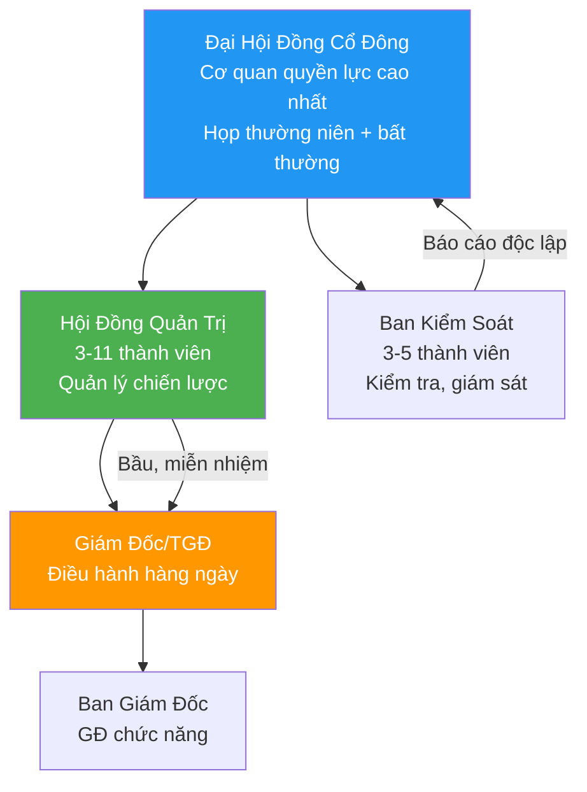
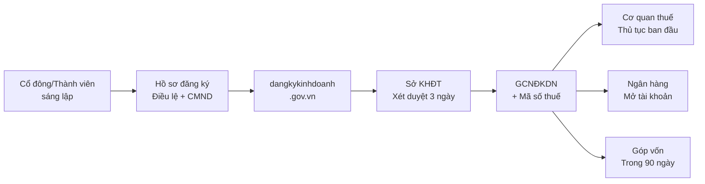
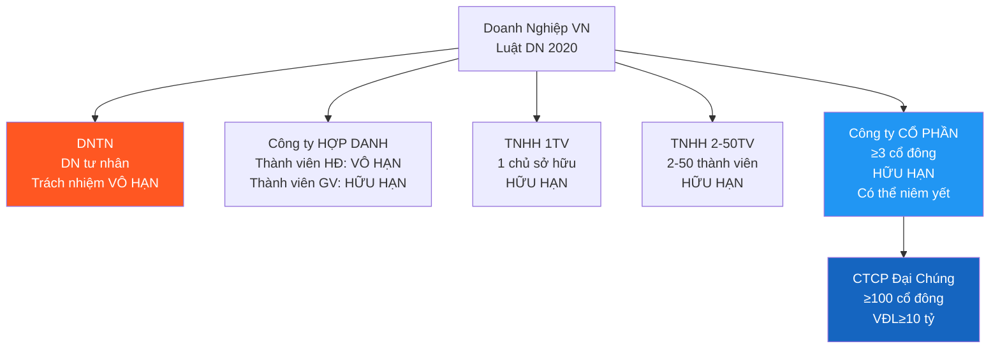

# LW01 — Corporate Law (Luật Doanh Nghiệp)

> **Domain:** Law
> **Level:** Foundation
> **Prerequisites:** Không có
> **Related:** LW02 Investment Law, LW03 Commercial Law, LW04 Labor Law

---

## 1. Mục Tiêu Học Tập (Learning Objectives)

Sau khi hoàn thành module này, người học có thể:

- Phân biệt 5 loại hình doanh nghiệp tại Việt Nam và ưu nhược điểm từng loại
- Mô tả quy trình thành lập doanh nghiệp theo Luật DN 2020
- Hiểu cơ chế quản trị nội bộ CTCP: ĐHĐCĐ, HĐQT, Ban Kiểm soát
- Phân biệt quyền và nghĩa vụ cổ đông trong CTCP
- Nắm nội dung cơ bản của Điều lệ công ty (Charter)
- Hiểu thủ tục giải thể và phá sản doanh nghiệp
- Tư vấn lựa chọn loại hình DN phù hợp với từng trường hợp

---

## 2. Bối Cảnh Doanh Nghiệp (Business Context)

Luật Doanh Nghiệp là nền tảng pháp lý cho mọi hoạt động kinh doanh tại Việt Nam. Lựa chọn sai loại hình doanh nghiệp có thể dẫn đến:

- **Rủi ro trách nhiệm cá nhân:** DNTN chủ sở hữu chịu trách nhiệm vô hạn
- **Khó huy động vốn:** TNHH không phát hành cổ phiếu được
- **Bất lợi thuế:** Một số loại hình bất lợi hơn về nghĩa vụ thuế
- **Quản trị lỏng lẻo:** Không có cơ chế HĐQT/BKS → rủi ro gian lận

Luật DN 2020 (Luật 59/2020/QH14) có hiệu lực từ 1/1/2021, thay thế Luật DN 2014, với nhiều cải tiến quan trọng về quản trị doanh nghiệp.

---

## 3. Định Nghĩa Thuật Ngữ (Definitions)

| Thuật Ngữ | Viết Tắt | Định Nghĩa |
|-----------|---------|------------|
| Công ty TNHH một thành viên | TNHH 1TV | Một cá nhân/tổ chức sở hữu toàn bộ; chủ chịu trách nhiệm hữu hạn trong phần vốn góp |
| Công ty TNHH hai thành viên trở lên | TNHH 2TV+ | 2-50 thành viên; chịu trách nhiệm hữu hạn trong phần vốn góp |
| Công ty Cổ phần | CTCP | Vốn chia thành cổ phần; ≥3 cổ đông; được phát hành chứng khoán |
| Doanh nghiệp tư nhân | DNTN | Một cá nhân sở hữu; chịu trách nhiệm vô hạn bằng toàn bộ tài sản |
| Công ty hợp danh | CTHD | ≥2 thành viên hợp danh chịu trách nhiệm vô hạn; có thể có thành viên góp vốn |
| Đại hội đồng cổ đông | ĐHĐCĐ | Cơ quan quyền lực cao nhất trong CTCP |
| Hội đồng quản trị | HĐQT | Cơ quan quản lý CTCP; 3-11 thành viên |
| Ban kiểm soát | BKS | Cơ quan kiểm soát độc lập trong CTCP |
| Điều lệ công ty | Charter | Văn bản pháp lý nền tảng của công ty |
| Giấy chứng nhận đăng ký DN | GCNĐKDN | Giấy phép hoạt động của DN (trước: Giấy phép KD) |
| Người đại diện pháp luật | NĐDPL | Cá nhân đại diện DN trong quan hệ pháp lý |
| Cổ phần phổ thông | Common Share | Cổ phần cơ bản, 1 cổ phần = 1 phiếu biểu quyết |
| Cổ phần ưu đãi | Preferred Share | Có quyền ưu tiên cổ tức hoặc hoàn vốn |

---

## 4. Khái Niệm Cốt Lõi (Core Concepts)

### 4.1 So Sánh 5 Loại Hình Doanh Nghiệp

```
┌──────────────┬──────────┬──────────┬──────────┬──────────┬──────────┐
│ Tiêu chí     │ DNTN     │ CTHD     │ TNHH 1TV │ TNHH 2TV+│ CTCP     │
├──────────────┼──────────┼──────────┼──────────┼──────────┼──────────┤
│ Thành viên   │ 1 cá nhân│ ≥2 HĐ   │ 1 tổ/cá  │ 2-50     │ ≥3       │
│ Trách nhiệm  │ Vô hạn  │ HĐ: VH  │ Hữu hạn  │ Hữu hạn  │ Hữu hạn  │
│ Phát hành CK │ Không   │ Không   │ Không    │ Không    │ Có       │
│ Niêm yết     │ Không   │ Không   │ Không    │ Không    │ Có thể   │
│ Chuyển nhượng│ Không   │ Hạn chế │ Hạn chế  │ Hạn chế  │ Tự do    │
│ Ưu điểm     │ Đơn giản│ Tin cậy │ Linh hoạt│ Linh hoạt│ Huy động │
│             │         │ cao     │ 1 chủ    │ nhỏ-vừa  │ vốn tốt  │
└──────────────┴──────────┴──────────┴──────────┴──────────┴──────────┘
```

### 4.2 Cơ Cấu Quản Trị CTCP



### 4.3 Cơ Chế Biểu Quyết ĐHĐCĐ

| Vấn Đề | Tỷ Lệ Thông Qua |
|--------|----------------|
| Thông thường (thủ tục, kế hoạch KD) | >50% cổ phần biểu quyết có mặt |
| Loại cổ phần, sửa điều lệ, tổ chức lại, giải thể, ĐTTC >35% tổng TS | ≥65% (Điều lệ có thể quy định cao hơn) |
| Quyết định trọng yếu khác | Theo Điều lệ (thường 75%) |

---

## 5. Giá Trị Doanh Nghiệp (Business Value)

- **Bảo vệ tài sản cá nhân:** TNHH/CTCP tách biệt tài sản chủ với tài sản DN
- **Huy động vốn:** CTCP dễ huy động vốn từ nhiều nhà đầu tư
- **Tín nhiệm thương mại:** Loại hình phù hợp tăng uy tín với đối tác, ngân hàng
- **Kế hoạch kế nghiệp:** CTCP dễ chuyển nhượng quyền sở hữu
- **Thuế tối ưu:** Lựa chọn loại hình ảnh hưởng đến cơ cấu thuế

---

## 6. Vai Trò Trong Doanh Nghiệp (Enterprise Role)

Khung pháp lý Luật DN xác định toàn bộ cơ chế quản trị, quyền lực và trách nhiệm trong doanh nghiệp. Tất cả bộ phận đều chịu ảnh hưởng — từ HR (hợp đồng lao động với NĐDPL), kế toán (kỳ họp ĐHĐCĐ phê duyệt BCTC), đến M&A (chuyển nhượng vốn/cổ phần).

---

## 7. Các Bộ Phận Liên Quan (Departments Related)

| Bộ Phận | Liên Quan Luật DN |
|---------|------------------|
| Pháp chế/Legal | Quản lý hồ sơ pháp lý, điều lệ, nghị quyết HĐQT |
| BGĐ/C-Suite | Chịu sự kiểm soát của HĐQT/ĐHĐCĐ |
| Kế toán | BCTC phải được ĐHĐCĐ phê duyệt |
| HR | Hợp đồng lao động ký bởi NĐDPL |
| Finance | Phát hành cổ phần, vay vốn cần HĐQT/ĐHĐCĐ phê duyệt |

---

## 8. Đầu Vào (Input)

- Ý định kinh doanh và ngành nghề đăng ký
- Thông tin các thành viên/cổ đông sáng lập
- Vốn điều lệ dự kiến
- Địa chỉ trụ sở chính
- Điều lệ công ty dự thảo
- CMND/Hộ chiếu/Giấy phép kinh doanh của cổ đông tổ chức

---

## 9. Đầu Ra (Output)

- Giấy chứng nhận đăng ký doanh nghiệp (GCNĐKDN)
- Điều lệ công ty đã đăng ký
- Con dấu doanh nghiệp
- Mã số thuế (song trùng với mã DN)
- Sổ đăng ký thành viên/cổ đông
- Nghị quyết HĐQT/ĐHĐCĐ (ongoing)

---

## 10. Quy Trình Nghiệp Vụ (Business Process)

### Thành Lập Doanh Nghiệp

```
Bước 1: Chuẩn bị hồ sơ
  → Soạn Điều lệ công ty
  → Danh sách thành viên/cổ đông sáng lập
  → Thông tin ngành nghề kinh doanh (mã ngành VSIC)

Bước 2: Nộp hồ sơ (online hoặc trực tiếp)
  → Portal: dangkykinhdoanh.gov.vn
  → Hoặc Sở Kế hoạch và Đầu tư

Bước 3: Nhận GCNĐKDN (3 ngày làm việc theo luật)

Bước 4: Sau khi có GCNĐKDN
  → Khắc con dấu (thông báo với Cơ quan đăng ký)
  → Khai báo thông tin thuế (Thông báo phát hành hóa đơn)
  → Mở tài khoản ngân hàng
  → Nộp vốn điều lệ (trong 90 ngày kể từ ngày cấp GCNĐKDN)
```

---

## 11. Luồng Dữ Liệu (Data Flow)



---

## 12. Luồng Tiền (Money Flow)

```
Góp vốn điều lệ:
  Cổ đông/TV góp vốn → Tài khoản DN (trong 90 ngày từ khi thành lập)
  → Hạch toán: Dr TK 111/112 / Cr TK 411 (Vốn đầu tư CSH)

Tăng vốn:
  Phát hành cổ phần mới → ĐHĐCĐ phê duyệt → Nhận tiền cổ đông mới
  Phát hành trái phiếu → HĐQT phê duyệt (trái phiếu không chuyển đổi)

Chia cổ tức:
  ĐHĐCĐ thường niên phê duyệt → Công bố cổ tức → Chuyển tiền cho cổ đông
```

---

## 13. Luồng Chứng Từ (Document Flow)

```
Điều lệ công ty → Cơ quan đăng ký → GCNĐKDN
GCNĐKDN → Các giao dịch pháp lý (ký hợp đồng, vay vốn...)
Nghị quyết ĐHĐCĐ → Lưu trữ tại trụ sở + nộp Cơ quan đăng ký (nếu thay đổi)
Sổ đăng ký cổ đông → Cập nhật mỗi khi chuyển nhượng → Cổ phiếu/Chứng chỉ
Hợp đồng chuyển nhượng vốn → Công chứng → Đăng ký thay đổi với SKĐT
```

---

## 14. Vai Trò (Roles)

| Vai Trò | Điều Luật | Trách Nhiệm |
|---------|-----------|-------------|
| Cổ đông phổ thông | Điều 114-120 | Biểu quyết theo cổ phần, nhận cổ tức |
| Cổ đông lớn (≥5%) | Điều 115 | Quyền đặc biệt: đề cử HĐQT, tiếp cận tài liệu |
| Thành viên HĐQT | Điều 153-165 | Quản trị chiến lược, giám sát BGĐ |
| Chủ tịch HĐQT | Điều 156 | Triệu tập và chủ trì họp HĐQT |
| Tổng Giám đốc | Điều 162 | Điều hành hàng ngày, chịu trách nhiệm trước HĐQT |
| Thành viên BKS | Điều 168-172 | Kiểm tra, kiểm soát hoạt động HĐQT, BGĐ |

---

## 15. Trách Nhiệm (Responsibilities)

- **HĐQT (Điều 153):** Quản trị công ty, quyết định chiến lược, giám sát TGĐ
- **TGĐ/GĐ (Điều 162):** Điều hành hàng ngày, ký kết hợp đồng trong phạm vi ủy quyền
- **BKS (Điều 168):** Kiểm tra tính hợp pháp, hợp lý của BCTC và quyết định quản lý
- **Cổ đông (Điều 114-120):** Góp vốn đủ và đúng hạn; không rút vốn trái pháp luật

---

## 16. Ma Trận RACI

| Hoạt Động | ĐHĐCĐ | HĐQT | TGĐ | BKS | Pháp chế |
|-----------|:---:|:---:|:---:|:---:|:---:|
| Phê duyệt chiến lược 5 năm | A | R | C | C | - |
| Bổ nhiệm TGĐ | A | R | - | C | - |
| Ký hợp đồng lớn (>10% TS) | A | R | C | C | C |
| BCTC năm | A | R | C | R | C |
| Tăng vốn điều lệ | A | R | C | C | R |
| Chia cổ tức | A | R | C | C | - |
| Giải thể công ty | A | R | C | C | R |

---

## 17. Frameworks

- **Agency Theory:** Mâu thuẫn lợi ích giữa cổ đông (principal) và BGĐ (agent) → cần HĐQT, BKS kiểm soát
- **Stewardship Theory:** BGĐ là người quản lý tốt — cần empowerment, không cần kiểm soát quá mức
- **Stakeholder Theory:** DN có trách nhiệm với nhiều bên: cổ đông, NLĐ, cộng đồng, khách hàng
- **Corporate Governance Codes:** OECD Principles of Corporate Governance, IFC Corporate Governance

---

## 18. Chuẩn Mực Quốc Tế (International Standards)

| Framework | Nội Dung | Áp Dụng VN |
|-----------|----------|------------|
| OECD Principles of Corporate Governance | 6 nguyên tắc quản trị | Tham chiếu trong QĐ 27/2021 |
| IFC Corporate Governance Toolkit | Thực hành tốt nhất | Dành cho DN tư nhân |
| UN Guiding Principles on Business & HR | Trách nhiệm DN với nhân quyền | MNC áp dụng |
| ISO 37000:2021 | Governance of Organizations | Tiêu chuẩn quản trị tổ chức |

---

## 19. Bối Cảnh Việt Nam (Vietnam Context)

### Luật Doanh Nghiệp 2020 — Điểm Mới Quan Trọng

| Điểm Mới | Nội Dung | Tác Động |
|----------|----------|---------|
| Bỏ giấy phép đối với ngành không cần điều kiện | Cải cách hành chính | Thành lập nhanh hơn |
| Thành viên độc lập HĐQT | CTCP đại chúng bắt buộc | Cải thiện quản trị |
| Không cần công bố thông tin đăng ký trên báo giấy | Chỉ đăng trên CỔNG | Tiết kiệm chi phí |
| CTCP có thể có 1 người đại diện pháp luật | Giảm từ nhiều NĐDPL | Đơn giản hóa |
| Bổ sung loại CP ưu đãi hoàn lại | Tăng loại CK | Linh hoạt hơn |

### Đặc Thù Loại Hình DN VN

| Đặc Điểm | Mô Tả |
|----------|-------|
| TNHH 1TV do tổ chức làm chủ | Phổ biến với DN FDI (100% vốn nước ngoài) |
| CTCP đại chúng | ≥100 cổ đông và vốn điều lệ ≥10 tỷ → chịu quản lý UBCKNN |
| DN nhà nước | Nhà nước nắm ≥51% vốn → quy định quản trị riêng |
| Hộ kinh doanh | Không phải "DN" theo luật, chịu trách nhiệm VH, doanh thu ≤ 100 tỷ |

### Thống Kê DN VN (2024)

- Tổng số DN đăng ký: ~1 triệu
- Phổ biến nhất: TNHH (~70%), CTCP (~25%), DNTN (~5%)
- Vốn đăng ký thực góp: Nhiều vấn đề với vốn ảo, góp chậm

---

## 20. Vấn Đề Pháp Lý (Legal Considerations)

### Điều Khoản Quan Trọng Luật DN 2020

- **Điều 17:** Quyền thành lập DN
- **Điều 47-70:** Công ty TNHH 2TV trở lên
- **Điều 73-86:** Công ty TNHH 1TV
- **Điều 111-209:** Công ty Cổ phần
- **Điều 188-195:** Doanh nghiệp tư nhân
- **Điều 177-187:** Công ty hợp danh
- **Điều 207-218:** Tổ chức lại DN (chia, tách, hợp nhất, sáp nhập, chuyển đổi)
- **Điều 207-212:** Giải thể DN
- **Điều 213-230:** Phá sản (Luật Phá sản 2014)

### Trách Nhiệm Dân Sự và Hình Sự

- **HĐQT:** Có thể bị kiện cá nhân nếu vi phạm fiduciary duty gây thiệt hại cho DN (Điều 164)
- **TGĐ:** Chịu trách nhiệm về thiệt hại do quyết định sai (Điều 165)
- **Cổ đông lớn lạm quyền:** Có thể bị yêu cầu bồi thường (Điều 166)
- **Tội kinh tế:** Vi phạm nghiêm trọng có thể bị truy cứu theo BLHS

---

## 21. Sai Lầm Phổ Biến (Common Mistakes)

| Sai Lầm | Hậu Quả | Cách Tránh |
|---------|---------|------------|
| Chọn DNTN để đơn giản, không biết rủi ro vô hạn | Chủ mất nhà, tài sản cá nhân khi DN vỡ nợ | Chọn TNHH hoặc CTCP |
| Điều lệ sao chép mẫu, không tùy chỉnh | Xung đột cổ đông không có cơ chế giải quyết | Thuê luật sư soạn Điều lệ riêng |
| Không có Shareholder Agreement | Khi xung đột không có cơ sở pháp lý | Ký SHA ngay từ đầu |
| Không tổ chức họp ĐHĐCĐ đúng hạn | Vi phạm Luật DN, quyết định vô hiệu | Lập lịch họp đầu năm |
| Góp vốn bằng tài sản không định giá đúng | Vốn ảo, trách nhiệm pháp lý | Định giá độc lập |
| NĐDPL ở nước ngoài không ủy quyền | DN không thể hoạt động | Luôn có ủy quyền dự phòng |

---

## 22. Thực Hành Tốt Nhất (Best Practices)

1. **Điều lệ chi tiết:** Quy định rõ cơ chế deadlock, quyền drag-along/tag-along, right of first refusal
2. **Shareholder Agreement (SHA):** Bổ sung những gì Điều lệ không thể quy định (bảo mật)
3. **HĐQT độc lập:** Ít nhất 1/3 thành viên độc lập (thực hành tốt, CTCP đại chúng bắt buộc)
4. **Biên bản họp đầy đủ:** Mọi quyết định quan trọng phải có biên bản HĐQT/ĐHĐCĐ
5. **Corporate Secretary:** Bổ nhiệm thư ký công ty quản lý hồ sơ pháp lý
6. **Annual review Điều lệ:** Cập nhật khi luật thay đổi hoặc DN phát triển mới

---

## 23. KPIs

| KPI | Mô Tả | Target |
|-----|-------|--------|
| Board Meeting Compliance | % họp HĐQT đúng quy định tần suất | 100% |
| AGM Compliance | ĐHĐCĐ thường niên tổ chức trong 4 tháng đầu năm | 100% |
| Corporate Filing Timeliness | % thay đổi đăng ký nộp đúng hạn | 100% |
| Independent Director Ratio | % thành viên HĐQT độc lập | ≥1/3 (CTCP đại chúng) |
| Capital Contribution Compliance | Vốn góp đúng cam kết trong 90 ngày | 100% |

---

## 24. Metrics

- **Số cổ đông kiểm soát vs. thiểu số:** Cân bằng quyền lực
- **Tỷ lệ cổ đông tham dự ĐHĐCĐ:** Sức khỏe quản trị
- **Số lần họp HĐQT/năm:** ≥4 lần/năm là thực hành tốt
- **Tỷ lệ vi phạm quản trị bị phạt:** Rủi ro pháp lý
- **Time to incorporate:** Số ngày từ nộp hồ sơ đến nhận GCNĐKDN (target: 3-5 ngày)

---

## 25. Báo Cáo (Reports)

| Báo Cáo | Tần Suất | Đối Tượng |
|---------|----------|-----------|
| Biên bản họp HĐQT | Mỗi cuộc họp | Thành viên HĐQT, lưu hồ sơ |
| Nghị quyết ĐHĐCĐ | Hàng năm (thường niên) + bất thường | Cổ đông, cơ quan đăng ký |
| Báo cáo BKS | Hàng năm tại ĐHĐCĐ | Cổ đông |
| Báo cáo quản trị (CTCP đại chúng) | Hàng năm | UBCKNN, cổ đông |
| Sổ đăng ký cổ đông | Cập nhật liên tục | Nội bộ, cơ quan đăng ký |

---

## 26. Mẫu Biểu (Templates)

### Template Điều Lệ CTCP — Mục Lục Tối Thiểu

```
ĐIỀU LỆ CÔNG TY CỔ PHẦN [TÊN]

Chương I: Quy định chung
  - Tên, địa chỉ, MST
  - Ngành nghề kinh doanh
  - Vốn điều lệ, mệnh giá cổ phần
  - Thời hạn hoạt động

Chương II: Cổ phần và cổ đông
  - Các loại cổ phần
  - Quyền và nghĩa vụ cổ đông
  - Chuyển nhượng cổ phần

Chương III: Đại hội đồng cổ đông
  - Thẩm quyền
  - Điều kiện họp và thông qua quyết định
  - Thể thức biểu quyết

Chương IV: Hội đồng quản trị
  - Số lượng, nhiệm kỳ
  - Thẩm quyền HĐQT
  - Chủ tịch HĐQT

Chương V: Giám đốc/TGĐ
  - Thẩm quyền
  - Điều kiện, tiêu chuẩn

Chương VI: Ban kiểm soát
  - Nhiệm vụ và quyền hạn

Chương VII: Tài chính
  - Năm tài chính, BCTC
  - Phân phối lợi nhuận

Chương VIII: Tổ chức lại và giải thể
```

---

## 27. Checklists

### Checklist Thành Lập CTCP

- [ ] Xác định ≥3 cổ đông sáng lập
- [ ] Thỏa thuận vốn điều lệ, tỷ lệ góp vốn
- [ ] Soạn Điều lệ công ty (thuê luật sư)
- [ ] Ký Shareholder Agreement nếu có thỏa thuận đặc biệt
- [ ] Chuẩn bị CMND/Căn cước của tất cả cổ đông
- [ ] Nộp hồ sơ online qua dangkykinhdoanh.gov.vn
- [ ] Nhận GCNĐKDN (3 ngày làm việc)
- [ ] Khắc con dấu + thông báo sử dụng con dấu
- [ ] Mở tài khoản ngân hàng
- [ ] Khai báo thuế ban đầu (phương pháp tính thuế, kỳ khai thuế)
- [ ] Góp vốn trong 90 ngày
- [ ] Đăng ký phát hành hóa đơn điện tử

---

## 28. Quy Trình Chuẩn (SOP)

### SOP: Tổ Chức ĐHĐCĐ Thường Niên

1. **Trước 30 ngày:** Thông báo họp bằng văn bản cho cổ đông (địa điểm, thời gian, chương trình)
2. **Trước 10 ngày:** Gửi tài liệu họp (BCTC, báo cáo HĐQT, BKS, tờ trình)
3. **Ngày họp:** Kiểm tra tư cách, điều kiện họp (≥51% số cổ phần biểu quyết)
4. **Trong họp:** Thảo luận theo chương trình; biểu quyết từng vấn đề; ghi biên bản
5. **Sau họp (trong 15 ngày):** Gửi biên bản + nghị quyết cho cổ đông vắng mặt
6. **Đăng ký thay đổi (nếu có):** Nộp Sở KHĐT trong 10 ngày với quyết định thay đổi

---

## 29. Tình Huống Thực Tế (Case Study)

### Case: Tranh Chấp Cổ Đông CTCP ABC — Vấn Đề Deadlock

**Bối cảnh:** CTCP ABC có 2 nhóm cổ đông: Nhóm A (50%) và Nhóm B (50%). Nhóm A muốn mở rộng sang BĐS, Nhóm B muốn tập trung sản xuất. ĐHĐCĐ liên tục bế tắc, không ra được quyết định.

**Vấn đề pháp lý:** Điều lệ không có cơ chế giải quyết deadlock.

**Giải pháp:**
1. **Ngắn hạn:** Thuê mediator trung gian hòa giải
2. **Trung hạn:** Sửa Điều lệ → thêm deadlock clause: nếu biểu quyết hòa 50/50, Chủ tịch HĐQT có quyền quyết định cuối cùng (cho một số vấn đề)
3. **Dài hạn:** Phân tách công ty (spin-off) để mỗi nhóm theo đuổi chiến lược riêng

**Bài học:** Điều lệ và SHA phải có cơ chế giải quyết xung đột từ khi thành lập.

---

## 30. Ví Dụ Doanh Nghiệp Nhỏ (Small Business Example)

**Chuyển Đổi Hộ Kinh Doanh Thành Công Ty TNHH 1TV**

Anh Nguyễn Văn A kinh doanh cà phê (hộ cá thể), doanh thu 3 tỷ/năm, muốn mở rộng → vay vốn ngân hàng → ngân hàng yêu cầu có pháp nhân.

**Quy trình chuyển đổi:**
1. Thành lập Công ty TNHH 1TV (vốn 500 triệu)
2. Chuyển tài sản hộ KD sang công ty (có định giá)
3. Đóng hộ kinh doanh
4. Ngân hàng chấp thuận cho vay vì có pháp nhân rõ ràng

**Lợi ích:** Tách biệt tài sản cá nhân, tiếp cận vốn tốt hơn, chuyên nghiệp hơn với đối tác.

---

## 31. Ví Dụ Doanh Nghiệp Lớn (Enterprise Example)

**Vinamilk (CTCP) — Mô Hình Quản Trị**

- Vốn điều lệ: ~17,400 tỷ VND
- Cổ đông lớn: SCIC (36%), F&N (18%), Tổ chức nước ngoài khác
- HĐQT: 7 thành viên, bao gồm 2 thành viên độc lập
- BKS: 3 thành viên
- ĐHĐCĐ thường niên: Tổ chức đúng quy định hàng năm

Thách thức quản trị:
- Xung đột tiềm năng giữa SCIC (nhà nước) và cổ đông nước ngoài (F&N)
- Quyết định chiến lược cần ≥65% → F&N và SCIC phải đồng thuận
- Kết quả: Cân bằng lợi ích, quản trị tốt, cổ tức ổn định

---

## 32. ERP Mapping

| Quy Trình Pháp Lý | Hệ Thống Hỗ Trợ |
|------------------|-----------------|
| Quản lý hồ sơ pháp lý | SharePoint, DocuWare, iManage |
| Theo dõi deadline pháp lý | Legal calendar trong Outlook/Google |
| Quản lý cổ đông/chuyển nhượng | Share register software (VinaShare, SharePoint custom) |
| Biên bản họp HĐQT | Diligent, BoardEffect, eBoardMeeting |
| Quản lý Điều lệ versions | Document management system |

---

## 33. Tự Động Hóa (Automation)

| Quy Trình | Giải Pháp | Lợi Ích |
|-----------|-----------|---------|
| Thông báo cổ đông | Email automation + e-Signature (DocuSign) | Nhanh, có audit trail |
| Biểu quyết điện tử | Online voting platform | Cổ đông không cần đến họp |
| Quản lý sổ cổ đông | Digital share register | Chính xác, cập nhật real-time |
| Deadline pháp lý | Legal calendar automation | Không bỏ lỡ deadline |
| Corporate filings | E-filing portal SKĐT | Nộp trực tuyến |

---

## 34. Cơ Hội AI (AI Opportunities)

- **Contract/Charter Review AI:** AI đọc Điều lệ, phát hiện điều khoản thiếu hoặc bất thường
- **Corporate Governance Scoring:** AI đánh giá mức độ tuân thủ quản trị so với best practice
- **Meeting Minutes Generation:** AI ghi và tổng hợp biên bản họp từ audio/transcript
- **Regulatory Change Monitoring:** AI theo dõi thay đổi Luật DN, cập nhật alert cho pháp chế
- **Shareholder Analysis:** AI phân tích cơ cấu sở hữu, phát hiện rủi ro tập trung

---

## 35. Hướng Dẫn Triển Khai (Implementation Guide)

### Thiết Lập Hệ Thống Quản Trị Doanh Nghiệp

**Giai đoạn 1 — Nền tảng pháp lý:**
- Soạn Điều lệ chi tiết, SHA (nếu có nhiều cổ đông)
- Đăng ký thành lập đúng quy trình

**Giai đoạn 2 — Cơ cấu quản trị:**
- Bổ nhiệm HĐQT, BKS đúng luật
- Xây dựng Quy chế quản trị nội bộ
- Thiết lập lịch họp HĐQT và ĐHĐCĐ

**Giai đoạn 3 — Hệ thống:**
- Phần mềm quản lý hồ sơ pháp lý
- Hệ thống biên bản họp và nghị quyết
- Dashboard theo dõi deadline pháp lý

---

## 36. Hướng Dẫn Tư Vấn (Consulting Guide)

### Tư Vấn Lựa Chọn Loại Hình DN

**Câu hỏi chẩn đoán:**
1. Có bao nhiêu người sáng lập?
2. Kế hoạch huy động vốn bên ngoài không? (→ CTCP)
3. Có cần bảo vệ tài sản cá nhân không? (→ TNHH/CTCP)
4. Có kế hoạch niêm yết không? (→ CTCP)
5. Quy mô kinh doanh dự kiến (nhỏ: TNHH, lớn: CTCP)

**Ma trận quyết định:**
- 1 người, nhỏ, không huy động vốn → TNHH 1TV
- 2-50 người, vừa, không cần chứng khoán → TNHH 2TV+
- ≥3 người, lớn, có kế hoạch huy động/niêm yết → CTCP

---

## 37. Câu Hỏi Chẩn Đoán (Diagnostic Questions)

1. DN đang là loại hình gì? Điều lệ có phù hợp với thực tế hoạt động không?
2. HĐQT có hoạt động thực chất không? Có đủ số cuộc họp/năm?
3. ĐHĐCĐ thường niên có tổ chức đúng hạn không?
4. Có Shareholder Agreement không? Có cơ chế deadlock không?
5. Ai là NĐDPL? Đang ở đâu? Có ủy quyền dự phòng không?
6. Vốn điều lệ đã được góp đủ chưa? Bằng tiền mặt hay tài sản khác?
7. Có cổ đông nào nắm > 65% không? (→ rủi ro quyết định đơn phương)
8. BKS có hoạt động hiệu quả không? (thường là điểm yếu của DN VN)

---

## 38. Câu Hỏi Phỏng Vấn (Interview Questions)

**Nhân viên pháp chế:**
- Phân biệt TNHH và CTCP về cơ cấu quản trị?
- ĐHĐCĐ họp bất thường khi nào và thủ tục như thế nào?
- Thủ tục chuyển nhượng cổ phần trong CTCP khác gì với TNHH?

**Luật sư doanh nghiệp:**
- Những điều khoản nào trong Điều lệ quan trọng nhất khi có nhiều cổ đông?
- Khi nào cần Shareholder Agreement thay vì chỉ Điều lệ?
- Cơ chế bảo vệ cổ đông thiểu số trong Luật DN 2020?

**CFO/CEO:**
- Tại sao quản trị công ty tốt ảnh hưởng đến chi phí vốn (cost of capital)?
- Khi nào nên chuyển từ TNHH sang CTCP?

---

## 39. Bài Tập (Exercises)

**Bài 1:** 3 người bạn muốn lập công ty IT. Phân tích và đề xuất loại hình DN phù hợp, giải thích lý do.

**Bài 2:** CTCP có 4 cổ đông: A (40%), B (30%), C (20%), D (10%). Tính xem ai cần liên minh để thông qua quyết định thay đổi Điều lệ (cần 65%)?

**Bài 3:** Đọc mẫu Điều lệ CTCP và xác định 5 điều khoản có thể gây tranh chấp nếu không được quy định rõ.

**Bài 4:** Vẽ sơ đồ cơ cấu quản trị cho một tập đoàn có công ty mẹ và 5 công ty con.

---

## 40. Tài Liệu Tham Khảo (References)

- Luật Doanh Nghiệp 2020 — Luật 59/2020/QH14 (hiệu lực 1/1/2021)
- NĐ 01/2021/NĐ-CP — Đăng ký doanh nghiệp
- NĐ 47/2021/NĐ-CP — Chi tiết Luật DN
- Luật Phá sản 2014 — Luật 51/2014/QH13
- Luật Chứng khoán 2019 (cho CTCP đại chúng)
- NĐ 155/2020/NĐ-CP — Hướng dẫn Luật CK (quản trị CTCP đại chúng)
- OECD Principles of Corporate Governance 2023
- Bộ Kế hoạch & Đầu tư: mpi.gov.vn
- Portal đăng ký DN: dangkykinhdoanh.gov.vn

---

## Output Formats

### A. Mermaid — Cơ Cấu 5 Loại Hình DN



### B. ASCII — Cơ Cấu CTCP Quản Trị

```
CTCP — CƠ CẤU QUẢN TRỊ 2 CẤP

┌─────────────────────────────────────┐
│    ĐẠI HỘI ĐỒNG CỔ ĐÔNG (ĐHĐCĐ)   │
│    Cơ quan quyền lực cao nhất       │
│    Họp ≥1 lần/năm (thường niên)     │
└──────────────┬──────────────────────┘
               │ Bầu/Miễn nhiệm
       ┌───────┴────────┐
       ▼                ▼
┌────────────┐  ┌──────────────────┐
│   HĐQT    │  │   BAN KIỂM SOÁT  │
│ 3-11 TV   │  │   3-5 thành viên │
│ Quản trị  │  │   Kiểm soát độc  │
│ chiến lược│  │   lập HĐQT/BGĐ  │
└─────┬──────┘  └──────────────────┘
      │ Bổ nhiệm          ▲
      ▼                   │ Báo cáo
┌────────────────────┐    │
│  GIÁM ĐỐC/TGĐ     │────┘
│  Điều hành hàng ngày
│  Ký HĐ trong thẩm quyền
└────────────────────┘
```

### C. Flashcards

**Q1:** CTCP và TNHH khác nhau ở điểm gì quan trọng nhất?
**A1:** CTCP có thể phát hành chứng khoán (cổ phiếu, trái phiếu) ra công chúng và niêm yết trên sàn chứng khoán — đây là ưu điểm lớn nhất khi cần huy động vốn quy mô lớn. TNHH không phát hành cổ phiếu được và việc chuyển nhượng phần vốn góp bị hạn chế hơn.

**Q2:** Ngưỡng biểu quyết nào quan trọng nhất trong ĐHĐCĐ?
**A2:** 65% — ngưỡng cho các quyết định trọng yếu: sửa đổi Điều lệ, tổ chức lại DN, giải thể, đầu tư/bán tài sản lớn. Cổ đông nắm 35%+ có quyền phủ quyết (veto) các quyết định này — đây là "blocking minority" quan trọng trong M&A.

**Q3:** Tại sao nên có Shareholder Agreement ngoài Điều lệ?
**A3:** Điều lệ là văn bản công khai, đăng ký với cơ quan nhà nước. SHA là thỏa thuận riêng giữa các cổ đông, có thể quy định các vấn đề nhạy cảm: cơ chế deadlock, điều khoản lock-up, drag-along/tag-along rights, anti-dilution, exit rights. SHA không cần đăng ký nhưng có giá trị pháp lý giữa các bên.

### D. Cheat Sheet

```
CORPORATE LAW VN — CHEAT SHEET

5 LOẠI HÌNH DN:
  DNTN: 1 cá nhân, trách nhiệm VÔ HẠN, không phát hành CK
  Hợp danh: ≥2 thành viên HĐ (VH), có thể có TV góp vốn (hữu hạn)
  TNHH 1TV: 1 chủ, HỮU HẠN, không CK
  TNHH 2TV+: 2-50 TV, HỮU HẠN, không CK  
  CTCP: ≥3 CĐ, HỮU HẠN, có thể phát hành CK, niêm yết

BIỂU QUYẾT ĐHĐCĐ:
  Thông thường: >50% cổ phần BQ có mặt
  Trọng yếu (sửa ĐL, tổ chức lại, giải thể): ≥65%

CƠ CẤU CTCP: ĐHĐCĐ → HĐQT (3-11 TV) + BKS (3-5 TV) → TGĐ
LUẬT: Luật DN 2020 (Luật 59/2020/QH14), hiệu lực 1/1/2021
THÀNH LẬP: 3 ngày LV, nộp online dangkykinhdoanh.gov.vn
GÓP VỐN: Trong 90 ngày từ khi cấp GCNĐKDN
```

### E. JSON Metadata

```json
{
  "module": {
    "code": "LW01",
    "name": "Corporate Law",
    "name_vi": "Luật Doanh Nghiệp",
    "domain": "Law",
    "level": "Foundation",
    "estimated_hours": 10,
    "prerequisites": [],
    "related_modules": ["LW02", "LW03", "LW04", "LW05"],
    "key_laws_vn": [
      "Luat DN 2020 - Luat 59/2020/QH14",
      "ND 01/2021/ND-CP - Dang ky DN",
      "ND 47/2021/ND-CP",
      "Luat Pha san 2014",
      "Luat Chung khoan 2019"
    ],
    "entity_types": [
      "DNTN - Doanh nghiep tu nhan",
      "Cong ty hop danh",
      "TNHH 1 thanh vien",
      "TNHH 2 thanh vien tro len",
      "Cong ty Co phan"
    ],
    "key_thresholds": {
      "ordinary_resolution": "tren 50%",
      "special_resolution": "65% tro len",
      "blocking_minority": "35%+",
      "capital_contribution_deadline": "90 ngay",
      "max_members_TNHH": 50,
      "min_shareholders_CTCP": 3
    },
    "portal": "dangkykinhdoanh.gov.vn",
    "last_updated": "2026-06-30",
    "status": "complete",
    "sections_count": 40,
    "output_formats": ["mermaid", "ascii", "flashcards", "cheatsheet", "json"]
  }
}
```
