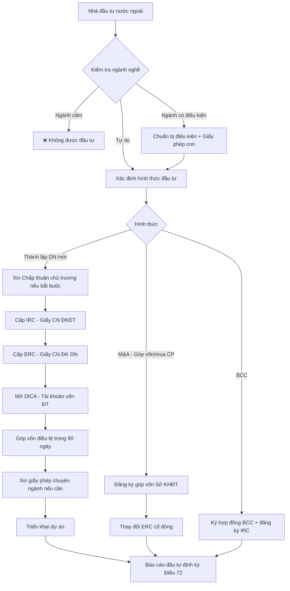

# LW02 — Luật Đầu Tư

> **Luật Đầu Tư** là hệ thống quy phạm pháp luật điều chỉnh hoạt động đầu tư kinh doanh tại Việt Nam, bao gồm các hình thức đầu tư, thủ tục hành chính, ngành nghề có điều kiện, ưu đãi đầu tư và cơ chế giải quyết tranh chấp giữa nhà đầu tư và Nhà nước. Đây là nền tảng pháp lý thiết yếu cho mọi doanh nghiệp FDI và nhà đầu tư trong nước.

---

## 1. Định nghĩa & Tầm Quan Trọng

**Đầu tư kinh doanh** (Điều 3 Luật Đầu Tư 2020) là việc nhà đầu tư bỏ vốn để thực hiện hoạt động kinh doanh thông qua việc thành lập tổ chức kinh tế; đầu tư góp vốn, mua cổ phần, mua phần vốn góp của tổ chức kinh tế; hoặc thực hiện dự án đầu tư.

**Tầm quan trọng đối với doanh nghiệp:**

| Đối tượng | Vai trò của Luật Đầu Tư |
|-----------|------------------------|
| FDI (Foreign Direct Investment) | Xác định hình thức, điều kiện, ưu đãi cho nhà đầu tư nước ngoài |
| Doanh nghiệp trong nước | Quy trình cấp phép, bảo hộ quyền lợi nhà đầu tư |
| Nhà nước | Công cụ quản lý dòng vốn, định hướng phát triển kinh tế |
| M&A | Khung pháp lý kiểm soát mua lại/sáp nhập có yếu tố nước ngoài |

**Văn bản pháp luật chính:**
- **Luật Đầu Tư số 61/2020/QH14** — hiệu lực 01/01/2021 (thay thế Luật ĐT 67/2014)
- **Nghị định 31/2021/NĐ-CP** — hướng dẫn thi hành Luật Đầu Tư 2020
- **Luật Doanh Nghiệp số 59/2020/QH14** — song hành với Luật Đầu Tư
- **Luật PPP số 64/2020/QH14** — đầu tư theo phương thức đối tác công-tư
- **Nghị định 35/2022/NĐ-CP** — quản lý khu công nghiệp, khu kinh tế

---

## 2. Lịch Sử & Nguồn Gốc

### Timeline pháp lý đầu tư VN

```
1987 — Luật Đầu tư nước ngoài đầu tiên (thời kỳ Đổi Mới)
1996 — Luật Đầu tư nước ngoài sửa đổi + Luật Khuyến khích đầu tư trong nước
2000 — Luật Đầu tư nước ngoài hợp nhất, mở rộng lĩnh vực
2005 — Luật Đầu tư thống nhất (số 59/2005) — lần đầu áp dụng chung trong/ngoài nước
2014 — Luật Đầu tư 67/2014 — cải cách mạnh, bãi bỏ nhiều điều kiện
2020 — Luật Đầu tư 61/2020 — số hóa, minh bạch hóa, phù hợp cam kết FTA
```

### Bối cảnh gia nhập FTA

Việt Nam đã ký kết 17 FTA tính đến 2024, trong đó:
- **EVFTA** (2020): chuẩn EU về bảo hộ đầu tư, ICS (Investment Court System)
- **CPTPP** (2019): Chương 9 về đầu tư, ISDS cao cấp
- **RCEP** (2022): tự do hóa đầu tư trong ASEAN+5
- **BIT với 65 quốc gia**: điều ước song phương bảo hộ đầu tư

---

## 3. Các Khái Niệm Cốt Lõi

| Khái niệm | Định nghĩa | Điều khoản |
|-----------|-----------|-----------|
| Nhà đầu tư | Tổ chức/cá nhân thực hiện hoạt động đầu tư kinh doanh | Điều 3.18 |
| Dự án đầu tư | Tập hợp đề xuất bỏ vốn để thực hiện hoạt động SX-KD | Điều 3.4 |
| Vốn đầu tư | Tiền, tài sản khác để thực hiện dự án | Điều 3.26 |
| IRC | Investment Registration Certificate — Giấy chứng nhận đăng ký đầu tư | Điều 3.23 |
| ERC | Enterprise Registration Certificate — Giấy chứng nhận đăng ký doanh nghiệp | Luật DN |
| Chấp thuận chủ trương đầu tư | Văn bản cho phép nghiên cứu, đề xuất thực hiện dự án | Điều 3.7 |
| FDI | Foreign Direct Investment — đầu tư trực tiếp nước ngoài | — |
| BCC | Business Cooperation Contract — hợp đồng hợp tác kinh doanh | Điều 3.2 |
| PPP | Public-Private Partnership — đối tác công-tư | Luật PPP 64/2020 |

---

## 4. Khung Pháp Lý & Văn Bản Quy Phạm

### Hệ thống văn bản đầu tư

```
HIẾN PHÁP 2013
    └── Luật Đầu Tư 61/2020/QH14
            ├── NĐ 31/2021/NĐ-CP (hướng dẫn chung)
            ├── NĐ 35/2022/NĐ-CP (KCN, KKT)
            ├── TT 03/2021/TT-BKHĐT (mẫu văn bản)
            └── Các luật chuyên ngành
                    ├── Luật DN 59/2020
                    ├── Luật PPP 64/2020
                    ├── Luật Đất đai 31/2024
                    ├── Luật Xây dựng 50/2014 (sửa đổi 2020)
                    └── Luật Cạnh tranh 23/2018
```

### Phân cấp thẩm quyền

| Cơ quan | Thẩm quyền |
|---------|-----------|
| Quốc hội | Chấp thuận chủ trương dự án đặc biệt quan trọng (>10.000 tỷ VNĐ, an ninh quốc gia, di sản) |
| Thủ tướng Chính phủ | Dự án đặc biệt quy định tại Điều 30 Luật ĐT 2020 |
| UBND cấp tỉnh | Dự án thông thường ngoài khu công nghiệp |
| Ban Quản lý KCN/KKT | Dự án trong khu công nghiệp, khu kinh tế |

---

## 5. Quy Trình Thực Hiện / Trình Tự Pháp Lý

### Quy trình đầu tư FDI tiêu chuẩn

```
BƯỚC 1: Nghiên cứu khả thi & Lựa chọn hình thức đầu tư
    ├── Phân tích ngành nghề: Cấm / Có điều kiện / Tự do
    ├── Xác định quy mô → phân cấp thẩm quyền
    └── Lựa chọn hình thức: Công ty 100% FDI / JV / BCC / M&A

BƯỚC 2: Chấp thuận chủ trương đầu tư (nếu bắt buộc)
    ├── Hồ sơ: Đề xuất dự án + FS (feasibility study) + các tài liệu theo Điều 33
    ├── Nộp tại: UBND tỉnh / Bộ KHĐT (dự án thuộc thẩm quyền TT/QH)
    └── Thời hạn: 25-45 ngày (UBND tỉnh) / 60-90 ngày (TT/QH)

BƯỚC 3: Cấp Giấy Chứng Nhận Đăng Ký Đầu Tư (IRC)
    ├── Hồ sơ: Đề xuất dự án, giải trình năng lực tài chính, điều lệ, tư cách pháp lý
    ├── Nộp tại: Sở KHĐT / Ban QL KCN
    └── Thời hạn: 15 ngày làm việc

BƯỚC 4: Cấp Giấy Chứng Nhận Đăng Ký Doanh Nghiệp (ERC)
    ├── Hồ sơ theo Luật DN 2020
    ├── Nộp tại: Sở KHĐT (Phòng ĐKDN)
    └── Thời hạn: 3 ngày làm việc

BƯỚC 5: Đăng ký con dấu, mã số thuế, tài khoản ngân hàng
    └── 5-10 ngày làm việc

BƯỚC 6: Xin giấy phép chuyên ngành (nếu có)
    └── Tùy ngành nghề: 30-90 ngày

BƯỚC 7: Triển khai dự án
    └── Báo cáo định kỳ theo Điều 72 Luật ĐT 2020
```

### Dự án không cần Chấp thuận chủ trương đầu tư (Điều 39)

Theo Điều 39 Luật ĐT 2020, dự án **không** phải xin chấp thuận chủ trương nếu:
- Thuộc khu công nghiệp, khu chế xuất đã thành lập
- Dự án dưới ngưỡng quy mô nhất định
- Không thuộc các lĩnh vực nhạy cảm tại Điều 30, 31, 32

---

## 6. Các Hình Thức & Phân Loại

### 6.1 Phân loại theo đối tượng nhà đầu tư

**Nhà đầu tư trong nước (DDI):**
- Tổ chức kinh tế không có vốn nước ngoài
- Cá nhân mang quốc tịch VN

**Nhà đầu tư nước ngoài (FDI) — Điều 3.18:**
- Tổ chức/cá nhân nước ngoài
- Tổ chức kinh tế có ≥51% vốn điều lệ do nhà đầu tư nước ngoài nắm giữ → áp dụng điều kiện như nhà đầu tư nước ngoài (Điều 23.1a)

### 6.2 Hình thức đầu tư (Điều 21)

**Hình thức 1: Thành lập tổ chức kinh tế**
- Công ty TNHH 1 thành viên / 2 thành viên
- Công ty Cổ phần
- Công ty Hợp danh / Doanh nghiệp tư nhân
- Yêu cầu: phải có IRC trước khi cấp ERC (với nhà đầu tư nước ngoài)

**Hình thức 2: Góp vốn / Mua cổ phần / Mua phần vốn góp (M&A)**
- Không cần IRC — chỉ cần đăng ký góp vốn theo Điều 26
- Hạn chế tỷ lệ sở hữu theo từng ngành nghề
- Phải đăng ký với Sở KHĐT nếu tỷ lệ sở hữu nước ngoài vượt ngưỡng

**Hình thức 3: Hợp đồng BCC (Business Cooperation Contract)**
- Không thành lập pháp nhân mới
- Hai bên ký kết hợp tác kinh doanh, phân chia lợi nhuận/sản phẩm
- Phổ biến trong: viễn thông, dầu khí, nông nghiệp
- Phải đăng ký IRC nếu có nhà đầu tư nước ngoài (Điều 44)

**Hình thức 4: PPP (Public-Private Partnership)**
- Điều chỉnh bởi Luật PPP 64/2020/QH14
- Các loại: BOT, BTO, BOO, BTL, BLT, O&M
- Lĩnh vực: Giao thông, Y tế, Giáo dục, Hạ tầng kỹ thuật, CNTT
- Vốn tối thiểu: 100 tỷ VNĐ (Điều 5 Luật PPP)

### 6.3 Phân loại theo quy mô

| Loại | Tiêu chí | Thẩm quyền chấp thuận |
|------|---------|----------------------|
| Dự án nhóm A | >2.300 tỷ VNĐ hoặc nhạy cảm | Quốc hội / Thủ tướng |
| Dự án nhóm B | 120-2.300 tỷ VNĐ | UBND tỉnh / Bộ ngành |
| Dự án nhóm C | <120 tỷ VNĐ | Sở KHĐT / Ban QL KCN |

---

## 7. Điều Kiện & Yêu Cầu

### 7.1 Ngành nghề cấm đầu tư (Điều 6)

Tuyệt đối cấm:
1. Kinh doanh ma túy (trừ sử dụng y tế)
2. Kinh doanh hóa chất, khoáng vật cấm
3. Kinh doanh mẫu vật sinh vật hoang dã quý hiếm
4. Mại dâm
5. Mua bán người, mô, tạng người
6. Hoạt động kinh doanh liên quan đến sinh sản vô tính người
7. Kinh doanh pháo nổ
8. Kinh doanh dịch vụ đòi nợ (bổ sung từ 2021)

### 7.2 Ngành nghề đầu tư có điều kiện (Điều 7)

**227 ngành nghề** có điều kiện (Phụ lục IV Luật ĐT 2020), chia nhóm:

| Nhóm | Ví dụ ngành nghề | Cơ quan cấp phép |
|------|-----------------|-----------------|
| Tài chính - Ngân hàng | Ngân hàng, Bảo hiểm, Chứng khoán | NHNN, Bộ Tài chính, UBCKNN |
| Y tế | Khám chữa bệnh, Dược phẩm, Thực phẩm CN | Bộ Y tế |
| Giáo dục | Cơ sở giáo dục, Đào tạo nước ngoài | Bộ GD&ĐT |
| Viễn thông | Dịch vụ viễn thông công cộng | Bộ TTTT |
| Xây dựng | Kinh doanh BĐS, Xây dựng công trình | Bộ Xây dựng |
| Năng lượng | Điện lực, Dầu khí, Khoáng sản | Bộ Công thương |
| Vận tải | Hàng không, Hàng hải, Đường bộ | Bộ GTVT |
| An ninh | Dịch vụ bảo vệ, Vũ khí | Bộ Công an |

### 7.3 Yêu cầu năng lực nhà đầu tư nước ngoài

- **Năng lực tài chính**: Phải chứng minh vốn đủ để thực hiện dự án
- **Kinh nghiệm**: Một số ngành yêu cầu kinh nghiệm tối thiểu
- **Cam kết góp vốn**: Tiến độ góp vốn theo IRC
- **Báo cáo định kỳ**: Quý/Năm theo Điều 72

---

## 8. Rủi Ro Pháp Lý & Cách Phòng Tránh

### 8.1 Top 10 rủi ro pháp lý đầu tư tại VN

| Rủi ro | Mô tả | Hậu quả | Phòng tránh |
|--------|-------|---------|-------------|
| Kinh doanh ngành cấm/có điều kiện không phép | Hoạt động khi chưa có giấy phép chuyên ngành | Thu hồi IRC, phạt hành chính | Kiểm tra ngành trước khi đầu tư |
| Không góp đủ vốn theo IRC | Chậm góp vốn so với tiến độ cam kết | Phạt, thu hồi IRC | Lập kế hoạch tài chính rõ ràng |
| Vi phạm tỷ lệ sở hữu nước ngoài | M&A vượt giới hạn room | Giao dịch vô hiệu, xử phạt | Kiểm tra room trước M&A |
| Không báo cáo định kỳ | Quên nộp báo cáo giám sát | Phạt 10-20 triệu VNĐ | Lập lịch nhắc nhở, cử chuyên viên phụ trách |
| Thay đổi dự án không xin điều chỉnh IRC | Thay đổi mục tiêu/địa điểm/quy mô | IRC bị thu hồi | Xin điều chỉnh trước khi thay đổi |
| Giải phóng mặt bằng chậm | Không đủ đất triển khai dự án | Chậm tiến độ, phạt hợp đồng | Thẩm định đất kỹ, đưa điều kiện suspensive |
| Rủi ro tỷ giá | VNĐ mất giá làm tăng chi phí | Lỗ dự án | Hợp đồng ngoại tệ, hedging |
| Thay đổi chính sách đột ngột | Bị ảnh hưởng bởi luật mới | Tăng chi phí tuân thủ | Stabilization clause trong hợp đồng với nhà nước |
| Tranh chấp với đối tác JV | Xung đột nội bộ giữa cổ đông | Tê liệt hoạt động | Điều lệ chặt chẽ, deadlock mechanism |
| Sở hữu đất không đúng quy định | Mua đất nông nghiệp làm phi nông nghiệp | Bị thu hồi đất không bồi thường | Kiểm tra quy hoạch trước khi mua |

### 8.2 Rủi ro trong M&A

- **Nợ ẩn**: Doanh nghiệp mục tiêu có nợ thuế, nợ BHXH chưa công khai
- **IP không rõ ràng**: Tài sản trí tuệ chưa đăng ký hoặc đang tranh chấp
- **Giấy phép không chuyển nhượng**: Một số giấy phép chuyên ngành gắn với pháp nhân cụ thể
- **Lao động**: Cam kết với người lao động sau M&A

---

## 9. Best Practices / Thực Hành Tốt

### 9.1 Giai đoạn Pre-Investment

**Nghiên cứu pháp lý (Legal Due Diligence):**
- Thuê luật sư địa phương có kinh nghiệm trong ngành
- Xác nhận ngành nghề không thuộc danh mục cấm/điều kiện
- Kiểm tra quy hoạch đất đai khu vực dự án
- Xem xét chính sách ưu đãi đầu tư hiện hành

**Cấu trúc đầu tư tối ưu:**
- Xem xét Holding Company ở Singapore/HK để hưởng lợi từ BIT/DTA
- Đánh giá hình thức: WOS vs JV vs M&A
- Tối ưu cấu trúc vốn: vốn điều lệ + vốn vay

### 9.2 Giai đoạn Triển Khai

- Mở tài khoản vốn đầu tư trực tiếp (Direct Investment Capital Account — DICA) tại ngân hàng được phép
- Chuyển vốn vào VN qua DICA theo đúng quy định ngoại hối
- Lưu trữ hồ sơ đầy đủ: Bản gốc IRC/ERC, con dấu, nghị quyết HĐQT

### 9.3 Compliance thường xuyên

- Nộp báo cáo hoạt động đầu tư hàng quý (Điều 72)
- Cập nhật khi có thay đổi dự án (Điều 41)
- Gia hạn tiến độ nếu cần (được gia hạn tối đa 24 tháng, Điều 46)

---

## 10. Sai Lầm Phổ Biến Doanh Nghiệp

### 10 sai lầm thường gặp

1. **Bỏ qua bước xin Chấp thuận chủ trương** — tưởng dự án nhỏ không cần, nhưng thực ra thuộc danh mục bắt buộc
2. **Nhầm lẫn IRC và ERC** — IRC là giấy đăng ký đầu tư, ERC là giấy đăng ký doanh nghiệp; cần cả hai
3. **Không đăng ký khi M&A** — mua cổ phần của công ty VN có FDI mà không đăng ký thay đổi
4. **Vi phạm quy định ngoại hối** — chuyển lợi nhuận về nước không qua DICA
5. **Sử dụng đất sai mục đích** — thuê đất KCN để làm thương mại
6. **Không xin giấy phép con** — có IRC nhưng quên xin giấy phép chuyên ngành
7. **Điều lệ copy-paste** — không điều chỉnh theo thực tế JV, thiếu cơ chế giải quyết xung đột
8. **Không đăng ký thay đổi kịp thời** — thay đổi địa chỉ, vốn, người đại diện mà không cập nhật ERC
9. **Quên báo cáo** — không nộp báo cáo giám sát, đánh giá đầu tư
10. **Cấu trúc vốn sai** — toàn bộ vốn là vốn vay, không đủ vốn chủ sở hữu theo yêu cầu ngành

---

## 11. Case Study VN — Samsung & Hệ Sinh Thái FDI

### Samsung tại Việt Nam — $20 tỷ đầu tư

**Bối cảnh:**
- 2008: Samsung xây nhà máy điện thoại đầu tiên tại Bắc Ninh (SEV)
- 2014: Thêm nhà máy Thái Nguyên (SEVT) — lớn nhất thế giới của Samsung
- 2023: Tổng vốn đầu tư ~$20 tỷ, chiếm 30% kim ngạch xuất khẩu VN

**Ưu đãi đầu tư Samsung nhận được:**
- Thuế thu nhập doanh nghiệp: 10% trong 15 năm (thay vì 20%)
- Miễn thuế 4 năm đầu, giảm 50% trong 9 năm tiếp theo
- Thuê đất: ưu đãi theo khu công nghiệp Yên Phong (Bắc Ninh)
- Hỗ trợ đào tạo nhân lực từ ngân sách nhà nước

**Tại sao Samsung chọn VN:**
- Chi phí lao động thấp hơn Trung Quốc 40-50%
- Ổn định chính trị, hệ thống pháp lý nhất quán
- Vị trí địa lý: trung tâm ASEAN, cảng biển thuận lợi
- Cam kết bảo hộ đầu tư qua BITs và FTAs
- Nhà nước VN chủ động mời gọi, đàm phán ưu đãi riêng

**Bài học:**
- VN cạnh tranh hiệu quả với Trung Quốc nhờ chi phí, vị trí, ổn định
- Cụm công nghiệp (industrial cluster) tạo lợi thế hệ sinh thái
- Ưu đãi phải đủ hấp dẫn nhưng không làm méo mó cạnh tranh

### Intel tại VN (2006)

- Đầu tư $1 tỷ xây dựng nhà máy lắp ráp, kiểm tra chip tại TP.HCM
- Giai đoạn quyết định: Intel so sánh VN với Ấn Độ, Malaysia, Thái Lan
- Yếu tố quyết định: nguồn nhân lực kỹ thuật, ưu đãi thuế, cam kết Chính phủ
- Kết quả: tạo 4.000 việc làm kỹ thuật cao, thúc đẩy công nghiệp hỗ trợ

---

## 12. So Sánh Với Pháp Luật Quốc Tế

### So sánh môi trường đầu tư ASEAN

| Tiêu chí | Việt Nam | Singapore | Thái Lan | Indonesia |
|---------|---------|-----------|---------|-----------|
| Thời gian cấp phép | 15 ngày (KCN) | 1-3 ngày | 3-5 ngày | 2-4 tuần |
| Thuế TNDN cơ bản | 20% | 17% | 20% | 22% |
| Ưu đãi FDI | Tốt (10%/4-9 năm) | Khá (GIP scheme) | Tốt (BOI) | Tốt (BKPM) |
| Bảo hộ SHTT | Trung bình | Rất tốt | Tốt | Trung bình |
| ISDS | Có (BIT/FTA) | Có | Có | Có |
| Quyền sở hữu đất | Không (QSDĐ) | Có | Có (hạn chế) | Không |

### Cơ chế ISDS (Investor-State Dispute Settlement)

**ISDS theo EVFTA (Chương 8):**
- Thay ISDS truyền thống bằng ICS (Investment Court System)
- Tòa phúc thẩm thường trực
- Thi hành theo Công ước New York 1958

**ISDS theo CPTPP (Chương 9):**
- ISDS Ad hoc theo UNCITRAL Rules
- Quy trình sàng lọc: local remedies exhaustion
- Giới hạn loại khiếu nại

**BIT VN đã ký:**
- BIT với Nhật Bản (2003), Hàn Quốc (2003), EU (trong EVFTA)
- Bảo hộ: Fair and Equitable Treatment (FET), Full Protection & Security, không thu hồi không bồi thường

---

## 13. Checklist Tuân Thủ

### Checklist trước khi đầu tư

- [ ] Kiểm tra ngành nghề: Không thuộc Điều 6 (cấm)
- [ ] Kiểm tra điều kiện: Nếu thuộc Phụ lục IV, đã có kế hoạch xin giấy phép con
- [ ] Xác định hình thức đầu tư phù hợp (WOS/JV/BCC/M&A)
- [ ] Tính toán tỷ lệ sở hữu nước ngoài: kiểm tra room ngành
- [ ] Xác định thẩm quyền phê duyệt (UBND tỉnh/Thủ tướng/Quốc hội)
- [ ] Chuẩn bị hồ sơ: chứng minh năng lực tài chính, tư cách pháp lý nhà đầu tư
- [ ] Kiểm tra quy hoạch đất tại địa điểm dự kiến
- [ ] Đánh giá ưu đãi đầu tư: địa bàn/lĩnh vực

### Checklist trong quá trình hoạt động

- [ ] Mở DICA (Direct Investment Capital Account) tại ngân hàng được phép trong vòng 90 ngày kể từ cấp IRC
- [ ] Góp vốn đúng tiến độ theo IRC
- [ ] Nộp báo cáo hoạt động đầu tư hàng quý (trước ngày 31/01 năm sau với BC năm)
- [ ] Xin điều chỉnh IRC khi có thay đổi dự án
- [ ] Gia hạn IRC trước khi hết hạn (nếu dự án chưa hoàn thành)
- [ ] Nộp đủ thuế, BHXH, nghĩa vụ tài chính
- [ ] Lưu trữ hồ sơ dự án tối thiểu 10 năm

---

## 14. Ưu Đãi Đầu Tư

### 14.1 Ưu đãi theo địa bàn (Điều 15-16 Luật ĐT 2020)

**Địa bàn ưu đãi đặc biệt:**
- Khu kinh tế (Economic Zones): Vân Đồn, Vân Phong, Phú Quốc
- Khu công nghệ cao (Hi-Tech Parks): TP.HCM KCNC, Hòa Lạc
- Khu nông nghiệp ứng dụng công nghệ cao

**Địa bàn kinh tế-xã hội khó khăn:**
- 26 tỉnh miền núi, Tây Nguyên, đảo xa
- Thuế TNDN 17% trong 10 năm, miễn 2 năm, giảm 50% trong 4 năm

**Địa bàn kinh tế-xã hội đặc biệt khó khăn:**
- Thuế TNDN 10% trong 15 năm, miễn 4 năm, giảm 50% trong 9 năm

### 14.2 Ưu đãi theo lĩnh vực (Phụ lục II Luật ĐT 2020)

| Lĩnh vực | Ưu đãi thuế TNDN |
|---------|----------------|
| Công nghệ cao, R&D | 10% trong 15 năm |
| Giáo dục, Y tế | 10% toàn thời gian hoạt động |
| Nhà ở xã hội | 10% |
| Nông nghiệp công nghệ cao | 10% trong 15 năm |
| Chế biến nông lâm thủy sản | 15% trong 10 năm |
| Môi trường | 10% trong 15 năm |

### 14.3 Hình thức ưu đãi khác

- **Miễn giảm tiền thuê đất**: Tùy địa bàn và lĩnh vực (miễn 3-15 năm)
- **Miễn thuế nhập khẩu**: Máy móc, thiết bị tạo TSCĐ
- **Hỗ trợ**: Đào tạo, di chuyển, nghiên cứu khả thi (Điều 18)

---

## 15. Khu Công Nghiệp / Khu Kinh Tế / Khu Công Nghệ Cao

### 15.1 Khu Công Nghiệp (KCN)

**Định nghĩa (NĐ 35/2022):** Khu chuyên sản xuất công nghiệp và thực hiện dịch vụ cho sản xuất công nghiệp, có ranh giới địa lý xác định, được thành lập theo điều kiện, trình tự, thủ tục quy định pháp luật.

**Quy trình thành lập KCN:**
1. Đề xuất thành lập → Bộ KHĐT thẩm định → Thủ tướng quyết định (KCN >75ha) hoặc UBND tỉnh (≤75ha ngoài quy hoạch)
2. Thành lập Ban Quản lý KCN
3. Xây dựng hạ tầng kỹ thuật
4. Xúc tiến đầu tư, cho thuê đất

**Ưu điểm đầu tư trong KCN:**
- Hạ tầng đồng bộ (điện, nước, đường)
- Thủ tục "one-stop-shop" tại Ban Quản lý
- Ưu đãi thuế đất, thuế nhập khẩu
- Không cần xin phép xây dựng riêng (theo quy hoạch KCN)

**Số lượng KCN VN (2024):**
- ~430 KCN được thành lập (trong đó ~300 đang hoạt động)
- Phân bổ: Đồng Nai, Bình Dương, Hải Phòng, Hà Nội dẫn đầu

### 15.2 Khu Kinh Tế (KKT)

- 18 KKT ven biển và 26 KKT cửa khẩu
- Ưu đãi cao nhất: 10% thuế TNDN suốt vòng đời, miễn 4+9
- Áp dụng cả quy chế đặc biệt về xuất nhập khẩu (phi thuế quan)

### 15.3 Khu Công Nghệ Cao (KCNC)

- TP.HCM KCNC (Quận 9), Hòa Lạc (Hà Nội), Đà Nẵng
- Yêu cầu: Công nghệ cao, R&D, không ô nhiễm
- Ưu đãi: 10% thuế TNDN 30 năm, miễn 4 năm, giảm 9 năm

---

## 16. M&A Tại Việt Nam — Góc Độ Luật Đầu Tư

### 16.1 Quy trình M&A có yếu tố nước ngoài

```
BƯỚC 1: Thẩm định (Due Diligence)
    ├── Legal DD: Giấy phép, hợp đồng, tranh chấp, lao động
    ├── Financial DD: Báo cáo tài chính, thuế, nợ ẩn
    └── Commercial DD: Thị trường, cạnh tranh, khách hàng

BƯỚC 2: Kiểm tra điều kiện
    ├── Ngành nghề: Có giới hạn room không?
    ├── Cạnh tranh: Có vượt ngưỡng thông báo Luật Cạnh Tranh?
    └── Bất động sản: Công ty mục tiêu có đất trong KKT?

BƯỚC 3: Đàm phán & Ký SPA (Share Purchase Agreement)
    ├── Giá mua (purchase price) + cơ chế điều chỉnh
    ├── Cam kết & Bảo đảm (R&W)
    ├── Điều kiện hoàn tất (conditions precedent)
    └── Bồi thường thiệt hại (indemnification)

BƯỚC 4: Đăng ký với cơ quan nhà nước
    ├── Đăng ký góp vốn/mua cổ phần với Sở KHĐT
    ├── Thay đổi ERC (tên, vốn, cổ đông)
    └── Thông báo Cục CT (nếu vượt ngưỡng)

BƯỚC 5: Hoàn tất giao dịch (Closing)
    └── Chuyển tiền mua → Cập nhật sổ cổ đông → Đổi con dấu
```

### 16.2 Kiểm soát tập trung kinh tế (Luật Cạnh Tranh 23/2018)

**Ngưỡng thông báo:**
- Tổng tài sản của DN tham gia ≥3.000 tỷ VNĐ
- Doanh thu thuần ≥3.000 tỷ VNĐ
- Giá trị giao dịch ≥1.000 tỷ VNĐ
- Thị phần kết hợp ≥20% trên thị trường liên quan

**Xử lý:**
- Thông báo trước Ủy ban Cạnh tranh Quốc gia (UBCT QG)
- UBCT QG xem xét trong 30 ngày (gia hạn thêm 45 ngày nếu cần)
- Có thể bị cấm hoặc yêu cầu điều kiện nếu tạo độc quyền

---

## 17. Tranh Chấp Đầu Tư Quốc Tế (ISDS)

### 17.1 Cơ sở pháp lý

- **BIT (Bilateral Investment Treaties)**: VN có BIT với 65+ quốc gia
- **EVFTA Chương 8**: ICS thay ISDS truyền thống
- **CPTPP Chương 9**: ISDS theo UNCITRAL
- **Công ước ICSID** (VN chưa tham gia nhưng BIT có thể dẫn chiếu)

### 17.2 Quy trình ISDS điển hình

1. Nhà đầu tư gửi Notice of Intent → Đàm phán 6 tháng
2. Nếu không giải quyết → Khởi kiện tại Trọng tài quốc tế
3. Hội đồng trọng tài 3 người (1 nhà đầu tư chỉ định, 1 nhà nước chỉ định, 1 chủ tịch)
4. Phán quyết → Thi hành theo Công ước New York 1958

### 17.3 Vụ việc ISDS liên quan đến VN

- **DialAsie v. Vietnam** (2015): Tranh chấp về khai thác đất hiếm
- **Trinh Vinh Binh v. Vietnam** (2006): Việt kiều Hà Lan đầu tư, bị thu hồi tài sản — VN thua, phải bồi thường
- **Michael McKenzie v. Vietnam** (2018): Dự án resort, bị thu hồi đất

**Bài học:** VN cần tôn trọng cam kết FET (Fair and Equitable Treatment) trong BIT

---

## 18. Tác Động Của FTA Đến Môi Trường Đầu Tư

### 18.1 EVFTA (Hiệp định Thương mại Tự do VN-EU, 2020)

- **Chương 8**: Tự do hóa đầu tư dịch vụ
- **ICS**: Thay thế ISDS bằng tòa phúc thẩm thường trực
- **Cam kết mở cửa**: 63/63 tỉnh thành, hầu hết ngành dịch vụ
- **Ý nghĩa**: Bảo hộ cao nhất cho nhà đầu tư EU, EU bảo hộ ngược cho VN

### 18.2 CPTPP (2019)

- **Chương 9**: Investment chapter, bảo hộ ngang ISDS
- **Yêu cầu IP**: Mức cao hơn TRIPS, ảnh hưởng đến dược phẩm, bản quyền
- **Dịch vụ tài chính**: Mở cửa hơn cho ngân hàng, bảo hiểm CPTPP

### 18.3 RCEP (2022)

- **FDI nội khối ASEAN+5**: Giảm điều kiện đầu tư
- **Quy tắc xuất xứ**: Ảnh hưởng đến quyết định đặt nhà máy tại VN

---

## 19. Quy Định Về Vốn & Ngoại Hối

### 19.1 Vốn điều lệ và vốn đầu tư

- **Vốn điều lệ**: Số vốn cổ đông cam kết góp vào công ty
- **Vốn đầu tư**: Tổng vốn thực hiện dự án (ghi trong IRC)
- Thời hạn góp vốn điều lệ: 90 ngày kể từ cấp ERC (theo Luật DN)

### 19.2 Tài khoản đầu tư trực tiếp (DICA)

- Bắt buộc mở DICA tại ngân hàng được phép (theo Thông tư 06/2019/TT-NHNN)
- Dùng để: Nhận vốn đầu tư từ nước ngoài, chi phí hoạt động, chuyển lợi nhuận ra nước ngoài
- Không được dùng DICA cho mục đích khác

### 19.3 Chuyển lợi nhuận về nước

- Được chuyển sau khi hoàn thành nghĩa vụ thuế và tài chính
- Phải thông báo cho cơ quan thuế trước khi chuyển
- Không bị hạn chế số lần, số lượng (theo Điều 11 Luật ĐT 2020)

---

## 20. Dự Án PPP — Luật PPP 64/2020

### 20.1 Khái niệm và cấu trúc

**Các loại hợp đồng PPP:**
| Loại | Tên đầy đủ | Ứng dụng |
|------|-----------|---------|
| BOT | Build-Operate-Transfer | Cao tốc, cầu đường |
| BTO | Build-Transfer-Operate | Sân bay, cảng |
| BOO | Build-Own-Operate | Nhà máy điện |
| BTL | Build-Transfer-Lease | Bệnh viện, trường học |
| BLT | Build-Lease-Transfer | Trụ sở hành chính |
| O&M | Operate and Manage | Quản lý hệ thống hiện có |

### 20.2 Lĩnh vực PPP (Điều 4 Luật PPP)

- Giao thông vận tải
- Lưới điện, nhà máy điện (trừ thủy điện lớn, điện hạt nhân)
- Thủy lợi, nước sạch, thoát nước, xử lý chất thải
- Y tế, Giáo dục
- Hạ tầng công nghệ thông tin

### 20.3 Quy mô tối thiểu và đảm bảo doanh thu

- Vốn đầu tư tối thiểu: 100 tỷ VNĐ (Điều 5)
- Nhà nước có thể đảm bảo doanh thu tối thiểu (không vượt 50% doanh thu hàng năm)
- Cơ chế chia sẻ rủi ro doanh thu: nếu thực tế <75% dự báo → NN hỗ trợ; nếu >125% → NĐT chia sẻ lại

---

## 21. Đăng Ký Điều Chỉnh Dự Án Đầu Tư

### 21.1 Các trường hợp phải điều chỉnh IRC (Điều 41)

- Thay đổi tên dự án, nhà đầu tư
- Thay đổi địa điểm, diện tích đất sử dụng
- Thay đổi mục tiêu, quy mô dự án
- Thay đổi vốn đầu tư ≥10%
- Thay đổi thời hạn dự án
- Thay đổi công nghệ chính

### 21.2 Thủ tục điều chỉnh

- Hồ sơ: Văn bản đề nghị + Giải trình lý do + Tài liệu liên quan
- Nộp: Cơ quan cấp IRC ban đầu
- Thời hạn: 10-15 ngày làm việc

---

## 22. Hệ Thống Giám Sát Và Đánh Giá Đầu Tư

### 22.1 Trách nhiệm báo cáo của nhà đầu tư (Điều 72)

| Loại báo cáo | Nội dung | Thời hạn |
|-------------|---------|---------|
| Báo cáo quý | Tình hình thực hiện dự án | Trước ngày 10 tháng đầu quý tiếp theo |
| Báo cáo năm | Kết quả SX-KD, việc làm, thuế | Trước 31/01 năm sau |
| Báo cáo đột xuất | Theo yêu cầu cơ quan quản lý | Theo yêu cầu |

### 22.2 Cơ quan giám sát

- **Bộ KHĐT**: Giám sát tổng thể, thống kê FDI toàn quốc
- **Sở KHĐT địa phương**: Giám sát dự án trong tỉnh
- **Ban QL KCN/KKT**: Giám sát dự án trong khu

---

## 23. Quy Định Thu Hồi, Chấm Dứt Dự Án

### 23.1 Thu hồi Giấy Chứng Nhận Đăng Ký Đầu Tư (Điều 47-48)

**Các trường hợp thu hồi IRC:**
- Nhà đầu tư không triển khai sau 12 tháng (hoặc 24 tháng nếu được gia hạn)
- Dự án ngừng hoạt động 12 tháng liên tiếp không có lý do
- Nhà đầu tư không thực hiện ký quỹ hoặc bảo lãnh ngân hàng
- Giả mạo hồ sơ, vi phạm pháp luật nghiêm trọng

### 23.2 Ký quỹ đảm bảo thực hiện dự án (Điều 43)

- Bắt buộc với dự án sử dụng đất của Nhà nước
- Mức ký quỹ: 1-3% vốn đầu tư (tùy quy mô, ngành nghề)
- Hoàn trả khi dự án hoàn thành hoặc chấm dứt hợp lệ

---

## 24. Lĩnh Vực Công Nghệ Số & Đầu Tư Mới

### 24.1 Đầu tư vào lĩnh vực công nghệ

- **Startup công nghệ**: Có thể nhận FDI không giới hạn room (trừ mạng xã hội, tin tức)
- **Fintech**: Có điều kiện của NHNN (sandbox theo Nghị định 39/2024/NĐ-CP)
- **E-commerce**: Điều kiện theo Nghị định 52/2013 (sửa đổi 2021)
- **AI, Big Data, Cloud**: Tương đối tự do, nhưng cần lưu ý quy định bảo vệ dữ liệu cá nhân (Nghị định 13/2023)

### 24.2 Đặc khu kinh tế (đang nghiên cứu)

- Dự án Luật Đơn vị hành chính kinh tế đặc biệt (Vân Đồn, Bắc Vân Phong, Phú Quốc) đang được hoàn thiện
- Ưu đãi cực cao: thuế TNDN 10%, casino, visa đặc biệt

---

## 25. Xử Phạt Vi Phạm Hành Chính Trong Đầu Tư

### Khung phạt theo Nghị định 122/2021/NĐ-CP

| Vi phạm | Mức phạt |
|---------|---------|
| Không đăng ký đầu tư theo quy định | 30-50 triệu VNĐ |
| Không báo cáo hoạt động đầu tư | 10-20 triệu VNĐ |
| Kinh doanh ngành cấm | Đình chỉ + Thu hồi IRC |
| Kinh doanh ngành có điều kiện không có giấy phép | 30-50 triệu VNĐ + Đình chỉ |
| Không góp đủ vốn theo IRC | 50-100 triệu VNĐ |
| Vi phạm quy định về M&A | 50-100 triệu VNĐ |
| Không đăng ký điều chỉnh dự án | 20-30 triệu VNĐ |

---

## 26. Thực Tiễn Áp Dụng — Góc Nhìn Doanh Nghiệp

### 26.1 Những điều nhà đầu tư thường bất ngờ

1. **Thủ tục dài hơn thực tế so với luật**: Luật ghi 15 ngày nhưng thực tế 30-60 ngày do qua nhiều cơ quan
2. **Chi phí không chính thức**: Tồn tại nhưng đang giảm dần nhờ chuyển đổi số
3. **Quy hoạch thay đổi**: Đất quy hoạch thay đổi làm ảnh hưởng kế hoạch đầu tư
4. **Lao động kỹ thuật thiếu**: Nhu cầu lớn hơn nguồn cung, chi phí tăng
5. **Tài chính ngân hàng**: Khó vay vốn ngân hàng VN nếu chưa có lịch sử tín dụng

### 26.2 Chiến lược tối ưu cho nhà đầu tư nước ngoài

- **Bước vào thị trường**: Đại diện thương mại → JV → WOS
- **Tận dụng KCN**: Tiết kiệm thời gian, chi phí hạ tầng
- **Partner địa phương**: Chọn đối tác có quan hệ, kinh nghiệm quy hoạch địa phương
- **Luật sư VN**: Thuê ngay từ đầu, đừng tiết kiệm chi phí pháp lý

---

## 27. Hạn Chế Tiếp Cận Thị Trường

### 27.1 Lĩnh vực giới hạn sở hữu nước ngoài

| Lĩnh vực | Tỷ lệ sở hữu NN tối đa |
|---------|----------------------|
| Ngân hàng thương mại | 30% tổng số cổ phần |
| Chứng khoán (công ty chứng khoán) | 100% (theo lộ trình) |
| Hàng không (vận chuyển hàng không) | 34% |
| Xuất bản | 0% (cấm) |
| Phát thanh, truyền hình | 0% (cấm) |
| Báo chí | 0% (cấm) |
| Phân phối bán lẻ | 100% (phải qua ENT) |
| Viễn thông (dịch vụ cơ bản) | 49% |
| Giáo dục phổ thông | 100% (chỉ 100% nước ngoài) |

### 27.2 ENT (Economic Needs Test)

- Áp dụng cho bán lẻ nước ngoài mở thêm cơ sở thứ hai trở đi
- UBND tỉnh xem xét: nhu cầu thị trường, số lượng đơn vị hiện có, ảnh hưởng ổn định thị trường

---

## 28. Sở Hữu Trí Tuệ Trong Dự Án Đầu Tư

- Nhà đầu tư có thể góp vốn bằng tài sản IP (patent, trademark, know-how)
- Phải định giá bởi tổ chức thẩm định giá được cấp phép
- Cần đăng ký IP tại VN trước khi góp vốn
- Hợp đồng chuyển giao công nghệ: đăng ký với Bộ KH&CN (Luật Chuyển giao CN 07/2017)

---

## 29. Đầu Tư Ra Nước Ngoài Của Doanh Nghiệp VN

### Quy định đầu tư ra ngoài (Chương VI Luật ĐT 2020)

- Nhà đầu tư VN phải xin chấp thuận chủ trương (nếu dự án >800 tỷ từ vốn nhà nước)
- Phải có IRC đầu tư ra nước ngoài từ Bộ KHĐT
- Chuyển ngoại tệ ra nước ngoài: qua hệ thống ngân hàng được phép
- Báo cáo hàng năm về tình hình đầu tư nước ngoài

---

## 30. Hệ Thống Thông Tin Quốc Gia Về Đầu Tư

- **Hệ thống ĐKDN online**: dangkykinhdoanh.gov.vn
- **Cổng thông tin FDI**: fdi.gov.vn
- **Cổng dịch vụ công quốc gia**: dichvucong.gov.vn
- Hướng tới: 100% thủ tục đầu tư online theo Đề án 06

---

## 31. Cơ Sở Hạ Tầng & Logistics Ảnh Hưởng Đến Quyết Định Đầu Tư

| Yếu tố | Thực trạng VN (2024) | So sánh khu vực |
|--------|---------------------|----------------|
| Cảng biển | Lạch Huyện (Hải Phòng), Cái Mép (BR-VT) — Top ASEAN | Tốt |
| Sân bay | Tân Sơn Nhất, Nội Bài — đang mở rộng; Long Thành 2025+ | Trung bình |
| Cao tốc | ~2.000km (mục tiêu 5.000km 2030) | Đang phát triển |
| Điện | Thiếu điện miền Nam 2023; điện tái tạo tăng nhanh | Đang cải thiện |
| Internet | Top ASEAN về tốc độ 4G/5G | Tốt |

---

## 32. Thuế Đầu Tư & Ưu Đãi Thuế Chi Tiết

### Thuế áp dụng cho dự án đầu tư

| Loại thuế | Thuế suất cơ bản | Ưu đãi tối đa |
|-----------|----------------|--------------|
| Thuế TNDN | 20% | 10% (15-30 năm) |
| Thuế GTGT | 10% (8% tạm thời 2024) | Miễn một số hàng hóa xuất khẩu |
| Thuế nhập khẩu | 0-25% | Miễn cho TSCĐ, NVL SXHH xuất khẩu |
| Thuế chuyển lợi nhuận | 0% (đã bãi bỏ từ 1998) | — |
| Withholding Tax | 5% (cổ tức) / 1% (lãi vay) | DTA giảm xuống 0-10% |

### Thuế tối thiểu toàn cầu (Global Minimum Tax — GMT)

- VN đã áp dụng GMT 15% từ 01/01/2024 (Nghị quyết 107/2023/QH15)
- Ảnh hưởng: Các tập đoàn đa quốc gia có doanh thu ≥750 triệu EUR
- Samsung, Intel, LG tại VN bị ảnh hưởng — VN cấp bù đắp từ quỹ hỗ trợ đầu tư

---

## 33. Bảo Vệ Quyền Lợi Nhà Đầu Tư (Điều 8-13 Luật ĐT)

**Nhà đầu tư được bảo đảm:**
- Quyền sở hữu tài sản hợp pháp
- Không bị quốc hữu hóa cưỡng bức, thu hồi trái pháp luật
- Nếu bị thu hồi vì lợi ích quốc gia: bồi thường theo giá thị trường
- Quyền chuyển vốn, lợi nhuận ra nước ngoài
- Quyền tiếp cận đất đai, hạ tầng theo điều kiện bình đẳng
- Quyền nhập khẩu lao động nước ngoài (trong giới hạn)

---

## 34. Chuyển Đổi Xanh Và ESG Trong Đầu Tư

- Xu hướng 2024-2030: Nhà đầu tư EU, Nhật yêu cầu ESG
- Phát thải carbon: VN cam kết Net Zero 2050 (COP26)
- Điện tái tạo: Ưu đãi đầu tư điện gió, điện mặt trời
- Báo cáo ESG: Chưa bắt buộc nhưng nhiều DN niêm yết tự nguyện
- CBAM (EU Carbon Border Adjustment): Ảnh hưởng xuất khẩu sang EU từ 2026

---

## 35. Giải Quyết Tranh Chấp Đầu Tư Trong Nước

### Cơ chế giải quyết (Điều 14 Luật ĐT 2020)

1. **Thương lượng**: Ưu tiên giải quyết bằng đàm phán
2. **Hòa giải**: Qua tổ chức hòa giải thương mại
3. **Trọng tài thương mại**: VIAC, VIETARB hoặc trọng tài nước ngoài
4. **Tòa án nhân dân**: Theo pháp luật tố tụng dân sự

**Lưu ý:** Đối với nhà đầu tư nước ngoài — luôn thỏa thuận trọng tài trong hợp đồng, tránh phụ thuộc vào tòa án VN (thời gian lâu, chưa độc lập hoàn toàn)

---

## 36. Phân Tích SWOT Môi Trường Đầu Tư VN 2024

| | Điểm mạnh (S) | Điểm yếu (W) |
|--|--------------|-------------|
| Pháp lý | Luật ĐT 2020 hiện đại, phù hợp FTA | Thực thi chưa đồng đều, cán bộ năng lực khác nhau |
| Kinh tế | Tăng trưởng 6-7%/năm, lao động dồi dào | Chi phí lao động tăng, thiếu kỹ năng cao |
| Địa lý | Trung tâm ASEAN, bờ biển dài, cảng tốt | Hạ tầng nội địa chưa đồng bộ |
| Chính trị | Ổn định, quyết tâm thu hút FDI | Thủ tục hành chính phức tạp |

| | Cơ hội (O) | Thách thức (T) |
|--|-----------|--------------|
| Thị trường | China+1 strategy của các MNC | Cạnh tranh từ Ấn Độ, Indonesia, Bangladesh |
| Công nghệ | Trung tâm sản xuất điện tử, bán dẫn | Thiếu hạ tầng R&D, kỹ sư cao cấp |
| FTA | 17 FTA, tiếp cận 60 thị trường lớn | GMT 15% ảnh hưởng lợi thế thuế |
| Năng lượng | Tiềm năng RE lớn (gió, mặt trời) | Khủng hoảng điện 2023, thiếu quy hoạch |

---

## 37. Rà Soát Pháp Lý Định Kỳ (Annual Legal Review)

### Danh mục cần rà soát hàng năm

- [ ] IRC: Còn hiệu lực, không cần điều chỉnh?
- [ ] ERC: Phản ánh đúng thực tế (vốn, địa chỉ, ngành nghề, người đại diện)?
- [ ] Giấy phép chuyên ngành: Còn hạn?
- [ ] Hợp đồng thuê đất/mua đất: Tiến độ thanh toán, điều kiện?
- [ ] Báo cáo đầu tư: Đã nộp đầy đủ?
- [ ] Tuân thủ lao động: HĐLĐ, BHXH, lương tối thiểu cập nhật?
- [ ] Thuế: Hoàn thành quyết toán thuế năm?
- [ ] IP: Đăng ký bảo hộ đã đầy đủ?

---

## 38. Xu Hướng FDI Vào VN 2024-2030

### Dữ liệu FDI 2023

- Tổng vốn FDI đăng ký: ~36,6 tỷ USD
- Vốn FDI giải ngân: ~23,2 tỷ USD (cao nhất lịch sử)
- Top nguồn FDI: Singapore (>20%), Nhật Bản, Hàn Quốc, Trung Quốc, Đài Loan
- Top lĩnh vực: Chế biến chế tạo (>65%), Bất động sản (~15%), Điện, khí đốt

### Xu hướng 2024-2030

- **Bán dẫn**: Samsung, Intel, Amkor đang mở rộng; NVIDIA đang xem xét
- **Điện tái tạo**: Các dự án điện gió, mặt trời, LNG lớn
- **Logistics**: Kho lạnh, trung tâm phân phối theo e-commerce
- **Công nghệ cao**: Đào tạo kỹ sư AI/ML, AI center của các BigTech

---

## 39. Tổng Hợp Quy Định Tiêu Biểu Cần Nhớ

| Nội dung | Quy định |
|---------|---------|
| Thời hạn IRC tiêu chuẩn | 15 ngày làm việc |
| Thời hạn điều chỉnh IRC | 10-15 ngày |
| Thời hạn góp vốn điều lệ | 90 ngày (ERC) |
| Báo cáo đầu tư năm | Trước 31/01 năm sau |
| Ký quỹ tối đa | 3% vốn đầu tư |
| Gia hạn tiến độ tối đa | 24 tháng |
| Thuế TNDN ưu đãi tối đa | 10% trong 30 năm (KKT, KCNC) |
| Vốn PPP tối thiểu | 100 tỷ VNĐ |
| Ngưỡng thông báo M&A (tài sản) | 3.000 tỷ VNĐ |
| Room ngân hàng nước ngoài | 30% |

---

## 40. Tài Liệu Tham Khảo & Nguồn Tra Cứu

### Văn bản pháp luật chính thức
- Luật Đầu Tư 61/2020/QH14 — thuvienphapluat.vn
- Nghị định 31/2021/NĐ-CP — hướng dẫn Luật Đầu Tư 2020
- Nghị định 35/2022/NĐ-CP — khu công nghiệp, khu kinh tế
- Luật PPP 64/2020/QH14
- Luật Cạnh tranh 23/2018
- Nghị quyết 107/2023/QH15 (GMT)

### Cổng thông tin
- **Cục Đầu tư nước ngoài (FIA)**: fia.mpi.gov.vn
- **Bộ KHĐT**: mpi.gov.vn
- **Cổng ĐKDN**: dangkykinhdoanh.gov.vn
- **Cổng dịch vụ công**: dichvucong.gov.vn

### Báo cáo thường niên
- WB Doing Business Report (Vietnam rankings)
- UNCTAD World Investment Report
- EuroCham Business Confidence Index
- AmCham Vietnam Business Survey

---

## Output Formats

### Mermaid Diagram — Quy Trình FDI Vào Việt Nam



### Flashcards — Luật Đầu Tư VN

**Q1:** Văn bản pháp luật đầu tư hiện hành tại VN là gì?
**A1:** Luật Đầu Tư số 61/2020/QH14 (hiệu lực 01/01/2021), hướng dẫn bởi Nghị định 31/2021/NĐ-CP.

**Q2:** IRC và ERC khác nhau như thế nào?
**A2:** IRC (Investment Registration Certificate) = Giấy chứng nhận đăng ký đầu tư, do Sở KHĐT/Ban QL KCN cấp cho dự án FDI. ERC (Enterprise Registration Certificate) = Giấy chứng nhận đăng ký doanh nghiệp, cấp cho pháp nhân. Cần IRC trước rồi mới có ERC.

**Q3:** Dự án FDI có cần Chấp thuận chủ trương đầu tư không?
**A3:** Phụ thuộc quy mô và ngành. Điều 30-32 Luật ĐT 2020 liệt kê các dự án phải xin chấp thuận (dự án lớn, nhạy cảm). Dự án trong KCN thường không cần.

**Q4:** Tỷ lệ sở hữu nước ngoài trong ngân hàng VN tối đa bao nhiêu?
**A4:** 30% tổng số cổ phần có quyền biểu quyết (Điều 7 Luật Đầu Tư + quy định riêng NHNN).

**Q5:** DICA là gì và khi nào phải mở?
**A5:** DICA = Direct Investment Capital Account (Tài khoản vốn đầu tư trực tiếp). Bắt buộc mở tại ngân hàng được phép trong 90 ngày từ khi cấp IRC. Dùng để chuyển vốn vào/ra, chi phí hoạt động và chuyển lợi nhuận về nước.

**Q6:** Ngưỡng thông báo M&A theo Luật Cạnh tranh là bao nhiêu?
**A6:** Tổng tài sản các DN tham gia ≥3.000 tỷ VNĐ, hoặc doanh thu thuần ≥3.000 tỷ VNĐ, hoặc giá trị giao dịch ≥1.000 tỷ VNĐ, hoặc thị phần kết hợp ≥20%.

**Q7:** Luật PPP quy định vốn tối thiểu dự án PPP là bao nhiêu?
**A7:** 100 tỷ VNĐ theo Điều 5 Luật PPP 64/2020/QH14.

**Q8:** Nhà đầu tư nước ngoài có thể chuyển lợi nhuận về nước không, điều kiện gì?
**A8:** Có, được phép chuyển sau khi hoàn thành nghĩa vụ thuế và tài chính. Phải thực hiện qua DICA và thông báo cơ quan thuế trước. Không bị hạn chế số lần, số lượng.

**Q9:** ISDS là gì và VN đang áp dụng cơ chế ISDS nào?
**A9:** ISDS = Investor-State Dispute Settlement (cơ chế giải quyết tranh chấp giữa nhà đầu tư và nhà nước). VN áp dụng qua: BIT (65 quốc gia), EVFTA (ICS thay ISDS), CPTPP (UNCITRAL), và Công ước New York thi hành phán quyết.

**Q10:** Thuế tối thiểu toàn cầu GMT ảnh hưởng đến VN như thế nào?
**A10:** VN áp dụng GMT 15% từ 01/01/2024 (Nghị quyết 107/2023/QH15) cho các tập đoàn đa quốc gia có doanh thu ≥750 triệu EUR. Samsung, Intel, LG bị ảnh hưởng, VN bù đắp qua quỹ hỗ trợ đầu tư thay vì ưu đãi thuế.

---

### JSON Metadata

```json
{
  "module": {
    "code": "LW02",
    "name": "Luật Đầu Tư",
    "domain": "Law",
    "category": "08-law",
    "status": "complete",
    "version": "2.0",
    "last_updated": "2024-01"
  },
  "legal_framework": {
    "primary_law": "Luật Đầu Tư 61/2020/QH14",
    "effective_date": "2021-01-01",
    "implementing_decree": "NĐ 31/2021/NĐ-CP",
    "related_laws": [
      "Luật DN 59/2020/QH14",
      "Luật PPP 64/2020/QH14",
      "Luật Cạnh tranh 23/2018",
      "Luật Đất đai 31/2024/QH15"
    ]
  },
  "key_concepts": [
    "IRC", "ERC", "FDI", "BCC", "PPP", "BOT", "ISDS", "DICA", "KCN", "KKT", "GMT"
  ],
  "prohibited_sectors": 8,
  "conditional_sectors": 227,
  "investment_forms": ["WOS", "JV", "BCC", "M&A", "PPP"],
  "fdi_statistics_2023": {
    "registered_capital_usd_billion": 36.6,
    "disbursed_capital_usd_billion": 23.2,
    "top_investor": "Singapore"
  },
  "links": {
    "official_law": "https://thuvienphapluat.vn/van-ban/Dau-tu/Luat-Dau-tu-2020-61-2020-QH14-447756.aspx",
    "fia": "https://fia.mpi.gov.vn",
    "business_registration": "https://dangkykinhdoanh.gov.vn"
  }
}
```

---

### Cheat Sheet — Bảng Tra Cứu Nhanh Luật Đầu Tư

```
╔══════════════════════════════════════════════════════════════════════╗
║              CHEAT SHEET — LUẬT ĐẦU TƯ VN (LĐT 61/2020)           ║
╠══════════════════════════════════════════════════════════════════════╣
║ VĂN BẢN CHÍNH                                                        ║
║  • Luật Đầu Tư 61/2020/QH14 (hiệu lực 01/01/2021)                  ║
║  • NĐ 31/2021/NĐ-CP (hướng dẫn)                                      ║
║  • NĐ 35/2022/NĐ-CP (KCN, KKT)                                       ║
╠══════════════════════════════════════════════════════════════════════╣
║ HÌNH THỨC ĐẦU TƯ (Điều 21)                                          ║
║  1. Thành lập tổ chức kinh tế (WOS/JV)                               ║
║  2. Góp vốn/Mua cổ phần/Phần vốn góp (M&A)                          ║
║  3. Hợp đồng BCC (không lập pháp nhân)                               ║
║  4. PPP (Luật PPP 64/2020)                                            ║
╠══════════════════════════════════════════════════════════════════════╣
║ NGÀNH NGHỀ                                                            ║
║  • Cấm đầu tư: 8 ngành (Điều 6)                                      ║
║  • Có điều kiện: 227 ngành (Phụ lục IV)                              ║
║  • Còn lại: Tự do đầu tư                                             ║
╠══════════════════════════════════════════════════════════════════════╣
║ THỜI HẠN KEY                                                          ║
║  • Cấp IRC: 15 ngày làm việc                                          ║
║  • Điều chỉnh IRC: 10-15 ngày                                         ║
║  • Mở DICA: Trong 90 ngày từ cấp IRC                                  ║
║  • Góp vốn điều lệ: 90 ngày (từ ERC)                                 ║
║  • Gia hạn tiến độ tối đa: 24 tháng                                  ║
║  • Báo cáo năm: Trước 31/01 năm sau                                   ║
╠══════════════════════════════════════════════════════════════════════╣
║ ƯU ĐÃI THUẾ TNDN                                                      ║
║  • KKT, KCNC: 10% × 15-30 năm, miễn 4+9                              ║
║  • Địa bàn ĐB khó khăn: 10% × 15 năm, miễn 4+9                      ║
║  • Địa bàn khó khăn: 17% × 10 năm, miễn 2+4                          ║
║  • Cơ bản: 20%                                                         ║
║  • GMT áp dụng từ 2024: Tối thiểu 15% (MNC ≥750tr EUR)               ║
╠══════════════════════════════════════════════════════════════════════╣
║ ROOM SỞ HỮU NN QUAN TRỌNG                                            ║
║  • Ngân hàng: Max 30%                                                 ║
║  • Viễn thông (cơ bản): Max 49%                                       ║
║  • Hàng không: Max 34%                                                ║
║  • Báo chí, phát thanh: 0% (cấm)                                     ║
╠══════════════════════════════════════════════════════════════════════╣
║ NGƯỠNG THÔNG BÁO M&A (Luật CT 23/2018)                              ║
║  • Tổng tài sản ≥3.000 tỷ VNĐ                                        ║
║  • Doanh thu ≥3.000 tỷ VNĐ                                            ║
║  • Giá trị GD ≥1.000 tỷ VNĐ                                          ║
║  • Thị phần kết hợp ≥20%                                             ║
╠══════════════════════════════════════════════════════════════════════╣
║ XỬ PHẠT ĐIỂN HÌNH                                                    ║
║  • Không báo cáo: 10-20 triệu VNĐ                                    ║
║  • Không đăng ký đầu tư: 30-50 triệu VNĐ                            ║
║  • Không góp đủ vốn: 50-100 triệu VNĐ                               ║
║  • Kinh doanh ngành cấm: Thu hồi IRC                                  ║
╚══════════════════════════════════════════════════════════════════════╝
```
