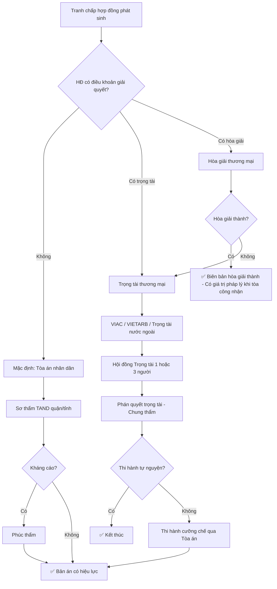

# LW03 — Luật Thương Mại

> **Luật Thương Mại** là hệ thống quy phạm pháp luật điều chỉnh các hoạt động thương mại giữa thương nhân với thương nhân và giữa thương nhân với các bên liên quan, bao gồm mua bán hàng hóa, cung ứng dịch vụ thương mại, và các hoạt động xúc tiến thương mại tại Việt Nam và trong quan hệ thương mại quốc tế.

---

## 1. Định Nghĩa & Tầm Quan Trọng

**Hoạt động thương mại** (Điều 3 Luật Thương Mại 2005) là hoạt động nhằm mục đích sinh lợi, bao gồm mua bán hàng hóa, cung ứng dịch vụ, đầu tư, xúc tiến thương mại và các hoạt động nhằm mục đích sinh lợi khác.

**Tầm quan trọng đối với doanh nghiệp:**

| Lĩnh vực | Vai trò Luật Thương Mại |
|---------|------------------------|
| Hợp đồng thương mại | Cơ sở pháp lý soạn thảo, ký kết, thực hiện hợp đồng |
| Tranh chấp | Xác định căn cứ, hình thức, hậu quả vi phạm |
| M&A | Quy định chuyển nhượng, đại lý, nhượng quyền |
| Xuất nhập khẩu | Mua bán hàng hóa quốc tế, CISG |
| Phân phối | Đại lý thương mại, nhượng quyền (franchise) |

**Văn bản pháp luật chính:**
- **Luật Thương Mại số 36/2005/QH11** — hiệu lực 01/01/2006
- **Bộ Luật Dân Sự số 91/2015/QH13** — nền tảng nghĩa vụ và hợp đồng
- **Luật Trọng Tài Thương Mại số 54/2010/QH12** — giải quyết tranh chấp
- **Nghị định 09/2018/NĐ-CP** — hoạt động mua bán hàng hóa của nhà đầu tư nước ngoài
- **Nghị định 35/2006/NĐ-CP** (sửa đổi 08/2018/NĐ-CP) — nhượng quyền thương mại

---

## 2. Lịch Sử & Nguồn Gốc

### Lịch sử Luật Thương Mại VN

```
1997 — Luật Thương Mại đầu tiên (số 58-L/CTN)
         └── 298 điều, áp dụng cho cả DN nhà nước và tư nhân

2005 — Luật Thương Mại số 36/2005/QH11 (hiện hành)
         ├── Mở rộng phạm vi: Dịch vụ thương mại, xúc tiến TM
         ├── Phù hợp chuẩn WTO (gia nhập WTO 2007)
         └── Áp dụng cả thương nhân nước ngoài

2015 — BLDS 2015 thay thế BLDS 2005
         └── Tác động lớn đến phần hợp đồng (hiệu lực giao dịch DS)

2017 — VN gia nhập Công ước CISG
         └── Áp dụng cho HĐ mua bán hàng hóa quốc tế từ 01/01/2017
```

### CISG và WTO

- VN gia nhập WTO 11/01/2007 → cải cách luật thương mại toàn diện
- VN gia nhập CISG (United Nations Convention on Contracts for the International Sale of Goods) từ 01/01/2017 → áp dụng tự động cho HĐ hàng hóa quốc tế

---

## 3. Các Khái Niệm Cốt Lõi

| Khái niệm | Định nghĩa | Điều khoản |
|-----------|-----------|-----------|
| Thương nhân | Tổ chức kinh tế/cá nhân hoạt động TM độc lập, thường xuyên | Điều 6 LTM |
| Hành vi thương mại | Hành vi của thương nhân nhằm mục đích sinh lợi | Điều 3.1 LTM |
| Hàng hóa | Máy móc, thiết bị, nguyên liệu, nhiên liệu, vật liệu... (hữu hình) | Điều 3.2 LTM |
| Dịch vụ TM | Hoạt động thương mại về cung ứng dịch vụ | Điều 3.9 LTM |
| CISG | Công ước Vienna 1980 về hợp đồng mua bán hàng hóa quốc tế | — |
| VIAC | Vietnam International Arbitration Centre — Trung tâm trọng tài QT VN | — |
| Force majeure | Sự kiện bất khả kháng — miễn trách nhiệm hợp đồng | Điều 294 LTM |
| Phạt vi phạm | Chế tài tiền phạt do vi phạm HĐ, tối đa 8% phần bị vi phạm | Điều 301 LTM |

---

## 4. Khung Pháp Lý & Văn Bản Quy Phạm

### Phân tầng pháp luật thương mại VN

```
BLDS 2015 (nền tảng — luật chung)
    └── Luật Thương Mại 36/2005 (luật riêng — ưu tiên áp dụng)
            ├── Phần 1: Những quy định chung
            ├── Phần 2: Mua bán hàng hóa (Điều 25-162)
            ├── Phần 3: Cung ứng dịch vụ thương mại (Điều 163-320)
            │       ├── Đại lý thương mại (Điều 166-177)
            │       ├── Gia công TM (Điều 178-181)
            │       ├── Đấu giá hàng hóa (Điều 185-220)
            │       ├── Đấu thầu hàng hóa/dịch vụ (Điều 214-222)
            │       ├── Dịch vụ logistics (Điều 233-240)
            │       ├── Quá cảnh hàng hóa (Điều 241-244)
            │       ├── Nhượng quyền thương mại (Điều 284-291)
            │       └── Dịch vụ giám định (Điều 254-264)
            ├── Phần 4: Xúc tiến thương mại (Điều 72-135)
            └── Phần 5: Giải quyết tranh chấp (Điều 317-325)
```

### Mối quan hệ LTM vs BLDS

| Vấn đề | LTM | BLDS 2015 | Ưu tiên áp dụng |
|-------|-----|---------|----------------|
| Phạt vi phạm tối đa | 8% giá trị phần bị vi phạm | Không giới hạn | LTM (giữa thương nhân) |
| Bồi thường thiệt hại | Phải chứng minh thiệt hại thực tế | Tương tự | LTM |
| Thời hiệu khởi kiện | 2 năm (Điều 319 LTM) | 3 năm (Điều 429 BLDS) | LTM (TM) / BLDS (DS) |
| Giao kết HĐ | Theo LTM | Theo BLDS | LTM ưu tiên |

---

## 5. Quy Trình Thực Hiện / Trình Tự Pháp Lý

### Vòng đời Hợp Đồng Thương Mại

```
GIAI ĐOẠN 1: ĐÀM PHÁN
    ├── NDA/Biên bản ghi nhớ (MOU/LOI)
    ├── Due diligence đối tác
    └── Term sheet / Đàm phán điều khoản

GIAI ĐOẠN 2: SOẠN THẢO HỢP ĐỒNG
    ├── Xác định luật áp dụng (LTM / BLDS / CISG)
    ├── Soạn các điều khoản cơ bản (8 yếu tố)
    └── Điều khoản đặc biệt: Force majeure, Penalty, Dispute resolution

GIAI ĐOẠN 3: KÝ KẾT
    ├── Kiểm tra thẩm quyền ký kết (người đại diện pháp luật hoặc người được ủy quyền)
    ├── Đóng dấu (nếu tổ chức)
    └── Lưu bản gốc + scan

GIAI ĐOẠN 4: THỰC HIỆN
    ├── Giao hàng / Cung ứng dịch vụ theo điều khoản
    ├── Thanh toán (L/C, T/T, tiền mặt...)
    └── Kiểm tra, nghiệm thu, bàn giao

GIAI ĐOẠN 5: KẾT THÚC HOẶC TRANH CHẤP
    ├── Kết thúc bình thường: Lưu hồ sơ 10 năm
    └── Tranh chấp: Thương lượng → Hòa giải → Trọng tài/Tòa án
```

---

## 6. Các Hình Thức & Phân Loại

### 6.1 Phân loại hợp đồng thương mại

| Loại HĐ | Mô tả | Luật áp dụng |
|--------|-------|------------|
| Mua bán hàng hóa trong nước | Giao hàng hữu hình trong VN | LTM 36/2005 |
| Mua bán hàng hóa quốc tế | Xuất khẩu/Nhập khẩu, tạm nhập tái xuất | LTM + CISG |
| Cung ứng dịch vụ | Logistics, tư vấn, gia công, IT outsourcing | LTM + BLDS |
| Đại lý thương mại | Bán hàng thay mặt bên giao đại lý | Điều 166-177 LTM |
| Nhượng quyền thương mại | Franchise — chuỗi bán lẻ, F&B | Điều 284-291 LTM |
| Gia công thương mại | Gia công hàng xuất khẩu | Điều 178-181 LTM |

### 6.2 Phân loại hoạt động thương mại

**Mua bán hàng hóa (Điều 25-162 LTM):**
- Mua bán hàng hóa thông thường
- Xuất khẩu, nhập khẩu hàng hóa
- Tạm nhập tái xuất, tạm xuất tái nhập
- Chuyển khẩu, quá cảnh hàng hóa
- Đấu giá hàng hóa
- Đấu thầu mua bán hàng hóa

**Dịch vụ thương mại (Điều 163-320 LTM):**
- Đại lý thương mại
- Gia công trong thương mại
- Dịch vụ logistics
- Nhượng quyền thương mại
- Dịch vụ giám định thương mại
- Cho thuê hàng hóa

---

## 7. Điều Kiện & Yêu Cầu

### 7.1 Điều kiện hiệu lực hợp đồng thương mại (8 yếu tố)

Theo BLDS 2015 (Điều 117) + LTM 2005:

| # | Yếu tố | Mô tả | Hậu quả nếu vi phạm |
|---|--------|-------|---------------------|
| 1 | Chủ thể có năng lực | Đủ tuổi, đủ năng lực pháp lý (tổ chức: đúng người đại diện) | Vô hiệu tương đối hoặc tuyệt đối |
| 2 | Tự nguyện | Không bị nhầm lẫn, lừa dối, cưỡng ép | Vô hiệu tương đối |
| 3 | Mục đích hợp pháp | Không vi phạm điều cấm, không trái đạo đức XH | Vô hiệu tuyệt đối |
| 4 | Nội dung hợp pháp | Điều khoản không vi phạm pháp luật | Vô hiệu một phần/toàn bộ |
| 5 | Hình thức | Văn bản (HĐ TM), công chứng nếu pháp luật yêu cầu | Vô hiệu nếu bắt buộc công chứng mà không làm |
| 6 | Đối tượng HĐ rõ ràng | Hàng hóa/dịch vụ xác định được | Vô hiệu do đối tượng không tồn tại |
| 7 | Giá cả (nếu có) | Không bắt buộc ghi giá, nhưng cần cơ chế xác định | Có thể dẫn đến tranh chấp |
| 8 | Thời hạn thực hiện | Xác định hoặc xác định được | Ảnh hưởng đến chế tài vi phạm |

### 7.2 Điều khoản bắt buộc trong HĐ thương mại

- Tên hàng hóa/dịch vụ
- Số lượng, chất lượng, quy cách
- Giá cả và phương thức thanh toán
- Địa điểm, thời hạn giao hàng/cung ứng dịch vụ
- Bên chịu thuế, phí (nếu có)
- Giải quyết tranh chấp

---

## 8. Rủi Ro Pháp Lý & Cách Phòng Tránh

### 8.1 Top 10 rủi ro hợp đồng thương mại

| Rủi ro | Nguyên nhân | Hậu quả | Phòng tránh |
|--------|------------|---------|-------------|
| HĐ vô hiệu do hình thức | Không ký văn bản hoặc không đúng người ký | Không có căn cứ khởi kiện | Ký đúng hình thức, đúng người đại diện |
| Điều khoản mơ hồ | Dùng ngôn ngữ không rõ ràng | Tranh chấp diễn giải HĐ | Định nghĩa rõ thuật ngữ, số liệu cụ thể |
| Thiếu điều khoản phạt | Không quy định penalty | Chỉ đòi bồi thường (khó chứng minh) | Ghi rõ mức phạt vi phạm |
| Force majeure không đủ | Định nghĩa quá hẹp | Bị yêu cầu bồi thường khi có sự kiện BKK | Định nghĩa rộng: dịch bệnh, thảm họa, chiến tranh, chính sách nhà nước |
| Không có điều khoản luật áp dụng | Mặc định → tranh chấp luật áp dụng | Có thể bất lợi | Ghi rõ: "Luật VN áp dụng" hoặc luật nước X |
| Không có điều khoản trọng tài | Phải ra tòa án VN | Chậm, không thể thi hành ở nước ngoài | Ghi điều khoản VIAC hoặc SIAC |
| Chuyển rủi ro hàng hóa không rõ | Không dùng Incoterms đúng | Tranh chấp khi hàng bị mất | Ghi rõ: FOB, CIF, DDP... |
| Thiếu điều khoản bảo mật | Không có NDA | Lộ thông tin kinh doanh | Thêm điều khoản bảo mật trong HĐ chính |
| Không giới hạn bồi thường | Trách nhiệm vô hạn | Phá sản nếu thua kiện lớn | Liability cap: tối đa X% giá trị HĐ |
| Quy định về sở hữu trí tuệ mờ nhạt | Không phân định IP | Tranh chấp về bản quyền, nhãn hiệu | Điều khoản IP riêng biệt, rõ ràng |

---

## 9. Best Practices / Thực Hành Tốt

### 9.1 Soạn thảo hợp đồng chuyên nghiệp

**Cấu trúc chuẩn một HĐ thương mại:**
1. Tiêu đề + Số HĐ + Ngày ký
2. Định nghĩa & Giải thích thuật ngữ
3. Đối tượng HĐ (hàng hóa/dịch vụ)
4. Giá cả & Thanh toán
5. Giao hàng & Nghiệm thu
6. Chất lượng & Bảo hành
7. Quyền và Nghĩa vụ các bên
8. Bảo mật thông tin
9. Sở hữu trí tuệ
10. Vi phạm & Chế tài
11. Bất khả kháng (Force Majeure)
12. Chấm dứt HĐ
13. Luật áp dụng & Giải quyết tranh chấp
14. Điều khoản chung
15. Phụ lục

### 9.2 Checklist trước khi ký HĐ

- [ ] Xác minh tư cách pháp nhân đối tác (ERC/ĐKKD)
- [ ] Xác nhận thẩm quyền ký kết của người ký
- [ ] Kiểm tra con dấu (nếu là tổ chức VN)
- [ ] Đọc kỹ điều khoản phạt vi phạm và giới hạn bồi thường
- [ ] Xem xét điều khoản tranh chấp: Trọng tài hay Tòa án? VIAC hay nước ngoài?
- [ ] Đánh giá rủi ro force majeure
- [ ] Xác nhận Incoterms áp dụng (nếu XNK)
- [ ] Kiểm tra điều khoản luật áp dụng

---

## 10. Sai Lầm Phổ Biến Doanh Nghiệp

### Top 10 sai lầm trong hợp đồng thương mại VN

1. **"Giao dịch miệng"** — thỏa thuận qua điện thoại/email không có HĐ ký kết → không có căn cứ pháp lý
2. **Copy-paste mẫu HĐ** — dùng mẫu trên internet không phù hợp thực tế → điều khoản vô nghĩa
3. **Không ghi Incoterms** — không rõ ai chịu chi phí vận chuyển, bảo hiểm → tranh chấp khi hàng bị mất/hỏng
4. **Phạt vi phạm vượt 8%** — ghi mức phạt 20-50% → không có giá trị pháp lý (LTM giới hạn 8%)
5. **Điều khoản trọng tài mơ hồ** — "tranh chấp giải quyết bằng trọng tài" mà không chỉ định trung tâm cụ thể
6. **Bỏ qua điều khoản chấm dứt** — không quy định quyền đơn phương chấm dứt khi nào → bị "bẫy" trong HĐ
7. **Ký HĐ bằng tiếng Anh không có bản tiếng Việt** — khi ra tòa VN cần dịch thuật, có thể sai nghĩa
8. **Không lưu hồ sơ giao dịch** — không có biên bản giao nhận, thanh lý HĐ → khó chứng minh vi phạm
9. **Không quy định lãi suất chậm thanh toán** — chậm trả không bị phạt → đối tác cố tình kéo dài
10. **Nhầm thời hiệu kiện** — LTM là 2 năm (BLDS là 3 năm), quá thời hiệu → mất quyền khởi kiện

---

## 11. Case Study VN — Tranh Chấp Hợp Đồng Điển Hình

### Case 1: Tranh chấp hàng hóa không đúng chất lượng — Công ty thực phẩm

**Tình huống:**
- Công ty A (nhập khẩu) ký HĐ mua 1.000 tấn ngô từ Công ty B (xuất khẩu Malaysia)
- Ngô giao nhận tại cảng Hải Phòng theo điều kiện CIF
- Khi kiểm tra: Độ ẩm ngô 15% (HĐ quy định ≤14%), thiệt hại ước 2 tỷ VNĐ

**Vấn đề pháp lý:**
- CISG áp dụng (VN + Malaysia đều là thành viên CISG)
- Theo CISG Điều 36: Người bán chịu trách nhiệm về hàng hóa không phù hợp tại thời điểm chuyển rủi ro
- Tại thời điểm nào ngô bị ẩm? Kho bên bán hay trong quá trình vận chuyển?

**Giải quyết:**
- A thông báo không phù hợp trong 2 ngày (Điều 39 CISG — "trong thời hạn hợp lý")
- Yêu cầu: Giảm giá (Điều 50 CISG) 30% + Bồi thường chi phí xử lý
- B phản bác: Hàng bình thường khi giao, ẩm do điều kiện vận chuyển (B chọn tàu nhưng không mua bảo hiểm cho A)
- Kết quả: Trọng tài VIAC phán xét B chịu 70% thiệt hại

**Bài học:**
- Luôn quy định cụ thể tiêu chuẩn chất lượng (ISO, TCVN, %...)
- Quy định rõ thời điểm và điều kiện kiểm tra
- Bảo hiểm hàng hóa là thiết yếu dù điều kiện CIF đã có bảo hiểm tối thiểu

### Case 2: Nhượng quyền — Chuỗi F&B bị phá vỡ hệ thống

**Tình huống:**
- Franchisor (Thương hiệu F&B Nhật) cấp quyền cho Master Franchisee VN
- Sau 2 năm, Master Franchisee cấp sub-franchise cho 50 cơ sở
- Franchisor phát hiện nhiều cơ sở vi phạm tiêu chuẩn vệ sinh, bán sản phẩm không phép

**Vấn đề pháp lý:**
- Hợp đồng nhượng quyền chưa đăng ký với Bộ Công thương (vi phạm Điều 291 LTM + NĐ 35/2006)
- Sub-franchise chưa được Franchisor đồng ý (vi phạm HĐ)
- Thiệt hại uy tín thương hiệu

**Kết quả:** Franchisor chấm dứt HĐ, kiện đòi 5 triệu USD bồi thường + phí VIAC

### Case 3: Đại lý thương mại — Tranh chấp hoa hồng

**Tình huống:**
- Công ty X làm đại lý bán hàng điện tử cho Công ty Y theo HĐ đại lý 3 năm
- Sau 2 năm, Y đơn phương chấm dứt HĐ với lý do "kinh doanh không hiệu quả"
- X yêu cầu bồi thường hoa hồng 6 tháng + chi phí phát sinh

**Điều khoản liên quan:**
- Điều 172 LTM: Bên giao đại lý phải thông báo ít nhất 60 ngày trước khi đơn phương chấm dứt
- Nếu không thông báo: Bồi thường thiệt hại + Thưởng hoa hồng thay thế

**Kết quả:** Tòa án TP.HCM phán quyết Y bồi thường 4 tháng hoa hồng trung bình

---

## 12. So Sánh Với Pháp Luật Quốc Tế

### 12.1 CISG vs LTM/BLDS

| Vấn đề | CISG | LTM + BLDS VN |
|--------|------|--------------|
| Phạm vi áp dụng | HĐ mua bán hàng hóa quốc tế (thương nhân khác quốc gia) | HĐ trong nước + quốc tế |
| Hình thức HĐ | Không bắt buộc văn bản | Thường phải bằng văn bản |
| Chuyển rủi ro | Theo Điều 66-70 CISG (khi giao hàng cho người chuyên chở) | Theo LTM + thỏa thuận Incoterms |
| Thiệt hại | Điều 74-77 CISG: Thiệt hại có thể dự đoán được | BLDS 2015 Điều 419: Thiệt hại thực tế |
| Phạt vi phạm | Không có cơ chế phạt riêng | LTM: Max 8% |
| Miễn trách | Điều 79 CISG: Force majeure hẹp | Điều 294 LTM: Rộng hơn |

### 12.2 VIAC vs Trọng Tài Quốc Tế

| Tiêu chí | VIAC | SIAC (Singapore) | ICC (Paris) |
|---------|------|-----------------|------------|
| Chi phí | Thấp nhất (~1.5-3% tranh chấp) | Trung bình (~3-5%) | Cao (~5-8%) |
| Ngôn ngữ | Tiếng Việt + Tiếng Anh | Tiếng Anh | Đa ngôn ngữ |
| Thời gian | 6-18 tháng | 12-24 tháng | 18-36 tháng |
| Thi hành tại VN | Dễ dàng | Theo Công ước New York | Theo Công ước New York |
| Thẩm phán TT | Danh sách VIAC | Quốc tế uy tín | Chuyên gia toàn cầu |
| Phù hợp khi | Tranh chấp VN-VN, VN-ASEAN | Tranh chấp VN-nước ngoài | Tranh chấp lớn (>10M USD) |

### 12.3 Incoterms 2020 — Ứng dụng trong LTM VN

| Incoterm | Rủi ro chuyển từ người bán | Phí vận chuyển | Phổ biến |
|---------|--------------------------|--------------|---------|
| EXW | Xưởng người bán | Người mua chịu hết | Ít dùng XK |
| FOB | Trên boong tàu | Người mua từ cảng xuất | Phổ biến XK VN |
| CIF | Trên boong tàu | Người bán trả đến cảng đích | Phổ biến NK |
| DAP | Điểm đến đã thỏa thuận | Người bán chịu hầu hết | B2B quốc tế |
| DDP | Điểm đến, đã nộp thuế | Người bán chịu tất | Giá trọn gói |

---

## 13. Checklist Tuân Thủ

### Checklist hợp đồng thương mại

- [ ] Xác định luật áp dụng: LTM / BLDS / CISG
- [ ] Ký bằng văn bản (điều 24 LTM — HĐ MB hàng hóa có thể bằng lời nói nhưng khuyến nghị văn bản)
- [ ] Người ký có thẩm quyền (người đại diện pháp luật hoặc có giấy ủy quyền)
- [ ] Ghi đầy đủ thông tin: Tên, địa chỉ, mã số thuế các bên
- [ ] Đối tượng HĐ rõ ràng: Mô tả hàng hóa/dịch vụ, số lượng, chất lượng, tiêu chuẩn
- [ ] Giá cả & Thanh toán: Đơn giá, tổng giá, đồng tiền, phương thức, thời hạn
- [ ] Điều khoản giao hàng: Thời hạn, địa điểm, Incoterms (nếu XNK)
- [ ] Điều khoản phạt vi phạm: Mức % (không quá 8% theo LTM), loại vi phạm
- [ ] Điều khoản bất khả kháng: Định nghĩa, thủ tục thông báo, hệ quả
- [ ] Điều khoản giải quyết tranh chấp: VIAC / Tòa án / Trọng tài nước ngoài
- [ ] Thời hiệu kiện: Nhắc nhở tự động 1 năm trước thời hiệu

---

## 14. Chế Tài Vi Phạm Hợp Đồng Thương Mại

### 14.1 Hệ thống chế tài (Điều 292-316 LTM)

**Buộc thực hiện đúng HĐ (Điều 297):**
- Bên vi phạm phải tiếp tục thực hiện đúng nghĩa vụ
- Bên bị vi phạm có thể tự thực hiện hoặc thuê bên thứ ba → tính vào bồi thường

**Phạt vi phạm (Điều 300-301):**
- **Áp dụng**: Phải có thỏa thuận trong HĐ (không tự động)
- **Mức phạt**: Không quá **8% giá trị phần nghĩa vụ bị vi phạm**
- **Lưu ý**: BLDS 2015 không giới hạn → HĐ dân sự (không phải thương mại) có thể phạt vượt 8%
- **Phân biệt**: Phạt vi phạm ≠ Bồi thường thiệt hại (có thể áp dụng đồng thời theo Điều 307)

**Bồi thường thiệt hại (Điều 302-305):**
- Phải có đủ 3 yếu tố: (1) Vi phạm HĐ; (2) Thiệt hại thực tế; (3) Quan hệ nhân quả
- Thiệt hại bao gồm: Tổn thất thực tế + Lợi nhuận bị bỏ lỡ có thể dự đoán
- **Nghĩa vụ giảm thiểu thiệt hại** (Điều 305): Bên bị vi phạm phải tích cực giảm thiểu thiệt hại

**Tạm ngừng thực hiện HĐ (Điều 308-309):**
- Khi có vi phạm cơ bản
- Phải thông báo ngay cho bên kia

**Đình chỉ thực hiện HĐ (Điều 310-311):**
- Chấm dứt tương lai, giữ nguyên trách nhiệm phần đã vi phạm

**Hủy bỏ HĐ (Điều 312-315):**
- Vi phạm cơ bản → có thể hủy toàn bộ
- Hậu quả: Các bên hoàn trả lại cho nhau, không bị ràng buộc tiếp

### 14.2 So sánh mức phạt LTM vs BLDS

```
LTM 36/2005 (giữa thương nhân):
    Phạt vi phạm ≤ 8% giá trị vi phạm
    + Bồi thường thiệt hại thực tế
    = Tổng bồi thường có thể > 8% (nếu thiệt hại lớn hơn)

BLDS 2015 (không giới hạn):
    Phạt vi phạm: Không giới hạn (theo thỏa thuận)
    + Bồi thường thiệt hại thực tế
    (Áp dụng khi HĐ không phải thương mại hoặc bên không phải thương nhân)
```

---

## 15. Miễn Trách Nhiệm — Force Majeure & Bên Thứ Ba

### 15.1 Điều 294 LTM — Các trường hợp miễn trách

**Sự kiện bất khả kháng (Force Majeure):**
Điều kiện để được miễn trách:
1. Sự kiện xảy ra **khách quan** (không phải lỗi các bên)
2. **Không thể lường trước** tại thời điểm ký HĐ
3. **Không thể khắc phục** dù đã áp dụng biện pháp cần thiết

Ví dụ được chấp nhận: Thiên tai, dịch bệnh (COVID-19 được tòa án VN chấp nhận 2020), chiến tranh, lệnh cấm của nhà nước

**Hành vi vi phạm do lỗi bên thứ ba:**
- Phải chứng minh: Lỗi hoàn toàn do bên thứ ba, không thể khắc phục
- Không áp dụng nếu bên thứ ba là người do bạn chọn (nhà thầu phụ)

**Hành vi của bên bị vi phạm:**
- Bên bị vi phạm tự gây ra thiệt hại → Giảm trừ bồi thường theo mức lỗi

### 15.2 Thủ tục miễn trách

1. Thông báo ngay cho bên kia về sự kiện BKK (trong 48-72 giờ theo thông lệ)
2. Cung cấp chứng cứ: Xác nhận của cơ quan có thẩm quyền (PHÒNG THƯƠNG MẠI, UBND...)
3. Nỗ lực khắc phục hoặc tìm giải pháp thay thế

---

## 16. Đại Lý Thương Mại

### 16.1 Đặc điểm pháp lý (Điều 166-177 LTM)

**Phân biệt đại lý thương mại:**

| Loại | Mô tả | Hoa hồng |
|------|-------|---------|
| Đại lý bao tiêu | Mua đứt hàng, tự định giá bán | Chênh lệch giá |
| Đại lý hoa hồng | Bán theo giá bên giao ĐL, hưởng hoa hồng % | Hoa hồng cố định |
| Đại lý đặc quyền | Độc quyền trong khu vực | Hoa hồng |
| Tổng đại lý | Tổ chức hệ thống đại lý phụ | Hoa hồng cao hơn |

**Quyền của Bên đại lý (Điều 170):**
- Hưởng thù lao đại lý
- Yêu cầu bên giao đại lý cung cấp thông tin, hàng hóa
- Đơn phương chấm dứt HĐ với thông báo trước

**Nghĩa vụ Bên đại lý:**
- Thực hiện đúng theo yêu cầu bên giao đại lý
- Không đại lý cho đối thủ cạnh tranh (nếu HĐ quy định)
- Bảo quản hàng hóa, tài liệu của bên giao

**Thời hạn HĐ đại lý:**
- Xác định hoặc không xác định thời hạn
- Nếu không thời hạn: Chấm dứt phải báo trước tối thiểu 60 ngày (Điều 177)

---

## 17. Nhượng Quyền Thương Mại (Franchise)

### 17.1 Khái niệm & Khung pháp lý

**Điều 284 LTM:** Nhượng quyền thương mại là hoạt động thương mại, theo đó bên nhượng quyền cho phép và yêu cầu bên nhận quyền tự mình tiến hành việc mua bán hàng hóa, cung ứng dịch vụ theo các điều kiện:
- Theo cách thức tổ chức kinh doanh do bên nhượng quyền quy định và gắn với nhãn hiệu hàng hóa, tên thương mại, khẩu hiệu kinh doanh, biểu tượng kinh doanh, quảng cáo của bên nhượng quyền
- Bên nhượng quyền có quyền kiểm soát và trợ giúp cho bên nhận quyền

### 17.2 Điều kiện nhượng quyền (Điều 5 NĐ 35/2006)

**Bên nhượng quyền phải:**
- Hệ thống kinh doanh dự kiến nhượng quyền đã hoạt động ít nhất 1 năm
- Đăng ký hoạt động nhượng quyền tại Bộ Công Thương (nếu nhượng quyền từ nước ngoài vào VN)
- Có văn bản giới thiệu về nhượng quyền (disclosure document)

**Đăng ký nhượng quyền quốc tế:**
- Nhượng quyền từ nước ngoài vào VN: Đăng ký Bộ Công Thương
- Nhượng quyền từ VN ra nước ngoài: Thông báo Bộ Công Thương
- Thời hạn xử lý: 5 ngày làm việc

### 17.3 Quyền và Nghĩa vụ (Điều 287-290 LTM)

**Bên nhượng quyền phải:**
- Cung cấp tài liệu, hướng dẫn hệ thống, đào tạo nhân viên
- Thiết kế và bố trí địa điểm kinh doanh
- Bảo đảm quyền sở hữu trí tuệ liên quan

**Bên nhận quyền phải:**
- Trả phí nhượng quyền theo thỏa thuận
- Đầu tư đủ nguồn lực theo yêu cầu Franchisor
- Chấp nhận quyền kiểm soát của Franchisor
- Bảo mật thông tin kinh doanh

### 17.4 Mô hình Franchise thành công tại VN

| Thương hiệu | Loại | Mô hình | Số lượng |
|------------|------|---------|--------|
| Lotteria | F&B Hàn Quốc | Master Franchise | ~230 cửa hàng |
| Highlands Coffee | F&B VN | Franchise trong nước | >700 cửa hàng |
| The Coffee House | F&B VN | Tự mở (không franchise) | ~180 |
| Jollibee | F&B Philippines | Master Franchise | ~100 |
| Circle K | Bán lẻ Mỹ | Franchise | >400 |
| 7-Eleven | Bán lẻ Nhật | Sub-franchise từ CP All | >100 |

---

## 18. Mua Bán Hàng Hóa Quốc Tế & CISG

### 18.1 CISG áp dụng tại VN từ 01/01/2017

**Điều kiện áp dụng CISG:**
- Các bên có trụ sở thương mại tại các quốc gia khác nhau
- Cả hai quốc gia đều là thành viên CISG, HOẶC
- Luật áp dụng là luật của quốc gia thành viên CISG

**Loại trừ CISG:**
- Các bên có thể thỏa thuận loại trừ CISG (Điều 6 CISG)
- Ghi trong HĐ: "This contract is governed by Vietnamese Law, excluding CISG"

### 18.2 Các điểm khác biệt CISG quan trọng

**Hình thành HĐ (CISG Điều 14-23):**
- Chào hàng phải đủ xác định: Hàng, số lượng, giá cả
- Chấp nhận có thể bằng hành động (trong khi LTM yêu cầu thông báo)
- Quy tắc "mirror image": Chấp nhận có sửa đổi = Từ chối + Chào lại

**Kiểm tra hàng & Thông báo không phù hợp (CISG Điều 38-39):**
- Phải kiểm tra hàng trong thời gian ngắn nhất có thể sau khi giao
- Phải thông báo trong "thời hạn hợp lý" sau khi phát hiện (thực tiễn: 2-4 tuần)
- **Nguy hiểm**: Nếu không thông báo kịp thời → mất quyền đòi bồi thường

**Chuyển rủi ro (CISG Điều 66-70):**
- Rủi ro chuyển khi hàng được giao cho người chuyên chở đầu tiên
- FOB: Khi qua lan can tàu (thực tế: khi giao cho tàu)

---

## 19. Dịch Vụ Logistics Thương Mại

### 19.1 Điều 234 LTM — Dịch vụ logistics

**Phân loại dịch vụ logistics:**
- Dịch vụ bốc xếp hàng hóa
- Dịch vụ kho bãi
- Dịch vụ đại lý vận tải, giao nhận
- Dịch vụ hải quan
- Vận tải đa phương thức
- Dịch vụ phân phối, quản lý hàng tồn kho

### 19.2 Giới hạn bồi thường logistics (Điều 238 LTM)

- **Thương nhân kinh doanh dịch vụ logistics**: Giới hạn bồi thường theo HĐ
- Nếu không có thỏa thuận: **Giới hạn 500 USD/kiện hàng** hoặc theo quy định quốc tế
- Nếu khách hàng khai giá trị: Bồi thường theo giá trị khai

---

## 20. Thương Mại Điện Tử

### 20.1 Khung pháp lý TMĐT VN

- **Luật Giao dịch điện tử 51/2005** (sửa đổi 20/2023)
- **Nghị định 52/2013/NĐ-CP** (sửa đổi 85/2021/NĐ-CP) — thương mại điện tử
- **Nghị định 13/2023/NĐ-CP** — bảo vệ dữ liệu cá nhân

### 20.2 Giá trị pháp lý hợp đồng điện tử

- HĐ điện tử có giá trị pháp lý như HĐ bằng văn bản giấy (Luật GDĐT 2023)
- Chữ ký điện tử (digital signature) = Chữ ký tay
- Email xác nhận mua hàng = Hợp đồng mua bán nếu đủ yếu tố

### 20.3 Nghĩa vụ sàn TMĐT (NĐ 85/2021)

- Đăng ký hoặc thông báo với Bộ Công Thương
- Lưu trữ thông tin giao dịch 3 năm
- Cung cấp thông tin người bán cho cơ quan thuế
- Khóa tài khoản người bán vi phạm

---

## 21. Hợp Đồng Ủy Thác Mua Bán Hàng Hóa

### 21.1 Điều 155-169 LTM — Ủy thác mua bán hàng hóa

**Khái niệm:** Bên được ủy thác thực hiện mua bán hàng hóa **nhân danh chính mình** theo chỉ dẫn của bên ủy thác, hưởng thù lao ủy thác.

**Phân biệt Ủy thác vs Đại lý:**
| Tiêu chí | Ủy thác | Đại lý |
|---------|---------|-------|
| Nhân danh ai | Nhân danh bản thân | Nhân danh bên giao đại lý |
| Quan hệ với bên thứ ba | Bên thứ ba quan hệ với bên được ủy thác | Bên thứ ba quan hệ với bên giao đại lý |
| Chuyển giao rủi ro | Bên ủy thác chịu (theo NĐ) | Bên giao đại lý chịu |

---

## 22. Đấu Giá & Đấu Thầu Hàng Hóa

### 22.1 Đấu giá hàng hóa (Điều 185-220 LTM)

- **Đấu giá lên giá**: Người trả giá cao nhất mua được
- **Đấu giá xuống giá**: Người đầu tiên chấp nhận giá mua được
- Người điều hành đấu giá phải là chuyên gia có chứng chỉ
- HĐ mua bán hình thành khi người điều hành công bố người trúng đấu giá

### 22.2 Đấu thầu hàng hóa (Điều 214-222 LTM)

- Bên mời thầu phát hồ sơ mời thầu
- Bên dự thầu nộp hồ sơ dự thầu (sealed bid)
- Mở thầu, đánh giá, lựa chọn nhà cung cấp
- Ký HĐ với người trúng thầu

**Lưu ý**: Đấu thầu sử dụng vốn nhà nước → áp dụng Luật Đấu Thầu 22/2023/QH15

---

## 23. Hệ Thống Giải Quyết Tranh Chấp

### 23.1 Chuỗi giải quyết tranh chấp thương mại VN

```
Tranh chấp phát sinh
    │
    ▼
THƯƠNG LƯỢNG (Negotiation)
    ├── Các bên tự đàm phán
    ├── Không có bên thứ ba
    └── Kết quả: Biên bản thỏa thuận (có giá trị như HĐ sửa đổi)
    │
    ▼ (Nếu thất bại)
HÒA GIẢI (Mediation/Conciliation)
    ├── Hòa giải thương mại (NĐ 22/2017/NĐ-CP)
    ├── Trung tâm hòa giải: VIAC Mediation Centre, VICMC
    ├── Hòa giải viên độc lập
    └── Kết quả có giá trị khi được tòa án công nhận
    │
    ▼ (Nếu thất bại)
TRỌNG TÀI (Arbitration) ← Phổ biến nhất cho thương mại
    ├── VIAC (Vietnam International Arbitration Centre)
    ├── VIETARB (Vietnam Arbitration Centre)
    ├── Trọng tài nước ngoài: SIAC, ICC, HKIAC, LCIA
    └── Phán quyết: Chung thẩm, thi hành theo Công ước New York
    │
    ▼ (Nếu không có điều khoản trọng tài hoặc vô hiệu)
TÒA ÁN (Litigation)
    ├── TAND quận/huyện (tranh chấp nhỏ)
    ├── TAND tỉnh/thành phố (tranh chấp lớn, yếu tố nước ngoài)
    └── Phúc thẩm → Giám đốc thẩm (tối cao)
```

### 23.2 VIAC — Vietnam International Arbitration Centre

**Thông tin VIAC:**
- Thành lập: 1993 tại Hà Nội, chi nhánh TP.HCM
- Website: viac.vn
- Số lượng vụ 2023: ~200 vụ/năm (xu hướng tăng)
- Phí: Đăng ký 500 USD + % giá trị tranh chấp (theo Biểu phí VIAC)

**Quy trình VIAC:**
1. Nộp đơn yêu cầu + Phí đăng ký
2. VIAC thông báo bị đơn (30 ngày trả lời)
3. Thành lập Hội đồng Trọng tài (1 hoặc 3 người)
4. Phiên họp thủ tục, thu thập tài liệu
5. Phiên điều trần
6. Phán quyết (trong 30 ngày từ kết thúc phiên điều trần)
7. Thi hành phán quyết tại tòa án có thẩm quyền

**Mẫu điều khoản trọng tài VIAC:**
```
"Mọi tranh chấp phát sinh từ hoặc liên quan đến hợp đồng này 
sẽ được giải quyết bằng trọng tài theo Quy tắc Trọng tài của 
Trung tâm Trọng tài Quốc tế Việt Nam (VIAC) bên cạnh Phòng 
Thương mại và Công nghiệp Việt Nam (VCCI), với [01/03] trọng 
tài viên. Địa điểm trọng tài là [Hà Nội/TP.HCM]. Ngôn ngữ 
trọng tài là [tiếng Việt/tiếng Anh]."
```

---

## 24. Thi Hành Phán Quyết Trọng Tài

### 24.1 Công nhận và thi hành phán quyết nước ngoài

- **Công ước New York 1958**: VN tham gia 1995
- VN có thể từ chối thi hành nếu: Vi phạm trật tự công cộng VN, thiếu thủ tục, phán quyết vô hiệu theo luật nơi ra
- Thủ tục: Nộp đơn tại TAND tỉnh/thành → 60 ngày xét xử

### 24.2 Lý do hay bị từ chối thi hành tại VN

- Điều khoản trọng tài không hợp lệ (không phải tranh chấp thương mại)
- Bên bị thua không được thông báo hợp lệ
- Phán quyết trái với trật tự công cộng VN (hiếm nhưng xảy ra với vụ việc nhạy cảm)

---

## 25. Xúc Tiến Thương Mại

### 25.1 Các hình thức XTTM (Điều 72-135 LTM)

| Hình thức | Mô tả | Quy định |
|---------|-------|---------|
| Khuyến mại | Giảm giá, tặng quà, dùng thử | Điều 88-100 LTM, NĐ 81/2018 |
| Quảng cáo TM | Truyền thông sản phẩm/dịch vụ | Điều 102-115 LTM, Luật QC 2012 |
| Trưng bày, giới thiệu SP | Triển lãm, hội chợ | Điều 117-128 LTM |
| Hội chợ triển lãm | Sự kiện thương mại | Điều 129-135 LTM |

### 25.2 Khuyến mại — Quy định quan trọng (NĐ 81/2018)

- **Mức giảm giá tối đa**: Không quá **50%** giá hàng hóa/dịch vụ (trừ hàng hóa ứ đọng, hết hạn sử dụng)
- **Thời gian khuyến mại**: Không quá **45 ngày/lần**, không quá **3 tháng/năm**
- **Đăng ký**: Phải thông báo Sở Công Thương (trừ khuyến mại nhỏ dưới ngưỡng)
- **Cấm**: Khuyến mại mang tính may rủi (trừ được phép theo quy định)

---

## 26. Bảo Vệ Quyền Lợi Người Tiêu Dùng Trong Thương Mại

### 26.1 Luật Bảo Vệ Quyền Lợi NTD 19/2023/QH15

- Hiệu lực: 01/07/2024 (thay thế Luật 59/2010)
- Quyền NTD: Được thông tin đầy đủ, được bảo hành, được hoàn trả
- Nghĩa vụ thương nhân: Ghi đúng thông tin sản phẩm, bảo hành đúng cam kết, không ép buộc mua hàng
- Giao dịch từ xa/online: Quyền hoàn trả 14 ngày (dù không lỗi)

---

## 27. Thực Tiễn Thương Mại Quốc Tế Tại VN

### 27.1 Phương thức thanh toán quốc tế phổ biến

| Phương thức | Mức độ rủi ro (người bán) | Phổ biến |
|------------|--------------------------|---------|
| L/C (Letter of Credit) | Thấp | Xuất khẩu hàng hóa lớn |
| T/T 100% trả trước | Thấp nhất | Xuất khẩu nhỏ, lần đầu |
| T/T 30% cọc + 70% sau | Trung bình | Phổ biến nhất |
| D/P (Documents against Payment) | Trung bình | Hàng hóa có thị trường |
| D/A (Documents against Acceptance) | Cao | Bạn hàng lâu năm |
| Open Account | Rất cao | Tập đoàn đa quốc gia |

### 27.2 Rào cản thương mại VN phải đối mặt khi xuất khẩu

- **Tiêu chuẩn kỹ thuật**: EU (CE marking), Mỹ (FDA, FCC), Nhật (JIS)
- **Chứng nhận xuất xứ (C/O)**: Form D (ASEAN), Form E (ACFTA), EUR.1 (EVFTA)
- **Thuế chống bán phá giá**: Tôm, cá tra, thép VN bị Mỹ điều tra
- **Kiểm dịch thực vật**: Nông sản phải có chứng nhận SPS

---

## 28. Luật Cạnh Tranh Trong Thương Mại

### 28.1 Luật Cạnh tranh 23/2018

**Hành vi bị cấm liên quan đến hợp đồng thương mại:**
- Ký kết thỏa thuận ấn định giá bán → Hình phạt: 10% doanh thu năm trước
- Phân chia thị trường theo vùng/khách hàng
- Hạn chế số lượng, thị trường
- Tẩy chay thương nhân khác
- Ép buộc khách hàng (ràng buộc khi mua)

**Miễn trừ:** Có thể được miễn trừ nếu góp phần nâng cao công nghệ, hạ giá người tiêu dùng

---

## 29. Thuế Trong Giao Dịch Thương Mại

### 29.1 Thuế liên quan đến hợp đồng thương mại

| Thuế | Thuế suất | Áp dụng |
|------|---------|--------|
| Thuế GTGT | 10% (8% tạm 2024) | Hầu hết HH-DV |
| Thuế TNDN | 20% | Lợi nhuận doanh nghiệp |
| Thuế nhà thầu | 1-5% | Dịch vụ từ nước ngoài |
| Thuế xuất khẩu | 0-45% | Một số mặt hàng |
| Thuế nhập khẩu | 0-25% | Hàng NK (giảm theo FTA) |

### 29.2 Thuế nhà thầu (Foreign Contractor Tax)

- Áp dụng khi thanh toán cho tổ chức nước ngoài cung cấp DV
- Bên VN có nghĩa vụ khấu trừ và nộp thay
- Thuế GTGT: 5-10% | Thuế TNDN: 1-5% tùy loại dịch vụ
- Miễn trừ nếu có DTA (Double Tax Agreement) với VN

---

## 30. Thương Mại Biên Giới & Thương Mại Tự Do

### 30.1 Thương mại biên giới

- Cư dân biên giới được mua bán hàng hóa giá trị ≤2 triệu VNĐ/ngày miễn thuế
- Khu kinh tế cửa khẩu: Quy chế đặc biệt về xuất nhập khẩu
- Hàng hóa cư dân biên giới: Riêng danh mục, giá trị nhỏ

### 30.2 Khu thương mại tự do (FTZ)

- Khu phi thuế quan trong KCN/KKT
- Hàng từ nước ngoài vào FTZ: Không chịu thuế NK
- Hàng từ FTZ vào nội địa: Chịu thuế NK đầy đủ
- Ưu điểm: Logistics quốc tế thuận lợi, gia công xuất khẩu

---

## 31. Mẫu Điều Khoản Hợp Đồng Quan Trọng

### 31.1 Điều khoản phạt vi phạm chuẩn (LTM)

```
"Điều X — Phạt vi phạm
1. Trường hợp [Bên mua/Bên bán] vi phạm nghĩa vụ [giao hàng/thanh toán], 
   bên vi phạm phải trả cho bên bị vi phạm một khoản tiền phạt bằng 
   [__]% giá trị phần nghĩa vụ bị vi phạm.
2. Mức phạt nêu trên không vượt quá 8% giá trị phần hợp đồng bị vi phạm 
   theo quy định tại Điều 301 Luật Thương Mại 2005.
3. Tiền phạt vi phạm không loại trừ quyền yêu cầu bồi thường thiệt hại 
   của bên bị vi phạm theo quy định tại Điều 307 Luật Thương Mại 2005."
```

### 31.2 Điều khoản bất khả kháng chuẩn

```
"Điều X — Bất khả kháng
1. Sự kiện bất khả kháng là sự kiện xảy ra một cách khách quan, không thể 
   lường trước và không thể khắc phục được dù đã áp dụng mọi biện pháp 
   cần thiết và khả năng cho phép, bao gồm nhưng không giới hạn: thiên tai, 
   hỏa hoạn, dịch bệnh, chiến tranh, lệnh cấm hoặc quyết định của cơ quan 
   nhà nước có thẩm quyền.
2. Bên gặp sự kiện BKK phải thông báo bằng văn bản cho bên kia trong vòng 
   [05/07] ngày làm việc kể từ khi sự kiện xảy ra, kèm theo xác nhận của 
   cơ quan có thẩm quyền (nếu có).
3. Bên gặp sự kiện BKK được miễn trách nhiệm trong thời gian sự kiện kéo 
   dài. Nếu sự kiện BKK kéo dài hơn [30/60] ngày, các bên có quyền đàm phán 
   lại hoặc chấm dứt hợp đồng mà không phải bồi thường."
```

---

## 32. Thực Tiễn Tuân Thủ Hợp Đồng Tại VN

### 32.1 Thực trạng thực thi hợp đồng VN

- **World Bank Doing Business 2020**: VN xếp thứ 69/190 về "Enforcing Contracts"
- Thời gian tố tụng tòa án: Trung bình 400 ngày (sơ thẩm)
- Chi phí tố tụng: 29% giá trị tranh chấp (tính cả luật sư, phí tòa, thực thi)
- Lý do chọn trọng tài: Nhanh hơn 50%, bí mật hơn, có thể thi hành quốc tế

### 32.2 Giải pháp rút ngắn tranh chấp

- **Hòa giải thương mại**: NĐ 22/2017 → Miễn phí/chi phí thấp, 30-60 ngày
- **Early neutral evaluation**: Chuyên gia đánh giá trước → các bên tự thỏa thuận
- **Escalation clause**: Quy định leo thang: CEO đàm phán trước khi kiện

---

## 33. Nghĩa Vụ Bảo Mật Trong Hợp Đồng

### 33.1 NDA (Non-Disclosure Agreement)

- Loại: Một chiều (unilateral) / Hai chiều (mutual)
- Thông tin bảo mật: Phải định nghĩa cụ thể, không quá rộng
- Thời hạn: Thường 2-5 năm sau khi HĐ kết thúc
- Chế tài: Phạt vi phạm + Bồi thường thiệt hại thực tế

### 33.2 NCA (Non-Compete Agreement)

- Cấm cạnh tranh trong thời hạn/khu vực xác định sau khi chấm dứt HĐ
- **Vấn đề pháp lý VN**: NCA với nhân viên có thể vô hiệu nếu không có bồi thường thỏa đáng
- Phải cân bằng: Bảo vệ lợi ích doanh nghiệp vs Quyền lao động của NLĐ

---

## 34. Hợp Đồng Xây Dựng & Mua Sắm

### 34.1 Hợp đồng xây dựng (Luật Xây Dựng 50/2014)

- Các loại: Trọn gói, Theo đơn giá, Theo thời gian, EPC, Chìa khóa trao tay
- Điều khoản đặc biệt: Bảo lãnh thi công, Bảo lãnh bảo hành, Bảo lãnh ứng trước
- Tranh chấp xây dựng: Phổ biến nhất là chậm tiến độ, tăng khối lượng

### 34.2 Mua sắm công (Luật Đấu Thầu 22/2023/QH15)

- Áp dụng cho: Mua sắm từ nguồn vốn ngân sách nhà nước, vốn DNNN
- Hình thức đấu thầu: Rộng rãi / Hạn chế / Chỉ định thầu (giới hạn)
- Tiêu chí lựa chọn: Giá thấp nhất / Kỹ thuật cao nhất / Kết hợp

---

## 35. Nhập Khẩu Song Song & Kiệt Sức Quyền SHTT

### 35.1 Vấn đề nhập khẩu song song

- Hàng chính hãng mua ở nước khác rẻ hơn → nhập khẩu vào VN bán
- VN áp dụng nguyên tắc **"quốc tế kiệt sức"** (Điều 125.2b Luật SHTT) → Cho phép nhập khẩu song song
- Ảnh hưởng: Thị trường xám (grey market), ảnh hưởng hệ thống phân phối chính hãng

---

## 36. Hợp Đồng Với Cơ Quan Nhà Nước

### 36.1 Hợp đồng BOT, PPP với nhà nước

- Hợp đồng dự án PPP theo Luật PPP 64/2020
- Cơ quan ký kết: Bộ/UBND tỉnh
- Điều khoản đặc biệt: Bảo đảm doanh thu tối thiểu, chia sẻ rủi ro, điều chỉnh giá
- Tranh chấp: Theo thỏa thuận trong HĐ dự án (thường là trọng tài quốc tế)

### 36.2 Rủi ro "stabilization clause"

- Trong HĐ với nhà nước: Có thể thỏa thuận đông kết (freeze) điều kiện kinh tế/pháp lý
- VN chưa có khung pháp lý rõ ràng về stabilization clause
- Thực tiễn: Đàm phán cụ thể trong từng dự án lớn

---

## 37. Tổng Hợp Điều Khoản Thường Gặp Trong HĐ TM VN

| Điều khoản | Luật áp dụng | Lưu ý quan trọng |
|-----------|------------|----------------|
| Phạt vi phạm | Điều 300-301 LTM | Max 8% giá trị vi phạm (giữa thương nhân) |
| Bồi thường TH | Điều 302-305 LTM | Phải chứng minh thiệt hại thực tế |
| Bất khả kháng | Điều 294 LTM | Thông báo ngay, cung cấp bằng chứng |
| Hủy bỏ HĐ | Điều 312-315 LTM | Chỉ khi có vi phạm cơ bản |
| Thời hiệu kiện | Điều 319 LTM | 2 năm (TM) / 3 năm (DS) |
| Giao hàng | Điều 35-57 LTM | Theo Incoterms 2020 |
| Chuyển rủi ro | Điều 57-69 LTM | Theo điều kiện giao hàng |
| Bảo hành | Điều 49-50 LTM | Thời hạn theo HĐ hoặc thương nhân |
| Trọng tài | Luật TT 54/2010 | Phải thỏa thuận bằng văn bản |
| Luật áp dụng | Điều 5 LTM + CISG | Có thể chọn luật áp dụng |

---

## 38. Trách Nhiệm Sản Phẩm

### 38.1 Luật Bảo Vệ Quyền Lợi NTD 19/2023 — Trách nhiệm sản phẩm

- Nhà sản xuất/Nhà phân phối chịu trách nhiệm về sản phẩm khuyết tật gây thiệt hại
- **Chế độ trách nhiệm nghiêm ngặt** (strict liability): Không cần chứng minh lỗi
- Trách nhiệm liên đới: Nhà SX, nhà NK, nhà phân phối đều có thể bị kiện
- Giới hạn: Không áp dụng nếu khuyết tật do tuân thủ quy định bắt buộc hoặc kỹ thuật chưa cho phép phát hiện

---

## 39. Tổng Hợp Mức Phạt & Chế Tài

| Vi phạm | Mức phạt hành chính | Mức phạt HĐ tối đa |
|---------|-------------------|-------------------|
| Vi phạm quy định khuyến mại | 20-30 triệu VNĐ | Theo HĐ (max 8% LTM) |
| Không đăng ký nhượng quyền | 10-30 triệu VNĐ | — |
| Quảng cáo gian dối | 60-80 triệu VNĐ | — |
| Vi phạm HĐ giao hàng trễ | — | Max 8% giá trị trễ |
| Vi phạm bảo mật | — | Theo NDA + Điều 301 LTM |
| Cạnh tranh không lành mạnh | Đến 10% doanh thu năm | — |

---

## 40. Tài Liệu Tham Khảo & Nguồn Tra Cứu

### Văn bản pháp lý
- Luật Thương Mại 36/2005/QH11 — thuvienphapluat.vn
- BLDS 91/2015/QH13
- Luật Trọng Tài TM 54/2010/QH12
- NĐ 35/2006/NĐ-CP (nhượng quyền TM, sửa đổi 08/2018)
- NĐ 81/2018/NĐ-CP (khuyến mại)
- Công ước CISG (UNCITRAL)

### Tổ chức & Cổng thông tin
- **VIAC**: viac.vn — tra cứu án lệ trọng tài, biểu phí, danh sách TTV
- **VCCI**: vcci.com.vn — hỗ trợ doanh nghiệp, kết nối thương mại
- **Bộ Công Thương**: moit.gov.vn — đăng ký nhượng quyền, thông báo khuyến mại
- **UNCITRAL**: uncitral.un.org — CISG, Model Law

---

## Output Formats

### Mermaid Diagram — Quy Trình Giải Quyết Tranh Chấp Thương Mại



### Flashcards — Luật Thương Mại VN

**Q1:** Mức phạt vi phạm tối đa theo Luật Thương Mại 2005 là bao nhiêu?
**A1:** Tối đa 8% giá trị phần nghĩa vụ bị vi phạm (Điều 301 LTM). Lưu ý: Chỉ áp dụng cho giao dịch thương mại giữa thương nhân. BLDS 2015 không giới hạn mức phạt.

**Q2:** CISG được áp dụng tại VN từ khi nào và áp dụng cho loại HĐ nào?
**A2:** Từ 01/01/2017. CISG áp dụng tự động cho hợp đồng mua bán hàng hóa quốc tế giữa thương nhân có trụ sở ở các quốc gia khác nhau khi cả hai là thành viên CISG (trừ khi các bên thỏa thuận loại trừ).

**Q3:** Thời hiệu khởi kiện tranh chấp thương mại theo LTM là bao lâu?
**A3:** 2 năm kể từ thời điểm quyền lợi bị xâm phạm (Điều 319 LTM). So sánh: BLDS 2015 là 3 năm. Quá thời hiệu sẽ mất quyền khởi kiện.

**Q4:** Nhượng quyền thương mại khác đại lý thương mại như thế nào?
**A4:** Nhượng quyền (franchise): Bên nhận quyền hoạt động theo hệ thống và nhãn hiệu của Franchisor, tự chịu rủi ro kinh doanh. Đại lý (agency): Bên đại lý bán hàng của bên giao đại lý, nhân danh bên giao, hưởng hoa hồng, bên giao chịu rủi ro.

**Q5:** Điều kiện để được miễn trách theo force majeure (Điều 294 LTM)?
**A5:** Ba điều kiện: (1) Sự kiện xảy ra khách quan; (2) Không thể lường trước tại thời điểm ký HĐ; (3) Không thể khắc phục dù đã áp dụng mọi biện pháp cần thiết. Phải thông báo ngay cho bên kia và cung cấp bằng chứng.

**Q6:** VIAC là gì và khi nào nên chọn VIAC thay vì tòa án?
**A6:** VIAC = Vietnam International Arbitration Centre. Nên chọn VIAC khi: (1) Tranh chấp thương mại có giá trị lớn; (2) Cần bảo mật; (3) Bên nước ngoài muốn thi hành phán quyết ở nhiều quốc gia (theo Công ước New York 1958); (4) Muốn quy trình nhanh hơn tòa án (6-18 tháng vs 2-3 năm).

**Q7:** Franchisor có phải đăng ký nhượng quyền tại VN không?
**A7:** Có, nếu nhượng quyền từ nước ngoài vào VN phải đăng ký với Bộ Công Thương. Nếu từ VN ra nước ngoài chỉ cần thông báo. Hệ thống phải hoạt động ít nhất 1 năm trước khi nhượng quyền.

**Q8:** Mức giảm giá tối đa trong khuyến mại theo quy định VN?
**A8:** Không quá 50% giá hàng hóa/dịch vụ (NĐ 81/2018), trừ hàng hóa ứ đọng, hết hạn sử dụng. Thời gian khuyến mại không quá 45 ngày/lần và không quá 3 tháng/năm.

**Q9:** Incoterms nào phổ biến nhất trong xuất khẩu của VN?
**A9:** FOB (Free On Board) phổ biến nhất trong xuất khẩu VN — rủi ro chuyển khi hàng qua lan can tàu tại cảng xuất. CIF phổ biến trong nhập khẩu — người bán trả phí vận chuyển và bảo hiểm đến cảng đích.

**Q10:** Khi nào phạt vi phạm và bồi thường thiệt hại được áp dụng đồng thời?
**A10:** Theo Điều 307 LTM — có thể áp dụng đồng thời cả phạt vi phạm (nếu HĐ quy định, max 8%) VÀ bồi thường thiệt hại thực tế. Phạt vi phạm không loại trừ bồi thường.

---

### JSON Metadata

```json
{
  "module": {
    "code": "LW03",
    "name": "Luật Thương Mại",
    "domain": "Law",
    "category": "08-law",
    "status": "complete",
    "version": "2.0",
    "last_updated": "2024-01"
  },
  "legal_framework": {
    "primary_law": "Luật Thương Mại 36/2005/QH11",
    "civil_code": "BLDS 91/2015/QH13",
    "arbitration_law": "Luật Trọng Tài TM 54/2010/QH12",
    "international": "CISG (áp dụng từ 01/01/2017)",
    "related_decrees": [
      "NĐ 35/2006 (nhượng quyền)",
      "NĐ 81/2018 (khuyến mại)",
      "NĐ 09/2018 (FDI mua bán hàng hóa)"
    ]
  },
  "key_concepts": [
    "Hợp đồng thương mại", "Phạt vi phạm 8%", "Force majeure",
    "VIAC", "CISG", "Franchise", "Đại lý", "Incoterms", "BLDS"
  ],
  "penalty_cap": "8% giá trị vi phạm (Điều 301 LTM)",
  "statute_of_limitations": {
    "commercial": "2 năm (Điều 319 LTM)",
    "civil": "3 năm (Điều 429 BLDS)"
  },
  "dispute_resolution": ["VIAC", "VIETARB", "SIAC", "ICC", "TAND"],
  "links": {
    "law_text": "https://thuvienphapluat.vn",
    "viac": "https://viac.vn",
    "vcci": "https://vcci.com.vn",
    "cisg": "https://uncitral.un.org/en/texts/salegoods/conventions/sale_of_goods/cisg"
  }
}
```

---

### Cheat Sheet — Bảng Tra Cứu Nhanh Luật Thương Mại

```
╔══════════════════════════════════════════════════════════════════════╗
║           CHEAT SHEET — LUẬT THƯƠNG MẠI VN (LTM 36/2005)          ║
╠══════════════════════════════════════════════════════════════════════╣
║ CHẾ TÀI VI PHẠM HĐ (Điều 292-316)                                  ║
║  1. Buộc thực hiện đúng HĐ (Điều 297)                               ║
║  2. Phạt vi phạm: Tối đa 8% giá trị vi phạm (Điều 301)             ║
║  3. Bồi thường thiệt hại thực tế (Điều 302-305)                    ║
║  4. Tạm ngừng thực hiện HĐ (Điều 308)                               ║
║  5. Đình chỉ HĐ (Điều 310)                                           ║
║  6. Hủy bỏ HĐ (Điều 312) — Chỉ khi vi phạm cơ bản                  ║
╠══════════════════════════════════════════════════════════════════════╣
║ MIỄN TRÁCH (Điều 294)                                                ║
║  Force majeure: Khách quan + Không lường trước + Không khắc phục    ║
║  → Thông báo ngay + Cung cấp bằng chứng                             ║
╠══════════════════════════════════════════════════════════════════════╣
║ THỜI HIỆU                                                             ║
║  • Tranh chấp TM (LTM): 2 năm (Điều 319)                            ║
║  • Tranh chấp DS (BLDS): 3 năm (Điều 429)                           ║
╠══════════════════════════════════════════════════════════════════════╣
║ NHƯỢNG QUYỀN (Điều 284-291 LTM + NĐ 35/2006)                       ║
║  • Hệ thống hoạt động ≥1 năm trước khi NQ                           ║
║  • Từ nước ngoài vào VN: Đăng ký Bộ Công Thương                    ║
║  • Từ VN ra nước ngoài: Thông báo Bộ Công Thương                   ║
╠══════════════════════════════════════════════════════════════════════╣
║ ĐẠI LÝ THƯƠNG MẠI (Điều 166-177 LTM)                               ║
║  • Thông báo chấm dứt: Tối thiểu 60 ngày (Điều 177)                ║
║  • Loại: Bao tiêu / Hoa hồng / Đặc quyền / Tổng đại lý             ║
╠══════════════════════════════════════════════════════════════════════╣
║ KHUYẾN MẠI (NĐ 81/2018)                                              ║
║  • Giảm giá tối đa: 50% (trừ hàng ứ đọng/hết hạn)                  ║
║  • Thời gian: ≤45 ngày/lần, ≤3 tháng/năm                            ║
║  • Phải thông báo: Sở Công Thương                                    ║
╠══════════════════════════════════════════════════════════════════════╣
║ GIẢI QUYẾT TRANH CHẤP                                                ║
║  Thương lượng → Hòa giải → Trọng tài/Tòa án                         ║
║  • VIAC (vn): Chi phí thấp, phán quyết chung thẩm, 6-18 tháng      ║
║  • SIAC/ICC: Chi phí cao hơn, phù hợp tranh chấp quốc tế lớn       ║
║  • Tòa án: 2-3 năm sơ + phúc thẩm                                   ║
╠══════════════════════════════════════════════════════════════════════╣
║ CISG (từ 01/01/2017)                                                  ║
║  • Áp dụng: HĐ MB hàng hóa quốc tế (thương nhân 2 quốc gia CISG)  ║
║  • Loại trừ bằng thỏa thuận: "This contract excludes CISG"          ║
║  • Thông báo không phù hợp hàng: Trong "thời hạn hợp lý" (2-4 tuần)║
╠══════════════════════════════════════════════════════════════════════╣
║ INCOTERMS XUẤT KHẨU VN PHỔ BIẾN                                     ║
║  • FOB (Free On Board): Rủi ro chuyển khi qua lan can tàu           ║
║  • CIF (Cost, Insurance, Freight): Phổ biến nhập khẩu               ║
║  • DDP (Delivered Duty Paid): Người bán chịu mọi chi phí đến nơi   ║
╚══════════════════════════════════════════════════════════════════════╝
```
