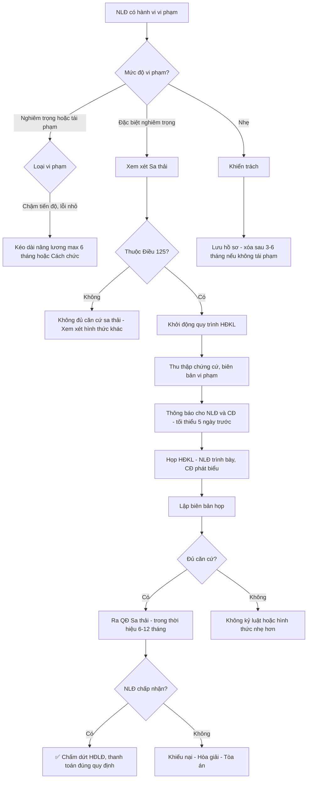

# LW04 — Luật Lao Động

> **Luật Lao Động** là hệ thống quy phạm pháp luật điều chỉnh quan hệ lao động giữa người lao động và người sử dụng lao động, bao gồm hợp đồng lao động, tiền lương, thời giờ làm việc, nghỉ ngơi, kỷ luật lao động, bảo hiểm xã hội và giải quyết tranh chấp lao động. Đây là lĩnh vực pháp luật quan trọng nhất đối với mọi doanh nghiệp có thuê nhân sự tại Việt Nam.

---

## 1. Định Nghĩa & Tầm Quan Trọng

**Quan hệ lao động** (Điều 3 BLLĐ 2019) là quan hệ xã hội phát sinh trong việc thuê mướn, sử dụng lao động, trả lương giữa người lao động, người sử dụng lao động và tổ chức đại diện của các bên.

**Tầm quan trọng:**

| Lĩnh vực | Rủi ro nếu không tuân thủ |
|---------|--------------------------|
| Hợp đồng lao động | Bị tuyên vô hiệu, bồi thường lớn |
| Lương tối thiểu | Phạt 20-75 triệu VNĐ/lao động |
| BHXH | Phạt + truy nộp + lãi suất |
| Kỷ luật lao động | Sa thải vô hiệu, phải nhận lại + bồi thường |
| Lao động nước ngoài | Trục xuất, phạt hành chính |
| Tranh chấp | Đình công, tòa án, thanh tra lao động |

**Văn bản pháp luật chính:**
- **Bộ Luật Lao Động 45/2019/QH14** — hiệu lực 01/01/2021 (thay thế BLLĐ 10/2012)
- **Nghị định 145/2020/NĐ-CP** — hướng dẫn BLLĐ 2019 (điều kiện lao động, kỷ luật, GQTCLĐ)
- **Nghị định 12/2022/NĐ-CP** — xử phạt vi phạm hành chính lao động
- **Luật Bảo Hiểm Xã Hội 58/2014/QH13** (đang sửa đổi 2024)
- **Luật Việc Làm 38/2013/QH13** — bảo hiểm thất nghiệp, chính sách việc làm
- **Nghị định 38/2022/NĐ-CP** — lương tối thiểu vùng 2022 (từ 01/07/2022)
- **Nghị định 74/2024/NĐ-CP** — lương tối thiểu vùng 2024 (từ 01/07/2024)

---

## 2. Lịch Sử & Nguồn Gốc

### Timeline Bộ Luật Lao Động VN

```
1994 — BLLĐ đầu tiên (23/06/1994)
         └── 198 điều, lần đầu tiên có khái niệm HĐLĐ rõ ràng

2002 — Sửa đổi lần 1: Bổ sung quy định về thỏa ước LĐ tập thể

2006 — Sửa đổi lần 2: Bổ sung về đình công, tranh chấp LĐ

2012 — BLLĐ mới (02/2012)
         └── 242 điều, chuẩn hóa theo ILO, ASEAN

2019 — BLLĐ 45/2019 (hiện hành, hiệu lực 01/01/2021)
         ├── Bổ sung HĐLĐ điện tử
         ├── Mở rộng quyền của NLĐ
         ├── Quy định về lao động nước ngoài rõ ràng hơn
         └── Cải thiện cơ chế đình công hợp pháp
```

### VN và ILO

- VN là thành viên ILO từ 1992
- Đã phê chuẩn 25 Công ước ILO (trong đó 7 công ước cơ bản)
- Cam kết CPTPP, EVFTA: Phê chuẩn thêm công ước về quyền tổ chức công đoàn độc lập (Công ước 87, 98)

---

## 3. Các Khái Niệm Cốt Lõi

| Khái niệm | Định nghĩa | Điều khoản |
|-----------|-----------|-----------|
| Người lao động (NLĐ) | Người từ đủ 15 tuổi trở lên làm việc theo HĐLĐ, hưởng lương | Điều 3.1 BLLĐ |
| Người sử dụng lao động (NSDLĐ) | DN, cơ quan, tổ chức, cá nhân có thuê mướn lao động | Điều 3.2 BLLĐ |
| HĐLĐ | Thỏa thuận giữa NLĐ và NSDLĐ về việc làm có trả lương | Điều 13 BLLĐ |
| Thử việc | Thời gian thử thách trước khi ký HĐLĐ chính thức | Điều 24-27 BLLĐ |
| Lương tối thiểu vùng | Mức lương thấp nhất được trả cho NLĐ làm việc trong điều kiện bình thường | NĐ 74/2024 |
| BHXH bắt buộc | Bảo hiểm xã hội, y tế, thất nghiệp | Luật BHXH 58/2014 |
| Thỏa ước LĐTT | Văn bản thỏa thuận tập thể về QHLĐ tại DN | Điều 75-88 BLLĐ |
| Kỷ luật lao động | Quy định về hành vi vi phạm và hình thức xử lý | Điều 117-129 BLLĐ |
| Đình công | Ngừng việc tập thể có tổ chức do tập thể NLĐ thực hiện | Điều 198-209 BLLĐ |

---

## 4. Khung Pháp Lý & Văn Bản Quy Phạm

### Hệ thống pháp luật lao động

```
HIẾN PHÁP 2013 (Điều 35: Quyền lao động)
    └── BLLĐ 45/2019/QH14 (Luật mẹ)
            ├── NĐ 145/2020/NĐ-CP (hướng dẫn chung)
            ├── NĐ 12/2022/NĐ-CP (xử phạt HC)
            ├── NĐ 74/2024/NĐ-CP (lương TT vùng 2024)
            ├── NĐ 38/2022/NĐ-CP (lương TT vùng 2022)
            ├── NĐ 152/2020/NĐ-CP (lao động nước ngoài)
            ├── TT 09/2020/TT-BLĐTBXH (HĐLĐ điện tử)
            └── Các luật chuyên ngành
                    ├── Luật BHXH 58/2014
                    ├── Luật Việc Làm 38/2013
                    ├── Luật An Toàn, Vệ Sinh Lao Động 84/2015
                    └── Luật Công Đoàn 12/2012 (sửa đổi 2024)
```

---

## 5. Quy Trình Thực Hiện / Trình Tự Pháp Lý

### Vòng đời quan hệ lao động

```
GIAI ĐOẠN 1: TUYỂN DỤNG
    ├── Thông báo tuyển dụng (không phân biệt đối xử)
    ├── Phỏng vấn, đánh giá ứng viên
    └── Chào việc (offer letter) — chưa có giá trị pháp lý như HĐLĐ

GIAI ĐOẠN 2: THỬ VIỆC (Điều 24-27)
    ├── Ký hợp đồng thử việc (không bắt buộc — có thể ghi vào HĐLĐ)
    ├── Thời gian: ≤30 ngày (bình thường) / ≤60 ngày (chuyên gia) / ≤180 ngày (chuyên môn kỹ thuật cao)
    ├── Lương thử việc: Tối thiểu 85% lương chức danh đó
    └── Kết thúc: Thông báo kết quả hoặc tự động chuyển thành HĐLĐ

GIAI ĐOẠN 3: KÝ HĐLĐ (Điều 13-21)
    ├── Ký bằng văn bản (bắt buộc với HĐLĐ ≥1 tháng)
    ├── 2 loại: Xác định thời hạn (≤36 tháng) / Không xác định thời hạn
    └── Điều khoản bắt buộc (Điều 21)

GIAI ĐOẠN 4: THỰC HIỆN HĐLĐ
    ├── Trả lương đúng hạn, đủ số (Điều 96)
    ├── Đảm bảo ATLĐ, VSLĐ
    ├── Đóng BHXH, BHYT, BHTN
    ├── Thực hiện chế độ nghỉ ngơi
    └── Báo cáo lao động (định kỳ với Sở LĐTBXH)

GIAI ĐOẠN 5: CHẤM DỨT HĐLĐ (Điều 34-38)
    ├── Báo trước đúng thời hạn
    ├── Thanh toán trợ cấp thôi việc/mất việc (nếu có)
    └── Trả sổ BHXH, giấy tờ trong 14 ngày
```

---

## 6. Các Hình Thức & Phân Loại

### 6.1 Phân loại Hợp Đồng Lao Động (Điều 20)

| Loại HĐLĐ | Thời hạn | Ký lần | Chuyển đổi |
|-----------|---------|-------|-----------|
| Không xác định thời hạn | Vô thời hạn | — | Loại cao nhất, khó chấm dứt |
| Xác định thời hạn | ≤36 tháng | Tối đa 2 lần (lần 3 → vô thời hạn) | Sau 2 HĐLĐ XĐ TH → Phải ký vô TH |

**Quy tắc chuyển đổi HĐLĐ quan trọng:**
- Ký HĐLĐ XĐ TH lần 1 (≤36 tháng) → Hết hạn → Tiếp tục làm → Ký HĐLĐ XĐ TH lần 2
- Sau lần 2 hết hạn, tiếp tục làm → **Bắt buộc ký HĐLĐ không xác định thời hạn**
- Nếu không ký → Mặc nhiên coi là HĐLĐ không XĐ TH

### 6.2 Điều khoản bắt buộc trong HĐLĐ (Điều 21)

1. Tên, địa chỉ NSDLĐ và người giao kết bên NSDLĐ
2. Họ tên, ngày tháng năm sinh, giới tính, nơi cư trú, CCCD của NLĐ
3. Công việc và địa điểm làm việc
4. **Thời hạn** của HĐLĐ
5. **Mức lương** theo công việc hoặc chức danh, hình thức trả lương, thời hạn trả lương, phụ cấp và các khoản bổ sung khác
6. **Chế độ nâng bậc, nâng lương**
7. Thời giờ làm việc, thời giờ nghỉ ngơi
8. Trang bị bảo hộ LĐ cho NLĐ
9. BHXH, BHYT, BHTN
10. Đào tạo, bồi dưỡng, nâng cao trình độ kỹ năng nghề

---

## 7. Điều Kiện & Yêu Cầu

### 7.1 Thử việc chi tiết (Điều 24-27)

| Trình độ | Thời gian thử việc tối đa |
|---------|--------------------------|
| NLĐ làm công việc bình thường | 30 ngày |
| NLĐ làm công việc đòi hỏi tốt nghiệp ĐH trở lên | 60 ngày |
| NLĐ làm công việc đòi hỏi chuyên môn kỹ thuật cao | 180 ngày |
| NLĐ làm công việc theo mùa vụ <1 tháng | Không thử việc |

**Lưu ý quan trọng:**
- Chỉ được thử việc **1 lần** cho một công việc cụ thể
- Lương thử việc ≥ 85% mức lương chức danh sau thử việc
- Kết thúc thử việc: Thông báo trước ít nhất 3 ngày

### 7.2 Hợp đồng lao động điện tử

- Từ BLLĐ 2019 và TT 09/2020: HĐLĐ có thể ký bằng văn bản điện tử
- Điều kiện: Phải đáp ứng Luật Giao dịch điện tử 2023
- Phù hợp cho: Remote work, freelancer, gig economy

---

## 8. Rủi Ro Pháp Lý & Cách Phòng Tránh

### 8.1 Top 10 rủi ro lao động doanh nghiệp VN

| Rủi ro | Hậu quả | Mức phạt | Phòng tránh |
|--------|---------|---------|-------------|
| Không ký HĐLĐ | Coi là HĐLĐ không XĐ TH + Phạt | 20-25 triệu/NLĐ | Ký HĐLĐ văn bản trong 30 ngày |
| Trả lương dưới tối thiểu vùng | Phạt + Truy thu | 20-75 triệu/NLĐ | Cập nhật lương TT hàng năm |
| Không đóng BHXH | Phạt + Truy thu + Lãi | 12-20% lương/tháng | Đăng ký BHXH khi ký HĐLĐ |
| Sa thải trái luật | Phải nhận lại + Trả lương suốt thời gian + Bồi thường 2 tháng | — | Tuân thủ quy trình sa thải |
| Làm thêm giờ vượt giới hạn | Phạt hành chính | 80-100 triệu VNĐ | Kiểm soát số giờ OT |
| Không trả lương OT đúng hệ số | Phạt + Truy thu | 20-75 triệu VNĐ | Hệ thống tính lương OT tự động |
| Sa thải sai thủ tục kỷ luật | Sa thải vô hiệu | — | Họp HĐKL, thông báo CĐ, lập biên bản |
| Không có Nội quy LĐ đăng ký | Kỷ luật LĐ vô hiệu | 5-10 triệu VNĐ | Đăng ký NQLĐ tại Sở LĐTBXH |
| Lao động NN không có GPLĐ | Phạt, trục xuất NLĐ | 75-100 triệu/NLĐ | Nộp hồ sơ GPLĐ trước khi làm việc |
| Không thanh toán trợ cấp khi chấm dứt | Bị kiện, phải trả thêm lãi | — | Tính đúng trợ cấp, trả trong 14 ngày |

---

## 9. Best Practices / Thực Hành Tốt

### 9.1 Xây dựng hệ thống HR tuân thủ

**Tài liệu cần có:**
- [ ] Nội quy lao động (đã đăng ký tại Sở LĐTBXH)
- [ ] Thỏa ước lao động tập thể (nếu có CĐ)
- [ ] Quy chế lương, thưởng, phụ cấp
- [ ] Quy định đánh giá hiệu suất (KPI)
- [ ] Sổ tay nhân viên (Employee Handbook)
- [ ] Quy trình kỷ luật lao động

**Hệ thống quản lý:**
- Phần mềm HR: Quản lý HĐLĐ, tính lương, chấm công, nghỉ phép
- Báo cáo tự động: Lương, BHXH, thuế TNCN
- Lưu trữ hồ sơ: Ít nhất 10 năm

### 9.2 Best practice thuê và sa thải

**Thuê:**
1. Offer letter rõ ràng (không ràng buộc pháp lý nhưng tạo kỳ vọng)
2. Ký HĐLĐ trước ngày đi làm, không phải sau
3. Giải thích kỹ Nội quy, Quy chế lương khi onboarding
4. Đăng ký BHXH trong 30 ngày

**Sa thải/Chấm dứt:**
1. Tham vấn luật sư lao động TRƯỚC khi ra quyết định
2. Lập hồ sơ vi phạm đầy đủ (biên bản, email, chứng cứ)
3. Tuân thủ quy trình kỷ luật (nếu sa thải vì lỗi)
4. Thanh toán đầy đủ: Lương còn lại + Phép chưa nghỉ + Trợ cấp

---

## 10. Sai Lầm Phổ Biến Doanh Nghiệp

### Top 10 sai lầm lao động doanh nghiệp VN

1. **Ký HĐLĐ XĐ TH 3 lần** — Lần 3 bắt buộc phải là vô thời hạn, không thể ký thêm XĐ TH
2. **Lương 3P sai cơ cấu** — Không ghi rõ lương cơ bản/phụ cấp/thưởng trong HĐLĐ → Không đóng BHXH đúng
3. **Thưởng Tết cam kết bằng miệng** — Tết không thưởng → NLĐ kiện, nhưng luật không bắt buộc → Cần quy chế thưởng rõ ràng
4. **Sa thải vì lý do "kinh tế" không đúng thủ tục** — Không phải lỗi NLĐ nhưng không làm thủ tục đúng → Vẫn phải bồi thường
5. **Thử việc 180 ngày cho chức danh không đủ điều kiện** — Chỉ áp dụng cho chuyên môn kỹ thuật cao, không phải mọi vị trí
6. **Tính OT sai** — Quên nhân hệ số ngày lễ (300%) hoặc lương tháng OT tính sai công thức
7. **Không cập nhật NQLĐ** — NQLĐ cũ không phản ánh quy định mới → Kỷ luật vô hiệu
8. **Lao động nước ngoài làm trước khi có GPLĐ** — DN chịu phạt, không phải NLĐ nước ngoài
9. **Không cấp phép nghỉ phép tích lũy** — NLĐ không được nghỉ phép → Phải trả bằng tiền khi chấm dứt
10. **Quên báo cáo lao động** — Hàng năm phải báo cáo số lao động, cơ cấu lương → Quên nộp bị phạt

---

## 11. Case Study VN — Sa Thải & Tranh Chấp Lao Động

### Case 1: Sa thải vô hiệu — Công ty FDI tại Hà Nội

**Tình huống:**
- Công ty Nhật (300 NLĐ) sa thải NV kế toán sau 5 năm làm việc
- Lý do: "Không hoàn thành nhiệm vụ, vi phạm kỷ luật"
- Thủ tục: Ra quyết định sa thải nhưng **không họp Hội đồng Kỷ Luật**, không thông báo Công đoàn

**Vi phạm pháp lý:**
- Điều 122 BLLĐ: NSDLĐ phải chứng minh lỗi, mời NLĐ và đại diện CĐ dự họp HĐKL
- Điều 123: Sa thải phải có biên bản họp + NLĐ ký hoặc từ chối ký

**Kết quả (tòa án phán xét):**
- Sa thải vô hiệu theo Điều 128
- Công ty phải: Nhận NLĐ trở lại + Trả lương suốt 18 tháng tranh chấp + Bồi thường thêm 2 tháng lương
- Tổng thiệt hại: ~400 triệu VNĐ

**Bài học:** Quy trình kỷ luật lao động quan trọng hơn lý do kỷ luật

### Case 2: Tranh chấp BHXH — Startup công nghệ TP.HCM

**Tình huống:**
- Startup 80 người, ký HĐLĐ nhưng ghi lương cơ bản thấp (4,5 triệu) + Phụ cấp cao (không đóng BHXH)
- NLĐ nhận được lương thực tế 15 triệu/tháng nhưng BHXH chỉ tính 4,5 triệu
- Thanh tra phát hiện, truy thu BHXH 3 năm

**Vi phạm:**
- NĐ 38/2022, NĐ 145/2020: Phụ cấp gắn với tính chất, điều kiện công việc thì phải đóng BHXH
- Tiền thưởng không gắn hiệu suất cụ thể → Phải đóng BHXH

**Kết quả:**
- Truy thu BHXH 3 năm: ~8 tỷ VNĐ
- Phạt hành chính: 2 tỷ VNĐ
- Lãi suất chậm đóng: ~1,5 tỷ VNĐ

### Case 3: Đình công tự phát — KCN Đồng Nai

**Tình huống:**
- Nhà máy giày 3.000 NLĐ, cắt bữa ăn ca từ 25.000đ xuống 18.000đ
- NLĐ tự phát đình công, không qua CĐ, không tuân thủ quy trình
- Đình công kéo dài 5 ngày

**Phân tích pháp lý:**
- Đình công tự phát = Đình công bất hợp pháp (không qua CĐ cấp cơ sở)
- NSDLĐ có thể yêu cầu tòa tuyên bố đình công bất hợp pháp
- TAND tỉnh tuyên: Đình công bất hợp pháp → NLĐ tự phát phải bồi thường thiệt hại

**Thực tế:** Công ty không kiện NLĐ, nhưng cải thiện bữa ăn để tránh leo thang

**Bài học:** Thường đình công tự phát do doanh nghiệp không lắng nghe, giải pháp là phòng ngừa (lắng nghe, giải thích kịp thời)

---

## 12. So Sánh Với Pháp Luật Quốc Tế

### 12.1 So sánh pháp luật lao động ASEAN

| Tiêu chí | Việt Nam | Singapore | Thái Lan | Indonesia | Philippines |
|---------|---------|-----------|---------|-----------|------------|
| Lương TT (tháng) | ~5.6M VNĐ (~230 USD) Vùng I 2024 | ~$1.500+ SGD | ~10.400 THB | ~5.211.000 IDR | ~17.268 PHP |
| Thời gian làm việc | 48h/tuần | 44h/tuần | 48h/tuần | 40h/tuần | 48h/tuần |
| Nghỉ phép năm | 12 ngày/năm | 7-14 ngày | 6 ngày/năm | 12 ngày/năm | 5 ngày |
| Thai sản | 6 tháng | 16 tuần | 98 ngày | 3 tháng | 105 ngày |
| Trợ cấp thôi việc | 0.5 tháng/năm (≤5 năm) | Tùy thỏa thuận | 30-300 ngày tùy thâm niên | Tùy thâm niên | 1 tháng/năm |
| Công đoàn | Bắt buộc khi ≥5 NLĐ yêu cầu | Tự nguyện | Tự nguyện | Tự nguyện | Tự nguyện |

### 12.2 Công ước ILO VN đã phê chuẩn

| # | Công ước | Nội dung | Năm |
|---|---------|---------|-----|
| 138 | Tuổi lao động tối thiểu | 15 tuổi (VN phê chuẩn 2003) | 1973 |
| 182 | Cấm lao động trẻ em nặng nhọc | Phê chuẩn 2000 | 1999 |
| 111 | Không phân biệt đối xử | Phê chuẩn 1997 | 1958 |
| 100 | Bình đẳng tiền lương | Phê chuẩn 1997 | 1951 |
| 29 | Xóa bỏ lao động cưỡng bức | Phê chuẩn 2007 | 1930 |
| 105 | Xóa bỏ lao động cưỡng bức (bổ sung) | Phê chuẩn 2020 | 1957 |
| 98 | Quyền tổ chức và TLTT | Phê chuẩn 2019 | 1949 |

Cam kết phê chuẩn Công ước 87 (Tự do hiệp hội) trong CPTPP, EVFTA

---

## 13. Checklist Tuân Thủ

### HR Compliance Checklist hàng năm

**Hợp đồng lao động:**
- [ ] Kiểm tra HĐLĐ XĐ TH có đến lần 2 không → Chuẩn bị chuyển vô TH
- [ ] HĐLĐ ghi đúng mức lương thực tế nhận
- [ ] Điều khoản chuyển công tác/điều chuyển hợp lệ

**Tiền lương:**
- [ ] Lương tối thiểu ≥ mức vùng hiện hành (Vùng I: 4.960.000đ/tháng từ 01/07/2024)
- [ ] Cơ cấu lương: Lương cơ bản + Phụ cấp ghi rõ từng khoản
- [ ] Tính OT đúng hệ số: 150%/200%/300%
- [ ] Thanh toán lương đúng hạn (chu kỳ theo HĐLĐ)

**BHXH:**
- [ ] Đăng ký BHXH trong 30 ngày kể từ ký HĐLĐ
- [ ] Đóng đúng mức: BHXH 25.5%, BHYT 4.5%, BHTN 2%
- [ ] Đóng đủ trên lương thực tế (không cắt giảm bằng cơ cấu lương)

**Thời giờ làm việc:**
- [ ] Giờ làm việc ≤ 8h/ngày, ≤ 48h/tuần
- [ ] Tổng OT ≤ 200h/năm (tổng quát) hoặc ≤ 300h (ngành đặc biệt)
- [ ] Nghỉ giữa ca: Tối thiểu 30 phút tính vào giờ làm

**Nghỉ phép:**
- [ ] Phép năm: Tối thiểu 12 ngày/năm + tăng theo thâm niên
- [ ] Thai sản: 6 tháng + phụ cấp BHXH 100% lương đóng BH
- [ ] Nghỉ lễ: 11 ngày/năm (Tết Nguyên đán 5 ngày + 6 ngày lễ khác)

**Kỷ luật:**
- [ ] Nội quy lao động đã đăng ký tại Sở LĐTBXH
- [ ] Quy trình kỷ luật: Họp HĐKL, mời CĐ, lập biên bản
- [ ] Thời hiệu kỷ luật: Trong vòng 6 tháng kể từ vi phạm

---

## 14. Tiền Lương — Quy Định Chi Tiết

### 14.1 Lương tối thiểu vùng 2024 (NĐ 74/2024, từ 01/07/2024)

| Vùng | Lương tháng | Lương giờ | Địa bàn |
|------|------------|---------|--------|
| Vùng I | 4.960.000 đ/tháng | 23.800 đ/giờ | Hà Nội, TP.HCM, Hải Phòng, Bình Dương, Đồng Nai, Bà Rịa-Vũng Tàu |
| Vùng II | 4.410.000 đ/tháng | 21.200 đ/giờ | Tỉnh/thành phố còn lại thuộc Vùng I + một số huyện thuộc Vùng I |
| Vùng III | 3.860.000 đ/tháng | 18.600 đ/giờ | Các tỉnh, thành phố còn lại |
| Vùng IV | 3.450.000 đ/tháng | 16.600 đ/giờ | Các địa bàn còn lại |

**Lưu ý:** Lương tối thiểu VN tăng khoảng 6%/năm (2022-2024), dự kiến tiếp tục tăng

### 14.2 Cơ cấu lương và đóng BHXH

**Theo Điều 30 NĐ 145/2020:**

| Thành phần lương | Có đóng BHXH? |
|----------------|--------------|
| Lương theo công việc/chức danh | Có (bắt buộc) |
| Phụ cấp lương (gắn với tính chất, điều kiện làm việc) | Có (bắt buộc) |
| Các khoản bổ sung xác định được mức tiền cụ thể cùng lương | Có (bắt buộc) |
| Thưởng theo kết quả SX-KD (Điều 104 BLLĐ) | Không |
| Trợ cấp ăn ca, đi lại, nhà ở theo ngày làm việc | Không (nếu đúng điều kiện) |
| Hỗ trợ đặc thù công việc, khu vực, điều kiện làm việc | Không |

### 14.3 Thưởng Tết — Không bắt buộc theo luật

- Điều 104 BLLĐ: "Thưởng là số tiền hoặc tài sản hoặc bằng các hình thức khác mà NSDLĐ thưởng cho NLĐ căn cứ vào kết quả SX-KD, mức độ hoàn thành công việc của NLĐ"
- **Không có quy định bắt buộc thưởng Tết** theo luật
- Nếu có quy chế thưởng → Phải thực hiện theo quy chế đó
- Nếu cam kết trong HĐLĐ → Là nghĩa vụ HĐ, không thực hiện = vi phạm

---

## 15. Thời Giờ Làm Việc — Chi Tiết

### 15.1 Giờ làm việc bình thường

- **48 giờ/tuần** (8h/ngày × 6 ngày), hoặc thỏa thuận ít hơn
- Nhiều NSDLĐ áp dụng 40h/tuần (5 ngày × 8h) theo tiêu chuẩn quốc tế
- Nghỉ giữa ca: ≥30 phút tính vào giờ làm (ban ngày), ≥45 phút (ca đêm)

### 15.2 Làm thêm giờ (Overtime) — Điều 107

**Giới hạn OT:**
| Loại | Giới hạn |
|------|---------|
| Tổng OT/năm (thông thường) | ≤200 giờ/năm |
| Tổng OT/tháng | ≤40 giờ/tháng |
| Tổng OT/năm (ngành đặc biệt: dệt may, da giày, điện tử, chế biến nông sản/thủy sản, sản xuất muối) | ≤300 giờ/năm |

**Hệ số lương OT (Điều 98):**

| Thời điểm làm thêm | Hệ số |
|-------------------|-------|
| Ngày làm việc bình thường | ≥ 150% lương giờ bình thường |
| Ngày nghỉ hàng tuần (thứ 7, CN) | ≥ 200% |
| Ngày lễ, tết, ngày nghỉ có hưởng lương | ≥ 300% |

**Công thức tính lương OT:**
```
Lương OT = (Lương tháng / Số giờ làm việc chuẩn trong tháng) × Số giờ OT × Hệ số

Ví dụ:
- Lương tháng: 10 triệu VNĐ
- Giờ chuẩn tháng: 26 ngày × 8h = 208h
- Lương giờ chuẩn: 10.000.000 / 208 = 48.077 đ/giờ
- OT ngày thường: 48.077 × 1.5 = 72.115 đ/giờ
- OT ngày CN: 48.077 × 2.0 = 96.154 đ/giờ
- OT ngày lễ: 48.077 × 3.0 = 144.231 đ/giờ
```

---

## 16. Nghỉ Phép & Nghỉ Lễ

### 16.1 Phép năm (Điều 113)

| Thâm niên | Ngày phép tối thiểu/năm |
|---------|------------------------|
| Từ đủ 1 năm trở lên | 12 ngày |
| Cứ thêm 5 năm thâm niên | +1 ngày |
| Công việc nặng nhọc/độc hại | 14 ngày (thêm 1 ngày / 5 năm) |
| Công việc đặc biệt nặng nhọc | 16 ngày (thêm 1 ngày / 5 năm) |
| NLĐ chưa đủ 12 tháng | Phép tính theo tỷ lệ |

**Nguyên tắc:**
- NLĐ có quyền nhận thanh toán bằng tiền cho số ngày phép chưa nghỉ khi chấm dứt HĐLĐ
- Không được quy đổi phép thành tiền trong khi đang làm việc (khuyến khích thực tế nghỉ)

### 16.2 Nghỉ lễ, tết (Điều 112)

| Ngày nghỉ | Số ngày |
|---------|--------|
| Tết Dương lịch | 1 ngày (01/01) |
| Tết Nguyên Đán | 5 ngày (Mùng 1-5 tháng Giêng âm lịch, hoặc điều chỉnh) |
| Ngày Giỗ tổ Hùng Vương | 1 ngày (10/3 âm lịch) |
| Ngày Giải phóng miền Nam | 1 ngày (30/4) |
| Ngày Quốc tế Lao Động | 1 ngày (01/5) |
| Ngày Quốc Khánh | 2 ngày (02/9 + 01/9 hoặc 03/9) |
| **Tổng** | **11 ngày/năm** |

**Trùng ngày nghỉ hàng tuần → Bù vào ngày kế tiếp**

### 16.3 Nghỉ thai sản (Điều 139)

- Lao động nữ: **6 tháng** nghỉ thai sản (4 tháng trước khi sinh theo yêu cầu)
- Thai đôi trở lên: Thêm 1 tháng/con
- Nghỉ trước sinh: Tối đa 2 tháng trước ngày dự sinh
- Sau thai sản: NLĐ nữ có quyền quay lại vị trí cũ hoặc tương đương
- Lương thai sản: 100% lương bình quân đóng BHXH 6 tháng trước khi nghỉ (do BHXH trả, không phải NSDLĐ)
- NLĐ nam: Nghỉ 5-14 ngày (tùy số con, có/không phẫu thuật) → Hưởng BHXH

---

## 17. Chấm Dứt Hợp Đồng Lao Động

### 17.1 Phân loại chấm dứt HĐLĐ (Điều 34)

**Chấm dứt đương nhiên (không cần báo trước):**
- Hết hạn HĐLĐ
- Hoàn thành công việc
- Hai bên đồng thuận
- NLĐ chết/mất tích
- NSDLĐ là cá nhân chết/mất tích

**NLĐ đơn phương chấm dứt (Điều 35):**
- Không cần lý do (HĐLĐ không XĐ TH): Báo trước **45 ngày**
- Không cần lý do (HĐLĐ XĐ TH ≤12 tháng): Báo trước **30 ngày**
- Không cần lý do (HĐLĐ XĐ TH >12 tháng): Báo trước **45 ngày**
- Không cần báo trước (các trường hợp đặc biệt Điều 35.2): Bị NSDLĐ không trả lương, không đảm bảo ATLĐ, bị ngược đãi...

**NSDLĐ đơn phương chấm dứt (Điều 36):**
- NLĐ thường xuyên không hoàn thành việc (theo NQLĐ)
- NLĐ bị ốm đau điều trị dài (12-18 tháng tùy loại HĐ)
- Thiên tai, hỏa hoạn, dịch bệnh, không thể khắc phục
- Thay đổi cơ cấu công nghệ, vì lý do kinh tế
- Chia tách/sáp nhập DN

### 17.2 Thời hạn báo trước (NSDLĐ đơn phương, Điều 36.2)

| Loại HĐLĐ | Thời gian báo trước |
|-----------|-------------------|
| HĐLĐ không XĐ TH | 45 ngày |
| HĐLĐ XĐ TH còn ≥12 tháng | 45 ngày |
| HĐLĐ XĐ TH <12 tháng | 30 ngày |
| HĐ thời vụ <12 tháng | 3 ngày |

### 17.3 Trợ cấp thôi việc (Điều 46)

- **Điều kiện**: Làm việc thường xuyên ≥12 tháng
- **Mức**: 0,5 tháng lương cho mỗi năm làm việc
- **Thời gian tính**: Tổng thời gian làm việc TRỪ thời gian đã đóng BHXH và BHTN
- **Lương tính TC**: Lương bình quân theo HĐLĐ trong 06 tháng liền kề trước khi chấm dứt

**Trợ cấp mất việc (Điều 47) — khi cắt giảm do cơ cấu, công nghệ:**
- Tương tự: 1 tháng lương/năm làm việc (cao hơn thôi việc)
- Tối thiểu: 2 tháng lương

### 17.4 Thanh toán khi chấm dứt HĐLĐ

NSDLĐ phải thanh toán trong **14 ngày làm việc** từ khi chấm dứt:
- Tiền lương còn lại
- Phép năm chưa nghỉ (quy đổi tiền)
- Trợ cấp thôi việc/mất việc (nếu có)

---

## 18. Kỷ Luật Lao Động

### 18.1 Các hình thức kỷ luật (Điều 124)

1. **Khiển trách**: Nhẹ nhất, có thể bằng lời hoặc văn bản
2. **Kéo dài thời hạn nâng lương không quá 06 tháng** hoặc **Cách chức** (chỉ khi đã khiển trách mà tái phạm)
3. **Sa thải**: Nặng nhất — chỉ áp dụng 3 trường hợp (Điều 125)

### 18.2 Các trường hợp được sa thải (Điều 125)

**Trường hợp 1:** Trộm cắp, tham ô, đánh bạc, cố ý gây thương tích, sử dụng ma túy tại nơi làm việc, tiết lộ bí mật kinh doanh/công nghệ, gây thiệt hại nghiêm trọng hoặc đe dọa gây thiệt hại đặc biệt nghiêm trọng

**Trường hợp 2:** NLĐ tự ý bỏ việc 05 ngày cộng dồn trong 01 tháng hoặc 20 ngày cộng dồn trong 01 năm mà không có lý do chính đáng

**Trường hợp 3:** NLĐ tái phạm trong thời gian chưa xóa kỷ luật (trường hợp đang bị kỷ luật mà vi phạm tiếp)

### 18.3 Quy trình kỷ luật lao động (Điều 122)

```
BƯỚC 1: Thu thập chứng cứ vi phạm
    └── Biên bản vi phạm, camera, email, báo cáo...

BƯỚC 2: Thông báo tổ chức họp HĐKL
    ├── Thông báo cho NLĐ (có thể ủy quyền người tham dự)
    ├── Thông báo cho Ban Chấp hành Công đoàn cơ sở
    └── Thời gian phù hợp để các bên chuẩn bị (tối thiểu 05 ngày)

BƯỚC 3: Tổ chức họp HĐKL
    ├── NSDLĐ/đại diện trình bày vi phạm
    ├── NLĐ trình bày ý kiến, giải trình
    ├── CĐ cơ sở phát biểu
    └── Lập biên bản họp (ký xác nhận của các bên)

BƯỚC 4: Ra quyết định kỷ luật
    ├── Phải được ban hành trong thời hiệu (6 tháng từ ngày vi phạm)
    ├── Ký bởi người đại diện pháp luật NSDLĐ
    └── Giao cho NLĐ + Lưu hồ sơ

BƯỚC 5: NLĐ có thể khiếu nại
    └── Khiếu nại lần 1 → Lần 2 → Tòa án
```

### 18.4 Thời hiệu kỷ luật (Điều 123)

| Vi phạm | Thời hiệu |
|---------|---------|
| Vi phạm thông thường | 6 tháng từ ngày vi phạm |
| Vi phạm liên quan đến tài sản, bí mật kinh doanh, tài chính | 12 tháng từ ngày vi phạm |

---

## 19. Bảo Hiểm Xã Hội Bắt Buộc

### 19.1 Tỷ lệ đóng BHXH bắt buộc 2024

| Loại bảo hiểm | NSDLĐ đóng | NLĐ đóng | Tổng |
|-------------|-----------|---------|-----|
| BHXH (hưu trí, tử tuất) | 14% | 8% | 22% |
| BHXH (ốm đau, thai sản) | 3% | 0% | 3% |
| BHYT | 3% | 1.5% | 4.5% |
| BHTN (thất nghiệp) | 1% | 1% | 2% |
| BHTAI NẠN LĐ | 0.5% | 0% | 0.5% |
| **Tổng** | **21.5%** | **10.5%** | **32%** |

**Mức đóng tối đa:** Lương đóng BH ≤ 20 lần mức lương cơ sở
- Lương cơ sở 2024: 2.340.000 đ/tháng (từ 01/07/2024)
- Mức đóng BHXH tối đa: 20 × 2.340.000 = 46.800.000 đ/tháng

### 19.2 Quyền lợi BHXH quan trọng

| Chế độ | Mức hưởng |
|-------|---------|
| Ốm đau | 75% lương BH (ngắn ngày) / 65% lương BH (dài ngày) |
| Thai sản | 100% lương BH tháng (6 tháng) |
| Tai nạn LĐ | Tỷ lệ tổn thương (30-100% lương tối thiểu) + K thương) |
| Hưu trí | 45-75% lương BH bình quân tháng |
| Tử tuất | 3 tháng lương (điều kiện số năm đóng) |

### 19.3 Bảo hiểm thất nghiệp (BHTN)

- Điều kiện hưởng: Đóng BHTN ≥12 tháng trong 24 tháng trước khi thất nghiệp
- Mức hưởng: 60% lương bình quân 6 tháng trước
- Thời gian hưởng: 3-12 tháng (tùy số tháng đóng BHTN)
- Hỗ trợ đào tạo nghề: 6 triệu VNĐ/khóa (tối đa 1 năm)

---

## 20. Lao Động Nước Ngoài (Expatriate)

### 20.1 Giấy phép lao động (NĐ 152/2020/NĐ-CP)

**Ai cần GPLĐ:**
- Người nước ngoài làm việc tại VN theo HĐLĐ
- Người nước ngoài là nhà quản lý, giám đốc điều hành
- Chuyên gia nước ngoài

**Điều kiện cấp GPLĐ:**
- Có năng lực hành vi dân sự đầy đủ
- Có trình độ chuyên môn, kỹ thuật, nghiệp vụ; tay nghề, kinh nghiệm làm việc
- Sức khỏe phù hợp
- Không bị truy cứu TNHS
- Có GPLĐ do cơ quan nhà nước có thẩm quyền VN cấp (trừ trường hợp miễn)

**Thời hạn GPLĐ:** Theo thời hạn HĐLĐ, tối đa **2 năm** (gia hạn thêm 2 năm)

### 20.2 Trường hợp miễn GPLĐ (Điều 154 BLLĐ)

- Thành viên góp vốn, chủ sở hữu của tổ chức kinh tế
- Người lao động nước ngoài vào VN thực hiện loại công việc không quá **30 ngày** và số lần vào VN không quá **3 lần/năm** trên cùng vị trí
- Người LĐ nước ngoài vào VN ký kết giao dịch kinh doanh
- Trưởng văn phòng đại diện, dự án của tổ chức quốc tế
- Học sinh, sinh viên nước ngoài thực tập
- Người di chuyển nội bộ trong doanh nghiệp (ICT — Intra-Corporate Transfer)

### 20.3 Quy trình xin GPLĐ

1. NSDLĐ báo cáo nhu cầu sử dụng lao động nước ngoài với Sở LĐTBXH (trước 30 ngày)
2. NSDLĐ nộp hồ sơ xin GPLĐ cho Sở LĐTBXH
3. Sở LĐTBXH cấp GPLĐ trong **10 ngày làm việc**
4. NSDLĐ ký HĐLĐ với NLĐ nước ngoài sau khi có GPLĐ
5. Báo cáo sử dụng LĐ nước ngoài định kỳ 6 tháng

### 20.4 Thuế TNCN cho NLĐ nước ngoài

- Cư trú thuế (≥183 ngày/năm): Thuế lũy tiến 5-35% (như NLĐ VN)
- Không cư trú thuế (<183 ngày): Thuế TNCN cố định 20% tổng thu nhập
- Có thể áp dụng DTA (hiệp định tránh đánh thuế hai lần) nếu có

---

## 21. Công Đoàn & Thỏa Ước Lao Động Tập Thể

### 21.1 Công đoàn (Luật Công Đoàn 12/2012)

**Quyền thành lập CĐ:**
- NLĐ từ đủ 15 tuổi trở lên làm việc tại VN, không phân biệt quốc tịch
- **5 NLĐ trở lên** có quyền thành lập CĐ cơ sở
- CĐ cơ sở gia nhập Tổng Liên đoàn Lao động VN (VGCL)
- Cam kết CPTPP: Cho phép "tổ chức đại diện NLĐ tại cơ sở" độc lập (không nhất thiết qua VGCL)

**Phí CĐ (Điều 26 Luật CĐ):**
- NLĐ: 1% tiền lương làm căn cứ đóng BHXH
- NSDLĐ: 2% quỹ tiền lương làm căn cứ đóng BHXH

### 21.2 Thỏa ước Lao động Tập thể (Điều 75-88 BLLĐ)

**Định nghĩa:** Văn bản thỏa thuận giữa TTTLĐ với NSDLĐ hoặc tổ chức đại diện NSDLĐ về điều kiện LĐ, sử dụng LĐ, QHLĐ tại DN, ngành, lãnh thổ.

**Nội dung TƯLĐTT:**
- Tiền lương, trợ cấp, nâng lương
- Thời giờ làm việc, nghỉ ngơi
- Bảo đảm việc làm cho NLĐ
- Bảo đảm ATLĐ, VSLĐ
- Thực hiện NQLĐ

**Thủ tục ký TƯLĐTT:**
1. Các bên thương lượng tập thể (Điều 68-74)
2. Ký kết TƯLĐTT
3. Gửi Sở LĐTBXH trong 10 ngày kể từ ký
4. Hiệu lực: Từ ngày ký hoặc ngày ghi trong thỏa ước (thường 1-3 năm)

### 21.3 Đình công hợp pháp (Điều 198-209 BLLĐ)

**Điều kiện đình công hợp pháp:**
1. Do Ban Chấp hành CĐ cơ sở hoặc tổ chức đại diện NLĐ tổ chức
2. Phát sinh từ tranh chấp LĐ tập thể về lợi ích
3. Đã qua bước hòa giải (HĐHGLĐCS) mà không thành hoặc bên kia không thực hiện
4. Thông báo trước 05 ngày cho NSDLĐ và cơ quan nhà nước

**Hậu quả đình công hợp pháp:**
- NLĐ không được trả lương trong thời gian đình công
- NSDLĐ không được sa thải, kỷ luật vì lý do đình công

**Đình công bất hợp pháp:**
- Tòa án tuyên bố → NLĐ phải bồi thường thiệt hại cho NSDLĐ
- Thủ lĩnh đình công có thể bị truy cứu TNHS (Điều 198)

---

## 22. Bảo Vệ Các Nhóm Lao Động Đặc Biệt

### 22.1 Lao động nữ (Điều 135-142 BLLĐ)

- Không được sa thải hoặc chấm dứt HĐLĐ khi NLĐ nữ đang mang thai, nghỉ thai sản, nuôi con <12 tháng
- Không làm việc ban đêm, làm thêm giờ, đi công tác xa khi mang thai từ tháng thứ 7
- Nghỉ 30 phút/ngày trong thời gian hành kinh
- Nghỉ 60 phút/ngày trong thời gian nuôi con <12 tháng

### 22.2 Lao động chưa thành niên (15-18 tuổi, Điều 143-147)

- Tuổi lao động tối thiểu: 15 tuổi (với trẻ 13-15 tuổi chỉ được làm một số công việc nhẹ nhàng)
- Không làm công việc nặng nhọc/độc hại
- Không làm đêm (22h-6h)
- Không quá 8h/ngày, 40h/tuần
- Cần sự đồng ý của cha mẹ/người giám hộ

### 22.3 Lao động cao tuổi (Điều 148-149)

- NLĐ đủ tuổi nghỉ hưu nhưng tiếp tục làm: Thỏa thuận rút ngắn giờ, làm việc phù hợp sức khỏe
- Tuổi hưu trí 2024: Nam 61 tuổi (lộ trình đến 62), Nữ 56 tuổi (lộ trình đến 60)

### 22.4 Lao động người khuyết tật (Điều 158-163 BLLĐ)

- DN sử dụng LĐ khuyết tật được ưu đãi thuế (tùy tỷ lệ LĐ khuyết tật)
- Không làm việc nặng nhọc, độc hại
- Không làm thêm giờ

---

## 23. An Toàn Lao Động & Vệ Sinh Lao Động

### 23.1 Luật An Toàn, Vệ Sinh Lao Động 84/2015

**Nghĩa vụ NSDLĐ:**
- Lập kế hoạch ATLĐ hàng năm
- Tổ chức huấn luyện ATLĐ (định kỳ theo NĐ 44/2016)
- Trang bị BHLĐ cá nhân miễn phí cho NLĐ
- Khám sức khỏe định kỳ: 1 lần/năm (công việc nặng nhọc: 6 tháng/lần)
- Đăng ký, kiểm định máy, thiết bị có yêu cầu nghiêm ngặt (nồi áp lực, thang máy, cầu trục...)
- Báo cáo, điều tra tai nạn lao động trong 24h

**Phân loại tai nạn lao động:**
- Tai nạn LĐ gây chết người: Điều tra bắt buộc có công an, thanh tra LĐ
- Tai nạn LĐ gây thương tích nặng: Báo cáo Sở LĐTBXH trong 24h
- Tai nạn LĐ nhẹ: Điều tra nội bộ, báo cáo định kỳ 6 tháng

---

## 24. Giải Quyết Tranh Chấp Lao Động

### 24.1 Chuỗi giải quyết TCLĐ

```
TCLĐ cá nhân phát sinh
    │
    ▼
HÒA GIẢI VIÊN LAO ĐỘNG (HGVLĐ) — trong 5 ngày
    ├── Do Phòng LĐTBXH huyện cử hoặc HĐHG cơ sở (tại DN)
    └── Thành công → Biên bản hòa giải có giá trị pháp lý
    │
    ▼ (Nếu thất bại hoặc không qua HG bắt buộc)
HỘI ĐỒNG TRỌNG TÀI LĐLĐ — 30 ngày giải quyết
    ├── Thành lập tại tỉnh/thành phố
    └── Phán quyết → Nếu một bên không đồng ý → Tòa án
    │
    ▼
TÒA ÁN NHÂN DÂN
    ├── Cấp huyện: TCLĐ cá nhân thông thường
    └── Cấp tỉnh: Tranh chấp phức tạp, đình công bất hợp pháp
```

### 24.2 Trường hợp không cần qua hòa giải

- Xử lý KLLĐ sa thải
- Tranh chấp về trợ cấp khi chấm dứt HĐLĐ
- Tranh chấp về thiệt hại tài sản
- Tranh chấp giữa người giúp việc gia đình với NSDLĐ
- Tranh chấp về BHXH

---

## 25. Đào Tạo Nghề Và Phát Triển Nhân Lực

### 25.1 Nghĩa vụ đào tạo của NSDLĐ

- Chi phí đào tạo từ quỹ phát triển khoa học công nghệ (tối đa 10% thu nhập chịu thuế TNDN)
- Hoàn trả chi phí đào tạo: NLĐ được gửi đào tạo phải làm việc đủ thời gian cam kết hoặc hoàn trả theo tỷ lệ
- Khuyến khích: Ký thỏa thuận đào tạo riêng (Training Bond Agreement)

### 25.2 Khung Trình Độ Quốc Gia VN (KNQG)

- 8 bậc trình độ (từ sơ cấp đến tiến sĩ)
- Liên quan đến: Yêu cầu chuyên môn trong HĐLĐ, mức lương tham chiếu

---

## 26. Báo Cáo Lao Động

### 26.1 Nghĩa vụ báo cáo

| Loại báo cáo | Nội dung | Nộp tại | Thời hạn |
|-------------|---------|---------|---------|
| Báo cáo sử dụng LĐ | Số LĐ, cơ cấu, biến động | Sở LĐTBXH | Trước 10/06 (6 tháng) và 10/12 (năm) |
| Báo cáo ATLĐ | Tai nạn LĐ, bệnh nghề nghiệp | Sở LĐTBXH | 10/01 năm sau |
| Báo cáo LĐ nước ngoài | Số LĐ NN sử dụng | Sở LĐTBXH | Trước 25 cuối tháng |

---

## 27. Quản Lý NLĐ Từ Xa (Remote Work)

### 27.1 Quy định về làm việc tại nhà

- BLLĐ 2019 thừa nhận làm việc tại nhà (Điều 95 — làm việc qua internet)
- Không có luật riêng về remote work; áp dụng chung BLLĐ
- Cần ghi rõ trong HĐLĐ: Địa điểm làm việc = "Tại nhà" hoặc "Theo thỏa thuận"
- OT remote work: Khó kiểm soát, cần hệ thống chấm công online

### 27.2 Gig Economy & Hợp đồng dịch vụ

- Phân biệt HĐLĐ vs Hợp đồng dịch vụ/Cộng tác viên:
  - HĐLĐ: Có sự quản lý, chỉ đạo, kiểm tra → Phải đóng BHXH
  - HĐ dịch vụ: Độc lập, tự quản lý công việc → Không bắt buộc BHXH
- Rủi ro: Tòa án có thể tuyên HĐ dịch vụ thực chất là HĐLĐ → Truy thu BHXH

---

## 28. FDI HR Compliance — Checklist Thực Tế

### 28.1 Các vi phạm phổ biến tại công ty FDI

| Vi phạm | Tần suất | Rủi ro |
|---------|---------|-------|
| Không đóng BHXH đủ trên toàn bộ lương | Rất phổ biến | Phạt + Truy thu nhiều năm |
| HĐLĐ bằng tiếng Anh không có bản tiếng Việt | Phổ biến | HĐLĐ vô hiệu về hình thức |
| Nội quy LĐ không đăng ký / không update | Phổ biến | Kỷ luật vô hiệu |
| Lương net (nhận tay) không ghi trong HĐLĐ | Phổ biến | Không cơ sở pháp lý |
| OT không thanh toán đúng hệ số | Rất phổ biến | Truy thu + phạt |
| Không đăng ký nhu cầu LĐ nước ngoài trước 30 ngày | Phổ biến | Phạt + không được cấp GPLĐ |
| HĐLĐ thử việc riêng >180 ngày | Ít phổ biến | HĐLĐ thử việc vô hiệu |

### 28.2 Thanh tra lao động — Chuẩn bị

Khi có thanh tra lao động, cần chuẩn bị:
- [ ] HĐLĐ của tất cả NLĐ (bản gốc)
- [ ] NQLĐ (bản đã đăng ký)
- [ ] Thang bảng lương, quy chế lương
- [ ] Sổ thanh toán lương 12 tháng gần nhất
- [ ] Chứng từ đóng BHXH, BHYT, BHTN
- [ ] Sổ chấm công, bảng tính OT
- [ ] Hồ sơ kỷ luật (nếu có)
- [ ] Danh sách LĐ nước ngoài + GPLĐ
- [ ] Hồ sơ ATLĐ (huấn luyện, khám sức khỏe, máy móc kiểm định)

---

## 29. Xu Hướng Pháp Luật Lao Động VN 2024-2030

### 29.1 Sửa đổi Luật BHXH 2024

- Dự án Luật BHXH sửa đổi (dự kiến thông qua 2024, hiệu lực 2025)
- Điểm mới dự kiến:
  - Rút ngắn điều kiện hưởng lương hưu: Từ 20 năm xuống 15 năm
  - Hưu trí bổ sung tự nguyện: Khuyến khích 3P pension
  - Tính lương hưu: Dựa trên toàn bộ thời gian đóng (không chỉ giai đoạn cuối)

### 29.2 Công đoàn độc lập

- Cam kết CPTPP + EVFTA: Cho phép NLĐ thành lập tổ chức đại diện không thuộc VGCL
- Lộ trình thực hiện: Đang xây dựng hành lang pháp lý

### 29.3 Tuổi nghỉ hưu lộ trình

| Năm | Nam | Nữ |
|-----|-----|-----|
| 2021 | 60 tuổi 3 tháng | 55 tuổi 4 tháng |
| 2024 | 61 tuổi | 56 tuổi |
| 2028 | 62 tuổi (đích) | — |
| 2035 | — | 60 tuổi (đích) |

---

## 30. Mức Phạt Hành Chính Lao Động (NĐ 12/2022)

### Bảng phạt quan trọng

| Vi phạm | Mức phạt (đơn vị) | Hệ số (nhiều NLĐ) |
|---------|-----------------|----------------|
| Không ký HĐLĐ văn bản | 3-5 triệu / NLĐ | × số NLĐ vi phạm |
| Trả lương dưới tối thiểu vùng | 5-10 triệu / NLĐ | × số NLĐ vi phạm |
| Không đóng BHXH | 12-15% số tiền chưa đóng | + Lãi |
| OT vượt giới hạn | 20-25 triệu / NLĐ | — |
| Không trả lương OT đúng hệ số | 5-10 triệu / NLĐ | — |
| Không có Nội quy LĐ | 5-10 triệu VNĐ | — |
| Sử dụng LĐ nước ngoài không GPLĐ | 75-100 triệu / NLĐ | × số LĐ vi phạm |
| Không có hệ thống sơ cứu ATLĐ | 5-10 triệu VNĐ | — |
| Sa thải trái luật | Nhận lại + Trả lương + Bồi thường 2 tháng | — |

---

## 31-40. Phần Chuyên Sâu Thực Tiễn

### 31. Cơ Cấu Lương Tối Ưu Cho Doanh Nghiệp

**Mô hình 3P (Position-Person-Performance):**
- **Lương cơ bản (P1 — Position)**: Gắn với vị trí, ghi trong HĐLĐ → Đóng BHXH
- **Lương hiệu suất (P2 — Performance)**: Gắn với KPI → Không ghi cứng trong HĐLĐ → Đóng BHXH nếu xác định được
- **Lương theo người (P3 — Person)**: Phụ cấp kỹ năng, kinh nghiệm, chứng chỉ

**Phần không đóng BHXH hợp pháp:**
- Thưởng gắn với kết quả cụ thể (tháng/quý/năm)
- Trợ cấp ăn ca, xăng xe trả theo ngày làm việc thực tế
- Hỗ trợ điện thoại, internet cho công việc

### 32. Quản Lý Nghỉ Phép & Phép Tích Lũy

- Hệ thống theo dõi phép online: Bắt buộc với DN >50 NLĐ
- Chính sách carry-over: Cho phép chuyển tối đa X ngày phép sang năm sau
- Mua lại phép: Cho phép NLĐ bán lại ngày phép chưa dùng (áp dụng khi chấm dứt HĐ)
- Nghỉ phép có lương vs không lương: Rõ ràng trong sổ tay NV

### 33. Xây Dựng Nội Quy Lao Động Hiệu Quả

**Nội dung bắt buộc trong NQLĐ (Điều 119 BLLĐ):**
1. Thời giờ làm việc, thời giờ nghỉ ngơi
2. Trật tự tại nơi làm việc
3. ATLĐ, VSLĐ
4. Phòng chống quấy rối tình dục tại nơi làm việc
5. Bảo vệ tài sản và bí mật kinh doanh, bí mật công nghệ
6. Trường hợp được tạm thời chuyển NLĐ làm việc khác
7. Các hành vi vi phạm NQLĐ và hình thức KLLĐ
8. Trách nhiệm bồi thường thiệt hại

**Thủ tục đăng ký NQLĐ:**
- Đối với DN ≥10 NLĐ: Bắt buộc đăng ký NQLĐ tại Sở LĐTBXH trong vòng 10 ngày kể từ ban hành
- <10 NLĐ: Không bắt buộc đăng ký nhưng khuyến khích có văn bản
- NQLĐ chỉ có hiệu lực khi: Được đăng ký + Thông báo công khai cho NLĐ

### 34. Checklist Onboarding NLĐ Mới

- [ ] Chuẩn bị HĐLĐ trước ngày bắt đầu
- [ ] Đăng ký BHXH trong 30 ngày
- [ ] Cấp thẻ BHYT ngay khi có
- [ ] Giới thiệu NQLĐ, Nội quy AT, Sổ tay NV
- [ ] Ký Thỏa thuận bảo mật (NDA) nếu cần
- [ ] Đăng ký MST/Thuế TNCN
- [ ] Cài đặt hệ thống chấm công
- [ ] Mở tài khoản ngân hàng (nếu cần)

### 35. Checklist Offboarding NLĐ

- [ ] Xác nhận ngày chấm dứt hợp lệ
- [ ] Tính lương còn lại (bao gồm ngày làm trong tháng cuối)
- [ ] Tính phép chưa nghỉ (quy thành tiền)
- [ ] Tính trợ cấp thôi việc/mất việc (nếu đủ điều kiện)
- [ ] Thu hồi tài sản công ty (laptop, thẻ, đồng phục)
- [ ] Thu hồi quyền truy cập hệ thống
- [ ] Trả sổ BHXH trong 14 ngày làm việc
- [ ] Cấp bản xác nhận quá trình công tác
- [ ] Quyết toán thuế TNCN
- [ ] Lưu hồ sơ NLĐ tối thiểu 10 năm

### 36. Điều Khoản Cạnh Tranh & Bảo Mật

**NCA (Non-Compete Agreement) với NLĐ:**
- VN chưa có luật riêng về NCA
- Tòa án VN hay vô hiệu NCA nếu: Không có bồi thường thỏa đáng, thời gian/phạm vi quá rộng
- Thực tiễn: Có thể thực thi nếu: Thời hạn ≤12 tháng + Phạm vi địa lý cụ thể + Có bồi thường hàng tháng

**Bảo mật thông tin NLĐ:**
- NĐ 13/2023/NĐ-CP (bảo vệ dữ liệu cá nhân): NSDLĐ phải bảo vệ thông tin NLĐ
- Không được chia sẻ thông tin cá nhân NLĐ không có sự đồng ý

### 37. Lương & Thuế TNCN

**Biểu thuế TNCN lũy tiến (Điều 22 Luật Thuế TNCN):**

| Bậc | Thu nhập chịu thuế/tháng (sau giảm trừ) | Thuế suất |
|-----|----------------------------------------|---------|
| 1 | ≤5 triệu | 5% |
| 2 | 5-10 triệu | 10% |
| 3 | 10-18 triệu | 15% |
| 4 | 18-32 triệu | 20% |
| 5 | 32-52 triệu | 25% |
| 6 | 52-80 triệu | 30% |
| 7 | >80 triệu | 35% |

**Giảm trừ gia cảnh 2024:**
- Bản thân NLĐ: 11 triệu VNĐ/tháng
- Người phụ thuộc: 4,4 triệu VNĐ/tháng/người

### 38. Quản Lý Hiệu Suất & KPI

- KPI được pháp luật cho phép làm căn cứ "không hoàn thành nhiệm vụ"
- Điều kiện sa thải vì KPI: Phải có trong NQLĐ + Phải thông báo KPI rõ ràng + NLĐ không đạt nhiều lần liên tiếp
- Đánh giá hiệu suất cần: Văn bản, chữ ký NLĐ nhận mục tiêu, biên bản đánh giá

### 39. Thực Tiễn Mối Quan Hệ Lao Động

**Các phương pháp duy trì QHLĐ tốt:**
- Tham vấn CĐ định kỳ (hàng tháng)
- Hội nghị NLĐ hàng năm (Điều 63 BLLĐ — bắt buộc cho DN >10 NLĐ)
- Cải thiện bữa ăn ca, vệ sinh môi trường làm việc
- Minh bạch quy chế lương, thưởng
- Thành lập Hội đồng Thương lượng Tập thể

### 40. Tài Liệu Tham Khảo & Nguồn Tra Cứu

**Văn bản pháp lý:**
- BLLĐ 45/2019/QH14 — thuvienphapluat.vn
- NĐ 145/2020/NĐ-CP
- NĐ 12/2022/NĐ-CP (xử phạt HC)
- NĐ 74/2024/NĐ-CP (lương TT vùng)
- NĐ 152/2020/NĐ-CP (LĐ nước ngoài)
- Luật BHXH 58/2014

**Cổng thông tin:**
- **Bộ LĐTBXH**: molisa.gov.vn
- **BHXH Việt Nam**: baohiemxahoi.gov.vn
- **Tổng Liên đoàn LĐ VN**: congdoan.vn
- **ILO VN**: ilo.org/hanoi

---

## Output Formats

### Mermaid Diagram — Quy Trình Xử Lý Kỷ Luật Lao Động



### Flashcards — Luật Lao Động VN

**Q1:** HĐLĐ xác định thời hạn được ký tối đa mấy lần trước khi phải chuyển thành vô thời hạn?
**A1:** Tối đa 2 lần. Sau lần 2 hết hạn mà tiếp tục làm việc, NSDLĐ phải ký HĐLĐ không xác định thời hạn. Nếu không ký, mặc nhiên coi là HĐLĐ không xác định thời hạn (Điều 20 BLLĐ 2019).

**Q2:** Lương tối thiểu vùng I năm 2024 (từ 01/07/2024) là bao nhiêu?
**A2:** 4.960.000 đồng/tháng (Nghị định 74/2024/NĐ-CP, hiệu lực 01/07/2024). Vùng II: 4.410.000đ, Vùng III: 3.860.000đ, Vùng IV: 3.450.000đ.

**Q3:** Hệ số tính lương làm thêm giờ ngày lễ là bao nhiêu?
**A3:** Ít nhất 300% mức lương giờ bình thường (Điều 98 BLLĐ 2019). Ngày thường: 150%, ngày nghỉ hàng tuần: 200%, ngày lễ/tết: 300%.

**Q4:** Sa thải NLĐ được phép trong những trường hợp nào (Điều 125 BLLĐ 2019)?
**A4:** 3 trường hợp: (1) Trộm cắp, tham ô, đánh bạc, cố ý gây thương tích, tiết lộ bí mật kinh doanh/công nghệ tại nơi làm việc; (2) Tự ý bỏ việc 5 ngày/tháng hoặc 20 ngày/năm không có lý do; (3) Tái phạm khi đang bị kỷ luật.

**Q5:** Nghỉ thai sản của lao động nữ được quy định như thế nào?
**A5:** 6 tháng (Điều 139 BLLĐ 2019). Nghỉ trước sinh tối đa 2 tháng. Thai đôi trở lên: thêm 1 tháng/con. Lương do BHXH trả = 100% lương đóng BHXH bình quân 6 tháng trước khi nghỉ.

**Q6:** Trợ cấp thôi việc tính như thế nào?
**A6:** 0,5 tháng lương cho mỗi năm làm việc (Điều 46 BLLĐ). Thời gian tính = Tổng thời gian LV trừ thời gian đã đóng BHXH/BHTN. Lương tính trợ cấp = Bình quân 6 tháng lương theo HĐLĐ trước khi chấm dứt.

**Q7:** Tổng tỷ lệ đóng BHXH+BHYT+BHTN là bao nhiêu và phân chia thế nào?
**A7:** Tổng 32%: NSDLĐ đóng 21.5% (BHXH 17.5% + BHYT 3% + BHTN 1% + TNLĐ 0.5%), NLĐ đóng 10.5% (BHXH 8% + BHYT 1.5% + BHTN 1%).

**Q8:** Nội quy lao động có bắt buộc đăng ký không và điều kiện nào?
**A8:** Có, bắt buộc với DN có ≥10 NLĐ. Phải đăng ký tại Sở LĐTBXH trong 10 ngày kể từ ban hành. NQLĐ chưa đăng ký = không có hiệu lực → Kỷ luật LĐ dựa trên NQLĐ đó sẽ vô hiệu.

**Q9:** Giới hạn giờ làm thêm tối đa theo năm là bao nhiêu?
**A9:** 200 giờ/năm (tổng quát). 300 giờ/năm cho các ngành đặc biệt: Dệt may, da giày, điện tử, chế biến nông sản/thủy sản/muối. Tháng không quá 40 giờ OT.

**Q10:** Thời gian thử việc tối đa cho vị trí đòi hỏi chuyên môn kỹ thuật cao?
**A10:** 180 ngày (6 tháng) theo Điều 25 BLLĐ 2019. Công việc bình thường: 30 ngày. Yêu cầu tốt nghiệp ĐH trở lên: 60 ngày. Chỉ được thử việc 1 lần cho một vị trí. Lương thử việc ≥85% mức lương chức danh.

---

### JSON Metadata

```json
{
  "module": {
    "code": "LW04",
    "name": "Luật Lao Động",
    "domain": "Law",
    "category": "08-law",
    "status": "complete",
    "version": "2.0",
    "last_updated": "2024-07"
  },
  "legal_framework": {
    "primary_law": "BLLĐ 45/2019/QH14",
    "effective_date": "2021-01-01",
    "implementing_decrees": [
      "NĐ 145/2020/NĐ-CP",
      "NĐ 12/2022/NĐ-CP",
      "NĐ 152/2020/NĐ-CP",
      "NĐ 74/2024/NĐ-CP"
    ],
    "related_laws": [
      "Luật BHXH 58/2014",
      "Luật Việc Làm 38/2013",
      "Luật ATLĐ-VSLĐ 84/2015",
      "Luật Công Đoàn 12/2012"
    ]
  },
  "key_numbers": {
    "minimum_wage_zone_1_2024": "4,960,000 VND/month (from 01/07/2024)",
    "social_insurance_total": "32% (employer 21.5% + employee 10.5%)",
    "maternity_leave": "6 months",
    "annual_leave": "12 days minimum",
    "probation_max": "180 days (high skill)",
    "overtime_max_year": "200 hours (300 for special industries)",
    "penalty_violation_max": "8% contract value (LTM)",
    "severance_per_year": "0.5 months salary/year"
  },
  "discipline": {
    "forms": ["Khiển trách", "Kéo dài nâng lương/Cách chức", "Sa thải"],
    "dismissal_cases": 3,
    "statute_of_limitations": "6 months (12 months for financial/IP violations)"
  }
}
```

---

### Cheat Sheet — Bảng Tra Cứu Nhanh Luật Lao Động

```
╔══════════════════════════════════════════════════════════════════════╗
║              CHEAT SHEET — LUẬT LAO ĐỘNG VN (BLLĐ 45/2019)         ║
╠══════════════════════════════════════════════════════════════════════╣
║ HĐLĐ (Điều 13-21)                                                    ║
║  • 2 loại: Xác định thời hạn (≤36 tháng) / Không xác định TH       ║
║  • Ký XĐ TH tối đa 2 lần → Lần 3 phải ký vô thời hạn               ║
║  • Bắt buộc bằng văn bản (≥1 tháng)                                 ║
╠══════════════════════════════════════════════════════════════════════╣
║ THỬ VIỆC (Điều 24-27)                                                ║
║  • Bình thường: ≤30 ngày                                             ║
║  • Tốt nghiệp ĐH+: ≤60 ngày                                          ║
║  • Chuyên môn kỹ thuật cao: ≤180 ngày                               ║
║  • Lương thử việc ≥85% lương chức danh                               ║
╠══════════════════════════════════════════════════════════════════════╣
║ LƯƠNG TỐI THIỂU VÙNG 2024 (từ 01/07/2024 — NĐ 74/2024)            ║
║  • Vùng I: 4.960.000 đ/tháng                                         ║
║  • Vùng II: 4.410.000 đ/tháng                                        ║
║  • Vùng III: 3.860.000 đ/tháng                                       ║
║  • Vùng IV: 3.450.000 đ/tháng                                        ║
╠══════════════════════════════════════════════════════════════════════╣
║ THỜI GIỜ LÀM VIỆC & OT (Điều 105-108)                              ║
║  • Chuẩn: 48h/tuần (8h/ngày × 6 ngày)                               ║
║  • OT max: 200h/năm (300h ngành đặc biệt), 40h/tháng               ║
║  • Hệ số OT: Ngày thường 150% / CN 200% / Lễ 300%                  ║
╠══════════════════════════════════════════════════════════════════════╣
║ NGHỈ PHÉP (Điều 112-116)                                             ║
║  • Phép năm: 12 ngày/năm (+1 ngày / 5 năm thâm niên)                ║
║  • Nghỉ lễ: 11 ngày/năm                                              ║
║  • Thai sản: 6 tháng (nữ) / 5-14 ngày (nam)                         ║
╠══════════════════════════════════════════════════════════════════════╣
║ BHXH BẮT BUỘC                                                         ║
║  • NSDLĐ đóng: 21.5% (BHXH 17.5% + BHYT 3% + BHTN 1% + TNLĐ 0.5%)║
║  • NLĐ đóng: 10.5% (BHXH 8% + BHYT 1.5% + BHTN 1%)                ║
║  • Tổng: 32% quỹ lương                                               ║
╠══════════════════════════════════════════════════════════════════════╣
║ CHẤM DỨT HĐLĐ (Điều 34-47)                                          ║
║  • Báo trước: 30-45 ngày (tùy loại HĐ)                              ║
║  • Trợ cấp thôi việc: 0.5 tháng/năm (≥12 tháng làm việc)           ║
║  • Trợ cấp mất việc: 1 tháng/năm (cắt giảm cơ cấu)                 ║
║  • Thanh toán trong 14 ngày làm việc                                 ║
╠══════════════════════════════════════════════════════════════════════╣
║ SA THẢI — CHỈ 3 TRƯỜNG HỢP (Điều 125)                              ║
║  1. Trộm cắp/tham ô/đánh bạc/tiết lộ bí mật KD                     ║
║  2. Bỏ việc 5 ngày/tháng hoặc 20 ngày/năm vô lý do                 ║
║  3. Tái phạm trong thời gian đang chịu kỷ luật                       ║
╠══════════════════════════════════════════════════════════════════════╣
║ MỨC PHẠT ĐIỂN HÌNH (NĐ 12/2022)                                     ║
║  • Không ký HĐLĐ: 3-5 triệu/NLĐ                                     ║
║  • Trả lương <TT vùng: 5-10 triệu/NLĐ                               ║
║  • LĐ nước ngoài không GPLĐ: 75-100 triệu/NLĐ                      ║
║  • Sa thải trái luật: Nhận lại + Lương + 2 tháng bồi thường         ║
╠══════════════════════════════════════════════════════════════════════╣
║ TUỔI HƯU (Lộ trình)                                                   ║
║  • Nam: 62 tuổi (đến 2028) | Nữ: 60 tuổi (đến 2035)                ║
║  • 2024: Nam 61 tuổi | Nữ 56 tuổi                                    ║
╚══════════════════════════════════════════════════════════════════════╝
```
