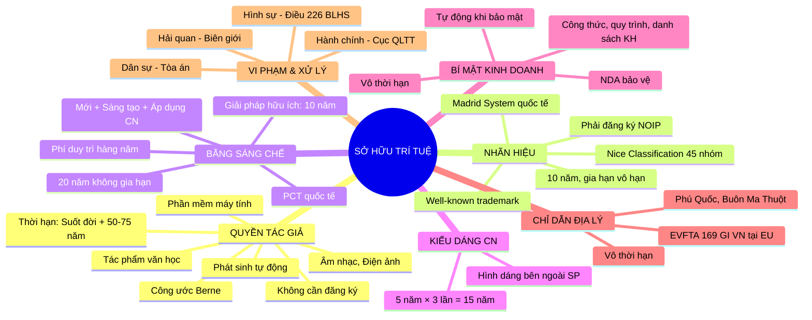

# LW05 — Sở Hữu Trí Tuệ (Intellectual Property)

> **Sở Hữu Trí Tuệ (SHTT)** là tổng thể các quyền của cá nhân, tổ chức đối với các thành quả của hoạt động sáng tạo tinh thần, bao gồm quyền tác giả, quyền liên quan, quyền sở hữu công nghiệp (nhãn hiệu, bằng sáng chế, kiểu dáng công nghiệp), quyền đối với giống cây trồng và bí mật kinh doanh. SHTT là tài sản vô hình quan trọng nhất của doanh nghiệp hiện đại.

---

## 1. Định Nghĩa & Tầm Quan Trọng

**Tại sao SHTT quan trọng với doanh nghiệp:**

| Loại SHTT | Giá trị điển hình | Ví dụ |
|---------|-----------------|-------|
| Nhãn hiệu (Trademark) | 40-60% tổng giá trị thương hiệu | Coca-Cola: $57 tỷ USD (nhãn hiệu) |
| Bằng sáng chế (Patent) | Độc quyền thị trường 20 năm | Thuốc: patent dược = 90% doanh thu |
| Quyền tác giả (Copyright) | Bảo hộ suốt đời + 50-75 năm | Disney: $80+ tỷ USD từ copyright |
| Bí mật kinh doanh | Không giới hạn thời gian | Coca-Cola formula: vô giá |

**Văn bản pháp luật chính:**
- **Luật SHTT 50/2005/QH11** — đạo luật gốc
- **Luật sửa đổi 36/2009/QH12** — sửa đổi lần 1
- **Luật sửa đổi 07/2022/QH15** — sửa đổi lần 2 (quan trọng nhất, hiệu lực 01/01/2023)
- **Nghị định 65/2023/NĐ-CP** — hướng dẫn thi hành Luật SHTT 2022
- **Hiệp định TRIPS** (Trade-Related Aspects of Intellectual Property Rights) — WTO
- **Hiệp ước PCT** (Patent Cooperation Treaty) — bằng sáng chế quốc tế
- **Nghị định thư Madrid** — nhãn hiệu quốc tế
- **Công ước Berne** — quyền tác giả quốc tế (VN tham gia 2004)

---

## 2. Lịch Sử & Nguồn Gốc

### Timeline pháp luật SHTT VN

```
1982 — Pháp lệnh đầu tiên về bảo hộ quyền sở hữu công nghiệp
1994 — BLDS 1994 — Phần VI quy định về SHTT
1995 — VN tham gia WIPO (World Intellectual Property Organization)
1996 — VN ký Hiệp định BTA song phương với Mỹ (quy định SHTT tiêu chuẩn cao)
2000 — VN tham gia Công ước Paris (sở hữu công nghiệp)
2001 — VN tham gia Thỏa ước Madrid (nhãn hiệu quốc tế)
2003 — VN tham gia PCT (bằng sáng chế quốc tế)
2004 — VN tham gia Công ước Berne (quyền tác giả)
2005 — Luật SHTT 50/2005 — Luật SHTT đầu tiên độc lập
2007 — VN gia nhập WTO → Cam kết TRIPS
2017 — CPTPP ký kết → Chuẩn IP cao hơn TRIPS
2020 — EVFTA hiệu lực → Chuẩn IP EU, bảo hộ chỉ dẫn địa lý
2022 — Luật SHTT sửa đổi 07/2022 — Điều chỉnh cho CPTPP, EVFTA
2023 — NĐ 65/2023 — Hướng dẫn chi tiết Luật SHTT 2022
```

---

## 3. Các Khái Niệm Cốt Lõi

| Khái niệm | Định nghĩa | Phát sinh bảo hộ |
|-----------|-----------|----------------|
| Quyền tác giả | Quyền của tác giả đối với tác phẩm do mình sáng tạo | Tự động (không cần đăng ký) |
| Nhãn hiệu | Dấu hiệu phân biệt hàng hóa/dịch vụ của DN | Khi được cấp Văn bằng bảo hộ |
| Bằng sáng chế | Độc quyền với sáng chế/giải pháp hữu ích | Khi được cấp Bằng sáng chế |
| Kiểu dáng công nghiệp | Hình dáng bên ngoài của sản phẩm | Khi được cấp Văn bằng bảo hộ |
| Bí mật kinh doanh | Thông tin bí mật có giá trị kinh doanh | Tự động (khi đáp ứng điều kiện) |
| Tên thương mại | Tên gọi phân biệt cơ sở KD | Tự động (khi đăng ký kinh doanh) |
| Chỉ dẫn địa lý | Dấu hiệu chỉ nguồn gốc địa lý của sản phẩm | Khi được cấp Văn bằng |
| IP due diligence | Thẩm định IP trong M&A | — |
| NOIP | National Office of Intellectual Property — Cục SHTT VN | — |

---

## 4. Khung Pháp Lý & Văn Bản Quy Phạm

### Cấu trúc Luật SHTT 2005 (sửa đổi 2022)

```
Luật SHTT 50/2005 (sửa đổi 07/2022)
    ├── Phần I: Quy định chung
    ├── Phần II: Quyền tác giả và quyền liên quan
    │       ├── Chương I: Tác phẩm được bảo hộ
    │       ├── Chương II: Quyền tác giả
    │       └── Chương III: Quyền liên quan
    ├── Phần III: Quyền sở hữu công nghiệp
    │       ├── Chương I: Nhãn hiệu
    │       ├── Chương II: Tên thương mại
    │       ├── Chương III: Chỉ dẫn địa lý
    │       ├── Chương IV: Bí mật kinh doanh
    │       ├── Chương V: Bằng sáng chế/GPHU
    │       ├── Chương VI: Kiểu dáng công nghiệp
    │       └── Chương VII: Thiết kế bố trí
    ├── Phần IV: Quyền đối với giống cây trồng
    └── Phần V: Xác lập, bảo vệ và thực thi quyền SHTT
```

### Hệ thống điều ước quốc tế VN tham gia

| Điều ước | Lĩnh vực | Năm VN tham gia |
|---------|---------|----------------|
| Công ước WIPO | SHTT nói chung | 1995 |
| Công ước Paris | Sở hữu công nghiệp | 2000 |
| Công ước Berne | Quyền tác giả | 2004 |
| Thỏa ước Madrid | Nhãn hiệu quốc tế | 2001 |
| Hiệp ước PCT | Bằng sáng chế quốc tế | 2003 |
| Hiệp định TRIPS/WTO | SHTT chuẩn quốc tế | 2007 |
| CPTPP Chương 18 | IP chuẩn cao | 2019 |
| EVFTA Chương 12 | IP, Chỉ dẫn địa lý EU | 2020 |

---

## 5. Quy Trình Thực Hiện / Trình Tự Pháp Lý

### Quy trình đăng ký nhãn hiệu tại VN (NOIP)

```
BƯỚC 1: Tra cứu nhãn hiệu trước khi nộp đơn
    ├── Tra cứu cơ sở dữ liệu NOIP (iplib.noip.gov.vn)
    ├── Tra cứu quốc tế (WIPO Global Brand Database)
    └── Kết quả: "Trùng" / "Tương tự" / "Không trùng"
    └── Thời gian: 1-2 ngày

BƯỚC 2: Chuẩn bị và nộp đơn
    ├── Hồ sơ: Tờ khai, mẫu nhãn hiệu, danh sách hàng hóa/dịch vụ (theo bảng Nice)
    ├── Nộp tại: NOIP Hà Nội / TP.HCM / Đà Nẵng, hoặc online qua IPPONLINE
    ├── Phí: 180.000đ/nhóm hàng hóa đầu tiên
    └── Nhận số đơn ngay khi nộp

BƯỚC 3: Thẩm định hình thức (1-2 tháng)
    ├── Kiểm tra đơn có đủ điều kiện hình thức
    └── Hợp lệ → Thông báo chấp nhận đơn hợp lệ

BƯỚC 4: Công bố đơn (tháng thứ 2-4)
    └── Đăng công báo SHTT 2 tháng cho bên thứ 3 phản đối

BƯỚC 5: Thẩm định nội dung (6-12 tháng)
    ├── Kiểm tra: Tính phân biệt, trùng/tương tự với nhãn hiệu đã đăng ký
    └── Kết quả: Từ chối / Chấp nhận cấp văn bằng

BƯỚC 6: Cấp Giấy Chứng Nhận Đăng Ký Nhãn Hiệu
    ├── Hiệu lực: 10 năm từ ngày nộp đơn
    └── Có thể gia hạn vô thời hạn (10 năm/lần)

TỔNG THỜI GIAN: 14-24 tháng (thực tế tại VN)
```

---

## 6. Các Hình Thức & Phân Loại

### 6.1 Bản đồ tổng thể SHTT

```
SỞ HỮU TRÍ TUỆ
    ├── QUYỀN TÁC GIẢ (Copyright)
    │       ├── Tác phẩm văn học (sách, bài viết, phần mềm)
    │       ├── Tác phẩm nghệ thuật (nhạc, phim, hội họa)
    │       ├── Tác phẩm phái sinh (dịch thuật, cải biên)
    │       └── Quyền liên quan (biểu diễn, bản ghi âm, phát sóng)
    │
    ├── QUYỀN SỞ HỮU CÔNG NGHIỆP
    │       ├── Nhãn hiệu (Trademark) — 10 năm, gia hạn vô thời hạn
    │       ├── Bằng sáng chế (Patent) — 20 năm độc quyền
    │       ├── Giải pháp hữu ích (Utility Model) — 10 năm
    │       ├── Kiểu dáng công nghiệp — 5 năm × 3 lần gia hạn (15 năm)
    │       ├── Tên thương mại — Tự động, bảo hộ khi sử dụng
    │       ├── Chỉ dẫn địa lý — Vô thời hạn
    │       └── Bí mật kinh doanh — Vô thời hạn (khi bảo mật)
    │
    └── QUYỀN ĐỐI VỚI GIỐNG CÂY TRỒNG — 20-25 năm
```

### 6.2 So sánh các loại SHTT cốt lõi

| | Nhãn hiệu | Bằng sáng chế | Quyền tác giả | Bí mật KD |
|--|----------|--------------|--------------|----------|
| Cần đăng ký? | Có | Có | Không | Không |
| Thời hạn | Vô thời hạn | 20 năm | Suốt đời + 50/75 năm | Vô thời hạn |
| Phạm vi | Hàng hóa/dịch vụ | Toàn thế giới (nếu đăng ký) | Toàn thế giới | Phụ thuộc bảo mật |
| Chi phí duy trì | Gia hạn 10 năm/lần | Phí duy trì hàng năm | Không có | Chi phí bảo mật |
| Mất bảo hộ | Không gia hạn, không sử dụng 5 năm | Hết hạn 20 năm | Hết thời hạn | Lộ ra ngoài |

---

## 7. Điều Kiện & Yêu Cầu

### 7.1 Điều kiện đăng ký nhãn hiệu (Điều 72-73 Luật SHTT)

**Nhãn hiệu được bảo hộ nếu:**
- Là dấu hiệu nhìn thấy được (chữ, hình, màu sắc, tổ hợp)
- Có khả năng phân biệt hàng hóa/dịch vụ
- Không thuộc danh mục từ chối (Điều 73):

**Không được đăng ký:**
- Dấu hiệu mô tả trực tiếp (generic): "Ngon", "Tươi", "Rẻ"
- Dấu hiệu địa danh (trừ khi có phân biệt)
- Hình quốc kỳ, quốc huy, biểu tượng quốc gia
- Gây nhầm lẫn về chất lượng, xuất xứ
- Trùng với nhãn hiệu nổi tiếng (well-known trademark)
- Trùng/tương tự với nhãn hiệu đã đăng ký trước

### 7.2 Điều kiện cấp Bằng sáng chế (Điều 58-60)

Ba điều kiện bắt buộc:
1. **Tính mới** (novelty): Chưa được công bố/sử dụng công khai trước ngày nộp đơn trên toàn thế giới
2. **Trình độ sáng tạo** (inventive step): Không hiển nhiên với người có kỹ năng trong lĩnh vực đó
3. **Khả năng áp dụng công nghiệp** (industrial applicability): Có thể sản xuất, sử dụng trong sản xuất

**Giải pháp hữu ích (Utility Model):**
- Chỉ cần tính mới + khả năng áp dụng (không cần trình độ sáng tạo)
- Thời hạn bảo hộ: 10 năm
- Dễ đăng ký hơn, phù hợp với sáng kiến cải tiến nhỏ

### 7.3 Điều kiện bảo hộ bí mật kinh doanh (Điều 84)

- Thông tin **không phải** là hiểu biết thông thường
- Có **giá trị kinh doanh** vì tính bí mật
- Chủ sở hữu đã **áp dụng các biện pháp bảo mật** cần thiết

---

## 8. Rủi Ro Pháp Lý & Cách Phòng Tránh

### 8.1 Top 10 rủi ro SHTT doanh nghiệp VN

| Rủi ro | Hậu quả | Phòng tránh |
|--------|---------|-------------|
| Không đăng ký nhãn hiệu sớm | Bị người khác đăng ký trước (trademark squatting) | Đăng ký ngay khi có ý tưởng |
| Nhân viên tạo IP thuộc về nhân viên | IP không thuộc sở hữu công ty | Điều khoản chuyển nhượng IP trong HĐLĐ |
| Sử dụng phần mềm lậu | Bị kiện bản quyền, phạt hành chính | Mua license bản quyền |
| NDA không đủ mạnh | Lộ bí mật kinh doanh | NDA rõ ràng, cụ thể, có chế tài |
| Website/App vi phạm bản quyền | Bị kiện, gỡ nội dung, phạt | Kiểm tra license nội dung |
| Nhãn hiệu tương tự nhãn hiệu nổi tiếng | Bị kiện, phải đổi tên | Tra cứu trước khi đặt tên |
| Hàng nhái, hàng giả thương hiệu của mình | Mất doanh thu, uy tín | Đăng ký nhãn hiệu, theo dõi vi phạm |
| Công bố sáng chế trước khi nộp đơn | Mất tính mới, không được cấp patent | Nộp đơn trước khi công bố bất kỳ đâu |
| Không đăng ký tên miền tương ứng | Cybersquatting | Đăng ký .vn, .com song song nhãn hiệu |
| IP của nhà thầu/freelancer | IP thuộc nhà thầu, không thuộc công ty | Điều khoản IP trong HĐ thuê ngoài |

---

## 9. Best Practices / Thực Hành Tốt

### 9.1 IP Strategy cho doanh nghiệp

**Giai đoạn Startup:**
1. Đăng ký nhãn hiệu ngay (cùng lúc đặt tên)
2. Đăng ký tên miền .vn và .com
3. Điều khoản IP trong HĐLĐ và HĐ nhà thầu
4. NDA với đối tác, nhà đầu tư
5. Lưu trữ bằng chứng sáng tạo (dated evidence)

**Giai đoạn Scale-up:**
6. Mở rộng đăng ký nhãn hiệu sang thị trường mục tiêu
7. Cân nhắc đăng ký patent nếu có sáng chế
8. Xây dựng IP Policy nội bộ
9. IP Due Diligence định kỳ
10. Monitoring hàng nhái

**Giai đoạn M&A / IPO:**
11. IP Audit toàn diện
12. Định giá IP
13. Chuyển giao IP đúng thủ tục
14. Đảm bảo chain of title

### 9.2 Trademark Filing Strategy

- **Nộp đơn sớm nhất có thể**: Hệ thống first-to-file tại VN (không phải first-to-use)
- **Nộp đa nhóm**: Xác định đầy đủ nhóm hàng hóa/dịch vụ (Nice Classification)
- **Sử dụng Madrid System**: Nộp một đơn, bảo hộ nhiều quốc gia
- **Gia hạn đúng hạn**: Trước 6 tháng khi hết hạn 10 năm
- **Kiểm soát sử dụng nhãn hiệu**: Cấp phép đúng cách, không để mất phân biệt

---

## 10. Sai Lầm Phổ Biến Doanh Nghiệp

### Top 10 sai lầm SHTT doanh nghiệp VN

1. **Đặt tên thương hiệu mang tính mô tả** — "Nước ngon", "Giày đẹp" → Không thể đăng ký nhãn hiệu
2. **Không kiểm tra trước khi đặt tên** — Đặt tên trùng nhãn hiệu đã đăng ký → Kiện tụng, đổi tên tốn kém
3. **Nhân viên tạo IP nhưng không có điều khoản chuyển nhượng** — IP thuộc nhân viên → Công ty không sở hữu
4. **Công bố sáng kiến trên mạng trước khi nộp đơn** — Mất tính mới → Không được cấp patent
5. **NDA chung chung** — "Giữ bí mật" không đủ → Không thể kiện khi lộ
6. **Không gia hạn nhãn hiệu** — Hết 10 năm không gia hạn → Mất bảo hộ, người khác đăng ký
7. **Không đăng ký nhãn hiệu ở thị trường XK** — Hàng xuất khẩu bị bắt giữ tại nước ngoài
8. **Sử dụng ảnh, nhạc, font chữ không bản quyền** — Bị kiện bản quyền
9. **Dùng tên miền vi phạm nhãn hiệu người khác** — Bị thu hồi tên miền, phải bồi thường
10. **Không theo dõi hàng giả/nhái** — Thương hiệu bị đánh cắp mà không biết

---

## 11. Case Study VN — SHTT Thực Tế

### Case 1: Trademark Squatting — "Phở 24" & Vụ tranh chấp nhãn hiệu

**Bối cảnh:**
- Phở 24 (chuỗi phở VN) nổi tiếng nhưng không kịp đăng ký nhãn hiệu tại Trung Quốc
- Đối tác Trung Quốc (sau khi nhận franchise) tự đăng ký nhãn hiệu "Phở 24" tại TQ
- Phở 24 không thể xuất khẩu thương hiệu sang TQ vì không sở hữu nhãn hiệu ở đó

**Bài học:** Đăng ký nhãn hiệu tại thị trường mục tiêu TRƯỚC khi tiếp thị hoặc ký franchise

### Case 2: Vi phạm bản quyền phần mềm — Microsoft kiện doanh nghiệp VN

**Bối cảnh (2019-2022):**
- Microsoft phối hợp với Cục SHTT và thanh tra xử lý hàng trăm doanh nghiệp VN dùng Windows lậu
- Phạt điển hình: 50-200 triệu VNĐ/doanh nghiệp + Buộc mua license
- Nhiều DN không biết "phần mềm lậu = vi phạm bản quyền"

**Bài học:** Kiểm tra toàn bộ phần mềm trong công ty, mua license hợp pháp

### Case 3: Bí mật kinh doanh — Nhân viên mang công thức sang đối thủ

**Tình huống:**
- Giám đốc R&D công ty thực phẩm VN nghỉ việc, gia nhập đối thủ
- Mang theo danh sách nhà cung cấp độc quyền + công thức chế biến
- Công ty cũ phát hiện, kiện dân sự

**Vấn đề pháp lý:**
- Có NDA và điều khoản bảo mật trong HĐLĐ
- Công thức đã được lưu trữ bí mật (server nội bộ, mã hóa)
- Bằng chứng: Email GĐ gửi công thức cho đối thủ

**Kết quả:**
- Tòa án TP.HCM phán quyết: Vi phạm bí mật kinh doanh + Vi phạm HĐLĐ
- Bồi thường: 2 tỷ VNĐ + Đối thủ phải dừng sử dụng công thức

**Bài học:** NDA + Biện pháp kỹ thuật bảo mật + Bằng chứng rõ ràng

### Case 4: Chỉ dẫn địa lý — Nước mắm Phú Quốc bị làm nhái

**Bối cảnh:**
- "Phú Quốc" được cấp Chỉ dẫn địa lý (GI) — đầu tiên của VN được EU công nhận (2012)
- Nhiều doanh nghiệp tại tỉnh khác ghi "Nước mắm Phú Quốc" trên nhãn
- Cục SHTT + QLTT xử lý hàng chục vụ vi phạm

**Kết quả:** Phú Quốc GI được bảo hộ nghiêm túc hơn sau EVFTA (2020)

---

## 12. So Sánh Với Pháp Luật Quốc Tế

### 12.1 TRIPS vs Luật SHTT VN

| Tiêu chí | TRIPS (WTO minimum) | VN (sau Luật 2022) |
|---------|--------------------|--------------------|
| Nhãn hiệu | Bảo hộ tối thiểu 7 năm | 10 năm + gia hạn |
| Bằng sáng chế | 20 năm | 20 năm |
| Quyền tác giả | Suốt đời + 50 năm | Suốt đời + 50 năm (cá nhân) / 75 năm (tổ chức) |
| Thực thi | Phải có quy trình dân sự + hình sự | Có đủ (còn yếu trên thực tế) |
| GI | Bảo hộ chỉ dẫn địa lý | Có + EU GI theo EVFTA |

### 12.2 CPTPP Chương 18 — Yêu cầu cao hơn TRIPS

- **Dược phẩm**: Bảo hộ dữ liệu thử nghiệm lâm sàng 5 năm
- **Bán dẫn**: Bảo hộ thiết kế mạch tích hợp
- **Internet**: Trách nhiệm ISP (Internet Safe Harbor)
- **Thuốc generic**: Phải thông báo trước khi ra thị trường
- **Thời hạn copyright**: Có lộ trình mở rộng (VN xin bảo lưu một số điều khoản)

### 12.3 EVFTA Chương 12 — Chỉ Dẫn Địa Lý

- EU công nhận 169 GI của VN tại EU
- VN công nhận 196 GI của EU tại VN
- Quan trọng: Cà phê Buôn Ma Thuột, Phú Quốc (nước mắm, hồ tiêu), Bảo Lộc (lụa), Mộc Châu (sữa)

---

## 13. Checklist Tuân Thủ

### IP Compliance Checklist cho doanh nghiệp

**Nhãn hiệu:**
- [ ] Tra cứu nhãn hiệu trước khi ra mắt sản phẩm mới
- [ ] Nộp đơn đăng ký nhãn hiệu tại VN (NOIP)
- [ ] Nộp đơn quốc tế (Madrid) cho thị trường xuất khẩu mục tiêu
- [ ] Gia hạn nhãn hiệu trước khi hết hạn 10 năm
- [ ] Theo dõi nhãn hiệu tương tự mới nộp đơn

**Bằng sáng chế:**
- [ ] Kiểm tra tính mới trước khi công bố bất kỳ đâu
- [ ] Nộp đơn sáng chế trước khi giới thiệu sản phẩm ra thị trường
- [ ] Đóng phí duy trì sáng chế hàng năm

**Quyền tác giả:**
- [ ] Đăng ký tác phẩm tại Cục Bản quyền Tác giả (tuy không bắt buộc nhưng giúp chứng minh)
- [ ] Kiểm tra license phần mềm sử dụng trong công ty
- [ ] Kiểm tra bản quyền nội dung trên website, mạng xã hội
- [ ] Điều khoản chuyển nhượng IP trong HĐLĐ và HĐ thuê ngoài

**Bí mật kinh doanh:**
- [ ] NDA với đối tác, nhà đầu tư, nhân viên cấp cao
- [ ] Phân cấp truy cập thông tin (need-to-know basis)
- [ ] Mã hóa tài liệu bí mật
- [ ] Quy trình xử lý khi nhân viên nghỉ việc

---

## 14. Nhãn Hiệu (Trademark) — Chuyên Sâu

### 14.1 Phân loại nhãn hiệu

| Loại | Mô tả | Ví dụ |
|------|-------|-------|
| Nhãn hiệu thông thường | Nhãn hiệu hàng hóa/dịch vụ tiêu chuẩn | VINAMILK, VIETTEL |
| Nhãn hiệu tập thể | Dùng cho nhiều thành viên cùng hiệp hội | Nhãn hiệu tập thể làng nghề |
| Nhãn hiệu chứng nhận | Chứng nhận tiêu chuẩn chất lượng | VietGAP, Organic |
| Nhãn hiệu nổi tiếng | Được biết đến rộng rãi, bảo hộ đặc biệt | COCA-COLA, SAMSUNG tại VN |

### 14.2 Hệ thống phân loại Nice (Nice Classification)

- **45 nhóm hàng hóa và dịch vụ** (Nice Class)
- Nhóm 1-34: Hàng hóa
- Nhóm 35-45: Dịch vụ
- Mỗi nhóm tính phí riêng khi đăng ký

**Các nhóm phổ biến cho doanh nghiệp VN:**
| Nice Class | Lĩnh vực |
|-----------|---------|
| 25 | Quần áo, giày dép, mũ |
| 35 | Quảng cáo, quản lý kinh doanh |
| 36 | Tài chính, ngân hàng, bảo hiểm |
| 38 | Viễn thông |
| 42 | Dịch vụ khoa học, công nghệ, phần mềm |
| 43 | Dịch vụ cung cấp thực phẩm và đồ uống |

### 14.3 Nhãn hiệu nổi tiếng (Well-Known Trademark)

- Được bảo hộ ngay cả khi chưa đăng ký tại VN (Điều 75 Luật SHTT)
- Tiêu chí đánh giá: Mức độ biết đến, thị phần, giá trị đầu tư quảng cáo, thời gian sử dụng...
- Bảo hộ ngay cả với hàng hóa/dịch vụ khác loại nếu gây nhầm lẫn
- Ví dụ VN: Apple, Google, Samsung, Toyota... được công nhận nhãn hiệu nổi tiếng tại VN

### 14.4 Hệ thống Madrid — Đăng ký nhãn hiệu quốc tế

**Quy trình Madrid:**
1. Đăng ký nhãn hiệu gốc tại NOIP (VN)
2. Nộp đơn Madrid thông qua NOIP → WIPO
3. WIPO thông báo cho từng quốc gia được chỉ định
4. Từng quốc gia thẩm định (18 tháng)
5. Nhãn hiệu quốc tế có hiệu lực 10 năm

**Ưu điểm Madrid:**
- Một đơn, một ngôn ngữ (tiếng Anh/Pháp/Tây Ban Nha), một khoản phí
- Quản lý tập trung tại WIPO
- Dễ gia hạn, sửa đổi đồng thời nhiều quốc gia

**Lưu ý:** Madrid phụ thuộc vào đơn gốc trong 5 năm đầu (central attack risk)

---

## 15. Bằng Sáng Chế & Giải Pháp Hữu Ích — Chuyên Sâu

### 15.1 Phân biệt Sáng chế vs GPHU

| Tiêu chí | Bằng sáng chế (Patent) | Giải pháp hữu ích (Utility Model) |
|---------|----------------------|----------------------------------|
| Điều kiện | Mới + Sáng tạo + Áp dụng được | Mới + Áp dụng được (không cần sáng tạo) |
| Thời hạn | 20 năm | 10 năm |
| Chi phí | Cao hơn | Thấp hơn |
| Thẩm định | Nghiêm ngặt | Đơn giản hơn |
| Phù hợp | Sáng chế đột phá | Cải tiến nhỏ, sáng kiến sản xuất |

### 15.2 Quy trình nộp đơn sáng chế VN

```
BƯỚC 1: Mô tả sáng chế (Patent Specification)
    ├── Phần mô tả (Description): Chi tiết, đầy đủ để người có kỹ năng thực hiện được
    ├── Yêu cầu bảo hộ (Claims): Xác định phạm vi bảo hộ (quan trọng nhất)
    ├── Hình vẽ (Drawings): Nếu cần
    └── Tóm tắt (Abstract): 150-250 từ

BƯỚC 2: Nộp đơn tại NOIP
    └── Phí: Tùy số yêu cầu bảo hộ và độ dài mô tả

BƯỚC 3: Thẩm định hình thức (1 tháng)

BƯỚC 4: Công bố đơn (tháng thứ 18 từ ngày ưu tiên)
    └── Hoặc sớm hơn nếu yêu cầu

BƯỚC 5: Yêu cầu thẩm định nội dung (trong 42 tháng từ ngày ưu tiên)
    └── Phải nộp yêu cầu và phí thẩm định nội dung

BƯỚC 6: Thẩm định nội dung (12-18 tháng)
    └── NOIP kiểm tra 3 điều kiện (mới, sáng tạo, áp dụng)

BƯỚC 7: Cấp Bằng sáng chế
    └── Hiệu lực: 20 năm từ ngày nộp đơn
    └── Phí duy trì: Hàng năm từ năm thứ 2

TỔNG THỜI GIAN: 2-4 năm (VN), dài hơn nếu có phản đối
```

### 15.3 PCT — Bảo hộ sáng chế quốc tế

**Patent Cooperation Treaty (PCT):**
- Nộp 1 đơn PCT → Ứng dụng tại 155+ quốc gia
- Thời gian: 30 tháng (18 tháng Phase I + giai đoạn national)
- Ưu điểm: Trì hoãn chi phí quốc tế hóa 30 tháng
- Nhược điểm: Vẫn phải nộp phí riêng từng quốc gia cuối cùng

**VN có thể nộp PCT qua NOIP** (national phase: NOIP xử lý đơn PCT vào VN)

### 15.4 Patent tại VN — Thực trạng

- Số lượng patent đăng ký tại VN 2022: ~80% là từ nhà đầu tư nước ngoài
- VN đứng cuối ASEAN về đăng ký patent nội địa
- Nguyên nhân: Nhận thức thấp, chi phí cao, quy trình phức tạp, thực thi yếu
- Xu hướng tích cực: R&D trong bán dẫn, công nghệ tăng từ 2020

---

## 16. Quyền Tác Giả (Copyright) — Chuyên Sâu

### 16.1 Tác phẩm được bảo hộ (Điều 14 Luật SHTT)

| Loại tác phẩm | Ví dụ | Thời hạn bảo hộ |
|-------------|-------|----------------|
| Tác phẩm văn học | Sách, thơ, tiểu thuyết | Suốt đời + 50 năm |
| Tác phẩm nghệ thuật | Nhạc, tranh, phim | Suốt đời + 50 năm |
| Phần mềm máy tính | App, game, website code | Suốt đời + 50 năm (tác giả) |
| Tác phẩm điện ảnh | Phim, video clip | 75 năm từ công bố |
| Tác phẩm của tổ chức | Báo, tạp chí, ấn phẩm | 75 năm từ công bố |
| Tác phẩm phái sinh | Dịch thuật, cải biên | Suốt đời tác giả + 50 năm |

### 16.2 Quyền tác giả tự động phát sinh

- **Không cần đăng ký** — bảo hộ tự động từ khi tác phẩm được tạo ra
- Đăng ký tại Cục Bản quyền Tác giả (Bộ VHTT&DL): **Không bắt buộc** nhưng **khuyến nghị** vì giúp chứng minh sở hữu khi tranh chấp
- Giấy chứng nhận bản quyền = chứng cứ suy đoán (presumptive evidence)

### 16.3 Quyền kinh tế và quyền nhân thân

**Quyền nhân thân (Không thể chuyển nhượng):**
- Quyền đặt tên tác phẩm
- Quyền đứng tên tác giả
- Quyền bảo vệ sự toàn vẹn tác phẩm

**Quyền kinh tế (Có thể chuyển nhượng/li-xăng):**
- Sao chép, in ấn, phân phối
- Truyền đạt đến công chúng (phát sóng, online)
- Làm tác phẩm phái sinh
- Cho thuê bản gốc

### 16.4 Fair Use / Ngoại lệ Bản Quyền (Điều 25)

Được sử dụng tác phẩm mà không cần xin phép:
- **Mục đích cá nhân**, không kinh doanh
- **Giảng dạy, nghiên cứu, báo chí** — Phải chú thích nguồn
- **Thư viện**, lưu trữ — Với điều kiện nhất định
- **Trích dẫn** — Hợp lý, có nguồn gốc

### 16.5 IP trong phần mềm và game

- Phần mềm được bảo hộ như tác phẩm văn học
- **Code** = tác phẩm bảo hộ quyền tác giả
- **Giao diện người dùng (UI)** = có thể bảo hộ bản quyền
- **Tính năng, thuật toán** = Cần Patent (không thể bảo hộ bằng copyright)
- **Tên app, logo** = Nhãn hiệu
- **Character trong game** = Quyền tác giả + Nhãn hiệu

---

## 17. Bí Mật Kinh Doanh (Trade Secret)

### 17.1 Định nghĩa và điều kiện (Điều 84-85 Luật SHTT)

**Bí mật kinh doanh được bảo hộ khi:**
1. Không phải hiểu biết thông thường và không dễ dàng có được
2. Khi được sử dụng trong kinh doanh sẽ tạo cho người nắm giữ lợi thế so với người không nắm giữ
3. Được chủ sở hữu bảo mật bằng các biện pháp cần thiết

**Ví dụ:**
- Công thức sản phẩm (Coca-Cola formula)
- Danh sách khách hàng, nhà cung cấp
- Quy trình sản xuất độc quyền
- Chiến lược kinh doanh chưa công bố
- Thông tin giá thành, chi phí

### 17.2 Công cụ bảo vệ bí mật kinh doanh

**NDA (Non-Disclosure Agreement):**
```
Điều khoản NDA hiệu quả cần:
1. Định nghĩa rõ "thông tin bí mật" (không quá rộng, không quá hẹp)
2. Phạm vi nghĩa vụ bảo mật cụ thể
3. Thời hạn: 2-5 năm sau khi HĐ kết thúc (hoặc vô thời hạn với bí mật thực sự)
4. Ngoại lệ: Thông tin công cộng, đã biết trước, độc lập tạo ra
5. Chế tài: Phạt vi phạm (LTM max 8%) + Bồi thường thiệt hại
6. Injunction: Quyền yêu cầu lệnh tạm đình chỉ khẩn cấp
```

**Biện pháp kỹ thuật:**
- Password protect tài liệu quan trọng
- Phân quyền truy cập theo need-to-know
- DRM (Digital Rights Management) cho file số
- Watermark tài liệu bí mật
- Audit log truy cập hệ thống

**Biện pháp hành chính:**
- Gắn nhãn "BÍ MẬT" / "CONFIDENTIAL" trên tài liệu
- Chính sách clear desk, clean screen
- Hủy tài liệu đúng cách (shredder)
- Kiểm soát USB, thiết bị lưu trữ

---

## 18. Kiểu Dáng Công Nghiệp

### 18.1 Khái niệm (Điều 63-67 Luật SHTT)

**Kiểu dáng công nghiệp = Hình dáng bên ngoài của sản phẩm** thể hiện qua:
- Hình khối, đường nét, màu sắc, hoa văn
- Hoặc kết hợp các yếu tố trên

**Điều kiện:**
- Mới so với kiểu dáng đã tiết lộ/sử dụng
- Không phải đặc điểm kỹ thuật (hình dáng do chức năng kỹ thuật quyết định)
- Áp dụng được (sản xuất hàng loạt được)

### 18.2 Thời hạn và gia hạn

- Thời hạn bảo hộ ban đầu: **5 năm**
- Gia hạn: Mỗi lần 5 năm, tối đa **3 lần gia hạn** (tổng 15 năm)
- Khác với sáng chế: Thời hạn ngắn hơn, phù hợp với vòng đời sản phẩm thời trang, điện tử

### 18.3 Ứng dụng thực tế

- Thiết kế vỏ điện thoại, máy tính
- Thiết kế đồ gia dụng, nội thất
- Thiết kế phương tiện giao thông
- Thiết kế bao bì sản phẩm
- Thiết kế thời trang (hạn chế vì thay đổi nhanh)

---

## 19. Chỉ Dẫn Địa Lý (Geographical Indication)

### 19.1 Khái niệm (Điều 79-83 Luật SHTT)

**Chỉ dẫn địa lý = Dấu hiệu chỉ nguồn gốc địa lý** của hàng hóa đặc thù từ vùng đó.

Bảo hộ khi:
- Sản phẩm có chất lượng đặc thù, danh tiếng hoặc đặc điểm xuất phát từ điều kiện địa lý
- Sản phẩm được sản xuất tại khu vực địa lý tương ứng

### 19.2 Chỉ dẫn địa lý nổi tiếng VN

| Sản phẩm | Địa danh | Đặc điểm |
|---------|---------|---------|
| Nước mắm | Phú Quốc | GI đầu tiên của VN được EU công nhận |
| Hồ tiêu | Phú Quốc, Chư Sê | Hương vị đặc trưng |
| Cà phê | Buôn Ma Thuột | Robusta chất lượng cao |
| Lụa | Bảo Lộc | Lụa tơ tằm truyền thống |
| Sữa | Mộc Châu | Khí hậu đặc biệt cho bò sữa |
| Thanh long | Bình Thuận | Đỏ ruột, giòn ngọt |
| Vải | Lục Ngạn, Bắc Giang | Vải thiều thơm ngọt |
| Cam | Cao Phong, Hà Giang | Hàm lượng vitamin C cao |

### 19.3 Bảo hộ GI theo EVFTA

- 169 GI VN được EU bảo hộ tự động trong khối EU
- 196 GI EU (Champagne, Parmigiano Reggiano...) được bảo hộ tại VN
- Ý nghĩa kinh tế: Hàng VN mang GI có giá trị gia tăng cao hơn khi xuất khẩu vào EU

---

## 20. SHTT Trong M&A & Đầu Tư

### 20.1 IP Due Diligence

**Mục đích:** Xác định IP nào tồn tại, ai sở hữu, tình trạng pháp lý, rủi ro

**Quy trình IP DD:**
1. **Lập Danh mục IP (IP Inventory)**:
   - Liệt kê tất cả nhãn hiệu, sáng chế, quyền tác giả, bí mật KD
   - Trạng thái: Đã đăng ký, đang xử lý, chưa đăng ký

2. **Kiểm tra Sở hữu (Ownership Check)**:
   - Ai thực sự sở hữu IP? (Người sáng lập, công ty, hay nhân viên?)
   - Có điều khoản chuyển nhượng IP trong HĐLĐ không?
   - IP của nhà thầu có được chuyển nhượng về công ty không?

3. **Kiểm tra Hiệu lực (Validity Check)**:
   - Nhãn hiệu còn hiệu lực, đã gia hạn chưa?
   - Sáng chế đã đóng phí duy trì chưa?
   - Copyright có thể chứng minh được không?

4. **Kiểm tra Gánh nặng (Encumbrance Check)**:
   - IP có đang thế chấp ngân hàng không?
   - Có license nào đã cấp cho bên thứ ba?
   - Có tranh chấp, kiện tụng liên quan không?

5. **Kiểm tra Vi phạm (Infringement Check)**:
   - Công ty mục tiêu có đang vi phạm IP người khác không?
   - Có ai đang vi phạm IP của công ty mục tiêu không?

### 20.2 Định giá IP

**Các phương pháp định giá IP:**

| Phương pháp | Mô tả | Áp dụng |
|------------|-------|---------|
| Cost approach | Chi phí tạo ra IP | Patent, phần mềm |
| Market approach | So sánh giao dịch tương tự | Nhãn hiệu, content |
| Income approach | Dòng tiền từ IP | License, franchise |
| Relief from royalty | Royalty tiết kiệm được khi có IP | Nhãn hiệu |

### 20.3 Chuyển giao IP trong M&A

**Chuyển nhượng quyền SHTT:**
- Phải bằng văn bản
- Đăng ký với NOIP (đối với sở hữu công nghiệp đã đăng ký)
- Thông báo Cục Bản quyền (đối với quyền tác giả đã đăng ký)

**Li-xăng (License IP):**
- Độc quyền (exclusive) / Không độc quyền (non-exclusive)
- Phải đăng ký với NOIP để có hiệu lực với bên thứ ba
- Royalty: Phí li-xăng (tỷ lệ % doanh thu hoặc cố định)

---

## 21. Xử Lý Vi Phạm SHTT Tại VN

### 21.1 Các biện pháp xử lý

**Biện pháp hành chính (phổ biến nhất):**
- Cơ quan xử lý: Cục SHTT, Cục QLTT (Bộ Công Thương), Hải quan, Công an
- Hình thức: Phạt tiền + Tịch thu hàng vi phạm + Buộc tiêu hủy
- Thẩm quyền: Cục QLTT ra QĐ xử phạt

**Biện pháp dân sự:**
- Khởi kiện tại TAND có thẩm quyền
- Yêu cầu bồi thường thiệt hại thực tế
- Yêu cầu lệnh tạm đình chỉ (injunction) khẩn cấp
- Thời hiệu: 2 năm từ khi phát hiện vi phạm

**Biện pháp hình sự (Điều 226 BLHS 2015):**
```
Tội xâm phạm quyền SHTT (Điều 226 BLHS):
- Vi phạm bản quyền có mục đích kinh doanh, quy mô thương mại
- Xâm phạm quyền SHCN: Nhãn hiệu, chỉ dẫn địa lý
Hình phạt:
- Phạt tiền: 50-500 triệu VNĐ (cá nhân), 100 triệu đến 3 tỷ (pháp nhân)
- Tù giam: 6 tháng - 3 năm (cá nhân)
- Pháp nhân: Đình chỉ 6 tháng - 3 năm
```

**Biện pháp tại biên giới (Hải quan):**
- Yêu cầu tạm dừng thông quan hàng nghi vi phạm
- Hải quan xem xét, tiêu hủy hoặc trả lại
- Cơ sở: Điều 216 Luật SHTT 2022

### 21.2 Quy trình xử lý vi phạm thực tế

```
PHÁT HIỆN VI PHẠM
    │
    ├── Mua hàng mẫu + Giám định SHTT (Cục SHTT xác nhận vi phạm)
    │
    ├── Lựa chọn biện pháp:
    │       ├── Hành chính: Gửi khiếu nại đến Cục QLTT/Hải quan
    │       ├── Dân sự: Gửi ceasing letter + Khởi kiện nếu không phản hồi
    │       └── Hình sự: Tố giác tội phạm (ít dùng, chứng minh khó)
    │
    └── Giám định SHTT (Viện KHSHTT, Cục SHTT, WIPO)
            └── Kết luận giám định = Căn cứ quan trọng nhất để xử lý
```

### 21.3 Thực trạng thực thi SHTT tại VN

**Điểm mạnh:**
- Luật tương đối đầy đủ, phù hợp TRIPS
- Cục QLTT tích cực với hàng nhái, hàng giả
- Hải quan: Cơ chế tạm dừng thông quan

**Điểm yếu:**
- Tòa án VN ít kinh nghiệm với SHTT, thời gian dài
- Bồi thường thấp, không đủ răn đe
- Hàng nhái tràn lan (quần áo, điện tử, mỹ phẩm)
- Phần mềm lậu phổ biến
- Thiếu nhân lực chuyên môn SHTT

---

## 22. Trademark Watching & Enforcement

### 22.1 Hệ thống theo dõi nhãn hiệu

**Trademark watching service:**
- Theo dõi đơn mới nộp tại NOIP
- Cảnh báo khi có nhãn hiệu tương tự nộp đơn
- Dịch vụ: Clarivate Derwent, Thomson Reuters, các công ty IP địa phương

**Online monitoring:**
- Theo dõi vi phạm trên Facebook, Shopee, Lazada, TikTok Shop
- Theo dõi vi phạm tên miền
- Công cụ: Google Alerts, brand monitoring tools

### 22.2 Quy trình xử lý hàng giả, hàng nhái

1. **Giai đoạn chuẩn bị:**
   - Đăng ký nhãn hiệu (bắt buộc trước)
   - Đăng ký Cơ sở Dữ liệu Nhãn hiệu tại Cục QLTT
   - Cung cấp mẫu hàng thật để so sánh

2. **Phát hiện vi phạm:**
   - Mua hàng giả + chụp ảnh, ghi địa điểm
   - Yêu cầu giám định tại Cục SHTT

3. **Xử lý:**
   - Gửi Đơn đề nghị xử lý vi phạm đến Cục QLTT
   - Đoàn kiểm tra đến tại chỗ
   - Ra quyết định xử phạt + Tịch thu + Tiêu hủy

---

## 23. SHTT Trong Hợp Đồng

### 23.1 Điều khoản IP trong HĐLĐ

```
"Điều X — Quyền Sở Hữu Trí Tuệ
1. Mọi kết quả lao động, sản phẩm, phần mềm, tác phẩm, sáng chế, 
   kiểu dáng, nhãn hiệu, bí mật kinh doanh và các tài sản sở hữu 
   trí tuệ khác do Người lao động tạo ra trong quá trình thực hiện 
   công việc hoặc có liên quan đến hoạt động kinh doanh của Công ty 
   đều thuộc sở hữu của Công ty.
2. Người lao động đồng ý thực hiện mọi hành động cần thiết để 
   chuyển giao, đăng ký và bảo hộ các quyền SHTT nêu trên theo 
   yêu cầu của Công ty.
3. Khi chấm dứt hợp đồng, Người lao động phải bàn giao toàn bộ 
   tài liệu, dữ liệu, mã nguồn và tài sản IP cho Công ty."
```

### 23.2 Điều khoản IP trong HĐ với nhà thầu/freelancer

```
"Intellectual Property Assignment:
Upon full payment of fees, Contractor hereby irrevocably assigns 
to Company all right, title, and interest in and to the Work, 
including all intellectual property rights therein, throughout 
the universe in perpetuity, including all patents, copyrights, 
trademarks, trade secrets, and other proprietary rights."
```

### 23.3 Li-xăng Công nghệ (Technology License)

**Điều khoản quan trọng trong Li-xăng:**
- Độc quyền hay không độc quyền?
- Phạm vi lãnh thổ
- Quyền cấp li-xăng lại (sub-license)
- Royalty rate và cách tính
- Thời hạn li-xăng
- Chấm dứt li-xăng (termination for breach)
- Audit rights (kiểm tra sổ sách royalty)

---

## 24. Bảo Hộ SHTT Cho Startup Công Nghệ

### 24.1 IP Stack cho Tech Startup VN

| Tài sản IP | Bảo hộ bằng | Ưu tiên |
|-----------|------------|--------|
| Tên thương hiệu + Logo | Nhãn hiệu | Ngay lập tức |
| Tên miền .vn, .com | Đăng ký tên miền | Ngay lập tức |
| Code/App | Quyền tác giả (tự động) + Đăng ký tùy chọn | Tự động |
| Thuật toán độc đáo | Patent (nếu đủ tiêu chí) | Khi có đủ tính mới |
| UX/UI thiết kế | Quyền tác giả + Kiểu dáng CN | Nếu đủ điều kiện |
| Data, Database | Bí mật kinh doanh + Điều khoản BQLTT | Ngay lập tức |
| Quy trình kinh doanh | Bí mật kinh doanh + NDA | Ngay lập tức |

### 24.2 SHTT và gọi vốn đầu tư

- **VC/Angel Investors** yêu cầu IP trong công ty phải rõ ràng
- IP DD trong term sheet: Xác nhận công ty sở hữu IP
- IP không sạch = valuation giảm = deal fall through
- Clean IP = IP không có tranh chấp, không thế chấp, chain of title rõ ràng

---

## 25. Đăng Ký Bản Quyền Tác Giả

### 25.1 Tại Cục Bản Quyền Tác Giả (Copyright Office)

- Cơ quan: Cục Bản quyền Tác giả, Bộ Văn hóa, Thể thao và Du lịch
- Quy trình: Nộp đơn + Mẫu tác phẩm + Phí (khoảng 100.000-500.000đ)
- Thời gian: 15 ngày làm việc
- Lợi ích: Giấy chứng nhận = Bằng chứng ngày tạo tác phẩm

### 25.2 Khuyến nghị đăng ký bản quyền

**Nên đăng ký:**
- Phần mềm quan trọng (trước khi ra mắt)
- Nội dung sáng tạo có giá trị cao (sách, nhạc, phim)
- Tác phẩm nghệ thuật thương mại

**Không cần đăng ký ngay:**
- Email, tài liệu nội bộ thông thường
- Code nhỏ, không phải core product

---

## 26. IP Trong Lĩnh Vực Âm Nhạc Và Nội Dung Số

### 26.1 Quyền tác giả âm nhạc VN

- **VCPMC** (Trung tâm Bảo vệ Quyền tác giả Âm nhạc VN): Thu và phân phối royalty cho nhạc sĩ
- Sử dụng nhạc trong kinh doanh (bar, café, nhà hàng) → Phải xin phép VCPMC
- YouTube Content ID: Kênh VN phải đối phó với system này

### 26.2 Nền kinh tế sáng tạo số

- TikTok, YouTube, Facebook = Nền tảng phân phối content
- Creator Economy: Người sáng tạo nội dung = Chủ sở hữu copyright
- NFT (Non-Fungible Token): Cơ chế bảo hộ IP trên blockchain (chưa có pháp lý VN rõ ràng)

---

## 27. Xu Hướng SHTT VN 2024-2030

### 27.1 AI và SHTT

- AI tạo ra tác phẩm: Ai sở hữu bản quyền? VN chưa có quy định
- AI sử dụng dữ liệu training: Vi phạm bản quyền không?
- Patent liên quan đến AI: Ngày càng nhiều tại VN
- **Khuyến nghị:** Doanh nghiệp sử dụng AI cần policy rõ ràng về IP

### 27.2 Bảo hộ Data và Database

- Cơ sở dữ liệu có thể được bảo hộ theo quyền tác giả (Điều 14.1k Luật SHTT)
- Data privacy (NĐ 13/2023) vs IP trong data
- Big Data là tài sản chiến lược, cần NDA + điều khoản sở hữu data rõ

### 27.3 Bán dẫn & Patent

- VN đang phát triển ngành bán dẫn (FPT, Viettel, các DN FDI)
- IP trong bán dẫn: Layout design (thiết kế bố trí mạch tích hợp) được bảo hộ riêng
- Cần xây dựng năng lực patent trong bán dẫn

---

## 28. SHTT Cho Doanh Nghiệp Xuất Khẩu

### 28.1 Đăng ký trước khi xuất khẩu

- Đăng ký nhãn hiệu tại **thị trường đích** TRƯỚC khi xuất khẩu
- Không đăng ký → Hàng bị giữ tại biên giới / bị trademark squatting
- Ưu tiên: Mỹ (USPTO), EU (EUIPO), Trung Quốc (CNIPA), Nhật (JPO)

### 28.2 Chống hàng nhái tại nước ngoài

- **Ghi nhớ EU Customs Regulation**: Đăng ký nhãn hiệu EU → Hải quan EU tự động giám sát
- **Amazon Brand Registry**: Đăng ký thương hiệu trên Amazon để chống nhái
- **AliExpress/Alibaba**: VeRO program để gỡ hàng nhái

---

## 29. Chi Phí SHTT — Thực Tế

### 29.1 Chi phí đăng ký nhãn hiệu

| Loại | Chi phí ước tính |
|------|----------------|
| Nhãn hiệu VN, 1 nhóm | 3-5 triệu VNĐ (phí NOIP + luật sư) |
| Nhãn hiệu VN, 5 nhóm | 10-15 triệu VNĐ |
| Madrid International (5 nước) | 2.000-5.000 USD |
| Nhãn hiệu EU (EUIPO) | 1.500-3.000 EUR |
| Nhãn hiệu Mỹ (USPTO) | 1.000-2.000 USD |
| Nhãn hiệu Trung Quốc (CNIPA) | 500-1.000 USD |

### 29.2 Chi phí bằng sáng chế

| Loại | Chi phí ước tính |
|------|----------------|
| Patent VN (đơn giản) | 15-30 triệu VNĐ |
| Patent VN (phức tạp) | 50-100 triệu VNĐ |
| PCT International | 5.000-15.000 USD |
| US Patent | 15.000-30.000 USD |
| EP Patent (châu Âu) | 20.000-50.000 EUR |
| Phí duy trì/năm (VN) | 500.000-2.000.000 VNĐ/năm |

---

## 30-40. Phần Tổng Hợp Thực Tiễn

### 30. Tình Trạng Hàng Nhái Tại VN — Thực Trạng 2024

**Mức độ vi phạm:**
- Quần áo nhái: Gucci, LV, Nike trên vỉa hè Hà Nội, TP.HCM
- Mỹ phẩm giả: Đặc biệt nghiêm trọng trên sàn TMĐT
- Phụ tùng xe máy nhái: Honda, Yamaha bị nhái phụ tùng
- Điện tử nhái: Tai nghe AirPods, đồng hồ Apple Watch

**Giải pháp của doanh nghiệp:**
1. Đăng ký nhãn hiệu + Thông báo cho Cục QLTT
2. Thiết lập đường dây nóng báo hàng giả (0800...)
3. Đổi bao bì theo mùa vụ (khó nhái hơn)
4. QR code xác thực hàng thật
5. Blockchain traceability (xu hướng)

### 31. Domain Name & Cybersquatting

- Tên miền .vn: Đăng ký tại VNNIC (vnnic.vn)
- Tên miền .com: Đăng ký tại ICANN accredited registrar (GoDaddy, Namecheap...)
- **Cybersquatting**: Ai đó đăng ký tên miền giống nhãn hiệu của bạn
- **UDRP** (Uniform Domain-Name Dispute-Resolution Policy): Cơ chế thu hồi tên miền tại WIPO
- VN BDRP: Bộ tranh chấp tên miền .vn

### 32. Open Source & IP

**Rủi ro Open Source:**
- Sử dụng library GPL → Buộc phải open source code của mình (GPL "viral")
- MIT/Apache license: Có thể dùng thoải mái hơn
- **FOSS audit**: Kiểm tra toàn bộ dependencies trước M&A

**Chiến lược:**
- Ưu tiên MIT, Apache 2.0 licenses
- Tránh GPL nếu sản phẩm thương mại
- Lưu trữ danh sách open source sử dụng

### 33. IP Licensing Revenue Models

**Các mô hình doanh thu từ IP:**
| Mô hình | Mô tả | Ví dụ |
|---------|-------|-------|
| Royalty % doanh thu | % trên mỗi sản phẩm bán | Phần mềm, nhạc |
| Fixed fee | Phí cố định/kỳ | SaaS subscription |
| Upfront + Running royalty | Phí trả trước + % | Franchise |
| Cross-license | Đổi patent lấy patent | Công nghiệp bán dẫn |
| Patent pool | Nhóm patent cùng license | Chuẩn wifi, 5G |

### 34. Chiến Lược IP Cho SME Việt Nam

**10 bước xây dựng IP strategy:**
1. Kiểm kê IP hiện có (IP Audit)
2. Đăng ký nhãn hiệu (ưu tiên số 1)
3. Ký NDA với tất cả đối tác
4. Điều khoản IP trong HĐLĐ
5. Cân nhắc patent cho sáng chế cốt lõi
6. Đăng ký tên miền liên quan
7. Bảo hộ IP tại thị trường xuất khẩu
8. Giám sát vi phạm định kỳ
9. Đào tạo nhân viên về IP awareness
10. Review IP strategy hàng năm

### 35. Bảo Vệ IP Trong Quan Hệ Với Nhà Đầu Tư

- **NDA trước khi pitch**: Luôn ký NDA trước khi chia sẻ tài liệu nhạy cảm
- **Tiết lộ ít nhất có thể ban đầu**: Chia sẻ đủ để nhà đầu tư đánh giá, không toàn bộ
- **Escrow IP**: Đặt code, formula vào escrow với điều kiện rõ ràng
- **IP separation**: Giữ IP trong holding company riêng, license cho operating company

### 36. Thủ Tục Giám Định SHTT

**Khi cần giám định:**
- Để xử lý vi phạm (hành chính, dân sự, hình sự)
- Để chứng minh IP trước tòa

**Cơ quan giám định:**
- Cục SHTT (Bộ KH&CN)
- Viện Khoa học SHTT (Bộ KH&CN)
- Các tổ chức tư nhân được Bộ KH&CN chỉ định

**Quy trình:** Nộp mẫu vi phạm + Mẫu chuẩn + Phí → Kết luận giám định (30 ngày)

### 37. IP Trong Giai Đoạn COVID & Sau Đó

- COVID-19 bùng phát → Nhiều ý kiến về "TRIPS waiver" miễn patent vaccine cho nước nghèo
- VN được hưởng lợi từ vaccine nhưng chưa có năng lực sản xuất theo patent
- Bài học: Năng lực tự chủ công nghệ (bao gồm sở hữu IP) là chiến lược quốc gia

### 38. Khai Thác IP Như Tài Sản Tài Chính

- **IP securitization**: Dùng IP làm tài sản thế chấp (đang phát triển tại VN)
- NHNN đang nghiên cứu cho phép ngân hàng nhận IP làm tài sản bảo đảm
- Startup VN khó vay vốn vì IP chưa được ngân hàng VN chấp nhận (khác Mỹ, EU)

### 39. Tổng Hợp Thời Hạn Bảo Hộ

| Loại SHTT | Thời hạn |
|---------|---------|
| Nhãn hiệu | 10 năm + gia hạn vô thời hạn |
| Bằng sáng chế | 20 năm (không gia hạn) |
| Giải pháp hữu ích | 10 năm |
| Kiểu dáng công nghiệp | 5 năm × 3 lần gia hạn = 15 năm |
| Quyền tác giả cá nhân | Suốt đời tác giả + 50 năm sau khi tác giả mất |
| Quyền tác giả tổ chức | 75 năm từ ngày công bố |
| Chỉ dẫn địa lý | Vô thời hạn (khi điều kiện địa lý còn) |
| Bí mật kinh doanh | Vô thời hạn (khi còn bảo mật) |
| Quyền đối với giống cây trồng | 25 năm (cây lâu năm) / 20 năm (cây khác) |

### 40. Tài Liệu Tham Khảo

**Văn bản pháp lý:**
- Luật SHTT 50/2005 (sửa đổi 07/2022) — thuvienphapluat.vn
- NĐ 65/2023/NĐ-CP — hướng dẫn Luật SHTT 2022
- Hiệp định TRIPS — WTO website
- Luật số 226 BLHS 2015 — tội phạm SHTT

**Cổng thông tin:**
- **Cục SHTT (NOIP)**: noip.gov.vn — tra cứu nhãn hiệu, sáng chế
- **IP Library**: iplib.noip.gov.vn — cơ sở dữ liệu SHTT VN
- **WIPO**: wipo.int — Cơ sở dữ liệu nhãn hiệu, sáng chế quốc tế
- **EUIPO**: euipo.europa.eu — Nhãn hiệu EU
- **USPTO**: patents.google.com — Cơ sở dữ liệu sáng chế Mỹ
- **Cục Bản quyền Tác giả**: cuctacgia.gov.vn

---

## Output Formats

### Mermaid Diagram — Bản Đồ Tư Duy SHTT



### Flashcards — Sở Hữu Trí Tuệ VN

**Q1:** Nhãn hiệu tại VN có thời hạn bảo hộ bao lâu và có thể gia hạn không?
**A1:** 10 năm từ ngày nộp đơn (không phải ngày cấp văn bằng). Có thể gia hạn vô thời hạn, mỗi lần 10 năm, không giới hạn số lần gia hạn.

**Q2:** Quyền tác giả có cần đăng ký không? Tác phẩm phần mềm có được bảo hộ không?
**A2:** Quyền tác giả phát sinh tự động từ khi tác phẩm được sáng tạo, không cần đăng ký. Phần mềm máy tính được bảo hộ như tác phẩm văn học (Điều 14 Luật SHTT). Thời hạn bảo hộ = Suốt đời tác giả + 50 năm.

**Q3:** 3 điều kiện để được cấp Bằng sáng chế là gì?
**A3:** (1) Tính mới — chưa được công bố/sử dụng công khai trên toàn thế giới trước ngày nộp đơn; (2) Trình độ sáng tạo — không hiển nhiên với người có kỹ năng trong lĩnh vực đó; (3) Khả năng áp dụng công nghiệp — có thể sản xuất, sử dụng trong công nghiệp (Điều 58-60 Luật SHTT).

**Q4:** Bí mật kinh doanh được bảo hộ theo điều kiện nào?
**A4:** 3 điều kiện (Điều 84): (1) Không phải hiểu biết thông thường; (2) Có giá trị kinh doanh vì tính bí mật; (3) Chủ sở hữu đã áp dụng biện pháp bảo mật cần thiết. Bảo hộ tự động, vô thời hạn khi còn bảo mật.

**Q5:** Hệ thống Madrid là gì và ưu điểm so với đăng ký từng quốc gia?
**A5:** Madrid là hệ thống đăng ký nhãn hiệu quốc tế qua WIPO. Ưu điểm: 1 đơn + 1 ngôn ngữ + 1 khoản phí → bảo hộ tại 130+ quốc gia. Quản lý tập trung tại WIPO, gia hạn đồng loạt. Nhược điểm: Phụ thuộc vào nhãn hiệu gốc 5 năm đầu.

**Q6:** Thời hạn bảo hộ Kiểu dáng công nghiệp tại VN?
**A6:** 5 năm (lần đầu) + gia hạn tối đa 3 lần × 5 năm = tổng tối đa 15 năm (Điều 93 Luật SHTT). Khác với bằng sáng chế (20 năm không gia hạn).

**Q7:** Vi phạm SHTT tại VN có thể bị xử lý theo hình sự không?
**A7:** Có, theo Điều 226 BLHS 2015. Phạt tiền cá nhân: 50-500 triệu VNĐ; pháp nhân: 100 triệu đến 3 tỷ VNĐ. Phạt tù: 6 tháng-3 năm (với vi phạm bản quyền/nhãn hiệu có tính chất thương mại quy mô lớn).

**Q8:** Nhân viên tạo ra phần mềm trong giờ làm việc, ai sở hữu bản quyền?
**A8:** Theo Điều 39 Luật SHTT, tổ chức nơi tác giả làm việc sở hữu quyền tài sản (quyền kinh tế). Tác giả giữ quyền nhân thân. Tuy nhiên cần có điều khoản chuyển nhượng IP rõ ràng trong HĐLĐ để tránh tranh chấp.

**Q9:** EVFTA ảnh hưởng gì đến Chỉ dẫn Địa lý của VN?
**A9:** EVFTA Chương 12 quy định: 169 GI của VN được EU bảo hộ tự động tại thị trường EU; 196 GI của EU được VN bảo hộ. Điều này giúp sản phẩm VN mang GI (Phú Quốc, Buôn Ma Thuột...) được bảo vệ khỏi bị làm nhái tại EU, nâng cao giá trị xuất khẩu.

**Q10:** "First-to-file" vs "First-to-use" trong đăng ký nhãn hiệu VN là gì?
**A10:** VN áp dụng nguyên tắc "First-to-file" — ai nộp đơn trước, người đó có quyền nhãn hiệu (không phải ai sử dụng trước). Hệ quả: Phải đăng ký nhãn hiệu NGAY từ đầu, không chờ kinh doanh có lãi mới đăng ký, tránh bị đối thủ "cướp" nhãn hiệu.

---

### JSON Metadata

```json
{
  "module": {
    "code": "LW05",
    "name": "Sở Hữu Trí Tuệ",
    "domain": "Law",
    "category": "08-law",
    "status": "complete",
    "version": "2.0",
    "last_updated": "2023-01"
  },
  "legal_framework": {
    "primary_law": "Luật SHTT 50/2005 (sửa đổi 07/2022/QH15)",
    "implementing_decree": "NĐ 65/2023/NĐ-CP",
    "international_treaties": [
      "TRIPS/WTO (2007)",
      "Công ước Berne (2004)",
      "Thỏa ước Madrid (2001)",
      "Hiệp ước PCT (2003)",
      "CPTPP Ch.18 (2019)",
      "EVFTA Ch.12 (2020)"
    ]
  },
  "ip_types": {
    "trademark": {
      "duration": "10 năm + gia hạn vô hạn",
      "registration_required": true,
      "authority": "NOIP"
    },
    "patent": {
      "duration": "20 năm",
      "registration_required": true,
      "conditions": ["Mới", "Sáng tạo", "Áp dụng CN"]
    },
    "copyright": {
      "duration": "Suốt đời + 50 năm (cá nhân) / 75 năm (tổ chức)",
      "registration_required": false,
      "automatic": true
    },
    "trade_secret": {
      "duration": "Vô thời hạn",
      "registration_required": false,
      "condition": "Bảo mật tích cực"
    },
    "industrial_design": {
      "duration": "5 năm × 3 = max 15 năm",
      "registration_required": true
    },
    "geographical_indication": {
      "duration": "Vô thời hạn",
      "registration_required": true
    }
  },
  "enforcement": {
    "administrative": "Cục QLTT, Cục SHTT, Hải quan",
    "civil": "TAND (bồi thường thiệt hại)",
    "criminal": "Điều 226 BLHS 2015"
  },
  "links": {
    "noip": "https://noip.gov.vn",
    "ip_database": "https://iplib.noip.gov.vn",
    "wipo": "https://wipo.int",
    "euipo": "https://euipo.europa.eu"
  }
}
```

---

### Cheat Sheet — Bảng Tra Cứu Nhanh SHTT

```
╔══════════════════════════════════════════════════════════════════════╗
║              CHEAT SHEET — SỞ HỮU TRÍ TUỆ VN (LUẬT 07/2022)      ║
╠══════════════════════════════════════════════════════════════════════╣
║ THỜI HẠN BẢO HỘ                                                      ║
║  • Nhãn hiệu: 10 năm + gia hạn vô hạn                               ║
║  • Bằng sáng chế: 20 năm (không gia hạn)                            ║
║  • Giải pháp hữu ích: 10 năm                                         ║
║  • Kiểu dáng CN: 5 năm × tối đa 3 lần = 15 năm                     ║
║  • Quyền tác giả cá nhân: Suốt đời + 50 năm                         ║
║  • Quyền tác giả tổ chức: 75 năm từ công bố                         ║
║  • Bí mật kinh doanh: Vô thời hạn (khi còn bảo mật)                ║
║  • Chỉ dẫn địa lý: Vô thời hạn                                      ║
╠══════════════════════════════════════════════════════════════════════╣
║ ĐĂNG KÝ BẮT BUỘC / TỰ ĐỘNG                                          ║
║  Cần đăng ký: Nhãn hiệu / Patent / Kiểu dáng CN / Chỉ dẫn ĐL      ║
║  Tự động: Quyền tác giả / Bí mật kinh doanh / Tên thương mại       ║
╠══════════════════════════════════════════════════════════════════════╣
║ NHÃN HIỆU — QUY TRÌNH (14-24 tháng tại VN)                          ║
║  Tra cứu → Nộp đơn → TĐ hình thức (1-2T) →                         ║
║  Công bố (2T) → TĐ nội dung (6-12T) → Cấp văn bằng                ║
║  • Phí đăng ký: ~180.000đ/nhóm + phí dịch vụ luật sư              ║
║  • Madrid: 1 đơn → 130+ quốc gia qua WIPO                           ║
╠══════════════════════════════════════════════════════════════════════╣
║ PATENT — ĐIỀU KIỆN 3 YẾU TỐ                                          ║
║  1. Tính mới (chưa công bố/sử dụng toàn cầu)                        ║
║  2. Trình độ sáng tạo (không hiển nhiên)                             ║
║  3. Khả năng áp dụng công nghiệp                                     ║
║  GPHU: Chỉ cần Mới + Áp dụng CN (không cần sáng tạo)               ║
╠══════════════════════════════════════════════════════════════════════╣
║ QUYỀN TÁC GIẢ                                                         ║
║  • Tự động phát sinh khi tạo tác phẩm (không cần đăng ký)           ║
║  • Phần mềm = Tác phẩm văn học (được bảo hộ)                        ║
║  • Fair use: Cá nhân, giảng dạy, nghiên cứu, trích dẫn             ║
║  • Công ước Berne: VN tham gia 2004 → Bảo hộ toàn cầu              ║
╠══════════════════════════════════════════════════════════════════════╣
║ BÍ MẬT KINH DOANH                                                     ║
║  Điều kiện: Không phổ biến + Có giá trị KD + Đã bảo mật            ║
║  Công cụ: NDA + Phân quyền truy cập + Mã hóa + Audit log           ║
╠══════════════════════════════════════════════════════════════════════╣
║ XỬ LÝ VI PHẠM (3 KÊNH)                                              ║
║  Hành chính: Cục QLTT → Phạt + Tịch thu (nhanh, phổ biến nhất)    ║
║  Dân sự: Tòa án → Bồi thường TH + Injunction (chậm, tốn kém)      ║
║  Hình sự: Điều 226 BLHS → 50 triệu - 3 tỷ / 6 tháng - 3 năm tù   ║
╠══════════════════════════════════════════════════════════════════════╣
║ EVFTA — GI QUAN TRỌNG                                                 ║
║  VN → EU: 169 GI được bảo hộ (Phú Quốc, Buôn Ma Thuột...)          ║
║  EU → VN: 196 GI được bảo hộ (Champagne, Parmigiano...)             ║
╠══════════════════════════════════════════════════════════════════════╣
║ NGUYÊN TẮC VN: FIRST-TO-FILE                                          ║
║  → Đăng ký nhãn hiệu NGAY, trước khi kinh doanh!                   ║
╚══════════════════════════════════════════════════════════════════════╝
```
