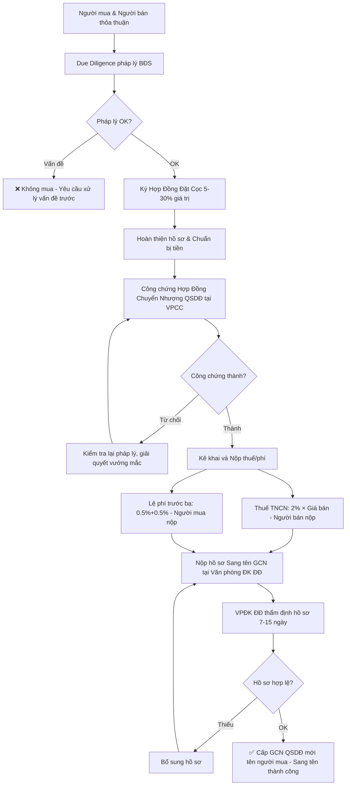

# LW06 — Luật Đất Đai & Bất Động Sản

> **Luật Đất Đai & Bất Động Sản** là tổng hợp hệ thống pháp luật đặc thù của Việt Nam về đất đai — nơi không tồn tại quyền tư hữu đất mà chỉ có Quyền Sử Dụng Đất (QSDĐ) — cùng khung pháp lý về nhà ở, kinh doanh bất động sản, thu hồi đất, đền bù và các giao dịch liên quan. Đây là lĩnh vực pháp lý có tác động lớn nhất đến tài sản cá nhân và đầu tư tại Việt Nam.

---

## 1. Định Nghĩa & Tầm Quan Trọng

**Đặc thù căn bản của đất đai VN:**
> "Đất đai thuộc sở hữu toàn dân do Nhà nước đại diện chủ sở hữu và thống nhất quản lý" — Điều 53 Hiến pháp 2013 và Điều 4 Luật Đất Đai 2024

**Hệ quả quan trọng:**
- VN **không có tư hữu đất** (không như Mỹ, EU, Singapore)
- Người dân/doanh nghiệp chỉ có **QSDĐ** (Quyền Sử Dụng Đất) — quyền sử dụng trong thời hạn nhất định
- Nhà nước có quyền thu hồi đất khi cần thiết (với bồi thường)
- Thị trường BĐS VN thực chất là thị trường **QSDĐ + tài sản gắn liền với đất**

**Tầm quan trọng kinh tế:**
- BĐS chiếm ~15-20% GDP Việt Nam
- Tài sản nhà, đất = 70-80% tổng tài sản của hộ gia đình VN
- Thu ngân sách từ đất: 10-15% tổng thu ngân sách nhà nước
- FDI trong BĐS: Thường top 2-3 lĩnh vực thu hút FDI

**Văn bản pháp luật chính:**
- **Luật Đất Đai 31/2024/QH15** — hiệu lực 01/01/2025 (sửa đổi lớn nhất 20 năm)
- **Luật Nhà Ở 27/2023/QH15** — hiệu lực 01/08/2024
- **Luật Kinh Doanh BĐS 29/2023/QH15** — hiệu lực 01/08/2024
- **Luật Đấu Thầu 22/2023/QH15** — đấu giá đất, đấu thầu dự án
- **Luật Xây Dựng 50/2014** (sửa đổi 62/2020) — quy hoạch, cấp phép xây dựng

---

## 2. Lịch Sử & Nguồn Gốc

### Timeline pháp luật đất đai VN

```
1975 — Thống nhất đất nước, Nhà nước quản lý toàn bộ đất đai
1980 — Hiến pháp 1980: Đất đai thuộc sở hữu toàn dân (Điều 19)
1987 — Luật Đất đai đầu tiên (số 02-L/CTN)
         └── Bắt đầu cho phép giao đất cho hộ gia đình nông nghiệp
1993 — Luật Đất đai 24/L-CTN — Đột phá lớn
         ├── Cấp Giấy chứng nhận QSDĐ (Sổ đỏ)
         ├── Cho phép 5 quyền: Chuyển đổi, Chuyển nhượng, Thừa kế, Thế chấp, Cho thuê
         └── Cơ sở cho thị trường BĐS VN ra đời
2003 — Luật Đất đai 13/2003/QH11
         └── Hoàn thiện cơ chế giao đất, cho thuê đất, khung giá đất
2013 — Luật Đất đai 45/2013/QH13 (áp dụng đến 2024)
         └── Cải cách thủ tục hành chính, minh bạch hơn
2024 — Luật Đất Đai 31/2024/QH15 (từ 01/01/2025)
         ├── Bỏ "khung giá đất" → Dùng giá thị trường
         ├── Mở rộng QSDĐ cho Việt kiều (người VN định cư nước ngoài)
         ├── Siết chặt phân lô bán nền
         ├── Mở rộng thu hồi đất cho dự án kinh tế-xã hội
         └── Cải cách toàn diện tài chính đất đai
```

---

## 3. Các Khái Niệm Cốt Lõi

| Khái niệm | Định nghĩa | Điều khoản |
|-----------|-----------|-----------|
| QSDĐ | Quyền Sử Dụng Đất — quyền của người được Nhà nước giao/cho thuê đất | Điều 4 LĐĐ 2024 |
| Sổ đỏ | Giấy chứng nhận QSDĐ, quyền sở hữu nhà và tài sản gắn liền với đất | Điều 3.16 LĐĐ |
| Giao đất | Nhà nước trao QSDĐ cho tổ chức/cá nhân (không thu tiền hoặc có thu tiền) | Điều 117 LĐĐ |
| Cho thuê đất | Nhà nước cho thuê đất thông qua hợp đồng, thu tiền thuê hàng năm/1 lần | Điều 119 LĐĐ |
| Quy hoạch SDĐ | Kế hoạch sử dụng đất theo không gian và thời gian | Điều 61 LĐĐ |
| Chuyển nhượng QSDĐ | Giao dịch QSDĐ giữa hai chủ thể | Điều 46 LĐĐ |
| Thu hồi đất | Nhà nước lấy lại QSDĐ từ người đang sử dụng | Điều 78-107 LĐĐ |
| Bồi thường | Tiền Nhà nước trả khi thu hồi đất | Điều 95-103 LĐĐ |
| Thế chấp QSDĐ | Dùng QSDĐ làm tài sản bảo đảm vay tiền ngân hàng | BLDS 2015 |
| ENT | Economic Needs Test — Kiểm tra nhu cầu kinh tế (BĐS nước ngoài) | — |

---

## 4. Khung Pháp Lý & Văn Bản Quy Phạm

### Hệ thống pháp luật đất đai - BĐS

```
HIẾN PHÁP 2013 (Điều 53-54)
    └── LUẬT ĐẤT ĐAI 31/2024/QH15 (từ 01/01/2025)
            ├── NĐ hướng dẫn LĐĐ 2024 (đang ban hành)
            ├── Bảng giá đất của từng tỉnh/thành (hàng năm)
            └── Luật liên quan
                    ├── Luật Nhà Ở 27/2023 (từ 01/08/2024)
                    │       └── NĐ 95/2024/NĐ-CP (hướng dẫn)
                    ├── Luật Kinh Doanh BĐS 29/2023 (từ 01/08/2024)
                    │       └── NĐ 96/2024/NĐ-CP (hướng dẫn)
                    ├── Luật Đấu Thầu 22/2023 (từ 01/01/2024)
                    ├── Luật Xây Dựng 50/2014 (sửa đổi 2020)
                    └── BLDS 91/2015 (phần giao dịch BĐS)
```

### Bộ luật "Tam luật" 2023-2024

Ba luật ban hành cùng thời điểm, tác động lớn đến thị trường BĐS:
1. **Luật Đất Đai 2024** — Nền tảng quyền đất
2. **Luật Nhà Ở 2023** — Quy định sở hữu nhà, chung cư
3. **Luật Kinh Doanh BĐS 2023** — Hoạt động kinh doanh, sàn giao dịch

---

## 5. Quy Trình Thực Hiện / Trình Tự Pháp Lý

### Quy trình mua bán nhà đất tiêu chuẩn (giao dịch QSDĐ giữa hai cá nhân)

```
BƯỚC 1: Kiểm tra pháp lý bất động sản
    ├── Kiểm tra Sổ đỏ/Sổ hồng: Tên chủ, diện tích, loại đất, mục đích
    ├── Tra cứu quy hoạch: Đất có trong quy hoạch không? (nhà đất.gov.vn, UBND phường)
    ├── Kiểm tra tranh chấp, khiếu kiện (tại UBND phường/xã)
    ├── Kiểm tra thế chấp tại ngân hàng (tra cứu tại cơ quan đăng ký giao dịch BĐS)
    └── Kiểm tra nghĩa vụ tài chính: Còn nợ thuế đất không?

BƯỚC 2: Đặt cọc (Hợp đồng đặt cọc)
    ├── Thường 5-30% giá trị giao dịch
    ├── Thời gian: 30-90 ngày để hoàn thiện pháp lý
    └── Điều khoản bồi thường khi không thực hiện (gấp đôi cọc với bên vi phạm)

BƯỚC 3: Công chứng Hợp đồng chuyển nhượng QSDĐ
    ├── Bắt buộc công chứng tại Văn phòng Công chứng (Điều 167 LĐĐ 2013)
    ├── Giấy tờ: Sổ đỏ bản gốc + CCCD các bên + Giấy tờ hôn nhân
    └── Phí công chứng: 0,1-0,15% giá trị HĐ (không giới hạn)

BƯỚC 4: Kê khai và nộp thuế/phí
    ├── Thuế thu nhập từ chuyển nhượng BĐS: 2% giá trị chuyển nhượng
    │       └── Nộp tại cơ quan thuế trong 10 ngày từ ngày công chứng
    ├── Lệ phí trước bạ: 0,5% (đất) + 0,5% (nhà ở) = 1% tổng giá trị
    └── Phí thẩm định hồ sơ: Theo quy định địa phương

BƯỚC 5: Đăng ký sang tên (Cấp/Đổi Sổ đỏ)
    ├── Nộp hồ sơ tại Văn phòng Đăng ký đất đai
    ├── Hồ sơ: HĐ công chứng + Biên lai nộp thuế + CCCD + Sổ đỏ cũ
    └── Thời hạn: 7-15 ngày làm việc (thực tế 30-60 ngày)

TỔNG THỜI GIAN GIAO DỊCH THỰC TẾ: 45-90 ngày
```

---

## 6. Các Hình Thức & Phân Loại

### 6.1 Phân loại đất (Điều 9 Luật Đất Đai 2024)

**Nhóm 1: Đất nông nghiệp**
- Đất trồng lúa (đặc biệt bảo vệ)
- Đất trồng cây lâu năm
- Đất rừng
- Đất nuôi trồng thủy sản
- Đất làm muối

**Nhóm 2: Đất phi nông nghiệp**
- Đất ở (nông thôn, đô thị)
- Đất thương mại dịch vụ
- Đất công nghiệp
- Đất cơ sở sản xuất phi nông nghiệp
- Đất sử dụng cho mục đích công cộng (trường, bệnh viện, công viên)
- Đất tôn giáo, tín ngưỡng

**Nhóm 3: Đất chưa sử dụng**
- Đất bằng chưa sử dụng
- Đất đồi núi chưa sử dụng

### 6.2 Hình thức Nhà nước giao đất và cho thuê đất

| Hình thức | Đối tượng | Có thu tiền | Thời hạn |
|---------|---------|-----------|---------|
| Giao đất không thu tiền | Hộ gia đình nông nghiệp, cơ quan nhà nước | Không | 50-70 năm |
| Giao đất có thu tiền | Tổ chức kinh tế, cá nhân (để ở, SX-KD) | Có (1 lần) | 50 năm (SX), ổn định (nhà ở) |
| Cho thuê đất trả tiền 1 lần | Dự án kinh doanh BĐS, DN FDI | Có (1 lần) | 50-70 năm |
| Cho thuê đất trả tiền hàng năm | DN trong nước, FDI | Có (hàng năm) | 50-70 năm |

### 6.3 Giấy chứng nhận QSDĐ — Sổ đỏ/Sổ hồng

**Loại GCN:**
- **Sổ đỏ** (màu đỏ gạch): QSDĐ (đất thuần túy)
- **Sổ hồng** (màu hồng): QSDĐ + Sở hữu nhà ở
- Hiện nay: Tích hợp thành **GCN QSDĐ, QSHN ở và tài sản khác gắn liền với đất** (một sổ)

---

## 7. Điều Kiện & Yêu Cầu

### 7.1 Điều kiện chuyển nhượng QSDĐ (Điều 45 Luật Đất Đai 2024)

**5 điều kiện bắt buộc:**
1. **Có GCN QSDĐ** (Sổ đỏ/Sổ hồng) — trừ một số trường hợp đặc biệt
2. **Đất không có tranh chấp** — hoặc tranh chấp đã được giải quyết
3. **QSDĐ không bị kê biên** để bảo đảm thi hành án
4. **Trong thời hạn sử dụng đất** (chưa hết hạn)
5. **Phù hợp quy hoạch** và không trong vùng bị cấm giao dịch

### 7.2 Điều kiện đăng ký chuyển nhượng QSDĐ

- Hợp đồng được **công chứng** tại VPCC hợp lệ
- Đã nộp đủ **thuế, phí** liên quan
- Không còn nghĩa vụ tài chính với Nhà nước về đất
- Cả hai bên đồng ý và tự nguyện

### 7.3 Ai được sử dụng đất tại VN?

| Đối tượng | Quyền QSDĐ | Hình thức |
|---------|-----------|---------|
| Công dân VN | Đầy đủ | Giao đất/Mua QSDĐ |
| Người VN định cư nước ngoài (Việt kiều) | Mở rộng từ 2024 | Như công dân (theo LĐĐ 2024) |
| Tổ chức kinh tế 100% VN | Đầy đủ | Giao/Thuê đất |
| Tổ chức kinh tế có vốn FDI | Giới hạn (thuê đất) | Cho thuê đất của Nhà nước |
| Người nước ngoài | Rất giới hạn | Mua nhà chung cư (50 năm, tối đa 30%) |

---

## 8. Rủi Ro Pháp Lý & Cách Phòng Tránh

### 8.1 Top 10 rủi ro pháp lý BĐS VN

| Rủi ro | Mô tả | Hậu quả | Phòng tránh |
|--------|-------|---------|-------------|
| Đất trong quy hoạch | Đất dính quy hoạch lộ/công viên/đường | Không được xây dựng, bị thu hồi không bồi thường theo giá thị trường | Tra cứu quy hoạch tại UBND |
| Mua đất nông nghiệp chưa chuyển mục đích | Đất lúa/vườn, muốn làm nhà ở | Không được cấp phép XD, có thể bị cưỡng chế tháo dỡ | Chuyển mục đích SDĐ TRƯỚC khi xây |
| Dự án thiếu pháp lý đầy đủ | Chủ đầu tư bán nhà hình thành tương lai khi chưa đủ điều kiện | Mất tiền, không nhận được nhà | Kiểm tra đủ 8 điều kiện theo Luật KD BĐS 2023 |
| Tranh chấp thừa kế | Nhà đất liên quan đến thừa kế chưa chia | Giao dịch vô hiệu | Kiểm tra gia đình người bán, yêu cầu xác nhận |
| Thế chấp ngân hàng chưa xóa | Sổ đỏ đang thế chấp ngân hàng | Không thể sang tên cho người mua | Kiểm tra tại Văn phòng đăng ký đất đai |
| Sổ đỏ giả | Người bán dùng sổ giả | Mất toàn bộ tiền | Kiểm tra qua VPCC, UBND xã/phường |
| Đất chung cư (hết hạn sử dụng) | Chung cư 50-70 năm hết hạn | Nhà nước thu hồi đất | Đọc kỹ hạn QSDĐ trong sổ hồng |
| Giá thấp hơn thực tế (tax evasion) | Ghi giá thấp trong HĐ để giảm thuế | Bị truy thu thuế + phạt | Ghi đúng giá thực tế |
| BĐS không đủ điều kiện cho người nước ngoài mua | Người VN đứng tên hộ người nước ngoài | Giao dịch vô hiệu | Tuân thủ đúng quy định |
| Dự án BĐS nghỉ dưỡng/condotel không có sổ | Condotel không được cấp sổ đỏ riêng | Không thể chuyển nhượng tự do | Kiểm tra loại hình và pháp lý dự án |

---

## 9. Best Practices / Thực Hành Tốt

### 9.1 Due Diligence BĐS 10 bước

1. **Kiểm tra GCN/Sổ đỏ**: Tên chủ, diện tích, loại đất, hạn QSDĐ, hạn chế
2. **Tra quy hoạch**: nhà đất.gov.vn + UBND phường + Sở TN&MT
3. **Tra cứu thế chấp**: Cục Đăng ký quốc gia giao dịch bảo đảm (mdc.vn)
4. **Kiểm tra tranh chấp, khiếu kiện**: UBND xã/phường có xác nhận không tranh chấp
5. **Kiểm tra nguồn gốc đất**: Đất có nguồn gốc hợp pháp (không phải đất lấn chiếm)
6. **Kiểm tra nghĩa vụ thuế**: Không còn nợ thuế đất
7. **Xác minh tình trạng hôn nhân**: Cần chữ ký cả vợ chồng nếu tài sản chung
8. **Kiểm tra thực địa**: Đối chiếu bản đồ với thực tế (ranh giới, diện tích, tình trạng)
9. **Kiểm tra dự án**: Nếu mua nhà dự án, kiểm tra đủ 8 điều kiện pháp lý
10. **Tham vấn luật sư BĐS**: Đặc biệt với giao dịch lớn (>1 tỷ VNĐ)

### 9.2 Checklist trước khi đặt cọc

- [ ] Sổ đỏ/hồng bản gốc (không phải photo)
- [ ] Tra quy hoạch tại cổng thông tin địa phương
- [ ] Hỏi hàng xóm về lịch sử đất
- [ ] Chụp ảnh tất cả giấy tờ
- [ ] Không đặt cọc quá 10% trước khi hoàn tất DD
- [ ] Hợp đồng đặt cọc phải ghi rõ điều khoản phạt cọc

---

## 10. Sai Lầm Phổ Biến Doanh Nghiệp & Cá Nhân

### Top 10 sai lầm mua bán BĐS VN

1. **Mua đất nông nghiệp với mục đích xây nhà** — Không thể chuyển mục đích dễ dàng, bị cưỡng chế
2. **Tin vào "đất thổ cư"** — Không có khái niệm "đất thổ cư", chỉ có "đất ở" (ONT/ODT), cần kiểm tra mục đích trong sổ
3. **Không kiểm tra quy hoạch** — Mua xong mới biết đất nằm trong lộ giới 20 năm nữa sẽ giải tỏa
4. **Tin vào lời môi giới về pháp lý** — Môi giới không phải luật sư, không chịu trách nhiệm pháp lý
5. **Không đọc kỹ sổ đỏ** — Không thấy hạn QSDĐ chỉ còn 10 năm
6. **Ghi giá thấp trong hợp đồng** — Trốn thuế → Bị truy thu + phạt; người mua gặp vấn đề khi bán lại
7. **Mua nhà hình thành tương lai không đủ pháp lý** — Chủ đầu tư bán khi chưa có "5 có": Sổ đỏ, phê duyệt xây, nghiệm thu móng, bảo lãnh ngân hàng, mở bán đúng %
8. **Không yêu cầu sổ riêng từng căn** — Mua nhà trong dự án nhưng đất chung một sổ → Không chuyển nhượng được
9. **Bỏ qua tranh chấp thừa kế ẩn** — Không biết người bán có anh em chưa ký xác nhận thừa kế
10. **Không có hợp đồng bằng văn bản** — Thỏa thuận miệng về chuyển nhượng không có giá trị pháp lý

---

## 11. Case Study VN — BĐS Thực Tế

### Case 1: Khủng hoảng condotel 2018-2022

**Bối cảnh:**
- 2015-2018: Condotel (căn hộ khách sạn) bùng phát, cam kết lợi nhuận 8-12%/năm
- Nhà đầu tư ồ ạt mua condotel ở Đà Nẵng, Phú Quốc, Nha Trang
- Vấn đề: Condotel xây trên đất thương mại dịch vụ, không được cấp sổ đỏ như nhà ở

**Hậu quả pháp lý:**
- NOIP, Bộ TN&MT không cho phép cấp sổ hồng riêng cho condotel
- Chủ đầu tư không trả được lợi nhuận cam kết
- Nhà đầu tư không thể chuyển nhượng vì không có sổ
- Tòa án phải giải quyết hàng trăm vụ kiện

**Số tiền thiệt hại ước tính:** Hàng chục nghìn tỷ VNĐ

**Bài học từ Luật KD BĐS 2023:**
- Cấm cam kết lợi nhuận cố định (không được ghi trong HĐ)
- Bắt buộc đặt cọc vào tài khoản phong tỏa (escrow)
- Quy định rõ loại hình BĐS nào được bán khi nào

### Case 2: Dự án chậm bàn giao — Nhà đầu tư mắc kẹt

**Tình huống phổ biến:**
- Mua căn hộ chung cư năm 2019, hẹn bàn giao 2021
- Đến 2024 chưa bàn giao, chủ đầu tư viện lý do COVID + thiếu vốn
- Nhà đầu tư đã trả 90% tiền, không có nhà ở, không đòi lại tiền được

**Căn cứ pháp lý xử lý:**
- Luật KD BĐS 2023: Bắt buộc bảo lãnh ngân hàng cho nhà hình thành tương lai
- Nếu chậm bàn giao, ngân hàng bảo lãnh phải trả lại tiền cho người mua
- Thực tế cũ (trước 2023): Không có quy định này, người mua chịu thiệt

### Case 3: Thu hồi đất dự án — Người dân kiện cách tính bồi thường

**Tình huống:**
- Tỉnh A thu hồi đất của 200 hộ dân để làm khu công nghiệp
- Giá bồi thường theo "Bảng giá đất" của UBND tỉnh = 500.000đ/m²
- Giá thị trường thực tế = 5.000.000đ/m²
- Người dân không chấp nhận, kiện hành chính

**Thay đổi từ Luật Đất Đai 2024:**
- Bỏ khung giá đất Chính phủ quy định
- UBND tỉnh xây dựng bảng giá đất theo giá thị trường (hàng năm)
- Thuê tổ chức định giá độc lập xác định giá bồi thường
- Người dân được tham gia góp ý giá bồi thường

**Bài học:** Luật 2024 cải thiện đáng kể về định giá, nhưng thực thi còn cần thời gian

### Case 4: Phân lô bán nền bị siết chặt

**Thực trạng trước 2024:**
- Nhiều địa phương cho phép phân lô bán nền tự do
- Đặc biệt TP.HCM ngoại ô, Long An, Bình Dương: "sốt đất ảo" do phân lô
- Nhà đầu tư mua đất phân lô không có hạ tầng, không có nhà ở thực

**Thay đổi từ Luật Đất Đai 2024:**
- Siết chặt phân lô bán nền tại 105 đô thị (từ thành phố trực thuộc TW đến thị trấn)
- Bắt buộc xây nhà trước khi bán (không chỉ bán đất)
- Thực tiễn: Giảm nguồn cung đất nền đô thị, tăng giá trị đất

---

## 12. So Sánh Với Pháp Luật Quốc Tế

### 12.1 VN vs Các nước ASEAN về quyền đất đai

| Tiêu chí | Việt Nam | Singapore | Thái Lan | Malaysia | Philippines |
|---------|---------|-----------|---------|---------|------------|
| Sở hữu đất | Toàn dân | Nhà nước (99% cho thuê) | Tư hữu | Tư hữu | Tư hữu |
| Người nước ngoài | Thuê đất, mua nhà CC (hạn chế) | Không (trừ nhà liền thổ đặc biệt) | Không sở hữu đất | Không | Không đất, nhà CC có hạn chế |
| Thời hạn QSDĐ | 50-70 năm | 99 năm leasehold | N/A (freehold) | 99 năm leasehold | N/A (freehold) |
| Đăng ký đất | Sổ đỏ/Hồng | Title Deed | Chanote | Geran | TCT |
| Property tax | Không (đặc thù VN) | Property tax 10-20% NAV | Lãi hàng năm | Quit rent | Real Property Gains Tax |

### 12.2 FDI trong BĐS VN — So sánh khả năng tiếp cận

**Mức độ hạn chế:**
- VN: FDI chỉ được **thuê đất** (trả tiền 1 lần hoặc hàng năm), không được giao đất
- Không được mua QSDĐ từ cá nhân/DN VN (chỉ từ Nhà nước)
- Được xây nhà trên đất thuê → Sở hữu tài sản trên đất
- Người nước ngoài: Chỉ mua căn hộ (tối đa 30%/dự án, 50 năm có thể gia hạn)

---

## 13. Checklist Tuân Thủ

### Checklist pháp lý đầy đủ khi mua BĐS

**Kiểm tra Giấy Tờ Đất:**
- [ ] GCN QSDĐ (Sổ đỏ/Hồng) bản gốc
- [ ] Không có thế chấp (tra tại Văn phòng đăng ký ĐĐ)
- [ ] Không có tranh chấp (xác nhận UBND xã/phường)
- [ ] Trong thời hạn QSDĐ (đọc mục "thời hạn" trong sổ)
- [ ] Mục đích sử dụng đất phù hợp với ý định

**Kiểm tra Quy Hoạch:**
- [ ] Không nằm trong quy hoạch thu hồi đất, giải phóng mặt bằng
- [ ] Không trong hành lang bảo vệ (điện, đường, kênh rạch)
- [ ] Phù hợp mục đích xây dựng (đất ở mới xây nhà ở được)

**Kiểm tra Bên Bán:**
- [ ] Chủ sở hữu đúng như ghi trên sổ đỏ
- [ ] Có đầy đủ năng lực (không bị tòa án hạn chế quyền giao dịch)
- [ ] Nếu có vợ/chồng: Phải cả hai ký
- [ ] Không có tranh chấp thừa kế ẩn

**Với dự án nhà hình thành tương lai (Điều 24 Luật KDBĐS 2023):**
- [ ] Chủ đầu tư có GCN QSDĐ/đang thuê đất
- [ ] Dự án được phê duyệt đầu tư, quy hoạch 1/500
- [ ] Công trình đã có giấy phép xây dựng
- [ ] Nghiệm thu móng/giám sát nhà nước
- [ ] **Bảo lãnh ngân hàng** (ngân hàng cam kết hoàn tiền nếu chủ ĐT không bàn giao)
- [ ] Mở tài khoản phong tỏa thu tiền người mua
- [ ] Đã ký thông báo đủ điều kiện với Sở Xây Dựng

---

## 14. Luật Đất Đai 2024 — Điểm Mới Toàn Diện

### 14.1 Thay đổi về Bảng giá đất (Điều quan trọng nhất)

**Trước 2024 (Luật ĐĐ 2013):**
- Chính phủ quy định "khung giá đất" (min-max)
- UBND tỉnh ban hành "bảng giá đất" trong khung
- Kết quả: Giá đất nhà nước = 20-30% giá thị trường → Không công bằng khi thu hồi đất

**Từ 2025 (Luật ĐĐ 2024):**
- Bỏ khung giá đất Chính phủ
- UBND tỉnh xây dựng bảng giá đất theo **nguyên tắc giá thị trường** (hàng năm, thay vì 5 năm)
- Thuê tổ chức định giá BĐS độc lập
- Hội đồng định giá đất cấp tỉnh thẩm định
- Tác động: Tăng tiền bồi thường khi thu hồi đất, tăng tiền sử dụng đất, tăng thu ngân sách

### 14.2 Mở rộng quyền cho Người VN định cư nước ngoài (Việt kiều)

**Trước 2024:**
- Việt kiều chỉ được mua 1 nhà ở VN (giống người nước ngoài)
- Không được nhận quyền sử dụng đất từ cha mẹ (phải bán)

**Từ 2025 (Điều 28 Luật ĐĐ 2024):**
- Việt kiều có quốc tịch VN = Như công dân trong nước → Đầy đủ quyền QSDĐ
- Việt kiều không còn quốc tịch VN = Quyền như người nước ngoài (hạn chế hơn)
- Ý nghĩa: ~5 triệu kiều bào có thể đầu tư BĐS VN dễ dàng hơn

### 14.3 Siết chặt phân lô bán nền

- **105 đô thị** (loại IV trở lên) không được phân lô bán nền (phải xây nhà trước)
- Phân lô bán nền ở đô thị loại V, nông thôn: Vẫn được nhưng có điều kiện hạ tầng
- Mục tiêu: Giảm đầu cơ đất, tăng nguồn cung nhà ở thực

### 14.4 Thu hồi đất cho dự án kinh tế-xã hội

**Điểm mới Điều 79 Luật ĐĐ 2024:**
- Mở rộng danh mục dự án được Nhà nước thu hồi đất (bao gồm dự án phát triển kinh tế-xã hội)
- Bổ sung: Nhà nước thu hồi đất để tạo quỹ đất sạch → Đấu giá/đấu thầu cho chủ đầu tư
- Tránh tình trạng chủ đầu tư tự thỏa thuận với dân (dễ gây tham nhũng, chậm)

### 14.5 Cải cách tài chính đất đai

- Bỏ tiền sử dụng đất khi cấp sổ đỏ lần đầu cho đất ở do lịch sử để lại
- Thu tiền sử dụng đất khi chuyển mục đích đất
- Tiền thuê đất: Theo giá thị trường, điều chỉnh hàng năm

---

## 15. Kinh Doanh BĐS — Luật KDBĐS 2023

### 15.1 Điều kiện kinh doanh BĐS (Điều 9 Luật KDBĐS 2023)

**Điều kiện chủ đầu tư:**
- Là doanh nghiệp (không phải cá nhân, hộ gia đình)
- Vốn pháp định tối thiểu: **20 tỷ VNĐ** (tăng từ 6 tỷ của Luật cũ)
- Phải công khai thông tin trên cổng thông tin của Bộ Xây Dựng

### 15.2 Điều kiện bán nhà hình thành tương lai (Điều 24)

Chủ đầu tư được phép ký **Hợp đồng mua bán** khi:
1. Có GCN QSDĐ hoặc đang thuê đất hợp pháp
2. Đất không có tranh chấp, không bị kê biên
3. Được phê duyệt quy hoạch 1/500
4. Được cấp phép xây dựng
5. Nghiệm thu xong phần móng (hoặc phần kết cấu theo quy định)
6. Có bảo lãnh ngân hàng bán nhà ở hình thành tương lai
7. Đã mở tài khoản phong tỏa thu tiền người mua
8. Đã có văn bản thông báo đủ điều kiện của Sở Xây Dựng

**Quy định mới về tiến độ thanh toán:**
- Không được thu quá **30%** giá trị HĐ trước khi bàn giao nhà (trước là 70%)
- Từng đợt không quá 10% mỗi 6 tháng
- Thực tế: Giảm gánh nặng tài chính người mua, tăng rủi ro chủ đầu tư thiếu vốn

### 15.3 Sàn giao dịch BĐS (Điều 55-62 Luật KDBĐS 2023)

- **Bắt buộc**: Giao dịch BĐS hình thành tương lai và một số loại khác phải qua sàn GD BĐS
- Sàn GD BĐS phải đăng ký kinh doanh dịch vụ môi giới BĐS
- Môi giới BĐS cá nhân: Phải có **chứng chỉ hành nghề** (thi sát hạch)
- Nhân viên kinh doanh dự án: Phải có **chứng chỉ** hành nghề

---

## 16. Nhà Ở — Luật Nhà Ở 2023

### 16.1 Các loại nhà ở theo pháp luật VN

| Loại | Đặc điểm | Quản lý |
|------|---------|--------|
| Nhà ở riêng lẻ | Nhà liền thổ, biệt thự, nhà phố | Chủ sở hữu tự quản lý |
| Nhà chung cư | Từ 2 tầng trở lên, nhiều căn hộ | Ban Quản Trị nhà CC |
| Nhà ở xã hội | Dành cho đối tượng thu nhập thấp, công nhân | Nhà nước + DN hỗ trợ |
| Nhà ở công nhân | Trong/gần khu công nghiệp | Nhà nước + Chủ KCN |
| Nhà ở tái định cư | Cho người bị thu hồi đất | Nhà nước bố trí |

### 16.2 Quyền sở hữu nhà của người nước ngoài (Điều 17 Luật Nhà Ở 2023)

**Người nước ngoài được mua nhà tại VN:**
- Phải được phép nhập cảnh VN (có visa/thẻ tạm trú)
- Chỉ được mua **căn hộ chung cư** (không được mua nhà liền thổ)
- **Giới hạn tỷ lệ**: Tối đa **30% căn hộ** trong một tòa nhà
- Trong một phường: Không quá 250 căn nhà liền thổ (nhưng thực tế không được mua)
- **Thời hạn sở hữu**: 50 năm, có thể gia hạn thêm 50 năm
- **Không được cho thuê**: Phải ở (quy định thực tế khó thực thi)

### 16.3 Nhà ở xã hội (NOXH)

**Chính sách ưu đãi:**
- Giá bán thấp hơn thị trường 20-40%
- Được vay lãi suất ưu đãi (gói 120.000 tỷ VNĐ, lãi 4,8-6%/năm)
- Không phải nộp tiền SDĐ, chỉ nộp tiền xây dựng

**Đối tượng mua NOXH:**
- Công nhân, người lao động tại KCN
- Cán bộ, viên chức nhà nước có thu nhập thấp
- Người thuộc hộ nghèo, cận nghèo
- Lực lượng vũ trang

**Ràng buộc khi mua NOXH:**
- Không được bán trong **5 năm** đầu
- Khi bán lại: Phải ưu tiên bán cho đối tượng được mua NOXH, nộp 50% giá chênh lệch

---

## 17. Quy Trình Thu Hồi Đất Và Bồi Thường

### 17.1 Các trường hợp thu hồi đất (Điều 78 Luật ĐĐ 2024)

**Nhà nước thu hồi vì mục đích quốc phòng, an ninh:**
- Căn cứ quân sự, khu vực an ninh

**Nhà nước thu hồi để phát triển kinh tế-xã hội:**
- Dự án giao thông, thủy lợi, năng lượng (bắt buộc)
- Dự án xây dựng khu đô thị, nhà ở thương mại (từ 2024: nhà nước thu hồi, không chủ đầu tư tự thỏa thuận)
- Dự án khu công nghiệp, cụm công nghiệp
- Dự án tái định cư, xây dựng nhà ở xã hội

**Chú ý quan trọng:** Luật ĐĐ 2024 mở rộng diện thu hồi đất cho dự án kinh doanh thương mại → Tranh cãi về vi phạm quyền tư hữu

### 17.2 Quy trình thu hồi đất và bồi thường

```
BƯỚC 1: Thông báo thu hồi đất (Điều 86)
    └── Trước ít nhất 90 ngày (đất nông nghiệp) hoặc 180 ngày (phi nông nghiệp)

BƯỚC 2: Điều tra, khảo sát, đo đạc, kiểm đếm
    └── Xác định diện tích, tài sản gắn liền với đất

BƯỚC 3: Lập, thẩm định phương án bồi thường, hỗ trợ, tái định cư
    ├── Giá bồi thường đất: Theo bảng giá thị trường (từ 2025)
    ├── Giá bồi thường tài sản: Theo giá thực tế
    └── Hỗ trợ di chuyển, ổn định cuộc sống

BƯỚC 4: Công bố phương án và lấy ý kiến
    └── Người dân có quyền góp ý kiến

BƯỚC 5: Phê duyệt phương án bởi UBND có thẩm quyền

BƯỚC 6: Chi trả bồi thường
    └── Tiền về tài khoản ngân hàng của người bị thu hồi

BƯỚC 7: Bàn giao đất (có thể cưỡng chế nếu không tự bàn giao)
    └── Sau 90 ngày từ chi trả bồi thường
```

### 17.3 Nguyên tắc bồi thường (Từ Luật ĐĐ 2024)

- Bồi thường = **Giá đất theo thị trường** tại thời điểm có quyết định thu hồi
- Không bồi thường theo "bảng giá đất hành chính" thấp (như trước đây)
- Phải đảm bảo tái định cư trước khi thu hồi
- Bồi thường bằng đất mới cùng mục đích (nếu có)

---

## 18. Thế Chấp Quyền Sử Dụng Đất

### 18.1 Quy định thế chấp QSDĐ (BLDS 2015 + NĐ 21/2021)

**Điều kiện thế chấp QSDĐ:**
- Có GCN QSDĐ (Sổ đỏ/Hồng)
- QSDĐ không có tranh chấp
- QSDĐ không bị kê biên
- Trong thời hạn QSDĐ còn lại đủ dài để làm tài sản bảo đảm

**Quy trình thế chấp:**
1. Ký HĐ thế chấp tại tổ chức tín dụng
2. Công chứng HĐ thế chấp
3. Đăng ký thế chấp tại Văn phòng đăng ký ĐĐ
4. VPĐKĐD ghi chú trên GCN QSDĐ

**Tỷ lệ cho vay/giá trị thế chấp:**
- Ngân hàng thường cho vay 50-70% giá trị BĐS thế chấp
- BĐS tại vị trí tốt, thanh khoản cao: Cho vay đến 75-80%
- BĐS đặc thù (đất nông nghiệp, condotel): Cho vay 40-50%

### 18.2 Xử lý tài sản bảo đảm là QSDĐ khi vỡ nợ

- **Phương án 1**: Tự bán (người vay tự bán BĐS, trả nợ)
- **Phương án 2**: Ngân hàng nhận BĐS thay thế (deed in lieu)
- **Phương án 3**: Ngân hàng bán đấu giá qua công ty đấu giá
- **Phương án 4**: Khởi kiện tòa án → Kê biên → Đấu giá cưỡng chế

---

## 19. FDI Trong Bất Động Sản

### 19.1 Hình thức FDI được phép trong BĐS VN

| Hình thức | Được phép | Điều kiện |
|---------|---------|---------|
| Thuê đất của Nhà nước trả tiền hàng năm | Có | Có IRC, đúng mục đích |
| Thuê đất của Nhà nước trả tiền 1 lần | Có | Có IRC, đúng mục đích |
| Mua lại QSDĐ từ công ty VN qua M&A | Hạn chế | Công ty VN đó phải có QSDĐ hợp lệ |
| Mua căn hộ chung cư | Hạn chế | Tối đa 30%/tòa, 50 năm |
| Góp vốn đất vào JV | Có | Bên VN góp đất, bên NN góp vốn |

### 19.2 Thuê đất trả tiền 1 lần vs hàng năm — Ý nghĩa

| Tiêu chí | Trả tiền 1 lần | Trả tiền hàng năm |
|---------|--------------|-----------------|
| Quyền thế chấp | Được thế chấp tại TCTD VN | Không được thế chấp QSDĐ |
| Quyền chuyển nhượng | Được chuyển nhượng QSDĐ | Không được chuyển nhượng QSDĐ (chỉ chuyển tài sản) |
| Chi phí ban đầu | Cao (trả 50 năm một lần) | Thấp (trả hàng năm theo giá thị trường) |
| Rủi ro điều chỉnh giá | Không có | Giá thuê tăng theo thị trường |
| Phù hợp với | Dự án có lợi nhuận sớm, cần vay vốn | Sản xuất, ổn định dài hạn |

### 19.3 Hạn chế và xu hướng tới

- VN không cho FDI sở hữu đất (chỉ thuê)
- Xu hướng: Nới lỏng để thu hút FDI BĐS cao cấp, khu đô thị mới
- Khu kinh tế đặc biệt (Vân Đồn, Bắc Vân Phong): Dự kiến có cơ chế đặc biệt hơn

---

## 20. Thuế & Phí Liên Quan Đến BĐS

### 20.1 Thuế và phí khi giao dịch BĐS

| Loại thuế/phí | Thuế suất | Người nộp | Cơ sở tính |
|-------------|---------|---------|-----------|
| Thuế TNCN từ chuyển nhượng BĐS | **2%** giá chuyển nhượng | Người bán | Giá HĐ (hoặc giá thị trường nếu ghi giá thấp) |
| Lệ phí trước bạ (đất) | **0,5%** | Người mua | Giá đất theo bảng giá địa phương |
| Lệ phí trước bạ (nhà) | **0,5%** | Người mua | Giá trị nhà theo quy định |
| Phí công chứng | 0,1-0,15% giá HĐ | Người mua (thường) | Giá trong HĐ |
| Phí đăng ký giao dịch BĐS | Theo quy định địa phương | Người mua | — |
| Thuế sử dụng đất phi nông nghiệp | 0,03-0,15% giá đất | Chủ sử dụng | Diện tích × giá đất địa phương |

### 20.2 Thuế BĐS VN — Đặc thù không có Property Tax

- VN **không có thuế tài sản thường niên** (annual property tax) như các nước khác
- Chỉ có **Thuế sử dụng đất phi nông nghiệp** (rất thấp, 0,03-0,15%)
- Điều này tạo ra đầu cơ BĐS (giữ đất không mất phí)
- Nhiều chuyên gia đề xuất áp dụng property tax → Hiện vẫn đang nghiên cứu

### 20.3 Thuế chuyển nhượng BĐS — Hướng dẫn thực tế

```
Công thức tính thuế TNCN chuyển nhượng BĐS:
    Thuế = 2% × Giá chuyển nhượng ghi trong HĐ

Ví dụ:
    - Bán căn hộ giá 3 tỷ VNĐ
    - Thuế TNCN = 2% × 3.000.000.000 = 60.000.000 VNĐ (60 triệu)
    - Nộp trong 10 ngày kể từ ngày công chứng HĐ

Lưu ý:
    - Nếu ghi giá thấp trong HĐ → Cơ quan thuế có quyền ấn định theo giá thị trường
    - Kê khai sai giá → Phạt + Truy thu
    - Trường hợp miễn thuế: Bán nhà duy nhất (ở >6 tháng), tặng cho cha/mẹ/con/vợ/chồng
```

---

## 21. Quy Hoạch Đất Đai

### 21.1 Các cấp quy hoạch (Điều 60-77 Luật ĐĐ 2024)

| Cấp | Thẩm quyền phê duyệt | Thời hạn |
|-----|---------------------|---------|
| Quy hoạch SDĐ quốc gia | Quốc hội | 10 năm |
| Quy hoạch SDĐ quốc phòng, an ninh | Chính phủ | 10 năm |
| Quy hoạch SDĐ tỉnh | Chính phủ | 10 năm |
| Kế hoạch SDĐ cấp huyện | UBND tỉnh | 5 năm |

### 21.2 Tác động của quy hoạch đến BĐS

**Đất trong quy hoạch "đường giao thông":**
- Bị hạn chế xây dựng mới
- Khi nhà nước làm đường: Phải giải phóng mặt bằng, bồi thường
- Giá đất thường thấp hơn đất khác cùng vị trí

**Đất trong quy hoạch "công viên, cây xanh":**
- Bị thu hồi không bồi thường cao
- Không được cấp phép XD mới
- Rủi ro cao nhất cho người mua

**Đất đã có quy hoạch "đô thị hóa":**
- Giá tăng mạnh
- Được chuyển mục đích từ nông nghiệp → Đất ở
- Cơ hội đầu tư tốt nhưng cần đọc kỹ quy hoạch chi tiết

### 21.3 Tra cứu quy hoạch đất đai online

- **TP.HCM**: https://qhkhdt.hochiminhcity.gov.vn
- **Hà Nội**: https://quy-hoach.hanoi.gov.vn
- **Cổng thông tin BĐS quốc gia**: https://bds.gov.vn (đang phát triển)
- **Tra cứu tại Phòng TN&MT huyện/UBND phường**: Đáng tin nhất

---

## 22. Phân Tích Thị Trường BĐS VN 2024

### 22.1 Thực trạng thị trường

| Phân khúc | Tình trạng 2024 | Xu hướng |
|---------|--------------|---------|
| Căn hộ cao cấp (TP.HCM, Hà Nội) | Nguồn cung hạn chế, giá cao | Tiếp tục tăng giá |
| Căn hộ bình dân (<2 tỷ) | Thiếu hụt nghiêm trọng | Khan hiếm, giá tăng |
| Nhà ở xã hội | Cung rất thấp so cầu | Chính phủ thúc đẩy |
| Đất nền đô thị | Siết phân lô → Nguồn cung giảm | Giá tăng, thanh khoản giảm |
| BĐS nghỉ dưỡng | Phục hồi sau COVID, chưa về đỉnh | Ổn định |
| BĐS công nghiệp | Nhu cầu cao từ FDI, KCN mới | Tăng trưởng mạnh |
| Văn phòng | Phục hồi sau remote work | Grade A tốt, Grade B áp lực |

### 22.2 Chu kỳ BĐS VN

```
Lịch sử chu kỳ BĐS VN:
    2000-2007: Tăng mạnh (FDI, WTO sắp gia nhập)
    2008-2012: Đóng băng (Khủng hoảng tài chính toàn cầu)
    2012-2014: Phục hồi chậm (Gói 30.000 tỷ kích thích)
    2015-2019: Tăng mạnh (Kinh tế tốt, FDI bùng nổ)
    2020-2021: Chậm lại (COVID), đất nền "sốt ảo" vùng ven
    2022-2023: Đóng băng (Lãi suất tăng, trái phiếu DN, pháp lý)
    2024-2025: Hồi phục (Luật mới, lãi suất giảm, hạ tầng mới)
```

---

## 23. Bất Động Sản Công Nghiệp

### 23.1 Đất Khu Công Nghiệp — Pháp Lý

**Thủ tục thuê đất trong KCN:**
1. DN ký HĐ thuê đất với Công ty phát triển hạ tầng KCN
2. Công ty hạ tầng KCN đã thuê đất từ Nhà nước → Cho DN thuê lại
3. DN nhận Giấy chứng nhận QSDĐ thuê lại
4. Thời hạn thuê: Theo hạn KCN (thường 50 năm từ ngày thành lập KCN)

**Giá thuê đất KCN VN 2024 (ước tính):**
| Vùng | Giá thuê (USD/m²/nhiệm kỳ 50 năm) |
|------|----------------------------------|
| Hà Nội (Thăng Long, Nội Bài) | $150-250 |
| Bình Dương (VSIP, Amata) | $120-200 |
| Đồng Nai | $100-180 |
| Hải Phòng | $80-150 |
| Tỉnh xa trung tâm | $40-100 |

### 23.2 Xu hướng BĐS công nghiệp 2024-2030

- **China+1**: Nhiều DN rời Trung Quốc → VN hưởng lợi
- **Bán dẫn**: Intel, Samsung, NVDIA → Nhu cầu đất sạch KCN tăng
- **KCN xanh**: Yêu cầu ESG → KCN phải có điện tái tạo, xử lý nước thải
- **Giá thuê tăng**: Cung không đáp ứng cầu, giá thuê KCN tăng 10-15%/năm

---

## 24. Tranh Chấp BĐS

### 24.1 Các loại tranh chấp BĐS phổ biến

| Loại tranh chấp | Mô tả | Cơ quan giải quyết |
|---------------|-------|------------------|
| Tranh chấp hợp đồng mua bán | Chủ đầu tư không bàn giao đúng hạn | Tòa án dân sự |
| Tranh chấp ranh giới đất | Hàng xóm lấn chiếm, sai bản đồ | UBND → Tòa án |
| Tranh chấp thừa kế nhà đất | Anh em không đồng ý phân chia | Tòa án dân sự |
| Tranh chấp đền bù thu hồi đất | Giá bồi thường không thỏa đáng | Khiếu nại hành chính → Tòa HC |
| Tranh chấp sổ đỏ giả, sai | Sổ đỏ không đúng thực tế | UBND + Tòa hành chính |
| Tranh chấp hợp đồng đặt cọc | Một bên không thực hiện | Tòa dân sự |

### 24.2 Quy trình giải quyết tranh chấp đất đai

**Tranh chấp về QSDĐ (không có sổ đỏ):**
- Hòa giải tại UBND xã/phường → Bắt buộc (Điều 202 LĐĐ 2024)
- Nếu không thành → Khởi kiện TAND huyện/quận

**Tranh chấp có GCN QSDĐ:**
- Trực tiếp khởi kiện TAND (không cần qua UBND)
- Thời hiệu: 3 năm từ ngày biết có tranh chấp

**Tranh chấp thu hồi đất (hành chính):**
- Khiếu nại lần 1: UBND cấp có thẩm quyền (trong 90 ngày)
- Khiếu nại lần 2: UBND cấp trên (trong 30 ngày từ kết quả lần 1)
- Hoặc khởi kiện tòa hành chính sau lần 1

---

## 25. Quy Trình Cấp Phép Xây Dựng

### 25.1 Giấy phép xây dựng (Luật Xây Dựng 50/2014 sửa đổi)

**Đối tượng phải xin phép xây dựng:**
- Nhà ở riêng lẻ ≥7 tầng hoặc ≥3 tầng tại đô thị
- Công trình thuộc dự án đầu tư XD
- Công trình tôn giáo, tượng đài, quảng cáo

**Đối tượng miễn phép xây dựng (Điều 89):**
- Nhà ở riêng lẻ ≤7 tầng tại đô thị (vẫn phải theo thiết kế chuẩn)
- Nhà ở nông thôn <3 tầng, <250m² tại vùng không có quy hoạch đô thị
- Công trình tạm, công trình phục vụ XD

### 25.2 Quy trình xin GPXD

1. Nộp hồ sơ (CCCD, Sổ đỏ, bản vẽ thiết kế)
2. Sở/Phòng Xây Dựng kiểm tra
3. Cấp GPXD trong **15-30 ngày**
4. Thi công theo đúng thiết kế được phê duyệt
5. Hoàn công, nghiệm thu → Cập nhật sổ đỏ (nếu xây mới nhà)

---

## 26. Chuyển Mục Đích Sử Dụng Đất

### 26.1 Quy trình chuyển mục đích SDĐ

**Trường hợp phải xin phép (Điều 57 Luật ĐĐ 2024):**
- Chuyển đất NN → Đất phi NN (phải xin UBND cấp tỉnh/huyện)
- Chuyển đất rừng → Các loại khác
- Chuyển đất phi NN này → Đất phi NN khác (theo quy hoạch)

**Thủ tục chuyển mục đích:**
1. Nộp đơn tại Văn phòng đăng ký ĐĐ
2. Thẩm định nhu cầu, điều kiện (30-45 ngày)
3. Phê duyệt của UBND
4. Nộp tiền sử dụng đất (chênh lệch giá trị đất trước và sau)
5. Cập nhật GCN QSDĐ

### 26.2 Tiền nộp khi chuyển mục đích

- Chuyển đất NN → Đất ở: Nộp tiền SDĐ theo bảng giá đất ở
- Tiền chênh lệch = Giá đất ở - Giá đất NN (rất lớn tại đô thị)
- Ví dụ: Đất NN giá 200.000đ/m², Đất ở giá 5.000.000đ/m² → Nộp thêm 4.800.000đ/m²

---

## 27. BĐS Và Các Giao Dịch Đặc Biệt

### 27.1 Thừa kế BĐS

- Thừa kế theo di chúc → Ưu tiên thực hiện theo di chúc
- Thừa kế theo pháp luật (không có di chúc) → Chia theo hàng thừa kế
- Thủ tục: Khai nhận di sản tại VPCC → Sang tên GCN QSDĐ
- Nộp lệ phí trước bạ: 0,5% (nộp như giao dịch thông thường)
- Không phải nộp thuế TNCN (thừa kế từ cha mẹ, con, vợ chồng, anh em ruột)

### 27.2 Tặng cho BĐS

- Ký HĐ tặng cho tại VPCC
- Không phải nộp thuế TNCN nếu tặng cho: Vợ/chồng, cha mẹ/con, ông bà/cháu nội ngoại, anh chị em ruột
- Phải nộp thuế TNCN (10% giá trị) nếu tặng cho người không phải thân nhân
- Lệ phí trước bạ: 0,5% (bắt buộc)

### 27.3 Góp Vốn Bằng QSDĐ

- Cá nhân/tổ chức có thể góp vốn vào doanh nghiệp bằng QSDĐ
- Phải định giá QSDĐ bởi tổ chức thẩm định giá (không thể tự định giá)
- Đăng ký tại Sở KHĐT (thay đổi cổ đông/vốn góp)
- Sau khi góp vốn: QSDĐ chuyển sang tên công ty, làm lại GCN

---

## 28. Fintech & Proptech Trong BĐS VN

### 28.1 Proptech (Property Technology) tại VN

**Nền tảng giao dịch BĐS:**
- Batdongsan.com.vn — nền tảng BĐS lớn nhất VN
- Chotot.com — sàn giao dịch tổng hợp
- 668Land, Nhadatxanh — đang phát triển

**Xu hướng Proptech VN:**
- Online listing + AI matching người mua/bán
- Virtual tour BĐS
- E-contract (HĐ điện tử BĐS — Luật Giao dịch điện tử 2023)
- Blockchain trong quản lý GCN QSDĐ (thử nghiệm)

### 28.2 BĐS và Tokenization

- Chia nhỏ BĐS thành token trên blockchain → Nhiều người sở hữu 1 BĐS
- **Pháp lý VN 2024**: Chưa có khung pháp lý rõ ràng
- Sandbox: Đang nghiên cứu trong Nghị định về tài sản số

---

## 29. Sơ Đồ Hệ Thống Quyền Đất Đai VN

```
NHÀ NƯỚC (Chủ sở hữu toàn dân)
    │
    ├── GIAO ĐẤT
    │       ├── Không thu tiền: Nông nghiệp, cơ quan NN
    │       └── Có thu tiền: DN, cá nhân xây nhà ở
    │
    ├── CHO THUÊ ĐẤT
    │       ├── Trả 1 lần: Có thế chấp, chuyển nhượng QSDĐ
    │       └── Trả hàng năm: Không thế chấp QSDĐ
    │
    └── CÔNG NHẬN QSDĐ
            └── Đất đang sử dụng ổn định, hợp pháp
    │
    ↓ QSDĐ
NGƯỜI SỬ DỤNG ĐẤT
    ├── Quyền chuyển đổi
    ├── Quyền chuyển nhượng (mua bán)
    ├── Quyền cho thuê
    ├── Quyền thừa kế
    ├── Quyền thế chấp
    ├── Quyền góp vốn
    └── Quyền tặng cho
```

---

## 30. Chỉ Số & Tổng Hợp Quan Trọng

### 30.1 Số liệu BĐS VN 2024

| Chỉ tiêu | Số liệu |
|---------|--------|
| Tổng diện tích đất VN | ~331.000 km² |
| Đất nông nghiệp | ~28 triệu ha (~85%) |
| Diện tích KCN đang hoạt động | ~100.000 ha trong ~430 KCN |
| Giá đất trung bình Hà Nội (căn hộ) | 30-60 triệu VNĐ/m² (2024) |
| Giá đất trung bình TP.HCM (căn hộ) | 40-80 triệu VNĐ/m² (2024) |
| Tỷ lệ đô thị hóa VN | ~37% (mục tiêu 45% năm 2030) |
| FDI vào BĐS 2023 | ~3 tỷ USD (~8% tổng FDI) |
| Số dự án BĐS đủ pháp lý đủ điều kiện bán | ~50% (vấn đề pháp lý ngành) |

### 30.2 Các đầu mối tra cứu BĐS

| Thông tin cần tra | Nơi tra |
|----------------|--------|
| Quy hoạch đất | UBND phường/xã, Phòng TN&MT huyện, nhà đất.gov.vn |
| Thế chấp BĐS | Văn phòng đăng ký đất đai, mdc.vn |
| Giá đất | Bảng giá đất của UBND tỉnh hàng năm |
| Sổ đỏ hợp lệ | UBND xã/phường xác nhận, hoặc tra cơ sở dữ liệu quốc gia (đang triển khai) |
| Dự án đủ điều kiện bán | Sở Xây Dựng địa phương |

---

## 31-40. Phần Chuyên Sâu

### 31. Sổ Đỏ Điện Tử

Theo Luật ĐĐ 2024 và lộ trình chuyển đổi số:
- GCN QSDĐ điện tử (e-Sổ đỏ): Đang thử nghiệm, lộ trình 2025-2027
- Cơ sở dữ liệu đất đai quốc gia: Đang xây dựng, kết nối 63 tỉnh thành
- Giao dịch BĐS online: Mục tiêu đến 2030

### 32. Đấu Giá QSDĐ

**Luật Đấu Thầu 22/2023 + LĐĐ 2024:**
- Nhà nước thu hồi đất → Xây dựng quỹ đất sạch → **Đấu giá** cho chủ đầu tư
- Quy trình đấu giá QSDĐ ngăn chặn "xin-cho" đất, chống tham nhũng
- Thực tiễn: Nhiều vụ đấu giá đất sốt ảo (TP.HCM Thủ Thiêm 2021)

### 33. Nhà Ở Cho Công Nhân

- Chính phủ đặt mục tiêu xây 1 triệu nhà ở xã hội 2021-2030
- Gói tín dụng 120.000 tỷ VNĐ lãi suất 4,8-6%/năm
- Chủ đầu tư NOXH được miễn tiền SDĐ, miễn thuế TNDN 10%, được vay ưu đãi

### 34. Condotel & Officetel — Giải Quyết Pháp Lý

- Nghị định 10/2023/NĐ-CP: Hướng dẫn cấp GCN cho BĐS du lịch, nghỉ dưỡng
- Thực tế: Còn nhiều vướng mắc, nhiều dự án vẫn chưa được cấp sổ
- Người mua condotel: Vẫn cần thận trọng, kiểm tra loại đất (đất thương mại hay đất ở)

### 35. BĐS Và ESG

- BĐS công nghiệp: Yêu cầu chứng nhận xanh (LEED, EDGE, Green Mark)
- KCN xanh: Nhà đầu tư FDI EU/Nhật yêu cầu nhà máy trong KCN xanh
- Nhà ở xanh: Xu hướng tại TP.HCM, Hà Nội (giảm phát thải carbon)
- Năng lượng mặt trời trên mái nhà (rooftop solar) trong KCN: Đang phát triển

### 36. Thị Trường Nhà Cho Thuê

- VN chưa có luật riêng về cho thuê nhà, áp dụng Luật DS + Luật Nhà Ở
- Tỷ lệ nhà cho thuê: ~20% tổng nhà ở (thấp hơn nhiều nước)
- Airbnb, Booking.com: Không bị cấm nhưng cần đăng ký kinh doanh lưu trú
- Build-to-Rent (BTR): Mô hình mới đang xuất hiện tại VN

### 37. Chứng Khoán Hóa BĐS (REIT)

**REIT tại VN:**
- Pháp luật VN chưa có REIT chuyên biệt
- BĐS được chứng khoán hóa gián tiếp qua cổ phiếu DN BĐS
- Quỹ đầu tư BĐS: Được phép nhưng quy mô nhỏ, ít tính thanh khoản
- VINGROUP, NOVALAND, Nam Long: Cổ phiếu DN BĐS thay thế REIT

### 38. Bảo Hiểm BĐS

- Bảo hiểm cháy nổ: Bắt buộc với nhà chung cư (Điều 40 Luật Nhà Ở 2023)
- Bảo hiểm tài sản BĐS thương mại: Phổ biến với văn phòng, trung tâm thương mại
- Bảo lãnh ngân hàng nhà hình thành tương lai: Bắt buộc từ Luật KDBĐS 2023

### 39. Tổng Hợp Nghĩa Vụ Tài Chính Đất Đai

| Giao dịch | Nghĩa vụ tài chính |
|---------|------------------|
| Nhà nước giao đất có thu tiền | Tiền SDĐ = Giá đất × Diện tích |
| Chuyển mục đích SDĐ | Nộp chênh lệch tiền SDĐ |
| Mua bán QSDĐ | Thuế TNCN 2% (người bán) + LPTB 0,5-1% (người mua) |
| Thừa kế/Tặng cho (thân nhân) | Chỉ LPTB 0,5% |
| Thuê đất Nhà nước hàng năm | Tiền thuê đất theo bảng giá hàng năm |
| Sử dụng đất hàng năm | Thuế SDĐ phi NN 0,03-0,15% (tại đô thị) |

### 40. Tài Liệu Tham Khảo & Nguồn Tra Cứu

**Văn bản pháp lý:**
- Luật Đất Đai 31/2024/QH15 — thuvienphapluat.vn (hiệu lực 01/01/2025)
- Luật Nhà Ở 27/2023/QH15
- Luật Kinh Doanh BĐS 29/2023/QH15
- Luật Đấu Thầu 22/2023/QH15

**Cổng thông tin:**
- **Bộ TN&MT**: monre.gov.vn
- **Cục Đăng ký và Dữ liệu Đất đai**: bds.gov.vn
- **Giao dịch bảo đảm quốc gia**: mdc.vn
- **Batdongsan.com.vn** — Tra cứu giá thị trường BĐS
- **UBND địa phương** — Tra cứu quy hoạch, tình trạng pháp lý đất

---

## Output Formats

### Mermaid Diagram — Quy Trình Mua Bán Nhà Đất VN



### Flashcards — Luật Đất Đai & BĐS VN

**Q1:** VN có quyền tư hữu đất không? Tại sao?
**A1:** Không. Theo Điều 53 Hiến pháp 2013 và Điều 4 Luật Đất Đai 2024: "Đất đai thuộc sở hữu toàn dân do Nhà nước đại diện chủ sở hữu." Người dân và doanh nghiệp chỉ có Quyền Sử Dụng Đất (QSDĐ) — quyền sử dụng trong thời hạn nhất định (50-70 năm), không phải quyền sở hữu.

**Q2:** Điểm thay đổi lớn nhất của Luật Đất Đai 2024 là gì?
**A2:** Bỏ "Khung giá đất" của Chính phủ. Từ 01/01/2025, UBND tỉnh xây dựng bảng giá đất theo nguyên tắc thị trường (hàng năm, thay vì 5 năm). Tổ chức định giá độc lập xác định giá. Điều này tăng bồi thường khi thu hồi đất và tăng tiền sử dụng đất.

**Q3:** Điều kiện để chuyển nhượng QSDĐ (mua bán đất) hợp lệ?
**A3:** 5 điều kiện (Điều 45 LĐĐ 2024): (1) Có GCN QSDĐ; (2) Không có tranh chấp; (3) QSDĐ không bị kê biên; (4) Trong thời hạn QSDĐ; (5) Phù hợp quy hoạch. Ngoài ra: Bắt buộc công chứng HĐ + Nộp thuế TNCN 2% + Lệ phí trước bạ 0,5-1%.

**Q4:** Thuế TNCN khi bán bất động sản VN là bao nhiêu? Có trường hợp nào được miễn không?
**A4:** 2% × giá trị chuyển nhượng (ghi trong HĐ). Được miễn thuế TNCN khi: Bán nhà ở duy nhất đã ở ≥6 tháng; Tặng cho/thừa kế cho cha mẹ, con, vợ chồng, anh chị em ruột.

**Q5:** Người nước ngoài có được mua nhà đất tại VN không? Điều kiện gì?
**A5:** Có nhưng rất hạn chế. Người nước ngoài chỉ được mua căn hộ chung cư (không được mua nhà liền thổ/đất). Giới hạn: tối đa 30% căn hộ/tòa nhà; thời hạn 50 năm, có thể gia hạn 50 năm; phải được phép nhập cảnh VN (Điều 17 Luật Nhà Ở 2023).

**Q6:** Luật KDBĐS 2023 quy định điều kiện gì để bán nhà hình thành tương lai?
**A6:** 8 điều kiện: (1) Có GCN QSDĐ; (2) Không tranh chấp, kê biên; (3) Phê duyệt quy hoạch 1/500; (4) Giấy phép xây dựng; (5) Nghiệm thu móng; (6) Bảo lãnh ngân hàng; (7) Mở tài khoản phong tỏa; (8) Thông báo Sở Xây Dựng. Mức thu tối đa trước bàn giao: 30% giá trị HĐ.

**Q7:** Thuê đất trả tiền 1 lần và thuê đất trả tiền hàng năm khác nhau thế nào đối với FDI?
**A7:** Trả 1 lần: Được thế chấp QSDĐ tại TCTD VN để vay vốn, được chuyển nhượng QSDĐ. Trả hàng năm: Không được thế chấp QSDĐ, không được chuyển nhượng QSDĐ (chỉ chuyển tài sản trên đất). FDI thường chọn trả 1 lần nếu cần vay vốn ngân hàng VN.

**Q8:** Đất nông nghiệp có thể chuyển thành đất ở như thế nào?
**A8:** Phải xin UBND cấp có thẩm quyền cho phép chuyển mục đích SDĐ. Điều kiện: Phù hợp quy hoạch, kế hoạch SDĐ. Phải nộp tiền SDĐ = Giá đất ở - Giá đất NN (chênh lệch rất lớn tại đô thị). Tại 105 đô thị từ 2025: Sau khi chuyển mục đích vẫn phải xây nhà (không được chỉ bán đất nền).

**Q9:** Lệ phí trước bạ khi mua đất và nhà là bao nhiêu?
**A9:** LPTB Đất: 0,5% × giá trị đất (theo bảng giá UBND tỉnh). LPTB Nhà: 0,5% × giá trị nhà. Tổng: ~1% tổng giá trị tài sản. Tính trên giá theo bảng giá địa phương (thường thấp hơn giá thị trường). Người mua nộp.

**Q10:** Condotel có được cấp sổ hồng riêng không?
**A10:** Đây là vấn đề pháp lý phức tạp. Theo Nghị định 10/2023, condotel xây trên đất thương mại dịch vụ được cấp GCN nhưng là "đất thương mại" (50 năm), không phải sổ hồng nhà ở. Nhiều dự án cũ vẫn chưa được cấp sổ. Người mua cần kiểm tra loại đất cụ thể trước khi mua.

---

### JSON Metadata

```json
{
  "module": {
    "code": "LW06",
    "name": "Luật Đất Đai & BĐS",
    "domain": "Law",
    "category": "08-law",
    "status": "complete",
    "version": "2.0",
    "last_updated": "2024-01"
  },
  "legal_framework": {
    "primary_laws": [
      "Luật Đất Đai 31/2024/QH15 (từ 01/01/2025)",
      "Luật Nhà Ở 27/2023/QH15 (từ 01/08/2024)",
      "Luật Kinh Doanh BĐS 29/2023/QH15 (từ 01/08/2024)",
      "Luật Đấu Thầu 22/2023/QH15"
    ],
    "implementing_decrees": [
      "NĐ 95/2024/NĐ-CP (hướng dẫn Luật Nhà Ở 2023)",
      "NĐ 96/2024/NĐ-CP (hướng dẫn Luật KDBĐS 2023)"
    ]
  },
  "key_principles": {
    "land_ownership": "Toàn dân sở hữu - Nhà nước đại diện quản lý",
    "individual_right": "Quyền Sử Dụng Đất (QSDĐ) - không phải tư hữu",
    "foreign_ownership": "Hạn chế - chỉ thuê đất hoặc mua căn hộ CC (tối đa 30%/tòa)"
  },
  "tax_rates": {
    "personal_income_tax_transfer": "2% giá trị chuyển nhượng",
    "registration_fee_land": "0.5%",
    "registration_fee_house": "0.5%",
    "annual_land_use_tax": "0.03-0.15% (phi nông nghiệp)"
  },
  "key_changes_2024": [
    "Bỏ khung giá đất - dùng giá thị trường",
    "Mở rộng QSDĐ cho Việt kiều có quốc tịch VN",
    "Siết chặt phân lô bán nền 105 đô thị",
    "Mở rộng thu hồi đất cho dự án KT-XH"
  ],
  "links": {
    "ministry": "https://monre.gov.vn",
    "bds_portal": "https://bds.gov.vn",
    "guarantee_registry": "https://mdc.vn",
    "law_text": "https://thuvienphapluat.vn"
  }
}
```

---

### Cheat Sheet — Bảng Tra Cứu Nhanh Luật Đất Đai & BĐS

```
╔══════════════════════════════════════════════════════════════════════╗
║      CHEAT SHEET — LUẬT ĐẤT ĐAI & BĐS VN (LUẬT 31/2024)          ║
╠══════════════════════════════════════════════════════════════════════╣
║ NGUYÊN TẮC CĂN BẢN                                                   ║
║  • VN: Đất TOÀN DÂN sở hữu — Không có tư hữu đất                   ║
║  • Người dân/DN chỉ có QSDĐ (Quyền Sử Dụng Đất)                    ║
║  • Thời hạn: 50 năm (SX-KD) / Ổn định (đất ở)                      ║
╠══════════════════════════════════════════════════════════════════════╣
║ LUẬT MỚI 2024 (từ 01/01/2025)                                        ║
║  • Bỏ khung giá đất → Giá thị trường (tăng bồi thường)              ║
║  • Việt kiều có QT VN = Như công dân (đầy đủ QSDĐ)                 ║
║  • Siết phân lô bán nền 105 đô thị                                   ║
║  • Bảng giá đất cập nhật HÀNG NĂM (không 5 năm như trước)          ║
╠══════════════════════════════════════════════════════════════════════╣
║ ĐIỀU KIỆN CHUYỂN NHƯỢNG QSDĐ (Điều 45 LĐĐ 2024)                   ║
║  1. Có Sổ đỏ/hồng (GCN QSDĐ)                                        ║
║  2. Không tranh chấp                                                  ║
║  3. Không bị kê biên                                                  ║
║  4. Trong thời hạn QSDĐ                                              ║
║  5. Phù hợp quy hoạch                                                ║
║  + Bắt buộc: Công chứng + Nộp thuế                                   ║
╠══════════════════════════════════════════════════════════════════════╣
║ THUẾ & PHÍ GIAO DỊCH BĐS                                             ║
║  • Thuế TNCN (người bán): 2% × giá chuyển nhượng                    ║
║  • LPTB (người mua): 0,5% đất + 0,5% nhà = ~1% tổng giá            ║
║  • Phí công chứng: 0,1-0,15% giá HĐ                                 ║
║  • Miễn thuế TNCN: Nhà duy nhất, tặng cho thân nhân                 ║
╠══════════════════════════════════════════════════════════════════════╣
║ NGƯỜI NƯỚC NGOÀI MUA NHÀ VN                                          ║
║  • CHỈ mua CĂNG HỘ CHUNG CƯ (không phải nhà liền thổ)              ║
║  • Tối đa 30% căn hộ/tòa nhà                                         ║
║  • Thời hạn: 50 năm + gia hạn 50 năm                                 ║
║  • Phải có visa/thẻ tạm trú VN                                        ║
╠══════════════════════════════════════════════════════════════════════╣
║ BÁN NHÀ HÌNH THÀNH TƯƠNG LAI (Luật KDBĐS 2023)                     ║
║  8 điều kiện bắt buộc:                                               ║
║  1. GCN QSDĐ | 2. Không TC, kê biên | 3. QH 1/500 | 4. GPXD        ║
║  5. Nghiệm thu móng | 6. Bảo lãnh NH | 7. Tài khoản phong tỏa      ║
║  8. Thông báo Sở Xây Dựng                                            ║
║  Thu tối đa trước bàn giao: 30% (giảm từ 70%)                       ║
╠══════════════════════════════════════════════════════════════════════╣
║ THUÊ ĐẤT FDI — 2 LOẠI                                                ║
║  Trả 1 LẦN: Được thế chấp QSDĐ, được chuyển nhượng                 ║
║  Trả HÀNG NĂM: Không thế chấp QSDĐ, không chuyển nhượng QSDĐ      ║
╠══════════════════════════════════════════════════════════════════════╣
║ QUY TRÌNH MUA BÁN ĐẤT (ĐẦY ĐỦ)                                     ║
║  DD → Đặt cọc → Công chứng HĐ → Nộp thuế/phí →                     ║
║  Đăng ký sang tên tại VPĐKĐD → Nhận Sổ đỏ mới                      ║
║  Thời gian thực tế: 45-90 ngày                                       ║
╠══════════════════════════════════════════════════════════════════════╣
║ VN KHÔNG CÓ PROPERTY TAX THƯỜNG NIÊN                                 ║
║  Chỉ có: Thuế SDĐ phi nông nghiệp 0,03-0,15% (đô thị)              ║
║  Không có: Annual property tax như Mỹ, EU, Singapore                ║
╠══════════════════════════════════════════════════════════════════════╣
║ TRA CỨU QUY HOẠCH                                                     ║
║  • UBND phường/xã: Tin cậy nhất                                      ║
║  • Phòng TN&MT huyện: Chi tiết hơn                                   ║
║  • nhà đất.gov.vn, qhkhdt.hochiminhcity.gov.vn: Online              ║
╚══════════════════════════════════════════════════════════════════════╝
```
