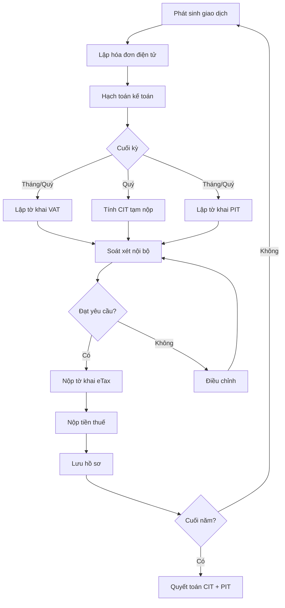

# TX01 — Thuế Căn Bản (Tax Fundamentals)

> **Domain:** Tax
> **Level:** Foundational
> **Prerequisites:** Không có
> **Related:** TX02 (CIT), TX03 (VAT), TX04 (PIT), TX05 (International Tax)

---

## 1. Mục Tiêu Học Tập (Learning Objectives)

Sau khi hoàn thành module này, người học có thể:

1. Mô tả hệ thống thuế Việt Nam — các loại thuế, cơ quan quản lý, và khung pháp lý cơ bản
2. Giải thích quy trình đăng ký thuế và sử dụng MST (Mã số thuế)
3. Lập được lịch nộp tờ khai và nộp thuế theo đúng deadline VN 2024
4. Hiểu quy trình hóa đơn điện tử theo NĐ 123/2020
5. Nhận biết các tình huống dẫn đến kiểm tra thuế, xử phạt và tranh chấp thuế
6. Phân biệt các hành vi vi phạm và mức xử phạt theo Luật Quản lý thuế

---

## 2. Bối Cảnh Kinh Doanh (Business Context)

Thuế là nghĩa vụ tài chính bắt buộc của mọi doanh nghiệp đối với Nhà nước. Tại Việt Nam, thuế chiếm khoảng 18-20% GDP và là nguồn thu chính của ngân sách quốc gia. Với doanh nghiệp, chi phí thuế có thể chiếm 20-30% lợi nhuận trước thuế, vì vậy hiểu đúng và tuân thủ đúng hệ thống thuế là điều kiện tiên quyết để vận hành bền vững.

Không tuân thủ thuế dẫn đến:
- Phạt vi phạm hành chính (20% → 3 lần số thuế trốn)
- Tính lãi chậm nộp 0.03%/ngày
- Truy tố hình sự nếu trốn thuế trên 100 triệu đồng
- Mất uy tín, không được hoàn thuế, bị phong tỏa tài khoản

---

## 3. Định Nghĩa (Definitions)

| Thuật ngữ | Tiếng Anh | Định nghĩa |
|---|---|---|
| Mã số thuế | Tax Identification Number (TIN/MST) | Dãy số định danh doanh nghiệp/cá nhân trong hệ thống thuế |
| Tổng Cục Thuế | General Department of Taxation (GDT) | Cơ quan thuế trung ương trực thuộc Bộ Tài chính |
| Kỳ tính thuế | Tax Period | Khoảng thời gian tính nghĩa vụ thuế (tháng, quý, năm) |
| Tờ khai thuế | Tax Return | Hồ sơ kê khai số thuế phải nộp |
| Hóa đơn điện tử | E-Invoice | Hóa đơn dạng điện tử theo NĐ 123/2020 |
| Khấu trừ thuế | Tax Deduction | Các chi phí/khoản được giảm trừ khi tính thuế |
| Hoàn thuế | Tax Refund | Cơ quan thuế trả lại số thuế đã nộp thừa |
| Kiểm tra thuế | Tax Audit | Cơ quan thuế kiểm tra tính đúng đắn của tờ khai |
| Ấn định thuế | Tax Assessment | CQT xác định số thuế phải nộp khi NNT không khai đúng |
| Khiếu nại thuế | Tax Appeal | Thủ tục phản đối quyết định thuế của CQT |

---

## 4. Khái Niệm Cốt Lõi (Core Concepts)

### 4.1 Cấu trúc hệ thống thuế VN

**Các loại thuế chính tại Việt Nam:**

| Loại thuế | Cơ sở tính | Đối tượng |
|---|---|---|
| CIT (Corporate Income Tax) — Thuế TNDN | Lợi nhuận | Doanh nghiệp |
| VAT (Value Added Tax) — Thuế GTGT | Giá trị gia tăng | DN + cá nhân kinh doanh |
| PIT (Personal Income Tax) — Thuế TNCN | Thu nhập cá nhân | Cá nhân |
| FCT (Foreign Contractor Tax) — Thuế nhà thầu | Doanh thu nhà thầu nước ngoài | Tổ chức/cá nhân nước ngoài |
| SCT (Special Consumption Tax) — Thuế TTĐB | Hàng hóa đặc biệt | SX/NK hàng đặc biệt |
| Import/Export Duty — Thuế XNK | Kim ngạch XNK | DN XNK |
| Thuế tài nguyên | Sản lượng tài nguyên | DN khai thác |
| Thuế đất, LPTB | Giá trị BĐS | Chủ sở hữu BĐS |

### 4.2 Bộ máy quản lý thuế

```
Bộ Tài chính (Ministry of Finance)
    └── Tổng Cục Thuế (GDT) — Trung ương
            ├── Cục Thuế tỉnh/thành phố (63 cục)
            │       └── Chi Cục Thuế quận/huyện
            └── Cục Thuế DN lớn (LTO — Large Taxpayer Office)
```

- **GDT:** Ban hành chính sách, giám sát toàn quốc, hệ thống eTax
- **Cục Thuế:** Quản lý DN cấp tỉnh, xử lý hồ sơ lớn, thanh kiểm tra
- **Chi Cục:** Quản lý HKD, cá nhân, DN nhỏ cấp huyện

### 4.3 Đăng ký thuế — MST

- **DN mới:** Đăng ký qua Cổng thông tin quốc gia về đăng ký DN → tự động cấp MST = Mã số ĐKKD
- **MST 10 số:** Dành cho pháp nhân (VD: 0123456789)
- **MST 13 số:** Dành cho đơn vị trực thuộc (VD: 0123456789-001)
- **Hộ kinh doanh, cá nhân:** MST 10 số riêng

### 4.4 Hóa đơn điện tử (E-Invoice) — NĐ 123/2020

Từ 01/07/2022, toàn bộ DN phải sử dụng hóa đơn điện tử:
- **Loại 1:** Có mã của CQT (hóa đơn có mã) — DN nhỏ/vừa
- **Loại 2:** Không có mã CQT (hóa đơn không mã) — DN đủ điều kiện
- **Khởi tạo:** Qua phần mềm HĐĐT (MISA, FAST, BRAVO...) hoặc cổng thuế
- **Định dạng:** XML chuẩn theo Thông tư 78/2021

---

## 5. Giá Trị Kinh Doanh (Business Value)

- **Tuân thủ:** Tránh phạt, lãi chậm nộp, kiểm tra đột xuất
- **Tối ưu thuế (Tax Optimization):** Sử dụng đúng ưu đãi, khấu trừ hợp lý giảm gánh nặng thuế
- **Dòng tiền:** Kế hoạch tạm nộp đúng hạn tránh phạt, hoàn thuế kịp thời cải thiện cash flow
- **Uy tín:** DN tuân thủ thuế dễ được ngân hàng, nhà đầu tư tin tưởng
- **M&A:** Hồ sơ thuế sạch là điều kiện tiên quyết trong due diligence

---

## 6. Vai Trò Trong Doanh Nghiệp (Enterprise Role)

Bộ phận thuế đảm nhiệm:
- Kê khai đúng hạn, đầy đủ tất cả các loại thuế
- Tư vấn nội bộ về tác động thuế của các quyết định kinh doanh
- Quản lý rủi ro thuế — phát hiện và xử lý trước khi bị kiểm tra
- Đại diện DN trong các cuộc kiểm tra, thanh tra thuế
- Lập kế hoạch thuế (Tax Planning) hợp pháp

---

## 7. Phòng Ban Liên Quan (Departments Related)

| Phòng ban | Mối liên hệ |
|---|---|
| Kế toán (Accounting) | Ghi nhận, hạch toán số liệu thuế |
| Tài chính (Finance) | Lập kế hoạch dòng tiền thuế, tối ưu cấu trúc vốn |
| Pháp chế (Legal) | Xử lý tranh chấp thuế, hợp đồng có tác động thuế |
| Kinh doanh (Sales) | Xuất hóa đơn đúng quy định, VAT trên hợp đồng |
| Mua hàng (Procurement) | Chứng từ đầu vào hợp lệ để khấu trừ VAT/CIT |
| IT/ERP | Hệ thống hóa đơn điện tử, báo cáo thuế tự động |

---

## 8. Đầu Vào (Input)

- Hợp đồng kinh tế, phụ lục hợp đồng
- Hóa đơn đầu vào (mua hàng) và đầu ra (bán hàng)
- Chứng từ thanh toán (ủy nhiệm chi, giấy báo ngân hàng)
- Bảng lương, hợp đồng lao động
- Tờ khai hải quan (nếu XNK)
- Báo cáo tài chính nội bộ (sổ cái, bảng cân đối kế toán)
- Các quyết định của HĐQT/BGĐ (phân chia cổ tức, tái cơ cấu)

---

## 9. Đầu Ra (Output)

- Tờ khai thuế đã nộp (VAT, CIT, PIT, FCT...)
- Biên lai nộp thuế / Giấy xác nhận hoàn thành nghĩa vụ thuế
- Báo cáo thuế nội bộ hàng tháng/quý/năm
- Hồ sơ hoàn thuế
- Biên bản kiểm tra thuế
- Quyết định xử phạt vi phạm hành chính thuế (nếu có)
- Kế hoạch thuế năm (Tax Plan)

---

## 10. Quy Trình Nghiệp Vụ (Business Process)

```
Phát sinh giao dịch kinh tế
        ↓
Lập/nhận hóa đơn điện tử
        ↓
Hạch toán kế toán → Sổ sách
        ↓
Tổng hợp số liệu theo kỳ (tháng/quý)
        ↓
Lập tờ khai thuế (VAT/CIT/PIT...)
        ↓
Kiểm tra, soát xét nội bộ
        ↓
Nộp tờ khai qua eTax/HTKK
        ↓
Nộp tiền thuế (online banking / KBNN)
        ↓
Lưu hồ sơ, theo dõi số dư
        ↓
Quyết toán cuối năm (CIT, PIT)
```

---

## 11. Luồng Dữ Liệu (Data Flow)

```
Phần mềm kế toán (MISA/FAST) ──→ HTKK/eTax ──→ Cổng thuế GDT
        ↑                                              ↓
Hóa đơn điện tử ──────────────────────────→ Hệ thống xác thực CQT
        ↑                                              ↓
ERP/POS/Ngân hàng ────────────────────────→ Mã CQT (nếu có mã)
```

---

## 12. Luồng Tiền (Money Flow)

```
Doanh thu bán hàng
    → Thu VAT đầu ra từ khách hàng
    → Trả VAT đầu vào cho nhà cung cấp
    → Nộp VAT chênh lệch (hoặc xin hoàn) cho KBNN

Lợi nhuận trước thuế (EBT)
    → Tạm nộp CIT 4 quý (≥80% số quyết toán)
    → Quyết toán CIT cuối năm

Lương gross nhân viên
    → Khấu trừ PIT tại nguồn
    → Nộp PIT thay cho nhân viên vào KBNN
```

---

## 13. Luồng Chứng Từ (Document Flow)

```
Hợp đồng → Hóa đơn điện tử → Phiếu thu/chi → Chứng từ ngân hàng
    ↓              ↓                ↓                   ↓
Tờ khai thuế ← Sổ sách kế toán ← Bảng tổng hợp ← Báo cáo tài chính
    ↓
Nộp eTax/HTKK → Biên lai nộp thuế → Lưu trữ (10 năm)
```

---

## 14. Vai Trò (Roles)

| Vai trò | Mô tả |
|---|---|
| CFO / Giám đốc Tài chính | Phê duyệt chiến lược thuế, ký tờ khai |
| Tax Manager / Kế toán trưởng | Quản lý tuân thủ thuế, lập kế hoạch thuế |
| Tax Accountant / Kế toán thuế | Lập tờ khai, đối chiếu số liệu |
| Kế toán tổng hợp | Cung cấp số liệu từ sổ sách |
| Legal Counsel | Tư vấn pháp lý tranh chấp thuế |
| Tax Consultant (bên ngoài) | Hỗ trợ kiểm tra thuế, tái cơ cấu |

---

## 15. Trách Nhiệm (Responsibilities)

- **Kế toán thuế:** Lập và nộp tờ khai đúng hạn, lưu trữ hồ sơ đúng quy định
- **Kế toán trưởng:** Soát xét tờ khai, ký xác nhận, báo cáo lên CFO
- **CFO:** Phê duyệt tờ khai quyết toán, ký báo cáo tài chính
- **Giám đốc:** Ký tờ khai CIT quyết toán, chịu trách nhiệm pháp nhân
- **IT/ERP:** Đảm bảo hệ thống hóa đơn điện tử vận hành liên tục

---

## 16. Ma Trận RACI

| Hoạt động | CFO | Tax Manager | Tax Accountant | Kế toán tổng hợp | Legal |
|---|---|---|---|---|---|
| Lập tờ khai VAT tháng | I | A | R | C | - |
| Nộp tờ khai CIT tạm | A | R | C | C | - |
| Quyết toán CIT năm | A | R | C | C | C |
| Xử lý kiểm tra thuế | A | R | C | C | R |
| Nộp hồ sơ hoàn thuế | A | R | R | C | - |
| Khiếu nại quyết định thuế | A | C | - | - | R |

---

## 17. Frameworks

- **Luật Quản lý thuế 38/2019/QH14** — nền tảng pháp lý toàn bộ hệ thống thuế VN
- **COSO Internal Control Framework** — kiểm soát nội bộ quy trình thuế
- **Tax Risk Management Framework** — nhận diện, đánh giá, xử lý rủi ro thuế
- **Tax Governance Framework (OECD)** — quản trị thuế tốt cho DN đa quốc gia

---

## 18. Chuẩn Quốc Tế (International Standards)

- **OECD Tax Administration 3.0** — số hóa quản lý thuế
- **BEPS Action Plans (OECD/G20)** — chống xói mòn cơ sở thuế và chuyển lợi nhuận
- **Common Reporting Standard (CRS)** — trao đổi thông tin thuế tự động giữa các quốc gia
- **FATCA** — yêu cầu báo cáo tài khoản nước ngoài (áp dụng với DN có yếu tố Mỹ)
- **ISO 37001** — chống hối lộ (liên quan đến quản lý rủi ro thuế)

---

## 19. Bối Cảnh Việt Nam (Vietnam Context)

### Lịch nộp tờ khai và nộp thuế 2024

| Loại thuế | Kỳ khai | Hạn nộp tờ khai | Hạn nộp tiền |
|---|---|---|---|
| VAT | Tháng | Ngày 20 tháng sau | Cùng hạn tờ khai |
| VAT | Quý | Ngày 30 tháng đầu quý sau | Cùng hạn tờ khai |
| CIT tạm nộp | Quý | Không cần nộp tờ khai | Ngày 30 tháng đầu quý sau |
| CIT quyết toán | Năm | Ngày 31/03 năm sau | Ngày 31/03 năm sau |
| PIT khấu trừ | Tháng/Quý | Ngày 20/30 kỳ sau | Cùng hạn tờ khai |
| PIT quyết toán | Năm | Ngày 31/03 năm sau | Ngày 31/03 năm sau |
| FCT | Theo phát sinh | 10 ngày từ ngày khấu trừ | Cùng hạn |

**Lưu ý:** DN được chọn kê khai VAT theo tháng hoặc quý nếu doanh thu năm trước ≤ 50 tỷ.

### Tạm nộp CIT 4 quý

- Tổng 4 quý tạm nộp ≥ 80% số CIT quyết toán cả năm
- Nếu thấp hơn 80%: bị tính lãi chậm nộp 0.03%/ngày trên phần thiếu

### Hệ thống eTax và iHTKK

- **eTax:** Nộp tờ khai, nộp tiền, tra cứu số dư, nhận thông báo
- **HTKK:** Lập tờ khai offline, xuất file XML nộp lên eTax

---

## 20. Khía Cạnh Pháp Lý (Legal Considerations)

**Văn bản pháp luật chủ yếu:**
- Luật Quản lý thuế 38/2019/QH14 (hiệu lực 01/07/2020)
- Nghị định 126/2020/NĐ-CP hướng dẫn Luật QLYT
- Nghị định 125/2020/NĐ-CP xử phạt vi phạm hành chính thuế
- Nghị định 123/2020/NĐ-CP về hóa đơn, chứng từ
- Thông tư 78/2021/TT-BTC hướng dẫn NĐ 123

**Mức phạt vi phạm thuế:**
| Hành vi | Mức phạt |
|---|---|
| Nộp tờ khai chậm 1-30 ngày | 2 triệu đồng |
| Nộp tờ khai chậm 31-60 ngày | 3 triệu đồng |
| Chậm nộp tiền thuế | Lãi 0.03%/ngày |
| Khai sai không dẫn đến thiếu thuế | 1.5-2.5 triệu |
| Khai sai dẫn đến thiếu thuế | 20% số thuế thiếu |
| Trốn thuế | 1-3 lần số thuế trốn |

**Thời hiệu:**
- Xử phạt vi phạm hành chính thuế: 5 năm
- Ấn định thuế: 5 năm (10 năm nếu có hành vi trốn thuế)

---

## 21. Lỗi Phổ Biến (Common Mistakes)

1. **Nộp tờ khai chậm** do không theo dõi lịch, deadline rơi vào cuối tuần không điều chỉnh
2. **Tạm nộp CIT không đủ 80%** — bị phạt lãi chậm nộp cuối năm
3. **Hóa đơn không hợp lệ** — hóa đơn viết sai, hủy sai quy trình, không có chữ ký số
4. **Mua hàng thanh toán tiền mặt >20 triệu** — không được khấu trừ VAT đầu vào
5. **Không khai FCT** khi trả phí dịch vụ cho công ty nước ngoài
6. **Kê khai VAT đầu vào sai kỳ** — hóa đơn tháng 12 kê khai tháng 1 năm sau
7. **Không lưu hồ sơ đủ 10 năm** theo Luật QLYT
8. **Dùng hóa đơn giấy sau 01/07/2022** — vi phạm NĐ 123/2020

---

## 22. Thực Hành Tốt Nhất (Best Practices)

1. **Tax Calendar:** Lập lịch thuế năm, nhắc nhở tự động qua email/hệ thống
2. **Closing checklist tháng:** Đối chiếu VAT đầu ra/đầu vào trước ngày 15 mỗi tháng
3. **Tách biệt chức năng:** Người lập tờ khai ≠ người kiểm tra ≠ người phê duyệt
4. **Lưu trữ điện tử:** Scan toàn bộ hóa đơn, chứng từ → lưu cloud có backup
5. **Health check hàng quý:** Tự kiểm tra nội bộ trước khi CQT kiểm tra
6. **Cập nhật văn bản pháp luật:** Subscribe newsletter GDT, theo dõi website tct.gov.vn
7. **Đào tạo nhân sự kế toán** hàng năm về thay đổi chính sách thuế
8. **Phối hợp sớm với tư vấn thuế** khi có giao dịch lớn, bất thường

---

## 23. KPIs

| KPI | Mục tiêu |
|---|---|
| Tỷ lệ nộp đúng hạn (On-time filing rate) | 100% |
| Số lần bị phạt do nộp chậm/sai | 0 |
| Số ngày trung bình hoàn thuế VAT | < 40 ngày |
| Tax effective rate (CIT thực tế / Lợi nhuận kế toán) | Theo kế hoạch |
| Số lần kiểm tra thuế trong năm | 0 (chủ động) |
| Thời gian chuẩn bị hồ sơ quyết toán CIT | < 10 ngày làm việc |

---

## 24. Số Liệu Đo Lường (Metrics)

- **Thuế phải nộp / Doanh thu thuần:** Tax burden ratio
- **VAT refund pending:** Số dư VAT đang chờ hoàn
- **Số hóa đơn hủy / Tổng hóa đơn:** Tỷ lệ hóa đơn hủy — nếu cao cần xem lại quy trình
- **Days Tax Outstanding:** Số ngày nợ thuế trung bình
- **CIT tạm nộp vs. quyết toán:** Chênh lệch cuối năm

---

## 25. Báo Cáo (Reports)

- **Báo cáo tuân thủ thuế tháng/quý:** Danh sách tờ khai đã nộp, số tiền, hạn
- **Tax Provision report (CIT dự phòng):** Cho BCTC
- **Reconciliation VAT:** Đối chiếu sổ kế toán vs. tờ khai VAT
- **Tax Risk Report:** Các rủi ro thuế đang tồn đọng và kế hoạch xử lý
- **Tax Effective Rate Analysis:** Phân tích nguyên nhân chênh lệch

---

## 26. Mẫu Biểu (Templates)

**Mẫu Lịch Thuế Năm:**
```
Tháng | Loại tờ khai | Hạn | Người phụ trách | Trạng thái
01/2024 | VAT T12/2023 | 20/01 | Nguyễn A | ✓
01/2024 | CIT tạm Q4/2023 | 30/01 | Trần B | ✓
03/2024 | CIT QTT 2023 | 31/03 | Trần B | ✓
...
```

**Tờ khai chính thức:**
- Form 01/GTGT (VAT tháng/quý)
- Form 03/TNDN (CIT tạm + quyết toán)
- Form 05/KK-TNCN (PIT tháng/quý)
- Form 01/LPTB (Lệ phí trước bạ)

---

## 27. Checklists

**Checklist đóng sổ tháng (Tax Close):**
- [ ] Đối chiếu hóa đơn đầu ra vs. sổ doanh thu
- [ ] Kiểm tra hóa đơn đầu vào đủ điều kiện khấu trừ VAT
- [ ] Hóa đơn >20 triệu đã thanh toán qua ngân hàng chưa?
- [ ] Tổng hợp FCT phát sinh tháng
- [ ] Lập tờ khai VAT trên HTKK/eTax
- [ ] Kiểm tra deadline nộp: tháng sau ngày 20
- [ ] Nộp tiền thuế đúng hạn
- [ ] Lưu file tờ khai + biên lai

**Checklist quyết toán CIT năm:**
- [ ] Reconcile lợi nhuận kế toán vs. thu nhập chịu thuế
- [ ] Kiểm tra chi phí không được trừ
- [ ] Xác nhận lỗ chuyển tiếp từ năm trước
- [ ] Tính ưu đãi thuế (nếu có)
- [ ] Đối chiếu tạm nộp 4 quý ≥ 80% quyết toán
- [ ] Ký tờ khai — người đại diện pháp luật

---

## 28. Quy Trình Chuẩn (SOP)

**SOP-TAX-01: Nộp tờ khai VAT tháng**

| Bước | Người thực hiện | Mô tả | Deadline |
|---|---|---|---|
| 1 | Kế toán thuế | Tổng hợp hóa đơn đầu ra T-1 | Ngày 5 tháng T |
| 2 | Kế toán thuế | Kiểm tra hóa đơn đầu vào đủ điều kiện | Ngày 8 tháng T |
| 3 | Kế toán thuế | Lập tờ khai 01/GTGT trên HTKK | Ngày 12 tháng T |
| 4 | Kế toán trưởng | Soát xét tờ khai | Ngày 15 tháng T |
| 5 | Kế toán thuế | Nộp tờ khai qua eTax | Ngày 18 tháng T |
| 6 | Kế toán thuế | Nộp tiền thuế qua iBanking | Ngày 19 tháng T |
| 7 | Kế toán thuế | Lưu hồ sơ + biên lai | Ngày 20 tháng T |

---

## 29. Tình Huống Thực Tế (Case Study)

**Tình huống: DN bị phạt do tạm nộp CIT không đủ 80%**

Công ty ABC có CIT quyết toán năm 2023 là 2 tỷ đồng. Tổng tạm nộp 4 quý chỉ là 1.4 tỷ (70%). 

- Phần thiếu so với 80% = 2 tỷ × 80% - 1.4 tỷ = 200 triệu
- Lãi chậm nộp = 200 triệu × 0.03% × 90 ngày (từ 31/01 đến 31/03) = 5.4 triệu
- Bài học: Ước tính lợi nhuận sát thực tế, tăng tạm nộp Q4 nếu kinh doanh tốt

---

## 30. Ví Dụ Doanh Nghiệp Nhỏ (Small Business Example)

**Cửa hàng thời trang (HKD chuyển lên DN):**
- Doanh thu 2023: 8 tỷ → kê khai VAT theo quý
- MST: đăng ký ngay khi thành lập TNHH
- Hóa đơn điện tử: dùng gói cơ bản MISA ~200k/tháng
- Nhân sự thuế: 1 kế toán kiêm nhiệm
- Rủi ro: Quên nộp tờ khai VAT Q1 → bị phạt 3 triệu

---

## 31. Ví Dụ Doanh Nghiệp Lớn (Enterprise Example)

**Tập đoàn sản xuất đa ngành (doanh thu 5,000 tỷ):**
- Team thuế: 5 người (Tax Manager + 4 Tax Accountants)
- Phần mềm: SAP + FAST Tax + phần mềm HĐĐT riêng
- Khai thuế: hàng tháng (VAT, PIT), hàng quý (CIT tạm), hàng năm (CIT QTT, PIT QTT)
- Thách thức: 15 công ty con → transfer pricing documentation
- Rủi ro lớn: Kiểm tra thuế toàn diện 5 năm → cần hồ sơ đầy đủ

---

## 32. Ánh Xạ ERP (ERP Mapping)

| Chức năng ERP | Module | Mối liên hệ với Thuế |
|---|---|---|
| Accounts Receivable | AR | Xuất hóa đơn VAT đầu ra |
| Accounts Payable | AP | Nhận hóa đơn VAT đầu vào |
| General Ledger | GL | Hạch toán thuế phải nộp, tạm nộp |
| Fixed Assets | FA | Khấu hao — ảnh hưởng CIT |
| Payroll | HR/Payroll | PIT, BHXH khấu trừ tự động |
| Tax Management | TX | Lập tờ khai, báo cáo thuế |

---

## 33. Tự Động Hóa (Automation)

- **Auto-generate tax returns:** Kết nối ERP → HTKK/eTax tự động điền số liệu
- **E-invoice integration:** Hóa đơn tự động gửi CQT + ghi nhận kế toán
- **Tax calendar alerts:** Nhắc nhở deadline qua email/SMS/Teams
- **Reconciliation bots:** Tự động đối chiếu VAT sổ sách vs. tờ khai
- **Document OCR:** Tự động đọc hóa đơn giấy cũ, lưu vào hệ thống

---

## 34. Cơ Hội AI (AI Opportunities)

- **AI tax review:** Phát hiện bất thường trong tờ khai (anomaly detection)
- **Tax regulation NLP:** AI đọc và tóm tắt văn bản pháp luật mới
- **Predictive CIT:** Dự báo CIT cả năm dựa trên số liệu quý 1-3
- **Invoice fraud detection:** Phát hiện hóa đơn giả, hóa đơn rủi ro
- **Chatbot thuế nội bộ:** Trả lời câu hỏi chính sách thuế cho nhân viên kế toán

---

## 35. Hướng Dẫn Triển Khai (Implementation Guide)

**Giai đoạn 1 (Tháng 1-2): Chuẩn hóa**
- Kiểm kê toàn bộ nghĩa vụ thuế hiện tại
- Lập tax calendar đầy đủ cho năm
- Chuẩn hóa hệ thống hóa đơn điện tử

**Giai đoạn 2 (Tháng 3-4): Quy trình hóa**
- Ban hành SOP cho từng loại tờ khai
- Phân công rõ ràng trách nhiệm
- Thiết lập hệ thống lưu trữ hồ sơ

**Giai đoạn 3 (Tháng 5-6): Tự động hóa**
- Kết nối ERP với hệ thống nộp tờ khai
- Tự động hóa cảnh báo deadline
- Đào tạo đội ngũ sử dụng công cụ mới

---

## 36. Hướng Dẫn Tư Vấn (Consulting Guide)

**Các câu hỏi cần hỏi khi onboard khách hàng:**
1. Doanh nghiệp đang kê khai VAT theo tháng hay quý?
2. Có bao nhiêu loại thuế đang phải khai? Ai đang làm?
3. Năm nào gần nhất bị kiểm tra thuế? Kết quả thế nào?
4. Có giao dịch với bên nước ngoài không? FCT đã khai chưa?
5. Hệ thống hóa đơn điện tử đang dùng là gì?

**Red flags cần điều tra ngay:**
- Tờ khai nộp muộn nhiều lần
- CIT tạm nộp quá thấp so với lợi nhuận thực tế
- Hóa đơn đầu vào nhiều từ các công ty "shell"
- Không có hồ sơ transfer pricing dù có giao dịch liên kết

---

## 37. Câu Hỏi Chẩn Đoán (Diagnostic Questions)

1. Doanh nghiệp có tax calendar tự động nhắc nhở không?
2. Tờ khai có được soát xét độc lập trước khi nộp?
3. Hệ thống hóa đơn điện tử có tích hợp với kế toán không?
4. Đội ngũ kế toán thuế có được đào tạo cập nhật hàng năm?
5. Có quy trình internal tax health check định kỳ không?
6. FCT có được khai đầy đủ cho tất cả giao dịch nước ngoài?
7. Hồ sơ transfer pricing có đầy đủ cho năm hiện tại?

---

## 38. Câu Hỏi Phỏng Vấn (Interview Questions)

**Junior Tax Accountant:**
1. Hóa đơn GTGT đầu vào cần đáp ứng điều kiện gì để được khấu trừ?
2. Deadline nộp tờ khai VAT tháng là ngày mấy?
3. Trường hợp nào doanh nghiệp được hoàn thuế VAT?

**Senior Tax Manager:**
1. Anh/chị sẽ xử lý thế nào khi nhận biên bản kiểm tra thuế?
2. Giải thích quy tắc 80% trong tạm nộp CIT và cách tối ưu?
3. Khi nào cần lập hồ sơ transfer pricing? Cần gồm những gì?

---

## 39. Bài Tập (Exercises)

**Bài tập 1:** Lập tax calendar hoàn chỉnh cho một DN sản xuất có doanh thu 100 tỷ/năm, kê khai VAT tháng.

**Bài tập 2:** Công ty A tạm nộp CIT 4 quý: Q1=200tr, Q2=200tr, Q3=300tr, Q4=150tr. CIT quyết toán = 1.2 tỷ. Tính xem có bị phạt lãi không? Phạt bao nhiêu?

**Bài tập 3:** Phân tích hồ sơ hóa đơn đầu vào tháng — xác định các hóa đơn không đủ điều kiện khấu trừ VAT.

**Bài tập 4:** Thiết kế quy trình kiểm tra nội bộ (tax health check) hàng quý cho DN vừa.

---

## 40. Tài Liệu Tham Khảo (References)

- Luật Quản lý thuế 38/2019/QH14
- Nghị định 126/2020/NĐ-CP
- Nghị định 125/2020/NĐ-CP (xử phạt hành chính thuế)
- Nghị định 123/2020/NĐ-CP (hóa đơn điện tử)
- Thông tư 78/2021/TT-BTC
- Website Tổng Cục Thuế: https://www.gdt.gov.vn
- Cổng eTax: https://etax.gdt.gov.vn

---

## Output Formats

### A. Mermaid Diagram — Quy trình tuân thủ thuế



### B. ASCII Diagram — Bộ máy thuế VN

```
+---------------------------+
|      BỘ TÀI CHÍNH         |
+---------------------------+
            |
+---------------------------+
|    TỔNG CỤC THUẾ (GDT)    |
|   + Cục Thuế DN Lớn (LTO) |
+---------------------------+
            |
    +-------+-------+
    |               |
+-------+       +-------+
|CỤC    |  ...  |CỤC    |
|THUẾ   |       |THUẾ   |
|HCM    |       |HÀ NỘI |
+-------+       +-------+
    |               |
+-------+       +-------+
|CHI CỤC|       |CHI CỤC|
|THUẾ   |       |THUẾ   |
|Q.1    |       |Q.BA   |
+-------+       +-------+
```

### C. Flashcards

**Q1:** Deadline nộp tờ khai VAT tháng là khi nào?
**A1:** Ngày 20 của tháng tiếp theo (VD: VAT tháng 3 → hạn ngày 20/4).

**Q2:** Quy tắc 80% trong CIT tạm nộp là gì?
**A2:** Tổng CIT tạm nộp 4 quý phải đạt ít nhất 80% số CIT quyết toán cả năm, nếu không sẽ bị tính lãi chậm nộp 0.03%/ngày trên phần thiếu.

**Q3:** Hóa đơn đầu vào từ 20 triệu trở lên cần điều kiện gì để được khấu trừ VAT?
**A3:** Phải thanh toán qua ngân hàng (chuyển khoản, thẻ) — không được dùng tiền mặt.

### D. Cheat Sheet — Thuế Căn Bản VN

```
=== CHEAT SHEET: THUẾ CĂN BẢN VIỆT NAM ===

DEADLINES QUAN TRỌNG:
• VAT tháng     → nộp trước ngày 20 tháng sau
• VAT quý       → nộp trước ngày 30 tháng đầu quý sau
• CIT tạm quý   → nộp tiền trước ngày 30 tháng đầu quý sau
• CIT quyết toán→ nộp trước 31/03 năm sau
• PIT quyết toán→ nộp trước 31/03 năm sau

PHẠT PHỔ BIẾN:
• Chậm tờ khai 1-30 ngày → 2 triệu VND
• Chậm nộp tiền thuế     → 0.03%/ngày
• Thiếu thuế do khai sai → 20% số thiếu
• Trốn thuế              → 1-3 lần số thuế

ĐIỀU KIỆN KHẤU TRỪ VAT ĐẦU VÀO:
1. Hóa đơn hợp lệ (điện tử, đúng quy định)
2. Hàng hóa/dịch vụ phục vụ SXKD chịu VAT
3. Thanh toán qua ngân hàng (nếu ≥ 20 triệu)

E-INVOICE (từ 01/07/2022):
• Bắt buộc 100% doanh nghiệp
• Có mã CQT hoặc không có mã
• Phần mềm: MISA, FAST, BRAVO, VNPT...
```

### E. JSON Metadata

```json
{
  "module": {
    "code": "TX01",
    "name": "Thuế Căn Bản",
    "name_en": "Tax Fundamentals",
    "domain": "Tax",
    "level": "Foundational",
    "status": "complete",
    "version": "1.0",
    "last_updated": "2024-01-01"
  },
  "vietnam_context": {
    "key_rates": {
      "VAT_standard": "10%",
      "VAT_reduced": "5%",
      "VAT_zero": "0%",
      "CIT_standard": "20%",
      "late_payment_interest": "0.03%/ngày"
    },
    "key_deadlines": {
      "VAT_monthly": "Ngày 20 tháng sau",
      "VAT_quarterly": "Ngày 30 tháng đầu quý sau",
      "CIT_finalization": "31/03 năm sau",
      "PIT_finalization": "31/03 năm sau"
    },
    "key_laws": [
      "Luật QLYT 38/2019/QH14",
      "NĐ 126/2020/NĐ-CP",
      "NĐ 125/2020/NĐ-CP",
      "NĐ 123/2020/NĐ-CP"
    ]
  },
  "related_modules": ["TX02", "TX03", "TX04", "TX05"],
  "prerequisites": [],
  "tags": ["tax", "compliance", "VAT", "CIT", "PIT", "e-invoice", "Vietnam"]
}
```
