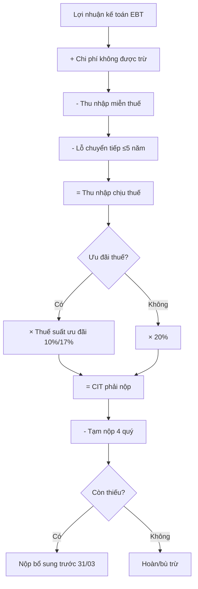

# TX02 — Thuế TNDN (Corporate Income Tax — CIT)

> **Domain:** Tax
> **Level:** Intermediate
> **Prerequisites:** TX01 (Thuế Căn Bản)
> **Related:** TX03 (VAT), TX04 (PIT), TX05 (International Tax)

---

## 1. Mục Tiêu Học Tập (Learning Objectives)

Sau khi hoàn thành module này, người học có thể:

1. Giải thích cơ cấu tính thuế TNDN từ lợi nhuận kế toán đến thu nhập chịu thuế
2. Xác định đúng các chi phí được trừ và không được trừ theo Luật thuế TNDN
3. Áp dụng đúng các ưu đãi thuế TNDN (miễn, giảm, thuế suất ưu đãi)
4. Lập Form 03/TNDN và tờ khai quyết toán thuế TNDN
5. Hiểu và áp dụng quy định về transfer pricing theo NĐ 132/2020
6. Lập kế hoạch CIT hợp pháp cho doanh nghiệp

---

## 2. Bối Cảnh Kinh Doanh (Business Context)

CIT là loại thuế trực thu đánh trên lợi nhuận của doanh nghiệp. Tại Việt Nam, CIT được thu theo Luật thuế TNDN 2008 và các lần sửa đổi (2013, 2014). Với thuế suất phổ thông 20%, CIT là một trong những gánh nặng chi phí lớn nhất của DN — đặc biệt với DN có biên lợi nhuận cao.

Quản lý CIT hiệu quả giúp DN:
- Tối ưu dòng tiền thông qua kế hoạch tạm nộp
- Tận dụng ưu đãi thuế hợp pháp (tiết kiệm 5-10% thuế suất)
- Tránh rủi ro bị ấn định thuế do chi phí không hợp lý
- Đáp ứng yêu cầu disclosure của nhà đầu tư (Tax effective rate)

---

## 3. Định Nghĩa (Definitions)

| Thuật ngữ | Tiếng Anh | Định nghĩa |
|---|---|---|
| Thuế TNDN | CIT — Corporate Income Tax | Thuế đánh trên thu nhập chịu thuế của DN |
| Thu nhập chịu thuế | Taxable Income | Lợi nhuận kế toán điều chỉnh theo Luật thuế |
| Chi phí được trừ | Deductible Expense | Chi phí hợp lý, hợp lệ, liên quan đến SXKD |
| Chi phí không được trừ | Non-deductible Expense | Chi phí không đáp ứng điều kiện của Luật |
| Lỗ tính thuế | Tax Loss | Thu nhập chịu thuế âm, được chuyển sang năm sau |
| Chuyển lỗ | Loss Carry-forward | Lỗ năm trước được trừ vào thu nhập năm sau (tối đa 5 năm) |
| Ưu đãi thuế | Tax Incentive | Thuế suất thấp hơn hoặc miễn/giảm thuế |
| Giao dịch liên kết | Related-party Transaction | Giao dịch giữa các bên có quan hệ liên kết |
| Giá thị trường (arm's length) | Arm's Length Price | Giá giao dịch như với bên độc lập |
| CIT provision | Tax Provision | Dự phòng thuế TNDN trên BCTC |

---

## 4. Khái Niệm Cốt Lõi (Core Concepts)

### 4.1 Đối tượng nộp thuế TNDN

- Tổ chức sản xuất, kinh doanh hàng hóa, dịch vụ có thu nhập chịu thuế
- Bao gồm: Công ty TNHH, CTCP, DNNN, Hợp danh, Chi nhánh công ty nước ngoài tại VN
- Không bao gồm: Hộ kinh doanh (nộp thuế khoán/thuế TNCN)

### 4.2 Công thức tính CIT

```
Thu nhập chịu thuế = Doanh thu - Chi phí được trừ + Thu nhập khác

CIT phải nộp = Thu nhập chịu thuế × Thuế suất - Ưu đãi (nếu có)

Thu nhập chịu thuế = Lợi nhuận kế toán
                   + Chi phí không được trừ
                   - Thu nhập miễn thuế
                   - Lỗ chuyển từ năm trước
```

### 4.3 Thuế suất CIT

| Đối tượng | Thuế suất |
|---|---|
| Phổ thông (standard) | **20%** |
| Dầu khí (tùy trữ lượng) | 32% - 50% |
| Khai thác tài nguyên quý hiếm | 40% - 50% |
| Ưu đãi đặc biệt (high-tech, KKT) | **10%** (miễn 4 năm + giảm 9 năm) |
| Ưu đãi theo địa bàn KK | **17%** (miễn 2 năm + giảm 4 năm) |
| Ưu đãi DN nhỏ và vừa (điều kiện) | **17%** → **15%** |

### 4.4 Chi phí được trừ

**Điều kiện chung (3 điều kiện):**
1. Thực tế phát sinh và liên quan đến SXKD
2. Có đầy đủ hóa đơn, chứng từ hợp lệ
3. Thanh toán qua ngân hàng nếu ≥ 20 triệu đồng/lần

**Chi phí được trừ phổ biến:**
- Chi phí nguyên vật liệu, hàng hóa
- Chi phí nhân công (lương, thưởng, BHXH)
- Chi phí khấu hao TSCĐ (theo khung quy định)
- Chi phí thuê nhà, văn phòng
- Chi phí lãi vay (giới hạn 30% EBITDA theo NĐ 132/2020)
- Chi phí quảng cáo, tiếp thị (giới hạn 15% tổng chi phí được trừ)
- Chi phí R&D (được trừ 150% — khuyến khích đổi mới)

### 4.5 Chi phí không được trừ

- Chi phí không có hóa đơn, chứng từ hợp lệ
- Tiền phạt hành chính, vi phạm
- Chi phí khấu hao vượt mức quy định
- Chi phí lương không thực tế chi (không có hợp đồng, bảng lương)
- Lãi vay vượt quá 30% EBITDA (với bên liên kết)
- Chi phí quảng cáo, tiếp thị vượt 15%
- Trích lập dự phòng không đúng quy định
- Các khoản chi không phục vụ SXKD

### 4.6 Chuyển lỗ (Loss Carry-forward)

- Lỗ được chuyển toàn bộ và liên tục vào các năm sau
- Thời hạn tối đa: **5 năm** liên tiếp kể từ năm phát sinh lỗ
- Ví dụ: Lỗ 2020 → được trừ từ 2021 đến 2025 (hết 2025 là bỏ)
- Không được chuyển ngược (no carry-back)

---

## 5. Giá Trị Kinh Doanh (Business Value)

- **Tiết kiệm chi phí thuế:** Tận dụng ưu đãi có thể giảm 5-10% thuế suất → tiết kiệm hàng tỷ đồng
- **Kế hoạch đầu tư:** Ưu đãi CIT là yếu tố quyết định khi chọn địa điểm đầu tư, loại hình DN
- **Dòng tiền:** Kế hoạch tạm nộp tối ưu giúp giữ tiền lâu hơn trong DN
- **BCTC chính xác:** Tax provision đúng đảm bảo lợi nhuận sau thuế phản ánh thực tế
- **Investor relations:** Effective tax rate thấp (hợp lệ) thu hút nhà đầu tư

---

## 6. Vai Trò Trong Doanh Nghiệp (Enterprise Role)

- Bộ phận thuế: lập tờ khai CIT, quản lý ưu đãi thuế, hồ sơ transfer pricing
- Kế toán: cung cấp số liệu lợi nhuận, chi phí; lập tax provision
- CFO: phê duyệt kế hoạch thuế năm, quyết định cấu trúc để tối ưu CIT
- Ban điều hành: ký tờ khai quyết toán CIT

---

## 7. Phòng Ban Liên Quan (Departments Related)

| Phòng ban | Nội dung liên quan |
|---|---|
| Kế toán (Accounting) | Số liệu doanh thu, chi phí; điều chỉnh kế toán → thuế |
| Tài chính (Finance) | Kế hoạch tạm nộp, cash flow thuế, tax provision |
| Pháp chế (Legal) | Hợp đồng giao dịch liên kết, cơ cấu pháp lý |
| Đầu tư (Investment) | Xác định ưu đãi thuế cho dự án mới |
| Mua hàng (Procurement) | Hóa đơn, chứng từ chi phí hợp lệ |
| Nhân sự (HR) | Bảng lương, hợp đồng lao động cho chi phí lương được trừ |

---

## 8. Đầu Vào (Input)

- Báo cáo tài chính năm (Bảng CĐKT, KQHĐKD, BCLCTT)
- Sổ cái tài khoản doanh thu (5xx) và chi phí (6xx, 8xx)
- Hóa đơn, chứng từ chi phí toàn năm
- Quyết định ưu đãi thuế (Giấy phép đầu tư, Quyết định của UBND)
- Số liệu lỗ chuyển từ các năm trước
- Tài liệu transfer pricing (nếu có giao dịch liên kết)
- Hợp đồng vay vốn (tính giới hạn lãi vay 30% EBITDA)

---

## 9. Đầu Ra (Output)

- Tờ khai CIT tạm nộp 4 quý (không cần mẫu, chỉ nộp tiền)
- Form 03/TNDN — Tờ khai quyết toán thuế TNDN
- Phụ lục 03-1/TNDN — Kết quả hoạt động SXKD
- Phụ lục 03-2/TNDN — Ưu đãi thuế TNDN
- Phụ lục 03-3/TNDN — Trích lập và sử dụng các quỹ
- Biên bản nộp tiền CIT
- Báo cáo nội bộ CIT provision

---

## 10. Quy Trình Nghiệp Vụ (Business Process)

```
Hàng quý:
Ước tính lợi nhuận quý → Tính CIT tạm nộp → Nộp tiền trước ngày 30

Cuối năm:
Đóng sổ kế toán (01-15/01)
    ↓
Reconcile lợi nhuận kế toán → thu nhập chịu thuế
    ↓
Xác định chi phí không được trừ
    ↓
Áp dụng lỗ chuyển tiếp (nếu có)
    ↓
Áp dụng ưu đãi thuế (nếu có)
    ↓
Tính CIT quyết toán
    ↓
So sánh với tạm nộp 4 quý
    ↓
Lập Form 03/TNDN + phụ lục
    ↓
Nộp tờ khai và nộp thuế còn thiếu → Hạn 31/03
```

---

## 11. Luồng Dữ Liệu (Data Flow)

```
ERP/Kế toán → Sổ cái chi tiết → Phân loại được trừ/không được trừ
                                          ↓
                               Bảng điều chỉnh thuế kế toán
                                          ↓
                                  Form 03/TNDN (HTKK)
                                          ↓
                                    eTax → GDT
```

---

## 12. Luồng Tiền (Money Flow)

```
Lợi nhuận trước thuế (PBT)
    ↓
× 20% (hoặc thuế suất ưu đãi)
    ↓
= CIT phải nộp năm (A)
    ↓
Tạm nộp Q1+Q2+Q3+Q4 = (B) ≥ 80% × A
    ↓
Nộp bổ sung cuối năm = A - B (hạn 31/03)
hoặc xin hoàn/bù trừ nếu B > A
```

---

## 13. Luồng Chứng Từ (Document Flow)

```
Hóa đơn chi phí → Phiếu kế toán → Sổ cái → Bảng điều chỉnh
    ↓                                              ↓
Hợp đồng lao động → Bảng lương ────────→ Form 03/TNDN
    ↓                                              ↓
Quyết định ưu đãi → Phụ lục 03-2/TNDN ──→ Nộp eTax
```

---

## 14. Vai Trò (Roles)

| Vai trò | Trách nhiệm CIT |
|---|---|
| Giám đốc (Legal Representative) | Ký tờ khai quyết toán CIT |
| CFO | Phê duyệt kế hoạch CIT, phụ trách tax provision BCTC |
| Tax Manager | Lập kế hoạch CIT, quản lý ưu đãi, transfer pricing |
| Tax Accountant | Lập Form 03/TNDN và phụ lục, tính toán điều chỉnh |
| Financial Accountant | Cung cấp số liệu từ sổ cái, điều chỉnh cuối năm |
| External Auditor | Review tax provision, CIT disclosure trên BCTC |

---

## 15. Trách Nhiệm (Responsibilities)

- **Tax Accountant:** Tính thu nhập chịu thuế, lập Form 03/TNDN, nộp đúng hạn
- **Tax Manager:** Soát xét tờ khai, phê duyệt điều chỉnh, xác nhận ưu đãi
- **CFO:** Phê duyệt tax provision, ký báo cáo tài chính
- **Giám đốc:** Ký tờ khai quyết toán (bắt buộc)

---

## 16. Ma Trận RACI

| Hoạt động | Giám đốc | CFO | Tax Manager | Tax Accountant | Kế toán |
|---|---|---|---|---|---|
| Tạm nộp CIT quý | I | A | R | C | C |
| Lập Form 03/TNDN | I | A | R | R | C |
| Phụ lục ưu đãi 03-2 | I | A | R | R | - |
| Tax provision BCTC | I | A | R | C | C |
| Nộp tờ khai CIT | S | A | R | R | - |
| Hồ sơ transfer pricing | I | A | R | C | - |

*(S = Sign/Ký)*

---

## 17. Frameworks

- **IAS 12 — Income Taxes:** Chuẩn mực kế toán quốc tế về thuế thu nhập (deferred tax)
- **ASC 740 (US GAAP):** Tương đương IAS 12
- **VAS 17 — Thuế Thu Nhập Doanh Nghiệp:** Chuẩn mực kế toán Việt Nam
- **OECD Transfer Pricing Guidelines:** Hướng dẫn giá chuyển nhượng quốc tế
- **UN Model Tax Convention:** Quy tắc phân chia quyền đánh thuế

---

## 18. Chuẩn Quốc Tế (International Standards)

- **OECD BEPS Actions 8-10:** Alignment of Transfer Pricing Outcomes
- **OECD Pillar 2 (GloBE Rules):** Global Minimum Tax 15% — đã áp dụng VN từ 2024
- **GRI 207 (Tax):** Báo cáo minh bạch về thuế theo chuẩn GRI
- **Country-by-Country Reporting (CbCR):** Báo cáo theo quốc gia cho tập đoàn lớn

---

## 19. Bối Cảnh Việt Nam (Vietnam Context)

### Văn bản pháp luật chủ yếu

- Luật thuế TNDN 14/2008/QH12
- Sửa đổi bổ sung: Luật 32/2013/QH13 và 71/2014/QH13
- Nghị định 218/2013/NĐ-CP (hướng dẫn Luật TNDN)
- Thông tư 78/2014/TT-BTC, sửa đổi bởi TT 96/2015, TT 25/2018
- Nghị định 132/2020/NĐ-CP (giá chuyển nhượng — transfer pricing)

### Ưu đãi CIT phổ biến

| Dự án ưu đãi | Thuế suất | Miễn | Giảm 50% |
|---|---|---|---|
| Đặc biệt (high-tech, KKT đặc biệt) | 10% | 4 năm | 9 năm |
| KCN, KKT (trừ KCN đô thị lớn) | 17% | 2 năm | 4 năm |
| Địa bàn KTXH khó khăn | 17% | 2 năm | 4 năm |
| Địa bàn KTXH đặc biệt khó khăn | 10% | 4 năm | 9 năm |
| DN khoa học công nghệ | 10% | 4 năm | 9 năm |
| DN dịch vụ logistics | Thông thường | - | - |

### Form và deadline CIT

- **Form 03/TNDN:** Tờ khai quyết toán → hạn **31/03 năm sau**
- **Tạm nộp:** Không cần mẫu, chỉ cần chuyển tiền → hạn **30/01, 30/04, 30/07, 30/10**
- Tổng tạm nộp 4 quý ≥ 80% quyết toán (áp dụng từ NĐ 126/2020)

### Thuế suất TNDN từ thuế GTGT 2%

Từ năm 2022, DN thuộc diện giảm VAT 2% cần lưu ý không làm ảnh hưởng cơ sở tính CIT.

---

## 20. Khía Cạnh Pháp Lý (Legal Considerations)

**Transfer Pricing — NĐ 132/2020:**
- Áp dụng khi DN có giao dịch với **bên liên kết** (>25% vốn, cùng kiểm soát)
- Nguyên tắc: giá giao dịch liên kết phải theo arm's length (giá thị trường)
- Giới hạn lãi vay: Tổng lãi vay thuần ≤ 30% EBITDA
- Hồ sơ transfer pricing gồm: Master file + Local file (+ CbCR nếu doanh thu >18,000 tỷ)
- Nộp kèm Form 03/TNDN phụ lục TP giao dịch liên kết

**Global Minimum Tax (Pillar 2):**
- Áp dụng VN từ 01/01/2024 (Nghị quyết 107/2023/QH15)
- DN đa quốc gia có doanh thu >750 triệu EUR/năm
- Nếu CIT thực tế < 15% → nộp thuế bổ sung (QDMTT)
- Ảnh hưởng lớn đến các DN FDI đang hưởng ưu đãi CIT thấp hơn 15%

---

## 21. Lỗi Phổ Biến (Common Mistakes)

1. **Không điều chỉnh chi phí không được trừ** khi tính thu nhập chịu thuế
2. **Hạch toán lương thưởng không có chứng từ** — bảng lương không ký, không có HĐ lao động
3. **Khấu hao TSCĐ sai mức quy định** — khung khấu hao theo TT 45/2013/TT-BTC
4. **Quên khai ưu đãi thuế** — dự án đủ điều kiện nhưng không xin xác nhận ưu đãi
5. **Lỗi chuyển quá 5 năm** — lỗ năm 2018 kê khai sang năm 2024 (sai, chỉ đến 2023)
6. **Không lập hồ sơ transfer pricing** dù có giao dịch liên kết trên 20 tỷ
7. **Tạm nộp CIT quá thấp** (<80% quyết toán) → bị tính lãi chậm nộp
8. **Chi phí lãi vay vượt 30% EBITDA** không điều chỉnh khi kê khai

---

## 22. Thực Hành Tốt Nhất (Best Practices)

1. **Quarterly CIT Estimate:** Ước tính CIT mỗi quý, so sánh với thực tế, điều chỉnh tạm nộp
2. **Tax-to-Book Reconciliation:** Duy trì bảng đối chiếu lợi nhuận kế toán vs. thuế tháng/quý
3. **Expense Pre-approval:** Các chi phí lớn bất thường cần review thuế trước khi phát sinh
4. **Transfer Pricing Documentation:** Lập TP docs đầy đủ trước hạn nộp tờ khai CIT
5. **Incentive Tracking:** Theo dõi thời gian còn lại của ưu đãi, chuẩn bị gia hạn/xin mới
6. **Deferred Tax:** Nhận diện và hạch toán đúng deferred tax asset/liability theo VAS 17
7. **Pre-filing Review:** Soát xét độc lập Form 03/TNDN trước khi nộp

---

## 23. KPIs

| KPI | Mục tiêu |
|---|---|
| CIT Effective Tax Rate | ≤ Thuế suất phổ thông × (1 - ưu đãi) |
| Tỷ lệ tạm nộp / quyết toán | ≥ 80% |
| Số phát hiện của kiểm toán thuế | 0 phát sinh mới |
| Thời gian lập Form 03/TNDN | ≤ 15 ngày sau đóng sổ |
| Accuracy of CIT provision | Chênh lệch ≤ 5% vs. quyết toán |
| Transfer pricing documentation completion | 100% trước deadline |

---

## 24. Số Liệu Đo Lường (Metrics)

- **CIT / EBT (lợi nhuận trước thuế):** Tax burden ratio
- **Chênh lệch tạm thời phát sinh:** Deferred tax movement
- **Số năm lỗ còn lại để chuyển:** Loss carry-forward remaining years
- **Giao dịch liên kết / Tổng doanh thu:** Transfer pricing exposure ratio
- **Ưu đãi thuế tiết kiệm được / năm:** Tax incentive value

---

## 25. Báo Cáo (Reports)

- **Bảng tính thu nhập chịu thuế (Tax Computation):** Reconcile lợi nhuận kế toán → thuế
- **CIT Provision Schedule:** Dự phòng thuế TNDN cho BCTC (current + deferred)
- **Transfer Pricing Report:** Phân tích giao dịch liên kết, arm's length analysis
- **Tax Incentive Summary:** Ưu đãi đang áp dụng, thời hạn, điều kiện duy trì
- **Loss Schedule:** Theo dõi lỗ chuyển tiếp từng năm

---

## 26. Mẫu Biểu (Templates)

**Bảng Tính Thu Nhập Chịu Thuế:**
```
Chỉ tiêu                                   Số tiền (VND)
=========================================================
A. Lợi nhuận kế toán trước thuế (EBT)        xxx,xxx,xxx
B. Cộng: Chi phí không được trừ              +xxx,xxx,xxx
   - Chi phí không có HĐ/CT hợp lệ             xx,xxx,xxx
   - Tiền phạt vi phạm hành chính               x,xxx,xxx
   - Lương thưởng không thực tế chi             x,xxx,xxx
   - Lãi vay vượt 30% EBITDA                    x,xxx,xxx
   - Chi phí QC vượt 15%                        x,xxx,xxx
C. Trừ: Thu nhập miễn thuế                  -xxx,xxx,xxx
D. Trừ: Lỗ chuyển tiếp năm trước           -xxx,xxx,xxx
=========================================================
E. Thu nhập chịu thuế (A+B-C-D)             xxx,xxx,xxx
F. Thuế suất                                      20%
G. CIT phải nộp (E × F)                      xx,xxx,xxx
H. Ưu đãi miễn/giảm (nếu có)               -xx,xxx,xxx
=========================================================
I. CIT thực nộp (G - H)                      xx,xxx,xxx
```

---

## 27. Checklists

**Checklist Quyết Toán CIT Năm:**
- [ ] Đóng sổ kế toán hoàn tất (31/12 → sổ khóa)
- [ ] Tổng hợp danh sách chi phí không được trừ
- [ ] Kiểm tra khấu hao TSCĐ (đúng khung TT 45/2013)
- [ ] Kiểm tra chi phí QC: ≤ 15% tổng chi phí được trừ
- [ ] Kiểm tra lãi vay: ≤ 30% EBITDA (nếu có bên liên kết)
- [ ] Xác nhận ưu đãi thuế còn hiệu lực
- [ ] Tính lỗ chuyển tiếp đúng (không quá 5 năm)
- [ ] Lập bảng tính thu nhập chịu thuế
- [ ] Lập Form 03/TNDN và các phụ lục
- [ ] Soát xét độc lập
- [ ] Ký + nộp trước 31/03
- [ ] Lập/cập nhật hồ sơ transfer pricing (nếu có GD liên kết)

---

## 28. Quy Trình Chuẩn (SOP)

**SOP-CIT-01: Quyết toán CIT hàng năm**

| Bước | Người thực hiện | Mô tả | Deadline |
|---|---|---|---|
| 1 | Financial Accountant | Đóng sổ kế toán, lập BCTC nháp | 15/01 |
| 2 | Tax Accountant | Nhận số liệu, lập bảng điều chỉnh | 28/02 |
| 3 | Tax Accountant | Lập Form 03/TNDN + phụ lục | 10/03 |
| 4 | Tax Manager | Soát xét toàn bộ, phê duyệt | 20/03 |
| 5 | CFO | Review và phê duyệt lần cuối | 25/03 |
| 6 | Giám đốc | Ký tờ khai | 28/03 |
| 7 | Tax Accountant | Nộp tờ khai + tiền qua eTax | 31/03 |
| 8 | Tax Accountant | Lưu hồ sơ đầy đủ | 05/04 |

---

## 29. Tình Huống Thực Tế (Case Study)

**Tình huống: Công ty FDI mất ưu đãi CIT do không đáp ứng điều kiện**

Công ty XYZ (100% vốn Nhật) đầu tư vào KCN tỉnh Hải Dương từ 2019, được hưởng thuế suất 10% miễn 4 năm + giảm 50% 9 năm. Năm 2023, CQT kiểm tra phát hiện công ty chuyển một phần hoạt động không còn thuộc lĩnh vực ưu đãi → bị truy thu thuế chênh lệch (10% vs. 20%) cho 3 năm 2020-2022 = ~15 tỷ + phạt 20% + lãi.

**Bài học:**
- Ưu đãi thuế phải gắn với điều kiện cụ thể — cần theo dõi liên tục
- Mọi thay đổi ngành nghề/hoạt động cần review lại ưu đãi
- Lập hồ sơ lưu bằng chứng đáp ứng điều kiện ưu đãi mỗi năm

---

## 30. Ví Dụ Doanh Nghiệp Nhỏ (Small Business Example)

**Công ty TNHH dịch vụ IT (doanh thu 15 tỷ/năm):**
- EBT 2023: 2 tỷ đồng
- Chi phí không được trừ: 200 triệu (lương giám đốc không có HĐ ký, chi phí không HĐ)
- Thu nhập chịu thuế: 2 tỷ + 200tr = 2.2 tỷ
- CIT phải nộp: 2.2 tỷ × 20% = 440 triệu
- Tạm nộp 4 quý: 380 triệu (86.4% ≥ 80% → OK)
- Nộp bổ sung 31/03: 60 triệu

---

## 31. Ví Dụ Doanh Nghiệp Lớn (Enterprise Example)

**Tập đoàn sản xuất điện tử FDI (doanh thu 50,000 tỷ):**
- CIT năm 2023: 2,000 tỷ (trước ưu đãi)
- Ưu đãi 10% + miễn 4 năm: tiết kiệm ~2,000 tỷ
- Pillar 2 từ 2024: Phải nộp thuế bổ sung QDMTT vì ETR < 15%
- Transfer pricing: 50+ giao dịch liên kết/năm → full TP documentation
- Thách thức: Cân bằng giữa ưu đãi CIT và tuân thủ Pillar 2

---

## 32. Ánh Xạ ERP (ERP Mapping)

| Module ERP | Dữ liệu đóng góp cho CIT |
|---|---|
| GL (General Ledger) | Lợi nhuận kế toán, bút toán điều chỉnh |
| AP (Accounts Payable) | Chi phí mua hàng, dịch vụ (tính được trừ) |
| Fixed Assets | Khấu hao TSCĐ (đúng khung quy định) |
| Payroll | Chi phí lương, BHXH (đủ điều kiện được trừ) |
| Tax Module | Bảng tính thu nhập chịu thuế, Form 03/TNDN |
| Consolidation | Hợp nhất CIT cho tập đoàn nhiều pháp nhân |

---

## 33. Tự Động Hóa (Automation)

- **Auto-compute taxable income:** ERP tự động phân loại chi phí được trừ/không được trừ
- **CIT tạm nộp alert:** Tự động nhắc nhở và đề xuất số tạm nộp dựa trên lợi nhuận QTD
- **Transfer pricing data extraction:** Tự động trích xuất giao dịch liên kết từ ERP
- **Deferred tax calculation:** Tự động tính và hạch toán deferred tax mỗi kỳ
- **Form 03/TNDN auto-fill:** Kết nối ERP → HTKK qua file Excel chuẩn

---

## 34. Cơ Hội AI (AI Opportunities)

- **Expense classification AI:** Phân loại chi phí được trừ/không được trừ tự động
- **CIT forecast model:** Dự báo CIT cả năm với độ chính xác cao từ Q1-Q3
- **Transfer pricing benchmarking AI:** Tự động tìm kiếm comparable transactions
- **Tax law change alert:** AI theo dõi và tóm tắt thay đổi pháp luật CIT
- **Audit risk scoring:** Đánh giá rủi ro kiểm tra thuế dựa trên các chỉ số bất thường

---

## 35. Hướng Dẫn Triển Khai (Implementation Guide)

**Cho DN mới (chưa có quy trình CIT):**
1. Thiết lập chart of accounts phân biệt rõ chi phí được trừ/không được trừ
2. Xây dựng mẫu bảng tính thu nhập chịu thuế
3. Lập quy trình review chi phí trước khi phát sinh (pre-approval)
4. Đào tạo kế toán về phân loại chi phí
5. Lập kế hoạch CIT năm, review hàng quý

**Cho DN cần cải thiện:**
1. Audit chi phí không được trừ 2-3 năm gần nhất
2. Xác định ưu đãi còn bỏ sót
3. Rà soát giao dịch liên kết — có cần lập TP docs không?
4. Thiết lập quarterly CIT estimate meeting

---

## 36. Hướng Dẫn Tư Vấn (Consulting Guide)

**Cơ hội tư vấn CIT:**
- **Tax structuring:** Tư vấn cơ cấu pháp nhân để tối ưu CIT (holding structure)
- **Incentive application:** Xin ưu đãi cho dự án mới
- **Transfer pricing compliance:** Lập TP documentation đầy đủ
- **CIT health check:** Rà soát 3-5 năm để phát hiện rủi ro trước khi bị kiểm tra
- **Pillar 2 impact assessment:** Đánh giá tác động cho DN FDI hưởng ưu đãi

**Câu hỏi tư vấn quan trọng:**
- Công ty có giao dịch với bên liên kết không? Đã có TP docs chưa?
- Đang hưởng ưu đãi gì? Điều kiện duy trì có đang được theo dõi?
- ETR (effective tax rate) so với 20% đang ở mức nào? Tại sao?
- Lỗ chuyển tiếp còn bao nhiêu và còn bao nhiêu năm để dùng?

---

## 37. Câu Hỏi Chẩn Đoán (Diagnostic Questions)

1. DN có bảng tính thu nhập chịu thuế (tax computation) riêng biệt không?
2. Chi phí không được trừ được nhận diện và track tháng/quý chưa?
3. Tạm nộp CIT 4 quý có đạt ≥80% quyết toán không?
4. Có giao dịch liên kết nào chưa được lập TP documentation?
5. Ưu đãi thuế đang áp dụng — điều kiện duy trì có được theo dõi?
6. ETR có bất thường so với ngành không?
7. Deferred tax có được hạch toán đúng VAS 17/IAS 12 không?

---

## 38. Câu Hỏi Phỏng Vấn (Interview Questions)

**Tax Accountant:**
1. Kể 5 loại chi phí thường gặp không được trừ khi tính CIT?
2. Quy tắc 80% trong tạm nộp CIT hoạt động như thế nào?
3. Lỗ năm 2020 được chuyển sang năm nào là năm cuối cùng?

**Senior Tax Manager:**
1. Giải thích deferred tax và khi nào phát sinh deferred tax asset?
2. Tình huống nào cần lập hồ sơ transfer pricing? Hồ sơ gồm những gì?
3. Tác động của Pillar 2 đối với DN FDI hưởng ưu đãi CIT 10% là gì?

---

## 39. Bài Tập (Exercises)

**Bài tập 1:** Lập bảng tính thu nhập chịu thuế cho DN sau:
- EBT: 5 tỷ
- Chi phí QC, marketing: 800 triệu (tổng chi phí được trừ trước khi tính giới hạn: 10 tỷ)
- Tiền phạt vi phạm giao thông: 50 triệu
- Lương giám đốc không có HĐ: 200 triệu
- Lỗ chuyển từ 2022: 1.5 tỷ (còn trong hạn 5 năm)

**Bài tập 2:** Công ty có giao dịch vay vốn từ công ty mẹ (liên kết) với lãi 3 tỷ/năm. EBITDA là 8 tỷ. Tính phần lãi vay không được trừ.

**Bài tập 3:** So sánh tax effective rate khi: (a) không có ưu đãi và (b) được miễn thuế 4 năm + giảm 50% 9 năm với thuế suất 10%.

---

## 40. Tài Liệu Tham Khảo (References)

- Luật thuế TNDN 14/2008/QH12 (sửa đổi 2013, 2014)
- Nghị định 218/2013/NĐ-CP
- Thông tư 78/2014/TT-BTC (sửa đổi bởi TT 96/2015, TT 25/2018)
- Nghị định 132/2020/NĐ-CP (transfer pricing)
- Nghị quyết 107/2023/QH15 (Pillar 2 — Global Minimum Tax)
- Thông tư 45/2013/TT-BTC (khung khấu hao TSCĐ)
- OECD Transfer Pricing Guidelines 2022

---

## Output Formats

### A. Mermaid Diagram — Tính thu nhập chịu thuế CIT



### B. ASCII Diagram — Timeline CIT năm

```
JAN    FEB    MAR    APR    MAY    JUL    OCT    JAN(+1)
 |      |      |      |      |      |      |       |
 30/01  |     31/03  30/04  |     30/07  30/10   31/03(+1)
 Tạm   |     QT+Nộp  Tạm   |      Tạm   Tạm    QT+Nộp
 Q4/PY |     CIT PY  Q1     |      Q2    Q3      CIT CY
        |
       Đóng sổ + Lập Form 03/TNDN
```

### C. Flashcards

**Q1:** Điều kiện chung để chi phí được trừ khi tính CIT là gì?
**A1:** 3 điều kiện: (1) Thực tế phát sinh, liên quan SXKD; (2) Có hóa đơn, chứng từ hợp lệ; (3) Thanh toán qua ngân hàng nếu ≥20 triệu/lần.

**Q2:** Lỗ năm 2021 được chuyển tối đa đến năm nào?
**A2:** Năm 2026 (tối đa 5 năm liên tiếp kể từ năm phát sinh lỗ).

**Q3:** Ưu đãi CIT đặc biệt cao nhất tại Việt Nam là gì?
**A3:** Thuế suất 10% trong suốt thời gian dự án, miễn 4 năm đầu có thu nhập chịu thuế, giảm 50% trong 9 năm tiếp theo — áp dụng cho dự án high-tech, KKT đặc biệt.

### D. Cheat Sheet — CIT Việt Nam

```
=== CHEAT SHEET: THUẾ TNDN (CIT) VIỆT NAM ===

THUẾ SUẤT:
• Phổ thông        → 20%
• Ưu đãi đặc biệt → 10% (miễn 4n + giảm 50% 9n)
• Ưu đãi thông thường → 17% (miễn 2n + giảm 50% 4n)
• Dầu khí          → 32-50%

CÔNG THỨC:
EBT + Chi phí không được trừ - TN miễn thuế - Lỗ CK
= Thu nhập chịu thuế × Thuế suất = CIT

CHI PHÍ KHÔNG ĐƯỢC TRỪ (phổ biến):
• Không có HĐ/CT hợp lệ
• Tiền mặt ≥ 20 triệu
• QC vượt 15% tổng CP được trừ
• Lãi vay vượt 30% EBITDA (liên kết)
• Phạt vi phạm hành chính
• Lương không thực tế chi

DEADLINES:
• Tạm nộp Q1 → 30/01 | Q2 → 30/04
• Tạm nộp Q3 → 30/07 | Q4 → 30/10
• Quyết toán  → 31/03 năm sau
• 4 quý tạm ≥ 80% quyết toán → tránh phạt lãi
```

### E. JSON Metadata

```json
{
  "module": {
    "code": "TX02",
    "name": "Thuế TNDN",
    "name_en": "Corporate Income Tax (CIT)",
    "domain": "Tax",
    "level": "Intermediate",
    "status": "complete",
    "version": "1.0"
  },
  "vietnam_context": {
    "standard_rate": "20%",
    "incentive_rates": ["10%", "17%"],
    "loss_carryforward_years": 5,
    "advance_payment_rule": "≥80% of annual CIT",
    "interest_deduction_limit": "30% of EBITDA",
    "advertising_limit": "15% of deductible expenses",
    "key_forms": ["03/TNDN", "03-1/TNDN", "03-2/TNDN"],
    "deadline_finalization": "31/03 năm sau",
    "key_laws": [
      "Luật TNDN 14/2008/QH12",
      "NĐ 218/2013/NĐ-CP",
      "TT 78/2014/TT-BTC",
      "NĐ 132/2020/NĐ-CP"
    ]
  },
  "related_modules": ["TX01", "TX03", "TX04", "TX05"],
  "tags": ["CIT", "corporate-tax", "transfer-pricing", "tax-incentive", "Pillar2", "Vietnam"]
}
```
