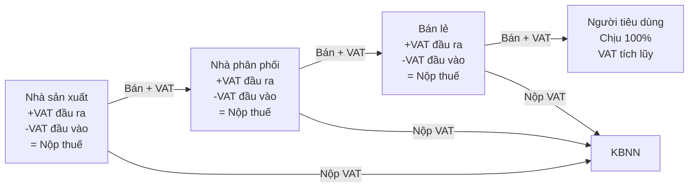

# TX03 — Thuế GTGT (Value Added Tax — VAT)

> **Domain:** Tax
> **Level:** Intermediate
> **Prerequisites:** TX01 (Thuế Căn Bản)
> **Related:** TX02 (CIT), TX04 (PIT), TX05 (International Tax)

---

## 1. Mục Tiêu Học Tập (Learning Objectives)

Sau khi hoàn thành module này, người học có thể:

1. Phân biệt 3 mức thuế suất VAT (0%, 5%, 10%) và áp dụng đúng cho từng loại hàng hóa/dịch vụ
2. Tính VAT đầu ra, VAT đầu vào được khấu trừ và VAT phải nộp
3. Hiểu điều kiện hoàn thuế VAT và quy trình xin hoàn
4. Xử lý đúng VAT trên hàng nhập khẩu và dịch vụ kỹ thuật số xuyên biên giới
5. Lập tờ khai VAT Form 01/GTGT và 02/GTGT đúng quy định
6. Nhận diện các trường hợp không chịu VAT và miễn VAT

---

## 2. Bối Cảnh Kinh Doanh (Business Context)

VAT (Thuế GTGT) là thuế gián thu — DN thu hộ Nhà nước từ người tiêu dùng cuối cùng. Mặc dù không trực tiếp làm giảm lợi nhuận DN (vì thu và trả lại), nhưng VAT ảnh hưởng lớn đến:

- **Dòng tiền:** DN phải ứng trước VAT đầu ra trước khi thu tiền từ khách hàng
- **Giá cả:** Cấu trúc VAT ảnh hưởng đến giá bán và khả năng cạnh tranh
- **Hoàn thuế:** VAT âm (đầu vào > đầu ra) phải chờ hoàn — ảnh hưởng cash flow
- **Tuân thủ:** Vi phạm VAT thường là loại vi phạm phổ biến nhất trong kiểm tra thuế

---

## 3. Định Nghĩa (Definitions)

| Thuật ngữ | Tiếng Anh | Định nghĩa |
|---|---|---|
| VAT đầu ra | Output VAT | VAT thu từ khách hàng khi bán hàng/dịch vụ |
| VAT đầu vào | Input VAT | VAT đã trả khi mua hàng/dịch vụ đầu vào |
| VAT phải nộp | VAT Payable | Output VAT - Input VAT được khấu trừ |
| Khấu trừ VAT | VAT Credit / Input Tax Credit | Trừ VAT đầu vào vào VAT đầu ra |
| Hoàn thuế VAT | VAT Refund | Cơ quan thuế hoàn lại khi input > output |
| Đối tượng không chịu VAT | VAT Exempt Supply | Hàng hóa/DV không thuộc phạm vi đánh VAT |
| Đối tượng chịu VAT 0% | Zero-rated Supply | Chịu VAT nhưng thuế suất 0% (được khấu trừ toàn bộ đầu vào) |
| Reverse Charge | Reverse Charge Mechanism | Người mua tự kê khai VAT thay người bán nước ngoài |
| Cơ sở tính thuế | Tax Base | Giá bán chưa có VAT |
| Hóa đơn GTGT | VAT Invoice | Hóa đơn có ghi rõ VAT riêng biệt |

---

## 4. Khái Niệm Cốt Lõi (Core Concepts)

### 4.1 Cơ chế VAT

VAT là thuế đánh trên giá trị gia tăng tại mỗi khâu của chuỗi cung ứng:

```
Nhà sản xuất → Nhà phân phối → Bán lẻ → Người tiêu dùng
     ↓               ↓              ↓            ↓
  Nộp VAT       Nộp VAT        Nộp VAT    Chịu toàn bộ VAT
  trên GTGT     trên GTGT      trên GTGT
```

Người tiêu dùng cuối cùng chịu toàn bộ VAT. DN chỉ là trung gian thu hộ.

### 4.2 Ba mức thuế suất VAT tại Việt Nam

| Mức | Áp dụng cho |
|---|---|
| **0%** | Hàng XK, dịch vụ cung cấp ra nước ngoài, vận tải quốc tế |
| **5%** | Nước sạch, phân bón, thuốc/thiết bị y tế, giáo dục, sách, nông sản chưa chế biến bán cho DN |
| **10%** | Phần lớn hàng hóa và dịch vụ thông thường |

### 4.3 Hàng hóa/dịch vụ không chịu VAT (miễn VAT)

- Đất đai, quyền sử dụng đất
- Bảo hiểm nhân thọ, phi nhân thọ
- Dịch vụ tài chính, tín dụng, ngoại hối
- Chuyển nhượng vốn, chứng khoán
- Hàng nhập khẩu viện trợ nhân đạo

*Lưu ý: Miễn VAT ≠ 0% VAT. Miễn VAT thì không được khấu trừ đầu vào. 0% thì vẫn được khấu trừ.*

### 4.4 Điều kiện khấu trừ VAT đầu vào

1. Hóa đơn GTGT hợp pháp, hợp lệ
2. Hàng hóa/dịch vụ dùng cho SXKD chịu VAT
3. Thanh toán qua ngân hàng nếu ≥ 20 triệu đồng
4. Kê khai trong kỳ phát sinh (hoặc chậm nhất 6 tháng)

### 4.5 Phương pháp tính VAT

**Phương pháp khấu trừ (phổ biến):**
- Áp dụng cho DN doanh thu ≥ 1 tỷ/năm và được cơ quan thuế chấp thuận
- VAT nộp = Output VAT - Input VAT
- Dùng hóa đơn GTGT

**Phương pháp trực tiếp:**
- Áp dụng cho HKD, DN nhỏ doanh thu < 1 tỷ, DN kinh doanh vàng bạc
- VAT nộp = GTGT × Thuế suất
- Hoặc: VAT nộp = Doanh thu × Tỷ lệ % (theo ngành nghề)

### 4.6 Hoàn thuế VAT

**Các trường hợp được hoàn:**
1. DN xuất khẩu: Input VAT liên quan đến hàng XK trong 3 tháng liên tiếp ≥ 300 triệu
2. DN đầu tư mới: Giai đoạn đầu tư chưa phát sinh output VAT, input VAT ≥ 300 triệu
3. Chuyển đổi sở hữu, giải thể, phá sản
4. Quyết định hành chính: theo quyết định của cơ quan có thẩm quyền

**Thời gian hoàn:**
- Hoàn trước kiểm tra sau (DN ưu tiên, rủi ro thấp): trong 6 ngày làm việc
- Kiểm tra trước hoàn sau: trong 40 ngày

---

## 5. Giá Trị Kinh Doanh (Business Value)

- **Tuân thủ:** Tránh phạt, truy thu VAT đầu vào không được khấu trừ
- **Cash flow:** Quản lý VAT âm, xin hoàn kịp thời giải phóng tiền
- **Pricing strategy:** Hiểu VAT giúp định giá đúng, cạnh tranh
- **Audit readiness:** Hóa đơn VAT hợp lệ là nền tảng của mọi cuộc kiểm tra thuế
- **Cross-border:** Áp dụng đúng VAT 0% cho XK giúp DN XK cạnh tranh giá quốc tế

---

## 6. Vai Trò Trong Doanh Nghiệp (Enterprise Role)

- **Sales/Billing:** Xuất hóa đơn VAT đúng mức thuế suất
- **Procurement:** Kiểm tra hóa đơn VAT đầu vào hợp lệ
- **Kế toán thuế:** Lập tờ khai VAT, quản lý hoàn thuế
- **IT/ERP:** Cấu hình thuế suất đúng trong hệ thống, kết nối hóa đơn điện tử
- **Finance:** Quản lý dòng tiền VAT (chênh lệch thu/nộp theo tháng)

---

## 7. Phòng Ban Liên Quan (Departments Related)

| Phòng ban | Mối liên hệ với VAT |
|---|---|
| Kinh doanh (Sales) | Xuất hóa đơn VAT đúng thuế suất, đúng thông tin |
| Mua hàng (Procurement) | Hóa đơn VAT đầu vào hợp lệ — điều kiện khấu trừ |
| Kho vận (Logistics) | VAT trên vận tải, dịch vụ kho bãi |
| Kế toán (Accounting) | Hạch toán VAT, lập tờ khai |
| IT (Technology) | Phần mềm hóa đơn điện tử, cấu hình tax code ERP |
| Xuất nhập khẩu | VAT hàng nhập khẩu (nộp tại hải quan) |

---

## 8. Đầu Vào (Input)

- Hóa đơn GTGT đầu ra (bán hàng)
- Hóa đơn GTGT đầu vào (mua hàng, dịch vụ)
- Tờ khai hải quan + C/O (hàng nhập khẩu)
- Biên lai nộp thuế VAT nhập khẩu
- Chứng từ thanh toán qua ngân hàng (với HĐ ≥ 20 triệu)
- Hợp đồng xuất khẩu + C/O + tờ khai XK (xin hoàn VAT XK)

---

## 9. Đầu Ra (Output)

- Form 01/GTGT — Tờ khai VAT tháng/quý
- Form 02/GTGT — Tờ khai VAT trực tiếp (phương pháp trực tiếp)
- Hồ sơ đề nghị hoàn thuế VAT
- Báo cáo đối chiếu VAT đầu ra/đầu vào
- Biên lai nộp thuế VAT

---

## 10. Quy Trình Nghiệp Vụ (Business Process)

```
Hàng tháng/quý:
━━━━━━━━━━━━━━━━━━━━━━━━━━━━━━━━━━━━
Thu thập HĐ đầu ra → Tổng hợp Output VAT
Thu thập HĐ đầu vào → Kiểm tra điều kiện khấu trừ
                    → Loại bỏ HĐ không hợp lệ
                    → Tổng hợp Input VAT được khấu trừ
                              ↓
               So sánh Output VAT vs. Input VAT
                              ↓
              ┌───────────────┴───────────────┐
         Output > Input                 Input > Output
              ↓                               ↓
         Nộp VAT chênh lệch           Chuyển kỳ sau hoặc
         (hạn 20 tháng sau)           Xin hoàn (nếu đủ điều kiện)
```

---

## 11. Luồng Dữ Liệu (Data Flow)

```
Phần mềm HĐĐT ──→ Cổng GDT ──→ Xác thực hóa đơn hợp lệ
      ↓                                    ↓
ERP/Kế toán ──→ Tổng hợp VAT ──→ HTKK/eTax
      ↓                                    ↓
Ngân hàng ─────────────────────→ Xác nhận thanh toán ≥20tr
                                           ↓
                               Form 01/GTGT → Nộp GDT
```

---

## 12. Luồng Tiền (Money Flow)

```
Bán hàng 110 triệu (giá chưa VAT 100tr + VAT 10tr)
→ Thu về 110 triệu (bao gồm 10 triệu VAT đầu ra)

Mua nguyên liệu 55 triệu (50tr + 5tr VAT đầu vào)
→ Trả 55 triệu (bao gồm 5 triệu VAT đầu vào)

VAT phải nộp = 10 triệu - 5 triệu = 5 triệu
→ Nộp KBNN: 5 triệu
```

---

## 13. Luồng Chứng Từ (Document Flow)

```
Hợp đồng bán hàng
    ↓
Hóa đơn GTGT điện tử (đầu ra)
    ↓
Biên bản giao hàng / xác nhận dịch vụ
    ↓
Chứng từ thanh toán (UNC ngân hàng)
    ↓
Kê khai vào Form 01/GTGT
    ↓
Nộp eTax → GDT → Biên lai nộp thuế
```

---

## 14. Vai Trò (Roles)

| Vai trò | Trách nhiệm VAT |
|---|---|
| Kế toán thuế | Lập, kiểm tra tờ khai VAT; quản lý hoàn thuế |
| Kế toán bán hàng (AR) | Đảm bảo HĐ GTGT đầu ra đúng, đủ |
| Kế toán mua hàng (AP) | Kiểm tra HĐ GTGT đầu vào, điều kiện khấu trừ |
| Kế toán trưởng | Soát xét, phê duyệt tờ khai |
| CFO | Phê duyệt hồ sơ hoàn thuế lớn |
| IT/ERP | Cấu hình tax code, kết nối hóa đơn điện tử |

---

## 15. Trách Nhiệm (Responsibilities)

- **Kế toán AR:** Xuất hóa đơn đúng mức VAT, đúng thông tin người mua
- **Kế toán AP:** Từ chối hóa đơn đầu vào không hợp lệ ngay từ đầu
- **Kế toán thuế:** Reconcile VAT hàng tháng, lập tờ khai đúng hạn
- **Kế toán trưởng:** Soát xét độc lập, ký duyệt
- **Giám đốc:** Ký tờ khai VAT (nếu tự kê khai) hoặc ủy quyền

---

## 16. Ma Trận RACI

| Hoạt động | CFO | Kế toán trưởng | Kế toán thuế | Kế toán AR | Kế toán AP |
|---|---|---|---|---|---|
| Xuất HĐ GTGT đầu ra | I | I | C | R | - |
| Kiểm tra HĐ đầu vào | - | A | C | - | R |
| Lập Form 01/GTGT | I | A | R | C | C |
| Nộp tờ khai + tiền | I | A | R | - | - |
| Nộp hồ sơ hoàn VAT | A | R | R | C | C |

---

## 17. Frameworks

- **EU VAT Directive:** Chuẩn mực VAT quốc tế, VN tham chiếu nhiều quy định
- **OECD International VAT/GST Guidelines:** Nguyên tắc đánh VAT xuyên biên giới
- **VCCI tax compliance framework:** Khung tuân thủ thuế cho DN VN

---

## 18. Chuẩn Quốc Tế (International Standards)

- **OECD VAT/GST Guidelines (2017):** Hướng dẫn xử lý VAT với dịch vụ kỹ thuật số
- **EU VAT Gap Report:** Benchmark về tỷ lệ thất thu VAT
- **IMF Revenue Administration Gap Analysis:** Đánh giá hiệu quả thu VAT
- **WTO Customs Valuation Agreement:** Cơ sở tính VAT hàng nhập khẩu

---

## 19. Bối Cảnh Việt Nam (Vietnam Context)

### Văn bản pháp luật chủ yếu

- Luật thuế GTGT 13/2008/QH12 (sửa đổi 2013, 2016)
- Nghị định 209/2013/NĐ-CP, sửa đổi bởi NĐ 12/2015, NĐ 100/2016
- Thông tư 219/2013/TT-BTC (hướng dẫn chính)
- Thông tư 26/2015/TT-BTC, TT 173/2016/TT-BTC
- Thông tư 40/2021/TT-BTC: VAT trên e-commerce, kinh doanh trên nền tảng số

### Tờ khai VAT VN

| Form | Áp dụng | Hạn |
|---|---|---|
| **01/GTGT** | Phương pháp khấu trừ — tháng | Ngày 20 tháng sau |
| **01/GTGT** | Phương pháp khấu trừ — quý | Ngày 30 tháng đầu quý sau |
| **02/GTGT** | Phương pháp trực tiếp trên doanh thu | Ngày 20/30 kỳ sau |
| **03/GTGT** | Phương pháp trực tiếp trên GTGT (vàng) | Ngày 20/30 kỳ sau |
| **04/GTGT** | Hồ sơ hoàn thuế | Bất kỳ lúc nào đủ điều kiện |
| **05/GTGT** | Khai bổ sung tờ khai VAT | Trước khi bị kiểm tra |

### VAT trên dịch vụ kỹ thuật số (Thông tư 40/2021)

Từ 01/08/2021:
- Facebook, Google, Netflix, Shopee, Grab phải đăng ký nộp thuế tại VN
- Cá nhân kinh doanh trên sàn TMĐT: sàn khấu trừ và nộp thuế thay
- DN mua dịch vụ nước ngoài không đăng ký tại VN: phải tự kê khai VAT (reverse charge)

### Giảm VAT 2% (chính sách tạm thời 2022-2024)

Nhà nước tạm giảm VAT từ 10% xuống 8% cho nhiều nhóm hàng hóa, dịch vụ (trừ nhóm không được giảm như viễn thông, tài chính, BĐS, kim loại...) theo các Nghị định 15/2022, 44/2023, 94/2023.

---

## 20. Khía Cạnh Pháp Lý (Legal Considerations)

**Rủi ro VAT phổ biến:**
1. **Hóa đơn bất hợp pháp:** Dùng hóa đơn giả, hóa đơn của DN bỏ địa chỉ → bị truy thu + phạt 3 lần
2. **Khấu trừ VAT đầu vào tiền mặt ≥20 triệu:** Bị loại toàn bộ
3. **Xuất hóa đơn sai mức VAT:** Phạt 2-20 triệu tùy mức vi phạm
4. **Hoàn thuế gian lận:** Truy tố hình sự nếu số tiền lớn

**Kiểm tra trước hoàn sau:**
- Rủi ro cao, hoàn lần đầu, có dấu hiệu vi phạm → CQT kiểm tra trước khi hoàn

---

## 21. Lỗi Phổ Biến (Common Mistakes)

1. **Nhầm hàng miễn VAT với hàng 0% VAT** — cách xử lý hoàn toàn khác nhau
2. **Khấu trừ VAT đầu vào không đúng kỳ** — quá 6 tháng là không được khấu trừ
3. **Thanh toán tiền mặt** cho hóa đơn ≥20 triệu → mất quyền khấu trừ
4. **Không kê khai dịch vụ mua từ nước ngoài** → phải tự tính VAT reverse charge
5. **Hóa đơn xuất không đúng tên, MST người mua** → khách hàng không khấu trừ được
6. **VAT hàng nhập khẩu không có tờ khai hải quan** đính kèm → không được khấu trừ
7. **Kê khai nhầm thuế suất** cho hàng có VAT 5% thành 10%
8. **Hóa đơn điều chỉnh/hủy không đúng quy trình** NĐ 123/2020

---

## 22. Thực Hành Tốt Nhất (Best Practices)

1. **3-way match:** Đối chiếu HĐ mua — Phiếu nhận hàng — Thanh toán trước khi kê khai VAT
2. **Vendor VAT validation:** Kiểm tra MST nhà cung cấp còn hoạt động trên eTax
3. **Monthly reconciliation:** Đối chiếu VAT đầu ra sổ kế toán vs. doanh thu tháng
4. **VAT calendar:** Nhắc nhở hạn nộp tự động, không để chậm
5. **Export documentation:** Chuẩn bị đầy đủ chứng từ XK ngay từ khi giao hàng
6. **Digital services tracking:** Theo dõi các hóa đơn dịch vụ nước ngoài cần reverse charge
7. **Refund monitoring:** Theo dõi tình trạng hồ sơ hoàn thuế VAT, đốc thúc nếu quá hạn

---

## 23. KPIs

| KPI | Mục tiêu |
|---|---|
| Tỷ lệ nộp tờ khai đúng hạn | 100% |
| Tỷ lệ HĐ đầu vào đủ điều kiện khấu trừ | ≥ 98% |
| Thời gian nhận hoàn thuế VAT | ≤ 40 ngày |
| Số HĐ bị loại do thanh toán tiền mặt | 0 |
| Sai lệch VAT khai báo vs. sổ sách | 0% |
| VAT reverse charge đã kê khai đầy đủ | 100% |

---

## 24. Số Liệu Đo Lường (Metrics)

- **VAT effective rate:** VAT nộp / Doanh thu thuần × 100%
- **Input VAT recovery rate:** Input VAT khấu trừ / Tổng input VAT phát sinh
- **VAT refund pending:** Số tiền VAT đang chờ hoàn
- **% hóa đơn điện tử hợp lệ:** Trong tổng hóa đơn phát sinh
- **VAT cash flow impact:** Chênh lệch ngày thu VAT vs. ngày nộp VAT

---

## 25. Báo Cáo (Reports)

- **VAT Reconciliation Report:** Đối chiếu output/input VAT sổ sách vs. tờ khai
- **VAT Cash Flow Forecast:** Dự báo VAT phải nộp 3 tháng tới
- **Hoàn thuế VAT Status Report:** Tình trạng các hồ sơ hoàn đang pending
- **Invalid Invoice Report:** Danh sách HĐ không đủ điều kiện khấu trừ
- **Export VAT Report:** VAT 0% từ xuất khẩu — theo dõi để xin hoàn

---

## 26. Mẫu Biểu (Templates)

**Bảng tổng hợp VAT tháng:**
```
Chỉ tiêu                          Số lượng HĐ    Doanh thu    VAT
═══════════════════════════════════════════════════════════════════
I. VAT ĐẦU RA (Output VAT)
 1. Hàng HH/DV chịu VAT 10%            xxx      xxx,xxx    xx,xxx
 2. Hàng HH/DV chịu VAT 5%              xx       xx,xxx     x,xxx
 3. Hàng XK VAT 0%                       xx       xx,xxx         -
 4. Hàng không chịu VAT                  xx       xx,xxx         -
─────────────────────────────────────────────────────────────────
   TỔNG OUTPUT VAT                                          xx,xxx

II. VAT ĐẦU VÀO (Input VAT)
 1. Mua hàng HH/DV trong nước           xxx       xx,xxx    xx,xxx
 2. VAT hàng nhập khẩu                   xx       xx,xxx     x,xxx
 3. Loại trừ: không đủ điều kiện          -x           -     -x,xxx
─────────────────────────────────────────────────────────────────
   TỔNG INPUT VAT ĐƯỢC KHẤU TRỪ                            xx,xxx

III. VAT PHẢI NỘP = (I) - (II)                              x,xxx
```

---

## 27. Checklists

**Checklist tháng — VAT Close:**
- [ ] Thu thập toàn bộ HĐ đầu ra đã phát hành trong tháng
- [ ] Đối chiếu HĐ đầu ra với sổ doanh thu
- [ ] Thu thập HĐ đầu vào, kiểm tra từng hóa đơn:
  - [ ] MST nhà cung cấp còn hoạt động?
  - [ ] HĐ có chữ ký số của người bán?
  - [ ] Thanh toán qua ngân hàng (nếu ≥20 triệu)?
- [ ] Kiểm tra HĐ dịch vụ nước ngoài — có cần reverse charge?
- [ ] Tổng hợp VAT hàng nhập khẩu (nếu có)
- [ ] Lập bảng tổng hợp VAT
- [ ] Lập Form 01/GTGT trên HTKK
- [ ] Soát xét nội bộ
- [ ] Nộp tờ khai + tiền trước ngày 20 (hoặc 30 nếu khai quý)

---

## 28. Quy Trình Chuẩn (SOP)

**SOP-VAT-01: Quy trình kê khai VAT tháng**

| Bước | Người thực hiện | Mô tả | Deadline |
|---|---|---|---|
| 1 | Kế toán AR | Chốt danh sách HĐ đầu ra đã phát hành T-1 | Ngày 3 tháng T |
| 2 | Kế toán AP | Chốt danh sách HĐ đầu vào đủ điều kiện T-1 | Ngày 5 tháng T |
| 3 | Kế toán thuế | Kiểm tra điều kiện khấu trừ từng HĐ đầu vào | Ngày 8 tháng T |
| 4 | Kế toán thuế | Tổng hợp, lập bảng VAT summary | Ngày 10 tháng T |
| 5 | Kế toán thuế | Lập Form 01/GTGT trên HTKK | Ngày 12 tháng T |
| 6 | Kế toán trưởng | Soát xét, phê duyệt | Ngày 15 tháng T |
| 7 | Kế toán thuế | Nộp tờ khai qua eTax | Ngày 18 tháng T |
| 8 | Kế toán thuế | Nộp tiền VAT qua iBanking | Ngày 19 tháng T |
| 9 | Kế toán thuế | Lưu hồ sơ, biên lai | Ngày 20 tháng T |

---

## 29. Tình Huống Thực Tế (Case Study)

**Tình huống: DN bị truy thu VAT do dùng hóa đơn của DN bỏ địa chỉ**

Công ty ABC trong năm 2021 có 50 hóa đơn đầu vào từ nhà cung cấp XYZ — tổng VAT khấu trừ 500 triệu. Năm 2023, CQT kiểm tra phát hiện XYZ đã bỏ địa chỉ từ năm 2020, các hóa đơn trên được xác định là bất hợp pháp.

Hậu quả với ABC:
- Bị loại 500 triệu VAT đầu vào → truy thu + phạt 20% + lãi 0.03%/ngày
- Đồng thời loại chi phí CIT tương ứng → CIT bị truy thu thêm
- Tổng thiệt hại ước tính 800 triệu - 1 tỷ đồng

**Bài học:**
- Kiểm tra MST nhà cung cấp trên eTax trước khi thanh toán
- Không chấp nhận hóa đơn từ nhà cung cấp không rõ ràng

---

## 30. Ví Dụ Doanh Nghiệp Nhỏ (Small Business Example)

**Nhà hàng (doanh thu 5 tỷ/năm, kê khai VAT quý):**
- Tháng 10: VAT đầu ra 50 triệu; VAT đầu vào 30 triệu
- VAT phải nộp Q3: 20 triệu/tháng × 3 = 60 triệu (ước tính quý)
- Nộp tờ khai 01/GTGT trước 30/10
- Lưu ý: Thực phẩm tươi sống 5% VAT, đồ uống 10% VAT

---

## 31. Ví Dụ Doanh Nghiệp Lớn (Enterprise Example)

**Công ty điện tử xuất khẩu (doanh thu 10,000 tỷ, 90% XK):**
- Output VAT: 0% trên 9,000 tỷ hàng XK; 10% trên 1,000 tỷ nội địa
- Input VAT: ~800 tỷ/năm từ NVL, máy móc
- VAT hoàn: ~700 tỷ/năm (vì input >> output nội địa)
- Quy trình hoàn: Nộp hồ sơ hàng quý → theo dõi sát → mục tiêu hoàn trong 40 ngày
- Tác động cash flow nếu chậm hoàn 1 tháng: ~60 tỷ bị giữ lại

---

## 32. Ánh Xạ ERP (ERP Mapping)

| Module ERP | Tax Code | Ghi chú |
|---|---|---|
| AR — Bán hàng | V10 (10%), V5 (5%), VE (exempt), V0 (0% XK) | Tự động xuất HĐ với đúng VAT |
| AP — Mua hàng | I10, I5, IE | Kiểm tra điều kiện khấu trừ |
| Fixed Assets | I10 (mua TSCĐ) | VAT đầu vào mua TSCĐ |
| Import | Customs VAT | Nhập thẳng từ tờ khai hải quan |
| Tax Reporting | | Tổng hợp từ AR + AP → Form 01/GTGT |

---

## 33. Tự Động Hóa (Automation)

- **Auto VAT reconciliation:** Tự động đối chiếu HĐ điện tử với sổ sách và tờ khai
- **Vendor MST validator:** Tự động kiểm tra MST nhà cung cấp có còn hoạt động
- **E-invoice data sync:** Hóa đơn điện tử tự động ghi nhận vào ERP
- **VAT return auto-fill:** Từ ERP → HTKK tự động điền số liệu Form 01/GTGT
- **Refund status tracker:** Theo dõi tự động tình trạng hồ sơ hoàn thuế

---

## 34. Cơ Hội AI (AI Opportunities)

- **Invoice validation AI:** Phát hiện hóa đơn bất thường, rủi ro cao trước khi khấu trừ
- **VAT rate classifier:** AI phân loại thuế suất VAT đúng cho từng loại hàng hóa
- **Refund prediction:** Dự báo thời gian hoàn thuế dựa trên lịch sử hồ sơ
- **Anomaly detection:** Phát hiện giao dịch bất thường trong VAT report
- **Cross-border VAT advisor:** AI tư vấn VAT cho các giao dịch xuyên biên giới

---

## 35. Hướng Dẫn Triển Khai (Implementation Guide)

**Bước 1:** Kiểm tra toàn bộ danh mục hàng hóa/dịch vụ — phân loại VAT đúng (0%/5%/10%/miễn)
**Bước 2:** Cấu hình tax code trong ERP theo đúng phân loại
**Bước 3:** Kết nối phần mềm hóa đơn điện tử với ERP
**Bước 4:** Đào tạo team AP kiểm tra điều kiện khấu trừ VAT đầu vào
**Bước 5:** Thiết lập quy trình monthly VAT close với checklist
**Bước 6:** Thiết lập quy trình xin hoàn VAT (nếu DN XK)

---

## 36. Hướng Dẫn Tư Vấn (Consulting Guide)

**Red flags VAT cần điều tra:**
- VAT đầu ra thấp hơn nhiều so với doanh thu ngành
- Tỷ lệ hoàn thuế VAT bất thường cao
- Nhiều giao dịch mua từ nhà cung cấp mới thành lập
- Hóa đơn giá trị cao không khớp với quy mô kinh doanh thực tế

**Câu hỏi audit VAT:**
1. Tỷ lệ VAT đầu vào được khấu trừ / Tổng VAT đầu vào phát sinh là bao nhiêu?
2. Có hóa đơn đầu vào nào thanh toán tiền mặt ≥20 triệu không?
3. Có giao dịch mua dịch vụ nước ngoài — đã kê khai reverse charge chưa?
4. Quy trình kiểm tra MST nhà cung cấp hiện tại là gì?

---

## 37. Câu Hỏi Chẩn Đoán (Diagnostic Questions)

1. DN có quy trình kiểm tra MST nhà cung cấp trước khi nhận HĐ không?
2. Hóa đơn điện tử đầu vào có được tự động đồng bộ vào ERP không?
3. Có trường hợp nào mua dịch vụ nước ngoài chưa kê khai reverse charge VAT?
4. Tỷ lệ HĐ bị loại khỏi khấu trừ hàng tháng là bao nhiêu? Nguyên nhân?
5. DN có XK không? Quy trình chuẩn bị hồ sơ hoàn VAT XK là gì?

---

## 38. Câu Hỏi Phỏng Vấn (Interview Questions)

**Kế toán thuế (Junior):**
1. Sự khác biệt giữa hàng hóa miễn VAT và hàng hóa VAT 0%?
2. Khi nào hóa đơn đầu vào không được khấu trừ VAT dù hợp lệ?
3. DN xuất khẩu được hoàn VAT trong trường hợp nào?

**Tax Manager (Senior):**
1. Giải thích cơ chế reverse charge VAT — áp dụng ở VN khi nào?
2. DN mua phần mềm từ Microsoft Ireland — xử lý VAT như thế nào?
3. Làm sao tối ưu dòng tiền VAT cho DN có VAT đầu vào lớn?

---

## 39. Bài Tập (Exercises)

**Bài tập 1:** Cho danh sách 10 hóa đơn đầu vào tháng 3, xác định hóa đơn nào được khấu trừ VAT và hóa đơn nào không (với các thông tin: số tiền, phương thức thanh toán, loại HĐ).

**Bài tập 2:** Tính VAT phải nộp tháng 3 cho DN:
- Doanh thu bán hàng 10%: 500 triệu
- Doanh thu XK 0%: 300 triệu
- Chi phí mua hàng (được khấu trừ): 200 triệu (thuế suất 10%)
- Chi phí thuê văn phòng (tiền mặt 25 triệu): 25 triệu

**Bài tập 3:** Công ty mua phần mềm từ Adobe (Mỹ), giá 50 triệu/năm. Hỏi: cần xử lý VAT như thế nào? Lập bút toán hạch toán VAT reverse charge.

---

## 40. Tài Liệu Tham Khảo (References)

- Luật thuế GTGT 13/2008/QH12 và các sửa đổi
- Thông tư 219/2013/TT-BTC
- Thông tư 26/2015/TT-BTC
- Thông tư 40/2021/TT-BTC (thuế TMĐT, kinh doanh số)
- Nghị định 123/2020/NĐ-CP (hóa đơn điện tử)
- OECD International VAT/GST Guidelines

---

## Output Formats

### A. Mermaid Diagram — Cơ chế VAT



### B. ASCII Diagram — Phân loại VAT tại VN

```
HÀNG HÓA / DỊCH VỤ
        |
        +─── KHÔNG CHỊU VAT (Điều 5 Luật GTGT)
        |    • Đất đai, BH, tín dụng, chứng khoán
        |    → Không thu, không khấu trừ đầu vào
        |
        +─── VAT 0%
        |    • Hàng xuất khẩu
        |    • DV cung cấp ra nước ngoài
        |    → Thu 0%, ĐƯỢC khấu trừ/hoàn đầu vào
        |
        +─── VAT 5%
        |    • Nước sạch, phân bón, sách, y tế...
        |    → Thu 5% từ người mua
        |
        +─── VAT 10%
             • Phần lớn còn lại
             → Thu 10% từ người mua
```

### C. Flashcards

**Q1:** Sự khác biệt giữa hàng hóa "không chịu VAT" và "VAT 0%"?
**A1:** Hàng không chịu VAT: không thu VAT đầu ra và không được khấu trừ VAT đầu vào liên quan. Hàng VAT 0%: không thu VAT đầu ra nhưng vẫn được khấu trừ toàn bộ VAT đầu vào — áp dụng chủ yếu cho hàng xuất khẩu.

**Q2:** Điều kiện để được khấu trừ VAT đầu vào là gì?
**A2:** (1) Hóa đơn GTGT hợp pháp, hợp lệ; (2) Hàng/dịch vụ dùng cho SXKD chịu VAT; (3) Thanh toán qua ngân hàng nếu ≥20 triệu đồng; (4) Kê khai trong kỳ phát sinh (tối đa 6 tháng).

**Q3:** DN xuất khẩu được hoàn VAT khi nào?
**A3:** Khi VAT đầu vào liên quan đến hàng XK lũy kế trong 3 tháng liên tiếp đạt ≥300 triệu đồng. Nộp Form 04/GTGT cùng bộ hồ sơ chứng từ xuất khẩu.

### D. Cheat Sheet — VAT Việt Nam

```
=== CHEAT SHEET: THUẾ GTGT (VAT) VIỆT NAM ===

THUẾ SUẤT:
• 0%  → Hàng XK, DV cung cấp ra nước ngoài
• 5%  → Nước sạch, phân bón, y tế, giáo dục, sách
• 10% → Phần lớn hàng hóa, dịch vụ còn lại
• Miễn→ Đất, BH, tín dụng, chứng khoán...

CÔNG THỨC:
Output VAT - Input VAT (đủ điều kiện) = VAT phải nộp

ĐIỀU KIỆN KHẤU TRỪ ĐẦU VÀO:
✓ HĐ điện tử hợp lệ, chữ ký số
✓ Hàng/DV dùng cho SXKD chịu VAT
✓ Thanh toán ngân hàng nếu ≥ 20 triệu
✓ Kê khai đúng kỳ (max 6 tháng)

DEADLINES:
• Khai tháng → ngày 20 tháng sau
• Khai quý  → ngày 30 tháng đầu quý sau

HOÀN THUẾ VAT:
• XK: 3 tháng liên tiếp input ≥ 300tr
• Đầu tư mới: input ≥ 300tr chưa có output
• Thời gian hoàn: 6-40 ngày
```

### E. JSON Metadata

```json
{
  "module": {
    "code": "TX03",
    "name": "Thuế GTGT",
    "name_en": "Value Added Tax (VAT)",
    "domain": "Tax",
    "level": "Intermediate",
    "status": "complete",
    "version": "1.0"
  },
  "vietnam_context": {
    "vat_rates": {
      "zero": "0% — hàng xuất khẩu",
      "reduced": "5% — hàng thiết yếu",
      "standard": "10% — phổ thông",
      "exempt": "Miễn — đất, BH, tín dụng"
    },
    "key_thresholds": {
      "cash_payment_limit": "20 triệu VND",
      "monthly_filing_revenue": "> 50 tỷ/năm",
      "refund_threshold": "300 triệu VND"
    },
    "key_forms": ["01/GTGT", "02/GTGT", "04/GTGT"],
    "key_laws": [
      "Luật GTGT 13/2008/QH12",
      "TT 219/2013/TT-BTC",
      "TT 40/2021/TT-BTC",
      "NĐ 123/2020/NĐ-CP"
    ]
  },
  "related_modules": ["TX01", "TX02", "TX04", "TX05"],
  "tags": ["VAT", "GTGT", "e-invoice", "input-tax", "output-tax", "refund", "Vietnam"]
}
```
