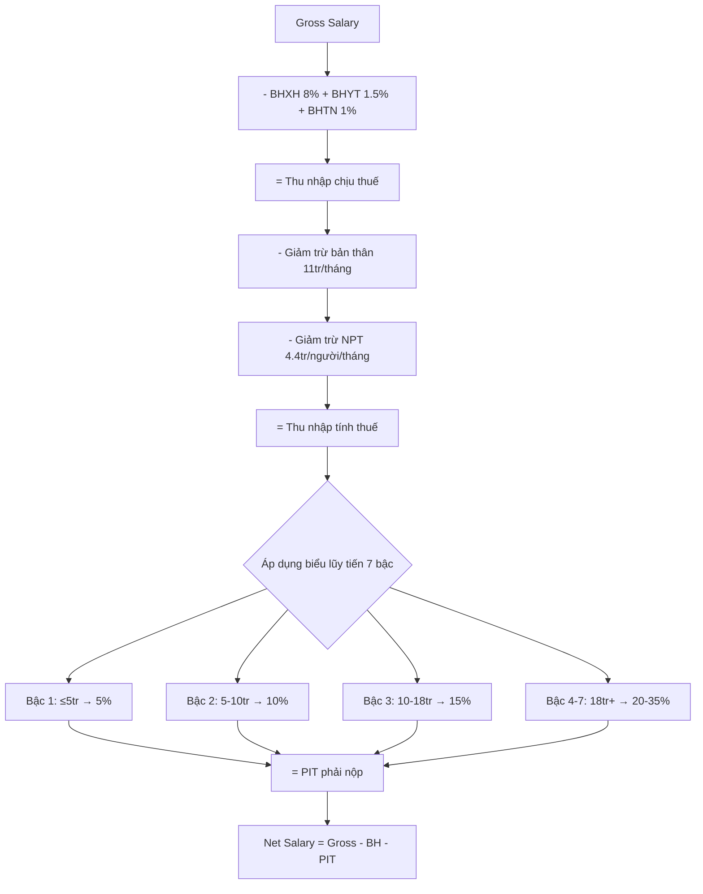

# TX04 — Thuế TNCN (Personal Income Tax — PIT)

> **Domain:** Tax
> **Level:** Intermediate
> **Prerequisites:** TX01 (Thuế Căn Bản)
> **Related:** TX02 (CIT), TX03 (VAT), HR02 (Payroll & Compensation)

---

## 1. Mục Tiêu Học Tập (Learning Objectives)

Sau khi hoàn thành module này, người học có thể:

1. Xác định đúng các loại thu nhập chịu PIT và thu nhập miễn PIT
2. Tính PIT đối với thu nhập từ tiền lương/tiền công theo biểu thuế lũy tiến 7 bậc
3. Áp dụng đúng giảm trừ gia cảnh (11 triệu/tháng bản thân + 4.4 triệu/người phụ thuộc)
4. Thực hiện khấu trừ PIT tại nguồn cho nhân viên theo đúng quy định
5. Lập tờ khai PIT quyết toán Form 05/KK-TNCN và quyết toán thay nhân viên
6. Hiểu PIT đối với các loại thu nhập khác: cổ tức, chuyển nhượng vốn/BĐS, trúng thưởng

---

## 2. Bối Cảnh Kinh Doanh (Business Context)

PIT (Thuế TNCN) là nghĩa vụ của cá nhân, nhưng doanh nghiệp đóng vai trò là **người nộp thuế thay** (withholding agent) — khấu trừ PIT từ lương nhân viên và nộp vào ngân sách. Đây là trách nhiệm pháp lý của DN, nếu làm sai sẽ ảnh hưởng trực tiếp đến tuân thủ thuế.

Ngoài ra, PIT ảnh hưởng đến:
- **Chiến lược compensation:** Cơ cấu lương gross/net, phúc lợi không chịu PIT
- **Tuyển dụng:** Thu nhập net sau thuế là điều nhân viên quan tâm
- **Cổ đông:** PIT trên cổ tức (5%) khi chia lợi nhuận
- **M&A:** PIT trên chuyển nhượng vốn (20% lợi nhuận hoặc 0.1% doanh thu)

---

## 3. Định Nghĩa (Definitions)

| Thuật ngữ | Tiếng Anh | Định nghĩa |
|---|---|---|
| Cư trú thuế | Tax Resident | Cá nhân ở VN ≥183 ngày/năm hoặc có nơi ở thường xuyên |
| Không cư trú | Non-resident | Cá nhân ở VN < 183 ngày/năm |
| Giảm trừ gia cảnh | Personal Allowance | Khoản giảm trừ trước khi tính PIT (11tr bản thân + 4.4tr/NPT) |
| Người phụ thuộc | Dependent | Con, cha mẹ, vợ/chồng... được giảm trừ nếu đủ điều kiện |
| Khấu trừ tại nguồn | Withholding at Source | DN trừ PIT từ thu nhập trả cho cá nhân và nộp thay |
| Quyết toán PIT | PIT Finalization | Tổng hợp PIT cả năm, hoàn hoặc nộp thêm nếu sai lệch |
| PIT trên lương | Employment Income PIT | PIT theo biểu lũy tiến 7 bậc |
| PIT cổ tức | Dividend PIT | 5% trên cổ tức nhận được |
| PIT chuyển nhượng vốn | Capital Gains PIT | 20% lợi nhuận hoặc 0.1% doanh thu |
| Ủy quyền quyết toán | Tax Filing Authorization | Nhân viên ủy quyền cho DN quyết toán PIT thay |

---

## 4. Khái Niệm Cốt Lõi (Core Concepts)

### 4.1 Đối tượng chịu PIT

**Cư trú thuế (Tax Resident):**
- Thu nhập từ VN và nước ngoài đều chịu PIT tại VN
- Biểu thuế lũy tiến (progressive) cho tiền lương

**Không cư trú (Non-resident):**
- Chỉ chịu PIT trên thu nhập phát sinh tại VN
- Thuế suất cố định 20% trên tổng thu nhập lương (không giảm trừ)

### 4.2 Các loại thu nhập chịu PIT

| Loại thu nhập | Thuế suất | Ghi chú |
|---|---|---|
| Tiền lương, tiền công (cư trú) | Biểu 7 bậc (5%-35%) | Sau giảm trừ gia cảnh |
| Tiền lương (không cư trú) | 20% | Trên tổng thu nhập |
| Cổ tức, lợi tức | 5% | Trên số nhận được |
| Chuyển nhượng vốn | 20% lợi nhuận hoặc 0.1% doanh thu | Tùy phương pháp |
| Chuyển nhượng BĐS | 2% giá bán | Nộp ngay khi sang tên |
| Trúng thưởng (>10 triệu) | 10% | Trên phần vượt 10 triệu |
| Thu nhập từ bản quyền, nhượng quyền | 5% | Trên phần vượt 10 triệu |
| Thu nhập kinh doanh | 0.5-5% | Theo ngành nghề |

### 4.3 Biểu thuế lũy tiến 7 bậc (Thu nhập từ lương — Cư trú)

| Bậc | Thu nhập tính thuế/tháng | Thuế suất |
|---|---|---|
| 1 | Đến 5 triệu | 5% |
| 2 | Trên 5 triệu đến 10 triệu | 10% |
| 3 | Trên 10 triệu đến 18 triệu | 15% |
| 4 | Trên 18 triệu đến 32 triệu | 20% |
| 5 | Trên 32 triệu đến 52 triệu | 25% |
| 6 | Trên 52 triệu đến 80 triệu | 30% |
| 7 | Trên 80 triệu | 35% |

**Công thức rút gọn tính PIT:**
```
Thu nhập tính thuế = Thu nhập chịu thuế - Giảm trừ gia cảnh - BHXH/BHYT/BHTN

Ví dụ (gross 30 triệu, 1 người phụ thuộc):
Thu nhập chịu thuế = 30,000,000 - BHXH 8% (2,400,000) = 27,600,000
Giảm trừ bản thân = 11,000,000
Giảm trừ NPT (1 người) = 4,400,000
Thu nhập tính thuế = 27,600,000 - 11,000,000 - 4,400,000 = 12,200,000

PIT = 5tr×5% + 5tr×10% + 2.2tr×15% = 250,000 + 500,000 + 330,000 = 1,080,000/tháng
```

### 4.4 Giảm trừ gia cảnh

**Mức hiện hành (áp dụng từ 01/07/2020):**
- Bản thân người nộp thuế: **11,000,000 đồng/tháng** (132 triệu/năm)
- Mỗi người phụ thuộc: **4,400,000 đồng/tháng** (52.8 triệu/năm)

**Điều kiện đăng ký người phụ thuộc:**
- Con dưới 18 tuổi hoặc con học đại học dưới 25 tuổi thu nhập dưới 1 triệu/tháng
- Vợ/chồng không có thu nhập hoặc thu nhập dưới 1 triệu/tháng
- Cha mẹ, ông bà... không có thu nhập hoặc dưới 1 triệu/tháng và không có khả năng lao động

**Quy trình đăng ký:** Nộp Form 20-ĐK-TCT cho cơ quan thuế, cung cấp giấy tờ chứng minh.

### 4.5 Thu nhập miễn PIT phổ biến

- Tiền lương làm thêm giờ, làm đêm **phần trả cao hơn ban ngày** (theo Bộ Luật Lao động)
- Thu nhập từ lãi tiền gửi ngân hàng
- Bảo hiểm nhân thọ nhận được
- Học bổng
- Trợ cấp thôi việc theo quy định pháp luật
- Thu nhập từ chuyển đổi đất nông nghiệp (một lần)
- Tặng quà, thừa kế trong gia đình trực hệ

---

## 5. Giá Trị Kinh Doanh (Business Value)

- **Compliance:** Tránh phạt do khấu trừ PIT sai, nộp chậm
- **Employee relations:** Giải thích rõ PIT giúp nhân viên hiểu thu nhập net thực nhận
- **Compensation design:** Cơ cấu phúc lợi miễn/giảm PIT giảm chi phí thuế cho cả DN và nhân viên
- **Cash flow:** Kế hoạch PIT khấu trừ tháng để không bị phạt lãi cuối năm
- **Equity:** PIT trên cổ tức ảnh hưởng quyết định chia lợi nhuận của HĐQT

---

## 6. Vai Trò Trong Doanh Nghiệp (Enterprise Role)

- **HR/Payroll:** Tính PIT khấu trừ hàng tháng, đăng ký NPT cho nhân viên
- **Kế toán thuế:** Lập tờ khai PIT tháng/quý và quyết toán năm
- **Finance:** Quản lý dòng tiền nộp PIT, lập kế hoạch thuế cổ đông
- **Legal/M&A:** Tư vấn PIT trên chuyển nhượng vốn, BĐS

---

## 7. Phòng Ban Liên Quan (Departments Related)

| Phòng ban | Mối liên hệ với PIT |
|---|---|
| Nhân sự (HR) | Quản lý NPT nhân viên, thông tin lương gross/net |
| Payroll | Tính và khấu trừ PIT hàng tháng |
| Kế toán thuế | Lập tờ khai PIT, quyết toán |
| Tài chính (Finance) | PIT trên cổ tức, chuyển nhượng vốn |
| Pháp chế (Legal) | PIT liên quan đến giao dịch M&A, chuyển nhượng BĐS |
| Ban điều hành | Cơ cấu thu nhập BGĐ, cổ đông để tối ưu PIT |

---

## 8. Đầu Vào (Input)

- Bảng lương gross tháng
- Hợp đồng lao động (xác định loại thu nhập)
- Đăng ký NPT của nhân viên (Form 20-ĐK-TCT)
- Chứng từ thu nhập khác (cổ tức, chuyển nhượng vốn, trúng thưởng)
- Biên lai nộp BHXH/BHYT/BHTN (để tính giảm trừ)
- Hợp đồng lao động chuyên gia nước ngoài

---

## 9. Đầu Ra (Output)

- Bảng lương net (sau khấu trừ PIT và BHXH)
- Form 05/KK-TNCN — Tờ khai PIT khấu trừ tháng/quý
- Form 05/QTT-TNCN — Quyết toán PIT năm (cho cá nhân và tổng hợp)
- Chứng từ khấu trừ PIT cấp cho nhân viên
- Biên lai nộp PIT
- Danh sách cá nhân ủy quyền quyết toán PIT

---

## 10. Quy Trình Nghiệp Vụ (Business Process)

```
Hàng tháng:
Tính lương gross → Khấu trừ BHXH (8%) + BHYT (1.5%) + BHTN (1%)
               → Tính thu nhập chịu thuế
               → Trừ giảm trừ gia cảnh (11tr + NPT × 4.4tr)
               → Tính PIT theo biểu lũy tiến
               → Xuất lương net
               → Nộp PIT lên KBNN (hạn 20 tháng sau)
               → Lập tờ khai 05/KK-TNCN

Cuối năm:
Thu thập thông tin PIT cả năm từ tất cả nguồn thu nhập
    ↓
Lập quyết toán PIT năm (Form 05/QTT-TNCN)
    ↓
Nhân viên ủy quyền → DN quyết toán thay
Nhân viên có nhiều nguồn → tự quyết toán
    ↓
Nộp trước 31/03 năm sau
    ↓
Hoàn PIT thừa cho nhân viên (nếu có)
```

---

## 11. Luồng Dữ Liệu (Data Flow)

```
HRM System ──→ Payroll Engine ──→ PIT Calculation
                                         ↓
BHXH System ─────────────────→ Bảng khấu trừ tháng
                                         ↓
NPT Registration ────────────→ Form 05/KK-TNCN
                                         ↓
                               eTax → GDT → Biên lai
```

---

## 12. Luồng Tiền (Money Flow)

```
Gross Salary: 30,000,000
- BHXH nhân viên (8%):    2,400,000
- BHYT nhân viên (1.5%):    450,000
- BHTN nhân viên (1%):      300,000
- PIT khấu trừ:           1,080,000
──────────────────────────────────
= Net Salary:            25,770,000  → Chuyển khoản cho nhân viên

Ngân sách nhà nước nhận:
+ BHXH: 3,150,000 (21% employer + 8% employee)
+ PIT:  1,080,000
```

---

## 13. Luồng Chứng Từ (Document Flow)

```
Hợp đồng lao động → Bảng lương → Chứng từ khấu trừ PIT (cấp cho NV)
         ↓               ↓                    ↓
Form 20-ĐK-TCT    Phiếu lương net     Form 05/KK-TNCN
(đăng ký NPT)           ↓                    ↓
                  UNC ngân hàng         Nộp eTax + Tiền KBNN
```

---

## 14. Vai Trò (Roles)

| Vai trò | Trách nhiệm PIT |
|---|---|
| HR/Payroll Specialist | Nhập liệu lương gross, NPT; tính PIT tháng |
| Tax Accountant | Lập tờ khai 05/KK-TNCN, quyết toán PIT |
| Kế toán trưởng | Soát xét tờ khai, phê duyệt quyết toán |
| CFO | Phê duyệt quyết toán PIT tổng hợp |
| Giám đốc | Ký tờ khai quyết toán PIT (5/QTT-TNCN) |
| HR Manager | Quản lý đăng ký NPT của nhân viên |

---

## 15. Trách Nhiệm (Responsibilities)

- **HR/Payroll:** Đảm bảo thông tin NPT cập nhật, tính khấu trừ PIT đúng
- **Kế toán thuế:** Nộp tờ khai đúng hạn, quyết toán PIT cuối năm
- **DN (với tư cách withholding agent):** Khấu trừ và nộp đủ PIT thay nhân viên
- **Cá nhân nhân viên:** Cung cấp đúng thông tin NPT, đăng ký/hủy kịp thời

---

## 16. Ma Trận RACI

| Hoạt động | CFO | Kế toán trưởng | Tax Accountant | Payroll/HR | Nhân viên |
|---|---|---|---|---|---|
| Tính PIT lương tháng | I | I | C | R | I |
| Lập 05/KK-TNCN tháng | I | A | R | C | - |
| Đăng ký NPT | - | I | A | R | C |
| Lập 05/QTT-TNCN năm | A | R | R | C | C |
| Ủy quyền quyết toán | I | A | R | C | S |
| Hoàn PIT thừa cho NV | A | R | R | C | - |

---

## 17. Frameworks

- **OECD Model Tax Convention:** Nguyên tắc đánh thuế người không cư trú, DTT
- **UN Model Tax Convention:** Áp dụng cho nước đang phát triển như VN
- **ILO Wage Protection Convention:** Liên quan đến khấu trừ hợp pháp từ lương
- **Global Mobility Tax Framework:** Quản lý PIT cho nhân viên nước ngoài

---

## 18. Chuẩn Quốc Tế (International Standards)

- **OECD BEPS Action 15 (MLI):** Tác động đến DTT — xử lý PIT nhân viên đa quốc gia
- **FATCA (US Foreign Account Tax Compliance Act):** Báo cáo tài khoản Mỹ tại VN
- **Common Reporting Standard (CRS):** Trao đổi thông tin thu nhập tự động giữa các nước
- **Expat Tax Policies:** Thực tiễn quốc tế về xử lý PIT chuyên gia nước ngoài

---

## 19. Bối Cảnh Việt Nam (Vietnam Context)

### Văn bản pháp luật chủ yếu

- Luật thuế TNCN 04/2007/QH12 (sửa đổi 2012, 2014)
- Nghị định 65/2013/NĐ-CP, sửa đổi bởi NĐ 91/2014, NĐ 12/2015
- Thông tư 111/2013/TT-BTC (hướng dẫn chính)
- Thông tư 92/2015/TT-BTC (hướng dẫn cá nhân kinh doanh)
- Nghị quyết 954/2020/UBTVQH14 — nâng mức giảm trừ gia cảnh lên 11tr/4.4tr

### Mức giảm trừ gia cảnh từ 01/07/2020

| Đối tượng | Mức giảm trừ/tháng | Mức giảm trừ/năm |
|---|---|---|
| Bản thân | 11,000,000 | 132,000,000 |
| Mỗi người phụ thuộc | 4,400,000 | 52,800,000 |

### Tờ khai PIT VN

| Form | Mô tả | Deadline |
|---|---|---|
| **05/KK-TNCN** | Khai PIT khấu trừ tháng | Ngày 20 tháng sau |
| **05/KK-TNCN** | Khai PIT khấu trừ quý | Ngày 30 tháng đầu quý sau |
| **05/QTT-TNCN** | Quyết toán PIT năm | 31/03 năm sau |
| **06/TNCN** | Danh sách cá nhân ủy quyền quyết toán | Kèm 05/QTT-TNCN |
| **20-ĐK-TCT** | Đăng ký người phụ thuộc | Trước khi tính khấu trừ |

### PIT cho người nước ngoài (Expat)

- **Cư trú (≥183 ngày):** Áp dụng biểu lũy tiến 7 bậc, được giảm trừ gia cảnh
- **Không cư trú (<183 ngày):** Thuế suất cố định 20%, không giảm trừ
- **DTT:** Nếu có hiệp định tránh đánh thuế hai lần, áp dụng theo DTT

### Giảm PIT nhà ở cho chuyên gia nước ngoài

Tiền thuê nhà do công ty trả cho nhân viên nước ngoài: tính PIT nhưng tối đa 15% tổng thu nhập chịu thuế.

---

## 20. Khía Cạnh Pháp Lý (Legal Considerations)

**Trách nhiệm của tổ chức chi trả thu nhập:**
- Phải khấu trừ PIT tại nguồn và nộp vào ngân sách đúng hạn
- Phải cấp chứng từ khấu trừ PIT cho người nhận thu nhập
- Phải quyết toán PIT năm thay cho nhân viên ủy quyền

**Rủi ro pháp lý:**
- Không khấu trừ PIT: DN phải nộp thay số PIT bị thiếu + phạt
- Khai sai thu nhập nhân viên: truy thu PIT + phạt 20%
- Nhân viên không đăng ký NPT đúng: không được giảm trừ hồi tố

**PIT trên trợ cấp nước ngoài (International Assignment):**
- Chi phí đi lại, học phí con cái, bảo hiểm sức khỏe có thể được miễn tùy điều kiện
- Cần review kỹ mỗi gói lương chuyên gia nước ngoài

---

## 21. Lỗi Phổ Biến (Common Mistakes)

1. **Không đăng ký NPT kịp thời** — nhân viên có con không khai → nộp thừa PIT cả năm
2. **Đăng ký NPT nhưng không có chứng từ** — bị loại khi kiểm tra
3. **Tính PIT sai do dùng bảng lương gross** chưa trừ BHXH/BHYT/BHTN
4. **Không phân biệt thu nhập chịu thuế và không chịu thuế** (VD: tiền làm thêm giờ đêm)
5. **Không cấp chứng từ khấu trừ PIT** cho nhân viên nghỉ việc
6. **Quên khai PIT cho hoa hồng, thù lao** trả cho cộng tác viên không có HĐ lao động
7. **Không quyết toán PIT** cho nhân viên ủy quyền → bị nhắc nhở từ CQT
8. **Nhân viên nước ngoài dùng biểu thuế cư trú** khi chưa đủ 183 ngày

---

## 22. Thực Hành Tốt Nhất (Best Practices)

1. **Self-service NPT registration:** Cho nhân viên tự đăng ký NPT qua HR system, upload giấy tờ
2. **Monthly PIT simulation:** Gửi email thông báo PIT ước tính cho nhân viên trước khi thanh toán
3. **Year-end PIT advisory:** Tư vấn nhân viên về quyết toán PIT — ai cần tự quyết toán, ai nên ủy quyền
4. **Expat tax briefing:** Brief rõ chính sách PIT khi onboard chuyên gia nước ngoài
5. **Withholding reconciliation:** Đối chiếu PIT đã khấu trừ cả năm vs. PIT quyết toán trước ngày 28/02
6. **Payroll system audit:** Kiểm tra hàng năm công thức tính PIT trong phần mềm

---

## 23. KPIs

| KPI | Mục tiêu |
|---|---|
| Tỷ lệ nhân viên đã đăng ký NPT hợp lệ | 100% (nếu có NPT) |
| Tỷ lệ nộp tờ khai PIT đúng hạn | 100% |
| Chênh lệch PIT khấu trừ vs. quyết toán | ≤ 5% |
| Thời gian hoàn PIT thừa cho nhân viên | ≤ 30 ngày sau quyết toán |
| Số phát sinh vi phạm PIT trong năm | 0 |
| Tỷ lệ nhân viên được cấp chứng từ khấu trừ PIT | 100% |

---

## 24. Số Liệu Đo Lường (Metrics)

- **PIT / Tổng quỹ lương:** Tỷ lệ PIT bình quân trên tổng quỹ lương
- **Số nhân viên có NPT:** Theo dõi tỷ lệ đăng ký
- **PIT hoàn lại cuối năm:** Số tiền và số nhân viên được hoàn
- **PIT phải nộp thêm cuối năm:** Dấu hiệu tính toán thiếu chính xác trong năm
- **Effective PIT rate per employee:** Phân tích theo nhóm lương

---

## 25. Báo Cáo (Reports)

- **Monthly PIT Summary:** Tổng PIT khấu trừ, nộp trong tháng
- **PIT by Employee:** Chi tiết PIT từng nhân viên — dùng cho quyết toán
- **NPT Register:** Danh sách người phụ thuộc và tình trạng đăng ký
- **Year-end PIT Reconciliation:** Đối chiếu PIT khấu trừ cả năm vs. quyết toán
- **Expat Tax Summary:** Tổng hợp PIT cho nhân viên nước ngoài

---

## 26. Mẫu Biểu (Templates)

**Bảng tính PIT tháng (ví dụ):**
```
Nhân viên: Nguyễn Văn A | Tháng: 03/2024
══════════════════════════════════════════════════
Lương gross:                         25,000,000
+ Phụ cấp chịu thuế:                  2,000,000
─────────────────────────────────────────────────
Tổng thu nhập:                       27,000,000
- BHXH 8%:                           2,000,000 (giới hạn theo lương tối thiểu vùng × 20)
- BHYT 1.5%:                           375,000
- BHTN 1%:                             250,000
─────────────────────────────────────────────────
Thu nhập chịu thuế:                  24,375,000
- Giảm trừ bản thân:                 11,000,000
- Giảm trừ 1 NPT (con):               4,400,000
─────────────────────────────────────────────────
Thu nhập tính thuế:                   8,975,000

PIT:  5tr × 5% + 3.975tr × 10%  = 250,000 + 397,500 = 647,500
══════════════════════════════════════════════════
Net nhận = 27,000,000 - 2,625,000 (BH) - 647,500 (PIT) = 23,727,500
```

---

## 27. Checklists

**Checklist Quyết Toán PIT Năm:**
- [ ] Thu thập bảng lương 12 tháng đầy đủ
- [ ] Kiểm tra danh sách NPT — còn hiệu lực cả năm?
- [ ] Xác định nhân viên có thu nhập từ nhiều nguồn — cần tự quyết toán
- [ ] Thu thập ủy quyền quyết toán (nếu NV muốn DN QT thay)
- [ ] Tổng hợp PIT đã khấu trừ 12 tháng
- [ ] Reconcile với PIT đã nộp (đối chiếu với KBNN)
- [ ] Lập Form 05/QTT-TNCN
- [ ] Nộp tờ khai trước 31/03
- [ ] Hoàn PIT thừa cho NV (qua lương tháng 4 hoặc riêng)
- [ ] Cấp chứng từ khấu trừ cho NV đã nghỉ việc

---

## 28. Quy Trình Chuẩn (SOP)

**SOP-PIT-01: Quyết toán PIT năm**

| Bước | Người thực hiện | Mô tả | Deadline |
|---|---|---|---|
| 1 | HR/Payroll | Tổng hợp lương gross + phụ cấp 12 tháng | 15/01 |
| 2 | HR | Thu thập ủy quyền QT từ nhân viên | 31/01 |
| 3 | Tax Accountant | Kiểm tra và cập nhật thông tin NPT cả năm | 10/02 |
| 4 | Tax Accountant | Tính PIT quyết toán từng nhân viên | 20/02 |
| 5 | Tax Accountant | Đối chiếu vs. PIT đã khấu trừ và nộp | 25/02 |
| 6 | Tax Accountant | Lập Form 05/QTT-TNCN | 10/03 |
| 7 | Kế toán trưởng | Soát xét, phê duyệt | 20/03 |
| 8 | Giám đốc | Ký tờ khai | 25/03 |
| 9 | Tax Accountant | Nộp tờ khai + tiền còn thiếu | 31/03 |
| 10 | Payroll | Hoàn PIT thừa cho nhân viên qua lương T4 | 30/04 |

---

## 29. Tình Huống Thực Tế (Case Study)

**Tình huống: DN bị truy thu PIT do tính sai thu nhập chịu thuế chuyên gia nước ngoài**

Công ty ABC thuê ông Smith (người Mỹ, ở VN 9 tháng/năm = cư trú thuế) lương 200 triệu/tháng. Ngoài ra, công ty thanh toán tiền thuê nhà 30 triệu/tháng cho ông Smith. Kế toán chỉ tính PIT trên 200 triệu, không tính tiền thuê nhà.

Khi kiểm tra:
- Tiền thuê nhà 30 triệu/tháng phải tính vào thu nhập chịu PIT (giới hạn 15% = 30 triệu)
- PIT thiếu 3 năm: khoảng 40-50 triệu × 35% × 12 tháng × 3 năm
- Tổng truy thu + phạt + lãi: ~600 triệu

**Bài học:** Review kỹ tất cả các khoản benefit trả thay cho nhân viên — phần lớn là thu nhập chịu PIT.

---

## 30. Ví Dụ Doanh Nghiệp Nhỏ (Small Business Example)

**Công ty 10 nhân viên, lương bình quân 20 triệu gross:**
- Tổng PIT tháng: ~5 triệu (bình quân 500k/người)
- Kê khai PIT quý (doanh thu < 50 tỷ): tờ khai 05/KK-TNCN quý
- Quyết toán năm: 8/10 nhân viên ủy quyền, 2 người có thu nhập ngoài tự QT
- Rủi ro: 3 nhân viên có con nhỏ chưa đăng ký NPT → đang trả PIT thừa

---

## 31. Ví Dụ Doanh Nghiệp Lớn (Enterprise Example)

**Tập đoàn 5,000 nhân viên, 50 chuyên gia nước ngoài:**
- PIT khấu trừ hàng tháng: ~5 tỷ đồng
- Chuyên gia nước ngoài: PIT theo DTT, tax equalization policy
- Quyết toán năm: 4,800 nhân viên ủy quyền, 200 tự QT (nhiều nguồn thu)
- Thách thức: Reconcile NPT hàng nghìn nhân viên; xử lý PIT khi nhân viên nghỉ giữa năm

---

## 32. Ánh Xạ ERP (ERP Mapping)

| Module ERP | Dữ liệu đóng góp cho PIT |
|---|---|
| HR — Employee Master | Thông tin cá nhân, cư trú, NPT |
| Payroll | Tính PIT tự động theo công thức, biểu lũy tiến |
| Benefits Management | Phụ cấp chịu thuế / không chịu thuế |
| Tax Module | Lập tờ khai 05/KK-TNCN, báo cáo PIT |
| Accounting (GL) | Hạch toán PIT phải nộp, PIT đã nộp |

---

## 33. Tự Động Hóa (Automation)

- **Auto PIT calculation in payroll system:** Tính PIT tự động theo biểu thuế mới nhất
- **NPT reminder:** Nhắc nhở nhân viên đăng ký/cập nhật NPT đầu năm
- **Year-end PIT simulation:** Chạy quyết toán thử từ tháng 11 để dự báo hoàn/nộp thêm
- **E-filing integration:** Tự động nộp tờ khai 05/KK-TNCN lên eTax từ payroll system
- **PIT certificate auto-generation:** Tự động cấp chứng từ khấu trừ PIT khi nhân viên nghỉ

---

## 34. Cơ Hội AI (AI Opportunities)

- **Smart NPT advisor:** AI hướng dẫn nhân viên đăng ký NPT đúng, đủ điều kiện
- **PIT optimization engine:** Đề xuất cơ cấu lương tối ưu hợp lệ (gross/net, phúc lợi)
- **Anomaly detection:** Phát hiện PIT khấu trừ bất thường so với lương
- **Tax equalization calculator:** Tính tax equalization cho expat tự động
- **PIT chatbot:** Trả lời câu hỏi PIT thường gặp của nhân viên (NPT, deadline, quyết toán)

---

## 35. Hướng Dẫn Triển Khai (Implementation Guide)

**Cho DN mới:**
1. Cấu hình biểu thuế PIT 7 bậc trong phần mềm payroll
2. Thiết lập quy trình đăng ký NPT cho nhân viên
3. Đào tạo HR/Payroll về tính PIT đúng
4. Lập SOP khấu trừ và nộp PIT hàng tháng

**Cải thiện quy trình hiện có:**
1. Audit lại công thức tính PIT trong phần mềm payroll
2. Rà soát danh sách NPT — còn hiệu lực không?
3. Kiểm tra phân loại thu nhập chịu/không chịu PIT cho từng loại phụ cấp

---

## 36. Hướng Dẫn Tư Vấn (Consulting Guide)

**Cơ hội tư vấn PIT:**
- **Compensation restructuring:** Thiết kế lại gói lương để tối ưu PIT hợp pháp
- **Expat tax policy:** Thiết kế chính sách tax equalization cho nhân viên nước ngoài
- **Year-end cleanup:** Hỗ trợ quyết toán PIT cho DN có hàng nghìn nhân viên
- **PIT health check:** Rà soát 2-3 năm gần nhất, phát hiện rủi ro

**Cơ cấu phúc lợi tối ưu PIT (hợp pháp):**
- Ăn ca: Không chịu PIT nếu ≤730k/bữa
- Xăng xe, điện thoại: Có thể không chịu PIT nếu cơ cấu đúng
- Đồng phục, BHSK bổ sung: Không chịu PIT nếu đúng điều kiện

---

## 37. Câu Hỏi Chẩn Đoán (Diagnostic Questions)

1. Phần mềm payroll có đang dùng biểu thuế PIT mới nhất (giảm trừ 11tr/4.4tr)?
2. Tất cả nhân viên có NPT đã đăng ký chính thức chưa?
3. Các khoản phụ cấp đã được phân loại chịu/không chịu PIT đúng chưa?
4. Tiền thuê nhà, điện thoại cho expat đã tính vào thu nhập chịu PIT chưa?
5. DN có cấp chứng từ khấu trừ PIT cho nhân viên nghỉ việc không?

---

## 38. Câu Hỏi Phỏng Vấn (Interview Questions)

**Payroll Specialist:**
1. Công thức tính thu nhập tính thuế (PIT base) từ gross salary là gì?
2. Nhân viên có 2 con nhỏ, đăng ký giảm trừ NPT thì giảm được bao nhiêu/tháng?
3. Khi nào nhân viên phải tự quyết toán PIT thay vì ủy quyền cho DN?

**Senior Tax Manager:**
1. DN có chuyên gia người Úc làm việc 100 ngày/năm — áp dụng PIT như thế nào?
2. Cơ cấu gói lương cho CEO như thế nào để tối ưu PIT hợp pháp?
3. Xử lý PIT khi nhân viên nhận ESOP (Employee Stock Option Plan)?

---

## 39. Bài Tập (Exercises)

**Bài tập 1:** Tính PIT tháng 4/2024 cho nhân viên:
- Lương gross: 40 triệu
- Phụ cấp ăn ca: 800k/tháng
- Phụ cấp xăng xe (thực tế chi): 1 triệu/tháng
- 2 con nhỏ đã đăng ký NPT
- Vợ không đi làm (đã đăng ký NPT)

**Bài tập 2:** Chuyên gia nước ngoài, cư trú thuế, lương 3,000 USD/tháng (tỷ giá 25,000), tiền thuê nhà công ty trả 1,000 USD. Tính PIT tháng.

**Bài tập 3:** Thiết kế bảng so sánh PIT cho gói lương 50 triệu/tháng với 3 phương án cơ cấu khác nhau (tất cả hợp pháp).

---

## 40. Tài Liệu Tham Khảo (References)

- Luật thuế TNCN 04/2007/QH12 (sửa đổi 2012, 2014)
- Nghị quyết 954/2020/UBTVQH14 (mức giảm trừ gia cảnh)
- Thông tư 111/2013/TT-BTC
- Thông tư 92/2015/TT-BTC
- Nghị định 65/2013/NĐ-CP
- Danh mục Hiệp định tránh đánh thuế hai lần (DTT) — Tổng Cục Thuế

---

## Output Formats

### A. Mermaid Diagram — Tính PIT từ Gross Salary



### B. ASCII Diagram — Biểu PIT 7 bậc

```
Thu nhập tính thuế   Thuế suất   Thuế tối đa bậc
─────────────────────────────────────────────────
0         →  5,000,000      5%        250,000
5,000,001 → 10,000,000     10%        500,000
10,000,001→ 18,000,000     15%      1,200,000
18,000,001→ 32,000,000     20%      2,800,000
32,000,001→ 52,000,000     25%      5,000,000
52,000,001→ 80,000,000     30%      8,400,000
> 80,000,000               35%       Không giới hạn
─────────────────────────────────────────────────
Ví dụ TNTT = 20 triệu:
PIT = 250k + 500k + 1,200k + (20-18)tr×20% = 2,350,000
```

### C. Flashcards

**Q1:** Mức giảm trừ gia cảnh hiện hành (từ 07/2020) là bao nhiêu?
**A1:** Bản thân người nộp thuế: 11,000,000 đồng/tháng. Mỗi người phụ thuộc: 4,400,000 đồng/tháng.

**Q2:** Nhân viên người nước ngoài ở VN 150 ngày trong năm — áp dụng PIT như thế nào?
**A2:** Dưới 183 ngày → không cư trú thuế → thuế suất cố định 20% trên tổng thu nhập phát sinh tại VN, không được giảm trừ gia cảnh.

**Q3:** Khi nào nhân viên phải tự quyết toán PIT thay vì ủy quyền cho DN?
**A3:** Khi nhân viên có thu nhập từ **nhiều nguồn** (nhiều nơi làm việc, nhiều khoản thu nhập khác nhau). Nếu chỉ có một nguồn lương từ 1 DN → có thể ủy quyền để DN QT thay.

### D. Cheat Sheet — PIT Việt Nam

```
=== CHEAT SHEET: THUẾ TNCN (PIT) VIỆT NAM ===

BIỂU THUẾ LŨY TIẾN (CƯ TRÚ):
• Bậc 1: ≤ 5tr/tháng           → 5%
• Bậc 2: 5-10tr/tháng          → 10%
• Bậc 3: 10-18tr/tháng         → 15%
• Bậc 4: 18-32tr/tháng         → 20%
• Bậc 5: 32-52tr/tháng         → 25%
• Bậc 6: 52-80tr/tháng         → 30%
• Bậc 7: > 80tr/tháng          → 35%

KHÔNG CƯ TRÚ:
• Lương VN nguồn: 20% trên tổng thu nhập

GIẢM TRỪ GIA CẢNH:
• Bản thân:       11,000,000 VND/tháng
• Người phụ thuộc: 4,400,000 VND/tháng/người

THU NHẬP KHÁC:
• Cổ tức:            5%
• Chuyển nhượng vốn: 20% LN / 0.1% doanh thu
• Chuyển nhượng BĐS: 2% giá bán

DEADLINES:
• Khấu trừ tháng  → nộp trước ngày 20 tháng sau
• Khấu trừ quý   → nộp trước ngày 30 tháng đầu quý sau
• Quyết toán năm → 31/03 năm sau
```

### E. JSON Metadata

```json
{
  "module": {
    "code": "TX04",
    "name": "Thuế TNCN",
    "name_en": "Personal Income Tax (PIT)",
    "domain": "Tax",
    "level": "Intermediate",
    "status": "complete",
    "version": "1.0"
  },
  "vietnam_context": {
    "personal_allowance": "11,000,000 VND/tháng",
    "dependent_allowance": "4,400,000 VND/người/tháng",
    "tax_brackets": 7,
    "max_rate": "35%",
    "non_resident_rate": "20%",
    "dividend_rate": "5%",
    "capital_gains_rate": "20% lợi nhuận hoặc 0.1% doanh thu",
    "key_forms": ["05/KK-TNCN", "05/QTT-TNCN", "06/TNCN", "20-ĐK-TCT"],
    "deadline_finalization": "31/03 năm sau",
    "key_laws": [
      "Luật TNCN 04/2007/QH12",
      "NQ 954/2020/UBTVQH14",
      "TT 111/2013/TT-BTC"
    ]
  },
  "related_modules": ["TX01", "TX02", "HR02"],
  "tags": ["PIT", "TNCN", "payroll", "withholding", "personal-allowance", "dependent", "Vietnam"]
}
```
