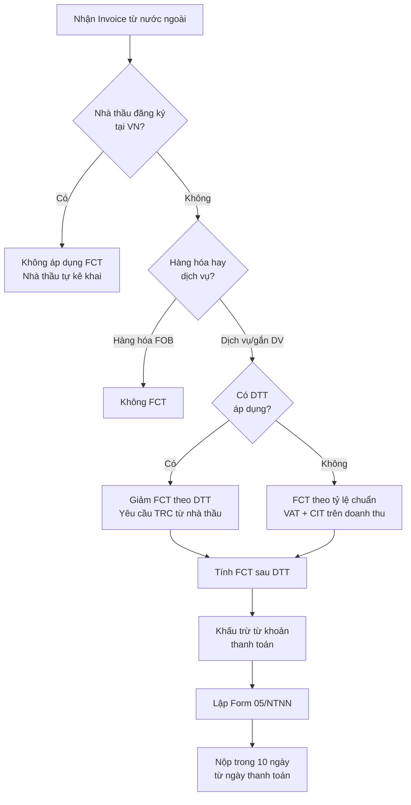

# TX05 — Thuế Quốc Tế (International Tax)

> **Domain:** Tax
> **Level:** Advanced
> **Prerequisites:** TX01 (Tax Fundamentals), TX02 (CIT), TX03 (VAT), TX04 (PIT)
> **Related:** TX02 (CIT — Transfer Pricing), TX03 (VAT), TX04 (PIT — Expat)

---

## 1. Mục Tiêu Học Tập (Learning Objectives)

Sau khi hoàn thành module này, người học có thể:

1. Giải thích nguyên tắc phân chia quyền đánh thuế giữa các quốc gia
2. Áp dụng Hiệp định Tránh Đánh Thuế Hai Lần (DTT) để giảm withholding tax
3. Tính và khai thuế nhà thầu nước ngoài (FCT) đúng quy định VN
4. Hiểu nguyên tắc arm's length và yêu cầu Transfer Pricing documentation
5. Nhận biết các yêu cầu tuân thủ BEPS và báo cáo Country-by-Country (CbCR)
6. Đánh giá tác động của OECD Pillar 2 (Global Minimum Tax 15%) đối với DN VN

---

## 2. Bối Cảnh Kinh Doanh (Business Context)

Trong bối cảnh toàn cầu hóa, ngày càng nhiều DN VN có giao dịch xuyên biên giới: mua dịch vụ nước ngoài, có công ty mẹ/con ở nước ngoài, thanh toán cổ tức/phí quản lý ra nước ngoài, hoặc nhận đầu tư FDI. Những giao dịch này phát sinh nhiều nghĩa vụ thuế quốc tế phức tạp.

Rủi ro nếu không hiểu thuế quốc tế:
- Không khai FCT → bị truy thu toàn bộ + phạt 3 lần
- Không lập TP documentation → bị ấn định giá chuyển nhượng
- Không tận dụng DTT → nộp thừa withholding tax
- Pillar 2 → DN FDI mất ưu đãi thuế, phải nộp thuế bổ sung

---

## 3. Định Nghĩa (Definitions)

| Thuật ngữ | Tiếng Anh | Định nghĩa |
|---|---|---|
| Hiệp định tránh đánh thuế hai lần | Double Tax Treaty (DTT) | Hiệp định song phương quy định quyền đánh thuế giữa 2 nước |
| Thuế nhà thầu | Foreign Contractor Tax (FCT) | Thuế đánh trên DN/cá nhân nước ngoài cung cấp dịch vụ tại VN |
| Giá chuyển nhượng | Transfer Pricing (TP) | Giá trong giao dịch giữa các bên liên kết |
| Nguyên tắc giá thị trường | Arm's Length Principle | Giá giao dịch liên kết phải như giao dịch độc lập |
| Xói mòn cơ sở thuế | Base Erosion and Profit Shifting (BEPS) | Chiến lược của DN giảm thuế bằng cách chuyển lợi nhuận sang nơi thuế thấp |
| Cơ sở thường trú | Permanent Establishment (PE) | Cơ sở kinh doanh cố định tạo ra nghĩa vụ thuế tại nước sở tại |
| Báo cáo từng quốc gia | Country-by-Country Report (CbCR) | Báo cáo phân bổ doanh thu, lợi nhuận, thuế theo từng quốc gia |
| Thuế tối thiểu toàn cầu | Global Minimum Tax (Pillar 2) | Thuế suất hiệu quả tối thiểu 15% theo quy tắc GloBE |
| QDMTT | Qualified Domestic Minimum Top-up Tax | Thuế bổ sung nội địa theo Pillar 2 |
| Nguồn vốn thụ động | Passive Income | Cổ tức, lãi vay, tiền bản quyền — thường chịu withholding tax |

---

## 4. Khái Niệm Cốt Lõi (Core Concepts)

### 4.1 Nguyên tắc phân chia quyền đánh thuế

Hai nguyên tắc cơ bản:
- **Nguồn gốc thu nhập (Source principle):** Đánh thuế ở nơi phát sinh thu nhập
- **Cư trú (Residence principle):** Đánh thuế ở nơi người nhận cư trú

Khi cả hai nước đều muốn đánh thuế → **Double Taxation** → Giải quyết bằng DTT.

### 4.2 Hiệp định Tránh Đánh Thuế Hai Lần (DTT)

**VN đã ký DTT với 80+ quốc gia** (tính đến 2024), bao gồm: Nhật Bản, Hàn Quốc, Trung Quốc, Pháp, Đức, Anh, Úc, Singapore, Mỹ (chưa có DTT)...

**Nội dung chính của DTT:**
- Xác định đối tượng cư trú (tie-breaker rules)
- Phân chia quyền đánh thuế theo loại thu nhập
- Thuế suất withholding tax tối đa cho cổ tức, lãi vay, tiền bản quyền
- Điều khoản PE — khi nào tạo ra cơ sở thường trú

**Áp dụng DTT để giảm withholding tax:**
```
Không DTT: Cổ tức sang nước A → Withholding 5% tại VN
Có DTT:    Theo DTT với nước A → Withholding tối đa 5% hoặc 10%
           (tùy điều khoản cụ thể từng DTT)
```

### 4.3 Thuế Nhà Thầu Nước Ngoài (FCT)

FCT áp dụng khi **công ty VN trả tiền cho tổ chức/cá nhân nước ngoài** cung cấp dịch vụ/hàng hóa gắn với dịch vụ tại VN.

**Phương pháp tính FCT:**
| Phương pháp | Điều kiện | Cách tính |
|---|---|---|
| **Khấu trừ** (Deduction) | Nhà thầu nước ngoài đăng ký nộp thuế tại VN, dùng hóa đơn VN | Khai VAT và CIT riêng |
| **Trực tiếp** (Direct) | Nhà thầu không đăng ký tại VN | VN bên trả tiền khấu trừ FCT = VAT% + CIT% trên doanh thu |

**Tỷ lệ FCT phổ biến (phương pháp trực tiếp):**
| Loại dịch vụ/hàng hóa | VAT rate | CIT rate | FCT tổng |
|---|---|---|---|
| Dịch vụ thuần túy | 5% | 5% | ~9.09-10.5% |
| Phần mềm, bản quyền | 5% | 10% | ~15.28% |
| Vận tải quốc tế | 3% | 2% | ~5% |
| Hàng hóa gắn dịch vụ | 3% | 2% | ~5% |
| Xây dựng | 3% | 2% | ~5% |
| Lãi vay | Miễn VAT | 5% | 5% |

**Form FCT:** Form **05/NTNN** — nộp trong 10 ngày từ ngày thanh toán.

### 4.4 Transfer Pricing (TP) — NĐ 132/2020

**Bên liên kết** = hai bên có quan hệ: sở hữu ≥25% vốn, cùng kiểm soát, hoặc các trường hợp khác theo NĐ 132.

**Phương pháp TP (theo thứ tự ưu tiên):**
1. **CUP** — Comparable Uncontrolled Price: So sánh giá giao dịch liên kết với giao dịch thị trường tương đương
2. **RPM** — Resale Price Method: Ngược từ giá bán lại tính biên lợi nhuận
3. **CPM** — Cost Plus Method: Giá vốn + biên lợi nhuận phù hợp
4. **TNMM** — Transactional Net Margin Method (phổ biến nhất): So sánh biên lợi nhuận thuần
5. **PSM** — Profit Split Method: Phân chia lợi nhuận

**Hồ sơ TP (3 cấp):**
- **Master File:** Thông tin tập đoàn toàn cầu
- **Local File:** Thông tin DN tại VN, phân tích giao dịch liên kết
- **CbCR:** Báo cáo từng quốc gia (bắt buộc nếu doanh thu >18,000 tỷ/năm)

**Giới hạn lãi vay (NĐ 132/2020):**
- Tổng lãi vay thuần (sau lãi tiền gửi) ≤ **30% EBITDA**
- Phần vượt không được trừ khi tính CIT (nhưng được chuyển sang 5 năm tiếp theo)

### 4.5 BEPS và OECD Action Plans

**BEPS = Base Erosion and Profit Shifting** — các chiến lược của MNC chuyển lợi nhuận sang nơi thuế thấp.

**15 Action Plans chính:**
- Action 1: Digital Economy taxation
- Action 2: Hybrid mismatch arrangements
- Action 5: Harmful tax practices
- Action 7: Permanent Establishment
- Action 8-10: Transfer Pricing
- Action 13: CbCR
- Action 15: Multilateral Instrument (MLI)

VN đã ký **MLI (Multilateral Instrument)** 2017 — tự động cập nhật nhiều DTT theo chuẩn BEPS.

### 4.6 OECD Pillar 2 — Global Minimum Tax

**Áp dụng tại VN từ 01/01/2024** (Nghị quyết 107/2023/QH15)

**Đối tượng:** MNC có doanh thu hợp nhất ≥ **750 triệu EUR/năm** (trong ít nhất 2/4 năm gần nhất)

**Nguyên tắc:** Nếu **Effective Tax Rate (ETR) < 15%** tại bất kỳ quốc gia nào → phải nộp thuế bổ sung (top-up tax) để đạt 15%.

**Ai nộp thuế bổ sung?**
- Công ty mẹ tối cao (UPE): nộp thuế tại nước mình nếu nước con có ETR <15% (IIR — Income Inclusion Rule)
- Nước sở tại (VN): có thể thu QDMTT (Qualified Domestic Minimum Top-up Tax) trước

**Tác động với DN FDI tại VN:**
- DN đang hưởng CIT 10% → ETR ~10% < 15% → phải nộp thêm 5% QDMTT
- VN thu QDMTT thay vì để nước mẹ thu IIR → VN giữ lại nguồn thu
- Ưu đãi CIT thấp hơn 15% mất tác dụng thu hút FDI

---

## 5. Giá Trị Kinh Doanh (Business Value)

- **FCT compliance:** Tránh bị truy thu FCT + phạt 3 lần khi kiểm tra
- **DTT utilization:** Tiết kiệm withholding tax hợp pháp khi nhận cổ tức, lãi vay từ nước ngoài
- **TP compliance:** Tránh bị ấn định giá, truy thu CIT với biên lợi nhuận không arm's length
- **Pillar 2 readiness:** Chuẩn bị sớm giúp DN FDI không bị surprise khi bị áp QDMTT
- **Holding structure:** Tư vấn cơ cấu pháp nhân tối ưu thuế xuyên biên giới

---

## 6. Vai Trò Trong Doanh Nghiệp (Enterprise Role)

- **Tax Manager:** Quản lý FCT, DTT, TP documentation
- **CFO:** Phê duyệt cấu trúc giao dịch xuyên biên giới, ký TP documentation
- **Legal:** Soạn thảo hợp đồng với bên ngoại (tránh tạo PE không mong muốn)
- **Treasury:** Quản lý luồng tiền xuyên biên giới, withholding tax
- **Group Tax (regional/global):** Phối hợp TP policy, CbCR, Pillar 2 với tập đoàn

---

## 7. Phòng Ban Liên Quan (Departments Related)

| Phòng ban | Mối liên hệ với International Tax |
|---|---|
| Tài chính/Kế toán | FCT calculation, withholding tax booking |
| Pháp chế | Hợp đồng xuyên biên giới, PE risk |
| Kinh doanh quốc tế | Cơ cấu giao dịch xuyên biên giới |
| Mua hàng | Mua dịch vụ nước ngoài → FCT |
| Treasury | Luồng tiền cổ tức, lãi vay, royalty |
| Group/Regional Tax | TP policy, CbCR, Pillar 2 compliance |

---

## 8. Đầu Vào (Input)

- Hợp đồng dịch vụ với nhà cung cấp nước ngoài
- Hóa đơn từ nhà thầu nước ngoài
- Giấy chứng nhận cư trú thuế (Tax Residency Certificate) của nhà cung cấp nước ngoài
- Dữ liệu giao dịch liên kết từ ERP
- Báo cáo tài chính của các bên liên kết
- Thông tin tập đoàn (cho CbCR, Master File)
- Pillar 2 data: CIT, GAAP income, ETR computation

---

## 9. Đầu Ra (Output)

- Form 05/NTNN — Tờ khai thuế nhà thầu
- Transfer Pricing documentation (Master File + Local File)
- CbCR (Country-by-Country Report) — nếu đủ ngưỡng
- Pillar 2 / QDMTT computation và tờ khai
- Hồ sơ áp dụng DTT (để giảm withholding rate)
- Báo cáo rủi ro PE (Permanent Establishment risk)

---

## 10. Quy Trình Nghiệp Vụ (Business Process)

```
Giao dịch xuyên biên giới phát sinh
          ↓
Xác định: Có FCT không?
(Dịch vụ cung cấp cho VN? Nhà thầu nước ngoài không đăng ký?)
          ↓
Xác định phương pháp FCT (trực tiếp / khấu trừ)
          ↓
Kiểm tra DTT: Có áp dụng không? Có giảm thuế suất?
          ↓
Yêu cầu Tax Residency Certificate từ nhà thầu
          ↓
Tính FCT (VAT + CIT trên doanh thu)
          ↓
Khấu trừ từ khoản thanh toán
          ↓
Nộp Form 05/NTNN trong 10 ngày
          ↓
Giao chứng từ khấu trừ cho nhà thầu
          ↓
Hàng năm: Lập TP documentation cho giao dịch liên kết
```

---

## 11. Luồng Dữ Liệu (Data Flow)

```
ERP (AP Module) ──→ Nhận diện giao dịch nước ngoài
                           ↓
                  Transfer Pricing Workbench
                           ↓
Comparable database ──→ TP Analysis → Local File
                           ↓
                    Group Reporting ──→ CbCR
                           ↓
                    GloBE computation ──→ Pillar 2 / QDMTT
```

---

## 12. Luồng Tiền (Money Flow)

```
Công ty VN trả dịch vụ cho Công ty A (Singapore): 1,000 USD
        ↓
FCT = 9.09% × 1,000 = ~90 USD (khấu trừ tại nguồn)
        ↓
Nhà thầu thực nhận: ~910 USD
        ↓
VN nộp FCT vào KBNN: ~90 USD (quy VND)

Nếu có DTT VN-Singapore: FCT CIT có thể giảm xuống 0%
→ FCT chỉ còn 5% VAT = ~48 USD
→ Nhà thầu thực nhận: ~952 USD
```

---

## 13. Luồng Chứng Từ (Document Flow)

```
Hợp đồng dịch vụ nước ngoài
    ↓
Invoice từ nhà thầu + Tax Residency Certificate
    ↓
Bảng tính FCT (VAT + CIT trên doanh thu)
    ↓
Chứng từ khấu trừ FCT (cấp cho nhà thầu)
    ↓
Form 05/NTNN → Nộp eTax trong 10 ngày
    ↓
Biên lai nộp tiền FCT → Lưu hồ sơ
```

---

## 14. Vai Trò (Roles)

| Vai trò | Trách nhiệm International Tax |
|---|---|
| International Tax Manager | Phụ trách FCT, DTT, TP documentation, Pillar 2 |
| Tax Accountant | Tính FCT, lập Form 05/NTNN, booking |
| CFO | Phê duyệt TP policy, Pillar 2 strategy |
| Legal Counsel | PE risk management, hợp đồng xuyên biên giới |
| Treasury Manager | Withholding tax trên luồng tiền quốc tế |
| Group Tax (HQ) | TP documentation consolidation, CbCR filing |

---

## 15. Trách Nhiệm (Responsibilities)

- **Kế toán AP:** Nhận diện giao dịch với nhà thầu nước ngoài, flag cho tax team
- **Tax Accountant:** Tính FCT, lập tờ khai đúng hạn
- **Tax Manager:** Phân tích DTT, lập TP docs, review PE risk
- **CFO:** Approve TP policy nhất quán với tập đoàn
- **DN (withholding agent):** Khấu trừ và nộp FCT thay nhà thầu nước ngoài

---

## 16. Ma Trận RACI

| Hoạt động | CFO | Tax Manager | Tax Accountant | Kế toán AP | Legal |
|---|---|---|---|---|---|
| Nhận diện giao dịch FCT | I | C | C | R | - |
| Tính FCT + lập 05/NTNN | I | A | R | C | - |
| Review DTT áp dụng | A | R | C | - | C |
| Lập Local File TP | A | R | C | - | C |
| Lập Master File TP | A | R | C | - | - |
| CbCR filing | A | R | C | - | - |
| Pillar 2 / QDMTT | A | R | C | - | - |

---

## 17. Frameworks

- **OECD Model Tax Convention (2017):** Nền tảng phần lớn DTT trên thế giới
- **UN Model Tax Convention:** Phiên bản cho nước đang phát triển — VN tham chiếu
- **OECD Transfer Pricing Guidelines (2022):** Hướng dẫn TP arm's length
- **OECD BEPS 15 Action Plans:** Chống xói mòn cơ sở thuế
- **GloBE Model Rules (Pillar 2):** Thuế tối thiểu toàn cầu 15%

---

## 18. Chuẩn Quốc Tế (International Standards)

- **OECD/G20 Inclusive Framework:** 140+ quốc gia đồng ý thực hiện BEPS/Pillar 2
- **MLI (Multilateral Instrument):** Cập nhật hàng loạt DTT theo chuẩn BEPS
- **CbCR (Action 13):** Báo cáo từng quốc gia cho tập đoàn lớn
- **GRI 207 (Tax):** Báo cáo minh bạch thuế theo chuẩn ESG
- **BEPS 2.0 (Pillar 1 + Pillar 2):** Phân bổ lại quyền đánh thuế nền kinh tế số

---

## 19. Bối Cảnh Việt Nam (Vietnam Context)

### Hiệp định tránh đánh thuế hai lần (DTT)

VN đã ký và có hiệu lực DTT với hơn 80 quốc gia, bao gồm:
- Châu Á: Nhật Bản, Hàn Quốc, Trung Quốc, Singapore, Thái Lan, Malaysia, Ấn Độ...
- Châu Âu: Pháp, Đức, Anh, Hà Lan, Thụy Điển, Đan Mạch, Nga...
- Các nước khác: Úc, New Zealand, Canada...
- **Chưa có DTT với Mỹ** — giao dịch VN-Mỹ không được hưởng DTT

**Thủ tục áp dụng DTT:**
1. Nhà thầu nước ngoài cung cấp **Certificate of Residence** (xác nhận cư trú thuế)
2. Bên VN lập hồ sơ áp dụng DTT
3. Gửi cùng hồ sơ FCT cho CQT (hoặc lưu hồ sơ khi bị kiểm tra)

### Thuế nhà thầu (FCT) — Thông tư 103/2014/TT-BTC

**Phạm vi áp dụng FCT:**
- Nhà thầu nước ngoài cung cấp dịch vụ tại VN hoặc gắn với VN
- Dù hợp đồng ký ở đâu, dù phương thức thanh toán ra sao

**Các trường hợp không áp dụng FCT:**
- Cung cấp hàng hóa hoàn toàn tại nước ngoài (FOB, CIF tại cảng nước ngoài)
- Dịch vụ thực hiện hoàn toàn ngoài lãnh thổ VN

### Transfer Pricing — NĐ 132/2020

**Ngưỡng lập hồ sơ TP:**
- Giao dịch liên kết tổng cộng ≥ 20 tỷ VND/năm → phải lập Local File
- Doanh thu ≥ 200 tỷ VND/năm → phải lập Master File (nếu có công ty liên kết ở nước ngoài)
- Doanh thu tập đoàn ≥ 18,000 tỷ VND/năm → CbCR

**Miễn lập hồ sơ TP:**
- DN có tổng giao dịch liên kết < 20 tỷ VND/năm
- DN đã ký APA (Advance Pricing Agreement) với GDT

### Pillar 2 tại Việt Nam

- **Nghị quyết 107/2023/QH15:** Áp dụng QDMTT từ 01/01/2024
- **Đối tượng:** MNC có doanh thu ≥ 750 triệu EUR/năm (có pháp nhân tại VN)
- **QDMTT = 15% - CIT ETR tại VN** (top-up để đạt 15%)
- DN FDI đang hưởng CIT 10%: phải nộp thêm ~5% QDMTT
- Bộ Tài chính đang nghiên cứu gói hỗ trợ bù đắp cho FDI

### Form FCT tại VN

- **Form 05/NTNN:** Tờ khai FCT → nộp trong **10 ngày** từ ngày trả tiền
- Nộp qua eTax, kèm hợp đồng và hóa đơn nhà thầu

---

## 20. Khía Cạnh Pháp Lý (Legal Considerations)

**Rủi ro PE (Permanent Establishment):**
- Nhân viên của công ty mẹ nước ngoài làm việc tại VN >183 ngày → có thể tạo PE
- PE phải đăng ký thuế và nộp CIT tại VN
- Dấu hiệu PE: văn phòng đại diện ký hợp đồng, kho hàng, đại lý phụ thuộc

**Rủi ro TP:**
- CQT có thể ấn định giá nếu giao dịch liên kết không arm's length
- Hậu quả: điều chỉnh tăng thu nhập chịu thuế → truy thu CIT + phạt 20% + lãi

**Rủi ro FCT:**
- Không khai FCT: truy thu toàn bộ + phạt vi phạm hành chính
- Khai thiếu: 20% số thuế thiếu

**Anti-avoidance (GAAR):**
- VN có quy định chống tránh thuế chung trong Luật QLYT 38/2019
- CQT có quyền bác bỏ cơ cấu thuế không có thực chất kinh doanh

---

## 21. Lỗi Phổ Biến (Common Mistakes)

1. **Không khai FCT** cho phí dịch vụ tư vấn, phần mềm, bản quyền trả cho công ty nước ngoài
2. **Nhầm hàng hóa với dịch vụ** — mua SaaS từ AWS/Google là dịch vụ, phải khai FCT
3. **Không yêu cầu Tax Residency Certificate** để áp dụng DTT — trả thừa FCT
4. **Không lập TP documentation** trong khi giao dịch liên kết >20 tỷ/năm
5. **Vay nội bộ lãi suất bất thường** — không điều chỉnh theo arm's length
6. **Tạo PE vô ý** — chuyên gia tập đoàn mẹ ở VN quá lâu ký hợp đồng thay
7. **Không tính Pillar 2 impact** — DN FDI tiếp tục kế hoạch thuế dựa trên ưu đãi CIT 10%
8. **Royalty fee sang nước ưu đãi thuế** không có thực chất → bị bác bỏ theo BEPS

---

## 22. Thực Hành Tốt Nhất (Best Practices)

1. **FCT checklist cho mọi invoice nước ngoài:** Trước khi thanh toán AP team phải flag để tax review
2. **DTT database nội bộ:** Duy trì bảng tra cứu withholding rate theo từng nước đối tác
3. **Tax Residency Certificate process:** Quy trình chuẩn yêu cầu TRC từ vendor nước ngoài
4. **Annual TP study:** Cập nhật phân tích TP mỗi năm trước khi nộp CIT
5. **PE monitoring:** Theo dõi số ngày nhân viên nước ngoài ở VN
6. **Pillar 2 readiness assessment:** Đánh giá tác động Pillar 2 hàng năm
7. **Inter-company agreement:** Ký hợp đồng nội bộ rõ ràng, đầy đủ, phản ánh thực chất

---

## 23. KPIs

| KPI | Mục tiêu |
|---|---|
| Tỷ lệ invoice nước ngoài được review FCT | 100% |
| FCT khai đúng hạn | 100% |
| TP documentation completion | 100% trước 31/03 |
| Giao dịch liên kết được bác bỏ bởi CQT | 0 |
| ETR so với Pillar 2 minimum (15%) | Biết rõ và monitor |
| Số phát hiện TP trong kiểm tra thuế | 0 |

---

## 24. Số Liệu Đo Lường (Metrics)

- **FCT nộp / Tổng thanh toán nước ngoài:** Tỷ lệ FCT
- **Withholding tax saving từ DTT:** Số tiền tiết kiệm nhờ áp dụng DTT
- **GloBE ETR by jurisdiction:** Thuế suất hiệu quả từng quốc gia (Pillar 2)
- **TP adjustment risk:** Ước tính rủi ro điều chỉnh TP nếu bị kiểm tra
- **PE risk score:** Đánh giá rủi ro PE theo jurisdiction

---

## 25. Báo Cáo (Reports)

- **FCT Monthly Register:** Danh sách và tổng hợp FCT khai trong tháng
- **TP Benchmarking Report:** Phân tích arm's length cho các giao dịch liên kết
- **CbCR (Country-by-Country Report):** Báo cáo phân bổ theo quốc gia
- **Pillar 2 / GloBE Computation:** Bảng tính ETR và QDMTT
- **DTT Benefits Tracking:** Theo dõi DTT đã áp dụng và số thuế tiết kiệm

---

## 26. Mẫu Biểu (Templates)

**Bảng tính FCT (phương pháp trực tiếp — dịch vụ):**
```
Hợp đồng: Dịch vụ tư vấn quản lý từ Singapore
Tổng giá trị hợp đồng (đã bao gồm FCT): USD 100,000

Doanh thu tính thuế = 100,000 / (1 - VAT% - CIT%)
Giả sử: VAT 5% + CIT 5%:
  Doanh thu tính thuế = 100,000 / (1 - 0.05 - 0.05) = 111,111 USD

VAT = 111,111 × 5% = 5,556 USD
CIT = 111,111 × 5% = 5,556 USD
FCT tổng = 11,111 USD

Nhà thầu nhận thực = 100,000 USD
Bên VN nộp FCT:   = 11,111 USD (trả thêm vào ngân sách)
```

---

## 27. Checklists

**Checklist trước khi thanh toán invoice nước ngoài:**
- [ ] Nhà cung cấp có đăng ký tại VN không? (Nếu có → không FCT)
- [ ] Loại giao dịch: hàng hóa hay dịch vụ? Thực hiện ở đâu?
- [ ] Tỷ lệ FCT áp dụng là bao nhiêu? (VAT% + CIT%)
- [ ] Có áp dụng DTT không? Nước nào?
- [ ] Đã nhận Tax Residency Certificate chưa?
- [ ] Tính FCT: theo giá hợp đồng + FCT hay trên doanh thu tính?
- [ ] Lập Form 05/NTNN sau khi thanh toán
- [ ] Nộp FCT trong 10 ngày
- [ ] Cấp chứng từ FCT cho nhà thầu

**Checklist TP hàng năm:**
- [ ] Tổng hợp danh sách giao dịch liên kết (loại, giá trị)
- [ ] Xác định giao dịch nào cần phân tích TP
- [ ] Cập nhật comparable database (ORBIS/TP Catalyst)
- [ ] Lập/cập nhật Local File
- [ ] Cập nhật Master File (nếu có)
- [ ] Review giới hạn lãi vay 30% EBITDA
- [ ] Nộp kèm Form 03/TNDN theo đúng phụ lục TP

---

## 28. Quy Trình Chuẩn (SOP)

**SOP-INTL-01: Xử lý FCT khi có invoice từ nước ngoài**

| Bước | Người thực hiện | Mô tả | Timeline |
|---|---|---|---|
| 1 | Kế toán AP | Nhận invoice nước ngoài, flag cho tax team | Ngay khi nhận |
| 2 | Tax Accountant | Xác định có FCT không, xác định tỷ lệ | D+1 |
| 3 | Tax Accountant | Kiểm tra DTT áp dụng, yêu cầu TRC | D+2 |
| 4 | Tax Accountant | Tính FCT, lập chứng từ khấu trừ | D+3 |
| 5 | Kế toán AP | Thanh toán: chuyển thực cho nhà thầu | D+5 |
| 6 | Tax Accountant | Lập Form 05/NTNN | D+5 |
| 7 | Kế toán trưởng | Soát xét, phê duyệt | D+7 |
| 8 | Tax Accountant | Nộp 05/NTNN + tiền FCT | D+10 |
| 9 | Tax Accountant | Lưu hồ sơ, cấp chứng từ cho nhà thầu | D+12 |

---

## 29. Tình Huống Thực Tế (Case Study)

**Tình huống: MNC FDI đối mặt với Pillar 2 tại VN**

Công ty Samsung Electronics VN (doanh thu tập đoàn >750 triệu EUR) đang hưởng CIT 10% (ưu đãi) tại VN. Từ 2024, VN áp dụng QDMTT.

Tính toán:
- CIT thực tế tại VN: ~10% (sau ưu đãi)
- GloBE Minimum Rate: 15%
- QDMTT = 15% - 10% = 5% trên thu nhập GloBE

Ước tính: Nếu lợi nhuận GloBE tại VN là 10,000 tỷ → QDMTT = 500 tỷ đồng/năm

**Chiến lược của DN:**
- Tận dụng substance carve-out (trừ 5% payroll + 5% giá trị TSCĐ)
- Tìm hiểu các hỗ trợ thay thế (cash grant, subsidies) mà Chính phủ VN cam kết

---

## 30. Ví Dụ Doanh Nghiệp Nhỏ (Small Business Example)

**Startup VN mua dịch vụ cloud từ AWS (Amazon, Mỹ):**
- Chi phí AWS hàng tháng: 50 triệu VND
- Loại: Dịch vụ → phải khai FCT
- AWS không đăng ký tại VN → phương pháp trực tiếp
- FCT: ~9.09% × 50tr = ~4.5tr/tháng (VAT 5% + CIT 5%)
- Form 05/NTNN: nộp hàng tháng trong 10 ngày
- Lưu ý: Không có DTT VN-Mỹ → không được giảm

---

## 31. Ví Dụ Doanh Nghiệp Lớn (Enterprise Example)

**Tập đoàn đa quốc gia với holding tại Singapore:**
- Phí quản lý (Management fee) sang Singapore: 200 tỷ/năm
- Tiền bản quyền phần mềm sang Ireland: 100 tỷ/năm
- Lãi vay nội bộ từ công ty mẹ Netherlands: lãi 50 tỷ/năm

Phân tích:
- FCT phí quản lý VN-Singapore: CIT 5% (DTT VN-Singapore giảm từ 5% xuống 0% nếu đáp ứng điều kiện LOB)
- TP risk: Phí quản lý 200 tỷ/năm → cần benchmark arm's length
- Lãi vay: Kiểm tra ≤ 30% EBITDA theo NĐ 132/2020
- BEPS: OECD review IP regime Ireland → có thể bị nghi ngờ không có substance

---

## 32. Ánh Xạ ERP (ERP Mapping)

| Module ERP | Liên quan International Tax |
|---|---|
| AP (Accounts Payable) | Nhận diện vendor nước ngoài, tax code FCT |
| Treasury | Withholding tax trên foreign payments |
| Intercompany | Giao dịch liên kết — dữ liệu cho TP analysis |
| Tax Module | Form 05/NTNN, FCT posting |
| Consolidation | CbCR data, GloBE ETR computation |
| Fixed Assets | Substance carve-out (Pillar 2) |

---

## 33. Tự Động Hóa (Automation)

- **Foreign vendor flag:** ERP tự động đánh dấu invoice từ vendor nước ngoài → alert FCT team
- **DTT lookup tool:** Tra cứu tự động withholding rate theo quốc gia
- **TP data aggregation:** Tự động tổng hợp giao dịch liên kết từ ERP cho TP analysis
- **GloBE computation tool:** Phần mềm tính ETR và QDMTT tự động
- **CbCR automation:** Tự động tổng hợp dữ liệu từ ERP tất cả jurisdictions

---

## 34. Cơ Hội AI (AI Opportunities)

- **FCT auto-classification:** AI phân loại giao dịch nước ngoài → FCT hay không FCT?
- **TP benchmarking AI:** Tự động tìm comparable công ty trên ORBIS/CapIQ
- **Treaty benefit optimizer:** AI đề xuất cách tận dụng DTT tối ưu nhất
- **Pillar 2 modeler:** AI mô phỏng ETR impact khi thay đổi cơ cấu kinh doanh
- **BEPS risk scanner:** Phát hiện cơ cấu giao dịch có rủi ro BEPS tự động

---

## 35. Hướng Dẫn Triển Khai (Implementation Guide)

**Cho DN mới có giao dịch quốc tế lần đầu:**
1. Xây dựng quy trình nhận diện giao dịch FCT (whitelist vendor nước ngoài)
2. Lập bảng tra cứu FCT rate theo ngành nghề/loại dịch vụ
3. Lập danh sách DTT partners và withholding rate sau DTT
4. Thiết lập quy trình yêu cầu TRC từ nhà cung cấp nước ngoài

**Cho DN FDI chuẩn bị Pillar 2:**
1. Xác định xem tập đoàn có trong scope Pillar 2 (>750tr EUR)?
2. Tính ETR hiện tại tại VN — so với 15%
3. Xác định substance carve-out có thể áp dụng
4. Lập kế hoạch ứng phó: maintain ưu đãi hay chấp nhận QDMTT?
5. Phối hợp với Group Tax để chuẩn bị GloBE computation

---

## 36. Hướng Dẫn Tư Vấn (Consulting Guide)

**Cơ hội tư vấn International Tax:**
- **FCT health check:** Rà soát tất cả invoice nước ngoài 2-3 năm — phát hiện FCT bị bỏ sót
- **TP study:** Lập TP documentation cho giao dịch liên kết
- **DTT advisory:** Tối ưu cơ cấu để tận dụng DTT
- **Pillar 2 assessment:** Đánh giá tác động và kế hoạch ứng phó
- **Group restructuring:** Tư vấn cơ cấu holding để tối ưu thuế hợp pháp

**Câu hỏi onboarding khách hàng:**
1. DN có giao dịch trả tiền cho tổ chức/cá nhân nước ngoài không?
2. Có công ty liên kết ở nước ngoài không? Loại giao dịch?
3. Có ký DTT với các nước đối tác chưa? Tận dụng thế nào?
4. Tập đoàn có doanh thu >750 triệu EUR không? (Pillar 2 scope)

---

## 37. Câu Hỏi Chẩn Đoán (Diagnostic Questions)

1. DN có quy trình review FCT cho mọi invoice nước ngoài không?
2. Giao dịch liên kết trên 20 tỷ/năm đã được lập TP documentation chưa?
3. Nhân viên nước ngoài ở VN có đang trong vùng nguy hiểm tạo PE không?
4. ETR của tập đoàn tại VN so với 15% Pillar 2 minimum?
5. DTT đã được áp dụng đầy đủ để giảm withholding tax chưa?

---

## 38. Câu Hỏi Phỏng Vấn (Interview Questions)

**Tax Accountant:**
1. Giải thích khi nào phải khai FCT và form nào dùng?
2. Sự khác biệt giữa phương pháp FCT trực tiếp và khấu trừ?
3. Dịch vụ nào của nhà thầu nước ngoài không phải khai FCT?

**Senior International Tax Manager:**
1. Tập đoàn mẹ ở Nhật Bản — áp dụng DTT VN-Nhật như thế nào để giảm withholding tax trên cổ tức?
2. Giải thích quy tắc 30% EBITDA cho lãi vay theo NĐ 132/2020?
3. Pillar 2 QDMTT tại VN — ai phải nộp, nộp bao nhiêu, và cách tính?

---

## 39. Bài Tập (Exercises)

**Bài tập 1:** Công ty VN thuê công ty tư vấn Nhật Bản (không đăng ký tại VN) làm dịch vụ marketing. Hợp đồng 500 triệu VND. Tính FCT phải nộp. Kiểm tra xem VN-Nhật DTT có giảm được thuế không?

**Bài tập 2:** Công ty VN trả Management fee 100 tỷ/năm cho công ty mẹ Singapore. Phân tích rủi ro TP và FCT. Xác định hồ sơ cần chuẩn bị.

**Bài tập 3:** Tập đoàn FDI tại VN (scope Pillar 2) có lợi nhuận GloBE 5,000 tỷ, CIT thực tế nộp 500 tỷ (ETR = 10%). Tính QDMTT. Áp dụng substance carve-out: payroll 200 tỷ + giá trị TSCĐ 10,000 tỷ.

---

## 40. Tài Liệu Tham Khảo (References)

- Nghị định 132/2020/NĐ-CP (Transfer Pricing)
- Thông tư 103/2014/TT-BTC (FCT — Foreign Contractor Tax)
- Nghị quyết 107/2023/QH15 (Pillar 2 / Global Minimum Tax tại VN)
- Danh sách DTT VN — Tổng Cục Thuế: https://www.gdt.gov.vn
- OECD Transfer Pricing Guidelines 2022
- OECD GloBE Model Rules (Pillar 2) 2021
- BEPS Action Plans — OECD: https://www.oecd.org/tax/beps/

---

## Output Formats

### A. Mermaid Diagram — Quy trình xử lý FCT



### B. ASCII Diagram — Cấu trúc Transfer Pricing Documentation

```
TRANSFER PRICING DOCUMENTATION
═══════════════════════════════════════════════════════
MASTER FILE (hồ sơ tập đoàn toàn cầu):
  • Cơ cấu tổ chức tập đoàn
  • Mô tả hoạt động kinh doanh chính
  • IP, chuỗi cung ứng tập đoàn
  • Chính sách TP tập đoàn
───────────────────────────────────────────────────────
LOCAL FILE (hồ sơ pháp nhân VN):
  • Thông tin DN tại VN
  • Danh sách giao dịch liên kết
  • Phân tích tính năng/rủi ro
  • Phương pháp TP được chọn
  • Phân tích benchmark/arm's length
───────────────────────────────────────────────────────
CbCR (nếu doanh thu tập đoàn ≥ 18,000 tỷ VND):
  • Doanh thu, lợi nhuận, thuế theo quốc gia
  • Số nhân viên, giá trị TSCĐ theo quốc gia
  • Nộp cho CQT nước của UPE (công ty mẹ tối cao)
═══════════════════════════════════════════════════════
```

### C. Flashcards

**Q1:** FCT là gì và ai phải nộp?
**A1:** FCT (Foreign Contractor Tax — Thuế nhà thầu) là thuế đánh trên thu nhập của tổ chức/cá nhân nước ngoài cung cấp dịch vụ tại Việt Nam. **Bên VN trả tiền** phải khấu trừ FCT và nộp thay nhà thầu nước ngoài, trong vòng 10 ngày từ ngày thanh toán.

**Q2:** Nguyên tắc arm's length trong Transfer Pricing là gì?
**A2:** Giá trong giao dịch giữa các bên liên kết phải bằng (hoặc tương đương) giá mà các bên độc lập, tự nguyện, đàm phán trong điều kiện thị trường tương tự sẽ đạt được. Nếu không arm's length, CQT có quyền điều chỉnh và tính thuế theo giá thị trường.

**Q3:** Pillar 2 Global Minimum Tax áp dụng ở VN từ khi nào và ai chịu ảnh hưởng?
**A3:** Từ 01/01/2024 theo Nghị quyết 107/2023/QH15. Áp dụng cho MNC có doanh thu hợp nhất ≥750 triệu EUR/năm có pháp nhân tại VN. DN FDI đang hưởng CIT ưu đãi <15% phải nộp thêm QDMTT để đạt tối thiểu 15%.

### D. Cheat Sheet — Thuế Quốc Tế VN

```
=== CHEAT SHEET: THUẾ QUỐC TẾ TẠI VIỆT NAM ===

FCT (THUẾ NHÀ THẦU):
• Áp dụng: Dịch vụ từ nước ngoài cho VN
• Form: 05/NTNN — Nộp trong 10 ngày từ ngày TT
• Tỷ lệ phổ biến (trực tiếp):
  - Dịch vụ tư vấn: VAT 5% + CIT 5% ≈ 9.09-10.5%
  - Bản quyền: VAT 5% + CIT 10% ≈ 15.28%
  - Lãi vay: Chỉ CIT 5%
• Giảm được nếu có DTT + Tax Residency Certificate

DTT (HIỆP ĐỊNH TRÁNH ĐÁNH THUẾ):
• VN ký với 80+ nước
• Chưa có DTT với Mỹ
• Cần: Tax Residency Certificate từ nhà thầu

TRANSFER PRICING:
• Ngưỡng: Giao dịch liên kết ≥ 20 tỷ/năm → Local File
• Giới hạn lãi vay: ≤ 30% EBITDA (NĐ 132/2020)
• Phương pháp phổ biến: TNMM (so sánh biên LN thuần)

PILLAR 2 (từ 01/01/2024):
• Áp dụng: MNC doanh thu ≥ 750 triệu EUR
• QDMTT = 15% - ETR thực tế tại VN
• DN CIT 10% → nộp thêm 5% QDMTT
```

### E. JSON Metadata

```json
{
  "module": {
    "code": "TX05",
    "name": "Thuế Quốc Tế",
    "name_en": "International Tax",
    "domain": "Tax",
    "level": "Advanced",
    "status": "complete",
    "version": "1.0"
  },
  "vietnam_context": {
    "DTT_count": "80+ quốc gia",
    "FCT_form": "05/NTNN",
    "FCT_deadline": "10 ngày từ ngày thanh toán",
    "TP_threshold": "20 tỷ VND/năm",
    "interest_deduction_limit": "30% EBITDA",
    "Pillar2_effective_date": "01/01/2024",
    "Pillar2_scope": "MNC doanh thu ≥ 750 triệu EUR",
    "QDMTT_rate": "15% - ETR",
    "key_laws": [
      "TT 103/2014/TT-BTC (FCT)",
      "NĐ 132/2020/NĐ-CP (TP)",
      "NQ 107/2023/QH15 (Pillar 2)"
    ]
  },
  "related_modules": ["TX01", "TX02", "TX03", "TX04"],
  "tags": ["FCT", "transfer-pricing", "DTT", "BEPS", "Pillar2", "QDMTT", "international-tax", "Vietnam"]
}
```
