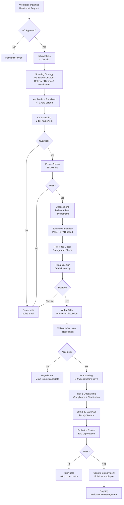

# HR01 — Tuyển Dụng (Recruitment & Talent Acquisition)

> **Tuyển dụng** là quá trình hệ thống hoá việc tìm kiếm, thu hút, đánh giá và tuyển chọn ứng viên phù hợp nhất cho tổ chức — đảm bảo đúng người, đúng vị trí, đúng thời điểm, với chi phí tối ưu và tuân thủ pháp luật lao động.

---

## 01. Tổng Quan & Định Nghĩa

Tuyển dụng (Recruitment) và Thu hút nhân tài (Talent Acquisition) là hai khái niệm thường dùng lẫn nhau nhưng có sự khác biệt quan trọng:

| Tiêu chí | Recruitment | Talent Acquisition |
|---|---|---|
| Phạm vi | Ngắn hạn, lấp đầy vị trí trống | Dài hạn, xây dựng pipeline nhân tài |
| Tư duy | Reactive (phản ứng) | Proactive (chủ động) |
| Trọng tâm | Kỹ năng hiện tại | Tiềm năng + kỹ năng tương lai |
| Kết quả | Vị trí được lấp đầy | Tổ chức có năng lực cạnh tranh |

**Chu trình tuyển dụng (Recruitment Lifecycle)** gồm 7 giai đoạn:
1. Workforce Planning — lập kế hoạch nhân lực
2. Job Analysis & Job Description — phân tích công việc
3. Sourcing — tìm kiếm nguồn ứng viên
4. Screening & Assessment — sàng lọc và đánh giá
5. Interview — phỏng vấn
6. Offer & Negotiation — đề nghị và đàm phán
7. Onboarding — hội nhập

**Vai trò trong doanh nghiệp VN:**
- SME (<200 nhân viên): HR Generalist kiêm tuyển dụng
- Mid-size (200-2000): HR Business Partner + Recruiter chuyên trách
- Large (>2000): TA team riêng, có Head of TA, Employer Branding chuyên biệt

---

## 02. Nguyên Lý Cơ Bản

### 2.1 Hire for Attitude, Train for Skill
Phil Crosby và nhiều chuyên gia HR đồng thuận: thái độ và giá trị cốt lõi khó thay đổi hơn kỹ năng kỹ thuật. Đặc biệt quan trọng ở VN, nơi văn hóa doanh nghiệp đóng vai trò lớn trong hiệu suất làm việc.

### 2.2 Candidate Experience là Brand Experience
Mỗi ứng viên là một khách hàng tiềm năng và đại sứ thương hiệu. Theo LinkedIn Talent Trends 2023:
- 69% ứng viên chia sẻ trải nghiệm xấu với người quen
- 65% ứng viên nộp lại nếu có trải nghiệm tốt dù bị từ chối

### 2.3 Data-Driven Recruiting
Quyết định tuyển dụng dựa trên dữ liệu thay vì "gut feeling":
- Structured Interview > Unstructured Interview (validity: 0.51 vs 0.20)
- Work sample test có giá trị dự đoán cao nhất (validity: 0.54)
- Reference check một mình có giá trị thấp (validity: 0.26)

### 2.4 DEI trong Tuyển Dụng (Diversity, Equity, Inclusion)
Tại VN: chú trọng không phân biệt vùng miền, trường đại học, giới tính, dân tộc. BLLĐ 2019 Điều 8 cấm phân biệt đối xử trong tuyển dụng.

---

## 03. Khung Pháp Lý

### 3.1 BLLĐ 45/2019/QH14 — Các điều khoản tuyển dụng

**Điều 8 — Các hành vi bị nghiêm cấm:**
- Phân biệt đối xử về giới tính, dân tộc, màu da, thành phần xã hội, tình trạng hôn nhân, tín ngưỡng, tôn giáo, HIV/AIDS, khuyết tật
- Ngược đãi, quấy rối tình dục tại nơi làm việc

**Điều 18 — Tuyển dụng lao động:**
- Doanh nghiệp được tự chủ tuyển dụng, bố trí và quản lý lao động
- Phải thông báo công khai về nhu cầu, điều kiện tuyển dụng
- Không được thu phí tuyển dụng từ người lao động (trừ trường hợp luật cho phép)

**Điều 24-27 — Thử việc:**
- Thỏa thuận thử việc riêng hoặc trong HĐLĐ
- Thời gian thử việc:
  - Không quá 180 ngày: Giám đốc, Phó GĐ, Kế toán trưởng
  - Không quá 60 ngày: Công việc có chức danh nghề nghiệp cần CĐ trở lên
  - Không quá 30 ngày: Công việc cần TC, CNKT, NV
  - Không quá 6 ngày làm việc: Lao động phổ thông
- Lương thử việc: ≥ 85% mức lương chính thức
- Trong thời gian thử việc, mỗi bên có thể huỷ bỏ không cần báo trước

**Điều 32-38 — Hợp đồng lao động:**
- HĐLĐ xác định thời hạn (≤ 36 tháng): ký tối đa 2 lần, lần 3 là HĐLĐ không xác định thời hạn
- HĐLĐ không xác định thời hạn: nhân viên có quyền nghỉ việc sau 45 ngày báo trước
- Bắt buộc bằng văn bản; cho phép HĐLĐ điện tử

### 3.2 NĐ 145/2020/NĐ-CP
Hướng dẫn chi tiết BLLĐ về tuyển dụng qua dịch vụ việc làm, phí môi giới, quy định với lao động nước ngoài.

### 3.3 Luật Người khuyết tật 51/2010/QH12
- DN có ≥ 30 lao động: khuyến khích tuyển ≥ 2% lao động khuyết tật
- Được hưởng ưu đãi thuế nếu tuyển dụng lao động khuyết tật

---

## 04. Workforce Planning (Lập Kế Hoạch Nhân Lực)

### 4.1 Quy trình Workforce Planning

**Bước 1 — Supply Analysis (Phân tích nguồn cung nội bộ):**
```
Headcount hiện tại → Dự báo turnover → Dự báo promotion/transfer → 
Headcount dự kiến cuối kỳ = Headcount đầu kỳ - Turnover - Retirement + Internal moves
```

**Bước 2 — Demand Analysis (Dự báo nhu cầu):**
- Top-down: Ban lãnh đạo xác định headcount budget theo strategic plan
- Bottom-up: Các bộ phận dự báo nhu cầu theo workload
- Ratio analysis: Dựa trên tỷ lệ nhân sự/doanh thu/sản lượng

**Bước 3 — Gap Analysis:**
```
Gap = Demand - Supply (adjusted)
Gap dương (+): cần tuyển thêm / phát triển nội bộ
Gap âm (-): cần giảm biên chế / tái bố trí
```

**Bước 4 — Action Plan:**
- Tuyển dụng ngoài
- Đào tạo/reskilling nội bộ
- Thuê ngoài (outsourcing/contractor)
- Tái cơ cấu

### 4.2 Headcount Forecast Model

| Phương pháp | Công thức | Áp dụng khi |
|---|---|---|
| Linear regression | HC(t) = a + b*Revenue(t) | Revenue và HC tương quan cao |
| Ratio method | HC = Revenue / Revenue per headcount | Ngành ổn định, dễ benchmark |
| Delphi method | Chuyên gia đồng thuận | Ngành biến động, khó mô hình hóa |
| Scenario planning | Best/Base/Worst case | Bất định cao (startup, M&A) |

**Ví dụ thực tế VN:**
Công ty IT (200 nhân viên, doanh thu 50 tỷ/năm):
- Revenue per headcount = 250 triệu/người/năm
- Kế hoạch doanh thu năm sau: 65 tỷ
- Demand = 65 tỷ / 250 triệu = 260 người
- Turnover dự báo 20% = 40 người
- Cần tuyển = (260 - 200) + 40 = 100 người

### 4.3 Skills Gap Analysis

**Phương pháp:**
1. Xác định Skills Inventory hiện tại (what we have)
2. Xác định Skills Required tương lai (what we need)
3. Gap = Required - Have
4. Ưu tiên theo: Tầm quan trọng chiến lược × Độ khó build internally

**Skills Gap Matrix:**

| Kỹ năng | Quan trọng (1-5) | Có sẵn (%) | Gap Score | Giải pháp |
|---|---|---|---|---|
| Cloud Architecture | 5 | 20% | 4.0 | Tuyển ngoài + Train |
| Python Data Science | 4 | 35% | 2.6 | Train nội bộ |
| Project Management | 3 | 60% | 1.2 | Coach/Mentor |

### 4.4 Succession Planning
- 9-Box Grid xác định High Potential (HiPo)
- Mỗi vị trí key (C-suite, Director) cần 2-3 successors
- Timeline: Ready Now / Ready in 1-2 years / Ready in 3-5 years
- Liên kết với Individual Development Plan (IDP)

---

## 05. Job Analysis & Job Description

### 5.1 Job Analysis Methods (Phân tích công việc)

| Phương pháp | Mô tả | Ưu/Nhược |
|---|---|---|
| Interview | Phỏng vấn người đang giữ vị trí | Sâu sắc nhưng mất thời gian |
| Observation | Quan sát trực tiếp | Phù hợp công việc thủ công |
| Questionnaire | Bảng hỏi (PAQ, FJA) | Nhanh, nhiều người tham gia |
| Work diary | Nhật ký công việc | Chi tiết, phụ thuộc trung thực |
| Critical Incident | Thu thập tình huống then chốt | Phân biệt performer xuất sắc |

### 5.2 KSAO Framework

Mỗi công việc cần xác định:
- **K — Knowledge:** Kiến thức cần có (CNTT, Kế toán, Luật lao động...)
- **S — Skills:** Kỹ năng có thể đo lường (Excel, Python, tiếng Anh B2...)
- **A — Abilities:** Năng lực (phân tích, giao tiếp, lãnh đạo...)
- **O — Other characteristics:** Tính cách, thái độ, giá trị phù hợp văn hóa

### 5.3 Cấu Trúc JD Chuẩn

```markdown
## [Tên vị trí] — [Cấp bậc] — [Phòng ban]

### Mục tiêu vị trí (Position Purpose)
[1-2 câu mô tả lý do tồn tại của vị trí]

### Trách nhiệm chính (Key Responsibilities)
1. [Động từ hành động] + [Nội dung] + [Mục tiêu/KPI]
   Ví dụ: "Xây dựng và triển khai chiến lược tuyển dụng cho 3 BU..."

### Yêu cầu bắt buộc (Must-have Requirements)
- Học vấn: [Bằng cấp tối thiểu]
- Kinh nghiệm: [X năm trong lĩnh vực Y]
- Kỹ năng: [K-S-A cụ thể]

### Yêu cầu ưu tiên (Nice-to-have)
- [Bằng cấp/chứng chỉ bổ sung]
- [Kinh nghiệm ngành cụ thể]

### Quyền lợi
- Lương: [Range hoặc thỏa thuận]
- Phúc lợi: [Danh sách chính]

### Môi trường làm việc
- [Onsite/Hybrid/Remote]
- [Văn phòng tại đâu]
```

### 5.4 Job Grading (Phân cấp vị trí)

**Kruskal-Wallis Job Evaluation (phổ biến tại VN):**

| Yếu tố | Trọng số |
|---|---|
| Kiến thức & Kỹ năng | 40% |
| Giải quyết vấn đề | 25% |
| Trách nhiệm | 35% |

**Hay Group Guide Chart (dùng trong tập đoàn lớn VN):**
- Knowhow × Problem Solving × Accountability
- Xếp thành Grade 1-20 (hoặc Band A-H)
- Liên kết với Pay Range

---

## 06. Sourcing Channels (Kênh Tìm Kiếm Ứng Viên)

### 6.1 Job Boards tại Việt Nam

| Platform | Phù hợp | Chi phí/tháng (approx) | Lượng CV |
|---|---|---|---|
| VietnamWorks | Mid-senior, đa ngành | 3-8 triệu/JD | 14 triệu thành viên |
| TopCV | Entry-mid, Tech/Finance | 2-5 triệu/JD | 6 triệu thành viên |
| ITviec | IT/Tech chuyên sâu | 3-7 triệu/JD | 1.5 triệu IT talent |
| LinkedIn | Senior, MNC, Global role | $300-1000/tháng | 4M+ VN users |
| CareerBuilder VN | Đa ngành | 2-4 triệu/JD | 4 triệu thành viên |
| Topcv.vn | Mid-level, ngành rộng | 2-5 triệu/JD | Đang tăng trưởng |

### 6.2 Social Recruiting

**Facebook Groups hiệu quả tại VN:**
- "Việc làm IT" (500K+ members)
- "Cộng đồng HR Việt Nam" (80K+ members)
- "Business Analyst Vietnam" (40K+ members)
- Nhóm ngành chuyên biệt: Finance, Marketing, Logistics...

**LinkedIn cho VN:**
- InMail response rate VN: ~25% (thấp hơn global 35%)
- Effective cho senior roles (>5 năm KN)
- Boolean search: `"Senior Developer" AND ("Java" OR "Python") AND "Hà Nội"`

**TikTok Recruiting (xu hướng 2024-2025):**
- Đặc biệt hiệu quả với Gen Z (18-25 tuổi)
- Employer branding thông qua day-in-life videos
- Hashtag: #xinhviện #timviec #congtyIT

### 6.3 Campus Recruitment

**Top Universities cho từng ngành tại VN:**

| Ngành | Hà Nội | TP.HCM | Đà Nẵng |
|---|---|---|---|
| IT | ĐHBKHN, ĐHCN (VNU), NEU | ĐHBKHCM, UIT, RMIT | ĐH Đà Nẵng |
| Finance | NEU, Banking Academy | UEH, RMIT | ĐH KT Đà Nẵng |
| Engineering | ĐHBKHN, HUST | ĐHBKHCM, ĐH Bách khoa | ĐH Bách khoa ĐN |
| Business | FTU, VNU-UEB | UEH, FTU2, RMIT | ĐH KT Đà Nẵng |

**Campus Recruitment Timeline (năm học 2024-2025):**
- Tháng 9-10: Career Fair (Ngày hội việc làm)
- Tháng 11-12: Intern selection round 1
- Tháng 1-2: Intern selection round 2
- Tháng 3-4: Internship (học kỳ 2)
- Tháng 6-7: Full-time offer từ intern xuất sắc
- Tháng 8-9: Intern batch mới (học kỳ 1 năm sau)

### 6.4 Headhunter / Executive Search

**Top Headhunter tại VN:**

| Công ty | Chuyên sâu | Fee structure |
|---|---|---|
| Navigos Search | Mid-senior, đa ngành | 15-25% CTC năm đầu |
| Talentnet | Senior, MNC | 20-30% CTC |
| Manpower VN | Đa cấp, outsourcing | 15-25% hoặc fixed |
| Adecco VN | Đa ngành, temp/perm | 15-20% |
| Michael Page | Senior, Finance/Banking | 20-30% |
| Robert Walters | C-suite, Finance | 25-33% |
| Kienlong/Persolkelly | Mid-market | 12-18% |

**Khi nào dùng headhunter:**
- Vị trí Director trở lên
- Ngành chuyên biệt (niche skills)
- Cần tuyển nhanh (<30 ngày)
- Không có HR team tuyển dụng
- Cần giữ bí mật (thay thế nhân sự hiện tại)

### 6.5 Employee Referral Program (ERP)

**Thiết kế ERP hiệu quả:**
- Thưởng referral: 3-15 triệu tùy cấp bậc
- Timeline: Thưởng 50% khi ứng viên pass probation, 50% sau 6 tháng
- Gamification: Leaderboard, "Referral Champion" badge
- Thống kê: ERP thường mang lại 25-40% total hires, chất lượng cao nhất

**ROI của ERP vs External Hire:**
```
Cost-per-Hire ERP: 3-15 triệu (bonus) + HR time
Cost-per-Hire External: 15-50 triệu (job board + time)
Quality-of-Hire ERP: Retention rate cao hơn 25%
```

---

## 07. Screening & Sàng Lọc Hồ Sơ

### 7.1 CV Screening Framework

**Tiêu chí sàng lọc 3 tầng:**

**Tầng 1 — Knock-out criteria (Loại ngay nếu thiếu):**
- Bằng cấp bắt buộc
- Số năm kinh nghiệm tối thiểu
- Kỹ năng must-have (ngôn ngữ, công cụ...)

**Tầng 2 — Scoring criteria (Cho điểm):**

| Tiêu chí | Trọng số | 1 điểm | 3 điểm | 5 điểm |
|---|---|---|---|---|
| Học vấn | 20% | TC/CĐ ngành khác | ĐH ngành liên quan | Thạc sĩ/ĐH top |
| Kinh nghiệm | 35% | < 50% yêu cầu | 75-100% yêu cầu | > 100% + ngành cùng |
| Kỹ năng kỹ thuật | 30% | 1-2 kỹ năng cần | 3-4 kỹ năng | Tất cả + bonus |
| Trình bày CV | 15% | Lộn xộn, lỗi nhiều | Ổn, ít lỗi | Chuyên nghiệp, cấu trúc rõ |

**Tầng 3 — Red Flags:**
- Job hopping (>3 công ty/2 năm) ở mid-senior level
- Gap không giải thích được >6 tháng
- Mô tả mơ hồ, thiếu số liệu/kết quả
- Email/CV không chuyên nghiệp

### 7.2 Applicant Tracking System (ATS)

**Cách ATS hoạt động:**
1. Parse CV → Extract fields (name, email, education, experience...)
2. Match keywords từ JD
3. Score và rank ứng viên
4. Trigger automated communications

**ATS phổ biến tại VN:**

| ATS | Phù hợp | Giá | Điểm nổi bật |
|---|---|---|---|
| Greenhouse | MNC, Tech company | $6,000-20,000/năm | Structured hiring, integrations |
| BambooHR | SME-Mid | $8-12/user/tháng | All-in-one HR |
| BIPO | SME VN | 50-200 triệu/năm | Localised VN payroll |
| OrangeHRM | Mọi quy mô | Free/Enterprise | Open source, flexible |
| 1C:HRM | Mid-large VN | Liên hệ | Tích hợp ERP VN |
| MISA HRM | SME VN | 5-20 triệu/năm | Tích hợp kế toán MISA |

**ATS Optimization — CV tips cho ứng viên VN:**
- Dùng fonts chuẩn (Times New Roman, Arial, Calibri)
- Tránh bảng phức tạp, header/footer chứa thông tin quan trọng
- Keywords: sao chép nguyên văn từ JD nếu phù hợp
- File format: PDF hoặc .docx (không .pages, .odt)

---

## 08. Phỏng Vấn (Interview Methods)

### 8.1 Phone Screen / Video Pre-screen

**Mục tiêu:** Xác nhận thông tin cơ bản, đánh giá sơ bộ trong 15-20 phút

**Câu hỏi phone screen chuẩn:**
1. Anh/chị mô tả ngắn gọn kinh nghiệm hiện tại?
2. Lý do tìm cơ hội mới?
3. Kỳ vọng lương (current/expected)?
4. Timeline có thể bắt đầu?
5. Anh/chị biết gì về công ty chúng tôi?

**Video AI Pre-screening (xu hướng 2024):**
- Tools: HireVue, Spark Hire, myInterview
- Ứng viên ghi hình trả lời câu hỏi được lập trình sẵn
- AI phân tích: tone, keyword, facial expression (ethical concerns!)
- Tại VN: mới bắt đầu, chủ yếu tập đoàn MNC

### 8.2 STAR Interview Method

**STAR = Situation - Task - Action - Result**

**Cách hỏi STAR:**
- "Hãy kể cho tôi nghe một tình huống khi bạn phải [competency]..."
- "Mô tả lần cuối bạn [hành vi cụ thể]..."

**Ví dụ STAR cho vị trí Sales Manager:**

*Câu hỏi:* "Kể về lần bạn vượt target doanh số trong hoàn cảnh khó khăn?"

*Kỳ vọng STAR:*
- S: "Năm 2022, thị trường bất động sản đóng băng, team 8 người..."
- T: "Target Q3 vẫn 15 tỷ, tương đương Q3 năm trước..."
- A: "Tôi re-focus sang segment SME, tổ chức 3 mini-event online, coach team về..."
- R: "Đạt 16.5 tỷ (110% target), team không ai churn..."

### 8.3 Behavioral & Competency-Based Interview

**Competency Framework mẫu cho Leadership:**

| Competency | Câu hỏi STAR | Dấu hiệu tốt | Red flags |
|---|---|---|---|
| Team Leadership | "Kể về team khó khăn nhất bạn quản lý..." | Cụ thể, focus on development | Blame team members |
| Decision Making | "Quyết định khó nhất với dữ liệu thiếu?" | Structured thinking, learned | "Tôi luôn đúng" |
| Customer Focus | "Khách hàng khó chịu nhất?" | Empathy, resolution | Blame customer |
| Adaptability | "Thay đổi lớn nhất bạn từng đối mặt?" | Positive framing | Resistance |

### 8.4 Technical Assessment

**Phương pháp theo ngành:**

| Ngành | Phương pháp | Thời gian | Công cụ |
|---|---|---|---|
| Software Dev | Coding test + Live coding | 60-120 phút | HackerRank, LeetCode, CoderPad |
| Data Science | Case study + Portfolio review | 90-180 phút | Jupyter notebook, Kaggle |
| Finance/Accounting | Excel test + Case study | 60-90 phút | Custom Excel file |
| Marketing | Campaign proposal | 48-72 giờ | PowerPoint |
| Operations | Process improvement case | 30-60 phút | Whiteboard/slides |

### 8.5 Psychometric Assessment

| Công cụ | Loại | Áp dụng tại VN | Chi phí |
|---|---|---|---|
| DISC | Hành vi ứng xử | Phổ biến nhất | $20-50/người |
| MBTI | Personality type | Phổ biến (nhưng validity thấp) | $15-30/người |
| Big Five (OCEAN) | Personality traits | Ngày càng nhiều MNC | $30-60/người |
| Hogan Assessment | Leadership derailment | C-suite chỉ | $200-500/người |
| Clifton StrengthsFinder | Strengths-based | Ngành L&D, coaching | $20/người |
| SHL OPQ | Occupational personality | MNC Banking/Finance | $50-100/người |

**Lưu ý VN:** DISC và MBTI rất phổ biến nhưng cần dùng đúng mục đích. Không nên loại ứng viên chỉ dựa trên personality type — vi phạm tinh thần Điều 8 BLLĐ.

---

## 09. Offer & Đàm Phán Lương

### 9.1 Salary Benchmarking

**Nguồn dữ liệu benchmarking tại VN:**

| Nguồn | Cập nhật | Chi phí | Phạm vi |
|---|---|---|---|
| Mercer Total Remuneration Survey | Năm | $3,000-8,000 | MNC, đa ngành |
| Navigos Annual Salary Report | Năm | Miễn phí (basic) | VN market, IT/Finance |
| Towers Watson (WTW) | Năm | $2,000-5,000 | MNC |
| VietnamSalary.com | Real-time | Miễn phí | Entry-Mid level |
| TopCV Salary Report | Năm | Miễn phí | IT, mid-level |
| ITviec Salary Report | Năm | Miễn phí | IT specialist |

**Cách xác định Pay Range:**
```
P25 (Q1) = Mức tối thiểu (Below market — cần compensate bằng benefits/culture)
P50 (Median) = Mức thị trường (Market rate)
P75 (Q3) = Mức cạnh tranh (Above market — thu hút top talent)
P90 = Mức premium (War for talent — startup/tech/MNC)
```

**Salary benchmarking ví dụ — Software Engineer tại HCM (2024):**

| Level | P25 | P50 | P75 | P90 |
|---|---|---|---|---|
| Junior (0-2yr) | 10M | 14M | 18M | 24M |
| Mid (2-5yr) | 20M | 28M | 38M | 50M |
| Senior (5-8yr) | 35M | 50M | 70M | 100M |
| Lead/Principal (8+yr) | 60M | 85M | 120M | 160M |

### 9.2 Cấu Trúc Offer Letter

```
THÔNG BÁO TUYỂN DỤNG / OFFER LETTER
Kính gửi: [Tên ứng viên]

Chức danh: [Tên vị trí]
Phòng ban: [Tên phòng ban]
Cấp bậc: [Grade/Band]
Ngày bắt đầu: [DD/MM/YYYY]
Thời gian thử việc: [X tháng/ngày]

LƯƠNG VÀ PHỤ CẤP:
- Lương cơ bản: X,XXX,XXX đồng/tháng
- Phụ cấp cố định: X,XXX,XXX đồng/tháng
  + Phụ cấp đi lại: XXX,XXX đồng
  + Phụ cấp ăn trưa: XXX,XXX đồng
  + Phụ cấp điện thoại: XXX,XXX đồng
- Thưởng KPI: theo quy chế thưởng công ty
- Thưởng Tết: theo quy định (Điều 104 BLLĐ)

BẢOHIỂM XÃ HỘI:
Theo quy định BHXH, BHYT, BHTN hiện hành

PHÚC LỢI KHÁC:
- [Liệt kê các phúc lợi]

Offer có hiệu lực đến: [DD/MM/YYYY]
```

### 9.3 Counter-Offer Handling

**Tình huống phổ biến tại VN:**
Ứng viên nhận offer, về báo công ty cũ → công ty cũ counter-offer tăng lương.

**Thống kê:**
- 50% ứng viên nhận counter-offer vẫn rời công ty cũ trong 12 tháng
- 80% rời đi trong 18 tháng (vì lý do rời đi không chỉ là lương)

**Cách recruiter xử lý:**
1. Hỏi sớm: "Nếu công ty cũ tăng lương, anh/chị sẽ làm gì?"
2. Explore lý do thực sự muốn đổi việc (bên cạnh lương)
3. Kết nối ứng viên với Hiring Manager sớm để build relationship
4. Set timeline rõ ràng cho offer acceptance

---

## 10. Onboarding (Hội Nhập Nhân Viên Mới)

### 10.1 Framework 4C Onboarding (Talya Bauer)

| Phase | Nội dung | Thời gian |
|---|---|---|
| **Compliance** | Pháp lý, hợp đồng, chính sách, IT setup | Ngày 1-3 |
| **Clarification** | Hiểu rõ vai trò, KPI, kỳ vọng | Tuần 1-2 |
| **Culture** | Giá trị, chuẩn mực, informal norms | Tháng 1 |
| **Connection** | Xây dựng mạng lưới nội bộ, buddy system | Tháng 1-3 |

### 10.2 Preboarding (Trước Ngày 1)

**Checklist Preboarding (1-2 tuần trước ngày đi làm):**
- [ ] Gửi welcome email từ CEO/HM
- [ ] Cung cấp đường link portal onboarding
- [ ] Paperwork: HĐLĐ, đăng ký BHXH, thông tin ngân hàng
- [ ] Setup IT: email công ty, laptop, phần mềm
- [ ] Assign buddy/mentor
- [ ] Gửi office map, parking guide, dress code
- [ ] Schedule 1st day agenda

### 10.3 30-60-90 Day Plan

**Ngày 1-30 (Learn):**
- Tìm hiểu sản phẩm/dịch vụ, thị trường, khách hàng
- Gặp gỡ các stakeholder chính
- Hiểu quy trình, công cụ nội bộ
- Deliverable: Self-introduction presentation, Initial observations report

**Ngày 31-60 (Contribute):**
- Bắt đầu thực hiện các task thực tế
- Đề xuất cải tiến nhỏ dựa trên quan sát
- Build relationship sâu hơn
- Deliverable: First project/initiative plan

**Ngày 61-90 (Lead):**
- Chủ động trong vai trò, đề xuất chiến lược
- Measure early wins
- 1-on-1 review với manager
- Deliverable: 90-day achievement summary + next quarter OKR

### 10.4 Buddy System

**Vai trò của Buddy (không phải Manager):**
- Giải thích văn hóa không chính thức
- Hướng dẫn "unwritten rules"
- Point of contact cho câu hỏi nhỏ/ngại hỏi sếp
- Check-in hàng tuần trong 3 tháng đầu

**Tiêu chí chọn Buddy:**
- Cùng team hoặc team liên quan
- Được đánh giá cao về hiệu suất và văn hóa
- Tự nguyện, có kỹ năng giao tiếp tốt
- Không phải direct manager

---

## 11. Employer Branding (Thương Hiệu Nhà Tuyển Dụng)

### 11.1 Employee Value Proposition (EVP)

**EVP gồm 5 pillars:**

| Pillar | Ví dụ VN | Câu hỏi kiểm tra |
|---|---|---|
| **Compensation** | "Top 25% market, ESOP available" | Lương có cạnh tranh không? |
| **Work Environment** | "Hybrid 3 ngày/tuần, office hiện đại" | Nơi làm việc có tốt không? |
| **Career Growth** | "Clear career ladder, 15% promotion rate" | Có thể thăng tiến không? |
| **Purpose** | "Tạo tác động cho 10M người VN" | Công việc có ý nghĩa không? |
| **People & Culture** | "Young, international, collaborative" | Đồng nghiệp có tốt không? |

### 11.2 Employer Branding Channels tại VN

| Channel | Mục tiêu | KPI |
|---|---|---|
| Glassdoor/ITviec Review | Quản lý reputation | Rating ≥ 4.0/5.0 |
| LinkedIn Company Page | Professional audience | Follower growth, engagement |
| Facebook Page/Groups | Wide audience, campus | Reach, click-to-apply |
| TikTok (@company) | Gen Z, campus | Views, follower, UGC |
| YouTube (day-in-life) | Authentic content | Watch time, subscription |
| Great Place to Work | Certification + media | Ranking, PR value |

### 11.3 Great Place to Work (GPTW) tại VN

**Tiêu chí chứng nhận:**
- Trust Index Survey: ≥ 70% nhân viên phản hồi tích cực
- Culture Audit: HR practices chứng minh văn hóa tốt
- Minimum: 100 nhân viên tại VN

**Lợi ích:**
- Nhận 3x nhiều CV cho cùng JD
- PR/Media coverage hàng năm
- Networking với GPTW community
- Employer Brand credibility

---

## 12. Metrics & Analytics Tuyển Dụng

### 12.1 KPI Tuyển Dụng Cốt Lõi

| Metric | Công thức | Benchmark VN | Tần suất đo |
|---|---|---|---|
| Time-to-Fill | Ngày từ JD approved → Offer accepted | 30-45 ngày (IT: 45-60) | Monthly |
| Time-to-Hire | Ngày từ Apply → Offer accepted | 20-35 ngày | Monthly |
| Cost-per-Hire | Tổng chi phí tuyển / Số hire | 15-50 triệu (tùy cấp) | Quarterly |
| Offer Acceptance Rate | Offer accepted / Total offers × 100 | ≥ 80% | Monthly |
| Quality-of-Hire | (Performance + Retention + Satisfaction) / 3 | ≥ 70/100 | Annually |
| Source of Hire | Hire từ kênh X / Total hire | Varies by channel | Quarterly |
| Candidate NPS | Net Promoter Score ứng viên | ≥ 30 | Per cohort |
| First-Year Retention | Nhân viên còn lại sau 1 năm / Total hire | ≥ 75% | Annually |

### 12.2 Recruitment Funnel Analysis

```
Ứng viên nộp hồ sơ:       1,000 (100%)
    ↓ CV Screened Pass:      200 (20%)
    ↓ Phone Screen Pass:      80 (8%)
    ↓ Technical Test Pass:    40 (4%)
    ↓ Final Interview Pass:   20 (2%)
    ↓ Offer Extended:         15 (1.5%)
    ↓ Offer Accepted:         12 (1.2%)
    ↓ Passed Probation:       11 (1.1%)
```

**Phân tích drop-off:**
- CV screen 20% → xem lại JD có rõ ràng không, sourcing đúng kênh không
- Phone screen 40% → JD misleading, expectation mismatch
- Offer 75% acceptance → benchmark lương, đối thủ đang làm gì

### 12.3 Quality-of-Hire Calculation

```
QoH = (Performance Score + Retention Score + Hiring Manager Satisfaction) / 3

Performance Score = Điểm review cuối năm / 100
Retention Score = Còn lại sau 12 tháng (1 = Còn, 0 = Nghỉ)
HM Satisfaction = HM satisfaction survey / 100

Ví dụ:
- Performance: 78/100 → 0.78
- Retention: Còn làm → 1.0
- HM Satisfaction: 85/100 → 0.85
QoH = (0.78 + 1.0 + 0.85) / 3 = 0.877 → 87.7/100
```

---

## 13. Diversity & Inclusion trong Tuyển Dụng

### 13.1 Unconscious Bias trong Tuyển Dụng

| Loại Bias | Mô tả | Phòng tránh |
|---|---|---|
| Affinity Bias | Ưu tiên người giống mình | Diverse interview panel |
| Halo Effect | 1 điểm tốt → tốt tất cả | Structured scoring |
| Horns Effect | 1 điểm xấu → xấu tất cả | Separate competency scoring |
| Attribution Bias | Nam thành công do năng lực, nữ do may mắn | Gender-blind screening |
| Confirmation Bias | Tìm bằng chứng xác nhận ấn tượng ban đầu | Structured questions |

### 13.2 Blind Recruitment
- Remove: Tên, giới tính, ảnh, tuổi, trường ĐH khỏi CV screening ban đầu
- Tập trung: Skills và achievements
- Tool: Applied (UK), Blendoor (US) — chưa phổ biến VN nhưng trend đang đến

### 13.3 DEI Metrics
- Gender ratio trong hire vs. applicant pool
- Age diversity
- Geographic diversity (Hà Nội vs. TP.HCM vs. tỉnh thành)
- Disability inclusion rate (nếu applicable)

---

## 14. Tuyển Dụng Quốc Tế & Lao Động Nước Ngoài

### 14.1 Giấy Phép Lao Động (Work Permit)

**Điều kiện cấp Work Permit (NĐ 152/2020/NĐ-CP):**
- Chuyên gia: Có bằng ĐH + 3 năm KN hoặc chứng chỉ quốc tế
- Nhà quản lý: Được công ty nước ngoài cử sang
- Không có người VN đáp ứng được
- Thời hạn: Tối đa 2 năm, gia hạn tối đa 2 năm

**Hồ sơ xin Work Permit:**
- Đơn của DN (báo cáo giải trình không tuyển được NLĐ VN)
- Bản sao hộ chiếu, lý lịch tư pháp nước gốc
- Bằng cấp, chứng chỉ nghề nghiệp (có apostille)
- Giấy khám sức khỏe
- Ảnh nền trắng

**Chi phí và thời gian:**
- Phí nhà nước: 600.000 đồng/lần
- Thời gian xử lý: 5-7 ngày làm việc
- Thường dùng dịch vụ: 5-15 triệu để đảm bảo hồ sơ đúng

---

## 15. Công Nghệ trong Tuyển Dụng

### 15.1 HR Tech Stack cho Tuyển Dụng

```
ATTRACT → APPLY → SCREEN → ASSESS → INTERVIEW → OFFER → ONBOARD

ATTRACT:  LinkedIn Ads, Google for Jobs, Facebook Jobs, TikTok
APPLY:    ATS (Greenhouse/BambooHR/BIPO) — Career Portal
SCREEN:   ATS Auto-screen, AI resume parsing
ASSESS:   HackerRank, SHL, DISC, Video interview (HireVue)
INTERVIEW: Zoom/Teams/Google Meet + CoderPad (technical)
OFFER:    DocuSign, AdobeSign (digital offer)
ONBOARD:  BambooHR, Workday, Confluence (wiki)
```

### 15.2 AI trong Tuyển Dụng

**Ứng dụng AI (2024-2025):**
- CV parsing và keyword matching
- Chatbot sàng lọc ban đầu (24/7)
- Predictive analytics: dự báo performance và retention
- Video interview analysis (HireVue, Modern Hire)
- JD optimization (gender-neutral language check)

**Rủi ro AI Recruiting:**
- Algorithmic bias (Amazon AI recruiting scandal 2018)
- GDPR/Privacy concerns (VN chưa có Luật PDPA hoàn chỉnh)
- Over-reliance on pattern matching

### 15.3 Google for Jobs Integration
- Cần structured data markup (schema.org/JobPosting) trên career page
- Tự động index vào Google Jobs
- Tăng organic traffic đáng kể (không cần trả tiền)
- Cần: Job title, company, location, salary range, date posted, expiry date

---

## 16. Tuyển Dụng theo Quy Mô & Giai Đoạn

### 16.1 Startup (0-50 người)

**Đặc điểm:**
- Founder kiêm tuyển dụng
- Ưu tiên: Culture fit + Growth mindset > Kinh nghiệm
- Nguồn chủ yếu: Network, referral, LinkedIn
- Offer: Lương thấp hơn market nhưng ESOP, learning, impact

**Quy trình rút gọn (2-3 bước):**
1. CV review + Phone screen (30 phút)
2. Technical/Skills test (nếu cần)
3. Culture fit interview với Founder (60 phút)

### 16.2 Scale-up (50-500 người)

**Thách thức:**
- Hiring velocity tăng nhanh, quality control khó
- Cần standardize process nhưng không bureaucratic
- Employer branding bắt đầu quan trọng

**Giải pháp:**
- Triển khai ATS
- Structured interview guides
- Hiring Manager training
- Referral program

### 16.3 Enterprise (500+ người)

**Đặc điểm:**
- Dedicated TA team (1 recruiter : 30-50 hire/năm)
- Centralized tuyển dụng + BU HRBP
- Global talent pool
- Compliance nặng hơn

---

## 17. Case Study: FPT Software Mass Hiring Model

### Bối Cảnh
FPT Software là công ty outsourcing CNTT lớn nhất Việt Nam. Năm 2023, FPT Software có hơn 25,000 nhân viên và target tuyển 3,000-5,000 kỹ sư mỗi năm.

### Thách Thức
- Nhu cầu tuyển massive nhưng thị trường IT ngày càng cạnh tranh
- Gap giữa kỹ sư mới tốt nghiệp và yêu cầu thực tế của dự án outsourcing
- Cần đào tạo nhanh để deploy vào project
- Turnover IT sector VN khoảng 20-25%/năm

### Chiến Lược Campus Recruitment của FPT Software

**1. FPT University Pipeline:**
- Sở hữu FPT University (15,000+ sinh viên CNTT)
- Sinh viên được định hướng từ năm 2 để fit với culture FPT Software
- Ưu tiên tuyển sinh viên FPT University vào internship và full-time

**2. Partnership Program (80+ trường ĐH):**
- MOU với ĐHBKHN, ĐHBKHCM, UIT, NEU, PTIT...
- Curriculum partnership: FPT cung cấp giảng viên thực chiến
- Scholarship: 100-200 suất/năm cho sinh viên xuất sắc
- Lab/Project: Sinh viên thực hiện đề tài thực tế từ FPT

**3. FPT Software Fresher Program:**
- Tuyển 1,500-2,000 fresher/năm (0-1 năm KN)
- Đào tạo tập trung 3-6 tháng (Java, .NET, QA, BA...)
- Cam kết lương từ 8-12 triệu/tháng sau đào tạo
- Giảm phụ thuộc vào thị trường mid-senior (cạnh tranh cao, chi phí cao)

**4. Metrics của Model này (2022-2023):**
- Cost-per-Hire fresher: ~8-12 triệu (vs. 20-30 triệu từ job board)
- Time-to-productive: 6 tháng (vs. 1-2 tháng với mid-level hire)
- Retention rate year 1: 78% (fresher gắn bó vì được đào tạo)
- Referral từ sinh viên sang người quen: 25% of total hire

### Bài Học cho Doanh Nghiệp VN
1. **Build vs. Buy:** Với volume lớn, Build (đào tạo) rẻ hơn Buy (tuyển có kinh nghiệm)
2. **University partnership** là tài sản chiến lược dài hạn
3. **Employer brand ở campus** phải được đầu tư từ năm 2-3 của sinh viên
4. **Standardized training** là điều kiện để scale campus hiring

---

## 18. Interview Process Design

### 18.1 Structured vs. Unstructured Interview

| Aspect | Structured | Unstructured |
|---|---|---|
| Validity (dự đoán performance) | 0.51 | 0.20 |
| Consistency | Cao | Thấp |
| Bias risk | Thấp | Cao |
| Candidate experience | Formal, có thể cứng nhắc | Thoải mái, conversational |
| Phù hợp | Volume hiring, compliance | Senior/Culture hire |

**VN Reality:** Nhiều công ty VN dùng unstructured interview vì "cảm giác nói chuyện thoải mái hơn". Xu hướng đang chuyển sang structured, đặc biệt MNC và tech company.

### 18.2 Interview Panel Design

**Nguyên tắc:**
- 2-4 interviewer/vòng
- Mỗi người đánh giá 2-3 competencies riêng
- Không share ý kiến trước khi cả panel điền score riêng
- Debrief meeting sau interview: mỗi người chia sẻ evidence trước

### 18.3 Scorecard Template

```
INTERVIEW SCORECARD
Ứng viên: ________________    Vị trí: ________________
Ngày: ________________        Interviewer: ________________

COMPETENCY SCORING (1-5 scale):
1 = Strongly Below, 2 = Below, 3 = Meets, 4 = Exceeds, 5 = Strongly Exceeds

| Competency          | Evidence/Notes | Score (1-5) |
|---------------------|----------------|-------------|
| Technical Skills    |                |             |
| Problem Solving     |                |             |
| Communication       |                |             |
| Team Collaboration  |                |             |
| [Custom]            |                |             |

OVERALL RECOMMENDATION:
[ ] Strong Hire  [ ] Hire  [ ] Borderline  [ ] No Hire  [ ] Strong No Hire

STRENGTHS:
CONCERNS:
```

---

## 19. Candidate Experience Management

### 19.1 Candidate Journey Map

```
AWARENESS → CONSIDERATION → APPLICATION → SCREENING → INTERVIEW → DECISION → ONBOARD

Touch points:
• Awareness: Job board, social media, referral, event
• Consideration: Career page, Glassdoor, employee testimonials
• Application: ATS portal (ease of use, mobile-friendly)
• Screening: Speed of response, communication clarity
• Interview: Professionalism, respect for time, preparation
• Decision: Timeliness of offer, clarity of terms
• Onboard: Welcome feeling, preparation, support
```

### 19.2 Communication SLA

| Giai đoạn | SLA chuẩn | VN Thực tế | Hậu quả nếu chậm |
|---|---|---|---|
| Xác nhận nhận CV | 24 giờ | 2-5 ngày | Ứng viên mất hứng |
| Kết quả CV screen | 5 ngày | 2-4 tuần | Ứng viên nhận offer khác |
| Kết quả phỏng vấn | 3-5 ngày | 1-3 tuần | Drop-off rate tăng |
| Offer sau final interview | 3-5 ngày | 1-2 tuần | Counter-offer từ công ty cũ |

### 19.3 Candidate NPS (cNPS)

Sau mỗi vòng phỏng vấn gửi survey ngắn:
- "Bạn có giới thiệu [Công ty] cho người quen nộp đơn không?" (0-10)
- NPS = Promoters% - Detractors%
- Benchmark: ≥ 30 là tốt, ≥ 50 là xuất sắc

---

## 20. Tuyển Dụng Bền Vững & Tương Lai

### 20.1 Xu Hướng 2024-2026

1. **Skills-based Hiring:** Bỏ yêu cầu bằng cấp cứng nhắc, tập trung vào skills (IBM, Apple, Google đã làm)
2. **AI-augmented Recruiting:** AI hỗ trợ không thay thế recruiter
3. **Remote-first Hiring:** Pool toàn cầu, không giới hạn địa lý
4. **Continuous Talent Pipeline:** Không chờ có vacancy mới tuyển
5. **Internal Mobility First:** Ưu tiên chuyển nội bộ trước khi tuyển ngoài

### 20.2 Thị Trường Lao Động VN 2024-2026

- Lực lượng lao động: ~57 triệu người
- IT talent shortage: ~500,000 kỹ sư CNTT thiếu hụt đến 2030
- Gen Z chiếm 30%+ lực lượng lao động từ 2025
- Remote work: 45% công ty VN offer hybrid sau COVID (theo Navigos 2023)
- Upskilling/Reskilling: Nhu cầu tăng mạnh do AI

---

## 21. Workforce Planning Nâng Cao

### 21.1 Scenario-Based Planning

**3 kịch bản cho năm kế hoạch:**

| Kịch bản | Điều kiện | HC plan |
|---|---|---|
| Optimistic (+20% revenue) | Thị trường tốt, win major contract | +50 headcount |
| Base (+10% revenue) | Tăng trưởng ổn định | +25 headcount |
| Conservative (flat/+5%) | Thị trường khó, cạnh tranh cao | +10 headcount |

**Flexible headcount strategy:**
- Core: Full-time employees cho năng lực cốt lõi
- Variable: Contractor, freelancer, outsourcing cho peak demand
- Tỷ lệ target: 70% core — 30% variable (ngành IT/project-based)

### 21.2 Critical Role Analysis

Xác định "Critical Roles" — vị trí ảnh hưởng lớn nhất đến kết quả kinh doanh (không phải cấp cao nhất):
- Key Account Manager (revenue trực tiếp)
- Lead Engineer / Architect (delivery quality)
- R&D Scientist (innovation pipeline)
- Plant Manager (operational performance)

**Ưu tiên:** Critical roles cần succession plan + deep talent pool + competitive compensation.

---

## 22. Job Analysis Chuyên Sâu

### 22.1 Functional Job Analysis (FJA)

Phân tích công việc theo 3 chiều:
- **Data:** Synthesizing (phức tạp) → Copying (đơn giản)
- **People:** Mentoring → Taking instruction
- **Things:** Setting up → Handling

**Ứng dụng:** Giúp viết JD rõ hơn, xác định đúng cấp bậc, so sánh các job trong cùng family.

### 22.2 Competency Modeling

**Bước xây dựng Competency Model:**
1. Xác định Superior Performers trong vai trò
2. Behavioral Event Interview (BEI) họ
3. Phân tích pattern: Họ nghĩ, cảm, hành động như thế nào?
4. Draft competency dictionary
5. Validate với SMEs và leadership
6. Deploy vào JD, interview, review, L&D

**Ví dụ Competency Dictionary — Sales:**
- Customer Centricity: "Chủ động tìm hiểu nhu cầu sâu hơn nhu cầu bề nổi..."
- Persistence: "Tiếp tục follow-up có cấu trúc sau từ chối..."
- Commercial Acumen: "Nhanh chóng tính ROI và translate sang ngôn ngữ khách hàng..."

---

## 23. Sourcing Channels Nâng Cao — VN Specific

### 23.1 Sourcing Strategy by Role Type

| Role Type | Primary Channels | Secondary | Thời gian sourcing |
|---|---|---|---|
| IT Engineer (Junior) | ITviec, Campus, Hackathon | TopCV, Facebook | 2-4 tuần |
| IT Engineer (Senior) | LinkedIn, Referral, Headhunter | ITviec | 4-8 tuần |
| Finance/Accounting | VietnamWorks, LinkedIn | Referral, ACCA network | 3-5 tuần |
| Marketing | TopCV, Facebook Groups | LinkedIn | 2-4 tuần |
| C-suite | Headhunter, Board network | LinkedIn | 8-16 tuần |
| Manufacturing | ViecLam24h, local newspaper | Factory notice board | 1-3 tuần |

### 23.2 Boolean Search Advanced

**LinkedIn Boolean cho VN:**
```
("Software Engineer" OR "Kỹ sư phần mềm") AND 
("Java" OR "Spring Boot") AND 
("Ho Chi Minh" OR "TPHCM" OR "TP HCM") AND 
("5 years" OR "năm kinh nghiệm") 
NOT "Freelance" NOT "Consultant"
```

**GitHub/Stack Overflow Sourcing:**
- Tìm developer qua contribution
- GitHub: tìm active VN developer trong relevant repos
- Tiếp cận: "Tôi thấy project X của bạn rất ấn tượng, chúng tôi đang tìm người như bạn..."

### 23.3 Talent Community Building

**Mục tiêu:** Xây dựng pool ứng viên passive trước khi có nhu cầu

**Cách thực hiện:**
- Talent Newsletter hàng tháng (content về ngành, không spam JD)
- Webinar / Tech Talk mời ứng viên tiềm năng
- Alumni network (cựu nhân viên)
- Community sponsorship (meetup, conference)

---

## 24. Advanced Assessment Methods

### 24.1 Assessment Center (AC)

**Thành phần AC điển hình:**
- In-basket exercise: Xử lý email/tình huống ưu tiên
- Group discussion: Quan sát leadership, teamwork, communication
- Role play: Customer interaction, negotiation
- Presentation: Business case hoặc strategy
- 1-1 Interview: STAR + Situational

**Ứng dụng tại VN:** Chủ yếu cho Management Trainee programs (Unilever, P&G, Vingroup MT program).

**Chi phí:** 2-5 triệu/ứng viên, tổ chức nhóm 8-12 người/lần.

**Validity:** 0.37-0.45 (cao hơn đơn thuần interview)

### 24.2 Work Sample Tests

**Nguyên tắc:** "Muốn biết họ làm được không, cho họ làm thử"

| Ngành | Work Sample | Timeline |
|---|---|---|
| Software Dev | Take-home coding project | 3-5 ngày |
| Graphic Design | Design brief (real or fictional brief) | 2-3 ngày |
| Content Writer | Viết 2 bài về topic cho sẵn | 2 ngày |
| Data Analyst | Clean dataset + 3 insights + viz | 3-4 ngày |
| Sales | Cold call roleplay + proposal mock | 1 ngày |

**Lưu ý:** Compensate ứng viên cho paid work sample nếu thực hiện trên real work (ethical practice).

---

## 25. Offer Management & Acceptance Optimization

### 25.1 Pre-Close Strategy

Trước khi extend offer chính thức:
1. **Verbal offer discussion:** Discuss range trước khi viết offer letter
2. **Confirm acceptance likelihood:** "Nếu offer đáp ứng kỳ vọng, bạn có sẵn sàng accept không?"
3. **Surface objections sớm:** Tìm hiểu mọi concern (counter-offer risk, other offers, relocation...)
4. **Build excitement:** Nhấn mạnh opportunity, team, culture — không chỉ số tiền

### 25.2 Offer Acceptance Rate by Channel

| Kênh Sourcing | Acceptance Rate | Lý do |
|---|---|---|
| Employee Referral | 85-90% | Đã có context về công ty qua người quen |
| Direct/Proactive | 75-85% | Recruiter đã qualified well |
| Job Board | 60-75% | Ứng viên đang apply nhiều chỗ |
| Headhunter | 65-75% | Có thể counter-offer từ công ty cũ |

### 25.3 Negotiation Tactics

**Anchoring:** Hỏi expected salary range thay vì current salary (BLLĐ không bắt buộc khai current salary)

**Total Compensation View:**
```
Base Salary:          20,000,000
Allowances:            4,000,000
Annual Bonus (est):    4,000,000 (2 tháng lương)
BHXH employer:         3,500,000/tháng
Health Insurance:      1,500,000/tháng
Annual Leave:          Quy đổi theo ngày nếu liên quan
Training budget:       Tương đương 2,000,000/tháng
────────────────────────────────
Total Compensation:   ~35,000,000/tháng (CTC concept)
```

---

## 26. Onboarding Nâng Cao

### 26.1 Onboarding ROI

**Chi phí nhân viên nghỉ trong 6 tháng đầu:**
- Replacement cost: 50-200% lương năm
- Productivity loss: 3-6 tháng ramp-up
- Team morale impact
- Knowledge loss

**ROI của structured onboarding:**
- Giảm early turnover 25-50%
- Tăng time-to-productivity 30-50%
- Tăng engagement (Gallup: nhân viên onboard tốt gắn bó x3)

### 26.2 30-60-90 Day Template cho Manager

**Ngày 1-30 (Listen & Learn):**
- Gặp gỡ toàn bộ team members (1-1, 30 phút/người)
- Shadow key meetings (không xen vào)
- Read briefs, decks, reports của team
- Gặp các stakeholder chính (internal customers/partners)
- Deliverable: "What I'm hearing" summary cho sếp

**Ngày 31-60 (Diagnose & Plan):**
- Identify quick wins (có thể thực hiện trong 30 ngày)
- Identify structural issues (cần giải quyết 6-12 tháng)
- Draft 90-day plan + team goals alignment
- Deliverable: Team strategy presentation

**Ngày 61-90 (Execute & Align):**
- Implement quick wins
- Negotiate resources cho medium-term plans
- Set OKRs với team cho Q tiếp theo
- Deliverable: Progress review + next-quarter roadmap

---

## 27. Employer Branding Nâng Cao

### 27.1 Content Strategy cho Employer Brand

**Content Pillars (không chỉ đăng JD):**

| Pillar | Ví dụ Content | Platform | Frequency |
|---|---|---|---|
| Life at [Company] | Office tour, Team lunch, Outing photos | Facebook, LinkedIn | 3x/tuần |
| Employee Stories | "A day in my life", career journey | LinkedIn, YouTube | 1-2x/tuần |
| Tech/Knowledge | Tech blog, talks, tutorials | LinkedIn, YouTube | 1x/tuần |
| Culture & Values | Event recap, awards, celebrations | Facebook, LinkedIn | 2x/tuần |
| Job Opportunities | JD với context (why this role matters) | All platforms | As needed |

### 27.2 Glassdoor/ITviec Review Management

**Best practices:**
- Không fake review (vi phạm ToS, risk reputational)
- Encourage genuine reviews từ happy employees (sử dụng email reminder sau 3 tháng làm việc)
- Respond to negative reviews professionally
- Template response negative review:
  > "Cảm ơn bạn đã chia sẻ phản hồi thẳng thắn. Chúng tôi xin tiếp nhận những điểm cần cải thiện về [vấn đề]. Ban lãnh đạo đang/đã triển khai [hành động cụ thể]..."

---

## 28. Compliance & Legal Deep-Dive

### 28.1 Phân Biệt Đối Xử — Những gì KHÔNG được hỏi

| Chủ đề | Câu hỏi cấm | Câu hỏi hợp lệ thay thế |
|---|---|---|
| Thai sản | "Bạn có kế hoạch sinh con không?" | N/A — không được hỏi |
| Tôn giáo | "Bạn theo đạo gì?" | N/A — trừ vị trí có yêu cầu tôn giáo |
| Chính trị | "Bạn là đảng viên không?" | N/A |
| Tuổi | "Bạn bao nhiêu tuổi?" (nếu không liên quan) | Hỏi xem đáp ứng tuổi tối thiểu pháp lý không |
| Tình trạng hôn nhân | Không liên quan công việc | N/A |
| HIV | "Bạn có HIV không?" | N/A — cấm tuyệt đối theo Luật Phòng chống HIV |

### 28.2 Lưu Hồ Sơ Tuyển Dụng

**Pháp lý:**
- Lưu hồ sơ ứng viên không được tuyển: tối thiểu 1 năm
- Lưu hồ sơ nhân viên đang làm: suốt thời gian làm việc + 10 năm sau
- PDPA-readiness: Thu thập chỉ thông tin cần thiết, có consent form

---

## 29. Remote & Hybrid Recruitment

### 29.1 Virtual Interview Best Practices

**Chuẩn bị cho interviewer:**
- Background chuyên nghiệp (không lộn xộn, không backlit)
- Camera ngang tầm mắt, ánh sáng trước mặt
- Test audio/video 15 phút trước
- Có backup plan: nếu internet hỏng → điện thoại

**Candidate experience virtual:**
- Gửi link 24h trước + test link
- Gửi interviewer bios
- Record option (xin phép ứng viên)
- Shorter sessions: 45-60 phút max (Zoom fatigue)

### 29.2 Remote Hire VN — Thách thức

- BHXH: Bắt buộc đăng ký theo địa bàn tỉnh nơi làm việc
- Hợp đồng: Ghi rõ "địa điểm làm việc: tại nhà / remote" hoặc địa chỉ cụ thể
- Equipment: Công ty cung cấp hay allowance?
- Timezone: VN một timezone (UTC+7) → thuận lợi cho domestic remote

---

## 30. Internal Mobility & Promotion

### 30.1 Internal First Policy

**Nguyên tắc:** Trước khi đăng JD ngoài, phải confirm không có internal candidate phù hợp.

**Lợi ích:**
- Retention: Nhân viên thấy có path growth
- Speed: Internal hire ramp-up nhanh hơn 40-60%
- Culture: Reward loyalty

**Internal Job Posting Process:**
1. Đăng internal 5-7 ngày trước external
2. Encourage manager nói chuyện với team về opportunity
3. Không phân biệt internal vs. external trong scoring
4. Feedback rõ ràng nếu internal candidate không được chọn

### 30.2 Promotion vs. Lateral Move vs. External Hire

| Tình huống | Nên làm gì |
|---|---|
| Cần lead engineer, có senior engineer tiềm năng | Promote + Leadership training |
| Cần Marketing Manager, Marketing team chỉ có executive | External hire |
| Cần Finance Controller, có Senior Accountant 5 năm | Lateral move + mentoring |
| Cần CTO, không ai trong company đủ level | Executive search |

---

## 31. Tuyển Dụng Hàng Loạt (Volume Hiring)

### 31.1 Volume Hiring Challenges

- Consistency: Đảm bảo standard khi process hàng trăm/ngàn ứng viên
- Speed: Time-to-hire phải ngắn (ứng viên bị cạnh tranh)
- Quality control: Không drop standards vì áp lực số lượng

### 31.2 Volume Hiring Process Design

```
Giai đoạn rút gọn cho Volume Hiring:

1. Auto-screen (ATS keywords + knock-out criteria) → 1 ngày
2. Online test (cognitive + personality + technical basics) → Không lịch hẹn, ứng viên tự làm
3. Group assessment (8-12 người/session, 2-3 giờ) → Thay 3-4 vòng individual
4. Offer → Nhanh (24-48 giờ sau final assessment)
```

### 31.3 Seasonal Hiring tại VN

| Ngành | Peak hiring | Lý do |
|---|---|---|
| Retail/FMCG | Tháng 9-11 | Chuẩn bị Tết | 
| Tax/Audit | Tháng 1-3 | Mùa báo cáo thuế |
| Tourism/Hotel | Tháng 5-6 | Peak summer season |
| IT/Tech | Quanh năm | Ít seasonal nhất |
| Manufacturing | Tháng 7-8 | Chuẩn bị cuối năm |

---

## 32. Headhunter Management

### 32.1 Working Effectively với Headhunter

**Brief rõ ràng — 10 điều cần cung cấp:**
1. Job title và reporting structure
2. Salary range (real range, không "thỏa thuận")
3. Must-have vs. Nice-to-have
4. Company culture description
5. Lý do vị trí open (growth/backfill)
6. Lý do ứng viên nên quan tâm (selling points)
7. Interview process và timeline
8. Decision maker là ai
9. Tại sao người cuối cùng (nếu là backfill) rời đi
10. Red flags cần tránh

### 32.2 Exclusive vs. Non-exclusive

| | Exclusive | Non-exclusive |
|---|---|---|
| Tốc độ | Chậm hơn (1 agency cố gắng) | Nhanh hơn (nhiều agency cùng tìm) |
| Quality | Cao hơn (agency đầu tư nhiều hơn) | Có thể thấp hơn (cherry-pick nhanh) |
| Fee | Thường thấp hơn 2-3% | Cao hơn |
| Control | Tốt hơn | Khó quản lý nhiều agencies |
| Phù hợp | Senior role, confidential | Volume, mid-level |

---

## 33. Tuyển Dụng & Văn Hóa Doanh Nghiệp VN

### 33.1 Đặc Thù Văn Hóa VN trong Tuyển Dụng

**"Người nhà" (Guanxi-style networking):**
- Nhiều công ty VN vẫn ưu tiên người quen giới thiệu
- Ưu điểm: Trust, fit culture
- Nhược điểm: Hạn chế diversity, nepotism risk
- Giải pháp: ERP có cấu trúc với scoring để giảm bias

**Tập trung vào bằng cấp:**
- Bằng ĐH từ trường "top" vẫn được coi trọng quá mức tại VN
- Xu hướng thay đổi dần: skills-based hiring từ các tech company
- Lời khuyên: Thêm skills test để bổ sung, không chỉ nhìn bằng cấp

**Phỏng vấn "hỏi thăm cuộc sống":**
- Nhiều interviewer VN hỏi về gia đình, quê quán, "định cư ở đây chưa"
- Risk: phân biệt đối xử vô tình
- Training cần thiết cho Hiring Managers về legal compliance

### 33.2 Generational Mix tại Workplace VN (2024)

| Generation | Năm sinh | % Lực lượng LĐ | Đặc điểm |
|---|---|---|---|
| Baby Boomers | 1946-1964 | ~8% | Loyalty, experience, authoritative |
| Gen X | 1965-1980 | ~25% | Work-life balance, pragmatic |
| Millennials | 1981-1996 | ~45% | Purpose-driven, tech-savvy |
| Gen Z | 1997-2012 | ~22% | Digital native, flexibility, authenticity |

**Chiến lược tuyển dụng theo Gen Z (đang vào thị trường LĐ mạnh):**
- Video-first content (TikTok, YouTube)
- Values alignment (sustainability, social impact)
- Flexibility về remote/hybrid
- Feedback nhanh (không chờ 1-2 tháng)
- Salary transparency

---

## 34. Đo Lường & Phân Tích Nâng Cao

### 34.1 Predictive Analytics trong Tuyển Dụng

**Dự đoán Performance:**
- Sử dụng historical data: ứng viên từ kênh nào, school nào, test score nào → performance tốt nhất
- Build model (regression hoặc ML) nếu đủ data (>500 hire records)
- Caveat: Tránh proxy variables gây discrimination

**Dự đoán Retention:**
- Factors có tương quan với turnover sớm: Commute distance, salary gap vs. market, interview experience rating
- Early warning indicators từ onboarding survey

### 34.2 Recruitment Dashboard

**KPI Dashboard (hàng tuần/tháng):**
```
┌─────────────────────────────────────────────────────┐
│  RECRUITMENT DASHBOARD — [Tháng/Năm]               │
├───────────────────┬─────────────┬───────────────────┤
│ Metric            │ This Period │ vs. Target         │
├───────────────────┼─────────────┼───────────────────┤
│ Open Requisitions │ 25          │ —                 │
│ New Hires         │ 12          │ Target: 15 ↓      │
│ Time-to-Fill (avg)│ 38 days     │ Target: <35 ↑     │
│ Offer Acc. Rate   │ 82%         │ Target: >80% ✓    │
│ Cost-per-Hire     │ 22M VND     │ Target: <25M ✓    │
│ cNPS              │ 42          │ Target: >30 ✓     │
├───────────────────┼─────────────┼───────────────────┤
│ SOURCE MIX        │ This Period │ YTD               │
│ Referral          │ 33%         │ 28%               │
│ Job Board         │ 42%         │ 45%               │
│ LinkedIn          │ 17%         │ 18%               │
│ Campus            │ 8%          │ 9%                │
└───────────────────┴─────────────┴───────────────────┘
```

---

## 35. Thử Việc & Xác Nhận Chính Thức

### 35.1 Quản Lý Giai Đoạn Thử Việc

**Checklist trong thời gian thử việc:**

| Tuần | Hoạt động | Người phụ trách |
|---|---|---|
| 1 | Welcome meeting, IT setup, team intro | HR + IT + Manager |
| 2 | Clarify KPIs, assign first project | Manager |
| 4 | Check-in 1-1 đầu tiên (informal) | Manager |
| 8 | Mid-probation formal review | HR + Manager |
| Cuối | Final probation assessment | HR + Manager + Director |

### 35.2 Probation Assessment Criteria

**Đánh giá cuối thử việc:**
- Technical/Functional competency (40%)
- Delivery on assigned tasks (30%)
- Cultural fit & behavior (20%)
- Attitude & learning agility (10%)

**Decision options:**
1. Pass probation → Confirm employment
2. Extend probation (nếu được phép và cả hai bên đồng ý)
3. Fail probation → Terminate (không cần trợ cấp thôi việc nếu chưa đủ 12 tháng liên tục)

**Lưu ý pháp lý:**
- Điều 27 BLLĐ: Kết thúc thử việc, nếu đạt yêu cầu → tiếp tục HĐLĐ
- Nếu không đạt: Thông báo bằng văn bản, không cần báo trước
- Không được ký thử việc quá 1 lần cho cùng vị trí

---

## 36. Talent Pipeline Management

### 36.1 Xây Dựng Pipeline Chủ Động

**Passive Sourcing vs. Active Sourcing:**
- Passive: Đăng JD và chờ → phụ thuộc vào thị trường
- Active: Proactively identify và engage talent → kiểm soát tốt hơn

**Pipeline Stages:**
```
Identified → Contacted → Responsive → Qualified → Interested → Pipeline
```

**Warm Candidate Database:**
- Ứng viên giỏi từ vòng phỏng vấn lần trước (không tuyển vì không có vị trí phù hợp)
- Cựu nhân viên xuất sắc (boomerang employees)
- Referrals chưa đến lúc chín

### 36.2 Nurture Campaigns

**Email/LinkedIn nurture cho talent pipeline:**
- Tần suất: 1 lần/tháng
- Nội dung: Company news, tech insights, "no pitch" content
- Goal: Duy trì relationship để khi cần → ứng viên nhớ đến

---

## 37. Headcount Budget & Approval Process

### 37.1 Headcount Request (HC Request)

**Mẫu HC Request:**
```
HEADCOUNT REQUEST FORM
Submitted by: [Name, Title]
Date: [DD/MM/YYYY]
Department: [Department]

Position: [Title]
Grade/Band: [Level]
Headcount Type: [ ] New [ ] Backfill
Reason/Justification:
  [ ] Revenue growth (projected additional revenue: ___)
  [ ] Replacement (vacancy created by: ___)
  [ ] Regulatory/Compliance requirement
  [ ] Strategic initiative: ___

Proposed Start Date: [DD/MM/YYYY]
Budget Impact: [Salary + Benefits estimate]
Budget Available: [ ] Yes, within budget [ ] Need budget approval

Approval Chain:
  Department Head: ________ Date: ________
  Finance: ________ Date: ________
  CEO/CHRO: ________ Date: ________
```

### 37.2 Headcount Freeze Protocol

Khi công ty áp dụng HC Freeze:
- Tất cả HC Request cần CEO/CHRO approval
- Ưu tiên: Critical operational role > Nice-to-have
- Alternative: Contractor, part-time, outsourcing trước
- Review lại Freeze mỗi quý

---

## 38. Exit Interview & Rehire Policy

### 38.1 Exit Interview Framework

**Mục tiêu:** Thu thập data để cải thiện retention, không để "convince" người ở lại.

**Questions chuẩn:**
1. Lý do chính khiến bạn quyết định rời công ty?
2. Điều gì đã khiến bạn ở lại đến bây giờ?
3. Công ty hoặc manager cần cải thiện điều gì?
4. Bạn đánh giá gì về môi trường làm việc, văn hóa?
5. Bạn có recommend công ty cho người quen không? Tại sao?

**Format:** 1-1 với HR (không phải Manager trực tiếp) hoặc online survey ẩn danh.

### 38.2 Boomerang Employees (Cựu Nhân Viên Quay Lại)

**Ưu điểm:**
- Ramp-up nhanh (đã biết culture, process)
- Risk thấp hơn external hire
- ROI tốt

**Chính sách:**
- Lưu thông tin cựu nhân viên "eligible for rehire"
- Liên hệ proactively khi có vị trí phù hợp
- Quy định rõ: Sau bao lâu được xét tuyển lại (thông thường 6-12 tháng)

---

## 39. Special Hiring Situations

### 39.1 Executive Hiring (C-suite)

**Khác biệt so với regular hiring:**
- Confidentiality cao (thay thế người đang ngồi)
- Sử dụng Executive Search firm (không job board)
- Due diligence sâu hơn (reference check, background check)
- Negotiation phức tạp hơn (sign-on bonus, severance, equity, KPI)
- Board hoặc Shareholder involvement

**Timeline:** 16-24 tuần (vs. 4-8 tuần mid-level)

### 39.2 Technical Hiring — IT Specific

**Technical Interview Stack tại VN Tech Companies:**

| Vòng | Nội dung | Người phỏng vấn | Thời gian |
|---|---|---|---|
| 1. HR Screen | Culture, motivation, basic tech Q | Recruiter | 30 phút |
| 2. Technical Test | Online coding test | Auto (HackerRank) | 60-90 phút |
| 3. Tech Deep-dive | System design + coding | Senior Engineer | 60-90 phút |
| 4. Culture/Value | Behavioral, team fit | Engineering Manager | 45 phút |
| 5. (Optional) Director | Strategic, growth potential | CTO/Director | 30-45 phút |

### 39.3 Hiring trong M&A và Restructuring

**TUPE (Transfer of Undertakings) — VN equivalent:**
- Điều 45 BLLĐ: Khi thay đổi chủ sở hữu, HĐLĐ được chuyển tiếp
- DN mới kế thừa quyền lợi của NLĐ
- Nếu không tiếp nhận hết: Lập phương án sắp xếp lao động

---

## 40. Best Practices & Continuous Improvement

### 40.1 Recruitment Audit Annual

**Câu hỏi audit hàng năm:**
1. Source of hire distribution có tối ưu không?
2. Conversion rate ở mỗi funnel stage có cải thiện không?
3. Quality-of-hire của batch năm ngoái như thế nào?
4. Candidate NPS so với năm trước?
5. Có bias pattern nào trong data không?
6. ATS có được dùng đúng không?
7. Hiring Manager training có đủ không?

### 40.2 Recruiter Development

**Core competencies của Modern Recruiter:**
- Sourcing skills (Boolean, social, network)
- Assessment skills (structured interview, test design)
- Data literacy (funnel analysis, dashboards)
- Candidate experience mindset
- Business acumen (understand what the hiring manager needs)
- Employer branding instincts

**Certifications phổ biến:**
- SHRM-CP/SCP (Society for Human Resource Management)
- LinkedIn Recruiter Certification
- AIRS Certification (Advanced Internet Recruitment Strategies)
- PHRi (International) — liên quan nhiều module HR

### 40.3 Recruitment Team Structure

**Mô hình tiêu chuẩn theo quy mô:**

| Quy mô DN | Cấu trúc TA |
|---|---|
| <200 | 1 HR Generalist kiêm tuyển dụng |
| 200-500 | 1 HR Manager + 1-2 Recruiters |
| 500-2000 | Talent Acquisition Manager + 3-5 Recruiters + 1 EB Specialist |
| 2000+ | Head of TA + TA Managers (by BU) + 8-15 Recruiters + EB team |

---

## Mermaid Diagram — Recruitment Process Flow



---

## Flashcards — HR01 Tuyển Dụng

**Q1:** BLLĐ 2019 quy định thời gian thử việc tối đa cho vị trí cần bằng đại học là bao lâu?
**A1:** 60 ngày (Điều 25 BLLĐ 2019). Giám đốc/Phó GĐ/Kế toán trưởng: 180 ngày. Công việc cần TC/CNKT: 30 ngày. Lao động phổ thông: 6 ngày làm việc.

**Q2:** Công thức tính Quality-of-Hire là gì?
**A2:** QoH = (Performance Score + Retention Score + Hiring Manager Satisfaction) / 3. Cho kết quả 0-100, benchmark tốt: ≥ 70/100.

**Q3:** STAR trong phỏng vấn STAR là viết tắt của gì?
**A3:** Situation (Tình huống) – Task (Nhiệm vụ/Mục tiêu) – Action (Hành động cụ thể của ứng viên) – Result (Kết quả đo lường được).

**Q4:** Time-to-Fill và Time-to-Hire khác nhau như thế nào?
**A4:** Time-to-Fill: Từ ngày JD được approved đến ngày offer được accepted. Time-to-Hire: Từ ngày ứng viên apply (hoặc được contact) đến ngày offer accepted. Time-to-Fill luôn ≥ Time-to-Hire.

**Q5:** Lương thử việc theo BLLĐ 2019 tối thiểu phải bằng bao nhiêu % lương chính thức?
**A5:** Ít nhất 85% mức lương của công việc đó (Điều 26 BLLĐ 2019).

**Q6:** Mô hình 4C Onboarding của Talya Bauer gồm những gì?
**A6:** Compliance (pháp lý/chính sách) – Clarification (hiểu rõ vai trò/KPI) – Culture (văn hóa/giá trị) – Connection (mạng lưới quan hệ nội bộ).

**Q7:** Employee Referral Program (ERP) thường chiếm bao nhiêu % total hire và đặc điểm chất lượng?
**A7:** ERP chiếm 25-40% total hire tại các công ty có chương trình tốt. Quality-of-hire cao nhất (retention rate cao hơn 25% so với kênh khác), cost-per-hire thấp nhất.

**Q8:** KSAO trong phân tích công việc là gì?
**A8:** Knowledge (Kiến thức) – Skills (Kỹ năng đo lường được) – Abilities (Năng lực/khả năng) – Other characteristics (tính cách, thái độ, giá trị). Đây là framework phân tích năng lực cần thiết cho mỗi vị trí.

**Q9:** Offer Acceptance Rate benchmark tốt tại VN là bao nhiêu?
**A9:** ≥ 80%. Dưới 70% cần xem lại: salary benchmarking, candidate experience, và process (too slow).

**Q10:** Lý do nào khiến 50% ứng viên nhận counter-offer vẫn rời công ty cũ trong 12 tháng?
**A10:** Vì lý do rời đi thực sự không chỉ là lương: có thể là mối quan hệ với quản lý, thiếu cơ hội phát triển, văn hóa, hoặc tầm nhìn — counter-offer tiền không giải quyết được những vấn đề này.

---

## JSON Metadata

```json
{
  "module": "HR01",
  "name": "Tuyển Dụng",
  "domain": "HR",
  "version": "2.0",
  "last_updated": "2026-07-01",
  "prerequisites": [
    "FOUND01 - Quản trị doanh nghiệp cơ bản",
    "HR00 - Tổng quan nhân sự (nếu có)",
    "Kiến thức cơ bản Luật Lao động VN"
  ],
  "related_modules": [
    "HR02 - Tiền Lương & Phúc Lợi",
    "HR03 - Quản Lý Hiệu Suất",
    "HR04 - Đào Tạo & Phát Triển",
    "HR05 - Văn Hóa Doanh Nghiệp",
    "LEGAL01 - Pháp Luật Lao Động"
  ],
  "key_frameworks": [
    "Recruitment Lifecycle (7 stages)",
    "KSAO Framework",
    "4C Onboarding Model (Talya Bauer)",
    "STAR Interview Method",
    "Recruitment Funnel Analysis",
    "30-60-90 Day Onboarding Plan",
    "9-Box Grid (for Succession Planning)"
  ],
  "key_standards": [
    "BLLĐ 45/2019/QH14 (Điều 8, 18, 24-27, 32-38)",
    "NĐ 145/2020/NĐ-CP",
    "NĐ 152/2020/NĐ-CP (Work Permit)",
    "Luật Người khuyết tật 51/2010",
    "SHRM Competency Model",
    "ISO 30405:2016 (Recruitment Guidelines)"
  ],
  "tags": [
    "recruitment", "talent-acquisition", "HR", "sourcing",
    "interview", "onboarding", "employer-branding", "ATS",
    "workforce-planning", "job-analysis", "Vietnam", "BLLĐ",
    "campus-recruitment", "headhunter", "DEI", "metrics"
  ],
  "tools_mentioned": [
    "Greenhouse", "BambooHR", "BIPO", "OrangeHRM", "MISA HRM",
    "HackerRank", "LinkedIn Recruiter", "HireVue", "DISC", "MBTI",
    "Big Five", "Hogan", "ITviec", "TopCV", "VietnamWorks"
  ],
  "vn_context": {
    "legal_basis": "BLLĐ 45/2019/QH14",
    "key_job_boards": ["VietnamWorks", "TopCV", "ITviec", "LinkedIn"],
    "top_headhunters": ["Navigos Search", "Talentnet", "Manpower VN", "Adecco VN"],
    "market_context": "IT talent shortage ~500K by 2030, Gen Z entering workforce",
    "case_study": "FPT Software mass hiring — campus recruitment model 3000-5000/year"
  }
}
```

---

## Cheat Sheet — HR01 Tuyển Dụng

```
╔══════════════════════════════════════════════════════════════╗
║           CHEAT SHEET: TUYỂN DỤNG (HR01)                   ║
╠══════════════════════════════════════════════════════════════╣
║ BLLĐ 2019 — THỜI GIAN THỬ VIỆC                             ║
║  • GĐ/Phó GĐ/Kế toán trưởng:  ≤ 180 ngày                 ║
║  • CĐ/ĐH/kỹ thuật:            ≤ 60 ngày                   ║
║  • TC/CNKT/NV:                ≤ 30 ngày                    ║
║  • Lao động phổ thông:        ≤ 6 ngày làm việc            ║
║  • Lương thử việc:            ≥ 85% lương chính thức       ║
╠══════════════════════════════════════════════════════════════╣
║ KPI TUYỂN DỤNG KEY                                         ║
║  • Time-to-Fill:  JD approved → Offer accepted (≤35 ngày)  ║
║  • Time-to-Hire:  Apply → Offer accepted (≤25 ngày)        ║
║  • Offer Accept:  ≥ 80%                                    ║
║  • Cost/Hire:     15-50M (tùy cấp)                         ║
║  • Quality/Hire:  ≥ 70/100                                 ║
╠══════════════════════════════════════════════════════════════╣
║ PHỎNG VẤN — STAR METHOD                                    ║
║  S — Situation (Tình huống cụ thể)                         ║
║  T — Task (Nhiệm vụ/Thách thức)                            ║
║  A — Action (Hành động CỦA ứng viên — dùng "Tôi")         ║
║  R — Result (Kết quả đo được — con số!)                    ║
╠══════════════════════════════════════════════════════════════╣
║ SOURCING CHANNELS VN                                       ║
║  IT: ITviec, LinkedIn, HackerRank, GitHub                  ║
║  Finance: VietnamWorks, LinkedIn, ACCA network             ║
║  Senior: Headhunter (Navigos, Talentnet, Manpower)         ║
║  Campus: FPT U, BKHN, BKHCM, UIT, NEU                     ║
║  Gen Z: TikTok, Facebook Groups                            ║
╠══════════════════════════════════════════════════════════════╣
║ RECRUITMENT FUNNEL (Benchmark)                             ║
║  Apply → CV Screen:   15-25%                               ║
║  CV → Phone Screen:   30-50%                               ║
║  Phone → Technical:   50-70%                               ║
║  Technical → Final:   50-70%                               ║
║  Final → Offer:       70-85%                               ║
║  Offer → Accept:      ≥ 80%                                ║
╠══════════════════════════════════════════════════════════════╣
║ ONBOARDING 4C                                              ║
║  Compliance → Clarification → Culture → Connection         ║
║  30 days: Learn | 60 days: Contribute | 90 days: Lead      ║
╠══════════════════════════════════════════════════════════════╣
║ HEADHUNTER FEE VN                                          ║
║  Standard: 15-25% CTC năm đầu                              ║
║  Senior/MNC: 20-33%                                        ║
║  Exclusive: -2-3% vs non-exclusive                         ║
╚══════════════════════════════════════════════════════════════╝
```
