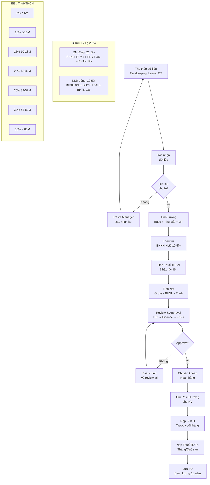

# HR02 — Tiền Lương & Phúc Lợi (Compensation & Benefits)

> **Tiền lương & Phúc lợi** là toàn bộ giá trị tài chính và phi tài chính mà doanh nghiệp trao cho người lao động để đổi lấy đóng góp của họ — bao gồm lương cơ bản, phụ cấp, thưởng, bảo hiểm, và các phúc lợi khác — được thiết kế để thu hút, giữ chân và tạo động lực làm việc.

---

## 01. Tổng Quan & Định Nghĩa

### 1.1 Total Rewards Framework

**Total Rewards** (Tổng đãi ngộ) gồm 5 nhóm:

| Nhóm | Thành phần | Ví dụ VN |
|---|---|---|
| **Compensation** | Base salary, allowances, overtime | Lương cơ bản + phụ cấp |
| **Benefits** | Insurance, leave, retirement | BHXH, bảo hiểm sức khỏe bổ sung |
| **Work-Life** | Flexibility, leave, wellness | Hybrid, nghỉ phép thêm |
| **Performance & Recognition** | Bonus, awards, promotion | Thưởng KPI, tăng lương |
| **Development** | Training, career path, coaching | Ngân sách học tập |

### 1.2 Direct vs. Indirect Compensation

```
Total Compensation
├── Direct Compensation
│   ├── Base Salary (Lương cơ bản)
│   ├── Allowances (Phụ cấp)
│   ├── Short-term Incentives (Thưởng KPI, Tết)
│   └── Long-term Incentives (ESOP, phantom shares)
└── Indirect Compensation (Benefits)
    ├── Legally Required (BHXH, BHYT, BHTN)
    ├── Voluntary Benefits (bảo hiểm bổ sung, xe công ty)
    └── Non-monetary (flexible work, culture, career)
```

### 1.3 Tầm Quan Trọng Chiến Lược

- Chi phí lương thường chiếm **50-70% total operating cost** tại doanh nghiệp dịch vụ VN
- Lương là yếu tố **giữ chân #1** theo Navigos Survey 2023 (60% rời công ty vì lương)
- Thiết kế lương sai → **inequity** → demotivation (Adams' Equity Theory)
- **Pay transparency** xu hướng 2024-2026: ngày càng nhiều ứng viên kỳ vọng công khai salary range

---

## 02. Nguyên Lý Cơ Bản

### 2.1 Equity Theory (Adams, 1963)

```
Input/Output ratio của tôi = Input/Output ratio của người tham chiếu
Nếu không cân bằng → Cảm giác bất công → Giảm effort hoặc nghỉ việc
```

**Internal Equity:** Lương công bằng giữa các vị trí trong cùng công ty
**External Equity:** Lương cạnh tranh so với thị trường
**Individual Equity:** Lương phản ánh đúng hiệu suất cá nhân

### 2.2 Motivation & Pay (Herzberg Two-Factor Theory)

- Lương là **Hygiene Factor**: Nếu quá thấp → Bất mãn; Đủ tốt → Không còn là động lực
- **Motivators thực sự:** Thành tựu, công nhận, trách nhiệm, phát triển
- **Bài học:** Lương cần đủ cạnh tranh, nhưng chỉ lương không giữ được nhân tài dài hạn

### 2.3 Pay Philosophy (Triết lý lương)

| Vị thế | Mô tả | Phù hợp |
|---|---|---|
| Lead the market (P75+) | Trả cao hơn thị trường | Startup tech, war-for-talent |
| Match the market (P50) | Ngang thị trường | Phổ biến nhất |
| Lag the market (P25-P50) | Thấp hơn thị trường | Bù bằng mission, culture |
| Mix strategy | Lead cho vị trí critical, lag cho support | Tập đoàn lớn |

---

## 03. Khung Pháp Lý

### 3.1 BLLĐ 45/2019/QH14 — Các điều khoản tiền lương

**Điều 90 — Tiền lương:**
- Lương do hai bên thỏa thuận trong HĐLĐ
- Phải trả đúng hạn, đúng mức, đúng hình thức
- Không được thấp hơn lương tối thiểu vùng

**Điều 91 — Mức lương tối thiểu:**
- Là mức sàn thấp nhất
- Điều chỉnh dựa trên: CPI, tăng trưởng GDP, cung cầu lao động, mức sống

**Điều 95 — Nguyên tắc trả lương:**
- Trả bằng tiền mặt hoặc chuyển khoản (có thỏa thuận)
- Ít nhất 1 lần/tháng (hoặc nửa tháng nếu thỏa thuận)
- Trả đúng nơi làm việc (hoặc địa điểm khác nếu thỏa thuận)

**Điều 96 — Kỳ trả lương:**
- Theo giờ/ngày/tuần: Trả sau mỗi giờ, ngày, tuần (hoặc gộp, không quá 15 ngày)
- Theo tháng: Trả tháng sau hoặc nửa tháng sau (không quá 16 ngày)
- Theo sản phẩm/khoán: Theo thỏa thuận

**Điều 97 — Làm thêm giờ:**
- Ngày thường: ≥ 150% lương giờ
- Ngày nghỉ hàng tuần: ≥ 200% lương giờ
- Ngày nghỉ lễ, tết, nghỉ có hưởng lương: ≥ 300% lương giờ

**Điều 104 — Thưởng:**
- Do người SDLĐ quyết định căn cứ kết quả sản xuất kinh doanh
- Phải thông báo công khai tại nơi làm việc
- Không bắt buộc theo luật (nhưng thưởng Tết là thông lệ thị trường)

**Điều 46-48 — Trợ cấp thôi việc và mất việc:**
- Thôi việc: 1/2 tháng lương × số năm làm việc (tính từ 2009 trở đi hoặc từ ngày vào làm nếu sau 2009)
- Mất việc: 1 tháng lương × số năm làm việc (do thay đổi cơ cấu)

### 3.2 Lương Tối Thiểu Vùng 2024

Theo NĐ 74/2024/NĐ-CP (hiệu lực 1/7/2024):

| Vùng | Mức lương tối thiểu/tháng | Tăng so với 2023 |
|---|---|---|
| **Vùng I** (HN nội thành, HCM, Bình Dương, Đồng Nai, BR-VT, Hải Phòng nội thành) | **4.960.000đ** | +6,0% |
| **Vùng II** (HN ngoại thành, HCM ngoại thành, các tỉnh quanh HN/HCM) | **4.410.000đ** | +6,0% |
| **Vùng III** (Các tỉnh thành loại khác) | **3.860.000đ** | +6,0% |
| **Vùng IV** (Còn lại) | **3.450.000đ** | +6,0% |

> **Lưu ý:** Số liệu trên là cập nhật theo NĐ 74/2024. Một số tài liệu vẫn dùng mức cũ NĐ 38/2022 (Vùng I: 4.680.000đ). Luôn kiểm tra NĐ mới nhất hiệu lực tại thời điểm áp dụng.

**Lương tối thiểu theo giờ 2024:**
- Vùng I: 23.800đ/giờ
- Vùng II: 21.200đ/giờ
- Vùng III: 18.600đ/giờ
- Vùng IV: 16.600đ/giờ

### 3.3 Bảo Hiểm Bắt Buộc

**Tỷ lệ đóng BHXH, BHYT, BHTN (2024):**

| Loại | Doanh nghiệp | Người lao động | Tổng |
|---|---|---|---|
| BHXH | 17,5% | 8% | 25,5% |
| BHYT | 3% | 1,5% | 4,5% |
| BHTN | 1% | 1% | 2% |
| **Tổng** | **21,5%** | **10,5%** | **32%** |

> **Lưu ý BHXH (17,5% DN):**
> - Ốm đau, thai sản: 3% (toàn bộ do DN đóng)
> - TNLĐ, Bệnh nghề nghiệp: 0,5% (DN đóng)
> - Hưu trí, tử tuất: 14% (DN đóng)

**Mức đóng thực tế:**
- Đóng trên lương ghi trong HĐLĐ (không phải total income)
- Trần đóng BHXH: 20 × mức lương cơ sở = 20 × 2.340.000 = **46.800.000đ/tháng** (2024)
- Mức lương cơ sở 2024: 2.340.000đ (tăng từ 1/7/2024)

**Ví dụ tính BHXH nhân viên lương 25 triệu:**

```
Lương HĐLĐ: 25.000.000đ

BHXH NLĐ đóng:
  BHXH:  8%   × 25.000.000 = 2.000.000đ
  BHYT:  1,5% × 25.000.000 =   375.000đ
  BHTN:  1%   × 25.000.000 =   250.000đ
  Tổng khấu trừ NLĐ:          2.625.000đ

BHXH DN đóng (chi phí thêm):
  BHXH:  17,5% × 25.000.000 = 4.375.000đ
  BHYT:  3%    × 25.000.000 =   750.000đ
  BHTN:  1%    × 25.000.000 =   250.000đ
  Tổng DN đóng:               5.375.000đ

Tổng chi phí lao động/tháng = 25.000.000 + 5.375.000 = 30.375.000đ
```

---

## 04. Cấu Trúc Lương Tại Việt Nam

### 4.1 Salary Structure Điển Hình

```
TỔNG THU NHẬP (Gross Income)
├── Lương cơ bản (Basic Salary)
│   └── Thường = 60-70% total gross (để tính BHXH hợp lý)
├── Phụ cấp (Allowances)
│   ├── Phụ cấp đi lại: 500K - 2M/tháng
│   ├── Phụ cấp ăn trưa: 730K max (miễn thuế TNCN theo TT 36/2021)
│   ├── Phụ cấp điện thoại: 500K - 1M/tháng
│   ├── Phụ cấp nhà ở: varies
│   ├── Phụ cấp chức vụ: varies by grade
│   └── Phụ cấp thâm niên: 1-3% lương/năm thâm niên
├── Thưởng ngắn hạn (STI)
│   ├── Thưởng KPI tháng/quý
│   └── Thưởng Tết (13th month salary - thông lệ)
└── Thưởng dài hạn (LTI)
    ├── ESOP (Employee Stock Ownership Plan)
    └── Phantom shares / Cash LTI
```

### 4.2 Phụ Cấp Không Chịu Thuế TNCN

Theo Thông tư 111/2013/TT-BTC và các văn bản sửa đổi:

| Phụ cấp | Mức miễn thuế | Điều kiện |
|---|---|---|
| Ăn giữa ca | ≤ 730.000đ/tháng | Trả bằng tiền mặt |
| Ăn giữa ca (hiện vật) | Toàn bộ | Bữa ăn tập thể hoặc phiếu ăn |
| Đồng phục (tiền mặt) | ≤ 5.000.000đ/năm | |
| Điện thoại | Phần phục vụ công việc | Cần chứng minh |
| Xăng xe | Theo thực tế phát sinh | Cần hóa đơn |
| Nhà ở do DN trả | ≤ 15% tổng thu nhập chịu thuế | |
| Học phí con em | Mầm non đến THPT tại VN | |

### 4.3 Gross vs. Net — Cách Tính

**Công thức Net từ Gross:**
```
Net = Gross - BHXH NLĐ - Thuế TNCN

Bước 1: Tính thu nhập chịu thuế
  Thu nhập chịu thuế = Gross - BHXH NLĐ - Phụ cấp miễn thuế
  = Gross - 10,5% × Lương HĐLĐ - Phụ cấp miễn thuế

Bước 2: Tính thu nhập tính thuế
  Thu nhập tính thuế = Thu nhập chịu thuế - Giảm trừ gia cảnh bản thân
                                           - Giảm trừ người phụ thuộc
  = TNCT - 11.000.000 - (4.400.000 × số NPT)

Bước 3: Tra biểu thuế TNCN lũy tiến → Thuế TNCN
Bước 4: Net = Gross - BHXH NLĐ - Thuế TNCN
```

---

## 05. Thuế Thu Nhập Cá Nhân (TNCN)

### 5.1 Biểu Thuế TNCN Lũy Tiến (7 Bậc)

| Bậc | Thu nhập tính thuế/tháng | Thuế suất | Thuế tính nhanh |
|---|---|---|---|
| 1 | Đến 5 triệu | 5% | Thu nhập × 5% |
| 2 | Trên 5 – 10 triệu | 10% | Thu nhập × 10% - 250.000đ |
| 3 | Trên 10 – 18 triệu | 15% | Thu nhập × 15% - 750.000đ |
| 4 | Trên 18 – 32 triệu | 20% | Thu nhập × 20% - 1.650.000đ |
| 5 | Trên 32 – 52 triệu | 25% | Thu nhập × 25% - 3.250.000đ |
| 6 | Trên 52 – 80 triệu | 30% | Thu nhập × 30% - 5.850.000đ |
| 7 | Trên 80 triệu | 35% | Thu nhập × 35% - 9.850.000đ |

### 5.2 Giảm Trừ Gia Cảnh

- Bản thân: **11.000.000đ/tháng** (132 triệu/năm)
- Người phụ thuộc: **4.400.000đ/người/tháng**
  - Điều kiện NPT: Con <18 tuổi; Con ≥18 bị tàn tật; Bố mẹ thu nhập thấp; Vợ/chồng thu nhập thấp...

### 5.3 Ví Dụ Tính Thuế TNCN Chi Tiết

**Nhân viên: Gross 35 triệu, 1 người phụ thuộc, lương HĐLĐ 28 triệu**

```
Bước 1 — BHXH NLĐ:
  BHXH:  8%   × 28M = 2.240.000đ
  BHYT:  1,5% × 28M =   420.000đ
  BHTN:  1%   × 28M =   280.000đ
  Tổng BHXH NLĐ:      2.940.000đ

Bước 2 — Phụ cấp miễn thuế (ăn trưa 730K, xăng xe 1M):
  Miễn thuế: 730.000 + 1.000.000 = 1.730.000đ

Bước 3 — Thu nhập chịu thuế:
  TNCT = 35.000.000 - 2.940.000 - 1.730.000 = 30.330.000đ

Bước 4 — Giảm trừ gia cảnh:
  Bản thân:       11.000.000đ
  NPT (1 người):   4.400.000đ
  Tổng giảm trừ: 15.400.000đ

Bước 5 — Thu nhập tính thuế:
  TNTT = 30.330.000 - 15.400.000 = 14.930.000đ

Bước 6 — Thuế TNCN (bậc 3: trên 10-18 triệu):
  Thuế = 14.930.000 × 15% - 750.000 = 2.239.500 - 750.000 = 1.489.500đ

Bước 7 — Net:
  Net = 35.000.000 - 2.940.000 - 1.489.500 = 30.570.500đ
```

### 5.4 Quyết Toán Thuế TNCN

- Deadline quyết toán: **31/3 năm sau** cho cá nhân; **31/3** cho tổ chức khấu trừ
- Ủy quyền quyết toán: NLĐ có thể ủy quyền cho DN quyết toán thay
- Hoàn thuế: Nếu khấu trừ nhiều hơn số phải nộp
- Nộp thêm: Nếu khấu trừ chưa đủ (thường do có nhiều nguồn thu nhập)

---

## 06. Payroll Processing (Quy Trình Tính Lương)

### 6.1 Payroll Cycle Chuẩn

```
TIMELINE THÁNG:

Ngày 1-25:    Thu thập dữ liệu chấm công
Ngày 26-27:   Tổng hợp, kiểm tra dữ liệu
Ngày 27-28:   Tính lương, phụ cấp, khấu trừ
Ngày 28-29:   Review và approval (HR → Finance → CFO)
Ngày 29-30:   Upload file chuyển khoản ngân hàng
Ngày 30/31:   Nhân viên nhận lương
Ngày 1-5/tháng sau: Nộp BHXH, thuế TNCN
```

### 6.2 Dữ Liệu Đầu Vào Tính Lương

| Dữ liệu | Nguồn | Người phụ trách |
|---|---|---|
| Timekeeping (chấm công) | Máy chấm công, app, timesheet | Manager xác nhận |
| Ngày nghỉ (phép, lễ, ốm) | HR system, đơn xin phép | HR |
| Overtime | Bảng OT được duyệt | Manager + HR |
| New hire / Termination | HĐLĐ, quyết định | HR |
| Salary change | Quyết định tăng lương | HR/C&B |
| Allowance change | Quy chế lương | C&B |
| Advance (tạm ứng) | Đơn tạm ứng được duyệt | Finance |
| Deduction (khấu trừ) | Quyết định kỷ luật, hợp đồng vay | HR/Finance |

### 6.3 Bảng Lương Mẫu

```
BẢNG LƯƠNG THÁNG [MM/YYYY] — BỘ PHẬN: [Tên BP]

STT | Họ tên | HĐLĐ | Ngày công | Lương cơ bản | Phụ cấp | OT | Gross | BHXH NLĐ | Thuế TNCN | Tạm ứng | NET
----|--------|------|-----------|--------------|---------|----|----|---------|-----------|---------|----
001 | Nguyễn A | 28.000.000 | 22/22 | 28.000.000 | 2.730.000 | 0 | 30.730.000 | 2.940.000 | 1.489.500 | 0 | 26.300.500
002 | Trần B   | 20.000.000 | 20/22 | 18.181.818 | 2.230.000 | 0 | 20.411.818 | 2.100.000 | 530.000 | 2.000.000 | 15.781.818
```

### 6.4 Tính Lương Ngày Công

```
Công thức phổ biến nhất tại VN:
Lương ngày = Lương tháng / 26 (hoặc 24 hoặc số ngày công thực tế tháng đó)

Lưu ý: Không có quy định bắt buộc về mẫu số (26, 24, hay thực tế)
→ Cần ghi rõ trong quy chế lương công ty

Ví dụ (26 ngày):
Lương tháng: 20.000.000đ
Ngày công thực tế: 20/22 ngày làm việc
Lương thực = 20.000.000 / 26 × 20 = 15.384.615đ

Hoặc theo tỷ lệ:
Lương thực = 20.000.000 × (20/22) = 18.181.818đ
```

---

## 07. Pay Structure (Cấu Trúc Dải Lương)

### 7.1 Pay Grades & Pay Ranges

**Thiết kế Pay Structure:**

```
Grade/Band → Minimum → Midpoint → Maximum

Band A (Entry):     8M    →   12M   →   16M
Band B (Junior):   14M    →   20M   →   26M
Band C (Mid):      22M    →   32M   →   42M
Band D (Senior):   35M    →   52M   →   70M
Band E (Lead):     55M    →   80M   →  110M
Band F (Manager):  80M    → 120M   →  160M
Band G (Director): 130M  → 200M   →  280M
```

**Nguyên tắc thiết kế:**
- Range spread: (Max - Min) / Min = thường 50-80%
- Midpoint progression: 15-20% giữa các grade liền kề
- Overlap giữa các grade: 50-80% (cho phép senior của grade thấp nhận cao hơn junior grade cao)

### 7.2 Compa-Ratio

```
Compa-Ratio = Lương thực tế / Midpoint của Grade × 100%

< 80%:  New hire hoặc underperformer — cần action
80-95%: Developing — đang build skills
95-105%: Fully competent — on target
105-115%: High performer — trả thêm vì performance
> 115%: Red circle — cẩn thận, lương đã vượt max range
```

**Ứng dụng:**
- Compa-ratio trung bình toàn công ty < 100%: Có thể trả thêm cho high performers
- Compa-ratio > 110%: Freeze tăng lương, tập trung bonus thay vì base

### 7.3 Merit Increase Matrix

| Performance Rating | Compa-Ratio <80% | 80-95% | 95-105% | 105-115% | >115% |
|---|---|---|---|---|---|
| 5 - Outstanding | 8-10% | 6-8% | 5-7% | 3-5% | 0-2% |
| 4 - Exceeds | 6-8% | 5-6% | 4-5% | 2-3% | 0% |
| 3 - Meets | 4-6% | 3-4% | 2-3% | 0-1% | 0% |
| 2 - Below | 0-2% | 0% | 0% | 0% | 0% |
| 1 - Unsatisfactory | 0% | 0% | 0% | 0% | 0% |

---

## 08. Salary Benchmarking

### 8.1 Nguồn Dữ Liệu Benchmarking tại VN

| Nguồn | Chi phí | Dữ liệu | Độ tin cậy |
|---|---|---|---|
| Mercer Total Remuneration Survey | $3,000-8,000/năm | MNC, đa ngành, chi tiết | Cao nhất |
| Willis Towers Watson (WTW) | $2,000-6,000/năm | MNC | Cao |
| Navigos Annual Salary Report | Miễn phí (báo cáo tổng) | VN market | Trung bình-Cao |
| ITviec Salary Survey | Miễn phí | IT chuyên biệt | Cao cho IT |
| TopCV Salary Insight | Miễn phí | Mid-level, đa ngành | Trung bình |
| VietnamSalary.com | Miễn phí | User-reported | Thấp (self-reported) |
| LinkedIn Salary Insights | Freemium | Professional level | Trung bình |

### 8.2 Phương Pháp Benchmarking

**Bước 1 — Job Matching:**
- Match job by function và level, không phải tên vị trí
- Ví dụ: "Software Engineer Level 3" của Mercer ≈ "Mid Java Developer" công ty bạn

**Bước 2 — Chọn Market Reference:**
- Industry peer: So sánh đúng ngành (IT so với IT, không so với banking)
- Size peer: Doanh nghiệp cùng quy mô (revenue, headcount)
- Geographic: HCM vs. HN có chênh lệch 5-15%

**Bước 3 — Phân tích percentile:**
```
P25: Bottom quartile — thấp hơn 75% thị trường
P50: Median — ngang thị trường
P75: Top quartile — cao hơn 75% thị trường
```

**Bước 4 — So sánh Total Cash:**
```
Total Cash = Base Salary + Fixed Allowance + Variable Bonus (target)

Không chỉ so base salary!
Ví dụ: Công ty A base 20M nhưng tổng TC 28M (bonus 40%)
        Công ty B base 25M nhưng tổng TC 27M (bonus 8%)
→ Công ty A thực ra cạnh tranh hơn
```

---

## 09. Variable Pay & Incentives

### 9.1 Short-Term Incentive (STI) Design

**Công thức STI phổ biến:**
```
STI Payout = Target Bonus × Performance Multiplier

Target Bonus = % lương năm (thường 10-30% cho mid-level, 30-100% cho senior)
Performance Multiplier = f(KPI achievement)

Ví dụ:
  KPI đạt <70%:     Multiplier = 0 (no bonus)
  KPI 70-85%:       Multiplier = 0.5
  KPI 85-100%:      Multiplier = 1.0
  KPI 100-120%:     Multiplier = 1.3
  KPI >120%:        Multiplier = 1.5 (capped)
```

### 9.2 Thưởng Tết (13th Month Salary)

- Không bắt buộc theo luật nhưng là **thông lệ bắt buộc** tại VN
- Thường = 1 tháng lương cơ bản (minimum market expectation)
- Trả trước Tết Nguyên Đán 1-2 tuần
- Nhiều công ty tốt: 2-3 tháng lương, hoặc liên kết KPI

**Điều 104 BLLĐ:** "Thưởng là số tiền hoặc tài sản hoặc bằng các hình thức khác mà người sử dụng lao động thưởng cho người lao động..."

**Tác động retention:** Nhân viên thường không nghỉ trước Tết để nhận thưởng, nhưng nghỉ nhiều sau Tết (January effect, hay ở VN: "sau nghỉ Tết xin nghỉ việc").

### 9.3 Phân Phối Bonus Pool

**Phương pháp phân phối:**

```
Total Bonus Pool (từ P&L) → Phân bổ cho từng BU/Phòng → Phân bổ cá nhân

Phân bổ cá nhân:
  Cách 1 (% đều): Mọi người đều × % như nhau
  Cách 2 (Merit-based): Dựa trên performance rating
  Cách 3 (Hybrid): Base đều + Merit phần bonus thêm

Ví dụ Merit-based phân bổ:
  Pool phòng: 300 triệu, 10 người
  Rating 5 (2 người): × 1.5 → Mỗi người: 30M × 1.5 = 45M
  Rating 4 (3 người): × 1.2 → Mỗi người: 30M × 1.2 = 36M
  Rating 3 (4 người): × 1.0 → Mỗi người: 30M × 1.0 = 30M
  Rating 2 (1 người): × 0.5 → Mỗi người: 30M × 0.5 = 15M
  
  Tổng: 2×45 + 3×36 + 4×30 + 1×15 = 90+108+120+15 = 333M ≠ 300M
  → Cần normalize: × (300/333) để đúng pool
```

---

## 10. Benefits (Phúc Lợi)

### 10.1 Mandatory Benefits (Bắt Buộc Theo Luật)

| Phúc lợi | Quy định | Mức |
|---|---|---|
| BHXH bắt buộc | BLLĐ + Luật BHXH 58/2014 | 25,5% (DN 17,5% + NLĐ 8%) |
| BHYT bắt buộc | Luật BHYT | 4,5% (DN 3% + NLĐ 1,5%) |
| BHTN | Luật Việc làm | 2% (DN 1% + NLĐ 1%) |
| Nghỉ phép năm | Điều 113 BLLĐ | ≥12 ngày/năm (14 ngày nếu công việc nặng nhọc) |
| Nghỉ lễ tết | Điều 112 BLLĐ | 11 ngày/năm |
| Nghỉ thai sản | Điều 139 BLLĐ | 6 tháng (lao động nữ) |
| Nghỉ ốm | Luật BHXH | 30-40 ngày/năm (tùy thâm niên) |

### 10.2 Voluntary Benefits (Phúc Lợi Tự Nguyện)

**Tier 1 — Phổ biến tại SME VN:**
- Bảo hiểm tai nạn 24/7 (24/24): 300K-800K/người/năm
- Khám sức khỏe định kỳ hàng năm: 500K-2M/người
- Ăn trưa (canteen hoặc phiếu ăn): 50K-80K/ngày
- Team building: 1-2 lần/năm

**Tier 2 — Phổ biến tại Mid-size:**
- Bảo hiểm sức khỏe bổ sung (Health Insurance): 3-8M/người/năm
  - Nội trú bệnh viện, ngoại trú, nha khoa, thai sản
  - Top providers VN: Prudential, Manulife, AIA, Bảo Việt, PVI
- Xe công ty hoặc phụ cấp xăng xe
- Vay nội bộ lãi suất thấp (máy tính, xe máy)
- Câu lạc bộ thể thao (gym, yoga)

**Tier 3 — MNC & Tập đoàn lớn:**
- ESOP (Employee Stock Option Plan)
- Xe công ty + tài xế (Director level)
- Nhà ở (housing allowance, nhà công vụ)
- Học bổng con em
- Flexible benefits / Cafeteria plan
- Retirement plan bổ sung (voluntary pension)

### 10.3 ESOP tại Việt Nam

**Khái niệm:** Công ty phát hành cổ phần cho nhân viên theo điều kiện nhất định (thường: vesting period, performance conditions).

**Cấu trúc ESOP phổ biến VN:**

```
Grant Price: Giá ưu đãi (thường thấp hơn market 20-50%)
Vesting Schedule: Lịch quyền nhận cổ phần
  Ví dụ 4-year cliff vesting:
  Năm 1: 0% (cliff)
  Năm 2: 25% unlock
  Năm 3: 50% unlock
  Năm 4: 100% unlock

Exercise: Nhân viên mua cổ phần tại giá grant
Lock-up: Thường giữ 1-2 năm sau khi nhận
```

**Pháp lý ESOP tại VN:**
- CTCP: Phát hành cổ phần ưu đãi cho NLĐ, cần ĐHCĐ thông qua
- Thuế TNCN: Chênh lệch (market price - grant price) chịu thuế TNCN khi exercise
- Luật CK 54/2019: ESOP của công ty đại chúng cần báo cáo SSC

---

## 11. Payroll Software tại Việt Nam

### 11.1 So Sánh Phần Mềm Lương VN

| Phần mềm | Phù hợp | Chi phí | Điểm mạnh |
|---|---|---|---|
| **MISA HRM** | SME VN | 5-30M/năm | Tích hợp kế toán MISA, phổ biến nhất |
| **Fast HR** | SME-Mid VN | 10-40M/năm | Giao diện VN, dễ dùng |
| **1C:HRM** | Mid-Large VN | 50-200M | ERP đầy đủ, flexible |
| **SAP HCM / SAP SuccessFactors** | Large, MNC | $50K+/năm | Enterprise grade, global |
| **Workday HCM** | MNC | $100K+/năm | Global leader, strong analytics |
| **BambooHR** | SME global | $8-12/user/tháng | User friendly, all-in-one |
| **BIPO** | SME-Mid ASEAN | Liên hệ | Multi-country payroll, VN localised |
| **OrangeHRM** | Mọi quy mô | Free/Enterprise | Open source |

### 11.2 Quy Trình Integration Payroll

```
Timekeeping System → HR System → Payroll Engine → Bank Transfer
     (Máy chấm công)    (HRIS)        (MISA/SAP)      (Internet Banking)

Dữ liệu chuyển:          Validation:              Output:
- Giờ vào/ra             - Giờ công đúng không    - File bảng lương
- Nghỉ phép              - Lương đúng grade        - File nộp BHXH (mẫu D02-LT)
- OT approved            - Thuế đúng               - File chuyển khoản
- New/Term               - BHXH đúng mức           - Phiếu lương
```

---

## 12. Compensation Analytics

### 12.1 Key C&B Metrics

| Metric | Công thức | Benchmark |
|---|---|---|
| Payroll as % Revenue | Total payroll / Revenue × 100 | Dịch vụ: 30-50%; SX: 15-25% |
| Average Salary Increase | Tăng lương trung bình % | VN 2023: 8-12% |
| Benefits Cost per Employee | Total benefits / Headcount | 20-35% of base |
| Compa-Ratio Average | Avg salary / Avg midpoint | Target: 95-105% |
| Pay Equity Ratio | Lương cao nhất / Thấp nhất cùng grade | Nên <1.5 |
| Turnover by Pay Band | Turnover rate theo grade | Alert nếu >25% |

### 12.2 Pay Equity Analysis

**Gender Pay Gap phân tích:**
```
Unadjusted Gap = (Avg male salary - Avg female salary) / Avg male salary
Adjusted Gap = Sau khi kiểm soát role, experience, performance

VN context:
- Theo ILO 2022: VN gender pay gap ~13% (unadjusted)
- Adjusted gap thấp hơn đáng kể
- BLLĐ Điều 90: Bình đẳng về tiền lương không phân biệt giới tính
```

---

## 13. Quản Lý Chi Phí Lao Động

### 13.1 Labor Cost Analysis

**Total Labor Cost (TLC):**
```
TLC = Base Salary + Allowances + Variable Pay + Benefits + BHXH DN + Other

Ví dụ nhân viên lương 25 triệu:
  Base:          25.000.000đ
  Allowances:     3.000.000đ
  Variable (est): 2.500.000đ  (10% target bonus)
  BHXH DN:        5.375.000đ
  Health Ins:     500.000đ    (41.667đ/tháng nếu 500K/năm)
  Other:          300.000đ
  ─────────────────────────
  TLC/tháng:    36.675.000đ  (~147% of base)
```

### 13.2 FTE vs. Contractor vs. Outsource — Chi Phí So Sánh

| Loại | Chi phí | Linh hoạt | Kiểm soát | Phù hợp |
|---|---|---|---|---|
| Full-time Employee | Cao (TLC ~140-150% base) | Thấp | Cao | Core function, long-term |
| Contractor (freelance) | Trung bình (không BHXH, ít benefits) | Cao | Trung bình | Project-based, seasonal |
| Outsource (BPO) | Thấp-Trung bình (economies of scale) | Cao | Thấp | Non-core, standard process |
| Temp staffing | Trung bình | Rất cao | Thấp | Peak demand, short-term |

---

## 14. Lương & Luật Pháp — Compliance Checklist

### 14.1 Monthly Compliance Checklist

```
[ ] Lương trả đúng hạn theo HĐLĐ
[ ] Lương ≥ Lương tối thiểu vùng (kể cả thời gian thử việc × 85%)
[ ] OT được tính đúng: 150%/200%/300%
[ ] Nộp BHXH trước ngày cuối tháng
[ ] Nộp thuế TNCN theo kỳ (tháng hoặc quý)
[ ] Phiếu lương gửi cho nhân viên (bằng văn bản hoặc điện tử)
[ ] Bảng lương lưu trữ đúng quy định (10 năm)
```

### 14.2 Phổ Biến Lỗi Compliance tại VN

| Lỗi | Vi phạm | Hậu quả |
|---|---|---|
| Lương thử việc < 85% | Điều 26 BLLĐ | Phạt 3-5 triệu/người (NĐ 12/2022) |
| OT không đúng tỷ lệ | Điều 97 BLLĐ | Phạt 20-40 triệu |
| Chậm nộp BHXH | Luật BHXH | Lãi suất + phạt |
| Không cấp phiếu lương | Điều 95 BLLĐ | Phạt 1-3 triệu |
| Không đăng ký BHXH cho NLĐ | Luật BHXH | Phạt 12-15% × số tiền chưa nộp |
| Thỏa thuận không đóng BHXH | Luật BHXH | Hợp đồng vô hiệu phần này |

---

## 15. Trợ Cấp Thôi Việc & Mất Việc

### 15.1 Trợ Cấp Thôi Việc (Điều 46 BLLĐ)

**Điều kiện:** NLĐ làm việc đủ 12 tháng trở lên, chấm dứt HĐLĐ đúng quy định

**Công thức:**
```
Trợ cấp thôi việc = 1/2 tháng lương × Số năm làm việc tính trợ cấp

Số năm làm việc tính trợ cấp = Tổng thời gian - Thời gian đã đóng BHTN

Mức lương tính = Bình quân lương 6 tháng cuối theo HĐLĐ
               (gồm lương + phụ cấp lương)

Ví dụ:
  NLĐ làm 7 năm, lương bình quân 6 tháng = 20M
  Đã đóng BHTN: 5 năm
  Số năm tính trợ cấp = 7 - 5 = 2 năm
  Trợ cấp = 1/2 × 20M × 2 = 20.000.000đ
```

### 15.2 Trợ Cấp Mất Việc (Điều 47 BLLĐ)

**Điều kiện:** Do thay đổi cơ cấu, công nghệ hoặc lý do kinh tế

**Công thức:**
```
Trợ cấp mất việc = 1 tháng lương × Số năm làm việc tính trợ cấp
(Tối thiểu = 2 tháng lương)
```

### 15.3 Trợ Cấp Thất Nghiệp (BHTN)

```
Mức hưởng = 60% × Bình quân lương đóng BHTN 6 tháng trước khi thất nghiệp

Thời gian hưởng:
  Đóng 12-35 tháng: 3 tháng
  Đóng 36-71 tháng: 6 tháng
  Đóng 72-107 tháng: 9 tháng
  Đóng ≥108 tháng: 12 tháng (+ mỗi 12 tháng thêm: +1 tháng, tối đa 24 tháng)
```

---

## 16. Flexible & Non-Traditional Benefits

### 16.1 Flexible Benefits / Cafeteria Plan

**Khái niệm:** NLĐ được cấp "credit" và tự chọn benefits phù hợp nhu cầu cá nhân

**Ví dụ credit system:**
```
Mỗi nhân viên: 10.000.000đ/năm benefit credit

Có thể chọn:
- Nâng gói bảo hiểm sức khỏe: 5.000.000đ
- Thêm 5 ngày phép: 3.000.000đ
- Voucher gym: 2.000.000đ
- Training budget: 5.000.000đ
- Travel allowance: 3.000.000đ
```

**Ưu điểm:** Cá nhân hóa, phù hợp diverse workforce
**Nhược điểm:** Phức tạp quản lý, chi phí admin cao
**Tại VN:** Đang áp dụng tại một số MNC (Google, Meta, Unilever)

### 16.2 Wellbeing Benefits (Xu Hướng 2024+)

- **Mental Health:** Số ngày "mental health day", app meditation (Calm, Headspace)
- **Financial Wellness:** Workshop quản lý tài chính cá nhân, vay ưu đãi
- **Physical Wellness:** Gym allowance, khám sức khỏe premium
- **Social:** Team budget, club activities, volunteering days

---

## 17. Case Study: Vingroup ESOP Scheme

### Bối Cảnh
Vingroup triển khai chương trình ESOP từ 2016-2019 cho cán bộ chủ chốt tại Vinmec, Vinhomes, VinFast và các công ty thành viên. Đây là một trong những ESOP quy mô lớn nhất VN.

### Cấu Trúc ESOP Vingroup

**Đối tượng:** C-level, Director, Manager cấp cao có đóng góp chiến lược

**Grant price:** Giá ưu đãi thấp hơn thị trường 20-40% tại thời điểm grant

**Vesting điều kiện:**
- Tiếp tục làm việc đủ vesting period (3-5 năm)
- Đạt KPI cá nhân và BU targets
- Không vi phạm nội quy, bảo mật

**Kết quả quan sát:**

| Chỉ tiêu | Trước ESOP | Sau ESOP 3 năm |
|---|---|---|
| Turnover senior level | ~18%/năm | ~8%/năm |
| Candidate attraction | Khó tuyển C-level | Tăng ứng viên senior |
| Alignment với cổ đông | Trung bình | Cao hơn đáng kể |
| Phàn nàn về lương | Phổ biến | Giảm (total comp hấp dẫn) |

### Bài Học

1. **ESOP giữ chân** hiệu quả nhất khi kết hợp với vesting dài (3-5 năm)
2. **Điều kiện performance** trong ESOP tránh giữ người kém hiệu suất
3. **Thông tin rõ ràng** về cơ chế tính toán giá trị ESOP là rất quan trọng
4. **Rủi ro:** Nếu cổ phiếu mất giá, ESOP mất tác dụng giữ chân (VN thị trường chứng khoán biến động)
5. **Phức tạp pháp lý:** Cần tư vấn pháp lý cho phần thuế TNCN khi exercise

---

## 18. Lương Thưởng cho Sales Force

### 18.1 Commission Structure

**Straight Commission:**
```
Thu nhập = Doanh số × Commission rate
Ưu: Incentivize mạnh | Nhược: Thu nhập bất ổn, ko phù hợp VN (NLĐ cần ổn định)
```

**Salary + Commission (phổ biến nhất VN):**
```
Thu nhập = Base Salary (60-70%) + Commission (30-40%)

Ví dụ Real Estate Agent VN:
  Base: 8.000.000đ/tháng
  Commission rate: 0.15% giá trị giao dịch
  Deal 2 tỷ: Commission = 3.000.000đ
  Tháng bán 3 căn: Total = 8M + 9M = 17.000.000đ
```

**Tiered Commission (progressive):**
```
Doanh số 0-80% target: 2% commission
Doanh số 80-100% target: 3% commission  
Doanh số 100-120% target: 4% commission
Doanh số >120% target: 5% commission
```

### 18.2 Sales Compensation Design Principles

1. **Keep it simple:** NLĐ phải tự tính được thu nhập
2. **Line of sight:** NLĐ phải thấy connection giữa effort → doanh số → commission
3. **Pay at risk:** Phần variable nên 20-40% total comp (không quá cao gây bất ổn)
4. **Cap or no cap:** Cap bảo vệ công ty nhưng demotivate top performers → Cân nhắc

---

## 19. C&B trong Các Ngành Đặc Thù

### 19.1 Sản Xuất / Manufacturing

**Đặc điểm lương:**
- Nhiều ca làm việc (3 ca/ngày) → OT và phụ cấp ca đêm (20% thêm theo luật)
- Lương theo sản phẩm (piece rate) hoặc theo ca
- Phụ cấp độc hại, nguy hiểm: 5-10% lương cơ bản
- Turnover cao → cần thiết kế thưởng chuyên cần (attendance bonus)

**Phụ cấp đặc thù:**
```
Ca đêm (22h-6h): +30% lương giờ bình thường
Làm thêm ca đêm ngày thường: 150% × 130% = 195%
Làm thêm ca đêm ngày nghỉ lễ: 300% × 130% = 390%
```

### 19.2 Ngân Hàng & Tài Chính

**Đặc điểm:**
- KPI-linked bonus rất cao (50-200% base)
- Teller/Customer Service: Base ổn định + bonus nhỏ
- Banker/RM: Base + deal-based bonus
- Management: Base + AUM/Revenue bonus

**Benchmark VN Banking 2024 (monthly gross):**
- Teller/CS: 10-16 triệu
- Credit Officer: 18-30 triệu
- Relationship Manager: 25-50 triệu + bonus deal
- Branch Manager: 40-80 triệu + bonus

---

## 20. Xu Hướng C&B Tại VN 2024-2026

### 20.1 Pay Transparency

- Thế hệ Z kỳ vọng **salary range** trong JD
- Glassdoor và các platform salary-sharing ngày càng phổ biến
- Rủi ro thiếu transparency: Tăng turnover, giảm trust

### 20.2 Pay Equity & Fairness

- Xu hướng audit lương nội bộ theo gender, tenure, performance
- ILO và các tổ chức quốc tế thúc đẩy gender pay gap reporting
- Một số MNC tại VN bắt đầu công bố gender pay gap report

### 20.3 Total Rewards Communication

- Thay vì chỉ trả lương, cần **communicate total value**
- Total Rewards Statement (TRS): Bản tóm tắt toàn bộ giá trị nhận được
- Tools: BambooHR Compensation Reports, custom Excel/PowerPoint

---

## 21. Cấu Trúc Lương VN Nâng Cao

### 21.1 Salary Compression Analysis

**Compression** xảy ra khi lương nhân viên mới gần bằng nhân viên cũ do tăng lương thị trường nhanh hơn tăng lương nội bộ.

```
Compression Ratio = Lương NV cũ (5 năm) / Lương NV mới hire
Lý tưởng: ≥ 115-120%
Nguy hiểm: < 105% (NV cũ có thể cảm thấy không công bằng)

Giải pháp:
1. Market adjustment review hàng năm
2. "Tăng lương thị trường" riêng biệt với merit increase
3. Tăng tốc career progression cho high performer cũ
```

### 21.2 Phụ Cấp Thâm Niên Design

```
Thâm niên 1-2 năm: +1% lương cơ bản
Thâm niên 3-5 năm: +2% lương cơ bản  
Thâm niên 6-10 năm: +3% lương cơ bản
Thâm niên >10 năm: +5% lương cơ bản

Mục đích: Thưởng loyalty, chống salary compression
Nhược điểm: Trả tiền cho thâm niên thay vì performance
→ Kết hợp: Thâm niên + performance để hiệu quả hơn
```

### 21.3 Tỷ Lệ Fixed/Variable Theo Cấp Bậc

| Cấp bậc | Fixed (%) | Variable (%) | Lý do |
|---|---|---|---|
| Entry/Junior | 90-95% | 5-10% | Cần ổn định, học việc |
| Mid-level | 80-85% | 15-20% | Tăng dần performance link |
| Senior | 70-75% | 25-30% | Có impact trực tiếp |
| Manager | 60-70% | 30-40% | Team và business results |
| Director+ | 50-60% | 40-50% | Strategic accountability |
| C-suite | 40-50% | 50-60% | Company performance |

---

## 22. Salary Review Process

### 22.1 Annual Salary Review Cycle

```
TIMELINE ĐIỂN HÌNH:
  Tháng 10-11: Performance review kết thúc
  Tháng 11:    C&B team phân tích: compa-ratio, market data, budget
  Tháng 11-12: Đề xuất merit increase matrix → CFO approval
  Tháng 12:    Manager recommend cụ thể từng người (trong merit budget)
  Tháng 12-1:  CHRO/CEO approve
  Tháng 1-2:   Thông báo và triển khai lương mới
  Tháng 2-3:   Hiệu lực thường từ 1/1 hoặc 1/2 năm mới
```

### 22.2 Off-Cycle Salary Review

**Khi nào review ngoài chu kỳ:**
- Counter-offer khi nhân viên định nghỉ
- Promotion lên vị trí mới
- Phát hiện pay equity issue
- Thị trường thay đổi đột biến (ví dụ: boom AI làm lương data scientist tăng 30%)

**Counter-offer policy:**
- Tăng lương giữ người chỉ nên làm nếu: Nhân viên genuinely valuable + lương đang dưới market
- Không nên: Nếu lý do nghỉ không phải lương (thì counter-offer không giải quyết vấn đề)

---

## 23. Lương & Hệ Thống Kế Toán

### 23.1 Hạch Toán Chi Phí Lương

**Tài khoản liên quan:**

```
TK 334: Phải trả người lao động
TK 338: Phải trả phải nộp khác (BHXH, BHYT, BHTN, KPCĐ)
TK 622, 623, 627, 641, 642: Chi phí lương theo chức năng

Bút toán tính lương:
  Nợ TK 622/641/642: Tổng chi phí lương (Gross + DN đóng BHXH)
      Có TK 334:      Lương phải trả (Gross)
      Có TK 338.3:    BHXH DN đóng (17.5%)
      Có TK 338.4:    BHYT DN đóng (3%)
      Có TK 338.9:    BHTN DN đóng (1%)

Bút toán trả lương:
  Nợ TK 334:          Gross
      Có TK 338.3/4/9: BHXH NLĐ (10.5%)
      Có TK 333.1:     Thuế TNCN
      Có TK 112:       Net chuyển khoản
```

### 23.2 Chi Phí Lương Được Trừ Thuế TNDN

**Điều kiện để chi phí lương được trừ:**
- Có HĐLĐ hoặc thỏa ước lao động tập thể
- Có chứng từ thanh toán (chuyển khoản hoặc ký nhận tiền mặt)
- Phải thực trả, không chỉ trích lập
- BHXH, BHYT phải đóng đủ

**Các khoản KHÔNG được trừ:**
- Lương lao động chui (không HĐLĐ)
- Lương thực trả < lương trên bảng lương
- Chi phí lương vượt quá mức hợp lý (trường hợp đặc biệt)

---

## 24. BHXH Nâng Cao

### 24.1 Chế Độ Thai Sản

**Lao động nữ:**
- Nghỉ trước sinh: Tối đa 2 tháng
- Nghỉ sau sinh: Tổng thai sản 6 tháng
- Mức hưởng: 100% bình quân lương đóng BHXH 6 tháng trước khi nghỉ
- Trợ cấp một lần: 2 × mức lương cơ sở = 2 × 2.340.000 = 4.680.000đ (2024)

**Lao động nam (Nghỉ hỗ trợ sinh con):**
- Sinh thường: 5 ngày
- Sinh mổ hoặc sinh đôi: 7 ngày
- Sinh đôi mổ: 10 ngày

**Điều kiện hưởng:** Đóng BHXH ≥ 6 tháng trong 12 tháng trước khi sinh.

### 24.2 Chế Độ Hưu Trí

```
Điều kiện 2024 (lộ trình tăng dần):
  Nam: Đủ 61 tuổi + 20 năm đóng BHXH
  Nữ: Đủ 56 tuổi + 20 năm đóng BHXH
  (Tăng 3 tháng/năm đến 62 tuổi Nam, 60 tuổi Nữ vào 2035)

Mức lương hưu:
  = 45% × Bình quân lương đóng BHXH (cho 15 năm đóng đầu)
  + 2%/năm đóng thêm (Nam tối đa 75%, Nữ tối đa 75%)
  
Ví dụ:
  Nam đóng 30 năm, bình quân lương 15 triệu:
  Hưu trí = (45% + 15×2%) × 15M = (45% + 30%) × 15M = 75% × 15M = 11.250.000đ/tháng
```

### 24.3 Báo Tăng/Giảm BHXH

**Mẫu D02-LT:** Danh sách tham gia BHXH, BHYT, BHTN

**Timeline:**
- Tăng: Báo trong tháng đầu tiên (tốt nhất: trong 30 ngày)
- Giảm: Báo trong tháng sau khi nghỉ
- Thay đổi lương: Báo tháng sau khi thay đổi

**Phương thức nộp:**
- Portal BHXH điện tử: baohiemxahoi.gov.vn
- Qua phần mềm dịch vụ: VNPT, Viettel, MISA...
- Trực tiếp tại BHXH quận/huyện

---

## 25. Compensation for Remote & Hybrid Workers

### 25.1 Remote Work Allowance

**Các khoản phụ cấp remote cần xem xét:**
- Internet allowance: 200K-500K/tháng
- Electricity/utility: 300K-1M/tháng (hoặc theo thực tế)
- Home office setup: One-time 3-8 triệu
- Equipment: Laptop, màn hình, headphone

**Taxability:**
- Phụ cấp tiền: Chịu thuế TNCN (trừ phần chứng minh phục vụ công việc)
- Cấp thiết bị (công ty sở hữu): Không chịu thuế

### 25.2 Location-Based Pay

**Quan điểm 1 — Location-adjusted:**
- Nhân viên remote ở tỉnh nhận thấp hơn nhân viên HCM cùng role
- Lý luận: Cost of living thấp hơn
- Rủi ro: Cảm giác bất công, khó recruit talent từ tỉnh nhỏ

**Quan điểm 2 — Role-based (phổ biến hơn tại VN):**
- Cùng role, cùng mức lương bất kể địa điểm
- Lý luận: Cùng contribution, cùng giá trị
- VN: Hầu hết công ty theo quan điểm này

---

## 26. Total Compensation Statement

### 26.1 Thiết Kế TCS

**Mục đích:** Cho nhân viên thấy toàn bộ giá trị họ nhận được (không chỉ lương)

**Cấu trúc TCS:**

```
TOTAL COMPENSATION STATEMENT — [Tên NV] — Năm 2024

TIỀN LƯƠNG TRỰC TIẾP:
  Lương cơ bản:           180.000.000đ/năm
  Phụ cấp cố định:         36.000.000đ/năm
  Thưởng KPI thực nhận:    30.000.000đ
  Thưởng Tết:              15.000.000đ
  ─────────────────────────────────────────
  Tổng tiền lương:        261.000.000đ/năm

BẢOHIỂM & PHÚC LỢI BẮT BUỘC (DN chi):
  BHXH DN (17.5%):         31.500.000đ
  BHYT DN (3%):             5.400.000đ
  BHTN DN (1%):             1.800.000đ
  ─────────────────────────────────────────
  Tổng BH bắt buộc:        38.700.000đ

PHÚC LỢI TỰ NGUYỆN:
  Bảo hiểm sức khỏe bổ sung: 8.000.000đ
  Khám sức khỏe định kỳ:     1.500.000đ
  Team building:              2.000.000đ
  Training budget:            5.000.000đ
  ─────────────────────────────────────────
  Tổng phúc lợi tự nguyện:  16.500.000đ

══════════════════════════════════════════
TỔNG GIÁ TRỊ NHẬN ĐƯỢC:   316.200.000đ/năm
(Tương đương ~26.350.000đ/tháng)
══════════════════════════════════════════
```

---

## 27. Pay for Performance Culture

### 27.1 Strong vs. Weak PfP Culture

| | Strong PfP (Meritocracy) | Weak PfP (Egalitarian) |
|---|---|---|
| Spread bonus | High (Top earner 3-5x bottom) | Low (<1.5x) |
| Base increase | Merit-based, wide range | Uniform % |
| Transparency | Open about criteria | Secretive |
| Message | "Contribution = Reward" | "Fairness = Equal" |
| Risk | Potential conflict if not fair | Low performance accepted |
| Phù hợp VN | Tech, Sales, Finance | Manufacturing, Government-linked |

### 27.2 Building PfP Culture tại VN

**Thách thức văn hóa:**
- "Nể nang" văn hóa → khó chấm điểm thấp cho người thân
- Sợ conflict → manager tránh nói thật với subordinate
- Tập thể hơn cá nhân → chia đều hơn là phân hóa

**Giải pháp:**
- Training manager về performance conversation
- Calibration meeting để normalize ratings
- Anonymous upward feedback giảm thiên kiến
- Clear, measurable KPIs giảm subjectivity

---

## 28. Compensation trong Startup VN

### 28.1 Startup Compensation Strategy

**Giai đoạn Pre-seed/Seed (<20 người):**
- Lương thấp hơn market 20-40%
- Bù bằng: ESOP/phantom shares, learning, impact, flexibility
- Founding team: Equity-heavy, cash-light

**Giai đoạn Series A-B (20-200 người):**
- Cần cạnh tranh hơn để attract talent
- Market match hoặc P60-70
- ESOP pool: 10-15% fully diluted

**Giai đoạn Series C+ (>200 người):**
- Approach như mid-size company
- Cần formal pay structure, grades
- ESOP vẫn quan trọng nhưng giá trị diluted hơn

### 28.2 Phantom Shares (Alternative to ESOP)

**Phù hợp với:** Công ty TNHH chưa muốn chia cổ phần thực

**Cơ chế:**
```
Nhân viên nhận "phantom shares" tương đương X% giá trị công ty
Khi có liquidity event (M&A, IPO):
  Payout = X% × (Valuation lúc đó - Valuation lúc grant)

Ví dụ:
  Grant: 0.5% × valuation 100 tỷ = equivalent 500 triệu
  Exit: Công ty bán giá 500 tỷ
  Payout = 0.5% × (500 - 100) tỷ = 2 tỷ đồng
```

---

## 29. Compensation Communication

### 29.1 Salary Discussion với Nhân Viên

**Best practices:**
- **Proactive communication:** Đừng để nhân viên phải hỏi → dấu hiệu culture xấu
- **Explain the "why":** Tại sao mức tăng là X%, không phải Y%
- **Compare to market:** "Anh/chị đang ở P65 của thị trường..."
- **Total comp view:** Không chỉ nói về base salary

**Câu hỏi khó và cách trả lời:**

"Tại sao tôi tăng ít hơn đồng nghiệp?"
→ "Chúng tôi không chia sẻ lương của người khác. Mức tăng của anh/chị dựa trên [performance rating + compa-ratio + market]. Nếu anh/chị muốn tăng nhanh hơn, hãy cùng thảo luận về mục tiêu..."

"Tôi nhận offer từ công ty khác cao hơn 30%"
→ "Cảm ơn anh/chị chia sẻ. Hãy cho tôi hiểu tổng gói của họ gồm gì. Chúng tôi sẽ xem xét market adjustment trong khả năng của công ty..."

---

## 30. Lương Tối Thiểu & Chính Sách Nhà Nước

### 30.1 Cơ Chế Điều Chỉnh Lương Tối Thiểu VN

**Hội đồng Tiền lương Quốc gia:**
- Thành phần: Bộ LĐTBXH + Tổng Liên đoàn LĐVN + VCCI (đại diện DN)
- Họp định kỳ để đề xuất mức tăng
- Căn cứ: CPI, năng suất lao động, tình hình kinh tế

**Lịch sử điều chỉnh gần đây:**

| Năm | Vùng I (đồng) | Mức tăng |
|---|---|---|
| 2020 | 4.420.000 | +5.5% |
| 2021 | Giữ nguyên | 0% (COVID) |
| 2022 | 4.680.000 | +6.0% (từ 1/7/2022) |
| 2023 | 4.680.000 | 0% (điều chỉnh tháng 7) |
| 2024 | 4.960.000 | +6.0% (từ 1/7/2024) |

### 30.2 Tác Động Lương Tối Thiểu với Doanh Nghiệp

**Doanh nghiệp sử dụng nhiều lao động phổ thông (textile, giày da, điện tử):**
- Mỗi lần tăng 5-6% → Chi phí lao động tăng đáng kể
- Cần cân bằng: Năng suất lao động tăng có bù đắp không?
- Risk: Tự động hóa để giảm headcount

**Doanh nghiệp dịch vụ/IT:**
- Lương tối thiểu thấp xa so với actual salary → ít tác động trực tiếp
- Tác động gián tiếp: BHXH ceiling tăng (mức lương cơ sở tăng)

---

## 31. Nộp BHXH Điện Tử & Quy Trình

### 31.1 Quy Trình Nộp BHXH Online

```
Bước 1: Chuẩn bị file D02-LT (danh sách tăng/giảm/thay đổi)
Bước 2: Đăng nhập portal BHXH: baohiemxahoi.gov.vn
Bước 3: Khai báo điện tử (form D02)
Bước 4: Nộp file bổ sung (nếu có)
Bước 5: Chờ BHXH xử lý (1-3 ngày)
Bước 6: Thanh toán qua ngân hàng liên kết
Bước 7: Nhận xác nhận đóng BHXH
```

### 31.2 Deadline Nộp BHXH

- BHXH hàng tháng: Trước ngày cuối tháng
- Phạt chậm nộp: Lãi suất 0.03%/ngày trên số chậm nộp (từ ngày phải nộp)

---

## 32. Phúc Lợi Nghỉ Phép

### 32.1 Nghỉ Phép Năm (Annual Leave)

**Theo BLLĐ Điều 113:**
- Làm việc đủ 12 tháng: 12 ngày/năm
- Công việc nặng nhọc, độc hại: 14-16 ngày/năm
- Năm đầu chưa đủ 12 tháng: Tính theo tỷ lệ

**Thưởng thêm phép theo thâm niên:**
- Cứ 5 năm làm việc: +1 ngày phép
- Ví dụ: 10 năm → 12 + 2 = 14 ngày

**Thanh toán phép chưa dùng:**
- Khi nghỉ việc: Được thanh toán số ngày phép tồn dư
- Trong năm: Có thể thỏa thuận thanh toán hoặc chuyển sang năm sau

**VN Market benchmark:**
- Phổ biến: 12-15 ngày/năm (theo luật)
- Tốt: 15-18 ngày
- Xuất sắc: 20+ ngày (MNC, tech company)

### 32.2 Các Loại Nghỉ Khác

| Loại nghỉ | Số ngày | Hưởng lương? |
|---|---|---|
| Nghỉ lễ tết (11 ngày/năm) | 11 ngày | Có |
| Nghỉ cưới bản thân | 3 ngày | Có |
| Nghỉ cưới con | 1 ngày | Có |
| Nghỉ bố/mẹ/vợ/chồng/con mất | 3 ngày | Có |
| Nghỉ bố/mẹ chồng/vợ mất | 1 ngày | Có |
| Nghỉ ốm BHXH | 30-40 ngày/năm | 75% lương BHXH |
| Nghỉ không lương | Thỏa thuận | Không |

---

## 33. International Assignment & Expat Compensation

### 33.1 Expat Compensation Package

**Cấu trúc điển hình cho expat tại VN:**
```
Home base salary:          $X (benchmark tại nước gốc)
  + Host country premium:  10-20% (thường ở VN không có vì chi phí sống thấp)
  + Hardship allowance:    5-15% (VN thường 5-10%)
  + Housing allowance:     $500-2,000/tháng (tùy cấp)
  + School fees:           Cho con học trường quốc tế
  + Home leave:            2 chuyến/năm về nước
  + Tax equalization:      DN trả phần thuế VN cao hơn thuế nước gốc
```

### 33.2 Balance Sheet Approach

Mục tiêu: Expat không bị thiệt hơn so với ở nhà, không lợi hơn nhiều
```
Home take-home salary = VN take-home salary (sau tax equalization)
```

---

## 34. Reward & Recognition (Non-Monetary)

### 34.1 Chương Trình Khen Thưởng Phi Tiền Mặt

**Recognition programs phổ biến VN:**
- "Employee of the Month/Quarter": Bằng khen + gift voucher
- "CEO Award": Annual, cho người đóng góp xuất sắc nhất
- Peer recognition: Nền tảng như Kudos, Bonusly (online peer-to-peer)
- Long service award: 5/10/15/20 năm → Plaque, trip, special gift

**Lý do quan trọng:**
- Recognition ngay tức thì có impact mạnh hơn bonus tháng sau (immediacy effect)
- Public recognition (khen trước nhiều người) hiệu quả hơn private
- Nhưng: Phải genuine — forced recognition mất tác dụng

### 34.2 Career Development as Reward

- Opportunity to lead new project
- Cross-functional assignment
- International assignment
- MBA/Executive Education sponsorship
- Mentor access (C-suite)

---

## 35. Pay Transparency Chính Sách

### 35.1 Các Level Transparency

| Level | Mô tả | Phổ biến |
|---|---|---|
| Opaque | Không ai biết lương ai, thậm chí không có salary range | Truyền thống VN |
| Internal range | Share salary range nội bộ theo grade | Đang phổ biến dần |
| External range | Công bố salary range trong JD | MNC, Tech startup |
| Full transparency | Mọi người biết lương của nhau | Buffer (US), rare |

### 35.2 Lợi/Hại Transparency

**Lợi ích:**
- Tăng trust và fairness perception
- Giảm gender pay gap
- Attract ứng viên (không waste thời gian)

**Rủi ro:**
- Conflict nội bộ nếu có inequity lịch sử
- Khó tạm thời counter-offer cho cá nhân
- Cultural resistance (VN: "tiền bạc không nói trước mặt người khác")

---

## 36. Salary Survey Participation

### 36.1 Tại Sao Tham Gia Salary Survey

- **Nhận báo cáo chi tiết** (miễn phí hoặc discount khi participate)
- **Data của bạn được bảo mật** (aggregate, không tên DN)
- **Kết quả credible hơn** khi pitch lên CFO để điều chỉnh lương

### 36.2 Quy Trình Participate Mercer Survey

1. Đăng ký với Mercer đại diện VN
2. Download template Excel
3. Match positions theo Job Description + Job Code Mercer
4. Nhập dữ liệu (base, TCC, headcount per role)
5. Submit và validate
6. Nhận kết quả survey (thường 3-4 tháng sau cutoff)

---

## 37. Phân Tích Quỹ Lương

### 37.1 Salary Budget Planning

```
SALARY BUDGET NĂM SAU:

Current payroll (annualized):           50 tỷ
+ Merit increase budget (8%):          + 4 tỷ
+ Planned new hires (15 người, avg 20M): +3,6 tỷ (avg 10 tháng)
+ Promotions (10 người, avg tăng 15%):  +0,75 tỷ
- Attrition savings (20 người rời, avg 18M): -3,6 tỷ (avg 6 tháng trống)
+ BHXH DN tăng theo lương:             +1,8 tỷ
─────────────────────────────────────────────
Projected payroll budget năm sau:      56,55 tỷ
vs. Current: +13,1%
```

### 37.2 Kiểm Soát Chi Phí Lương

**Tools:**
- Payroll budget vs. actual tracking (monthly)
- Headcount tracking vs. budget
- Overtime monitoring — cảnh báo nếu OT >15% total payroll

---

## 38. Compensation Committee & Governance

### 38.1 Ai Phê Duyệt Gì?

| Loại quyết định | Người phê duyệt |
|---|---|
| Tăng lương thông thường (<10%) | HR Manager + Direct Manager |
| Tăng lương exceptional (>20%) | CHRO + CFO |
| C-suite compensation | CEO + Board/Compensation Committee |
| Salary range thay đổi | CHRO + CFO |
| Bonus pool | CEO + CFO |
| ESOP | Board of Directors + ĐHCĐ |

### 38.2 Compensation Committee (Tập Đoàn Lớn)

- Thành phần: 3-5 thành viên HĐQT độc lập
- Họp: Tối thiểu 2 lần/năm
- Trách nhiệm: Review và approve C-suite compensation, ESOP

---

## 39. C&B Audit & Compliance Review

### 39.1 Internal C&B Audit Annual

**Nội dung audit:**
1. Tất cả nhân viên có lương ≥ Lương tối thiểu vùng không?
2. OT có được tính đúng 150%/200%/300% không?
3. BHXH có đóng cho tất cả NLĐ có đủ điều kiện không?
4. Thuế TNCN có được tính và nộp đúng không?
5. Có pay equity issue (gender, dân tộc, vùng miền) không?
6. Thông tin salary trong HĐLĐ có phù hợp với bảng lương không?

### 39.2 External C&B Audit

- Do Big4 (Deloitte, KPMG, PwC, EY) thực hiện
- Phổ biến tại: Công ty đại chúng, MNC, chuẩn bị IPO
- Output: Báo cáo compliance + risk areas + recommendations

---

## 40. Best Practices & Continuous Improvement

### 40.1 C&B Team Development

**Core competencies:**
- Financial acumen (quỹ lương, budget, cost modeling)
- Legal knowledge (BLLĐ, BHXH, thuế TNCN)
- Data analytics (Excel advanced, Power BI, SQL basics)
- Market intelligence (đọc và phân tích salary survey)
- Communication (explain compensation to employees)

**Certifications:**
- CCP (Certified Compensation Professional) — WorldatWork
- GPHR (Global Professional in Human Resources)
- SHRM-SCP

### 40.2 C&B Maturity Model

| Level | Đặc điểm | Phổ biến tại |
|---|---|---|
| Level 1 — Ad hoc | Không có grade, negotiate case-by-case | Startup <20 người |
| Level 2 — Defined | Có bảng lương cơ bản, quy chế lương | SME 20-200 người |
| Level 3 — Managed | Job grading, pay range, merit review | Mid-size 200-2000 |
| Level 4 — Optimized | Market survey, analytics, ESOP, TRS | Large 2000+ |
| Level 5 — Strategic | Total rewards integrated với business strategy | MNC, tập đoàn |

---

## Mermaid Diagram — Payroll Processing Flow



---

## Flashcards — HR02 Tiền Lương & Phúc Lợi

**Q1:** Lương tối thiểu Vùng I năm 2024 là bao nhiêu và hiệu lực từ khi nào?
**A1:** 4.960.000đ/tháng theo NĐ 74/2024/NĐ-CP, hiệu lực từ 1/7/2024 (tăng 6% so với mức 4.680.000đ trước đó).

**Q2:** Tỷ lệ đóng BHXH bắt buộc tổng cộng là bao nhiêu? Phân chia thế nào?
**A2:** Tổng 32%: DN đóng 21.5% (BHXH 17.5% + BHYT 3% + BHTN 1%), NLĐ đóng 10.5% (BHXH 8% + BHYT 1.5% + BHTN 1%).

**Q3:** Biểu thuế TNCN VN có bao nhiêu bậc? Bậc cao nhất là bao nhiêu %?
**A3:** 7 bậc, từ 5% đến 35%. Bậc 7 (>80 triệu/tháng thu nhập tính thuế) chịu thuế suất 35%.

**Q4:** Giảm trừ gia cảnh bản thân và người phụ thuộc năm 2024 là bao nhiêu?
**A4:** Bản thân: 11.000.000đ/tháng (132 triệu/năm). Người phụ thuộc: 4.400.000đ/người/tháng.

**Q5:** Compa-ratio là gì và mức nào được coi là "on target"?
**A5:** Compa-ratio = Lương thực tế / Midpoint của grade × 100%. Mức 95-105% là "fully competent/on target". Dưới 80% là underpaid (new hire/underperformer), trên 115% là red-circle.

**Q6:** Theo BLLĐ, làm thêm giờ vào ngày nghỉ lễ tết phải trả tối thiểu bao nhiêu % lương giờ thường?
**A6:** Tối thiểu 300% lương giờ (Điều 97 BLLĐ). Ngày thường: 150%. Ngày nghỉ hàng tuần: 200%.

**Q7:** Phụ cấp ăn trưa trả bằng tiền mặt được miễn thuế TNCN tối đa bao nhiêu?
**A7:** Tối đa 730.000đ/tháng (theo Thông tư 111/2013 và các sửa đổi). Nếu ăn tập thể (hiện vật) thì được miễn toàn bộ.

**Q8:** ESOP là gì và điểm khác biệt với phantom shares?
**A8:** ESOP (Employee Stock Ownership Plan): Nhân viên được quyền mua cổ phần thực của công ty với giá ưu đãi sau vesting period. Phantom shares: Quyền nhận tiền mặt tương đương giá trị cổ phần (không có cổ phần thực), phù hợp với công ty TNHH chưa muốn chia sở hữu.

**Q9:** Công thức tính trợ cấp thôi việc theo BLLĐ 2019?
**A9:** Trợ cấp = 1/2 tháng lương × Số năm làm việc tính trợ cấp. Trong đó số năm tính trợ cấp = Tổng thời gian làm việc - Thời gian đã đóng BHTN. Lương tính = Bình quân 6 tháng cuối theo HĐLĐ.

**Q10:** Total Compensation Statement (TCS) là gì và tại sao quan trọng?
**A10:** TCS là bản tóm tắt toàn bộ giá trị nhân viên nhận được, bao gồm: lương, thưởng, BHXH DN đóng, phúc lợi, training... Quan trọng vì giúp nhân viên thấy giá trị thực (thường cao hơn 40-50% so với gross salary), tăng retention và engagement.

---

## JSON Metadata

```json
{
  "module": "HR02",
  "name": "Tiền Lương & Phúc Lợi",
  "domain": "HR",
  "version": "2.0",
  "last_updated": "2026-07-01",
  "prerequisites": [
    "HR01 - Tuyển Dụng",
    "Kiến thức Luật BHXH 58/2014",
    "Kiến thức Thuế TNCN cơ bản",
    "BLLĐ 45/2019/QH14"
  ],
  "related_modules": [
    "HR01 - Tuyển Dụng",
    "HR03 - Quản Lý Hiệu Suất",
    "FIN02 - Kế Toán Nhân Sự",
    "LEGAL01 - Pháp Luật Lao Động",
    "TAX01 - Thuế Thu Nhập Cá Nhân"
  ],
  "key_frameworks": [
    "Total Rewards Framework",
    "Pay Grade & Pay Range Design",
    "Compa-Ratio Analysis",
    "Merit Increase Matrix",
    "Equity Theory (Adams)",
    "Herzberg Two-Factor Theory",
    "Balance Sheet Approach (Expat)"
  ],
  "key_standards": [
    "BLLĐ 45/2019/QH14 (Điều 90-97, 104, 46-48)",
    "Luật BHXH 58/2014/QH13",
    "Luật Thuế TNCN 04/2007 và sửa đổi",
    "NĐ 74/2024/NĐ-CP (Lương tối thiểu vùng 2024)",
    "TT 111/2013/TT-BTC (Thuế TNCN)",
    "NĐ 12/2022/NĐ-CP (Xử phạt vi phạm LĐTBXH)"
  ],
  "tags": [
    "payroll", "compensation", "benefits", "BHXH", "BHYT", "BHTN",
    "salary", "bonus", "ESOP", "tax", "TNCN", "minimum-wage",
    "Vietnam", "BLLĐ", "pay-structure", "total-rewards", "benchmarking"
  ],
  "tools_mentioned": [
    "MISA HRM", "Fast HR", "1C:HRM", "SAP HCM", "Workday",
    "BambooHR", "BIPO", "OrangeHRM",
    "Mercer TRS", "Willis Towers Watson", "Navigos Salary Report"
  ],
  "vn_context": {
    "minimum_wage_2024": {
      "vung_I": 4960000,
      "vung_II": 4410000,
      "vung_III": 3860000,
      "vung_IV": 3450000,
      "effective_date": "2024-07-01",
      "decree": "NĐ 74/2024/NĐ-CP"
    },
    "BHXH_rates_2024": {
      "employer_total": "21.5%",
      "employee_total": "10.5%",
      "total": "32%"
    },
    "tax_brackets": "7 bậc, 5%-35%",
    "personal_deduction": "11M/tháng bản thân + 4.4M/NPT",
    "case_study": "Vingroup ESOP scheme — retention impact on senior talent"
  }
}
```

---

## Cheat Sheet — HR02 Tiền Lương & Phúc Lợi

```
╔══════════════════════════════════════════════════════════════╗
║        CHEAT SHEET: TIỀN LƯƠNG & PHÚC LỢI (HR02)          ║
╠══════════════════════════════════════════════════════════════╣
║ LƯƠNG TỐI THIỂU VÙNG 2024 (NĐ 74/2024, từ 1/7/2024)      ║
║  Vùng I:   4.960.000đ/tháng  (23.800đ/giờ)               ║
║  Vùng II:  4.410.000đ/tháng  (21.200đ/giờ)               ║
║  Vùng III: 3.860.000đ/tháng  (18.600đ/giờ)               ║
║  Vùng IV:  3.450.000đ/tháng  (16.600đ/giờ)               ║
╠══════════════════════════════════════════════════════════════╣
║ BHXH BẮT BUỘC 2024                                        ║
║  Loại      │ Doanh nghiệp │ Người lao động                ║
║  BHXH      │    17.5%     │      8.0%                     ║
║  BHYT      │     3.0%     │      1.5%                     ║
║  BHTN      │     1.0%     │      1.0%                     ║
║  TỔNG      │    21.5%     │     10.5%  (Tổng: 32%)        ║
╠══════════════════════════════════════════════════════════════╣
║ BIỂU THUẾ TNCN (7 BẬC)                                    ║
║  ≤ 5M:      5%   │  18-32M:  20%                         ║
║  5-10M:    10%   │  32-52M:  25%                         ║
║  10-18M:   15%   │  52-80M:  30%                         ║
║                    │   > 80M:  35%                         ║
║ Giảm trừ: 11M/tháng (bản thân) + 4.4M/NPT               ║
╠══════════════════════════════════════════════════════════════╣
║ OT RATES (BLLĐ Điều 97)                                   ║
║  Ngày thường:  ≥ 150%                                     ║
║  Ngày nghỉ tuần: ≥ 200%                                   ║
║  Ngày lễ tết: ≥ 300%                                      ║
║  Ca đêm (+): +30% so với ca ngày                          ║
╠══════════════════════════════════════════════════════════════╣
║ TRỢ CẤP THÔI VIỆC & MẤT VIỆC                             ║
║  Thôi việc: 1/2 tháng lương × số năm (trừ BHTN)          ║
║  Mất việc:  1 tháng lương × số năm (min 2 tháng)         ║
║  Tính từ:   thời gian sau ngày đóng BHTN                  ║
╠══════════════════════════════════════════════════════════════╣
║ COMPA-RATIO                                               ║
║  <80%:     Underpaid — cần review                         ║
║  80-95%:   Developing                                      ║
║  95-105%:  On target ✓                                    ║
║  105-115%: High performer premium                          ║
║  >115%:    Red-circle — freeze base, use bonus             ║
╠══════════════════════════════════════════════════════════════╣
║ PHỤ CẤP MIỄN THUẾ TNCN (Key)                             ║
║  Ăn trưa (tiền mặt): ≤ 730.000đ/tháng                   ║
║  Đồng phục: ≤ 5.000.000đ/năm                             ║
║  Nghỉ mát: Theo thực tế (có hóa đơn)                     ║
╚══════════════════════════════════════════════════════════════╝
```
