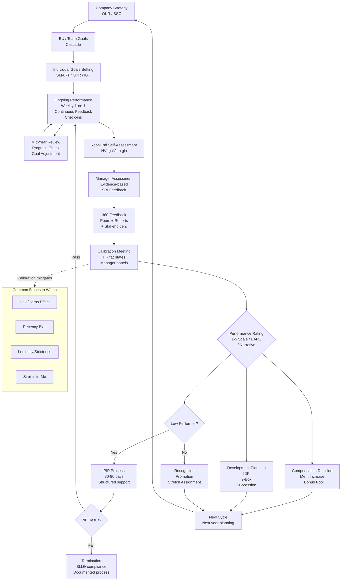

# HR03 — Quản Lý Hiệu Suất (Performance Management)

> **Quản lý hiệu suất** là hệ thống liên tục thiết lập mục tiêu, theo dõi tiến độ, đánh giá kết quả và phát triển năng lực của người lao động — nhằm đảm bảo mỗi cá nhân đóng góp tối đa vào mục tiêu chung của tổ chức, đồng thời phát triển sự nghiệp cá nhân.

---

## 01. Tổng Quan & Định Nghĩa

### 1.1 Performance Management vs. Performance Appraisal

| Tiêu chí | Performance Management (PM) | Performance Appraisal (PA) |
|---|---|---|
| Phạm vi | Quá trình liên tục cả năm | Đánh giá điểm cuối kỳ |
| Tần suất | Daily/Weekly feedback | Annual/Semi-annual |
| Tư duy | Development-focused | Judgment-focused |
| Ai tham gia | Manager + Employee + Peers | Chủ yếu Manager |
| Kết quả | Improvement + Engagement | Rating + Reward |

**Xu hướng 2024:** Dịch chuyển từ PA (bị coi là rearview mirror) → PM (forward-looking, continuous).

### 1.2 Mục Đích Quản Lý Hiệu Suất

**4 mục tiêu chiến lược:**
1. **Strategic alignment:** Kết nối mục tiêu cá nhân với mục tiêu tổ chức
2. **Development:** Xác định và phát triển điểm mạnh, khắc phục điểm yếu
3. **Accountability:** Tạo văn hóa chịu trách nhiệm với kết quả
4. **Reward differentiation:** Cơ sở để phân phối tăng lương, thưởng, thăng tiến

### 1.3 PM Cycle (Vòng Tròn Hiệu Suất)

```
PLAN                   DO                    REVIEW
(Lập kế hoạch)    →   (Thực hiện)     →    (Đánh giá)
                            ↑                    ↓
                        DEVELOP             REWARD/CONSEQUENCE
                    (Phát triển)         (Thưởng/Hậu quả)
                            ↑____________________________↗
```

---

## 02. Nguyên Lý Cơ Bản

### 2.1 Goal-Setting Theory (Locke & Latham, 1990)

**4 nguyên tắc:**
1. **Specific:** Mục tiêu cụ thể > mục tiêu mơ hồ ("do your best")
2. **Difficult (but achievable):** Mục tiêu thách thức → motivation cao hơn
3. **Commitment:** Nhân viên phải cam kết với mục tiêu (lý tưởng nhất: tự đặt)
4. **Feedback:** Cần biết mình đang ở đâu so với mục tiêu

### 2.2 SMART Goals

| Chữ cái | Ý nghĩa | Ví dụ tốt | Ví dụ kém |
|---|---|---|---|
| **S** — Specific | Cụ thể, rõ ràng | "Tăng conversion rate từ 2.5% lên 3.5%" | "Tăng doanh số" |
| **M** — Measurable | Đo lường được | "Đạt 120% KPI doanh thu Q3" | "Làm tốt hơn" |
| **A** — Achievable | Khả thi | "Tuyển 5 kỹ sư senior trong Q2" | "Tuyển 50 kỹ sư tuần sau" |
| **R** — Relevant | Liên quan chiến lược | "Giảm churn xuống <5% (liên kết revenue target)" | "Tổ chức 100 cuộc họp" |
| **T** — Time-bound | Có deadline | "Trước 30/06/2025" | "Sớm thôi" |

### 2.3 Self-Determination Theory (Deci & Ryan)

3 nhu cầu tâm lý cơ bản ảnh hưởng performance:
- **Autonomy:** Được tự quyết định cách làm việc
- **Competence:** Cảm thấy đủ năng lực thực hiện nhiệm vụ
- **Relatedness:** Kết nối với team và tổ chức

**Ứng dụng PM:** Design OKR để nhân viên tự propose key results → tăng autonomy → tăng motivation.

---

## 03. Các Hệ Thống Quản Lý Hiệu Suất

### 3.1 MBO — Management by Objectives (Drucker, 1954)

**Nguyên lý:**
- Manager và nhân viên cùng đặt mục tiêu
- Mục tiêu align với mục tiêu tổ chức
- Đánh giá dựa trên achievement of objectives

**Quy trình MBO:**
1. Công ty xác định strategic objectives
2. Cascade xuống phòng ban → team → cá nhân
3. Mỗi cấp đặt objectives phù hợp (cùng thảo luận)
4. Cuối kỳ: Đánh giá achievement
5. Phần thưởng liên kết với kết quả

**Ưu/Nhược điểm:**

| Ưu điểm | Nhược điểm |
|---|---|
| Clarity về expectations | Cascade mất thời gian |
| Alignment dọc | Khó cho creative/knowledge work |
| Accountability rõ | Có thể quá rigid khi environment thay đổi |
| Phổ biến, dễ hiểu | Không đủ focus vào HOW (chỉ WHAT) |

### 3.2 OKR — Objectives & Key Results (Intel/Google)

**Cấu trúc OKR:**
```
O — Objective: Mục tiêu định tính, inspiring, thách thức
KR — Key Results: 2-5 metrics đo lường progress toward Objective

Ví dụ OKR Marketing Manager Q3:
O:  "Xây dựng thương hiệu nhà tuyển dụng #1 ngành Tech tại HCM"
KR1: Tăng Glassdoor rating từ 3.8 lên 4.2 trước 30/9
KR2: Đạt 500 organic applicants/tháng từ employer brand content
KR3: Giảm Time-to-Fill IT roles từ 60 ngày xuống 40 ngày
KR4: NPS ứng viên ≥ 40 (hiện tại: 25)
```

**OKR Scoring:**
```
0.0 - 0.3: Failed to make real progress
0.4 - 0.6: Made progress but fell short
0.7 - 1.0: Delivered (0.7 thường được coi là success — "stretch goal")

Lưu ý: OKR ≠ KPI. OKR thường KHÔNG liên kết trực tiếp với lương
(để tránh sandbagging — đặt mục tiêu thấp cho dễ đạt)
```

**OKR vs. KPI:**

| Tiêu chí | OKR | KPI |
|---|---|---|
| Mục đích | Strategic alignment + Motivation | Operational monitoring |
| Frequency | Quarterly (thường) | Monthly/Weekly |
| Stretch factor | Thường 70% là thành công | 100% là target |
| Link to pay | Thường KHÔNG | Thường CÓ |
| Level | Company → Team → Individual | Mostly individual |
| Flexibility | Có thể điều chỉnh giữa kỳ | Cố định đầu kỳ |

### 3.3 BSC — Balanced Scorecard (Kaplan & Norton, 1992)

**4 perspectives:**

```
FINANCIAL PERSPECTIVE
"Để thành công về tài chính, chúng ta cần trông như thế nào với cổ đông?"
→ Revenue growth, Profit margin, ROI, EBITDA

CUSTOMER PERSPECTIVE
"Để đạt vision, chúng ta cần trông như thế nào với khách hàng?"
→ NPS, Retention rate, Market share, Customer satisfaction

INTERNAL PROCESS PERSPECTIVE
"Chúng ta phải vượt trội ở quy trình nào?"
→ Cycle time, Quality rate, Innovation rate, Productivity

LEARNING & GROWTH PERSPECTIVE
"Làm sao duy trì khả năng thay đổi và cải thiện?"
→ Employee engagement, Training hours, Skills development, Retention
```

**BSC trong Performance Management:**
- Cấp công ty: Strategy map từ 4 perspectives
- Cấp BU/Team: Cascade xuống objectives liên quan
- Cấp cá nhân: 3-5 metrics từ BSC của team

### 3.4 360-Degree Feedback

**Cấu trúc:**
```
                    [Cấp trên]
                        ↑
[Đồng nghiệp] ← [NV được đánh giá] → [Đồng nghiệp]
                        ↓
                 [Cấp dưới/Reports]
                        ↓
                  [Khách hàng nội bộ]
                  (nếu applicable)
```

**Khi nào dùng 360:**
- Development purposes: Rất hiệu quả
- Administrative (rating, pay): Rủi ro cao (có thể bị game the system)

**Best practices:**
- Anonymize responses (đặc biệt cấp dưới đánh giá sếp)
- Train raters trước khi thực hiện
- Debrief với coach/HR, không chỉ nhận số liệu thô
- Action plan sau nhận feedback

### 3.5 Continuous Performance Management (CPM)

**Đặc trưng CPM:**
- Check-in thường xuyên (hàng tuần/2 tuần) thay vì annual review
- Real-time feedback (not waiting for review cycle)
- Focus on future development, not past judgment
- Tools: 15Five, Lattice, Culture Amp, Leapsome

**Companies pioneering CPM:**
- Adobe: Abolished annual review 2012 → "Check-in" system
- GE: Abandoned forced ranking 2016 → PD@GE (continuous feedback)
- Microsoft: Growth mindset + Connect conversations
- Netflix: No formal review → radical candor culture

---

## 04. KPI vs. OKR vs. Competency

### 4.1 Framework So Sánh

| Tiêu chí | KPI | OKR | Competency |
|---|---|---|---|
| Đo gì | Output/Result | Outcome/Impact | Behavior/Capability |
| Câu hỏi | "Đạt bao nhiêu?" | "Tiến tới đâu?" | "Làm việc như thế nào?" |
| Link pay | Mạnh | Yếu (thường) | Trung bình |
| Time horizon | Monthly/Quarterly | Quarterly/Annual | Annual |
| Phù hợp | Operational roles | Strategic/Innovation | Leadership, Culture |

### 4.2 Khi Nào Dùng Cái Nào?

**Dùng KPI khi:**
- Công việc có output rõ ràng, đo lường được (Sales, Operations, Customer Service)
- Cần incentive trực tiếp với kết quả
- Environment ổn định, predictable

**Dùng OKR khi:**
- Cần align chiến lược từ trên xuống dưới
- Muốn nhân viên có ownership với mục tiêu lớn
- Môi trường thay đổi nhanh (startup, tech)
- Cần innovation và stretch thinking

**Dùng Competency khi:**
- Đánh giá potential và promotion readiness
- Vai trò mà output khó đo (HR, Legal, Culture, R&D)
- Development planning
- Succession planning

### 4.3 Hybrid Framework (Most Common)

```
OVERALL PERFORMANCE RATING = 
  Kết quả (What): 60-70% × (KPI score hoặc OKR score)
+ Năng lực (How): 30-40% × Competency score

Ví dụ:
  KPI achievement: 105% → Điểm kết quả: 4/5
  Competency score: 3.5/5 → Điểm năng lực: 3.5/5
  
  Overall = (4 × 60%) + (3.5 × 40%) = 2.4 + 1.4 = 3.8/5 → Rating "Exceeds"
```

---

## 05. Performance Review Cycle

### 5.1 Annual Review (Phổ Biến Nhất VN)

**Timeline điển hình (FY = Calendar Year):**
```
Tháng 1:    Thiết lập mục tiêu năm (cascaded từ company OKR)
Tháng 1-12: Continuous feedback, coaching, 1-on-1s
Tháng 6:    Mid-year review (informal hoặc formal)
Tháng 10-11: Self-assessment (NV tự đánh giá)
Tháng 11:   Manager assessment
Tháng 11-12: Calibration meeting
Tháng 12:   Kết quả review → salary/bonus decision
Tháng 1 năm sau: Thông báo kết quả + mục tiêu mới
```

### 5.2 Quarterly Review (Agile PM)

**Phù hợp với:**
- Tech companies, startup
- Sales-driven organizations
- Environments với frequent strategic changes

**Cấu trúc:**
```
Q1: Set OKRs → Check-in → End-of-Q review
Q2: Set new OKRs → Check-in → End-of-Q review
Q3: Set OKRs → Check-in → End-of-Q review
Q4: Set OKRs → End-of-year comprehensive review
    (tổng hợp từ 4Q + development planning cho năm sau)
```

### 5.3 Calibration Meeting

**Mục đích:** Đảm bảo ratings nhất quán và fair giữa các manager, phòng ban.

**Quy trình Calibration:**

```
Bước 1 — Pre-calibration:
  - Mỗi manager submit draft ratings cho team
  - HR tổng hợp phân phối rating toàn công ty

Bước 2 — Calibration session (2-4 giờ):
  - Đại diện từng BU trình bày top performers và low performers
  - Discuss outliers (người được rate quá cao hoặc quá thấp)
  - Challenge inconsistency ("Tại sao người này 5 nhưng output nhỏ hơn người kia 4?")
  - Consensus on final distribution

Bước 3 — Post-calibration:
  - Manager update ratings dựa trên calibration
  - CHRO approve final distribution
  - Manager communicate kết quả với nhân viên
```

**Forced distribution vs. Guided distribution:**

| | Forced | Guided |
|---|---|---|
| Mô tả | Bắt buộc % nhất định ở mỗi rating | Hướng dẫn distribution nhưng linh hoạt |
| Ví dụ | "Top 20%, Middle 70%, Bottom 10%" (GE cũ) | "Target: <15% rating 5, >60% rating 3-4" |
| Ưu điểm | Tránh leniency bias | Cân bằng fairness và flexibility |
| Nhược điểm | Tạo competition không lành mạnh | Cần calibration discipline |
| Xu hướng | Đang bỏ dần | Phổ biến hơn hiện nay |

---

## 06. Rating Scales

### 6.1 3-Point Scale

```
1 — Below Expectations
2 — Meets Expectations
3 — Exceeds Expectations
```
**Ưu:** Đơn giản, ít bias room
**Nhược:** Thiếu differentiation, không đủ granular cho merit matrix

### 6.2 4-Point Scale (Không có "trung bình")

```
1 — Significantly Below
2 — Below
3 — Meets (Good)
4 — Exceeds
```
**Ưu:** Buộc phải phân loại rõ, không có "trung bình an toàn"
**Nhược:** Nhiều người cảm thấy 3 là "tốt" rồi, không cố gắng hơn

### 6.3 5-Point Scale (Phổ Biến Nhất)

```
1 — Unsatisfactory / Far Below
2 — Needs Improvement / Below
3 — Meets Expectations / Proficient
4 — Exceeds Expectations
5 — Outstanding / Exceptional
```
**Ưu:** Đủ granular, dễ link với merit matrix
**Nhược:** Central tendency bias (mọi người tụ về 3)

### 6.4 BARS (Behaviorally Anchored Rating Scales)

Thay vì rating 1-5 chung chung, BARS mô tả hành vi cụ thể cho từng mức:

```
Competency: Customer Focus

5 — Outstanding:
    "Chủ động khảo sát khách hàng mỗi quý, dùng insights để cải tiến sản phẩm 
    trước khi có complaint. Xây dựng relationship dài hạn với top 10 KH."

4 — Exceeds:
    "Phản hồi mọi yêu cầu KH trong 4 giờ. Đề xuất giải pháp thay vì chỉ 
    giải quyết vấn đề hiện tại."

3 — Meets:
    "Xử lý complaint đúng quy trình, đúng hạn. KH hài lòng với cách giải quyết."

2 — Below:
    "Đôi khi chậm phản hồi (>24h). Giải quyết vấn đề theo lệnh, thiếu chủ động."

1 — Unsatisfactory:
    "Thường xuyên bỏ qua yêu cầu KH. Có complaint leo thang đến management."
```

**Ưu điểm BARS:**
- Giảm subjectivity và bias mạnh nhất
- Nhân viên biết chính xác cần làm gì để đạt mỗi level
- Training rater dễ hơn

**Nhược điểm:** Mất nhiều công thiết kế (mỗi competency cần 5 mô tả hành vi chi tiết)

### 6.5 Narrative-Only (Netflix Model)

**Không có rating số.** Manager viết narrative đánh giá:
- Điểm mạnh nổi bật
- Điểm cần cải thiện
- Cơ hội phát triển
- Khuyến nghị về vai trò tiếp theo

**Netflix "Keeper Test":** "Would I fight to keep this person if they were leaving?"
- Yes → Reward, develop, retain
- No → Generous severance, part ways

**Phù hợp VN:** Rất khó áp dụng vì văn hóa "nể nang" — viết narrative thường quá nhẹ nhàng, không phản ánh thực tế.

---

## 07. Tools & Technology

### 7.1 Performance Management Software

| Tool | Đặc điểm | Giá | Phù hợp |
|---|---|---|---|
| **15Five** | Weekly check-ins, OKR, 1-on-1 templates | $4-14/user/tháng | SME-Mid, Tech |
| **Lattice** | Comprehensive PM + engagement | $6-11/user/tháng | Mid-Large, Tech |
| **Culture Amp** | Engagement survey + PM integration | $5-8/user/tháng | Mid-Large |
| **Leapsome** | OKR + Review + Learning | $8/user/tháng | Mid-Large, EMEA |
| **Betterworks** | Enterprise OKR | $15+/user/tháng | Enterprise |
| **SAP SuccessFactors** | Enterprise suite | Custom | Large enterprise |
| **Workday Perf** | Integrated với HCM | Custom | Large enterprise |
| **MISA HRM** | PM cơ bản, VN-focused | 5-20M/năm | SME VN |

### 7.2 Feature Comparison

| Feature | 15Five | Lattice | Culture Amp |
|---|---|---|---|
| OKR/Goals | ✓ | ✓ | Basic |
| 1-on-1 templates | ✓ | ✓ | Basic |
| 360 feedback | ✓ | ✓ | ✓ |
| Engagement survey | Add-on | ✓ | ✓ (strength) |
| Analytics/Insights | Good | Very good | Best-in-class |
| Integration (HRIS) | Many | Many | Many |
| Mobile app | ✓ | ✓ | ✓ |

### 7.3 PM Tool Implementation tại VN

**Thách thức khi implement:**
- Phần lớn tools có giao diện English → barrier với nhân viên level thấp
- Change management: "Tại sao phải dùng tool mới?" → Training + Sponsorship
- Data quality: Nếu không dùng thường xuyên → data không có giá trị

**Rollout approach:**
```
Pilot → 1 BU (3 tháng) → Lessons learned → Scale (6-12 tháng) → Full deployment
```

---

## 08. PIP — Performance Improvement Plan

### 8.1 Khi Nào Cần PIP?

**PIP là công cụ cuối cùng, không phải đầu tiên:**
```
Warning signs xuất hiện → Informal coaching (1-on-1)
Không cải thiện sau 4-8 tuần → Verbal warning (documented)
Tiếp tục không cải thiện → Written warning
Vẫn không cải thiện → PIP (formal, structured)
PIP không đạt → Termination (có cơ sở pháp lý)
```

**KHÔNG dùng PIP cho:**
- Nhân viên có lý do khách quan (bệnh, khủng hoảng cá nhân) → Support first
- Vị trí bị eliminate (restructuring) → Redundancy process
- Mục đích "đuổi người" mà không muốn improvement → Ethical và legal risk

### 8.2 Cấu Trúc PIP Chuẩn

```
PERFORMANCE IMPROVEMENT PLAN (PIP)

Nhân viên: [Tên]                    Ngày bắt đầu: [DD/MM/YYYY]
Vị trí: [Chức danh]                Ngày kết thúc: [DD/MM/YYYY] (thường 30-90 ngày)
Manager: [Tên]                      HR Business Partner: [Tên]

I. TÌNH TRẠNG HIỆU SUẤT HIỆN TẠI
[Mô tả cụ thể vấn đề, với evidence, dates, numbers]
Ví dụ: "Từ tháng 7-9/2024, [Nhân viên] đạt 65% KPI doanh số (target 100%).
Cụ thể: T7: 12/20 leads closed, T8: 11/20, T9: 10/20."

II. KỲ VỌNG VÀ MỤC TIÊU CẢI THIỆN
[SMART goals cụ thể cần đạt trong thời gian PIP]
Ví dụ:
  1. Đạt ≥ 85% KPI doanh số mỗi tháng trong 3 tháng PIP
  2. Complete 100% training modules về sales methodology trước 30/10
  3. Gửi weekly activity report mỗi thứ Sáu trước 5pm

III. HỖ TRỢ VÀ NGUỒN LỰC
[Công ty/Manager sẽ cung cấp gì để hỗ trợ NV đạt mục tiêu]
- Coaching 1-on-1 hàng tuần với Manager (45 phút)
- Đào tạo: Sales Excellence Program (5 ngày)
- Buddy system với top performer trong team
- Access to additional lead database

IV. TIMELINE & MILESTONES
[Check-in schedule trong thời gian PIP]
  Tuần 2:   Check-in với HR + Manager
  Tháng 1:  Formal mid-PIP review
  Cuối PIP: Final assessment

V. HẬU QUẢ
"Nếu không đạt các mục tiêu trên trong thời gian PIP, có thể dẫn đến
chấm dứt hợp đồng lao động."

VI. CHỮ KÝ
  Nhân viên: __________ Ngày: __________
  Manager:   __________ Ngày: __________
  HR:        __________ Ngày: __________
```

### 8.3 PIP & BLLĐ Compliance

**Tại VN, chấm dứt HĐLĐ vì "thường xuyên không hoàn thành công việc" (Điều 36 BLLĐ):**
- Phải có quy định rõ trong nội quy lao động về tiêu chí "không hoàn thành"
- Cần có documented evidence về quá trình đánh giá
- PIP records là bằng chứng quan trọng cho due process
- Nếu không có PIP/warning records → rủi ro kiện tụng cao

**Quy trình xử lý kỷ luật (Điều 122 BLLĐ):**
1. Họp xử lý kỷ luật (có sự tham gia của Ban chấp hành CĐCS nếu có)
2. NLĐ được trình bày ý kiến
3. Ra quyết định kỷ luật bằng văn bản
4. Lưu hồ sơ

**Timeline quan trọng:**
- Kỷ luật: Trong 6 tháng kể từ ngày vi phạm (12 tháng nếu liên quan tài chính)
- Không xử lý kỷ luật: NLĐ đang ốm, thai sản, nghỉ phép

---

## 09. 9-Box Grid

### 9.1 Cấu Trúc 9-Box

```
                    PERFORMANCE
              Low        Medium       High
          ┌──────────┬──────────┬──────────┐
High      │          │          │          │
          │ Question │  High    │  Star    │
POTENTIAL │  Mark    │ Potential│          │
          ├──────────┼──────────┼──────────┤
Medium    │          │          │          │
          │  Rough   │  Core    │  High    │
          │  Diamond │ Employee │ Performer│
          ├──────────┼──────────┼──────────┤
Low       │          │          │          │
          │  Dead    │ Effective│ Solid    │
          │  Wood    │ Contributor│ Performer│
          └──────────┴──────────┴──────────┘
```

### 9.2 Action Strategies cho Mỗi Ô

| Ô | Tên | Chiến lược |
|---|---|---|
| High P / High Perf | **Star** | Develop, retain, fast-track succession |
| High P / Med Perf | **High Potential** | Coach, stretch assignments, exposure |
| High P / Low Perf | **Question Mark** | Investigate root cause, coach or reassign |
| Med P / High Perf | **High Performer** | Recognize, reward, niche development |
| Med P / Med Perf | **Core Employee** | Stable, consistent development |
| Med P / Low Perf | **Effective Contributor** | Targeted skill development |
| Low P / High Perf | **Solid Performer** | Recognize results, accept ceiling |
| Low P / Med Perf | **Rough Diamond** | PIP or reassign if still early career |
| Low P / Low Perf | **Dead Wood** | PIP → Exit if no improvement |

### 9.3 Sử Dụng 9-Box tại VN — Thực Tế

**Thách thức:**
- Đánh giá "potential" chủ quan hơn performance → bias nhiều hơn
- VN: "Potential" thường bị ảnh hưởng bởi quan hệ với management
- Cần calibration riêng cho potential assessment

**Potential Assessment Indicators:**
- Learning agility (tốc độ học cái mới)
- Leadership impact (influence mà không cần authority)
- Strategic thinking (thấy big picture)
- Adaptability (handle change tốt)
- Emotional intelligence (tự nhận thức, empathy)

### 9.4 Kết Nối 9-Box với Succession Planning

```
"Stars" và "High Potentials" → Succession candidates cho key roles
Action: IDP (Individual Development Plan) + stretch assignments

Mỗi key position cần:
  Ready Now: 1-2 người (có thể đảm nhận trong 6 tháng)
  Ready in 1-2 years: 1-2 người (cần development)
  Ready in 3-5 years: 1-2 người (long-term pipeline)
```

---

## 10. Compensation Linkage

### 10.1 Merit Increase Matrix

(Xem chi tiết tại HR02 — được tham chiếu tại đây trong context PM)

**Nguyên tắc liên kết:**
```
Performance Rating + Compa-Ratio → % Merit Increase

Ví dụ VN (Merit budget: 8% average):
Rating 5 (Outstanding, 10% nhân viên): Tăng 12-15%
Rating 4 (Exceeds, 20% nhân viên):     Tăng 9-12%
Rating 3 (Meets, 50% nhân viên):       Tăng 6-9%
Rating 2 (Below, 15% nhân viên):       Tăng 0-4%
Rating 1 (Unsatisfactory, 5%):         0% (hoặc PIP)
```

### 10.2 Bonus Pool Distribution dựa trên Performance

```
PHƯƠNG PHÁP PERFORMANCE MULTIPLIER:

Mỗi nhân viên có "bonus target" (% lương, tùy cấp)
Actual bonus = Target bonus × Performance multiplier × Company multiplier

Company multiplier (do kết quả công ty):
  Kết quả >120%: Multiplier 1.3
  Kết quả 100-120%: Multiplier 1.0
  Kết quả 85-100%: Multiplier 0.7
  Kết quả <85%: Multiplier 0.3-0.5

Performance multiplier (do individual performance):
  Rating 5: × 1.5
  Rating 4: × 1.2
  Rating 3: × 1.0
  Rating 2: × 0.5
  Rating 1: × 0
```

### 10.3 Promotion Decision

```
Criteria để promote:
1. Performance: Rating ≥ 4 trong ít nhất 2 năm liên tiếp
2. Potential: High potential theo 9-box
3. Readiness: Đã demonstrate competencies của level mới
4. Vacancy/Need: Có vị trí hoặc business case cho role cao hơn

"Promote on potential, pay for performance"
```

---

## 11. Cognitive Biases trong Performance Review

### 11.1 Common Biases

| Bias | Mô tả | Ví dụ VN | Cách phòng tránh |
|---|---|---|---|
| **Halo Effect** | 1 điểm mạnh → đánh giá tốt tất cả | "Anh ấy viết code giỏi, chắc chắn team player tốt" | Rate từng competency riêng biệt |
| **Horns Effect** | 1 điểm yếu → đánh giá kém tất cả | "Chị ấy hay đi muộn, chắc chắn thiếu commitment" | Evidence-based rating |
| **Recency Bias** | Chỉ nhớ 2-3 tháng gần nhất | Quên achievement Q1-Q2 vì có sự cố Q4 | Ghi nhật ký achievement cả năm |
| **Leniency Bias** | Đánh giá quá cao để tránh conflict | "Mọi người đều đạt 4/5" | Calibration + distribution guidance |
| **Strictness Bias** | Đánh giá quá thấp | "Chưa ai xứng đáng 5 cả" | Calibration + examples |
| **Similar-to-Me** | Ưu ái người giống mình | Ưu tiên người cùng trường ĐH, quê | Diverse panel + structured criteria |
| **Attribution Bias** | Nam thành công = tài, nữ = may mắn | Phổ biến trong culture VN | DEI training |
| **Central Tendency** | Mọi người đều "3/5" | Tránh đưa ra judgment rõ ràng | Force distribution guidance |
| **Proximity Bias** | Đánh giá cao hơn với remote (ít gặp mặt) | Sau COVID VN | Output-based criteria |

### 11.2 Phòng Tránh Bias — Hệ Thống

**1. Structured Rating Process:**
- Rate từng competency riêng biệt trước khi tổng hợp overall
- Mỗi rating cần ít nhất 2-3 evidence cụ thể

**2. Documentation throughout the year:**
```
Praise File / Achievement Log:
  "15/3: [NV] hoàn thành project X 2 ngày trước deadline, client feedback 9/10"
  "22/5: [NV] giải quyết incident server lúc 2am, không để production down"
  "10/8: [NV] lỡ deadline báo cáo tháng 2 lần liên tiếp"
```

**3. Calibration process** (đã mô tả ở Section 05)

**4. 360-degree input** để không chỉ phụ thuộc vào 1 người đánh giá

---

## 12. Manager 1-on-1 & Coaching

### 12.1 Effective 1-on-1 Structure

**Tần suất:** Hàng tuần (30 phút) hoặc 2 tuần/lần (60 phút)

**Agenda mẫu (nhân viên chuẩn bị):**
```
1. Updates & priorities (10 phút)
   - Tuần này làm gì, đạt gì?
   - Tuần tới plan gì?

2. Roadblocks & support needed (10 phút)
   - Đang gặp khó khăn gì?
   - Cần gì từ manager?

3. Development & career (10 phút)
   - Learning gì tuần này?
   - Career aspiration update?
```

**Nguyên tắc 1-on-1:**
- **Employee drives the agenda** (không phải manager dùng để status update)
- **Manager listens 70%, talks 30%**
- **Action items documented** và follow-up tuần sau

### 12.2 Coaching Conversation Framework (GROW)

```
G — Goal: "Anh/chị muốn đạt được gì từ cuộc trò chuyện hôm nay?"
R — Reality: "Tình trạng hiện tại như thế nào? Đã thử gì rồi?"
O — Options: "Có những lựa chọn nào? Nếu không có giới hạn, anh/chị sẽ làm gì?"
W — Will: "Anh/chị sẽ làm gì? Khi nào? Cần hỗ trợ gì?"
```

### 12.3 Feedback Model — SBI (Situation-Behavior-Impact)

```
S — Situation: Bối cảnh cụ thể
B — Behavior: Hành vi quan sát được (không phải giả định)
I — Impact: Tác động của hành vi đó

Ví dụ Positive:
"Trong buổi presentation với khách hàng hôm qua [S],
anh đã chủ động đặt câu hỏi để hiểu sâu hơn nhu cầu [B],
khiến khách hàng cảm thấy được lắng nghe và chúng ta có cơ sở 
đề xuất giải pháp phù hợp hơn [I]."

Ví dụ Developmental:
"Trong meeting team sáng nay [S],
anh đã ngắt lời đồng nghiệp 3 lần [B],
điều này khiến họ ngần ngại chia sẻ ý kiến và cuộc họp mất đi 
những đóng góp quan trọng [I]."
```

---

## 13. Remote Performance Management

### 13.1 Challenges của Remote PM

| Thách thức | Tác động | Giải pháp |
|---|---|---|
| Khó quan sát effort | Bias đối với visible workers | Focus on output, not activity |
| Ít cơ hội feedback tự nhiên | Thiếu "water cooler feedback" | Structured weekly check-ins |
| "Out of sight, out of mind" | Remote workers bị rate thấp hơn | Documented evidence |
| Meeting fatigue | Engagement giảm | Async first culture |
| Time zone differences | Coordination khó | Core hours overlap |

### 13.2 OKR-Based Remote PM

**Remote work phù hợp nhất với Output-focused management:**
```
KHÔNG:
  "Anh làm 8 tiếng/ngày không?" (Input-focused)
  "Anh có online trên Teams không?" (Activity-focused)

CÓ:
  "Sprint này anh deliver 3 features đúng deadline không?" (Output)
  "KR của anh tháng này đạt bao nhiêu %?" (Outcome)
```

### 13.3 Async Feedback Culture

- **Loom video feedback:** Record video 2-3 phút để feedback thay vì viết text khô
- **Notion/Confluence: Team performance dashboard** — visible cho cả team
- **Weekly written update:** Mỗi người viết "what I did, what's next, blockers" cuối tuần

---

## 14. Performance Management trong VN Culture Context

### 14.1 Văn Hóa "Nể Nang" và Impact đến PM

**Biểu hiện:**
- Manager ngại nói thẳng feedback tiêu cực → "sandwich feedback" quá nhiều lớp "bánh"
- Nhân viên ngại phản hồi ngược (upward feedback) vì sợ ảnh hưởng relationship
- Rating "trung bình" dù thực tế kém để tránh conflict
- Không muốn là người duy nhất rate thấp trong calibration (peer pressure)

**Giải pháp thực tế:**
1. **Anonymous upward feedback** — nhân viên đánh giá manager ẩn danh
2. **External facilitator** cho calibration meeting (HR neutral, hoặc external consultant)
3. **Training manager về difficult conversation** — role play, scripting
4. **Evidence requirement:** Mỗi rating cần 2-3 examples cụ thể → buộc manager phải có facts

### 14.2 Tôn Ti Trật Tự và Peer Feedback

**Thực tế VN:**
- Peer-to-peer feedback ít phổ biến (không muốn "phê bình" đồng nghiệp)
- Upward feedback hiếm (sợ ảnh hưởng đến review của mình)
- Đặc biệt khó ở doanh nghiệp gia đình, truyền thống

**Cách xây dựng dần dần:**
- Bắt đầu với "Appreciation" (positive only) trước
- Sau 6-12 tháng: Thêm "One thing to grow" (developmental)
- Dần dần: Full 360 khi culture ready

### 14.3 Lương & Performance: Disconnect tại VN

**Thực tế quan sát:**
- Nhiều công ty VN vẫn tăng lương "đều đều" 7-10% không dựa nhiều vào performance
- Thưởng Tết chia đều cho cả team → ít motivation
- "Người ngồi lâu thăng tiến hơn người giỏi" — tenure-based culture

**Xu hướng thay đổi:**
- Tech companies, MNC: Phân hóa rõ (top 10% tăng 15-20%, bottom 10% tăng 0%)
- Startup: OKR-linked bonus, data-driven promotion
- Truyền thống/SME: Còn chậm thay đổi

---

## 15. Developing Performance Culture

### 15.1 Culture của Accountability

**3 trụ cột:**
1. **Clarity:** Mọi người biết rõ kỳ vọng (SMART goals, clear KPIs)
2. **Measurement:** Kết quả được theo dõi và visible
3. **Consequence:** Có sự khác biệt rõ ràng giữa high và low performance

### 15.2 Radical Candor (Kim Scott)

```
               Challenging Directly
                       ↑
                       |
    ┌──────────────────┼──────────────────┐
    │                  │                  │
    │   Obnoxious      │   Radical        │
    │   Aggression     │   Candor         │
Care├──────────────────┼──────────────────┤Care
Nothing│              │                  │Personally
    │   Manipulative   │   Ruinous        │
    │   Insincerity    │   Empathy        │
    │                  │                  │
    └──────────────────┴──────────────────┘
               Not Challenging Directly
```

**Radical Candor = Care Personally + Challenge Directly**
Phù hợp VN: Cần build "care personally" trước mới có thể "challenge directly".

---

## 16. Individual Development Plan (IDP)

### 16.1 IDP Structure

```
INDIVIDUAL DEVELOPMENT PLAN — [Tên NV] — [Năm]

CAREER ASPIRATION (3-5 năm):
  "Anh/chị muốn đạt vị trí gì? Làm điều gì?"

CURRENT STRENGTHS (dựa trên performance data):
  1. [Strength 1 + evidence]
  2. [Strength 2 + evidence]

DEVELOPMENT AREAS (từ 360, performance review):
  1. [Area 1]: Tại sao quan trọng cho career goal?
  2. [Area 2]: ...

DEVELOPMENT ACTIONS (70-20-10 model):
  70% — Experience (On-the-job):
    "Lead project X để develop strategic thinking"
    "Handle client escalation trực tiếp"
  
  20% — Exposure (Social learning):
    "Mentor với [Senior Leader]"
    "Join cross-functional task force"
    "Present tại all-hands quarterly"
  
  10% — Education (Formal):
    "MBA/Certificate: [tên chương trình]"
    "Online course: [tên course]"
    "Conference: [tên hội nghị]"

MILESTONES & CHECK-INS:
  Q1: [Development action + milestone]
  Q2: [Development action + milestone]
  Q3: Review progress
  Q4: End-of-year assessment

SUPPORT NEEDED:
  From Manager: [Cụ thể]
  From Company: [Budget, time, resource]
```

### 16.2 70-20-10 Learning Model

```
70% — Learning from Experience (trải nghiệm thực tế)
  Stretch assignments
  New projects, new markets
  Cross-functional roles
  Increased scope/complexity

20% — Learning from Others (học từ người khác)
  Mentoring/Coaching
  Peer learning groups
  Job shadowing
  360 feedback conversations

10% — Formal Learning (học chính thức)
  Training programs
  Certification
  MBA, Executive Education
  e-Learning
```

---

## 17. Succession Planning Integration

### 17.1 PM + Succession Planning

```
PM Data → 9-Box Grid → Succession Candidates → IDP → Development Actions
    ↓
Annual review     Calibration    Ready Now/1-2yr/3-5yr    Targeted program
```

### 17.2 Succession Plan Template

```
SUCCESSION PLAN — [Vị trí: VP Marketing]
Incumbent: [Tên], đã nắm vị trí 5 năm

SUCCESSOR CANDIDATES:

Ready Now (0-6 tháng):
  Name: [Tên] | Current role: Marketing Manager
  9-Box: High Performance/High Potential (Star)
  Gaps: International experience, P&L management
  Development: 3-month rotation Finance + Global project

Ready in 1-2 năm:
  Name: [Tên] | Current role: Senior Marketing Specialist
  9-Box: High Potential/Medium Performance
  Gaps: Leadership experience, strategic planning
  Development: Team lead project + MBA sponsorship

Ready in 3-5 năm:
  Name: [Tên] | Current role: Marketing Specialist
  9-Box: High Potential (early career)
  Development: Fast-track management program
```

---

## 18. Performance Management cho Different Roles

### 18.1 Sales Performance Management

**Sales-specific KPIs:**
```
Activity metrics (leading indicators):
  - Số cuộc gọi/tuần
  - Số meetings/tuần
  - Pipeline value added

Output metrics (lagging indicators):
  - Revenue closed
  - Win rate
  - Average deal size
  - Sales cycle length

Relationship metrics:
  - NPS khách hàng
  - Renewal rate
  - Upsell/cross-sell rate
```

**Sales incentive review cycle: Monthly/Quarterly** (không chờ annual)

### 18.2 Engineering/Tech Performance

**Tech-specific assessment:**
```
Technical Quality:
  - Code quality (peer review scores, bug rate)
  - System reliability (uptime, incident contribution)
  - Technical debt management

Delivery:
  - Sprint velocity vs. commitment
  - On-time delivery rate
  - Scope accuracy

Collaboration:
  - PR review participation
  - Knowledge sharing (docs, tech talks)
  - Mentoring junior devs

Innovation:
  - Proposals submitted
  - Tech improvements implemented
```

### 18.3 Manager Performance Dimensions

**People managers được đánh giá thêm:**
```
Team Building:
  - Team engagement score
  - Retention rate của direct reports
  - Talent developed/promoted từ team

Coaching & Development:
  - % direct reports có IDP
  - Training hours facilitated
  - 360 feedback từ direct reports

Cross-functional Impact:
  - Stakeholder satisfaction
  - Collaboration với other BUs
  - Influence beyond own team
```

---

## 19. Measurement & Analytics

### 19.1 PM Analytics Dashboard

**Key PM metrics:**

| Metric | Đo lường gì | Cách tính | Benchmark |
|---|---|---|---|
| Rating Distribution | Spread của performance ratings | % nhân viên ở mỗi rating level | Xem calibration guidelines |
| Completion Rate | Bao nhiêu % đã hoàn thành review | Reviews completed / Total × 100 | ≥ 95% |
| Calibration Variance | Consistency giữa managers | SD của team avg ratings | Thấp là tốt |
| Goal Completion | KPI/OKR achievement | Goals met / Goals set × 100 | ≥ 70% |
| High Performer Retention | Giữ được Stars không | HiPo retention rate | ≥ 90% |
| Low Performer Action Rate | Có action với low performers | PIP initiated / Rating 1-2 | ≥ 80% |
| PM-to-Performance Correlation | PM predict business results | Regression analysis | r > 0.4 |

### 19.2 Predictive Analytics

**Predicting turnover risk từ PM data:**
```
Signals cảnh báo sớm:
  - Engagement survey score giảm đột ngột
  - Goal completion rate giảm 2 quý liên tiếp
  - 1-on-1 frequency giảm (manager check-in ít hơn)
  - Rating thấp hơn expectation (nhân viên cảm thấy không được nhận ra)
  - Peer feedback mất tích (ít kết nối với team)
```

---

## 20. Đo Lường Hiệu Quả PM System

### 20.1 PM System Effectiveness Audit

**Annual audit questions:**
1. Mục tiêu được set trước 31/1 không? (Đúng hạn)
2. Mid-year check-in hoàn thành ≥ 90% không?
3. Rating distribution có lý không? (Không quá nhiều 4-5)
4. Calibration có nhất quán giữa các BU không?
5. High performers có được phân biệt rõ trong tăng lương/thưởng không?
6. Low performers có được addressed trong 6 tháng không?
7. Nhân viên có hiểu basis của rating mình không?

### 20.2 Employee Experience Pulse

**Post-review survey (sau annual review):**
- "Tôi hiểu rõ kỳ vọng đối với tôi" (1-5)
- "Tôi nhận được feedback thường xuyên và hữu ích" (1-5)
- "Đánh giá của tôi phản ánh đúng đóng góp thực tế" (1-5)
- "Quy trình review công bằng" (1-5)
- "Tôi có lộ trình phát triển rõ ràng" (1-5)

---

## 21. Performance Management Systems — So Sánh Sâu

### 21.1 MBO vs. OKR — Khi Nào Chọn Gì

**Chọn MBO nếu:**
- Tổ chức truyền thống, hierarchy rõ ràng
- Công việc predictable, ổn định
- Cần link chặt với individual compensation
- Management chưa quen với frameworks phức tạp

**Chọn OKR nếu:**
- Tech company, startup, agile environment
- Muốn cascade từ company → team → individual
- Chấp nhận stretch goals (70% đạt là OK)
- Muốn tách OKR khỏi compensation (để tránh sandbagging)

**Ví dụ so sánh:**

```
MBO style:
  Manager sets: "Đạt doanh thu 5 tỷ trong Q3"
  Nhân viên executes
  Cuối kỳ: Đạt 4.8 tỷ → 96% → Rating tốt

OKR style:
  O: "Chiếm vị trí dẫn đầu thị trường segment SME tại HCM"
  KR1: Revenue từ SME tăng 40% vs. Q3 năm ngoái
  KR2: Win rate vs. competitors tăng từ 45% lên 55%
  KR3: NPS từ SME customers ≥ 50
  
  Cuối kỳ: KR1=80%, KR2=60%, KR3=90% → Avg 77% → Acceptable stretch
```

### 21.2 BSC trong VN — Thực Tế Triển Khai

**Phổ biến tại:** Ngân hàng VN (Vietcombank, BIDV, MB Bank), công ty lớn (Vingroup, Masan, TH True Milk), DNNN.

**Thách thức:**
- 4 perspectives cần nhiều KPIs → complexity cao
- Khó communicate xuống frontline
- Strategy map thường được thiết kế nhưng không được sử dụng thực sự

**Thành công factors:**
- CEO sponsorship mạnh
- Simplified version (15-20 KPIs, không 50+)
- Quarterly review với leadership team
- Link với reward rõ ràng

---

## 22. Năng Lực Lãnh Đạo & PM

### 22.1 Leadership Competency Framework for PM

```
LEADING SELF:
  Self-awareness, Emotional regulation, Continuous learning

LEADING OTHERS:
  Coaching & Development, Feedback giving, Delegation
  Conflict resolution, Inclusive leadership

LEADING THE BUSINESS:
  Strategic thinking, Business acumen, Decision making
  Innovation, Results orientation

LEADING CHANGE:
  Change leadership, Ambiguity tolerance, Resilience
```

### 22.2 Manager Calibration on Competencies

**Common VN challenge:** Manager giỏi technical nhưng kém leadership competencies
- "Lên manager vì làm việc giỏi, không phải vì lãnh đạo giỏi"
- Cần: Technical Excellence ≠ Managerial Excellence

**Giải pháp:**
- Tách "Individual Contributor" track với "Management" track
- Dual ladder: Senior Engineer / Principal Engineer / Fellow (không phải manager)
- Manager training program bắt buộc khi promoted to manager

---

## 23. KPI Design & Cascading

### 23.1 KPI Cascading Framework

```
Company KPI: Doanh thu 1.000 tỷ
    ↓
BU Sales KPI: Doanh thu 700 tỷ
    ↓
Regional KPI: HCM 400 tỷ / HN 200 tỷ / Others 100 tỷ
    ↓
Team KPI: Team A 200 tỷ / Team B 200 tỷ
    ↓
Individual KPI: Sales A: 40 tỷ / Sales B: 35 tỷ...
```

### 23.2 KPI Library — Theo Chức Năng

**Sales:**
- Revenue (doanh thu thực hiện)
- Gross Margin (biên lợi nhuận gộp)
- Win Rate (tỷ lệ thắng deal)
- Pipeline Coverage (pipeline / target)
- Customer Acquisition Cost (CAC)

**Marketing:**
- Leads generated
- Marketing Qualified Leads (MQL)
- Customer Acquisition Cost
- Brand awareness (survey)
- Campaign ROI

**HR:**
- Recruitment: Time-to-Fill, Cost-per-Hire, Quality-of-Hire
- Retention: Turnover rate (voluntary)
- Engagement: eNPS, survey score
- Training: Hours per employee, completion rate

**Finance:**
- Accuracy rate (báo cáo)
- Close cycle time (số ngày close sổ)
- Budget variance (% vs. plan)
- Audit findings count

**IT/Tech:**
- System uptime (availability %)
- Incident resolution time (MTTR)
- Sprint velocity vs. commitment
- Bug escape rate

### 23.3 Leading vs. Lagging Indicators

```
LAGGING (Kết quả, nhìn lại):
  Revenue, Profit, NPS, Retention rate
  → Cho biết ĐÃ đạt gì

LEADING (Dự báo, nhìn trước):
  Pipeline, Activity levels, Engagement score, Training hours
  → Cho biết SẼ đạt gì

Best practice: Đo cả hai — leading để intervene sớm, lagging để đánh giá kết quả
```

---

## 24. Continuous Feedback Culture

### 24.1 Real-Time Recognition

**Tools tại VN:**
- Microsoft Teams/Slack: "Shoutout" channels
- Bonusly: Peer-to-peer recognition với points
- Kudos: Dedicated recognition platform
- Manual: Card/certificate in all-hands meeting

**Tần suất recognition:**
- Gallup: Nhân viên được recognize ít nhất 1 lần/tuần có engagement cao nhất
- Tại VN: Thường recognition chỉ tại annual meeting → missed opportunities

### 24.2 Check-in Culture

**Weekly Team Check-in (15 phút):**
```
- Win của tuần: Mỗi người share 1 win (builds positive culture)
- Blocker: Ai cần hỗ trợ gì?
- Priority tuần sau: 1-3 priorities quan trọng nhất
```

**Monthly Team Performance Review (60 phút):**
```
- KPI scorecard review (không blame, focus on learning)
- Root cause phân tích nếu miss target
- Actions và owner cho tháng sau
- Recognition: Top contributor của tháng
```

---

## 25. PM trong Các Giai Đoạn Tổ Chức

### 25.1 Startup Phase (0-50 người)

**PM đặc trưng:**
- Informal, frequent conversation > formal process
- OKR phổ biến vì agility
- Founder/CEO trực tiếp feedback
- "Ship fast, learn fast" culture

**Không nên:** Annual review quá formal, quá nhiều paperwork → mất focus

### 25.2 Scale-up Phase (50-500 người)

**Thách thức:**
- Cần standardize nhưng không bureaucratic
- Founders không thể biết hết mọi người
- Culture drift khi hiring nhiều

**PM cần thiết:**
- Formal review cycle (semi-annual minimum)
- Manager training
- Calibration process
- Basic PM tool (15Five, Lattice)

### 25.3 Enterprise Phase (500+ người)

**PM đặc trưng:**
- Full PM system (objectives, competencies, 360, succession)
- Dedicated HR team
- Technology-supported
- Compliance-heavy

**Rủi ro:** PM system trở thành "exercise" thay vì value-add → simplify regularly

---

## 26. Case Study: FPT Corporation OKR Implementation

### Bối Cảnh
FPT Corporation (tập đoàn công nghệ lớn nhất VN, 40,000+ nhân viên) triển khai OKR từ 2018 dưới định hướng của CEO Nguyễn Văn Khoa, sau khi học từ model của Google và Intel.

### Thách Thức Ban Đầu

**1. Văn hóa top-down truyền thống:**
- FPT từng có culture "sếp nói, nhân viên làm"
- OKR yêu cầu bottom-up input → clash mạnh

**2. KPI cũ quá operationally-focused:**
- Hàng trăm KPIs nhỏ lẻ, không ai nhớ hết
- KPIs không liên kết với strategic direction

**3. "Sandbagging" ngay từ đầu:**
- Nhiều team đặt OKRs quá dễ để chắc đạt 100%
- Không có stretch thinking

**4. Link OKR với lương = problematic:**
- Ban đầu FPT liên kết OKR với bonus → tất cả đặt target thấp

### Quá Trình Triển Khai

**Phase 1 (2018): Pilot tại FPT Software (5,000 người)**
- Train toàn bộ manager về OKR methodology
- FPT Software CEO set company OKRs public
- Each BU head set BU OKRs (bottom-up, aligned with company)
- Tool: Ban đầu dùng Google Sheets, sau migrate sang Betterworks

**Phase 2 (2019): Scale toàn tập đoàn**
- OKR review monthly: All-hands "Score & Reflect"
- Disconnect OKR với bonus (→ sandbagging giảm đáng kể)
- "Radical transparency": OKRs của mọi BU visible với nhau

**Phase 3 (2020-nay): Mature OKR Culture**
- OKRs đặt ambitious hơn (avg achievement 70-75% thay vì 100%)
- Cross-functional OKRs giữa các BU
- CEO review OKRs của C-suite trực tiếp mỗi tháng

### Kết Quả (So Sánh 2018 vs. 2021)

| Chỉ tiêu | Trước OKR (2017) | Sau OKR (2021) |
|---|---|---|
| Strategy awareness (% nhân viên biết company goals) | ~30% | ~75% |
| Cross-team collaboration index | N/A | +40% (survey) |
| Revenue growth CAGR | 15% | 22% |
| Employee engagement | 3.5/5 | 4.0/5 |
| KPI count per person | Avg 15-20 | Avg 3-5 OKRs |

### Lessons Learned cho VN Culture

1. **Disconnect OKR khỏi lương** là điều kiện cần để có genuine stretch goals
2. **CEO phải là người dùng OKR đầu tiên và visible nhất** — sponsorship không đủ, cần model the behavior
3. **VN context: "Nể nang" giảm khi OKRs public** — peer accountability mạnh hơn hierarchical accountability
4. **Simplicity is key:** FPT từng thử nhiều OKRs → học rằng 3-5 OKRs focused tốt hơn 15 OKRs dàn trải
5. **Quarterly cadence phù hợp hơn annual** cho fast-moving tech business
6. **Không phải tất cả OKRs cần hết 100%** — cần change mindset về "failure" của stretch goals

---

## 27. Compensation Linkage Nâng Cao

### 27.1 Pay for Performance Calibration

**Budget allocation model:**
```
Giả sử:
  Tổng merit budget: 10% of total payroll
  High performers (Rating 5, 10% headcount): 20-25% budget
  Solid performers (Rating 4, 25% headcount): 35-40% budget
  Meets (Rating 3, 50% headcount): 30-35% budget
  Below (Rating 2, 12% headcount): 5% budget
  Unsatisfactory (Rating 1, 3%): 0%

Kết quả: Rating 5 nhận trung bình 2-3x merit increase so với Rating 3
```

### 27.2 Bonus Differentiation Ratio

```
Target ratio:
  Outstanding / Average bonus = 3:1 đến 5:1 (mạnh PfP)
  Outstanding / Average bonus = 1.5:1 (yếu PfP)

VN thực tế:
  Traditional company: 1.2:1 → 1.5:1 (ít differentiation)
  MNC/Tech: 2:1 → 3:1 (differentiation trung bình)
  High-performance culture: 3:1 → 5:1 (strong PfP)
```

---

## 28. Termination for Poor Performance

### 28.1 Quy Trình Đúng Pháp Lý (BLLĐ)

**Cơ sở pháp lý (Điều 36.1.a BLLĐ):**
"NLĐ thường xuyên không hoàn thành công việc theo HĐLĐ"

**"Thường xuyên" được xác định theo:**
- Quy chế đánh giá công việc nội bộ (bắt buộc phải có và được ban hành đúng quy trình)
- Không có định nghĩa cụ thể trong luật → cần nội quy lao động quy định rõ

**Quy trình đúng:**
```
1. Có Quy chế đánh giá hiệu suất rõ ràng (đã thông qua CĐCS nếu có)
2. Đánh giá và ghi nhận kết quả không đạt (formal, documented)
3. Thông báo cho NLĐ về kết quả (bằng văn bản)
4. Cơ hội cải thiện (PIP) — không bắt buộc theo luật nhưng risk giảm khi có
5. Xử lý kỷ luật: Họp có CĐCS, NLĐ trình bày ý kiến
6. Ra quyết định kỷ luật (chấm dứt HĐLĐ)
7. Không cần báo trước (không áp dụng khi chấm dứt do vi phạm)
8. Không có trợ cấp thôi việc (nếu NLĐ có lỗi)
```

### 28.2 Rủi Ro Pháp Lý Thường Gặp

| Rủi ro | Tình huống | Hậu quả |
|---|---|---|
| Không có Quy chế | Không có văn bản định nghĩa "không hoàn thành" | Tòa có thể bác quyết định chấm dứt |
| Thiếu evidence | Không lưu performance records | Không chứng minh được |
| Thiếu quy trình họp | Chấm dứt mà không có meeting | Vi phạm Điều 122 BLLĐ |
| Thời hiệu | Kỷ luật sau 6 tháng vi phạm | Vô hiệu |
| NLĐ đang ốm/thai sản | Chấm dứt trong thời gian bảo vệ | Vi phạm rõ ràng |

---

## 29. Engagement & Performance Connection

### 29.1 Gallup Q12 — Liên Kết Engagement và Performance

**12 câu hỏi Gallup (Q12) đo employee engagement:**
1. "Tôi biết kỳ vọng đối với mình tại nơi làm việc" → Liên kết với goal clarity
2. "Tôi có công cụ và thiết bị cần thiết để làm việc tốt"
3. "Mỗi ngày tôi có cơ hội làm điều mình giỏi nhất" → Strength-based PM
4. "Trong 7 ngày qua, tôi được khen ngợi vì làm tốt" → Recognition frequency
5. "Quản lý quan tâm đến tôi như một con người"
6. "Có người khuyến khích phát triển của tôi" → Development focus
7. "Ý kiến của tôi được tính đến"
8. "Sứ mệnh công ty khiến tôi thấy công việc có ý nghĩa" → Purpose
9. "Đồng nghiệp cam kết làm việc chất lượng"
10. "Tôi có người bạn thân thiết tại nơi làm việc"
11. "Trong 6 tháng qua, ai đó nói chuyện về tiến bộ của tôi" → Development conversation
12. "Năm ngoái tôi có cơ hội học và phát triển"

**Engagement → Performance correlation (Gallup):**
- Top-quartile engagement units: +23% profitability, +18% productivity
- Bottom-quartile: 81% higher absenteeism, 43% higher turnover

### 29.2 eNPS — Employee Net Promoter Score

```
"Bạn có giới thiệu công ty cho người thân/bạn bè làm việc không?" (0-10)

Promoters (9-10): Nhiệt tình giới thiệu
Passives (7-8): Hài lòng nhưng không nhiệt tình
Detractors (0-6): Không hài lòng, có thể nói xấu

eNPS = % Promoters - % Detractors

Benchmark VN:
  eNPS < 0: Nguy hiểm, culture có vấn đề
  eNPS 0-20: Bình thường
  eNPS 20-40: Tốt
  eNPS > 40: Xuất sắc
```

---

## 30. Recognition Programs Design

### 30.1 Recognition Framework

**Tiêu chí Recognition hiệu quả:**
1. **Timely:** Gần với hành vi được khen (không phải 6 tháng sau)
2. **Specific:** "Vì anh đã làm X trong tình huống Y" (không phải "anh làm tốt")
3. **Sincere:** Phải genuine, không forced
4. **Personal:** Biết preference của người nhận (public vs. private)
5. **Proportional:** Mức recognition phù hợp với mức đóng góp

### 30.2 Recognition Program Tiers

| Tier | Loại đóng góp | Recognition form | Giá trị |
|---|---|---|---|
| Tier 1 — Day-to-day | Hành vi tốt thường ngày | Verbal, Slack shoutout | Không tiền |
| Tier 2 — Project completion | Hoàn thành milestone quan trọng | Certificate + small gift | 500K-2M |
| Tier 3 — Exceptional | Vượt xa kỳ vọng | Award + gift + announcement | 2-10M |
| Tier 4 — Annual excellence | Đóng góp xuất sắc cả năm | CEO Award + significant gift | 10-50M |

---

## 31. Performance Management cho Gen Z

### 31.1 Gen Z Expectations về PM

| Kỳ vọng | Truyền thống | Gen Z |
|---|---|---|
| Feedback frequency | Annual | Real-time / Weekly |
| Feedback source | Only manager | Manager + Peers + Self |
| Career path | Linear, patient | Fast-track, agile |
| Purpose | Không quan trọng | Rất quan trọng |
| Transparency | Low | High (muốn biết tất cả) |
| Work-life | Work first | Integration |

### 31.2 PM Adaptations cho Gen Z

- **Check-in apps:** 15Five, Lattice — Gen Z thoải mái hơn với digital feedback
- **Goal transparency:** Public OKRs → Gen Z thích biết cả công ty đang làm gì
- **Strengths-focus:** Gallup StrengthsFinder → Gen Z muốn phát triển điểm mạnh
- **Fast-track visibility:** Rõ ràng con đường thăng tiến trong 1-2 năm

---

## 32. PM System Design Principles

### 32.1 Design Principles của PM Hiệu Quả

1. **Aligned:** Kết nối cá nhân → team → công ty
2. **Simple:** Nhân viên hiểu và dùng được
3. **Fair:** Perceived fairness quan trọng hơn mathematical precision
4. **Timely:** Feedback gần thời điểm hành vi
5. **Developmental:** Focus vào growth, không chỉ judgment
6. **Differentiated:** Phân biệt rõ high và low performers

### 32.2 Common PM System Failures

| Failure | Symptom | Root Cause |
|---|---|---|
| Gaming the system | Đặt target thấp, "đúng" KPIs không phải đúng việc | KPIs quá mechanistic, link chặt với lương |
| Checkbox exercise | Forms được điền nhưng không có real conversation | No accountability, no training |
| Recency bias | Evaluation phụ thuộc Q4 only | No documentation system |
| Unfair perception | Nhân viên cảm thấy bị đánh giá không công bằng | No transparency about criteria |
| Manager avoidance | Manager trì hoãn reviews | No training, no accountability |

---

## 33. Performance Management & Culture

### 33.1 PM Reflecting Culture

**Culture "Safety First" PM:**
- Focus on risk mitigation, compliance
- Low tolerance for failure
- Detailed documentation

**Culture "Innovation First" PM:**
- "Fail fast, learn fast"
- Celebrate learning from failure
- Fewer KPIs, more exploration

**Culture "Customer First" PM:**
- NPS và customer metrics central
- All roles có customer-facing KPI

### 33.2 Building High-Performance Culture

**Patrick Lencioni — 5 Dysfunctions:**
1. Absence of trust → Cannot have honest performance conversations
2. Fear of conflict → Avoid difficult feedback
3. Lack of commitment → Goals without buy-in
4. Avoidance of accountability → Peers don't address underperformance
5. Inattention to results → Individual politics over team goals

**PM addresses all 5:** Goal clarity, feedback culture, calibration, peer accountability, results focus.

---

## 34. Cross-Cultural PM

### 34.1 PM tại VN với Foreign Managers

**Gap thường gặp:**
- Western manager kỳ vọng direct feedback → VN nhân viên uncomfortable
- VN nhân viên nói "yes" (để không mất mặt) nhưng thực ra không đồng ý
- "Saving face" (giữ thể diện) ảnh hưởng đến honest performance conversation

**Best practices cho cross-cultural PM:**
- Build relationship trước khi có difficult performance conversation
- 1-1 settings (không public) cho phê bình
- Check understanding: "Can you tell me your plan?" thay vì "Do you understand?"
- Written follow-up để clarify verbal conversation
- Patience với timeline — trust cần thời gian

### 34.2 Multiculural Team PM tại VN

VN tech companies ngày càng có team đa quốc gia:
- PM phải accommodate cultural differences
- Rating calibration phức tạp hơn
- Cần clear, explicit standards (không assume implicit understanding)

---

## 35. Performance Management Governance

### 35.1 Roles & Responsibilities

| Role | Responsibility |
|---|---|
| CEO | Set company OKRs, model PM behavior, endorse the system |
| CHRO | Design PM system, own calibration, ensure fairness |
| HR BPs | Support managers, facilitate reviews, train on process |
| Managers | Set goals, provide feedback, conduct reviews, calibrate |
| Employees | Own their performance, seek feedback, update on progress |

### 35.2 PM Policy Document

**Nội dung tối thiểu:**
- Review cycle và timeline
- Rating scale definition
- Process cho goals setting
- Process cho performance review
- Process cho calibration
- Link với compensation
- Process cho PIP
- Appeals process (khiếu nại)

---

## 36. Technology & AI trong PM

### 36.1 AI Applications trong PM

**Hiện tại (2024-2025):**
- NLP phân tích written feedback để detect bias
- Predictive analytics dự báo turnover risk
- Auto-suggest goals dựa trên role và company strategy
- Sentiment analysis trong pulse surveys

**Tương lai:**
- AI coaches: Gợi ý coaching approach cho manager dựa trên nhân viên cụ thể
- Real-time performance signals từ collaboration tools
- Personalized development recommendations

**Ethical considerations:**
- Privacy của nhân viên khi monitor collaboration data
- Algorithmic bias trong PM recommendations
- Transparency: Nhân viên có biết AI được dùng không?

---

## 37. PM cho Remote-First Companies

### 37.1 Async Performance Management

**Async-first PM practices:**
- **Written OKR updates** hàng tuần (Notion, Confluence) thay vì verbal check-in
- **Loom video self-review** cuối tháng (3-5 phút, không formal meeting)
- **Public team scorecards** — mọi người thấy tiến độ của nhau
- **Async 360:** Google Form, Culture Amp với 72-hour response window

### 37.2 Output vs. Activity Tracking

```
TRÁNH (Activity tracking):
  - Chụp màn hình mỗi X phút
  - Keyboard/mouse activity monitoring
  - Mandatory "I'm working" check-in
  → Gây distrust, không đo được quality

NÊN (Output tracking):
  - Sprint completion rate
  - OKR progress
  - Customer outcomes
  - Peer feedback về contribution
  → Trust + Results
```

---

## 38. Special PM Situations

### 38.1 Managing High Performers (Stars)

**Nguy cơ với Stars:**
- Boredom nếu không có challenge mới
- "Dark side of high performance" — overwork, stress
- Được coi là "given" và ít được recognize

**Actions:**
- Stretch assignments (không chỉ more of the same)
- Visibility với senior leadership
- Mentoring others (phát triển leadership)
- Accelerated career path
- Competitive compensation (check market P75-P90)

### 38.2 Managing Chronic Underperformers

**3 loại underperformer:**

```
1. "Can't Do" — Thiếu năng lực
   → Training, reassign to simpler role, hoặc exit nếu không fit

2. "Won't Do" — Thiếu motivation/will
   → Understand root cause (disengaged? wrong role? personal issue?)
   → Address root cause, hoặc PIP, hoặc exit

3. "Don't Know" — Thiếu clarity
   → Communication issue: Làm rõ kỳ vọng, provide tools & resources
```

**Mistake:** Treat "Won't Do" bằng training (giải pháp cho "Can't Do") → waste of time.

### 38.3 Managing During Crisis/Downturn

**Khi công ty đang khó khăn:**
- Điều chỉnh targets (không để 100% nhân viên "miss" vì market conditions)
- Increase frequency của check-ins
- Focus messaging: "We're in this together"
- Recognize extra effort thay vì chỉ kết quả

---

## 39. PM Maturity Assessment

### 39.1 PM Maturity Model

| Level | Đặc trưng | Dấu hiệu |
|---|---|---|
| Level 1 — Undefined | Không có formal PM | Review "khi nào cần", informal hoàn toàn |
| Level 2 — Defined | Có annual review, basic forms | Rating form tồn tại, process documented |
| Level 3 — Managed | Regular cycle, calibration | Mid-year review, calibration meeting |
| Level 4 — Optimized | Data-driven, linked to business | Analytics, merit matrix, succession link |
| Level 5 — Strategic | Culture of performance | CPM, OKR, high-performance culture |

### 39.2 Roadmap lên Level cao hơn

**Từ Level 2 → Level 3 (6-12 tháng):**
- Add mid-year review
- Implement calibration meeting
- Train managers on PM conversations
- Roll out PM software

**Từ Level 3 → Level 4 (12-18 tháng):**
- Build PM analytics dashboard
- Create formal merit matrix
- Link 9-box với succession plan
- IDP for all employees

**Từ Level 4 → Level 5 (2-3 năm):**
- Cultural change (psychological safety for feedback)
- Continuous PM (weekly check-ins as norm)
- Manager accountability for PM quality
- PM effectiveness measured and improved

---

## 40. Best Practices & Lessons Learned

### 40.1 Top 10 PM Lessons từ VN Companies

1. **Don't start with the form** — Start với culture và conversation
2. **Manager training is non-negotiable** — PM system yếu nhất ở điểm manager không được train
3. **CEO must model** — Nếu CEO không dùng PM, nhân viên cũng không nghiêm túc
4. **Simplify regularly** — Complexity kills adoption
5. **Frequency > Formality** — 12 casual 1-on-1s tốt hơn 1 annual formal review
6. **Link to development, not just pay** — Development conversation more engaging
7. **Transparency builds trust** — Nhân viên muốn biết basis của quyết định
8. **Cultural adaptation is necessary** — Không copy-paste GE/Google model
9. **Technology enables, not replaces** — Tool chỉ là enabler
10. **Measure PM effectiveness** — Audit annually, improve iteratively

### 40.2 PM Team Skills

**HR/PM Specialist cần:**
- Facilitation skills (calibration meetings)
- Coaching skills (support managers)
- Analytics (PM data, turnover correlation)
- Legal knowledge (BLLĐ compliance)
- Change management (adopt new PM processes)
- Communication (explain PM to all levels)

---

## Mermaid Diagram — Performance Management System



---

## Flashcards — HR03 Quản Lý Hiệu Suất

**Q1:** OKR là viết tắt của gì và scoring như thế nào được coi là thành công?
**A1:** OKR = Objectives (định tính, inspiring) & Key Results (2-5 metrics đo lường). Scoring 0.7-1.0 là thành công trong OKR framework (không phải 1.0) vì OKRs là stretch goals — đạt 70% stretch goal đã tốt. Dưới 0.4 là thất bại thực sự.

**Q2:** BARS trong rating scale là gì và ưu điểm chính?
**A2:** BARS = Behaviorally Anchored Rating Scales. Thay vì chỉ cho rating 1-5 chung chung, BARS mô tả hành vi cụ thể cho từng mức rating ở từng competency. Ưu điểm: Giảm subjectivity và bias mạnh nhất, nhân viên biết chính xác cần làm gì để đạt mỗi level.

**Q3:** 9-Box Grid đo lường 2 chiều nào? Ô "Star" ở vị trí nào?
**A3:** Performance (trục X) và Potential (trục Y). "Star" ở góc High Performance/High Potential — chiến lược: Develop, retain, fast-track succession.

**Q4:** PIP (Performance Improvement Plan) cần có những gì để đúng pháp lý BLLĐ?
**A4:** PIP cần: (1) Quy chế đánh giá hiệu suất rõ ràng trước đó, (2) Evidence documented về không đạt yêu cầu, (3) Mục tiêu cải thiện SMART cụ thể, (4) Timeline rõ ràng (30-90 ngày), (5) Support resources cam kết, (6) Chữ ký cả hai bên, (7) Họp có CĐCS nếu đến bước xử lý kỷ luật.

**Q5:** Recency bias là gì và cách phòng tránh?
**A5:** Recency bias: Manager chỉ nhớ và đánh giá dựa trên 2-3 tháng cuối, quên achievements Q1-Q2. Phòng tránh: Giữ "Praise File/Achievement Log" cả năm — ghi chép sự kiện nổi bật theo date ngay khi xảy ra.

**Q6:** SBI feedback model là gì? Cho ví dụ.
**A6:** SBI = Situation (bối cảnh cụ thể) - Behavior (hành vi quan sát được) - Impact (tác động). Ví dụ: "Trong meeting với khách hàng sáng nay [S], anh đã ngắt lời khách 3 lần [B], khiến khách hàng cảm thấy không được lắng nghe và cuộc họp kém hiệu quả [I]."

**Q7:** GROW coaching model gồm những bước nào?
**A7:** G-Goal (Muốn đạt gì?), R-Reality (Tình trạng hiện tại?), O-Options (Có những lựa chọn nào?), W-Will (Sẽ làm gì? Khi nào?). Mô hình coaching conversation hiệu quả cho manager 1-on-1.

**Q8:** 70-20-10 learning model trong IDP là gì?
**A8:** 70% học từ Experience (trải nghiệm thực tế — stretch assignments, new projects), 20% học từ Others (mentoring, peer learning, job shadowing), 10% từ Formal Learning (training, certification, MBA). IDP nên thiết kế actions theo tỷ lệ này.

**Q9:** Calibration meeting trong PM có mục đích gì?
**A9:** Đảm bảo ratings nhất quán và fair giữa các manager và phòng ban. Managers trình bày và defend ratings của team, challenge inconsistency, đạt consensus về distribution. Giúp phát hiện leniency bias (manager rate quá cao), strictness bias, và similar-to-me bias.

**Q10:** Theo case study FPT OKR, tại sao phải disconnect OKR khỏi lương?
**A10:** Khi OKR linked với bonus, nhân viên/team đặt target thấp để chắc đạt 100% (sandbagging). Sau khi FPT tách OKR khỏi lương, targets trở nên ambitious hơn và genuine — team average achievement giảm xuống 70-75% nhưng đây là stretch goals thực sự, tạo nhiều impact hơn.

---

## JSON Metadata

```json
{
  "module": "HR03",
  "name": "Quản Lý Hiệu Suất",
  "domain": "HR",
  "version": "2.0",
  "last_updated": "2026-07-01",
  "prerequisites": [
    "HR01 - Tuyển Dụng",
    "HR02 - Tiền Lương & Phúc Lợi",
    "Kiến thức BLLĐ cơ bản",
    "Kỹ năng coaching và feedback"
  ],
  "related_modules": [
    "HR02 - Tiền Lương & Phúc Lợi (merit matrix, bonus linkage)",
    "HR04 - Đào Tạo & Phát Triển (IDP, L&D programs)",
    "HR05 - Văn Hóa Doanh Nghiệp",
    "STRATEGY01 - OKR & Strategy Execution",
    "LEGAL01 - Pháp Luật Lao Động (PIP compliance)"
  ],
  "key_frameworks": [
    "MBO (Management by Objectives)",
    "OKR (Objectives & Key Results)",
    "BSC (Balanced Scorecard)",
    "360-Degree Feedback",
    "Continuous Performance Management",
    "9-Box Grid (Performance × Potential)",
    "STAR Interview Method",
    "GROW Coaching Model",
    "SBI Feedback Model",
    "70-20-10 Learning Model",
    "BARS (Behaviorally Anchored Rating Scales)"
  ],
  "key_standards": [
    "BLLĐ 45/2019/QH14 (Điều 36, 122, 126)",
    "NĐ 12/2022/NĐ-CP (Xử phạt vi phạm)",
    "Locke & Latham Goal-Setting Theory",
    "Gallup Q12 Engagement",
    "Deci & Ryan Self-Determination Theory"
  ],
  "tags": [
    "performance-management", "OKR", "KPI", "MBO", "BSC",
    "360-feedback", "PIP", "coaching", "calibration", "9-box",
    "succession-planning", "IDP", "Vietnam", "BLLĐ",
    "engagement", "bias", "rating-scale", "BARS", "continuous-feedback"
  ],
  "tools_mentioned": [
    "15Five", "Lattice", "Culture Amp", "Leapsome",
    "Betterworks", "SAP SuccessFactors", "Workday Performance",
    "MISA HRM", "Bonusly", "Kudos"
  ],
  "vn_context": {
    "cultural_challenges": [
      "Nể nang culture — manager avoids direct feedback",
      "Hierarchical structure — upward feedback rare",
      "Tenure-based promotion vs performance-based",
      "Chia đều bonus vs differentiation"
    ],
    "legal_basis": "BLLĐ 45/2019 Điều 36 — thường xuyên không hoàn thành công việc",
    "case_study": "FPT Corporation OKR implementation 2018 — lessons for VN culture",
    "market_reality": "MNC/Tech companies leading PM maturity; Traditional/SME lagging"
  }
}
```

---

## Cheat Sheet — HR03 Quản Lý Hiệu Suất

```
╔══════════════════════════════════════════════════════════════╗
║       CHEAT SHEET: QUẢN LÝ HIỆU SUẤT (HR03)               ║
╠══════════════════════════════════════════════════════════════╣
║ FRAMEWORKS CHÍNH                                           ║
║  MBO:  Manager + NV cùng đặt mục tiêu → evaluate          ║
║  OKR:  O (inspiring) + 3-5 KRs (metrics) → 0.7 = success  ║
║  BSC:  4 perspectives: Financial/Customer/Process/L&G      ║
║  360:  Manager + Peers + Reports + Customers               ║
╠══════════════════════════════════════════════════════════════╣
║ OKR vs KPI                                                ║
║  OKR: Stretch goals, quarterly, NOT linked to pay          ║
║  KPI: Operational metrics, monthly, LINKED to pay          ║
║  Khi nào dùng OKR: Strategy, Innovation, Fast environment  ║
║  Khi nào dùng KPI: Operations, Sales, stable environment   ║
╠══════════════════════════════════════════════════════════════╣
║ 9-BOX GRID ACTIONS                                        ║
║  High P + High Perf (STAR): Fast-track, develop, retain    ║
║  High P + Low Perf (??): Investigate, coach, reassign      ║
║  Low P + Low Perf (Dead Wood): PIP → Exit                 ║
╠══════════════════════════════════════════════════════════════╣
║ RATING SCALE BEST PRACTICES                               ║
║  5-point: Phổ biến nhất, link tốt với merit matrix        ║
║  BARS: Giảm bias nhất, mô tả hành vi cụ thể cho mỗi level ║
║  Forced ranking: Đang bỏ dần (GE, Microsoft đã bỏ)        ║
╠══════════════════════════════════════════════════════════════╣
║ COMMON BIASES + PHÒNG TRÁNH                               ║
║  Halo/Horns: Rate từng competency riêng biệt              ║
║  Recency: Ghi Achievement Log cả năm                      ║
║  Leniency: Calibration + distribution guidance            ║
║  Similar-to-Me: Diverse panel + structured criteria        ║
╠══════════════════════════════════════════════════════════════╣
║ PIP STRUCTURE                                             ║
║  1. Vấn đề hiện tại (evidence cụ thể)                     ║
║  2. Mục tiêu cải thiện (SMART)                            ║
║  3. Timeline (30-90 ngày)                                 ║
║  4. Support được cung cấp                                 ║
║  5. Hậu quả nếu không đạt                                 ║
║  6. Chữ ký NV + Manager + HR                             ║
╠══════════════════════════════════════════════════════════════╣
║ FEEDBACK MODELS                                           ║
║  SBI: Situation → Behavior → Impact                       ║
║  STAR: Situation → Task → Action → Result                 ║
║  GROW coaching: Goal → Reality → Options → Will           ║
╠══════════════════════════════════════════════════════════════╣
║ VN CULTURE NOTES                                          ║
║  Nể nang → Train managers, anonymous upward feedback      ║
║  Chia đều bonus → Education + calibration process         ║
║  Tenure > performance → Explicit merit matrix + comms     ║
║  FPT OKR lesson: Tách OKR khỏi lương để tránh sandbagging ║
╚══════════════════════════════════════════════════════════════╝
```
