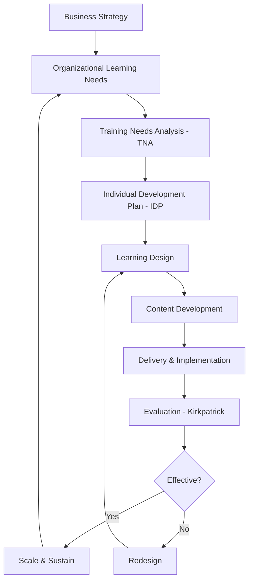
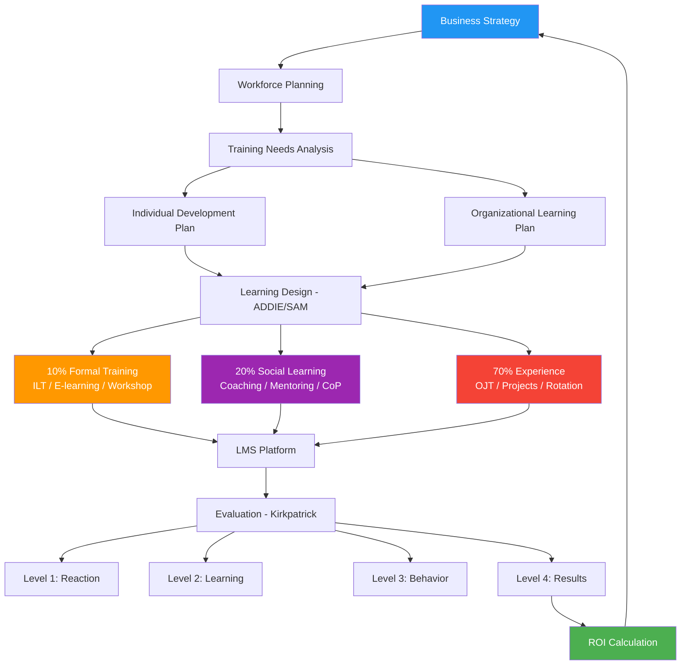

# HR04 — Đào Tạo & Phát Triển (Learning & Development)

> **Learning & Development (L&D)** là tập hợp các hoạt động có hệ thống nhằm nâng cao kiến thức, kỹ năng, thái độ và năng lực của người lao động, gắn kết với chiến lược kinh doanh, thúc đẩy hiệu suất cá nhân và tổ chức, đồng thời tạo nền tảng cho văn hóa học tập liên tục.

---

## 01. Định Nghĩa & Phạm Vi

**Learning & Development** bao gồm toàn bộ các sáng kiến, chương trình và quy trình mà tổ chức sử dụng để phát triển năng lực con người:

| Khái niệm | Định nghĩa | Phạm vi |
|-----------|------------|---------|
| **Training** | Đào tạo có mục tiêu rõ ràng, ngắn hạn | Kỹ năng cụ thể, quy trình nghiệp vụ |
| **Learning** | Quá trình tiếp thu kiến thức liên tục | Tự học, trải nghiệm, khám phá |
| **Development** | Phát triển toàn diện dài hạn | Leadership, career growth |
| **Education** | Nền tảng học thuật chính quy | Bằng cấp, chứng chỉ |

**Phân biệt Training vs Development:**
```
TRAINING                          DEVELOPMENT
├── Ngắn hạn (tuần/tháng)        ├── Dài hạn (tháng/năm)
├── Kỹ năng cụ thể               ├── Năng lực tổng thể
├── Nhu cầu hiện tại             ├── Nhu cầu tương lai
├── Kết quả đo lường ngay        ├── Kết quả đo lường dài hạn
└── Instructor-led               └── Self-directed + experiential
```

**Ba trụ cột L&D:**
1. **Learning Architecture** — thiết kế hệ thống học tập
2. **Content & Delivery** — nội dung và phương thức truyền đạt
3. **Measurement & Impact** — đo lường và chứng minh giá trị

---

## 02. Lịch Sử Phát Triển

```
1900s-1940s   Vocational Training
              └── Dạy nghề trong chiến tranh (Training Within Industry - TWI)

1950s-1960s   Behaviorism Era
              ├── Skinner's Programmed Instruction
              └── Dale's Cone of Experience (1946)

1970s-1980s   Systematic Training
              ├── ADDIE Model ra đời (~1975, US Army)
              ├── Kirkpatrick Model (1959-1994)
              └── Malcolm Knowles — Andragogy (học người lớn)

1990s-2000s   Performance Improvement
              ├── Competency-based Training
              ├── E-learning thế hệ 1 (CBT → WBT)
              └── 70-20-10 Model (McCall, 1988)

2000s-2010s   Technology-Enabled Learning
              ├── LMS proliferation (Moodle 2002)
              ├── Social Learning (Web 2.0)
              └── Mobile Learning

2010s-2020s   Experience Design
              ├── Microlearning
              ├── Adaptive Learning (AI)
              ├── xAPI/Tin Can (learning analytics)
              └── Learning in the Flow of Work

2020s+        AI-Powered Learning
              ├── Personalized learning paths
              ├── Generative AI content creation
              ├── Skills-based learning ecosystems
              └── Learning in the metaverse
```

**L&D tại Việt Nam:**
- 1986-2000: Đào tạo nghề trong khu vực Nhà nước
- 2000-2010: FDI mang vào training systems (Toyota, Samsung)
- 2010-2020: Corporate university, e-learning nội địa
- 2020+: Covid thúc đẩy digital learning, LMS nội địa phát triển

---

## 03. Khái Niệm Cốt Lõi

### Adult Learning Theory (Andragogy — Malcolm Knowles)
6 nguyên tắc học người lớn:
1. **Self-concept**: Người lớn cần tự chủ trong học tập
2. **Experience**: Kinh nghiệm là nguồn tài nguyên học tập
3. **Readiness**: Học khi có nhu cầu thực tế
4. **Orientation**: Học hướng đến giải quyết vấn đề
5. **Motivation**: Động lực nội tại quan trọng hơn ngoại lực
6. **Need to know**: Cần biết "tại sao" trước khi học "như thế nào"

### Bloom's Taxonomy (Revised 2001)
```
        ╔═══════════╗
        ║  CREATE   ║  Tổng hợp, sáng tạo, thiết kế
        ╠═══════════╣
        ║ EVALUATE  ║  Đánh giá, phê bình, lựa chọn
        ╠═══════════╣
        ║  ANALYZE  ║  Phân tích, so sánh, cấu trúc
        ╠═══════════╣
        ║   APPLY   ║  Thực hiện, giải quyết, sử dụng
        ╠═══════════╣
        ║UNDERSTAND ║  Giải thích, tóm tắt, phân loại
        ╠═══════════╣
        ║ REMEMBER  ║  Nhận biết, nhớ lại, liệt kê
        ╚═══════════╝
```

### Competency Framework Basics
- **Knowledge** (Kiến thức): biết gì
- **Skill** (Kỹ năng): làm được gì
- **Attitude** (Thái độ): muốn làm hay không
- **Behavior** (Hành vi): thực tế làm gì

---

## 04. Frameworks & Models

### 4.1 ADDIE Model

```
ANALYSIS → DESIGN → DEVELOPMENT → IMPLEMENTATION → EVALUATION
    │           │           │              │              │
 Phân tích  Thiết kế   Xây dựng      Triển khai     Đánh giá
 nhu cầu    chương     nội dung      đào tạo        kết quả
            trình
```

**Chi tiết từng giai đoạn:**

| Giai đoạn | Câu hỏi chính | Output |
|-----------|--------------|--------|
| Analysis | Ai cần học gì? Tại sao? | TNA report, learner profile |
| Design | Học gì, theo thứ tự nào? | Course outline, learning objectives |
| Development | Nội dung trông như thế nào? | Materials, videos, assessments |
| Implementation | Ai dạy, khi nào, ở đâu? | Delivery plan, LMS upload |
| Evaluation | Hiệu quả không? ROI là gì? | Kirkpatrick report |

### 4.2 SAM (Successive Approximation Model)

Phương pháp Agile trong L&D — thay thế ADDIE tuyến tính:
```
Preparation → Iterative Design → Iterative Development
      │              │                    │
  Background      Savvy Start         Alpha → Beta
  Info           Design Proof         → Gold
```

### 4.3 70-20-10 Model

```
╔══════════════════════════════════════════════════════╗
║                   70-20-10 MODEL                     ║
╠══════════════╦═══════════════╦══════════════════════╣
║   70%        ║     20%       ║       10%            ║
║ ON-THE-JOB   ║ SOCIAL/       ║  FORMAL TRAINING     ║
║ EXPERIENCE   ║ COACHING      ║                      ║
╠══════════════╬═══════════════╬══════════════════════╣
║ • Stretch    ║ • Mentoring   ║ • Classroom          ║
║   assignments║ • Coaching    ║ • E-learning         ║
║ • Job        ║ • Peer        ║ • Workshops          ║
║   rotation   ║   learning    ║ • Certifications     ║
║ • Project    ║ • 360° feedback║ • Conferences       ║
║   leadership ║ • Communities  ║                     ║
║ • Shadowing  ║   of practice  ║                     ║
╚══════════════╩═══════════════╩══════════════════════╝
```

**Ứng dụng tại DN Việt Nam:**
- 70%: giao việc khó hơn, luân chuyển bộ phận, dự án liên phòng
- 20%: chương trình mentor nội bộ, lunch & learn, knowledge sharing
- 10%: lớp đào tạo kỹ thuật, chứng chỉ chuyên môn, hội thảo

### 4.4 Kirkpatrick Model (4 Levels)

```
Level 4: RESULTS     ← Tác động kinh doanh (Revenue, Quality, Safety)
    ↑
Level 3: BEHAVIOR    ← Thay đổi hành vi tại nơi làm việc (3-6 tháng sau)
    ↑
Level 2: LEARNING    ← Kiến thức/kỹ năng học được (pre/post test)
    ↑
Level 1: REACTION    ← Cảm nhận học viên (happiness sheet)
```

**Thực tế VN:** 90% DN chỉ đo Level 1 (feedback form sau khóa học). Ít DN đo Level 3-4 vì khó và tốn thời gian.

---

## 05. Quy Trình L&D

### Chu trình L&D đầy đủ:



### Training Needs Analysis (TNA) Process:

```
Step 1: Organizational Analysis
        └── Chiến lược, văn hóa, tài nguyên, môi trường

Step 2: Task/Job Analysis
        └── KSA (Knowledge/Skills/Attitudes) cần thiết cho vai trò

Step 3: Person Analysis
        └── Ai cần đào tạo, gap hiện tại là gì

Step 4: Gap Analysis
        Current Competency ──────────────────┐
                                              ▼
                                    [GAP = Development Need]
                                              ▲
        Required Competency ─────────────────┘
```

---

## 06. Công Cụ & Phương Thức Đào Tạo

### Training Delivery Methods:

| Phương thức | Ưu điểm | Nhược điểm | Phù hợp |
|------------|---------|------------|---------|
| **ILT** (Instructor-Led) | Tương tác, thực hành | Chi phí cao, khó scale | Kỹ năng mềm, kỹ thuật phức tạp |
| **E-learning (async)** | Scale, self-paced | Ít tương tác | Kiến thức nền, compliance |
| **Virtual Classroom** | Tiết kiệm chi phí | Cần hạ tầng, kỷ luật | Team phân tán |
| **Blended Learning** | Kết hợp tốt nhất | Cần thiết kế kỹ | Hầu hết chương trình |
| **Microlearning** | Ngắn, tập trung | Không đủ cho kỹ năng phức tạp | Just-in-time support |
| **Coaching 1:1** | Cá nhân hóa cao | Tốn thời gian | High potential, leaders |
| **Mentoring** | Truyền kinh nghiệm | Phụ thuộc mentor | Career development |
| **Action Learning** | Giải quyết vấn đề thực | Cần facilitator giỏi | Senior management |
| **Job Rotation** | Trải nghiệm đa chiều | Gián đoạn công việc | Mid-level talent |

### LMS (Learning Management System):

| Hệ thống | Loại | Phù hợp | Giá |
|----------|------|---------|-----|
| **Moodle** | Open source | SME, trường học | Miễn phí (tự host) |
| **Cornerstone OnDemand** | SaaS | Enterprise | $$$$ |
| **SAP SuccessFactors** | SaaS | Enterprise, tích hợp ERP | $$$$ |
| **TalentLMS** | SaaS | SME | $$ |
| **Docebo** | SaaS | Mid-market | $$$ |
| **BIPO** | SaaS (VN) | DN VN, Southeast Asia | $$ |
| **Base.vn** | SaaS (VN) | SME Việt Nam | $ |

---

## 07. KPI & Đo Lường L&D

### KPI Dashboard:

```
┌─────────────────────────────────────────────────────────┐
│                   L&D KPI DASHBOARD                     │
├────────────────┬────────────────┬───────────────────────┤
│ INPUT          │ PROCESS        │ OUTPUT                │
├────────────────┼────────────────┼───────────────────────┤
│ Training budget│ Training hours │ Post-training test    │
│ /employee/year │ /employee/year │ scores (L2)           │
│                │                │                       │
│ # Programs     │ Completion     │ Behavior change       │
│ developed      │ rate (%)       │ assessment (L3)       │
│                │                │                       │
│ # Trainers     │ Learner        │ Business impact       │
│ certified      │ satisfaction   │ metrics (L4)          │
│                │ (L1 score)     │                       │
│ % Budget used  │ Time-to-       │ Training ROI (%)      │
│                │ complete       │                       │
└────────────────┴────────────────┴───────────────────────┘
```

### Benchmarks ngành (nguồn ATD, 2023):

| Chỉ số | Benchmark toàn cầu | VN thực tế |
|--------|-------------------|-----------|
| Training spend/employee/year | $1,252 (USD) | ~3-10 triệu VND |
| Training hours/employee/year | 33.5 giờ | 8-20 giờ |
| L1 satisfaction score | 4.2/5.0 | 4.0-4.5/5.0 |
| Training completion rate | 85% | 60-75% |
| Training ROI | 40-60% | Hiếm khi đo |

---

## 08. Rủi Ro & Thách Thức

| Rủi ro | Mô tả | Biện pháp |
|--------|-------|-----------|
| **Đào tạo không liên kết chiến lược** | Training vì training, không có ROI | Alignment workshop với business |
| **Kiến thức không được áp dụng** | Transfer of learning problem | 70% on-the-job + manager support |
| **Chi phí bị cắt khi khó khăn** | L&D là chi phí "dễ cắt" đầu tiên | Chứng minh ROI, link to revenue |
| **Nội dung lỗi thời** | Tài liệu không cập nhật | Content governance process |
| **LMS adoption thấp** | Nhân viên không dùng | UX design, gamification, mandate |
| **One-size-fits-all** | Không cá nhân hóa | Learning paths, IDP |
| **Trainer chất lượng thấp** | Đào tạo kém hiệu quả | Train-the-trainer program |
| **Đào tạo "sự kiện" 1 lần** | Không retention | Spaced repetition, follow-up |

---

## 09. Best Practices

1. **Link L&D to Business Strategy**: Mọi chương trình phải trả lời câu hỏi "Business problem nào được giải quyết?"
2. **Start with TNA**: Không đào tạo trước khi phân tích nhu cầu thực sự
3. **Apply 70-20-10**: Formal training chỉ là một phần nhỏ
4. **Manager as Coach**: Quản lý trực tiếp là yếu tố quan trọng nhất trong transfer of learning
5. **Measure beyond Level 1**: Đầu tư vào đo lường Level 2, 3, 4
6. **Personalize Learning Paths**: IDP cho từng cá nhân
7. **Build Learning Culture**: L&D không chỉ là phòng đào tạo
8. **Embrace Technology**: LMS, microlearning, AI-powered recommendations
9. **Recognize & Reward Learning**: Kết nối học tập với performance review, career advancement
10. **Create Communities of Practice**: Peer learning networks

---

## 10. Sai Lầm Phổ Biến

| Sai lầm | Biểu hiện | Hậu quả |
|---------|-----------|---------|
| **Happy sheets thay ROI** | Chỉ đo satisfaction | Không biết đào tạo có hiệu quả |
| **Spray & Pray** | Training tất cả mọi người mọi thứ | Lãng phí, chán nản |
| **Classroom-only** | Bỏ qua 70% + 20% | Không transfer được |
| **Training not performance support** | Đào tạo thay vì fix process/tools | Không giải quyết vấn đề gốc |
| **No manager involvement** | Manager không biết nhân viên học gì | Không có reinforcement |
| **Death by PowerPoint** | Slide dày, giảng thụ động | Học viên ngủ gật |
| **No pre-work** | Học viên đến không chuẩn bị | Lãng phí classroom time |
| **Đào tạo 1 lần, không follow-up** | Workshop → quên 80% sau 1 tuần | Zero retention |

---

## 11. Case Study — Việt Nam: Viettel Learning Academy

### Bối cảnh:
Viettel Group với hơn 100,000 nhân viên tại 18 quốc gia cần hệ thống đào tạo quy mô lớn, đồng nhất.

### Thách thức:
- Nhân viên phân tán địa lý rộng (VN + 17 quốc gia châu Phi, Đông Nam Á)
- Đa dạng văn hóa và ngôn ngữ
- Tốc độ thay đổi công nghệ viễn thông nhanh
- Chi phí đào tạo tập trung quá cao

### Giải pháp L&D:
```
Viettel Learning Academy Model
├── Corporate University Structure
│   ├── Viettel Military Officers Training
│   ├── Technical Skills Academy
│   ├── Sales & Customer Service Academy
│   └── Leadership Development Institute
├── Technology Platform
│   ├── Nền tảng e-learning nội bộ
│   ├── 5,000+ khóa học số hóa
│   └── Mobile learning app
├── Delivery Blend
│   ├── 40% Online learning
│   ├── 40% On-the-job projects
│   └── 20% Classroom (leadership)
└── Measurement
    ├── Competency assessment trước/sau
    └── Performance linkage tracking
```

### Kết quả:
- Tiết kiệm 60% chi phí đào tạo so với ILT thuần túy
- Tăng completion rate từ 45% lên 78%
- Leadership pipeline: 85% vị trí quản lý lấp bằng nội bộ

---

## 12. Case Study — Quốc Tế: Amazon "Upskilling 2025"

### Bối cảnh:
Amazon cam kết đầu tư $1.2 tỷ USD để upskill 300,000 nhân viên đến 2025.

### Chương trình:
- **Amazon Technical Academy**: chuyển từ non-tech sang software engineer
- **Machine Learning University**: ML skills cho engineers
- **Career Choice**: Amazon trả trước 95% học phí cho bằng cấp liên quan đến nghề nghiệp tương lai (không cần liên quan đến Amazon)
- **AWS Training & Certification**: cloud skills

### Bài học:
1. Reskilling phải đi kèm career pathway rõ ràng
2. Pay-it-forward: đầu tư vào tương lai nhân viên, kể cả khi họ rời công ty
3. Scale đòi hỏi technology-first approach
4. Partnership với community colleges và vocational schools

---

## 13. So Sánh — Các Tiếp Cận Đào Tạo

| Tiêu chí | ADDIE | SAM | Design Thinking |
|----------|-------|-----|----------------|
| **Tư duy** | Linear | Agile | Human-centered |
| **Tốc độ** | Chậm | Nhanh | Trung bình |
| **Rủi ro** | Cao (sai từ đầu) | Thấp (iterate) | Thấp |
| **Phù hợp** | Dự án lớn, ổn định | Dự án nhanh | Inovation |
| **Documentation** | Nhiều | Ít | Vừa |
| **SME involvement** | Cuối | Liên tục | Liên tục |

---

## 14. Ứng Dụng Theo Ngành

| Ngành | Đặc thù L&D | Phương thức ưu tiên |
|-------|-------------|---------------------|
| **Manufacturing** | Safety, SOPs, technical skills | ILT, OJT, checklist-based |
| **Retail/FMCG** | Product knowledge, sales | Microlearning, mobile, roleplay |
| **Banking/Finance** | Compliance, regulations | E-learning, certification |
| **Technology** | Technical skills, fast-changing | Self-directed, hackathons, courses |
| **Healthcare** | Clinical skills, patient safety | Simulation, case study |
| **Hospitality** | Service standards, soft skills | ILT, roleplay, mystery shopper |
| **Education** | Pedagogy, subject matter | Peer learning, CoP |

---

## 15. Ứng Dụng Theo Quy Mô DN

```
STARTUP (< 50 người)
├── Budget: < 5 triệu VND/người/năm
├── Approach: Self-directed + external courses (Coursera, LinkedIn Learning)
├── Tools: Google Classroom, Notion
└── Focus: Skills directly needed now

SME (50-500 người)
├── Budget: 5-15 triệu VND/người/năm
├── Approach: Mix ILT + LMS đơn giản (TalentLMS, Moodle)
├── Tools: Base.vn hoặc BIPO
└── Focus: Onboarding, technical, compliance

MIDSIZE (500-2000 người)
├── Budget: 10-25 triệu VND/người/năm
├── Approach: L&D team, blended learning, LMS đầy đủ
├── Tools: Cornerstone hoặc Docebo
└── Focus: Leadership pipeline, competency framework

ENTERPRISE (2000+ người)
├── Budget: 25M+ VND/người/năm
├── Approach: Corporate University model, AI-powered learning
├── Tools: SAP SuccessFactors, Workday Learning
└── Focus: Strategic workforce planning, future skills
```

---

## 16. Technology & Digital Learning

### Learning Technology Ecosystem:

```
                    ┌─────────────────┐
                    │   LEARNER       │
                    └────────┬────────┘
                             │
          ┌──────────────────┼──────────────────┐
          │                  │                  │
   ┌──────▼──────┐   ┌───────▼──────┐  ┌───────▼──────┐
   │     LMS     │   │     LXP      │  │   Content    │
   │  (Manage)   │   │  (Experience)│  │  Libraries   │
   │ Compliance  │   │  Recommend   │  │ LinkedIn Lrn │
   │ Assignments │   │  Discover    │  │ Coursera     │
   └─────────────┘   └──────────────┘  └──────────────┘
          │                  │                  │
          └──────────────────┼──────────────────┘
                             │
                    ┌────────▼────────┐
                    │   DATA/ANALYTICS│
                    │  xAPI, SCORM    │
                    │  Learning Record│
                    │  Store (LRS)    │
                    └─────────────────┘
```

### AI trong L&D:
- **Content Generation**: AI tạo quiz, tóm tắt, flashcard
- **Personalization**: Gợi ý learning path dựa trên skill gap
- **Adaptive Assessment**: Câu hỏi thích nghi theo trình độ
- **Chatbot Tutoring**: AI hỏi đáp 24/7
- **Skills Inference**: Phân tích CV, performance để map skills
- **Translation**: Dịch nội dung đào tạo đa ngôn ngữ

---

## 17. Tích Hợp Domain

L&D không đứng độc lập — liên kết chặt với:

```
PERFORMANCE MANAGEMENT (HR03)
    └── IDP dựa trên performance review gaps
    └── Development goals trong appraisal

TALENT MANAGEMENT (HR08)
    └── Hi-po programs
    └── Succession planning needs

ORGANIZATION DESIGN (HR05)
    └── New org = new role competencies
    └── Change management training

COMPENSATION (HR06)
    └── Skills-based pay
    └── Certification bonuses

RECRUITMENT (HR01)
    └── Time-to-productivity (onboarding)
    └── Skills gap informs hiring plan

BUSINESS STRATEGY
    └── Strategic workforce planning
    └── Future capabilities needed
```

---

## 18. Xu Hướng L&D 2024-2026

| Xu hướng | Mô tả | Mức độ tác động |
|---------|-------|----------------|
| **AI-Powered Personalization** | Learning paths tự động cá nhân hóa | Rất cao |
| **Skills-Based Learning** | Map learning to specific skills, not roles | Cao |
| **Learning in the Flow of Work** | Tích hợp học vào công cụ (Slack, Teams) | Cao |
| **Micro-credentials** | Badges, nano-degrees thay bằng cấp truyền thống | Trung bình |
| **Immersive Learning (VR/AR)** | Training thực tế ảo (an toàn, kỹ thuật) | Trung bình |
| **Internal Talent Marketplace** | Kết nối nhân viên với dự án, gig | Cao |
| **Data-Driven L&D** | Learning analytics quyết định đầu tư | Cao |
| **Gen AI Content Authoring** | AI hỗ trợ tạo nội dung khóa học | Rất cao |
| **Wellbeing Learning** | Tích hợp mental health, resilience | Trung bình |

---

## 19. Bối Cảnh Việt Nam

### Đặc thù thị trường lao động VN:

**1. Văn hóa học tập Nho giáo:**
- Giáo dục được coi trọng cao — bằng cấp là "vé" vào đời
- Nhưng: học để thi, không học để ứng dụng
- Thách thức: chuyển từ tư duy "học thuộc" sang "học làm"

**2. Khoảng cách kỹ năng:**
```
Kỹ năng thiếu hụt tại VN (WEF/ManpowerGroup):
├── English proficiency (63% lao động dưới B1)
├── Digital literacy (30% lao động chưa dùng máy tính)
├── Critical thinking & problem solving
├── Data analytics
└── Leadership & management
```

**3. Chi phí đào tạo:**
- Thường bị cắt đầu tiên khi doanh nghiệp gặp khó khăn
- Nhiều CEO VN coi đào tạo là chi phí, không phải đầu tư
- Không có ROI tracking → không thể defend budget

**4. Quy định pháp lý:**
- **BLLĐ 45/2019/QH14 — Điều 60**: Người sử dụng lao động có trách nhiệm đào tạo, bồi dưỡng nâng cao trình độ
- **NĐ 145/2020/NĐ-CP**: Hướng dẫn về đào tạo nghề
- **Quỹ Bảo hiểm thất nghiệp**: Hỗ trợ đào tạo nghề cho lao động thất nghiệp
- **Đào tạo nghề theo đặt hàng**: Nhà nước hỗ trợ đào tạo cho các ngành ưu tiên

**5. Cạnh tranh nhân tài:**
- Brain drain sang Singapore, Nhật, Úc
- FDI đang cạnh tranh nhân tài với DN nội địa
- Đào tạo tốt → giữ chân tốt hơn

**6. Upskilling cho chuyển đổi số:**
- Chương trình "1 triệu chuyên gia số" của Bộ TT&TT
- Các sáng kiến: Google Digital Garage, Microsoft Skills for Jobs
- Nhu cầu: Python, AI/ML, Cloud, Cybersecurity

---

## 20. Checklist L&D

### TNA Checklist:
- [ ] Xác định business problem cần giải quyết
- [ ] Interview stakeholders (managers, business leaders)
- [ ] Phân tích competency gap (current vs required)
- [ ] Survey nhân viên về nhu cầu học tập
- [ ] Ưu tiên hóa danh sách nhu cầu đào tạo
- [ ] Ước tính ROI tiềm năng

### Program Design Checklist:
- [ ] Viết learning objectives theo SMART + Bloom's
- [ ] Chọn delivery method phù hợp
- [ ] Thiết kế pre/post assessment
- [ ] Xây dựng evaluation plan (Kirkpatrick)
- [ ] Xác định budget và nguồn lực
- [ ] Lên lịch và thông báo

### Post-Training Checklist:
- [ ] Thu thập Level 1 feedback (reaction)
- [ ] Chạy pre/post test (Level 2 learning)
- [ ] Follow-up với manager về application (Level 3)
- [ ] Đo KPI business impact sau 3-6 tháng (Level 4)
- [ ] Cập nhật nội dung theo feedback
- [ ] Document lessons learned

---

## 21. Training Needs Analysis (TNA) — Chuyên Sâu

### Ba cấp độ TNA:

```
ORGANIZATIONAL LEVEL
├── Chiến lược công ty 3-5 năm tới → cần năng lực gì?
├── KPI công ty đang không đạt → training có giải quyết không?
├── Culture change → cần behavior change nào?
└── Output: Organization-wide learning priorities

TASK/JOB LEVEL
├── Phân tích từng vị trí: nhiệm vụ, điều kiện, tiêu chuẩn
├── KSA (Knowledge, Skills, Attitudes) cần thiết
├── Competency mapping cho từng role
└── Output: Competency framework by role

PERSON LEVEL
├── Ai đang dưới chuẩn? Ai cần nâng cao?
├── Performance data, 360° feedback, self-assessment
├── Career aspirations vs current skills
└── Output: Individual Development Plans (IDP)
```

### Gap Analysis Matrix:

```
                    IMPORTANCE (for business)
                    Low          High
                ┌────────────┬────────────┐
           High │   NICE TO  │  DEVELOP   │
CURRENT         │   HAVE     │  URGENTLY  │
PROFICIENCY     ├────────────┼────────────┤
           Low  │  DON'T     │  CRITICAL  │
                │  PRIORITIZE│  GAP       │
                └────────────┴────────────┘
```

### Individual Development Plan (IDP):

```
IDP TEMPLATE
┌─────────────────────────────────────────────────┐
│ Nhân viên: _________________ Kỳ: Q1/2025        │
│ Vị trí: __________________ Manager: ___________ │
├─────────────────────────────────────────────────┤
│ CAREER GOAL (1-3 năm): _________________________ │
├─────────────────────────────────────────────────┤
│ DEVELOPMENT AREAS:                              │
│ 1. [Competency] Gap: [X→Y] Method: [OJT/Course] │
│ 2. [Competency] Gap: [X→Y] Method: [Mentoring]  │
│ 3. [Competency] Gap: [X→Y] Method: [Project]    │
├─────────────────────────────────────────────────┤
│ SUPPORT NEEDED: Budget, Time, Sponsor           │
│ REVIEW DATE: __________________________________ │
└─────────────────────────────────────────────────┘
```

---

## 22. Learning Design Models

### ADDIE vs SAM vs Design Thinking:

```
ADDIE (Waterfall):
A → D → D → I → E
(Sequential, tốt cho dự án có spec rõ)

SAM (Agile):
Prep → [Design ↔ Develop] → Implement
(Iterative, nhanh hơn, ít rủi ro hơn)

Design Thinking (Human-Centered):
Empathize → Define → Ideate → Prototype → Test
(Tập trung learner experience)
```

### Mục tiêu học tập theo Bloom's:

| Level | Động từ hành động | Ví dụ Learning Objective |
|-------|------------------|-------------------------|
| Remember | List, define, recall | "Liệt kê 5 bước quy trình bán hàng" |
| Understand | Explain, summarize | "Giải thích tại sao khách hàng từ chối" |
| Apply | Use, execute, solve | "Áp dụng kỹ thuật SPIN selling trong roleplay" |
| Analyze | Compare, differentiate | "Phân tích điểm khác biệt giữa 2 đối thủ cạnh tranh" |
| Evaluate | Judge, critique | "Đánh giá hiệu quả chiến dịch marketing vừa qua" |
| Create | Design, build, compose | "Thiết kế quy trình chăm sóc khách hàng mới" |

---

## 23. 70-20-10 Ứng Dụng Thực Tế VN

### Rào cản triển khai tại VN:

| Rào cản | Nguyên nhân | Giải pháp |
|---------|-------------|-----------|
| Manager không coaching | Áp lực KPI, thiếu kỹ năng | Manager-as-coach training |
| 70% không có stretch assignments | Không dám giao việc khó | Culture shift + safe-to-fail |
| Mentor programs chỉ hình thức | Không có structured program | Mentoring toolkit, check-in schedule |
| Nhân viên ngại hỏi | Văn hóa "thứ bậc", sợ sai | Psychological safety workshops |

### Ví dụ ứng dụng 70-20-10 tại Vingroup:
- **70%**: Trainee program — giao dự án thực từ tháng 3
- **20%**: Mentor là C-level, monthly 1:1 sessions
- **10%**: 2 tuần off-site training tại Học viện Vingroup

---

## 24. Training Delivery Methods — Chuyên Sâu

### Blended Learning Design:

```
PRE-WORK (Online, 1-2 giờ)
├── Video giới thiệu concept (5-10 phút)
├── Pre-reading hoặc case study
└── Pre-assessment (kiểm tra kiến thức nền)
        ↓
WORKSHOP (Face-to-face/Virtual, 4-8 giờ)
├── Activating prior knowledge (30 min)
├── New skills demonstration (60 min)
├── Guided practice + roleplay (120 min)
├── Application planning (60 min)
└── Q&A và action commitment (30 min)
        ↓
POST-WORK (Online + OJT, 2-4 tuần)
├── Practice assignments
├── Manager check-in (tuần 1)
├── Peer learning circle (tuần 2)
├── Microlearning reinforcement
└── Assessment cuối (tuần 4)
```

### Microlearning Design Principles:
- **Thời lượng**: 3-7 phút mỗi module
- **1 mục tiêu** duy nhất mỗi module
- **Mobile-first**: 60%+ người dùng học trên điện thoại
- **Pull, not push**: Nhân viên chủ động tìm khi cần (performance support)
- **Spaced repetition**: Lặp lại theo chu kỳ Ebbinghaus (1 ngày, 3 ngày, 1 tuần, 1 tháng)

---

## 25. LMS — Triển Khai & Quản Trị

### LMS Selection Criteria:

```
MUST-HAVE
├── SCORM/xAPI compliance
├── Mobile responsive
├── Assessment & quiz engine
├── Reporting & analytics
├── SSO integration
└── Support tiếng Việt (nếu cần)

NICE-TO-HAVE
├── AI recommendations
├── Social learning features
├── Gamification
├── Skills mapping
└── Integration với HRIS
```

### LMS Governance:

| Vai trò | Trách nhiệm |
|---------|------------|
| LMS Admin | User management, technical setup |
| Content Owner | Nội dung cập nhật, chất lượng |
| L&D Manager | Strategy, reporting, budget |
| Department Manager | Assign learning, monitor completion |
| Learner | Complete assignments, feedback |

---

## 26. Leadership Development

### High-Potential (Hi-Po) Program Framework:

```
IDENTIFY
├── Performance: top 20% performers
├── Potential indicators: learning agility, social skills, drive
└── Assessment: 9-box grid, psychometric tests

DEVELOP
├── Stretch assignments (cross-functional projects)
├── Executive coaching (1:1, 6-12 tháng)
├── Action learning sets (real business problems)
├── External exposure (conferences, benchmarking)
└── 360° feedback + debrief

ENGAGE & RETAIN
├── Transparent career conversations
├── Accelerated promotion track
├── Senior leader sponsorship (not just mentoring)
└── Compensation differentiation
```

### 360° Feedback Process:
1. Chọn raters: self + manager + peers (4-6) + direct reports
2. Gửi survey (ẩn danh ngoài manager)
3. Thu thập data (2 tuần)
4. Tạo report với themes
5. Debrief 1:1 với facilitator
6. IDP update dựa trên feedback

### Management Trainee Programs (VN phổ biến):
- Unilever Future Leaders Programme
- Procter & Gamble Management Trainee
- Masan Group Management Trainee
- Vingroup Trainee
- Techcombank Leadership Associates

---

## 27. Competency Framework — Thiết Kế & Ứng Dụng

### Cấu trúc Competency Framework:

```
COMPETENCY FRAMEWORK
├── CORE COMPETENCIES (tất cả nhân viên)
│   ├── Customer Focus
│   ├── Integrity & Ethics
│   ├── Collaboration
│   ├── Communication
│   └── Results Orientation
│
├── FUNCTIONAL COMPETENCIES (theo bộ phận)
│   ├── Finance: Financial Modeling, Risk Analysis
│   ├── Sales: Negotiation, Pipeline Management
│   ├── HR: Talent Assessment, Coaching
│   └── Tech: System Design, Code Quality
│
└── LEADERSHIP COMPETENCIES (cho managers)
    ├── Strategic Thinking
    ├── Leading Change
    ├── Developing Others
    └── Business Acumen
```

### Proficiency Levels:

| Level | Mô tả | Biểu hiện |
|-------|-------|-----------|
| 1 — Aware | Biết khái niệm | Hiểu định nghĩa, chưa áp dụng |
| 2 — Basic | Làm được có hỗ trợ | Cần hướng dẫn khi thực hiện |
| 3 — Proficient | Làm được độc lập | Thực hiện đúng không cần hỗ trợ |
| 4 — Advanced | Làm tốt, phức tạp | Xử lý tình huống khó, mentor người khác |
| 5 — Expert | Chuẩn mực ngành | Đào tạo, tư vấn, định hình practices |

---

## 28. Kirkpatrick Model — Đo Lường Thực Tế

### Level 1 — Reaction:
```
Công cụ: Happy Sheet / Feedback Form
Câu hỏi:
- Chương trình có liên quan đến công việc của bạn không? (1-5)
- Trainer có hiệu quả không? (1-5)
- Nội dung có rõ ràng không? (1-5)
- Bạn sẽ giới thiệu khóa học này cho đồng nghiệp không? (NPS)
Timing: Ngay sau khóa học
```

### Level 2 — Learning:
```
Công cụ: Pre-test + Post-test, Skills demonstration
- Pre-test trước ngày 1
- Post-test ngay sau kết thúc
- Kiểm tra thực hành (roleplay, simulation)
- Tính "learning gain" = Post - Pre
Timing: Trong và ngay sau khóa học
```

### Level 3 — Behavior:
```
Công cụ: Manager observation, 360° feedback, performance data
- 30-day follow-up: "Bạn đã áp dụng gì từ khóa học?"
- Manager survey: "Nhân viên có thay đổi hành vi không?"
- Mystery shopper (nếu là sales/service training)
Timing: 30-90 ngày sau khóa học
```

### Level 4 — Results:
```
Công cụ: Business KPI comparison
- Doanh số trước/sau training
- Tỷ lệ lỗi/tai nạn trước/sau
- Thời gian xử lý giảm bao nhiêu?
- Customer satisfaction thay đổi?
Timing: 3-6 tháng sau khóa học
```

---

## 29. Learning ROI — Phillips Methodology

### Công thức ROI:

```
ROI (%) = [(Benefits - Costs) / Costs] × 100

Benefits:
├── Hard benefits: doanh số tăng, chi phí giảm, lỗi giảm
└── Soft benefits (convert to $): retention cải thiện, satisfaction tăng

Costs:
├── Development costs: thiết kế, content, technology
├── Delivery costs: trainer, venue, materials
├── Participant costs: lương × giờ học × số người
└── Evaluation costs

Isolation techniques:
├── Control group (nhóm không được đào tạo)
├── Trend analysis (trước/sau so với trend)
├── Expert estimation (manager ước tính %)
└── Statistical analysis
```

### Ví dụ tính ROI:

```
Sales Training — 50 nhân viên:

Costs:
├── Design & Development: 50 triệu VND
├── Training delivery (2 ngày): 20 triệu
├── Participant time (50 × 2 ngày × 1.5 triệu): 150 triệu
└── Total Cost: 220 triệu VND

Benefits (6 tháng sau):
├── Tăng conversion rate: 5% → 7% (+40%)
├── Tổng doanh số tăng: 500 triệu VND
└── Attribution: 50% do training = 250 triệu

ROI = (250 - 220) / 220 × 100 = 13.6%

Với isolation factor 50%:
Adjusted ROI: (125 - 220) / 220 × 100 = -43%
→ Cần review lại chương trình!
```

---

## 30. Social Learning & Communities of Practice

### Community of Practice (CoP) Framework:

```
CoP ELEMENTS:
├── Domain: Chủ đề/lĩnh vực (vd: Data Analytics)
├── Community: Thành viên có chung mối quan tâm
└── Practice: Kiến thức, công cụ, phương pháp chung

HOẠT ĐỘNG CoP:
├── Weekly/monthly meetups (virtual/physical)
├── Knowledge-sharing sessions
├── Case study discussions
├── Resource library (docs, templates)
├── Expert speaker series
└── Problem-solving clinics

ROLES:
├── Community Leader (1-2 người)
├── Content Curator
├── Event Organizer
└── Members (active + passive)
```

### Internal Mentoring Program:

| Giai đoạn | Hoạt động | Thời gian |
|-----------|-----------|-----------|
| Match-making | Matching dựa trên goals + expertise | Tháng 1 |
| Kick-off | Orientation, expectations, tools | Tháng 1 |
| Regular sessions | 1:1 monthly meetings (1 giờ) | Tháng 2-10 |
| Mid-point review | Check-in với L&D team | Tháng 5-6 |
| Celebration | Showcase, recognition | Tháng 12 |
| Evaluation | Survey mentors & mentees | Tháng 12 |

---

## 31. Microlearning & Mobile Learning

### Microlearning Formats:

| Format | Thời gian | Use case |
|--------|-----------|----------|
| Explainer video | 2-5 phút | Concept introduction |
| Infographic | 1-2 phút | Process, statistics |
| Podcast/Audio | 5-10 phút | During commute |
| Quiz/Assessment | 2-3 phút | Knowledge check |
| Scenario-based | 3-7 phút | Decision-making |
| Interactive PDF | 3-5 phút | Reference material |
| Short game | 5 phút | Engagement, recall |

### Gamification trong L&D:

```
GAMIFICATION ELEMENTS:
├── Points: Tích điểm mỗi khi hoàn thành module
├── Badges: Huy hiệu cho thành tựu (First completion, Perfect Score)
├── Leaderboard: Xếp hạng team, department
├── Progress bars: Thấy tiến trình học
├── Streaks: Liên tục học mỗi ngày
├── Levels: Mở khóa nội dung nâng cao
└── Rewards: Đổi điểm lấy phần thưởng thực tế

VN Example (FPT Software):
└── "FPT Learning Champion" — gamification LMS với 15,000+ users
    ├── Weekly challenges
    ├── Team competitions
    └── Top learners nhận recognition + bonus
```

---

## 32. Upskilling & Reskilling

### Tác động Automation đến lao động VN:

```
AT RISK (High automation potential):
├── Data entry, accounting clerks: 85-95%
├── Assembly line workers: 70-85%
├── Customer service (basic): 60-70%
├── Drivers: 40-60% (dài hạn)
└── Retail cashiers: 50-70%

AUGMENTED (Human + AI):
├── Sales (AI-assisted): 30-40% tasks automated
├── Analysts: 40-50% routine tasks automated
└── Managers: 20-30% admin automated

GROWING:
├── AI/ML engineers
├── Data scientists
├── Cybersecurity experts
├── UX/UI designers
└── Renewable energy technicians
```

### Reskilling Pathways:

```
ACCOUNTING CLERK → DATA ANALYST
Path: Excel Advanced → SQL basics → Python basics → Data visualization
Time: 6-12 tháng, 2-3 giờ/ngày
Cost: 5-15 triệu VND (Coursera + local bootcamp)

ASSEMBLY WORKER → ROBOT OPERATOR/TECHNICIAN
Path: Basic mechanics → PLC programming → Robot operation cert
Time: 3-6 tháng
Partners: LILAMA, trường nghề kỹ thuật
Support: Quỹ bảo hiểm thất nghiệp (đến 1 triệu/tháng)
```

---

## 33. Talent Marketplace & Internal Mobility

### Internal Talent Marketplace:

```
CONCEPT:
Platform kết nối nhân viên với cơ hội nội bộ:
├── Full-time open roles (internal first)
├── Project gig opportunities (5-20% thời gian)
├── Mentoring connections
├── Communities of practice
└── Stretch assignments

BENEFITS:
├── Tăng retention (nhân viên thấy tương lai)
├── Giảm external hiring cost
├── Tăng knowledge transfer
└── Build agile workforce

VN CONTEXT:
├── Ít DN VN triển khai chính thức
├── Rào cản: manager không muốn "nhả" nhân viên giỏi
├── Solution: C-level mandate + manager incentive để phát triển team
└── Early adopters: FPT, Vingroup, Techcombank
```

---

## 34. L&D trong Bối Cảnh Chuyển Đổi Số

### Digital Learning Maturity Model:

```
Level 1 — DIGITIZED
└── PowerPoint chuyển sang PDF, YouTube videos
    (Không có LMS, không tracking)

Level 2 — E-LEARNING
└── LMS cơ bản, SCORM courses
    (Tracking completion, đơn giản)

Level 3 — BLENDED
└── Mix online + offline + performance support
    (Learning paths, assessments)

Level 4 — ADAPTIVE
└── AI personalization, skills mapping
    (Learning recommendations, data-driven)

Level 5 — ECOSYSTEM
└── Seamless integration: LMS + HCM + Work tools
    (Learning in the flow of work, continuous)
```

### Learning in the Flow of Work:

```
Concept (Josh Bersin, 2018):
Nhúng learning vào công cụ làm việc hàng ngày

Examples:
├── Salesforce: Training tips trong CRM interface
├── Microsoft Viva: Learning trong Teams
├── SAP: Guided learning trong ERP workflow
└── Slack/Teams bots: daily microlearning push

VN Implementation:
├── Base.vn: embed training trong task management
├── HRIS + LMS integration
└── WhatsApp/Zalo group cho peer learning
```

---

## 35. L&D Team Structure & Roles

### L&D Team cho DN 500-2000 người:

```
Chief Learning Officer (CLO)
├── L&D Business Partners (1/business unit)
│   ├── Tư vấn training needs
│   ├── Stakeholder management
│   └── Evaluation & reporting
├── Learning Design Team
│   ├── Instructional Designer (2-3 người)
│   ├── Content Developer (2 người)
│   └── LMS Administrator (1 người)
├── Facilitation Team
│   ├── Internal Trainers (functional experts)
│   └── Master Facilitators (kỹ năng mềm)
└── Learning Analytics (1 người)
```

### Competencies cho L&D professionals:
- **Learning Design**: ADDIE, UX for learning, visual design
- **Facilitation**: Workshop facilitation, virtual training
- **Consulting**: TNA, stakeholder management, ROI
- **Technology**: LMS admin, authoring tools (Articulate, iSpring)
- **Analytics**: Data literacy, learning metrics
- **Business Acumen**: Understand business strategy, operations

---

## 36. Đánh Giá & Lựa Chọn Vendor Đào Tạo

### Training Vendor Evaluation Framework:

| Tiêu chí | Trọng số | Câu hỏi đánh giá |
|----------|----------|-----------------|
| Chuyên môn content | 30% | Trainer có kinh nghiệm thực tế? Portfolio? |
| Phương pháp | 25% | Có customize không? 70-20-10 không? |
| Kết quả chứng minh | 20% | Case study với công ty tương tự? ROI? |
| Giá | 15% | Cost per learner, total cost vs value |
| Hậu mãi | 10% | Follow-up support, content updates |

### Make vs Buy Decision:

```
BUILD INTERNALLY khi:
├── Nội dung đặc thù công ty (proprietary)
├── Cần update thường xuyên
├── Số lượng học viên đủ lớn để justify cost
└── Có đội ngũ L&D đủ năng lực

BUY EXTERNALLY khi:
├── Kỹ năng phổ thông (leadership, Excel, English)
├── Cần triển khai nhanh
├── Không đủ SME nội bộ
└── Nhu cầu one-time hoặc ít lặp lại

PARTNER (Hybrid):
├── Vendor cung cấp framework, công ty customize content
├── Co-development với training company
└── License content + nội bộ deliver
```

---

## 37. L&D Budget Planning

### L&D Budget Structure:

```
TYPICAL L&D BUDGET ALLOCATION:
├── External Training/Conferences: 30-40%
│   ├── Conferences, seminars
│   ├── External certifications
│   └── Vendor-led programs
├── Internal Program Development: 20-25%
│   ├── Instructional design
│   ├── Content creation
│   └── Materials & tools
├── Technology (LMS, authoring): 15-20%
│   ├── LMS license fees
│   ├── E-learning authoring tools
│   └── Virtual classroom platforms
├── Trainer Costs: 15-20%
│   ├── Internal trainer time
│   └── External trainer fees
└── Evaluation & Admin: 5-10%
```

### Business Case cho L&D Investment:

```
FRAMING:
"Chúng ta đang mất X triệu mỗi năm vì [vấn đề].
Training có thể giảm [vấn đề] xuống Y%,
tiết kiệm Z triệu, ROI = [Z-Cost]/Cost × 100%"

KHÔNG NÊN dùng:
"Đào tạo là quan trọng, chúng ta nên đầu tư..."
(Không có data, không có business case)
```

---

## 38. Onboarding — L&D cho Nhân Viên Mới

### Onboarding Program Best Practice:

```
DAY 1 — Welcome & Orientation
├── Office tour, tool access setup
├── Team introduction
├── Company story, mission, values
└── Admin: contracts, policies review

WEEK 1 — Foundations
├── Role-specific onboarding plan
├── Key stakeholder meetings
├── Product/service deep dive
└── First assignment (small, safe-to-fail)

MONTH 1 — Ramp Up
├── Job shadowing với senior peers
├── Complete required e-learning modules
├── 30-day check-in với manager
└── First project contribution

MONTH 2-3 — Integration
├── Full performance expectations active
├── 60/90-day reviews
├── IDP first draft với manager
└── Buddy program completion

KPI ONBOARDING:
├── Time-to-productivity: bao lâu để đạt 80% performance?
├── 90-day retention rate
├── New hire satisfaction score
└── Manager satisfaction with new hire
```

---

## 39. Measuring L&D Maturity

### L&D Maturity Assessment:

| Dimension | Level 1 (Basic) | Level 3 (Proficient) | Level 5 (World-class) |
|-----------|----------------|---------------------|----------------------|
| **Strategy** | Ad hoc, reactive | Aligned to HR strategy | Integrated with business strategy |
| **Needs Analysis** | No formal TNA | Annual TNA | Continuous, data-driven |
| **Design** | PowerPoint slides | Blended, ADDIE | Personalized, adaptive |
| **Delivery** | Classroom only | Multi-modal | Learning ecosystem |
| **Technology** | None/spreadsheet | LMS | AI-powered LXP |
| **Measurement** | Level 1 only | Level 1-2 | Level 1-4 + ROI |
| **Talent** | 1 trainer | L&D team | Strategic L&D function |

---

## 40. Future of L&D

### Dự đoán 2025-2030:

```
AI AS CO-DESIGNER
└── Gen AI tạo 70% nội dung khóa học
    Con người: strategy, curation, facilitation

SKILLS ECONOMY
└── "What skills do you have?" thay "What degree?"
    Micro-credentials, skill badges quan trọng hơn

CONTINUOUS LEARNING CULTURE
└── Learning không còn là "sự kiện"
    Mỗi người có 30-60 phút/ngày học tập tích hợp

LEARNING ANALYTICS
└── Mọi interaction được track
    AI dự đoán ai cần học gì tiếp theo

HUMAN SKILLS PREMIUM
└── Critical thinking, empathy, creativity
    Sẽ được đào tạo nhiều hơn khi AI làm routine tasks
```

---

## Mermaid Diagram — L&D System Overview



---

## Flashcards — 10 Q&A

**Q1: 70-20-10 model có nghĩa gì và con số đến từ đâu?**
A1: 70% học từ on-the-job experience (công việc thực, thử thách, mistakes), 20% từ social learning (coaching, mentoring, peer learning), 10% từ formal training. Nghiên cứu bởi McCall, Lombardo & Eichinger (1988) từ Center for Creative Leadership — khảo sát 200 executives về cách họ học tập.

**Q2: Sự khác biệt giữa ADDIE và SAM là gì?**
A2: ADDIE là model tuyến tính (waterfall): phải hoàn thành Analysis trước khi Design, v.v. SAM (Successive Approximation Model) là model Agile: lặp đi lặp lại giữa design và development, ra prototype sớm, nhận feedback, cải thiện. SAM nhanh hơn và ít rủi ro sai từ đầu hơn ADDIE.

**Q3: Kirkpatrick Model đo gì ở 4 levels?**
A3: Level 1-Reaction (học viên cảm thấy thế nào), Level 2-Learning (học được gì), Level 3-Behavior (hành vi có thay đổi sau khi về làm việc không?), Level 4-Results (tác động kinh doanh: doanh số, chất lượng, chi phí).

**Q4: Training Needs Analysis (TNA) gồm những gì?**
A4: Ba cấp độ: (1) Organizational analysis — chiến lược, KPI công ty, (2) Task/Job analysis — KSA cần thiết cho từng role, (3) Person analysis — ai đang dưới chuẩn, gap là gì. Kết quả: danh sách nhu cầu đào tạo ưu tiên và Individual Development Plans.

**Q5: Andragogy khác Pedagogy như thế nào?**
A5: Pedagogy (dạy trẻ em): teacher-centered, học vì được yêu cầu. Andragogy (Knowles — dạy người lớn): learner-centered, self-directed, dùng kinh nghiệm, học khi có nhu cầu thực tế, hướng đến giải quyết vấn đề, có động lực nội tại.

**Q6: Competency framework bao gồm những loại competency nào?**
A6: (1) Core competencies — áp dụng cho tất cả nhân viên (integrity, customer focus, teamwork), (2) Functional/Technical competencies — theo ngành nghề/bộ phận, (3) Leadership competencies — cho người quản lý (strategic thinking, developing others, leading change).

**Q7: ROI của training được tính như thế nào?**
A7: ROI (%) = [(Benefits - Costs) / Costs] × 100. Benefits gồm hard (doanh số tăng, chi phí giảm) và soft (convert sang tiền). Costs gồm development, delivery, participant time (opportunity cost). Cần isolate tác động của training bằng control group hoặc trend analysis.

**Q8: Microlearning có đặc điểm gì?**
A8: Module ngắn 3-7 phút, một mục tiêu duy nhất, mobile-first, pull-based (học khi cần), sử dụng spaced repetition (lặp lại theo chu kỳ). Phù hợp cho performance support và knowledge reinforcement, không phù hợp để dạy kỹ năng phức tạp cần thực hành.

**Q9: Sự khác biệt giữa LMS và LXP?**
A9: LMS (Learning Management System) — quản lý: assign courses, track completion, manage compliance. LXP (Learning Experience Platform) — trải nghiệm: AI-powered recommendations, curate content từ nhiều nguồn, social learning, personalized paths. LXP thiên về "pull" (học viên chủ động), LMS thiên về "push" (assigned learning).

**Q10: Upskilling và Reskilling khác nhau như thế nào?**
A10: Upskilling = nâng cao kỹ năng trong cùng lĩnh vực (vd: developer học thêm AI/ML để làm tốt hơn công việc hiện tại). Reskilling = học kỹ năng hoàn toàn mới cho vai trò khác (vd: kế toán học data analytics để chuyển sang role mới do automation).

---

## JSON Metadata

```json
{
  "module": "HR04",
  "name": "Đào Tạo & Phát Triển",
  "domain": "HR",
  "version": "1.0",
  "last_updated": "2025-07-01",
  "prerequisites": [
    "HR01 — Tuyển Dụng",
    "HR02 — Onboarding",
    "HR03 — Performance Management"
  ],
  "related_modules": [
    "HR05 — Organization Design",
    "HR07 — Talent Management",
    "HR08 — Succession Planning",
    "BIZ01 — Business Strategy",
    "OPS03 — Process Improvement"
  ],
  "key_frameworks": [
    "ADDIE Model",
    "SAM (Successive Approximation Model)",
    "70-20-10 Model",
    "Kirkpatrick 4-Level Evaluation",
    "Bloom's Taxonomy (Revised)",
    "Andragogy (Knowles)",
    "Phillips ROI Methodology",
    "Competency Framework Design"
  ],
  "key_standards": [
    "ISO 10015: Guidelines for Training",
    "BLLĐ 45/2019/QH14 — Điều 60",
    "NĐ 145/2020/NĐ-CP",
    "xAPI (Tin Can) Standard",
    "SCORM 1.2 / SCORM 2004"
  ],
  "key_tools": [
    "LMS: Moodle, Cornerstone, SAP SuccessFactors, TalentLMS",
    "Authoring: Articulate Storyline, iSpring, Rise",
    "Assessment: Kahoot, Mentimeter, Google Forms",
    "Virtual classroom: Zoom, Microsoft Teams, Webex",
    "Analytics: xAPI/LRS, Tableau for L&D"
  ],
  "tags": [
    "learning", "development", "training", "L&D",
    "ADDIE", "70-20-10", "Kirkpatrick", "LMS", "e-learning",
    "microlearning", "competency", "IDP", "TNA", "coaching",
    "mentoring", "blended-learning", "leadership-development",
    "ROI", "upskilling", "reskilling", "vietnam"
  ]
}
```

---

## Cheat Sheet — L&D Quick Reference

```
╔══════════════════════════════════════════════════════════════╗
║                   L&D CHEAT SHEET                           ║
╠══════════════════════════════════════════════════════════════╣
║ 70-20-10    │ 70% OJT │ 20% Social │ 10% Formal            ║
║ Kirkpatrick │ L1:Feel │ L2:Learn   │ L3:Do │ L4:Impact     ║
║ Bloom's     │ Remember→Understand→Apply→Analyze→Evaluate    ║
║             │ →Create                                       ║
║ ADDIE       │ Analyze→Design→Develop→Implement→Evaluate     ║
║ ROI         │ (Benefits-Costs)/Costs × 100%                 ║
╠══════════════════════════════════════════════════════════════╣
║ TNA LEVELS  │ Organization │ Job/Task │ Person (who+gap)   ║
║ IDP        │ Goal+Gap+Method+Timeline+Support+Review        ║
║ LO FORMAT  │ "Sau khóa học, HV có thể [Bloom verb] [topic] ║
║             │  với [standard] trong [condition]"            ║
╠══════════════════════════════════════════════════════════════╣
║ VN PHÁP LÝ │ BLLĐ 45/2019 Điều 60: NLĐ được đào tạo      ║
║            │ NĐ 145/2020: Hướng dẫn đào tạo nghề           ║
║            │ Quỹ BHTN: hỗ trợ ĐT cho lao động thất nghiệp ║
╠══════════════════════════════════════════════════════════════╣
║ QUICK WINS │ 1. TNA trước mọi chương trình đào tạo        ║
║            │ 2. Manager là key — involve từ đầu            ║
║            │ 3. Đo ít nhất Level 2 (không chỉ L1)          ║
║            │ 4. Follow-up 30/60/90 ngày                    ║
║            │ 5. Link training với business problem cụ thể  ║
╚══════════════════════════════════════════════════════════════╝
```
