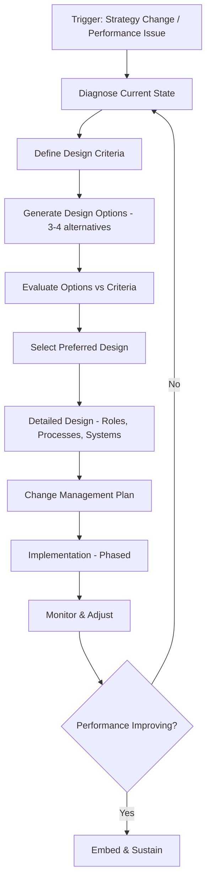
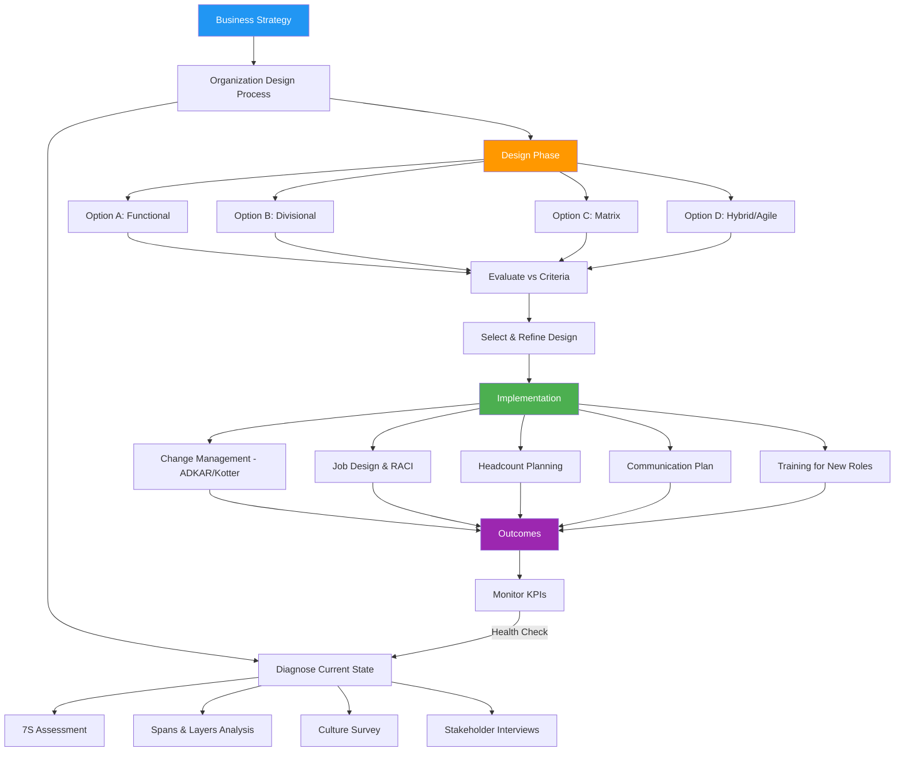

# HR05 — Thiết Kế Tổ Chức (Organization Design)

> **Organization Design (OD)** là quá trình cố ý cấu trúc, cấu hình và điều chỉnh các yếu tố của một tổ chức — bao gồm cơ cấu, quy trình, vai trò, hệ thống và văn hóa — để tối ưu hóa hiệu suất, thực thi chiến lược kinh doanh và đáp ứng các mục tiêu dài hạn.

---

## 01. Định Nghĩa & Phạm Vi

**Organization Design** không chỉ là vẽ sơ đồ tổ chức (org chart). Đây là một lĩnh vực quản trị toàn diện:

| Khía cạnh | Nội dung | Liên kết với |
|-----------|----------|-------------|
| **Structure** | Cơ cấu tổ chức, báo cáo, phòng ban | Org chart, spans & layers |
| **Process** | Cách công việc được thực hiện | Quy trình, workflow |
| **People** | Vai trò, năng lực, headcount | Job design, workforce planning |
| **Systems** | Công nghệ, thông tin, đo lường | ERP, KPI systems |
| **Culture** | Giá trị, hành vi, chuẩn mực | Values, leadership style |

### "Structure Follows Strategy" — Alfred Chandler (1962):
```
STRATEGY
    ↓
ORGANIZATION DESIGN
    ↓
PERFORMANCE OUTCOMES

Ví dụ:
Chiến lược "mở rộng đa địa bàn"
    → Cơ cấu Divisional theo geography
    → Mỗi region có P&L riêng
    → Tự chủ cao, trách nhiệm rõ
```

### 3 Câu Hỏi Cốt Lõi OD:
1. **WHO** does **WHAT**? → Job design, roles, accountability
2. **HOW** do they work **TOGETHER**? → Collaboration mechanisms, processes
3. **WHAT** drives the RIGHT **BEHAVIOR**? → Culture, incentives, leadership

---

## 02. Lịch Sử Phát Triển

```
1900s — Scientific Management (Taylor)
└── Chuyên môn hóa cực đại, command & control

1920s — Bureaucracy (Weber)
└── Hệ thống quy tắc rõ ràng, hierarchy nghiêm ngặt

1930s — Human Relations (Mayo — Hawthorne Studies)
└── Con người cần social needs, không chỉ tiền lương

1950s-60s — Contingency Theory
└── "Best structure depends on context"
    Burns & Stalker: Organic vs Mechanistic
    Lawrence & Lorsch: Differentiation vs Integration

1960s — Chandler "Strategy & Structure" (1962)
└── Structure follows strategy

1970s-80s — Systems Thinking & Matrix Organizations
├── McKinsey 7S Framework (1980)
└── Matrix structures phổ biến trong MNCs

1990s — Process Reengineering (Hammer & Champy)
└── Redesign processes around customer outcomes

2000s — Network Organizations
└── Flat, virtual, outsourced, ecosystem-based

2010s — Agile Organizations
├── Spotify Model (Tribes, Squads, Chapters, Guilds)
└── Self-organizing teams, OKRs

2020s — Skills-Based Organizations (SBO)
└── Cơ cấu quanh skills, không phải roles
    Fluid teams, dynamic assignments
```

**OD tại Việt Nam:**
- Trước 1986: Kinh tế kế hoạch hóa, bộ máy nhà nước cồng kềnh
- 1986-2000: Đổi Mới → DN tư nhân, cơ cấu đơn giản
- 2000-2015: FDI bring matrix structures và Western models
- 2015+: Startup ecosystem → flat orgs, agile adoption
- 2020+: Digital transformation buộc rethink org design

---

## 03. Khái Niệm Cốt Lõi

### Span of Control (Tầm kiểm soát):
```
Số direct reports mà một manager có thể quản lý hiệu quả

Narrow span (3-5):
├── Supervision chặt chẽ
├── Nhiều layers
└── Chậm, tốn kém → phù hợp công việc phức tạp/mới

Wide span (8-15):
├── Tự chủ cao hơn
├── Ít layers
└── Nhanh, tiết kiệm → phù hợp công việc routine/standardized

Ideal span: 5-8 direct reports (benchmarks phổ biến)
Xu hướng: Tăng span với technology và empowered teams
```

### Centralization vs Decentralization:
```
CENTRALIZED                    DECENTRALIZED
├── Quyết định tại HQ          ├── Quyết định tại field
├── Nhất quán, tiết kiệm       ├── Nhanh, sát thực tế
├── Ít linh hoạt               ├── Khó nhất quán
└── Phù hợp: Finance,          └── Phù hợp: Sales, Operations
   Compliance, Brand              in diverse markets
```

### Differentiation vs Integration:
- **Differentiation**: Phân chia chuyên biệt (Sales vs Finance vs Ops)
- **Integration**: Cơ chế phối hợp (cross-functional meetings, shared KPIs, liaison roles)
- Cần cả hai — balance là thách thức OD

---

## 04. Frameworks & Models

### 4.1 McKinsey 7S Framework

```
                    ╔═══════════╗
                    ║ STRATEGY  ║
                    ╚═════╤═════╝
              ┌───────────┼───────────┐
         ╔════╧════╗ ╔════╧════╗ ╔════╧════╗
         ║STRUCTURE║ ║ SYSTEMS ║ ║  STAFF  ║
         ╚════╤════╝ ╚════╤════╝ ╚════╤════╝
              └───────────┼───────────┘
                    ╔═════╧═════╗
                    ║  SHARED   ║
                    ║  VALUES   ║
                    ╚═════╤═════╝
              ┌───────────┼───────────┐
         ╔════╧════╗             ╔════╧════╗
         ║  STYLE  ║             ║ SKILLS  ║
         ╚═════════╝             ╚═════════╝

HARD Ss (dễ thay đổi): Strategy, Structure, Systems
SOFT Ss (khó thay đổi): Shared Values, Style, Staff, Skills

KEY INSIGHT: Cả 7 yếu tố phải ALIGNMENT với nhau
Nếu thay đổi 1 yếu tố → phải xem xét 6 yếu tố còn lại
```

**Ứng dụng 7S trong OD project:**

| 7S | Câu hỏi chẩn đoán |
|----|------------------|
| Strategy | Chiến lược công ty là gì? Đang thay đổi không? |
| Structure | Cơ cấu hiện tại có hỗ trợ chiến lược không? |
| Systems | Các quy trình, KPI, technology có nhất quán không? |
| Shared Values | Văn hóa thực tế là gì? Có ủng hộ chiến lược không? |
| Style | Leadership style của ban lãnh đạo là gì? |
| Staff | Có đúng người đúng vị trí không? |
| Skills | Có đủ năng lực để thực thi không? |

### 4.2 Galbraith Star Model

```
          STRATEGY
              │
     ┌────────┼────────┐
     │        │        │
STRUCTURE  PROCESSES  REWARDS
     │        │        │
     └────────┼────────┘
              │
            PEOPLE

5 design choices phải nhất quán với nhau
```

### 4.3 ADKAR Change Model (Prosci)

```
A — AWARENESS   (Nhận thức về sự thay đổi)
D — DESIRE      (Mong muốn thay đổi)
K — KNOWLEDGE   (Kiến thức cách thay đổi)
A — ABILITY     (Khả năng thực hiện)
R — REINFORCEMENT (Củng cố, duy trì)
```

---

## 05. Quy Trình OD Project

### Organization Design Process:



### Giai đoạn 1 — Diagnose (4-6 tuần):
- Phỏng vấn leadership, employees
- Phân tích performance data
- Review org chart, reporting lines
- Benchmark với industry
- **Output**: Current State Assessment Report

### Giai đoạn 2 — Design (6-8 tuần):
- Workshops với key stakeholders
- Generate 3-4 design options
- Evaluate against business criteria
- **Output**: Recommended Design + Business Case

### Giai đoạn 3 — Implement (3-12 tháng):
- Communication plan
- Role transitions, job descriptions
- Training for new roles
- Process redesign
- Technology updates
- **Output**: New Org operational

---

## 06. Công Cụ OD

| Công cụ | Mục đích | Khi nào dùng |
|---------|---------|-------------|
| **Org Chart** | Visualize structure, reporting | Luôn luôn |
| **RACI Matrix** | Phân công trách nhiệm | Role ambiguity, new processes |
| **Spans & Layers Analysis** | Optimize management layers | Cost reduction, speed |
| **Job Analysis/Design** | Define roles clearly | New roles, restructure |
| **Process Maps** | Document workflows | Process redesign |
| **9-Box Grid** | Talent assessment | Succession, placement |
| **Culture Survey** | Assess current culture | Pre/post redesign |
| **Employee Survey** | Diagnose pain points | Pre-design |
| **Benchmarking** | Compare with industry | Design options evaluation |
| **Business Case** | Justify design choices | Leadership approval |

---

## 07. KPI & Đo Lường OD

### OD Health Metrics:

```
STRUCTURAL EFFICIENCY
├── Spans of control (avg across organization)
├── Number of management layers
├── Manager-to-IC ratio
├── Cost per FTE
└── Organizational overhead ratio

OPERATIONAL EFFECTIVENESS
├── Decision velocity (time-to-decide)
├── Cross-functional collaboration score
├── Role clarity index (employee survey)
└── Duplication of effort (%)

TALENT OUTCOMES
├── Internal promotion rate
├── Regrettable attrition rate
├── Time-to-fill key positions
└── Employee engagement score

BUSINESS OUTCOMES
├── Revenue per employee
├── Productivity metrics (output/headcount)
├── Customer satisfaction
└── Time-to-market
```

### Benchmarks Spans & Layers:

| Chỉ số | Fortune 500 (thực tế) | Best practice | VN Enterprise |
|--------|----------------------|---------------|--------------|
| Avg span of control | 7.0 | 5-8 | 4-6 |
| Management layers | 8 | 4-5 | 5-7 |
| % Managers | 18% | 12-15% | 20-25% |
| Manager cost ratio | 35% | 25-30% | 30-40% |

---

## 08. Rủi Ro & Thách Thức OD

| Rủi ro | Biểu hiện | Biện pháp |
|--------|-----------|-----------|
| **Structure-strategy misalignment** | Org cũ, strategy mới | Annual OD review |
| **Too many layers** | Chậm, tốn kém, micro-management | Delayering initiative |
| **Silo mentality** | Phòng ban không hợp tác | Cross-functional teams, shared KPIs |
| **Role ambiguity** | Không biết ai chịu trách nhiệm gì | RACI, clear JDs |
| **Change resistance** | Nhân viên phản đối restructure | Change management, communication |
| **Key person dependency** | Mất người là mất business | Succession planning, knowledge management |
| **Matrix confusion** | 2 sếp → conflict | Clear primary vs secondary reporting |
| **Over-engineering** | Cơ cấu phức tạp quá mức | "Simple beats complex" |
| **Culture ignored** | Org chart thay đổi, hành vi không đổi | Culture change program |
| **Post-M&A integration fails** | 2 cultures clash | Dedicated integration team |

---

## 09. Best Practices OD

1. **Start with Strategy**: Không thiết kế org trước khi hiểu rõ chiến lược
2. **Co-design with employees**: Nhân viên được tham gia → chấp nhận cao hơn
3. **Design for the future**: Org design cho 3-5 năm tới, không chỉ hôm nay
4. **Simplify**: Ít layers, wide spans, clear roles — simple beats complex
5. **Pilot before full rollout**: Test new design ở một đơn vị trước
6. **Address the "soft" side**: Culture, leadership behavior phải thay đổi cùng structure
7. **Communicate early and often**: Uncertainty kills productivity
8. **Plan for transitions**: Người bị ảnh hưởng cần thời gian và support
9. **Measure outcomes**: Define success metrics trước khi implement
10. **Iterate**: Org design là hành trình, không phải điểm đến

---

## 10. Sai Lầm Phổ Biến

| Sai lầm | Hậu quả |
|---------|---------|
| **Restructure để giải quyết performance problem** (mà không fix nguyên nhân gốc) | Waste time, demoralise staff, cùng kết quả |
| **Copy-paste org chart từ công ty khác** | Không phù hợp context, strategy, culture |
| **Chỉ thay đổi boxes và lines** | Hành vi, quy trình, systems không đổi → fail |
| **Không có change management** | Resistance, confusion, talent loss |
| **Restructure quá thường xuyên** | Mất ổn định, nhân viên hoang mang, low trust |
| **Để politics drive design** | "Sếp A muốn thêm team" thay vì business need |
| **Không consider culture** | Cơ cấu flat trong culture high power distance → fail |
| **Tập trung vào org chart, bỏ qua governance** | Không rõ decision rights → gridlock |

---

## 11. Case Study VN — Masan Group Restructuring (2019-2021)

### Bối cảnh:
Masan Group là tập đoàn diversified: Consumer goods (Masan Consumer), Resources (Masan Resources), Financial (Techcombank), Retail (VinCommerce sau khi mua từ Vingroup).

### Thách thức OD:
- Mô hình conglomerate rời rạc, không synergy
- Mua VinCommerce (WinMart/WinMart+) 2021 — tích hợp hệ thống bán lẻ 3,000+ điểm
- Cần chuyển từ "holding company" sang "consumer-retail platform"
- Văn hóa khác nhau: FMCG (Masan Consumer) vs Retail (VinCommerce legacy)

### Giải pháp OD:

```
BEFORE (2019): CONGLOMERATE MODEL
Masan Group HQ
├── Masan Consumer (FMCG)
├── Masan Resources (Khoáng sản)
├── Techcombank (Stake)
└── Masan Agri (Nông nghiệp)

AFTER (2021-2022): CONSUMER-RETAIL PLATFORM
The CrownX (Consumer-Retail)
├── Masan Consumer Holdings
│   ├── Food & Beverage brands
│   ├── Meat: MEATDeli
│   └── Health/Beauty: Vinacafé
└── WCM (WinCommerce)
    ├── WinMart (Supermarkets)
    ├── WinMart+ (Convenience stores)
    └── WiN Ecosystem (Financial, Health)
```

### Key OD Decisions:
1. **Tách Masan Resources** (spin-off, bán cổ phần) — focus vào consumer
2. **Tạo The CrownX** — holding platform cho consumer-retail, attract foreign investment (SK Group $340M)
3. **WCM governance**: Board riêng, CEO riêng (Daniel Mun, cựu 7-Eleven Korea), tự chủ cao
4. **Synergy capture**: Đưa Masan products vào WinMart shelf priority (vertical integration)
5. **Culture integration**: "Point of Life" vision — one-stop shop cho người tiêu dùng VN

### Bài học:
- M&A đòi hỏi OD rõ ràng từ ngày 1 (Day 1 org chart)
- Hire external expertise khi thiếu retail experience
- Holding model → Platform model: thay đổi governance hoàn toàn
- Speed of integration is critical — mỗi tháng chậm = triệu đô mất synergy

---

## 12. Case Study Quốc Tế — Spotify Tribe-Squad Model

### Bối cảnh (2012-2016):
Spotify phát triển nhanh từ startup → 3,000+ engineers → traditional hierarchy không còn phù hợp với pace of innovation.

### Mô hình Spotify:

```
TRIBE (250-150 người)
├── Nhóm các squads cùng domain (vd: Mobile Experience Tribe)
├── Tribe Lead: overall direction & coordination
└── Aligned mission, shared chapter resources

    SQUAD (6-12 người) — đơn vị cơ bản
    ├── Cross-functional: BE, FE, QA, Design, Data
    ├── Autonomous: owns product area end-to-end
    ├── Aligned autonomy: "Be as autonomous as possible"
    └── Product Owner + Engineering Manager

CHAPTER (cross-squad, same skill)
├── Horizontal communities: All iOS devs
├── Chapter Lead: line manager, career development
└── Skills consistency, best practice sharing

GUILD (cross-tribe, any skill/interest)
└── Community of practice (optional)
    Web Performance Guild, Testing Guild, etc.
```

### Kết quả & Bài học:
- ✅ Fast delivery: squads có thể ship independently
- ✅ Innovation: autonomy drives creativity
- ❌ Coordination overhead: alignment giữa squads tốn nhiều effort
- ❌ Not directly transferable: phù hợp tech companies, khó áp dụng cho manufacturing/retail
- **Lesson**: "Spotify Model" là inspiration, không phải blueprint

---

## 13. So Sánh — Các Mô Hình Tổ Chức

| Mô hình | Ưu điểm | Nhược điểm | Phù hợp |
|---------|---------|------------|---------|
| **Functional** | Chuyên môn hóa cao, tiết kiệm | Silo, chậm, thiếu customer focus | SME, stable environment |
| **Divisional (Product)** | Tập trung sản phẩm, rõ P&L | Duplicate functions, conflict | Đa sản phẩm đa dạng |
| **Divisional (Geography)** | Gần khách hàng địa phương | Duplicate, difficult coordination | Đa thị trường |
| **Matrix** | Flexib, resource sharing | Confusion 2 sếp, slow decisions | MNC, project-based |
| **Flat/Holacracy** | Nhanh, empowered | Chaos nếu không có discipline | Startup, tech |
| **Network/Virtual** | Lean, agile, specialist access | Coordination, loyalty, IP | Gig economy, consulting |
| **Hybrid** | Best of multiple models | Complex design | Large diversified companies |

---

## 14. Ứng Dụng Theo Ngành

| Ngành | OD đặc thù | Mô hình phổ biến |
|-------|-----------|-----------------|
| **Banking/Finance** | Regulatory compliance, risk silos | Functional + Matrix |
| **Manufacturing** | Ops efficiency, quality | Functional + Divisional by plant |
| **Technology** | Speed, innovation | Agile squads, flat |
| **Retail** | Geography, category | Divisional (geo) + Category mgmt |
| **Healthcare** | Clinical vs admin silos | Functional + Clinical governance |
| **Consulting** | Project-based, specialist | Matrix (industry × service line) |
| **FMCG** | Brand vs Category vs Region | Brand-led Matrix |
| **Conglomerate** | Portfolio management | Holding + subsidiary autonomy |

---

## 15. Ứng Dụng Theo Quy Mô

```
STARTUP (< 20 người)
├── Org: Flat, founder-led
├── Structure: No formal structure
├── Span: Founder → everyone
└── Risk: Key person dependency

SME (20-200 người)
├── Org: Functional silos beginning
├── Structure: Functional (Sales, Ops, Finance, HR)
├── Span: 5-8
└── Risk: Silo formation, founder not delegating

MIDSIZE (200-2,000 người)
├── Org: Functional + some matrix
├── Structure: BU or product/region divisions
├── Span: 6-10
└── Risk: Coordination overhead, middle management bloat

ENTERPRISE (2,000+ người)
├── Org: Complex multi-dimensional
├── Structure: Matrix, Divisional, Hybrid
├── Span: Varies by level
└── Risk: Slow, political, over-engineered
```

---

## 16. Technology & Digital OD

### Digital Transformation tác động đến OD:

```
PLATFORM ORGANIZATIONS:
├── Tech platforms enable ecosystems (Amazon, Google)
├── Two-sided markets: giảm need for vertical integration
└── OD implication: Orchestrator vs Participant roles

AUTOMATION impact:
├── Routine tasks automated → fewer layers needed
├── Manager spans can increase (AI assists)
└── New roles: AI trainers, data stewards, digital translators

REMOTE/HYBRID WORK:
├── Reporting lines không còn dựa trên geography
├── "Virtual spans" cần new management practices
└── Documentation & async communication critical

AI-ASSISTED ORG DESIGN:
├── Workforce analytics để optimize structure
├── Network analysis (email/Slack patterns) = real org
└── Predictive modeling for headcount needs
```

### Organization Network Analysis (ONA):

```
FORMAL ORG CHART:          ACTUAL COLLABORATION NETWORK:
CEO                         CEO ←──── CFO ←────┐
 ├── VP Sales               │                   │
 ├── VP Ops                 │    [Data shows    │
 └── CFO                    │    Sales Manager  │
      └── Controller        │    is real hub,   │
                            │    not VP Sales]  │
                                                │
                            Sales Mgr ──────────┘
                            (connects everyone)
```

ONA tools: Humanyze, Microsoft Viva Insights, Organizational Network Analysis

---

## 17. Tích Hợp Domain

```
STRATEGY (BIZ01)
└── OD là thực thi của Strategy
    "Structure follows Strategy"

HR — L&D (HR04)
└── New org design → new role competencies
    Change management training
    Manager capability for new spans

HR — Talent Management (HR07)
└── Restructure → succession plan bị ảnh hưởng
    "Right people for right roles" post-redesign

HR — Compensation (HR06)
└── New job levels → compensation bands redesign
    HRBP structure → comp for HRBP vs generalist

FINANCE
└── Cost per FTE, headcount budget
    P&L allocation in divisional structures

OPERATIONS
└── Process redesign aligned với org design
    Handoffs between new roles

TECHNOLOGY (IT)
└── Systems need to align with new structure
    HRIS hierarchy updates
    ERP cost center restructure
```

---

## 18. Xu Hướng OD 2024-2026

| Xu hướng | Mô tả | Mức độ ảnh hưởng |
|---------|-------|-----------------|
| **Skills-Based Organization (SBO)** | Tổ chức quanh skills, không phải job titles | Rất cao |
| **Dynamic Teams** | Teams hình thành/giải tán theo project | Cao |
| **HR Operating Model Evolution** | HRBP → more strategic, AI handles admin | Cao |
| **Ecosystem Thinking** | Mở rộng ranh giới tổ chức (partners, freelancers) | Trung bình |
| **Delayering** | Cắt giảm management layers, tăng spans | Cao |
| **Agile at Scale** | SAFe, LeSS cho enterprise agility | Trung bình |
| **AI-augmented OD** | AI phân tích org health, recommend redesigns | Đang nổi |
| **Hybrid Work Org Design** | Tối ưu hóa cơ cấu cho remote/hybrid | Cao |

---

## 19. Bối Cảnh Việt Nam

### Đặc thù DN VN:

**1. Văn hóa thứ bậc cao (High Power Distance — Hofstede):**
```
VN Power Distance Index: 70/100 (cao hơn nhiều so với US: 40)

Biểu hiện trong OD:
├── Quyết định phải đến từ "sếp lớn"
├── Nhân viên không dám đề xuất/phản biện
├── Flat org rất khó implement
└── HRBP model cần adaptation
```

**2. DN gia đình (Family Business):**
```
60-70% DN VN là gia đình trị
├── Sếp = chủ = người ra quyết định cuối cùng
├── Con cháu trong ban lãnh đạo (nepotism risk)
├── Khó phân tách ownership vs management
└── OD phải navigate family dynamics

Case điển hình: Khi Vingroup thêm lĩnh vực mới
→ Tạo công ty con riêng thay vì expand existing BU
→ Mỗi BU có CEO riêng nhưng phụ thuộc HQ về capital
```

**3. Cơ cấu quyết định tập trung:**
```
Biểu hiện:
├── Mọi quyết định phải lên đến Tổng GĐ
├── Họp nhiều, quyết ít
├── Manager không dám chịu trách nhiệm
└── Bottleneck tại vị trí cao nhất

Giải pháp:
├── RACI matrix với "A" được giao rõ
├── Decision rights matrix
├── Delegation of authority policy
└── Culture change: "fail fast" acceptable
```

**4. Cấu trúc phòng ban VN phổ biến:**
```
DN Việt Nam điển hình (200-500 người):
Ban Giám Đốc
├── Giám đốc Kinh doanh
│   ├── Phòng Sales
│   ├── Phòng Marketing
│   └── Phòng CSKH
├── Giám đốc Vận hành
│   ├── Phòng Sản xuất/Dịch vụ
│   ├── Phòng Kỹ thuật
│   └── Phòng Logistics
├── Giám đốc Tài chính
│   ├── Phòng Kế toán
│   └── Phòng Ngân quỹ
└── Giám đốc Nhân sự
    ├── Phòng Tuyển dụng
    ├── Phòng Đào tạo
    └── Phòng C&B
```

**5. Quy định pháp lý:**
- **BLLĐ 45/2019** — không quy định cơ cấu tổ chức cụ thể
- **Luật DN 2020** — quy định cơ cấu HĐQT, BKS cho công ty đại chúng
- **Nghị định 47/2021** — chi tiết về cơ cấu quản trị CTCP, TNHH
- **Thông tư 11/2020/TT-BLĐTBXH** — định biên nhân sự trong DN nhà nước

---

## 20. Checklist OD

### Pre-Design:
- [ ] Rõ ràng về chiến lược kinh doanh 3-5 năm
- [ ] Xác định triggers của redesign (growth, new strategy, poor performance)
- [ ] Diagnose current state (phỏng vấn, survey, data)
- [ ] Xác định design criteria (speed, cost, customer focus, talent)
- [ ] Có sponsor là C-level

### Design Phase:
- [ ] Generate ít nhất 3 design options
- [ ] Evaluate options vs design criteria
- [ ] Tính cost impact (headcount, salary adjustments)
- [ ] Risk assessment cho mỗi option
- [ ] Stakeholder validation (CFO, business heads)
- [ ] Board/CEO approval

### Implementation:
- [ ] Communication plan (who, when, what, how)
- [ ] Transition plan (ai về đâu, ai phải apply cho role mới)
- [ ] Job descriptions updated
- [ ] Compensation review nếu cần
- [ ] Technology updates (HRIS, org chart tools)
- [ ] Training plan cho roles mới
- [ ] 90-day review milestone

---

## 21. Organization Design Fundamentals — Chuyên Sâu

### Organizational Structures — Chi Tiết:

```
1. FUNCTIONAL STRUCTURE
   CEO
   ├── Operations
   ├── Marketing
   ├── Finance
   └── HR
   
   Phù hợp: 1 sản phẩm/dịch vụ, stable environment
   Rủi ro: silos, poor cross-functional coordination

2. DIVISIONAL — BY PRODUCT
   CEO
   ├── Division A (Phone)
   │   ├── Ops, Sales, Finance, HR (mini-functional)
   ├── Division B (Laptop)
   └── Division C (Tablet)
   
   Phù hợp: Đa sản phẩm khác nhau (P&G, Samsung)
   Rủi ro: Duplicate resources, conflict for shared services

3. DIVISIONAL — BY GEOGRAPHY
   CEO
   ├── North Asia
   │   ├── Vietnam
   │   ├── Thailand
   │   └── Philippines
   ├── South Asia
   └── Europe
   
   Phù hợp: Đa thị trường với local adaptation cần thiết
   VN Example: Vinamilk — có BU theo vùng (miền Bắc/Nam/Trung)

4. MATRIX STRUCTURE
   CEO
   ├── Functions (Sales, Ops, Finance) ←─────────┐
   │                                              │
   └── Products/Projects (A, B, C) ──────────────┘
       (Dual reporting lines)
   
   Phù hợp: MNC cần balance global standardization + local flexibility
   Rủi ro: "Two boss problem", slow decisions, conflict

5. FLAT/HOLACRACY
   Founder/CEO
   └── Self-organizing circles/teams
       No fixed hierarchy, dynamic role assignments
   
   Phù hợp: Startup (<50), Zappos thử nghiệm
   Rủi ro: Chaos, unclear accountability, nhân viên cần structure

6. NETWORK/VIRTUAL
   Core team (orchestrator)
   └── Partners, freelancers, outsourced specialists
   
   Phù hợp: Consulting firms, gig platforms, lean startups
   Rủi ro: Coordination, loyalty, quality control, IP

7. HYBRID
   Mix of above based on context
   Vd: Functional HQ + Divisional BUs + Matrix projects
```

---

## 22. McKinsey 7S — Ứng Dụng Thực Tế

### Case: OD Redesign Công Ty FMCG VN 1,000 người

**Diagnose với 7S:**

| 7S | Current State | Desired State | Gap |
|----|--------------|--------------|-----|
| Strategy | Tăng trưởng qua M&A | Organic growth + efficiency | Chưa rõ |
| Structure | Functional silos | Category-led matrix | Cần redesign |
| Systems | Mỗi BU dùng phần mềm khác nhau | Integrated ERP | IT project |
| Shared Values | "Sếp luôn đúng" | Collaborative, data-driven | Culture change |
| Style | Authoritative | Coaching | Leadership training |
| Staff | Generalists | Specialists + analytics | Hiring, L&D |
| Skills | Traditional sales | Digital marketing, analytics | Upskilling |

**Action Plan:**
1. Structure: Chuyển sang Category Management model
2. Systems: ERP unification project (12 tháng)
3. Shared Values: Values refresh + leadership training
4. Staff & Skills: Hire Head of Analytics, upskill team

---

## 23. Job Design — Chuyên Sâu

### Hackman & Oldham Job Characteristics Model:

```
5 CORE DIMENSIONS:
├── Skill Variety: Công việc đòi hỏi nhiều kỹ năng khác nhau
├── Task Identity: Thực hiện toàn bộ công việc từ đầu đến cuối
├── Task Significance: Công việc có tác động đến người khác
├── Autonomy: Tự chủ trong cách làm việc
└── Feedback: Nhận thông tin về hiệu quả công việc

PSYCHOLOGICAL STATES:
├── Experienced Meaningfulness (Variety + Identity + Significance)
├── Experienced Responsibility (Autonomy)
└── Knowledge of Results (Feedback)

OUTCOMES:
└── High intrinsic motivation, satisfaction, low absenteeism, high quality
```

### Job Design Strategies:

| Chiến lược | Mô tả | Kết quả |
|-----------|-------|---------|
| **Job Enlargement** | Thêm tasks cùng level (horizontal) | Tăng skill variety |
| **Job Enrichment** | Thêm responsibility, authority (vertical) | Tăng autonomy, ownership |
| **Job Rotation** | Luân chuyển giữa các jobs | Tăng flexibility, cross-training |
| **Job Simplification** | Giảm scope, tăng specialization | Efficiency, nhưng giảm engagement |

---

## 24. Role Clarity — RACI Matrix

### RACI Framework:

```
R — RESPONSIBLE: Người thực hiện công việc
A — ACCOUNTABLE: Người chịu trách nhiệm cuối cùng (chỉ 1 người)
C — CONSULTED: Người được hỏi ý kiến (2-way communication)
I — INFORMED: Người được thông báo sau khi quyết định

RACI MATRIX VÍ DỤ — Quy trình Tuyển dụng:
                    HR Mgr  Hiring Mgr  HRBP  Finance  CEO
JD Creation          R        C          A      I       I
Screening CVs        R        C          A      -       -
Interview round 1    R        C          A      -       -
Final decision       C        A          C      I       I (if senior)
Offer negotiation    R        A          C      C       I
```

### Common RACI Problems:
- **Multiple As**: Ai thực sự chịu trách nhiệm?
- **No A defined**: Accountability void → nobody owns
- **Too many Cs**: Chậm, quá nhiều người cần tham gia
- **Missing Rs**: Ai thực sự làm?

---

## 25. Spans & Layers Analysis

### Phân tích Spans & Layers:

```
CURRENT STATE ANALYSIS:
Level 1: CEO (1 person)
Level 2: VPs (4 people) → CEO spans: 4
Level 3: Directors (16 people) → VP spans avg: 4
Level 4: Managers (64 people) → Dir spans avg: 4
Level 5: Team Leads (128 people) → Mgr spans avg: 2
Level 6: Individual Contributors (512 people) → TL spans avg: 4

Total management layers: 5 (L2-L6)
Total headcount: 725
Manager ratio: 213/725 = 29% (HIGH)

BENCHMARK:
Recommended: 12-15% managers
Current: 29% → over-management

RECOMMENDATION:
Eliminate Team Lead layer (L5) where possible
Increase IC-to-manager ratios
→ Save ~$X salary costs
→ Increase spans from 2 → 5 at TL level
→ Faster decisions, more empowered ICs
```

---

## 26. Headcount Planning

### FTE Analysis Framework:

```
HEADCOUNT PLANNING PROCESS:
1. Start with Business Plan (revenue, volume)
2. Determine productivity assumptions (output/FTE)
3. Calculate required FTEs: [Work volume] / [Productivity/FTE]
4. Add capacity buffer (10-15% for growth, attrition)
5. Subtract current headcount
6. = Net hiring need

BUILD/BUY/BORROW Decision:
├── BUILD: Internal development (time: 6-18 months)
├── BUY: External hire (time: 1-3 months, higher cost)
├── BORROW: Contractor/Consultant (time: immediate, flexible)
└── BOT (Build-Operate-Transfer): Outsource then insource

Outsourcing vs Insourcing Decision:
├── Outsource nếu: Non-core, cost competitive, quality available
├── Insource nếu: Core competency, IP sensitive, long-term need
└── Vietnam trend: Insource tech after outsourcing phase
```

---

## 27. Change Management trong OD

### Kotter 8-Step Model:

```
1. CREATE URGENCY
   └── "Nếu không thay đổi, chúng ta sẽ mất X% thị phần"
   └── Data, burning platform, competitor threat

2. BUILD GUIDING COALITION
   └── Team thay đổi gồm leaders có credibility + authority

3. FORM STRATEGIC VISION
   └── "Org sẽ trông như thế nào sau redesign?"

4. ENLIST A VOLUNTEER ARMY
   └── Communicate to all, get buy-in từ mass

5. ENABLE ACTION BY REMOVING BARRIERS
   └── Fix systems, policies cản trở change

6. GENERATE SHORT-TERM WINS
   └── Celebrate early successes (3-6 tháng)

7. SUSTAIN ACCELERATION
   └── Don't declare victory too early
   └── Keep pushing, build on momentum

8. INSTITUTE CHANGE
   └── Embed new behaviors in culture, systems
   └── Tie to recruitment, training, promotion
```

### ADKAR Model — Individual Change:

```
A — AWARENESS: "Tôi biết tại sao cần thay đổi"
    Tool: Town halls, emails, 1:1 từ manager

D — DESIRE: "Tôi muốn thay đổi"
    Tool: WIIFM (What's In It For Me?), involve in design

K — KNOWLEDGE: "Tôi biết cách thay đổi"
    Tool: Training, job aids, documentation

A — ABILITY: "Tôi có thể thay đổi"
    Tool: Practice, coaching, feedback, time

R — REINFORCEMENT: "Tôi được khuyến khích duy trì"
    Tool: Recognition, incentives, consequences
```

### Resistance Management:

| Loại kháng cự | Nguyên nhân | Cách xử lý |
|--------------|-------------|------------|
| **Fear of job loss** | Restructure = job cuts | Transparent communication, outplacement support |
| **Loss of status/power** | Manager trở thành IC | Acknowledge loss, find new value proposition |
| **Uncertainty** | Không biết tương lai | Clear timeline, answer questions honestly |
| **Skill gap** | Không đủ năng lực cho role mới | Training, coaching, transition time |
| **Past bad experiences** | "Lần trước restructure cũng thất bại" | Prove through actions, quick wins |
| **Political resistance** | Lãnh đạo mất territory | CEO commitment, coalition of supporters |

---

## 28. Culture & Values trong OD

### Hofstede Dimensions — Việt Nam vs Thế Giới:

```
              VN    US    Germany   Japan   Singapore
Power Dist.   70    40    35        54      74
Individualism 20    91    67        46      20
Masculinity   40    62    66        95      48
Uncertainty   30    46    65        92      8
Avoid.
Long-term     57    26    83        88      72
Indulgence    35    68    40        42      46

KEY INSIGHTS FOR VN OD:
├── High Power Distance (70): Respect cho hierarchy, khó flat org
├── Low Individualism (20): Collectivist, team-based reward OK
├── Low Uncertainty Avoidance (30): Open to change (positive!)
└── Long-term orientation (57): Invest in long-term relationships
```

### Edgar Schein — 3 Levels of Culture:

```
Level 1: ARTIFACTS (Dễ nhìn thấy)
├── Office layout, dress code
├── Company language, jargon
├── Rituals (all-hands, award ceremonies)
└── Stories told about heroes & villains

Level 2: ESPOUSED VALUES (Nói)
├── Mission, vision, values statements
├── Policies, procedures
└── "Chúng tôi đề cao sự sáng tạo"

Level 3: BASIC ASSUMPTIONS (Thực tế hành vi)
├── "Sáng tạo ở đây có nghĩa là làm theo ý sếp mới hơn"
├── "Work-life balance = không được về trước sếp"
└── Đây là layer khó thay đổi nhất

OD IMPLICATION:
└── Để change culture, phải work ở cả 3 levels
    Đặc biệt Level 3 — unspoken assumptions
```

---

## 29. HR Operating Model — Ulrich Model

### Dave Ulrich 3-Legged Stool (1996, cập nhật 2016):

```
HR OPERATING MODEL (ULRICH)

┌─────────────────────────────────────────────┐
│              CENTERS OF EXCELLENCE (COE)     │
│    Talent Acquisition │ L&D │ C&B │ OD      │
│    Deep expertise, design enterprise policies│
└────────────────────┬────────────────────────┘
                     │ Policies & Programs
           ┌─────────┼──────────┐
           ▼         ▼          ▼
┌──────────────┐          ┌────────────────────┐
│  SHARED      │          │  HR BUSINESS       │
│  SERVICES    │          │  PARTNERS (HRBP)   │
│  (SSC)       │          │                    │
│ Payroll      │          │ Embedded in BU     │
│ Admin        │          │ Consult with mgrs  │
│ HR Help desk │          │ Drive HR strategy  │
│ Data entry   │          │ for business unit  │
└──────────────┘          └────────────────────┘
```

### HRBP Role Evolution:

| Thế hệ | Role | Focus |
|--------|------|-------|
| HRBP 1.0 | "HR Generalist có seat tại business" | Admin + relationships |
| HRBP 2.0 | "Strategic partner" | Data-driven, business impact |
| HRBP 3.0 | "Organizational capability advisor" | Future skills, OD, workforce strategy |

### Challenges của Ulrich Model tại VN:
- **SSC**: Cần quy mô đủ lớn (300+ FTE để justify)
- **COE**: Cần deep specialists (rare tại VN)
- **HRBP**: Cần business acumen cao (nhiều HR VN thiếu)
- **Culture**: Manager VN không quen làm việc với HRBP (vẫn muốn "HR làm tất")

---

## 30. Post-Merger Integration (PMI) OD

### Day 1 Org Design:

```
M&A INTEGRATION TIMELINE:
Pre-close (6-12 months before):
└── Integration Management Office (IMO) set up
    Workstream leads appointed
    Integration thesis defined

Day 1 (Closing day):
└── New org announced (top 2-3 levels minimum)
    Leadership team confirmed
    Reporting lines clear
    No job loss announcements pending final design

0-100 Days:
├── Detailed org design (levels 4-6)
├── Role mapping: who fits where
├── Redundancy identification & management
├── Culture assessment
└── Quick wins capture

100-365 Days:
├── Full integration complete
├── Systems consolidated
├── Culture integration programs
└── Synergy realization tracking
```

### Culture Clash Management:

```
CULTURE INTEGRATION APPROACHES:
1. ASSIMILATION: Acquiree adopts acquirer's culture
   ✓ Fast, simple  ✗ Talent loss if acquiree culture strong

2. INTEGRATION: Best of both cultures merged
   ✓ Balanced  ✗ Takes longer, needs deliberate effort

3. PRESERVATION: Keep separate cultures
   ✓ Retain talent  ✗ No synergy, separate silos

4. TRANSFORMATION: New culture for new entity
   ✓ Best for equals merging  ✗ Most disruptive

VN Example: Masan + VinCommerce:
→ VinGroup culture (military, hierarchical) + 
  Masan culture (entrepreneur, results-driven) =
  Needed: new "The CrownX" culture focused on consumer
```

---

## 31. Agile Organization Design

### Principles of Agile Organizations:

```
TRADITIONAL ORG                    AGILE ORG
├── Stable hierarchy               ├── Dynamic teams
├── Annual planning                ├── Quarterly OKRs
├── Siloed functions               ├── Cross-functional squads
├── Centralized decisions          ├── Decentralized decisions
├── Extensive approval chains      ├── "Two-pizza team" autonomy
├── Change as disruption           ├── Change as continuous
└── Risk avoidance                 └── Small bets, fast learning
```

### OKRs as Organizational Glue:

```
COMPANY OKR (Quarterly):
O: Trở thành top 3 FMCG trong ngành tại VN
KR1: Revenue đạt 500 tỷ VND (Q3)
KR2: NPS tăng từ 42 → 55
KR3: Distribution coverage tăng từ 60% → 75%

TEAM OKR (aligned với Company):
O: Maximize Masan's digital sales channel
KR1: E-commerce revenue: 50 tỷ VND
KR2: App DAU: 50,000
KR3: Digital COGS reduction: 5%

Benefits for OD:
├── Alignment without hierarchy
├── Transparency across functions
├── Flexibility to pivot quarterly
└── Clear accountability at team level
```

---

## 32. Workforce Segmentation

### Core vs Contingent Workforce:

```
WORKFORCE SEGMENTATION:

CORE (Permanent employees):
├── Tier 1: Critical/Strategic roles
│   └── Deep expertise, proprietary knowledge
│   └── Strategy: Develop internally, retain aggressively
├── Tier 2: Important/Operational roles
│   └── Needed but not unique
│   └── Strategy: Hire, train, moderate retention investment
└── Tier 3: Transactional/Support
    └── Can be done by others
    └── Strategy: Consider outsourcing

CONTINGENT:
├── Fixed-term contract (HĐLĐ xác định thời hạn — max 2 lần per BLLĐ)
├── Freelancers/Consultants (specialized projects)
├── Outsourced (non-core functions: cleaning, security, IT helpdesk)
└── Gig workers (on-demand, platforms)
```

### Skills-Based Organization (SBO) — Emerging Trend:

```
TRADITIONAL: Role-based
"I am a Marketing Manager"
└── Hired for role, paid for role, promoted by role

SKILLS-BASED: Skill-based
"I have skills: Data Analysis, Campaign Management, SQL, Python"
└── Deployed where skills needed
└── Paid for skills value, not title
└── Opportunities: wherever skills match

VN Readiness:
├── Low (still very title-conscious culture)
├── But: Tech companies starting (FPT Software skills taxonomy)
└── Future: phổ biến hơn với automation và AI impact
```

---

## 33. Digital Transformation & Org Design

### Platform Organization Model:

```
TRADITIONAL "PIPELINE" ORG:        PLATFORM ORG (Amazon, Grab):
Input → Process → Output            Producers ←→ Platform ←→ Consumers
Internal value chain                External value creation ecosystem

OD Implications:
├── Fewer internal staff, more partner ecosystem
├── Technology is the product (not people)
├── Governance: platform rules, API management
├── Metrics: ecosystem metrics (GMV, DAU, API calls)
└── Org: small core team + large ecosystem of participants

VN Examples:
├── Grab: core ~500 VN staff + 200,000+ driver partners
├── Shopee: core team + millions of sellers
└── MoMo: core fintech + partner merchants/banks
```

---

## 34. Leadership Style & OD

### Situational Leadership (Hersey & Blanchard) trong Org Design:

```
                        HIGH
                     RELATIONSHIP
                    BEHAVIOR
                    ┌──────┬──────┐
                    │  S3  │  S2  │
                    │      │      │
                    │Support│Coach│
                    │       │     │
                    └──────┴──────┘
                    ┌──────┬──────┐
                    │  S4  │  S1  │
                    │      │      │
                    │Delegate│Direct│
                    │       │     │
                    └──────┴──────┘
               LOW               HIGH
                     TASK BEHAVIOR

APPLY IN OD:
├── New team in new roles → S1 (Direct)
├── Motivated but low skill → S2 (Coach)
├── High skill, low confidence → S3 (Support)
└── High skill, high motivation → S4 (Delegate, wide spans OK)
```

---

## 35. OD Diagnostics — Organizational Health

### McKinsey OHI (Organizational Health Index):

```
9 DIMENSIONS OF ORGANIZATIONAL HEALTH:
├── Direction: Strategy clarity, alignment
├── Leadership: Leadership effectiveness, style
├── Culture & Climate: Values, psychological safety
├── Accountability: Performance culture, consequences
├── Coordination & Control: Decision speed, governance
├── Capabilities: Talent, skills, processes
├── Motivation: Intrinsic drivers, recognition
├── External Orientation: Customer focus, market awareness
└── Innovation & Learning: Learning culture, change readiness

DIAGNOSIS APPROACH:
├── Employee survey (500+ questions → condensed to OHI score)
├── Leadership interviews
├── Performance data overlay
└── Benchmark vs industry, best-in-class
```

### Gallup Q12 cho OD:

12 câu hỏi đo lường engagement — kết quả phản ánh OD health:
- Tôi có biết mình cần làm gì không? → Role clarity
- Tôi có đủ công cụ và thiết bị không? → Systems design
- Tôi có được làm điều tôi giỏi nhất mỗi ngày không? → Job design
- Tôi có nhận được sự công nhận trong 7 ngày qua không? → Management quality

---

## 36. OD Maturity Model

### Đánh giá trưởng thành OD:

| Dimension | Level 1 — Reactive | Level 3 — Managed | Level 5 — Leading |
|-----------|-------------------|------------------|------------------|
| Design Triggers | Crisis, firefighting | Annual review | Continuous monitoring |
| Process | Ad hoc, informal | Standard methodology | Agile, data-driven |
| Stakeholder involvement | Top-down only | Cross-functional input | Co-design with employees |
| Change Management | Announcement only | ADKAR, Kotter | Embedded culture of change |
| Measurement | Org chart updated | Health survey, KPIs | Predictive analytics |
| Speed | Years | 6-12 months | 3-6 months |
| Culture integration | Ignored | Addressed | Core to design |

---

## 37. RACI & Decision Rights

### Decision Rights Framework:

```
TYPES OF DECISIONS:
├── Strategic: 3-5 năm horizon, high impact, CEO/Board
├── Operational: Day-to-day, medium impact, VP/Director level
├── Tactical: Team level, low impact, Manager/IC
└── Emergency: Urgent, time-sensitive, pre-defined protocols

DECISION RIGHTS MATRIX (Example: Budget Approval):
Amount          Approver        Process
< 10M VND       Manager         Self-approve
10-50M VND      Director        Director + Finance sign
50-200M VND     VP              VP + CFO
200M-2B VND     CEO             CEO + CFO
> 2B VND        Board           Board resolution required

DELEGATION OF AUTHORITY (DOA):
├── Phải được viết bằng văn bản
├── Clear conditions và limits
├── Time-bound hoặc permanent
└── Review annually
```

---

## 38. OD trong Môi Trường VUCA

### VUCA Response Framework:

```
VOLATILE      → VISION: Rõ ràng vision, flexible execution
UNCERTAIN     → UNDERSTANDING: Data collection, scenario planning
COMPLEX       → CLARITY: Simplify structure, clear communication
AMBIGUOUS     → AGILITY: Small experiments, fast learning

VN Context — OD trong VUCA:
├── COVID-19: Forced rapid pivot to remote → flat org advantage
├── Digital disruption: Traditional banks restructure for fintech
├── Supply chain volatility: Regionalize (near-shore) org design
└── Geopolitical shifts: "China+1" → VN manufacturing growth
    → New factory org designs needed at scale
```

---

## 39. Org Design cho DN Khởi Nghiệp VN

### Growth Stages & Org Evolution:

```
STAGE 1: FOUNDING (1-10 người)
├── Cấu trúc: Flat, everyone does everything
├── Decisions: Founder decides all
├── HR: No formal HR (founder does it)
├── Risk: Burnout, founder bottleneck
└── Next step: Hire first functional heads

STAGE 2: SCALING (10-50 người)
├── Cấu trúc: Functional (Sales/Ops/Tech/Finance)
├── Decisions: Functional heads with founder veto
├── HR: First HR hire (generalist)
├── Risk: Culture dilution, first management layer struggles
└── Next step: Document processes, hire middle managers

STAGE 3: GROWTH (50-200 người)
├── Cấu trúc: Functional + BU leaders
├── Decisions: Delegated to VPs with clear D.O.A.
├── HR: HR team (Talent, L&D, C&B)
├── Risk: Speed slows, bureaucracy creeps in
└── Next step: Decide: specialize or stay generalist?

STAGE 4: ENTERPRISE (200+ người)
├── Cấu trúc: Divisional/Matrix/Hybrid
├── Decisions: Governance frameworks, committees
├── HR: Full HR function, HRBP model
├── Risk: Politics, over-management, innovation dies
└── Next step: Constant pruning, agile pockets
```

---

## 40. Tương Lai OD — Predictions

### Org Design 2030:

```
DYNAMIC TEAMING
└── Teams form and dissolve around projects
    People có nhiều "project memberships" cùng lúc
    AI matches people to projects based on skills

SKILLS > JOBS
└── Job titles become less meaningful
    Organizations track skills inventory
    Deployment based on skill needs

AI-AUGMENTED LEADERSHIP
└── AI handles routine management tasks (scheduling, status)
    Human managers focus on coaching, inspiration
    Wider spans of control (15-25)

ECOSYSTEM-FIRST
└── Boundaries between inside/outside blur
    Partners, gig workers = part of org
    OD designs for ecosystems, not just internal

WELLBEING AS DESIGN PRINCIPLE
└── Org design considers mental health impact
    Sustainable pace, meaningful work
    Psychological safety built into structure
```

---

## Mermaid Diagram — Organization Design Framework



---

## Flashcards — 10 Q&A

**Q1: "Structure follows strategy" có nghĩa gì và ai đề xuất?**
A1: Alfred Chandler (1962) trong "Strategy and Structure" đề xuất rằng cơ cấu tổ chức nên được thiết kế để phục vụ chiến lược kinh doanh, không phải ngược lại. Khi chiến lược thay đổi (ví dụ: từ single product sang diversified), cơ cấu cần thay đổi theo (từ Functional sang Divisional).

**Q2: McKinsey 7S gồm những yếu tố nào và tại sao quan trọng?**
A2: 7 yếu tố: Strategy, Structure, Systems (Hard Ss) và Shared Values, Style, Staff, Skills (Soft Ss). Quan trọng vì khi redesign tổ chức, thay đổi một yếu tố sẽ tác động đến 6 yếu tố còn lại. Mô hình nhắc nhở rằng Org Design không chỉ là thay đổi org chart mà phải align cả 7 chiều.

**Q3: Sự khác biệt giữa Span of Control rộng và hẹp?**
A3: Span hẹp (3-5): Manager supervise ít người → nhiều layers, giám sát chặt, phù hợp công việc phức tạp. Span rộng (8-15): Manager manage nhiều người → ít layers, tự chủ cao, phù hợp công việc chuẩn hóa và nhân viên có kinh nghiệm. Xu hướng hiện nay: tăng span nhờ technology và empowered teams.

**Q4: RACI matrix là gì và A khác R như thế nào?**
A4: RACI là công cụ phân công trách nhiệm: R=Responsible (người thực hiện), A=Accountable (người chịu trách nhiệm cuối, chỉ 1 người), C=Consulted (người được hỏi ý kiến, 2 chiều), I=Informed (người được thông báo, 1 chiều). Khác biệt: R có thể là nhiều người cùng thực hiện; A phải là duy nhất — ai "sở hữu" kết quả cuối cùng.

**Q5: Kotter 8-Step Change Model là gì?**
A5: 8 bước: (1) Create Urgency, (2) Build Guiding Coalition, (3) Form Vision, (4) Enlist Army, (5) Enable Action (remove barriers), (6) Short-term Wins, (7) Sustain Acceleration, (8) Institute Change. Thường gặp failure khi nhảy thẳng sang implementation mà bỏ qua bước 1-3 (urgency và coalition).

**Q6: ADKAR model dùng để làm gì trong OD?**
A6: ADKAR (Prosci) là mô hình change management cho cá nhân: Awareness (biết tại sao cần thay đổi) → Desire (muốn thay đổi) → Knowledge (biết cách thay đổi) → Ability (có thể thay đổi) → Reinforcement (được củng cố duy trì). Dùng để diagnose tại sao người cụ thể kháng cự change và can thiệp đúng điểm.

**Q7: Hofstede Power Distance Index có ý nghĩa gì cho OD tại VN?**
A7: VN có PDI = 70 (cao), nghĩa là nhân viên chấp nhận và expect sự bất bình đẳng quyền lực. Tác động OD: (1) Flat org rất khó implement — nhân viên muốn có "sếp" rõ ràng, (2) Quyết định tập trung tại trên, (3) Nhân viên không dám thách thức manager, (4) Delegation of authority cần được chính thức hóa bằng văn bản.

**Q8: Spotify Model gồm những unit nào?**
A8: Squad (team cross-functional 6-12 người, owns một product area), Tribe (group of squads cùng domain, ~100-150 người), Chapter (cross-squad, cùng skills — iOS devs, data analysts — có Chapter Lead quản lý career), Guild (cross-tribe community of practice, self-selected membership). Bài học quan trọng: Spotify Model là inspiration, không phải blueprint có thể copy-paste.

**Q9: HR Operating Model theo Ulrich gồm 3 nhánh nào?**
A9: (1) Centers of Excellence (COE) — deep HR specialists thiết kế enterprise programs (Talent Acquisition, L&D, C&B, OD), (2) Shared Services Center (SSC) — admin, payroll, HR helpdesk, (3) HR Business Partners (HRBP) — embedded trong business unit, tư vấn chiến lược HR cho managers. Ba nhánh cần phối hợp chặt để tránh gaps và overlaps.

**Q10: Skills-Based Organization (SBO) là gì và tại sao đang nổi?**
A10: SBO tổ chức xung quanh skills thay vì job titles/roles. Nhân viên được define bởi skills inventory, được deploy theo dự án/nhu cầu, được trả lương theo skills value. Nổi bởi: automation xóa bỏ nhiều jobs cố định, workforce cần flexibility, AI giúp map và match skills. Tại VN còn sớm nhưng tech companies (FPT) đang thử nghiệm.

---

## JSON Metadata

```json
{
  "module": "HR05",
  "name": "Thiết Kế Tổ Chức",
  "domain": "HR",
  "version": "1.0",
  "last_updated": "2025-07-01",
  "prerequisites": [
    "BIZ01 — Business Strategy",
    "HR01 — Tuyển Dụng",
    "HR03 — Performance Management"
  ],
  "related_modules": [
    "HR04 — Learning & Development",
    "HR06 — Compensation & Benefits",
    "HR07 — Talent Management",
    "HR08 — Succession Planning",
    "BIZ02 — Change Management",
    "OPS01 — Process Design"
  ],
  "key_frameworks": [
    "McKinsey 7S Framework",
    "Galbraith Star Model",
    "Chandler Structure-Strategy Theory",
    "Ulrich HR Operating Model",
    "Kotter 8-Step Change Model",
    "ADKAR Model (Prosci)",
    "Hackman & Oldham Job Characteristics Model",
    "Hofstede Cultural Dimensions",
    "Edgar Schein 3 Levels of Culture",
    "Spotify Tribe-Squad-Chapter-Guild Model"
  ],
  "key_standards": [
    "Luật DN 2020 — Cơ cấu quản trị CTCP",
    "NĐ 47/2021/NĐ-CP — Hướng dẫn Luật DN",
    "BLLĐ 45/2019/QH14 — Quyền và nghĩa vụ về tổ chức",
    "ISO 9001 — Organizational context requirements"
  ],
  "key_tools": [
    "Org chart tools: Lucidchart, OrgChart Pro, Visio",
    "RACI matrix: Excel, Miro, Confluence",
    "ONA: Humanyze, Microsoft Viva Insights",
    "Culture survey: Gallup Q12, McKinsey OHI",
    "Change management: Prosci ADKAR, Kotter tools",
    "Workforce planning: Workday, SAP SuccessFactors, Tableau"
  ],
  "tags": [
    "organization-design", "OD", "structure", "spans-layers",
    "7S", "McKinsey", "RACI", "job-design", "change-management",
    "Kotter", "ADKAR", "HRBP", "Ulrich", "matrix-organization",
    "agile-organization", "Spotify-model", "culture", "Hofstede",
    "M&A-integration", "headcount-planning", "SBO", "vietnam",
    "restructuring", "flat-org", "hierarchy", "power-distance"
  ]
}
```

---

## Cheat Sheet — OD Quick Reference

```
╔══════════════════════════════════════════════════════════════╗
║              ORGANIZATION DESIGN CHEAT SHEET                ║
╠══════════════════════════════════════════════════════════════╣
║ CHANDLER    │ Structure Follows Strategy (1962)             ║
║ 7S          │ Strategy+Structure+Systems+SharedValues+       ║
║             │ Style+Staff+Skills — must align              ║
║ SPANS       │ Ideal: 5-8 reports │ Wide=flat │ Narrow=layers║
║ RACI        │ R=do │ A=own(1 only) │ C=ask │ I=tell        ║
╠══════════════════════════════════════════════════════════════╣
║ STRUCTURES  │ Functional(silos)│Divisional(P&L)│Matrix(2boss)║
║             │ Flat(startup)│Network(ecosystem)│Hybrid       ║
║ KOTTER      │ 8 steps: Urgency→Coalition→Vision→Army→       ║
║             │ Action→Wins→Sustain→Embed                    ║
║ ADKAR       │ Awareness→Desire→Knowledge→Ability→Reinforce  ║
╠══════════════════════════════════════════════════════════════╣
║ VN CONTEXT  │ PDI=70: High power distance → flat org khó   ║
║             │ DN gia đình: owner = decision maker           ║
║             │ Văn hóa thứ bậc: delegate phải bằng văn bản  ║
║ ULRICH HR   │ COE (design) + SSC (admin) + HRBP (partner)  ║
╠══════════════════════════════════════════════════════════════╣
║ RED FLAGS   │ Restructure quá thường xuyên (>1 lần/3 năm) ║
║             │ No change management → fail guaranteed        ║
║             │ Org chart thay đổi, behavior không đổi       ║
║ QUICK WINS  │ 1. Start with strategy, not structure         ║
║             │ 2. Address culture explicitly                 ║
║             │ 3. Communicate early, honestly, repeatedly   ║
║             │ 4. Co-design with employees where possible   ║
║             │ 5. Measure org health pre & post             ║
╚══════════════════════════════════════════════════════════════╝
```
