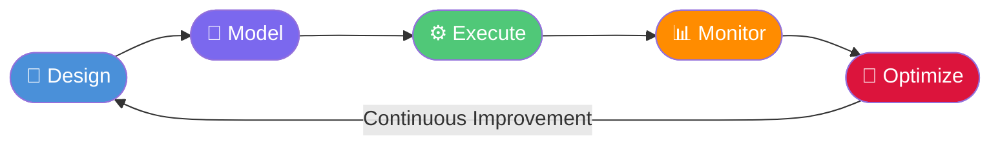
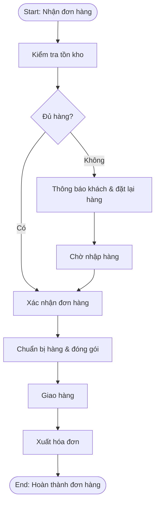

# OP01 — Business Process Management (BPM)

> **Domain:** Operations
> **Trạng thái:** Hoàn thành
> **Level:** Intermediate
> **Prerequisites:** F01 (Business Fundamentals), F02 (Organizational Structure)

---

## 1. Learning Objectives

Sau khi hoàn thành module này, học viên có thể:

- Giải thích BPM lifecycle gồm 5 giai đoạn: Design → Model → Execute → Monitor → Optimize
- Đọc và vẽ sơ đồ BPMN 2.0 với các ký hiệu chuẩn (Events, Activities, Gateways, Sequence Flows, Swimlanes)
- Phân tích quy trình theo kiến trúc phân cấp L0–L4
- Thực hiện As-Is Process Mapping và xây dựng To-Be Process Design
- Áp dụng Value Stream Mapping (VSM) và SIPOC để cải tiến quy trình
- Lựa chọn công cụ BPM phù hợp (Visio, Camunda, Bizagi) cho từng bối cảnh doanh nghiệp
- Tư vấn BPM trong dự án triển khai ERP tại Việt Nam

---

## 2. Business Context

Business Process Management (BPM) là kỷ luật quản trị tập trung vào cải thiện hiệu suất doanh nghiệp thông qua thiết kế, mô hình hóa, thực thi, giám sát và tối ưu hóa các quy trình kinh doanh.

**Tại sao BPM quan trọng?**

Trong bối cảnh doanh nghiệp Việt Nam đang chuyển đổi số mạnh mẽ (2020–2030), BPM đóng vai trò nền tảng:
- **Trước ERP:** Chuẩn hóa quy trình trước khi số hóa, tránh "garbage in, garbage out"
- **Trong ERP:** Mapping quy trình nghiệp vụ vào tham số hệ thống (SAP, Oracle, Odoo)
- **Sau ERP:** Liên tục cải tiến quy trình dựa trên dữ liệu thực tế từ hệ thống

**Xu hướng toàn cầu:**
- Intelligent BPM (iBPM): tích hợp AI/ML vào workflow automation
- Process Mining: phân tích log hệ thống để khám phá quy trình thực tế (Celonis, UiPath Process Mining)
- Low-code BPM: platforms như Appian, Pega cho phép business user tự build workflow

---

## 3. Definitions

| Thuật ngữ | Định nghĩa |
|-----------|------------|
| **BPM** | Business Process Management — kỷ luật quản lý vòng đời quy trình kinh doanh từ thiết kế đến tối ưu hóa liên tục |
| **BPMN** | Business Process Model and Notation — chuẩn ký hiệu quốc tế (OMG) để mô hình hóa quy trình kinh doanh |
| **Process** | Một tập hợp các hoạt động có trình tự, chuyển đổi Input thành Output có giá trị cho khách hàng |
| **As-Is Process** | Sơ đồ quy trình hiện tại, phản ánh thực tế đang vận hành (có thể bao gồm sự non-conformance) |
| **To-Be Process** | Sơ đồ quy trình tương lai mục tiêu sau khi cải tiến hoặc thiết kế lại |
| **SIPOC** | Suppliers-Inputs-Process-Outputs-Customers — công cụ mô tả quy trình ở cấp độ cao |
| **VSM** | Value Stream Mapping — công cụ Lean để phân tích luồng giá trị, xác định lãng phí |
| **RPA** | Robotic Process Automation — tự động hóa quy trình bằng software robot mô phỏng thao tác người dùng |
| **Process Owner** | Người chịu trách nhiệm cuối cùng về thiết kế, hiệu suất và cải tiến một quy trình cụ thể |
| **Swimlane** | Vùng phân chia trong sơ đồ BPMN thể hiện actor/department thực hiện các bước quy trình |
| **Gateway** | Ký hiệu BPMN thể hiện điểm phân nhánh hoặc hội tụ logic trong quy trình (AND, OR, XOR) |

---

## 4. Core Concepts

### 4.1 BPM Lifecycle (5 giai đoạn)

```
Design → Model → Execute → Monitor → Optimize → (quay lại Design)
```

**Giai đoạn 1 — Design (Thiết kế)**
- Xác định ranh giới quy trình (process scope)
- Thu thập yêu cầu từ stakeholders
- Phân tích quy trình hiện tại (As-Is)
- Xác định vấn đề và cơ hội cải tiến

**Giai đoạn 2 — Model (Mô hình hóa)**
- Vẽ sơ đồ BPMN 2.0
- Mô hình hóa To-Be process
- Simulation (mô phỏng) để kiểm tra bottleneck
- Review và phê duyệt với stakeholders

**Giai đoạn 3 — Execute (Thực thi)**
- Triển khai quy trình vào BPMS (Business Process Management Suite)
- Hoặc cài đặt quy trình vào ERP/CRM
- Training người dùng
- Go-live với giai đoạn pilot

**Giai đoạn 4 — Monitor (Giám sát)**
- Thu thập dữ liệu thực tế từ hệ thống
- Đo lường KPI quy trình (cycle time, error rate, cost)
- Process Mining để phát hiện deviation
- Báo cáo hiệu suất theo dashboards

**Giai đoạn 5 — Optimize (Tối ưu hóa)**
- Phân tích root cause của vấn đề
- Đề xuất cải tiến (Lean, Six Sigma, Automation)
- Quay lại giai đoạn Design cho cải tiến tiếp theo

### 4.2 Process Architecture (Kiến trúc Quy trình L0–L4)

| Level | Tên | Mô tả | Ví dụ |
|-------|-----|-------|-------|
| **L0** | Enterprise | Toàn bộ doanh nghiệp dưới dạng value chain | Chuỗi giá trị Porter's: Inbound → Operations → Outbound → Sales → Service |
| **L1** | Process Group | Nhóm quy trình lớn theo chức năng | Order-to-Cash, Procure-to-Pay, Record-to-Report |
| **L2** | Process | Quy trình cụ thể có đầu vào/đầu ra rõ ràng | Xử lý đơn hàng khách hàng |
| **L3** | Sub-Process | Các bước chính trong quy trình | Kiểm tra tín dụng, Xác nhận tồn kho |
| **L4** | Activity/Task | Tác vụ chi tiết có thể gán cho cá nhân | Nhập đơn hàng vào hệ thống SAP |

### 4.3 BPMN 2.0 Notation

**Flow Objects (3 loại chính):**

1. **Events** (hình tròn):
   - Start Event (vòng tròn đơn): điểm bắt đầu
   - Intermediate Event (vòng tròn kép): sự kiện giữa quy trình
   - End Event (vòng tròn đậm): điểm kết thúc

2. **Activities** (hình chữ nhật bo góc):
   - Task: tác vụ đơn lẻ (nhập liệu, gửi email)
   - Sub-Process: quy trình con có thể expand
   - Call Activity: gọi một quy trình khác

3. **Gateways** (hình thoi):
   - **XOR (Exclusive)**: chỉ một nhánh được chọn (if/else)
   - **AND (Parallel)**: tất cả nhánh thực hiện đồng thời
   - **OR (Inclusive)**: một hoặc nhiều nhánh được chọn

**Connecting Objects:**
- Sequence Flow: mũi tên liền → thứ tự hoạt động
- Message Flow: mũi tên đứt - - → giao tiếp giữa pools
- Association: gắn annotation/data object

**Swimlanes:**
- Pool: đại diện một tổ chức/participant
- Lane: phân chia trong Pool theo department/role

### 4.4 SIPOC Diagram

| S | I | P | O | C |
|---|---|---|---|---|
| Suppliers | Inputs | Process | Outputs | Customers |
| Ai cung cấp input? | Input gồm những gì? | Các bước chính của quy trình | Kết quả đầu ra | Ai nhận đầu ra? |

### 4.5 Value Stream Mapping (VSM)

VSM là công cụ Lean phân tích luồng giá trị, gồm 2 bản:
- **Current State Map**: trạng thái hiện tại với lead time, takt time, inventory
- **Future State Map**: trạng thái mục tiêu sau loại bỏ lãng phí (7 wastes: TIMWOOD)

**8 loại lãng phí (TIMWOODS):** Transportation, Inventory, Motion, Waiting, Overproduction, Over-processing, Defects, Skills (unused talent)

---

## 5. Business Value

| Loại giá trị | Mô tả | Chỉ số đo lường |
|-------------|-------|-----------------|
| **Hiệu quả vận hành** | Giảm thời gian xử lý, loại bỏ bước thừa | Cycle time giảm 20–40% |
| **Chất lượng** | Chuẩn hóa quy trình giảm lỗi | Error rate giảm 50–70% |
| **Tuân thủ** | Quy trình có audit trail, dễ chứng minh compliance | Audit pass rate tăng |
| **Khả năng mở rộng** | Quy trình chuẩn hóa dễ nhân rộng chi nhánh | Onboarding time giảm |
| **Chuyển đổi số** | Nền tảng để tự động hóa và tích hợp hệ thống | ROI automation tăng |
| **Kiến thức tổ chức** | Quy trình được tài liệu hóa, không phụ thuộc cá nhân | Knowledge retention |

---

## 6. Enterprise Role

BPM tham gia ở tất cả các cấp độ tổ chức:

- **C-Level:** Xác định process strategy, portfolio quy trình chiến lược
- **Middle Management:** Process Owners — chịu trách nhiệm hiệu suất quy trình
- **Business Analyst / Process Analyst:** Mô hình hóa, phân tích, cải tiến quy trình
- **IT/ERP Team:** Cài đặt quy trình vào hệ thống, tích hợp workflow engine
- **End Users:** Thực hiện quy trình, báo cáo vấn đề, đề xuất cải tiến
- **Internal Audit / Compliance:** Kiểm tra quy trình có tuân thủ quy định

---

## 7. Departments Related

- **Operations / Vận hành:** Primary owner của hầu hết process
- **IT / Công nghệ:** BPMS implementation, workflow automation
- **Finance / Tài chính:** Financial processes (O2C, P2P, R2R)
- **HR / Nhân sự:** HR processes (recruitment, onboarding, payroll)
- **Sales / Kinh doanh:** CRM workflows, order management
- **Quality / Chất lượng:** ISO process documentation, audit
- **Procurement / Mua hàng:** Procure-to-Pay process ownership

---

## 8. Input

- Mục tiêu chiến lược doanh nghiệp (từ CEO/Board)
- Phỏng vấn stakeholders (Process owners, end users)
- Tài liệu quy trình hiện tại (nếu có)
- Dữ liệu hiệu suất hệ thống (ERP logs, Excel reports)
- Yêu cầu pháp lý và tuân thủ (ISO, luật lao động, thuế)
- Benchmark ngành (so sánh với best practice)
- Kết quả audit nội bộ / khiếu nại khách hàng

---

## 9. Output

- Sơ đồ As-Is Process (BPMN 2.0)
- Sơ đồ To-Be Process (BPMN 2.0)
- SIPOC Diagram
- Value Stream Map (Current & Future State)
- Process Architecture Document (L0–L4)
- Process KPI Dashboard
- Change Management Plan
- SOP cho từng quy trình (→ OP02)
- Business Case cho cải tiến quy trình

---

## 10. Business Process (BPM Project Lifecycle)

```
Khởi động → Phân tích As-Is → Thiết kế To-Be → Thực thi → Giám sát → Cải tiến
```

**Bước 1 — Khởi động BPM Project**
- Xác định scope (phạm vi quy trình cần phân tích)
- Thành lập Process Improvement Team
- Thu thập tài liệu hiện có

**Bước 2 — Phân tích As-Is**
- Phỏng vấn và workshop với process owners
- Observe quy trình thực tế (shadowing)
- Vẽ As-Is BPMN diagram
- Tính cycle time, identify pain points

**Bước 3 — Thiết kế To-Be**
- Brainstorm giải pháp cải tiến
- Thiết kế quy trình mới
- Simulation với BPMS tool
- Trình bày và phê duyệt với stakeholders

**Bước 4 — Thực thi**
- Develop/configure workflow trong hệ thống
- Testing (unit test, integration test, UAT)
- Training người dùng
- Go-live theo phased approach

**Bước 5 — Giám sát và Cải tiến**
- Monitor KPIs hàng tuần/hàng tháng
- Process Mining để phát hiện deviation
- Cải tiến liên tục theo PDCA cycle

---

## 11. Data Flow

```
Raw Data (ERP logs, paper forms)
    ↓
Process Discovery (phỏng vấn, observation)
    ↓
As-Is Model (BPMN diagram)
    ↓
Gap Analysis (so sánh với best practice)
    ↓
To-Be Model (BPMN diagram)
    ↓
Implementation Data (workflow config, form fields)
    ↓
Process Performance Data (cycle time, error count)
    ↓
KPI Dashboard → Decision Making
```

---

## 12. Money Flow

**Chi phí BPM Project:**
- Consulting fee: 50–200 triệu VND cho doanh nghiệp SME; 500M–2B cho Enterprise
- Software license (Bizagi, Camunda Enterprise): $10,000–$100,000/năm
- Training và change management: 20–30% tổng chi phí dự án
- Internal resource cost (time của process owners, IT team)

**ROI điển hình:**
- Giảm FTE (headcount) nhờ automation: tiết kiệm 1 FTE = 150–300 triệu VND/năm
- Giảm lỗi và rework: tiết kiệm 10–20% labor cost
- Giảm cycle time → tăng doanh thu (faster order fulfillment)
- Payback period điển hình: 12–24 tháng

---

## 13. Document Flow

```
Project Charter → Scope Document
     ↓
Interview Notes → As-Is BPMN Diagrams
     ↓
Gap Analysis Report
     ↓
To-Be BPMN Diagrams → SOP Documents
     ↓
Implementation Specification
     ↓
Training Materials
     ↓
Process Performance Reports
```

---

## 14. Roles

| Role | Mô tả |
|------|-------|
| **BPM Lead / Process Architect** | Thiết kế kiến trúc quy trình tổng thể, dẫn dắt BPM program |
| **Process Analyst** | Phân tích, mô hình hóa quy trình cụ thể |
| **Process Owner** | Manager chịu trách nhiệm sở hữu và hiệu suất quy trình |
| **Process Participant** | Nhân viên thực hiện các bước trong quy trình |
| **BPMS Developer** | Developer cài đặt workflow vào hệ thống kỹ thuật |
| **Change Manager** | Quản lý thay đổi, đào tạo người dùng |
| **Sponsor** | C-level champion bảo đảm nguồn lực và quyết định |

---

## 15. Responsibilities

- **Process Architect:** Thiết kế L0–L2 architecture, chọn công cụ, chuẩn hóa notation
- **Process Analyst:** Thực hiện As-Is mapping, thiết kế To-Be, viết specifications
- **Process Owner:** Phê duyệt sơ đồ, cam kết với KPIs, resolve cross-functional conflicts
- **IT Team:** Cài đặt workflow engine, integrate systems, maintain BPMS
- **End Users:** Tuân thủ quy trình, báo cáo sự cố, tham gia UAT
- **Management:** Cung cấp resources, ưu tiên cải tiến, review KPIs định kỳ

---

## 16. RACI

| Hoạt động | Process Architect | Process Owner | IT Team | End Users | Management |
|-----------|:-----------------:|:-------------:|:-------:|:---------:|:----------:|
| Xác định scope BPM | C | A | I | I | R |
| As-Is mapping | R | A | I | C | I |
| To-Be design | R | A | C | C | I |
| BPMN review & approval | C | A | I | I | R |
| BPMS implementation | C | I | R | I | A |
| User training | C | R | I | A | I |
| Go-live approval | C | R | I | I | A |
| KPI monitoring | C | R | I | I | A |

*R=Responsible, A=Accountable, C=Consulted, I=Informed*

---

## 17. Frameworks

### PCMM (Process and Enterprise Maturity Model)
5 mức độ trưởng thành:
1. **Ad Hoc**: Quy trình không có tài liệu, phụ thuộc cá nhân
2. **Defined**: Quy trình được ghi lại nhưng không chuẩn hóa
3. **Standardized**: Quy trình chuẩn hóa toàn tổ chức
4. **Measured**: KPI được theo dõi và báo cáo
5. **Optimized**: Cải tiến liên tục dựa trên dữ liệu

### BPM CBOK (Common Body of Knowledge)
Tài liệu chuẩn của ABPMP gồm 9 knowledge areas:
BPM Foundations → Process Modeling → Analysis → Design → Performance Measurement → Transformation → Organization → Enterprise Process Management → BPM Technologies

### Lean Six Sigma Integration
- **Lean**: loại bỏ lãng phí (VSM, 5S, Kanban)
- **Six Sigma DMAIC**: Define → Measure → Analyze → Improve → Control
- **BPM + Lean + Six Sigma** = holistic process improvement framework

---

## 18. International Standards

| Chuẩn | Tổ chức | Nội dung |
|-------|---------|---------|
| **BPMN 2.0** | OMG (Object Management Group) | Chuẩn ký hiệu mô hình hóa quy trình |
| **BPEL** | OASIS | Business Process Execution Language — thực thi web service workflow |
| **ISO 9001:2015** | ISO | Quality Management System — yêu cầu documented processes |
| **ISO/IEC 27001** | ISO | Information Security — process controls |
| **TOGAF** | The Open Group | Enterprise Architecture framework tích hợp BPM |
| **ITIL v4** | Axelos | IT Service Management processes |

---

## 19. Vietnam Context

**BPM trong bối cảnh Việt Nam:**

1. **ERP Wave (2018–nay):** Làn sóng ERP triển khai ở doanh nghiệp VN (SAP B1, Oracle NetSuite, MISA, Odoo) đòi hỏi BPM làm nền tảng. Nhiều dự án thất bại vì bỏ qua bước process mapping trước khi cài đặt.

2. **ISO Certification:** Hàng chục nghìn doanh nghiệp VN đã có ISO 9001. BPM là kỹ năng cần thiết để maintain và cải tiến QMS.

3. **Thách thức văn hóa:** Văn hóa làm việc theo "người" hơn "quy trình" tại VN. BPM cần kết hợp change management mạnh mẽ.

4. **SME challenges:** 97% doanh nghiệp VN là SME, nguồn lực BPM hạn chế. Cần approach pragmatic với công cụ low-cost (draw.io, Bizagi free tier).

5. **Digital Transformation:** Chính phủ VN thúc đẩy chuyển đổi số 2025–2030. BPM là prerequisite cho automation và AI adoption.

6. **Nhân lực:** BA/Process Analyst là nghề đang thiếu tại VN. Mức lương: 15–40 triệu VND/tháng tùy kinh nghiệm.

---

## 20. Legal Considerations

- **Lưu trữ tài liệu quy trình:** Nghị định 30/2020/NĐ-CP về công tác văn thư quy định thời hạn lưu trữ tài liệu
- **Quy trình tài chính:** Phải tuân thủ Luật Kế toán 2015, Thông tư 200/2014/TT-BTC
- **Quy trình nhân sự:** Bộ Luật Lao động 2019 — quy trình tuyển dụng, kỷ luật, chấm dứt hợp đồng phải documented
- **Data Privacy:** Nghị định 13/2023/NĐ-CP về bảo vệ dữ liệu cá nhân ảnh hưởng đến quy trình xử lý data
- **ISO Certification:** Nếu muốn chứng nhận ISO 9001, quy trình phải được document và audit định kỳ
- **Sector-specific:** Quy trình ngân hàng (Thông tư NHNN), dược phẩm (GMP), thực phẩm (HACCP) có yêu cầu pháp lý riêng

---

## 21. Common Mistakes

1. **Bỏ qua As-Is trước khi thiết kế To-Be:** Thiết kế quy trình mới mà không hiểu vấn đề thực tế dẫn đến giải pháp không phù hợp

2. **Over-engineering BPMN:** Vẽ sơ đồ quá chi tiết (L4) cho mục đích communication — nên dùng L2–L3 cho stakeholder review

3. **Process Owner không engaged:** Thiếu ownership dẫn đến quy trình không được áp dụng sau go-live

4. **Bỏ qua exception flows:** Chỉ vẽ happy path, không model các trường hợp ngoại lệ → hệ thống breakdown trong thực tế

5. **Không có version control cho process documents:** Sơ đồ lỗi thời, team dùng nhiều phiên bản khác nhau

6. **Copy-paste best practice không adapt:** Áp dụng nguyên xi process từ công ty khác mà không điều chỉnh cho context riêng

7. **Bỏ qua change management:** Kỹ thuật tốt nhưng người dùng kháng cự, quy trình mới không được tuân thủ

8. **Không đo lường sau implementation:** Triển khai xong nhưng không theo dõi KPI để biết có hiệu quả không

---

## 22. Best Practices

1. **Start with L0/L1 Architecture:** Đảm bảo tổng thể trước khi đi vào chi tiết
2. **Involve Process Owners from Day 1:** Ownership và buy-in quan trọng hơn kỹ thuật
3. **Use Standard Notation (BPMN 2.0):** Đảm bảo khả năng đọc hiểu chung và tool compatibility
4. **Model at appropriate level:** L2 cho communication, L4 cho technical implementation
5. **Validate with walkthroughs:** Review sơ đồ bằng cách walk through từng bước với team
6. **Document assumptions and decisions:** Ghi lại lý do thiết kế, không chỉ kết quả
7. **Version control everything:** Dùng Git hoặc SharePoint versioning cho tất cả artifacts
8. **Simulate before implement:** Dùng simulation để phát hiện bottleneck trước khi go-live
9. **Iterative improvement:** BPM không phải one-time project — xây dựng culture cải tiến liên tục
10. **Process Mining for validation:** Sau go-live, dùng process mining để so sánh actual vs designed

---

## 23. KPIs

| KPI | Định nghĩa | Target |
|-----|-----------|--------|
| **Process Cycle Time** | Thời gian trung bình từ start đến end event | Giảm 20–40% so với baseline |
| **Process Compliance Rate** | % instances tuân thủ đúng quy trình designed | > 90% |
| **Rework Rate** | % cases phải làm lại do lỗi | < 5% |
| **First-Pass Yield** | % cases hoàn thành đúng ngay lần đầu | > 95% |
| **Process Cost per Unit** | Chi phí trung bình thực hiện 1 process instance | Giảm 15–30% |
| **Automation Rate** | % bước trong quy trình được tự động hóa | Tăng theo lộ trình |
| **Process Maturity Score** | Điểm đánh giá mức trưởng thành theo PCMM | Tăng 1 level/2 năm |

---

## 24. Metrics

**Operational Metrics:**
- Throughput: số process instances hoàn thành/ngày
- Backlog: số cases đang chờ xử lý
- Queue time: thời gian chờ tại từng bước
- Resource utilization: % thời gian nhân viên thực sự làm việc vs chờ

**Quality Metrics:**
- Defect rate per process step
- Customer complaint rate liên quan đến process
- Audit findings per process

**Efficiency Metrics:**
- Value-added time ratio (VA time / total cycle time)
- Cost of poor quality (COPQ)
- Labor cost per transaction

---

## 25. Reports

| Báo cáo | Tần suất | Đối tượng |
|---------|---------|-----------|
| **Process Performance Dashboard** | Hàng tuần | Process Owners, Management |
| **BPM Program Status Report** | Hàng tháng | Steering Committee |
| **Process Improvement Pipeline** | Hàng quý | Leadership |
| **Process Maturity Assessment** | Hàng năm | C-Level, Board |
| **Compliance Audit Report** | Theo yêu cầu | Internal Audit, Regulators |
| **Process Mining Analysis** | Hàng tháng | Process Analysts, IT |

---

## 26. Templates

### Template 1: As-Is Process Interview Guide
```
Process: _______________
Interviewee: _______________ Role: _______________
Date: _______________

QUESTIONS:
1. Mô tả quy trình bắt đầu từ đâu (trigger event)?
2. Các bước chính theo thứ tự là gì?
3. Ai thực hiện từng bước?
4. Hệ thống/công cụ nào được dùng?
5. Input cần thiết cho từng bước là gì?
6. Output của từng bước là gì?
7. Điều kiện nào khiến quy trình rẽ nhánh?
8. Những vấn đề/bottleneck thường gặp?
9. Ngoại lệ và cách xử lý?
10. Quy trình kết thúc khi nào?
```

### Template 2: SIPOC Document
```
Process Name: _______________
Scope: _______________  | Version: ___

| Suppliers | Inputs | Process (5-7 steps) | Outputs | Customers |
|-----------|--------|---------------------|---------|-----------|
|           |        | 1.                  |         |           |
|           |        | 2.                  |         |           |
|           |        | 3.                  |         |           |
```

### Template 3: Process Improvement Proposal
```
Process: _______________ | Date: _______________
Current State Problem: _______________
Root Cause: _______________
Proposed Solution: _______________
Expected Benefits: _______________
Resources Required: _______________
Timeline: _______________
KPI Baseline / Target: _______________
Risks: _______________
```

---

## 27. Checklists

### Checklist: As-Is Process Mapping
- [ ] Xác định rõ tên quy trình và scope (start/end points)
- [ ] Liệt kê tất cả participants/departments liên quan
- [ ] Phỏng vấn ít nhất 3 người thực hiện quy trình
- [ ] Observe quy trình thực tế (nếu có thể)
- [ ] Capture tất cả exception flows, không chỉ happy path
- [ ] Ghi nhận hệ thống và công cụ được dùng
- [ ] Đo cycle time cho từng bước (ít nhất estimate)
- [ ] Vẽ sơ đồ BPMN 2.0 với swimlanes
- [ ] Review với process owner và end users
- [ ] Document pain points và improvement opportunities

### Checklist: To-Be Process Design
- [ ] Liên kết rõ ràng với business objectives
- [ ] Địa chỉ tất cả pain points từ As-Is
- [ ] Verify feasibility với IT team (nếu cần automation)
- [ ] Tính toán expected KPI improvement
- [ ] Review với tất cả stakeholders
- [ ] Sign-off từ Process Owner và Sponsor
- [ ] Document change impact (ai bị ảnh hưởng, thay đổi gì)
- [ ] Plan training và communication

### Checklist: BPM Tool Selection
- [ ] Xác định use case: modeling only vs full BPMS
- [ ] Budget (free vs commercial)
- [ ] Team technical skill (low-code vs developer)
- [ ] Integration requirements với existing systems
- [ ] Collaboration features (multi-user, cloud)
- [ ] Output formats (PNG, SVG, BPMN XML)
- [ ] Vendor support và community

---

## 28. SOP

### SOP: Quy trình As-Is Process Mapping

**Mục đích:** Tài liệu hóa quy trình hiện tại một cách chính xác và đầy đủ  
**Phạm vi áp dụng:** Tất cả dự án BPM/ERP  
**Người thực hiện:** Process Analyst  
**Công cụ:** Bizagi Modeler (free) hoặc draw.io

**Bước 1 — Chuẩn bị (1–2 ngày)**
1. Nhận scope document từ Project Manager
2. Chuẩn bị interview guide (Template 1)
3. Lập lịch phỏng vấn với process owners và end users
4. Thu thập tài liệu hiện có (nếu có): SOP cũ, flowcharts, forms

**Bước 2 — Thu thập thông tin (2–5 ngày)**
1. Conduct phỏng vấn theo interview guide
2. Take notes chi tiết, record (nếu được phép)
3. Observe quy trình thực tế ít nhất 1 lần
4. Thu thập mẫu documents/forms được dùng trong quy trình

**Bước 3 — Vẽ sơ đồ (1–3 ngày)**
1. Draft sơ đồ dựa trên notes phỏng vấn
2. Dùng BPMN 2.0 notation với swimlanes
3. Đảm bảo tất cả flows có start và end events
4. Add annotations cho pain points và questions

**Bước 4 — Validation (1–2 ngày)**
1. Walk-through sơ đồ với người được phỏng vấn
2. Ghi nhận corrections và additions
3. Update sơ đồ theo feedback
4. Final review với Process Owner

**Bước 5 — Documentation**
1. Xuất file BPMN XML và PNG
2. Upload lên document repository với version number
3. Gửi email confirmation cho Process Owner
4. Update project tracking tool

---

## 29. Case Study

### Case Study: BPM cho Công ty FMCG Việt Nam — Quy trình Order-to-Cash

**Bối cảnh:** Công ty phân phối FMCG với 500 nhân viên, 3.000 khách hàng B2B, đang triển khai SAP B1. Trước khi implement SAP, ban lãnh đạo muốn chuẩn hóa quy trình O2C (Order-to-Cash).

**Vấn đề hiện tại (As-Is):**
- Đơn hàng nhận qua nhiều kênh: Zalo, email, điện thoại, gặp trực tiếp
- Sales phải nhập tay vào Excel → gửi email sang kho → kho xác nhận tồn kho → kế toán lập hóa đơn
- Cycle time trung bình: 3–5 ngày từ nhận đơn đến giao hàng
- Lỗi nhập liệu: 8% đơn hàng có sai sót
- Không có visibility về tình trạng đơn hàng cho khách

**Quá trình BPM:**
1. As-Is mapping: 3 process analysts làm trong 2 tuần, phỏng vấn 15 stakeholders
2. Pain point analysis: identify 12 điểm nghẽn trong quy trình
3. To-Be design: redesign với SAP B1 workflow integration
4. Simulation: test To-Be với 100 sample orders, cycle time dự kiến giảm xuống < 24 giờ

**Kết quả sau 6 tháng triển khai:**
- Cycle time: 3–5 ngày → 4–8 giờ (giảm 90%)
- Error rate: 8% → 0.5%
- Customer satisfaction (CSAT): tăng từ 72% lên 91%
- FTE saving: tiết kiệm 2.5 FTE nhờ automation
- ROI: 340% trong năm đầu

---

## 30. Small Business Example

### SME: Công ty tư vấn 20 người — Chuẩn hóa quy trình onboarding khách hàng mới

**Vấn đề:** Mỗi consultant onboard khách hàng theo cách riêng → chất lượng không đồng đều, mất thông tin khi nhân viên nghỉ.

**Giải pháp BPM đơn giản:**
1. Vẽ As-Is process bằng draw.io (miễn phí): 5 bước chính
2. Identify vấn đề: thiếu bước "Ký NDA" và "Brief team nội bộ"
3. To-Be process: thêm 2 bước, chuẩn hóa documents cần thu thập
4. Tạo checklist trong Notion/Google Sheets để track

**Công cụ dùng:** draw.io (free), Notion (free tier)  
**Chi phí:** 0 đồng phần mềm, 3 ngày nhân lực  
**Kết quả:** Onboarding time giảm 40%, không còn missing information

---

## 31. Enterprise Example

### Enterprise: Ngân hàng thương mại cổ phần — BPM Program toàn diện

**Bối cảnh:** Ngân hàng top 10 VN, 10,000 nhân viên, 300 chi nhánh. Triển khai BPM program để chuẩn bị cho Core Banking System upgrade.

**Phạm vi:** 150 quy trình cấp L2 được mô hình hóa và tối ưu hóa trong 18 tháng.

**Team:** 8 Process Analysts + 2 BPM Architects + Camunda Enterprise (workflow engine)

**Kết quả:**
- 45 quy trình được tự động hóa hoàn toàn
- 80 quy trình được partial automation
- Average processing time toàn hệ thống: giảm 35%
- Compliance incidents: giảm 60%
- Annual cost saving: ~50 tỷ VND/năm
- Nền tảng cho AI/ML integration trong giai đoạn tiếp theo

---

## 32. ERP Mapping

| BPM Concept | SAP | Oracle | Odoo |
|-------------|-----|--------|------|
| Process Model | Process Modeler (Solution Manager) | Oracle BPM Suite | Studio (workflow) |
| Workflow Automation | SAP Business Workflow | Oracle Workflow | Automated Actions |
| Process Mining | SAP Signavio Process Intelligence | Oracle Process Analytics | Third-party |
| BPMN Execution | SAP Process Orchestration | Oracle SOA Suite | Custom |
| Process KPIs | SAP Analytics Cloud | Oracle OAC | Odoo Dashboards |
| Document Flow | SAP Document Management | Oracle UCM | Odoo Documents |

---

## 33. Automation

**RPA (Robotic Process Automation):**
- Tool phổ biến: UiPath, Blue Prism, Automation Anywhere
- Phù hợp cho: quy trình lặp đi lặp lại, rule-based, nhiều manual data entry
- Ví dụ VN: tự động nhập liệu từ email đơn hàng vào ERP, đối chiếu ngân hàng

**BPMS Workflow Engine:**
- Camunda (open-source): Java-based, tích hợp tốt với enterprise systems
- Bizagi: low-code, phù hợp business users
- Appian: low-code platform với built-in AI capabilities

**AI-Enhanced Automation:**
- Intelligent Document Processing (IDP): đọc và extract data từ PDF, scan
- Decision Automation: rules engine + ML model cho approval workflows
- Process Mining → Auto-suggest improvements

---

## 34. AI Opportunities

| Cơ hội | Mô tả | Maturity |
|--------|-------|---------|
| **Process Mining** | AI phân tích event logs, discover actual process flows | High (Celonis, UiPath) |
| **Intelligent Document Processing** | OCR + NLP để xử lý invoices, contracts, forms tự động | High |
| **Predictive Process Monitoring** | AI dự đoán process instance sẽ bị delay hoặc fail | Medium |
| **Auto-Generate BPMN** | LLM tự động tạo sơ đồ từ text description | Medium |
| **Conversational Process Interface** | Chatbot cho phép trigger và query process qua natural language | Medium |
| **Anomaly Detection** | AI detect khi process deviation xảy ra trong real-time | Medium |
| **Process Recommendation** | AI đề xuất quy trình tốt nhất dựa trên context | Emerging |

---

## 35. Implementation Guide

### Giai đoạn 1: Foundation (Tháng 1–3)
- [ ] Thành lập BPM Center of Excellence (CoE) nếu Enterprise; hoặc assign Process Champion nếu SME
- [ ] Chọn và deploy BPM tool (Bizagi free cho SME; Camunda/Signavio cho Enterprise)
- [ ] Train team về BPMN 2.0 notation
- [ ] Xây dựng Process Architecture L0–L1 cho toàn doanh nghiệp
- [ ] Ưu tiên 3–5 quy trình quan trọng nhất để pilot

### Giai đoạn 2: Quick Wins (Tháng 3–6)
- [ ] As-Is mapping 5 quy trình ưu tiên
- [ ] Identify và implement quick-win improvements (không cần IT)
- [ ] Đo lường KPI baseline
- [ ] Trình bày kết quả đầu tiên cho management

### Giai đoạn 3: Scale (Tháng 6–18)
- [ ] Mở rộng sang 20–50 quy trình
- [ ] Tích hợp với ERP/CRM workflows
- [ ] Triển khai automation cho quy trình phù hợp
- [ ] Xây dựng process performance dashboard

### Giai đoạn 4: Continuous Improvement (Từ tháng 18)
- [ ] Process Mining implementation
- [ ] Quarterly process review cycle
- [ ] BPM governance và process ownership program
- [ ] Năng lực đo KPI liên tục

---

## 36. Consulting Guide

**Khi nào khách hàng cần BPM Consulting?**
- Trước dự án ERP: bắt buộc, tránh thất bại do implement quy trình sai
- Khi muốn ISO certification: cần document và control processes
- Khi mở rộng quy mô (scaling): chuẩn hóa trước khi nhân rộng
- Khi có nhiều lỗi và khiếu nại khách hàng: trace root cause về process
- Khi muốn automation/AI: cần clean processes trước khi automate

**Discovery Questions:**
1. "Công ty có tài liệu quy trình nào không? Khi nào được cập nhật lần cuối?"
2. "Khi nhân viên mới vào, họ học quy trình bằng cách nào?"
3. "Nếu một nhân viên key nghỉ đột ngột, điều gì xảy ra?"
4. "Quy trình nào đang gây ra nhiều khiếu nại khách hàng nhất?"
5. "Bạn muốn triển khai phần mềm gì? Đã chuẩn bị quy trình chưa?"

**Typical Engagement:**
- SME BPM assessment: 2–4 tuần, 50–100 triệu VND
- ERP pre-implementation BPM: 1–3 tháng, 200–500 triệu VND
- Enterprise BPM program: 6–18 tháng, 1–5 tỷ VND

---

## 37. Diagnostic Questions

1. Doanh nghiệp có tài liệu quy trình (process documentation) không? Tỷ lệ bao nhiêu quy trình đã được document?
2. Ai là Process Owner cho các quy trình quan trọng? Họ có biết mình là Process Owner không?
3. KPI quy trình có được đo lường và báo cáo định kỳ không?
4. Khi có vấn đề xảy ra, team có trace về process failure không hay chỉ "blame người"?
5. Quy trình có được review và update định kỳ không?
6. Mức độ automation hiện tại là bao nhiêu? Bao nhiêu quy trình vẫn manual?
7. Khi triển khai phần mềm mới, quy trình có được redesign không hay chỉ "số hóa cái cũ"?
8. Nhân viên có được training về quy trình khi onboard không?
9. Có Process Maturity Assessment nào được thực hiện chưa?
10. Cross-functional processes (liên phòng ban) được quản lý như thế nào?

---

## 38. Interview Questions

**Cho Process Analyst position:**
1. "Giải thích sự khác biệt giữa XOR gateway và OR gateway trong BPMN 2.0"
2. "Bạn sẽ làm gì khi As-Is process của một phòng ban không khớp với quy trình được document trong SOP?"
3. "Mô tả cách bạn handle exception flows trong process modeling"
4. "Khi nào bạn dùng Call Activity thay vì Sub-Process trong BPMN?"
5. "Giải thích SIPOC và khi nào bạn dùng nó vs BPMN diagram"

**Cho BPM Manager/Architect:**
1. "Làm thế nào để build Process Architecture L0–L4 cho một doanh nghiệp sản xuất?"
2. "Bạn sẽ pitch BPM program như thế nào cho CEO không hiểu biết về BPM?"
3. "Mô tả cách bạn chọn giữa RPA và BPMS workflow engine cho một use case"
4. "Làm thế nào để đảm bảo process improvement được sustain sau khi consultant rời đi?"
5. "Process Mining là gì và nó bổ sung thế nào cho traditional BPM approach?"

---

## 39. Exercises

**Exercise 1: SIPOC Mapping (Beginner)**
Vẽ SIPOC diagram cho quy trình "Xử lý đơn nghỉ phép của nhân viên" tại một công ty 100 người. Xác định Suppliers, Inputs, 5-7 Process steps, Outputs, Customers.

**Exercise 2: As-Is BPMN (Intermediate)**
Phỏng vấn một người quen về quy trình làm việc hàng ngày của họ (bất kỳ ngành nào). Vẽ As-Is BPMN 2.0 diagram với swimlanes, ít nhất 1 gateway, và các exception flows. Dùng Bizagi Modeler free.

**Exercise 3: To-Be Design (Intermediate)**
Dựa trên Exercise 2, identify 3 pain points và thiết kế To-Be process. Estimate cycle time improvement.

**Exercise 4: Value Stream Mapping (Advanced)**
Chọn một quy trình sản xuất hoặc dịch vụ đơn giản (ví dụ: pha cà phê tại quán, hoặc quy trình giao hàng e-commerce). Vẽ Current State VSM với cycle time, inventory, và identify wastes. Sau đó vẽ Future State VSM.

**Exercise 5: BPM Maturity Assessment (Advanced)**
Thực hiện đánh giá BPM maturity cho một doanh nghiệp (có thể dùng case study hoặc công ty thực tế bạn biết) theo PCMM 5 levels. Đề xuất roadmap để nâng từ current level lên next level.

---

## 40. References

**Sách:**
- Dumas, M. et al. — *Fundamentals of Business Process Management* (2nd Ed., Springer, 2018)
- Harmon, P. — *Business Process Change* (4th Ed., Morgan Kaufmann, 2019)
- Recker, J. — *Scientific Research in Information Systems: A Beginner's Guide* (Springer, 2013)

**Chuẩn và Tài liệu:**
- OMG BPMN 2.0 Specification: https://www.omg.org/spec/BPMN/2.0/
- ABPMP BPM CBOK v4.0: https://www.abpmp.org
- ISO 9001:2015 Quality Management Systems

**Công cụ miễn phí:**
- Bizagi Modeler: https://www.bizagi.com/en/platform/modeler
- draw.io (diagrams.net): https://app.diagrams.net
- Camunda Modeler: https://camunda.com/download/modeler/

**Khóa học:**
- Coursera: "Business Process Management" — HEC Paris
- Udemy: "BPMN 2.0 Complete Course"
- LinkedIn Learning: "Business Process Improvement Foundations"

**Việt Nam:**
- VNPT AI: Báo cáo chuyển đổi số doanh nghiệp VN 2023
- VCCI: Báo cáo môi trường kinh doanh Việt Nam

---

## Output Formats

### Mermaid Diagram — BPM Lifecycle



### Mermaid Diagram — BPMN Process Example (Order Processing)



### ASCII Diagram — Process Architecture L0–L4

```
L0: ENTERPRISE VALUE CHAIN
┌─────────────────────────────────────────────────────────┐
│  Procurement → Production → Sales → Delivery → Service  │
└─────────────────────────────────────────────────────────┘
         │
L1: PROCESS GROUP
┌─────────────────────┐
│   Order-to-Cash     │
└─────────────────────┘
         │
L2: PROCESS
┌─────────────────────┐
│  Xử lý đơn hàng KH │
└─────────────────────┘
         │
L3: SUB-PROCESS
┌──────────────┐  ┌──────────────┐  ┌──────────────┐
│ Kiểm tra TC  │  │ Xác nhận kho │  │ Lập hóa đơn  │
└──────────────┘  └──────────────┘  └──────────────┘
         │
L4: TASK
┌─────────────────────────────────┐
│ Nhập đơn hàng vào SAP module SD │
└─────────────────────────────────┘
```

### Flashcards

**Flashcard 1**
Q: BPMN 2.0 có 3 loại Gateway chính. Giải thích sự khác biệt giữa XOR, AND, và OR gateway?
A:
- **XOR (Exclusive)**: Chỉ MỘT nhánh được chọn dựa trên condition (như if/else). Symbol: hình thoi với X.
- **AND (Parallel)**: TẤT CẢ nhánh được thực hiện đồng thời. Symbol: hình thoi với +.
- **OR (Inclusive)**: MỘT HOẶC NHIỀU nhánh được chọn dựa trên conditions. Symbol: hình thoi với O.

**Flashcard 2**
Q: BPM Lifecycle gồm 5 giai đoạn. Liệt kê và giải thích ngắn gọn mỗi giai đoạn?
A:
1. **Design**: Phân tích As-Is, xác định vấn đề, thu thập requirements
2. **Model**: Vẽ BPMN 2.0, simulation, thiết kế To-Be
3. **Execute**: Deploy vào BPMS/ERP, training, go-live
4. **Monitor**: Đo KPI, process mining, phát hiện deviation
5. **Optimize**: Cải tiến dựa trên data → quay lại Design

**Flashcard 3**
Q: SIPOC là gì? Cho ví dụ áp dụng cho quy trình tuyển dụng?
A: SIPOC = Suppliers-Inputs-Process-Outputs-Customers. Đây là công cụ mô tả quy trình ở cấp cao (L1–L2).
Ví dụ Tuyển dụng:
- S: Hiring Manager, HR
- I: Job description, Resume, Interview criteria
- P: Đăng tuyển → Sàng lọc → Phỏng vấn → Offer → Onboarding
- O: Nhân viên mới được tuyển dụng, hợp đồng ký
- C: Hiring Manager, Phòng ban tiếp nhận

### Cheat Sheet — BPMN 2.0 Quick Reference

```
╔══════════════════════════════════════════════════════════╗
║          BPMN 2.0 CHEAT SHEET                            ║
╠══════════════════════════════════════════════════════════╣
║ EVENTS           │ GATEWAYS          │ ACTIVITIES        ║
║ ○  Start         │ ◇  XOR (if/else)  │ □  Task           ║
║ ◎  Intermediate  │ ◆  AND (parallel) │ ⊞  Sub-Process    ║
║ ●  End           │ ◈  OR (inclusive) │ ↗  Call Activity  ║
╠══════════════════════════════════════════════════════════╣
║ FLOWS                                                     ║
║ ──────►  Sequence Flow (trong cùng Pool)                  ║
║ - - -►  Message Flow (giữa 2 Pools)                       ║
║ ‥‥‥‥►  Association (annotation/data)                     ║
╠══════════════════════════════════════════════════════════╣
║ SWIMLANES                                                 ║
║ Pool = 1 Participant (organization/system)                ║
║ Lane = Sub-division trong Pool (department/role)          ║
╠══════════════════════════════════════════════════════════╣
║ PROCESS ARCHITECTURE                                      ║
║ L0: Enterprise Value Chain                                ║
║ L1: Process Group (O2C, P2P, R2R)                        ║
║ L2: Process (Xử lý đơn hàng)                             ║
║ L3: Sub-Process (Kiểm tra tín dụng)                      ║
║ L4: Task (Nhập đơn vào SAP)                              ║
╚══════════════════════════════════════════════════════════╝
```

### JSON Metadata

```json
{
  "module": {
    "code": "OP01",
    "name": "Business Process Management",
    "domain": "Operations",
    "level": "Intermediate",
    "estimated_study_hours": 12,
    "prerequisites": ["F01", "F02"],
    "related_modules": ["OP02", "OP03", "OP04", "S03"],
    "key_concepts": [
      "BPM Lifecycle",
      "BPMN 2.0",
      "Process Architecture L0-L4",
      "As-Is vs To-Be",
      "SIPOC",
      "Value Stream Mapping",
      "Process Automation (RPA)"
    ],
    "tools": ["Bizagi Modeler", "Camunda", "Microsoft Visio", "draw.io", "Celonis"],
    "standards": ["BPMN 2.0 (OMG)", "ISO 9001:2015", "ABPMP BPM CBOK"],
    "vietnam_relevance": "high",
    "vietnam_notes": "Critical for ERP implementation projects in Vietnam; ISO 9001 compliance; digital transformation initiatives",
    "last_updated": "2026-06-30",
    "tags": ["bpm", "process-management", "bpmn", "workflow", "automation", "lean", "operations"]
  }
}
```
